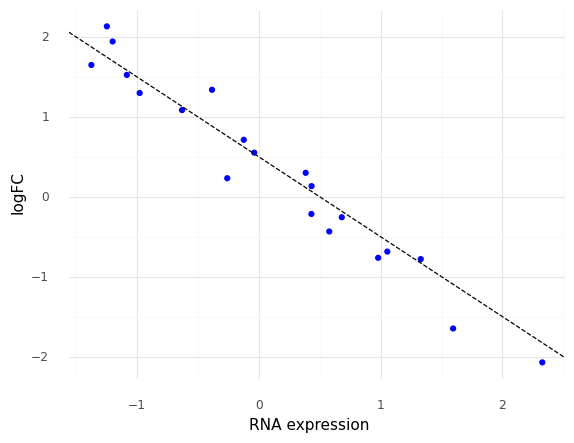
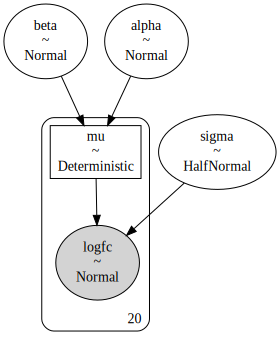
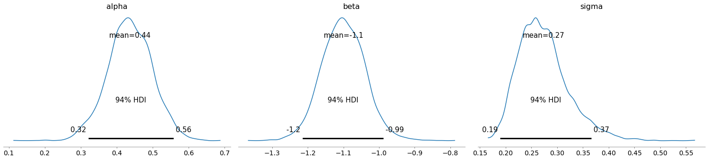
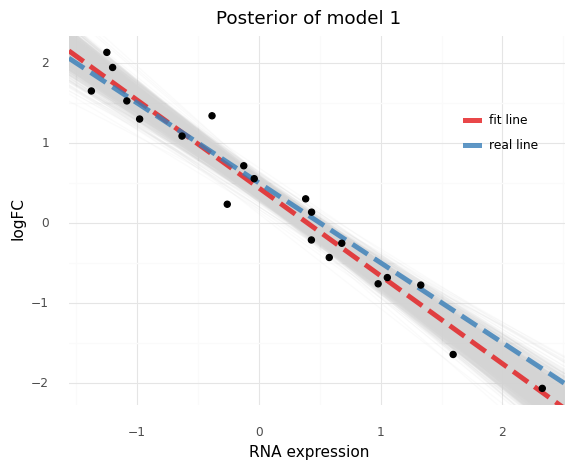

```python
import string
from itertools import product

import arviz as az
import matplotlib.pyplot as plt
import numpy as np
import pandas as pd
import plotnine as gg
import pymc3 as pm
import seaborn as sns
from numpy.random import exponential, normal
```


```python
import warnings

warnings.simplefilter(action="ignore", category=UserWarning)
```


```python
gg.theme_set(gg.theme_minimal())
```


```python
RANDOM_SEED = 103
```

---
## Model 1. Single gene linear model with one covariate

Model the logFC of one gene in multiple cell lines using a single predictor: RNA expression.

$$
logFC \sim Normal(\mu, \sigma) \\
\mu = \alpha + \beta R \\
\alpha \sim \mathcal{N}(0, 10) \\
\beta \sim \mathcal{N}(0, 1) \\
\sigma \sim \text{HalfNormal}(5)
$$

Simulated values:

- number of cell lines: 20
- $\alpha$ = 0.5
- $\beta$ = -1
- $\sigma$ = 0.3


```python
N_CELL_LINES = 20
real_alpha = 0.5
real_beta = -1
real_sigma = 0.3

# Synthetic data
np.random.seed(RANDOM_SEED)
rna = np.random.randn(N_CELL_LINES)
logfc = real_alpha + real_beta * rna + normal(0, real_sigma, N_CELL_LINES)
data = pd.DataFrame({"rna": rna, "logfc": logfc})

(
    gg.ggplot(data, gg.aes("rna", "logfc"))
    + gg.geom_point(color="blue")
    + gg.geom_abline(slope=real_beta, intercept=real_alpha, linetype="--")
    + gg.labs(x="RNA expression", y="logFC")
)
```





    <ggplot: (8742305370609)>


```python
with pm.Model() as model1:
    alpha = pm.Normal("alpha", 0, 10)
    beta = pm.Normal("beta", 0, 1)
    sigma = pm.HalfNormal("sigma", 5)

    mu = pm.Deterministic("mu", alpha + beta * data.rna)

    logfc = pm.Normal("logfc", mu=mu, sigma=sigma, observed=data.logfc)

    model1_prior_check = pm.sample_prior_predictive(random_seed=RANDOM_SEED)
    model1_trace = pm.sample(1000)
    model1_post_check = pm.sample_posterior_predictive(
        model1_trace, random_seed=RANDOM_SEED
    )
```

    Auto-assigning NUTS sampler...
    Initializing NUTS using jitter+adapt_diag...
    Multiprocess sampling (4 chains in 4 jobs)
    NUTS: [sigma, beta, alpha]


<div>
    <style>
        /* Turns off some styling */
        progress {
            /* gets rid of default border in Firefox and Opera. */
            border: none;
            /* Needs to be in here for Safari polyfill so background images work as expected. */
            background-size: auto;
        }
        .progress-bar-interrupted, .progress-bar-interrupted::-webkit-progress-bar {
            background: #F44336;
        }
    </style>
  <progress value='8000' class='' max='8000' style='width:300px; height:20px; vertical-align: middle;'></progress>
  100.00% [8000/8000 00:02<00:00 Sampling 4 chains, 0 divergences]
</div>


    Sampling 4 chains for 1_000 tune and 1_000 draw iterations (4_000 + 4_000 draws total) took 2 seconds.


<div>
    <style>
        /* Turns off some styling */
        progress {
            /* gets rid of default border in Firefox and Opera. */
            border: none;
            /* Needs to be in here for Safari polyfill so background images work as expected. */
            background-size: auto;
        }
        .progress-bar-interrupted, .progress-bar-interrupted::-webkit-progress-bar {
            background: #F44336;
        }
    </style>
  <progress value='4000' class='' max='4000' style='width:300px; height:20px; vertical-align: middle;'></progress>
  100.00% [4000/4000 00:04<00:00]
</div>


```python
pm.model_to_graphviz(model1)
```





```python
az_model1 = az.from_pymc3(
    trace=model1_trace,
    posterior_predictive=model1_post_check,
    prior=model1_prior_check,
    model=model1,
)
```


```python
var_names = ["alpha", "beta", "sigma"]
az.summary(az_model1, var_names=var_names)
```


<div>
<style scoped>
    .dataframe tbody tr th:only-of-type {
        vertical-align: middle;
    }

    .dataframe tbody tr th {
        vertical-align: top;
    }

    .dataframe thead th {
        text-align: right;
    }
</style>
<table border="1" class="dataframe">
  <thead>
    <tr style="text-align: right;">
      <th></th>
      <th>mean</th>
      <th>sd</th>
      <th>hdi_3%</th>
      <th>hdi_97%</th>
      <th>mcse_mean</th>
      <th>mcse_sd</th>
      <th>ess_mean</th>
      <th>ess_sd</th>
      <th>ess_bulk</th>
      <th>ess_tail</th>
      <th>r_hat</th>
    </tr>
  </thead>
  <tbody>
    <tr>
      <th>alpha</th>
      <td>0.436</td>
      <td>0.063</td>
      <td>0.321</td>
      <td>0.557</td>
      <td>0.001</td>
      <td>0.001</td>
      <td>3452.0</td>
      <td>3452.0</td>
      <td>3561.0</td>
      <td>2468.0</td>
      <td>1.0</td>
    </tr>
    <tr>
      <th>beta</th>
      <td>-1.100</td>
      <td>0.061</td>
      <td>-1.215</td>
      <td>-0.988</td>
      <td>0.001</td>
      <td>0.001</td>
      <td>3225.0</td>
      <td>3225.0</td>
      <td>3507.0</td>
      <td>2323.0</td>
      <td>1.0</td>
    </tr>
    <tr>
      <th>sigma</th>
      <td>0.273</td>
      <td>0.049</td>
      <td>0.189</td>
      <td>0.366</td>
      <td>0.001</td>
      <td>0.001</td>
      <td>3197.0</td>
      <td>2958.0</td>
      <td>3419.0</td>
      <td>2789.0</td>
      <td>1.0</td>
    </tr>
  </tbody>
</table>
</div>


```python
az.plot_trace(az_model1, var_names=var_names)
plt.show()
```


```python
az.plot_posterior(az_model1, var_names=var_names)
plt.show()
```





```python
prior_pred = (
    az_model1.prior_predictive.to_dataframe()
    .sample(frac=0.5)
    .assign(pred="prior pred.")
)
post_pred = (
    az_model1.posterior_predictive.to_dataframe()
    .sample(frac=0.2)
    .assign(pred="post pred.")
)
model1_preds = pd.concat([prior_pred, post_pred])
model1_preds["pred"] = pd.Categorical(
    model1_preds.pred, categories=["prior pred.", "post pred."]
)
(
    gg.ggplot(model1_preds, gg.aes("logfc"))
    + gg.facet_wrap("pred", nrow=1, scales="free")
    + gg.geom_density(fill="black", alpha=0.1)
    + gg.geom_vline(xintercept=0, linetype="--")
    + gg.scale_y_continuous(limits=(0, np.nan))
    + gg.labs(
        x="logFC",
        y="density",
        title="Prior and posterior predictive distributions of model 1",
    )
    + gg.theme(figure_size=[12, 6], subplots_adjust={"wspace": 0.25})
)
```


    <ggplot: (8742303034631)>


```python
post = az_model1.posterior.to_dataframe()

post_summary = pd.DataFrame(
    {
        "name": ["real line", "fit line"],
        "slope": [real_beta, post.mean()["beta"]],
        "intercept": [real_alpha, post.mean()["alpha"]],
    }
)

(
    gg.ggplot(post.sample(frac=0.1))
    + gg.geom_abline(
        gg.aes(slope="beta", intercept="alpha"), alpha=0.1, color="lightgrey"
    )
    + gg.geom_abline(
        gg.aes(slope="slope", intercept="intercept", color="name"),
        data=post_summary,
        size=2,
        alpha=0.8,
        linetype="--",
    )
    + gg.geom_point(gg.aes(x="rna", y="logfc"), data=data, color="black", size=2)
    + gg.scale_color_brewer(type="qual", palette="Set1")
    + gg.theme(legend_position=(0.8, 0.7))
    + gg.labs(x="RNA expression", y="logFC", title="Posterior of model 1", color="")
)
```





    <ggplot: (8742302978422)>


### Conclusions and final thoughts

This model fit well and is easy to interpret.
Ready to move onto more complex models with more variables and levels.

---


```python
%load_ext watermark
%watermark -d -u -v -iv -b -h -m
```

    pandas   1.1.3
    numpy    1.19.2
    arviz    0.10.0
    pymc3    3.9.3
    seaborn  0.11.0
    plotnine 0.7.1
    last updated: 2020-10-26

    CPython 3.8.5
    IPython 7.18.1

    compiler   : GCC 7.3.0
    system     : Linux
    release    : 3.10.0-1062.el7.x86_64
    machine    : x86_64
    processor  : x86_64
    CPU cores  : 28
    interpreter: 64bit
    host name  : compute-e-16-237.o2.rc.hms.harvard.edu
    Git branch : models
