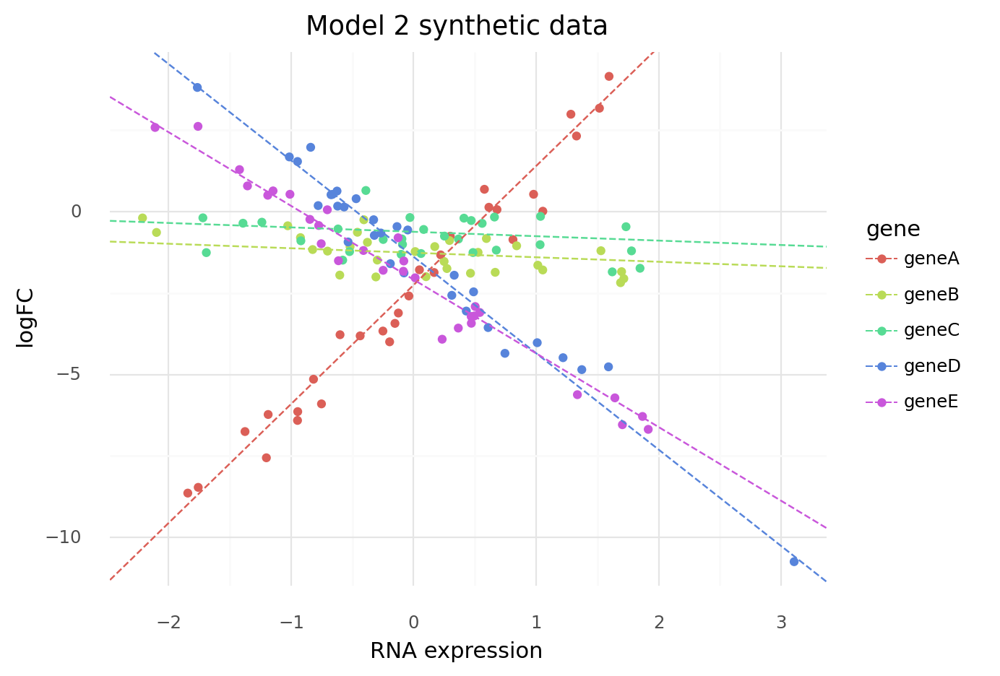
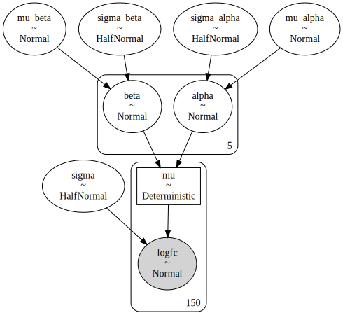
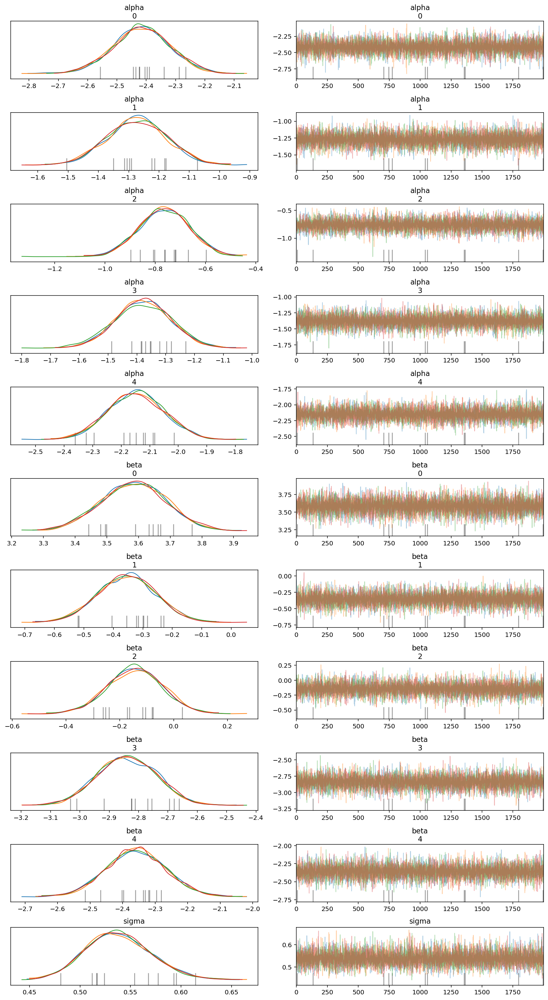
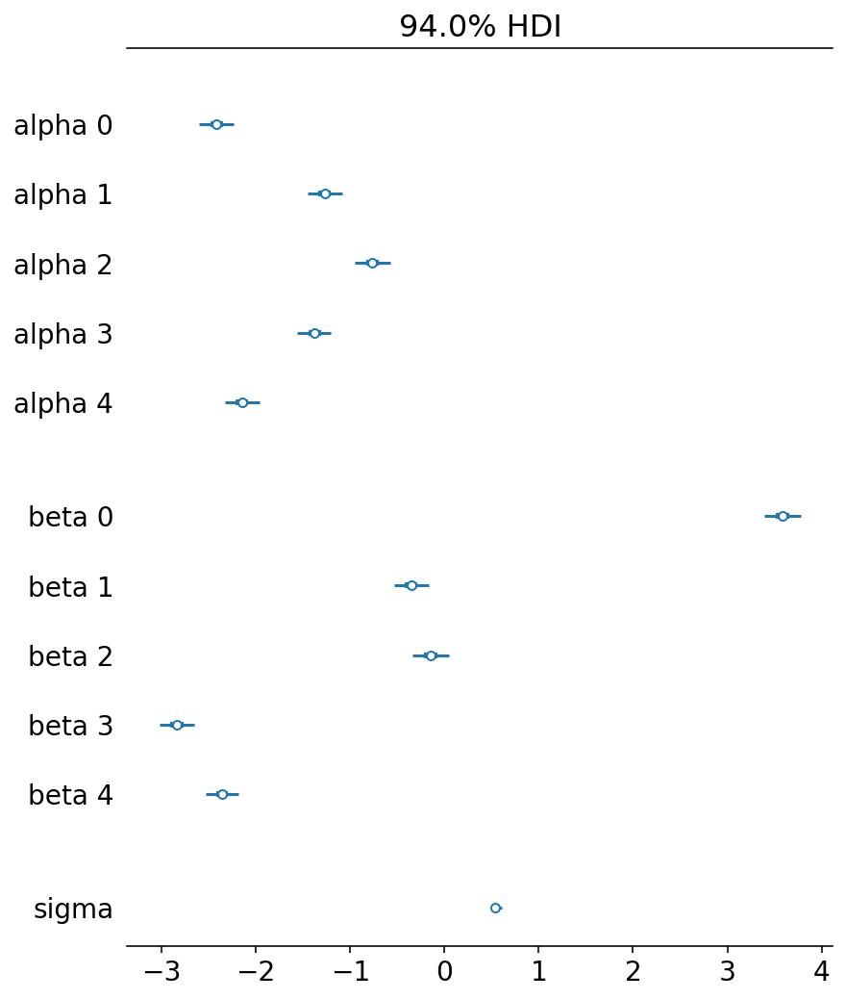
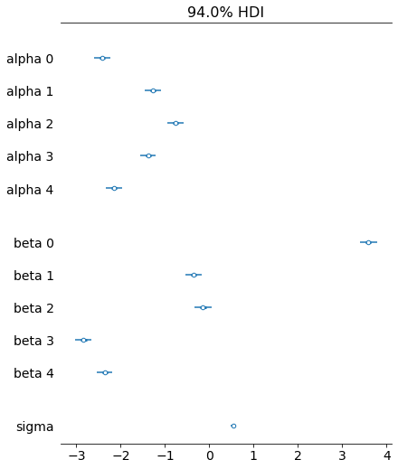

```python
import string
import warnings
from itertools import product
from time import time

import arviz as az
import matplotlib.pyplot as plt
import numpy as np
import pandas as pd
import plotnine as gg
import pymc3 as pm
import seaborn as sns
from numpy.random import exponential, normal

warnings.simplefilter(action="ignore", category=UserWarning)

notebook_tic = time()

gg.theme_set(gg.theme_minimal())
%config InlineBackend.figure_format = 'retina'

RANDOM_SEED = 103
```

---

## Model 2. Multiple genes hierarchical model with one covariate

Model the logFC of multiple genes in multiple cell lines using a single predictor: RNA expression.
A hierarchcial model will be used to pool information across genes.

$
logFC \sim Normal(\mu, \sigma) \\
\mu_g = \alpha_g + \beta_g R \\
\quad \alpha_g \sim \mathcal{N}(\mu_\alpha, \sigma_\alpha) \\
\qquad \mu_\alpha \sim \mathcal{N}(0, 10) \quad \sigma_\alpha \sim \text{HalfNormal}(5) \\
\quad \beta_g \sim \mathcal{N}(\mu_\beta, \sigma_\beta) \\
\qquad \mu_\beta \sim \mathcal{N}(0, 10) \quad \sigma_\beta \sim \text{HalfNormal}(5) \\
\sigma \sim \text{HalfNormal}(5)
$

Simulated values:

- number of cell lines: 30
- number of genes: 5
- $\mu_\alpha = -1$, $\sigma_\alpha = 1$
- $\mu_\beta = -1$, $\sigma_\beta = 2$
- $\sigma = 0.3$

```python
np.random.seed(RANDOM_SEED)

num_cell_lines = 30
num_genes = 5

real_mu_alpha, real_sigma_alpha = -1, 1
real_mu_beta, real_sigma_beta = -1, 2
real_sigma = 0.5

real_alpha = np.random.normal(loc=real_mu_alpha, scale=real_sigma_alpha, size=num_genes)
real_beta = np.random.normal(loc=real_mu_beta, scale=real_sigma_beta, size=num_genes)

genes = ["gene" + a for a in string.ascii_uppercase[:num_genes]]
rna = np.random.randn(num_genes, num_cell_lines)

logfc = (
    real_alpha
    + real_beta * rna.T
    + np.random.normal(loc=0, scale=real_sigma, size=(rna.T.shape))
)
logfc = logfc.T
```

```python
rna_flat = rna.flatten()
logfc_flat = logfc.flatten()
gene_idx = np.repeat(range(num_genes), num_cell_lines)
```

The following plot shows that each gene has a different y-intercept and slope with RNA expression.
These varying effects should be discovered by the model.

```python
tidy_data = pd.DataFrame(
    {"gene": [genes[i] for i in gene_idx], "rna": rna_flat, "logfc": logfc_flat}
)

tidy_real_data = pd.DataFrame({"alpha": real_alpha, "beta": real_beta, "gene": genes})


(
    gg.ggplot(tidy_data)
    + gg.geom_point(gg.aes(x="rna", y="logfc", color="gene"))
    + gg.geom_abline(
        gg.aes(slope="beta", intercept="alpha", color="gene"),
        data=tidy_real_data,
        linetype="--",
    )
    + gg.labs(
        x="RNA expression", y="logFC", color="gene", title="Model 2 synthetic data"
    )
)
```



    <ggplot: (8730080151974)>

```python
with pm.Model() as model2:
    # Hyper-priors
    mu_alpha = pm.Normal("mu_alpha", 0, 5)
    sigma_alpha = pm.HalfNormal("sigma_alpha", 5)
    mu_beta = pm.Normal("mu_beta", 0, 2)
    sigma_beta = pm.HalfNormal("sigma_beta", 2)

    # Priors
    alpha = pm.Normal("alpha", mu_alpha, sigma_alpha, shape=num_genes)
    beta = pm.Normal("beta", mu_beta, sigma_beta, shape=num_genes)
    mu = pm.Deterministic("mu", alpha[gene_idx] + beta[gene_idx] * rna_flat)
    sigma = pm.HalfNormal("sigma", 5)

    # Likelihood
    logfc = pm.Normal("logfc", mu=mu, sigma=sigma, observed=logfc_flat)

    # Sampling
    model2_prior_check = pm.sample_prior_predictive(random_seed=RANDOM_SEED)
    model2_trace = pm.sample(2000, tune=2000, random_seed=RANDOM_SEED)
    model2_post_check = pm.sample_posterior_predictive(
        model2_trace, random_seed=RANDOM_SEED
    )
```

    Auto-assigning NUTS sampler...
    Initializing NUTS using jitter+adapt_diag...
    Multiprocess sampling (4 chains in 4 jobs)
    NUTS: [sigma, beta, alpha, sigma_beta, mu_beta, sigma_alpha, mu_alpha]

<div>
    <style>
        /*Turns off some styling*/
        progress {
            /*gets rid of default border in Firefox and Opera.*/
            border: none;
            /*Needs to be in here for Safari polyfill so background images work as expected.*/
            background-size: auto;
        }
        .progress-bar-interrupted, .progress-bar-interrupted::-webkit-progress-bar {
            background: #F44336;
        }
    </style>
  <progress value='16000' class='' max='16000' style='width:300px; height:20px; vertical-align: middle;'></progress>
  100.00% [16000/16000 00:09<00:00 Sampling 4 chains, 11 divergences]
</div>

    Sampling 4 chains for 2_000 tune and 2_000 draw iterations (8_000 + 8_000 draws total) took 10 seconds.
    There were 5 divergences after tuning. Increase `target_accept` or reparameterize.
    There was 1 divergence after tuning. Increase `target_accept` or reparameterize.
    There were 5 divergences after tuning. Increase `target_accept` or reparameterize.

<div>
    <style>
        /*Turns off some styling*/
        progress {
            /*gets rid of default border in Firefox and Opera.*/
            border: none;
            /*Needs to be in here for Safari polyfill so background images work as expected.*/
            background-size: auto;
        }
        .progress-bar-interrupted, .progress-bar-interrupted::-webkit-progress-bar {
            background: #F44336;
        }
    </style>
  <progress value='8000' class='' max='8000' style='width:300px; height:20px; vertical-align: middle;'></progress>
  100.00% [8000/8000 00:10<00:00]
</div>

```python
pm.model_to_graphviz(model2)
```



```python
az_model2 = az.from_pymc3(
    trace=model2_trace,
    prior=model2_prior_check,
    posterior_predictive=model2_post_check,
    model=model2,
)
az.summary(az_model2, var_names=["alpha", "beta", "sigma"])
```

<div>
<style scoped>
    .dataframe tbody tr th:only-of-type {
        vertical-align: middle;
    }

    .dataframe tbody tr th {
        vertical-align: top;
    }

    .dataframe thead th {
        text-align: right;
    }
</style>
<table border="1" class="dataframe">
  <thead>
    <tr style="text-align: right;">
      <th></th>
      <th>mean</th>
      <th>sd</th>
      <th>hdi_3%</th>
      <th>hdi_97%</th>
      <th>mcse_mean</th>
      <th>mcse_sd</th>
      <th>ess_mean</th>
      <th>ess_sd</th>
      <th>ess_bulk</th>
      <th>ess_tail</th>
      <th>r_hat</th>
    </tr>
  </thead>
  <tbody>
    <tr>
      <th>alpha[0]</th>
      <td>-2.416</td>
      <td>0.098</td>
      <td>-2.601</td>
      <td>-2.232</td>
      <td>0.001</td>
      <td>0.001</td>
      <td>14337.0</td>
      <td>14337.0</td>
      <td>14303.0</td>
      <td>5579.0</td>
      <td>1.0</td>
    </tr>
    <tr>
      <th>alpha[1]</th>
      <td>-1.272</td>
      <td>0.099</td>
      <td>-1.450</td>
      <td>-1.084</td>
      <td>0.001</td>
      <td>0.001</td>
      <td>13215.0</td>
      <td>13130.0</td>
      <td>13190.0</td>
      <td>6015.0</td>
      <td>1.0</td>
    </tr>
    <tr>
      <th>alpha[2]</th>
      <td>-0.763</td>
      <td>0.100</td>
      <td>-0.949</td>
      <td>-0.575</td>
      <td>0.001</td>
      <td>0.001</td>
      <td>12696.0</td>
      <td>12280.0</td>
      <td>12649.0</td>
      <td>5904.0</td>
      <td>1.0</td>
    </tr>
    <tr>
      <th>alpha[3]</th>
      <td>-1.378</td>
      <td>0.097</td>
      <td>-1.564</td>
      <td>-1.202</td>
      <td>0.001</td>
      <td>0.001</td>
      <td>14732.0</td>
      <td>14579.0</td>
      <td>14710.0</td>
      <td>5790.0</td>
      <td>1.0</td>
    </tr>
    <tr>
      <th>alpha[4]</th>
      <td>-2.148</td>
      <td>0.098</td>
      <td>-2.326</td>
      <td>-1.961</td>
      <td>0.001</td>
      <td>0.001</td>
      <td>12961.0</td>
      <td>12961.0</td>
      <td>12946.0</td>
      <td>5307.0</td>
      <td>1.0</td>
    </tr>
    <tr>
      <th>beta[0]</th>
      <td>3.585</td>
      <td>0.103</td>
      <td>3.394</td>
      <td>3.780</td>
      <td>0.001</td>
      <td>0.001</td>
      <td>14890.0</td>
      <td>14890.0</td>
      <td>14914.0</td>
      <td>6262.0</td>
      <td>1.0</td>
    </tr>
    <tr>
      <th>beta[1]</th>
      <td>-0.354</td>
      <td>0.098</td>
      <td>-0.536</td>
      <td>-0.167</td>
      <td>0.001</td>
      <td>0.001</td>
      <td>14280.0</td>
      <td>12995.0</td>
      <td>14336.0</td>
      <td>6428.0</td>
      <td>1.0</td>
    </tr>
    <tr>
      <th>beta[2]</th>
      <td>-0.144</td>
      <td>0.103</td>
      <td>-0.336</td>
      <td>0.051</td>
      <td>0.001</td>
      <td>0.001</td>
      <td>14533.0</td>
      <td>8631.0</td>
      <td>14544.0</td>
      <td>5872.0</td>
      <td>1.0</td>
    </tr>
    <tr>
      <th>beta[3]</th>
      <td>-2.839</td>
      <td>0.100</td>
      <td>-3.024</td>
      <td>-2.653</td>
      <td>0.001</td>
      <td>0.001</td>
      <td>12500.0</td>
      <td>12493.0</td>
      <td>12516.0</td>
      <td>6081.0</td>
      <td>1.0</td>
    </tr>
    <tr>
      <th>beta[4]</th>
      <td>-2.359</td>
      <td>0.093</td>
      <td>-2.530</td>
      <td>-2.183</td>
      <td>0.001</td>
      <td>0.001</td>
      <td>13775.0</td>
      <td>13775.0</td>
      <td>13772.0</td>
      <td>5490.0</td>
      <td>1.0</td>
    </tr>
    <tr>
      <th>sigma</th>
      <td>0.538</td>
      <td>0.033</td>
      <td>0.483</td>
      <td>0.605</td>
      <td>0.000</td>
      <td>0.000</td>
      <td>11914.0</td>
      <td>11728.0</td>
      <td>12021.0</td>
      <td>5971.0</td>
      <td>1.0</td>
    </tr>
  </tbody>
</table>
</div>

```python
# Real values
pd.DataFrame({"real alpha": real_alpha, "real beta": real_beta})
```

<div>
<style scoped>
    .dataframe tbody tr th:only-of-type {
        vertical-align: middle;
    }

    .dataframe tbody tr th {
        vertical-align: top;
    }

    .dataframe thead th {
        text-align: right;
    }
</style>
<table border="1" class="dataframe">
  <thead>
    <tr style="text-align: right;">
      <th></th>
      <th>real alpha</th>
      <th>real beta</th>
    </tr>
  </thead>
  <tbody>
    <tr>
      <th>0</th>
      <td>-2.249278</td>
      <td>3.654438</td>
    </tr>
    <tr>
      <th>1</th>
      <td>-1.260331</td>
      <td>-0.138414</td>
    </tr>
    <tr>
      <th>2</th>
      <td>-0.616207</td>
      <td>-0.135368</td>
    </tr>
    <tr>
      <th>3</th>
      <td>-1.385461</td>
      <td>-2.960023</td>
    </tr>
    <tr>
      <th>4</th>
      <td>-2.085137</td>
      <td>-2.263930</td>
    </tr>
  </tbody>
</table>
</div>

```python
var_names = ["alpha", "beta", "sigma"]
az.plot_trace(az_model2, var_names=var_names)
plt.show()
```



The varying effects were captured *very* well.

```python
az.plot_forest(az_model2, var_names=var_names, combined=True)
plt.show()
```



```python
post = (
    az_model2.posterior.to_dataframe()
    .query("alpha_dim_0 == beta_dim_0")
    .reset_index()
    .groupby(["alpha_dim_0", "beta_dim_0"])
    .apply(lambda x: x.sample(frac=0.1))
    .reset_index(drop=True)
)
```

```python
post.head()
```

<div>
<style scoped>
    .dataframe tbody tr th:only-of-type {
        vertical-align: middle;
    }

    .dataframe tbody tr th {
        vertical-align: top;
    }

    .dataframe thead th {
        text-align: right;
    }
</style>
<table border="1" class="dataframe">
  <thead>
    <tr style="text-align: right;">
      <th></th>
      <th>alpha_dim_0</th>
      <th>beta_dim_0</th>
      <th>chain</th>
      <th>draw</th>
      <th>mu_dim_0</th>
      <th>mu_alpha</th>
      <th>mu_beta</th>
      <th>alpha</th>
      <th>beta</th>
      <th>sigma_alpha</th>
      <th>sigma_beta</th>
      <th>mu</th>
      <th>sigma</th>
    </tr>
  </thead>
  <tbody>
    <tr>
      <th>0</th>
      <td>0</td>
      <td>0</td>
      <td>0</td>
      <td>1848</td>
      <td>13</td>
      <td>-1.707124</td>
      <td>1.020120</td>
      <td>-2.519896</td>
      <td>3.444709</td>
      <td>0.611066</td>
      <td>2.459867</td>
      <td>2.703516</td>
      <td>0.535601</td>
    </tr>
    <tr>
      <th>1</th>
      <td>0</td>
      <td>0</td>
      <td>1</td>
      <td>416</td>
      <td>68</td>
      <td>-1.817120</td>
      <td>-0.059203</td>
      <td>-2.508976</td>
      <td>3.610907</td>
      <td>0.912548</td>
      <td>2.030147</td>
      <td>-0.713922</td>
      <td>0.468053</td>
    </tr>
    <tr>
      <th>2</th>
      <td>0</td>
      <td>0</td>
      <td>1</td>
      <td>749</td>
      <td>55</td>
      <td>-1.998970</td>
      <td>-1.028616</td>
      <td>-2.469391</td>
      <td>3.367253</td>
      <td>0.596512</td>
      <td>2.348285</td>
      <td>-1.320811</td>
      <td>0.613881</td>
    </tr>
    <tr>
      <th>3</th>
      <td>0</td>
      <td>0</td>
      <td>2</td>
      <td>702</td>
      <td>80</td>
      <td>-2.276971</td>
      <td>-1.240895</td>
      <td>-2.207284</td>
      <td>3.553626</td>
      <td>0.688711</td>
      <td>2.218307</td>
      <td>-0.889368</td>
      <td>0.541003</td>
    </tr>
    <tr>
      <th>4</th>
      <td>0</td>
      <td>0</td>
      <td>2</td>
      <td>1510</td>
      <td>143</td>
      <td>-3.419487</td>
      <td>-0.641618</td>
      <td>-2.376427</td>
      <td>3.464837</td>
      <td>1.510821</td>
      <td>2.359916</td>
      <td>0.303088</td>
      <td>0.514731</td>
    </tr>
  </tbody>
</table>
</div>

```python
post["gene"] = [genes[i] for i in post.alpha_dim_0]

(
    gg.ggplot(post)
    + gg.geom_abline(gg.aes(slope="beta", intercept="alpha", color="gene"), alpha=0.01)
    + gg.geom_point(gg.aes(x="rna", y="logfc", color="gene"), data=tidy_data, size=2)
    + gg.geom_abline(
        gg.aes(slope="beta", intercept="alpha", color="gene"),
        data=tidy_real_data,
        linetype="--",
        size=2,
    )
    + gg.labs(
        x="RNA expression", y="logFC", color="gene", title="Model 2 synthetic data"
    )
)
```



    <ggplot: (8730079422937)>

### Conclusions and final thoughts

This hierharchcial model fit very well and the results were interpretable.

---

```python
notebook_toc = time()
print(f"execution time: {(notebook_toc - notebook_tic) / 60:.2f} minutes")
```

    execution time: 1.22 minutes

```python
%load_ext watermark
%watermark -d -u -v -iv -b -h -m
```

    arviz    0.10.0
    numpy    1.19.2
    pandas   1.1.3
    plotnine 0.7.1
    seaborn  0.11.0
    pymc3    3.9.3
    last updated: 2020-12-17 
    
    CPython 3.8.5
    IPython 7.18.1
    
    compiler   : GCC 7.3.0
    system     : Linux
    release    : 3.10.0-1062.el7.x86_64
    machine    : x86_64
    processor  : x86_64
    CPU cores  : 32
    interpreter: 64bit
    host name  : compute-a-16-78.o2.rc.hms.harvard.edu
    Git branch : subset-data
