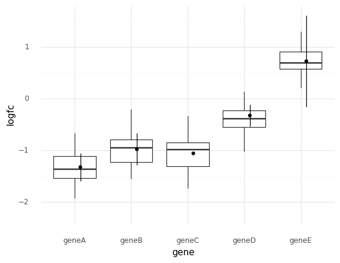
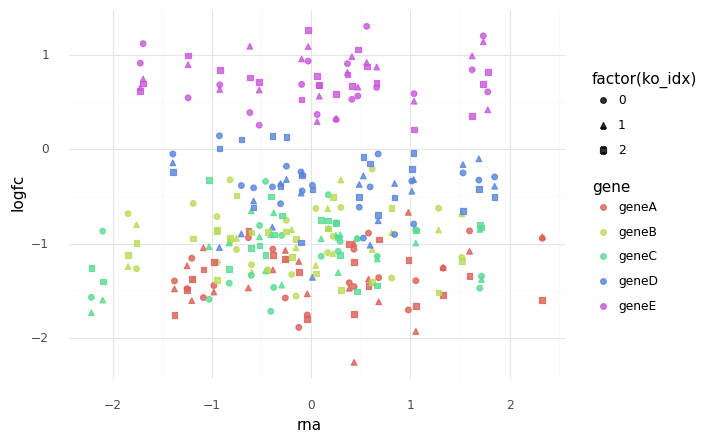

```python
import string
from itertools import product

import arviz as az
import matplotlib.pyplot as plt
import numpy as np
import pandas as pd
import plotnine as gg
import pymc3 as pm
import seaborn as sns
from numpy.random import exponential, normal
```

```python
import warnings

warnings.simplefilter(action="ignore", category=UserWarning)
```

```python
gg.theme_set(gg.theme_minimal())
```

```python
RANDOM_SEED = 103
```

---

## Model 3. Multiple logFC readings per gene per cell line and only one RNA expression reading

Model the logFC of multiple genes in multiple cell lines using a single predictor: RNA expression.
There are multiple logFC readings per gene per cell line, but only one RNA expression reading.
(For now) there is only one varying effect for gene.

$
logFC_g \sim \mathcal{N}(\mu_g, \sigma) \\
\quad \mu_g = \alpha_g \\
\qquad \alpha_g \sim \mathcal{N}(\mu_{\alpha_g}, \sigma_{\alpha_g}) \\
\qquad \quad \mu_{\alpha_g} = \gamma_g + \delta_g R \\
\qquad \qquad \gamma_g \sim \mathcal{N}(\mu_\gamma, \sigma_\gamma) \\
\qquad \qquad \quad \mu_\gamma \sim \mathcal{N}(0,5) \quad \sigma_\gamma \sim \text{Exp}(1) \\
\qquad \qquad \delta_g \sim \mathcal{N}(\mu_\delta, \sigma_\delta) \\
\qquad \qquad \quad \mu_\delta \sim \mathcal{N}(0,5) \quad \sigma_\delta \sim \text{Exp}(1) \\
\qquad \quad \sigma_{\alpha_g} \sim \text{Exp}(\sigma_g) \\
\qquad \qquad \sigma_g \sim \text{Exp}(1) \\
\quad \sigma \sim \text{Exp}(1)
$

Simulated real values:

- number of cell lines: 30
- number of logFC data points per gene per cell line: 3
- number of genes: 5
- $\mu_\gamma = -1$
- $\sigma_\gamma = 0.4$
- $\mu_\delta = 0$
- $\sigma_\delta = 1$
- $\sigma_g = 0.4$
- $\sigma = 0.3$

```python
np.random.seed(RANDOM_SEED)

# Synthetic data parmeters
num_cell_lines = 20
num_logfc_datum = 3
num_genes = 5

# Real hyper-parameter values
real_mu_gamma = -1
real_sigma_gamma = 0.4
real_mu_delta = 0
real_sigma_delta = 1
real_sigma_g = 0.4
real_sigma = 0.3


genes = ["gene" + a for a in string.ascii_uppercase[:num_genes]]
gene_idx = list(range(num_genes))

cell_lines = ["cell" + a for a in string.ascii_uppercase[:num_cell_lines]]
cell_line_idx = list(range(num_cell_lines))

# RNA expression data (scaled within each gene)
rna = np.random.normal(loc=0, scale=1, size=(num_genes, num_cell_lines))
rna_data = pd.DataFrame(list(product(genes, cell_lines)), columns=["gene", "cell_line"])
rna_data["rna"] = rna.flatten()

for c in ["gene", "cell_line"]:
    rna_data[c] = pd.Categorical(rna_data[c])


real_gamma_g = np.random.normal(real_mu_gamma, real_sigma_gamma, (num_genes, 1))
real_delta_g = np.random.normal(real_mu_delta, real_sigma_delta, (num_genes, 1))
real_mu_alpha = (real_gamma_g + rna * real_delta_g).mean(axis=1)
real_sigma_alpha = np.random.exponential(real_sigma_g, num_genes)

real_alpha_g = np.random.normal(real_mu_alpha, real_sigma_alpha)
real_mu_g = real_alpha_g

ko_idx = list(range(num_logfc_datum))
logfc_data = pd.DataFrame(
    list(product(ko_idx, genes, cell_lines)), columns=["ko_idx", "gene", "cell_line"]
)

for c in ["gene", "cell_line"]:
    logfc_data[c] = pd.Categorical(logfc_data[c])


logfc_data["logfc"] = np.nan
for i in range(len(logfc_data)):
    g = logfc_data["gene"].cat.codes[i]
    logfc_data.loc[i, "logfc"] = np.random.normal(real_mu_g[g], real_sigma)

logfc_data
```

<div>
<style scoped>
    .dataframe tbody tr th:only-of-type {
        vertical-align: middle;
    }

    .dataframe tbody tr th {
        vertical-align: top;
    }

    .dataframe thead th {
        text-align: right;
    }
</style>
<table border="1" class="dataframe">
  <thead>
    <tr style="text-align: right;">
      <th></th>
      <th>ko_idx</th>
      <th>gene</th>
      <th>cell_line</th>
      <th>logfc</th>
    </tr>
  </thead>
  <tbody>
    <tr>
      <th>0</th>
      <td>0</td>
      <td>geneA</td>
      <td>cellA</td>
      <td>-1.475160</td>
    </tr>
    <tr>
      <th>1</th>
      <td>0</td>
      <td>geneA</td>
      <td>cellB</td>
      <td>-1.574389</td>
    </tr>
    <tr>
      <th>2</th>
      <td>0</td>
      <td>geneA</td>
      <td>cellC</td>
      <td>-1.413401</td>
    </tr>
    <tr>
      <th>3</th>
      <td>0</td>
      <td>geneA</td>
      <td>cellD</td>
      <td>-1.057404</td>
    </tr>
    <tr>
      <th>4</th>
      <td>0</td>
      <td>geneA</td>
      <td>cellE</td>
      <td>-1.570743</td>
    </tr>
    <tr>
      <th>...</th>
      <td>...</td>
      <td>...</td>
      <td>...</td>
      <td>...</td>
    </tr>
    <tr>
      <th>295</th>
      <td>2</td>
      <td>geneE</td>
      <td>cellP</td>
      <td>0.758133</td>
    </tr>
    <tr>
      <th>296</th>
      <td>2</td>
      <td>geneE</td>
      <td>cellQ</td>
      <td>0.352038</td>
    </tr>
    <tr>
      <th>297</th>
      <td>2</td>
      <td>geneE</td>
      <td>cellR</td>
      <td>0.583303</td>
    </tr>
    <tr>
      <th>298</th>
      <td>2</td>
      <td>geneE</td>
      <td>cellS</td>
      <td>0.818320</td>
    </tr>
    <tr>
      <th>299</th>
      <td>2</td>
      <td>geneE</td>
      <td>cellT</td>
      <td>0.686769</td>
    </tr>
  </tbody>
</table>
<p>300 rows × 4 columns</p>
</div>

```python
known_logfc_values_df = pd.DataFrame(
    {"gene": genes, "logfc": real_alpha_g, "sd": real_sigma_alpha}
)
known_logfc_values_df["lower_err"] = (
    known_logfc_values_df["logfc"] - known_logfc_values_df["sd"]
)
known_logfc_values_df["upper_err"] = (
    known_logfc_values_df["logfc"] + known_logfc_values_df["sd"]
)

pos = gg.position_nudge(x=0.1)

(
    gg.ggplot(logfc_data, gg.aes(x="gene", y="logfc"))
    + gg.geom_boxplot(outlier_color="")
    + gg.geom_linerange(
        gg.aes(ymin="lower_err", ymax="upper_err"),
        data=known_logfc_values_df,
        position=pos,
    )
    + gg.geom_point(data=known_logfc_values_df, position=pos)
)
```



    <ggplot: (8737775755237)>

```python
merged_data = pd.merge(logfc_data, rna_data, how="inner", on=["gene", "cell_line"])

(
    gg.ggplot(merged_data, gg.aes(x="rna", y="logfc", color="gene"))
    + gg.geom_point(gg.aes(shape="factor(ko_idx)"), alpha=0.8, size=1.8)
)
```



    <ggplot: (8737725598501)>

### Conclusions and final thoughts

This was an incorrect understanding of how to use a predictor variable in a higher level of the model.
Though it is not the right model the purposes of this project, I'll leave it here as an example.

---

```python
%load_ext watermark
%watermark -d -u -v -iv -b -h -m
```

    seaborn  0.11.0
    numpy    1.19.2
    pandas   1.1.3
    pymc3    3.9.3
    arviz    0.10.0
    plotnine 0.7.1
    last updated: 2020-10-26

    CPython 3.8.5
    IPython 7.18.1

    compiler   : GCC 7.3.0
    system     : Linux
    release    : 3.10.0-1062.el7.x86_64
    machine    : x86_64
    processor  : x86_64
    CPU cores  : 28
    interpreter: 64bit
    host name  : compute-e-16-237.o2.rc.hms.harvard.edu
    Git branch : models
