# Modeling DepMap data


```python
import pandas as pd
import numpy as np
import plotnine as gg
import pymc3 as pm
import arviz as az
import seaborn as sns
import matplotlib.pyplot as plt
import string
from itertools import product
from numpy.random import normal, exponential
```


```python
gg.theme_set(gg.theme_minimal(base_family="Arial"))
```


```python
RANDOM_SEED = 103
```

## Model 1. Single gene linear model with one covariate

Model the logFC of one gene in multiple cell lines using a single predictor: RNA expression.

$$
logFC \sim Normal(\mu, \sigma) \\
\mu = \alpha + \beta R \\
\alpha \sim \mathcal{N}(0, 10) \\
\beta \sim \mathcal{N}(0, 1) \\
\sigma \sim \text{HalfNormal}(5)
$$

Simulated values:

- number of cell lines: 20
- $\alpha$ = 0.5
- $\beta$ = -1
- $\sigma$ = 0.3


```python
N_CELL_LINES = 20
real_alpha = 0.5
real_beta = -1
real_sigma = 0.3

# Synthetic data
np.random.seed(RANDOM_SEED)
rna = np.random.randn(N_CELL_LINES)
logfc = real_alpha + real_beta * rna + np.random.normal(0, real_sigma, N_CELL_LINES)
data = pd.DataFrame({"rna": rna, "logfc": logfc})

(
    gg.ggplot(data, gg.aes("rna", "logfc"))
    + gg.geom_point(color="blue")
    + gg.geom_abline(slope=real_beta, intercept=real_alpha, linetype="--")
    + gg.labs(x="RNA expression", y="logFC")
)
```


    

    


    <ggplot: (8779171034873)>


```python
with pm.Model() as model1:
    alpha = pm.Normal("alpha", 0, 10)
    beta = pm.Normal("beta", 0, 1)
    sigma = pm.HalfNormal("sigma", 5)

    mu = pm.Deterministic("mu", alpha + beta * data.rna)

    logfc = pm.Normal("logfc", mu=mu, sigma=sigma, observed=data.logfc)

    model1_prior_check = pm.sample_prior_predictive(random_seed=RANDOM_SEED)
    model1_trace = pm.sample(1000)
    model1_post_check = pm.sample_posterior_predictive(
        model1_trace, random_seed=RANDOM_SEED
    )
```

    Auto-assigning NUTS sampler...
    Initializing NUTS using jitter+adapt_diag...
    Multiprocess sampling (2 chains in 2 jobs)
    NUTS: [sigma, beta, alpha]
    Sampling 2 chains, 0 divergences: 100%|██████████| 3000/3000 [00:01<00:00, 1618.76draws/s]
    100%|██████████| 2000/2000 [00:03<00:00, 635.46it/s]


```python
pm.model_to_graphviz(model1)
```


    

    


```python
az_model1 = az.from_pymc3(
    model1_trace, posterior_predictive=model1_post_check, prior=model1_prior_check
)
```


```python
var_names = ["alpha", "beta", "sigma"]
az.summary(az_model1, var_names=var_names)
```


<div>
<style scoped>
    .dataframe tbody tr th:only-of-type {
        vertical-align: middle;
    }

    .dataframe tbody tr th {
        vertical-align: top;
    }

    .dataframe thead th {
        text-align: right;
    }
</style>
<table border="1" class="dataframe">
  <thead>
    <tr style="text-align: right;">
      <th></th>
      <th>mean</th>
      <th>sd</th>
      <th>hpd_3%</th>
      <th>hpd_97%</th>
      <th>mcse_mean</th>
      <th>mcse_sd</th>
      <th>ess_mean</th>
      <th>ess_sd</th>
      <th>ess_bulk</th>
      <th>ess_tail</th>
      <th>r_hat</th>
    </tr>
  </thead>
  <tbody>
    <tr>
      <th>alpha</th>
      <td>0.439</td>
      <td>0.067</td>
      <td>0.304</td>
      <td>0.552</td>
      <td>0.002</td>
      <td>0.001</td>
      <td>1935.0</td>
      <td>1923.0</td>
      <td>1937.0</td>
      <td>1369.0</td>
      <td>1.0</td>
    </tr>
    <tr>
      <th>beta</th>
      <td>-1.105</td>
      <td>0.062</td>
      <td>-1.213</td>
      <td>-0.980</td>
      <td>0.001</td>
      <td>0.001</td>
      <td>1760.0</td>
      <td>1760.0</td>
      <td>1762.0</td>
      <td>1376.0</td>
      <td>1.0</td>
    </tr>
    <tr>
      <th>sigma</th>
      <td>0.277</td>
      <td>0.052</td>
      <td>0.190</td>
      <td>0.376</td>
      <td>0.001</td>
      <td>0.001</td>
      <td>1774.0</td>
      <td>1709.0</td>
      <td>1837.0</td>
      <td>1317.0</td>
      <td>1.0</td>
    </tr>
  </tbody>
</table>
</div>


```python
az.plot_trace(az_model1, var_names=var_names)
plt.show()
```

    /usr/local/Caskroom/miniconda/base/envs/speclet/lib/python3.7/site-packages/arviz/plots/backends/matplotlib/distplot.py:38: UserWarning: Argument backend_kwargs has not effect in matplotlib.plot_distSupplied value won't be used
    /usr/local/Caskroom/miniconda/base/envs/speclet/lib/python3.7/site-packages/arviz/plots/backends/matplotlib/distplot.py:38: UserWarning: Argument backend_kwargs has not effect in matplotlib.plot_distSupplied value won't be used
    /usr/local/Caskroom/miniconda/base/envs/speclet/lib/python3.7/site-packages/arviz/plots/backends/matplotlib/distplot.py:38: UserWarning: Argument backend_kwargs has not effect in matplotlib.plot_distSupplied value won't be used
    /usr/local/Caskroom/miniconda/base/envs/speclet/lib/python3.7/site-packages/arviz/plots/backends/matplotlib/distplot.py:38: UserWarning: Argument backend_kwargs has not effect in matplotlib.plot_distSupplied value won't be used
    /usr/local/Caskroom/miniconda/base/envs/speclet/lib/python3.7/site-packages/arviz/plots/backends/matplotlib/distplot.py:38: UserWarning: Argument backend_kwargs has not effect in matplotlib.plot_distSupplied value won't be used
    /usr/local/Caskroom/miniconda/base/envs/speclet/lib/python3.7/site-packages/arviz/plots/backends/matplotlib/distplot.py:38: UserWarning: Argument backend_kwargs has not effect in matplotlib.plot_distSupplied value won't be used


    

    


```python
az.plot_posterior(az_model1, var_names=var_names)
plt.show()
```


    

    


```python
prior_pred = (
    az_model1.prior_predictive.to_dataframe()
    .sample(frac=0.5)
    .assign(pred="prior pred.")
)
post_pred = (
    az_model1.posterior_predictive.to_dataframe()
    .sample(frac=0.2)
    .assign(pred="post pred.")
)
model1_preds = pd.concat([prior_pred, post_pred])
model1_preds["pred"] = pd.Categorical(
    model1_preds.pred, categories=["prior pred.", "post pred."]
)
(
    gg.ggplot(model1_preds, gg.aes("logfc"))
    + gg.facet_wrap("pred", nrow=1, scales="free")
    + gg.geom_density(fill="black", alpha=0.1)
    + gg.geom_vline(xintercept=0, linetype="--")
    + gg.scale_y_continuous(limits=(0, np.nan))
    + gg.labs(
        x="logFC",
        y="density",
        title="Prior and posterior predictive distributions of model 1",
    )
    + gg.theme(figure_size=[12, 6], subplots_adjust={"wspace": 0.25})
)
```


    

    


    <ggplot: (8779174061189)>


```python
post = az_model1.posterior.to_dataframe()

post_summary = pd.DataFrame(
    {
        "name": ["real line", "fit line"],
        "slope": [real_beta, post.mean()["beta"]],
        "intercept": [real_alpha, post.mean()["alpha"]],
    }
)

(
    gg.ggplot(post.sample(frac=0.1))
    + gg.geom_abline(
        gg.aes(slope="beta", intercept="alpha"), alpha=0.1, color="lightgrey"
    )
    + gg.geom_abline(
        gg.aes(slope="slope", intercept="intercept", color="name"),
        data=post_summary,
        size=2,
        alpha=0.8,
        linetype="--",
    )
    + gg.geom_point(gg.aes(x="rna", y="logfc"), data=data, color="black", size=2)
    + gg.scale_color_brewer(type="qual", palette="Set1")
    + gg.theme(legend_position=(0.8, 0.7))
    + gg.labs(x="RNA expression", y="logFC", title="Posterior of model 1", color="")
)
```


    

    


    <ggplot: (8779173590809)>


---

## Model 2. Multiple genes hierarchical model with one covariate

Model the logFC of multiple genes in multiple cell lines using a single predictor: RNA expression.
A hierarchcial model will be used to pool information across genes.

$$
logFC \sim Normal(\mu, \sigma) \\
\mu_g = \alpha_g + \beta_g R \\
\alpha_g \sim \mathcal{N}(\mu_\alpha, \sigma_\alpha) \\
\mu_\alpha \sim \mathcal{N}(0, 10) \qquad \sigma_\alpha \sim \text{HalfNormal}(5) \\
\beta_g \sim \mathcal{N}(\mu_\beta, \sigma_\beta) \\
\mu_\beta \sim \mathcal{N}(0, 10) \qquad \sigma_\beta \sim \text{HalfNormal}(5) \\
\sigma \sim \text{HalfNormal}(5)
$$

Simulated values:

- number of cell lines: 30
- number of genes: 5
- $\mu_\alpha$ = -1, $\sigma_\alpha$ = 1
- $\mu_\beta$ = -1, $\sigma_\beta$ = 2
- $\sigma$ = 0.3


```python
np.random.seed(RANDOM_SEED)

num_cell_lines = 30
num_genes = 5

real_mu_alpha, real_sigma_alpha = -1, 1
real_mu_beta, real_sigma_beta = -1, 2
real_sigma = 0.5

real_alpha = np.random.normal(loc=real_mu_alpha, scale=real_sigma_alpha, size=num_genes)
real_beta = np.random.normal(loc=real_mu_beta, scale=real_sigma_beta, size=num_genes)

genes = ["gene" + a for a in string.ascii_uppercase[:num_genes]]
rna = np.random.randn(num_genes, num_cell_lines)

logfc = (
    real_alpha
    + real_beta * rna.T
    + np.random.normal(loc=0, scale=real_sigma, size=(rna.T.shape))
)
logfc = logfc.T
```


```python
rna_flat = rna.flatten()
logfc_flat = logfc.flatten()
gene_idx = np.repeat(range(num_genes), num_cell_lines)
```


```python
tidy_data = pd.DataFrame(
    {"gene": [genes[i] for i in gene_idx], "rna": rna_flat, "logfc": logfc_flat}
)

tidy_real_data = pd.DataFrame({"alpha": real_alpha, "beta": real_beta, "gene": genes})


(
    gg.ggplot(tidy_data)
    + gg.geom_point(gg.aes(x="rna", y="logfc", color="gene"))
    + gg.geom_abline(
        gg.aes(slope="beta", intercept="alpha", color="gene"),
        data=tidy_real_data,
        linetype="--",
    )
    + gg.labs(
        x="RNA expression", y="logFC", color="gene", title="Model 2 synthetic data"
    )
)
```


    

    


    <ggplot: (8779009650193)>


```python
with pm.Model() as model2:
    # Hyper-priors
    mu_alpha = pm.Normal("mu_alpha", 0, 5)
    sigma_alpha = pm.HalfNormal("sigma_alpha", 5)
    mu_beta = pm.Normal("mu_beta", 0, 2)
    sigma_beta = pm.HalfNormal("sigma_beta", 2)

    # Priors
    alpha = pm.Normal("alpha", mu_alpha, sigma_alpha, shape=num_genes)
    beta = pm.Normal("beta", mu_beta, sigma_beta, shape=num_genes)
    mu = pm.Deterministic("mu", alpha[gene_idx] + beta[gene_idx] * rna_flat)
    sigma = pm.HalfNormal("sigma", 5)

    # Likelihood
    logfc = pm.Normal("logfc", mu=mu, sigma=sigma, observed=logfc_flat)

    # Sampling
    model2_prior_check = pm.sample_prior_predictive(random_seed=RANDOM_SEED)
    model2_trace = pm.sample(2000, tune=2000)
    model2_post_check = pm.sample_posterior_predictive(
        model2_trace, random_seed=RANDOM_SEED
    )
```

    Auto-assigning NUTS sampler...
    Initializing NUTS using jitter+adapt_diag...
    Multiprocess sampling (2 chains in 2 jobs)
    NUTS: [sigma, beta, alpha, sigma_beta, mu_beta, sigma_alpha, mu_alpha]
    Sampling 2 chains, 2 divergences: 100%|██████████| 8000/8000 [00:11<00:00, 725.96draws/s]
    There were 2 divergences after tuning. Increase `target_accept` or reparameterize.
    100%|██████████| 4000/4000 [00:05<00:00, 776.01it/s]


```python
pm.model_to_graphviz(model2)
```


    

    


```python
az_model2 = az.from_pymc3(
    trace=model2_trace, prior=model2_prior_check, posterior_predictive=model2_post_check
)
az.summary(az_model2, var_names=["alpha", "beta", "sigma"])
```


<div>
<style scoped>
    .dataframe tbody tr th:only-of-type {
        vertical-align: middle;
    }

    .dataframe tbody tr th {
        vertical-align: top;
    }

    .dataframe thead th {
        text-align: right;
    }
</style>
<table border="1" class="dataframe">
  <thead>
    <tr style="text-align: right;">
      <th></th>
      <th>mean</th>
      <th>sd</th>
      <th>hpd_3%</th>
      <th>hpd_97%</th>
      <th>mcse_mean</th>
      <th>mcse_sd</th>
      <th>ess_mean</th>
      <th>ess_sd</th>
      <th>ess_bulk</th>
      <th>ess_tail</th>
      <th>r_hat</th>
    </tr>
  </thead>
  <tbody>
    <tr>
      <th>alpha[0]</th>
      <td>-2.414</td>
      <td>0.097</td>
      <td>-2.592</td>
      <td>-2.228</td>
      <td>0.001</td>
      <td>0.001</td>
      <td>7751.0</td>
      <td>7751.0</td>
      <td>7715.0</td>
      <td>3293.0</td>
      <td>1.0</td>
    </tr>
    <tr>
      <th>alpha[1]</th>
      <td>-1.271</td>
      <td>0.097</td>
      <td>-1.446</td>
      <td>-1.082</td>
      <td>0.001</td>
      <td>0.001</td>
      <td>8893.0</td>
      <td>8875.0</td>
      <td>9014.0</td>
      <td>2617.0</td>
      <td>1.0</td>
    </tr>
    <tr>
      <th>alpha[2]</th>
      <td>-0.764</td>
      <td>0.099</td>
      <td>-0.939</td>
      <td>-0.568</td>
      <td>0.001</td>
      <td>0.001</td>
      <td>9058.0</td>
      <td>8647.0</td>
      <td>9087.0</td>
      <td>2851.0</td>
      <td>1.0</td>
    </tr>
    <tr>
      <th>alpha[3]</th>
      <td>-1.377</td>
      <td>0.099</td>
      <td>-1.563</td>
      <td>-1.191</td>
      <td>0.001</td>
      <td>0.001</td>
      <td>8102.0</td>
      <td>8096.0</td>
      <td>8119.0</td>
      <td>3169.0</td>
      <td>1.0</td>
    </tr>
    <tr>
      <th>alpha[4]</th>
      <td>-2.149</td>
      <td>0.103</td>
      <td>-2.345</td>
      <td>-1.960</td>
      <td>0.001</td>
      <td>0.001</td>
      <td>7082.0</td>
      <td>7049.0</td>
      <td>7077.0</td>
      <td>2720.0</td>
      <td>1.0</td>
    </tr>
    <tr>
      <th>beta[0]</th>
      <td>3.587</td>
      <td>0.107</td>
      <td>3.390</td>
      <td>3.787</td>
      <td>0.001</td>
      <td>0.001</td>
      <td>8371.0</td>
      <td>8331.0</td>
      <td>8413.0</td>
      <td>2970.0</td>
      <td>1.0</td>
    </tr>
    <tr>
      <th>beta[1]</th>
      <td>-0.355</td>
      <td>0.101</td>
      <td>-0.536</td>
      <td>-0.157</td>
      <td>0.001</td>
      <td>0.001</td>
      <td>7656.0</td>
      <td>6965.0</td>
      <td>7639.0</td>
      <td>2580.0</td>
      <td>1.0</td>
    </tr>
    <tr>
      <th>beta[2]</th>
      <td>-0.145</td>
      <td>0.103</td>
      <td>-0.336</td>
      <td>0.051</td>
      <td>0.001</td>
      <td>0.001</td>
      <td>8554.0</td>
      <td>4536.0</td>
      <td>8541.0</td>
      <td>3048.0</td>
      <td>1.0</td>
    </tr>
    <tr>
      <th>beta[3]</th>
      <td>-2.839</td>
      <td>0.102</td>
      <td>-3.020</td>
      <td>-2.643</td>
      <td>0.001</td>
      <td>0.001</td>
      <td>6684.0</td>
      <td>6622.0</td>
      <td>6688.0</td>
      <td>2715.0</td>
      <td>1.0</td>
    </tr>
    <tr>
      <th>beta[4]</th>
      <td>-2.359</td>
      <td>0.094</td>
      <td>-2.536</td>
      <td>-2.183</td>
      <td>0.001</td>
      <td>0.001</td>
      <td>7047.0</td>
      <td>6979.0</td>
      <td>6996.0</td>
      <td>2634.0</td>
      <td>1.0</td>
    </tr>
    <tr>
      <th>sigma</th>
      <td>0.539</td>
      <td>0.033</td>
      <td>0.480</td>
      <td>0.603</td>
      <td>0.000</td>
      <td>0.000</td>
      <td>6629.0</td>
      <td>6478.0</td>
      <td>6758.0</td>
      <td>3010.0</td>
      <td>1.0</td>
    </tr>
  </tbody>
</table>
</div>


```python
# Real values
pd.DataFrame({"real alpha": real_alpha, "real beta": real_beta})
```


<div>
<style scoped>
    .dataframe tbody tr th:only-of-type {
        vertical-align: middle;
    }

    .dataframe tbody tr th {
        vertical-align: top;
    }

    .dataframe thead th {
        text-align: right;
    }
</style>
<table border="1" class="dataframe">
  <thead>
    <tr style="text-align: right;">
      <th></th>
      <th>real alpha</th>
      <th>real beta</th>
    </tr>
  </thead>
  <tbody>
    <tr>
      <th>0</th>
      <td>-2.249278</td>
      <td>3.654438</td>
    </tr>
    <tr>
      <th>1</th>
      <td>-1.260331</td>
      <td>-0.138414</td>
    </tr>
    <tr>
      <th>2</th>
      <td>-0.616207</td>
      <td>-0.135368</td>
    </tr>
    <tr>
      <th>3</th>
      <td>-1.385461</td>
      <td>-2.960023</td>
    </tr>
    <tr>
      <th>4</th>
      <td>-2.085137</td>
      <td>-2.263930</td>
    </tr>
  </tbody>
</table>
</div>


```python
az.plot_trace(az_model2, var_names=var_names)
plt.show()
```

    /usr/local/Caskroom/miniconda/base/envs/speclet/lib/python3.7/site-packages/arviz/plots/backends/matplotlib/distplot.py:38: UserWarning: Argument backend_kwargs has not effect in matplotlib.plot_distSupplied value won't be used
    /usr/local/Caskroom/miniconda/base/envs/speclet/lib/python3.7/site-packages/arviz/plots/backends/matplotlib/distplot.py:38: UserWarning: Argument backend_kwargs has not effect in matplotlib.plot_distSupplied value won't be used
    /usr/local/Caskroom/miniconda/base/envs/speclet/lib/python3.7/site-packages/arviz/plots/backends/matplotlib/distplot.py:38: UserWarning: Argument backend_kwargs has not effect in matplotlib.plot_distSupplied value won't be used
    /usr/local/Caskroom/miniconda/base/envs/speclet/lib/python3.7/site-packages/arviz/plots/backends/matplotlib/distplot.py:38: UserWarning: Argument backend_kwargs has not effect in matplotlib.plot_distSupplied value won't be used
    /usr/local/Caskroom/miniconda/base/envs/speclet/lib/python3.7/site-packages/arviz/plots/backends/matplotlib/distplot.py:38: UserWarning: Argument backend_kwargs has not effect in matplotlib.plot_distSupplied value won't be used
    /usr/local/Caskroom/miniconda/base/envs/speclet/lib/python3.7/site-packages/arviz/plots/backends/matplotlib/distplot.py:38: UserWarning: Argument backend_kwargs has not effect in matplotlib.plot_distSupplied value won't be used
    /usr/local/Caskroom/miniconda/base/envs/speclet/lib/python3.7/site-packages/arviz/plots/backends/matplotlib/distplot.py:38: UserWarning: Argument backend_kwargs has not effect in matplotlib.plot_distSupplied value won't be used
    /usr/local/Caskroom/miniconda/base/envs/speclet/lib/python3.7/site-packages/arviz/plots/backends/matplotlib/distplot.py:38: UserWarning: Argument backend_kwargs has not effect in matplotlib.plot_distSupplied value won't be used
    /usr/local/Caskroom/miniconda/base/envs/speclet/lib/python3.7/site-packages/arviz/plots/backends/matplotlib/distplot.py:38: UserWarning: Argument backend_kwargs has not effect in matplotlib.plot_distSupplied value won't be used
    /usr/local/Caskroom/miniconda/base/envs/speclet/lib/python3.7/site-packages/arviz/plots/backends/matplotlib/distplot.py:38: UserWarning: Argument backend_kwargs has not effect in matplotlib.plot_distSupplied value won't be used
    /usr/local/Caskroom/miniconda/base/envs/speclet/lib/python3.7/site-packages/arviz/plots/backends/matplotlib/distplot.py:38: UserWarning: Argument backend_kwargs has not effect in matplotlib.plot_distSupplied value won't be used
    /usr/local/Caskroom/miniconda/base/envs/speclet/lib/python3.7/site-packages/arviz/plots/backends/matplotlib/distplot.py:38: UserWarning: Argument backend_kwargs has not effect in matplotlib.plot_distSupplied value won't be used
    /usr/local/Caskroom/miniconda/base/envs/speclet/lib/python3.7/site-packages/arviz/plots/backends/matplotlib/distplot.py:38: UserWarning: Argument backend_kwargs has not effect in matplotlib.plot_distSupplied value won't be used
    /usr/local/Caskroom/miniconda/base/envs/speclet/lib/python3.7/site-packages/arviz/plots/backends/matplotlib/distplot.py:38: UserWarning: Argument backend_kwargs has not effect in matplotlib.plot_distSupplied value won't be used
    /usr/local/Caskroom/miniconda/base/envs/speclet/lib/python3.7/site-packages/arviz/plots/backends/matplotlib/distplot.py:38: UserWarning: Argument backend_kwargs has not effect in matplotlib.plot_distSupplied value won't be used
    /usr/local/Caskroom/miniconda/base/envs/speclet/lib/python3.7/site-packages/arviz/plots/backends/matplotlib/distplot.py:38: UserWarning: Argument backend_kwargs has not effect in matplotlib.plot_distSupplied value won't be used
    /usr/local/Caskroom/miniconda/base/envs/speclet/lib/python3.7/site-packages/arviz/plots/backends/matplotlib/distplot.py:38: UserWarning: Argument backend_kwargs has not effect in matplotlib.plot_distSupplied value won't be used
    /usr/local/Caskroom/miniconda/base/envs/speclet/lib/python3.7/site-packages/arviz/plots/backends/matplotlib/distplot.py:38: UserWarning: Argument backend_kwargs has not effect in matplotlib.plot_distSupplied value won't be used
    /usr/local/Caskroom/miniconda/base/envs/speclet/lib/python3.7/site-packages/arviz/plots/backends/matplotlib/distplot.py:38: UserWarning: Argument backend_kwargs has not effect in matplotlib.plot_distSupplied value won't be used
    /usr/local/Caskroom/miniconda/base/envs/speclet/lib/python3.7/site-packages/arviz/plots/backends/matplotlib/distplot.py:38: UserWarning: Argument backend_kwargs has not effect in matplotlib.plot_distSupplied value won't be used
    /usr/local/Caskroom/miniconda/base/envs/speclet/lib/python3.7/site-packages/arviz/plots/backends/matplotlib/distplot.py:38: UserWarning: Argument backend_kwargs has not effect in matplotlib.plot_distSupplied value won't be used
    /usr/local/Caskroom/miniconda/base/envs/speclet/lib/python3.7/site-packages/arviz/plots/backends/matplotlib/distplot.py:38: UserWarning: Argument backend_kwargs has not effect in matplotlib.plot_distSupplied value won't be used


    

    


```python
az.plot_forest(az_model2, var_names=var_names)
```


    array([<AxesSubplot:title={'center':'94.0% Credible Interval'}>],
          dtype=object)


    

    


```python
post = (
    az_model2.posterior.to_dataframe()
    .query("alpha_dim_0 == beta_dim_0")
    .reset_index()
    .groupby(["alpha_dim_0", "beta_dim_0"])
    .apply(lambda x: x.sample(frac=0.1))
    .reset_index(drop=True)
)
```


```python
post.head()
```


<div>
<style scoped>
    .dataframe tbody tr th:only-of-type {
        vertical-align: middle;
    }

    .dataframe tbody tr th {
        vertical-align: top;
    }

    .dataframe thead th {
        text-align: right;
    }
</style>
<table border="1" class="dataframe">
  <thead>
    <tr style="text-align: right;">
      <th></th>
      <th>alpha_dim_0</th>
      <th>beta_dim_0</th>
      <th>chain</th>
      <th>draw</th>
      <th>mu_dim_0</th>
      <th>mu_alpha</th>
      <th>mu_beta</th>
      <th>alpha</th>
      <th>beta</th>
      <th>sigma_alpha</th>
      <th>sigma_beta</th>
      <th>mu</th>
      <th>sigma</th>
    </tr>
  </thead>
  <tbody>
    <tr>
      <th>0</th>
      <td>0</td>
      <td>0</td>
      <td>1</td>
      <td>1297</td>
      <td>58</td>
      <td>-2.005934</td>
      <td>0.896238</td>
      <td>-2.533306</td>
      <td>3.537462</td>
      <td>1.057965</td>
      <td>2.704487</td>
      <td>-1.491174</td>
      <td>0.513907</td>
    </tr>
    <tr>
      <th>1</th>
      <td>0</td>
      <td>0</td>
      <td>0</td>
      <td>1427</td>
      <td>105</td>
      <td>-1.612549</td>
      <td>1.361572</td>
      <td>-2.416255</td>
      <td>3.616562</td>
      <td>0.481319</td>
      <td>2.038553</td>
      <td>-1.192133</td>
      <td>0.546126</td>
    </tr>
    <tr>
      <th>2</th>
      <td>0</td>
      <td>0</td>
      <td>0</td>
      <td>1811</td>
      <td>43</td>
      <td>-1.090456</td>
      <td>-0.989185</td>
      <td>-2.351589</td>
      <td>3.509903</td>
      <td>0.789774</td>
      <td>1.742488</td>
      <td>-0.946303</td>
      <td>0.543524</td>
    </tr>
    <tr>
      <th>3</th>
      <td>0</td>
      <td>0</td>
      <td>1</td>
      <td>22</td>
      <td>50</td>
      <td>-1.913872</td>
      <td>-0.134479</td>
      <td>-2.430872</td>
      <td>3.541012</td>
      <td>0.541700</td>
      <td>2.727996</td>
      <td>-1.483219</td>
      <td>0.489283</td>
    </tr>
    <tr>
      <th>4</th>
      <td>0</td>
      <td>0</td>
      <td>0</td>
      <td>1620</td>
      <td>46</td>
      <td>-0.050011</td>
      <td>-1.155751</td>
      <td>-2.401856</td>
      <td>3.715742</td>
      <td>2.398424</td>
      <td>3.717638</td>
      <td>-1.243279</td>
      <td>0.527196</td>
    </tr>
  </tbody>
</table>
</div>


```python
post["gene"] = [genes[i] for i in post.alpha_dim_0]

(
    gg.ggplot(post)
    + gg.geom_abline(gg.aes(slope="beta", intercept="alpha", color="gene"), alpha=0.01)
    + gg.geom_point(gg.aes(x="rna", y="logfc", color="gene"), data=tidy_data, size=2)
    + gg.geom_abline(
        gg.aes(slope="beta", intercept="alpha", color="gene"),
        data=tidy_real_data,
        linetype="--",
        size=2,
    )
    + gg.labs(
        x="RNA expression", y="logFC", color="gene", title="Model 2 synthetic data"
    )
)
```


    

    


    <ggplot: (8779008895913)>


---

## Model 3. Multiple logFC readings per gene per cell line and only one RNA expression reading

Model the logFC of multiple genes in multiple cell lines using a single predictor: RNA expression.
There are multiple logFC readings per gene per cell line, but only one RNA expression reading.
(For now) there is only one varying effect for gene.

$
logFC_g \sim \mathcal{N}(\mu_g, \sigma) \\
\quad \mu_g = \alpha_g \\
\qquad \alpha_g \sim \mathcal{N}(\mu_{\alpha_g}, \sigma_{\alpha_g}) \\
\qquad \quad \mu_{\alpha_g} = \gamma_g + \delta_g R \\
\qquad \qquad \gamma_g \sim \mathcal{N}(\mu_\gamma, \sigma_\gamma) \\
\qquad \qquad \quad \mu_\gamma \sim \mathcal{N}(0,5) \quad \sigma_\gamma \sim \text{Exp}(1) \\
\qquad \qquad \delta_g \sim \mathcal{N}(\mu_\delta, \sigma_\delta) \\
\qquad \qquad \quad \mu_\delta \sim \mathcal{N}(0,5) \quad \sigma_\delta \sim \text{Exp}(1) \\
\qquad \quad \sigma_{\alpha_g} \sim \text{Exp}(\sigma_g) \\
\qquad \qquad \sigma_g \sim \text{Exp}(1) \\
\quad \sigma \sim \text{Exp}(1)
$

Simulated real values:

- number of cell lines: 30
- number of logFC data points per gene per cell line: 3
- number of genes: 5
- $\mu_\gamma = -1$
- $\sigma_\gamma = 0.4$
- $\mu_\delta = 0$
- $\sigma_\delta = 1$
- $\sigma_g = 0.4$
- $\sigma = 0.3$


```python
np.random.seed(RANDOM_SEED)

# Synthetic data parmeters
num_cell_lines = 20
num_logfc_datum = 3
num_genes = 5

# Real hyper-parameter values
real_mu_gamma = -1
real_sigma_gamma = 0.4
real_mu_delta = 0
real_sigma_delta = 1
real_sigma_g = 0.4
real_sigma = 0.3


genes = ["gene" + a for a in string.ascii_uppercase[:num_genes]]
gene_idx = list(range(num_genes))

cell_lines = ["cell" + a for a in string.ascii_uppercase[:num_cell_lines]]
cell_line_idx = list(range(num_cell_lines))

# RNA expression data (scaled within each gene)
rna = np.random.normal(loc=0, scale=1, size=(num_genes, num_cell_lines))
rna_data = pd.DataFrame(list(product(genes, cell_lines)), columns=["gene", "cell_line"])
rna_data["rna"] = rna.flatten()

for c in ["gene", "cell_line"]:
    rna_data[c] = pd.Categorical(rna_data[c])


real_gamma_g = np.random.normal(real_mu_gamma, real_sigma_gamma, (num_genes, 1))
real_delta_g = np.random.normal(real_mu_delta, real_sigma_delta, (num_genes, 1))
real_mu_alpha = (real_gamma_g + rna * real_delta_g).mean(axis=1)
real_sigma_alpha = np.random.exponential(real_sigma_g, num_genes)

real_alpha_g = np.random.normal(real_mu_alpha, real_sigma_alpha)
real_mu_g = real_alpha_g

ko_idx = list(range(num_logfc_datum))
logfc_data = pd.DataFrame(
    list(product(ko_idx, genes, cell_lines)), columns=["ko_idx", "gene", "cell_line"]
)

for c in ["gene", "cell_line"]:
    logfc_data[c] = pd.Categorical(logfc_data[c])


logfc_data["logfc"] = np.nan
for i in range(len(logfc_data)):
    g = logfc_data["gene"].cat.codes[i]
    logfc_data.loc[i, "logfc"] = np.random.normal(real_mu_g[g], real_sigma)

logfc_data
```


<div>
<style scoped>
    .dataframe tbody tr th:only-of-type {
        vertical-align: middle;
    }

    .dataframe tbody tr th {
        vertical-align: top;
    }

    .dataframe thead th {
        text-align: right;
    }
</style>
<table border="1" class="dataframe">
  <thead>
    <tr style="text-align: right;">
      <th></th>
      <th>ko_idx</th>
      <th>gene</th>
      <th>cell_line</th>
      <th>logfc</th>
    </tr>
  </thead>
  <tbody>
    <tr>
      <th>0</th>
      <td>0</td>
      <td>geneA</td>
      <td>cellA</td>
      <td>-1.475160</td>
    </tr>
    <tr>
      <th>1</th>
      <td>0</td>
      <td>geneA</td>
      <td>cellB</td>
      <td>-1.574389</td>
    </tr>
    <tr>
      <th>2</th>
      <td>0</td>
      <td>geneA</td>
      <td>cellC</td>
      <td>-1.413401</td>
    </tr>
    <tr>
      <th>3</th>
      <td>0</td>
      <td>geneA</td>
      <td>cellD</td>
      <td>-1.057404</td>
    </tr>
    <tr>
      <th>4</th>
      <td>0</td>
      <td>geneA</td>
      <td>cellE</td>
      <td>-1.570743</td>
    </tr>
    <tr>
      <th>...</th>
      <td>...</td>
      <td>...</td>
      <td>...</td>
      <td>...</td>
    </tr>
    <tr>
      <th>295</th>
      <td>2</td>
      <td>geneE</td>
      <td>cellP</td>
      <td>0.758133</td>
    </tr>
    <tr>
      <th>296</th>
      <td>2</td>
      <td>geneE</td>
      <td>cellQ</td>
      <td>0.352038</td>
    </tr>
    <tr>
      <th>297</th>
      <td>2</td>
      <td>geneE</td>
      <td>cellR</td>
      <td>0.583303</td>
    </tr>
    <tr>
      <th>298</th>
      <td>2</td>
      <td>geneE</td>
      <td>cellS</td>
      <td>0.818320</td>
    </tr>
    <tr>
      <th>299</th>
      <td>2</td>
      <td>geneE</td>
      <td>cellT</td>
      <td>0.686769</td>
    </tr>
  </tbody>
</table>
<p>300 rows × 4 columns</p>
</div>


```python
known_logfc_values_df = pd.DataFrame(
    {"gene": genes, "logfc": real_alpha_g, "sd": real_sigma_alpha}
)
known_logfc_values_df["lower_err"] = (
    known_logfc_values_df["logfc"] - known_logfc_values_df["sd"]
)
known_logfc_values_df["upper_err"] = (
    known_logfc_values_df["logfc"] + known_logfc_values_df["sd"]
)

pos = gg.position_nudge(x=0.1)

(
    gg.ggplot(logfc_data, gg.aes(x="gene", y="logfc"))
    + gg.geom_boxplot(outlier_color="")
    + gg.geom_linerange(
        gg.aes(ymin="lower_err", ymax="upper_err"),
        data=known_logfc_values_df,
        position=pos,
    )
    + gg.geom_point(data=known_logfc_values_df, position=pos)
)
```


    

    


    <ggplot: (8779173311677)>


```python
merged_data = pd.merge(logfc_data, rna_data, how="inner", on=["gene", "cell_line"])

(
    gg.ggplot(merged_data, gg.aes(x="rna", y="logfc", color="gene"))
    + gg.geom_point(gg.aes(shape="factor(ko_idx)"), alpha=0.8, size=1.8)
)
```


    
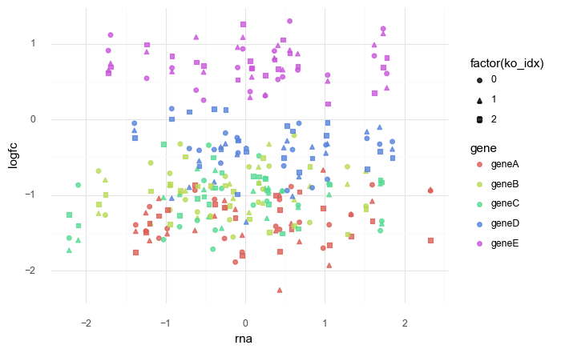
    


    <ggplot: (8779010163289)>


**Conclusion**  
This was an incorrect understanding of how to use a predictor variable in a higher level of the model.
Though it is not the right model the purposes of this project, I'll leave it here as an example.

---

## Model 4. Multiple genes and multiple cell lines hierarchical model with one covariate

Model the logFC of multiple genes in multiple cell lines using a single predictor: RNA expression.
A hierarchcial model will be used to pool information across genes and cell lines.
Also, to better mimic real data, I have added in the fact that there are multiple measures of logFC for each gene, but only one measure for RNA expression.

$
logFC_{g,c} \sim Normal(\mu_{g,c}, \sigma) \\
\quad \mu_g = \alpha_g + \gamma_c + \beta_g R \\
\qquad \alpha_g \sim \mathcal{N}(\mu_\alpha, \sigma_\alpha) \\
\qquad \quad \mu_\alpha \sim \mathcal{N}(0, 5) \quad \sigma_\alpha \sim \text{Exp}(1) \\
\qquad \gamma_c \sim \mathcal{N}(\mu_\gamma, \sigma_\gamma) \\
\qquad \quad \mu_\gamma \sim \mathcal{N}(0, 5) \quad \sigma_\gamma \sim \text{Exp}(1) \\
\qquad \beta_g \sim \mathcal{N}(\mu_\beta, \sigma_\beta) \\
\qquad \quad \mu_\beta \sim \mathcal{N}(0, 2) \quad \sigma_\beta \sim \text{Exp}(1) \\
\quad \sigma \sim \text{Exp}(1)
$


Simulated values:

- number of cell lines: 20
- number of genes: 5
- number of repeated measures: 3
- $\mu_\alpha = -1$, $\sigma_\alpha = 1$
- $\mu_\gamma = 0$, $\sigma_\gamma = 3$
- $\mu_\beta = -1$, $\sigma_\beta = 2$
- $\sigma = 0.3$


```python
N = 2000
np.random.seed(0)
sigma_dists = pd.DataFrame(
    {
        "name": np.repeat(["normal", "exponential"], N),
        "value": np.concatenate(
            [np.abs(np.random.normal(0, 5, N)), np.random.exponential(1, N)]
        ).flatten(),
    }
)

(
    gg.ggplot(sigma_dists, gg.aes("value"))
    + gg.geom_density(gg.aes(color="name", fill="name"), alpha=0.2, size=1.2)
    + gg.scale_color_brewer(type="qual", palette="Set1")
    + gg.theme(legend_position=(0.7, 0.7))
    + gg.labs(title="Visualization of two common distributions for std. dev.")
)
```


    
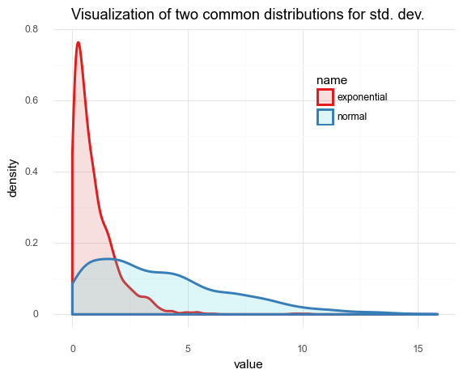
    


    <ggplot: (8779010135737)>


```python
np.random.seed(RANDOM_SEED)

# Real data parameters.
num_genes = 5
num_cell_lines = 20
num_logfc_datum = 3

# Real model values.
real_mu_alpha, real_sigma_alpha = -1, 1
real_mu_gamma, real_sigma_gamma = 0, 3
real_mu_beta, real_sigma_beta = -1, 2
real_sigma = 0.3

# Sample from real distributions for the rest of the model parameters.
real_alpha_g = np.random.normal(real_mu_alpha, real_sigma_alpha, num_genes)
real_gamma_c = np.random.normal(real_mu_gamma, real_sigma_gamma, num_cell_lines)
real_beta_g = np.random.normal(real_mu_beta, real_sigma_beta, num_genes)

rna_data = pd.DataFrame(list(product(genes, cell_lines)), columns=["gene", "cell_line"])

# RNA data (scaled by gene).
rna_data["rna"] = np.random.normal(0, 1, len(rna_data))

for c in ["gene", "cell_line"]:
    rna_data[c] = pd.Categorical(rna_data[c])

logfc_data = []
for i in range(num_logfc_datum):
    x = rna_data.copy()
    x["sgrna_idx"] = i
    logfc_data.append(x)

logfc_data = pd.concat(logfc_data).reset_index(drop=True)

logfc_data["logfc"] = np.nan
for i in range(len(logfc_data)):
    gene_i = logfc_data["gene"].cat.codes[i]
    cell_line_i = logfc_data["cell_line"].cat.codes[i]
    mu = (
        real_alpha_g[gene_i]
        + real_gamma_c[cell_line_i]
        + real_beta_g[gene_i] * logfc_data.loc[i, "rna"]
    )
    logfc_data.loc[i, "logfc"] = np.random.normal(mu, real_sigma)

logfc_data
```


<div>
<style scoped>
    .dataframe tbody tr th:only-of-type {
        vertical-align: middle;
    }

    .dataframe tbody tr th {
        vertical-align: top;
    }

    .dataframe thead th {
        text-align: right;
    }
</style>
<table border="1" class="dataframe">
  <thead>
    <tr style="text-align: right;">
      <th></th>
      <th>gene</th>
      <th>cell_line</th>
      <th>rna</th>
      <th>sgrna_idx</th>
      <th>logfc</th>
    </tr>
  </thead>
  <tbody>
    <tr>
      <th>0</th>
      <td>geneA</td>
      <td>cellA</td>
      <td>-1.187443</td>
      <td>0</td>
      <td>7.516370</td>
    </tr>
    <tr>
      <th>1</th>
      <td>geneA</td>
      <td>cellB</td>
      <td>0.299138</td>
      <td>0</td>
      <td>-1.184598</td>
    </tr>
    <tr>
      <th>2</th>
      <td>geneA</td>
      <td>cellC</td>
      <td>-0.947764</td>
      <td>0</td>
      <td>1.945419</td>
    </tr>
    <tr>
      <th>3</th>
      <td>geneA</td>
      <td>cellD</td>
      <td>-1.843382</td>
      <td>0</td>
      <td>-0.861100</td>
    </tr>
    <tr>
      <th>4</th>
      <td>geneA</td>
      <td>cellE</td>
      <td>0.810589</td>
      <td>0</td>
      <td>-6.491923</td>
    </tr>
    <tr>
      <th>...</th>
      <td>...</td>
      <td>...</td>
      <td>...</td>
      <td>...</td>
      <td>...</td>
    </tr>
    <tr>
      <th>295</th>
      <td>geneE</td>
      <td>cellP</td>
      <td>1.219362</td>
      <td>2</td>
      <td>0.194254</td>
    </tr>
    <tr>
      <th>296</th>
      <td>geneE</td>
      <td>cellQ</td>
      <td>-0.840481</td>
      <td>2</td>
      <td>-5.967522</td>
    </tr>
    <tr>
      <th>297</th>
      <td>geneE</td>
      <td>cellR</td>
      <td>0.607882</td>
      <td>2</td>
      <td>-0.719954</td>
    </tr>
    <tr>
      <th>298</th>
      <td>geneE</td>
      <td>cellS</td>
      <td>0.429605</td>
      <td>2</td>
      <td>1.885927</td>
    </tr>
    <tr>
      <th>299</th>
      <td>geneE</td>
      <td>cellT</td>
      <td>-1.014537</td>
      <td>2</td>
      <td>-1.022285</td>
    </tr>
  </tbody>
</table>
<p>300 rows × 5 columns</p>
</div>


```python
(
    gg.ggplot(logfc_data, gg.aes(x="rna", y="logfc", color="gene"))
    + gg.geom_point(size=1.8, alpha=0.8)
    + gg.scale_color_brewer(type="qual", palette="Set1")
    + gg.labs(x="RNA expression (scaled)", y="logFC", color="")
)
```


    

    


    <ggplot: (8779010235881)>


```python
(
    gg.ggplot(logfc_data, gg.aes(x="rna", y="logfc", color="gene"))
    + gg.facet_wrap("gene", nrow=2)
    + gg.geom_point(size=1.8, alpha=0.8)
    + gg.geom_smooth(method="lm")
    + gg.scale_color_brewer(type="qual", palette="Set1")
    + gg.labs(x="RNA expression (scaled)", y="logFC", color="")
)
```


    
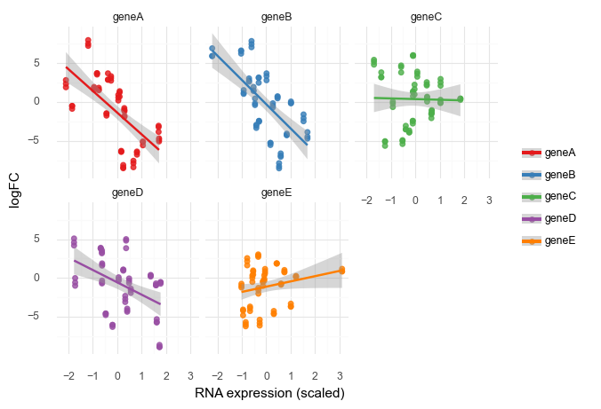
    


    <ggplot: (8779172877457)>


```python
(
    gg.ggplot(logfc_data, gg.aes(x="cell_line", y="logfc"))
    + gg.geom_hline(yintercept=0, color="gray")
    + gg.geom_boxplot(color="black", fill="black", alpha=0.05, outlier_color="")
    + gg.geom_jitter(gg.aes(color="gene"), width=0.3, size=1)
    + gg.scale_color_brewer(type="qual", palette="Set1")
    + gg.scale_x_discrete(labels=[a.replace("cell", "") for a in cell_lines])
    + gg.scale_y_continuous(breaks=range(-16, 16, 2))
    + gg.theme(panel_grid_major_x=gg.element_blank())
    + gg.labs(x="cell line", y="logFC", color="")
)
```


    
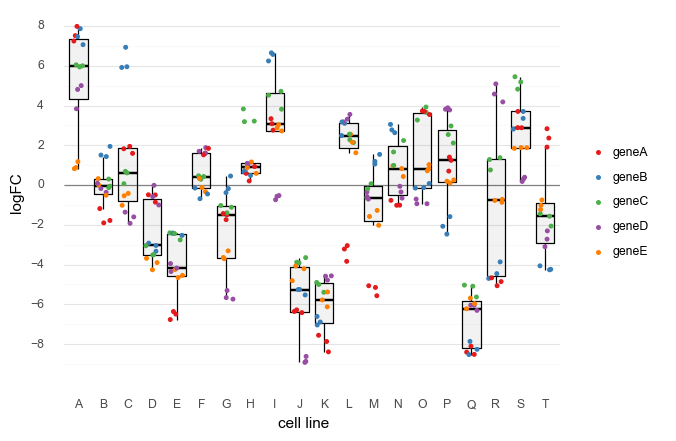
    


    <ggplot: (8779171887881)>


```python
gene_idx = logfc_data["gene"].cat.codes.to_list()
cell_line_idx = logfc_data["cell_line"].cat.codes.to_list()

with pm.Model() as model4:
    # Hyper-priors
    mu_alpha = pm.Normal("mu_alpha", 0, 2)
    sigma_alpha = pm.Exponential("sigma_alpha", 1)
    mu_gamma = pm.Normal("mu_gamma", 0, 2)
    sigma_gamma = pm.Exponential("sigma_gamma", 1)
    mu_beta = pm.Normal("mu_beta", 0, 1)
    sigma_beta = pm.Exponential("sigma_beta", 1)

    # Priors
    alpha_g = pm.Normal("alpha_g", mu_alpha, sigma_alpha, shape=num_genes)
    gamma_c = pm.Normal("gamma_c", mu_gamma, sigma_gamma, shape=num_cell_lines)
    beta_g = pm.Normal("beta_g", mu_beta, sigma_beta, shape=num_genes)
    mu_gc = pm.Deterministic(
        "mu_gc",
        alpha_g[gene_idx] + gamma_c[cell_line_idx] + beta_g[gene_idx] * logfc_data.rna,
    )
    sigma = pm.Exponential("sigma", 1)

    # Likelihood
    logfc = pm.Normal("logfc", mu=mu_gc, sigma=sigma, observed=logfc_data.logfc)

    # Sampling
    model4_prior_check = pm.sample_prior_predictive(random_seed=RANDOM_SEED)
    model4_trace = pm.sample(2000, tune=2000)
    model4_post_check = pm.sample_posterior_predictive(
        model4_trace, random_seed=RANDOM_SEED
    )
```

    Auto-assigning NUTS sampler...
    Initializing NUTS using jitter+adapt_diag...
    Multiprocess sampling (2 chains in 2 jobs)
    NUTS: [sigma, beta_g, gamma_c, alpha_g, sigma_beta, mu_beta, sigma_gamma, mu_gamma, sigma_alpha, mu_alpha]
    Sampling 2 chains, 0 divergences: 100%|██████████| 8000/8000 [02:53<00:00, 46.16draws/s]
    The number of effective samples is smaller than 10% for some parameters.
    100%|██████████| 4000/4000 [00:06<00:00, 660.76it/s]


```python
pm.model_to_graphviz(model4)
```


    
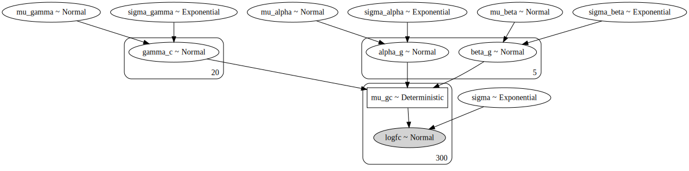
    


```python
az_model4 = az.from_pymc3(
    trace=model4_trace, prior=model4_prior_check, posterior_predictive=model4_post_check
)
```


```python
var_names1 = ["mu_" + a for a in ["alpha", "gamma", "beta"]]
var_names2 = ["sigma_" + a for a in ["alpha", "gamma", "beta"]]
az.plot_trace(az_model4, var_names=var_names1 + var_names2 + ["sigma"])
plt.show()
```

    /usr/local/Caskroom/miniconda/base/envs/speclet/lib/python3.7/site-packages/arviz/plots/backends/matplotlib/distplot.py:38: UserWarning: Argument backend_kwargs has not effect in matplotlib.plot_distSupplied value won't be used
    /usr/local/Caskroom/miniconda/base/envs/speclet/lib/python3.7/site-packages/arviz/plots/backends/matplotlib/distplot.py:38: UserWarning: Argument backend_kwargs has not effect in matplotlib.plot_distSupplied value won't be used
    /usr/local/Caskroom/miniconda/base/envs/speclet/lib/python3.7/site-packages/arviz/plots/backends/matplotlib/distplot.py:38: UserWarning: Argument backend_kwargs has not effect in matplotlib.plot_distSupplied value won't be used
    /usr/local/Caskroom/miniconda/base/envs/speclet/lib/python3.7/site-packages/arviz/plots/backends/matplotlib/distplot.py:38: UserWarning: Argument backend_kwargs has not effect in matplotlib.plot_distSupplied value won't be used
    /usr/local/Caskroom/miniconda/base/envs/speclet/lib/python3.7/site-packages/arviz/plots/backends/matplotlib/distplot.py:38: UserWarning: Argument backend_kwargs has not effect in matplotlib.plot_distSupplied value won't be used
    /usr/local/Caskroom/miniconda/base/envs/speclet/lib/python3.7/site-packages/arviz/plots/backends/matplotlib/distplot.py:38: UserWarning: Argument backend_kwargs has not effect in matplotlib.plot_distSupplied value won't be used
    /usr/local/Caskroom/miniconda/base/envs/speclet/lib/python3.7/site-packages/arviz/plots/backends/matplotlib/distplot.py:38: UserWarning: Argument backend_kwargs has not effect in matplotlib.plot_distSupplied value won't be used
    /usr/local/Caskroom/miniconda/base/envs/speclet/lib/python3.7/site-packages/arviz/plots/backends/matplotlib/distplot.py:38: UserWarning: Argument backend_kwargs has not effect in matplotlib.plot_distSupplied value won't be used
    /usr/local/Caskroom/miniconda/base/envs/speclet/lib/python3.7/site-packages/arviz/plots/backends/matplotlib/distplot.py:38: UserWarning: Argument backend_kwargs has not effect in matplotlib.plot_distSupplied value won't be used
    /usr/local/Caskroom/miniconda/base/envs/speclet/lib/python3.7/site-packages/arviz/plots/backends/matplotlib/distplot.py:38: UserWarning: Argument backend_kwargs has not effect in matplotlib.plot_distSupplied value won't be used
    /usr/local/Caskroom/miniconda/base/envs/speclet/lib/python3.7/site-packages/arviz/plots/backends/matplotlib/distplot.py:38: UserWarning: Argument backend_kwargs has not effect in matplotlib.plot_distSupplied value won't be used
    /usr/local/Caskroom/miniconda/base/envs/speclet/lib/python3.7/site-packages/arviz/plots/backends/matplotlib/distplot.py:38: UserWarning: Argument backend_kwargs has not effect in matplotlib.plot_distSupplied value won't be used
    /usr/local/Caskroom/miniconda/base/envs/speclet/lib/python3.7/site-packages/arviz/plots/backends/matplotlib/distplot.py:38: UserWarning: Argument backend_kwargs has not effect in matplotlib.plot_distSupplied value won't be used
    /usr/local/Caskroom/miniconda/base/envs/speclet/lib/python3.7/site-packages/arviz/plots/backends/matplotlib/distplot.py:38: UserWarning: Argument backend_kwargs has not effect in matplotlib.plot_distSupplied value won't be used


    
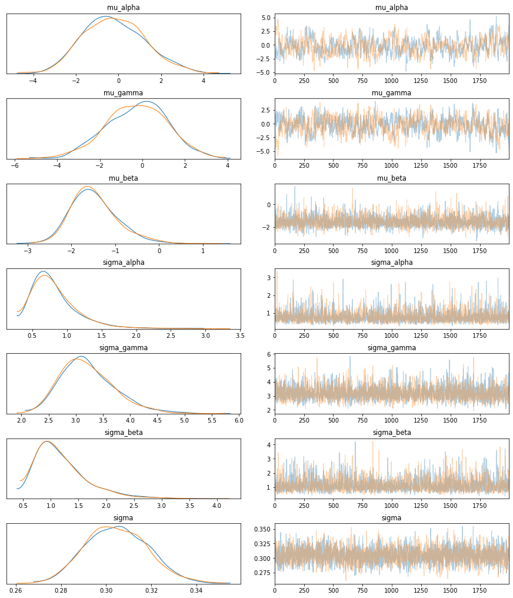
    


```python
s = az.summary(az_model4, var_names=var_names1 + var_names2)
s["real_values"] = [
    real_mu_alpha,
    real_mu_gamma,
    real_mu_beta,
    real_sigma_alpha,
    real_sigma_gamma,
    real_sigma_beta,
]
s
```


<div>
<style scoped>
    .dataframe tbody tr th:only-of-type {
        vertical-align: middle;
    }

    .dataframe tbody tr th {
        vertical-align: top;
    }

    .dataframe thead th {
        text-align: right;
    }
</style>
<table border="1" class="dataframe">
  <thead>
    <tr style="text-align: right;">
      <th></th>
      <th>mean</th>
      <th>sd</th>
      <th>hpd_3%</th>
      <th>hpd_97%</th>
      <th>mcse_mean</th>
      <th>mcse_sd</th>
      <th>ess_mean</th>
      <th>ess_sd</th>
      <th>ess_bulk</th>
      <th>ess_tail</th>
      <th>r_hat</th>
      <th>real_values</th>
    </tr>
  </thead>
  <tbody>
    <tr>
      <th>mu_alpha</th>
      <td>-0.215</td>
      <td>1.455</td>
      <td>-2.923</td>
      <td>2.475</td>
      <td>0.088</td>
      <td>0.063</td>
      <td>271.0</td>
      <td>271.0</td>
      <td>281.0</td>
      <td>329.0</td>
      <td>1.0</td>
      <td>-1</td>
    </tr>
    <tr>
      <th>mu_gamma</th>
      <td>-0.284</td>
      <td>1.441</td>
      <td>-3.060</td>
      <td>2.365</td>
      <td>0.081</td>
      <td>0.058</td>
      <td>313.0</td>
      <td>313.0</td>
      <td>322.0</td>
      <td>472.0</td>
      <td>1.0</td>
      <td>0</td>
    </tr>
    <tr>
      <th>mu_beta</th>
      <td>-1.483</td>
      <td>0.534</td>
      <td>-2.376</td>
      <td>-0.407</td>
      <td>0.011</td>
      <td>0.008</td>
      <td>2204.0</td>
      <td>2204.0</td>
      <td>2458.0</td>
      <td>2038.0</td>
      <td>1.0</td>
      <td>-1</td>
    </tr>
    <tr>
      <th>sigma_alpha</th>
      <td>0.824</td>
      <td>0.347</td>
      <td>0.363</td>
      <td>1.442</td>
      <td>0.007</td>
      <td>0.006</td>
      <td>2194.0</td>
      <td>1971.0</td>
      <td>3154.0</td>
      <td>2274.0</td>
      <td>1.0</td>
      <td>1</td>
    </tr>
    <tr>
      <th>sigma_gamma</th>
      <td>3.220</td>
      <td>0.503</td>
      <td>2.390</td>
      <td>4.217</td>
      <td>0.009</td>
      <td>0.006</td>
      <td>3434.0</td>
      <td>3215.0</td>
      <td>3750.0</td>
      <td>2602.0</td>
      <td>1.0</td>
      <td>3</td>
    </tr>
    <tr>
      <th>sigma_beta</th>
      <td>1.191</td>
      <td>0.478</td>
      <td>0.506</td>
      <td>2.064</td>
      <td>0.010</td>
      <td>0.007</td>
      <td>2221.0</td>
      <td>2095.0</td>
      <td>2724.0</td>
      <td>2324.0</td>
      <td>1.0</td>
      <td>2</td>
    </tr>
  </tbody>
</table>
</div>


I believe that the $\alpha_g$ values were poorly estimated because they do not add much information to the model.
The other parameters fit well, but these have very wide posterior distributions.


```python
az.summary(az_model4, var_names=["alpha_g"]).assign(real_values=real_alpha_g)
```


<div>
<style scoped>
    .dataframe tbody tr th:only-of-type {
        vertical-align: middle;
    }

    .dataframe tbody tr th {
        vertical-align: top;
    }

    .dataframe thead th {
        text-align: right;
    }
</style>
<table border="1" class="dataframe">
  <thead>
    <tr style="text-align: right;">
      <th></th>
      <th>mean</th>
      <th>sd</th>
      <th>hpd_3%</th>
      <th>hpd_97%</th>
      <th>mcse_mean</th>
      <th>mcse_sd</th>
      <th>ess_mean</th>
      <th>ess_sd</th>
      <th>ess_bulk</th>
      <th>ess_tail</th>
      <th>r_hat</th>
      <th>real_values</th>
    </tr>
  </thead>
  <tbody>
    <tr>
      <th>alpha_g[0]</th>
      <td>-1.014</td>
      <td>1.464</td>
      <td>-3.873</td>
      <td>1.610</td>
      <td>0.091</td>
      <td>0.065</td>
      <td>257.0</td>
      <td>257.0</td>
      <td>269.0</td>
      <td>308.0</td>
      <td>1.0</td>
      <td>-2.249278</td>
    </tr>
    <tr>
      <th>alpha_g[1]</th>
      <td>0.047</td>
      <td>1.465</td>
      <td>-2.563</td>
      <td>2.918</td>
      <td>0.092</td>
      <td>0.065</td>
      <td>256.0</td>
      <td>256.0</td>
      <td>268.0</td>
      <td>299.0</td>
      <td>1.0</td>
      <td>-1.260331</td>
    </tr>
    <tr>
      <th>alpha_g[2]</th>
      <td>0.673</td>
      <td>1.463</td>
      <td>-1.971</td>
      <td>3.484</td>
      <td>0.091</td>
      <td>0.070</td>
      <td>257.0</td>
      <td>221.0</td>
      <td>268.0</td>
      <td>295.0</td>
      <td>1.0</td>
      <td>-0.616207</td>
    </tr>
    <tr>
      <th>alpha_g[3]</th>
      <td>-0.120</td>
      <td>1.465</td>
      <td>-2.835</td>
      <td>2.653</td>
      <td>0.092</td>
      <td>0.065</td>
      <td>256.0</td>
      <td>256.0</td>
      <td>268.0</td>
      <td>293.0</td>
      <td>1.0</td>
      <td>-1.385461</td>
    </tr>
    <tr>
      <th>alpha_g[4]</th>
      <td>-0.717</td>
      <td>1.463</td>
      <td>-3.455</td>
      <td>2.014</td>
      <td>0.091</td>
      <td>0.065</td>
      <td>257.0</td>
      <td>257.0</td>
      <td>269.0</td>
      <td>295.0</td>
      <td>1.0</td>
      <td>-2.085137</td>
    </tr>
  </tbody>
</table>
</div>


```python
az.plot_forest(az_model4, var_names=["alpha_g"])
plt.show()
```


    
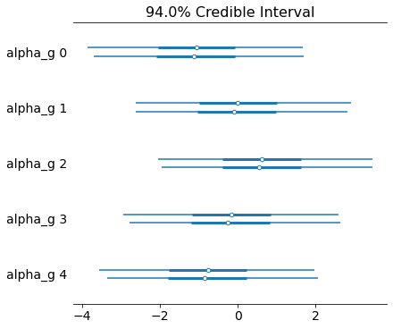
    


```python
az.summary(az_model4, var_names=["beta_g"]).assign(real_values=real_beta_g)
```


<div>
<style scoped>
    .dataframe tbody tr th:only-of-type {
        vertical-align: middle;
    }

    .dataframe tbody tr th {
        vertical-align: top;
    }

    .dataframe thead th {
        text-align: right;
    }
</style>
<table border="1" class="dataframe">
  <thead>
    <tr style="text-align: right;">
      <th></th>
      <th>mean</th>
      <th>sd</th>
      <th>hpd_3%</th>
      <th>hpd_97%</th>
      <th>mcse_mean</th>
      <th>mcse_sd</th>
      <th>ess_mean</th>
      <th>ess_sd</th>
      <th>ess_bulk</th>
      <th>ess_tail</th>
      <th>r_hat</th>
      <th>real_values</th>
    </tr>
  </thead>
  <tbody>
    <tr>
      <th>beta_g[0]</th>
      <td>-2.552</td>
      <td>0.045</td>
      <td>-2.633</td>
      <td>-2.464</td>
      <td>0.001</td>
      <td>0.001</td>
      <td>4058.0</td>
      <td>4058.0</td>
      <td>4060.0</td>
      <td>2405.0</td>
      <td>1.0</td>
      <td>-2.634413</td>
    </tr>
    <tr>
      <th>beta_g[1]</th>
      <td>-2.887</td>
      <td>0.049</td>
      <td>-2.980</td>
      <td>-2.798</td>
      <td>0.001</td>
      <td>0.000</td>
      <td>4987.0</td>
      <td>4985.0</td>
      <td>4991.0</td>
      <td>2794.0</td>
      <td>1.0</td>
      <td>-2.892255</td>
    </tr>
    <tr>
      <th>beta_g[2]</th>
      <td>-0.563</td>
      <td>0.050</td>
      <td>-0.664</td>
      <td>-0.474</td>
      <td>0.001</td>
      <td>0.001</td>
      <td>3627.0</td>
      <td>3607.0</td>
      <td>3662.0</td>
      <td>2532.0</td>
      <td>1.0</td>
      <td>-0.558722</td>
    </tr>
    <tr>
      <th>beta_g[3]</th>
      <td>-2.240</td>
      <td>0.043</td>
      <td>-2.324</td>
      <td>-2.164</td>
      <td>0.001</td>
      <td>0.000</td>
      <td>5926.0</td>
      <td>5915.0</td>
      <td>5923.0</td>
      <td>2951.0</td>
      <td>1.0</td>
      <td>-2.201467</td>
    </tr>
    <tr>
      <th>beta_g[4]</th>
      <td>-1.284</td>
      <td>0.045</td>
      <td>-1.365</td>
      <td>-1.189</td>
      <td>0.001</td>
      <td>0.000</td>
      <td>4700.0</td>
      <td>4678.0</td>
      <td>4698.0</td>
      <td>2743.0</td>
      <td>1.0</td>
      <td>-1.305132</td>
    </tr>
  </tbody>
</table>
</div>


```python
az.plot_forest(az_model4, var_names=["beta_g"])
plt.show()
```


    
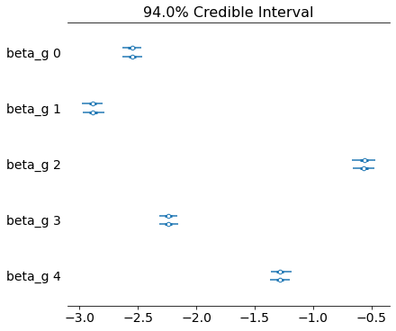
    


```python
az.summary(az_model4, var_names=["gamma_c"]).assign(real_values=real_gamma_c)
```


<div>
<style scoped>
    .dataframe tbody tr th:only-of-type {
        vertical-align: middle;
    }

    .dataframe tbody tr th {
        vertical-align: top;
    }

    .dataframe thead th {
        text-align: right;
    }
</style>
<table border="1" class="dataframe">
  <thead>
    <tr style="text-align: right;">
      <th></th>
      <th>mean</th>
      <th>sd</th>
      <th>hpd_3%</th>
      <th>hpd_97%</th>
      <th>mcse_mean</th>
      <th>mcse_sd</th>
      <th>ess_mean</th>
      <th>ess_sd</th>
      <th>ess_bulk</th>
      <th>ess_tail</th>
      <th>r_hat</th>
      <th>real_values</th>
    </tr>
  </thead>
  <tbody>
    <tr>
      <th>gamma_c[0]</th>
      <td>5.528</td>
      <td>1.464</td>
      <td>2.643</td>
      <td>8.114</td>
      <td>0.091</td>
      <td>0.065</td>
      <td>257.0</td>
      <td>257.0</td>
      <td>268.0</td>
      <td>288.0</td>
      <td>1.0</td>
      <td>6.981657</td>
    </tr>
    <tr>
      <th>gamma_c[1]</th>
      <td>0.043</td>
      <td>1.463</td>
      <td>-2.768</td>
      <td>2.700</td>
      <td>0.091</td>
      <td>0.065</td>
      <td>257.0</td>
      <td>257.0</td>
      <td>269.0</td>
      <td>298.0</td>
      <td>1.0</td>
      <td>1.292379</td>
    </tr>
    <tr>
      <th>gamma_c[2]</th>
      <td>-0.023</td>
      <td>1.468</td>
      <td>-2.928</td>
      <td>2.551</td>
      <td>0.091</td>
      <td>0.065</td>
      <td>258.0</td>
      <td>258.0</td>
      <td>269.0</td>
      <td>303.0</td>
      <td>1.0</td>
      <td>1.296947</td>
    </tr>
    <tr>
      <th>gamma_c[3]</th>
      <td>-4.242</td>
      <td>1.467</td>
      <td>-7.167</td>
      <td>-1.686</td>
      <td>0.091</td>
      <td>0.069</td>
      <td>257.0</td>
      <td>225.0</td>
      <td>268.0</td>
      <td>319.0</td>
      <td>1.0</td>
      <td>-2.940034</td>
    </tr>
    <tr>
      <th>gamma_c[4]</th>
      <td>-3.311</td>
      <td>1.463</td>
      <td>-6.046</td>
      <td>-0.629</td>
      <td>0.091</td>
      <td>0.070</td>
      <td>257.0</td>
      <td>219.0</td>
      <td>268.0</td>
      <td>295.0</td>
      <td>1.0</td>
      <td>-1.895896</td>
    </tr>
    <tr>
      <th>gamma_c[5]</th>
      <td>0.572</td>
      <td>1.467</td>
      <td>-2.475</td>
      <td>3.019</td>
      <td>0.091</td>
      <td>0.065</td>
      <td>258.0</td>
      <td>258.0</td>
      <td>269.0</td>
      <td>292.0</td>
      <td>1.0</td>
      <td>1.732326</td>
    </tr>
    <tr>
      <th>gamma_c[6]</th>
      <td>-1.580</td>
      <td>1.468</td>
      <td>-4.443</td>
      <td>1.038</td>
      <td>0.092</td>
      <td>0.072</td>
      <td>256.0</td>
      <td>209.0</td>
      <td>267.0</td>
      <td>307.0</td>
      <td>1.0</td>
      <td>-0.374273</td>
    </tr>
    <tr>
      <th>gamma_c[7]</th>
      <td>1.762</td>
      <td>1.466</td>
      <td>-1.054</td>
      <td>4.405</td>
      <td>0.092</td>
      <td>0.065</td>
      <td>255.0</td>
      <td>255.0</td>
      <td>267.0</td>
      <td>289.0</td>
      <td>1.0</td>
      <td>2.936844</td>
    </tr>
    <tr>
      <th>gamma_c[8]</th>
      <td>3.383</td>
      <td>1.466</td>
      <td>0.610</td>
      <td>6.067</td>
      <td>0.092</td>
      <td>0.065</td>
      <td>256.0</td>
      <td>256.0</td>
      <td>268.0</td>
      <td>301.0</td>
      <td>1.0</td>
      <td>4.784765</td>
    </tr>
    <tr>
      <th>gamma_c[9]</th>
      <td>-4.818</td>
      <td>1.466</td>
      <td>-7.800</td>
      <td>-2.308</td>
      <td>0.091</td>
      <td>0.069</td>
      <td>259.0</td>
      <td>230.0</td>
      <td>271.0</td>
      <td>303.0</td>
      <td>1.0</td>
      <td>-3.605834</td>
    </tr>
    <tr>
      <th>gamma_c[10]</th>
      <td>-5.487</td>
      <td>1.467</td>
      <td>-8.319</td>
      <td>-2.868</td>
      <td>0.092</td>
      <td>0.068</td>
      <td>257.0</td>
      <td>231.0</td>
      <td>269.0</td>
      <td>304.0</td>
      <td>1.0</td>
      <td>-4.129107</td>
    </tr>
    <tr>
      <th>gamma_c[11]</th>
      <td>1.955</td>
      <td>1.466</td>
      <td>-0.737</td>
      <td>4.745</td>
      <td>0.091</td>
      <td>0.065</td>
      <td>258.0</td>
      <td>258.0</td>
      <td>269.0</td>
      <td>298.0</td>
      <td>1.0</td>
      <td>3.163037</td>
    </tr>
    <tr>
      <th>gamma_c[12]</th>
      <td>-1.517</td>
      <td>1.467</td>
      <td>-4.235</td>
      <td>1.244</td>
      <td>0.092</td>
      <td>0.072</td>
      <td>256.0</td>
      <td>210.0</td>
      <td>267.0</td>
      <td>310.0</td>
      <td>1.0</td>
      <td>-0.116560</td>
    </tr>
    <tr>
      <th>gamma_c[13]</th>
      <td>0.827</td>
      <td>1.464</td>
      <td>-1.921</td>
      <td>3.528</td>
      <td>0.091</td>
      <td>0.065</td>
      <td>258.0</td>
      <td>258.0</td>
      <td>270.0</td>
      <td>309.0</td>
      <td>1.0</td>
      <td>2.040857</td>
    </tr>
    <tr>
      <th>gamma_c[14]</th>
      <td>2.743</td>
      <td>1.467</td>
      <td>0.004</td>
      <td>5.491</td>
      <td>0.091</td>
      <td>0.065</td>
      <td>259.0</td>
      <td>259.0</td>
      <td>271.0</td>
      <td>308.0</td>
      <td>1.0</td>
      <td>3.987525</td>
    </tr>
    <tr>
      <th>gamma_c[15]</th>
      <td>2.410</td>
      <td>1.464</td>
      <td>-0.430</td>
      <td>5.024</td>
      <td>0.091</td>
      <td>0.064</td>
      <td>260.0</td>
      <td>260.0</td>
      <td>271.0</td>
      <td>311.0</td>
      <td>1.0</td>
      <td>3.850349</td>
    </tr>
    <tr>
      <th>gamma_c[16]</th>
      <td>-6.558</td>
      <td>1.466</td>
      <td>-9.230</td>
      <td>-3.756</td>
      <td>0.091</td>
      <td>0.068</td>
      <td>258.0</td>
      <td>235.0</td>
      <td>270.0</td>
      <td>296.0</td>
      <td>1.0</td>
      <td>-5.274761</td>
    </tr>
    <tr>
      <th>gamma_c[17]</th>
      <td>0.583</td>
      <td>1.465</td>
      <td>-2.250</td>
      <td>3.231</td>
      <td>0.091</td>
      <td>0.064</td>
      <td>259.0</td>
      <td>259.0</td>
      <td>270.0</td>
      <td>307.0</td>
      <td>1.0</td>
      <td>1.842918</td>
    </tr>
    <tr>
      <th>gamma_c[18]</th>
      <td>3.326</td>
      <td>1.466</td>
      <td>0.622</td>
      <td>6.082</td>
      <td>0.091</td>
      <td>0.065</td>
      <td>257.0</td>
      <td>257.0</td>
      <td>268.0</td>
      <td>298.0</td>
      <td>1.0</td>
      <td>4.549074</td>
    </tr>
    <tr>
      <th>gamma_c[19]</th>
      <td>-1.843</td>
      <td>1.467</td>
      <td>-4.694</td>
      <td>0.781</td>
      <td>0.092</td>
      <td>0.071</td>
      <td>256.0</td>
      <td>211.0</td>
      <td>267.0</td>
      <td>300.0</td>
      <td>1.0</td>
      <td>-0.587932</td>
    </tr>
  </tbody>
</table>
</div>


```python
az.plot_forest(az_model4, var_names=["gamma_c"])
plt.show()
```


    
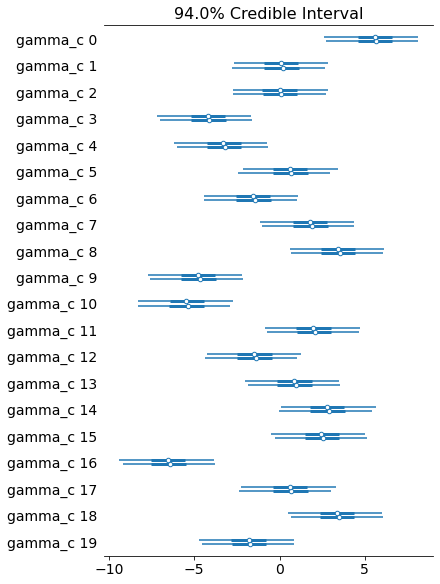
    


```python
post_alpha_g = model4_trace.get_values(varname="alpha_g")
post_gamma_c = model4_trace.get_values(varname="gamma_c")
post_beta_g = model4_trace.get_values(varname="beta_g")
post_mu_gc = model4_trace.get_values(varname="mu_gc")

post_mu_mean = post_mu_gc.mean(axis=0)
post_mu_hdi = np.array([az.hpd(x, credible_interval=0.89) for x in post_mu_gc.T])

logfc_post_df = logfc_data.copy()
logfc_post_df["post_logfc"] = post_mu_mean
logfc_post_df["hpi_lower"] = [x[0] for x in post_mu_hdi]
logfc_post_df["hpi_upper"] = [x[1] for x in post_mu_hdi]
logfc_post_df
```


<div>
<style scoped>
    .dataframe tbody tr th:only-of-type {
        vertical-align: middle;
    }

    .dataframe tbody tr th {
        vertical-align: top;
    }

    .dataframe thead th {
        text-align: right;
    }
</style>
<table border="1" class="dataframe">
  <thead>
    <tr style="text-align: right;">
      <th></th>
      <th>gene</th>
      <th>cell_line</th>
      <th>rna</th>
      <th>sgrna_idx</th>
      <th>logfc</th>
      <th>post_logfc</th>
      <th>hpi_lower</th>
      <th>hpi_upper</th>
    </tr>
  </thead>
  <tbody>
    <tr>
      <th>0</th>
      <td>geneA</td>
      <td>cellA</td>
      <td>-1.187443</td>
      <td>0</td>
      <td>7.516370</td>
      <td>7.544614</td>
      <td>7.390785</td>
      <td>7.706855</td>
    </tr>
    <tr>
      <th>1</th>
      <td>geneA</td>
      <td>cellB</td>
      <td>0.299138</td>
      <td>0</td>
      <td>-1.184598</td>
      <td>-1.734859</td>
      <td>-1.879098</td>
      <td>-1.604324</td>
    </tr>
    <tr>
      <th>2</th>
      <td>geneA</td>
      <td>cellC</td>
      <td>-0.947764</td>
      <td>0</td>
      <td>1.945419</td>
      <td>1.381095</td>
      <td>1.228576</td>
      <td>1.537456</td>
    </tr>
    <tr>
      <th>3</th>
      <td>geneA</td>
      <td>cellD</td>
      <td>-1.843382</td>
      <td>0</td>
      <td>-0.861100</td>
      <td>-0.552129</td>
      <td>-0.737418</td>
      <td>-0.380728</td>
    </tr>
    <tr>
      <th>4</th>
      <td>geneA</td>
      <td>cellE</td>
      <td>0.810589</td>
      <td>0</td>
      <td>-6.491923</td>
      <td>-6.393723</td>
      <td>-6.527592</td>
      <td>-6.239647</td>
    </tr>
    <tr>
      <th>...</th>
      <td>...</td>
      <td>...</td>
      <td>...</td>
      <td>...</td>
      <td>...</td>
      <td>...</td>
      <td>...</td>
      <td>...</td>
    </tr>
    <tr>
      <th>295</th>
      <td>geneE</td>
      <td>cellP</td>
      <td>1.219362</td>
      <td>2</td>
      <td>0.194254</td>
      <td>0.127571</td>
      <td>-0.022881</td>
      <td>0.287405</td>
    </tr>
    <tr>
      <th>296</th>
      <td>geneE</td>
      <td>cellQ</td>
      <td>-0.840481</td>
      <td>2</td>
      <td>-5.967522</td>
      <td>-6.196416</td>
      <td>-6.337464</td>
      <td>-6.040493</td>
    </tr>
    <tr>
      <th>297</th>
      <td>geneE</td>
      <td>cellR</td>
      <td>0.607882</td>
      <td>2</td>
      <td>-0.719954</td>
      <td>-0.914405</td>
      <td>-1.061922</td>
      <td>-0.757333</td>
    </tr>
    <tr>
      <th>298</th>
      <td>geneE</td>
      <td>cellS</td>
      <td>0.429605</td>
      <td>2</td>
      <td>1.885927</td>
      <td>2.057401</td>
      <td>1.918837</td>
      <td>2.200657</td>
    </tr>
    <tr>
      <th>299</th>
      <td>geneE</td>
      <td>cellT</td>
      <td>-1.014537</td>
      <td>2</td>
      <td>-1.022285</td>
      <td>-1.258244</td>
      <td>-1.408770</td>
      <td>-1.101493</td>
    </tr>
  </tbody>
</table>
<p>300 rows × 8 columns</p>
</div>


```python
(
    gg.ggplot(logfc_post_df, gg.aes(x="cell_line"))
    + gg.facet_wrap("gene", ncol=1, scales="free")
    + gg.geom_linerange(
        gg.aes(ymin="hpi_lower", ymax="hpi_upper"), position=gg.position_nudge(x=0.3)
    )
    + gg.geom_point(gg.aes(y="post_logfc"), position=gg.position_nudge(x=0.3), size=1)
    + gg.geom_point(gg.aes(y="logfc"), position=gg.position_nudge(x=-0.3), color="blue")
    + gg.scale_x_discrete(labels=[a.replace("cell", "") for a in cell_lines])
    + gg.theme(subplots_adjust={"hspace": 0.25, "wspace": 0.25}, figure_size=(8, 20))
    + gg.labs(x="cell lines", y="logFC", title="Posterior predictive check")
)
```


    

    


    <ggplot: (8779008889113)>


---

## Model 5. Move the varying gene intercept into a higher level

Model the logFC for knocking-out a gene $g$ in cell line $c$ with sgRNA $s$.
Use a varying intercept for the sgRNA and cell line.
Include the target gene as a varying intercept for the level of the intercept for the sgRNA.

$
logFC_{s,g,c} \sim \mathcal{N}(\mu_{s,g,c}, \sigma) \\
\quad \mu_{s,g,c} = \alpha_s + \beta_c \\
\qquad \alpha_s \sim \mathcal{N}(\mu_\alpha, \sigma_\alpha) \\
\qquad \quad \mu_\alpha = \epsilon_g \\
\qquad \qquad \epsilon_g \sim \mathcal{N}(\mu_\epsilon, \sigma_\epsilon) \\
\qquad \qquad \quad \mu_\epsilon \sim \mathcal{N}(0, 5) \quad \sigma_\epsilon \sim \text{Exp(1)} \\
\qquad \quad \sigma_\alpha \sim \text{Exp}(1) \\
\qquad \beta_c \sim \mathcal{N}(\mu_\beta, \sigma_\beta) \\
\qquad \quad \mu_\beta \sim \mathcal{N}(0, 5) \quad \sigma_\beta \sim \text{Exp}(1) \\
\quad \sigma \sim \text{Exp}(1)
$

Simulated values:

- number of cell lines: 20
- number of genes: 5
- number of repeated measures: 4
- manually define the values for each sgRNA in $\alpha_s$
- $\mu_\beta = 0$, $\sigma_\beta = 1$
- $\sigma = 0.5$


```python
np.random.seed(RANDOM_SEED)

# Data parameters.
num_cell_lines = 20
num_genes = 5
num_sgrna_per_gene = list(range(1, num_genes + 1))  # Different number of guides.
num_sgRNA = sum(num_sgrna_per_gene)

# Model parameters.
real_params = {
    "mu_beta": 0,
    "sigma_beta": 1,
    "sigma": 0.5,
    "alpha_s": [
        -0.4,
        -0.2,
        -0.3,
        0,
        -0.5,
        -0.6,
        -1,
        -1.2,
        -1.7,
        -0.8,
        2,
        1.7,
        2.4,
        2.1,
        0,
    ],
}

real_params["beta_c"] = normal(
    real_params["mu_beta"], real_params["sigma_beta"], num_cell_lines
)

# Check to make sure therre are enough values.
if len(real_params["alpha_s"]) != sum(num_sgrna_per_gene):
    raise Exception(
        f"Incorrect number of values for `alpha_s`: have {len(real_params['alpha_s'])}; need {sum(num_sgrna_per_gene)}"
    )


def alphabet_list(n, prefix=""):
    if n > len(string.ascii_uppercase):
        raise Exception(f"Max number of values is {len(string.ascii_uppercase)}")
    return [prefix + a for a in string.ascii_uppercase[:n]]


def make_cat(df, col, categories=None, ordered=None):
    df[col] = pd.Categorical(df[col], categories=categories)
    return df


cell_lines = alphabet_list(num_cell_lines, "cell")
genes = alphabet_list(num_genes, "gene")
guides = ["sgRNA_" + str(i) for i in range(sum(num_sgrna_per_gene))]

alpha_s_table = pd.DataFrame(
    {
        "gene": np.repeat(genes, num_sgrna_per_gene),
        "sgRNA": guides,
        "alpha_s": real_params["alpha_s"],
    }
)
alpha_s_table = make_cat(alpha_s_table, "gene", categories=genes)
alpha_s_table = make_cat(alpha_s_table, "sgRNA", categories=guides)

data = pd.DataFrame(
    product(genes, cell_lines), columns=["gene", "cell_line"], dtype="category"
)
data = pd.merge(data, alpha_s_table[["gene", "sgRNA"]], how="right", on="gene")
data = data.reset_index(drop=True)
data = make_cat(data, "cell_line", categories=cell_lines)
data = make_cat(data, "gene", categories=genes)
data = make_cat(data, "sgRNA", categories=guides)

data["logfc"] = np.nan
for i in range(len(data)):
    s = data["sgRNA"].cat.codes[i]
    c = data["cell_line"].cat.codes[i]
    logfc = normal(
        real_params["alpha_s"][s] + real_params["beta_c"][c], real_params["sigma"]
    )
    data.loc[i, "logfc"] = logfc

data.head(10)
```


<div>
<style scoped>
    .dataframe tbody tr th:only-of-type {
        vertical-align: middle;
    }

    .dataframe tbody tr th {
        vertical-align: top;
    }

    .dataframe thead th {
        text-align: right;
    }
</style>
<table border="1" class="dataframe">
  <thead>
    <tr style="text-align: right;">
      <th></th>
      <th>gene</th>
      <th>cell_line</th>
      <th>sgRNA</th>
      <th>logfc</th>
    </tr>
  </thead>
  <tbody>
    <tr>
      <th>0</th>
      <td>geneA</td>
      <td>cellA</td>
      <td>sgRNA_0</td>
      <td>-1.007554</td>
    </tr>
    <tr>
      <th>1</th>
      <td>geneA</td>
      <td>cellB</td>
      <td>sgRNA_0</td>
      <td>-1.539458</td>
    </tr>
    <tr>
      <th>2</th>
      <td>geneA</td>
      <td>cellC</td>
      <td>sgRNA_0</td>
      <td>0.290946</td>
    </tr>
    <tr>
      <th>3</th>
      <td>geneA</td>
      <td>cellD</td>
      <td>sgRNA_0</td>
      <td>-0.027282</td>
    </tr>
    <tr>
      <th>4</th>
      <td>geneA</td>
      <td>cellE</td>
      <td>sgRNA_0</td>
      <td>-1.583125</td>
    </tr>
    <tr>
      <th>5</th>
      <td>geneA</td>
      <td>cellF</td>
      <td>sgRNA_0</td>
      <td>1.518616</td>
    </tr>
    <tr>
      <th>6</th>
      <td>geneA</td>
      <td>cellG</td>
      <td>sgRNA_0</td>
      <td>-0.442271</td>
    </tr>
    <tr>
      <th>7</th>
      <td>geneA</td>
      <td>cellH</td>
      <td>sgRNA_0</td>
      <td>0.142635</td>
    </tr>
    <tr>
      <th>8</th>
      <td>geneA</td>
      <td>cellI</td>
      <td>sgRNA_0</td>
      <td>-1.680378</td>
    </tr>
    <tr>
      <th>9</th>
      <td>geneA</td>
      <td>cellJ</td>
      <td>sgRNA_0</td>
      <td>-1.108248</td>
    </tr>
  </tbody>
</table>
</div>


```python
(
    gg.ggplot(data, gg.aes(x="gene", y="logfc"))
    + gg.geom_boxplot(outlier_color="")
    + gg.geom_jitter(gg.aes(color="sgRNA"), width=0.2, size=1, alpha=0.7)
    + gg.scale_color_discrete()
    + gg.labs(x="", y="logFC", title="Synthetic data")
)
```


    
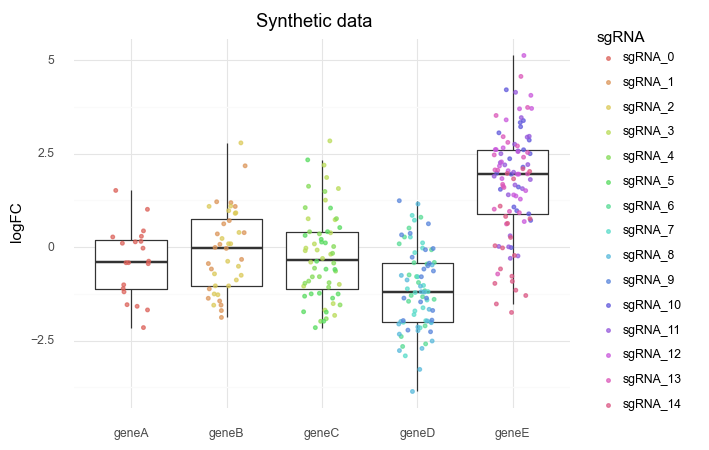
    


    <ggplot: (8779171864173)>


```python
(
    gg.ggplot(data, gg.aes(x="sgRNA", y="logfc"))
    + gg.geom_boxplot(gg.aes(color="gene"), outlier_color="")
    + gg.geom_jitter(gg.aes(color="gene"), width=0.2, size=1, alpha=0.7)
    + gg.scale_color_discrete()
    + gg.scale_x_discrete(labels=[a.replace("sgRNA_", "") for a in guides])
    + gg.theme(figure_size=(12, 5))
    + gg.labs(x="", y="logFC", title="Synthetic data")
)
```


    

    


    <ggplot: (8779105775297)>


```python
(
    gg.ggplot(data, gg.aes(x="cell_line", y="logfc"))
    + gg.geom_boxplot(outlier_color="")
    + gg.geom_jitter(gg.aes(color="gene"), width=0.2, size=1, alpha=0.7)
    + gg.scale_color_discrete()
    + gg.theme(figure_size=(12, 5))
    + gg.labs(x="", y="logFC", title="Synthetic data")
)
```


    
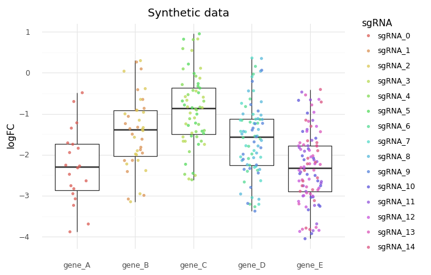
    


    <ggplot: (8779102786933)>


This model samples very slowly and only gets a few effective samples (~200) for some of the higher-level parameters.
Taking more samples fixes this problem, but for experimental purposes, the posterior distributions are actually quite accurate (i.e. taking more samples adds more effective samples for the higher-level parameters, but doesn't really change the shape of the posteriors).


```python
sgrna_idx = data["sgRNA"].cat.codes.to_list()
gene_idx = data["gene"].cat.codes.to_list()
cell_line_idx = data["cell_line"].cat.codes.to_list()

sgrna_to_gene_idx = alpha_s_table["gene"].cat.codes.to_list()

with pm.Model() as model5:
    # Hyper-priors
    mu_epsilon = pm.Normal("mu_epsilon", 0, 5)
    sigma_epsilon = pm.Exponential("sigma_epsilon", 1)
    sigma_alpha = pm.Exponential("sigma_alpha", 1)
    mu_beta = pm.Normal("mu_beta", 0, 5)
    sigma_beta = pm.Exponential("sigma_beta", 1)

    # sgRNA level
    epsilon_g = pm.Normal("epsilon_g", mu_epsilon, sigma_epsilon, shape=num_genes)
    mu_alpha = epsilon_g[sgrna_to_gene_idx]

    # Main level priors
    alpha_s = pm.Normal("alpha_s", mu_alpha, sigma_alpha, shape=num_sgRNA)
    beta_c = pm.Normal("beta_c", mu_beta, sigma_beta, shape=num_cell_lines)

    # Main level
    mu_sgc = pm.Deterministic("mu_sgc", alpha_s[sgrna_idx] + beta_c[cell_line_idx])
    sigma = pm.Exponential("sigma", 1)

    # Likelihood
    logfc = pm.Normal("logfc", mu_sgc, sigma, observed=data.logfc)

    # Sampling
    model5_prior_check = pm.sample_prior_predictive(random_seed=RANDOM_SEED)
    model5_trace = pm.sample(3000, tune=2000)
    model5_post_check = pm.sample_posterior_predictive(
        model5_trace, random_seed=RANDOM_SEED
    )
```

    /usr/local/Caskroom/miniconda/base/envs/speclet/lib/python3.7/site-packages/theano/tensor/subtensor.py:2197: FutureWarning: Using a non-tuple sequence for multidimensional indexing is deprecated; use `arr[tuple(seq)]` instead of `arr[seq]`. In the future this will be interpreted as an array index, `arr[np.array(seq)]`, which will result either in an error or a different result.
    Auto-assigning NUTS sampler...
    Initializing NUTS using jitter+adapt_diag...
    Multiprocess sampling (2 chains in 2 jobs)
    NUTS: [sigma, beta_c, alpha_s, epsilon_g, sigma_beta, mu_beta, sigma_alpha, sigma_epsilon, mu_epsilon]
    Sampling 2 chains, 3 divergences: 100%|██████████| 44000/44000 [12:20<00:00, 59.43draws/s] 
    There were 2 divergences after tuning. Increase `target_accept` or reparameterize.
    The acceptance probability does not match the target. It is 0.8919250649269245, but should be close to 0.8. Try to increase the number of tuning steps.
    There was 1 divergence after tuning. Increase `target_accept` or reparameterize.
    The number of effective samples is smaller than 10% for some parameters.
    100%|██████████| 40000/40000 [00:59<00:00, 673.75it/s]


```python
pm.model_to_graphviz(model5)
```


    
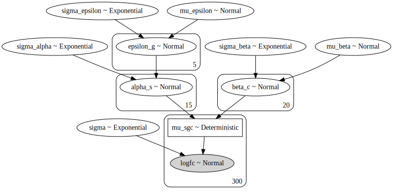
    


```python
az_model5 = az.from_pymc3(
    trace=model5_trace, prior=model5_prior_check, posterior_predictive=model5_post_check
)
```


```python
az.summary(az_model5, var_names=["alpha_s"]).assign(
    real_values=alpha_s_table["alpha_s"].values
)
```


<div>
<style scoped>
    .dataframe tbody tr th:only-of-type {
        vertical-align: middle;
    }

    .dataframe tbody tr th {
        vertical-align: top;
    }

    .dataframe thead th {
        text-align: right;
    }
</style>
<table border="1" class="dataframe">
  <thead>
    <tr style="text-align: right;">
      <th></th>
      <th>mean</th>
      <th>sd</th>
      <th>hpd_3%</th>
      <th>hpd_97%</th>
      <th>mcse_mean</th>
      <th>mcse_sd</th>
      <th>ess_mean</th>
      <th>ess_sd</th>
      <th>ess_bulk</th>
      <th>ess_tail</th>
      <th>r_hat</th>
      <th>real_values</th>
    </tr>
  </thead>
  <tbody>
    <tr>
      <th>alpha_s[0]</th>
      <td>-0.440</td>
      <td>3.475</td>
      <td>-6.733</td>
      <td>6.525</td>
      <td>0.092</td>
      <td>0.065</td>
      <td>1411.0</td>
      <td>1411.0</td>
      <td>1415.0</td>
      <td>1643.0</td>
      <td>1.0</td>
      <td>-0.4</td>
    </tr>
    <tr>
      <th>alpha_s[1]</th>
      <td>-0.172</td>
      <td>3.475</td>
      <td>-6.443</td>
      <td>6.817</td>
      <td>0.092</td>
      <td>0.065</td>
      <td>1412.0</td>
      <td>1412.0</td>
      <td>1415.0</td>
      <td>1644.0</td>
      <td>1.0</td>
      <td>-0.2</td>
    </tr>
    <tr>
      <th>alpha_s[2]</th>
      <td>-0.084</td>
      <td>3.475</td>
      <td>-6.282</td>
      <td>6.975</td>
      <td>0.093</td>
      <td>0.065</td>
      <td>1411.0</td>
      <td>1411.0</td>
      <td>1414.0</td>
      <td>1634.0</td>
      <td>1.0</td>
      <td>-0.3</td>
    </tr>
    <tr>
      <th>alpha_s[3]</th>
      <td>0.121</td>
      <td>3.474</td>
      <td>-6.127</td>
      <td>7.153</td>
      <td>0.093</td>
      <td>0.065</td>
      <td>1411.0</td>
      <td>1409.0</td>
      <td>1414.0</td>
      <td>1646.0</td>
      <td>1.0</td>
      <td>0.0</td>
    </tr>
    <tr>
      <th>alpha_s[4]</th>
      <td>-0.388</td>
      <td>3.475</td>
      <td>-6.604</td>
      <td>6.678</td>
      <td>0.092</td>
      <td>0.065</td>
      <td>1412.0</td>
      <td>1412.0</td>
      <td>1416.0</td>
      <td>1634.0</td>
      <td>1.0</td>
      <td>-0.5</td>
    </tr>
    <tr>
      <th>alpha_s[5]</th>
      <td>-0.558</td>
      <td>3.475</td>
      <td>-6.772</td>
      <td>6.491</td>
      <td>0.092</td>
      <td>0.065</td>
      <td>1411.0</td>
      <td>1411.0</td>
      <td>1415.0</td>
      <td>1649.0</td>
      <td>1.0</td>
      <td>-0.6</td>
    </tr>
    <tr>
      <th>alpha_s[6]</th>
      <td>-0.972</td>
      <td>3.476</td>
      <td>-7.254</td>
      <td>6.031</td>
      <td>0.093</td>
      <td>0.065</td>
      <td>1410.0</td>
      <td>1410.0</td>
      <td>1413.0</td>
      <td>1652.0</td>
      <td>1.0</td>
      <td>-1.0</td>
    </tr>
    <tr>
      <th>alpha_s[7]</th>
      <td>-1.099</td>
      <td>3.474</td>
      <td>-7.318</td>
      <td>5.937</td>
      <td>0.093</td>
      <td>0.065</td>
      <td>1411.0</td>
      <td>1411.0</td>
      <td>1414.0</td>
      <td>1628.0</td>
      <td>1.0</td>
      <td>-1.2</td>
    </tr>
    <tr>
      <th>alpha_s[8]</th>
      <td>-1.816</td>
      <td>3.475</td>
      <td>-8.049</td>
      <td>5.236</td>
      <td>0.092</td>
      <td>0.065</td>
      <td>1411.0</td>
      <td>1411.0</td>
      <td>1415.0</td>
      <td>1659.0</td>
      <td>1.0</td>
      <td>-1.7</td>
    </tr>
    <tr>
      <th>alpha_s[9]</th>
      <td>-0.804</td>
      <td>3.474</td>
      <td>-6.992</td>
      <td>6.251</td>
      <td>0.093</td>
      <td>0.065</td>
      <td>1410.0</td>
      <td>1410.0</td>
      <td>1413.0</td>
      <td>1645.0</td>
      <td>1.0</td>
      <td>-0.8</td>
    </tr>
    <tr>
      <th>alpha_s[10]</th>
      <td>2.089</td>
      <td>3.475</td>
      <td>-4.290</td>
      <td>8.976</td>
      <td>0.093</td>
      <td>0.071</td>
      <td>1410.0</td>
      <td>1197.0</td>
      <td>1413.0</td>
      <td>1646.0</td>
      <td>1.0</td>
      <td>2.0</td>
    </tr>
    <tr>
      <th>alpha_s[11]</th>
      <td>1.730</td>
      <td>3.475</td>
      <td>-4.469</td>
      <td>8.796</td>
      <td>0.092</td>
      <td>0.071</td>
      <td>1412.0</td>
      <td>1209.0</td>
      <td>1415.0</td>
      <td>1627.0</td>
      <td>1.0</td>
      <td>1.7</td>
    </tr>
    <tr>
      <th>alpha_s[12]</th>
      <td>2.376</td>
      <td>3.475</td>
      <td>-3.871</td>
      <td>9.389</td>
      <td>0.093</td>
      <td>0.071</td>
      <td>1411.0</td>
      <td>1193.0</td>
      <td>1414.0</td>
      <td>1641.0</td>
      <td>1.0</td>
      <td>2.4</td>
    </tr>
    <tr>
      <th>alpha_s[13]</th>
      <td>2.016</td>
      <td>3.475</td>
      <td>-4.257</td>
      <td>9.015</td>
      <td>0.093</td>
      <td>0.071</td>
      <td>1410.0</td>
      <td>1199.0</td>
      <td>1413.0</td>
      <td>1653.0</td>
      <td>1.0</td>
      <td>2.1</td>
    </tr>
    <tr>
      <th>alpha_s[14]</th>
      <td>0.119</td>
      <td>3.475</td>
      <td>-6.145</td>
      <td>7.123</td>
      <td>0.092</td>
      <td>0.066</td>
      <td>1412.0</td>
      <td>1407.0</td>
      <td>1415.0</td>
      <td>1647.0</td>
      <td>1.0</td>
      <td>0.0</td>
    </tr>
  </tbody>
</table>
</div>


```python
az.summary(az_model5, var_names="sigma_beta").assign(
    real_value=real_params["sigma_beta"]
)
```


<div>
<style scoped>
    .dataframe tbody tr th:only-of-type {
        vertical-align: middle;
    }

    .dataframe tbody tr th {
        vertical-align: top;
    }

    .dataframe thead th {
        text-align: right;
    }
</style>
<table border="1" class="dataframe">
  <thead>
    <tr style="text-align: right;">
      <th></th>
      <th>mean</th>
      <th>sd</th>
      <th>hpd_3%</th>
      <th>hpd_97%</th>
      <th>mcse_mean</th>
      <th>mcse_sd</th>
      <th>ess_mean</th>
      <th>ess_sd</th>
      <th>ess_bulk</th>
      <th>ess_tail</th>
      <th>r_hat</th>
      <th>real_value</th>
    </tr>
  </thead>
  <tbody>
    <tr>
      <th>sigma_beta</th>
      <td>1.029</td>
      <td>0.178</td>
      <td>0.718</td>
      <td>1.357</td>
      <td>0.002</td>
      <td>0.001</td>
      <td>8880.0</td>
      <td>8756.0</td>
      <td>9129.0</td>
      <td>10531.0</td>
      <td>1.0</td>
      <td>1</td>
    </tr>
  </tbody>
</table>
</div>


```python
az.summary(az_model5, var_names=["epsilon_g"]).assign(
    real_value=alpha_s_table.groupby("gene").mean().alpha_s.values
)
```


<div>
<style scoped>
    .dataframe tbody tr th:only-of-type {
        vertical-align: middle;
    }

    .dataframe tbody tr th {
        vertical-align: top;
    }

    .dataframe thead th {
        text-align: right;
    }
</style>
<table border="1" class="dataframe">
  <thead>
    <tr style="text-align: right;">
      <th></th>
      <th>mean</th>
      <th>sd</th>
      <th>hpd_3%</th>
      <th>hpd_97%</th>
      <th>mcse_mean</th>
      <th>mcse_sd</th>
      <th>ess_mean</th>
      <th>ess_sd</th>
      <th>ess_bulk</th>
      <th>ess_tail</th>
      <th>r_hat</th>
      <th>real_value</th>
    </tr>
  </thead>
  <tbody>
    <tr>
      <th>epsilon_g[0]</th>
      <td>-0.309</td>
      <td>3.520</td>
      <td>-7.240</td>
      <td>6.190</td>
      <td>0.092</td>
      <td>0.065</td>
      <td>1455.0</td>
      <td>1455.0</td>
      <td>1457.0</td>
      <td>1722.0</td>
      <td>1.0</td>
      <td>-0.400000</td>
    </tr>
    <tr>
      <th>epsilon_g[1]</th>
      <td>-0.103</td>
      <td>3.501</td>
      <td>-6.598</td>
      <td>6.749</td>
      <td>0.092</td>
      <td>0.065</td>
      <td>1433.0</td>
      <td>1433.0</td>
      <td>1435.0</td>
      <td>1710.0</td>
      <td>1.0</td>
      <td>-0.250000</td>
    </tr>
    <tr>
      <th>epsilon_g[2]</th>
      <td>-0.238</td>
      <td>3.488</td>
      <td>-6.708</td>
      <td>6.620</td>
      <td>0.092</td>
      <td>0.065</td>
      <td>1427.0</td>
      <td>1427.0</td>
      <td>1430.0</td>
      <td>1663.0</td>
      <td>1.0</td>
      <td>-0.366667</td>
    </tr>
    <tr>
      <th>epsilon_g[3]</th>
      <td>-1.033</td>
      <td>3.486</td>
      <td>-7.198</td>
      <td>6.104</td>
      <td>0.093</td>
      <td>0.065</td>
      <td>1419.0</td>
      <td>1419.0</td>
      <td>1422.0</td>
      <td>1657.0</td>
      <td>1.0</td>
      <td>-1.175000</td>
    </tr>
    <tr>
      <th>epsilon_g[4]</th>
      <td>1.499</td>
      <td>3.491</td>
      <td>-5.054</td>
      <td>8.275</td>
      <td>0.092</td>
      <td>0.070</td>
      <td>1425.0</td>
      <td>1238.0</td>
      <td>1428.0</td>
      <td>1660.0</td>
      <td>1.0</td>
      <td>1.640000</td>
    </tr>
  </tbody>
</table>
</div>


```python
az.plot_trace(az_model5, var_names=["epsilon_g"])
plt.show()
```

    /usr/local/Caskroom/miniconda/base/envs/speclet/lib/python3.7/site-packages/arviz/plots/backends/matplotlib/distplot.py:38: UserWarning: Argument backend_kwargs has not effect in matplotlib.plot_distSupplied value won't be used
    /usr/local/Caskroom/miniconda/base/envs/speclet/lib/python3.7/site-packages/arviz/plots/backends/matplotlib/distplot.py:38: UserWarning: Argument backend_kwargs has not effect in matplotlib.plot_distSupplied value won't be used
    /usr/local/Caskroom/miniconda/base/envs/speclet/lib/python3.7/site-packages/arviz/plots/backends/matplotlib/distplot.py:38: UserWarning: Argument backend_kwargs has not effect in matplotlib.plot_distSupplied value won't be used
    /usr/local/Caskroom/miniconda/base/envs/speclet/lib/python3.7/site-packages/arviz/plots/backends/matplotlib/distplot.py:38: UserWarning: Argument backend_kwargs has not effect in matplotlib.plot_distSupplied value won't be used
    /usr/local/Caskroom/miniconda/base/envs/speclet/lib/python3.7/site-packages/arviz/plots/backends/matplotlib/distplot.py:38: UserWarning: Argument backend_kwargs has not effect in matplotlib.plot_distSupplied value won't be used
    /usr/local/Caskroom/miniconda/base/envs/speclet/lib/python3.7/site-packages/arviz/plots/backends/matplotlib/distplot.py:38: UserWarning: Argument backend_kwargs has not effect in matplotlib.plot_distSupplied value won't be used
    /usr/local/Caskroom/miniconda/base/envs/speclet/lib/python3.7/site-packages/arviz/plots/backends/matplotlib/distplot.py:38: UserWarning: Argument backend_kwargs has not effect in matplotlib.plot_distSupplied value won't be used
    /usr/local/Caskroom/miniconda/base/envs/speclet/lib/python3.7/site-packages/arviz/plots/backends/matplotlib/distplot.py:38: UserWarning: Argument backend_kwargs has not effect in matplotlib.plot_distSupplied value won't be used
    /usr/local/Caskroom/miniconda/base/envs/speclet/lib/python3.7/site-packages/arviz/plots/backends/matplotlib/distplot.py:38: UserWarning: Argument backend_kwargs has not effect in matplotlib.plot_distSupplied value won't be used
    /usr/local/Caskroom/miniconda/base/envs/speclet/lib/python3.7/site-packages/arviz/plots/backends/matplotlib/distplot.py:38: UserWarning: Argument backend_kwargs has not effect in matplotlib.plot_distSupplied value won't be used


    
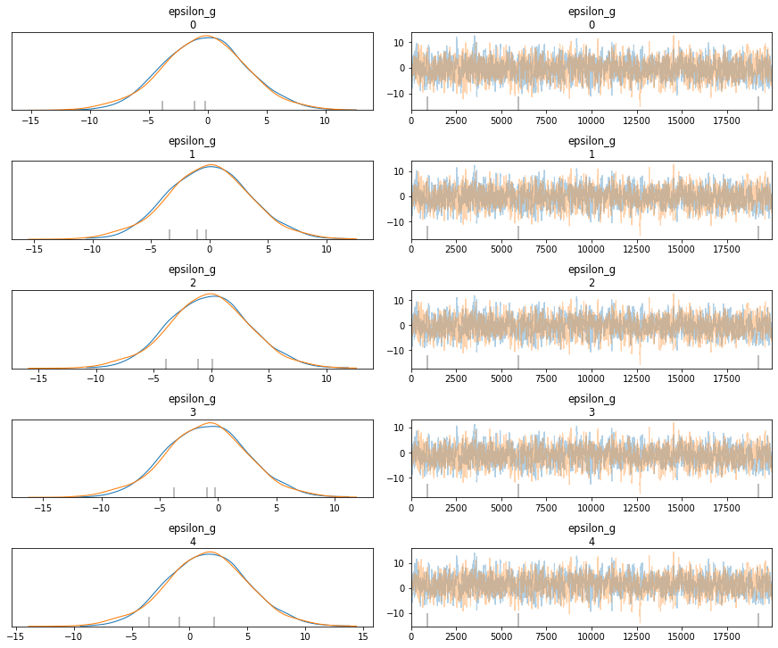
    


```python
az.summary(az_model5, var_names=["sigma_epsilon", "mu_epsilon"])
```


<div>
<style scoped>
    .dataframe tbody tr th:only-of-type {
        vertical-align: middle;
    }

    .dataframe tbody tr th {
        vertical-align: top;
    }

    .dataframe thead th {
        text-align: right;
    }
</style>
<table border="1" class="dataframe">
  <thead>
    <tr style="text-align: right;">
      <th></th>
      <th>mean</th>
      <th>sd</th>
      <th>hpd_3%</th>
      <th>hpd_97%</th>
      <th>mcse_mean</th>
      <th>mcse_sd</th>
      <th>ess_mean</th>
      <th>ess_sd</th>
      <th>ess_bulk</th>
      <th>ess_tail</th>
      <th>r_hat</th>
    </tr>
  </thead>
  <tbody>
    <tr>
      <th>sigma_epsilon</th>
      <td>1.177</td>
      <td>0.507</td>
      <td>0.429</td>
      <td>2.141</td>
      <td>0.006</td>
      <td>0.004</td>
      <td>7419.0</td>
      <td>7419.0</td>
      <td>7136.0</td>
      <td>6557.0</td>
      <td>1.0</td>
    </tr>
    <tr>
      <th>mu_epsilon</th>
      <td>-0.035</td>
      <td>3.473</td>
      <td>-6.646</td>
      <td>6.648</td>
      <td>0.091</td>
      <td>0.065</td>
      <td>1442.0</td>
      <td>1442.0</td>
      <td>1444.0</td>
      <td>1727.0</td>
      <td>1.0</td>
    </tr>
  </tbody>
</table>
</div>


```python
az.plot_forest(az_model5, var_names=["sigma_epsilon", "mu_epsilon"])
plt.show()
```


    

    


```python
az.summary(az_model5, var_names=["beta_c"]).assign(real_value=real_params["beta_c"])
```


<div>
<style scoped>
    .dataframe tbody tr th:only-of-type {
        vertical-align: middle;
    }

    .dataframe tbody tr th {
        vertical-align: top;
    }

    .dataframe thead th {
        text-align: right;
    }
</style>
<table border="1" class="dataframe">
  <thead>
    <tr style="text-align: right;">
      <th></th>
      <th>mean</th>
      <th>sd</th>
      <th>hpd_3%</th>
      <th>hpd_97%</th>
      <th>mcse_mean</th>
      <th>mcse_sd</th>
      <th>ess_mean</th>
      <th>ess_sd</th>
      <th>ess_bulk</th>
      <th>ess_tail</th>
      <th>r_hat</th>
      <th>real_value</th>
    </tr>
  </thead>
  <tbody>
    <tr>
      <th>beta_c[0]</th>
      <td>-1.309</td>
      <td>3.475</td>
      <td>-8.332</td>
      <td>4.937</td>
      <td>0.093</td>
      <td>0.070</td>
      <td>1411.0</td>
      <td>1232.0</td>
      <td>1414.0</td>
      <td>1643.0</td>
      <td>1.0</td>
      <td>-1.249278</td>
    </tr>
    <tr>
      <th>beta_c[1]</th>
      <td>-0.191</td>
      <td>3.476</td>
      <td>-7.247</td>
      <td>6.044</td>
      <td>0.092</td>
      <td>0.066</td>
      <td>1412.0</td>
      <td>1397.0</td>
      <td>1416.0</td>
      <td>1649.0</td>
      <td>1.0</td>
      <td>-0.260331</td>
    </tr>
    <tr>
      <th>beta_c[2]</th>
      <td>0.099</td>
      <td>3.475</td>
      <td>-6.947</td>
      <td>6.324</td>
      <td>0.093</td>
      <td>0.065</td>
      <td>1411.0</td>
      <td>1411.0</td>
      <td>1414.0</td>
      <td>1637.0</td>
      <td>1.0</td>
      <td>0.383793</td>
    </tr>
    <tr>
      <th>beta_c[3]</th>
      <td>-0.258</td>
      <td>3.476</td>
      <td>-7.268</td>
      <td>6.011</td>
      <td>0.093</td>
      <td>0.066</td>
      <td>1411.0</td>
      <td>1383.0</td>
      <td>1414.0</td>
      <td>1643.0</td>
      <td>1.0</td>
      <td>-0.385461</td>
    </tr>
    <tr>
      <th>beta_c[4]</th>
      <td>-1.040</td>
      <td>3.476</td>
      <td>-8.052</td>
      <td>5.214</td>
      <td>0.093</td>
      <td>0.069</td>
      <td>1411.0</td>
      <td>1259.0</td>
      <td>1414.0</td>
      <td>1640.0</td>
      <td>1.0</td>
      <td>-1.085137</td>
    </tr>
    <tr>
      <th>beta_c[5]</th>
      <td>2.198</td>
      <td>3.476</td>
      <td>-4.839</td>
      <td>8.452</td>
      <td>0.093</td>
      <td>0.065</td>
      <td>1410.0</td>
      <td>1410.0</td>
      <td>1413.0</td>
      <td>1638.0</td>
      <td>1.0</td>
      <td>2.327219</td>
    </tr>
    <tr>
      <th>beta_c[6]</th>
      <td>0.244</td>
      <td>3.476</td>
      <td>-6.590</td>
      <td>6.685</td>
      <td>0.093</td>
      <td>0.065</td>
      <td>1412.0</td>
      <td>1412.0</td>
      <td>1415.0</td>
      <td>1642.0</td>
      <td>1.0</td>
      <td>0.430793</td>
    </tr>
    <tr>
      <th>beta_c[7]</th>
      <td>0.374</td>
      <td>3.475</td>
      <td>-6.467</td>
      <td>6.798</td>
      <td>0.093</td>
      <td>0.065</td>
      <td>1411.0</td>
      <td>1411.0</td>
      <td>1414.0</td>
      <td>1634.0</td>
      <td>1.0</td>
      <td>0.432316</td>
    </tr>
    <tr>
      <th>beta_c[8]</th>
      <td>-1.010</td>
      <td>3.476</td>
      <td>-7.980</td>
      <td>5.289</td>
      <td>0.093</td>
      <td>0.069</td>
      <td>1411.0</td>
      <td>1264.0</td>
      <td>1414.0</td>
      <td>1643.0</td>
      <td>1.0</td>
      <td>-0.980011</td>
    </tr>
    <tr>
      <th>beta_c[9]</th>
      <td>-0.735</td>
      <td>3.476</td>
      <td>-7.757</td>
      <td>5.500</td>
      <td>0.093</td>
      <td>0.068</td>
      <td>1411.0</td>
      <td>1296.0</td>
      <td>1414.0</td>
      <td>1643.0</td>
      <td>1.0</td>
      <td>-0.631965</td>
    </tr>
    <tr>
      <th>beta_c[10]</th>
      <td>0.359</td>
      <td>3.477</td>
      <td>-6.556</td>
      <td>6.725</td>
      <td>0.093</td>
      <td>0.065</td>
      <td>1411.0</td>
      <td>1411.0</td>
      <td>1414.0</td>
      <td>1648.0</td>
      <td>1.0</td>
      <td>0.577442</td>
    </tr>
    <tr>
      <th>beta_c[11]</th>
      <td>-0.123</td>
      <td>3.476</td>
      <td>-7.149</td>
      <td>6.118</td>
      <td>0.092</td>
      <td>0.065</td>
      <td>1412.0</td>
      <td>1412.0</td>
      <td>1415.0</td>
      <td>1656.0</td>
      <td>1.0</td>
      <td>-0.124758</td>
    </tr>
    <tr>
      <th>beta_c[12]</th>
      <td>0.745</td>
      <td>3.476</td>
      <td>-6.100</td>
      <td>7.176</td>
      <td>0.093</td>
      <td>0.065</td>
      <td>1412.0</td>
      <td>1412.0</td>
      <td>1415.0</td>
      <td>1639.0</td>
      <td>1.0</td>
      <td>0.978948</td>
    </tr>
    <tr>
      <th>beta_c[13]</th>
      <td>1.252</td>
      <td>3.476</td>
      <td>-5.754</td>
      <td>7.511</td>
      <td>0.093</td>
      <td>0.065</td>
      <td>1411.0</td>
      <td>1411.0</td>
      <td>1414.0</td>
      <td>1645.0</td>
      <td>1.0</td>
      <td>1.594922</td>
    </tr>
    <tr>
      <th>beta_c[14]</th>
      <td>-1.319</td>
      <td>3.476</td>
      <td>-8.300</td>
      <td>4.960</td>
      <td>0.093</td>
      <td>0.070</td>
      <td>1412.0</td>
      <td>1231.0</td>
      <td>1415.0</td>
      <td>1630.0</td>
      <td>1.0</td>
      <td>-1.201945</td>
    </tr>
    <tr>
      <th>beta_c[15]</th>
      <td>-1.298</td>
      <td>3.476</td>
      <td>-8.320</td>
      <td>4.955</td>
      <td>0.093</td>
      <td>0.070</td>
      <td>1412.0</td>
      <td>1238.0</td>
      <td>1415.0</td>
      <td>1647.0</td>
      <td>1.0</td>
      <td>-1.376369</td>
    </tr>
    <tr>
      <th>beta_c[16]</th>
      <td>1.049</td>
      <td>3.476</td>
      <td>-5.844</td>
      <td>7.435</td>
      <td>0.093</td>
      <td>0.065</td>
      <td>1411.0</td>
      <td>1411.0</td>
      <td>1414.0</td>
      <td>1647.0</td>
      <td>1.0</td>
      <td>1.054346</td>
    </tr>
    <tr>
      <th>beta_c[17]</th>
      <td>0.035</td>
      <td>3.475</td>
      <td>-6.671</td>
      <td>6.615</td>
      <td>0.093</td>
      <td>0.065</td>
      <td>1411.0</td>
      <td>1411.0</td>
      <td>1414.0</td>
      <td>1629.0</td>
      <td>1.0</td>
      <td>-0.038853</td>
    </tr>
    <tr>
      <th>beta_c[18]</th>
      <td>0.451</td>
      <td>3.476</td>
      <td>-6.498</td>
      <td>6.774</td>
      <td>0.093</td>
      <td>0.065</td>
      <td>1412.0</td>
      <td>1412.0</td>
      <td>1415.0</td>
      <td>1646.0</td>
      <td>1.0</td>
      <td>0.680286</td>
    </tr>
    <tr>
      <th>beta_c[19]</th>
      <td>1.353</td>
      <td>3.476</td>
      <td>-5.746</td>
      <td>7.515</td>
      <td>0.092</td>
      <td>0.065</td>
      <td>1412.0</td>
      <td>1412.0</td>
      <td>1415.0</td>
      <td>1641.0</td>
      <td>1.0</td>
      <td>1.329175</td>
    </tr>
  </tbody>
</table>
</div>


```python
az.summary(az_model5, var_names=["mu_beta", "sigma_beta"])
```


<div>
<style scoped>
    .dataframe tbody tr th:only-of-type {
        vertical-align: middle;
    }

    .dataframe tbody tr th {
        vertical-align: top;
    }

    .dataframe thead th {
        text-align: right;
    }
</style>
<table border="1" class="dataframe">
  <thead>
    <tr style="text-align: right;">
      <th></th>
      <th>mean</th>
      <th>sd</th>
      <th>hpd_3%</th>
      <th>hpd_97%</th>
      <th>mcse_mean</th>
      <th>mcse_sd</th>
      <th>ess_mean</th>
      <th>ess_sd</th>
      <th>ess_bulk</th>
      <th>ess_tail</th>
      <th>r_hat</th>
    </tr>
  </thead>
  <tbody>
    <tr>
      <th>mu_beta</th>
      <td>0.045</td>
      <td>3.474</td>
      <td>-6.700</td>
      <td>6.575</td>
      <td>0.092</td>
      <td>0.065</td>
      <td>1415.0</td>
      <td>1415.0</td>
      <td>1418.0</td>
      <td>1659.0</td>
      <td>1.0</td>
    </tr>
    <tr>
      <th>sigma_beta</th>
      <td>1.029</td>
      <td>0.178</td>
      <td>0.718</td>
      <td>1.357</td>
      <td>0.002</td>
      <td>0.001</td>
      <td>8880.0</td>
      <td>8756.0</td>
      <td>9129.0</td>
      <td>10531.0</td>
      <td>1.0</td>
    </tr>
  </tbody>
</table>
</div>


```python
model5_mu_post = model5_trace.get_values("mu_sgc")
model5_mu_mean = model5_mu_post.mean(axis=0)
model5_mu_hdi = [az.hpd(x, credible_interval=0.89) for x in model5_mu_post.T]

model5_ppc = data.copy()
model5_ppc["mu_mean"] = model5_mu_mean
model5_ppc["lower_ci"] = [x[0] for x in model5_mu_hdi]
model5_ppc["upper_ci"] = [x[1] for x in model5_mu_hdi]

pos_shift = 0.15

(
    gg.ggplot(model5_ppc, gg.aes("sgRNA"))
    + gg.facet_wrap("gene", scales="free")
    + gg.geom_point(gg.aes(y="logfc"), position=gg.position_nudge(x=-pos_shift))
    + gg.geom_point(
        gg.aes(y="mu_mean"), position=gg.position_nudge(x=pos_shift), color="purple"
    )
    + gg.geom_linerange(
        gg.aes(ymin="lower_ci", ymax="lower_ci"),
        position=gg.position_nudge(x=pos_shift),
        color="purple",
    )
    + gg.theme(subplots_adjust={"hspace": 0.4, "wspace": 0.25}, figure_size=(10, 8))
)
```


    
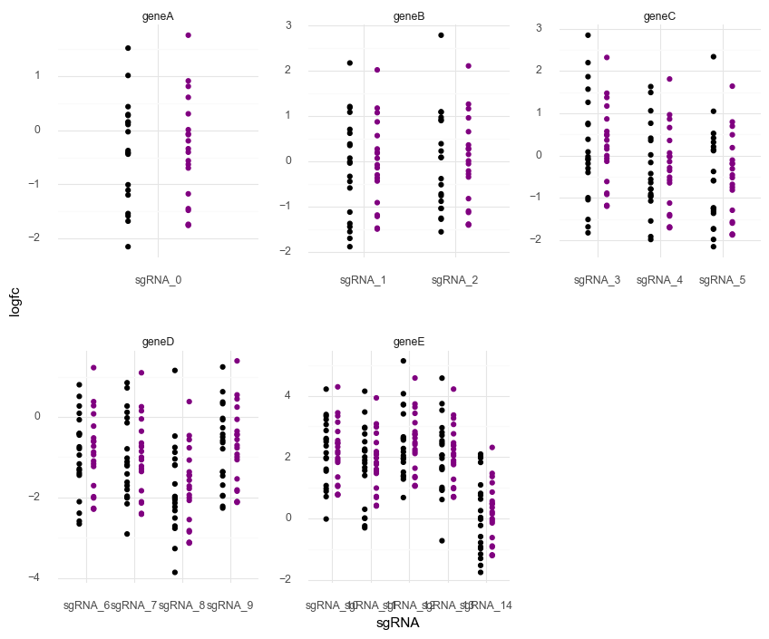
    


    <ggplot: (8779032827969)>


### Notes on the above Model 5

The model fits well, as shown by the very tight posterior predictions of each data point.
Reassuringly, there is also visible shrinkage in the predictions.

The posterior distributions of the parameters of $\alpha_s$, $\epsilon_g$, and $\beta_c$ are *very* wide, though the mean/MAP values are very accurate.
To me, this suggests that there is a lot of correlation between the posterior values. 
This would lead to greater play in the posteriors while maintaining very high accuracy in posterior predictions.

This is proven with the following plot. 🤦🏻‍♂️


```python
d = pd.DataFrame(
    {
        "alpha_s": model5_trace.get_values("alpha_s").mean(axis=1),
        "beta_c": model5_trace.get_values("beta_c").mean(axis=1),
    }
)

(gg.ggplot(d, gg.aes("alpha_s", "beta_c")) + gg.geom_point(size=0.1, alpha=0.2))
```


    

    


    <ggplot: (8779061305961)>


```python
sgrna_idx = data["sgRNA"].cat.codes.to_list()
gene_idx = data["gene"].cat.codes.to_list()
cell_line_idx = data["cell_line"].cat.codes.to_list()

with pm.Model() as model5_flat:
    # Hyper-priors
    # mu_alpha = pm.Normal("mu_epsilon", 0, 2)
    # sigma_alpha = pm.Exponential("sigma_alpha", 0.5)
    mu_beta = pm.Normal("mu_beta", 0, 2)
    sigma_beta = pm.Exponential("sigma_beta", 0.5)
    mu_gamma = pm.Normal("mu_gamma", 0, 2)
    sigma_gamma = pm.Exponential("sigma_gamma", 0.5)

    # Main level priors
    # alpha_s = pm.Normal("alpha_s", mu_alpha, sigma_alpha, shape=num_sgRNA)
    beta_c = pm.Normal("beta_c", mu_beta, sigma_beta, shape=num_cell_lines)
    gamma_g = pm.Normal("gamma_g", mu_gamma, sigma_gamma, shape=num_genes)

    # Main level
    mu_sgc = pm.Deterministic(
        "mu_sgc", beta_c[cell_line_idx] + gamma_g[gene_idx]  # + alpha_s[sgrna_idx]
    )
    sigma = pm.Exponential("sigma", 1)

    # Likelihood
    logfc = pm.Normal("logfc", mu_sgc, sigma, observed=data.logfc)

    # Sampling
    model5f_prior_check = pm.sample_prior_predictive(random_seed=RANDOM_SEED)
    model5f_trace = pm.sample(2000, tune=2000)
    model5f_post_check = pm.sample_posterior_predictive(
        model5f_trace, random_seed=RANDOM_SEED
    )
```

    Auto-assigning NUTS sampler...
    Initializing NUTS using jitter+adapt_diag...
    Multiprocess sampling (2 chains in 2 jobs)
    NUTS: [sigma, gamma_g, beta_c, sigma_gamma, mu_gamma, sigma_beta, mu_beta]
    Sampling 2 chains, 0 divergences: 100%|██████████| 8000/8000 [00:48<00:00, 164.68draws/s]
    The acceptance probability does not match the target. It is 0.9020131860786756, but should be close to 0.8. Try to increase the number of tuning steps.
    The estimated number of effective samples is smaller than 200 for some parameters.
    100%|██████████| 4000/4000 [00:05<00:00, 673.71it/s]


```python
pm.model_to_graphviz(model5_flat)
```


    
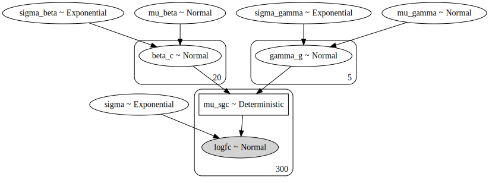
    


```python
az_model5f = az.from_pymc3(
    trace=model5f_trace,
    prior=model5f_prior_check,
    posterior_predictive=model5f_post_check,
)
```


```python
az.summary(az_model5f, var_names=["gamma_g"])
```


<div>
<style scoped>
    .dataframe tbody tr th:only-of-type {
        vertical-align: middle;
    }

    .dataframe tbody tr th {
        vertical-align: top;
    }

    .dataframe thead th {
        text-align: right;
    }
</style>
<table border="1" class="dataframe">
  <thead>
    <tr style="text-align: right;">
      <th></th>
      <th>mean</th>
      <th>sd</th>
      <th>hpd_3%</th>
      <th>hpd_97%</th>
      <th>mcse_mean</th>
      <th>mcse_sd</th>
      <th>ess_mean</th>
      <th>ess_sd</th>
      <th>ess_bulk</th>
      <th>ess_tail</th>
      <th>r_hat</th>
    </tr>
  </thead>
  <tbody>
    <tr>
      <th>gamma_g[0]</th>
      <td>-0.265</td>
      <td>1.400</td>
      <td>-2.618</td>
      <td>2.395</td>
      <td>0.102</td>
      <td>0.073</td>
      <td>187.0</td>
      <td>187.0</td>
      <td>185.0</td>
      <td>307.0</td>
      <td>1.02</td>
    </tr>
    <tr>
      <th>gamma_g[1]</th>
      <td>0.040</td>
      <td>1.390</td>
      <td>-2.350</td>
      <td>2.644</td>
      <td>0.102</td>
      <td>0.073</td>
      <td>184.0</td>
      <td>184.0</td>
      <td>183.0</td>
      <td>299.0</td>
      <td>1.02</td>
    </tr>
    <tr>
      <th>gamma_g[2]</th>
      <td>-0.110</td>
      <td>1.390</td>
      <td>-2.504</td>
      <td>2.491</td>
      <td>0.102</td>
      <td>0.072</td>
      <td>185.0</td>
      <td>185.0</td>
      <td>184.0</td>
      <td>302.0</td>
      <td>1.02</td>
    </tr>
    <tr>
      <th>gamma_g[3]</th>
      <td>-1.002</td>
      <td>1.389</td>
      <td>-3.340</td>
      <td>1.638</td>
      <td>0.102</td>
      <td>0.072</td>
      <td>184.0</td>
      <td>184.0</td>
      <td>183.0</td>
      <td>303.0</td>
      <td>1.02</td>
    </tr>
    <tr>
      <th>gamma_g[4]</th>
      <td>1.832</td>
      <td>1.387</td>
      <td>-0.478</td>
      <td>4.482</td>
      <td>0.102</td>
      <td>0.072</td>
      <td>184.0</td>
      <td>184.0</td>
      <td>183.0</td>
      <td>306.0</td>
      <td>1.02</td>
    </tr>
  </tbody>
</table>
</div>


```python
az.plot_trace(az_model5f, var_names="gamma_g")
plt.show()
```

    /usr/local/Caskroom/miniconda/base/envs/speclet/lib/python3.7/site-packages/arviz/plots/backends/matplotlib/distplot.py:38: UserWarning: Argument backend_kwargs has not effect in matplotlib.plot_distSupplied value won't be used
    /usr/local/Caskroom/miniconda/base/envs/speclet/lib/python3.7/site-packages/arviz/plots/backends/matplotlib/distplot.py:38: UserWarning: Argument backend_kwargs has not effect in matplotlib.plot_distSupplied value won't be used
    /usr/local/Caskroom/miniconda/base/envs/speclet/lib/python3.7/site-packages/arviz/plots/backends/matplotlib/distplot.py:38: UserWarning: Argument backend_kwargs has not effect in matplotlib.plot_distSupplied value won't be used
    /usr/local/Caskroom/miniconda/base/envs/speclet/lib/python3.7/site-packages/arviz/plots/backends/matplotlib/distplot.py:38: UserWarning: Argument backend_kwargs has not effect in matplotlib.plot_distSupplied value won't be used
    /usr/local/Caskroom/miniconda/base/envs/speclet/lib/python3.7/site-packages/arviz/plots/backends/matplotlib/distplot.py:38: UserWarning: Argument backend_kwargs has not effect in matplotlib.plot_distSupplied value won't be used
    /usr/local/Caskroom/miniconda/base/envs/speclet/lib/python3.7/site-packages/arviz/plots/backends/matplotlib/distplot.py:38: UserWarning: Argument backend_kwargs has not effect in matplotlib.plot_distSupplied value won't be used
    /usr/local/Caskroom/miniconda/base/envs/speclet/lib/python3.7/site-packages/arviz/plots/backends/matplotlib/distplot.py:38: UserWarning: Argument backend_kwargs has not effect in matplotlib.plot_distSupplied value won't be used
    /usr/local/Caskroom/miniconda/base/envs/speclet/lib/python3.7/site-packages/arviz/plots/backends/matplotlib/distplot.py:38: UserWarning: Argument backend_kwargs has not effect in matplotlib.plot_distSupplied value won't be used
    /usr/local/Caskroom/miniconda/base/envs/speclet/lib/python3.7/site-packages/arviz/plots/backends/matplotlib/distplot.py:38: UserWarning: Argument backend_kwargs has not effect in matplotlib.plot_distSupplied value won't be used
    /usr/local/Caskroom/miniconda/base/envs/speclet/lib/python3.7/site-packages/arviz/plots/backends/matplotlib/distplot.py:38: UserWarning: Argument backend_kwargs has not effect in matplotlib.plot_distSupplied value won't be used


    
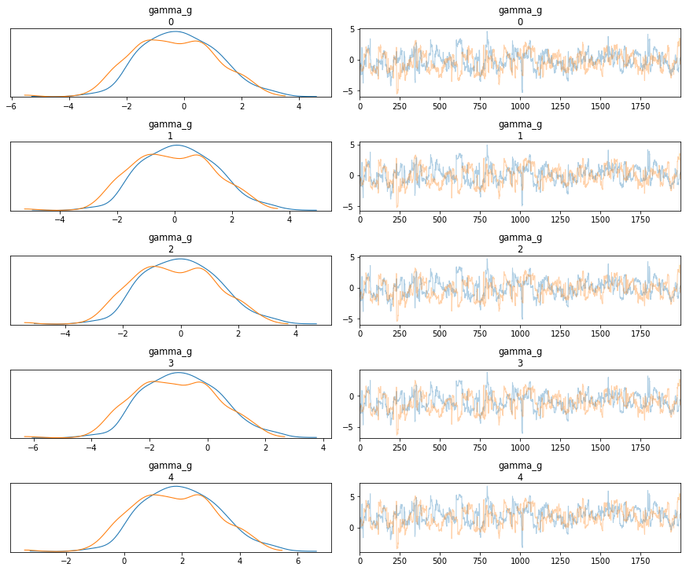
    


```python
d = pd.DataFrame(
    {
        "gamma_g": model5f_trace.get_values("gamma_g").mean(axis=1),
        "beta_c": model5f_trace.get_values("beta_c").mean(axis=1),
    }
)

(gg.ggplot(d, gg.aes("gamma_g", "beta_c")) + gg.geom_point(size=0.1, alpha=0.2))
```


    

    


    <ggplot: (8779016207877)>


```python

```


```python

```


```python

```

---

### Other Models

#### Model C

- same as Model 5, but with $\sigma_{i,c}$

#### Model A

- multiple sgRNAs per gene and not all in each cell line
- varying intercept for cell line and gene; covariate with RNA in each
- copy number as a covariate at the sgRNA level

#### Model B

- Model A
- another covariate for if the gene is mutated
    - sometimes the mutation makes a difference and sometimes it doesn't
        - when it does make a difference, how much of a difference varies, too
    - is this a mixture model or varying effect? - probably a mixture model, but I'm lacking needed knowledge

---

#### General Notes

- Model where some cell lines tend to have higher RNA expression.
- Add another level for cell line varying effects corresponding to shared lineages. (To get practice with adding another level, build a model with just these effects.)


```python

```
