# Modeling DepMap data


```python
import pandas as pd
import numpy as np
import plotnine as gg
import pymc3 as pm
import arviz as az
import seaborn as sns
import matplotlib.pyplot as plt
import string
from itertools import product
from numpy.random import normal, exponential
```


```python
import warnings

warnings.simplefilter(action="ignore", category=UserWarning)
```


```python
gg.theme_set(gg.theme_minimal(base_family="Arial"))
```


```python
RANDOM_SEED = 103
```

## Model 1. Single gene linear model with one covariate

Model the logFC of one gene in multiple cell lines using a single predictor: RNA expression.

$$
logFC \sim Normal(\mu, \sigma) \\
\mu = \alpha + \beta R \\
\alpha \sim \mathcal{N}(0, 10) \\
\beta \sim \mathcal{N}(0, 1) \\
\sigma \sim \text{HalfNormal}(5)
$$

Simulated values:

- number of cell lines: 20
- $\alpha$ = 0.5
- $\beta$ = -1
- $\sigma$ = 0.3


```python
N_CELL_LINES = 20
real_alpha = 0.5
real_beta = -1
real_sigma = 0.3

# Synthetic data
np.random.seed(RANDOM_SEED)
rna = np.random.randn(N_CELL_LINES)
logfc = real_alpha + real_beta * rna + np.random.normal(0, real_sigma, N_CELL_LINES)
data = pd.DataFrame({"rna": rna, "logfc": logfc})

(
    gg.ggplot(data, gg.aes("rna", "logfc"))
    + gg.geom_point(color="blue")
    + gg.geom_abline(slope=real_beta, intercept=real_alpha, linetype="--")
    + gg.labs(x="RNA expression", y="logFC")
)
```


    
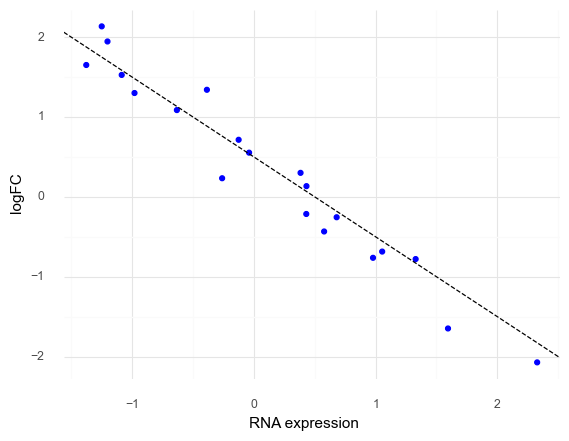
    


    <ggplot: (8738737434402)>


```python
with pm.Model() as model1:
    alpha = pm.Normal("alpha", 0, 10)
    beta = pm.Normal("beta", 0, 1)
    sigma = pm.HalfNormal("sigma", 5)

    mu = pm.Deterministic("mu", alpha + beta * data.rna)

    logfc = pm.Normal("logfc", mu=mu, sigma=sigma, observed=data.logfc)

    model1_prior_check = pm.sample_prior_predictive(random_seed=RANDOM_SEED)
    model1_trace = pm.sample(1000)
    model1_post_check = pm.sample_posterior_predictive(
        model1_trace, random_seed=RANDOM_SEED
    )
```

    Auto-assigning NUTS sampler...
    Initializing NUTS using jitter+adapt_diag...
    Multiprocess sampling (4 chains in 4 jobs)
    NUTS: [sigma, beta, alpha]
    Sampling 4 chains, 0 divergences: 100%|██████████| 6000/6000 [00:01<00:00, 3688.44draws/s]
    100%|██████████| 4000/4000 [00:04<00:00, 925.99it/s]


```python
pm.model_to_graphviz(model1)
```


    

    


```python
az_model1 = az.from_pymc3(
    model1_trace, posterior_predictive=model1_post_check, prior=model1_prior_check
)
```


```python
var_names = ["alpha", "beta", "sigma"]
az.summary(az_model1, var_names=var_names)
```


<div>
<style scoped>
    .dataframe tbody tr th:only-of-type {
        vertical-align: middle;
    }

    .dataframe tbody tr th {
        vertical-align: top;
    }

    .dataframe thead th {
        text-align: right;
    }
</style>
<table border="1" class="dataframe">
  <thead>
    <tr style="text-align: right;">
      <th></th>
      <th>mean</th>
      <th>sd</th>
      <th>hpd_3%</th>
      <th>hpd_97%</th>
      <th>mcse_mean</th>
      <th>mcse_sd</th>
      <th>ess_mean</th>
      <th>ess_sd</th>
      <th>ess_bulk</th>
      <th>ess_tail</th>
      <th>r_hat</th>
    </tr>
  </thead>
  <tbody>
    <tr>
      <th>alpha</th>
      <td>0.438</td>
      <td>0.065</td>
      <td>0.309</td>
      <td>0.557</td>
      <td>0.001</td>
      <td>0.001</td>
      <td>3892.0</td>
      <td>3892.0</td>
      <td>3918.0</td>
      <td>2627.0</td>
      <td>1.0</td>
    </tr>
    <tr>
      <th>beta</th>
      <td>-1.102</td>
      <td>0.064</td>
      <td>-1.226</td>
      <td>-0.990</td>
      <td>0.001</td>
      <td>0.001</td>
      <td>3199.0</td>
      <td>3161.0</td>
      <td>3267.0</td>
      <td>2267.0</td>
      <td>1.0</td>
    </tr>
    <tr>
      <th>sigma</th>
      <td>0.276</td>
      <td>0.051</td>
      <td>0.191</td>
      <td>0.372</td>
      <td>0.001</td>
      <td>0.001</td>
      <td>2807.0</td>
      <td>2607.0</td>
      <td>3135.0</td>
      <td>2560.0</td>
      <td>1.0</td>
    </tr>
  </tbody>
</table>
</div>


```python
az.plot_trace(az_model1, var_names=var_names)
plt.show()
```


    

    


```python
az.plot_posterior(az_model1, var_names=var_names)
plt.show()
```


    

    


```python
prior_pred = (
    az_model1.prior_predictive.to_dataframe()
    .sample(frac=0.5)
    .assign(pred="prior pred.")
)
post_pred = (
    az_model1.posterior_predictive.to_dataframe()
    .sample(frac=0.2)
    .assign(pred="post pred.")
)
model1_preds = pd.concat([prior_pred, post_pred])
model1_preds["pred"] = pd.Categorical(
    model1_preds.pred, categories=["prior pred.", "post pred."]
)
(
    gg.ggplot(model1_preds, gg.aes("logfc"))
    + gg.facet_wrap("pred", nrow=1, scales="free")
    + gg.geom_density(fill="black", alpha=0.1)
    + gg.geom_vline(xintercept=0, linetype="--")
    + gg.scale_y_continuous(limits=(0, np.nan))
    + gg.labs(
        x="logFC",
        y="density",
        title="Prior and posterior predictive distributions of model 1",
    )
    + gg.theme(figure_size=[12, 6], subplots_adjust={"wspace": 0.25})
)
```

    findfont: Font family ['Arial'] not found. Falling back to DejaVu Sans.


    
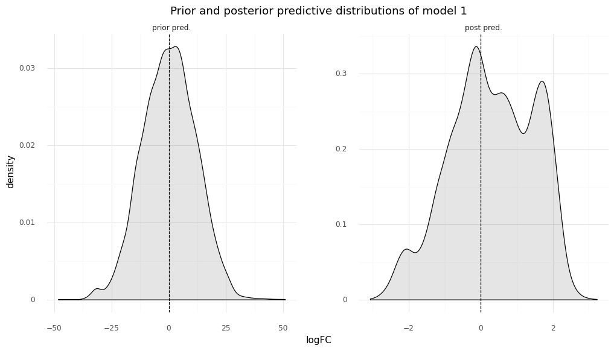
    


    <ggplot: (8738735529271)>


```python
post = az_model1.posterior.to_dataframe()

post_summary = pd.DataFrame(
    {
        "name": ["real line", "fit line"],
        "slope": [real_beta, post.mean()["beta"]],
        "intercept": [real_alpha, post.mean()["alpha"]],
    }
)

(
    gg.ggplot(post.sample(frac=0.1))
    + gg.geom_abline(
        gg.aes(slope="beta", intercept="alpha"), alpha=0.1, color="lightgrey"
    )
    + gg.geom_abline(
        gg.aes(slope="slope", intercept="intercept", color="name"),
        data=post_summary,
        size=2,
        alpha=0.8,
        linetype="--",
    )
    + gg.geom_point(gg.aes(x="rna", y="logfc"), data=data, color="black", size=2)
    + gg.scale_color_brewer(type="qual", palette="Set1")
    + gg.theme(legend_position=(0.8, 0.7))
    + gg.labs(x="RNA expression", y="logFC", title="Posterior of model 1", color="")
)
```


    
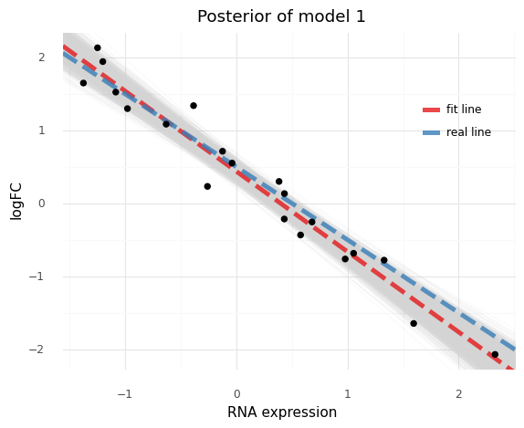
    


    <ggplot: (8738735477511)>


### Conclusions and final thoughts

This model fit well and is easy to interpret. 
Ready to move onto more complex models with more variables and levels.

---

## Model 2. Multiple genes hierarchical model with one covariate

Model the logFC of multiple genes in multiple cell lines using a single predictor: RNA expression.
A hierarchcial model will be used to pool information across genes.

$
logFC \sim Normal(\mu, \sigma) \\
\mu_g = \alpha_g + \beta_g R \\
\quad \alpha_g \sim \mathcal{N}(\mu_\alpha, \sigma_\alpha) \\
\qquad \mu_\alpha \sim \mathcal{N}(0, 10) \quad \sigma_\alpha \sim \text{HalfNormal}(5) \\
\quad \beta_g \sim \mathcal{N}(\mu_\beta, \sigma_\beta) \\
\qquad \mu_\beta \sim \mathcal{N}(0, 10) \quad \sigma_\beta \sim \text{HalfNormal}(5) \\
\sigma \sim \text{HalfNormal}(5)
$

Simulated values:

- number of cell lines: 30
- number of genes: 5
- $\mu_\alpha = -1$, $\sigma_\alpha = 1$
- $\mu_\beta = -1$, $\sigma_\beta = 2$
- $\sigma = 0.3$


```python
np.random.seed(RANDOM_SEED)

num_cell_lines = 30
num_genes = 5

real_mu_alpha, real_sigma_alpha = -1, 1
real_mu_beta, real_sigma_beta = -1, 2
real_sigma = 0.5

real_alpha = np.random.normal(loc=real_mu_alpha, scale=real_sigma_alpha, size=num_genes)
real_beta = np.random.normal(loc=real_mu_beta, scale=real_sigma_beta, size=num_genes)

genes = ["gene" + a for a in string.ascii_uppercase[:num_genes]]
rna = np.random.randn(num_genes, num_cell_lines)

logfc = (
    real_alpha
    + real_beta * rna.T
    + np.random.normal(loc=0, scale=real_sigma, size=(rna.T.shape))
)
logfc = logfc.T
```


```python
rna_flat = rna.flatten()
logfc_flat = logfc.flatten()
gene_idx = np.repeat(range(num_genes), num_cell_lines)
```

The following plot shows that each gene has a different y-intercept and slope with RNA expression.
These varying effects should be discovered by the model.


```python
tidy_data = pd.DataFrame(
    {"gene": [genes[i] for i in gene_idx], "rna": rna_flat, "logfc": logfc_flat}
)

tidy_real_data = pd.DataFrame({"alpha": real_alpha, "beta": real_beta, "gene": genes})


(
    gg.ggplot(tidy_data)
    + gg.geom_point(gg.aes(x="rna", y="logfc", color="gene"))
    + gg.geom_abline(
        gg.aes(slope="beta", intercept="alpha", color="gene"),
        data=tidy_real_data,
        linetype="--",
    )
    + gg.labs(
        x="RNA expression", y="logFC", color="gene", title="Model 2 synthetic data"
    )
)
```


    
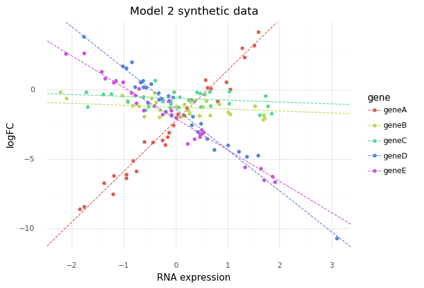
    


    <ggplot: (8738735709501)>


```python
with pm.Model() as model2:
    # Hyper-priors
    mu_alpha = pm.Normal("mu_alpha", 0, 5)
    sigma_alpha = pm.HalfNormal("sigma_alpha", 5)
    mu_beta = pm.Normal("mu_beta", 0, 2)
    sigma_beta = pm.HalfNormal("sigma_beta", 2)

    # Priors
    alpha = pm.Normal("alpha", mu_alpha, sigma_alpha, shape=num_genes)
    beta = pm.Normal("beta", mu_beta, sigma_beta, shape=num_genes)
    mu = pm.Deterministic("mu", alpha[gene_idx] + beta[gene_idx] * rna_flat)
    sigma = pm.HalfNormal("sigma", 5)

    # Likelihood
    logfc = pm.Normal("logfc", mu=mu, sigma=sigma, observed=logfc_flat)

    # Sampling
    model2_prior_check = pm.sample_prior_predictive(random_seed=RANDOM_SEED)
    model2_trace = pm.sample(2000, tune=2000, random_seed=RANDOM_SEED)
    model2_post_check = pm.sample_posterior_predictive(
        model2_trace, random_seed=RANDOM_SEED
    )
```

    Auto-assigning NUTS sampler...
    Initializing NUTS using jitter+adapt_diag...
    Multiprocess sampling (4 chains in 4 jobs)
    NUTS: [sigma, beta, alpha, sigma_beta, mu_beta, sigma_alpha, mu_alpha]
    Sampling 4 chains, 11 divergences: 100%|██████████| 16000/16000 [00:08<00:00, 1811.30draws/s]
    There were 8 divergences after tuning. Increase `target_accept` or reparameterize.
    There was 1 divergence after tuning. Increase `target_accept` or reparameterize.
    There were 2 divergences after tuning. Increase `target_accept` or reparameterize.
    100%|██████████| 8000/8000 [00:08<00:00, 962.17it/s]


```python
pm.model_to_graphviz(model2)
```


    
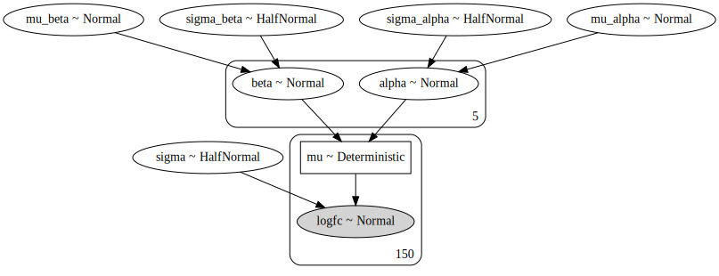
    


```python
az_model2 = az.from_pymc3(
    trace=model2_trace, prior=model2_prior_check, posterior_predictive=model2_post_check
)
az.summary(az_model2, var_names=["alpha", "beta", "sigma"])
```


<div>
<style scoped>
    .dataframe tbody tr th:only-of-type {
        vertical-align: middle;
    }

    .dataframe tbody tr th {
        vertical-align: top;
    }

    .dataframe thead th {
        text-align: right;
    }
</style>
<table border="1" class="dataframe">
  <thead>
    <tr style="text-align: right;">
      <th></th>
      <th>mean</th>
      <th>sd</th>
      <th>hpd_3%</th>
      <th>hpd_97%</th>
      <th>mcse_mean</th>
      <th>mcse_sd</th>
      <th>ess_mean</th>
      <th>ess_sd</th>
      <th>ess_bulk</th>
      <th>ess_tail</th>
      <th>r_hat</th>
    </tr>
  </thead>
  <tbody>
    <tr>
      <th>alpha[0]</th>
      <td>-2.414</td>
      <td>0.100</td>
      <td>-2.599</td>
      <td>-2.231</td>
      <td>0.001</td>
      <td>0.001</td>
      <td>14055.0</td>
      <td>14055.0</td>
      <td>14143.0</td>
      <td>5249.0</td>
      <td>1.0</td>
    </tr>
    <tr>
      <th>alpha[1]</th>
      <td>-1.274</td>
      <td>0.098</td>
      <td>-1.461</td>
      <td>-1.090</td>
      <td>0.001</td>
      <td>0.001</td>
      <td>14085.0</td>
      <td>13538.0</td>
      <td>14145.0</td>
      <td>5202.0</td>
      <td>1.0</td>
    </tr>
    <tr>
      <th>alpha[2]</th>
      <td>-0.763</td>
      <td>0.101</td>
      <td>-0.958</td>
      <td>-0.575</td>
      <td>0.001</td>
      <td>0.001</td>
      <td>11863.0</td>
      <td>11467.0</td>
      <td>11840.0</td>
      <td>5577.0</td>
      <td>1.0</td>
    </tr>
    <tr>
      <th>alpha[3]</th>
      <td>-1.377</td>
      <td>0.099</td>
      <td>-1.564</td>
      <td>-1.197</td>
      <td>0.001</td>
      <td>0.001</td>
      <td>11962.0</td>
      <td>11742.0</td>
      <td>12078.0</td>
      <td>5465.0</td>
      <td>1.0</td>
    </tr>
    <tr>
      <th>alpha[4]</th>
      <td>-2.148</td>
      <td>0.098</td>
      <td>-2.330</td>
      <td>-1.961</td>
      <td>0.001</td>
      <td>0.001</td>
      <td>12748.0</td>
      <td>12748.0</td>
      <td>12728.0</td>
      <td>6201.0</td>
      <td>1.0</td>
    </tr>
    <tr>
      <th>beta[0]</th>
      <td>3.587</td>
      <td>0.103</td>
      <td>3.402</td>
      <td>3.793</td>
      <td>0.001</td>
      <td>0.001</td>
      <td>13058.0</td>
      <td>12958.0</td>
      <td>13027.0</td>
      <td>5802.0</td>
      <td>1.0</td>
    </tr>
    <tr>
      <th>beta[1]</th>
      <td>-0.355</td>
      <td>0.100</td>
      <td>-0.543</td>
      <td>-0.165</td>
      <td>0.001</td>
      <td>0.001</td>
      <td>12660.0</td>
      <td>10075.0</td>
      <td>12698.0</td>
      <td>4804.0</td>
      <td>1.0</td>
    </tr>
    <tr>
      <th>beta[2]</th>
      <td>-0.144</td>
      <td>0.103</td>
      <td>-0.336</td>
      <td>0.050</td>
      <td>0.001</td>
      <td>0.001</td>
      <td>13067.0</td>
      <td>8612.0</td>
      <td>13061.0</td>
      <td>6280.0</td>
      <td>1.0</td>
    </tr>
    <tr>
      <th>beta[3]</th>
      <td>-2.837</td>
      <td>0.103</td>
      <td>-3.039</td>
      <td>-2.653</td>
      <td>0.001</td>
      <td>0.001</td>
      <td>13633.0</td>
      <td>13614.0</td>
      <td>13623.0</td>
      <td>5472.0</td>
      <td>1.0</td>
    </tr>
    <tr>
      <th>beta[4]</th>
      <td>-2.360</td>
      <td>0.094</td>
      <td>-2.534</td>
      <td>-2.185</td>
      <td>0.001</td>
      <td>0.001</td>
      <td>13713.0</td>
      <td>13099.0</td>
      <td>13662.0</td>
      <td>5767.0</td>
      <td>1.0</td>
    </tr>
    <tr>
      <th>sigma</th>
      <td>0.539</td>
      <td>0.033</td>
      <td>0.482</td>
      <td>0.604</td>
      <td>0.000</td>
      <td>0.000</td>
      <td>11602.0</td>
      <td>11381.0</td>
      <td>11762.0</td>
      <td>5716.0</td>
      <td>1.0</td>
    </tr>
  </tbody>
</table>
</div>


```python
# Real values
pd.DataFrame({"real alpha": real_alpha, "real beta": real_beta})
```


<div>
<style scoped>
    .dataframe tbody tr th:only-of-type {
        vertical-align: middle;
    }

    .dataframe tbody tr th {
        vertical-align: top;
    }

    .dataframe thead th {
        text-align: right;
    }
</style>
<table border="1" class="dataframe">
  <thead>
    <tr style="text-align: right;">
      <th></th>
      <th>real alpha</th>
      <th>real beta</th>
    </tr>
  </thead>
  <tbody>
    <tr>
      <th>0</th>
      <td>-2.249278</td>
      <td>3.654438</td>
    </tr>
    <tr>
      <th>1</th>
      <td>-1.260331</td>
      <td>-0.138414</td>
    </tr>
    <tr>
      <th>2</th>
      <td>-0.616207</td>
      <td>-0.135368</td>
    </tr>
    <tr>
      <th>3</th>
      <td>-1.385461</td>
      <td>-2.960023</td>
    </tr>
    <tr>
      <th>4</th>
      <td>-2.085137</td>
      <td>-2.263930</td>
    </tr>
  </tbody>
</table>
</div>


```python
az.plot_trace(az_model2, var_names=var_names)
plt.show()
```


    
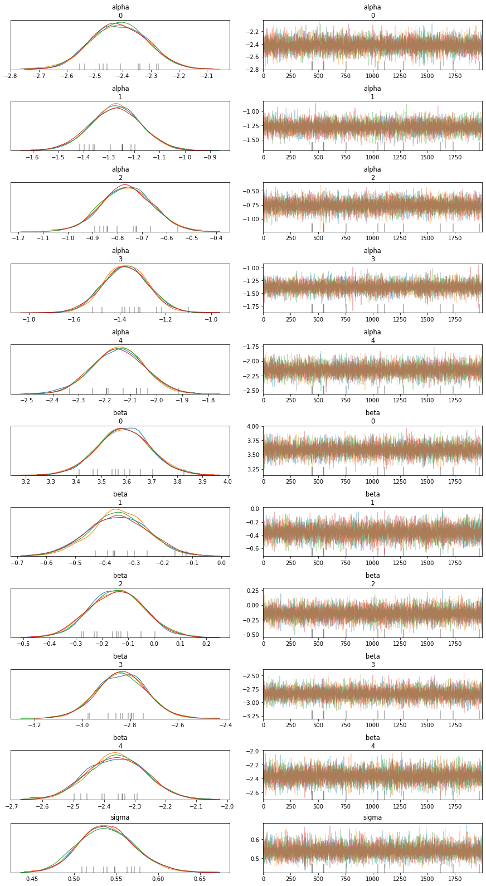
    


The varying effects were captured *very* well.


```python
az.plot_forest(az_model2, var_names=var_names, combined=True)
plt.show()
```


    
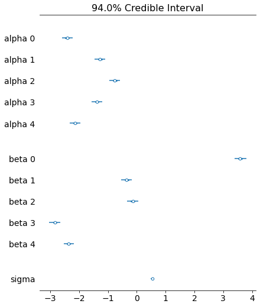
    


```python
post = (
    az_model2.posterior.to_dataframe()
    .query("alpha_dim_0 == beta_dim_0")
    .reset_index()
    .groupby(["alpha_dim_0", "beta_dim_0"])
    .apply(lambda x: x.sample(frac=0.1))
    .reset_index(drop=True)
)
```


```python
post.head()
```


<div>
<style scoped>
    .dataframe tbody tr th:only-of-type {
        vertical-align: middle;
    }

    .dataframe tbody tr th {
        vertical-align: top;
    }

    .dataframe thead th {
        text-align: right;
    }
</style>
<table border="1" class="dataframe">
  <thead>
    <tr style="text-align: right;">
      <th></th>
      <th>alpha_dim_0</th>
      <th>beta_dim_0</th>
      <th>chain</th>
      <th>draw</th>
      <th>mu_dim_0</th>
      <th>mu_alpha</th>
      <th>mu_beta</th>
      <th>alpha</th>
      <th>beta</th>
      <th>sigma_alpha</th>
      <th>sigma_beta</th>
      <th>mu</th>
      <th>sigma</th>
    </tr>
  </thead>
  <tbody>
    <tr>
      <th>0</th>
      <td>0</td>
      <td>0</td>
      <td>0</td>
      <td>1848</td>
      <td>13</td>
      <td>-1.239189</td>
      <td>0.580714</td>
      <td>-2.594805</td>
      <td>3.575071</td>
      <td>0.742496</td>
      <td>2.212606</td>
      <td>2.826284</td>
      <td>0.581841</td>
    </tr>
    <tr>
      <th>1</th>
      <td>0</td>
      <td>0</td>
      <td>1</td>
      <td>416</td>
      <td>68</td>
      <td>-1.567604</td>
      <td>1.725339</td>
      <td>-2.552960</td>
      <td>3.677716</td>
      <td>0.960669</td>
      <td>2.135674</td>
      <td>-0.726718</td>
      <td>0.557574</td>
    </tr>
    <tr>
      <th>2</th>
      <td>0</td>
      <td>0</td>
      <td>1</td>
      <td>749</td>
      <td>55</td>
      <td>-2.384778</td>
      <td>-0.207552</td>
      <td>-2.495805</td>
      <td>3.767642</td>
      <td>2.673232</td>
      <td>1.817443</td>
      <td>-2.020357</td>
      <td>0.541390</td>
    </tr>
    <tr>
      <th>3</th>
      <td>0</td>
      <td>0</td>
      <td>2</td>
      <td>702</td>
      <td>80</td>
      <td>-1.510693</td>
      <td>-2.066652</td>
      <td>-2.600381</td>
      <td>3.722385</td>
      <td>0.682259</td>
      <td>3.661321</td>
      <td>-0.915152</td>
      <td>0.501096</td>
    </tr>
    <tr>
      <th>4</th>
      <td>0</td>
      <td>0</td>
      <td>2</td>
      <td>1510</td>
      <td>143</td>
      <td>-3.255299</td>
      <td>-0.669700</td>
      <td>-2.523524</td>
      <td>3.475155</td>
      <td>1.643196</td>
      <td>3.595742</td>
      <td>0.262516</td>
      <td>0.503061</td>
    </tr>
  </tbody>
</table>
</div>


```python
post["gene"] = [genes[i] for i in post.alpha_dim_0]

(
    gg.ggplot(post)
    + gg.geom_abline(gg.aes(slope="beta", intercept="alpha", color="gene"), alpha=0.01)
    + gg.geom_point(gg.aes(x="rna", y="logfc", color="gene"), data=tidy_data, size=2)
    + gg.geom_abline(
        gg.aes(slope="beta", intercept="alpha", color="gene"),
        data=tidy_real_data,
        linetype="--",
        size=2,
    )
    + gg.labs(
        x="RNA expression", y="logFC", color="gene", title="Model 2 synthetic data"
    )
)
```


    
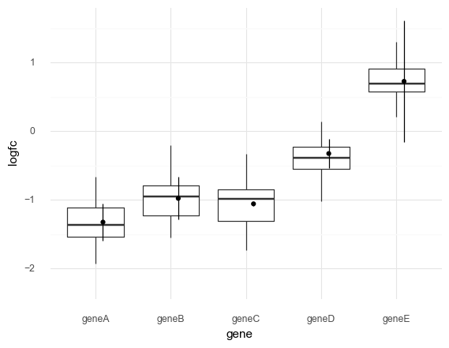
    


    <ggplot: (8738726038480)>


### Conclusions and final thoughts

This hierharchcial model fit very well and the results were interpretable.

---

## Model 3. Multiple logFC readings per gene per cell line and only one RNA expression reading

Model the logFC of multiple genes in multiple cell lines using a single predictor: RNA expression.
There are multiple logFC readings per gene per cell line, but only one RNA expression reading.
(For now) there is only one varying effect for gene.

$
logFC_g \sim \mathcal{N}(\mu_g, \sigma) \\
\quad \mu_g = \alpha_g \\
\qquad \alpha_g \sim \mathcal{N}(\mu_{\alpha_g}, \sigma_{\alpha_g}) \\
\qquad \quad \mu_{\alpha_g} = \gamma_g + \delta_g R \\
\qquad \qquad \gamma_g \sim \mathcal{N}(\mu_\gamma, \sigma_\gamma) \\
\qquad \qquad \quad \mu_\gamma \sim \mathcal{N}(0,5) \quad \sigma_\gamma \sim \text{Exp}(1) \\
\qquad \qquad \delta_g \sim \mathcal{N}(\mu_\delta, \sigma_\delta) \\
\qquad \qquad \quad \mu_\delta \sim \mathcal{N}(0,5) \quad \sigma_\delta \sim \text{Exp}(1) \\
\qquad \quad \sigma_{\alpha_g} \sim \text{Exp}(\sigma_g) \\
\qquad \qquad \sigma_g \sim \text{Exp}(1) \\
\quad \sigma \sim \text{Exp}(1)
$

Simulated real values:

- number of cell lines: 30
- number of logFC data points per gene per cell line: 3
- number of genes: 5
- $\mu_\gamma = -1$
- $\sigma_\gamma = 0.4$
- $\mu_\delta = 0$
- $\sigma_\delta = 1$
- $\sigma_g = 0.4$
- $\sigma = 0.3$


```python
np.random.seed(RANDOM_SEED)

# Synthetic data parmeters
num_cell_lines = 20
num_logfc_datum = 3
num_genes = 5

# Real hyper-parameter values
real_mu_gamma = -1
real_sigma_gamma = 0.4
real_mu_delta = 0
real_sigma_delta = 1
real_sigma_g = 0.4
real_sigma = 0.3


genes = ["gene" + a for a in string.ascii_uppercase[:num_genes]]
gene_idx = list(range(num_genes))

cell_lines = ["cell" + a for a in string.ascii_uppercase[:num_cell_lines]]
cell_line_idx = list(range(num_cell_lines))

# RNA expression data (scaled within each gene)
rna = np.random.normal(loc=0, scale=1, size=(num_genes, num_cell_lines))
rna_data = pd.DataFrame(list(product(genes, cell_lines)), columns=["gene", "cell_line"])
rna_data["rna"] = rna.flatten()

for c in ["gene", "cell_line"]:
    rna_data[c] = pd.Categorical(rna_data[c])


real_gamma_g = np.random.normal(real_mu_gamma, real_sigma_gamma, (num_genes, 1))
real_delta_g = np.random.normal(real_mu_delta, real_sigma_delta, (num_genes, 1))
real_mu_alpha = (real_gamma_g + rna * real_delta_g).mean(axis=1)
real_sigma_alpha = np.random.exponential(real_sigma_g, num_genes)

real_alpha_g = np.random.normal(real_mu_alpha, real_sigma_alpha)
real_mu_g = real_alpha_g

ko_idx = list(range(num_logfc_datum))
logfc_data = pd.DataFrame(
    list(product(ko_idx, genes, cell_lines)), columns=["ko_idx", "gene", "cell_line"]
)

for c in ["gene", "cell_line"]:
    logfc_data[c] = pd.Categorical(logfc_data[c])


logfc_data["logfc"] = np.nan
for i in range(len(logfc_data)):
    g = logfc_data["gene"].cat.codes[i]
    logfc_data.loc[i, "logfc"] = np.random.normal(real_mu_g[g], real_sigma)

logfc_data
```


<div>
<style scoped>
    .dataframe tbody tr th:only-of-type {
        vertical-align: middle;
    }

    .dataframe tbody tr th {
        vertical-align: top;
    }

    .dataframe thead th {
        text-align: right;
    }
</style>
<table border="1" class="dataframe">
  <thead>
    <tr style="text-align: right;">
      <th></th>
      <th>ko_idx</th>
      <th>gene</th>
      <th>cell_line</th>
      <th>logfc</th>
    </tr>
  </thead>
  <tbody>
    <tr>
      <th>0</th>
      <td>0</td>
      <td>geneA</td>
      <td>cellA</td>
      <td>-1.475160</td>
    </tr>
    <tr>
      <th>1</th>
      <td>0</td>
      <td>geneA</td>
      <td>cellB</td>
      <td>-1.574389</td>
    </tr>
    <tr>
      <th>2</th>
      <td>0</td>
      <td>geneA</td>
      <td>cellC</td>
      <td>-1.413401</td>
    </tr>
    <tr>
      <th>3</th>
      <td>0</td>
      <td>geneA</td>
      <td>cellD</td>
      <td>-1.057404</td>
    </tr>
    <tr>
      <th>4</th>
      <td>0</td>
      <td>geneA</td>
      <td>cellE</td>
      <td>-1.570743</td>
    </tr>
    <tr>
      <th>...</th>
      <td>...</td>
      <td>...</td>
      <td>...</td>
      <td>...</td>
    </tr>
    <tr>
      <th>295</th>
      <td>2</td>
      <td>geneE</td>
      <td>cellP</td>
      <td>0.758133</td>
    </tr>
    <tr>
      <th>296</th>
      <td>2</td>
      <td>geneE</td>
      <td>cellQ</td>
      <td>0.352038</td>
    </tr>
    <tr>
      <th>297</th>
      <td>2</td>
      <td>geneE</td>
      <td>cellR</td>
      <td>0.583303</td>
    </tr>
    <tr>
      <th>298</th>
      <td>2</td>
      <td>geneE</td>
      <td>cellS</td>
      <td>0.818320</td>
    </tr>
    <tr>
      <th>299</th>
      <td>2</td>
      <td>geneE</td>
      <td>cellT</td>
      <td>0.686769</td>
    </tr>
  </tbody>
</table>
<p>300 rows × 4 columns</p>
</div>


```python
known_logfc_values_df = pd.DataFrame(
    {"gene": genes, "logfc": real_alpha_g, "sd": real_sigma_alpha}
)
known_logfc_values_df["lower_err"] = (
    known_logfc_values_df["logfc"] - known_logfc_values_df["sd"]
)
known_logfc_values_df["upper_err"] = (
    known_logfc_values_df["logfc"] + known_logfc_values_df["sd"]
)

pos = gg.position_nudge(x=0.1)

(
    gg.ggplot(logfc_data, gg.aes(x="gene", y="logfc"))
    + gg.geom_boxplot(outlier_color="")
    + gg.geom_linerange(
        gg.aes(ymin="lower_err", ymax="upper_err"),
        data=known_logfc_values_df,
        position=pos,
    )
    + gg.geom_point(data=known_logfc_values_df, position=pos)
)
```


    

    


    <ggplot: (8738726034529)>


```python
merged_data = pd.merge(logfc_data, rna_data, how="inner", on=["gene", "cell_line"])

(
    gg.ggplot(merged_data, gg.aes(x="rna", y="logfc", color="gene"))
    + gg.geom_point(gg.aes(shape="factor(ko_idx)"), alpha=0.8, size=1.8)
)
```


    
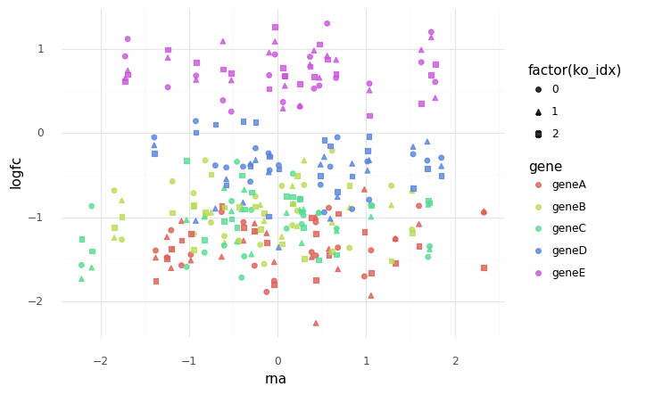
    


    <ggplot: (8738726030514)>


### Conclusions and final thoughts

This was an incorrect understanding of how to use a predictor variable in a higher level of the model.
Though it is not the right model the purposes of this project, I'll leave it here as an example.

---

## Model 4. Multiple genes and multiple cell lines hierarchical model with one covariate

Model the logFC of multiple genes in multiple cell lines using a single predictor: RNA expression.
A hierarchcial model will be used to pool information across genes and cell lines.
Also, to better mimic real data, I have added in the fact that there are multiple measures of logFC for each gene, but only one measure for RNA expression.

$
logFC_{g,c} \sim Normal(\mu_{g,c}, \sigma) \\
\quad \mu_g = \alpha_g + \gamma_c + \beta_g R \\
\qquad \alpha_g \sim \mathcal{N}(\mu_\alpha, \sigma_\alpha) \\
\qquad \quad \mu_\alpha \sim \mathcal{N}(0, 5) \quad \sigma_\alpha \sim \text{Exp}(1) \\
\qquad \gamma_c \sim \mathcal{N}(\mu_\gamma, \sigma_\gamma) \\
\qquad \quad \mu_\gamma \sim \mathcal{N}(0, 5) \quad \sigma_\gamma \sim \text{Exp}(1) \\
\qquad \beta_g \sim \mathcal{N}(\mu_\beta, \sigma_\beta) \\
\qquad \quad \mu_\beta \sim \mathcal{N}(0, 2) \quad \sigma_\beta \sim \text{Exp}(1) \\
\quad \sigma \sim \text{Exp}(1)
$


Simulated values:

- number of cell lines: 20
- number of genes: 5
- number of repeated measures: 3
- $\mu_\alpha = -1$, $\sigma_\alpha = 1$
- $\mu_\gamma = 0$, $\sigma_\gamma = 3$
- $\mu_\beta = -1$, $\sigma_\beta = 2$
- $\sigma = 0.3$


```python
N = 5000
np.random.seed(0)
sigma_dists = pd.DataFrame(
    {
        "name": np.repeat(["normal", "exponential"], N),
        "value": np.concatenate(
            [np.abs(np.random.normal(0, 5, N)), np.random.exponential(1, N)]
        ).flatten(),
    }
)

(
    gg.ggplot(sigma_dists, gg.aes("value"))
    + gg.geom_density(gg.aes(color="name", fill="name"), alpha=0.2, size=1.2)
    + gg.scale_color_brewer(type="qual", palette="Set1")
    + gg.theme(legend_position=(0.7, 0.7))
    + gg.labs(title="Visualization of two common distributions for std. dev.")
)
```


    
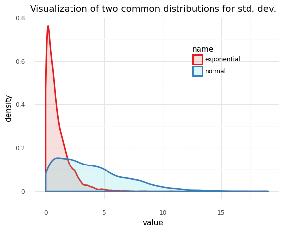
    


    <ggplot: (8738725995524)>


```python
np.random.seed(RANDOM_SEED)

# Real data parameters.
num_genes = 5
num_cell_lines = 20
num_logfc_datum = 3

# Real model values.
real_mu_alpha, real_sigma_alpha = -1, 1
real_mu_gamma, real_sigma_gamma = 0, 3
real_mu_beta, real_sigma_beta = -1, 2
real_sigma = 0.3

# Sample from real distributions for the rest of the model parameters.
real_alpha_g = np.random.normal(real_mu_alpha, real_sigma_alpha, num_genes)
real_gamma_c = np.random.normal(real_mu_gamma, real_sigma_gamma, num_cell_lines)
real_beta_g = np.random.normal(real_mu_beta, real_sigma_beta, num_genes)

rna_data = pd.DataFrame(list(product(genes, cell_lines)), columns=["gene", "cell_line"])

# RNA data (scaled by gene).
rna_data["rna"] = np.random.normal(0, 1, len(rna_data))

for c in ["gene", "cell_line"]:
    rna_data[c] = pd.Categorical(rna_data[c])

logfc_data = []
for i in range(num_logfc_datum):
    x = rna_data.copy()
    x["sgrna_idx"] = i
    logfc_data.append(x)

logfc_data = pd.concat(logfc_data).reset_index(drop=True)

logfc_data["logfc"] = np.nan
for i in range(len(logfc_data)):
    gene_i = logfc_data["gene"].cat.codes[i]
    cell_line_i = logfc_data["cell_line"].cat.codes[i]
    mu = (
        real_alpha_g[gene_i]
        + real_gamma_c[cell_line_i]
        + real_beta_g[gene_i] * logfc_data.loc[i, "rna"]
    )
    logfc_data.loc[i, "logfc"] = np.random.normal(mu, real_sigma)

logfc_data
```


<div>
<style scoped>
    .dataframe tbody tr th:only-of-type {
        vertical-align: middle;
    }

    .dataframe tbody tr th {
        vertical-align: top;
    }

    .dataframe thead th {
        text-align: right;
    }
</style>
<table border="1" class="dataframe">
  <thead>
    <tr style="text-align: right;">
      <th></th>
      <th>gene</th>
      <th>cell_line</th>
      <th>rna</th>
      <th>sgrna_idx</th>
      <th>logfc</th>
    </tr>
  </thead>
  <tbody>
    <tr>
      <th>0</th>
      <td>geneA</td>
      <td>cellA</td>
      <td>-1.187443</td>
      <td>0</td>
      <td>7.516370</td>
    </tr>
    <tr>
      <th>1</th>
      <td>geneA</td>
      <td>cellB</td>
      <td>0.299138</td>
      <td>0</td>
      <td>-1.184598</td>
    </tr>
    <tr>
      <th>2</th>
      <td>geneA</td>
      <td>cellC</td>
      <td>-0.947764</td>
      <td>0</td>
      <td>1.945419</td>
    </tr>
    <tr>
      <th>3</th>
      <td>geneA</td>
      <td>cellD</td>
      <td>-1.843382</td>
      <td>0</td>
      <td>-0.861100</td>
    </tr>
    <tr>
      <th>4</th>
      <td>geneA</td>
      <td>cellE</td>
      <td>0.810589</td>
      <td>0</td>
      <td>-6.491923</td>
    </tr>
    <tr>
      <th>...</th>
      <td>...</td>
      <td>...</td>
      <td>...</td>
      <td>...</td>
      <td>...</td>
    </tr>
    <tr>
      <th>295</th>
      <td>geneE</td>
      <td>cellP</td>
      <td>1.219362</td>
      <td>2</td>
      <td>0.194254</td>
    </tr>
    <tr>
      <th>296</th>
      <td>geneE</td>
      <td>cellQ</td>
      <td>-0.840481</td>
      <td>2</td>
      <td>-5.967522</td>
    </tr>
    <tr>
      <th>297</th>
      <td>geneE</td>
      <td>cellR</td>
      <td>0.607882</td>
      <td>2</td>
      <td>-0.719954</td>
    </tr>
    <tr>
      <th>298</th>
      <td>geneE</td>
      <td>cellS</td>
      <td>0.429605</td>
      <td>2</td>
      <td>1.885927</td>
    </tr>
    <tr>
      <th>299</th>
      <td>geneE</td>
      <td>cellT</td>
      <td>-1.014537</td>
      <td>2</td>
      <td>-1.022285</td>
    </tr>
  </tbody>
</table>
<p>300 rows × 5 columns</p>
</div>


```python
(
    gg.ggplot(logfc_data, gg.aes(x="rna", y="logfc", color="gene"))
    + gg.geom_point(size=1.8, alpha=0.8)
    + gg.scale_color_brewer(type="qual", palette="Set1")
    + gg.labs(x="RNA expression (scaled)", y="logFC", color="")
)
```


    
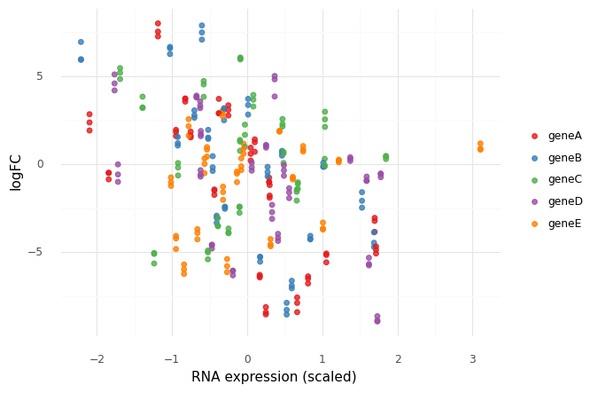
    


    <ggplot: (8738735529403)>


```python
(
    gg.ggplot(logfc_data, gg.aes(x="rna", y="logfc", color="gene"))
    + gg.facet_wrap("gene", nrow=2)
    + gg.geom_point(size=1.8, alpha=0.8)
    + gg.geom_smooth(method="lm")
    + gg.scale_color_brewer(type="qual", palette="Set1")
    + gg.labs(x="RNA expression (scaled)", y="logFC", color="")
)
```


    
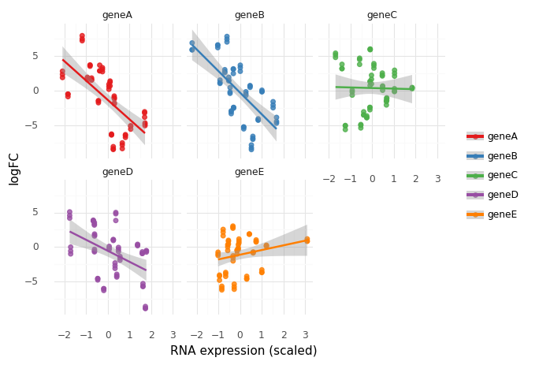
    


    <ggplot: (8738725914941)>


```python
(
    gg.ggplot(logfc_data, gg.aes(x="cell_line", y="logfc"))
    + gg.geom_hline(yintercept=0, color="gray")
    + gg.geom_boxplot(color="black", fill="black", alpha=0.05, outlier_color="")
    + gg.geom_jitter(gg.aes(color="gene"), width=0.3, size=1)
    + gg.scale_color_brewer(type="qual", palette="Set1")
    + gg.scale_x_discrete(labels=[a.replace("cell", "") for a in cell_lines])
    + gg.scale_y_continuous(breaks=range(-16, 16, 2))
    + gg.theme(panel_grid_major_x=gg.element_blank())
    + gg.labs(x="cell line", y="logFC", color="")
)
```


    
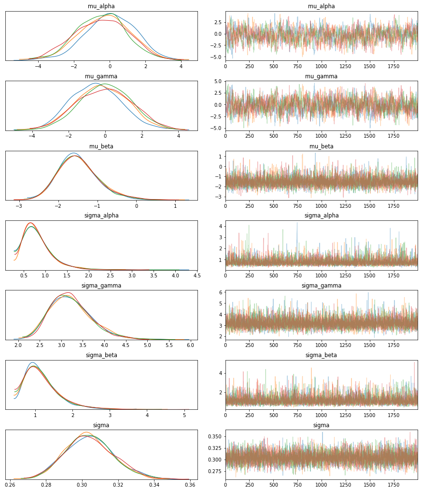
    


    <ggplot: (8738794854530)>


```python
gene_idx = logfc_data["gene"].cat.codes.to_list()
cell_line_idx = logfc_data["cell_line"].cat.codes.to_list()

with pm.Model() as model4:
    # Hyper-priors
    mu_alpha = pm.Normal("mu_alpha", 0, 2)
    sigma_alpha = pm.Exponential("sigma_alpha", 1)
    mu_gamma = pm.Normal("mu_gamma", 0, 2)
    sigma_gamma = pm.Exponential("sigma_gamma", 1)
    mu_beta = pm.Normal("mu_beta", 0, 1)
    sigma_beta = pm.Exponential("sigma_beta", 1)

    # Priors
    alpha_g = pm.Normal("alpha_g", mu_alpha, sigma_alpha, shape=num_genes)
    gamma_c = pm.Normal("gamma_c", mu_gamma, sigma_gamma, shape=num_cell_lines)
    beta_g = pm.Normal("beta_g", mu_beta, sigma_beta, shape=num_genes)
    mu_gc = pm.Deterministic(
        "mu_gc",
        alpha_g[gene_idx] + gamma_c[cell_line_idx] + beta_g[gene_idx] * logfc_data.rna,
    )
    sigma = pm.Exponential("sigma", 1)

    # Likelihood
    logfc = pm.Normal("logfc", mu=mu_gc, sigma=sigma, observed=logfc_data.logfc)

    # Sampling
    model4_prior_check = pm.sample_prior_predictive(random_seed=RANDOM_SEED)
    model4_trace = pm.sample(2000, tune=2000, random_seed=RANDOM_SEED)
    model4_post_check = pm.sample_posterior_predictive(
        model4_trace, random_seed=RANDOM_SEED
    )
```

    Auto-assigning NUTS sampler...
    Initializing NUTS using jitter+adapt_diag...
    Multiprocess sampling (4 chains in 4 jobs)
    NUTS: [sigma, beta_g, gamma_c, alpha_g, sigma_beta, mu_beta, sigma_gamma, mu_gamma, sigma_alpha, mu_alpha]
    Sampling 4 chains, 0 divergences: 100%|██████████| 16000/16000 [02:55<00:00, 91.06draws/s] 
    The number of effective samples is smaller than 10% for some parameters.
    100%|██████████| 8000/8000 [00:08<00:00, 969.54it/s]


```python
pm.model_to_graphviz(model4)
```


    
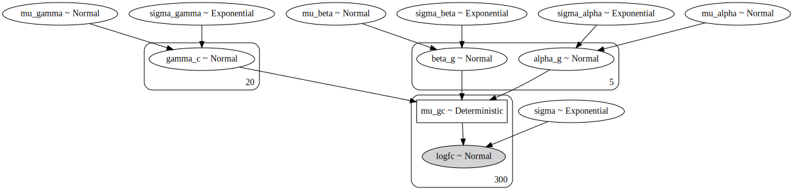
    


```python
az_model4 = az.from_pymc3(
    trace=model4_trace,
    prior=model4_prior_check,
    posterior_predictive=model4_post_check,
    model=model4,
)
```


```python
var_names1 = ["mu_" + a for a in ["alpha", "gamma", "beta"]]
var_names2 = ["sigma_" + a for a in ["alpha", "gamma", "beta"]]
az.plot_trace(az_model4, var_names=var_names1 + var_names2 + ["sigma"])
plt.show()
```


    
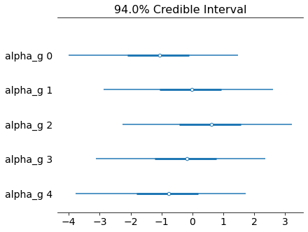
    


```python
s = az.summary(az_model4, var_names=var_names1 + var_names2)
s["real_values"] = [
    real_mu_alpha,
    real_mu_gamma,
    real_mu_beta,
    real_sigma_alpha,
    real_sigma_gamma,
    real_sigma_beta,
]
s
```


<div>
<style scoped>
    .dataframe tbody tr th:only-of-type {
        vertical-align: middle;
    }

    .dataframe tbody tr th {
        vertical-align: top;
    }

    .dataframe thead th {
        text-align: right;
    }
</style>
<table border="1" class="dataframe">
  <thead>
    <tr style="text-align: right;">
      <th></th>
      <th>mean</th>
      <th>sd</th>
      <th>hpd_3%</th>
      <th>hpd_97%</th>
      <th>mcse_mean</th>
      <th>mcse_sd</th>
      <th>ess_mean</th>
      <th>ess_sd</th>
      <th>ess_bulk</th>
      <th>ess_tail</th>
      <th>r_hat</th>
      <th>real_values</th>
    </tr>
  </thead>
  <tbody>
    <tr>
      <th>mu_alpha</th>
      <td>-0.310</td>
      <td>1.459</td>
      <td>-3.050</td>
      <td>2.430</td>
      <td>0.057</td>
      <td>0.041</td>
      <td>644.0</td>
      <td>644.0</td>
      <td>645.0</td>
      <td>1228.0</td>
      <td>1.01</td>
      <td>-1</td>
    </tr>
    <tr>
      <th>mu_gamma</th>
      <td>-0.193</td>
      <td>1.457</td>
      <td>-2.900</td>
      <td>2.499</td>
      <td>0.054</td>
      <td>0.038</td>
      <td>735.0</td>
      <td>735.0</td>
      <td>737.0</td>
      <td>1404.0</td>
      <td>1.01</td>
      <td>0</td>
    </tr>
    <tr>
      <th>mu_beta</th>
      <td>-1.486</td>
      <td>0.524</td>
      <td>-2.436</td>
      <td>-0.476</td>
      <td>0.008</td>
      <td>0.005</td>
      <td>4738.0</td>
      <td>4738.0</td>
      <td>5485.0</td>
      <td>3922.0</td>
      <td>1.00</td>
      <td>-1</td>
    </tr>
    <tr>
      <th>sigma_alpha</th>
      <td>0.830</td>
      <td>0.360</td>
      <td>0.365</td>
      <td>1.476</td>
      <td>0.006</td>
      <td>0.005</td>
      <td>3596.0</td>
      <td>2978.0</td>
      <td>5136.0</td>
      <td>3988.0</td>
      <td>1.00</td>
      <td>1</td>
    </tr>
    <tr>
      <th>sigma_gamma</th>
      <td>3.221</td>
      <td>0.486</td>
      <td>2.362</td>
      <td>4.116</td>
      <td>0.006</td>
      <td>0.004</td>
      <td>7178.0</td>
      <td>6662.0</td>
      <td>7897.0</td>
      <td>5216.0</td>
      <td>1.00</td>
      <td>3</td>
    </tr>
    <tr>
      <th>sigma_beta</th>
      <td>1.188</td>
      <td>0.483</td>
      <td>0.474</td>
      <td>2.047</td>
      <td>0.008</td>
      <td>0.006</td>
      <td>3902.0</td>
      <td>3678.0</td>
      <td>5037.0</td>
      <td>4419.0</td>
      <td>1.00</td>
      <td>2</td>
    </tr>
  </tbody>
</table>
</div>


I believe that the $\alpha_g$ values were poorly estimated because they do not add much information to the model.
The other parameters fit well, but these have very wide posterior distributions.


```python
az.summary(az_model4, var_names=["alpha_g"]).assign(real_values=real_alpha_g)
```


<div>
<style scoped>
    .dataframe tbody tr th:only-of-type {
        vertical-align: middle;
    }

    .dataframe tbody tr th {
        vertical-align: top;
    }

    .dataframe thead th {
        text-align: right;
    }
</style>
<table border="1" class="dataframe">
  <thead>
    <tr style="text-align: right;">
      <th></th>
      <th>mean</th>
      <th>sd</th>
      <th>hpd_3%</th>
      <th>hpd_97%</th>
      <th>mcse_mean</th>
      <th>mcse_sd</th>
      <th>ess_mean</th>
      <th>ess_sd</th>
      <th>ess_bulk</th>
      <th>ess_tail</th>
      <th>r_hat</th>
      <th>real_values</th>
    </tr>
  </thead>
  <tbody>
    <tr>
      <th>alpha_g[0]</th>
      <td>-1.113</td>
      <td>1.461</td>
      <td>-3.996</td>
      <td>1.479</td>
      <td>0.06</td>
      <td>0.043</td>
      <td>589.0</td>
      <td>589.0</td>
      <td>589.0</td>
      <td>1083.0</td>
      <td>1.01</td>
      <td>-2.249278</td>
    </tr>
    <tr>
      <th>alpha_g[1]</th>
      <td>-0.053</td>
      <td>1.462</td>
      <td>-2.870</td>
      <td>2.616</td>
      <td>0.06</td>
      <td>0.043</td>
      <td>591.0</td>
      <td>591.0</td>
      <td>591.0</td>
      <td>1132.0</td>
      <td>1.02</td>
      <td>-1.260331</td>
    </tr>
    <tr>
      <th>alpha_g[2]</th>
      <td>0.574</td>
      <td>1.463</td>
      <td>-2.269</td>
      <td>3.223</td>
      <td>0.06</td>
      <td>0.043</td>
      <td>589.0</td>
      <td>589.0</td>
      <td>589.0</td>
      <td>1101.0</td>
      <td>1.02</td>
      <td>-0.616207</td>
    </tr>
    <tr>
      <th>alpha_g[3]</th>
      <td>-0.219</td>
      <td>1.462</td>
      <td>-3.132</td>
      <td>2.346</td>
      <td>0.06</td>
      <td>0.043</td>
      <td>590.0</td>
      <td>590.0</td>
      <td>590.0</td>
      <td>1070.0</td>
      <td>1.02</td>
      <td>-1.385461</td>
    </tr>
    <tr>
      <th>alpha_g[4]</th>
      <td>-0.816</td>
      <td>1.462</td>
      <td>-3.770</td>
      <td>1.722</td>
      <td>0.06</td>
      <td>0.043</td>
      <td>589.0</td>
      <td>589.0</td>
      <td>589.0</td>
      <td>1136.0</td>
      <td>1.02</td>
      <td>-2.085137</td>
    </tr>
  </tbody>
</table>
</div>


```python
az.plot_forest(az_model4, var_names=["alpha_g"], combined=True)
plt.show()
```


    
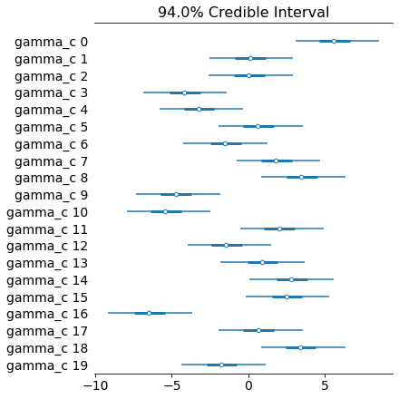
    


```python
az.summary(az_model4, var_names=["beta_g"]).assign(real_values=real_beta_g)
```


<div>
<style scoped>
    .dataframe tbody tr th:only-of-type {
        vertical-align: middle;
    }

    .dataframe tbody tr th {
        vertical-align: top;
    }

    .dataframe thead th {
        text-align: right;
    }
</style>
<table border="1" class="dataframe">
  <thead>
    <tr style="text-align: right;">
      <th></th>
      <th>mean</th>
      <th>sd</th>
      <th>hpd_3%</th>
      <th>hpd_97%</th>
      <th>mcse_mean</th>
      <th>mcse_sd</th>
      <th>ess_mean</th>
      <th>ess_sd</th>
      <th>ess_bulk</th>
      <th>ess_tail</th>
      <th>r_hat</th>
      <th>real_values</th>
    </tr>
  </thead>
  <tbody>
    <tr>
      <th>beta_g[0]</th>
      <td>-2.552</td>
      <td>0.043</td>
      <td>-2.632</td>
      <td>-2.470</td>
      <td>0.000</td>
      <td>0.0</td>
      <td>7998.0</td>
      <td>7993.0</td>
      <td>7987.0</td>
      <td>5499.0</td>
      <td>1.0</td>
      <td>-2.634413</td>
    </tr>
    <tr>
      <th>beta_g[1]</th>
      <td>-2.888</td>
      <td>0.049</td>
      <td>-2.979</td>
      <td>-2.794</td>
      <td>0.001</td>
      <td>0.0</td>
      <td>7516.0</td>
      <td>7515.0</td>
      <td>7537.0</td>
      <td>5781.0</td>
      <td>1.0</td>
      <td>-2.892255</td>
    </tr>
    <tr>
      <th>beta_g[2]</th>
      <td>-0.564</td>
      <td>0.050</td>
      <td>-0.657</td>
      <td>-0.471</td>
      <td>0.001</td>
      <td>0.0</td>
      <td>8176.0</td>
      <td>8169.0</td>
      <td>8169.0</td>
      <td>6117.0</td>
      <td>1.0</td>
      <td>-0.558722</td>
    </tr>
    <tr>
      <th>beta_g[3]</th>
      <td>-2.239</td>
      <td>0.043</td>
      <td>-2.317</td>
      <td>-2.160</td>
      <td>0.000</td>
      <td>0.0</td>
      <td>7748.0</td>
      <td>7748.0</td>
      <td>7773.0</td>
      <td>5935.0</td>
      <td>1.0</td>
      <td>-2.201467</td>
    </tr>
    <tr>
      <th>beta_g[4]</th>
      <td>-1.283</td>
      <td>0.045</td>
      <td>-1.368</td>
      <td>-1.198</td>
      <td>0.001</td>
      <td>0.0</td>
      <td>7433.0</td>
      <td>7433.0</td>
      <td>7416.0</td>
      <td>5317.0</td>
      <td>1.0</td>
      <td>-1.305132</td>
    </tr>
  </tbody>
</table>
</div>


```python
az.plot_forest(az_model4, var_names=["beta_g"], combined=True)
plt.show()
```


    
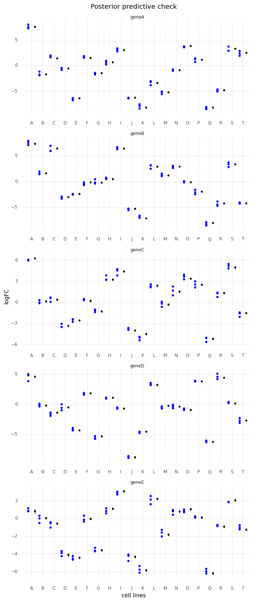
    


```python
az.summary(az_model4, var_names=["gamma_c"]).assign(real_values=real_gamma_c)
```


<div>
<style scoped>
    .dataframe tbody tr th:only-of-type {
        vertical-align: middle;
    }

    .dataframe tbody tr th {
        vertical-align: top;
    }

    .dataframe thead th {
        text-align: right;
    }
</style>
<table border="1" class="dataframe">
  <thead>
    <tr style="text-align: right;">
      <th></th>
      <th>mean</th>
      <th>sd</th>
      <th>hpd_3%</th>
      <th>hpd_97%</th>
      <th>mcse_mean</th>
      <th>mcse_sd</th>
      <th>ess_mean</th>
      <th>ess_sd</th>
      <th>ess_bulk</th>
      <th>ess_tail</th>
      <th>r_hat</th>
      <th>real_values</th>
    </tr>
  </thead>
  <tbody>
    <tr>
      <th>gamma_c[0]</th>
      <td>5.628</td>
      <td>1.463</td>
      <td>3.067</td>
      <td>8.555</td>
      <td>0.060</td>
      <td>0.043</td>
      <td>590.0</td>
      <td>590.0</td>
      <td>590.0</td>
      <td>1116.0</td>
      <td>1.02</td>
      <td>6.981657</td>
    </tr>
    <tr>
      <th>gamma_c[1]</th>
      <td>0.141</td>
      <td>1.464</td>
      <td>-2.543</td>
      <td>2.935</td>
      <td>0.060</td>
      <td>0.043</td>
      <td>591.0</td>
      <td>591.0</td>
      <td>591.0</td>
      <td>1107.0</td>
      <td>1.02</td>
      <td>1.292379</td>
    </tr>
    <tr>
      <th>gamma_c[2]</th>
      <td>0.077</td>
      <td>1.466</td>
      <td>-2.584</td>
      <td>2.907</td>
      <td>0.061</td>
      <td>0.043</td>
      <td>584.0</td>
      <td>584.0</td>
      <td>585.0</td>
      <td>1122.0</td>
      <td>1.02</td>
      <td>1.296947</td>
    </tr>
    <tr>
      <th>gamma_c[3]</th>
      <td>-4.141</td>
      <td>1.466</td>
      <td>-6.870</td>
      <td>-1.382</td>
      <td>0.060</td>
      <td>0.043</td>
      <td>589.0</td>
      <td>589.0</td>
      <td>589.0</td>
      <td>1141.0</td>
      <td>1.02</td>
      <td>-2.940034</td>
    </tr>
    <tr>
      <th>gamma_c[4]</th>
      <td>-3.214</td>
      <td>1.463</td>
      <td>-5.807</td>
      <td>-0.338</td>
      <td>0.060</td>
      <td>0.043</td>
      <td>590.0</td>
      <td>590.0</td>
      <td>590.0</td>
      <td>1120.0</td>
      <td>1.02</td>
      <td>-1.895896</td>
    </tr>
    <tr>
      <th>gamma_c[5]</th>
      <td>0.672</td>
      <td>1.466</td>
      <td>-1.941</td>
      <td>3.545</td>
      <td>0.060</td>
      <td>0.043</td>
      <td>592.0</td>
      <td>592.0</td>
      <td>593.0</td>
      <td>1148.0</td>
      <td>1.02</td>
      <td>1.732326</td>
    </tr>
    <tr>
      <th>gamma_c[6]</th>
      <td>-1.480</td>
      <td>1.465</td>
      <td>-4.277</td>
      <td>1.229</td>
      <td>0.060</td>
      <td>0.043</td>
      <td>594.0</td>
      <td>594.0</td>
      <td>595.0</td>
      <td>1124.0</td>
      <td>1.01</td>
      <td>-0.374273</td>
    </tr>
    <tr>
      <th>gamma_c[7]</th>
      <td>1.860</td>
      <td>1.464</td>
      <td>-0.785</td>
      <td>4.713</td>
      <td>0.060</td>
      <td>0.043</td>
      <td>589.0</td>
      <td>589.0</td>
      <td>590.0</td>
      <td>1150.0</td>
      <td>1.02</td>
      <td>2.936844</td>
    </tr>
    <tr>
      <th>gamma_c[8]</th>
      <td>3.481</td>
      <td>1.464</td>
      <td>0.853</td>
      <td>6.345</td>
      <td>0.060</td>
      <td>0.043</td>
      <td>591.0</td>
      <td>591.0</td>
      <td>592.0</td>
      <td>1147.0</td>
      <td>1.01</td>
      <td>4.784765</td>
    </tr>
    <tr>
      <th>gamma_c[9]</th>
      <td>-4.720</td>
      <td>1.463</td>
      <td>-7.315</td>
      <td>-1.839</td>
      <td>0.060</td>
      <td>0.043</td>
      <td>589.0</td>
      <td>589.0</td>
      <td>590.0</td>
      <td>1098.0</td>
      <td>1.02</td>
      <td>-3.605834</td>
    </tr>
    <tr>
      <th>gamma_c[10]</th>
      <td>-5.384</td>
      <td>1.463</td>
      <td>-7.936</td>
      <td>-2.472</td>
      <td>0.060</td>
      <td>0.043</td>
      <td>589.0</td>
      <td>589.0</td>
      <td>590.0</td>
      <td>1160.0</td>
      <td>1.02</td>
      <td>-4.129107</td>
    </tr>
    <tr>
      <th>gamma_c[11]</th>
      <td>2.053</td>
      <td>1.464</td>
      <td>-0.544</td>
      <td>4.938</td>
      <td>0.060</td>
      <td>0.043</td>
      <td>593.0</td>
      <td>593.0</td>
      <td>592.0</td>
      <td>1075.0</td>
      <td>1.01</td>
      <td>3.163037</td>
    </tr>
    <tr>
      <th>gamma_c[12]</th>
      <td>-1.418</td>
      <td>1.463</td>
      <td>-3.981</td>
      <td>1.498</td>
      <td>0.060</td>
      <td>0.043</td>
      <td>586.0</td>
      <td>586.0</td>
      <td>587.0</td>
      <td>1057.0</td>
      <td>1.02</td>
      <td>-0.116560</td>
    </tr>
    <tr>
      <th>gamma_c[13]</th>
      <td>0.929</td>
      <td>1.464</td>
      <td>-1.809</td>
      <td>3.673</td>
      <td>0.060</td>
      <td>0.043</td>
      <td>590.0</td>
      <td>590.0</td>
      <td>591.0</td>
      <td>1123.0</td>
      <td>1.02</td>
      <td>2.040857</td>
    </tr>
    <tr>
      <th>gamma_c[14]</th>
      <td>2.840</td>
      <td>1.465</td>
      <td>0.067</td>
      <td>5.569</td>
      <td>0.060</td>
      <td>0.043</td>
      <td>589.0</td>
      <td>589.0</td>
      <td>589.0</td>
      <td>1070.0</td>
      <td>1.02</td>
      <td>3.987525</td>
    </tr>
    <tr>
      <th>gamma_c[15]</th>
      <td>2.511</td>
      <td>1.464</td>
      <td>-0.185</td>
      <td>5.303</td>
      <td>0.060</td>
      <td>0.043</td>
      <td>588.0</td>
      <td>588.0</td>
      <td>588.0</td>
      <td>1088.0</td>
      <td>1.01</td>
      <td>3.850349</td>
    </tr>
    <tr>
      <th>gamma_c[16]</th>
      <td>-6.461</td>
      <td>1.464</td>
      <td>-9.146</td>
      <td>-3.652</td>
      <td>0.060</td>
      <td>0.043</td>
      <td>593.0</td>
      <td>593.0</td>
      <td>594.0</td>
      <td>1132.0</td>
      <td>1.02</td>
      <td>-5.274761</td>
    </tr>
    <tr>
      <th>gamma_c[17]</th>
      <td>0.682</td>
      <td>1.463</td>
      <td>-1.916</td>
      <td>3.564</td>
      <td>0.060</td>
      <td>0.043</td>
      <td>592.0</td>
      <td>592.0</td>
      <td>592.0</td>
      <td>1091.0</td>
      <td>1.01</td>
      <td>1.842918</td>
    </tr>
    <tr>
      <th>gamma_c[18]</th>
      <td>3.424</td>
      <td>1.463</td>
      <td>0.858</td>
      <td>6.354</td>
      <td>0.060</td>
      <td>0.042</td>
      <td>593.0</td>
      <td>593.0</td>
      <td>593.0</td>
      <td>1105.0</td>
      <td>1.02</td>
      <td>4.549074</td>
    </tr>
    <tr>
      <th>gamma_c[19]</th>
      <td>-1.741</td>
      <td>1.464</td>
      <td>-4.356</td>
      <td>1.149</td>
      <td>0.060</td>
      <td>0.043</td>
      <td>591.0</td>
      <td>591.0</td>
      <td>591.0</td>
      <td>1103.0</td>
      <td>1.02</td>
      <td>-0.587932</td>
    </tr>
  </tbody>
</table>
</div>


```python
az.plot_forest(az_model4, var_names=["gamma_c"], combined=True)
plt.show()
```


    

    


```python
post_alpha_g = model4_trace.get_values(varname="alpha_g")
post_gamma_c = model4_trace.get_values(varname="gamma_c")
post_beta_g = model4_trace.get_values(varname="beta_g")
post_mu_gc = model4_trace.get_values(varname="mu_gc")

post_mu_mean = post_mu_gc.mean(axis=0)
post_mu_hdi = np.array([az.hpd(x, credible_interval=0.89) for x in post_mu_gc.T])

logfc_post_df = logfc_data.copy()
logfc_post_df["post_logfc"] = post_mu_mean
logfc_post_df["hpi_lower"] = [x[0] for x in post_mu_hdi]
logfc_post_df["hpi_upper"] = [x[1] for x in post_mu_hdi]
logfc_post_df
```


<div>
<style scoped>
    .dataframe tbody tr th:only-of-type {
        vertical-align: middle;
    }

    .dataframe tbody tr th {
        vertical-align: top;
    }

    .dataframe thead th {
        text-align: right;
    }
</style>
<table border="1" class="dataframe">
  <thead>
    <tr style="text-align: right;">
      <th></th>
      <th>gene</th>
      <th>cell_line</th>
      <th>rna</th>
      <th>sgrna_idx</th>
      <th>logfc</th>
      <th>post_logfc</th>
      <th>hpi_lower</th>
      <th>hpi_upper</th>
    </tr>
  </thead>
  <tbody>
    <tr>
      <th>0</th>
      <td>geneA</td>
      <td>cellA</td>
      <td>-1.187443</td>
      <td>0</td>
      <td>7.516370</td>
      <td>7.545814</td>
      <td>7.385208</td>
      <td>7.700742</td>
    </tr>
    <tr>
      <th>1</th>
      <td>geneA</td>
      <td>cellB</td>
      <td>0.299138</td>
      <td>0</td>
      <td>-1.184598</td>
      <td>-1.734407</td>
      <td>-1.879499</td>
      <td>-1.597755</td>
    </tr>
    <tr>
      <th>2</th>
      <td>geneA</td>
      <td>cellC</td>
      <td>-0.947764</td>
      <td>0</td>
      <td>1.945419</td>
      <td>1.383456</td>
      <td>1.236099</td>
      <td>1.532617</td>
    </tr>
    <tr>
      <th>3</th>
      <td>geneA</td>
      <td>cellD</td>
      <td>-1.843382</td>
      <td>0</td>
      <td>-0.861100</td>
      <td>-0.549977</td>
      <td>-0.725759</td>
      <td>-0.381140</td>
    </tr>
    <tr>
      <th>4</th>
      <td>geneA</td>
      <td>cellE</td>
      <td>0.810589</td>
      <td>0</td>
      <td>-6.491923</td>
      <td>-6.394692</td>
      <td>-6.552350</td>
      <td>-6.256804</td>
    </tr>
    <tr>
      <th>...</th>
      <td>...</td>
      <td>...</td>
      <td>...</td>
      <td>...</td>
      <td>...</td>
      <td>...</td>
      <td>...</td>
      <td>...</td>
    </tr>
    <tr>
      <th>295</th>
      <td>geneE</td>
      <td>cellP</td>
      <td>1.219362</td>
      <td>2</td>
      <td>0.194254</td>
      <td>0.129988</td>
      <td>-0.028267</td>
      <td>0.281621</td>
    </tr>
    <tr>
      <th>296</th>
      <td>geneE</td>
      <td>cellQ</td>
      <td>-0.840481</td>
      <td>2</td>
      <td>-5.967522</td>
      <td>-6.197975</td>
      <td>-6.347947</td>
      <td>-6.051232</td>
    </tr>
    <tr>
      <th>297</th>
      <td>geneE</td>
      <td>cellR</td>
      <td>0.607882</td>
      <td>2</td>
      <td>-0.719954</td>
      <td>-0.913733</td>
      <td>-1.062864</td>
      <td>-0.764337</td>
    </tr>
    <tr>
      <th>298</th>
      <td>geneE</td>
      <td>cellS</td>
      <td>0.429605</td>
      <td>2</td>
      <td>1.885927</td>
      <td>2.056609</td>
      <td>1.913436</td>
      <td>2.197181</td>
    </tr>
    <tr>
      <th>299</th>
      <td>geneE</td>
      <td>cellT</td>
      <td>-1.014537</td>
      <td>2</td>
      <td>-1.022285</td>
      <td>-1.254635</td>
      <td>-1.408618</td>
      <td>-1.093348</td>
    </tr>
  </tbody>
</table>
<p>300 rows × 8 columns</p>
</div>


```python
(
    gg.ggplot(logfc_post_df, gg.aes(x="cell_line"))
    + gg.facet_wrap("gene", ncol=1, scales="free")
    + gg.geom_linerange(
        gg.aes(ymin="hpi_lower", ymax="hpi_upper"), position=gg.position_nudge(x=0.3)
    )
    + gg.geom_point(gg.aes(y="post_logfc"), position=gg.position_nudge(x=0.3), size=1)
    + gg.geom_point(gg.aes(y="logfc"), position=gg.position_nudge(x=-0.3), color="blue")
    + gg.scale_x_discrete(labels=[a.replace("cell", "") for a in cell_lines])
    + gg.theme(subplots_adjust={"hspace": 0.25, "wspace": 0.25}, figure_size=(8, 20))
    + gg.labs(x="cell lines", y="logFC", title="Posterior predictive check")
)
```


    

    


    <ggplot: (8738736352772)>


### Conclusions and final thoughts

The model fit well, as demonstrated by the final plot of the posterior predictions.
However, many of the variables' posterior distributions were very wide.
This indicates that there is multicolinearity between the predictors. 

---

## Model 5. Move the varying gene intercept into a higher level

Model the logFC for knocking-out a gene $g$ in cell line $c$ with sgRNA $s$.
Use a varying intercept for the sgRNA and cell line.
Include the target gene as a varying intercept for the level of the intercept for the sgRNA.

$
logFC_{s,g,c} \sim \mathcal{N}(\mu_{s,g,c}, \sigma) \\
\quad \mu_{s,g,c} = \alpha_s + \beta_c \\
\qquad \alpha_s \sim \mathcal{N}(\mu_\alpha, \sigma_\alpha) \\
\qquad \quad \mu_\alpha = \epsilon_g \\
\qquad \qquad \epsilon_g \sim \mathcal{N}(\mu_\epsilon, \sigma_\epsilon) \\
\qquad \qquad \quad \mu_\epsilon \sim \mathcal{N}(0, 5) \quad \sigma_\epsilon \sim \text{Exp(1)} \\
\qquad \quad \sigma_\alpha \sim \text{Exp}(1) \\
\qquad \beta_c \sim \mathcal{N}(\mu_\beta, \sigma_\beta) \\
\qquad \quad \mu_\beta \sim \mathcal{N}(0, 5) \quad \sigma_\beta \sim \text{Exp}(1) \\
\quad \sigma \sim \text{Exp}(1)
$

Simulated values:

- number of cell lines: 20
- number of genes: 5
- number of repeated measures: 4
- $\mu_\epsilon = -1$, $\sigma_\epsilon = 1$
- $\sigma_\alpha = 0.1$
- $\mu_\beta = 0$, $\sigma_\beta = 1$
- $\sigma = 0.05$


```python
np.random.seed(RANDOM_SEED)

# Data parameters.
num_cell_lines = 20
num_genes = 5
num_sgrna_per_gene = list(range(1, num_genes + 1))  # Different number of guides.
num_sgRNA = sum(num_sgrna_per_gene)

# Model parameters.
real_params = {
    "mu_epsilon": -1,
    "sigma_epsilon": 1,
    "sigma_alpha": 0.1,
    "mu_beta": 0,
    "sigma_beta": 1,
    "sigma": 0.05,
}

real_params["epsilon_g"] = normal(
    real_params["mu_epsilon"], real_params["sigma_epsilon"], num_genes
)

real_params["mu_alpha"] = real_params["epsilon_g"]

real_alpha_s = []
for gene_idx, n in enumerate(num_sgrna_per_gene):
    a_s = normal(real_params["mu_alpha"][gene_idx], real_params["sigma_alpha"], n)
    real_alpha_s.append(a_s)

real_params["alpha_s"] = np.concatenate(real_alpha_s)

real_params["beta_c"] = normal(
    real_params["mu_beta"], real_params["sigma_beta"], num_cell_lines
)


def alphabet_list(n, prefix=""):
    if n > len(string.ascii_uppercase):
        raise Exception(f"Max number of values is {len(string.ascii_uppercase)}")
    return [prefix + a for a in string.ascii_uppercase[:n]]


def make_cat(df, col, categories=None, ordered=None):
    df[col] = pd.Categorical(df[col], categories=categories)
    return df


# cell_lines = alphabet_list(num_cell_lines, "cell_")
cell_lines = ["cell_" + str(i) for i in range(num_cell_lines)]
genes = alphabet_list(num_genes, "gene_")
guides = ["sgRNA_" + str(i) for i in range(sum(num_sgrna_per_gene))]

alpha_s_table = pd.DataFrame(
    {
        "gene": np.repeat(genes, num_sgrna_per_gene),
        "sgRNA": guides,
        "alpha_s": real_params["alpha_s"],
    }
)

for col, vals in zip(["gene", "sgRNA"], [genes, guides]):
    alpha_s_table = make_cat(alpha_s_table, col, categories=vals)

data = pd.DataFrame(
    product(genes, cell_lines), columns=["gene", "cell_line"], dtype="category"
)
data = pd.merge(data, alpha_s_table[["gene", "sgRNA"]], how="right", on="gene")
data = data.reset_index(drop=True)

for col, vals in zip(["cell_line", "gene", "sgRNA"], [cell_lines, genes, guides]):
    data = make_cat(data, col, categories=vals)

data["logfc"] = np.nan
for i in range(len(data)):
    s = data["sgRNA"].cat.codes[i]
    c = data["cell_line"].cat.codes[i]
    logfc = normal(
        real_params["alpha_s"][s] + real_params["beta_c"][c], real_params["sigma"]
    )
    data.loc[i, "logfc"] = logfc

data.head(10)
```


<div>
<style scoped>
    .dataframe tbody tr th:only-of-type {
        vertical-align: middle;
    }

    .dataframe tbody tr th {
        vertical-align: top;
    }

    .dataframe thead th {
        text-align: right;
    }
</style>
<table border="1" class="dataframe">
  <thead>
    <tr style="text-align: right;">
      <th></th>
      <th>gene</th>
      <th>cell_line</th>
      <th>sgRNA</th>
      <th>logfc</th>
    </tr>
  </thead>
  <tbody>
    <tr>
      <th>0</th>
      <td>gene_A</td>
      <td>cell_0</td>
      <td>sgRNA_0</td>
      <td>-0.699825</td>
    </tr>
    <tr>
      <th>1</th>
      <td>gene_A</td>
      <td>cell_1</td>
      <td>sgRNA_0</td>
      <td>-3.689952</td>
    </tr>
    <tr>
      <th>2</th>
      <td>gene_A</td>
      <td>cell_2</td>
      <td>sgRNA_0</td>
      <td>-1.349566</td>
    </tr>
    <tr>
      <th>3</th>
      <td>gene_A</td>
      <td>cell_3</td>
      <td>sgRNA_0</td>
      <td>-0.485567</td>
    </tr>
    <tr>
      <th>4</th>
      <td>gene_A</td>
      <td>cell_4</td>
      <td>sgRNA_0</td>
      <td>-2.253759</td>
    </tr>
    <tr>
      <th>5</th>
      <td>gene_A</td>
      <td>cell_5</td>
      <td>sgRNA_0</td>
      <td>-2.828712</td>
    </tr>
    <tr>
      <th>6</th>
      <td>gene_A</td>
      <td>cell_6</td>
      <td>sgRNA_0</td>
      <td>-2.950248</td>
    </tr>
    <tr>
      <th>7</th>
      <td>gene_A</td>
      <td>cell_7</td>
      <td>sgRNA_0</td>
      <td>-1.710152</td>
    </tr>
    <tr>
      <th>8</th>
      <td>gene_A</td>
      <td>cell_8</td>
      <td>sgRNA_0</td>
      <td>-2.636155</td>
    </tr>
    <tr>
      <th>9</th>
      <td>gene_A</td>
      <td>cell_9</td>
      <td>sgRNA_0</td>
      <td>-2.274055</td>
    </tr>
  </tbody>
</table>
</div>


```python
print(real_params["epsilon_g"])
print(real_params["alpha_s"])
print(real_params["beta_c"])
```

    [-2.24927835 -1.26033141 -0.6162067  -1.38546147 -2.08513673]
    [-2.01655645 -1.21725212 -1.21709984 -0.71420783 -0.67940322 -0.55846249
     -1.39793725 -1.28756669 -1.22596932 -1.50565593 -2.22277361 -1.97970218
     -2.08902208 -2.01710816 -1.95221924]
    [ 1.28344952 -1.75825367  0.6143059   1.51635808 -0.19597741 -0.81720628
     -0.94612771  0.22063891 -0.60073351 -0.15256605 -1.18744311  0.29913821
     -0.94776417 -1.84338194  0.81058919 -0.75225658 -0.43646901  0.04727664
     -0.25082764  0.16708739]


```python
(
    gg.ggplot(data, gg.aes(x="gene", y="logfc"))
    + gg.geom_boxplot(outlier_color="")
    + gg.geom_jitter(gg.aes(color="sgRNA"), width=0.2, height=0, size=1, alpha=0.7)
    + gg.scale_color_discrete()
    + gg.labs(x="", y="logFC", title="Synthetic data")
)
```


    
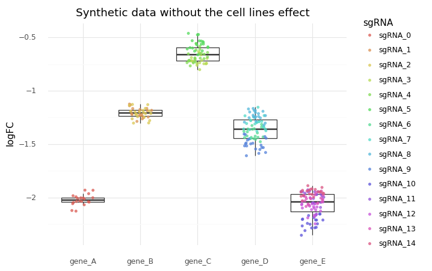
    


    <ggplot: (8738735803645)>


```python
(
    gg.ggplot(data, gg.aes(x="sgRNA", y="logfc"))
    + gg.geom_boxplot(gg.aes(color="gene"), outlier_color="")
    + gg.geom_jitter(gg.aes(color="gene"), width=0.2, height=0, size=1, alpha=0.7)
    + gg.scale_color_discrete()
    + gg.scale_x_discrete(labels=[a.replace("sgRNA_", "") for a in guides])
    + gg.theme(figure_size=(12, 5))
    + gg.labs(x="sgRNA", y="logFC", title="Synthetic data")
)
```


    
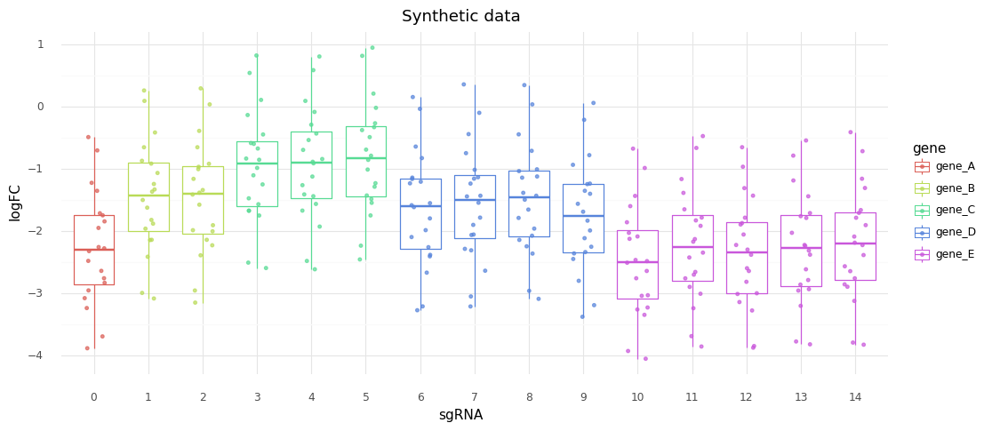
    


    <ggplot: (8738726091313)>


```python
(
    gg.ggplot(data, gg.aes(x="cell_line", y="logfc"))
    + gg.geom_boxplot(outlier_color="")
    + gg.geom_jitter(gg.aes(color="gene"), width=0.2, height=0, size=1, alpha=0.7)
    + gg.scale_color_discrete()
    + gg.theme(figure_size=(12, 5), axis_text_x=gg.element_blank())
    + gg.labs(x="", y="logFC", title="Synthetic data")
)
```


    
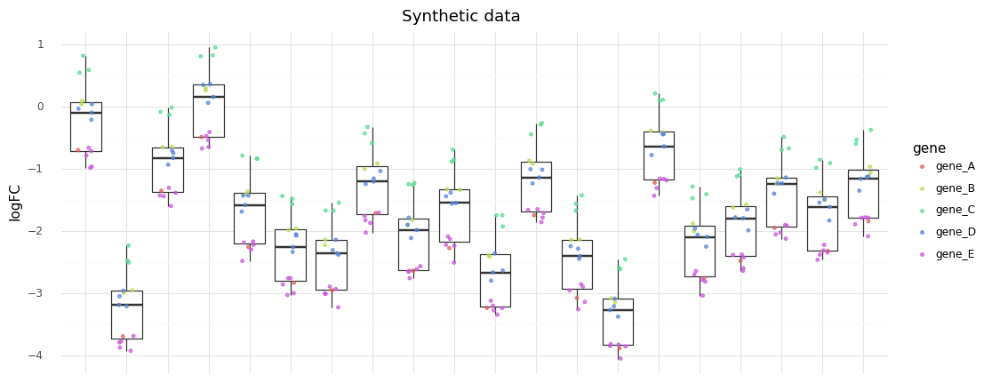
    


    <ggplot: (8738725830250)>


```python
# Data with the cell line effect removed.
rm_cell_line_effect = []
for i in range(len(data)):
    c_idx = data["cell_line"].cat.codes[i]
    c_eff = real_params["beta_c"][c_idx]
    rm_cell_line_effect.append(data["logfc"].values[i] - c_eff)

mod_data = data.copy()
mod_data["logfc_no_cell"] = rm_cell_line_effect
```


```python
(
    gg.ggplot(mod_data, gg.aes(x="cell_line", y="logfc_no_cell"))
    + gg.geom_boxplot(outlier_color="")
    + gg.geom_jitter(gg.aes(color="gene"), width=0.2, height=0, size=1, alpha=0.7)
    + gg.scale_color_discrete()
    + gg.theme(figure_size=(12, 5), axis_text_x=gg.element_blank())
    + gg.labs(x="", y="logFC", title="Synthetic data without the cell line effect")
)
```


    
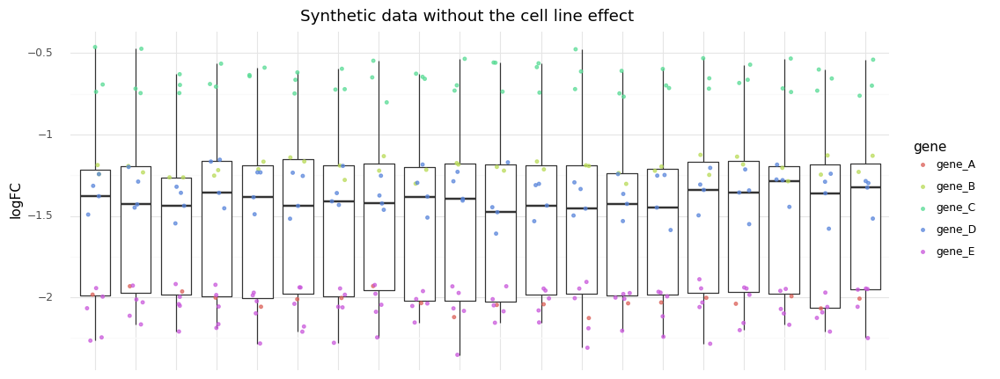
    


    <ggplot: (8738725865289)>


```python
(
    gg.ggplot(mod_data, gg.aes(x="gene", y="logfc_no_cell"))
    + gg.geom_boxplot(outlier_color="")
    + gg.geom_jitter(gg.aes(color="sgRNA"), width=0.2, height=0, size=1, alpha=0.7)
    + gg.scale_color_discrete()
    + gg.labs(x="", y="logFC", title="Synthetic data without the cell lines effect")
)
```


    
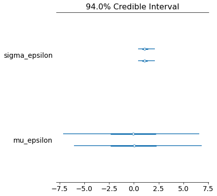
    


    <ggplot: (8738726005824)>


```python
cell_line_idx = data["cell_line"].cat.codes.to_list()
sgrna_idx = data["sgRNA"].cat.codes.to_list()
sgrna_to_gene_idx = (
    data[["gene", "sgRNA"]].drop_duplicates()["gene"].cat.codes.to_list()
)

with pm.Model() as model5:
    # Gene level model
    mu_epsilon = pm.Normal("mu_epsilon", -1, 5)
    sigma_epsilon = pm.Exponential("sigma_epsilon", 1)
    epsilon_g = pm.Normal("epsilon_g", mu_epsilon, sigma_epsilon, shape=num_genes)

    # Guide level model
    mu_alpha = pm.Deterministic("mu_alpha", epsilon_g[sgrna_to_gene_idx])
    sigma_alpha = pm.Exponential("sigma_alpha", 1)
    alpha_s = pm.Normal("alpha_s", mu_alpha, sigma_alpha, shape=num_sgRNA)

    # Cell line level
    mu_beta = pm.Normal("mu_beta", 0, 3)
    sigma_beta = pm.Exponential("sigma_beta", 1)
    beta_c = pm.Normal("beta_c", mu_beta, sigma_beta, shape=num_cell_lines)

    # Likelihood
    mu_sgc = pm.Deterministic("mu_sgc", alpha_s[sgrna_idx] + beta_c[cell_line_idx])
    sigma = pm.Exponential("sigma", 1)
    logfc = pm.Normal("logfc", mu_sgc, sigma, observed=data["logfc"].values)

    # Sampling
    model5_prior_check = pm.sample_prior_predictive(random_seed=RANDOM_SEED)
    model5_trace = pm.sample(4000, tune=1000, random_seed=RANDOM_SEED)
    model5_post_check = pm.sample_posterior_predictive(
        model5_trace, random_seed=RANDOM_SEED
    )
```

    Auto-assigning NUTS sampler...
    Initializing NUTS using jitter+adapt_diag...
    Multiprocess sampling (4 chains in 4 jobs)
    NUTS: [sigma, beta_c, sigma_beta, mu_beta, alpha_s, sigma_alpha, epsilon_g, sigma_epsilon, mu_epsilon]
    Sampling 4 chains, 0 divergences: 100%|██████████| 20000/20000 [09:59<00:00, 33.34draws/s]
    The acceptance probability does not match the target. It is 0.4521039247142773, but should be close to 0.8. Try to increase the number of tuning steps.
    The chain reached the maximum tree depth. Increase max_treedepth, increase target_accept or reparameterize.
    The acceptance probability does not match the target. It is 0.5648190750032425, but should be close to 0.8. Try to increase the number of tuning steps.
    The chain reached the maximum tree depth. Increase max_treedepth, increase target_accept or reparameterize.
    The acceptance probability does not match the target. It is 0.6798292932488531, but should be close to 0.8. Try to increase the number of tuning steps.
    The chain reached the maximum tree depth. Increase max_treedepth, increase target_accept or reparameterize.
    The acceptance probability does not match the target. It is 0.9245638918719562, but should be close to 0.8. Try to increase the number of tuning steps.
    The chain reached the maximum tree depth. Increase max_treedepth, increase target_accept or reparameterize.
    The number of effective samples is smaller than 10% for some parameters.
    100%|██████████| 16000/16000 [00:17<00:00, 890.87it/s]


```python
pm.model_to_graphviz(model5)
```


    
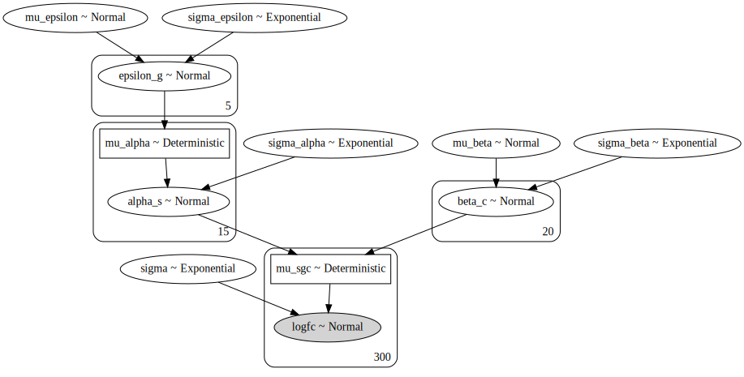
    


```python
def plot_variable_prior(prior_check, var):
    prior_df = prior_check[var]
    prior_df = pd.DataFrame(
        prior_df, columns=[f"{var}[" + str(i) + "]" for i in range(prior_df.shape[1])],
    ).melt()

    return (
        gg.ggplot(prior_df, gg.aes(x="value"))
        + gg.geom_density(gg.aes(color="variable"))
        + gg.labs(title=f"Prior distribution for '{var}' in model 5")
    )
```


```python
plot_variable_prior(model5_prior_check, "epsilon_g")
```


    
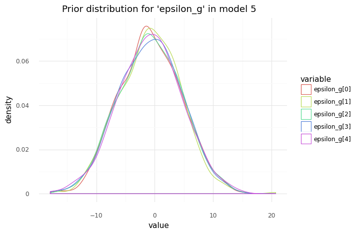
    


    <ggplot: (8738735703309)>


```python
plot_variable_prior(model5_prior_check, "alpha_s")
```


    
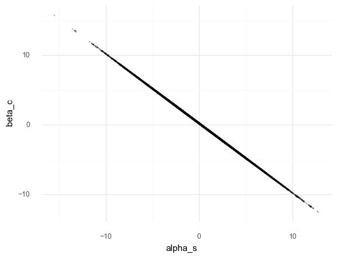
    


    <ggplot: (8738736305017)>


```python
plot_variable_prior(model5_prior_check, "beta_c") + gg.theme(legend_position="none")
```


    
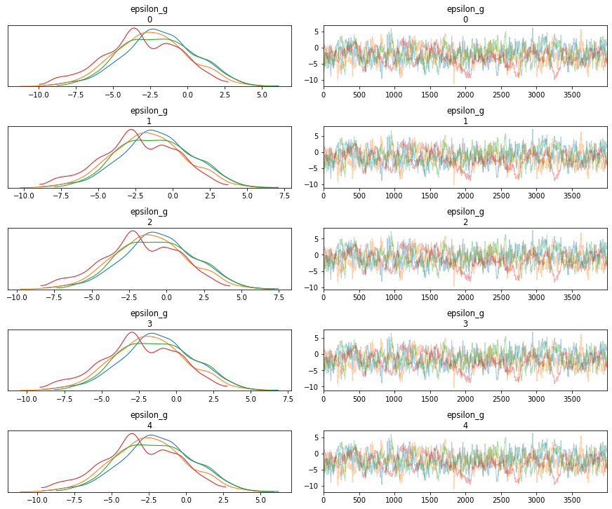
    


    <ggplot: (8738735284869)>


```python
logfc_priors = pd.DataFrame({"logfc": model5_prior_check["logfc"].flatten()[::100]})

(
    gg.ggplot(logfc_priors, gg.aes(x="logfc"))
    + gg.geom_density()
    + gg.labs(title="logFC priors for model 5")
)
```


    
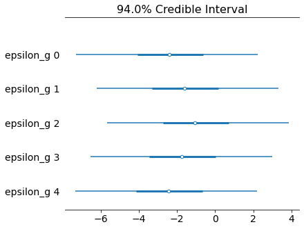
    


    <ggplot: (8738726165616)>


```python
az_model5 = az.from_pymc3(
    trace=model5_trace,
    prior=model5_prior_check,
    posterior_predictive=model5_post_check,
    model=model5,
)
```


```python
az.summary(az_model5, var_names=["mu_epsilon"]).assign(
    real_values=real_params["mu_epsilon"]
)
```


<div>
<style scoped>
    .dataframe tbody tr th:only-of-type {
        vertical-align: middle;
    }

    .dataframe tbody tr th {
        vertical-align: top;
    }

    .dataframe thead th {
        text-align: right;
    }
</style>
<table border="1" class="dataframe">
  <thead>
    <tr style="text-align: right;">
      <th></th>
      <th>mean</th>
      <th>sd</th>
      <th>hpd_3%</th>
      <th>hpd_97%</th>
      <th>mcse_mean</th>
      <th>mcse_sd</th>
      <th>ess_mean</th>
      <th>ess_sd</th>
      <th>ess_bulk</th>
      <th>ess_tail</th>
      <th>r_hat</th>
      <th>real_values</th>
    </tr>
  </thead>
  <tbody>
    <tr>
      <th>mu_epsilon</th>
      <td>-1.833</td>
      <td>2.553</td>
      <td>-6.597</td>
      <td>2.985</td>
      <td>0.176</td>
      <td>0.124</td>
      <td>211.0</td>
      <td>211.0</td>
      <td>212.0</td>
      <td>392.0</td>
      <td>1.04</td>
      <td>-1</td>
    </tr>
  </tbody>
</table>
</div>


```python
az.summary(az_model5, var_names=["epsilon_g"]).assign(
    real_values=real_params["epsilon_g"]
)
```


<div>
<style scoped>
    .dataframe tbody tr th:only-of-type {
        vertical-align: middle;
    }

    .dataframe tbody tr th {
        vertical-align: top;
    }

    .dataframe thead th {
        text-align: right;
    }
</style>
<table border="1" class="dataframe">
  <thead>
    <tr style="text-align: right;">
      <th></th>
      <th>mean</th>
      <th>sd</th>
      <th>hpd_3%</th>
      <th>hpd_97%</th>
      <th>mcse_mean</th>
      <th>mcse_sd</th>
      <th>ess_mean</th>
      <th>ess_sd</th>
      <th>ess_bulk</th>
      <th>ess_tail</th>
      <th>r_hat</th>
      <th>real_values</th>
    </tr>
  </thead>
  <tbody>
    <tr>
      <th>epsilon_g[0]</th>
      <td>-2.378</td>
      <td>2.541</td>
      <td>-7.306</td>
      <td>2.223</td>
      <td>0.176</td>
      <td>0.124</td>
      <td>210.0</td>
      <td>210.0</td>
      <td>210.0</td>
      <td>380.0</td>
      <td>1.04</td>
      <td>-2.249278</td>
    </tr>
    <tr>
      <th>epsilon_g[1]</th>
      <td>-1.589</td>
      <td>2.538</td>
      <td>-6.200</td>
      <td>3.310</td>
      <td>0.175</td>
      <td>0.124</td>
      <td>210.0</td>
      <td>210.0</td>
      <td>211.0</td>
      <td>381.0</td>
      <td>1.04</td>
      <td>-1.260331</td>
    </tr>
    <tr>
      <th>epsilon_g[2]</th>
      <td>-1.041</td>
      <td>2.538</td>
      <td>-5.648</td>
      <td>3.854</td>
      <td>0.175</td>
      <td>0.124</td>
      <td>209.0</td>
      <td>209.0</td>
      <td>210.0</td>
      <td>375.0</td>
      <td>1.04</td>
      <td>-0.616207</td>
    </tr>
    <tr>
      <th>epsilon_g[3]</th>
      <td>-1.739</td>
      <td>2.537</td>
      <td>-6.519</td>
      <td>2.995</td>
      <td>0.175</td>
      <td>0.124</td>
      <td>209.0</td>
      <td>209.0</td>
      <td>210.0</td>
      <td>378.0</td>
      <td>1.04</td>
      <td>-1.385461</td>
    </tr>
    <tr>
      <th>epsilon_g[4]</th>
      <td>-2.430</td>
      <td>2.537</td>
      <td>-7.322</td>
      <td>2.202</td>
      <td>0.175</td>
      <td>0.124</td>
      <td>209.0</td>
      <td>209.0</td>
      <td>210.0</td>
      <td>376.0</td>
      <td>1.04</td>
      <td>-2.085137</td>
    </tr>
  </tbody>
</table>
</div>


```python
az.plot_trace(az_model5, var_names=["epsilon_g"])
plt.show()
```


    

    


```python
az.plot_forest(az_model5, var_names=["epsilon_g"], combined=True)
plt.show()
```


    

    


```python
az.plot_forest(az_model5, var_names=["alpha_s"], combined=True)
plt.show()
```


    
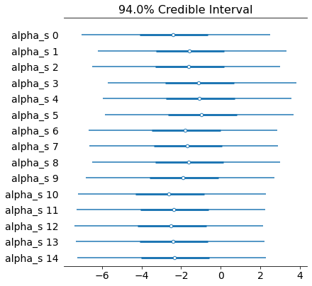
    


```python
az.plot_forest(az_model5, var_names="beta_c", combined=True)
```


    array([<AxesSubplot:title={'center':'94.0% Credible Interval'}>],
          dtype=object)


    
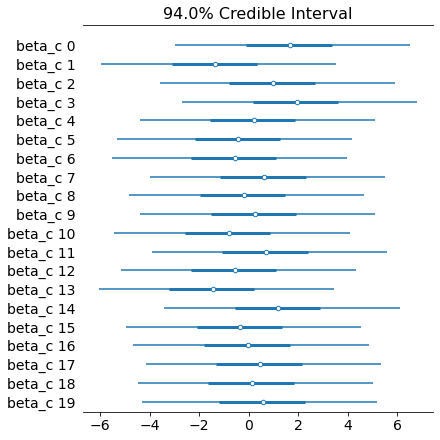
    


```python
model5_mu_post = model5_trace.get_values("mu_sgc")
model5_mu_mean = model5_mu_post.mean(axis=0)
model5_mu_hdi = [az.hpd(x, credible_interval=0.89) for x in model5_mu_post.T]

model5_ppc = data.copy()
model5_ppc["mu_mean"] = model5_mu_mean
model5_ppc["lower_ci"] = [x[0] for x in model5_mu_hdi]
model5_ppc["upper_ci"] = [x[1] for x in model5_mu_hdi]

pos_shift = 0.15

(
    gg.ggplot(model5_ppc, gg.aes("sgRNA"))
    + gg.facet_wrap("gene", scales="free")
    + gg.geom_point(gg.aes(y="logfc"), position=gg.position_nudge(x=-pos_shift))
    + gg.geom_point(
        gg.aes(y="mu_mean"), position=gg.position_nudge(x=pos_shift), color="purple"
    )
    + gg.geom_linerange(
        gg.aes(ymin="lower_ci", ymax="lower_ci"),
        position=gg.position_nudge(x=pos_shift),
        color="purple",
    )
    + gg.theme(subplots_adjust={"hspace": 0.4, "wspace": 0.25}, figure_size=(10, 8))
)
```


    
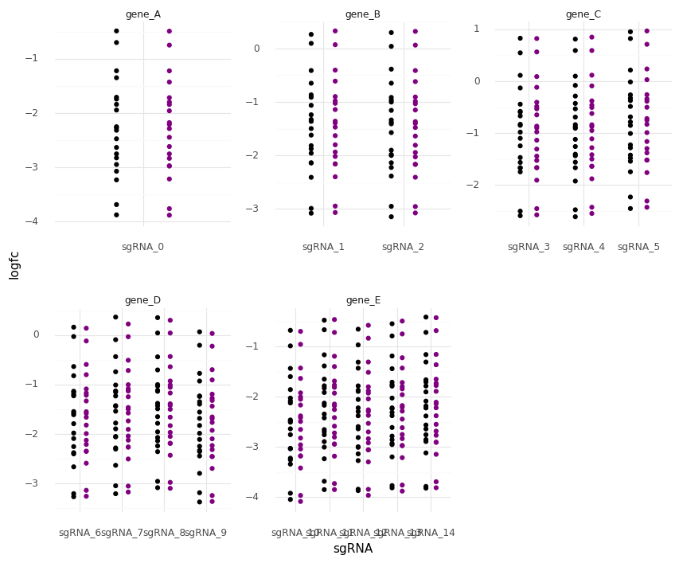
    


    <ggplot: (8738725516990)>


### Notes on the above Model 5

The model fits well, as shown by the very tight posterior predictions of each data point.
Reassuringly, there is also visible shrinkage in the predictions.

The posterior distributions of the parameters of $\alpha_s$, $\epsilon_g$, and $\beta_c$ are *very* wide, though the mean/MAP values are very accurate.
To me, this suggests that there is a lot of correlation between the posterior values. 
This would lead to greater play in the posteriors while maintaining very high accuracy in posterior predictions.

This is proven with the following plot. 🤦🏻‍♂️


```python
d = pd.DataFrame(
    {
        "alpha_s": model5_trace.get_values("alpha_s").mean(axis=1),
        "beta_c": model5_trace.get_values("beta_c").mean(axis=1),
    }
)

(gg.ggplot(d, gg.aes("alpha_s", "beta_c")) + gg.geom_point(size=0.1, alpha=0.2) + gg.labs(x="average alpha_s", y="average beta_c"))
```


    
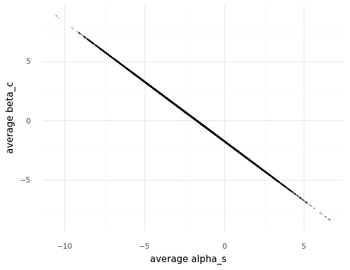
    


    <ggplot: (8738725175655)>


---

### Other Models

#### Model C

- same as Model 5, but with $\sigma_{i,c}$

#### Model A

- multiple sgRNAs per gene and not all in each cell line
- varying intercept for cell line and gene; covariate with RNA in each
- copy number as a covariate at the sgRNA level

#### Model B

- Model A
- another covariate for if the gene is mutated
    - sometimes the mutation makes a difference and sometimes it doesn't
        - when it does make a difference, how much of a difference varies, too
    - is this a mixture model or varying effect? - probably a mixture model, but I'm lacking needed knowledge

---

#### General Notes

- Model where some cell lines tend to have higher RNA expression.
- Add another level for cell line varying effects corresponding to shared lineages. (To get practice with adding another level, build a model with just these effects.)


```python

```
