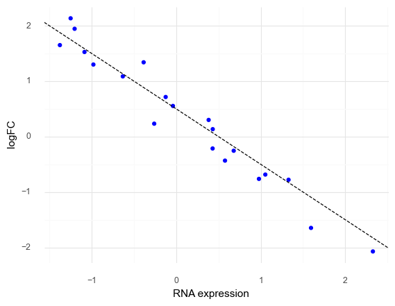
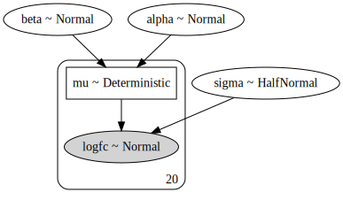
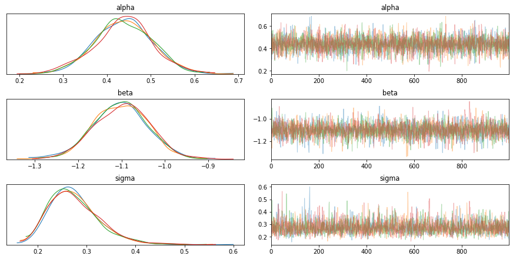
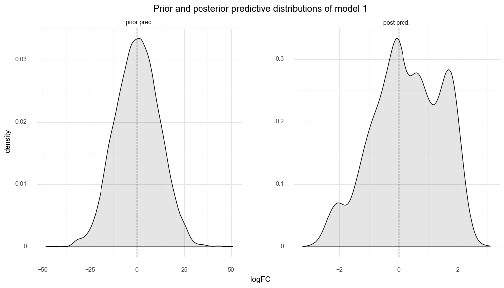
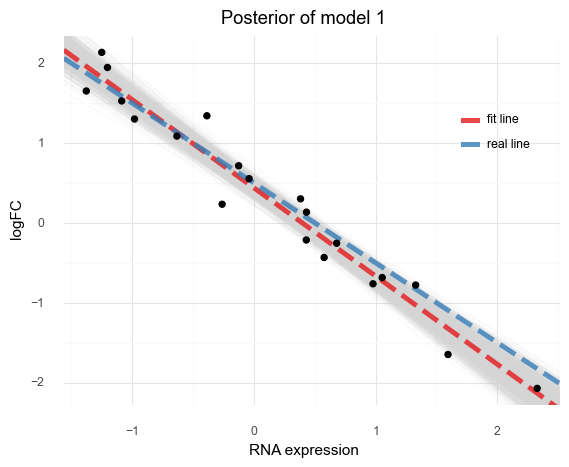
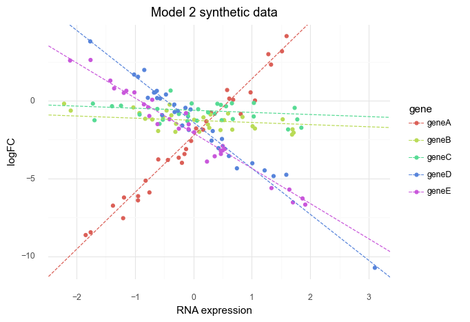
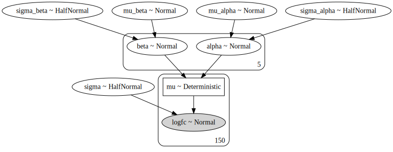
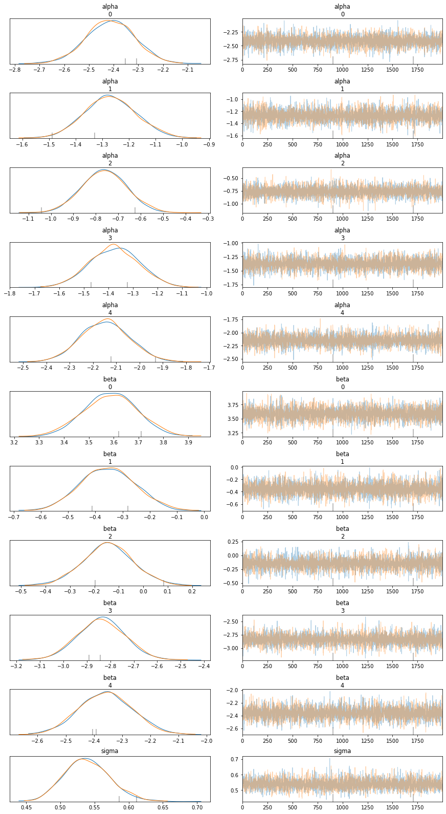
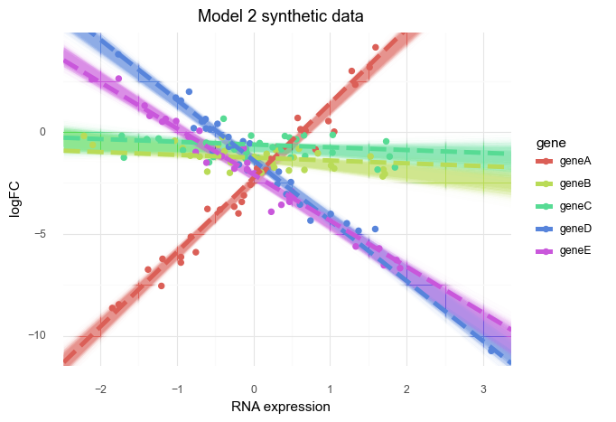

# Modeling DepMap data


```python
import pandas as pd
import numpy as np
import plotnine as gg
import pymc3 as pm
import arviz as az
import seaborn as sns
import matplotlib.pyplot as plt
import string
```


```python
gg.theme_set(gg.theme_minimal(base_family="Arial"))
```


```python
RANDOM_SEED = 103
```

## Model 1. Single gene linear model with one covariate

Model the logFC of one gene in multiple cell lines using a single predictor: RNA expression.

$$
logFC \sim Normal(\mu, \sigma) \\
\mu = \alpha + \beta R \\
\alpha \sim \mathcal{N}(0, 10) \\
\beta \sim \mathcal{N}(0, 1) \\
\sigma \sim \text{HalfNormal}(5)
$$

Simulated values:

- number of cell lines: 20
- $\alpha$ = 0.5
- $\beta$ = -1
- $\sigma$ = 0.3


```python
N_CELL_LINES = 20
real_alpha = 0.5
real_beta = -1
real_sigma = 0.3

# Synthetic data
np.random.seed(RANDOM_SEED)
rna = np.random.randn(N_CELL_LINES)
logfc = real_alpha + real_beta * rna + np.random.normal(0, real_sigma, N_CELL_LINES)
data = pd.DataFrame({"rna": rna, "logfc": logfc})

(
    gg.ggplot(data, gg.aes("rna", "logfc"))
    + gg.geom_point(color="blue")
    + gg.geom_abline(slope=real_beta, intercept=real_alpha, linetype="--")
    + gg.labs(x="RNA expression", y="logFC")
)
```


    

    


    <ggplot: (8762697970041)>


```python
with pm.Model() as model1:
    alpha = pm.Normal("alpha", 0, 10)
    beta = pm.Normal("beta", 0, 1)
    sigma = pm.HalfNormal("sigma", 5)

    mu = pm.Deterministic("mu", alpha + beta * data.rna)

    logfc = pm.Normal("logfc", mu=mu, sigma=sigma, observed=data.logfc)

    model1_prior_check = pm.sample_prior_predictive(random_seed=RANDOM_SEED)
    model1_trace = pm.sample(1000)
    model1_post_check = pm.sample_posterior_predictive(
        model1_trace, random_seed=RANDOM_SEED
    )
```

    Auto-assigning NUTS sampler...
    Initializing NUTS using jitter+adapt_diag...
    Multiprocess sampling (2 chains in 2 jobs)
    NUTS: [sigma, beta, alpha]
    Sampling 2 chains, 0 divergences: 100%|██████████| 3000/3000 [00:02<00:00, 1480.79draws/s]
    100%|██████████| 2000/2000 [00:02<00:00, 692.90it/s]


```python
pm.model_to_graphviz(model1)
```


    

    


```python
az_model1 = az.from_pymc3(
    model1_trace, posterior_predictive=model1_post_check, prior=model1_prior_check
)
```


```python
var_names = ["alpha", "beta", "sigma"]
az.summary(az_model1, var_names=var_names)
```


<div>
<style scoped>
    .dataframe tbody tr th:only-of-type {
        vertical-align: middle;
    }

    .dataframe tbody tr th {
        vertical-align: top;
    }

    .dataframe thead th {
        text-align: right;
    }
</style>
<table border="1" class="dataframe">
  <thead>
    <tr style="text-align: right;">
      <th></th>
      <th>mean</th>
      <th>sd</th>
      <th>hpd_3%</th>
      <th>hpd_97%</th>
      <th>mcse_mean</th>
      <th>mcse_sd</th>
      <th>ess_mean</th>
      <th>ess_sd</th>
      <th>ess_bulk</th>
      <th>ess_tail</th>
      <th>r_hat</th>
    </tr>
  </thead>
  <tbody>
    <tr>
      <th>alpha</th>
      <td>0.439</td>
      <td>0.067</td>
      <td>0.304</td>
      <td>0.552</td>
      <td>0.002</td>
      <td>0.001</td>
      <td>1935.0</td>
      <td>1923.0</td>
      <td>1937.0</td>
      <td>1369.0</td>
      <td>1.0</td>
    </tr>
    <tr>
      <th>beta</th>
      <td>-1.105</td>
      <td>0.062</td>
      <td>-1.213</td>
      <td>-0.980</td>
      <td>0.001</td>
      <td>0.001</td>
      <td>1760.0</td>
      <td>1760.0</td>
      <td>1762.0</td>
      <td>1376.0</td>
      <td>1.0</td>
    </tr>
    <tr>
      <th>sigma</th>
      <td>0.277</td>
      <td>0.052</td>
      <td>0.190</td>
      <td>0.376</td>
      <td>0.001</td>
      <td>0.001</td>
      <td>1774.0</td>
      <td>1709.0</td>
      <td>1837.0</td>
      <td>1317.0</td>
      <td>1.0</td>
    </tr>
  </tbody>
</table>
</div>


```python
az.plot_trace(az_model1, var_names=var_names)
plt.show()
```

    /usr/local/Caskroom/miniconda/base/envs/speclet/lib/python3.7/site-packages/arviz/plots/backends/matplotlib/distplot.py:38: UserWarning: Argument backend_kwargs has not effect in matplotlib.plot_distSupplied value won't be used
    /usr/local/Caskroom/miniconda/base/envs/speclet/lib/python3.7/site-packages/arviz/plots/backends/matplotlib/distplot.py:38: UserWarning: Argument backend_kwargs has not effect in matplotlib.plot_distSupplied value won't be used
    /usr/local/Caskroom/miniconda/base/envs/speclet/lib/python3.7/site-packages/arviz/plots/backends/matplotlib/distplot.py:38: UserWarning: Argument backend_kwargs has not effect in matplotlib.plot_distSupplied value won't be used
    /usr/local/Caskroom/miniconda/base/envs/speclet/lib/python3.7/site-packages/arviz/plots/backends/matplotlib/distplot.py:38: UserWarning: Argument backend_kwargs has not effect in matplotlib.plot_distSupplied value won't be used
    /usr/local/Caskroom/miniconda/base/envs/speclet/lib/python3.7/site-packages/arviz/plots/backends/matplotlib/distplot.py:38: UserWarning: Argument backend_kwargs has not effect in matplotlib.plot_distSupplied value won't be used
    /usr/local/Caskroom/miniconda/base/envs/speclet/lib/python3.7/site-packages/arviz/plots/backends/matplotlib/distplot.py:38: UserWarning: Argument backend_kwargs has not effect in matplotlib.plot_distSupplied value won't be used


    

    


```python
az.plot_posterior(az_model1, var_names=var_names)
plt.show()
```


    

    


```python
prior_pred = (
    az_model1.prior_predictive.to_dataframe()
    .sample(frac=0.5)
    .assign(pred="prior pred.")
)
post_pred = (
    az_model1.posterior_predictive.to_dataframe()
    .sample(frac=0.2)
    .assign(pred="post pred.")
)
model1_preds = pd.concat([prior_pred, post_pred])
model1_preds["pred"] = pd.Categorical(
    model1_preds.pred, categories=["prior pred.", "post pred."]
)
(
    gg.ggplot(model1_preds, gg.aes("logfc"))
    + gg.facet_wrap("pred", nrow=1, scales="free")
    + gg.geom_density(fill="black", alpha=0.1)
    + gg.geom_vline(xintercept=0, linetype="--")
    + gg.scale_y_continuous(limits=(0, np.nan))
    + gg.labs(
        x="logFC",
        y="density",
        title="Prior and posterior predictive distributions of model 1",
    )
    + gg.theme(figure_size=[12, 6], subplots_adjust={"wspace": 0.25})
)
```


    

    


    <ggplot: (8762699362861)>


```python
post = az_model1.posterior.to_dataframe()

post_summary = pd.DataFrame(
    {
        "name": ["real line", "fit line"],
        "slope": [real_beta, post.mean()["beta"]],
        "intercept": [real_alpha, post.mean()["alpha"]],
    }
)

(
    gg.ggplot(post.sample(frac=0.1))
    + gg.geom_abline(
        gg.aes(slope="beta", intercept="alpha"), alpha=0.1, color="lightgrey"
    )
    + gg.geom_abline(
        gg.aes(slope="slope", intercept="intercept", color="name"),
        data=post_summary,
        size=2,
        alpha=0.8,
        linetype="--",
    )
    + gg.geom_point(gg.aes(x="rna", y="logfc"), data=data, color="black", size=2)
    + gg.scale_color_brewer(type="qual", palette="Set1")
    + gg.theme(legend_position=(0.8, 0.7))
    + gg.labs(x="RNA expression", y="logFC", title="Posterior of model 1", color="")
)
```


    

    


    <ggplot: (8762699300897)>


---

## Model 2. Multiple genes hierarchical model with one covariate

Model the logFC of multiple genes in multiple cell lines using a single predictor: RNA expression.
A hierarchcial model will be used to pool information across genes.

$$
logFC \sim Normal(\mu, \sigma) \\
\mu_g = \alpha_g + \beta_g R \\
\alpha_g \sim \mathcal{N}(\mu_\alpha, \sigma_\alpha) \\
\mu_\alpha \sim \mathcal{N}(0, 10) \qquad \sigma_\alpha \sim \text{HalfNormal}(5) \\
\beta_g \sim \mathcal{N}(\mu_\beta, \sigma_\beta) \\
\mu_\beta \sim \mathcal{N}(0, 10) \qquad \sigma_\beta \sim \text{HalfNormal}(5) \\
\sigma \sim \text{HalfNormal}(5)
$$

Simulated values:

- number of cell lines: 30
- number of genes: 5
- $\mu_\alpha$ = -1, $\sigma_\alpha$ = 1
- $\mu_\beta$ = -1, $\sigma_\beta$ = 2
- $\sigma$ = 0.3


```python
np.random.seed(RANDOM_SEED)

num_cell_lines = 30
num_genes = 5

real_mu_alpha, real_sigma_alpha = -1, 1
real_mu_beta, real_sigma_beta = -1, 2
real_sigma = 0.5

real_alpha = np.random.normal(loc=real_mu_alpha, scale=real_sigma_alpha, size=num_genes)
real_beta = np.random.normal(loc=real_mu_beta, scale=real_sigma_beta, size=num_genes)

genes = ["gene" + a for a in string.ascii_uppercase[:num_genes]]
rna = np.random.randn(num_genes, num_cell_lines)

logfc = (
    real_alpha
    + real_beta * rna.T
    + np.random.normal(loc=0, scale=real_sigma, size=(rna.T.shape))
)
logfc = logfc.T
```


```python
rna_flat = rna.flatten()
logfc_flat = logfc.flatten()
gene_idx = np.repeat(range(num_genes), num_cell_lines)
```


```python
tidy_data = pd.DataFrame(
    {"gene": [genes[i] for i in gene_idx], "rna": rna_flat, "logfc": logfc_flat}
)

tidy_real_data = pd.DataFrame({"alpha": real_alpha, "beta": real_beta, "gene": genes})


(
    gg.ggplot(tidy_data)
    + gg.geom_point(gg.aes(x="rna", y="logfc", color="gene"))
    + gg.geom_abline(
        gg.aes(slope="beta", intercept="alpha", color="gene"),
        data=tidy_real_data,
        linetype="--",
    )
    + gg.labs(
        x="RNA expression", y="logFC", color="gene", title="Model 2 synthetic data"
    )
)
```


    

    


    <ggplot: (8762699227713)>


```python
with pm.Model() as model2:
    # Hyper-priors
    mu_alpha = pm.Normal("mu_alpha", 0, 5)
    sigma_alpha = pm.HalfNormal("sigma_alpha", 5)
    mu_beta = pm.Normal("mu_beta", 0, 2)
    sigma_beta = pm.HalfNormal("sigma_beta", 2)

    # Priors
    alpha = pm.Normal("alpha", mu_alpha, sigma_alpha, shape=num_genes)
    beta = pm.Normal("beta", mu_beta, sigma_beta, shape=num_genes)
    mu = pm.Deterministic("mu", alpha[gene_idx] + beta[gene_idx] * rna_flat)
    sigma = pm.HalfNormal("sigma", 5)

    # Likelihood
    logfc = pm.Normal("logfc", mu=mu, sigma=sigma, observed=logfc_flat)

    # Sampling
    model2_prior_check = pm.sample_prior_predictive(random_seed=RANDOM_SEED)
    model2_trace = pm.sample(2000, tune=2000)
    model2_post_check = pm.sample_posterior_predictive(
        model2_trace, random_seed=RANDOM_SEED
    )
```

    Auto-assigning NUTS sampler...
    Initializing NUTS using jitter+adapt_diag...
    Multiprocess sampling (2 chains in 2 jobs)
    NUTS: [sigma, beta, alpha, sigma_beta, mu_beta, sigma_alpha, mu_alpha]
    Sampling 2 chains, 2 divergences: 100%|██████████| 8000/8000 [00:38<00:00, 208.94draws/s]
    There were 2 divergences after tuning. Increase `target_accept` or reparameterize.
    100%|██████████| 4000/4000 [00:19<00:00, 200.90it/s]


```python
pm.model_to_graphviz(model2)
```


    

    


```python
az_model2 = az.from_pymc3(
    trace=model2_trace, prior=model2_prior_check, posterior_predictive=model2_post_check
)
az.summary(az_model2, var_names=["alpha", "beta", "sigma"])
```


<div>
<style scoped>
    .dataframe tbody tr th:only-of-type {
        vertical-align: middle;
    }

    .dataframe tbody tr th {
        vertical-align: top;
    }

    .dataframe thead th {
        text-align: right;
    }
</style>
<table border="1" class="dataframe">
  <thead>
    <tr style="text-align: right;">
      <th></th>
      <th>mean</th>
      <th>sd</th>
      <th>hpd_3%</th>
      <th>hpd_97%</th>
      <th>mcse_mean</th>
      <th>mcse_sd</th>
      <th>ess_mean</th>
      <th>ess_sd</th>
      <th>ess_bulk</th>
      <th>ess_tail</th>
      <th>r_hat</th>
    </tr>
  </thead>
  <tbody>
    <tr>
      <th>alpha[0]</th>
      <td>-2.414</td>
      <td>0.097</td>
      <td>-2.592</td>
      <td>-2.228</td>
      <td>0.001</td>
      <td>0.001</td>
      <td>7751.0</td>
      <td>7751.0</td>
      <td>7715.0</td>
      <td>3293.0</td>
      <td>1.0</td>
    </tr>
    <tr>
      <th>alpha[1]</th>
      <td>-1.271</td>
      <td>0.097</td>
      <td>-1.446</td>
      <td>-1.082</td>
      <td>0.001</td>
      <td>0.001</td>
      <td>8893.0</td>
      <td>8875.0</td>
      <td>9014.0</td>
      <td>2617.0</td>
      <td>1.0</td>
    </tr>
    <tr>
      <th>alpha[2]</th>
      <td>-0.764</td>
      <td>0.099</td>
      <td>-0.939</td>
      <td>-0.568</td>
      <td>0.001</td>
      <td>0.001</td>
      <td>9058.0</td>
      <td>8647.0</td>
      <td>9087.0</td>
      <td>2851.0</td>
      <td>1.0</td>
    </tr>
    <tr>
      <th>alpha[3]</th>
      <td>-1.377</td>
      <td>0.099</td>
      <td>-1.563</td>
      <td>-1.191</td>
      <td>0.001</td>
      <td>0.001</td>
      <td>8102.0</td>
      <td>8096.0</td>
      <td>8119.0</td>
      <td>3169.0</td>
      <td>1.0</td>
    </tr>
    <tr>
      <th>alpha[4]</th>
      <td>-2.149</td>
      <td>0.103</td>
      <td>-2.345</td>
      <td>-1.960</td>
      <td>0.001</td>
      <td>0.001</td>
      <td>7082.0</td>
      <td>7049.0</td>
      <td>7077.0</td>
      <td>2720.0</td>
      <td>1.0</td>
    </tr>
    <tr>
      <th>beta[0]</th>
      <td>3.587</td>
      <td>0.107</td>
      <td>3.390</td>
      <td>3.787</td>
      <td>0.001</td>
      <td>0.001</td>
      <td>8371.0</td>
      <td>8331.0</td>
      <td>8413.0</td>
      <td>2970.0</td>
      <td>1.0</td>
    </tr>
    <tr>
      <th>beta[1]</th>
      <td>-0.355</td>
      <td>0.101</td>
      <td>-0.536</td>
      <td>-0.157</td>
      <td>0.001</td>
      <td>0.001</td>
      <td>7656.0</td>
      <td>6965.0</td>
      <td>7639.0</td>
      <td>2580.0</td>
      <td>1.0</td>
    </tr>
    <tr>
      <th>beta[2]</th>
      <td>-0.145</td>
      <td>0.103</td>
      <td>-0.336</td>
      <td>0.051</td>
      <td>0.001</td>
      <td>0.001</td>
      <td>8554.0</td>
      <td>4536.0</td>
      <td>8541.0</td>
      <td>3048.0</td>
      <td>1.0</td>
    </tr>
    <tr>
      <th>beta[3]</th>
      <td>-2.839</td>
      <td>0.102</td>
      <td>-3.020</td>
      <td>-2.643</td>
      <td>0.001</td>
      <td>0.001</td>
      <td>6684.0</td>
      <td>6622.0</td>
      <td>6688.0</td>
      <td>2715.0</td>
      <td>1.0</td>
    </tr>
    <tr>
      <th>beta[4]</th>
      <td>-2.359</td>
      <td>0.094</td>
      <td>-2.536</td>
      <td>-2.183</td>
      <td>0.001</td>
      <td>0.001</td>
      <td>7047.0</td>
      <td>6979.0</td>
      <td>6996.0</td>
      <td>2634.0</td>
      <td>1.0</td>
    </tr>
    <tr>
      <th>sigma</th>
      <td>0.539</td>
      <td>0.033</td>
      <td>0.480</td>
      <td>0.603</td>
      <td>0.000</td>
      <td>0.000</td>
      <td>6629.0</td>
      <td>6478.0</td>
      <td>6758.0</td>
      <td>3010.0</td>
      <td>1.0</td>
    </tr>
  </tbody>
</table>
</div>


```python
# Real values
pd.DataFrame({"real alpha": real_alpha, "real beta": real_beta})
```


<div>
<style scoped>
    .dataframe tbody tr th:only-of-type {
        vertical-align: middle;
    }

    .dataframe tbody tr th {
        vertical-align: top;
    }

    .dataframe thead th {
        text-align: right;
    }
</style>
<table border="1" class="dataframe">
  <thead>
    <tr style="text-align: right;">
      <th></th>
      <th>real alpha</th>
      <th>real beta</th>
    </tr>
  </thead>
  <tbody>
    <tr>
      <th>0</th>
      <td>-2.249278</td>
      <td>3.654438</td>
    </tr>
    <tr>
      <th>1</th>
      <td>-1.260331</td>
      <td>-0.138414</td>
    </tr>
    <tr>
      <th>2</th>
      <td>-0.616207</td>
      <td>-0.135368</td>
    </tr>
    <tr>
      <th>3</th>
      <td>-1.385461</td>
      <td>-2.960023</td>
    </tr>
    <tr>
      <th>4</th>
      <td>-2.085137</td>
      <td>-2.263930</td>
    </tr>
  </tbody>
</table>
</div>


```python
az.plot_trace(az_model2, var_names=var_names)
plt.show()
```

    /usr/local/Caskroom/miniconda/base/envs/speclet/lib/python3.7/site-packages/arviz/plots/backends/matplotlib/distplot.py:38: UserWarning: Argument backend_kwargs has not effect in matplotlib.plot_distSupplied value won't be used
    /usr/local/Caskroom/miniconda/base/envs/speclet/lib/python3.7/site-packages/arviz/plots/backends/matplotlib/distplot.py:38: UserWarning: Argument backend_kwargs has not effect in matplotlib.plot_distSupplied value won't be used
    /usr/local/Caskroom/miniconda/base/envs/speclet/lib/python3.7/site-packages/arviz/plots/backends/matplotlib/distplot.py:38: UserWarning: Argument backend_kwargs has not effect in matplotlib.plot_distSupplied value won't be used
    /usr/local/Caskroom/miniconda/base/envs/speclet/lib/python3.7/site-packages/arviz/plots/backends/matplotlib/distplot.py:38: UserWarning: Argument backend_kwargs has not effect in matplotlib.plot_distSupplied value won't be used
    /usr/local/Caskroom/miniconda/base/envs/speclet/lib/python3.7/site-packages/arviz/plots/backends/matplotlib/distplot.py:38: UserWarning: Argument backend_kwargs has not effect in matplotlib.plot_distSupplied value won't be used
    /usr/local/Caskroom/miniconda/base/envs/speclet/lib/python3.7/site-packages/arviz/plots/backends/matplotlib/distplot.py:38: UserWarning: Argument backend_kwargs has not effect in matplotlib.plot_distSupplied value won't be used
    /usr/local/Caskroom/miniconda/base/envs/speclet/lib/python3.7/site-packages/arviz/plots/backends/matplotlib/distplot.py:38: UserWarning: Argument backend_kwargs has not effect in matplotlib.plot_distSupplied value won't be used
    /usr/local/Caskroom/miniconda/base/envs/speclet/lib/python3.7/site-packages/arviz/plots/backends/matplotlib/distplot.py:38: UserWarning: Argument backend_kwargs has not effect in matplotlib.plot_distSupplied value won't be used
    /usr/local/Caskroom/miniconda/base/envs/speclet/lib/python3.7/site-packages/arviz/plots/backends/matplotlib/distplot.py:38: UserWarning: Argument backend_kwargs has not effect in matplotlib.plot_distSupplied value won't be used
    /usr/local/Caskroom/miniconda/base/envs/speclet/lib/python3.7/site-packages/arviz/plots/backends/matplotlib/distplot.py:38: UserWarning: Argument backend_kwargs has not effect in matplotlib.plot_distSupplied value won't be used
    /usr/local/Caskroom/miniconda/base/envs/speclet/lib/python3.7/site-packages/arviz/plots/backends/matplotlib/distplot.py:38: UserWarning: Argument backend_kwargs has not effect in matplotlib.plot_distSupplied value won't be used
    /usr/local/Caskroom/miniconda/base/envs/speclet/lib/python3.7/site-packages/arviz/plots/backends/matplotlib/distplot.py:38: UserWarning: Argument backend_kwargs has not effect in matplotlib.plot_distSupplied value won't be used
    /usr/local/Caskroom/miniconda/base/envs/speclet/lib/python3.7/site-packages/arviz/plots/backends/matplotlib/distplot.py:38: UserWarning: Argument backend_kwargs has not effect in matplotlib.plot_distSupplied value won't be used
    /usr/local/Caskroom/miniconda/base/envs/speclet/lib/python3.7/site-packages/arviz/plots/backends/matplotlib/distplot.py:38: UserWarning: Argument backend_kwargs has not effect in matplotlib.plot_distSupplied value won't be used
    /usr/local/Caskroom/miniconda/base/envs/speclet/lib/python3.7/site-packages/arviz/plots/backends/matplotlib/distplot.py:38: UserWarning: Argument backend_kwargs has not effect in matplotlib.plot_distSupplied value won't be used
    /usr/local/Caskroom/miniconda/base/envs/speclet/lib/python3.7/site-packages/arviz/plots/backends/matplotlib/distplot.py:38: UserWarning: Argument backend_kwargs has not effect in matplotlib.plot_distSupplied value won't be used
    /usr/local/Caskroom/miniconda/base/envs/speclet/lib/python3.7/site-packages/arviz/plots/backends/matplotlib/distplot.py:38: UserWarning: Argument backend_kwargs has not effect in matplotlib.plot_distSupplied value won't be used
    /usr/local/Caskroom/miniconda/base/envs/speclet/lib/python3.7/site-packages/arviz/plots/backends/matplotlib/distplot.py:38: UserWarning: Argument backend_kwargs has not effect in matplotlib.plot_distSupplied value won't be used
    /usr/local/Caskroom/miniconda/base/envs/speclet/lib/python3.7/site-packages/arviz/plots/backends/matplotlib/distplot.py:38: UserWarning: Argument backend_kwargs has not effect in matplotlib.plot_distSupplied value won't be used
    /usr/local/Caskroom/miniconda/base/envs/speclet/lib/python3.7/site-packages/arviz/plots/backends/matplotlib/distplot.py:38: UserWarning: Argument backend_kwargs has not effect in matplotlib.plot_distSupplied value won't be used
    /usr/local/Caskroom/miniconda/base/envs/speclet/lib/python3.7/site-packages/arviz/plots/backends/matplotlib/distplot.py:38: UserWarning: Argument backend_kwargs has not effect in matplotlib.plot_distSupplied value won't be used
    /usr/local/Caskroom/miniconda/base/envs/speclet/lib/python3.7/site-packages/arviz/plots/backends/matplotlib/distplot.py:38: UserWarning: Argument backend_kwargs has not effect in matplotlib.plot_distSupplied value won't be used


    

    


```python
az.plot_forest(az_model2, var_names=var_names)
```


    array([<AxesSubplot:title={'center':'94.0% Credible Interval'}>],
          dtype=object)


    

    


```python
post = (
    az_model2.posterior.to_dataframe()
    .query("alpha_dim_0 == beta_dim_0")
    .reset_index()
    .groupby(["alpha_dim_0", "beta_dim_0"])
    .apply(lambda x: x.sample(frac=0.1))
    .reset_index(drop=True)
)
```


```python
post.head()
```


<div>
<style scoped>
    .dataframe tbody tr th:only-of-type {
        vertical-align: middle;
    }

    .dataframe tbody tr th {
        vertical-align: top;
    }

    .dataframe thead th {
        text-align: right;
    }
</style>
<table border="1" class="dataframe">
  <thead>
    <tr style="text-align: right;">
      <th></th>
      <th>alpha_dim_0</th>
      <th>beta_dim_0</th>
      <th>chain</th>
      <th>draw</th>
      <th>mu_dim_0</th>
      <th>mu_alpha</th>
      <th>mu_beta</th>
      <th>alpha</th>
      <th>beta</th>
      <th>sigma_alpha</th>
      <th>sigma_beta</th>
      <th>mu</th>
      <th>sigma</th>
    </tr>
  </thead>
  <tbody>
    <tr>
      <th>0</th>
      <td>0</td>
      <td>0</td>
      <td>1</td>
      <td>1297</td>
      <td>58</td>
      <td>-2.005934</td>
      <td>0.896238</td>
      <td>-2.533306</td>
      <td>3.537462</td>
      <td>1.057965</td>
      <td>2.704487</td>
      <td>-1.491174</td>
      <td>0.513907</td>
    </tr>
    <tr>
      <th>1</th>
      <td>0</td>
      <td>0</td>
      <td>0</td>
      <td>1427</td>
      <td>105</td>
      <td>-1.612549</td>
      <td>1.361572</td>
      <td>-2.416255</td>
      <td>3.616562</td>
      <td>0.481319</td>
      <td>2.038553</td>
      <td>-1.192133</td>
      <td>0.546126</td>
    </tr>
    <tr>
      <th>2</th>
      <td>0</td>
      <td>0</td>
      <td>0</td>
      <td>1811</td>
      <td>43</td>
      <td>-1.090456</td>
      <td>-0.989185</td>
      <td>-2.351589</td>
      <td>3.509903</td>
      <td>0.789774</td>
      <td>1.742488</td>
      <td>-0.946303</td>
      <td>0.543524</td>
    </tr>
    <tr>
      <th>3</th>
      <td>0</td>
      <td>0</td>
      <td>1</td>
      <td>22</td>
      <td>50</td>
      <td>-1.913872</td>
      <td>-0.134479</td>
      <td>-2.430872</td>
      <td>3.541012</td>
      <td>0.541700</td>
      <td>2.727996</td>
      <td>-1.483219</td>
      <td>0.489283</td>
    </tr>
    <tr>
      <th>4</th>
      <td>0</td>
      <td>0</td>
      <td>0</td>
      <td>1620</td>
      <td>46</td>
      <td>-0.050011</td>
      <td>-1.155751</td>
      <td>-2.401856</td>
      <td>3.715742</td>
      <td>2.398424</td>
      <td>3.717638</td>
      <td>-1.243279</td>
      <td>0.527196</td>
    </tr>
  </tbody>
</table>
</div>


```python
post["gene"] = [genes[i] for i in post.alpha_dim_0]

(
    gg.ggplot(post)
    + gg.geom_abline(gg.aes(slope="beta", intercept="alpha", color="gene"), alpha=0.01)
    + gg.geom_point(gg.aes(x="rna", y="logfc", color="gene"), data=tidy_data, size=2)
    + gg.geom_abline(
        gg.aes(slope="beta", intercept="alpha", color="gene"),
        data=tidy_real_data,
        linetype="--",
        size=2,
    )
    + gg.labs(
        x="RNA expression", y="logFC", color="gene", title="Model 2 synthetic data"
    )
)
```


    

    


    <ggplot: (8762698880705)>


---

## Model 3. Multiple genes and multiple cell lines hierarchical model with one covariate

Model the logFC of multiple genes in multiple cell lines using a single predictor: RNA expression.
A hierarchcial model will be used to pool information across genes and cell lines.
There are repeated measure for logFC of a gene in each cell line, but only one measure of RNA seq per cell line per gene.

**Note:** Need to include repeated measure of logFC per cell line (but only 1 measure of RNA expression...).

Modeling options:

- separate intercept and slope for cell line
- single intercept and slope per gene that are each composed of a higher level model that varys by cell line

$
logFC_{g,c} \sim \mathcal{N}(\mu_{g,c}, \sigma_c) \\
\quad \mu_{g,c} = \alpha_g + \beta_c \\
\quad \quad \alpha_g \sim \mathcal{N}(\alpha, \sigma_\alpha) \\
\quad \quad \quad \alpha = \gamma_0 + \gamma_1 R \\
\quad \quad \quad \quad \gamma \sim \mathcal{N}(0, 5, \text{dim} = 2) \\
\quad \quad \quad\sigma_\alpha \sim \text{Exp}(1) \\
\quad \quad \beta_c \sim \mathcal{N}(\beta, \sigma_\beta) \\
\quad \quad \quad \beta = \delta_0 + \delta_1 R \\
\quad \quad \quad \quad \delta \sim \mathcal{N}(0, 5, \text{dim} = 2) \\
\quad \quad \quad\sigma_\beta \sim \text{Exp}(1) \\
\quad \sigma_c \sim \text{Exp}(\sigma) \\
\quad \quad \sigma \sim \text{Exp}(1)
$

Simulated values:

- number of cell lines: 30
- number of logFC data points per gene per cell line: 3
- number of genes: 5
- $\gamma = [0, 1]$
- $\sigma_\alpha = 0.5$
- $\delta = [0, 0]$
- $\sigma_\beta = 1$
- $\sigma = 1$

Notes on above model:

(Comments about about $\gamma$ is also true for $\delta$.)

- what is currently represented by $\gamma$ should be two separate varaibles
- should there be another level on top of $\gamma$?
    - $\gamma \sim \mathcal{N}(\mu_\gamma, \sigma_\gamma) \quad \text{and} \quad \mu_\gamma \sim \mathcal{N}(0, 5) \quad \sigma_\gamma \sim \text{Exp}(1)$
    - would then have a separate $\gamma$ per gene
        - that's a varying intercept and a varying slope per gene


```python
np.random.seed(RANDOM_SEED)

# Synthetic data parmeters
num_cell_lines = 20
num_logfc_datum = 3
num_genes = 5

# Real hyper-parameter values
real_gamma = [0, 1]
real_sigma_alpha = 0.5
real_delta = [0, 0]
real_sigma_beta = 1
real_sigma = 1


rna = np.random.normal(0, 1, num_cell_lines * num_genes)
genes = ["gene" + a for a in string.ascii_uppercase[:num_genes]]
cell_lines = ["cell" + a for a in string.ascii_uppercase[:num_cell_lines]]

data = pd.DataFrame(
    {
        "rna": rna,
        "gene": np.repeat(genes, num_cell_lines),
        "cell_line": np.tile(cell_lines, num_genes),
    }
)

data.head()
```


<div>
<style scoped>
    .dataframe tbody tr th:only-of-type {
        vertical-align: middle;
    }

    .dataframe tbody tr th {
        vertical-align: top;
    }

    .dataframe thead th {
        text-align: right;
    }
</style>
<table border="1" class="dataframe">
  <thead>
    <tr style="text-align: right;">
      <th></th>
      <th>rna</th>
      <th>gene</th>
      <th>cell_line</th>
    </tr>
  </thead>
  <tbody>
    <tr>
      <th>0</th>
      <td>-1.249278</td>
      <td>geneA</td>
      <td>cellA</td>
    </tr>
    <tr>
      <th>1</th>
      <td>-0.260331</td>
      <td>geneA</td>
      <td>cellB</td>
    </tr>
    <tr>
      <th>2</th>
      <td>0.383793</td>
      <td>geneA</td>
      <td>cellC</td>
    </tr>
    <tr>
      <th>3</th>
      <td>-0.385461</td>
      <td>geneA</td>
      <td>cellD</td>
    </tr>
    <tr>
      <th>4</th>
      <td>-1.085137</td>
      <td>geneA</td>
      <td>cellE</td>
    </tr>
  </tbody>
</table>
</div>


```python
alpha_gene = gamma[0] + gamma[1]
mu = alpha + beta
```


    ---------------------------------------------------------------------------

    NameError                                 Traceback (most recent call last)

    <ipython-input-26-c75faf2b6737> in <module>
    ----> 1 alpha_gene = gamma[0] + gamma[1]
          2 mu = alpha + beta


    NameError: name 'gamma' is not defined


```python

```


```python

```


```python
(
    gg.ggplot(data, gg.aes("gene", "rna"))
    + gg.geom_boxplot(gg.aes(color="gene", fill="gene"), alpha=0.1, outlier_shape="")
    + gg.geom_jitter(gg.aes(color="gene"), width=0.3)
    + gg.scale_y_continuous(expand=(0, 0, 0.02, 0))
    + gg.scale_color_brewer(type="qual", palette="Set1", guide=False)
    + gg.scale_fill_brewer(type="qual", palette="Set1", guide=False)
    + gg.theme(axis_title_x=gg.element_blank())
    + gg.labs(y="RNA expression (scaled)", title="Synthetic data RNA expression")
)
```


```python

```


```python

```


```python

```

---

Note:

- model if there is correlation between RNA expression and cell lines (some cells tend to have higher RNA expression)


```python

```
