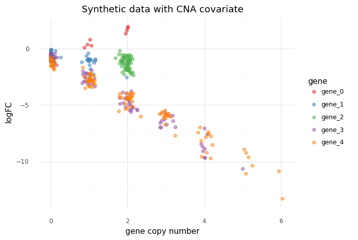
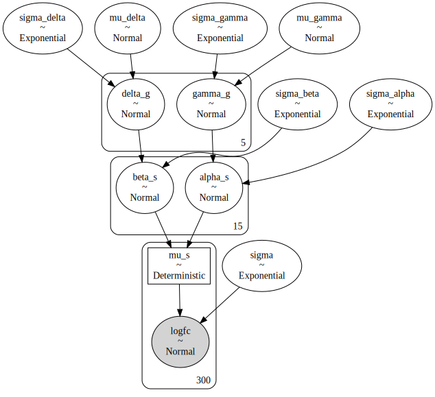
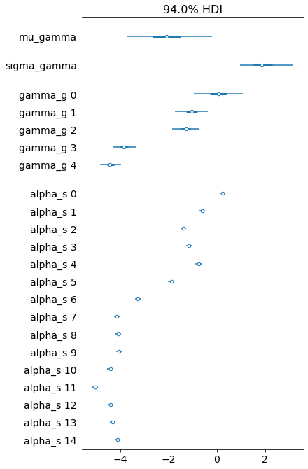
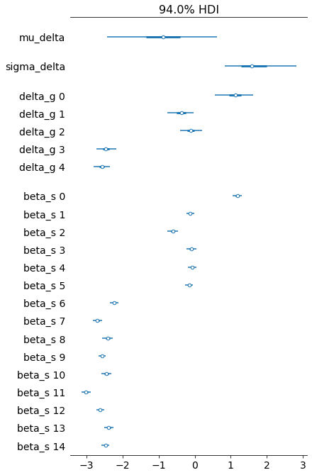
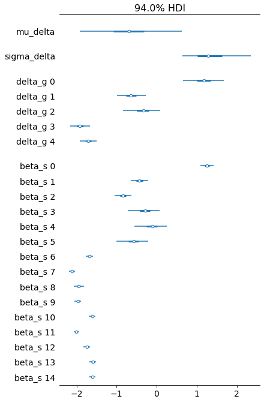

```python
import pandas as pd
import numpy as np
import plotnine as gg
import pymc3 as pm
import arviz as az
import seaborn as sns
import matplotlib.pyplot as plt
import string
from itertools import product
from numpy.random import normal, exponential, seed
```


```python
import warnings

warnings.simplefilter(action="ignore", category=UserWarning)
```


```python
gg.theme_set(gg.theme_minimal())
```


```python
RANDOM_SEED = 103
```

---

## Model 6. Varying intercept and slope.

Model the logFC for knocking-out a gene $g$ with sgRNA $s$ with known copy number $X$.
Use a varying intercept for the the intercept and slope by taget gene $g$ of the sgRNA $s$.

$
logFC_s \sim \mathcal{N}(\mu_s, \sigma) \\
\mu_s = \alpha_s + \beta_s X \\
\quad \alpha_s \sim \mathcal{N}(\mu_\alpha, \sigma_\alpha) \\
\qquad \mu_\alpha = \gamma_g \\
\qquad\quad \gamma_g \sim \mathcal{N}(\mu_\gamma, \sigma_\gamma) \\
\qquad\qquad \mu_\gamma \sim \mathcal{N}(0, 5) \quad \sigma_\gamma \sim \text{Exp}(1) \\
\qquad \sigma_\alpha \sim \text{Exp}(1) \\
\quad \beta_s \sim \mathcal{N}(\mu_\beta, \sigma_\beta) \\
\qquad \mu_\beta = \delta_g \\
\qquad\quad \delta_g \sim \mathcal{N}(\mu_\delta, \sigma_\delta) \\
\qquad\qquad \mu_\delta \sim \mathcal{N}(0, 5) \quad \sigma_\delta \sim \text{Exp}(1) \\
\qquad \sigma_\beta \sim \text{Exp}(1) \\
\sigma \sim \text{Exp}(1)
$

Simulated values:

- number of cell lines: 20
- number of genes: 5
- number of repeated measures: ${1, 2, 3, 4, 5}$
- $\mu_\gamma = -0.5$, $\sigma_\gamma = 0.5$
- $\sigma_\alpha = 0.2$
- $\mu_\delta = -1$, $\sigma_\delta = 1$
- $\sigma_\beta = 0.2$
- $\sigma = 0.3$


```python
seed(RANDOM_SEED)

num_cell_lines = 20
num_genes = 5
num_sgrna_per_gene = list(range(1, num_genes + 1))
num_sgrnas = sum(num_sgrna_per_gene)

real_params = {
    "mu_gamma": -0.5,
    "sigma_gamma": 0.5,
    "sigma_alpha": 0.2,
    "mu_delta": -1,
    "sigma_delta": 1,
    "sigma_beta": 0.2,
    "sigma": 0.3,
}


def prefix_num(prefix, n):
    return [prefix + str(i) for i in range(n)]


cell_lines = prefix_num("cell_", num_cell_lines)
genes = prefix_num("gene_", num_genes)
sgrnas = prefix_num("sgRNA_", num_sgrnas)

real_params["gamma_g"] = normal(
    real_params["mu_gamma"], real_params["sigma_gamma"], num_genes
)
real_params["mu_alpha"] = real_params["gamma_g"]
real_params["delta_g"] = normal(
    real_params["mu_delta"], real_params["sigma_delta"], num_genes
)
real_params["mu_beta"] = real_params["delta_g"]


real_alpha_s = []
real_beta_s = []
for gene_i in range(num_genes):
    mu_alpha = real_params["mu_alpha"][gene_i]
    mu_beta = real_params["mu_beta"][gene_i]
    for sgrna_j in range(num_sgrna_per_gene[gene_i]):
        real_alpha_s.append(normal(mu_alpha, real_params["sigma_alpha"]))
        real_beta_s.append(normal(mu_beta, real_params["sigma_beta"]))

real_params["alpha_s"] = real_alpha_s
real_params["beta_s"] = real_beta_s

gene_to_sgrna_map = pd.DataFrame(
    {"gene": np.repeat(genes, num_sgrna_per_gene), "sgRNA": sgrnas}
)
gene_to_sgrna_map["gene"] = pd.Categorical(gene_to_sgrna_map["gene"], categories=genes)
gene_to_sgrna_map["sgRNA"] = pd.Categorical(
    gene_to_sgrna_map["sgRNA"], categories=sgrnas
)

data = pd.DataFrame(product(genes, cell_lines), columns=["gene", "cell_line"])
data = pd.merge(data, gene_to_sgrna_map, how="right", on="gene")
data["cell_line"] = pd.Categorical(data["cell_line"], categories=cell_lines)
data["gene"] = pd.Categorical(data["gene"], categories=genes)
data["sgRNA"] = pd.Categorical(data["sgRNA"], categories=sgrnas)

gene_lambdas = [1, 0.8, -1, 1.5, 2]

data["logfc"] = np.nan
data["cna"] = np.nan

for i in range(len(data)):
    gene_i = data.gene.cat.codes[i]
    sgrna_i = data.sgRNA.cat.codes[i]

    alpha_s = real_params["alpha_s"][sgrna_i]
    beta_s = real_params["beta_s"][sgrna_i]

    gene_cna_lambda = gene_lambdas[gene_i]
    cna = -1
    if gene_cna_lambda == -1:
        cna = 2
    else:
        cna = np.random.poisson(lam=gene_cna_lambda)

    cna = np.max([cna + normal(0, 0.1, 1), 0])
    mu_s = alpha_s + beta_s * cna
    data.loc[i, "cna"] = cna
    data.loc[i, "logfc"] = normal(mu_s, real_params["sigma"])
```

> **I need to adjust the synthetic CNA data so that it gets scaled within each gene.**


```python
raise Exception("See note above.")
```


    ---------------------------------------------------------------------------

    Exception                                 Traceback (most recent call last)

    <ipython-input-94-aaaa3151472d> in <module>
    ----> 1 raise Exception("See note above.")
    

    Exception: See note above.


```python
data.head()
```


<div>
<style scoped>
    .dataframe tbody tr th:only-of-type {
        vertical-align: middle;
    }

    .dataframe tbody tr th {
        vertical-align: top;
    }

    .dataframe thead th {
        text-align: right;
    }
</style>
<table border="1" class="dataframe">
  <thead>
    <tr style="text-align: right;">
      <th></th>
      <th>gene</th>
      <th>cell_line</th>
      <th>sgRNA</th>
      <th>logfc</th>
      <th>cna</th>
    </tr>
  </thead>
  <tbody>
    <tr>
      <th>0</th>
      <td>gene_0</td>
      <td>cell_0</td>
      <td>sgRNA_0</td>
      <td>1.955566</td>
      <td>2.016189</td>
    </tr>
    <tr>
      <th>1</th>
      <td>gene_0</td>
      <td>cell_1</td>
      <td>sgRNA_0</td>
      <td>-0.462166</td>
      <td>0.024873</td>
    </tr>
    <tr>
      <th>2</th>
      <td>gene_0</td>
      <td>cell_2</td>
      <td>sgRNA_0</td>
      <td>-1.055512</td>
      <td>0.000000</td>
    </tr>
    <tr>
      <th>3</th>
      <td>gene_0</td>
      <td>cell_3</td>
      <td>sgRNA_0</td>
      <td>-1.130967</td>
      <td>0.000000</td>
    </tr>
    <tr>
      <th>4</th>
      <td>gene_0</td>
      <td>cell_4</td>
      <td>sgRNA_0</td>
      <td>0.372521</td>
      <td>0.954111</td>
    </tr>
  </tbody>
</table>
</div>


```python
(
    gg.ggplot(data, gg.aes(x="cna", y="logfc"))
    + gg.geom_jitter(gg.aes(color="gene"), alpha=0.5, size=2)
    + gg.scale_color_brewer(type="qual", palette="Set1")
    + gg.labs(
        x="gene copy number",
        y="logFC",
        color="gene",
        title="Synthetic data with CNA covariate",
    )
)
```


    

    


    <ggplot: (8749579222559)>


```python
(
    gg.ggplot(data, gg.aes(x="logfc"))
    + gg.geom_density(gg.aes(color="gene", fill="gene"), alpha=0.2)
    + gg.scale_color_brewer(type="qual", palette="Set1")
    + gg.scale_fill_brewer(type="qual", palette="Set1")
    + gg.labs(x="logFC", y="density", color="gene", title="Distribution of logFC")
)
```


    

    


    <ggplot: (8749579178234)>


```python
sgrna_idx = data["sgRNA"].cat.codes.to_list()
sgrna_to_gene_idx = gene_to_sgrna_map["gene"].cat.codes.to_list()


with pm.Model() as model6:
    # Hyper-priors
    mu_gamma = pm.Normal("mu_gamma", -1, 5)
    sigma_gamma = pm.Exponential("sigma_gamma", 1)
    mu_delta = pm.Normal("mu_delta", -1, 5)
    sigma_delta = pm.Exponential("sigma_delta", 1)

    # Hyper parameters
    gamma_g = pm.Normal("gamma_g", mu_gamma, sigma_gamma, shape=num_genes)
    mu_alpha = gamma_g
    sigma_alpha = pm.Exponential("sigma_alpha", 1)

    delta_g = pm.Normal("delta_g", mu_delta, sigma_delta, shape=num_genes)
    mu_beta = delta_g
    sigma_beta = pm.Exponential("sigma_beta", 1)

    # Main level parameters
    alpha_s = pm.Normal(
        "alpha_s", mu_alpha[sgrna_to_gene_idx], sigma_alpha, shape=num_sgrnas
    )
    beta_s = pm.Normal(
        "beta_s", mu_beta[sgrna_to_gene_idx], sigma_beta, shape=num_sgrnas
    )

    # Linear model
    mu_s = pm.Deterministic(
        "mu_s", alpha_s[sgrna_idx] + beta_s[sgrna_idx] * data.cna.values
    )
    sigma = pm.Exponential("sigma", 1)

    # Likelihood
    logfc = pm.Normal("logfc", mu_s, sigma, observed=data.logfc.values)

    # Sampling
    model6_prior_check = pm.sample_prior_predictive(random_seed=RANDOM_SEED)
    model6_trace = pm.sample(
        2000, tune=2000, random_seed=RANDOM_SEED, target_accept=0.95
    )
    model6_post_check = pm.sample_posterior_predictive(
        model6_trace, random_seed=RANDOM_SEED
    )
```

    Auto-assigning NUTS sampler...
    Initializing NUTS using jitter+adapt_diag...
    Multiprocess sampling (4 chains in 4 jobs)
    NUTS: [sigma, beta_s, alpha_s, sigma_beta, delta_g, sigma_alpha, gamma_g, sigma_delta, mu_delta, sigma_gamma, mu_gamma]


<div>
    <style>
        /* Turns off some styling */
        progress {
            /* gets rid of default border in Firefox and Opera. */
            border: none;
            /* Needs to be in here for Safari polyfill so background images work as expected. */
            background-size: auto;
        }
        .progress-bar-interrupted, .progress-bar-interrupted::-webkit-progress-bar {
            background: #F44336;
        }
    </style>
  <progress value='16000' class='' max='16000' style='width:300px; height:20px; vertical-align: middle;'></progress>
  100.00% [16000/16000 01:31<00:00 Sampling 4 chains, 43 divergences]
</div>


    Sampling 4 chains for 2_000 tune and 2_000 draw iterations (8_000 + 8_000 draws total) took 93 seconds.
    There were 19 divergences after tuning. Increase `target_accept` or reparameterize.
    There were 9 divergences after tuning. Increase `target_accept` or reparameterize.
    There were 11 divergences after tuning. Increase `target_accept` or reparameterize.
    There were 4 divergences after tuning. Increase `target_accept` or reparameterize.
    The number of effective samples is smaller than 25% for some parameters.


<div>
    <style>
        /* Turns off some styling */
        progress {
            /* gets rid of default border in Firefox and Opera. */
            border: none;
            /* Needs to be in here for Safari polyfill so background images work as expected. */
            background-size: auto;
        }
        .progress-bar-interrupted, .progress-bar-interrupted::-webkit-progress-bar {
            background: #F44336;
        }
    </style>
  <progress value='8000' class='' max='8000' style='width:300px; height:20px; vertical-align: middle;'></progress>
  100.00% [8000/8000 00:10<00:00]
</div>


```python
pm.model_to_graphviz(model6)
```


    

    


```python
az_model6 = az.from_pymc3(
    trace=model6_trace,
    prior=model6_prior_check,
    posterior_predictive=model6_post_check,
    model=model6,
)
```


```python
(
    gg.ggplot(
        pd.DataFrame({"logfc": model6_prior_check["logfc"][:, 1:5].flatten()}),
        gg.aes(x="logfc"),
    )
    + gg.geom_density()
)
```


    

    


    <ggplot: (8749580521771)>


```python
az.summary(az_model6, var_names=["gamma_g"]).assign(real_value=real_params["gamma_g"])
```


<div>
<style scoped>
    .dataframe tbody tr th:only-of-type {
        vertical-align: middle;
    }

    .dataframe tbody tr th {
        vertical-align: top;
    }

    .dataframe thead th {
        text-align: right;
    }
</style>
<table border="1" class="dataframe">
  <thead>
    <tr style="text-align: right;">
      <th></th>
      <th>mean</th>
      <th>sd</th>
      <th>hdi_3%</th>
      <th>hdi_97%</th>
      <th>mcse_mean</th>
      <th>mcse_sd</th>
      <th>ess_mean</th>
      <th>ess_sd</th>
      <th>ess_bulk</th>
      <th>ess_tail</th>
      <th>r_hat</th>
      <th>real_value</th>
    </tr>
  </thead>
  <tbody>
    <tr>
      <th>gamma_g[0]</th>
      <td>-0.824</td>
      <td>0.161</td>
      <td>-1.113</td>
      <td>-0.494</td>
      <td>0.002</td>
      <td>0.001</td>
      <td>7105.0</td>
      <td>6900.0</td>
      <td>7237.0</td>
      <td>4828.0</td>
      <td>1.0</td>
      <td>-1.124639</td>
    </tr>
    <tr>
      <th>gamma_g[1]</th>
      <td>-0.671</td>
      <td>0.140</td>
      <td>-0.954</td>
      <td>-0.420</td>
      <td>0.002</td>
      <td>0.002</td>
      <td>3951.0</td>
      <td>3857.0</td>
      <td>3977.0</td>
      <td>4753.0</td>
      <td>1.0</td>
      <td>-0.630166</td>
    </tr>
    <tr>
      <th>gamma_g[2]</th>
      <td>-0.625</td>
      <td>0.390</td>
      <td>-1.246</td>
      <td>0.175</td>
      <td>0.011</td>
      <td>0.008</td>
      <td>1352.0</td>
      <td>1352.0</td>
      <td>1712.0</td>
      <td>1328.0</td>
      <td>1.0</td>
      <td>-0.308103</td>
    </tr>
    <tr>
      <th>gamma_g[3]</th>
      <td>-0.793</td>
      <td>0.101</td>
      <td>-0.984</td>
      <td>-0.607</td>
      <td>0.001</td>
      <td>0.001</td>
      <td>5569.0</td>
      <td>5473.0</td>
      <td>5559.0</td>
      <td>4803.0</td>
      <td>1.0</td>
      <td>-0.692731</td>
    </tr>
    <tr>
      <th>gamma_g[4]</th>
      <td>-1.060</td>
      <td>0.103</td>
      <td>-1.237</td>
      <td>-0.849</td>
      <td>0.002</td>
      <td>0.001</td>
      <td>3828.0</td>
      <td>3828.0</td>
      <td>3944.0</td>
      <td>4100.0</td>
      <td>1.0</td>
      <td>-1.042568</td>
    </tr>
  </tbody>
</table>
</div>


```python
az.plot_trace(az_model6, var_names=["gamma_g"])
plt.show()
```


    

    


```python
var_names = ["mu_gamma", "sigma_gamma", "gamma_g", "alpha_s"]
az.plot_forest(
    az_model6, var_names=var_names, combined=True,
)
plt.show()
```


    

    


```python
az.summary(az_model6, var_names=var_names)
```


<div>
<style scoped>
    .dataframe tbody tr th:only-of-type {
        vertical-align: middle;
    }

    .dataframe tbody tr th {
        vertical-align: top;
    }

    .dataframe thead th {
        text-align: right;
    }
</style>
<table border="1" class="dataframe">
  <thead>
    <tr style="text-align: right;">
      <th></th>
      <th>mean</th>
      <th>sd</th>
      <th>hdi_3%</th>
      <th>hdi_97%</th>
      <th>mcse_mean</th>
      <th>mcse_sd</th>
      <th>ess_mean</th>
      <th>ess_sd</th>
      <th>ess_bulk</th>
      <th>ess_tail</th>
      <th>r_hat</th>
    </tr>
  </thead>
  <tbody>
    <tr>
      <th>mu_gamma</th>
      <td>-0.791</td>
      <td>0.202</td>
      <td>-1.142</td>
      <td>-0.405</td>
      <td>0.004</td>
      <td>0.003</td>
      <td>2878.0</td>
      <td>2878.0</td>
      <td>3457.0</td>
      <td>2629.0</td>
      <td>1.0</td>
    </tr>
    <tr>
      <th>sigma_gamma</th>
      <td>0.319</td>
      <td>0.234</td>
      <td>0.017</td>
      <td>0.716</td>
      <td>0.006</td>
      <td>0.004</td>
      <td>1565.0</td>
      <td>1565.0</td>
      <td>1604.0</td>
      <td>1798.0</td>
      <td>1.0</td>
    </tr>
    <tr>
      <th>gamma_g[0]</th>
      <td>-0.824</td>
      <td>0.161</td>
      <td>-1.113</td>
      <td>-0.494</td>
      <td>0.002</td>
      <td>0.001</td>
      <td>7105.0</td>
      <td>6900.0</td>
      <td>7237.0</td>
      <td>4828.0</td>
      <td>1.0</td>
    </tr>
    <tr>
      <th>gamma_g[1]</th>
      <td>-0.671</td>
      <td>0.140</td>
      <td>-0.954</td>
      <td>-0.420</td>
      <td>0.002</td>
      <td>0.002</td>
      <td>3951.0</td>
      <td>3857.0</td>
      <td>3977.0</td>
      <td>4753.0</td>
      <td>1.0</td>
    </tr>
    <tr>
      <th>gamma_g[2]</th>
      <td>-0.625</td>
      <td>0.390</td>
      <td>-1.246</td>
      <td>0.175</td>
      <td>0.011</td>
      <td>0.008</td>
      <td>1352.0</td>
      <td>1352.0</td>
      <td>1712.0</td>
      <td>1328.0</td>
      <td>1.0</td>
    </tr>
    <tr>
      <th>gamma_g[3]</th>
      <td>-0.793</td>
      <td>0.101</td>
      <td>-0.984</td>
      <td>-0.607</td>
      <td>0.001</td>
      <td>0.001</td>
      <td>5569.0</td>
      <td>5473.0</td>
      <td>5559.0</td>
      <td>4803.0</td>
      <td>1.0</td>
    </tr>
    <tr>
      <th>gamma_g[4]</th>
      <td>-1.060</td>
      <td>0.103</td>
      <td>-1.237</td>
      <td>-0.849</td>
      <td>0.002</td>
      <td>0.001</td>
      <td>3828.0</td>
      <td>3828.0</td>
      <td>3944.0</td>
      <td>4100.0</td>
      <td>1.0</td>
    </tr>
    <tr>
      <th>alpha_s[0]</th>
      <td>-0.827</td>
      <td>0.084</td>
      <td>-0.979</td>
      <td>-0.665</td>
      <td>0.001</td>
      <td>0.001</td>
      <td>8192.0</td>
      <td>8068.0</td>
      <td>8203.0</td>
      <td>6278.0</td>
      <td>1.0</td>
    </tr>
    <tr>
      <th>alpha_s[1]</th>
      <td>-0.490</td>
      <td>0.107</td>
      <td>-0.696</td>
      <td>-0.296</td>
      <td>0.002</td>
      <td>0.001</td>
      <td>4244.0</td>
      <td>4132.0</td>
      <td>4238.0</td>
      <td>5308.0</td>
      <td>1.0</td>
    </tr>
    <tr>
      <th>alpha_s[2]</th>
      <td>-0.759</td>
      <td>0.085</td>
      <td>-0.917</td>
      <td>-0.599</td>
      <td>0.001</td>
      <td>0.001</td>
      <td>5286.0</td>
      <td>5273.0</td>
      <td>5290.0</td>
      <td>6116.0</td>
      <td>1.0</td>
    </tr>
    <tr>
      <th>alpha_s[3]</th>
      <td>-0.603</td>
      <td>0.419</td>
      <td>-1.328</td>
      <td>0.200</td>
      <td>0.011</td>
      <td>0.008</td>
      <td>1534.0</td>
      <td>1534.0</td>
      <td>1886.0</td>
      <td>1515.0</td>
      <td>1.0</td>
    </tr>
    <tr>
      <th>alpha_s[4]</th>
      <td>-0.518</td>
      <td>0.426</td>
      <td>-1.235</td>
      <td>0.328</td>
      <td>0.011</td>
      <td>0.008</td>
      <td>1500.0</td>
      <td>1500.0</td>
      <td>1826.0</td>
      <td>1612.0</td>
      <td>1.0</td>
    </tr>
    <tr>
      <th>alpha_s[5]</th>
      <td>-0.692</td>
      <td>0.424</td>
      <td>-1.419</td>
      <td>0.161</td>
      <td>0.011</td>
      <td>0.008</td>
      <td>1504.0</td>
      <td>1504.0</td>
      <td>1809.0</td>
      <td>1422.0</td>
      <td>1.0</td>
    </tr>
    <tr>
      <th>alpha_s[6]</th>
      <td>-0.653</td>
      <td>0.100</td>
      <td>-0.837</td>
      <td>-0.465</td>
      <td>0.001</td>
      <td>0.001</td>
      <td>4927.0</td>
      <td>4914.0</td>
      <td>4939.0</td>
      <td>5724.0</td>
      <td>1.0</td>
    </tr>
    <tr>
      <th>alpha_s[7]</th>
      <td>-0.807</td>
      <td>0.099</td>
      <td>-0.996</td>
      <td>-0.625</td>
      <td>0.001</td>
      <td>0.001</td>
      <td>6299.0</td>
      <td>6234.0</td>
      <td>6300.0</td>
      <td>6166.0</td>
      <td>1.0</td>
    </tr>
    <tr>
      <th>alpha_s[8]</th>
      <td>-0.817</td>
      <td>0.097</td>
      <td>-0.993</td>
      <td>-0.626</td>
      <td>0.001</td>
      <td>0.001</td>
      <td>6744.0</td>
      <td>6649.0</td>
      <td>6759.0</td>
      <td>5811.0</td>
      <td>1.0</td>
    </tr>
    <tr>
      <th>alpha_s[9]</th>
      <td>-0.867</td>
      <td>0.098</td>
      <td>-1.048</td>
      <td>-0.680</td>
      <td>0.001</td>
      <td>0.001</td>
      <td>5597.0</td>
      <td>5597.0</td>
      <td>5624.0</td>
      <td>5918.0</td>
      <td>1.0</td>
    </tr>
    <tr>
      <th>alpha_s[10]</th>
      <td>-1.145</td>
      <td>0.100</td>
      <td>-1.343</td>
      <td>-0.969</td>
      <td>0.001</td>
      <td>0.001</td>
      <td>6501.0</td>
      <td>6418.0</td>
      <td>6505.0</td>
      <td>5763.0</td>
      <td>1.0</td>
    </tr>
    <tr>
      <th>alpha_s[11]</th>
      <td>-1.240</td>
      <td>0.097</td>
      <td>-1.417</td>
      <td>-1.055</td>
      <td>0.001</td>
      <td>0.001</td>
      <td>4664.0</td>
      <td>4664.0</td>
      <td>4657.0</td>
      <td>4858.0</td>
      <td>1.0</td>
    </tr>
    <tr>
      <th>alpha_s[12]</th>
      <td>-0.964</td>
      <td>0.109</td>
      <td>-1.157</td>
      <td>-0.751</td>
      <td>0.002</td>
      <td>0.001</td>
      <td>4525.0</td>
      <td>4518.0</td>
      <td>4507.0</td>
      <td>6041.0</td>
      <td>1.0</td>
    </tr>
    <tr>
      <th>alpha_s[13]</th>
      <td>-1.108</td>
      <td>0.091</td>
      <td>-1.284</td>
      <td>-0.942</td>
      <td>0.001</td>
      <td>0.001</td>
      <td>7111.0</td>
      <td>7075.0</td>
      <td>7117.0</td>
      <td>6484.0</td>
      <td>1.0</td>
    </tr>
    <tr>
      <th>alpha_s[14]</th>
      <td>-1.018</td>
      <td>0.108</td>
      <td>-1.215</td>
      <td>-0.812</td>
      <td>0.002</td>
      <td>0.001</td>
      <td>5015.0</td>
      <td>5015.0</td>
      <td>5102.0</td>
      <td>5374.0</td>
      <td>1.0</td>
    </tr>
  </tbody>
</table>
</div>


```python
az.plot_forest(
    az_model6, var_names=["mu_delta", "sigma_delta", "delta_g", "beta_s"], combined=True
)
plt.show()
```


    

    


```python

```


```python

```


```python

```


```python

```


```python

```


```python

```


```python

```


```python

```


```python

```


```python

```


```python

```

---


```python
%load_ext watermark
%watermark -d -u -v -iv -b -h -m
```

    pymc3    3.9.3
    plotnine 0.7.1
    seaborn  0.11.0
    pandas   1.1.3
    arviz    0.10.0
    numpy    1.19.2
    last updated: 2020-10-26 
    
    CPython 3.8.5
    IPython 7.18.1
    
    compiler   : GCC 7.3.0
    system     : Linux
    release    : 3.10.0-1062.el7.x86_64
    machine    : x86_64
    processor  : x86_64
    CPU cores  : 28
    interpreter: 64bit
    host name  : compute-e-16-237.o2.rc.hms.harvard.edu
    Git branch : models

