```python
import string
import warnings
from itertools import product
from time import time

import arviz as az
import matplotlib.pyplot as plt
import numpy as np
import pandas as pd
import plotnine as gg
import pymc3 as pm
import seaborn as sns
from numpy.random import exponential, normal, seed
from theano import tensor as tt

notebook_tic = time()

warnings.simplefilter(action="ignore", category=UserWarning)

gg.theme_set(gg.theme_minimal())
%config InlineBackend.figure_format = 'retina'

RANDOM_SEED = 103
```

---

## Model 6. Varying intercept and slope.

Model the logFC for knocking-out a gene $g$ with sgRNA $s$ with known copy number $X$.
Use a varying intercept for the the intercept and slope by taget gene $g$ of the sgRNA $s$.

$
logFC_s \sim \mathcal{N}(\mu_s, \sigma) \\
\mu_s = \alpha_s + \beta_s X \\
\quad \alpha_s \sim \mathcal{N}(\mu_\alpha, \sigma_\alpha) \\
\qquad \mu_\alpha = \gamma_g \\
\qquad\quad \gamma_g \sim \mathcal{N}(\mu_\gamma, \sigma_\gamma) \\
\qquad\qquad \mu_\gamma \sim \mathcal{N}(0, 5) \quad \sigma_\gamma \sim \text{Exp}(1) \\
\qquad \sigma_\alpha \sim \text{Exp}(1) \\
\quad \beta_s \sim \mathcal{N}(\mu_\beta, \sigma_\beta) \\
\qquad \mu_\beta = \delta_g \\
\qquad\quad \delta_g \sim \mathcal{N}(\mu_\delta, \sigma_\delta) \\
\qquad\qquad \mu_\delta \sim \mathcal{N}(0, 5) \quad \sigma_\delta \sim \text{Exp}(1) \\
\qquad \sigma_\beta \sim \text{Exp}(1) \\
\sigma \sim \text{Exp}(1)
$

Simulated values:

- number of cell lines: 20
- number of genes: 5
- number of repeated measures: ${1, 2, 3, 4, 5}$
- $\mu_\gamma = -0.5$, $\sigma_\gamma = 0.5$
- $\sigma_\alpha = 0.2$
- $\mu_\delta = -1$, $\sigma_\delta = 1$
- $\sigma_\beta = 0.2$
- $\sigma = 0.3$

```python
seed(RANDOM_SEED)

num_cell_lines = 20
num_genes = 5
num_sgrna_per_gene = list(range(1, num_genes + 1))
num_sgrnas = sum(num_sgrna_per_gene)

real_params = {
    "mu_gamma": -0.5,
    "sigma_gamma": 0.5,
    "sigma_alpha": 0.2,
    "mu_delta": -1,
    "sigma_delta": 1,
    "sigma_beta": 0.2,
    "sigma": 0.3,
}


def prefix_num(prefix, n):
    return [prefix + str(i) for i in range(n)]


cell_lines = prefix_num("cell_", num_cell_lines)
genes = prefix_num("gene_", num_genes)
sgrnas = prefix_num("sgRNA_", num_sgrnas)

real_params["gamma_g"] = normal(
    real_params["mu_gamma"], real_params["sigma_gamma"], num_genes
)
real_params["mu_alpha"] = real_params["gamma_g"]
real_params["delta_g"] = normal(
    real_params["mu_delta"], real_params["sigma_delta"], num_genes
)
real_params["mu_beta"] = real_params["delta_g"]


real_alpha_s = []
real_beta_s = []
for gene_i in range(num_genes):
    mu_alpha = real_params["mu_alpha"][gene_i]
    mu_beta = real_params["mu_beta"][gene_i]
    for sgrna_j in range(num_sgrna_per_gene[gene_i]):
        real_alpha_s.append(normal(mu_alpha, real_params["sigma_alpha"]))
        real_beta_s.append(normal(mu_beta, real_params["sigma_beta"]))

real_params["alpha_s"] = real_alpha_s
real_params["beta_s"] = real_beta_s

gene_to_sgrna_map = pd.DataFrame(
    {"gene": np.repeat(genes, num_sgrna_per_gene), "sgRNA": sgrnas}
)
gene_to_sgrna_map["gene"] = pd.Categorical(gene_to_sgrna_map["gene"], categories=genes)
gene_to_sgrna_map["sgRNA"] = pd.Categorical(
    gene_to_sgrna_map["sgRNA"], categories=sgrnas
)

data = pd.DataFrame(product(genes, cell_lines), columns=["gene", "cell_line"])
data = pd.merge(data, gene_to_sgrna_map, how="right", on="gene")
data["cell_line"] = pd.Categorical(data["cell_line"], categories=cell_lines)
data["gene"] = pd.Categorical(data["gene"], categories=genes)
data["sgRNA"] = pd.Categorical(data["sgRNA"], categories=sgrnas)

gene_lambdas = [1, 0.8, -1, 1.5, 2]

data["cna"] = np.nan
for i in range(len(data)):
    gene_i = data.gene.cat.codes[i]
    gene_cna_lambda = gene_lambdas[gene_i]
    cna = -1
    if gene_cna_lambda == -1:
        cna = 2
    else:
        cna = np.random.poisson(lam=gene_cna_lambda)

    data.loc[i, "cna"] = np.max([cna + normal(0, 0.1, 1), 0])


# Scale CNA data within a gene
data["cna_z"] = data.groupby("gene")["cna"].apply(
    lambda x: ((x - np.mean(x)) / np.std(x))
)

data["logfc"] = np.nan
for i in range(len(data)):
    gene_i = data.gene.cat.codes[i]
    sgrna_i = data.sgRNA.cat.codes[i]

    alpha_s = real_params["alpha_s"][sgrna_i]
    beta_s = real_params["beta_s"][sgrna_i]

    mu_s = alpha_s + beta_s * data.cna.values[i]
    data.loc[i, "logfc"] = normal(mu_s, real_params["sigma"])
```

```python
data.head()
```

<div>
<style scoped>
    .dataframe tbody tr th:only-of-type {
        vertical-align: middle;
    }

    .dataframe tbody tr th {
        vertical-align: top;
    }

    .dataframe thead th {
        text-align: right;
    }
</style>
<table border="1" class="dataframe">
  <thead>
    <tr style="text-align: right;">
      <th></th>
      <th>gene</th>
      <th>cell_line</th>
      <th>sgRNA</th>
      <th>cna</th>
      <th>cna_z</th>
      <th>logfc</th>
    </tr>
  </thead>
  <tbody>
    <tr>
      <th>0</th>
      <td>gene_0</td>
      <td>cell_0</td>
      <td>sgRNA_0</td>
      <td>2.016189</td>
      <td>1.133899</td>
      <td>1.556512</td>
    </tr>
    <tr>
      <th>1</th>
      <td>gene_0</td>
      <td>cell_1</td>
      <td>sgRNA_0</td>
      <td>0.113033</td>
      <td>-0.930018</td>
      <td>-0.484596</td>
    </tr>
    <tr>
      <th>2</th>
      <td>gene_0</td>
      <td>cell_2</td>
      <td>sgRNA_0</td>
      <td>1.848434</td>
      <td>0.951974</td>
      <td>1.482701</td>
    </tr>
    <tr>
      <th>3</th>
      <td>gene_0</td>
      <td>cell_3</td>
      <td>sgRNA_0</td>
      <td>0.000000</td>
      <td>-1.052599</td>
      <td>-1.162076</td>
    </tr>
    <tr>
      <th>4</th>
      <td>gene_0</td>
      <td>cell_4</td>
      <td>sgRNA_0</td>
      <td>0.970350</td>
      <td>-0.000282</td>
      <td>0.441627</td>
    </tr>
  </tbody>
</table>
</div>

```python
(
    gg.ggplot(data, gg.aes(x="cna", y="logfc"))
    + gg.geom_point(gg.aes(color="gene"), alpha=0.5, size=2)
    + gg.scale_color_brewer(type="qual", palette="Set1")
    + gg.labs(
        x="gene copy number",
        y="logFC",
        color="gene",
        title="Synthetic data with CNA covariate",
    )
)
```

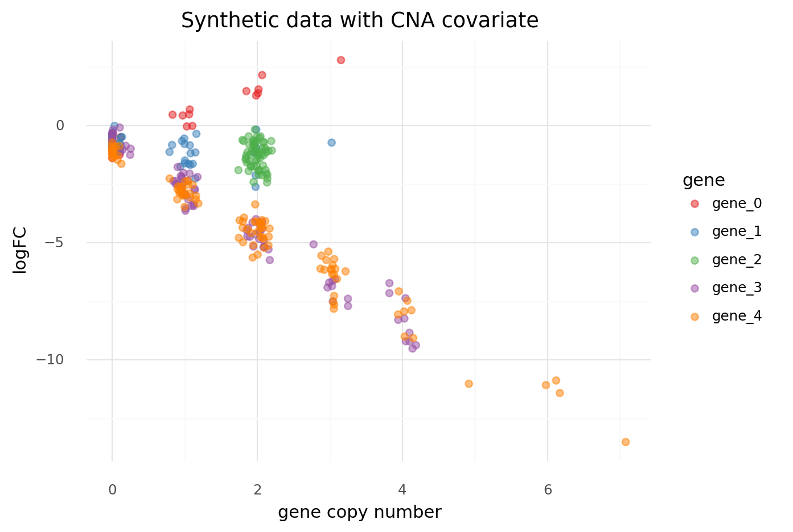

    <ggplot: (8777277769177)>

```python
(
    gg.ggplot(data, gg.aes(x="cna_z", y="logfc"))
    + gg.geom_jitter(gg.aes(color="gene"), alpha=0.5, size=2)
    + gg.scale_color_brewer(type="qual", palette="Set1")
    + gg.labs(
        x="gene copy number",
        y="logFC",
        color="gene",
        title="Synthetic data with CNA covariate",
    )
)
```

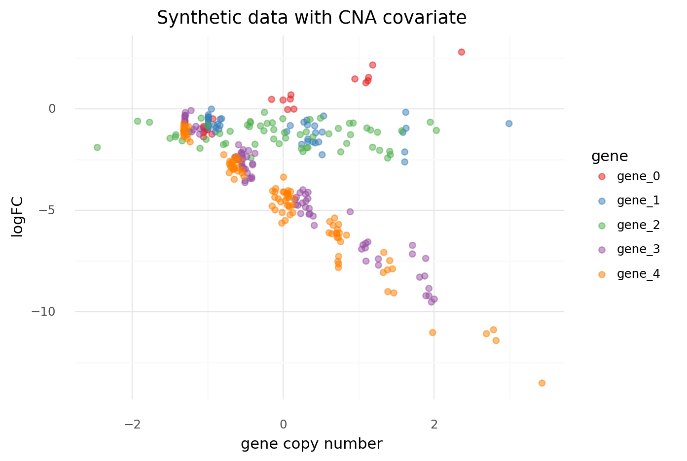

    <ggplot: (8777228861275)>

```python
(
    gg.ggplot(data, gg.aes(x="logfc"))
    + gg.geom_density(gg.aes(color="gene", fill="gene"), alpha=0.2)
    + gg.scale_color_brewer(type="qual", palette="Set1")
    + gg.scale_fill_brewer(type="qual", palette="Set1")
    + gg.labs(x="logFC", y="density", color="gene", title="Distribution of logFC")
)
```

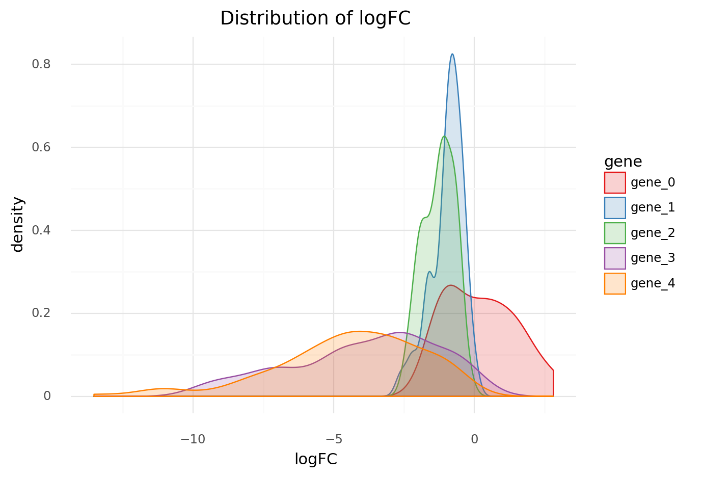

    <ggplot: (8777229148919)>

```python
sgrna_idx = data["sgRNA"].cat.codes.to_list()
sgrna_to_gene_idx = gene_to_sgrna_map["gene"].cat.codes.to_list()


with pm.Model() as model6:
    # Hyper-priors
    mu_gamma = pm.Normal("mu_gamma", -1, 5)
    sigma_gamma = pm.Exponential("sigma_gamma", 1)
    mu_delta = pm.Normal("mu_delta", -1, 5)
    sigma_delta = pm.Exponential("sigma_delta", 1)

    # Hyper parameters
    gamma_g = pm.Normal("gamma_g", mu_gamma, sigma_gamma, shape=num_genes)
    mu_alpha = gamma_g
    sigma_alpha = pm.Exponential("sigma_alpha", 1)

    delta_g = pm.Normal("delta_g", mu_delta, sigma_delta, shape=num_genes)
    mu_beta = delta_g
    sigma_beta = pm.Exponential("sigma_beta", 1)

    # Main level parameters
    alpha_s = pm.Normal(
        "alpha_s", mu_alpha[sgrna_to_gene_idx], sigma_alpha, shape=num_sgrnas
    )
    beta_s = pm.Normal(
        "beta_s", mu_beta[sgrna_to_gene_idx], sigma_beta, shape=num_sgrnas
    )

    # Linear model
    mu_s = pm.Deterministic(
        "mu_s", alpha_s[sgrna_idx] + beta_s[sgrna_idx] * data.cna_z.values
    )
    sigma = pm.Exponential("sigma", 1)

    # Likelihood
    logfc = pm.Normal("logfc", mu_s, sigma, observed=data.logfc.values)

    # Sampling
    model6_prior_check = pm.sample_prior_predictive(random_seed=RANDOM_SEED)
    model6_trace = pm.sample(
        2000, tune=2000, random_seed=RANDOM_SEED, target_accept=0.95
    )
    model6_post_check = pm.sample_posterior_predictive(
        model6_trace, random_seed=RANDOM_SEED
    )
```

    Auto-assigning NUTS sampler...
    Initializing NUTS using jitter+adapt_diag...
    Multiprocess sampling (4 chains in 4 jobs)
    NUTS: [sigma, beta_s, alpha_s, sigma_beta, delta_g, sigma_alpha, gamma_g, sigma_delta, mu_delta, sigma_gamma, mu_gamma]

<div>
    <style>
        /*Turns off some styling*/
        progress {
            /*gets rid of default border in Firefox and Opera.*/
            border: none;
            /*Needs to be in here for Safari polyfill so background images work as expected.*/
            background-size: auto;
        }
        .progress-bar-interrupted, .progress-bar-interrupted::-webkit-progress-bar {
            background: #F44336;
        }
    </style>
  <progress value='16000' class='' max='16000' style='width:300px; height:20px; vertical-align: middle;'></progress>
  100.00% [16000/16000 00:22<00:00 Sampling 4 chains, 0 divergences]
</div>

    Sampling 4 chains for 2_000 tune and 2_000 draw iterations (8_000 + 8_000 draws total) took 23 seconds.

<div>
    <style>
        /*Turns off some styling*/
        progress {
            /*gets rid of default border in Firefox and Opera.*/
            border: none;
            /*Needs to be in here for Safari polyfill so background images work as expected.*/
            background-size: auto;
        }
        .progress-bar-interrupted, .progress-bar-interrupted::-webkit-progress-bar {
            background: #F44336;
        }
    </style>
  <progress value='8000' class='' max='8000' style='width:300px; height:20px; vertical-align: middle;'></progress>
  100.00% [8000/8000 00:10<00:00]
</div>

```python
pm.model_to_graphviz(model6)
```

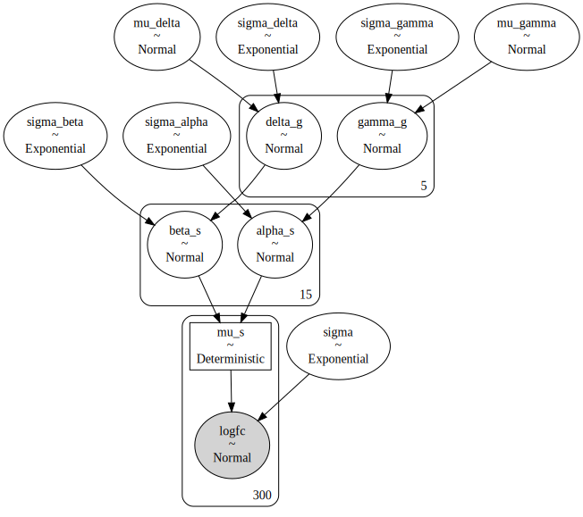

```python
az_model6 = az.from_pymc3(
    trace=model6_trace,
    prior=model6_prior_check,
    posterior_predictive=model6_post_check,
    model=model6,
)
```

```python
(
    gg.ggplot(
        pd.DataFrame({"logfc": model6_prior_check["logfc"][:, 1:5].flatten()}),
        gg.aes(x="logfc"),
    )
    + gg.geom_density()
)
```

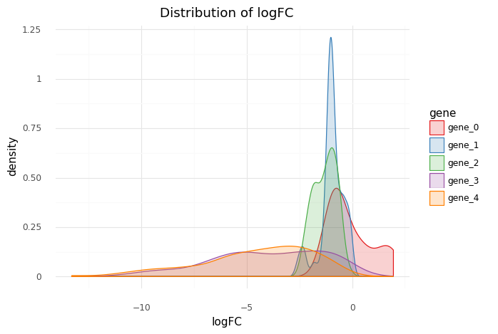

    <ggplot: (8777222099161)>

```python
az.summary(az_model6, var_names=["gamma_g"]).assign(real_value=real_params["gamma_g"])
```

<div>
<style scoped>
    .dataframe tbody tr th:only-of-type {
        vertical-align: middle;
    }

    .dataframe tbody tr th {
        vertical-align: top;
    }

    .dataframe thead th {
        text-align: right;
    }
</style>
<table border="1" class="dataframe">
  <thead>
    <tr style="text-align: right;">
      <th></th>
      <th>mean</th>
      <th>sd</th>
      <th>hdi_3%</th>
      <th>hdi_97%</th>
      <th>mcse_mean</th>
      <th>mcse_sd</th>
      <th>ess_mean</th>
      <th>ess_sd</th>
      <th>ess_bulk</th>
      <th>ess_tail</th>
      <th>r_hat</th>
      <th>real_value</th>
    </tr>
  </thead>
  <tbody>
    <tr>
      <th>gamma_g[0]</th>
      <td>0.040</td>
      <td>0.544</td>
      <td>-0.959</td>
      <td>1.083</td>
      <td>0.006</td>
      <td>0.007</td>
      <td>8290.0</td>
      <td>3128.0</td>
      <td>9156.0</td>
      <td>4576.0</td>
      <td>1.0</td>
      <td>-1.124639</td>
    </tr>
    <tr>
      <th>gamma_g[1]</th>
      <td>-1.059</td>
      <td>0.370</td>
      <td>-1.738</td>
      <td>-0.375</td>
      <td>0.004</td>
      <td>0.003</td>
      <td>9914.0</td>
      <td>7031.0</td>
      <td>10779.0</td>
      <td>4881.0</td>
      <td>1.0</td>
      <td>-0.630166</td>
    </tr>
    <tr>
      <th>gamma_g[2]</th>
      <td>-1.299</td>
      <td>0.301</td>
      <td>-1.862</td>
      <td>-0.721</td>
      <td>0.003</td>
      <td>0.002</td>
      <td>11967.0</td>
      <td>9490.0</td>
      <td>13051.0</td>
      <td>5717.0</td>
      <td>1.0</td>
      <td>-0.308103</td>
    </tr>
    <tr>
      <th>gamma_g[3]</th>
      <td>-3.858</td>
      <td>0.260</td>
      <td>-4.336</td>
      <td>-3.364</td>
      <td>0.002</td>
      <td>0.002</td>
      <td>11053.0</td>
      <td>11053.0</td>
      <td>11852.0</td>
      <td>5412.0</td>
      <td>1.0</td>
      <td>-0.692731</td>
    </tr>
    <tr>
      <th>gamma_g[4]</th>
      <td>-4.423</td>
      <td>0.236</td>
      <td>-4.842</td>
      <td>-3.968</td>
      <td>0.002</td>
      <td>0.002</td>
      <td>11998.0</td>
      <td>11998.0</td>
      <td>12888.0</td>
      <td>5675.0</td>
      <td>1.0</td>
      <td>-1.042568</td>
    </tr>
  </tbody>
</table>
</div>

```python
az.plot_trace(az_model6, var_names=["gamma_g"])
plt.show()
```

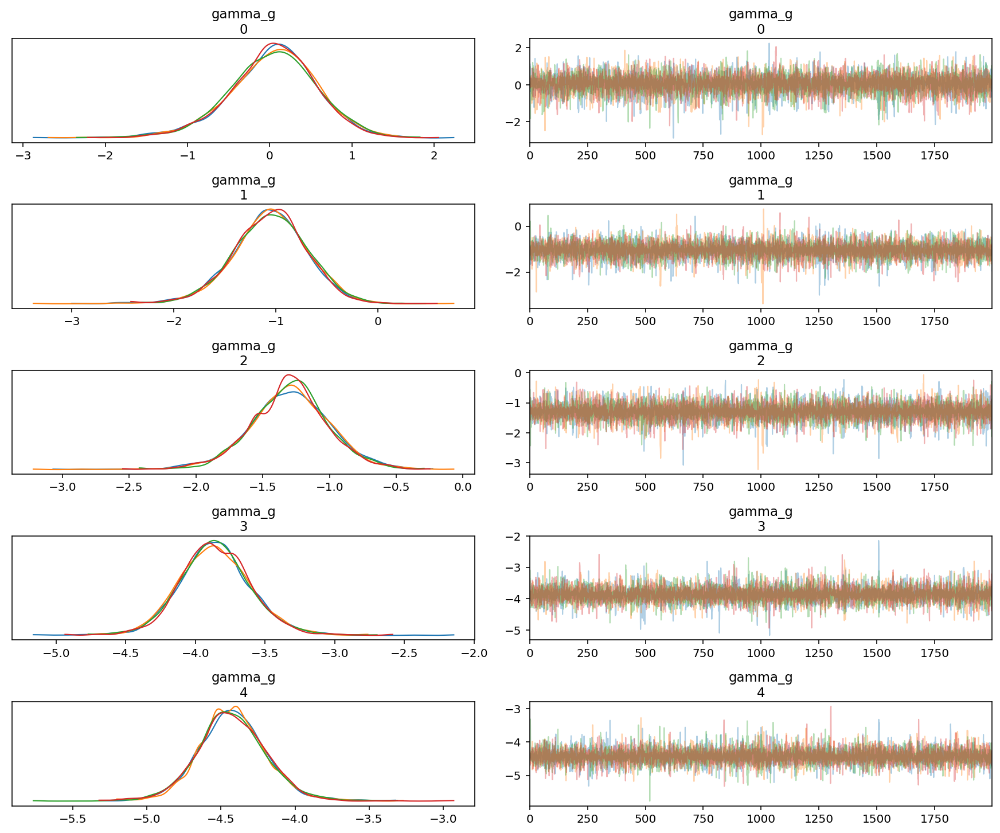

```python
var_names = ["mu_gamma", "sigma_gamma", "gamma_g", "alpha_s"]
az.plot_forest(
    az_model6,
    var_names=var_names,
    combined=True,
)
plt.show()
```

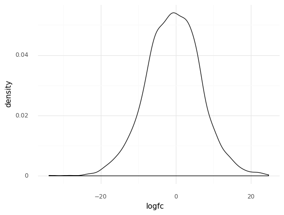

```python
var_names = ["mu_delta", "sigma_delta", "delta_g", "beta_s"]
az.plot_forest(az_model6, var_names=var_names, combined=True)
plt.show()
```

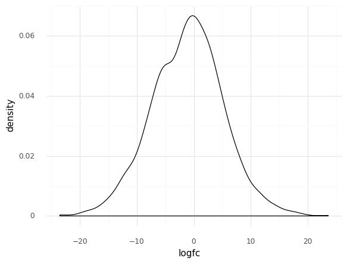

```python
az.summary(az_model6, var_names="gamma_g").assign(real_value=real_params["gamma_g"])
```

<div>
<style scoped>
    .dataframe tbody tr th:only-of-type {
        vertical-align: middle;
    }

    .dataframe tbody tr th {
        vertical-align: top;
    }

    .dataframe thead th {
        text-align: right;
    }
</style>
<table border="1" class="dataframe">
  <thead>
    <tr style="text-align: right;">
      <th></th>
      <th>mean</th>
      <th>sd</th>
      <th>hdi_3%</th>
      <th>hdi_97%</th>
      <th>mcse_mean</th>
      <th>mcse_sd</th>
      <th>ess_mean</th>
      <th>ess_sd</th>
      <th>ess_bulk</th>
      <th>ess_tail</th>
      <th>r_hat</th>
      <th>real_value</th>
    </tr>
  </thead>
  <tbody>
    <tr>
      <th>gamma_g[0]</th>
      <td>0.040</td>
      <td>0.544</td>
      <td>-0.959</td>
      <td>1.083</td>
      <td>0.006</td>
      <td>0.007</td>
      <td>8290.0</td>
      <td>3128.0</td>
      <td>9156.0</td>
      <td>4576.0</td>
      <td>1.0</td>
      <td>-1.124639</td>
    </tr>
    <tr>
      <th>gamma_g[1]</th>
      <td>-1.059</td>
      <td>0.370</td>
      <td>-1.738</td>
      <td>-0.375</td>
      <td>0.004</td>
      <td>0.003</td>
      <td>9914.0</td>
      <td>7031.0</td>
      <td>10779.0</td>
      <td>4881.0</td>
      <td>1.0</td>
      <td>-0.630166</td>
    </tr>
    <tr>
      <th>gamma_g[2]</th>
      <td>-1.299</td>
      <td>0.301</td>
      <td>-1.862</td>
      <td>-0.721</td>
      <td>0.003</td>
      <td>0.002</td>
      <td>11967.0</td>
      <td>9490.0</td>
      <td>13051.0</td>
      <td>5717.0</td>
      <td>1.0</td>
      <td>-0.308103</td>
    </tr>
    <tr>
      <th>gamma_g[3]</th>
      <td>-3.858</td>
      <td>0.260</td>
      <td>-4.336</td>
      <td>-3.364</td>
      <td>0.002</td>
      <td>0.002</td>
      <td>11053.0</td>
      <td>11053.0</td>
      <td>11852.0</td>
      <td>5412.0</td>
      <td>1.0</td>
      <td>-0.692731</td>
    </tr>
    <tr>
      <th>gamma_g[4]</th>
      <td>-4.423</td>
      <td>0.236</td>
      <td>-4.842</td>
      <td>-3.968</td>
      <td>0.002</td>
      <td>0.002</td>
      <td>11998.0</td>
      <td>11998.0</td>
      <td>12888.0</td>
      <td>5675.0</td>
      <td>1.0</td>
      <td>-1.042568</td>
    </tr>
  </tbody>
</table>
</div>

```python
az.summary(az_model6, var_names="delta_g").assign(real_value=real_params["delta_g"])
```

<div>
<style scoped>
    .dataframe tbody tr th:only-of-type {
        vertical-align: middle;
    }

    .dataframe tbody tr th {
        vertical-align: top;
    }

    .dataframe thead th {
        text-align: right;
    }
</style>
<table border="1" class="dataframe">
  <thead>
    <tr style="text-align: right;">
      <th></th>
      <th>mean</th>
      <th>sd</th>
      <th>hdi_3%</th>
      <th>hdi_97%</th>
      <th>mcse_mean</th>
      <th>mcse_sd</th>
      <th>ess_mean</th>
      <th>ess_sd</th>
      <th>ess_bulk</th>
      <th>ess_tail</th>
      <th>r_hat</th>
      <th>real_value</th>
    </tr>
  </thead>
  <tbody>
    <tr>
      <th>delta_g[0]</th>
      <td>1.113</td>
      <td>0.282</td>
      <td>0.551</td>
      <td>1.616</td>
      <td>0.003</td>
      <td>0.002</td>
      <td>9396.0</td>
      <td>9396.0</td>
      <td>10067.0</td>
      <td>5367.0</td>
      <td>1.0</td>
      <td>1.327219</td>
    </tr>
    <tr>
      <th>delta_g[1]</th>
      <td>-0.377</td>
      <td>0.195</td>
      <td>-0.755</td>
      <td>-0.023</td>
      <td>0.002</td>
      <td>0.002</td>
      <td>9817.0</td>
      <td>7636.0</td>
      <td>10457.0</td>
      <td>5444.0</td>
      <td>1.0</td>
      <td>-0.569207</td>
    </tr>
    <tr>
      <th>delta_g[2]</th>
      <td>-0.113</td>
      <td>0.158</td>
      <td>-0.402</td>
      <td>0.197</td>
      <td>0.002</td>
      <td>0.002</td>
      <td>10247.0</td>
      <td>5036.0</td>
      <td>10486.0</td>
      <td>5388.0</td>
      <td>1.0</td>
      <td>-0.567684</td>
    </tr>
    <tr>
      <th>delta_g[3]</th>
      <td>-2.461</td>
      <td>0.141</td>
      <td>-2.722</td>
      <td>-2.179</td>
      <td>0.001</td>
      <td>0.001</td>
      <td>10937.0</td>
      <td>10937.0</td>
      <td>11088.0</td>
      <td>5386.0</td>
      <td>1.0</td>
      <td>-1.980011</td>
    </tr>
    <tr>
      <th>delta_g[4]</th>
      <td>-2.575</td>
      <td>0.123</td>
      <td>-2.807</td>
      <td>-2.345</td>
      <td>0.001</td>
      <td>0.001</td>
      <td>10279.0</td>
      <td>10279.0</td>
      <td>10720.0</td>
      <td>5161.0</td>
      <td>1.0</td>
      <td>-1.631965</td>
    </tr>
  </tbody>
</table>
</div>

### Does adding a global intercept make a difference?

Adding in a global intercept made the model way to flexible to fit - I believe it is technically non-identifiable.
The fitting takes a long time and there is a lot of autocorrelation.
Interestingly, there are no divergences.

$
logFC_s \sim \mathcal{N}(\mu_s, \sigma) \\
\mu_s = \alpha + \alpha_s + \beta_s X \\
\quad \alpha \sim \mathcal{N}(0, 3) \\
\dots
$

```python
sgrna_idx = data["sgRNA"].cat.codes.to_list()
sgrna_to_gene_idx = gene_to_sgrna_map["gene"].cat.codes.to_list()


with pm.Model() as model6_2:
    # Hyper-priors
    mu_gamma = pm.Normal("mu_gamma", -1, 5)
    sigma_gamma = pm.Exponential("sigma_gamma", 1)
    mu_delta = pm.Normal("mu_delta", -1, 5)
    sigma_delta = pm.Exponential("sigma_delta", 1)

    # Hyper parameters
    gamma_g = pm.Normal("gamma_g", mu_gamma, sigma_gamma, shape=num_genes)
    mu_alpha = gamma_g
    sigma_alpha = pm.Exponential("sigma_alpha", 1)

    delta_g = pm.Normal("delta_g", mu_delta, sigma_delta, shape=num_genes)
    mu_beta = delta_g
    sigma_beta = pm.Exponential("sigma_beta", 1)

    # Main level parameters
    alpha = pm.Normal("alpha", 0, 3)
    alpha_s = pm.Normal(
        "alpha_s", mu_alpha[sgrna_to_gene_idx], sigma_alpha, shape=num_sgrnas
    )
    beta_s = pm.Normal(
        "beta_s", mu_beta[sgrna_to_gene_idx], sigma_beta, shape=num_sgrnas
    )

    # Linear model
    mu_s = pm.Deterministic(
        "mu_s", alpha + alpha_s[sgrna_idx] + beta_s[sgrna_idx] * data.cna_z.values
    )
    sigma = pm.Exponential("sigma", 1)

    # Likelihood
    logfc = pm.Normal("logfc", mu_s, sigma, observed=data.logfc.values)

    # Sampling
    model6_2_prior_check = pm.sample_prior_predictive(random_seed=RANDOM_SEED)
    model6_2_trace = pm.sample(
        1000, tune=1000, random_seed=RANDOM_SEED, target_accept=0.95
    )
    model6_2_post_check = pm.sample_posterior_predictive(
        model6_2_trace, random_seed=RANDOM_SEED
    )
```

    Auto-assigning NUTS sampler...
    Initializing NUTS using jitter+adapt_diag...
    Multiprocess sampling (4 chains in 4 jobs)
    NUTS: [sigma, beta_s, alpha_s, alpha, sigma_beta, delta_g, sigma_alpha, gamma_g, sigma_delta, mu_delta, sigma_gamma, mu_gamma]

<div>
    <style>
        /*Turns off some styling*/
        progress {
            /*gets rid of default border in Firefox and Opera.*/
            border: none;
            /*Needs to be in here for Safari polyfill so background images work as expected.*/
            background-size: auto;
        }
        .progress-bar-interrupted, .progress-bar-interrupted::-webkit-progress-bar {
            background: #F44336;
        }
    </style>
  <progress value='8000' class='' max='8000' style='width:300px; height:20px; vertical-align: middle;'></progress>
  100.00% [8000/8000 05:42<00:00 Sampling 4 chains, 0 divergences]
</div>

    Sampling 4 chains for 1_000 tune and 1_000 draw iterations (4_000 + 4_000 draws total) took 342 seconds.
    The chain reached the maximum tree depth. Increase max_treedepth, increase target_accept or reparameterize.
    The estimated number of effective samples is smaller than 200 for some parameters.

<div>
    <style>
        /*Turns off some styling*/
        progress {
            /*gets rid of default border in Firefox and Opera.*/
            border: none;
            /*Needs to be in here for Safari polyfill so background images work as expected.*/
            background-size: auto;
        }
        .progress-bar-interrupted, .progress-bar-interrupted::-webkit-progress-bar {
            background: #F44336;
        }
    </style>
  <progress value='4000' class='' max='4000' style='width:300px; height:20px; vertical-align: middle;'></progress>
  100.00% [4000/4000 00:05<00:00]
</div>

```python
pm.model_to_graphviz(model6_2)
```

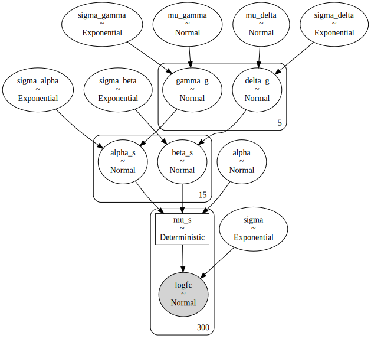

```python
az_model6_2 = az.from_pymc3(
    trace=model6_2_trace,
    prior=model6_2_prior_check,
    posterior_predictive=model6_2_post_check,
    model=model6_2,
)
```

```python
(
    gg.ggplot(
        pd.DataFrame({"logfc": model6_2_prior_check["logfc"][:, 1:5].flatten()}),
        gg.aes(x="logfc"),
    )
    + gg.geom_density()
)
```

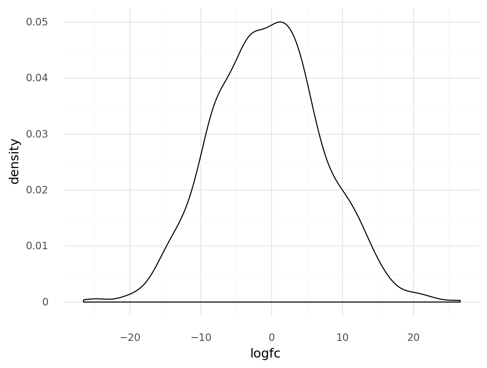

    <ggplot: (8777229097220)>

```python
az.summary(az_model6_2, var_names=["gamma_g"]).assign(real_value=real_params["gamma_g"])
```

<div>
<style scoped>
    .dataframe tbody tr th:only-of-type {
        vertical-align: middle;
    }

    .dataframe tbody tr th {
        vertical-align: top;
    }

    .dataframe thead th {
        text-align: right;
    }
</style>
<table border="1" class="dataframe">
  <thead>
    <tr style="text-align: right;">
      <th></th>
      <th>mean</th>
      <th>sd</th>
      <th>hdi_3%</th>
      <th>hdi_97%</th>
      <th>mcse_mean</th>
      <th>mcse_sd</th>
      <th>ess_mean</th>
      <th>ess_sd</th>
      <th>ess_bulk</th>
      <th>ess_tail</th>
      <th>r_hat</th>
      <th>real_value</th>
    </tr>
  </thead>
  <tbody>
    <tr>
      <th>gamma_g[0]</th>
      <td>0.336</td>
      <td>2.708</td>
      <td>-4.638</td>
      <td>5.309</td>
      <td>0.190</td>
      <td>0.134</td>
      <td>204.0</td>
      <td>204.0</td>
      <td>206.0</td>
      <td>545.0</td>
      <td>1.02</td>
      <td>-1.124639</td>
    </tr>
    <tr>
      <th>gamma_g[1]</th>
      <td>-0.758</td>
      <td>2.682</td>
      <td>-5.603</td>
      <td>4.165</td>
      <td>0.189</td>
      <td>0.134</td>
      <td>201.0</td>
      <td>201.0</td>
      <td>203.0</td>
      <td>566.0</td>
      <td>1.02</td>
      <td>-0.630166</td>
    </tr>
    <tr>
      <th>gamma_g[2]</th>
      <td>-0.997</td>
      <td>2.670</td>
      <td>-5.805</td>
      <td>3.901</td>
      <td>0.188</td>
      <td>0.133</td>
      <td>201.0</td>
      <td>201.0</td>
      <td>203.0</td>
      <td>508.0</td>
      <td>1.02</td>
      <td>-0.308103</td>
    </tr>
    <tr>
      <th>gamma_g[3]</th>
      <td>-3.559</td>
      <td>2.670</td>
      <td>-8.350</td>
      <td>1.382</td>
      <td>0.189</td>
      <td>0.136</td>
      <td>200.0</td>
      <td>193.0</td>
      <td>202.0</td>
      <td>527.0</td>
      <td>1.02</td>
      <td>-0.692731</td>
    </tr>
    <tr>
      <th>gamma_g[4]</th>
      <td>-4.125</td>
      <td>2.663</td>
      <td>-8.740</td>
      <td>0.884</td>
      <td>0.189</td>
      <td>0.137</td>
      <td>198.0</td>
      <td>190.0</td>
      <td>200.0</td>
      <td>502.0</td>
      <td>1.02</td>
      <td>-1.042568</td>
    </tr>
  </tbody>
</table>
</div>

```python
az.plot_trace(az_model6_2, var_names=["gamma_g"])
plt.show()
```

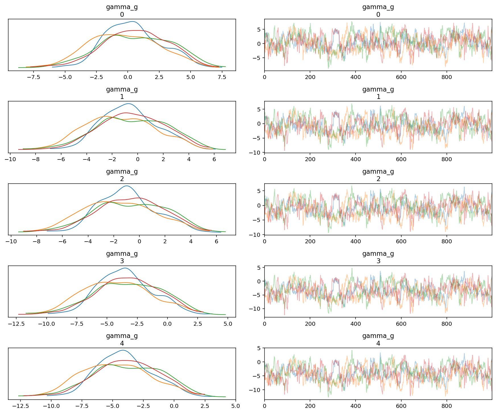

```python
var_names = ["mu_gamma", "sigma_gamma", "gamma_g", "alpha_s"]
az.plot_forest(
    az_model6_2,
    var_names=var_names,
    combined=True,
)
plt.show()
```

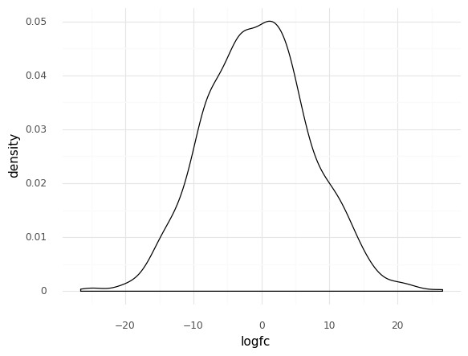

```python
var_names = ["mu_delta", "sigma_delta", "delta_g", "beta_s"]
az.plot_forest(az_model6_2, var_names=var_names, combined=True)
plt.show()
```

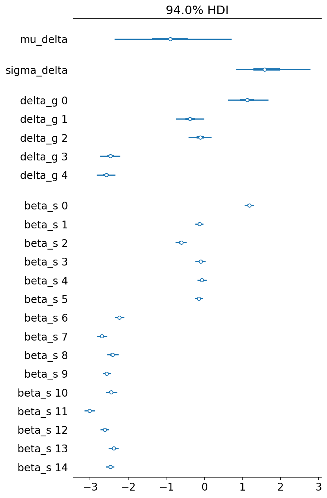

```python
az.summary(az_model6_2, var_names="gamma_g").assign(real_value=real_params["gamma_g"])
```

<div>
<style scoped>
    .dataframe tbody tr th:only-of-type {
        vertical-align: middle;
    }

    .dataframe tbody tr th {
        vertical-align: top;
    }

    .dataframe thead th {
        text-align: right;
    }
</style>
<table border="1" class="dataframe">
  <thead>
    <tr style="text-align: right;">
      <th></th>
      <th>mean</th>
      <th>sd</th>
      <th>hdi_3%</th>
      <th>hdi_97%</th>
      <th>mcse_mean</th>
      <th>mcse_sd</th>
      <th>ess_mean</th>
      <th>ess_sd</th>
      <th>ess_bulk</th>
      <th>ess_tail</th>
      <th>r_hat</th>
      <th>real_value</th>
    </tr>
  </thead>
  <tbody>
    <tr>
      <th>gamma_g[0]</th>
      <td>0.336</td>
      <td>2.708</td>
      <td>-4.638</td>
      <td>5.309</td>
      <td>0.190</td>
      <td>0.134</td>
      <td>204.0</td>
      <td>204.0</td>
      <td>206.0</td>
      <td>545.0</td>
      <td>1.02</td>
      <td>-1.124639</td>
    </tr>
    <tr>
      <th>gamma_g[1]</th>
      <td>-0.758</td>
      <td>2.682</td>
      <td>-5.603</td>
      <td>4.165</td>
      <td>0.189</td>
      <td>0.134</td>
      <td>201.0</td>
      <td>201.0</td>
      <td>203.0</td>
      <td>566.0</td>
      <td>1.02</td>
      <td>-0.630166</td>
    </tr>
    <tr>
      <th>gamma_g[2]</th>
      <td>-0.997</td>
      <td>2.670</td>
      <td>-5.805</td>
      <td>3.901</td>
      <td>0.188</td>
      <td>0.133</td>
      <td>201.0</td>
      <td>201.0</td>
      <td>203.0</td>
      <td>508.0</td>
      <td>1.02</td>
      <td>-0.308103</td>
    </tr>
    <tr>
      <th>gamma_g[3]</th>
      <td>-3.559</td>
      <td>2.670</td>
      <td>-8.350</td>
      <td>1.382</td>
      <td>0.189</td>
      <td>0.136</td>
      <td>200.0</td>
      <td>193.0</td>
      <td>202.0</td>
      <td>527.0</td>
      <td>1.02</td>
      <td>-0.692731</td>
    </tr>
    <tr>
      <th>gamma_g[4]</th>
      <td>-4.125</td>
      <td>2.663</td>
      <td>-8.740</td>
      <td>0.884</td>
      <td>0.189</td>
      <td>0.137</td>
      <td>198.0</td>
      <td>190.0</td>
      <td>200.0</td>
      <td>502.0</td>
      <td>1.02</td>
      <td>-1.042568</td>
    </tr>
  </tbody>
</table>
</div>

```python
az.summary(az_model6_2, var_names="delta_g").assign(real_value=real_params["delta_g"])
```

<div>
<style scoped>
    .dataframe tbody tr th:only-of-type {
        vertical-align: middle;
    }

    .dataframe tbody tr th {
        vertical-align: top;
    }

    .dataframe thead th {
        text-align: right;
    }
</style>
<table border="1" class="dataframe">
  <thead>
    <tr style="text-align: right;">
      <th></th>
      <th>mean</th>
      <th>sd</th>
      <th>hdi_3%</th>
      <th>hdi_97%</th>
      <th>mcse_mean</th>
      <th>mcse_sd</th>
      <th>ess_mean</th>
      <th>ess_sd</th>
      <th>ess_bulk</th>
      <th>ess_tail</th>
      <th>r_hat</th>
      <th>real_value</th>
    </tr>
  </thead>
  <tbody>
    <tr>
      <th>delta_g[0]</th>
      <td>1.116</td>
      <td>0.281</td>
      <td>0.614</td>
      <td>1.679</td>
      <td>0.005</td>
      <td>0.003</td>
      <td>3477.0</td>
      <td>3477.0</td>
      <td>3642.0</td>
      <td>2197.0</td>
      <td>1.0</td>
      <td>1.327219</td>
    </tr>
    <tr>
      <th>delta_g[1]</th>
      <td>-0.377</td>
      <td>0.196</td>
      <td>-0.751</td>
      <td>-0.010</td>
      <td>0.003</td>
      <td>0.003</td>
      <td>3199.0</td>
      <td>2108.0</td>
      <td>3612.0</td>
      <td>2437.0</td>
      <td>1.0</td>
      <td>-0.569207</td>
    </tr>
    <tr>
      <th>delta_g[2]</th>
      <td>-0.107</td>
      <td>0.160</td>
      <td>-0.419</td>
      <td>0.186</td>
      <td>0.003</td>
      <td>0.003</td>
      <td>3922.0</td>
      <td>1645.0</td>
      <td>4073.0</td>
      <td>2460.0</td>
      <td>1.0</td>
      <td>-0.567684</td>
    </tr>
    <tr>
      <th>delta_g[3]</th>
      <td>-2.462</td>
      <td>0.141</td>
      <td>-2.737</td>
      <td>-2.211</td>
      <td>0.002</td>
      <td>0.002</td>
      <td>3972.0</td>
      <td>3972.0</td>
      <td>4141.0</td>
      <td>2586.0</td>
      <td>1.0</td>
      <td>-1.980011</td>
    </tr>
    <tr>
      <th>delta_g[4]</th>
      <td>-2.571</td>
      <td>0.128</td>
      <td>-2.826</td>
      <td>-2.344</td>
      <td>0.002</td>
      <td>0.001</td>
      <td>3986.0</td>
      <td>3986.0</td>
      <td>4062.0</td>
      <td>2485.0</td>
      <td>1.0</td>
      <td>-1.631965</td>
    </tr>
  </tbody>
</table>
</div>

### Add a covariance matrix between the varying intercept and slope

I was hoping to incorporate a covariance matrix in the model to account for correlations between varying effects, however, I was unable to figure out how to do it for a multilevel model that is constructed here.

$
logFC_s \sim \mathcal{N}(\mu_s, \sigma) \\
\mu_s = \alpha_s + \beta_s X \\
\quad \alpha_s \sim \mathcal{N}(\mu_\alpha, \sigma_\alpha) \\
\qquad \mu_\alpha = \gamma_g \\
\qquad\quad \gamma_g \sim \mathcal{N}(\mu_\gamma, \sigma_\gamma) \\
\qquad\qquad \mu_\gamma \sim \mathcal{N}(0, 5) \quad \sigma_\gamma \sim \text{Exp}(1) \\
\qquad \sigma_\alpha \sim \text{Exp}(1) \\
\quad \beta_s \sim \mathcal{N}(\mu_\beta, \sigma_\beta) \\
\qquad \mu_\beta = \delta_g \\
\qquad\quad \delta_g \sim \mathcal{N}(\mu_\delta, \sigma_\delta) \\
\qquad\qquad \mu_\delta \sim \mathcal{N}(0, 5) \quad \sigma_\delta \sim \text{Exp}(1) \\
\qquad \sigma_\beta \sim \text{Exp}(1) \\
\quad \begin{bmatrix}
  \alpha_s \\
  \beta_s
\end{bmatrix} \sim \text{MvNormal}(
  \begin{bmatrix}
    \alpha \\
    \beta
  \end{bmatrix},
  \Sigma) \\
\qquad \Sigma =
  \begin{pmatrix}
    \sigma_\alpha & 0 \\
    0 & \sigma_\beta
  \end{pmatrix}
  P
  \begin{pmatrix}
    \sigma_\alpha & 0 \\
    0 & \sigma_\beta
  \end{pmatrix} \\
\sigma \sim \text{Exp}(1)
$

```python
if False:

    sgrna_idx = data["sgRNA"].cat.codes.to_list()
    sgrna_to_gene_idx = gene_to_sgrna_map["gene"].cat.codes.to_list()

    with pm.Model() as model6_corr:
        # Hyper-priors
        mu_gamma = pm.Normal("mu_gamma", -1, 5)
        sigma_gamma = pm.Exponential("sigma_gamma", 1)
        mu_delta = pm.Normal("mu_delta", -1, 5)
        sigma_delta = pm.Exponential("sigma_delta", 1)

        # Hyper parameters
        gamma_g = pm.Normal("gamma_g", mu_gamma, sigma_gamma, shape=num_genes)
        mu_alpha = gamma_g[sgrna_to_gene_idx]

        delta_g = pm.Normal("delta_g", mu_delta, sigma_delta, shape=num_genes)
        mu_beta = delta_g[sgrna_to_gene_idx]

        # Correlation covariance matrix
        sd_dist = pm.Exponential.dist(0.5)  # prior standard deviations
        chol, corr, stds = pm.LKJCholeskyCov(
            "chol", n=2, eta=2.0, sd_dist=sd_dist, compute_corr=True
        )

        # Main level parameters
        alpha_beta_s = pm.MvNormal(
            "alpha_beta_s",
            mu=tt.stack([mu_alpha, mu_beta]),
            chol=chol,
            shape=(num_sgrnas, 2),
        )

        # Linear model
        mu_s = pm.Deterministic(
            "mu_s",
            alpha_beta_s[sgrna_idx, 0] + alpha_beta_s[sgrna_idx, 1] * data.cna_z.values,
        )
        sigma = pm.Exponential("sigma", 1)

        # Likelihood
        logfc = pm.Normal("logfc", mu_s, sigma, observed=data.logfc.values)

        # Sampling
    #     model6_corr_prior_check = pm.sample_prior_predictive(random_seed=RANDOM_SEED)
    #     model6_corr_trace = pm.sample(
    #         2000, tune=2000, random_seed=RANDOM_SEED, target_accept=0.95
    #     )
    #     model6_corr_post_check = pm.sample_posterior_predictive(
    #         model6_corr_trace, random_seed=RANDOM_SEED
    #
```

---

```python
notebook_toc = time()
print(f"execution time: {(notebook_toc - notebook_tic) / 60:.2f} minutes")
```

    execution time: 7.15 minutes

```python
%load_ext watermark
%watermark -d -u -v -iv -b -h -m
```

    pandas   1.1.3
    arviz    0.10.0
    numpy    1.19.2
    plotnine 0.7.1
    pymc3    3.9.3
    seaborn  0.11.0
    last updated: 2020-12-17 
    
    CPython 3.8.5
    IPython 7.18.1
    
    compiler   : GCC 7.3.0
    system     : Linux
    release    : 3.10.0-1062.el7.x86_64
    machine    : x86_64
    processor  : x86_64
    CPU cores  : 32
    interpreter: 64bit
    host name  : compute-a-16-78.o2.rc.hms.harvard.edu
    Git branch : subset-data
