```python
import pandas as pd
import numpy as np
import plotnine as gg
import pymc3 as pm
from theano import tensor as tt
import arviz as az
import seaborn as sns
import matplotlib.pyplot as plt
import string
from itertools import product
from numpy.random import normal, exponential, seed
import warnings

# Remove annoying filters from some dated ArViz functions.
warnings.simplefilter(action="ignore", category=UserWarning)

# Default theme for Plotnine.
gg.theme_set(gg.theme_minimal())

# A value to use in all random seed setting instances.
RANDOM_SEED = 103
```

---

## Model 7. Generation using varying sgRNA|gene and cell line effects

Model the effects of knocking out gene $g$ with sgRNA $s$ in cell line $c$.
The data will be generated with the following model, but then different models structures will be tested.

$
logFC_{s,c} \sim \mathcal{N}(\mu_{s,c}, \sigma) \\
\mu_{s,c} = \alpha_s + \beta_c \\
\quad \alpha_s \sim \mathcal{N}(\mu_{\alpha_s}, \sigma_\alpha) \\
\qquad \mu_{\alpha_s} = \gamma_g \\
\qquad\quad \gamma_g \sim \mathcal{N}(\mu_\gamma, \sigma_\gamma) \\
\qquad\qquad \mu_\gamma \sim \mathcal{N}(0, 5) \quad \sigma_\gamma \sim \text{Exp}(1) \\
\qquad \sigma_\alpha \sim \text{Exp}(1) \\
\quad \beta_c \sim \mathcal{N}(\mu_\beta, \sigma_\beta) \\
\qquad \mu_\beta \sim \mathcal{N}(0, 5) \quad \sigma_\beta \sim \text{Exp}(1) \\
\sigma \sim \text{Exp}(1)
$

Simulated values:

- number of cell lines: 20
- number of genes: 10
- number of repeated measures: $[1 , 2 , \dots , 10]$
- $\mu_\gamma = -1.0$, $\sigma_\gamma = 0.5$
- $\sigma_\alpha = 0.2$
- $\mu_\beta = 0$, $\sigma_\beta = 1$
- $\sigma = 0.3$


```python
def prefixed_count(prefix, n, plus=0):
    """Make an array of 1-n with the number and some prefix."""
    return [prefix + str(i + plus) for i in range(n)]
```


```python
def make_cat(df, col, ordered=True):
    """Make a column of a data frame into a categorical data type."""
    vals = df[col].drop_duplicates().to_list()
    df[col] = pd.Categorical(df[col], categories=vals, ordered=ordered)
    return df
```


```python
seed(RANDOM_SEED)

num_cell_lines = 20
num_genes = 10
num_sgrna_per_gene = list(range(1, num_genes + 1))
num_sgrnas = sum(num_sgrna_per_gene)

cell_lines = prefixed_count("cell_", num_cell_lines)
genes = prefixed_count("gene_", num_genes)
sgrnas = prefixed_count("sgRNA_", num_sgrnas)

# RP ("real parameters")
RP = {
    "mu_gamma": -1.0,
    "sigma_gamma": 0.5,
    "sigma_alpha": 0.2,
    "mu_beta": 0.0,
    "sigma_beta": 1.0,
    "sigma": 0.3,
}

RP["gamma_g"] = normal(loc=RP["mu_gamma"], scale=RP["sigma_gamma"], size=num_genes)
RP["beta_c"] = normal(loc=RP["mu_beta"], scale=RP["sigma_beta"], size=num_cell_lines)

sgrna_df = pd.DataFrame({"gene": np.repeat(genes, num_sgrna_per_gene), "sgRNA": sgrnas})
for col in sgrna_df.columns:
    sgrna_df = make_cat(sgrna_df, col)

alpha_s = []
for gene_i in sgrna_df["gene"].cat.codes:
    alpha_s.append(normal(loc=RP["gamma_g"][gene_i], scale=RP["sigma_alpha"]))


RP["alpha_s"] = alpha_s

data = pd.DataFrame(product(cell_lines, sgrnas), columns=["cell_line", "sgRNA"])
data = data.merge(sgrna_df, on="sgRNA")


for col in data.columns:
    data = make_cat(data, col)


for i in range(len(data)):
    cell_i = data["cell_line"].cat.codes[i]
    sgrna_i = data["sgRNA"].cat.codes[i]
    mu_sc = RP["alpha_s"][sgrna_i] + RP["beta_c"][cell_i]
    data.loc[i, "mu_sc"] = mu_sc
    data.loc[i, "log_fc"] = normal(loc=mu_sc, scale=RP["sigma"])

data
```


<div>
<style scoped>
    .dataframe tbody tr th:only-of-type {
        vertical-align: middle;
    }

    .dataframe tbody tr th {
        vertical-align: top;
    }

    .dataframe thead th {
        text-align: right;
    }
</style>
<table border="1" class="dataframe">
  <thead>
    <tr style="text-align: right;">
      <th></th>
      <th>cell_line</th>
      <th>sgRNA</th>
      <th>gene</th>
      <th>mu_sc</th>
      <th>log_fc</th>
    </tr>
  </thead>
  <tbody>
    <tr>
      <th>0</th>
      <td>cell_0</td>
      <td>sgRNA_0</td>
      <td>gene_0</td>
      <td>-1.284686</td>
      <td>-0.974021</td>
    </tr>
    <tr>
      <th>1</th>
      <td>cell_1</td>
      <td>sgRNA_0</td>
      <td>gene_0</td>
      <td>-1.986886</td>
      <td>-2.358464</td>
    </tr>
    <tr>
      <th>2</th>
      <td>cell_2</td>
      <td>sgRNA_0</td>
      <td>gene_0</td>
      <td>-0.883180</td>
      <td>-0.911884</td>
    </tr>
    <tr>
      <th>3</th>
      <td>cell_3</td>
      <td>sgRNA_0</td>
      <td>gene_0</td>
      <td>-0.267206</td>
      <td>-0.774813</td>
    </tr>
    <tr>
      <th>4</th>
      <td>cell_4</td>
      <td>sgRNA_0</td>
      <td>gene_0</td>
      <td>-3.064072</td>
      <td>-2.866197</td>
    </tr>
    <tr>
      <th>...</th>
      <td>...</td>
      <td>...</td>
      <td>...</td>
      <td>...</td>
      <td>...</td>
    </tr>
    <tr>
      <th>1095</th>
      <td>cell_15</td>
      <td>sgRNA_54</td>
      <td>gene_9</td>
      <td>-2.116856</td>
      <td>-2.188318</td>
    </tr>
    <tr>
      <th>1096</th>
      <td>cell_16</td>
      <td>sgRNA_54</td>
      <td>gene_9</td>
      <td>-2.245777</td>
      <td>-1.630069</td>
    </tr>
    <tr>
      <th>1097</th>
      <td>cell_17</td>
      <td>sgRNA_54</td>
      <td>gene_9</td>
      <td>-1.079010</td>
      <td>-0.752161</td>
    </tr>
    <tr>
      <th>1098</th>
      <td>cell_18</td>
      <td>sgRNA_54</td>
      <td>gene_9</td>
      <td>-1.900383</td>
      <td>-1.697479</td>
    </tr>
    <tr>
      <th>1099</th>
      <td>cell_19</td>
      <td>sgRNA_54</td>
      <td>gene_9</td>
      <td>-1.452215</td>
      <td>-1.609552</td>
    </tr>
  </tbody>
</table>
<p>1100 rows × 5 columns</p>
</div>


```python
real_gene_vals = pd.DataFrame({"gene": genes, "log_fc": RP["gamma_g"]})

(
    gg.ggplot(data, gg.aes(x="gene", y="log_fc"))
    + gg.geom_jitter(gg.aes(color="cell_line"), height=0, width=0.3, alpha=0.7)
    + gg.geom_crossbar(gg.aes(ymin="log_fc", ymax="log_fc"), data=real_gene_vals)
    + gg.scale_color_discrete(guide=gg.guide_legend(title="cell line", ncol=2))
    + gg.theme(axis_text_x=gg.element_text(angle=30, hjust=1, vjust=0.2))
    + gg.labs(
        x="gene",
        y="logFC",
        title="Synthetic data by gene annotated with real gene effect",
    )
)
```


    

    


    <ggplot: (8735955646561)>


```python
real_cellline_vals = pd.DataFrame({"cell_line": cell_lines, "log_fc": RP["beta_c"]})

(
    gg.ggplot(data, gg.aes(x="cell_line", y="log_fc"))
    + gg.geom_jitter(gg.aes(color="gene"), height=0, width=0.3, alpha=0.7, size=1)
    + gg.geom_crossbar(gg.aes(ymin="log_fc", ymax="log_fc"), data=real_cellline_vals)
    + gg.scale_color_discrete(guide=gg.guide_legend(title="gene", ncol=1))
    + gg.theme(axis_text_x=gg.element_text(angle=90, hjust=1, vjust=0.5))
    + gg.labs(
        x="cell line",
        y="logFC",
        title="Synthetic data by cell line annotated with real cell line effect",
    )
)
```


    

    


    <ggplot: (8735954978220)>


```python
real_cellline_vals = pd.DataFrame({"cell_line": cell_lines, "log_fc": RP["beta_c"]})

(
    gg.ggplot(data, gg.aes(x="sgRNA", y="log_fc"))
    + gg.geom_jitter(gg.aes(color="cell_line"), height=0, width=0, alpha=0.75)
    + gg.scale_color_discrete(guide=gg.guide_legend(title="cell line", ncol=2))
    + gg.theme(
        axis_text_x=gg.element_text(angle=90, hjust=0.5, vjust=1), figure_size=(12, 5)
    )
    + gg.labs(x="sgRNA", y="logFC", title="Synthetic data by sgRNA",)
)
```


    

    


    <ggplot: (8735953394243)>


## Model 7a. A 2-Dimensional varying intercept.

A model with just a varying intercept in the main level.
The varying intercept is 2-dimensional: one dimension for gene and one for the cell line.
This varying intercept has a 1D prior.

$
logFC_{i,g,c} \sim \mathcal{N}(\mu_{g,c}, \sigma) \\
\mu_{g,c} = \alpha_{g,c} \\
\quad \alpha_{g,c} \sim \mathcal{N}(\mu_{\alpha_{g,c}}, \sigma_\alpha) \\
\qquad \mu_{\alpha_{g,c}} \sim \mathcal{N}(0,5) \quad \sigma_\alpha \sim \text{Exp}(1) \\
\sigma \sim \text{Exp}(1)
$


```python
gene_idx = data.gene.cat.codes.to_list()
cell_line_idx = data.cell_line.cat.codes.to_list()

with pm.Model() as m7a:
    # Hyper-priors
    mu_alpha_gc = pm.Normal("mu_alpha_gc", 0, 5)
    sigma_alpha = pm.Exponential("sigma_alpha", 1)

    # Linear model parameters
    alpha_gc = pm.Normal(
        "alpha_gc", mu_alpha_gc, sigma_alpha, shape=(num_genes, num_cell_lines)
    )

    # Linear model
    mu_gc = pm.Deterministic("mu_gc", alpha_gc[gene_idx, cell_line_idx])
    sigma = pm.Exponential("sigma", 1)

    # Likelihood
    log_fc = pm.Normal("log_fc", mu_gc, sigma, observed=data.log_fc.to_list())

    # Sampling
    m7a_prior_check = pm.sample_prior_predictive(random_seed=RANDOM_SEED)
    m7a_trace = pm.sample(2000, tune=2000, random_seed=RANDOM_SEED, target_accept=0.95)
    m7a_post_check = pm.sample_posterior_predictive(m7a_trace, random_seed=RANDOM_SEED)
```

    /home/jc604/.conda/envs/speclet/lib/python3.8/site-packages/theano/tensor/subtensor.py:2197: FutureWarning: Using a non-tuple sequence for multidimensional indexing is deprecated; use `arr[tuple(seq)]` instead of `arr[seq]`. In the future this will be interpreted as an array index, `arr[np.array(seq)]`, which will result either in an error or a different result.
    /home/jc604/.conda/envs/speclet/lib/python3.8/site-packages/theano/tensor/subtensor.py:2197: FutureWarning: Using a non-tuple sequence for multidimensional indexing is deprecated; use `arr[tuple(seq)]` instead of `arr[seq]`. In the future this will be interpreted as an array index, `arr[np.array(seq)]`, which will result either in an error or a different result.
    Auto-assigning NUTS sampler...
    Initializing NUTS using jitter+adapt_diag...
    /home/jc604/.conda/envs/speclet/lib/python3.8/site-packages/theano/tensor/subtensor.py:2197: FutureWarning: Using a non-tuple sequence for multidimensional indexing is deprecated; use `arr[tuple(seq)]` instead of `arr[seq]`. In the future this will be interpreted as an array index, `arr[np.array(seq)]`, which will result either in an error or a different result.
    Multiprocess sampling (4 chains in 4 jobs)
    NUTS: [sigma, alpha_gc, sigma_alpha, mu_alpha_gc]


<div>
    <style>
        /* Turns off some styling */
        progress {
            /* gets rid of default border in Firefox and Opera. */
            border: none;
            /* Needs to be in here for Safari polyfill so background images work as expected. */
            background-size: auto;
        }
        .progress-bar-interrupted, .progress-bar-interrupted::-webkit-progress-bar {
            background: #F44336;
        }
    </style>
  <progress value='16000' class='' max='16000' style='width:300px; height:20px; vertical-align: middle;'></progress>
  100.00% [16000/16000 00:24<00:00 Sampling 4 chains, 0 divergences]
</div>


    Sampling 4 chains for 2_000 tune and 2_000 draw iterations (8_000 + 8_000 draws total) took 25 seconds.
    /home/jc604/.conda/envs/speclet/lib/python3.8/site-packages/theano/tensor/subtensor.py:2197: FutureWarning: Using a non-tuple sequence for multidimensional indexing is deprecated; use `arr[tuple(seq)]` instead of `arr[seq]`. In the future this will be interpreted as an array index, `arr[np.array(seq)]`, which will result either in an error or a different result.


<div>
    <style>
        /* Turns off some styling */
        progress {
            /* gets rid of default border in Firefox and Opera. */
            border: none;
            /* Needs to be in here for Safari polyfill so background images work as expected. */
            background-size: auto;
        }
        .progress-bar-interrupted, .progress-bar-interrupted::-webkit-progress-bar {
            background: #F44336;
        }
    </style>
  <progress value='8000' class='' max='8000' style='width:300px; height:20px; vertical-align: middle;'></progress>
  100.00% [8000/8000 00:08<00:00]
</div>


    /home/jc604/.conda/envs/speclet/lib/python3.8/site-packages/theano/tensor/subtensor.py:2197: FutureWarning: Using a non-tuple sequence for multidimensional indexing is deprecated; use `arr[tuple(seq)]` instead of `arr[seq]`. In the future this will be interpreted as an array index, `arr[np.array(seq)]`, which will result either in an error or a different result.
    /home/jc604/.conda/envs/speclet/lib/python3.8/site-packages/theano/tensor/subtensor.py:2197: FutureWarning: Using a non-tuple sequence for multidimensional indexing is deprecated; use `arr[tuple(seq)]` instead of `arr[seq]`. In the future this will be interpreted as an array index, `arr[np.array(seq)]`, which will result either in an error or a different result.


```python
pm.model_to_graphviz(m7a)
```


    

    


```python
az_m7a = az.from_pymc3(
    trace=m7a_trace,
    model=m7a,
    posterior_predictive=m7a_post_check,
    prior=m7a_prior_check,
)
```

    /home/jc604/.conda/envs/speclet/lib/python3.8/site-packages/theano/tensor/subtensor.py:2197: FutureWarning: Using a non-tuple sequence for multidimensional indexing is deprecated; use `arr[tuple(seq)]` instead of `arr[seq]`. In the future this will be interpreted as an array index, `arr[np.array(seq)]`, which will result either in an error or a different result.


```python
m7a_post = (
    az.summary(az_m7a, var_names=["alpha_gc"])
    .reset_index()
    .rename(columns={"index": "intercept"})
    .assign(
        gene_idx=lambda d: d["intercept"].str.extract(r"\[(\d+),"),
        cell_line_idx=lambda d: d["intercept"].str.extract(r",(\d+)\]"),
    )
    .assign(
        gene_idx=lambda d: [int(x) for x in d.gene_idx],
        gene=lambda d: [genes[i] for i in d.gene_idx],
        cell_line_idx=lambda d: [int(x) for x in d.cell_line_idx],
        cell_line=lambda d: [cell_lines[i] for i in d.cell_line_idx],
    )
)
m7a_post.head(n=10)
```


<div>
<style scoped>
    .dataframe tbody tr th:only-of-type {
        vertical-align: middle;
    }

    .dataframe tbody tr th {
        vertical-align: top;
    }

    .dataframe thead th {
        text-align: right;
    }
</style>
<table border="1" class="dataframe">
  <thead>
    <tr style="text-align: right;">
      <th></th>
      <th>intercept</th>
      <th>mean</th>
      <th>sd</th>
      <th>hdi_3%</th>
      <th>hdi_97%</th>
      <th>mcse_mean</th>
      <th>mcse_sd</th>
      <th>ess_mean</th>
      <th>ess_sd</th>
      <th>ess_bulk</th>
      <th>ess_tail</th>
      <th>r_hat</th>
      <th>gene_idx</th>
      <th>cell_line_idx</th>
      <th>gene</th>
      <th>cell_line</th>
    </tr>
  </thead>
  <tbody>
    <tr>
      <th>0</th>
      <td>alpha_gc[0,0]</td>
      <td>-0.972</td>
      <td>0.327</td>
      <td>-1.561</td>
      <td>-0.362</td>
      <td>0.003</td>
      <td>0.002</td>
      <td>14043.0</td>
      <td>11904.0</td>
      <td>14082.0</td>
      <td>6079.0</td>
      <td>1.0</td>
      <td>0</td>
      <td>0</td>
      <td>gene_0</td>
      <td>cell_0</td>
    </tr>
    <tr>
      <th>1</th>
      <td>alpha_gc[0,1]</td>
      <td>-2.230</td>
      <td>0.329</td>
      <td>-2.864</td>
      <td>-1.631</td>
      <td>0.003</td>
      <td>0.002</td>
      <td>14008.0</td>
      <td>13747.0</td>
      <td>14010.0</td>
      <td>5482.0</td>
      <td>1.0</td>
      <td>0</td>
      <td>1</td>
      <td>gene_0</td>
      <td>cell_1</td>
    </tr>
    <tr>
      <th>2</th>
      <td>alpha_gc[0,2]</td>
      <td>-0.912</td>
      <td>0.331</td>
      <td>-1.516</td>
      <td>-0.274</td>
      <td>0.003</td>
      <td>0.002</td>
      <td>12070.0</td>
      <td>10600.0</td>
      <td>12058.0</td>
      <td>5677.0</td>
      <td>1.0</td>
      <td>0</td>
      <td>2</td>
      <td>gene_0</td>
      <td>cell_2</td>
    </tr>
    <tr>
      <th>3</th>
      <td>alpha_gc[0,3]</td>
      <td>-0.789</td>
      <td>0.335</td>
      <td>-1.406</td>
      <td>-0.152</td>
      <td>0.003</td>
      <td>0.002</td>
      <td>13450.0</td>
      <td>10194.0</td>
      <td>13453.0</td>
      <td>5940.0</td>
      <td>1.0</td>
      <td>0</td>
      <td>3</td>
      <td>gene_0</td>
      <td>cell_3</td>
    </tr>
    <tr>
      <th>4</th>
      <td>alpha_gc[0,4]</td>
      <td>-2.692</td>
      <td>0.335</td>
      <td>-3.307</td>
      <td>-2.054</td>
      <td>0.003</td>
      <td>0.002</td>
      <td>14792.0</td>
      <td>14280.0</td>
      <td>14820.0</td>
      <td>5968.0</td>
      <td>1.0</td>
      <td>0</td>
      <td>4</td>
      <td>gene_0</td>
      <td>cell_4</td>
    </tr>
    <tr>
      <th>5</th>
      <td>alpha_gc[0,5]</td>
      <td>-2.934</td>
      <td>0.335</td>
      <td>-3.578</td>
      <td>-2.310</td>
      <td>0.003</td>
      <td>0.002</td>
      <td>12694.0</td>
      <td>12551.0</td>
      <td>12683.0</td>
      <td>6005.0</td>
      <td>1.0</td>
      <td>0</td>
      <td>5</td>
      <td>gene_0</td>
      <td>cell_5</td>
    </tr>
    <tr>
      <th>6</th>
      <td>alpha_gc[0,6]</td>
      <td>-0.800</td>
      <td>0.335</td>
      <td>-1.405</td>
      <td>-0.148</td>
      <td>0.003</td>
      <td>0.002</td>
      <td>16092.0</td>
      <td>11237.0</td>
      <td>16109.0</td>
      <td>6175.0</td>
      <td>1.0</td>
      <td>0</td>
      <td>6</td>
      <td>gene_0</td>
      <td>cell_6</td>
    </tr>
    <tr>
      <th>7</th>
      <td>alpha_gc[0,7]</td>
      <td>-1.661</td>
      <td>0.334</td>
      <td>-2.290</td>
      <td>-1.041</td>
      <td>0.003</td>
      <td>0.002</td>
      <td>13435.0</td>
      <td>12682.0</td>
      <td>13434.0</td>
      <td>5346.0</td>
      <td>1.0</td>
      <td>0</td>
      <td>7</td>
      <td>gene_0</td>
      <td>cell_7</td>
    </tr>
    <tr>
      <th>8</th>
      <td>alpha_gc[0,8]</td>
      <td>-1.630</td>
      <td>0.337</td>
      <td>-2.245</td>
      <td>-0.978</td>
      <td>0.003</td>
      <td>0.002</td>
      <td>12626.0</td>
      <td>11765.0</td>
      <td>12662.0</td>
      <td>5187.0</td>
      <td>1.0</td>
      <td>0</td>
      <td>8</td>
      <td>gene_0</td>
      <td>cell_8</td>
    </tr>
    <tr>
      <th>9</th>
      <td>alpha_gc[0,9]</td>
      <td>-0.460</td>
      <td>0.332</td>
      <td>-1.089</td>
      <td>0.164</td>
      <td>0.003</td>
      <td>0.003</td>
      <td>15090.0</td>
      <td>7381.0</td>
      <td>15109.0</td>
      <td>5020.0</td>
      <td>1.0</td>
      <td>0</td>
      <td>9</td>
      <td>gene_0</td>
      <td>cell_9</td>
    </tr>
  </tbody>
</table>
</div>


```python
(
    gg.ggplot(m7a_post, gg.aes(x="gene", y="cell_line"))
    + gg.geom_tile(gg.aes(fill="mean"))
    + gg.labs(
        x="gene",
        y="cell line",
        fill="posterior mean",
        title="Posterior means of the varying intercepts",
    )
)
```


    

    


    <ggplot: (8735931206548)>


```python
real_gene_vals = pd.DataFrame({"gene": genes, "log_fc": RP["gamma_g"]})
gene_posteriors = m7a_post[["gene", "mean"]].groupby("gene").mean().reset_index()

(
    gg.ggplot(data, gg.aes(x="gene", y="log_fc"))
    + gg.geom_jitter(gg.aes(color="cell_line"), height=0, width=0.3, alpha=0.7)
    + gg.geom_crossbar(gg.aes(ymin="log_fc", ymax="log_fc"), data=real_gene_vals)
    + gg.geom_crossbar(
        gg.aes(ymin="mean", ymax="mean", y="mean"), data=gene_posteriors, color="blue"
    )
    + gg.scale_color_discrete(guide=gg.guide_legend(title="cell line", ncol=2))
    + gg.theme(axis_text_x=gg.element_text(angle=30, hjust=1, vjust=0.2))
    + gg.labs(
        x="gene",
        y="logFC",
        title="Synthetic data by gene\nAnnotated with real (black) and estimated (blue) gene effect",
    )
)
```


    

    


    <ggplot: (8735931079608)>


The cell line effect is exaggerated and the gene effect is well estimated. 
This is probably because most of the effect is comming from the genes, but the varying intercept only has one value per gene-cell line pair.


```python
real_cellline_vals = pd.DataFrame({"cell_line": cell_lines, "log_fc": RP["beta_c"]})
cell_line_posteriors = (
    m7a_post[["cell_line", "mean"]].groupby("cell_line").mean().reset_index()
)

(
    gg.ggplot(data, gg.aes(x="cell_line", y="log_fc"))
    + gg.geom_jitter(gg.aes(color="gene"), height=0, width=0.3, alpha=0.7, size=1)
    + gg.geom_crossbar(gg.aes(ymin="log_fc", ymax="log_fc"), data=real_cellline_vals)
    + gg.geom_crossbar(
        gg.aes(ymin="mean", ymax="mean", y="mean"),
        data=cell_line_posteriors,
        color="blue",
    )
    + gg.scale_color_discrete(guide=gg.guide_legend(title="gene", ncol=1))
    + gg.theme(axis_text_x=gg.element_text(angle=90, hjust=1, vjust=0.5))
    + gg.labs(
        x="cell line",
        y="logFC",
        title="Synthetic data by cell line\nAnnotated with real (black) and estimated (blue) cell line effect",
    )
)
```


    
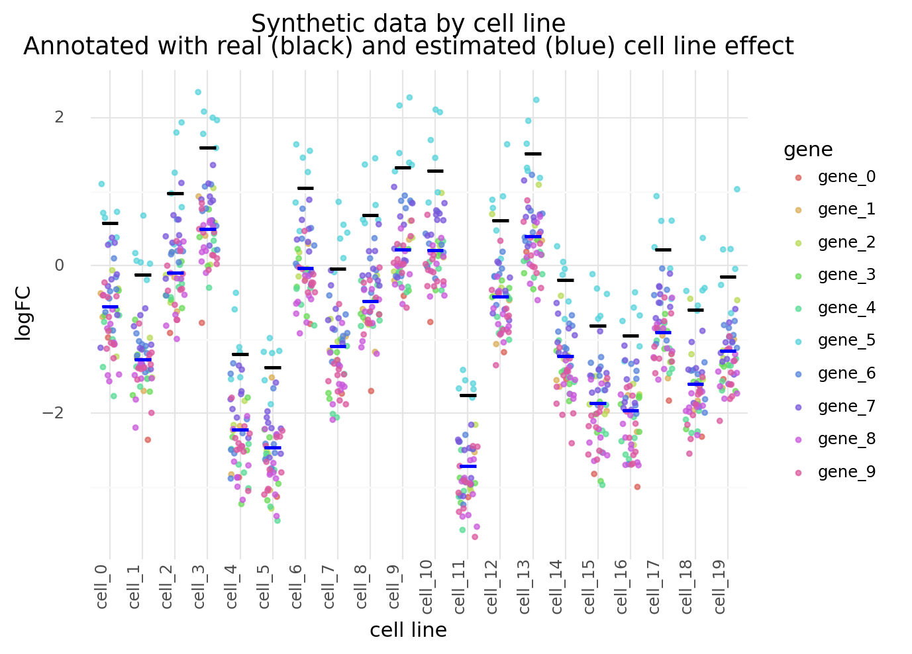
    


    <ggplot: (8735931201199)>


A model with complete pooling of the data to compare with the hierarhical model to highlight the effects of partial pooling.


```python
gene_idx = data.gene.cat.codes.to_list()
cell_line_idx = data.cell_line.cat.codes.to_list()

with pm.Model() as m7a_pool:

    # Linear model parameters
    alpha_gc = pm.Normal("alpha_gc", 0, 5, shape=(num_genes, num_cell_lines))

    # Linear model
    mu_gc = pm.Deterministic("mu_gc", alpha_gc[gene_idx, cell_line_idx])
    sigma = pm.Exponential("sigma", 1)

    # Likelihood
    log_fc = pm.Normal("log_fc", mu_gc, sigma, observed=data.log_fc.to_list())

    # Sampling
    m7a_pool_prior_check = pm.sample_prior_predictive(random_seed=RANDOM_SEED)
    m7a_pool_trace = pm.sample(
        2000, tune=2000, random_seed=RANDOM_SEED, target_accept=0.95
    )
    m7a_pool_post_check = pm.sample_posterior_predictive(
        m7a_pool_trace, random_seed=RANDOM_SEED
    )
```

    /home/jc604/.conda/envs/speclet/lib/python3.8/site-packages/theano/tensor/subtensor.py:2197: FutureWarning: Using a non-tuple sequence for multidimensional indexing is deprecated; use `arr[tuple(seq)]` instead of `arr[seq]`. In the future this will be interpreted as an array index, `arr[np.array(seq)]`, which will result either in an error or a different result.
    Auto-assigning NUTS sampler...
    Initializing NUTS using jitter+adapt_diag...
    /home/jc604/.conda/envs/speclet/lib/python3.8/site-packages/theano/tensor/subtensor.py:2197: FutureWarning: Using a non-tuple sequence for multidimensional indexing is deprecated; use `arr[tuple(seq)]` instead of `arr[seq]`. In the future this will be interpreted as an array index, `arr[np.array(seq)]`, which will result either in an error or a different result.
    Multiprocess sampling (4 chains in 4 jobs)
    NUTS: [sigma, alpha_gc]


<div>
    <style>
        /* Turns off some styling */
        progress {
            /* gets rid of default border in Firefox and Opera. */
            border: none;
            /* Needs to be in here for Safari polyfill so background images work as expected. */
            background-size: auto;
        }
        .progress-bar-interrupted, .progress-bar-interrupted::-webkit-progress-bar {
            background: #F44336;
        }
    </style>
  <progress value='16000' class='' max='16000' style='width:300px; height:20px; vertical-align: middle;'></progress>
  100.00% [16000/16000 00:24<00:00 Sampling 4 chains, 0 divergences]
</div>


    Sampling 4 chains for 2_000 tune and 2_000 draw iterations (8_000 + 8_000 draws total) took 25 seconds.


<div>
    <style>
        /* Turns off some styling */
        progress {
            /* gets rid of default border in Firefox and Opera. */
            border: none;
            /* Needs to be in here for Safari polyfill so background images work as expected. */
            background-size: auto;
        }
        .progress-bar-interrupted, .progress-bar-interrupted::-webkit-progress-bar {
            background: #F44336;
        }
    </style>
  <progress value='8000' class='' max='8000' style='width:300px; height:20px; vertical-align: middle;'></progress>
  100.00% [8000/8000 00:08<00:00]
</div>


    /home/jc604/.conda/envs/speclet/lib/python3.8/site-packages/theano/tensor/subtensor.py:2197: FutureWarning: Using a non-tuple sequence for multidimensional indexing is deprecated; use `arr[tuple(seq)]` instead of `arr[seq]`. In the future this will be interpreted as an array index, `arr[np.array(seq)]`, which will result either in an error or a different result.


```python
pm.model_to_graphviz(m7a_pool)
```


    

    


```python
az_m7a_pool = az.from_pymc3(
    trace=m7a_pool_trace,
    model=m7a_pool,
    posterior_predictive=m7a_pool_post_check,
    prior=m7a_pool_prior_check,
)
```

    /home/jc604/.conda/envs/speclet/lib/python3.8/site-packages/theano/tensor/subtensor.py:2197: FutureWarning: Using a non-tuple sequence for multidimensional indexing is deprecated; use `arr[tuple(seq)]` instead of `arr[seq]`. In the future this will be interpreted as an array index, `arr[np.array(seq)]`, which will result either in an error or a different result.


```python
m7a_pool_post = (
    az.summary(az_m7a_pool, var_names=["alpha_gc"])
    .reset_index()
    .rename(columns={"index": "intercept"})
    .assign(
        gene_idx=lambda d: d["intercept"].str.extract(r"\[(\d+),"),
        cell_line_idx=lambda d: d["intercept"].str.extract(r",(\d+)\]"),
    )
    .assign(
        gene_idx=lambda d: [int(x) for x in d.gene_idx],
        gene=lambda d: [genes[i] for i in d.gene_idx],
        cell_line_idx=lambda d: [int(x) for x in d.cell_line_idx],
        cell_line=lambda d: [cell_lines[i] for i in d.cell_line_idx],
    )
)
m7a_pool_post.head(n=10)
```


<div>
<style scoped>
    .dataframe tbody tr th:only-of-type {
        vertical-align: middle;
    }

    .dataframe tbody tr th {
        vertical-align: top;
    }

    .dataframe thead th {
        text-align: right;
    }
</style>
<table border="1" class="dataframe">
  <thead>
    <tr style="text-align: right;">
      <th></th>
      <th>intercept</th>
      <th>mean</th>
      <th>sd</th>
      <th>hdi_3%</th>
      <th>hdi_97%</th>
      <th>mcse_mean</th>
      <th>mcse_sd</th>
      <th>ess_mean</th>
      <th>ess_sd</th>
      <th>ess_bulk</th>
      <th>ess_tail</th>
      <th>r_hat</th>
      <th>gene_idx</th>
      <th>cell_line_idx</th>
      <th>gene</th>
      <th>cell_line</th>
    </tr>
  </thead>
  <tbody>
    <tr>
      <th>0</th>
      <td>alpha_gc[0,0]</td>
      <td>-0.966</td>
      <td>0.340</td>
      <td>-1.615</td>
      <td>-0.333</td>
      <td>0.003</td>
      <td>0.002</td>
      <td>12413.0</td>
      <td>10757.0</td>
      <td>12382.0</td>
      <td>5739.0</td>
      <td>1.0</td>
      <td>0</td>
      <td>0</td>
      <td>gene_0</td>
      <td>cell_0</td>
    </tr>
    <tr>
      <th>1</th>
      <td>alpha_gc[0,1]</td>
      <td>-2.349</td>
      <td>0.348</td>
      <td>-3.020</td>
      <td>-1.710</td>
      <td>0.003</td>
      <td>0.002</td>
      <td>11758.0</td>
      <td>11251.0</td>
      <td>11762.0</td>
      <td>5584.0</td>
      <td>1.0</td>
      <td>0</td>
      <td>1</td>
      <td>gene_0</td>
      <td>cell_1</td>
    </tr>
    <tr>
      <th>2</th>
      <td>alpha_gc[0,2]</td>
      <td>-0.907</td>
      <td>0.340</td>
      <td>-1.550</td>
      <td>-0.274</td>
      <td>0.003</td>
      <td>0.002</td>
      <td>11552.0</td>
      <td>9620.0</td>
      <td>11581.0</td>
      <td>5955.0</td>
      <td>1.0</td>
      <td>0</td>
      <td>2</td>
      <td>gene_0</td>
      <td>cell_2</td>
    </tr>
    <tr>
      <th>3</th>
      <td>alpha_gc[0,3]</td>
      <td>-0.770</td>
      <td>0.351</td>
      <td>-1.399</td>
      <td>-0.085</td>
      <td>0.003</td>
      <td>0.002</td>
      <td>13773.0</td>
      <td>10072.0</td>
      <td>13783.0</td>
      <td>5782.0</td>
      <td>1.0</td>
      <td>0</td>
      <td>3</td>
      <td>gene_0</td>
      <td>cell_3</td>
    </tr>
    <tr>
      <th>4</th>
      <td>alpha_gc[0,4]</td>
      <td>-2.849</td>
      <td>0.347</td>
      <td>-3.503</td>
      <td>-2.186</td>
      <td>0.003</td>
      <td>0.002</td>
      <td>15364.0</td>
      <td>14853.0</td>
      <td>15340.0</td>
      <td>6178.0</td>
      <td>1.0</td>
      <td>0</td>
      <td>4</td>
      <td>gene_0</td>
      <td>cell_4</td>
    </tr>
    <tr>
      <th>5</th>
      <td>alpha_gc[0,5]</td>
      <td>-3.114</td>
      <td>0.356</td>
      <td>-3.748</td>
      <td>-2.426</td>
      <td>0.003</td>
      <td>0.002</td>
      <td>15264.0</td>
      <td>15264.0</td>
      <td>15290.0</td>
      <td>5429.0</td>
      <td>1.0</td>
      <td>0</td>
      <td>5</td>
      <td>gene_0</td>
      <td>cell_5</td>
    </tr>
    <tr>
      <th>6</th>
      <td>alpha_gc[0,6]</td>
      <td>-0.793</td>
      <td>0.345</td>
      <td>-1.445</td>
      <td>-0.134</td>
      <td>0.003</td>
      <td>0.002</td>
      <td>12937.0</td>
      <td>10412.0</td>
      <td>12951.0</td>
      <td>6447.0</td>
      <td>1.0</td>
      <td>0</td>
      <td>6</td>
      <td>gene_0</td>
      <td>cell_6</td>
    </tr>
    <tr>
      <th>7</th>
      <td>alpha_gc[0,7]</td>
      <td>-1.723</td>
      <td>0.352</td>
      <td>-2.413</td>
      <td>-1.105</td>
      <td>0.003</td>
      <td>0.002</td>
      <td>12401.0</td>
      <td>11951.0</td>
      <td>12422.0</td>
      <td>5660.0</td>
      <td>1.0</td>
      <td>0</td>
      <td>7</td>
      <td>gene_0</td>
      <td>cell_7</td>
    </tr>
    <tr>
      <th>8</th>
      <td>alpha_gc[0,8]</td>
      <td>-1.690</td>
      <td>0.347</td>
      <td>-2.317</td>
      <td>-1.028</td>
      <td>0.003</td>
      <td>0.002</td>
      <td>13534.0</td>
      <td>12979.0</td>
      <td>13550.0</td>
      <td>5134.0</td>
      <td>1.0</td>
      <td>0</td>
      <td>8</td>
      <td>gene_0</td>
      <td>cell_8</td>
    </tr>
    <tr>
      <th>9</th>
      <td>alpha_gc[0,9]</td>
      <td>-0.413</td>
      <td>0.346</td>
      <td>-1.064</td>
      <td>0.233</td>
      <td>0.003</td>
      <td>0.003</td>
      <td>14611.0</td>
      <td>7202.0</td>
      <td>14599.0</td>
      <td>5734.0</td>
      <td>1.0</td>
      <td>0</td>
      <td>9</td>
      <td>gene_0</td>
      <td>cell_9</td>
    </tr>
  </tbody>
</table>
</div>


Note that there is more pooling in the first genes than the later genes.
The first gene has 1 sgRNA and the last gene has 10 sgRNA.


```python
var_names = ["gene", "cell_line", "mean"]
m7a_compare_post = pd.merge(
    m7a_post[var_names].rename(columns={"mean": "part_pool"}),
    m7a_pool_post[var_names].rename(columns={"mean": "full_pool"}),
    on=["gene", "cell_line"],
).melt(id_vars=["gene", "cell_line"], var_name="pool", value_name="mean")

for col in ["gene", "cell_line"]:
    m7a_compare_post = make_cat(m7a_compare_post, col)

(
    gg.ggplot(m7a_compare_post, gg.aes(x="gene", y="mean"))
    + gg.geom_point(gg.aes(color="pool"), position=gg.position_dodge(width=0.5))
    + gg.scale_color_brewer(type="qual", palette="Set1")
    + gg.labs(
        x="gene",
        y="posterior mean",
        title="Comparing posteriors of fully and partially pooled models",
    )
)
```


    
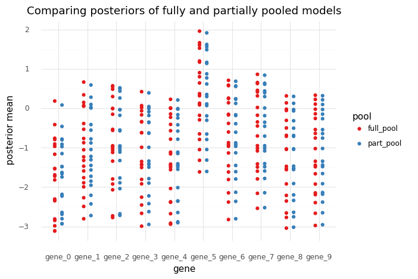
    


    <ggplot: (8735946388505)>


```python
(
    gg.ggplot(m7a_compare_post, gg.aes(x="cell_line", y="mean"))
    + gg.geom_point(gg.aes(color="pool"), position=gg.position_dodge(width=0.5))
    + gg.scale_color_brewer(type="qual", palette="Set1")
    + gg.theme(axis_text_x=gg.element_text(angle=90))
    + gg.labs(
        x="cell_line",
        y="posterior mean",
        title="Comparing posteriors of fully and partially pooled models",
    )
)
```


    
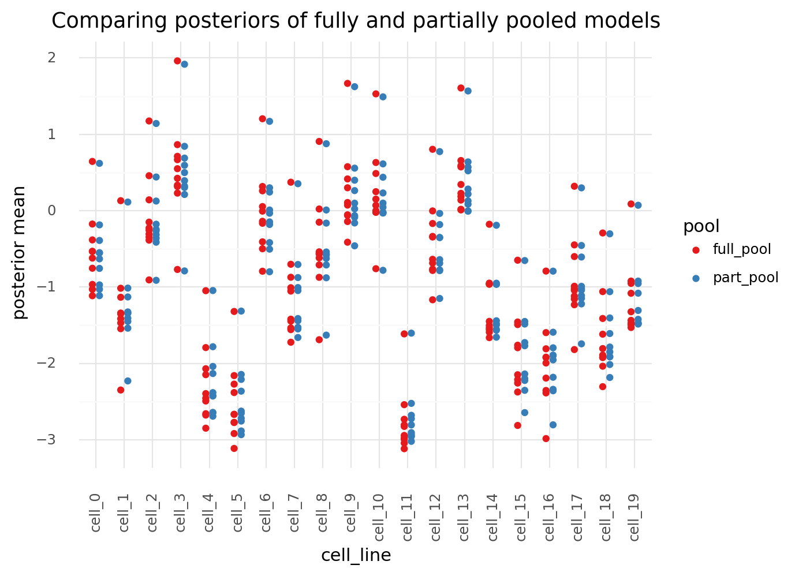
    


    <ggplot: (8736005771472)>


```python
az.summary(az_m7a, var_names=["mu_alpha_gc", "sigma_alpha"])
```


<div>
<style scoped>
    .dataframe tbody tr th:only-of-type {
        vertical-align: middle;
    }

    .dataframe tbody tr th {
        vertical-align: top;
    }

    .dataframe thead th {
        text-align: right;
    }
</style>
<table border="1" class="dataframe">
  <thead>
    <tr style="text-align: right;">
      <th></th>
      <th>mean</th>
      <th>sd</th>
      <th>hdi_3%</th>
      <th>hdi_97%</th>
      <th>mcse_mean</th>
      <th>mcse_sd</th>
      <th>ess_mean</th>
      <th>ess_sd</th>
      <th>ess_bulk</th>
      <th>ess_tail</th>
      <th>r_hat</th>
    </tr>
  </thead>
  <tbody>
    <tr>
      <th>mu_alpha_gc</th>
      <td>-0.936</td>
      <td>0.082</td>
      <td>-1.094</td>
      <td>-0.787</td>
      <td>0.001</td>
      <td>0.001</td>
      <td>11858.0</td>
      <td>11826.0</td>
      <td>11823.0</td>
      <td>5764.0</td>
      <td>1.0</td>
    </tr>
    <tr>
      <th>sigma_alpha</th>
      <td>1.110</td>
      <td>0.058</td>
      <td>1.000</td>
      <td>1.216</td>
      <td>0.001</td>
      <td>0.000</td>
      <td>13260.0</td>
      <td>13026.0</td>
      <td>13424.0</td>
      <td>6046.0</td>
      <td>1.0</td>
    </tr>
  </tbody>
</table>
</div>


## Model 7b. A 2-Dimensional varying intercept with a hierarchical link between the sgRNA and gene

The same model as above, but with another hierarchcial level connecting the sgRNAs by their gene.
The first level uses a varying intercept of $[sgRNA, cell]$ which is then given a prior with a varying intercept of shape $[gene, cell]$.

$
logFC_{i,s,c} \sim \mathcal{N}(\mu_{s,c}, \sigma) \\
\mu_{s,c} = \alpha_{s,c} \\
\quad \alpha_{s,c} \sim \mathcal{N}(\mu_{\alpha_{s,c}}, \sigma_\alpha) \\
\qquad \mu_{\alpha_{s,c}} = \gamma_{g,c} \\
\qquad\quad \gamma_{g,c} \sim \mathcal{N}(\mu_\gamma, \sigma_\gamma) \\
\qquad\qquad \mu_\gamma \sim \mathcal{N}(0,5) \quad \sigma_\gamma \sim \text{Exp}(1) \\
\qquad \sigma_\alpha \sim \text{Exp}(1) \\
\sigma \sim \text{Exp}(1)
$


```python
sgrna_idx = data.sgRNA.cat.codes.to_list()
gene_idx = data.gene.cat.codes.to_list()
sgrna_to_gene_idx = sgrna_df.gene.cat.codes.to_list()
cell_line_idx = data.cell_line.cat.codes.to_list()

with pm.Model() as m7b:
    # Priors for varying intercept for [gene, cell line].
    mu_gamma = pm.Normal("mu_gamma", 0, 5)
    sigma_gamma = pm.Exponential("sigma_gamma", 1)

    # Varying intercept for [gene, cell line].
    gamma_gc = pm.Normal(
        "gamma_gc", mu_gamma, sigma_gamma, shape=(num_genes, num_cell_lines)
    )

    # Priors for varying intercept for [sgRNA, cell line].
    mu_alpha_sc = pm.Deterministic("mu_alpha_sc", gamma_gc[sgrna_to_gene_idx,])
    sigma_alpha = pm.Exponential("sigma_alpha", 1)

    # Varying intercept for [sgRNA, cell line].
    alpha_sc = pm.Normal(
        "alpha_sc", mu_alpha_sc, sigma_alpha, shape=(num_sgrnas, num_cell_lines)
    )

    # level 0. Linear model
    mu_sc = pm.Deterministic("mu_gc", alpha_sc[sgrna_idx, cell_line_idx])
    sigma = pm.Exponential("sigma", 1)

    # Likelihood
    log_fc = pm.Normal("log_fc", mu_sc, sigma, observed=data.log_fc.to_list())

    # Sampling
    m7b_prior_check = pm.sample_prior_predictive(random_seed=RANDOM_SEED)
    m7b_trace = pm.sample(2000, tune=2000, random_seed=RANDOM_SEED, target_accept=0.95)
    m7b_post_check = pm.sample_posterior_predictive(m7b_trace, random_seed=RANDOM_SEED)
```

    /home/jc604/.conda/envs/speclet/lib/python3.8/site-packages/theano/tensor/subtensor.py:2197: FutureWarning: Using a non-tuple sequence for multidimensional indexing is deprecated; use `arr[tuple(seq)]` instead of `arr[seq]`. In the future this will be interpreted as an array index, `arr[np.array(seq)]`, which will result either in an error or a different result.
    Auto-assigning NUTS sampler...
    Initializing NUTS using jitter+adapt_diag...
    /home/jc604/.conda/envs/speclet/lib/python3.8/site-packages/theano/tensor/subtensor.py:2197: FutureWarning: Using a non-tuple sequence for multidimensional indexing is deprecated; use `arr[tuple(seq)]` instead of `arr[seq]`. In the future this will be interpreted as an array index, `arr[np.array(seq)]`, which will result either in an error or a different result.
    Multiprocess sampling (4 chains in 4 jobs)
    NUTS: [sigma, alpha_sc, sigma_alpha, gamma_gc, sigma_gamma, mu_gamma]


<div>
    <style>
        /* Turns off some styling */
        progress {
            /* gets rid of default border in Firefox and Opera. */
            border: none;
            /* Needs to be in here for Safari polyfill so background images work as expected. */
            background-size: auto;
        }
        .progress-bar-interrupted, .progress-bar-interrupted::-webkit-progress-bar {
            background: #F44336;
        }
    </style>
  <progress value='16000' class='' max='16000' style='width:300px; height:20px; vertical-align: middle;'></progress>
  100.00% [16000/16000 01:46<00:00 Sampling 4 chains, 0 divergences]
</div>


    Sampling 4 chains for 2_000 tune and 2_000 draw iterations (8_000 + 8_000 draws total) took 107 seconds.
    The acceptance probability does not match the target. It is 0.9023624303207955, but should be close to 0.95. Try to increase the number of tuning steps.
    The rhat statistic is larger than 1.05 for some parameters. This indicates slight problems during sampling.
    The estimated number of effective samples is smaller than 200 for some parameters.


<div>
    <style>
        /* Turns off some styling */
        progress {
            /* gets rid of default border in Firefox and Opera. */
            border: none;
            /* Needs to be in here for Safari polyfill so background images work as expected. */
            background-size: auto;
        }
        .progress-bar-interrupted, .progress-bar-interrupted::-webkit-progress-bar {
            background: #F44336;
        }
    </style>
  <progress value='8000' class='' max='8000' style='width:300px; height:20px; vertical-align: middle;'></progress>
  100.00% [8000/8000 00:08<00:00]
</div>


    /home/jc604/.conda/envs/speclet/lib/python3.8/site-packages/theano/tensor/subtensor.py:2197: FutureWarning: Using a non-tuple sequence for multidimensional indexing is deprecated; use `arr[tuple(seq)]` instead of `arr[seq]`. In the future this will be interpreted as an array index, `arr[np.array(seq)]`, which will result either in an error or a different result.


```python
pm.model_to_graphviz(m7b)
```


    
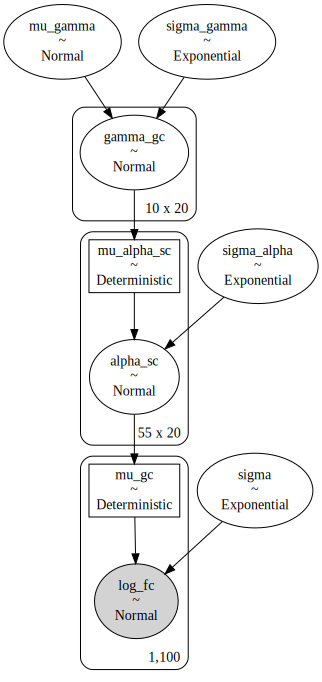
    


```python
az_m7b = az.from_pymc3(
    trace=m7b_trace,
    model=m7b,
    posterior_predictive=m7b_post_check,
    prior=m7b_prior_check,
)
```

    /home/jc604/.conda/envs/speclet/lib/python3.8/site-packages/theano/tensor/subtensor.py:2197: FutureWarning: Using a non-tuple sequence for multidimensional indexing is deprecated; use `arr[tuple(seq)]` instead of `arr[seq]`. In the future this will be interpreted as an array index, `arr[np.array(seq)]`, which will result either in an error or a different result.


Again, to identify the effects of the hierarchcial model on sharing of data, below is a non-hierarchical equivalent.


```python
sgrna_idx = data.sgRNA.cat.codes.to_list()
cell_line_idx = data.cell_line.cat.codes.to_list()

with pm.Model() as m7b_pool:

    # Linear model parameters
    alpha_sc = pm.Normal("alpha_sc", 0, 5, shape=(num_sgrnas, num_cell_lines))

    # Linear model
    mu_sc = pm.Deterministic("mu_sc", alpha_sc[sgrna_idx, cell_line_idx])
    sigma = pm.Exponential("sigma", 1)

    # Likelihood
    log_fc = pm.Normal("log_fc", mu_sc, sigma, observed=data.log_fc.to_list())

    # Sampling
    m7b_pool_prior_check = pm.sample_prior_predictive(random_seed=RANDOM_SEED)
    m7b_pool_trace = pm.sample(
        2000, tune=2000, random_seed=RANDOM_SEED, target_accept=0.95
    )
    m7b_pool_post_check = pm.sample_posterior_predictive(
        m7b_pool_trace, random_seed=RANDOM_SEED
    )
```

    Auto-assigning NUTS sampler...
    Initializing NUTS using jitter+adapt_diag...
    Multiprocess sampling (4 chains in 4 jobs)
    NUTS: [sigma, alpha_sc]


<div>
    <style>
        /* Turns off some styling */
        progress {
            /* gets rid of default border in Firefox and Opera. */
            border: none;
            /* Needs to be in here for Safari polyfill so background images work as expected. */
            background-size: auto;
        }
        .progress-bar-interrupted, .progress-bar-interrupted::-webkit-progress-bar {
            background: #F44336;
        }
    </style>
  <progress value='16000' class='' max='16000' style='width:300px; height:20px; vertical-align: middle;'></progress>
  100.00% [16000/16000 01:05<00:00 Sampling 4 chains, 0 divergences]
</div>


    Sampling 4 chains for 2_000 tune and 2_000 draw iterations (8_000 + 8_000 draws total) took 66 seconds.
    The acceptance probability does not match the target. It is 0.9012349306269171, but should be close to 0.95. Try to increase the number of tuning steps.
    The acceptance probability does not match the target. It is 0.8568385429631933, but should be close to 0.95. Try to increase the number of tuning steps.
    The rhat statistic is larger than 1.4 for some parameters. The sampler did not converge.
    The estimated number of effective samples is smaller than 200 for some parameters.


<div>
    <style>
        /* Turns off some styling */
        progress {
            /* gets rid of default border in Firefox and Opera. */
            border: none;
            /* Needs to be in here for Safari polyfill so background images work as expected. */
            background-size: auto;
        }
        .progress-bar-interrupted, .progress-bar-interrupted::-webkit-progress-bar {
            background: #F44336;
        }
    </style>
  <progress value='8000' class='' max='8000' style='width:300px; height:20px; vertical-align: middle;'></progress>
  100.00% [8000/8000 00:09<00:00]
</div>


    /home/jc604/.conda/envs/speclet/lib/python3.8/site-packages/theano/tensor/subtensor.py:2197: FutureWarning: Using a non-tuple sequence for multidimensional indexing is deprecated; use `arr[tuple(seq)]` instead of `arr[seq]`. In the future this will be interpreted as an array index, `arr[np.array(seq)]`, which will result either in an error or a different result.


```python
pm.model_to_graphviz(m7b_pool)
```


    
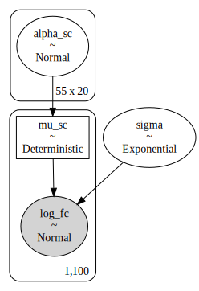
    


```python
az_m7b_pool = az.from_pymc3(
    trace=m7b_pool_trace,
    model=m7b_pool,
    posterior_predictive=m7b_pool_post_check,
    prior=m7b_pool_prior_check,
)
```

    /home/jc604/.conda/envs/speclet/lib/python3.8/site-packages/theano/tensor/subtensor.py:2197: FutureWarning: Using a non-tuple sequence for multidimensional indexing is deprecated; use `arr[tuple(seq)]` instead of `arr[seq]`. In the future this will be interpreted as an array index, `arr[np.array(seq)]`, which will result either in an error or a different result.


```python
az.summary(az_m7b, var_names=["mu_gamma", "sigma_gamma"])
```


<div>
<style scoped>
    .dataframe tbody tr th:only-of-type {
        vertical-align: middle;
    }

    .dataframe tbody tr th {
        vertical-align: top;
    }

    .dataframe thead th {
        text-align: right;
    }
</style>
<table border="1" class="dataframe">
  <thead>
    <tr style="text-align: right;">
      <th></th>
      <th>mean</th>
      <th>sd</th>
      <th>hdi_3%</th>
      <th>hdi_97%</th>
      <th>mcse_mean</th>
      <th>mcse_sd</th>
      <th>ess_mean</th>
      <th>ess_sd</th>
      <th>ess_bulk</th>
      <th>ess_tail</th>
      <th>r_hat</th>
    </tr>
  </thead>
  <tbody>
    <tr>
      <th>mu_gamma</th>
      <td>-0.937</td>
      <td>0.080</td>
      <td>-1.091</td>
      <td>-0.791</td>
      <td>0.001</td>
      <td>0.001</td>
      <td>7195.0</td>
      <td>7036.0</td>
      <td>7238.0</td>
      <td>4670.0</td>
      <td>1.0</td>
    </tr>
    <tr>
      <th>sigma_gamma</th>
      <td>1.111</td>
      <td>0.057</td>
      <td>1.004</td>
      <td>1.217</td>
      <td>0.001</td>
      <td>0.000</td>
      <td>7371.0</td>
      <td>7240.0</td>
      <td>7566.0</td>
      <td>5498.0</td>
      <td>1.0</td>
    </tr>
  </tbody>
</table>
</div>


```python
m7b_post = (
    az.summary(az_m7b, var_names=["gamma_gc"])
    .reset_index()
    .rename(columns={"index": "intercept"})
    .assign(
        gene_idx=lambda d: d["intercept"].str.extract(r"\[(\d+),"),
        cell_line_idx=lambda d: d["intercept"].str.extract(r",(\d+)\]"),
    )
    .assign(
        gene_idx=lambda d: [int(x) for x in d.gene_idx],
        gene=lambda d: [genes[i] for i in d.gene_idx],
        cell_line_idx=lambda d: [int(x) for x in d.cell_line_idx],
        cell_line=lambda d: [cell_lines[i] for i in d.cell_line_idx],
    )
)
m7b_post.head(n=10)
```


<div>
<style scoped>
    .dataframe tbody tr th:only-of-type {
        vertical-align: middle;
    }

    .dataframe tbody tr th {
        vertical-align: top;
    }

    .dataframe thead th {
        text-align: right;
    }
</style>
<table border="1" class="dataframe">
  <thead>
    <tr style="text-align: right;">
      <th></th>
      <th>intercept</th>
      <th>mean</th>
      <th>sd</th>
      <th>hdi_3%</th>
      <th>hdi_97%</th>
      <th>mcse_mean</th>
      <th>mcse_sd</th>
      <th>ess_mean</th>
      <th>ess_sd</th>
      <th>ess_bulk</th>
      <th>ess_tail</th>
      <th>r_hat</th>
      <th>gene_idx</th>
      <th>cell_line_idx</th>
      <th>gene</th>
      <th>cell_line</th>
    </tr>
  </thead>
  <tbody>
    <tr>
      <th>0</th>
      <td>gamma_gc[0,0]</td>
      <td>-0.973</td>
      <td>0.333</td>
      <td>-1.581</td>
      <td>-0.323</td>
      <td>0.004</td>
      <td>0.003</td>
      <td>7409.0</td>
      <td>7210.0</td>
      <td>7413.0</td>
      <td>5646.0</td>
      <td>1.0</td>
      <td>0</td>
      <td>0</td>
      <td>gene_0</td>
      <td>cell_0</td>
    </tr>
    <tr>
      <th>1</th>
      <td>gamma_gc[0,1]</td>
      <td>-2.238</td>
      <td>0.338</td>
      <td>-2.845</td>
      <td>-1.579</td>
      <td>0.004</td>
      <td>0.003</td>
      <td>6961.0</td>
      <td>6710.0</td>
      <td>6937.0</td>
      <td>5555.0</td>
      <td>1.0</td>
      <td>0</td>
      <td>1</td>
      <td>gene_0</td>
      <td>cell_1</td>
    </tr>
    <tr>
      <th>2</th>
      <td>gamma_gc[0,2]</td>
      <td>-0.919</td>
      <td>0.335</td>
      <td>-1.535</td>
      <td>-0.297</td>
      <td>0.004</td>
      <td>0.003</td>
      <td>6872.0</td>
      <td>6710.0</td>
      <td>6853.0</td>
      <td>5865.0</td>
      <td>1.0</td>
      <td>0</td>
      <td>2</td>
      <td>gene_0</td>
      <td>cell_2</td>
    </tr>
    <tr>
      <th>3</th>
      <td>gamma_gc[0,3]</td>
      <td>-0.786</td>
      <td>0.332</td>
      <td>-1.411</td>
      <td>-0.162</td>
      <td>0.004</td>
      <td>0.003</td>
      <td>7373.0</td>
      <td>6793.0</td>
      <td>7375.0</td>
      <td>5699.0</td>
      <td>1.0</td>
      <td>0</td>
      <td>3</td>
      <td>gene_0</td>
      <td>cell_3</td>
    </tr>
    <tr>
      <th>4</th>
      <td>gamma_gc[0,4]</td>
      <td>-2.688</td>
      <td>0.343</td>
      <td>-3.329</td>
      <td>-2.043</td>
      <td>0.004</td>
      <td>0.003</td>
      <td>6362.0</td>
      <td>6362.0</td>
      <td>6365.0</td>
      <td>4661.0</td>
      <td>1.0</td>
      <td>0</td>
      <td>4</td>
      <td>gene_0</td>
      <td>cell_4</td>
    </tr>
    <tr>
      <th>5</th>
      <td>gamma_gc[0,5]</td>
      <td>-2.933</td>
      <td>0.332</td>
      <td>-3.541</td>
      <td>-2.306</td>
      <td>0.004</td>
      <td>0.003</td>
      <td>6775.0</td>
      <td>6698.0</td>
      <td>6768.0</td>
      <td>5607.0</td>
      <td>1.0</td>
      <td>0</td>
      <td>5</td>
      <td>gene_0</td>
      <td>cell_5</td>
    </tr>
    <tr>
      <th>6</th>
      <td>gamma_gc[0,6]</td>
      <td>-0.798</td>
      <td>0.335</td>
      <td>-1.407</td>
      <td>-0.153</td>
      <td>0.004</td>
      <td>0.003</td>
      <td>6232.0</td>
      <td>6019.0</td>
      <td>6225.0</td>
      <td>5431.0</td>
      <td>1.0</td>
      <td>0</td>
      <td>6</td>
      <td>gene_0</td>
      <td>cell_6</td>
    </tr>
    <tr>
      <th>7</th>
      <td>gamma_gc[0,7]</td>
      <td>-1.659</td>
      <td>0.333</td>
      <td>-2.278</td>
      <td>-1.021</td>
      <td>0.004</td>
      <td>0.003</td>
      <td>6903.0</td>
      <td>6903.0</td>
      <td>6903.0</td>
      <td>5653.0</td>
      <td>1.0</td>
      <td>0</td>
      <td>7</td>
      <td>gene_0</td>
      <td>cell_7</td>
    </tr>
    <tr>
      <th>8</th>
      <td>gamma_gc[0,8]</td>
      <td>-1.630</td>
      <td>0.336</td>
      <td>-2.251</td>
      <td>-0.997</td>
      <td>0.004</td>
      <td>0.003</td>
      <td>6776.0</td>
      <td>6623.0</td>
      <td>6773.0</td>
      <td>5693.0</td>
      <td>1.0</td>
      <td>0</td>
      <td>8</td>
      <td>gene_0</td>
      <td>cell_8</td>
    </tr>
    <tr>
      <th>9</th>
      <td>gamma_gc[0,9]</td>
      <td>-0.461</td>
      <td>0.325</td>
      <td>-1.090</td>
      <td>0.128</td>
      <td>0.004</td>
      <td>0.003</td>
      <td>6099.0</td>
      <td>5351.0</td>
      <td>6106.0</td>
      <td>5485.0</td>
      <td>1.0</td>
      <td>0</td>
      <td>9</td>
      <td>gene_0</td>
      <td>cell_9</td>
    </tr>
  </tbody>
</table>
</div>


```python
(
    gg.ggplot(m7b_post, gg.aes(x="gene", y="cell_line"))
    + gg.geom_tile(gg.aes(fill="mean"))
    + gg.labs(
        x="gene",
        y="cell line",
        fill="posterior mean",
        title="Posterior means of the varying intercepts",
    )
)
```


    
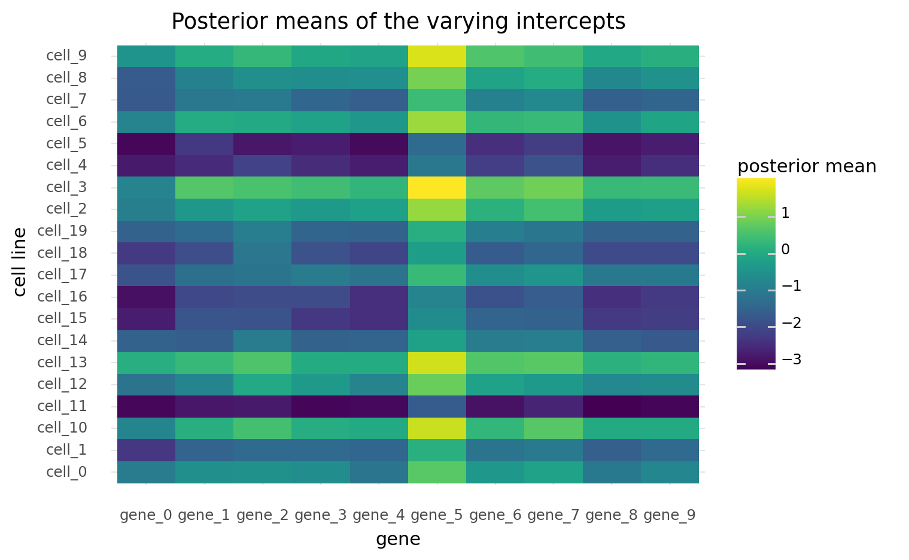
    


    <ggplot: (8735899365735)>


```python
var_names = ["gene", "cell_line", "mean"]
m7ab_compare_post = (
    pd.merge(
        m7a_pool_post[var_names].rename(columns={"mean": "full_pool"}),
        m7a_post[var_names].rename(columns={"mean": "part_pool"}),
        on=["gene", "cell_line"],
    )
    .merge(
        m7b_post[var_names].rename(columns={"mean": "hierarchical"}),
        on=["gene", "cell_line"],
    )
    .melt(id_vars=["gene", "cell_line"], var_name="pool", value_name="mean")
)

for col in ["gene", "cell_line", "pool"]:
    m7ab_compare_post = make_cat(m7ab_compare_post, col)


(
    gg.ggplot(m7ab_compare_post, gg.aes(x="gene", y="mean"))
    + gg.geom_point(gg.aes(color="pool"), position=gg.position_dodge(width=0.6))
    + gg.scale_color_brewer(type="qual", palette="Set1")
    + gg.labs(
        x="gene",
        y="posterior mean",
        title="Comparing posteriors of fully and partially pooled models",
    )
)
```


    

    


    <ggplot: (8735899367268)>


```python
def parse_alpha_sc(az_obj):
    post_df = (
        az.summary(az_obj, var_names=["alpha_sc"])
        .reset_index()
        .rename(columns={"index": "intercept"})
        .assign(
            sgrna_idx=lambda d: d["intercept"].str.extract(r"\[(\d+),"),
            cell_line_idx=lambda d: d["intercept"].str.extract(r",(\d+)\]"),
        )
        .assign(
            sgrna_idx=lambda d: [int(x) for x in d.sgrna_idx],
            sgRNA=lambda d: [sgrnas[i] for i in d.sgrna_idx],
            cell_line_idx=lambda d: [int(x) for x in d.cell_line_idx],
            cell_line=lambda d: [cell_lines[i] for i in d.cell_line_idx],
            gene=lambda d: [genes[sgrna_to_gene_idx[i]] for i in d.sgrna_idx],
        )
    )

    for col in ["gene", "cell_line", "sgRNA"]:
        post_df = make_cat(post_df, col)

    return post_df


m7b_alpha_sc = parse_alpha_sc(az_m7b)
m7b_pool_alpha_sc = parse_alpha_sc(az_m7b_pool)
```


```python
gene_posteriors = m7b_alpha_sc[["gene", "mean"]].groupby("gene").mean().reset_index()

(
    gg.ggplot(m7b_alpha_sc, gg.aes(x="gene", y="mean"))
    + gg.geom_jitter(gg.aes(color="cell_line"), height=0, width=0.3, alpha=0.8, size=1)
    + gg.scale_color_discrete(guide=gg.guide_legend(title="cell line", ncol=2))
    + gg.geom_crossbar(
        gg.aes(ymin="log_fc", ymax="log_fc", y="log_fc"), data=real_gene_vals
    )
    + gg.geom_crossbar(
        gg.aes(ymin="mean", ymax="mean", y="mean"), data=gene_posteriors, color="blue"
    )
)
```


    
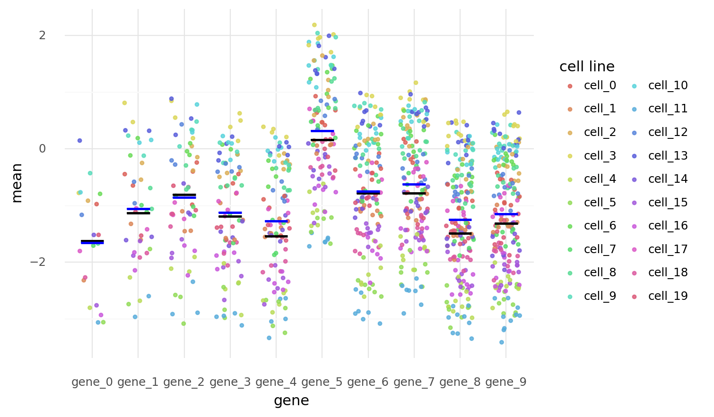
    


    <ggplot: (8735899367364)>


```python
compare_alpha_sc = pd.concat(
    [m7b_alpha_sc.assign(pool="partial"), m7b_pool_alpha_sc.assign(pool="full")]
)

(
    gg.ggplot(compare_alpha_sc, gg.aes(x="sgRNA", y="mean"))
    + gg.facet_wrap("gene", ncol=2, scales="free_x")
    + gg.geom_point(gg.aes(color="pool"), position=gg.position_dodge(width=0.6), size=1)
    + gg.scale_color_brewer(type="qual", palette="Set1")
    + gg.theme(figure_size=(8, 12), axis_text_x=gg.element_text(size=8))
)
```


    
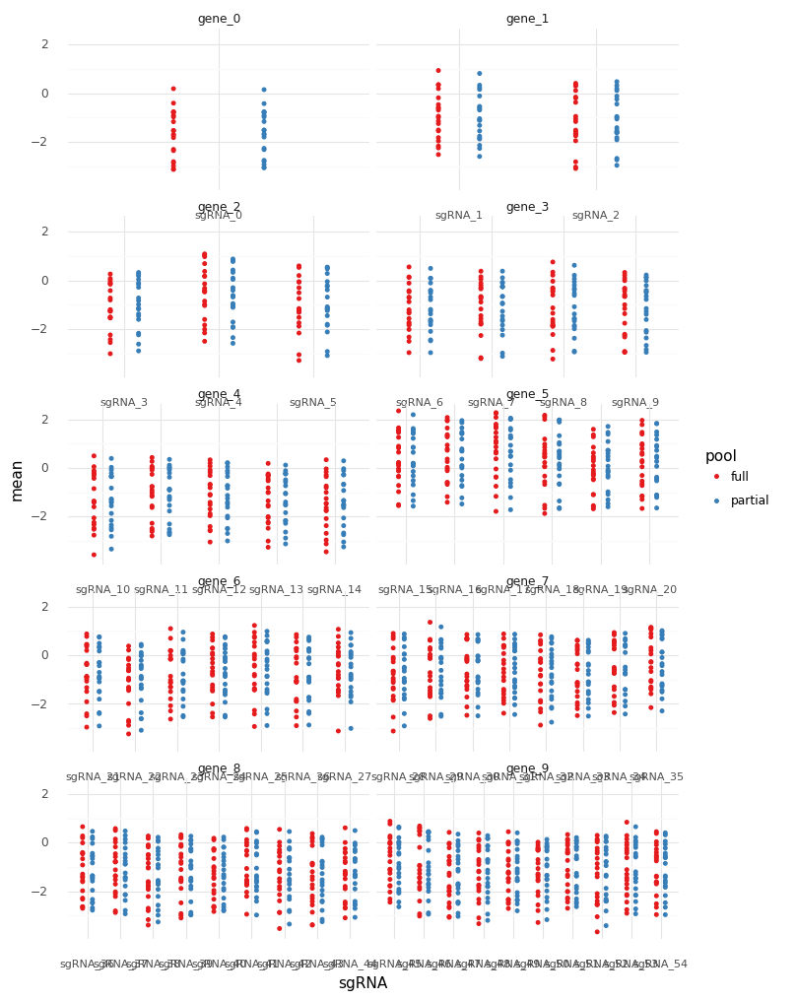
    


    <ggplot: (8735931064480)>


One issue is still that the cell line and gene effects are muddled and inseparable.
Therefore, drawing useful conclusions about the impact of knocking out a gene using a specific guide is very difficult, potentially impossible.


```python
pred_alpha_s = sgrna_df.copy()
m7b_alpha_sc_post = m7b_trace.get_values("alpha_sc")

# For each posterior sample, the average for each cell line.
cell_line_avg = m7b_alpha_sc_post.mean(axis=1)

for i in range(len(pred_alpha_s)):
    p = (m7b_alpha_sc_post[:, i, :] - cell_line_avg).flatten()
    pred_alpha_s.loc[i, "mean"] = np.mean(p)
    hdi = az.hdi(p, hdi_prob=0.89)
    pred_alpha_s.loc[i, "hdi_89_lower"] = hdi[0]
    pred_alpha_s.loc[i, "hdi_89_upper"] = hdi[1]

pred_alpha_s["real_value"] = RP["alpha_s"]
pred_alpha_s
```


<div>
<style scoped>
    .dataframe tbody tr th:only-of-type {
        vertical-align: middle;
    }

    .dataframe tbody tr th {
        vertical-align: top;
    }

    .dataframe thead th {
        text-align: right;
    }
</style>
<table border="1" class="dataframe">
  <thead>
    <tr style="text-align: right;">
      <th></th>
      <th>gene</th>
      <th>sgRNA</th>
      <th>mean</th>
      <th>hdi_89_lower</th>
      <th>hdi_89_upper</th>
      <th>real_value</th>
    </tr>
  </thead>
  <tbody>
    <tr>
      <th>0</th>
      <td>gene_0</td>
      <td>sgRNA_0</td>
      <td>-0.778723</td>
      <td>-1.400583</td>
      <td>-0.181332</td>
      <td>-1.862128</td>
    </tr>
    <tr>
      <th>1</th>
      <td>gene_1</td>
      <td>sgRNA_1</td>
      <td>-0.108910</td>
      <td>-0.605927</td>
      <td>0.331777</td>
      <td>-1.070338</td>
    </tr>
    <tr>
      <th>2</th>
      <td>gene_1</td>
      <td>sgRNA_2</td>
      <td>-0.256802</td>
      <td>-0.760342</td>
      <td>0.269939</td>
      <td>-1.319719</td>
    </tr>
    <tr>
      <th>3</th>
      <td>gene_2</td>
      <td>sgRNA_3</td>
      <td>-0.125926</td>
      <td>-0.586036</td>
      <td>0.326831</td>
      <td>-1.176780</td>
    </tr>
    <tr>
      <th>4</th>
      <td>gene_2</td>
      <td>sgRNA_4</td>
      <td>0.239965</td>
      <td>-0.313550</td>
      <td>0.808423</td>
      <td>-0.645986</td>
    </tr>
    <tr>
      <th>5</th>
      <td>gene_2</td>
      <td>sgRNA_5</td>
      <td>-0.057022</td>
      <td>-0.571905</td>
      <td>0.446365</td>
      <td>-0.958555</td>
    </tr>
    <tr>
      <th>6</th>
      <td>gene_3</td>
      <td>sgRNA_6</td>
      <td>-0.262592</td>
      <td>-0.663229</td>
      <td>0.137196</td>
      <td>-1.280025</td>
    </tr>
    <tr>
      <th>7</th>
      <td>gene_3</td>
      <td>sgRNA_7</td>
      <td>-0.213017</td>
      <td>-0.684585</td>
      <td>0.244540</td>
      <td>-1.183275</td>
    </tr>
    <tr>
      <th>8</th>
      <td>gene_3</td>
      <td>sgRNA_8</td>
      <td>-0.240960</td>
      <td>-0.668431</td>
      <td>0.221597</td>
      <td>-1.242896</td>
    </tr>
    <tr>
      <th>9</th>
      <td>gene_3</td>
      <td>sgRNA_9</td>
      <td>-0.269438</td>
      <td>-0.718198</td>
      <td>0.197026</td>
      <td>-1.159313</td>
    </tr>
    <tr>
      <th>10</th>
      <td>gene_4</td>
      <td>sgRNA_10</td>
      <td>-0.436543</td>
      <td>-0.866166</td>
      <td>-0.048008</td>
      <td>-1.409439</td>
    </tr>
    <tr>
      <th>11</th>
      <td>gene_4</td>
      <td>sgRNA_11</td>
      <td>-0.262738</td>
      <td>-0.674895</td>
      <td>0.149165</td>
      <td>-1.203135</td>
    </tr>
    <tr>
      <th>12</th>
      <td>gene_4</td>
      <td>sgRNA_12</td>
      <td>-0.330748</td>
      <td>-0.649573</td>
      <td>-0.012195</td>
      <td>-1.331831</td>
    </tr>
    <tr>
      <th>13</th>
      <td>gene_4</td>
      <td>sgRNA_13</td>
      <td>-0.430378</td>
      <td>-0.889111</td>
      <td>-0.027717</td>
      <td>-1.484044</td>
    </tr>
    <tr>
      <th>14</th>
      <td>gene_4</td>
      <td>sgRNA_14</td>
      <td>-0.510773</td>
      <td>-0.949362</td>
      <td>-0.072013</td>
      <td>-1.707468</td>
    </tr>
    <tr>
      <th>15</th>
      <td>gene_5</td>
      <td>sgRNA_15</td>
      <td>1.210059</td>
      <td>0.832455</td>
      <td>1.593072</td>
      <td>0.183812</td>
    </tr>
    <tr>
      <th>16</th>
      <td>gene_5</td>
      <td>sgRNA_16</td>
      <td>1.307093</td>
      <td>0.912301</td>
      <td>1.724179</td>
      <td>0.213355</td>
    </tr>
    <tr>
      <th>17</th>
      <td>gene_5</td>
      <td>sgRNA_17</td>
      <td>1.452508</td>
      <td>0.995970</td>
      <td>1.956044</td>
      <td>0.506672</td>
    </tr>
    <tr>
      <th>18</th>
      <td>gene_5</td>
      <td>sgRNA_18</td>
      <td>1.170990</td>
      <td>0.662711</td>
      <td>1.611710</td>
      <td>0.088151</td>
    </tr>
    <tr>
      <th>19</th>
      <td>gene_5</td>
      <td>sgRNA_19</td>
      <td>0.927563</td>
      <td>0.439936</td>
      <td>1.376086</td>
      <td>-0.256121</td>
    </tr>
    <tr>
      <th>20</th>
      <td>gene_5</td>
      <td>sgRNA_20</td>
      <td>1.101143</td>
      <td>0.635387</td>
      <td>1.546210</td>
      <td>0.043019</td>
    </tr>
    <tr>
      <th>21</th>
      <td>gene_6</td>
      <td>sgRNA_21</td>
      <td>0.117491</td>
      <td>-0.298694</td>
      <td>0.531630</td>
      <td>-0.888385</td>
    </tr>
    <tr>
      <th>22</th>
      <td>gene_6</td>
      <td>sgRNA_22</td>
      <td>-0.117770</td>
      <td>-0.573604</td>
      <td>0.333768</td>
      <td>-1.227153</td>
    </tr>
    <tr>
      <th>23</th>
      <td>gene_6</td>
      <td>sgRNA_23</td>
      <td>0.121497</td>
      <td>-0.243612</td>
      <td>0.493045</td>
      <td>-0.865815</td>
    </tr>
    <tr>
      <th>24</th>
      <td>gene_6</td>
      <td>sgRNA_24</td>
      <td>0.202855</td>
      <td>-0.197562</td>
      <td>0.601364</td>
      <td>-0.843903</td>
    </tr>
    <tr>
      <th>25</th>
      <td>gene_6</td>
      <td>sgRNA_25</td>
      <td>0.251114</td>
      <td>-0.177150</td>
      <td>0.709654</td>
      <td>-0.730256</td>
    </tr>
    <tr>
      <th>26</th>
      <td>gene_6</td>
      <td>sgRNA_26</td>
      <td>0.088825</td>
      <td>-0.284919</td>
      <td>0.434666</td>
      <td>-0.876381</td>
    </tr>
    <tr>
      <th>27</th>
      <td>gene_6</td>
      <td>sgRNA_27</td>
      <td>0.232411</td>
      <td>-0.205694</td>
      <td>0.690829</td>
      <td>-0.691828</td>
    </tr>
    <tr>
      <th>28</th>
      <td>gene_7</td>
      <td>sgRNA_28</td>
      <td>0.116012</td>
      <td>-0.290056</td>
      <td>0.502420</td>
      <td>-0.989358</td>
    </tr>
    <tr>
      <th>29</th>
      <td>gene_7</td>
      <td>sgRNA_29</td>
      <td>0.273582</td>
      <td>-0.157127</td>
      <td>0.648921</td>
      <td>-0.749392</td>
    </tr>
    <tr>
      <th>30</th>
      <td>gene_7</td>
      <td>sgRNA_30</td>
      <td>0.293197</td>
      <td>-0.082148</td>
      <td>0.717992</td>
      <td>-0.665104</td>
    </tr>
    <tr>
      <th>31</th>
      <td>gene_7</td>
      <td>sgRNA_31</td>
      <td>0.234749</td>
      <td>-0.295798</td>
      <td>0.639004</td>
      <td>-0.845472</td>
    </tr>
    <tr>
      <th>32</th>
      <td>gene_7</td>
      <td>sgRNA_32</td>
      <td>0.156232</td>
      <td>-0.224168</td>
      <td>0.522039</td>
      <td>-0.968587</td>
    </tr>
    <tr>
      <th>33</th>
      <td>gene_7</td>
      <td>sgRNA_33</td>
      <td>0.160303</td>
      <td>-0.264191</td>
      <td>0.592128</td>
      <td>-0.924400</td>
    </tr>
    <tr>
      <th>34</th>
      <td>gene_7</td>
      <td>sgRNA_34</td>
      <td>0.326817</td>
      <td>-0.092062</td>
      <td>0.765680</td>
      <td>-0.581153</td>
    </tr>
    <tr>
      <th>35</th>
      <td>gene_7</td>
      <td>sgRNA_35</td>
      <td>0.490441</td>
      <td>0.096167</td>
      <td>0.928749</td>
      <td>-0.478120</td>
    </tr>
    <tr>
      <th>36</th>
      <td>gene_8</td>
      <td>sgRNA_36</td>
      <td>-0.329779</td>
      <td>-0.770623</td>
      <td>0.180444</td>
      <td>-1.384790</td>
    </tr>
    <tr>
      <th>37</th>
      <td>gene_8</td>
      <td>sgRNA_37</td>
      <td>-0.259593</td>
      <td>-0.583078</td>
      <td>0.061469</td>
      <td>-1.152245</td>
    </tr>
    <tr>
      <th>38</th>
      <td>gene_8</td>
      <td>sgRNA_38</td>
      <td>-0.450223</td>
      <td>-0.818707</td>
      <td>-0.067932</td>
      <td>-1.487493</td>
    </tr>
    <tr>
      <th>39</th>
      <td>gene_8</td>
      <td>sgRNA_39</td>
      <td>-0.306725</td>
      <td>-0.778048</td>
      <td>0.180823</td>
      <td>-1.321872</td>
    </tr>
    <tr>
      <th>40</th>
      <td>gene_8</td>
      <td>sgRNA_40</td>
      <td>-0.451817</td>
      <td>-0.893742</td>
      <td>-0.014955</td>
      <td>-1.508166</td>
    </tr>
    <tr>
      <th>41</th>
      <td>gene_8</td>
      <td>sgRNA_41</td>
      <td>-0.251108</td>
      <td>-0.664497</td>
      <td>0.167122</td>
      <td>-1.283574</td>
    </tr>
    <tr>
      <th>42</th>
      <td>gene_8</td>
      <td>sgRNA_42</td>
      <td>-0.398168</td>
      <td>-0.774630</td>
      <td>-0.041777</td>
      <td>-1.393158</td>
    </tr>
    <tr>
      <th>43</th>
      <td>gene_8</td>
      <td>sgRNA_43</td>
      <td>-0.492080</td>
      <td>-0.962591</td>
      <td>-0.086261</td>
      <td>-1.568002</td>
    </tr>
    <tr>
      <th>44</th>
      <td>gene_8</td>
      <td>sgRNA_44</td>
      <td>-0.415149</td>
      <td>-0.805317</td>
      <td>-0.026994</td>
      <td>-1.510403</td>
    </tr>
    <tr>
      <th>45</th>
      <td>gene_9</td>
      <td>sgRNA_45</td>
      <td>-0.024745</td>
      <td>-0.405813</td>
      <td>0.367533</td>
      <td>-0.946443</td>
    </tr>
    <tr>
      <th>46</th>
      <td>gene_9</td>
      <td>sgRNA_46</td>
      <td>-0.163600</td>
      <td>-0.644673</td>
      <td>0.313142</td>
      <td>-1.181060</td>
    </tr>
    <tr>
      <th>47</th>
      <td>gene_9</td>
      <td>sgRNA_47</td>
      <td>-0.469718</td>
      <td>-0.866518</td>
      <td>-0.065697</td>
      <td>-1.594541</td>
    </tr>
    <tr>
      <th>48</th>
      <td>gene_9</td>
      <td>sgRNA_48</td>
      <td>-0.332914</td>
      <td>-0.686800</td>
      <td>0.005252</td>
      <td>-1.431779</td>
    </tr>
    <tr>
      <th>49</th>
      <td>gene_9</td>
      <td>sgRNA_49</td>
      <td>-0.333479</td>
      <td>-0.711872</td>
      <td>0.041447</td>
      <td>-1.365683</td>
    </tr>
    <tr>
      <th>50</th>
      <td>gene_9</td>
      <td>sgRNA_50</td>
      <td>-0.304353</td>
      <td>-0.690348</td>
      <td>0.073534</td>
      <td>-1.420578</td>
    </tr>
    <tr>
      <th>51</th>
      <td>gene_9</td>
      <td>sgRNA_51</td>
      <td>-0.213426</td>
      <td>-0.698639</td>
      <td>0.267757</td>
      <td>-1.221988</td>
    </tr>
    <tr>
      <th>52</th>
      <td>gene_9</td>
      <td>sgRNA_52</td>
      <td>-0.394072</td>
      <td>-0.933308</td>
      <td>0.062759</td>
      <td>-1.500064</td>
    </tr>
    <tr>
      <th>53</th>
      <td>gene_9</td>
      <td>sgRNA_53</td>
      <td>-0.236368</td>
      <td>-0.578915</td>
      <td>0.117060</td>
      <td>-1.322028</td>
    </tr>
    <tr>
      <th>54</th>
      <td>gene_9</td>
      <td>sgRNA_54</td>
      <td>-0.245188</td>
      <td>-0.580735</td>
      <td>0.087996</td>
      <td>-1.299649</td>
    </tr>
  </tbody>
</table>
</div>


## Model 7c. Two varying intercepts

Due to the issue mentioned above about the gene/sgRNA and cell line effects being combined, I want to attempt the two-varying-intercept model again.
This time, I will use more strict priors.

$
logFC_{i,s,c} \sim \mathcal{N}(\mu_{g,c}, \sigma) \\
\mu_{g,c} = \alpha_g + \beta_c \\
\quad \alpha_g \sim \mathcal{N}(\mu_\alpha, \sigma_\alpha) \\
\qquad \mu_\alpha \sim \mathcal{N}(0,5) \quad \sigma_\alpha \sim \text{Exp}(1) \\
\quad \beta_c \sim \mathcal{N}(\mu_\beta, \sigma_\beta) \\
\qquad \mu_\beta \sim \mathcal{N}(0,5) \quad \sigma_\beta \sim \text{Exp}(1) \\
\sigma \sim \text{Exp}(1)
$


```python
gene_idx = data.gene.cat.codes.to_list()
cell_line_idx = data.cell_line.cat.codes.to_list()

with pm.Model() as m7c:

    # Hyper-priors
    mu_alpha = pm.Normal("mu_alpha", -1, 1)
    sigma_alpha = pm.Exponential("sigma_alpha", 1)
    mu_beta = pm.Normal("mu_beta", 0, 0.2)
    sigma_beta = pm.Exponential("sigma_beta", 1)

    # Varying intercept for gene and cell line.
    alpha_g = pm.Normal("alpha_g", mu_alpha, sigma_alpha, shape=(num_genes))
    beta_c = pm.Normal("beta_c", mu_beta, sigma_beta, shape=(num_cell_lines))

    # level 0. Linear model
    mu_gc = pm.Deterministic("mu_gc", alpha_g[gene_idx] + beta_c[cell_line_idx])
    sigma = pm.Exponential("sigma", 1)

    # Likelihood
    log_fc = pm.Normal("log_fc", mu_gc, sigma, observed=data.log_fc.to_list())

    # Sampling
    m7c_prior_check = pm.sample_prior_predictive(random_seed=RANDOM_SEED)
    m7c_trace = pm.sample(2000, tune=2000, random_seed=RANDOM_SEED, target_accept=0.95)
    m7c_post_check = pm.sample_posterior_predictive(m7c_trace, random_seed=RANDOM_SEED)
```

    Auto-assigning NUTS sampler...
    Initializing NUTS using jitter+adapt_diag...
    Multiprocess sampling (4 chains in 4 jobs)
    NUTS: [sigma, beta_c, alpha_g, sigma_beta, mu_beta, sigma_alpha, mu_alpha]


<div>
    <style>
        /* Turns off some styling */
        progress {
            /* gets rid of default border in Firefox and Opera. */
            border: none;
            /* Needs to be in here for Safari polyfill so background images work as expected. */
            background-size: auto;
        }
        .progress-bar-interrupted, .progress-bar-interrupted::-webkit-progress-bar {
            background: #F44336;
        }
    </style>
  <progress value='16000' class='' max='16000' style='width:300px; height:20px; vertical-align: middle;'></progress>
  100.00% [16000/16000 00:54<00:00 Sampling 4 chains, 0 divergences]
</div>


    Sampling 4 chains for 2_000 tune and 2_000 draw iterations (8_000 + 8_000 draws total) took 54 seconds.
    The acceptance probability does not match the target. It is 0.8963706202106828, but should be close to 0.95. Try to increase the number of tuning steps.
    The number of effective samples is smaller than 10% for some parameters.


<div>
    <style>
        /* Turns off some styling */
        progress {
            /* gets rid of default border in Firefox and Opera. */
            border: none;
            /* Needs to be in here for Safari polyfill so background images work as expected. */
            background-size: auto;
        }
        .progress-bar-interrupted, .progress-bar-interrupted::-webkit-progress-bar {
            background: #F44336;
        }
    </style>
  <progress value='8000' class='' max='8000' style='width:300px; height:20px; vertical-align: middle;'></progress>
  100.00% [8000/8000 00:09<00:00]
</div>


```python
pm.model_to_graphviz(m7c)
```


    
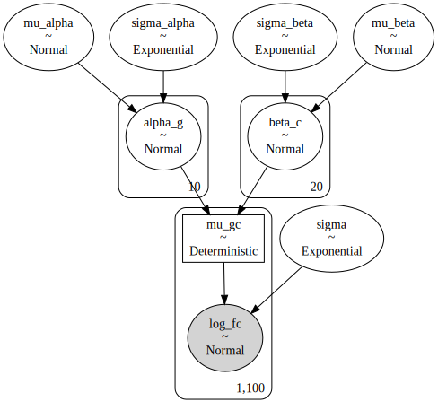
    


```python
az_m7c = az.from_pymc3(
    trace=m7c_trace,
    model=m7c,
    posterior_predictive=m7c_post_check,
    prior=m7c_prior_check,
)
```

This approach seems to work great!
More sampling will be required to get more effective samples of the posterior, but as a proof-of-concept, this worked.


```python
az.plot_trace(az_m7c, var_names="alpha_g")
plt.show()
```


    
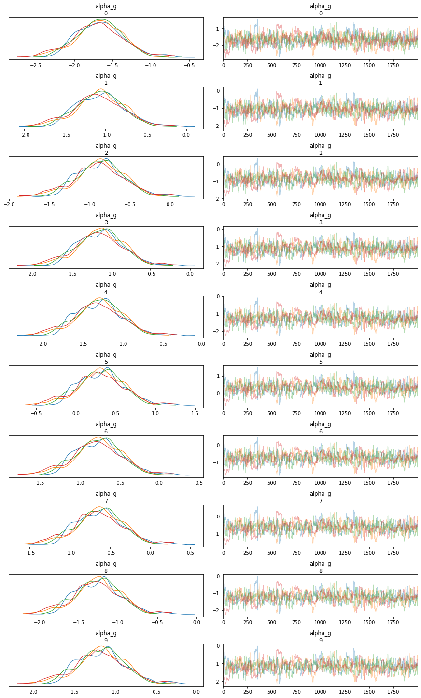
    


```python
az.summary(
    az_m7c, var_names=["mu_alpha", "sigma_alpha", "mu_beta", "sigma_beta"]
).assign(
    real_value=[RP[k] for k in ["mu_gamma", "sigma_gamma", "mu_beta", "sigma_beta"]]
)
```


<div>
<style scoped>
    .dataframe tbody tr th:only-of-type {
        vertical-align: middle;
    }

    .dataframe tbody tr th {
        vertical-align: top;
    }

    .dataframe thead th {
        text-align: right;
    }
</style>
<table border="1" class="dataframe">
  <thead>
    <tr style="text-align: right;">
      <th></th>
      <th>mean</th>
      <th>sd</th>
      <th>hdi_3%</th>
      <th>hdi_97%</th>
      <th>mcse_mean</th>
      <th>mcse_sd</th>
      <th>ess_mean</th>
      <th>ess_sd</th>
      <th>ess_bulk</th>
      <th>ess_tail</th>
      <th>r_hat</th>
      <th>real_value</th>
    </tr>
  </thead>
  <tbody>
    <tr>
      <th>mu_alpha</th>
      <td>-0.956</td>
      <td>0.356</td>
      <td>-1.631</td>
      <td>-0.301</td>
      <td>0.016</td>
      <td>0.011</td>
      <td>494.0</td>
      <td>485.0</td>
      <td>497.0</td>
      <td>638.0</td>
      <td>1.01</td>
      <td>-1.0</td>
    </tr>
    <tr>
      <th>sigma_alpha</th>
      <td>0.597</td>
      <td>0.163</td>
      <td>0.348</td>
      <td>0.895</td>
      <td>0.003</td>
      <td>0.002</td>
      <td>2557.0</td>
      <td>2497.0</td>
      <td>2883.0</td>
      <td>2801.0</td>
      <td>1.00</td>
      <td>0.5</td>
    </tr>
    <tr>
      <th>mu_beta</th>
      <td>0.003</td>
      <td>0.199</td>
      <td>-0.381</td>
      <td>0.363</td>
      <td>0.007</td>
      <td>0.005</td>
      <td>849.0</td>
      <td>849.0</td>
      <td>850.0</td>
      <td>1293.0</td>
      <td>1.00</td>
      <td>0.0</td>
    </tr>
    <tr>
      <th>sigma_beta</th>
      <td>1.053</td>
      <td>0.178</td>
      <td>0.747</td>
      <td>1.382</td>
      <td>0.003</td>
      <td>0.002</td>
      <td>3021.0</td>
      <td>2927.0</td>
      <td>3214.0</td>
      <td>3535.0</td>
      <td>1.00</td>
      <td>1.0</td>
    </tr>
  </tbody>
</table>
</div>


Both the gene and cell line effects were estimated very well.
Again, the sampling was not perfect, but that can be fixed with more compute & time,


```python
m7c_alpha_g_post = (
    az.summary(az_m7c, var_names="alpha_g")
    .reset_index()
    .rename(columns={"index": "alpha_g"})
    .assign(gene_idx=lambda d: d["alpha_g"].str.extract(r"\[(\d+)\]"))
    .assign(
        gene_idx=lambda d: [int(x) for x in d.gene_idx],
        gene=lambda d: [genes[i] for i in d.gene_idx],
    )
)

nudge_x = 0.3

(
    gg.ggplot(m7c_alpha_g_post, gg.aes(x="gene"))
    + gg.geom_linerange(gg.aes(ymin="hdi_3%", ymax="hdi_97%"), color="blue", size=0.8)
    + gg.geom_point(gg.aes(y="mean"), color="blue", size=2)
    + gg.geom_point(
        gg.aes(y="log_fc"),
        data=real_gene_vals,
        color="black",
        shape="^",
        size=2,
        alpha=0.7,
    )
)
```


    
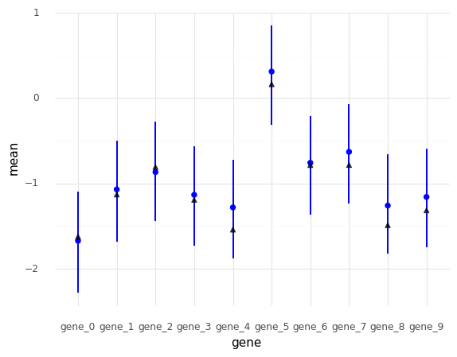
    


    <ggplot: (8735811091423)>


```python
m7c_beta_c_post = (
    az.summary(az_m7c, var_names="beta_c")
    .reset_index()
    .rename(columns={"index": "beta_c"})
    .assign(cell_line_idx=lambda d: d["beta_c"].str.extract(r"\[(\d+)\]"))
    .assign(
        cell_line_idx=lambda d: [int(x) for x in d.cell_line_idx],
        cell_line=lambda d: [cell_lines[i] for i in d.cell_line_idx],
    )
)

nudge_x = 0.3

(
    gg.ggplot(m7c_beta_c_post, gg.aes(x="cell_line"))
    + gg.geom_linerange(gg.aes(ymin="hdi_3%", ymax="hdi_97%"), color="blue", size=0.8)
    + gg.geom_point(gg.aes(y="mean"), color="blue", size=2)
    + gg.geom_point(
        gg.aes(y="log_fc"),
        data=real_cellline_vals,
        color="black",
        shape="^",
        size=2,
        alpha=0.7,
    )
)
```


    
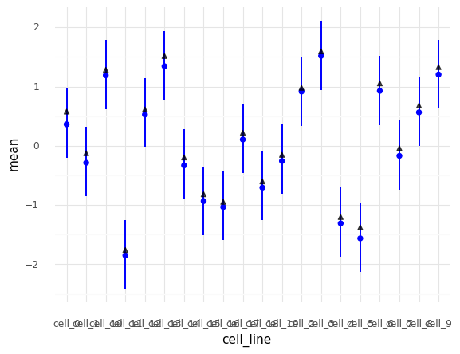
    


    <ggplot: (8735811000953)>


### Conclusions and final thoughts

All of the models above fit the data and can be used as templates in the future.
The last model, `m7c`, using two varying intercepts, demonstrated that more informative priors are required for the model to fit.
A hierarchical version of `m7c` should be the focus of further analysis.

---


```python
%load_ext watermark
%watermark -d -u -v -iv -b -h -m
```

    pymc3    3.9.3
    numpy    1.19.2
    plotnine 0.7.1
    arviz    0.10.0
    pandas   1.1.3
    seaborn  0.11.0
    last updated: 2020-11-10 
    
    CPython 3.8.5
    IPython 7.18.1
    
    compiler   : GCC 7.3.0
    system     : Linux
    release    : 3.10.0-1062.el7.x86_64
    machine    : x86_64
    processor  : x86_64
    CPU cores  : 28
    interpreter: 64bit
    host name  : compute-e-16-233.o2.rc.hms.harvard.edu
    Git branch : models

