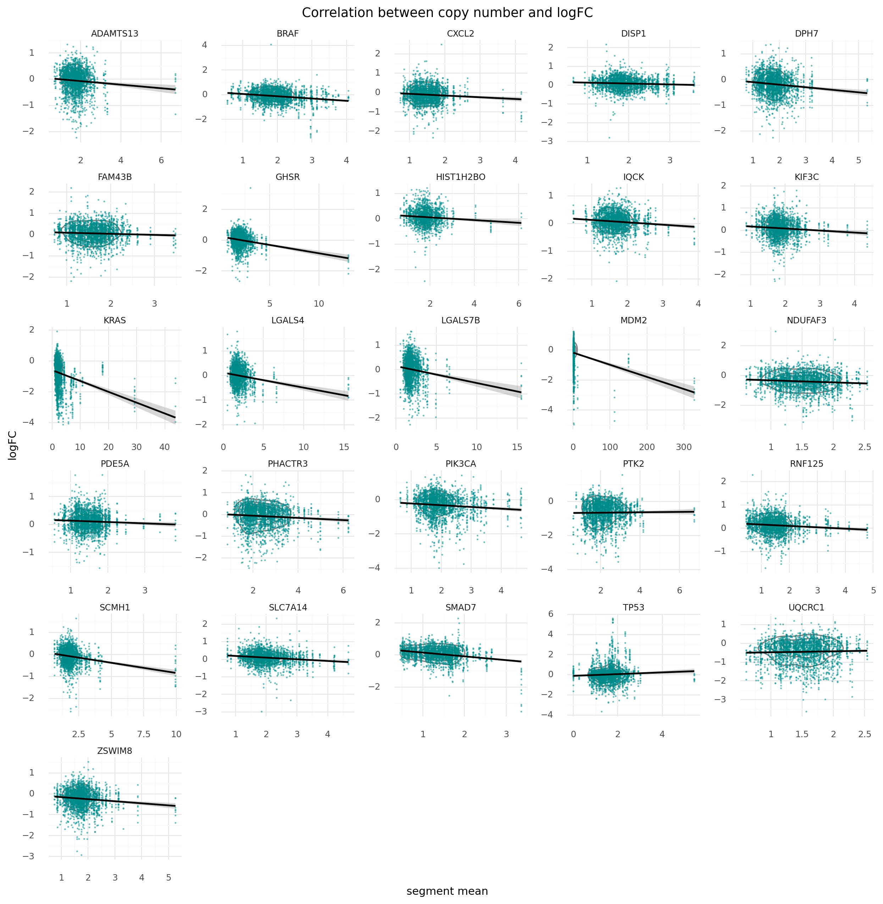
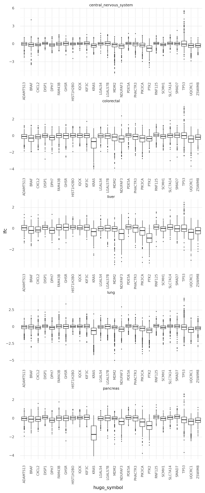

# Exporatory data analysis of the subset of data

```python
import string
import warnings
from pathlib import Path
from time import time

import matplotlib.colors as mcolors
import matplotlib.pyplot as plt
import numpy as np
import pandas as pd
import plotnine as gg
import seaborn as sns

notebook_tic = time()
warnings.simplefilter(action="ignore", category=UserWarning)

gg.theme_set(gg.theme_minimal())
%config InlineBackend.figure_format = 'retina'

RANDOM_SEED = 927
np.random.seed(RANDOM_SEED)
```

```python
data_path = Path("../modeling_data/depmap_modeling_dataframe_subsample.csv")
data = pd.read_csv(data_path)
data.head(n=10)
```

<div>
<style scoped>
    .dataframe tbody tr th:only-of-type {
        vertical-align: middle;
    }

    .dataframe tbody tr th {
        vertical-align: top;
    }

    .dataframe thead th {
        text-align: right;
    }
</style>
<table border="1" class="dataframe">
  <thead>
    <tr style="text-align: right;">
      <th></th>
      <th>sgrna</th>
      <th>replicate_id</th>
      <th>lfc</th>
      <th>pdna_batch</th>
      <th>passes_qc</th>
      <th>depmap_id</th>
      <th>primary_or_metastasis</th>
      <th>lineage</th>
      <th>lineage_subtype</th>
      <th>kras_mutation</th>
      <th>...</th>
      <th>log2_gene_cn_p1</th>
      <th>gene_cn</th>
      <th>n_muts</th>
      <th>any_deleterious</th>
      <th>variant_classification</th>
      <th>is_deleterious</th>
      <th>is_tcga_hotspot</th>
      <th>is_cosmic_hotspot</th>
      <th>mutated_at_guide_location</th>
      <th>rna_expr</th>
    </tr>
  </thead>
  <tbody>
    <tr>
      <th>0</th>
      <td>AAGAGGCCGGTCAAATTCAG</td>
      <td>42-mg-ba-311cas9_repa_p6_batch3</td>
      <td>-0.405499</td>
      <td>3</td>
      <td>True</td>
      <td>ACH-000323</td>
      <td>Primary</td>
      <td>central_nervous_system</td>
      <td>glioma</td>
      <td>WT</td>
      <td>...</td>
      <td>0.845287</td>
      <td>1.328646</td>
      <td>0</td>
      <td>False</td>
      <td>NaN</td>
      <td>NaN</td>
      <td>NaN</td>
      <td>NaN</td>
      <td>False</td>
      <td>1.263034</td>
    </tr>
    <tr>
      <th>1</th>
      <td>AATCAACCCACAGCTGCACA</td>
      <td>42-mg-ba-311cas9_repa_p6_batch3</td>
      <td>-0.133541</td>
      <td>3</td>
      <td>True</td>
      <td>ACH-000323</td>
      <td>Primary</td>
      <td>central_nervous_system</td>
      <td>glioma</td>
      <td>WT</td>
      <td>...</td>
      <td>0.827398</td>
      <td>1.287359</td>
      <td>2</td>
      <td>False</td>
      <td>missense_mutation;missense_mutation</td>
      <td>FALSE;FALSE</td>
      <td>TRUE;TRUE</td>
      <td>TRUE;TRUE</td>
      <td>False</td>
      <td>5.220330</td>
    </tr>
    <tr>
      <th>2</th>
      <td>AATTACTACTTGCTTCCTGT</td>
      <td>42-mg-ba-311cas9_repa_p6_batch3</td>
      <td>-0.491495</td>
      <td>3</td>
      <td>True</td>
      <td>ACH-000323</td>
      <td>Primary</td>
      <td>central_nervous_system</td>
      <td>glioma</td>
      <td>WT</td>
      <td>...</td>
      <td>0.879280</td>
      <td>1.409165</td>
      <td>0</td>
      <td>False</td>
      <td>NaN</td>
      <td>NaN</td>
      <td>NaN</td>
      <td>NaN</td>
      <td>False</td>
      <td>3.008989</td>
    </tr>
    <tr>
      <th>3</th>
      <td>ACCTGTATGACGAAACCGTG</td>
      <td>42-mg-ba-311cas9_repa_p6_batch3</td>
      <td>-0.015850</td>
      <td>3</td>
      <td>True</td>
      <td>ACH-000323</td>
      <td>Primary</td>
      <td>central_nervous_system</td>
      <td>glioma</td>
      <td>WT</td>
      <td>...</td>
      <td>0.818549</td>
      <td>1.267208</td>
      <td>0</td>
      <td>False</td>
      <td>NaN</td>
      <td>NaN</td>
      <td>NaN</td>
      <td>NaN</td>
      <td>False</td>
      <td>4.083213</td>
    </tr>
    <tr>
      <th>4</th>
      <td>ACTCTGTTCCTTCATCTCCG</td>
      <td>42-mg-ba-311cas9_repa_p6_batch3</td>
      <td>-0.530277</td>
      <td>3</td>
      <td>True</td>
      <td>ACH-000323</td>
      <td>Primary</td>
      <td>central_nervous_system</td>
      <td>glioma</td>
      <td>WT</td>
      <td>...</td>
      <td>0.990378</td>
      <td>1.692253</td>
      <td>0</td>
      <td>False</td>
      <td>NaN</td>
      <td>NaN</td>
      <td>NaN</td>
      <td>NaN</td>
      <td>False</td>
      <td>5.822730</td>
    </tr>
    <tr>
      <th>5</th>
      <td>ACTGCTGCGGGAATTCCAAG</td>
      <td>42-mg-ba-311cas9_repa_p6_batch3</td>
      <td>0.778827</td>
      <td>3</td>
      <td>True</td>
      <td>ACH-000323</td>
      <td>Primary</td>
      <td>central_nervous_system</td>
      <td>glioma</td>
      <td>WT</td>
      <td>...</td>
      <td>0.818549</td>
      <td>1.267208</td>
      <td>0</td>
      <td>False</td>
      <td>NaN</td>
      <td>NaN</td>
      <td>NaN</td>
      <td>NaN</td>
      <td>False</td>
      <td>4.083213</td>
    </tr>
    <tr>
      <th>6</th>
      <td>AGACACTTATACTATGAAAG</td>
      <td>42-mg-ba-311cas9_repa_p6_batch3</td>
      <td>0.035950</td>
      <td>3</td>
      <td>True</td>
      <td>ACH-000323</td>
      <td>Primary</td>
      <td>central_nervous_system</td>
      <td>glioma</td>
      <td>WT</td>
      <td>...</td>
      <td>0.872323</td>
      <td>1.392463</td>
      <td>0</td>
      <td>False</td>
      <td>NaN</td>
      <td>NaN</td>
      <td>NaN</td>
      <td>NaN</td>
      <td>False</td>
      <td>3.701549</td>
    </tr>
    <tr>
      <th>7</th>
      <td>AGAGGAGTACAGTGCAATGA</td>
      <td>42-mg-ba-311cas9_repa_p6_batch3</td>
      <td>0.370832</td>
      <td>3</td>
      <td>True</td>
      <td>ACH-000323</td>
      <td>Primary</td>
      <td>central_nervous_system</td>
      <td>glioma</td>
      <td>WT</td>
      <td>...</td>
      <td>0.879280</td>
      <td>1.409165</td>
      <td>0</td>
      <td>False</td>
      <td>NaN</td>
      <td>NaN</td>
      <td>NaN</td>
      <td>NaN</td>
      <td>False</td>
      <td>3.008989</td>
    </tr>
    <tr>
      <th>8</th>
      <td>AGATAGAGTAACTCTCTTTG</td>
      <td>42-mg-ba-311cas9_repa_p6_batch3</td>
      <td>-0.217851</td>
      <td>3</td>
      <td>True</td>
      <td>ACH-000323</td>
      <td>Primary</td>
      <td>central_nervous_system</td>
      <td>glioma</td>
      <td>WT</td>
      <td>...</td>
      <td>1.024361</td>
      <td>1.785314</td>
      <td>0</td>
      <td>False</td>
      <td>NaN</td>
      <td>NaN</td>
      <td>NaN</td>
      <td>NaN</td>
      <td>False</td>
      <td>1.748461</td>
    </tr>
    <tr>
      <th>9</th>
      <td>AGTGCGGATGAGTTTCAGCG</td>
      <td>42-mg-ba-311cas9_repa_p6_batch3</td>
      <td>-0.829300</td>
      <td>3</td>
      <td>True</td>
      <td>ACH-000323</td>
      <td>Primary</td>
      <td>central_nervous_system</td>
      <td>glioma</td>
      <td>WT</td>
      <td>...</td>
      <td>0.990378</td>
      <td>1.692253</td>
      <td>0</td>
      <td>False</td>
      <td>NaN</td>
      <td>NaN</td>
      <td>NaN</td>
      <td>NaN</td>
      <td>False</td>
      <td>5.822730</td>
    </tr>
  </tbody>
</table>
<p>10 rows × 27 columns</p>
</div>

```python
def make_cat(df, col, ordered=False):
    df[col] = pd.Categorical(df[col], ordered=ordered)
    return df
```

```python
for col in [
    "pdna_batch",
    "sgrna",
    "depmap_id",
    "primary_or_metastasis",
    "lineage",
    "lineage_subtype",
    "kras_mutation",
]:
    data = make_cat(data, col)
```

```python
print(
    f" num data points: {data.shape[0]}\n",
    f"      num genes: {len(set(data.hugo_symbol))}\n",
    f"      num sgRNA: {len(set(data.sgrna))}\n",
    f"   num lineages: {len(set(data.lineage))}\n",
    f" num cell lines: {len(set(data.depmap_id))}",
)
```

     num data points: 60049
           num genes: 26
           num sgRNA: 103
        num lineages: 5
      num cell lines: 258

```python
data.columns
```

    Index(['sgrna', 'replicate_id', 'lfc', 'pdna_batch', 'passes_qc', 'depmap_id',
           'primary_or_metastasis', 'lineage', 'lineage_subtype', 'kras_mutation',
           'genome_alignment', 'n_alignments', 'hugo_symbol', 'chromosome',
           'chrom_pos', 'segment_mean', 'segment_cn', 'log2_gene_cn_p1', 'gene_cn',
           'n_muts', 'any_deleterious', 'variant_classification', 'is_deleterious',
           'is_tcga_hotspot', 'is_cosmic_hotspot', 'mutated_at_guide_location',
           'rna_expr'],
          dtype='object')

```python
(
    gg.ggplot(data, gg.aes(x="hugo_symbol", y="lfc", color="hugo_symbol"))
    + gg.geom_boxplot(outlier_size=0.1)
    + gg.scale_color_discrete(guide=False)
    + gg.theme(figure_size=(10, 5), axis_text_x=gg.element_text(angle=35, hjust=1))
)
```


    <ggplot: (8794489551610)>

```python
faceting_theme_dict = {
    "figure_size": (15, 15),
    "subplots_adjust": {"hspace": 0.4, "wspace": 0.3},
}

(
    gg.ggplot(data, gg.aes(x="lfc"))
    + gg.facet_wrap("hugo_symbol", ncol=5, scales="free")
    + gg.geom_vline(xintercept=0, linetype="--", size=0.5, color="black")
    + gg.geom_density(size=0.7, color="black", fill="gray", alpha=0.2)
    + gg.theme(**faceting_theme_dict)
    + gg.labs(x="logFC", y="density", title="Distributions of logFC")
)
```


    <ggplot: (8794488465872)>

```python
(
    gg.ggplot(data, gg.aes(x="segment_mean"))
    + gg.facet_wrap("hugo_symbol", ncol=5, scales="free")
    + gg.geom_vline(xintercept=1, linetype="--", size=0.5, color="black")
    + gg.geom_density(size=0.7, color="black", fill="gray", alpha=0.2)
    + gg.theme(**faceting_theme_dict)
    + gg.labs(
        x="segment mean", y="density", title="Distributions of segment mean values"
    )
)
```


    <ggplot: (8794487263726)>

```python
(
    gg.ggplot(data, gg.aes(x="gene_cn"))
    + gg.facet_wrap("hugo_symbol", ncol=5, scales="free")
    + gg.geom_vline(xintercept=2, linetype="--", size=0.5, color="black")
    + gg.geom_density(size=0.7, color="black", fill="gray", alpha=0.2)
    + gg.theme(**faceting_theme_dict)
    + gg.labs(
        x="segment mean", y="density", title="Distributions of segment mean values"
    )
)
```


    <ggplot: (8794487952842)>

```python
(
    gg.ggplot(data, gg.aes(x="gene_cn", y="lfc"))
    + gg.facet_wrap("hugo_symbol", ncol=5, scales="free")
    + gg.geom_density_2d(color="grey", size=0.7)
    + gg.geom_point(color="darkcyan", alpha=0.4, size=0.1)
    + gg.geom_smooth(method="lm")
    + gg.theme(**faceting_theme_dict)
    + gg.labs(
        x="segment mean", y="logFC", title="Correlation between copy number and logFC"
    )
)
```



    <ggplot: (8794489551445)>

```python
def plot_highlight_muts(df, x, y="lfc", x_label=None, y_label="logFC", title=""):
    """Scatter plot of data in `df` with the mutated samples highlighted."""
    if x_label == None:
        x_label = x

    return (
        gg.ggplot(df, gg.aes(x=x, y=y))
        + gg.facet_wrap("hugo_symbol", ncol=5, scales="free")
        + gg.geom_point(
            gg.aes(color="any_deleterious", alpha="any_deleterious"), size=0.2
        )
        + gg.geom_smooth(method="lm")
        + gg.scale_color_manual(values=["gray", "red"])
        + gg.scale_alpha_manual(values=[0.2, 0.8])
        + gg.theme(**faceting_theme_dict)
        + gg.labs(
            x=x_label,
            y=y_label,
            color="any deleterious",
            title=title,
        )
    )
```

```python
plot_highlight_muts(
    data,
    x="gene_cn",
    x_label="gene CN",
    title="Correlation between copy number and logFC",
)
```


    <ggplot: (8794488927850)>

```python
plot_highlight_muts(
    data,
    x="rna_expr",
    x_label="RNA expression",
    title="Correlation between gene expression and logFC",
)
```


    <ggplot: (8794487348815)>

```python
(
    gg.ggplot(data, gg.aes(x="pdna_batch", y="lfc"))
    + gg.facet_wrap("hugo_symbol", nrow=5, scales="free_y")
    + gg.geom_boxplot(outlier_size=0.1, outlier_color="gray")
    + gg.theme(**faceting_theme_dict)
    + gg.labs(x="pDNA batch", y="logFC", title="Batch effects")
)
```


    <ggplot: (8794488675732)>

```python
(
    gg.ggplot(data, gg.aes(x="lfc", color="pdna_batch", fill="pdna_batch"))
    + gg.facet_wrap("hugo_symbol", nrow=5, scales="free")
    + gg.geom_density(alpha=0.3)
    + gg.theme(**faceting_theme_dict)
    + gg.labs(
        x="logFC",
        y="density",
        title="Batch effects",
        color="pDNA batch",
        fill="pDNA batch",
    )
)
```


    <ggplot: (8794487450450)>

```python
data["sgrna_idx"] = data["sgrna"].cat.codes

(
    gg.ggplot(data, gg.aes(x="factor(sgrna_idx)", y="lfc"))
    + gg.facet_wrap("hugo_symbol", nrow=5, scales="free")
    + gg.geom_boxplot(outlier_size=0.1, outlier_color="gray")
    + gg.theme(**faceting_theme_dict)
    + gg.labs(
        x="sgRNA targeting the gene",
        y="logFC",
        title="Distribution of effects of sgRNA on the same gene",
    )
)
```


    <ggplot: (8794478084602)>

```python
(
    gg.ggplot(data, gg.aes(x="hugo_symbol", y="lfc"))
    + gg.facet_wrap("lineage", ncol=1, scales="free")
    + gg.geom_boxplot(outlier_size=0.1)
    + gg.theme(
        figure_size=(8, 20),
        subplots_adjust={"hspace": 0.4, "wspace": 0.3},
        axis_text_x=gg.element_text(size=8, angle=90, hjust=0.5),
    )
)
```



    <ggplot: (8794475796767)>

---

```python
notebook_toc = time()
print(f"execution time: {(notebook_toc - notebook_tic) / 60:.2f} minutes")
```

    execution time: 3.25 minutes

```python
%load_ext watermark
%watermark -d -u -v -iv -b -h -m
```

    plotnine 0.7.1
    seaborn  0.11.0
    pandas   1.1.3
    numpy    1.19.2
    last updated: 2020-12-17

    CPython 3.8.5
    IPython 7.18.1

    compiler   : GCC 7.3.0
    system     : Linux
    release    : 3.10.0-1062.el7.x86_64
    machine    : x86_64
    processor  : x86_64
    CPU cores  : 32
    interpreter: 64bit
    host name  : compute-a-16-78.o2.rc.hms.harvard.edu
    Git branch : subset-data
