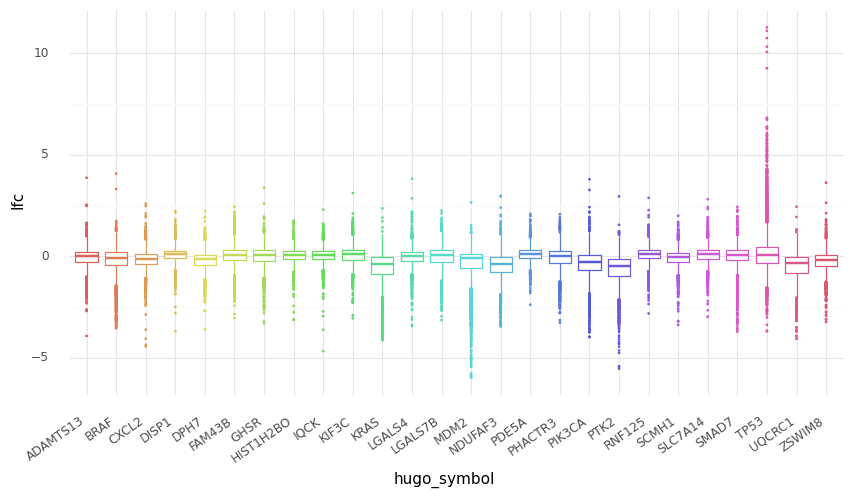
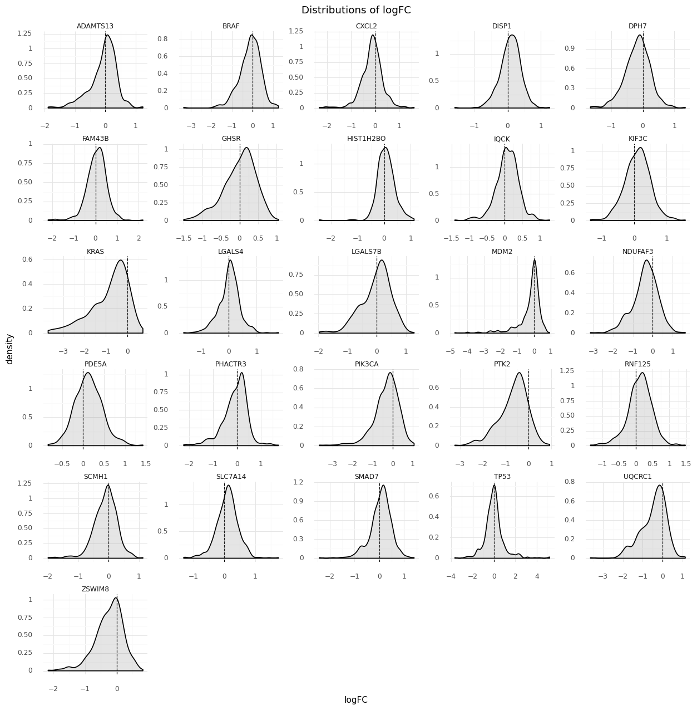
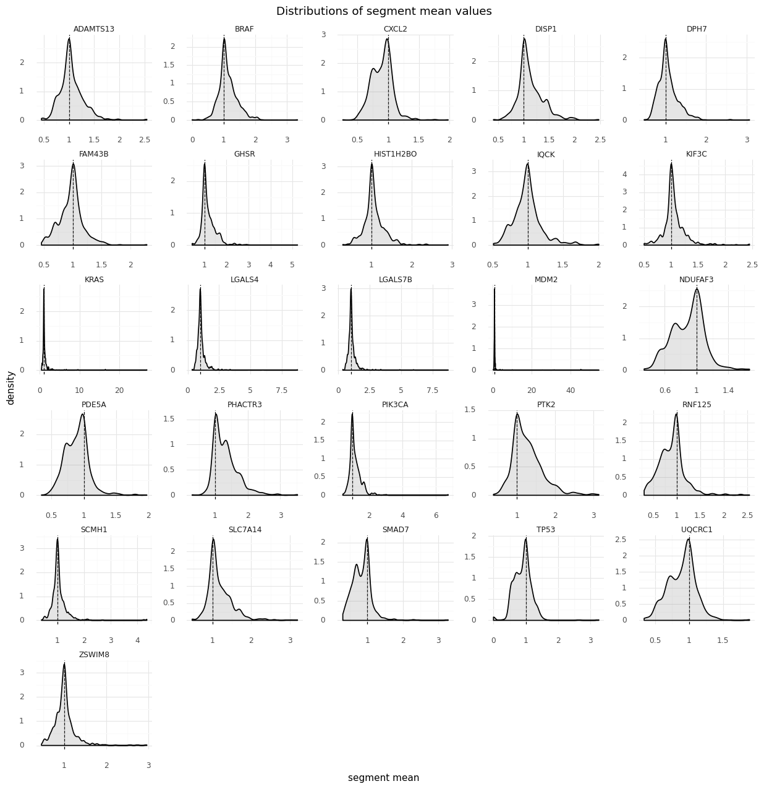
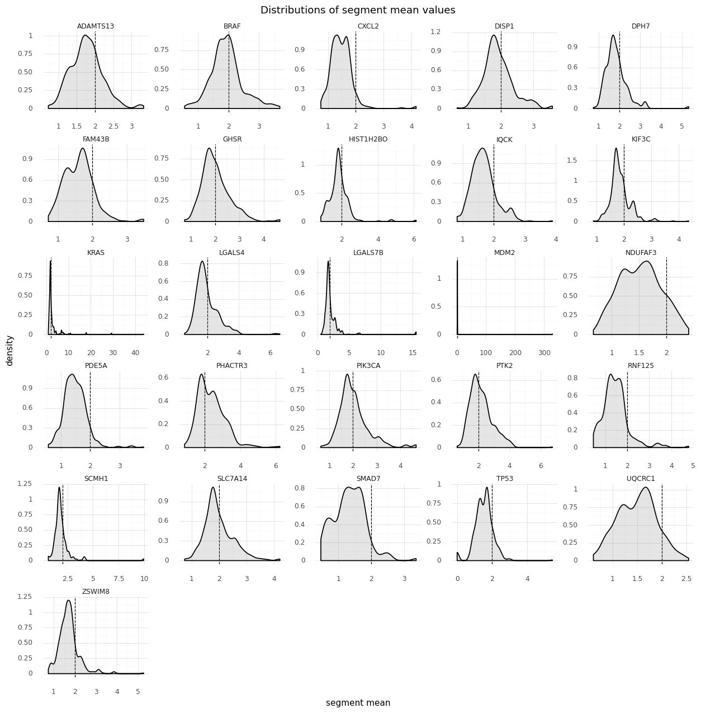
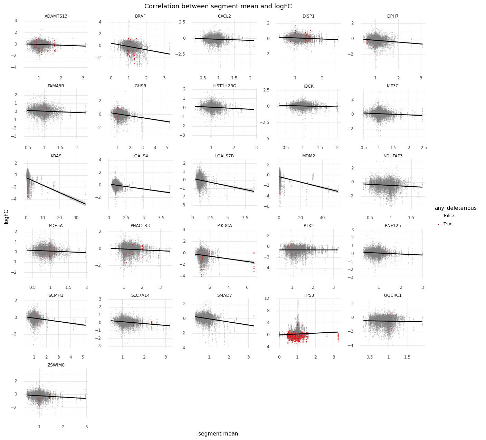
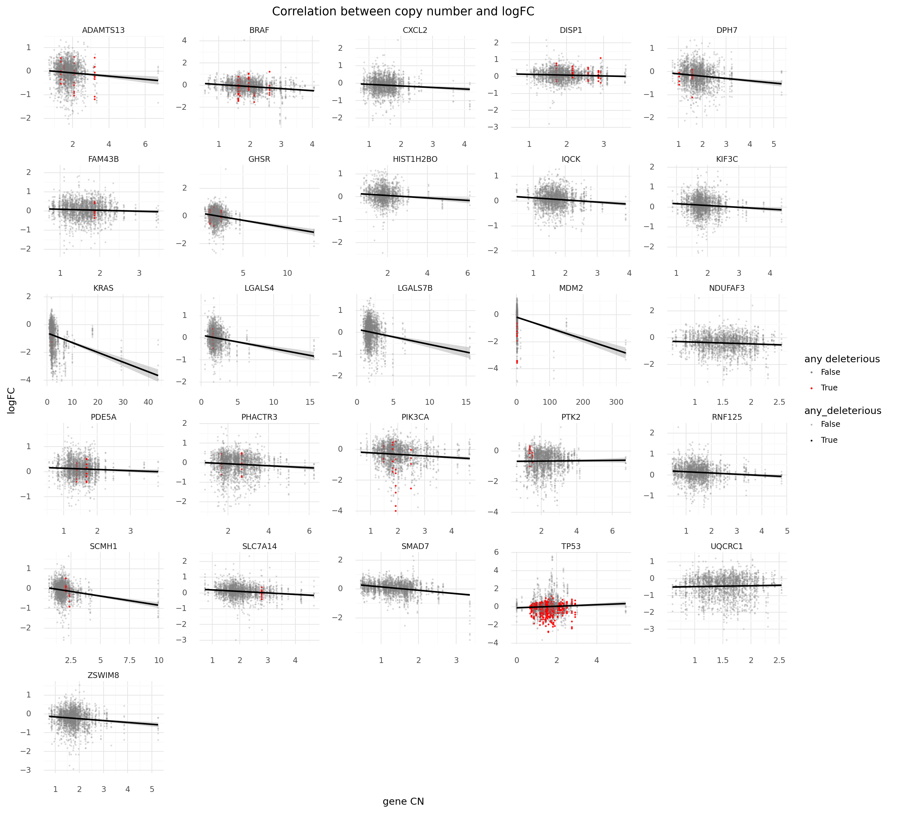
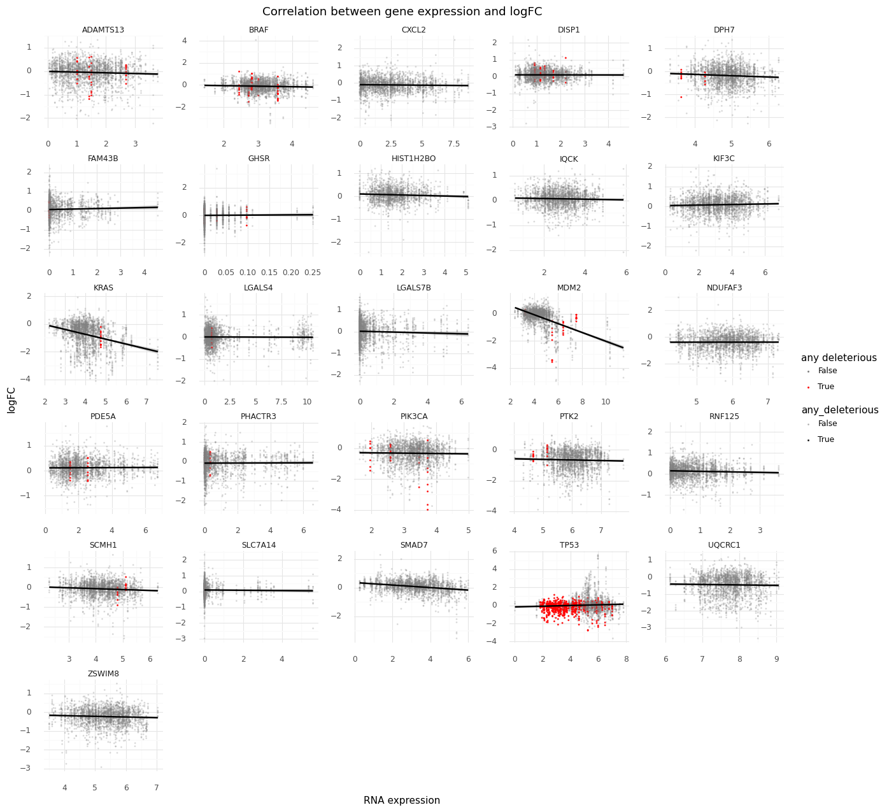
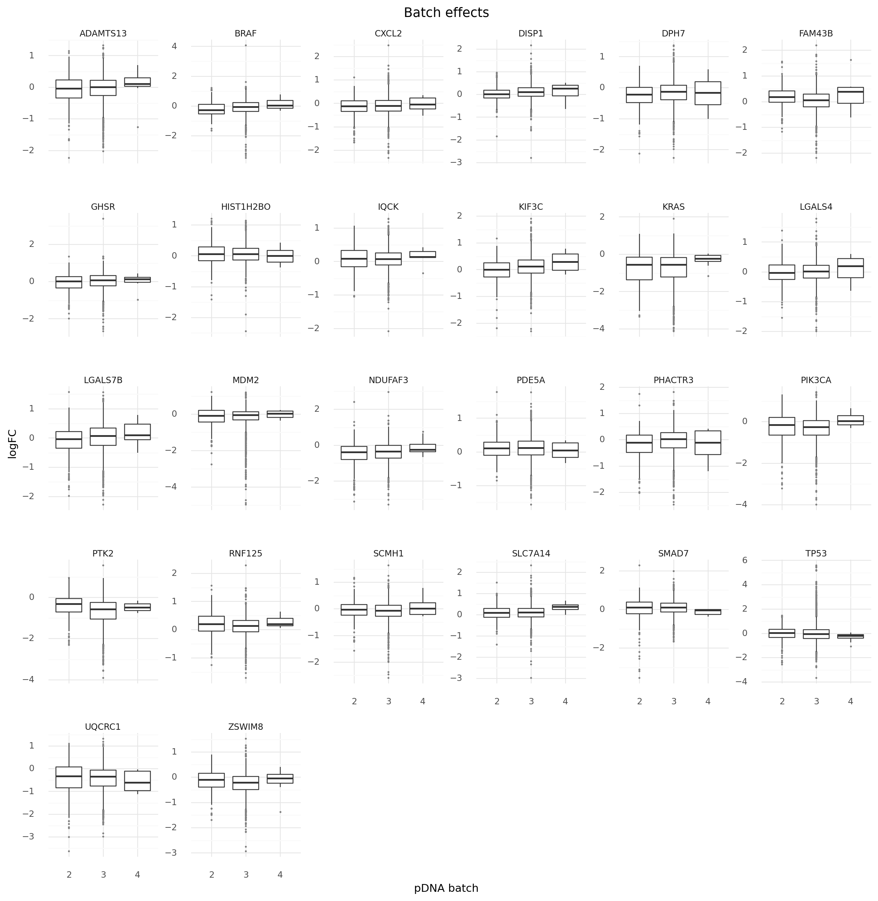
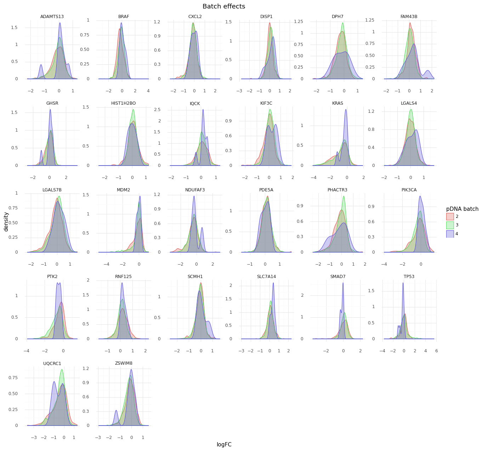
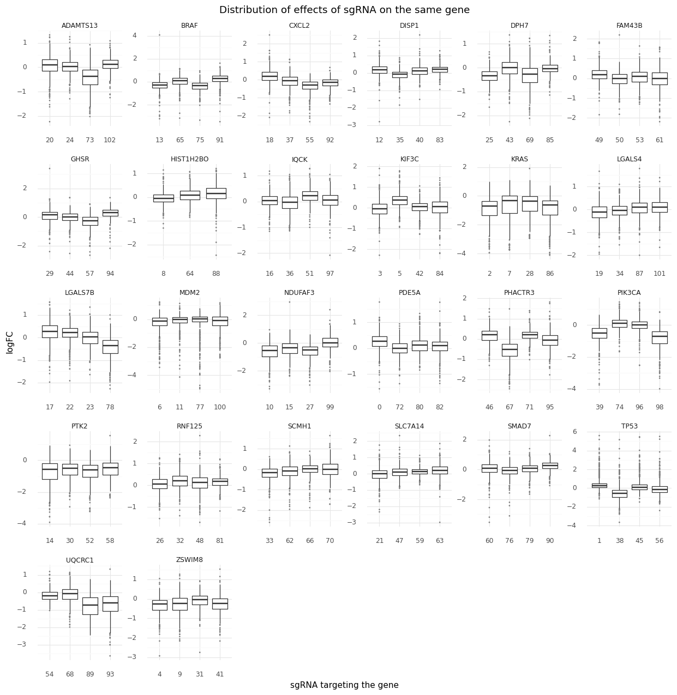

# Exporatory data analysis of the subset of data


```python
import pandas as pd
import numpy as np
import plotnine as gg
import seaborn as sns
import matplotlib.pyplot as plt
import matplotlib.colors as mcolors
import string
import warnings
from pathlib import Path

warnings.simplefilter(action="ignore", category=UserWarning)

gg.theme_set(gg.theme_minimal())

RANDOM_SEED = 927
np.random.seed(RANDOM_SEED)
```


```python
data_path = Path("../modeling_data/depmap_modeling_dataframe_subsample.csv")
data = pd.read_csv(data_path)
data.head(n=10)
```


<div>
<style scoped>
    .dataframe tbody tr th:only-of-type {
        vertical-align: middle;
    }

    .dataframe tbody tr th {
        vertical-align: top;
    }

    .dataframe thead th {
        text-align: right;
    }
</style>
<table border="1" class="dataframe">
  <thead>
    <tr style="text-align: right;">
      <th></th>
      <th>sgrna</th>
      <th>replicate_id</th>
      <th>lfc</th>
      <th>pdna_batch</th>
      <th>passes_qc</th>
      <th>depmap_id</th>
      <th>primary_or_metastasis</th>
      <th>lineage</th>
      <th>lineage_subtype</th>
      <th>kras_mutation</th>
      <th>...</th>
      <th>segment_mean</th>
      <th>copy_number</th>
      <th>n_muts</th>
      <th>any_deleterious</th>
      <th>variant_classification</th>
      <th>is_deleterious</th>
      <th>is_tcga_hotspot</th>
      <th>is_cosmic_hotspot</th>
      <th>mutated_at_guide_location</th>
      <th>rna_expr</th>
    </tr>
  </thead>
  <tbody>
    <tr>
      <th>0</th>
      <td>AAGAGGCCGGTCAAATTCAG</td>
      <td>143b-311cas9_repa_p6_batch3</td>
      <td>0.409139</td>
      <td>3</td>
      <td>True</td>
      <td>ACH-001001</td>
      <td>Primary</td>
      <td>bone</td>
      <td>osteosarcoma</td>
      <td>G12S</td>
      <td>...</td>
      <td>0.894624</td>
      <td>1.859125</td>
      <td>0</td>
      <td>False</td>
      <td>NaN</td>
      <td>NaN</td>
      <td>NaN</td>
      <td>NaN</td>
      <td>False</td>
      <td>1.275007</td>
    </tr>
    <tr>
      <th>1</th>
      <td>AATCAACCCACAGCTGCACA</td>
      <td>143b-311cas9_repa_p6_batch3</td>
      <td>0.387921</td>
      <td>3</td>
      <td>True</td>
      <td>ACH-001001</td>
      <td>Primary</td>
      <td>bone</td>
      <td>osteosarcoma</td>
      <td>G12S</td>
      <td>...</td>
      <td>1.329208</td>
      <td>2.512647</td>
      <td>1</td>
      <td>False</td>
      <td>missense_mutation</td>
      <td>FALSE</td>
      <td>TRUE</td>
      <td>TRUE</td>
      <td>False</td>
      <td>6.109570</td>
    </tr>
    <tr>
      <th>2</th>
      <td>AATTACTACTTGCTTCCTGT</td>
      <td>143b-311cas9_repa_p6_batch3</td>
      <td>-3.105034</td>
      <td>3</td>
      <td>True</td>
      <td>ACH-001001</td>
      <td>Primary</td>
      <td>bone</td>
      <td>osteosarcoma</td>
      <td>G12S</td>
      <td>...</td>
      <td>0.971364</td>
      <td>1.960694</td>
      <td>4</td>
      <td>False</td>
      <td>silent;silent;missense_mutation;missense_mutation</td>
      <td>FALSE;FALSE;FALSE;FALSE</td>
      <td>FALSE;FALSE;TRUE;TRUE</td>
      <td>FALSE;FALSE;TRUE;TRUE</td>
      <td>False</td>
      <td>8.166866</td>
    </tr>
    <tr>
      <th>3</th>
      <td>ACCTGTATGACGAAACCGTG</td>
      <td>143b-311cas9_repa_p6_batch3</td>
      <td>0.087322</td>
      <td>3</td>
      <td>True</td>
      <td>ACH-001001</td>
      <td>Primary</td>
      <td>bone</td>
      <td>osteosarcoma</td>
      <td>G12S</td>
      <td>...</td>
      <td>1.046162</td>
      <td>2.065029</td>
      <td>1</td>
      <td>False</td>
      <td>silent</td>
      <td>FALSE</td>
      <td>FALSE</td>
      <td>FALSE</td>
      <td>False</td>
      <td>2.080658</td>
    </tr>
    <tr>
      <th>4</th>
      <td>ACTCTGTTCCTTCATCTCCG</td>
      <td>143b-311cas9_repa_p6_batch3</td>
      <td>-0.210116</td>
      <td>3</td>
      <td>True</td>
      <td>ACH-001001</td>
      <td>Primary</td>
      <td>bone</td>
      <td>osteosarcoma</td>
      <td>G12S</td>
      <td>...</td>
      <td>1.143428</td>
      <td>2.209053</td>
      <td>0</td>
      <td>False</td>
      <td>NaN</td>
      <td>NaN</td>
      <td>NaN</td>
      <td>NaN</td>
      <td>False</td>
      <td>4.335569</td>
    </tr>
    <tr>
      <th>5</th>
      <td>ACTGCTGCGGGAATTCCAAG</td>
      <td>143b-311cas9_repa_p6_batch3</td>
      <td>0.539430</td>
      <td>3</td>
      <td>True</td>
      <td>ACH-001001</td>
      <td>Primary</td>
      <td>bone</td>
      <td>osteosarcoma</td>
      <td>G12S</td>
      <td>...</td>
      <td>1.046162</td>
      <td>2.065029</td>
      <td>1</td>
      <td>False</td>
      <td>silent</td>
      <td>FALSE</td>
      <td>FALSE</td>
      <td>FALSE</td>
      <td>False</td>
      <td>2.080658</td>
    </tr>
    <tr>
      <th>6</th>
      <td>AGACACTTATACTATGAAAG</td>
      <td>143b-311cas9_repa_p6_batch3</td>
      <td>-0.166730</td>
      <td>3</td>
      <td>True</td>
      <td>ACH-001001</td>
      <td>Primary</td>
      <td>bone</td>
      <td>osteosarcoma</td>
      <td>G12S</td>
      <td>...</td>
      <td>0.885059</td>
      <td>1.846840</td>
      <td>0</td>
      <td>False</td>
      <td>NaN</td>
      <td>NaN</td>
      <td>NaN</td>
      <td>NaN</td>
      <td>False</td>
      <td>3.880686</td>
    </tr>
    <tr>
      <th>7</th>
      <td>AGAGGAGTACAGTGCAATGA</td>
      <td>143b-311cas9_repa_p6_batch3</td>
      <td>-3.004429</td>
      <td>3</td>
      <td>True</td>
      <td>ACH-001001</td>
      <td>Primary</td>
      <td>bone</td>
      <td>osteosarcoma</td>
      <td>G12S</td>
      <td>...</td>
      <td>0.971364</td>
      <td>1.960694</td>
      <td>4</td>
      <td>False</td>
      <td>silent;silent;missense_mutation;missense_mutation</td>
      <td>FALSE;FALSE;FALSE;FALSE</td>
      <td>FALSE;FALSE;TRUE;TRUE</td>
      <td>FALSE;FALSE;TRUE;TRUE</td>
      <td>False</td>
      <td>8.166866</td>
    </tr>
    <tr>
      <th>8</th>
      <td>AGATAGAGTAACTCTCTTTG</td>
      <td>143b-311cas9_repa_p6_batch3</td>
      <td>0.045331</td>
      <td>3</td>
      <td>True</td>
      <td>ACH-001001</td>
      <td>Primary</td>
      <td>bone</td>
      <td>osteosarcoma</td>
      <td>G12S</td>
      <td>...</td>
      <td>1.085596</td>
      <td>2.122252</td>
      <td>0</td>
      <td>False</td>
      <td>NaN</td>
      <td>NaN</td>
      <td>NaN</td>
      <td>NaN</td>
      <td>False</td>
      <td>1.859970</td>
    </tr>
    <tr>
      <th>9</th>
      <td>AGTGCGGATGAGTTTCAGCG</td>
      <td>143b-311cas9_repa_p6_batch3</td>
      <td>0.331650</td>
      <td>3</td>
      <td>True</td>
      <td>ACH-001001</td>
      <td>Primary</td>
      <td>bone</td>
      <td>osteosarcoma</td>
      <td>G12S</td>
      <td>...</td>
      <td>1.143428</td>
      <td>2.209053</td>
      <td>0</td>
      <td>False</td>
      <td>NaN</td>
      <td>NaN</td>
      <td>NaN</td>
      <td>NaN</td>
      <td>False</td>
      <td>4.335569</td>
    </tr>
  </tbody>
</table>
<p>10 rows × 25 columns</p>
</div>


```python
def make_cat(df, col, ordered=False):
    df[col] = pd.Categorical(df[col], ordered=ordered)
    return df
```


```python
for col in [
    "pdna_batch",
    "sgrna",
    "depmap_id",
    "primary_or_metastasis",
    "lineage",
    "lineage_subtype",
    "kras_mutation",
]:
    data = make_cat(data, col)
```


```python
print(
    f" num data points: {data.shape[0]}\n",
    f"      num genes: {len(set(data.hugo_symbol))}\n",
    f"      num sgRNA: {len(set(data.sgrna))}\n",
    f"   num lineages: {len(set(data.lineage))}\n",
    f" num cell lines: {len(set(data.depmap_id))}",
)
```

     num data points: 166345
           num genes: 26
           num sgRNA: 103
        num lineages: 26
      num cell lines: 767


```python
data.columns
```


    Index(['sgrna', 'replicate_id', 'lfc', 'pdna_batch', 'passes_qc', 'depmap_id',
           'primary_or_metastasis', 'lineage', 'lineage_subtype', 'kras_mutation',
           'genome_alignment', 'n_alignments', 'hugo_symbol', 'chromosome',
           'chrom_pos', 'segment_mean', 'copy_number', 'n_muts', 'any_deleterious',
           'variant_classification', 'is_deleterious', 'is_tcga_hotspot',
           'is_cosmic_hotspot', 'mutated_at_guide_location', 'rna_expr'],
          dtype='object')


```python
(
    gg.ggplot(data, gg.aes(x="hugo_symbol", y="lfc", color="hugo_symbol"))
    + gg.geom_boxplot(outlier_size=0.1)
    + gg.scale_color_discrete(guide=False)
    + gg.theme(figure_size=(10, 5), axis_text_x=gg.element_text(angle=35, hjust=1))
)
```





    <ggplot: (8790666976247)>


```python
faceting_theme_dict = {
    "figure_size": (15, 15),
    "subplots_adjust": {"hspace": 0.4, "wspace": 0.3},
}

(
    gg.ggplot(data.sample(frac=0.2), gg.aes(x="lfc"))
    + gg.facet_wrap("hugo_symbol", ncol=5, scales="free")
    + gg.geom_vline(xintercept=0, linetype="--", size=0.5, color="black")
    + gg.geom_density(size=0.7, color="black", fill="gray", alpha=0.2)
    + gg.theme(**faceting_theme_dict)
    + gg.labs(x="logFC", y="density", title="Distributions of logFC")
)
```





    <ggplot: (8790666228258)>


```python
(
    gg.ggplot(data.sample(frac=0.2), gg.aes(x="segment_mean"))
    + gg.facet_wrap("hugo_symbol", ncol=5, scales="free")
    + gg.geom_vline(xintercept=1, linetype="--", size=0.5, color="black")
    + gg.geom_density(size=0.7, color="black", fill="gray", alpha=0.2)
    + gg.theme(**faceting_theme_dict)
    + gg.labs(
        x="segment mean", y="density", title="Distributions of segment mean values"
    )
)
```





    <ggplot: (8790666289701)>


```python
(
    gg.ggplot(data.sample(frac=0.2), gg.aes(x="segment_mean", y="lfc"))
    + gg.facet_wrap("hugo_symbol", ncol=5, scales="free")
    + gg.geom_point(color="darkcyan", alpha=0.4, size=0.1)
    + gg.geom_smooth(method="lm")
    + gg.theme(**faceting_theme_dict)
    + gg.labs(
        x="segment mean", y="logFC", title="Correlation between segment mean and logFC"
    )
)
```





    <ggplot: (8790655247839)>


```python
def plot_highlight_muts(df, x, y="lfc", x_label=None, y_label="logFC", title=""):
    """Scatter plot of data in `df` with the mutated samples highlighted."""
    if x_label == None:
        x_label = x

    return (
        gg.ggplot(df, gg.aes(x=x, y=y))
        + gg.facet_wrap("hugo_symbol", ncol=5, scales="free")
        + gg.geom_point(
            gg.aes(color="any_deleterious", alpha="any_deleterious"), size=0.2
        )
        + gg.geom_smooth(method="lm")
        + gg.scale_color_manual(values=["gray", "red"])
        + gg.scale_alpha_manual(values=[0.2, 0.8])
        + gg.theme(**faceting_theme_dict)
        + gg.labs(x=x_label, y=y_label, title=title,)
    )
```


```python
plot_highlight_muts(
    data,
    x="segment_mean",
    x_label="segment mean",
    title="Correlation between segment mean and logFC",
)
```





    <ggplot: (8790666903339)>


```python
plot_highlight_muts(
    data,
    x="rna_expr",
    x_label="RNA expression",
    title="Correlation between gene expression and logFC",
)
```





    <ggplot: (8790663409698)>


```python
(
    gg.ggplot(data, gg.aes(x="pdna_batch", y="lfc"))
    + gg.facet_wrap("hugo_symbol", nrow=5, scales="free_y")
    + gg.geom_boxplot(outlier_size=0.1, outlier_color="gray")
    + gg.theme(**faceting_theme_dict)
    + gg.labs(x="pDNA batch", y="logFC", title="Batch effects")
)
```





    <ggplot: (8790647726090)>


```python
(
    gg.ggplot(
        data.sample(frac=0.2), gg.aes(x="lfc", color="pdna_batch", fill="pdna_batch")
    )
    + gg.facet_wrap("hugo_symbol", nrow=5, scales="free")
    + gg.geom_density(alpha=0.3)
    + gg.theme(**faceting_theme_dict)
    + gg.labs(
        x="logFC",
        y="density",
        title="Batch effects",
        color="pDNA batch",
        fill="pDNA batch",
    )
)
```





    <ggplot: (8790647721307)>


```python
data["sgrna_idx"] = data["sgrna"].cat.codes

(
    gg.ggplot(data, gg.aes(x="factor(sgrna_idx)", y="lfc"))
    + gg.facet_wrap("hugo_symbol", nrow=5, scales="free")
    + gg.geom_boxplot(outlier_size=0.1, outlier_color="gray")
    + gg.theme(**faceting_theme_dict)
    + gg.labs(
        x="sgRNA targeting the gene",
        y="logFC",
        title="Distribution of effects of sgRNA on the same gene",
    )
)
```





    <ggplot: (8790655097998)>


```python
(
    gg.ggplot(data.sample(frac=0.5), gg.aes(x="hugo_symbol", y="lfc"))
    + gg.facet_wrap("lineage", ncol=2, scales="free_y")
    + gg.geom_boxplot(outlier_size=0.1)
    + gg.theme(
        figure_size=(15, 30),
        subplots_adjust={"hspace": 0.4, "wspace": 0.3},
        axis_text_x=gg.element_text(size=8, angle=35, hjust=1),
    )
)
```





    <ggplot: (8790655599330)>
