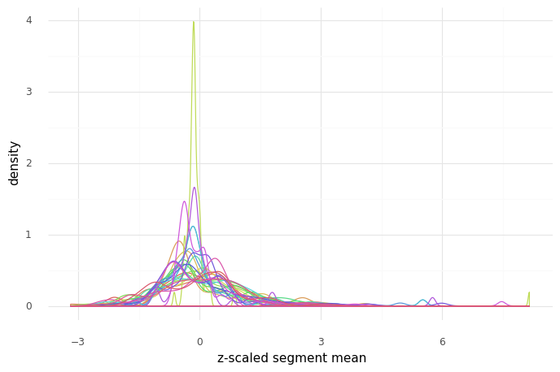
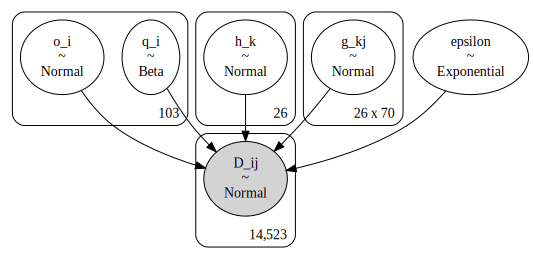
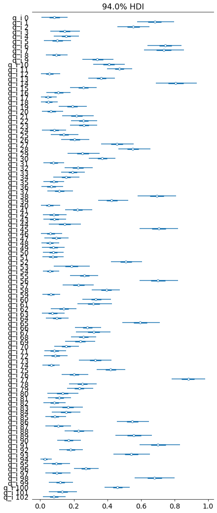
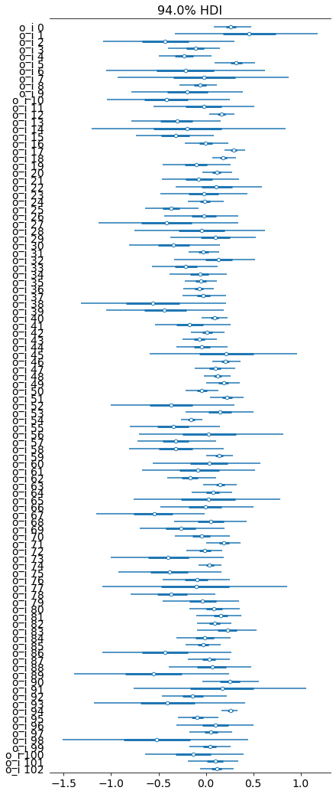
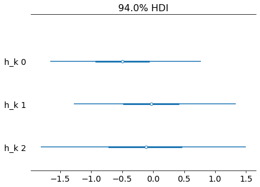
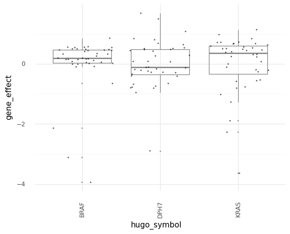
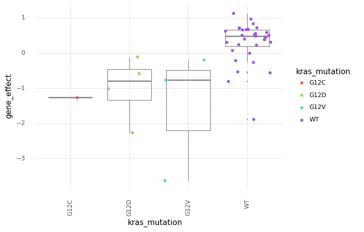
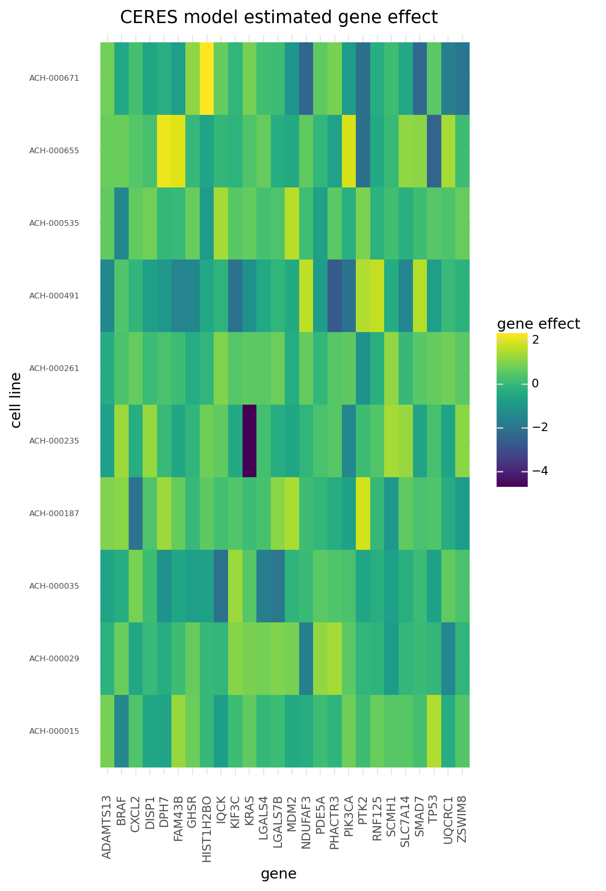
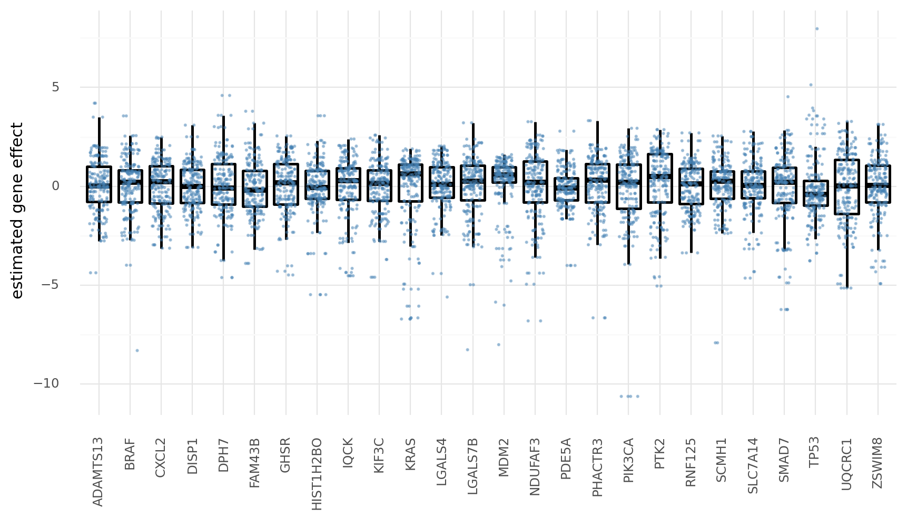
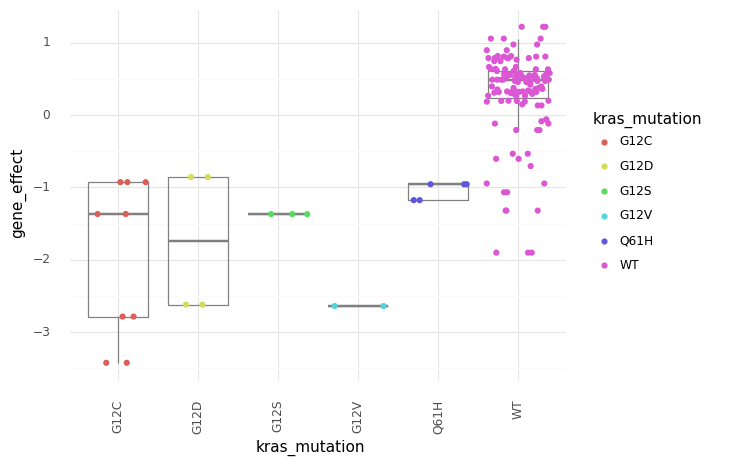

# Replicate the CERES model

## The CERES model

The following is the CERES model as desicrbed in ["Computational correction of copy number effect improves specificity of CRISPR–Cas9 essentiality screens in cancer cells"](https://www.nature.com/articles/ng.3984#Sec24) (Meyeres *et al*, 2017).


$
\quad D_{ij} = q_i \lgroup \sum_{k \in G_i} (h_k + g_{kj}) + \mathcal{f} (\sum_{l \in L_i} C_{lj}) \rgroup + o_i + \epsilon
$

where:

- $D_{ij}$: sgRNA $i$ depletion in cell line $j$
- $q_i$: "guide activity score... to mitigate the influence of low-quality reagents" (restricted $[0,1]$)
- $G_i$: the genes targeted by sgRNA $i$
- $h_k$: "shared" (non-cell-line-specific) effect of gene $k$
- $g_{kj}$: cell-line-specific effect in cell line $j$ and gene $k$
- $\mathcal{f}_j$: piecewise linear spine to model copy number effect
- $L_i$: target loci of sgRNA $i$
- $C_{lj}$: copy number of target locus $l$ in cell line $j$
- $o_i$: sgRNA-sepcific effect to account for noise in the measurement of sgRNA abundance in the reference pool
- $\epsilon$: normal error


```python
import pandas as pd
import numpy as np
import plotnine as gg
import pymc3 as pm
from theano import tensor as tt
import arviz as az
import seaborn as sns
import matplotlib.pyplot as plt
import matplotlib.colors as mcolors
import string
import warnings
from pathlib import Path
import pymc3_helpers as pmhelp

warnings.simplefilter(action="ignore", category=UserWarning)

gg.theme_set(gg.theme_minimal())

RANDOM_SEED = 847
np.random.seed(RANDOM_SEED)

pymc3_cache_dir = Path("pymc3_model_cache")
```

### Data preparation


```python
data_path = Path("../modeling_data/depmap_modeling_dataframe_subsample.csv")
data = pd.read_csv(data_path)

# print(data.hugo_symbol.unique())
SAMPLED_GENES = ["KRAS", "BRAF", "DPH7", "KIF3C", "SCMH1", "UQCRC1"]
SAMPLED_DEPMAPIDS = data["depmap_id"].unique()
SAMPLED_DEPMAPIDS = np.random.choice(SAMPLED_DEPMAPIDS, 70, replace=False)

data = data[~np.isnan(data.segment_mean)]
# data = data[data["hugo_symbol"].isin(SAMPLED_GENES)]
data = data[data["depmap_id"].isin(SAMPLED_DEPMAPIDS)]

data.head(n=5)
```


<div>
<style scoped>
    .dataframe tbody tr th:only-of-type {
        vertical-align: middle;
    }

    .dataframe tbody tr th {
        vertical-align: top;
    }

    .dataframe thead th {
        text-align: right;
    }
</style>
<table border="1" class="dataframe">
  <thead>
    <tr style="text-align: right;">
      <th></th>
      <th>sgrna</th>
      <th>replicate_id</th>
      <th>lfc</th>
      <th>pdna_batch</th>
      <th>passes_qc</th>
      <th>depmap_id</th>
      <th>primary_or_metastasis</th>
      <th>lineage</th>
      <th>lineage_subtype</th>
      <th>kras_mutation</th>
      <th>...</th>
      <th>segment_mean</th>
      <th>copy_number</th>
      <th>n_muts</th>
      <th>any_deleterious</th>
      <th>variant_classification</th>
      <th>is_deleterious</th>
      <th>is_tcga_hotspot</th>
      <th>is_cosmic_hotspot</th>
      <th>mutated_at_guide_location</th>
      <th>rna_expr</th>
    </tr>
  </thead>
  <tbody>
    <tr>
      <th>309</th>
      <td>AAGAGGCCGGTCAAATTCAG</td>
      <td>253j-311cas9_repa_p5_batch3</td>
      <td>0.819737</td>
      <td>3</td>
      <td>True</td>
      <td>ACH-000011</td>
      <td>Metastasis</td>
      <td>urinary_tract</td>
      <td>bladder_carcinoma</td>
      <td>WT</td>
      <td>...</td>
      <td>0.814602</td>
      <td>1.758813</td>
      <td>0</td>
      <td>False</td>
      <td>NaN</td>
      <td>NaN</td>
      <td>NaN</td>
      <td>NaN</td>
      <td>False</td>
      <td>0.799087</td>
    </tr>
    <tr>
      <th>310</th>
      <td>AATCAACCCACAGCTGCACA</td>
      <td>253j-311cas9_repa_p5_batch3</td>
      <td>3.432823</td>
      <td>3</td>
      <td>True</td>
      <td>ACH-000011</td>
      <td>Metastasis</td>
      <td>urinary_tract</td>
      <td>bladder_carcinoma</td>
      <td>WT</td>
      <td>...</td>
      <td>1.122527</td>
      <td>2.177280</td>
      <td>0</td>
      <td>False</td>
      <td>NaN</td>
      <td>NaN</td>
      <td>NaN</td>
      <td>NaN</td>
      <td>False</td>
      <td>5.629357</td>
    </tr>
    <tr>
      <th>311</th>
      <td>AATTACTACTTGCTTCCTGT</td>
      <td>253j-311cas9_repa_p5_batch3</td>
      <td>-0.020514</td>
      <td>3</td>
      <td>True</td>
      <td>ACH-000011</td>
      <td>Metastasis</td>
      <td>urinary_tract</td>
      <td>bladder_carcinoma</td>
      <td>WT</td>
      <td>...</td>
      <td>1.160464</td>
      <td>2.235293</td>
      <td>0</td>
      <td>False</td>
      <td>NaN</td>
      <td>NaN</td>
      <td>NaN</td>
      <td>NaN</td>
      <td>False</td>
      <td>2.903038</td>
    </tr>
    <tr>
      <th>312</th>
      <td>ACCTGTATGACGAAACCGTG</td>
      <td>253j-311cas9_repa_p5_batch3</td>
      <td>-0.936162</td>
      <td>3</td>
      <td>True</td>
      <td>ACH-000011</td>
      <td>Metastasis</td>
      <td>urinary_tract</td>
      <td>bladder_carcinoma</td>
      <td>WT</td>
      <td>...</td>
      <td>1.159818</td>
      <td>2.234293</td>
      <td>0</td>
      <td>False</td>
      <td>NaN</td>
      <td>NaN</td>
      <td>NaN</td>
      <td>NaN</td>
      <td>False</td>
      <td>3.354734</td>
    </tr>
    <tr>
      <th>313</th>
      <td>ACTCTGTTCCTTCATCTCCG</td>
      <td>253j-311cas9_repa_p5_batch3</td>
      <td>-0.231509</td>
      <td>3</td>
      <td>True</td>
      <td>ACH-000011</td>
      <td>Metastasis</td>
      <td>urinary_tract</td>
      <td>bladder_carcinoma</td>
      <td>WT</td>
      <td>...</td>
      <td>1.158529</td>
      <td>2.232297</td>
      <td>0</td>
      <td>False</td>
      <td>NaN</td>
      <td>NaN</td>
      <td>NaN</td>
      <td>NaN</td>
      <td>False</td>
      <td>5.207112</td>
    </tr>
  </tbody>
</table>
<p>5 rows × 25 columns</p>
</div>


```python
print(f"testing with {data.shape[0]} data points")
```

    testing with 14523 data points


```python
def make_cat(df, col, ordered=True):
    """Make a column of a data frame into categorical."""
    df[col] = pd.Categorical(df[col], categories=df[col].unique(), ordered=ordered)
    return df


cat_cols = [
    "sgrna",
    "replicate_id",
    "pdna_batch",
    "depmap_id",
    "lineage",
    "kras_mutation",
    "hugo_symbol",
    "chromosome",
]

for col in cat_cols:
    data = make_cat(data, col)
```


```python
def count_unique(df, col):
    """Count the number of unique values in a column."""
    return len(df[col].unique())


def get_indices(df, col):
    """Get a list of the indices for a column."""
    return df[col].cat.codes.to_list()


num_sgrnas = count_unique(data, "sgrna")
num_genes = count_unique(data, "hugo_symbol")
num_cell_lines = count_unique(data, "depmap_id")

sgrna_idx = get_indices(data, "sgrna")
gene_idx = get_indices(data, "hugo_symbol")
cell_line_idx = get_indices(data, "depmap_id")
```


```python
data["segment_mean_z"] = data["segment_mean"].apply(lambda x: np.min((x, 10)))
data["segment_mean_z"] = data.groupby("hugo_symbol")["segment_mean_z"].apply(
    lambda x: (x - np.mean(x)) / np.std(x)
)
```


```python
(
    gg.ggplot(data, gg.aes(x="segment_mean_z"))
    + gg.geom_density(gg.aes(color="hugo_symbol"), size=0.5)
    + gg.scale_color_discrete(guide=False)
    + gg.theme(figure_size=(8, 5))
    + gg.labs(x="z-scaled segment mean", y="density")
)
```


    

    


    <ggplot: (8732286816895)>


### Model 1.

Below is the model that will be fit with PyMC3 as the mimic of CERES.

$
\quad D_{ij} \sim \mathcal{N}(\mu_{ij}, \epsilon) \\
\quad \mu_{ij} = q_i \lgroup h_k + g_{kj} \beta_{ij} C_{ij} \rgroup + o_i \\
\qquad q_i \sim \text{Beta}(2, 2) \\
\qquad h_k \sim \mathcal{N}(0, 1) \\
\qquad g_{kj} \sim \mathcal{N}(0, 1) \\
\qquad \beta_{ij} \sim \mathcal{N}(-0.2, 0.5) \\
\qquad o_i \sim \mathcal{N}(0, 1) \\
\quad \epsilon \sim \text{Exp}(1)
$


```python
with pm.Model() as ceres_m1:
    # Priors
    q_i = pm.Beta("q_i", alpha=2, beta=2, shape=num_sgrnas)
    h_k = pm.Normal("h_k", 0, 1, shape=num_genes)
    g_kj = pm.Normal("g_kj", 0, 1, shape=(num_genes, num_cell_lines))
    #     beta_ij = pm.Normal("beta_ij", -0.2, 0.5, shape=(num_sgrnas, num_cell_lines))
    o_i = pm.Normal("o_i", 0, 1, shape=num_sgrnas)

    # Model
    mu_ij = (
        q_i[sgrna_idx] * (h_k[gene_idx] + g_kj[gene_idx, cell_line_idx])
        + o_i[sgrna_idx]
    )
    epsilon = pm.Exponential("epsilon", 1)

    # Likelihood
    D_ij = pm.Normal("D_ij", mu_ij, epsilon, observed=data.lfc)
```

    /home/jc604/.conda/envs/speclet/lib/python3.8/site-packages/theano/tensor/subtensor.py:2197: FutureWarning: Using a non-tuple sequence for multidimensional indexing is deprecated; use `arr[tuple(seq)]` instead of `arr[seq]`. In the future this will be interpreted as an array index, `arr[np.array(seq)]`, which will result either in an error or a different result.


```python
pm.model_to_graphviz(ceres_m1)
```


    

    


```python
%%time

ceres_m1_cachedir = pymc3_cache_dir / "ceres_m1"

ceres_m1_samples = pmhelp.pymc3_sampling_procedure(
    model=ceres_m1,
    num_mcmc=2000,
    tune=1000,
    chains=2,
    prior_check_samples=1000,
    ppc_samples=1000,
    random_seed=RANDOM_SEED,
    cache_dir=ceres_m1_cachedir,
    force=False,
)
```

    Loading cached trace and posterior sample...
    CPU times: user 592 ms, sys: 315 ms, total: 906 ms
    Wall time: 917 ms


```python
az_ceres_m1 = az.from_pymc3(
    trace=ceres_m1_samples["trace"],
    model=ceres_m1,
    prior=ceres_m1_samples["prior_predictive"],
    posterior_predictive=ceres_m1_samples["posterior_predictive"],
)
```

    arviz.data.io_pymc3 - WARNING - posterior predictive variable D_ij's shape not compatible with number of chains and draws. This can mean that some draws or even whole chains are not represented.


```python
az.plot_forest(az_ceres_m1, var_names="q_i", combined=True)
plt.show()
```


    

    


```python
az.plot_forest(az_ceres_m1, var_names="o_i", combined=True)
plt.show()
```


    

    


```python
az.plot_forest(az_ceres_m1, var_names="h_k", combined=True)
plt.show()
```


    

    


```python
gene_effect_post = ceres_m1_samples["trace"].get_values("g_kj")
gene_effect_post.shape
```


    (4000, 26, 70)


```python
gene_effect_mean = gene_effect_post.mean(axis=0)
gene_effect_mean.shape
```


    (26, 70)


```python
data["hugo_symbol"].cat.categories
```


    Index(['PDE5A', 'TP53', 'KRAS', 'KIF3C', 'ZSWIM8', 'MDM2', 'HIST1H2BO',
           'NDUFAF3', 'DISP1', 'BRAF', 'PTK2', 'IQCK', 'LGALS7B', 'CXCL2',
           'LGALS4', 'ADAMTS13', 'SLC7A14', 'DPH7', 'RNF125', 'GHSR', 'SCMH1',
           'PIK3CA', 'PHACTR3', 'FAM43B', 'UQCRC1', 'SMAD7'],
          dtype='object')


```python
gene_effect_post_df = (
    pd.DataFrame(gene_effect_mean)
    .reset_index()
    .rename(columns={"index": "gene_idx"})
    .melt(id_vars="gene_idx", var_name="cell_line_idx", value_name="gene_effect")
    .assign(
        hugo_symbol=lambda d: [
            data["hugo_symbol"].values.categories[i] for i in d["gene_idx"].values
        ],
        depmap_id=lambda d: [
            data["depmap_id"].values.categories[i] for i in d["cell_line_idx"].values
        ],
    )
)

cols = ["depmap_id", "kras_mutation", "is_deleterious"]
mutation_info = data[cols].drop_duplicates()
mutation_info[cols[:-1]] = mutation_info[cols[:-1]].astype("str")

gene_effect_post_df = gene_effect_post_df.merge(
    mutation_info, how="left", on=["depmap_id"]
)

gene_effect_post_df.head(n=10)
```


<div>
<style scoped>
    .dataframe tbody tr th:only-of-type {
        vertical-align: middle;
    }

    .dataframe tbody tr th {
        vertical-align: top;
    }

    .dataframe thead th {
        text-align: right;
    }
</style>
<table border="1" class="dataframe">
  <thead>
    <tr style="text-align: right;">
      <th></th>
      <th>gene_idx</th>
      <th>cell_line_idx</th>
      <th>gene_effect</th>
      <th>hugo_symbol</th>
      <th>depmap_id</th>
      <th>kras_mutation</th>
      <th>is_deleterious</th>
    </tr>
  </thead>
  <tbody>
    <tr>
      <th>0</th>
      <td>0</td>
      <td>0</td>
      <td>1.040254</td>
      <td>PDE5A</td>
      <td>ACH-000011</td>
      <td>WT</td>
      <td>NaN</td>
    </tr>
    <tr>
      <th>1</th>
      <td>0</td>
      <td>0</td>
      <td>1.040254</td>
      <td>PDE5A</td>
      <td>ACH-000011</td>
      <td>WT</td>
      <td>FALSE</td>
    </tr>
    <tr>
      <th>2</th>
      <td>1</td>
      <td>0</td>
      <td>3.376785</td>
      <td>TP53</td>
      <td>ACH-000011</td>
      <td>WT</td>
      <td>NaN</td>
    </tr>
    <tr>
      <th>3</th>
      <td>1</td>
      <td>0</td>
      <td>3.376785</td>
      <td>TP53</td>
      <td>ACH-000011</td>
      <td>WT</td>
      <td>FALSE</td>
    </tr>
    <tr>
      <th>4</th>
      <td>2</td>
      <td>0</td>
      <td>0.974897</td>
      <td>KRAS</td>
      <td>ACH-000011</td>
      <td>WT</td>
      <td>NaN</td>
    </tr>
    <tr>
      <th>5</th>
      <td>2</td>
      <td>0</td>
      <td>0.974897</td>
      <td>KRAS</td>
      <td>ACH-000011</td>
      <td>WT</td>
      <td>FALSE</td>
    </tr>
    <tr>
      <th>6</th>
      <td>3</td>
      <td>0</td>
      <td>-0.649296</td>
      <td>KIF3C</td>
      <td>ACH-000011</td>
      <td>WT</td>
      <td>NaN</td>
    </tr>
    <tr>
      <th>7</th>
      <td>3</td>
      <td>0</td>
      <td>-0.649296</td>
      <td>KIF3C</td>
      <td>ACH-000011</td>
      <td>WT</td>
      <td>FALSE</td>
    </tr>
    <tr>
      <th>8</th>
      <td>4</td>
      <td>0</td>
      <td>0.054926</td>
      <td>ZSWIM8</td>
      <td>ACH-000011</td>
      <td>WT</td>
      <td>NaN</td>
    </tr>
    <tr>
      <th>9</th>
      <td>4</td>
      <td>0</td>
      <td>0.054926</td>
      <td>ZSWIM8</td>
      <td>ACH-000011</td>
      <td>WT</td>
      <td>FALSE</td>
    </tr>
  </tbody>
</table>
</div>


```python
data.is_deleterious.unique()
```


    array([nan, 'FALSE', 'FALSE;FALSE', 'TRUE', 'FALSE;TRUE;FALSE',
           'FALSE;FALSE;FALSE', 'TRUE;FALSE', 'FALSE;TRUE'], dtype=object)


```python
(
    gg.ggplot(gene_effect_post_df, gg.aes(x="hugo_symbol", y="depmap_id"))
    + gg.geom_tile(gg.aes(fill="gene_effect"))
    + gg.theme(
        figure_size=(5, 10),
        axis_text_x=gg.element_text(angle=90),
        axis_text_y=gg.element_text(size=6),
    )
    + gg.labs(
        x="gene",
        y="cell line",
        fill="gene effect",
        title="CERES model estimated gene effect",
    )
)
```


    

    


    <ggplot: (8732273703665)>


```python
(
    gg.ggplot(gene_effect_post_df, gg.aes(x="hugo_symbol", y="gene_effect"))
    + gg.geom_boxplot(alpha=0, color="black", outlier_alpha=0, size=1)
    + gg.geom_jitter(alpha=0.4, size=0.3, height=0, width=0.3, color="steelblue")
    + gg.theme(axis_text_x=gg.element_text(angle=90, hjust=0.5, vjust=1), figure_size=(10, 5))
    + gg.labs(x=None, y="estimated gene effect")
)
```


    

    


    <ggplot: (8732273699615)>


```python
(
    gg.ggplot(gene_effect_post_df, gg.aes(x="gene_effect"))
    + gg.facet_wrap("hugo_symbol", ncol=4, scales="free")
    + gg.geom_density(
        gg.aes(color="hugo_symbol", fill="hugo_symbol"), alpha=0.2, size=0.3
    )
    + gg.geom_rug(gg.aes(color="hugo_symbol"))
    + gg.theme(figure_size=(10, 16), legend_position="none", subplots_adjust = {"hspace": 0.4, "wspace": 0.3})
    + gg.labs(x="estimated gene effect per cell line", y="denisty")
)
```


    

    


    <ggplot: (8732273461836)>


```python
(
    gg.ggplot(gene_effect_post_df, gg.aes(x="depmap_id", y="gene_effect"))
    + gg.geom_jitter(alpha=0.3, size=0.6, height=0, width=0, color="steelblue")
    + gg.geom_boxplot(alpha=0, color="black", outlier_alpha=0)
    + gg.theme(
        axis_text_x=gg.element_text(angle=90, hjust=0.5, vjust=1), figure_size=(10, 5)
    )
    + gg.labs(x=None, y="estimated gene effect")
)
```


    

    


    <ggplot: (8732275656304)>


```python
kras_gene_effect = gene_effect_post_df[
    gene_effect_post_df.hugo_symbol == "KRAS"
].reset_index(drop=True)

(
    gg.ggplot(kras_gene_effect, gg.aes(x="kras_mutation", y="gene_effect"))
    + gg.geom_boxplot(alpha=0, color="gray", outlier_alpha=0)
    + gg.geom_jitter(gg.aes(color="kras_mutation"), width=0.4, height=0)
    + gg.theme(axis_text_x=gg.element_text(angle=90, hjust=0.5, vjust=1))
)
```


    

    


    <ggplot: (8732273613972)>


```python

```
