# Replicate the CERES model

## The CERES model

The following is the CERES model as desicrbed in ["Computational correction of copy number effect improves specificity of CRISPR–Cas9 essentiality screens in cancer cells"](https://www.nature.com/articles/ng.3984#Sec24) (Meyeres *et al*, 2017).

$
\quad D_{ij} = q_i \lgroup \sum_{k \in G_i} (h_k + g_{kj}) + \mathcal{f} (\sum_{l \in L_i} C_{lj}) \rgroup + o_i + \epsilon
$

where:

- $D_{ij}$: sgRNA $i$ depletion in cell line $j$
- $q_i$: "guide activity score... to mitigate the influence of low-quality reagents" (restricted $[0,1]$)
- $G_i$: the genes targeted by sgRNA $i$
- $h_k$: "shared" (non-cell-line-specific) effect of gene $k$
- $g_{kj}$: cell-line-specific effect in cell line $j$ and gene $k$
- $\mathcal{f}_j$: piecewise linear spine to model copy number effect
- $L_i$: target loci of sgRNA $i$
- $C_{lj}$: copy number of target locus $l$ in cell line $j$
- $o_i$: sgRNA-sepcific effect to account for noise in the measurement of sgRNA abundance in the reference pool
- $\epsilon$: normal error

### Notebook goal

Here I will build three models: (1) without a CN covariate, (2) with a standard linear covariate for copy number, and (3) with a spline function for the CNA covariate.
In this notebook, the models will be run with a subsample of the data, but they will eventually be turned into Python scripts to run on the full data set.

### Set-up

```python
import re
import string
import warnings
from pathlib import Path
from time import time

import arviz as az
import matplotlib.colors as mcolors
import matplotlib.pyplot as plt
import numpy as np
import pandas as pd
import plotnine as gg
import pymc3 as pm
import pymc3_helpers as pmhelp
import seaborn as sns
from theano import tensor as tt

notebook_tic = time()
warnings.simplefilter(action="ignore", category=UserWarning)

gg.theme_set(gg.theme_minimal())

%config InlineBackend.figure_format = 'retina'

RANDOM_SEED = 847
np.random.seed(RANDOM_SEED)

pymc3_cache_dir = Path("pymc3_model_cache")
```

### Data preparation

```python
data_path = Path("../modeling_data/depmap_modeling_dataframe_subsample.csv")
data = pd.read_csv(data_path)
data.head(n=7)
```

<div>
<style scoped>
    .dataframe tbody tr th:only-of-type {
        vertical-align: middle;
    }

    .dataframe tbody tr th {
        vertical-align: top;
    }

    .dataframe thead th {
        text-align: right;
    }
</style>
<table border="1" class="dataframe">
  <thead>
    <tr style="text-align: right;">
      <th></th>
      <th>sgrna</th>
      <th>replicate_id</th>
      <th>lfc</th>
      <th>pdna_batch</th>
      <th>passes_qc</th>
      <th>depmap_id</th>
      <th>primary_or_metastasis</th>
      <th>lineage</th>
      <th>lineage_subtype</th>
      <th>kras_mutation</th>
      <th>...</th>
      <th>log2_gene_cn_p1</th>
      <th>gene_cn</th>
      <th>n_muts</th>
      <th>any_deleterious</th>
      <th>variant_classification</th>
      <th>is_deleterious</th>
      <th>is_tcga_hotspot</th>
      <th>is_cosmic_hotspot</th>
      <th>mutated_at_guide_location</th>
      <th>rna_expr</th>
    </tr>
  </thead>
  <tbody>
    <tr>
      <th>0</th>
      <td>AAGAGGCCGGTCAAATTCAG</td>
      <td>42-mg-ba-311cas9_repa_p6_batch3</td>
      <td>-0.405499</td>
      <td>3</td>
      <td>True</td>
      <td>ACH-000323</td>
      <td>Primary</td>
      <td>central_nervous_system</td>
      <td>glioma</td>
      <td>WT</td>
      <td>...</td>
      <td>0.845287</td>
      <td>1.328646</td>
      <td>0</td>
      <td>False</td>
      <td>NaN</td>
      <td>NaN</td>
      <td>NaN</td>
      <td>NaN</td>
      <td>False</td>
      <td>1.263034</td>
    </tr>
    <tr>
      <th>1</th>
      <td>AATCAACCCACAGCTGCACA</td>
      <td>42-mg-ba-311cas9_repa_p6_batch3</td>
      <td>-0.133541</td>
      <td>3</td>
      <td>True</td>
      <td>ACH-000323</td>
      <td>Primary</td>
      <td>central_nervous_system</td>
      <td>glioma</td>
      <td>WT</td>
      <td>...</td>
      <td>0.827398</td>
      <td>1.287359</td>
      <td>2</td>
      <td>False</td>
      <td>missense_mutation;missense_mutation</td>
      <td>FALSE;FALSE</td>
      <td>TRUE;TRUE</td>
      <td>TRUE;TRUE</td>
      <td>False</td>
      <td>5.220330</td>
    </tr>
    <tr>
      <th>2</th>
      <td>AATTACTACTTGCTTCCTGT</td>
      <td>42-mg-ba-311cas9_repa_p6_batch3</td>
      <td>-0.491495</td>
      <td>3</td>
      <td>True</td>
      <td>ACH-000323</td>
      <td>Primary</td>
      <td>central_nervous_system</td>
      <td>glioma</td>
      <td>WT</td>
      <td>...</td>
      <td>0.879280</td>
      <td>1.409165</td>
      <td>0</td>
      <td>False</td>
      <td>NaN</td>
      <td>NaN</td>
      <td>NaN</td>
      <td>NaN</td>
      <td>False</td>
      <td>3.008989</td>
    </tr>
    <tr>
      <th>3</th>
      <td>ACCTGTATGACGAAACCGTG</td>
      <td>42-mg-ba-311cas9_repa_p6_batch3</td>
      <td>-0.015850</td>
      <td>3</td>
      <td>True</td>
      <td>ACH-000323</td>
      <td>Primary</td>
      <td>central_nervous_system</td>
      <td>glioma</td>
      <td>WT</td>
      <td>...</td>
      <td>0.818549</td>
      <td>1.267208</td>
      <td>0</td>
      <td>False</td>
      <td>NaN</td>
      <td>NaN</td>
      <td>NaN</td>
      <td>NaN</td>
      <td>False</td>
      <td>4.083213</td>
    </tr>
    <tr>
      <th>4</th>
      <td>ACTCTGTTCCTTCATCTCCG</td>
      <td>42-mg-ba-311cas9_repa_p6_batch3</td>
      <td>-0.530277</td>
      <td>3</td>
      <td>True</td>
      <td>ACH-000323</td>
      <td>Primary</td>
      <td>central_nervous_system</td>
      <td>glioma</td>
      <td>WT</td>
      <td>...</td>
      <td>0.990378</td>
      <td>1.692253</td>
      <td>0</td>
      <td>False</td>
      <td>NaN</td>
      <td>NaN</td>
      <td>NaN</td>
      <td>NaN</td>
      <td>False</td>
      <td>5.822730</td>
    </tr>
    <tr>
      <th>5</th>
      <td>ACTGCTGCGGGAATTCCAAG</td>
      <td>42-mg-ba-311cas9_repa_p6_batch3</td>
      <td>0.778827</td>
      <td>3</td>
      <td>True</td>
      <td>ACH-000323</td>
      <td>Primary</td>
      <td>central_nervous_system</td>
      <td>glioma</td>
      <td>WT</td>
      <td>...</td>
      <td>0.818549</td>
      <td>1.267208</td>
      <td>0</td>
      <td>False</td>
      <td>NaN</td>
      <td>NaN</td>
      <td>NaN</td>
      <td>NaN</td>
      <td>False</td>
      <td>4.083213</td>
    </tr>
    <tr>
      <th>6</th>
      <td>AGACACTTATACTATGAAAG</td>
      <td>42-mg-ba-311cas9_repa_p6_batch3</td>
      <td>0.035950</td>
      <td>3</td>
      <td>True</td>
      <td>ACH-000323</td>
      <td>Primary</td>
      <td>central_nervous_system</td>
      <td>glioma</td>
      <td>WT</td>
      <td>...</td>
      <td>0.872323</td>
      <td>1.392463</td>
      <td>0</td>
      <td>False</td>
      <td>NaN</td>
      <td>NaN</td>
      <td>NaN</td>
      <td>NaN</td>
      <td>False</td>
      <td>3.701549</td>
    </tr>
  </tbody>
</table>
<p>7 rows × 27 columns</p>
</div>

```python
np.random.seed(RANDOM_SEED)
SAMPLED_GENES = data["hugo_symbol"].unique()
SAMPLED_CELL_LINES = np.random.choice(data["depmap_id"].unique(), 100)
data = data[data["hugo_symbol"].isin(SAMPLED_GENES)]
data = data[data["depmap_id"].isin(SAMPLED_CELL_LINES)]
```

```python
print(f"testing with {data.shape[0]} data points")
```

    testing with 19982 data points

```python
def make_cat(df, col, ordered=True):
    """Make a column of a data frame into categorical."""
    df[col] = pd.Categorical(df[col], categories=df[col].unique(), ordered=ordered)
    return df


cat_cols = [
    "sgrna",
    "replicate_id",
    "pdna_batch",
    "depmap_id",
    "lineage",
    "kras_mutation",
    "hugo_symbol",
    "chromosome",
]

for col in cat_cols:
    data = make_cat(data, col)
```

```python
def count_unique(df, col):
    """Count the number of unique values in a column."""
    return len(df[col].unique())


def get_indices(df, col):
    """Get a list of the indices for a column."""
    return df[col].cat.codes.to_numpy()


num_sgrnas = count_unique(data, "sgrna")
num_genes = count_unique(data, "hugo_symbol")
num_cell_lines = count_unique(data, "depmap_id")

sgrna_idx = get_indices(data, "sgrna")
gene_idx = get_indices(data, "hugo_symbol")
cell_line_idx = get_indices(data, "depmap_id")
```

```python
data["gene_cn_z"] = data["gene_cn"].apply(lambda x: np.min((x, 10)))
data["gene_cn_z"] = data.groupby("hugo_symbol")["gene_cn_z"].apply(
    lambda x: (x - np.mean(x)) / np.std(x)
)
```

```python
(
    gg.ggplot(data, gg.aes(x="gene_cn_z"))
    + gg.geom_density(gg.aes(color="hugo_symbol"), size=0.5)
    + gg.scale_color_discrete(guide=False)
    + gg.theme(figure_size=(8, 5))
    + gg.labs(x="z-scaled gene copy number", y="density")
)
```

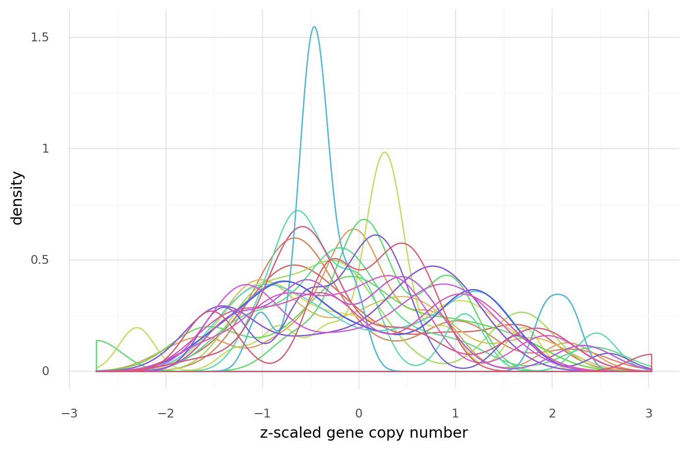

    <ggplot: (8768007891231)>

## Modeling

### Model 1.

Below is the model that will be fit with PyMC3 as the mimic of CERES without any covariate for the gene CN.

$
\quad D_{ij} \sim \mathcal{N}(\mu_{ij}, \epsilon) \\
\quad \mu_{ij} = q_i \lgroup h_k + g_{kj} \rgroup + o_i \\
\qquad q_i \sim \text{Beta}(2, 2) \\
\qquad h_k \sim \mathcal{N}(0, 1) \\
\qquad g_{kj} \sim \mathcal{N}(0, 1) \\
\qquad o_i \sim \mathcal{N}(0, 1) \\
\quad \epsilon \sim \text{Exp}(1)
$

```python
with pm.Model() as ceres_m1:
    # Priors
    q_i = pm.Beta("q_i", alpha=2, beta=2, shape=num_sgrnas)
    h_k = pm.Normal("h_k", 0, 1, shape=num_genes)
    g_kj = pm.Normal("g_kj", 0, 2, shape=(num_genes, num_cell_lines))
    o_i = pm.Normal("o_i", 0, 1, shape=num_sgrnas)

    # Model
    mu_ij = pm.Deterministic(
        "mu",
        q_i[sgrna_idx] * (h_k[gene_idx] + g_kj[gene_idx, cell_line_idx])
        + o_i[sgrna_idx],
    )
    epsilon = pm.Exponential("epsilon", 1)

    # Likelihood
    D_ij = pm.Normal("D_ij", mu_ij, epsilon, observed=data.lfc)
```

    /home/jc604/.conda/envs/speclet/lib/python3.8/site-packages/theano/tensor/subtensor.py:2197: FutureWarning: Using a non-tuple sequence for multidimensional indexing is deprecated; use `arr[tuple(seq)]` instead of `arr[seq]`. In the future this will be interpreted as an array index, `arr[np.array(seq)]`, which will result either in an error or a different result.

```python
pm.model_to_graphviz(ceres_m1)
```

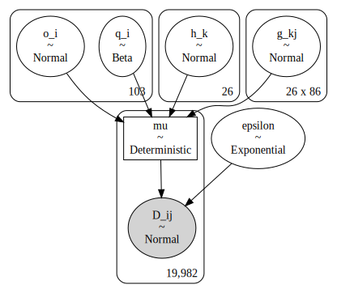

```python
%%time

ceres_m1_cachedir = pymc3_cache_dir / "ceres_m1"

ceres_m1_samples = pmhelp.pymc3_sampling_procedure(
    model=ceres_m1,
    num_mcmc=3000,
    tune=1500,
    chains=3,
    cores=4,
    prior_check_samples=1000,
    ppc_samples=2000,
    random_seed=RANDOM_SEED,
    cache_dir=ceres_m1_cachedir,
    force=False,
)
```

    Loading cached trace and posterior sample...


    /home/jc604/.conda/envs/speclet/lib/python3.8/site-packages/theano/tensor/subtensor.py:2197: FutureWarning: Using a non-tuple sequence for multidimensional indexing is deprecated; use `arr[tuple(seq)]` instead of `arr[seq]`. In the future this will be interpreted as an array index, `arr[np.array(seq)]`, which will result either in an error or a different result.


    CPU times: user 8.02 s, sys: 1.96 s, total: 9.99 s
    Wall time: 20.1 s

```python
az_ceres_m1 = az.from_pymc3(
    trace=ceres_m1_samples["trace"],
    model=ceres_m1,
    prior=ceres_m1_samples["prior_predictive"],
    posterior_predictive=ceres_m1_samples["posterior_predictive"],
)
```

    /home/jc604/.conda/envs/speclet/lib/python3.8/site-packages/theano/tensor/subtensor.py:2197: FutureWarning: Using a non-tuple sequence for multidimensional indexing is deprecated; use `arr[tuple(seq)]` instead of `arr[seq]`. In the future this will be interpreted as an array index, `arr[np.array(seq)]`, which will result either in an error or a different result.
    arviz.data.io_pymc3 - WARNING - posterior predictive variable D_ij's shape not compatible with number of chains and draws. This can mean that some draws or even whole chains are not represented.

```python
az.plot_forest(az_ceres_m1, var_names="q_i", combined=True)
plt.show()
```

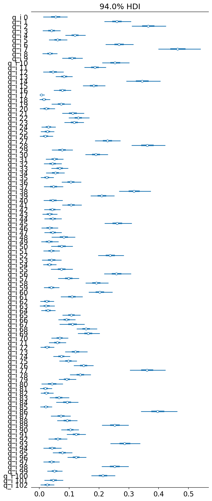

```python
az.plot_forest(az_ceres_m1, var_names="o_i", combined=True)
plt.show()
```

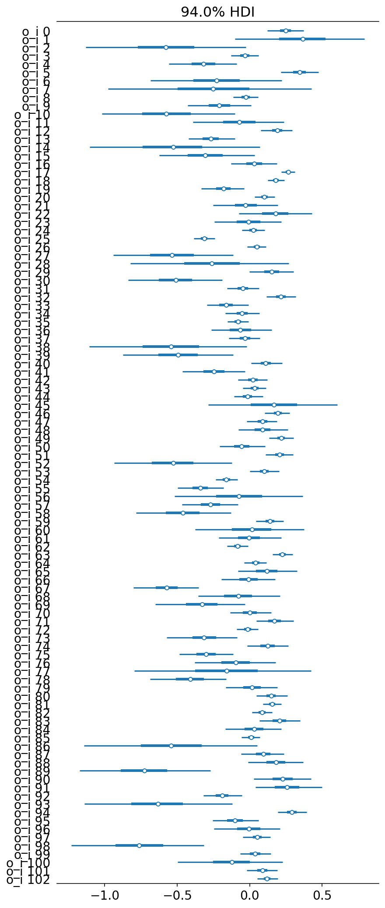

```python
az.plot_forest(az_ceres_m1, var_names="h_k", combined=True)
plt.show()
```

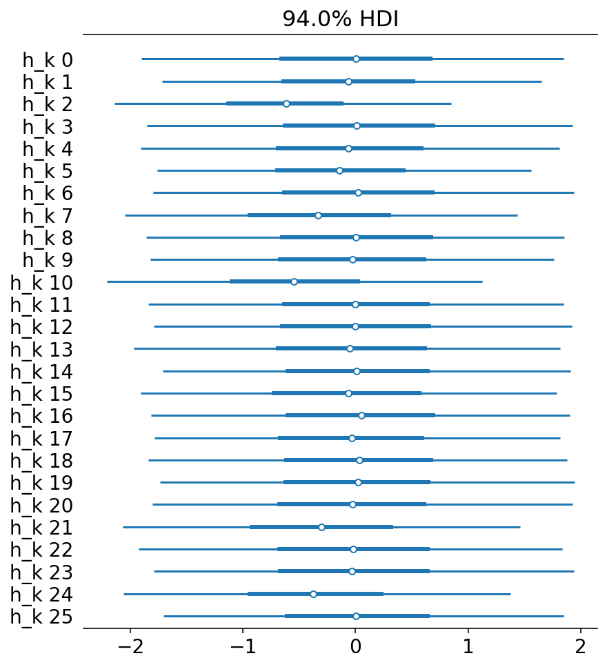

```python
gene_effect_post = ceres_m1_samples["trace"].get_values("g_kj")
gene_effect_post.shape
```

    (9000, 26, 86)

```python
gene_effect_mean = gene_effect_post.mean(axis=0)
gene_effect_mean.shape
```

    (26, 86)

```python
gene_effect_post_df = (
    pd.DataFrame(gene_effect_mean)
    .reset_index()
    .rename(columns={"index": "gene_idx"})
    .melt(id_vars="gene_idx", var_name="cell_line_idx", value_name="gene_effect")
    .assign(
        hugo_symbol=lambda d: [
            data["hugo_symbol"].values.categories[i] for i in d["gene_idx"].values
        ],
        depmap_id=lambda d: [
            data["depmap_id"].values.categories[i] for i in d["cell_line_idx"].values
        ],
    )
)

cols = ["depmap_id", "kras_mutation", "is_deleterious"]
mutation_info = data[cols].drop_duplicates()
mutation_info[cols[:-1]] = mutation_info[cols[:-1]].astype("str")

gene_effect_post_df = gene_effect_post_df.merge(
    mutation_info, how="left", on=["depmap_id"]
)

gene_effect_post_df.head(n=7)
```

<div>
<style scoped>
    .dataframe tbody tr th:only-of-type {
        vertical-align: middle;
    }

    .dataframe tbody tr th {
        vertical-align: top;
    }

    .dataframe thead th {
        text-align: right;
    }
</style>
<table border="1" class="dataframe">
  <thead>
    <tr style="text-align: right;">
      <th></th>
      <th>gene_idx</th>
      <th>cell_line_idx</th>
      <th>gene_effect</th>
      <th>hugo_symbol</th>
      <th>depmap_id</th>
      <th>kras_mutation</th>
      <th>is_deleterious</th>
    </tr>
  </thead>
  <tbody>
    <tr>
      <th>0</th>
      <td>0</td>
      <td>0</td>
      <td>1.189885</td>
      <td>PDE5A</td>
      <td>ACH-000757</td>
      <td>G12D</td>
      <td>NaN</td>
    </tr>
    <tr>
      <th>1</th>
      <td>0</td>
      <td>0</td>
      <td>1.189885</td>
      <td>PDE5A</td>
      <td>ACH-000757</td>
      <td>G12D</td>
      <td>FALSE</td>
    </tr>
    <tr>
      <th>2</th>
      <td>1</td>
      <td>0</td>
      <td>0.933719</td>
      <td>TP53</td>
      <td>ACH-000757</td>
      <td>G12D</td>
      <td>NaN</td>
    </tr>
    <tr>
      <th>3</th>
      <td>1</td>
      <td>0</td>
      <td>0.933719</td>
      <td>TP53</td>
      <td>ACH-000757</td>
      <td>G12D</td>
      <td>FALSE</td>
    </tr>
    <tr>
      <th>4</th>
      <td>2</td>
      <td>0</td>
      <td>-1.244338</td>
      <td>KRAS</td>
      <td>ACH-000757</td>
      <td>G12D</td>
      <td>NaN</td>
    </tr>
    <tr>
      <th>5</th>
      <td>2</td>
      <td>0</td>
      <td>-1.244338</td>
      <td>KRAS</td>
      <td>ACH-000757</td>
      <td>G12D</td>
      <td>FALSE</td>
    </tr>
    <tr>
      <th>6</th>
      <td>3</td>
      <td>0</td>
      <td>0.993389</td>
      <td>KIF3C</td>
      <td>ACH-000757</td>
      <td>G12D</td>
      <td>NaN</td>
    </tr>
  </tbody>
</table>
</div>

```python
data.is_deleterious.unique()
```

    array([nan, 'FALSE', 'TRUE', 'FALSE;TRUE', 'FALSE;FALSE;FALSE',
           'TRUE;TRUE;FALSE', 'FALSE;FALSE', 'FALSE;FALSE;TRUE;FALSE;TRUE',
           'TRUE;TRUE', 'FALSE;TRUE;TRUE', 'FALSE;TRUE;FALSE', 'TRUE;FALSE'],
          dtype=object)

```python
(
    gg.ggplot(gene_effect_post_df, gg.aes(x="hugo_symbol", y="depmap_id"))
    + gg.geom_tile(gg.aes(fill="gene_effect"))
    + gg.theme(
        figure_size=(5, 10),
        axis_text_x=gg.element_text(angle=90),
        axis_text_y=gg.element_text(size=6),
    )
    + gg.labs(
        x="gene",
        y="cell line",
        fill="gene effect",
        title="CERES model estimated gene effect",
    )
)
```


    <ggplot: (8768007899832)>

```python
(
    gg.ggplot(gene_effect_post_df, gg.aes(x="hugo_symbol", y="gene_effect"))
    + gg.geom_boxplot(alpha=0, color="black", outlier_alpha=0, size=1)
    + gg.geom_jitter(alpha=0.4, size=0.3, height=0, width=0.3, color="steelblue")
    + gg.theme(
        axis_text_x=gg.element_text(angle=90, hjust=0.5, vjust=1), figure_size=(10, 5)
    )
    + gg.labs(x=None, y="estimated gene effect")
)
```


    <ggplot: (8767733980151)>

```python
(
    gg.ggplot(gene_effect_post_df, gg.aes(x="gene_effect"))
    + gg.facet_wrap("hugo_symbol", ncol=4, scales="free")
    + gg.geom_density(
        gg.aes(color="hugo_symbol", fill="hugo_symbol"), alpha=0.2, size=0.3
    )
    + gg.geom_rug(gg.aes(color="hugo_symbol"))
    + gg.theme(
        figure_size=(10, 16),
        legend_position="none",
        subplots_adjust={"hspace": 0.4, "wspace": 0.3},
    )
    + gg.labs(x="estimated gene effect per cell line", y="denisty")
)
```


    <ggplot: (8768004622873)>

```python
(
    gg.ggplot(gene_effect_post_df, gg.aes(x="depmap_id", y="gene_effect"))
    + gg.geom_jitter(alpha=0.3, size=0.6, height=0, width=0, color="steelblue")
    + gg.geom_boxplot(alpha=0, color="black", outlier_alpha=0)
    + gg.theme(
        axis_text_x=gg.element_text(angle=90, hjust=0.5, vjust=1, size=8),
        figure_size=(10, 5),
    )
    + gg.labs(x=None, y="estimated gene effect")
)
```

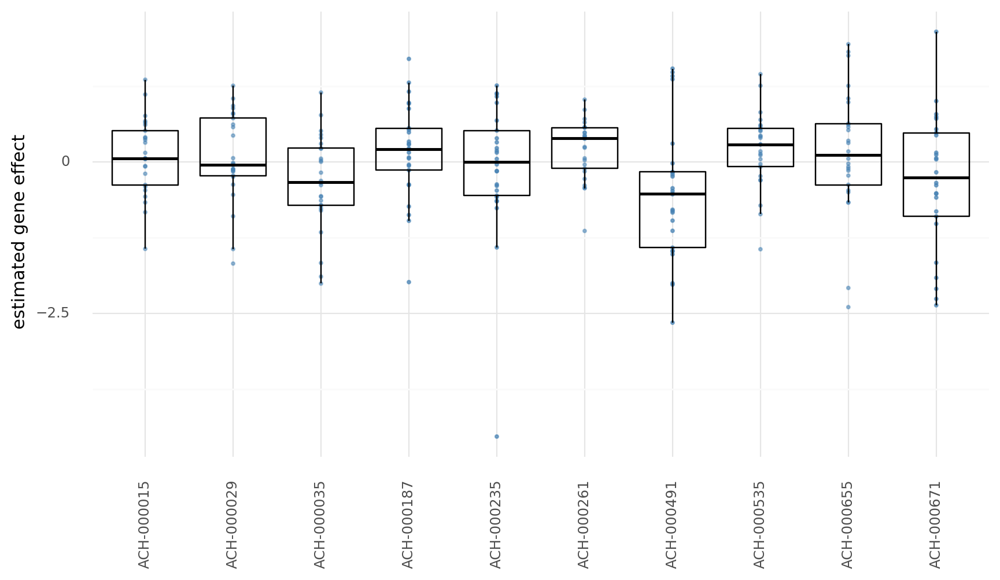

    <ggplot: (8767733544223)>

```python
kras_gene_effect = gene_effect_post_df[
    gene_effect_post_df.hugo_symbol == "KRAS"
].reset_index(drop=True)

(
    gg.ggplot(kras_gene_effect, gg.aes(x="kras_mutation", y="gene_effect"))
    + gg.geom_boxplot(alpha=0, color="gray", outlier_alpha=0)
    + gg.geom_jitter(gg.aes(color="kras_mutation"), width=0.4, height=0, alpha=0.8)
    + gg.theme(axis_text_x=gg.element_text(angle=90, hjust=0.5, vjust=1))
)
```


    <ggplot: (8767733814736)>

---

### Model 2.

Below is the model that will be fit with PyMC3 as the mimic of CERES with a covariate for the gene CN modeled as a standard linear coefficient.
The copy number values were z-scaled within each gene.

$
\quad D_{ij} \sim \mathcal{N}(\mu_{ij}, \epsilon) \\
\quad \mu_{ij} = q_i \lgroup h_k + g_{kj} + \beta_{ij} C \rgroup + o_i \\
\qquad q_i \sim \text{Beta}(2, 2) \\
\qquad h_k \sim \mathcal{N}(0, 1) \\
\qquad g_{kj} \sim \mathcal{N}(0, 1) \\
\qquad o_i \sim \mathcal{N}(0, 1) \\
\quad \epsilon \sim \text{Exp}(1)
$

```python
BATCH_SIZE = 100
sgrna_idx_mb = pm.Minibatch(sgrna_idx, batch_size=BATCH_SIZE)
gene_idx_mb = pm.Minibatch(gene_idx, batch_size=BATCH_SIZE)
cell_line_idx_mb = pm.Minibatch(cell_line_idx, batch_size=BATCH_SIZE)

gene_cn_z_mb = pm.Minibatch(data.gene_cn_z.to_numpy(), batch_size=BATCH_SIZE)
lfc_mb = pm.Minibatch(data.lfc.to_numpy(), batch_size=BATCH_SIZE)

with pm.Model() as ceres_m2:
    # Priors
    q_i = pm.Beta("q_i", alpha=2, beta=2, shape=num_sgrnas)
    h_k = pm.Normal("h_k", 0, 1, shape=num_genes)
    g_kj = pm.Normal("g_kj", 0, 2, shape=(num_genes, num_cell_lines))
    beta_ij = pm.Normal("beta_ij", -0.5, 1, shape=(num_sgrnas, num_cell_lines))
    o_i = pm.Normal("o_i", 0, 1, shape=num_sgrnas)

    # Model
    mu_ij = pm.Deterministic(
        "mu",
        q_i[sgrna_idx_mb]
        * (
            h_k[gene_idx_mb]
            + g_kj[gene_idx_mb, cell_line_idx_mb]
            + beta_ij[sgrna_idx_mb, cell_line_idx_mb] * gene_cn_z_mb
        )
        + o_i[sgrna_idx_mb],
    )
    epsilon = pm.Exponential("epsilon", 1)

    # Likelihood
    D_ij = pm.Normal("D_ij", mu_ij, epsilon, observed=lfc_mb, total_size=len(data))
```

    /home/jc604/.conda/envs/speclet/lib/python3.8/site-packages/pymc3/data.py:307: FutureWarning: Using a non-tuple sequence for multidimensional indexing is deprecated; use `arr[tuple(seq)]` instead of `arr[seq]`. In the future this will be interpreted as an array index, `arr[np.array(seq)]`, which will result either in an error or a different result.
    /home/jc604/.conda/envs/speclet/lib/python3.8/site-packages/pymc3/data.py:307: FutureWarning: Using a non-tuple sequence for multidimensional indexing is deprecated; use `arr[tuple(seq)]` instead of `arr[seq]`. In the future this will be interpreted as an array index, `arr[np.array(seq)]`, which will result either in an error or a different result.
    /home/jc604/.conda/envs/speclet/lib/python3.8/site-packages/theano/tensor/subtensor.py:2197: FutureWarning: Using a non-tuple sequence for multidimensional indexing is deprecated; use `arr[tuple(seq)]` instead of `arr[seq]`. In the future this will be interpreted as an array index, `arr[np.array(seq)]`, which will result either in an error or a different result.

```python
pm.model_to_graphviz(ceres_m2)
```

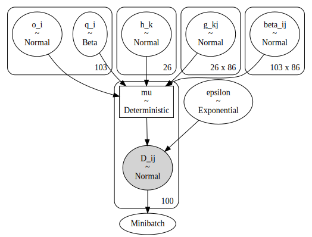

```python
%%time

with ceres_m2:
    ceres_m2_advi_meanfield = pm.fit(
        40000,
        method="advi",
        callbacks=[pm.callbacks.CheckParametersConvergence(tolerance=1e-4)],
        random_seed=RANDOM_SEED,
    )
```

<div>
    <style>
        /*Turns off some styling*/
        progress {
            /*gets rid of default border in Firefox and Opera.*/
            border: none;
            /*Needs to be in here for Safari polyfill so background images work as expected.*/
            background-size: auto;
        }
        .progress-bar-interrupted, .progress-bar-interrupted::-webkit-progress-bar {
            background: #F44336;
        }
    </style>
  <progress value='40000' class='' max='40000' style='width:300px; height:20px; vertical-align: middle;'></progress>
  100.00% [40000/40000 02:30<00:00 Average Loss = 92.73]
</div>

    /home/jc604/.conda/envs/speclet/lib/python3.8/site-packages/theano/tensor/subtensor.py:2197: FutureWarning: Using a non-tuple sequence for multidimensional indexing is deprecated; use `arr[tuple(seq)]` instead of `arr[seq]`. In the future this will be interpreted as an array index, `arr[np.array(seq)]`, which will result either in an error or a different result.
    Finished [100%]: Average Loss = 92.68


    CPU times: user 2min 34s, sys: 13.5 s, total: 2min 48s
    Wall time: 4min 14s

```python
df = pd.DataFrame(
    {
        "loss": ceres_m2_advi_meanfield.hist,
        "idx": range(len(ceres_m2_advi_meanfield.hist)),
    }
)
(
    gg.ggplot(df, gg.aes(x="idx", y="loss"))
    + gg.geom_point(color="gray", alpha=0.5, size=0.2)
    + gg.geom_smooth(method="loess", se=False, color="firebrick")
    + gg.scale_y_continuous(trans="log")
)
```

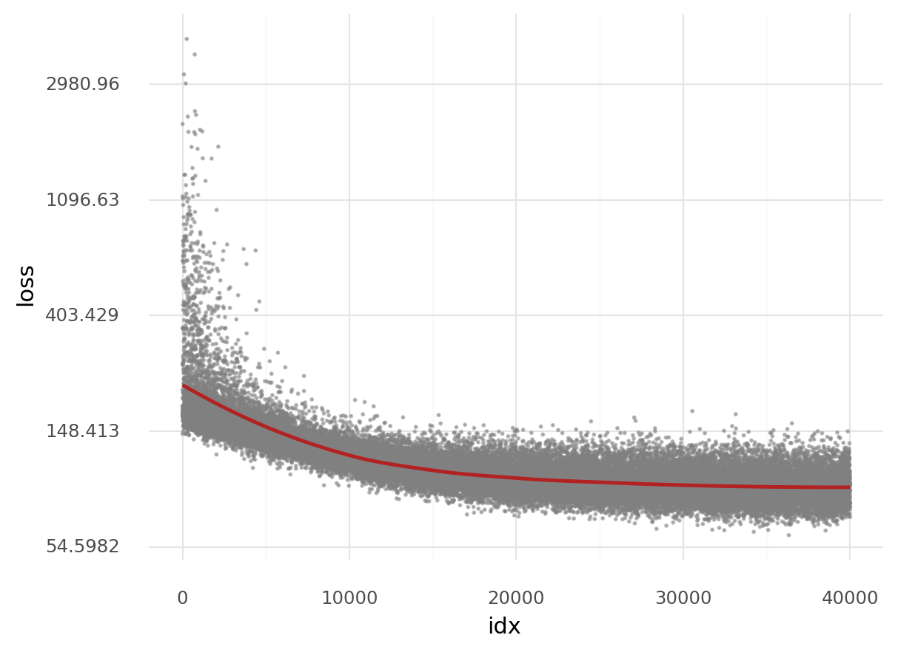

    <ggplot: (8767723087035)>

```python
(
    gg.ggplot(df.tail(n=5000), gg.aes(x="idx", y="loss"))
    + gg.geom_point(color="gray", alpha=0.5, size=0.4)
    + gg.geom_smooth(method="loess", se=False, color="firebrick", size=1.5)
)
```

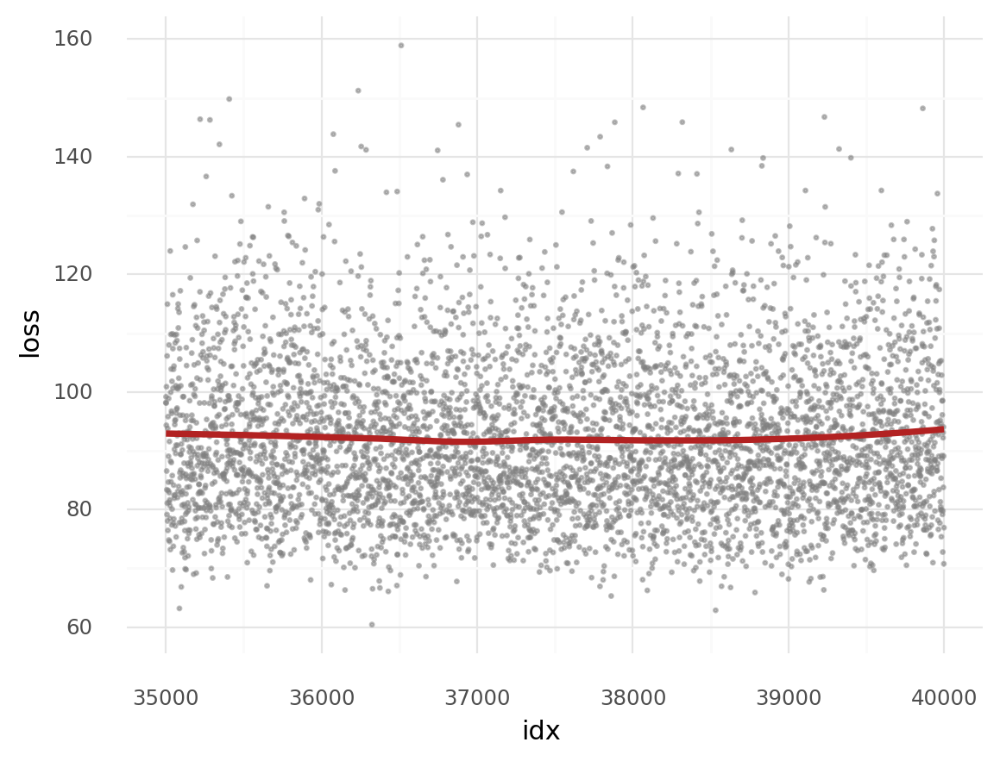

    <ggplot: (8767734001297)>

```python
with pm.Model() as ceres_m2_full:
    # Priors
    q_i = pm.Beta("q_i", alpha=2, beta=2, shape=num_sgrnas)
    h_k = pm.Normal("h_k", 0, 1, shape=num_genes)
    g_kj = pm.Normal("g_kj", 0, 2, shape=(num_genes, num_cell_lines))
    beta_ij = pm.Normal("beta_ij", -0.5, 1, shape=(num_sgrnas, num_cell_lines))
    o_i = pm.Normal("o_i", 0, 1, shape=num_sgrnas)

    # Model
    mu_ij = pm.Deterministic(
        "mu",
        q_i[sgrna_idx]
        * (
            h_k[gene_idx]
            + g_kj[gene_idx, cell_line_idx]
            + beta_ij[sgrna_idx, cell_line_idx] * data.gene_cn_z.values
        )
        + o_i[sgrna_idx],
    )
    epsilon = pm.Exponential("epsilon", 1)

    # Likelihood
    D_ij = pm.Normal("D_ij", mu_ij, epsilon, observed=data.lfc.values)
```

    /home/jc604/.conda/envs/speclet/lib/python3.8/site-packages/theano/tensor/subtensor.py:2197: FutureWarning: Using a non-tuple sequence for multidimensional indexing is deprecated; use `arr[tuple(seq)]` instead of `arr[seq]`. In the future this will be interpreted as an array index, `arr[np.array(seq)]`, which will result either in an error or a different result.

```python
%%time

ceres_m2_mcmc_cachedir = pymc3_cache_dir / "ceres_m2_mcmc"

ceres_m2_mcmc_res = pmhelp.pymc3_sampling_procedure(
    model=ceres_m2_full,
    num_mcmc=2000,
    tune=2000,
    chains=2,
    cores=1,
    random_seed=RANDOM_SEED,
    cache_dir=ceres_m2_mcmc_cachedir,
    sample_kwags={},  # REMOVE THIS ARG NEXT TIME (FIXED)
)
```

    Loading cached trace and posterior sample...


    /home/jc604/.conda/envs/speclet/lib/python3.8/site-packages/theano/tensor/subtensor.py:2197: FutureWarning: Using a non-tuple sequence for multidimensional indexing is deprecated; use `arr[tuple(seq)]` instead of `arr[seq]`. In the future this will be interpreted as an array index, `arr[np.array(seq)]`, which will result either in an error or a different result.


    CPU times: user 5.99 s, sys: 1.68 s, total: 7.67 s
    Wall time: 14.9 s

```python
az_ceres_m2 = az.from_pymc3(
    trace=ceres_m2_mcmc_res["trace"],
    model=ceres_m2_full,
    posterior_predictive=ceres_m2_mcmc_res["posterior_predictive"],
    prior=ceres_m2_mcmc_res["prior_predictive"],
)
```

    /home/jc604/.conda/envs/speclet/lib/python3.8/site-packages/theano/tensor/subtensor.py:2197: FutureWarning: Using a non-tuple sequence for multidimensional indexing is deprecated; use `arr[tuple(seq)]` instead of `arr[seq]`. In the future this will be interpreted as an array index, `arr[np.array(seq)]`, which will result either in an error or a different result.
    arviz.data.io_pymc3 - WARNING - posterior predictive variable D_ij's shape not compatible with number of chains and draws. This can mean that some draws or even whole chains are not represented.

```python
%%time

ceres_m2_mcmc_advi_cachedir = pymc3_cache_dir / "ceres_m2_mcmc_advi"

ceres_m2_mcmc_advi_res = pmhelp.pymc3_sampling_procedure(
    model=ceres_m2_full,
    num_mcmc=2000,
    tune=2000,
    chains=2,
    cores=1,
    random_seed=RANDOM_SEED,
    cache_dir=ceres_m2_mcmc_advi_cachedir,
    sample_kwags={"init": "advi", "n_init": 40000},
)
```

    Loading cached trace and posterior sample...
    CPU times: user 5.81 s, sys: 1.47 s, total: 7.28 s
    Wall time: 12.2 s

```python
az_ceres_m2_advi = az.from_pymc3(
    trace=ceres_m2_mcmc_advi_res["trace"],
    model=ceres_m2_full,
    posterior_predictive=ceres_m2_mcmc_advi_res["posterior_predictive"],
    prior=ceres_m2_mcmc_advi_res["prior_predictive"],
)
```

    arviz.data.io_pymc3 - WARNING - posterior predictive variable D_ij's shape not compatible with number of chains and draws. This can mean that some draws or even whole chains are not represented.

### Compare ADVI, MCMC, ADVI + MCMC

```python
# Sample from posterior of ADVI fit.
np.random.seed(RANDOM_SEED)
ceres_m2_advi_sample = ceres_m2_advi_meanfield.sample(1000)


def mod_az_summary(df, trace_lbl):
    colname_changes = {
        "index": "variable",
        "hdi_5.5%": "hdi_lower",
        "hdi_94.5%": "hdi_upper",
    }
    keep_cols = ["trace", "variable", "mean", "hdi_lower", "hdi_upper"]
    mod_df = (
        df.reset_index(drop=False)
        .rename(columns=colname_changes)
        .assign(trace=trace_lbl)[keep_cols]
    )
    return mod_df


def mod_advi_summary(df, trace_lbl="ADVI"):
    return df.assign(trace=trace_lbl)


def summarise_advi_sample(ary, axis=0, hdi_prob=0.89):
    means = ary.mean(axis=axis)
    hdi = az.hdi(ary, hdi_prob=hdi_prob)
    return pd.DataFrame({"mean": means, "hdi_lower": hdi[:, 0], "hdi_upper": hdi[:, 1]})


def get_merged_posterior(var_name):
    mcmc_post = az.summary(az_ceres_m2, var_names=var_name, hdi_prob=0.89)
    mcmc_advi_post = az.summary(az_ceres_m2_advi, var_names=var_name, hdi_prob=0.89)
    advi_post = summarise_advi_sample(ceres_m2_advi_sample[var_name])
    advi_post["variable"] = mcmc_post.index.values

    merged_post = pd.concat(
        [
            mod_az_summary(mcmc_post, "MCMC"),
            mod_az_summary(mcmc_advi_post, "ADVI + MCMC"),
            mod_advi_summary(advi_post),
        ]
    ).reset_index(drop=True)
    merged_post["variable"] = pd.Categorical(
        merged_post["variable"],
        categories=mcmc_post.index.values,
        ordered=True,
    )

    return merged_post
```

    /home/jc604/.conda/envs/speclet/lib/python3.8/site-packages/theano/tensor/subtensor.py:2197: FutureWarning: Using a non-tuple sequence for multidimensional indexing is deprecated; use `arr[tuple(seq)]` instead of `arr[seq]`. In the future this will be interpreted as an array index, `arr[np.array(seq)]`, which will result either in an error or a different result.

```python
merged_qi_posterior = get_merged_posterior("q_i")
merged_qi_posterior.head()
```

    /home/jc604/.conda/envs/speclet/lib/python3.8/site-packages/arviz/stats/stats.py:484: FutureWarning: hdi currently interprets 2d data as (draw, shape) but this will change in a future release to (chain, draw) for coherence with other functions

<div>
<style scoped>
    .dataframe tbody tr th:only-of-type {
        vertical-align: middle;
    }

    .dataframe tbody tr th {
        vertical-align: top;
    }

    .dataframe thead th {
        text-align: right;
    }
</style>
<table border="1" class="dataframe">
  <thead>
    <tr style="text-align: right;">
      <th></th>
      <th>trace</th>
      <th>variable</th>
      <th>mean</th>
      <th>hdi_lower</th>
      <th>hdi_upper</th>
    </tr>
  </thead>
  <tbody>
    <tr>
      <th>0</th>
      <td>MCMC</td>
      <td>q_i[0]</td>
      <td>0.052</td>
      <td>0.022</td>
      <td>0.083</td>
    </tr>
    <tr>
      <th>1</th>
      <td>MCMC</td>
      <td>q_i[1]</td>
      <td>0.213</td>
      <td>0.185</td>
      <td>0.238</td>
    </tr>
    <tr>
      <th>2</th>
      <td>MCMC</td>
      <td>q_i[2]</td>
      <td>0.308</td>
      <td>0.276</td>
      <td>0.346</td>
    </tr>
    <tr>
      <th>3</th>
      <td>MCMC</td>
      <td>q_i[3]</td>
      <td>0.038</td>
      <td>0.015</td>
      <td>0.060</td>
    </tr>
    <tr>
      <th>4</th>
      <td>MCMC</td>
      <td>q_i[4]</td>
      <td>0.108</td>
      <td>0.081</td>
      <td>0.132</td>
    </tr>
  </tbody>
</table>
</div>

```python
pos = gg.position_dodge(width=0.5)

(
    gg.ggplot(merged_qi_posterior, gg.aes(x="variable"))
    + gg.geom_linerange(
        gg.aes(ymin="hdi_lower", ymax="hdi_upper", color="trace"),
        position=pos,
        size=0.7,
        alpha=0.4,
    )
    + gg.geom_point(gg.aes(y="mean", color="trace"), position=pos, size=1, alpha=0.7)
    + gg.theme(
        figure_size=(10, 4),
        axis_text_x=gg.element_text(size=6, angle=90, hjust=0.5, vjust=1),
        legend_position="right",
    )
    + gg.labs(x=None, y="posterior of 'q_i'", color=None)
)
```

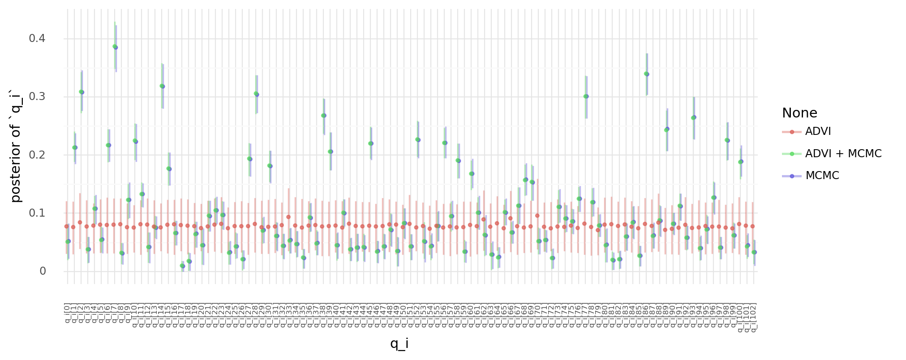

    <ggplot: (8767719904401)>

## Comparing CERES with and without a covariate for CNA

```python
var_names = ["q_i", "h_k", "g_kj", "o_i", "epsilon"]
ceres_m1_summary = az.summary(az_ceres_m1, var_names=var_names, hdi_prob=0.89)
ceres_m2_summary = az.summary(
    az_ceres_m2_advi, var_names=var_names + ["beta_ij"], hdi_prob=0.89
)
```

```python
ceres_m2_summary
```

<div>
<style scoped>
    .dataframe tbody tr th:only-of-type {
        vertical-align: middle;
    }

    .dataframe tbody tr th {
        vertical-align: top;
    }

    .dataframe thead th {
        text-align: right;
    }
</style>
<table border="1" class="dataframe">
  <thead>
    <tr style="text-align: right;">
      <th></th>
      <th>mean</th>
      <th>sd</th>
      <th>hdi_5.5%</th>
      <th>hdi_94.5%</th>
      <th>mcse_mean</th>
      <th>mcse_sd</th>
      <th>ess_mean</th>
      <th>ess_sd</th>
      <th>ess_bulk</th>
      <th>ess_tail</th>
      <th>r_hat</th>
    </tr>
  </thead>
  <tbody>
    <tr>
      <th>q_i[0]</th>
      <td>0.051</td>
      <td>0.020</td>
      <td>0.020</td>
      <td>0.082</td>
      <td>0.001</td>
      <td>0.000</td>
      <td>1034.0</td>
      <td>1034.0</td>
      <td>1023.0</td>
      <td>1145.0</td>
      <td>1.00</td>
    </tr>
    <tr>
      <th>q_i[1]</th>
      <td>0.213</td>
      <td>0.016</td>
      <td>0.189</td>
      <td>0.241</td>
      <td>0.001</td>
      <td>0.000</td>
      <td>866.0</td>
      <td>866.0</td>
      <td>848.0</td>
      <td>2060.0</td>
      <td>1.00</td>
    </tr>
    <tr>
      <th>q_i[2]</th>
      <td>0.309</td>
      <td>0.022</td>
      <td>0.272</td>
      <td>0.343</td>
      <td>0.002</td>
      <td>0.001</td>
      <td>196.0</td>
      <td>193.0</td>
      <td>200.0</td>
      <td>438.0</td>
      <td>1.02</td>
    </tr>
    <tr>
      <th>q_i[3]</th>
      <td>0.038</td>
      <td>0.014</td>
      <td>0.014</td>
      <td>0.060</td>
      <td>0.000</td>
      <td>0.000</td>
      <td>1415.0</td>
      <td>1415.0</td>
      <td>1340.0</td>
      <td>1120.0</td>
      <td>1.00</td>
    </tr>
    <tr>
      <th>q_i[4]</th>
      <td>0.108</td>
      <td>0.016</td>
      <td>0.081</td>
      <td>0.130</td>
      <td>0.000</td>
      <td>0.000</td>
      <td>2143.0</td>
      <td>2118.0</td>
      <td>2155.0</td>
      <td>2667.0</td>
      <td>1.00</td>
    </tr>
    <tr>
      <th>...</th>
      <td>...</td>
      <td>...</td>
      <td>...</td>
      <td>...</td>
      <td>...</td>
      <td>...</td>
      <td>...</td>
      <td>...</td>
      <td>...</td>
      <td>...</td>
      <td>...</td>
    </tr>
    <tr>
      <th>beta_ij[102,81]</th>
      <td>-0.469</td>
      <td>0.970</td>
      <td>-2.056</td>
      <td>1.051</td>
      <td>0.010</td>
      <td>0.015</td>
      <td>9359.0</td>
      <td>1970.0</td>
      <td>9373.0</td>
      <td>2523.0</td>
      <td>1.00</td>
    </tr>
    <tr>
      <th>beta_ij[102,82]</th>
      <td>-0.499</td>
      <td>0.956</td>
      <td>-2.090</td>
      <td>0.979</td>
      <td>0.010</td>
      <td>0.016</td>
      <td>8285.0</td>
      <td>1874.0</td>
      <td>8398.0</td>
      <td>2701.0</td>
      <td>1.00</td>
    </tr>
    <tr>
      <th>beta_ij[102,83]</th>
      <td>-0.381</td>
      <td>0.998</td>
      <td>-1.972</td>
      <td>1.193</td>
      <td>0.010</td>
      <td>0.018</td>
      <td>9081.0</td>
      <td>1563.0</td>
      <td>9027.0</td>
      <td>2248.0</td>
      <td>1.00</td>
    </tr>
    <tr>
      <th>beta_ij[102,84]</th>
      <td>-0.500</td>
      <td>0.965</td>
      <td>-2.088</td>
      <td>1.009</td>
      <td>0.010</td>
      <td>0.016</td>
      <td>9591.0</td>
      <td>1819.0</td>
      <td>9714.0</td>
      <td>2333.0</td>
      <td>1.00</td>
    </tr>
    <tr>
      <th>beta_ij[102,85]</th>
      <td>-0.515</td>
      <td>0.973</td>
      <td>-2.126</td>
      <td>0.976</td>
      <td>0.011</td>
      <td>0.017</td>
      <td>7792.0</td>
      <td>1662.0</td>
      <td>7779.0</td>
      <td>2267.0</td>
      <td>1.00</td>
    </tr>
  </tbody>
</table>
<p>11327 rows × 11 columns</p>
</div>

```python
def prep_summary_for_merge(df, ceres_lbl):
    return (
        df.reset_index(drop=False)
        .rename(columns={"index": "variable"})
        .assign(ceres=ceres_lbl)
    )


ceres_merged_summary = pd.concat(
    [
        prep_summary_for_merge(ceres_m1_summary, "M1"),
        prep_summary_for_merge(ceres_m2_summary, "M2"),
    ]
)

ceres_merged_summary
```

<div>
<style scoped>
    .dataframe tbody tr th:only-of-type {
        vertical-align: middle;
    }

    .dataframe tbody tr th {
        vertical-align: top;
    }

    .dataframe thead th {
        text-align: right;
    }
</style>
<table border="1" class="dataframe">
  <thead>
    <tr style="text-align: right;">
      <th></th>
      <th>variable</th>
      <th>mean</th>
      <th>sd</th>
      <th>hdi_5.5%</th>
      <th>hdi_94.5%</th>
      <th>mcse_mean</th>
      <th>mcse_sd</th>
      <th>ess_mean</th>
      <th>ess_sd</th>
      <th>ess_bulk</th>
      <th>ess_tail</th>
      <th>r_hat</th>
      <th>ceres</th>
    </tr>
  </thead>
  <tbody>
    <tr>
      <th>0</th>
      <td>q_i[0]</td>
      <td>0.055</td>
      <td>0.022</td>
      <td>0.021</td>
      <td>0.091</td>
      <td>0.000</td>
      <td>0.000</td>
      <td>1965.0</td>
      <td>1965.0</td>
      <td>1935.0</td>
      <td>2521.0</td>
      <td>1.00</td>
      <td>M1</td>
    </tr>
    <tr>
      <th>1</th>
      <td>q_i[1]</td>
      <td>0.261</td>
      <td>0.024</td>
      <td>0.221</td>
      <td>0.297</td>
      <td>0.001</td>
      <td>0.001</td>
      <td>858.0</td>
      <td>847.0</td>
      <td>881.0</td>
      <td>1503.0</td>
      <td>1.00</td>
      <td>M1</td>
    </tr>
    <tr>
      <th>2</th>
      <td>q_i[2]</td>
      <td>0.367</td>
      <td>0.031</td>
      <td>0.315</td>
      <td>0.413</td>
      <td>0.001</td>
      <td>0.001</td>
      <td>606.0</td>
      <td>606.0</td>
      <td>597.0</td>
      <td>1247.0</td>
      <td>1.01</td>
      <td>M1</td>
    </tr>
    <tr>
      <th>3</th>
      <td>q_i[3]</td>
      <td>0.042</td>
      <td>0.016</td>
      <td>0.015</td>
      <td>0.067</td>
      <td>0.000</td>
      <td>0.000</td>
      <td>3401.0</td>
      <td>3401.0</td>
      <td>3289.0</td>
      <td>3989.0</td>
      <td>1.00</td>
      <td>M1</td>
    </tr>
    <tr>
      <th>4</th>
      <td>q_i[4]</td>
      <td>0.120</td>
      <td>0.018</td>
      <td>0.091</td>
      <td>0.148</td>
      <td>0.000</td>
      <td>0.000</td>
      <td>3252.0</td>
      <td>3252.0</td>
      <td>3254.0</td>
      <td>4673.0</td>
      <td>1.00</td>
      <td>M1</td>
    </tr>
    <tr>
      <th>...</th>
      <td>...</td>
      <td>...</td>
      <td>...</td>
      <td>...</td>
      <td>...</td>
      <td>...</td>
      <td>...</td>
      <td>...</td>
      <td>...</td>
      <td>...</td>
      <td>...</td>
      <td>...</td>
      <td>...</td>
    </tr>
    <tr>
      <th>11322</th>
      <td>beta_ij[102,81]</td>
      <td>-0.469</td>
      <td>0.970</td>
      <td>-2.056</td>
      <td>1.051</td>
      <td>0.010</td>
      <td>0.015</td>
      <td>9359.0</td>
      <td>1970.0</td>
      <td>9373.0</td>
      <td>2523.0</td>
      <td>1.00</td>
      <td>M2</td>
    </tr>
    <tr>
      <th>11323</th>
      <td>beta_ij[102,82]</td>
      <td>-0.499</td>
      <td>0.956</td>
      <td>-2.090</td>
      <td>0.979</td>
      <td>0.010</td>
      <td>0.016</td>
      <td>8285.0</td>
      <td>1874.0</td>
      <td>8398.0</td>
      <td>2701.0</td>
      <td>1.00</td>
      <td>M2</td>
    </tr>
    <tr>
      <th>11324</th>
      <td>beta_ij[102,83]</td>
      <td>-0.381</td>
      <td>0.998</td>
      <td>-1.972</td>
      <td>1.193</td>
      <td>0.010</td>
      <td>0.018</td>
      <td>9081.0</td>
      <td>1563.0</td>
      <td>9027.0</td>
      <td>2248.0</td>
      <td>1.00</td>
      <td>M2</td>
    </tr>
    <tr>
      <th>11325</th>
      <td>beta_ij[102,84]</td>
      <td>-0.500</td>
      <td>0.965</td>
      <td>-2.088</td>
      <td>1.009</td>
      <td>0.010</td>
      <td>0.016</td>
      <td>9591.0</td>
      <td>1819.0</td>
      <td>9714.0</td>
      <td>2333.0</td>
      <td>1.00</td>
      <td>M2</td>
    </tr>
    <tr>
      <th>11326</th>
      <td>beta_ij[102,85]</td>
      <td>-0.515</td>
      <td>0.973</td>
      <td>-2.126</td>
      <td>0.976</td>
      <td>0.011</td>
      <td>0.017</td>
      <td>7792.0</td>
      <td>1662.0</td>
      <td>7779.0</td>
      <td>2267.0</td>
      <td>1.00</td>
      <td>M2</td>
    </tr>
  </tbody>
</table>
<p>13796 rows × 13 columns</p>
</div>

```python
sgrna_to_gene_idx = (
    data[["sgrna", "hugo_symbol"]]
    .drop_duplicates()
    .reset_index(drop=True)
    .sort_values(by="sgrna")
    .assign(
        sgrna_idx=lambda d: d.sgrna.cat.codes,
        gene_idx=lambda d: d.hugo_symbol.cat.codes,
    )
)

ceres_q1_post = (
    ceres_merged_summary[ceres_merged_summary["variable"].str.contains("q_i")]
    .reset_index(drop=True)
    .assign(sgrna_idx=lambda d: [int(re.findall(r"\d+", x)[0]) for x in d.variable])
    .merge(sgrna_to_gene_idx, how="left", on="sgrna_idx")
)

ceres_q1_post.tail()
```

<div>
<style scoped>
    .dataframe tbody tr th:only-of-type {
        vertical-align: middle;
    }

    .dataframe tbody tr th {
        vertical-align: top;
    }

    .dataframe thead th {
        text-align: right;
    }
</style>
<table border="1" class="dataframe">
  <thead>
    <tr style="text-align: right;">
      <th></th>
      <th>variable</th>
      <th>mean</th>
      <th>sd</th>
      <th>hdi_5.5%</th>
      <th>hdi_94.5%</th>
      <th>mcse_mean</th>
      <th>mcse_sd</th>
      <th>ess_mean</th>
      <th>ess_sd</th>
      <th>ess_bulk</th>
      <th>ess_tail</th>
      <th>r_hat</th>
      <th>ceres</th>
      <th>sgrna_idx</th>
      <th>sgrna</th>
      <th>hugo_symbol</th>
      <th>gene_idx</th>
    </tr>
  </thead>
  <tbody>
    <tr>
      <th>201</th>
      <td>q_i[98]</td>
      <td>0.226</td>
      <td>0.021</td>
      <td>0.191</td>
      <td>0.256</td>
      <td>0.001</td>
      <td>0.001</td>
      <td>723.0</td>
      <td>723.0</td>
      <td>723.0</td>
      <td>1675.0</td>
      <td>1.0</td>
      <td>M2</td>
      <td>98</td>
      <td>TTATTAATGTAGCCTCACGG</td>
      <td>PIK3CA</td>
      <td>21</td>
    </tr>
    <tr>
      <th>202</th>
      <td>q_i[99]</td>
      <td>0.062</td>
      <td>0.014</td>
      <td>0.040</td>
      <td>0.084</td>
      <td>0.000</td>
      <td>0.000</td>
      <td>2294.0</td>
      <td>2294.0</td>
      <td>2291.0</td>
      <td>2381.0</td>
      <td>1.0</td>
      <td>M2</td>
      <td>99</td>
      <td>TTCCGTTTATCATGAAGCCG</td>
      <td>NDUFAF3</td>
      <td>7</td>
    </tr>
    <tr>
      <th>203</th>
      <td>q_i[100]</td>
      <td>0.188</td>
      <td>0.017</td>
      <td>0.159</td>
      <td>0.212</td>
      <td>0.001</td>
      <td>0.000</td>
      <td>847.0</td>
      <td>842.0</td>
      <td>855.0</td>
      <td>1303.0</td>
      <td>1.0</td>
      <td>M2</td>
      <td>100</td>
      <td>TTGCAATGTGATGGAAGGGG</td>
      <td>MDM2</td>
      <td>5</td>
    </tr>
    <tr>
      <th>204</th>
      <td>q_i[101]</td>
      <td>0.043</td>
      <td>0.013</td>
      <td>0.022</td>
      <td>0.063</td>
      <td>0.000</td>
      <td>0.000</td>
      <td>2626.0</td>
      <td>2626.0</td>
      <td>2539.0</td>
      <td>1545.0</td>
      <td>1.0</td>
      <td>M2</td>
      <td>101</td>
      <td>TTGTCCCAGCCGTCAAACCG</td>
      <td>LGALS4</td>
      <td>14</td>
    </tr>
    <tr>
      <th>205</th>
      <td>q_i[102]</td>
      <td>0.033</td>
      <td>0.013</td>
      <td>0.013</td>
      <td>0.055</td>
      <td>0.000</td>
      <td>0.000</td>
      <td>2510.0</td>
      <td>2510.0</td>
      <td>2381.0</td>
      <td>1795.0</td>
      <td>1.0</td>
      <td>M2</td>
      <td>102</td>
      <td>TTTGACCTGGAGTTGCCTGA</td>
      <td>ADAMTS13</td>
      <td>15</td>
    </tr>
  </tbody>
</table>
</div>

```python
pos = gg.position_dodge(width=0.5)

(
    gg.ggplot(ceres_q1_post, gg.aes(x="variable", y="mean", color="ceres"))
    + gg.facet_wrap("hugo_symbol", scales="free_x", ncol=4)
    + gg.geom_linerange(gg.aes(ymin="hdi_5.5%", ymax="hdi_94.5%"), position=pos)
    + gg.geom_point(position=pos)
    + gg.scale_color_brewer(type="qual", palette="Set2")
    + gg.scale_y_continuous(limits=(0, None), expand=(0, 0, 0.02, 0))
    + gg.theme(
        figure_size=(8, 20),
        panel_spacing_x=0.25,
        panel_spacing_y=0.5,
        axis_text_x=gg.element_text(size=6),
    )
    + gg.labs(x="sgRNA[idx]", y="posterior distribution of $q_i$", color="model")
)
```

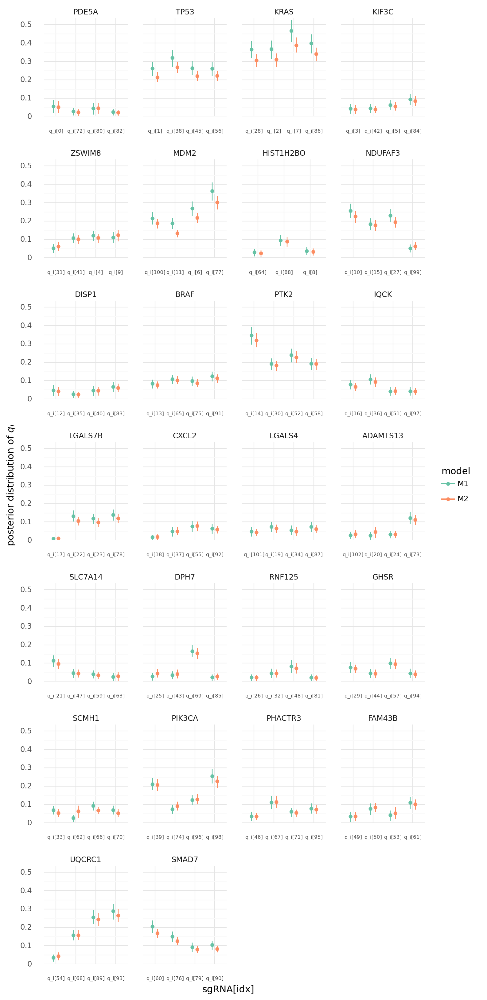

    <ggplot: (8768008337815)>

```python
def make_index_df(df, col, idx_col_name):
    return (
        df[[col]]
        .drop_duplicates()
        .assign(_idx=lambda d: d[col].cat.codes)
        .reset_index(drop=True)
        .rename(columns={"_idx": idx_col_name})
    )


gene_idx_df = make_index_df(data, "hugo_symbol", "gene_idx")
cell_line_idx_df = make_index_df(data, "depmap_id", "cell_line_idx")

ceres_g_kj_post = (
    ceres_merged_summary[ceres_merged_summary["variable"].str.contains("g_kj")]
    .reset_index(drop=True)
    .assign(
        indices=lambda d: [re.findall(r"\d+", x) for x in d.variable],
        gene_idx=lambda d: [int(x[0]) for x in d.indices],
        cell_line_idx=lambda d: [int(x[1]) for x in d.indices],
    )
    .merge(gene_idx_df, how="left", on="gene_idx")
    .merge(cell_line_idx_df, how="left", on="cell_line_idx")
)

ceres_g_kj_post.head()
```

<div>
<style scoped>
    .dataframe tbody tr th:only-of-type {
        vertical-align: middle;
    }

    .dataframe tbody tr th {
        vertical-align: top;
    }

    .dataframe thead th {
        text-align: right;
    }
</style>
<table border="1" class="dataframe">
  <thead>
    <tr style="text-align: right;">
      <th></th>
      <th>variable</th>
      <th>mean</th>
      <th>sd</th>
      <th>hdi_5.5%</th>
      <th>hdi_94.5%</th>
      <th>mcse_mean</th>
      <th>mcse_sd</th>
      <th>ess_mean</th>
      <th>ess_sd</th>
      <th>ess_bulk</th>
      <th>ess_tail</th>
      <th>r_hat</th>
      <th>ceres</th>
      <th>indices</th>
      <th>gene_idx</th>
      <th>cell_line_idx</th>
      <th>hugo_symbol</th>
      <th>depmap_id</th>
    </tr>
  </thead>
  <tbody>
    <tr>
      <th>0</th>
      <td>g_kj[0,0]</td>
      <td>1.190</td>
      <td>1.553</td>
      <td>-1.244</td>
      <td>3.685</td>
      <td>0.016</td>
      <td>0.014</td>
      <td>9948.0</td>
      <td>6561.0</td>
      <td>10021.0</td>
      <td>5778.0</td>
      <td>1.0</td>
      <td>M1</td>
      <td>[0, 0]</td>
      <td>0</td>
      <td>0</td>
      <td>PDE5A</td>
      <td>ACH-000757</td>
    </tr>
    <tr>
      <th>1</th>
      <td>g_kj[0,1]</td>
      <td>1.265</td>
      <td>1.632</td>
      <td>-1.313</td>
      <td>3.940</td>
      <td>0.017</td>
      <td>0.015</td>
      <td>9094.0</td>
      <td>6306.0</td>
      <td>9108.0</td>
      <td>6568.0</td>
      <td>1.0</td>
      <td>M1</td>
      <td>[0, 1]</td>
      <td>0</td>
      <td>1</td>
      <td>PDE5A</td>
      <td>ACH-001329</td>
    </tr>
    <tr>
      <th>2</th>
      <td>g_kj[0,2]</td>
      <td>-0.993</td>
      <td>1.715</td>
      <td>-3.641</td>
      <td>1.832</td>
      <td>0.020</td>
      <td>0.016</td>
      <td>7069.0</td>
      <td>5481.0</td>
      <td>7065.0</td>
      <td>6420.0</td>
      <td>1.0</td>
      <td>M1</td>
      <td>[0, 2]</td>
      <td>0</td>
      <td>2</td>
      <td>PDE5A</td>
      <td>ACH-000535</td>
    </tr>
    <tr>
      <th>3</th>
      <td>g_kj[0,3]</td>
      <td>-1.046</td>
      <td>1.738</td>
      <td>-3.822</td>
      <td>1.725</td>
      <td>0.022</td>
      <td>0.016</td>
      <td>5967.0</td>
      <td>5691.0</td>
      <td>5984.0</td>
      <td>5622.0</td>
      <td>1.0</td>
      <td>M1</td>
      <td>[0, 3]</td>
      <td>0</td>
      <td>3</td>
      <td>PDE5A</td>
      <td>ACH-001460</td>
    </tr>
    <tr>
      <th>4</th>
      <td>g_kj[0,4]</td>
      <td>-0.099</td>
      <td>1.622</td>
      <td>-2.664</td>
      <td>2.553</td>
      <td>0.020</td>
      <td>0.016</td>
      <td>6512.0</td>
      <td>4914.0</td>
      <td>6518.0</td>
      <td>6268.0</td>
      <td>1.0</td>
      <td>M1</td>
      <td>[0, 4]</td>
      <td>0</td>
      <td>4</td>
      <td>PDE5A</td>
      <td>ACH-000867</td>
    </tr>
  </tbody>
</table>
</div>

```python
values = ["mean", "hdi_5.5%", "hdi_94.5%"]
ceres_g_kj_wide = None

for value in values:
    df = (
        ceres_g_kj_post.pivot(
            index=["variable", "gene_idx", "cell_line_idx", "hugo_symbol", "depmap_id"],
            columns="ceres",
            values=value,
        )
        .reset_index()
        .rename(columns={"M1": f"M1_{value}", "M2": f"M2_{value}"})
    )
    if ceres_g_kj_wide is None:
        ceres_g_kj_wide = df
    else:
        ceres_g_kj_wide = ceres_g_kj_wide.merge(df)


ceres_g_kj_wide = ceres_g_kj_wide.merge(
    data[["hugo_symbol", "depmap_id", "gene_cn"]], how="left"
).drop_duplicates()

ceres_g_kj_wide.head()
```

<div>
<style scoped>
    .dataframe tbody tr th:only-of-type {
        vertical-align: middle;
    }

    .dataframe tbody tr th {
        vertical-align: top;
    }

    .dataframe thead th {
        text-align: right;
    }
</style>
<table border="1" class="dataframe">
  <thead>
    <tr style="text-align: right;">
      <th></th>
      <th>variable</th>
      <th>gene_idx</th>
      <th>cell_line_idx</th>
      <th>hugo_symbol</th>
      <th>depmap_id</th>
      <th>M1_mean</th>
      <th>M2_mean</th>
      <th>M1_hdi_5.5%</th>
      <th>M2_hdi_5.5%</th>
      <th>M1_hdi_94.5%</th>
      <th>M2_hdi_94.5%</th>
      <th>gene_cn</th>
    </tr>
  </thead>
  <tbody>
    <tr>
      <th>0</th>
      <td>g_kj[0,0]</td>
      <td>0</td>
      <td>0</td>
      <td>PDE5A</td>
      <td>ACH-000757</td>
      <td>1.190</td>
      <td>1.464</td>
      <td>-1.244</td>
      <td>-1.138</td>
      <td>3.685</td>
      <td>3.978</td>
      <td>1.645961</td>
    </tr>
    <tr>
      <th>12</th>
      <td>g_kj[0,10]</td>
      <td>0</td>
      <td>10</td>
      <td>PDE5A</td>
      <td>ACH-001054</td>
      <td>-0.040</td>
      <td>0.422</td>
      <td>-2.641</td>
      <td>-2.183</td>
      <td>2.634</td>
      <td>3.138</td>
      <td>1.933830</td>
    </tr>
    <tr>
      <th>24</th>
      <td>g_kj[0,11]</td>
      <td>0</td>
      <td>11</td>
      <td>PDE5A</td>
      <td>ACH-000243</td>
      <td>-0.326</td>
      <td>-0.520</td>
      <td>-2.575</td>
      <td>-2.744</td>
      <td>1.960</td>
      <td>2.003</td>
      <td>1.151427</td>
    </tr>
    <tr>
      <th>40</th>
      <td>g_kj[0,12]</td>
      <td>0</td>
      <td>12</td>
      <td>PDE5A</td>
      <td>ACH-000706</td>
      <td>-0.089</td>
      <td>0.051</td>
      <td>-2.539</td>
      <td>-2.603</td>
      <td>2.673</td>
      <td>2.427</td>
      <td>1.961443</td>
    </tr>
    <tr>
      <th>48</th>
      <td>g_kj[0,13]</td>
      <td>0</td>
      <td>13</td>
      <td>PDE5A</td>
      <td>ACH-000738</td>
      <td>-0.294</td>
      <td>-0.359</td>
      <td>-3.070</td>
      <td>-3.062</td>
      <td>2.100</td>
      <td>2.110</td>
      <td>1.303132</td>
    </tr>
  </tbody>
</table>
</div>

```python
(
    gg.ggplot(ceres_g_kj_wide, gg.aes(x="M1_mean", y="M2_mean"))
    + gg.facet_wrap("hugo_symbol", ncol=4, scales="free")
    + gg.geom_hline(yintercept=0, color="black")
    + gg.geom_vline(xintercept=0, color="black")
    + gg.geom_abline(slope=1, intercept=0, color="gray", linetype="--")
    + gg.geom_point(gg.aes(color="gene_cn", size="gene_cn"), alpha=0.7)
    + gg.scale_color_distiller(type="seq", palette="YlOrRd", direction=1)
    + gg.scale_size_continuous(range=(2, 4))
    + gg.theme(
        figure_size=(10, 20),
        panel_spacing_x=0.5,
        panel_spacing_y=0.5,
    )
    + gg.labs(
        x="gene effect without CN",
        y="gene effect with CN",
        color="gene CN",
        size="gene CN",
        title="Comparison of gene effects with and without a covariate for gene copy number",
    )
)
```

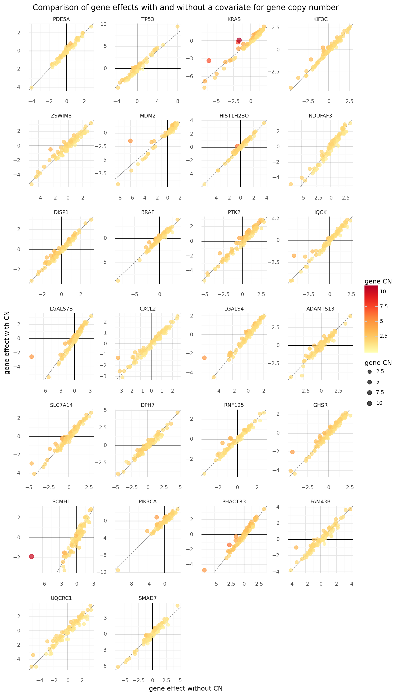

    <ggplot: (8767734468819)>

```python
def summarize_ppc(az_m, var_name):
    x = az_m.posterior_predictive[var_name].values[0, :, :]
    x_mean = x.mean(axis=0)
    x_hdi = az.hdi(x, hdi_prob=0.89)
    return pd.DataFrame(
        {"mean": x_mean, "hdi_lower": x_hdi[:, 0], "hdi_upper": x_hdi[:, 1]}
    )
```

```python
ceres_ppc_summary = []
for m, name in zip([az_ceres_m1, az_ceres_m2_advi], ["M1", "M2"]):
    df = summarize_ppc(az_ceres_m1, "D_ij").assign(
        ceres=name, idx=lambda d: list(range(len(d)))
    )
    df = pd.concat(
        [df, data[["lfc", "sgrna", "hugo_symbol", "depmap_id"]].reset_index(drop=True)],
        axis=1,
    )
    ceres_ppc_summary.append(df)

ceres_ppc_summary = pd.concat(ceres_ppc_summary).reset_index(drop=True)
ceres_ppc_summary.head(n=10)
```

    /home/jc604/.conda/envs/speclet/lib/python3.8/site-packages/arviz/stats/stats.py:484: FutureWarning: hdi currently interprets 2d data as (draw, shape) but this will change in a future release to (chain, draw) for coherence with other functions

<div>
<style scoped>
    .dataframe tbody tr th:only-of-type {
        vertical-align: middle;
    }

    .dataframe tbody tr th {
        vertical-align: top;
    }

    .dataframe thead th {
        text-align: right;
    }
</style>
<table border="1" class="dataframe">
  <thead>
    <tr style="text-align: right;">
      <th></th>
      <th>mean</th>
      <th>hdi_lower</th>
      <th>hdi_upper</th>
      <th>ceres</th>
      <th>idx</th>
      <th>lfc</th>
      <th>sgrna</th>
      <th>hugo_symbol</th>
      <th>depmap_id</th>
    </tr>
  </thead>
  <tbody>
    <tr>
      <th>0</th>
      <td>0.324936</td>
      <td>-0.226344</td>
      <td>0.856244</td>
      <td>M1</td>
      <td>0</td>
      <td>0.388453</td>
      <td>AAGAGGCCGGTCAAATTCAG</td>
      <td>PDE5A</td>
      <td>ACH-000757</td>
    </tr>
    <tr>
      <th>1</th>
      <td>0.590178</td>
      <td>0.044552</td>
      <td>1.143577</td>
      <td>M1</td>
      <td>1</td>
      <td>0.582574</td>
      <td>AATCAACCCACAGCTGCACA</td>
      <td>TP53</td>
      <td>ACH-000757</td>
    </tr>
    <tr>
      <th>2</th>
      <td>-1.262714</td>
      <td>-1.774204</td>
      <td>-0.738222</td>
      <td>M1</td>
      <td>2</td>
      <td>-1.464233</td>
      <td>AATTACTACTTGCTTCCTGT</td>
      <td>KRAS</td>
      <td>ACH-000757</td>
    </tr>
    <tr>
      <th>3</th>
      <td>0.010341</td>
      <td>-0.549601</td>
      <td>0.490825</td>
      <td>M1</td>
      <td>3</td>
      <td>0.213791</td>
      <td>ACCTGTATGACGAAACCGTG</td>
      <td>KIF3C</td>
      <td>ACH-000757</td>
    </tr>
    <tr>
      <th>4</th>
      <td>-0.049381</td>
      <td>-0.558570</td>
      <td>0.476010</td>
      <td>M1</td>
      <td>4</td>
      <td>0.283606</td>
      <td>ACTCTGTTCCTTCATCTCCG</td>
      <td>ZSWIM8</td>
      <td>ACH-000757</td>
    </tr>
    <tr>
      <th>5</th>
      <td>0.405142</td>
      <td>-0.137215</td>
      <td>0.910960</td>
      <td>M1</td>
      <td>5</td>
      <td>0.506093</td>
      <td>ACTGCTGCGGGAATTCCAAG</td>
      <td>KIF3C</td>
      <td>ACH-000757</td>
    </tr>
    <tr>
      <th>6</th>
      <td>-0.968127</td>
      <td>-1.498412</td>
      <td>-0.419038</td>
      <td>M1</td>
      <td>6</td>
      <td>-0.714605</td>
      <td>AGACACTTATACTATGAAAG</td>
      <td>MDM2</td>
      <td>ACH-000757</td>
    </tr>
    <tr>
      <th>7</th>
      <td>-1.106449</td>
      <td>-1.662529</td>
      <td>-0.581180</td>
      <td>M1</td>
      <td>7</td>
      <td>-1.388436</td>
      <td>AGAGGAGTACAGTGCAATGA</td>
      <td>KRAS</td>
      <td>ACH-000757</td>
    </tr>
    <tr>
      <th>8</th>
      <td>0.059115</td>
      <td>-0.470620</td>
      <td>0.563549</td>
      <td>M1</td>
      <td>8</td>
      <td>-0.172670</td>
      <td>AGATAGAGTAACTCTCTTTG</td>
      <td>HIST1H2BO</td>
      <td>ACH-000757</td>
    </tr>
    <tr>
      <th>9</th>
      <td>0.040366</td>
      <td>-0.482223</td>
      <td>0.602149</td>
      <td>M1</td>
      <td>9</td>
      <td>0.139808</td>
      <td>AGTGCGGATGAGTTTCAGCG</td>
      <td>ZSWIM8</td>
      <td>ACH-000757</td>
    </tr>
  </tbody>
</table>
</div>

```python
def sample_ceres_ppc(az_m, n=200, label=None):
    ppc_sample = (
        pd.DataFrame(az_m.posterior_predictive["D_ij"].values[0, :, :])
        .sample(n=n)
        .reset_index(drop=True)
        .T
    )
    data_vars = ["depmap_id", "sgrna", "hugo_symbol"]
    df = pd.concat(
        [data[data_vars].copy().reset_index(drop=True), ppc_sample], axis=1
    ).melt(id_vars=data_vars, var_name="ppc_sample_idx", value_name="ppc_sample")

    if not label is None:
        df["label"] = label

    return df
```

```python
ceres_ppc_df = pd.concat(
    [
        sample_ceres_ppc(az_ceres_m1, label="M1"),
        sample_ceres_ppc(az_ceres_m2_advi, label="M2"),
    ]
).reset_index(drop=True)
ceres_ppc_df.head()
```

<div>
<style scoped>
    .dataframe tbody tr th:only-of-type {
        vertical-align: middle;
    }

    .dataframe tbody tr th {
        vertical-align: top;
    }

    .dataframe thead th {
        text-align: right;
    }
</style>
<table border="1" class="dataframe">
  <thead>
    <tr style="text-align: right;">
      <th></th>
      <th>depmap_id</th>
      <th>sgrna</th>
      <th>hugo_symbol</th>
      <th>ppc_sample_idx</th>
      <th>ppc_sample</th>
      <th>label</th>
    </tr>
  </thead>
  <tbody>
    <tr>
      <th>0</th>
      <td>ACH-000757</td>
      <td>AAGAGGCCGGTCAAATTCAG</td>
      <td>PDE5A</td>
      <td>0</td>
      <td>0.070913</td>
      <td>M1</td>
    </tr>
    <tr>
      <th>1</th>
      <td>ACH-000757</td>
      <td>AATCAACCCACAGCTGCACA</td>
      <td>TP53</td>
      <td>0</td>
      <td>0.894884</td>
      <td>M1</td>
    </tr>
    <tr>
      <th>2</th>
      <td>ACH-000757</td>
      <td>AATTACTACTTGCTTCCTGT</td>
      <td>KRAS</td>
      <td>0</td>
      <td>-1.393183</td>
      <td>M1</td>
    </tr>
    <tr>
      <th>3</th>
      <td>ACH-000757</td>
      <td>ACCTGTATGACGAAACCGTG</td>
      <td>KIF3C</td>
      <td>0</td>
      <td>0.142931</td>
      <td>M1</td>
    </tr>
    <tr>
      <th>4</th>
      <td>ACH-000757</td>
      <td>ACTCTGTTCCTTCATCTCCG</td>
      <td>ZSWIM8</td>
      <td>0</td>
      <td>0.115612</td>
      <td>M1</td>
    </tr>
  </tbody>
</table>
</div>

```python

```

```python

```

```python

```

```python

```

```python

```

```python

```

```python

```

```python

```

```python

```

---

### To-do

1. Update the Goal at the top indicating that the spline is unlikely to be viable.
2. Compare to the actual "gene effect" values reported by DepMap. This may require additional processing of the values in order to be comparable, so try to turn these into functions to be imported elsewhere, too.

---

```python
notebook_toc = time()
print(f"execution time: {(notebook_toc - notebook_tic) / 60:.2f} minutes")
```

    execution time: 10.63 minutes

```python
%load_ext watermark
%watermark -d -u -v -iv -b -h -m
```

    plotnine 0.7.1
    pandas   1.1.3
    seaborn  0.11.0
    re       2.2.1
    numpy    1.19.2
    pymc3    3.9.3
    arviz    0.10.0
    last updated: 2020-12-17

    CPython 3.8.5
    IPython 7.18.1

    compiler   : GCC 7.3.0
    system     : Linux
    release    : 3.10.0-1062.el7.x86_64
    machine    : x86_64
    processor  : x86_64
    CPU cores  : 32
    interpreter: 64bit
    host name  : compute-a-16-78.o2.rc.hms.harvard.edu
    Git branch : subset-data
