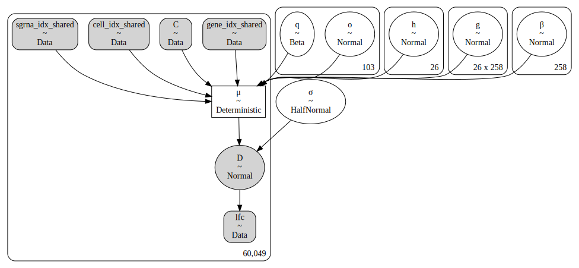
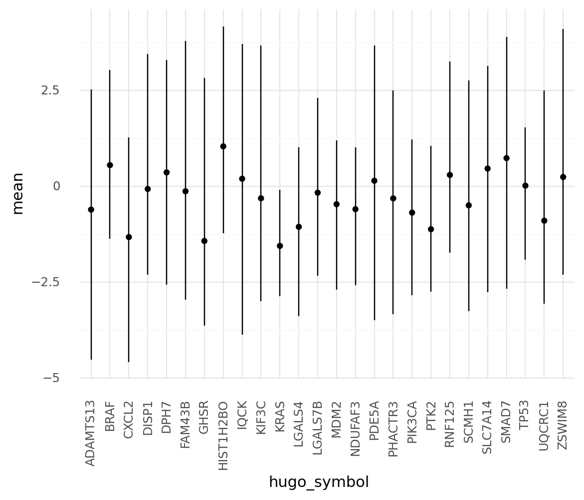
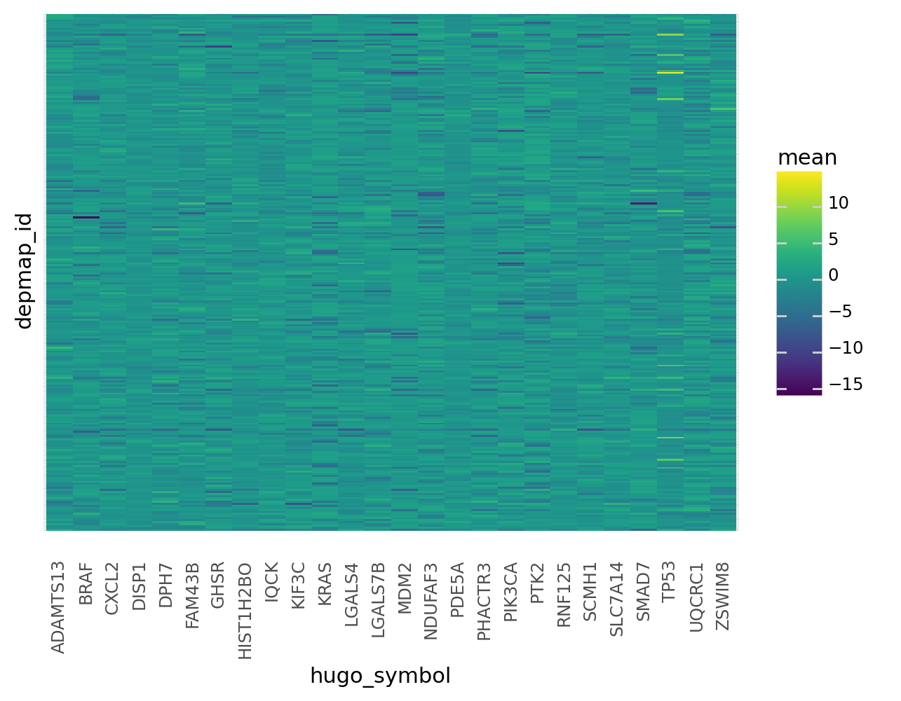
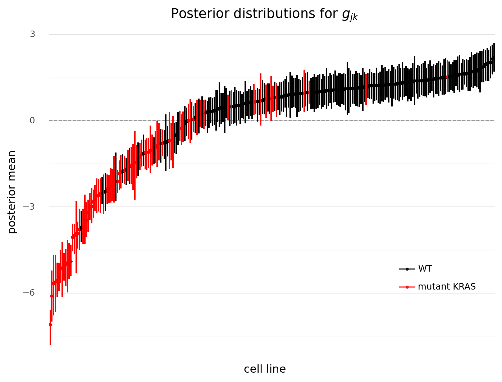
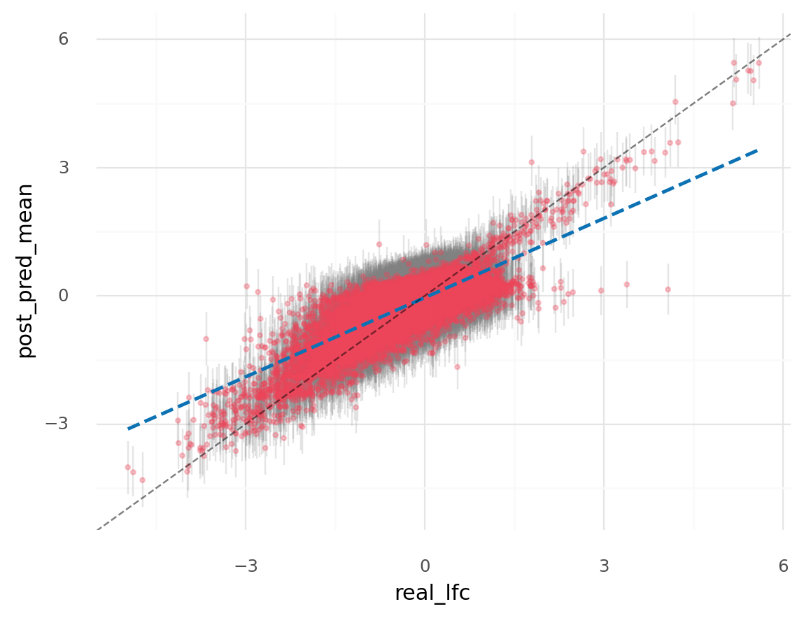
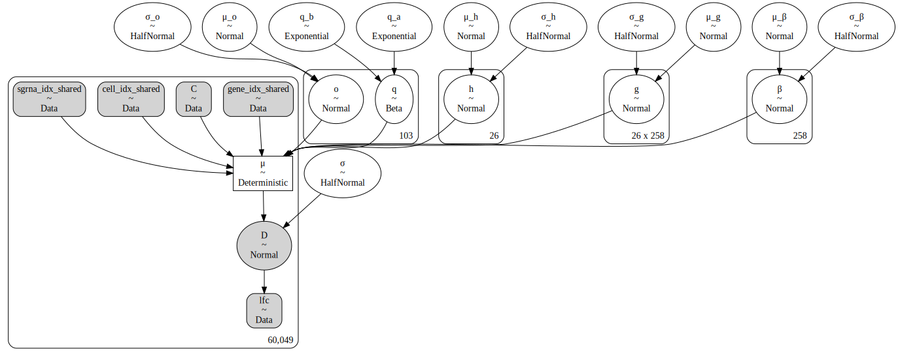
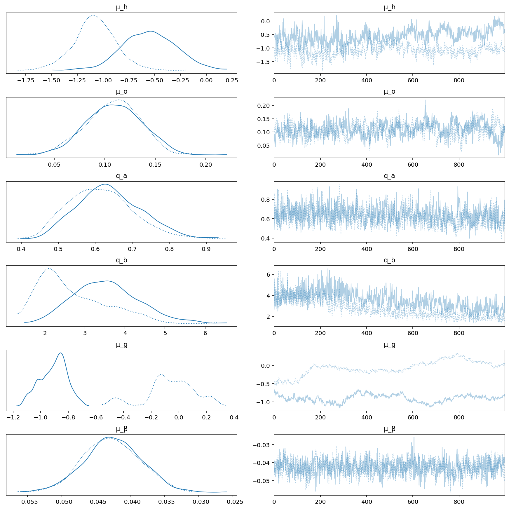

# Mimicing the CERES model in PyMC3

In this notebook, my goal is to mimic the CERES model using PyMC3.
I will take one shortcut and replace the piecewise linear spline regression to model the effect of copy number with just a single covariate and scale the copy number.

```python
import re
import string
import warnings
from pathlib import Path
from time import time
from typing import Dict, List, Optional, Tuple

import arviz as az
import ceres_models
import common_data_processing as dphelp
import matplotlib.colors as mcolors
import matplotlib.pyplot as plt
import numpy as np
import pandas as pd
import plotnine as gg
import pymc3 as pm
import pymc3_analysis as pmanalysis
import pymc3_helpers as pmhelp
import seaborn as sns
from theano import tensor as tt

notebook_tic = time()

warnings.simplefilter(action="ignore", category=UserWarning)

gg.theme_set(gg.theme_minimal())
%config InlineBackend.figure_format = "retina"

RANDOM_SEED = 1146
np.random.seed(RANDOM_SEED)

pymc3_cache_dir = pmhelp.default_cache_dir

FORCE_SAMPLING = False
```

## Data preparation

```python
data_path = Path("../modeling_data/depmap_modeling_dataframe_subsample.csv")
data = dphelp.read_achilles_data(data_path)
```

## Modeling

### CERES Model 1

This is a non-pooling model written as originally described.

```python
sgrna_idx, num_sgrnas = dphelp.get_indices_and_count(data, "sgrna")
gene_idx, num_genes = dphelp.get_indices_and_count(data, "hugo_symbol")
cell_idx, num_cells = dphelp.get_indices_and_count(data, "depmap_id")
```

```python
ceres_m1 = ceres_models.construct_ceres_m1(
    sgrna_idx=sgrna_idx,
    gene_idx=gene_idx,
    cell_idx=cell_idx,
    cn_data=data.z_log2_cn.to_numpy(),
    lfc_data=data.lfc.to_numpy(),
)

ceres_m1_sampling_results = pmhelp.read_cached_sampling(
    pymc3_cache_dir / "mimic-ceres-m1", model=ceres_m1
)

ceres_m1_az = pmhelp.samples_to_arviz(model=ceres_m1, res=ceres_m1_sampling_results)
```

    Loading cached trace and posterior sample...


    posterior predictive variable D's shape not compatible with number of chains and draws. This can mean that some draws or even whole chains are not represented.

```python
pm.model_to_graphviz(ceres_m1)
```



```python
h_post_summary = az.summary(ceres_m1_az, hdi_prob=0.89, var_names="h")
h_post_summary[["hugo_symbol"]] = data.hugo_symbol.values.categories
h_post_summary.head()
```

<div>
<style scoped>
    .dataframe tbody tr th:only-of-type {
        vertical-align: middle;
    }

    .dataframe tbody tr th {
        vertical-align: top;
    }

    .dataframe thead th {
        text-align: right;
    }
</style>
<table border="1" class="dataframe">
  <thead>
    <tr style="text-align: right;">
      <th></th>
      <th>mean</th>
      <th>sd</th>
      <th>hdi_5.5%</th>
      <th>hdi_94.5%</th>
      <th>mcse_mean</th>
      <th>mcse_sd</th>
      <th>ess_mean</th>
      <th>ess_sd</th>
      <th>ess_bulk</th>
      <th>ess_tail</th>
      <th>r_hat</th>
      <th>hugo_symbol</th>
    </tr>
  </thead>
  <tbody>
    <tr>
      <th>h[0]</th>
      <td>-0.153</td>
      <td>1.893</td>
      <td>-3.032</td>
      <td>3.011</td>
      <td>0.110</td>
      <td>0.078</td>
      <td>296.0</td>
      <td>296.0</td>
      <td>297.0</td>
      <td>548.0</td>
      <td>1.00</td>
      <td>ADAMTS13</td>
    </tr>
    <tr>
      <th>h[1]</th>
      <td>-0.180</td>
      <td>1.696</td>
      <td>-2.862</td>
      <td>2.564</td>
      <td>0.093</td>
      <td>0.066</td>
      <td>330.0</td>
      <td>330.0</td>
      <td>330.0</td>
      <td>588.0</td>
      <td>1.00</td>
      <td>BRAF</td>
    </tr>
    <tr>
      <th>h[2]</th>
      <td>-0.289</td>
      <td>1.921</td>
      <td>-3.770</td>
      <td>2.412</td>
      <td>0.104</td>
      <td>0.074</td>
      <td>341.0</td>
      <td>341.0</td>
      <td>345.0</td>
      <td>587.0</td>
      <td>1.00</td>
      <td>CXCL2</td>
    </tr>
    <tr>
      <th>h[3]</th>
      <td>-0.048</td>
      <td>1.941</td>
      <td>-3.206</td>
      <td>3.022</td>
      <td>0.096</td>
      <td>0.068</td>
      <td>405.0</td>
      <td>405.0</td>
      <td>407.0</td>
      <td>632.0</td>
      <td>1.00</td>
      <td>DISP1</td>
    </tr>
    <tr>
      <th>h[4]</th>
      <td>-0.083</td>
      <td>1.909</td>
      <td>-3.216</td>
      <td>2.915</td>
      <td>0.106</td>
      <td>0.075</td>
      <td>323.0</td>
      <td>323.0</td>
      <td>323.0</td>
      <td>517.0</td>
      <td>1.01</td>
      <td>DPH7</td>
    </tr>
  </tbody>
</table>
</div>

```python
(
    gg.ggplot(h_post_summary, gg.aes(x="hugo_symbol", y="mean"))
    + gg.geom_point()
    + gg.geom_linerange(gg.aes(ymin="hdi_5.5%", ymax="hdi_94.5%"))
    + gg.theme(axis_text_x=gg.element_text(angle=90))
)
```



    <ggplot: (8756483074690)>

```python
g_post_summary = (
    az.summary(ceres_m1_az, hdi_prob=0.89, var_names="g", kind="stats")
    .reset_index(drop=False)
    .rename(columns={"index": "g_kj"})
)

g_post_summary = pmanalysis.extract_matrix_variable_indices(
    g_post_summary,
    col="g_kj",
    idx1=data.hugo_symbol.values.categories,
    idx2=data.depmap_id.values.categories,
    idx1name="hugo_symbol",
    idx2name="depmap_id",
)

g_post_summary.head()
```

<div>
<style scoped>
    .dataframe tbody tr th:only-of-type {
        vertical-align: middle;
    }

    .dataframe tbody tr th {
        vertical-align: top;
    }

    .dataframe thead th {
        text-align: right;
    }
</style>
<table border="1" class="dataframe">
  <thead>
    <tr style="text-align: right;">
      <th></th>
      <th>g_kj</th>
      <th>mean</th>
      <th>sd</th>
      <th>hdi_5.5%</th>
      <th>hdi_94.5%</th>
      <th>hugo_symbol</th>
      <th>depmap_id</th>
    </tr>
  </thead>
  <tbody>
    <tr>
      <th>0</th>
      <td>g[0,0]</td>
      <td>0.029</td>
      <td>1.367</td>
      <td>-2.423</td>
      <td>1.991</td>
      <td>ADAMTS13</td>
      <td>ACH-000025</td>
    </tr>
    <tr>
      <th>1</th>
      <td>g[0,1]</td>
      <td>0.401</td>
      <td>1.318</td>
      <td>-1.519</td>
      <td>2.785</td>
      <td>ADAMTS13</td>
      <td>ACH-000036</td>
    </tr>
    <tr>
      <th>2</th>
      <td>g[0,2]</td>
      <td>0.613</td>
      <td>1.392</td>
      <td>-1.683</td>
      <td>2.768</td>
      <td>ADAMTS13</td>
      <td>ACH-000040</td>
    </tr>
    <tr>
      <th>3</th>
      <td>g[0,3]</td>
      <td>-2.703</td>
      <td>1.209</td>
      <td>-4.530</td>
      <td>-0.728</td>
      <td>ADAMTS13</td>
      <td>ACH-000055</td>
    </tr>
    <tr>
      <th>4</th>
      <td>g[0,4]</td>
      <td>0.269</td>
      <td>1.320</td>
      <td>-1.763</td>
      <td>2.393</td>
      <td>ADAMTS13</td>
      <td>ACH-000067</td>
    </tr>
  </tbody>
</table>
</div>

```python
(
    gg.ggplot(g_post_summary, gg.aes(x="hugo_symbol", y="depmap_id"))
    + gg.geom_tile(gg.aes(fill="mean"))
    + gg.theme(axis_text_x=gg.element_text(angle=90), axis_text_y=gg.element_blank())
)
```



    <ggplot: (8756721656965)>

```python
pos = gg.position_dodge(width=0.7)

plot_data = (
    g_post_summary[g_post_summary.hugo_symbol == "KRAS"]
    .merge(data[["depmap_id", "kras_mutation"]].reset_index(drop=True), on="depmap_id")
    .assign(kras_mutation=lambda d: [x != "WT" for x in d.kras_mutation])
    .sort_values("mean")
    .reset_index(drop=True)
    .pipe(dphelp.make_cat, col="depmap_id")
)

(
    gg.ggplot(plot_data, gg.aes(x="depmap_id", color="kras_mutation"))
    + gg.geom_hline(yintercept=0, color="black", alpha=0.3, linetype="--")
    + gg.geom_point(gg.aes(y="mean"), size=0.7, alpha=0.8)
    + gg.geom_linerange(
        gg.aes(ymin="hdi_5.5%", ymax="hdi_94.5%"),
        position=pos,
        alpha=0.5,
    )
    + gg.scale_color_manual(values=("black", "red"), labels=("WT", "mutant KRAS"))
    + gg.theme(
        axis_text_x=gg.element_blank(),
        figure_size=(8, 6),
        panel_grid_major_x=gg.element_blank(),
        legend_position=(0.8, 0.3),
        legend_title=gg.element_blank(),
    )
    + gg.labs(
        x="cell line", y="posterior mean", title=r"Posterior distributions for $g_{jk}$"
    )
)
```



    <ggplot: (8756483856327)>

```python
beta_post_summary = az.summary(ceres_m1_az, var_names="β", hdi_prob=0.89, kind="stats")
beta_post_summary[["depmap_id"]] = data.depmap_id.values.categories
beta_post_summary.head()
```

<div>
<style scoped>
    .dataframe tbody tr th:only-of-type {
        vertical-align: middle;
    }

    .dataframe tbody tr th {
        vertical-align: top;
    }

    .dataframe thead th {
        text-align: right;
    }
</style>
<table border="1" class="dataframe">
  <thead>
    <tr style="text-align: right;">
      <th></th>
      <th>mean</th>
      <th>sd</th>
      <th>hdi_5.5%</th>
      <th>hdi_94.5%</th>
      <th>depmap_id</th>
    </tr>
  </thead>
  <tbody>
    <tr>
      <th>β[0]</th>
      <td>-0.025</td>
      <td>0.031</td>
      <td>-0.074</td>
      <td>0.025</td>
      <td>ACH-000025</td>
    </tr>
    <tr>
      <th>β[1]</th>
      <td>0.044</td>
      <td>0.045</td>
      <td>-0.027</td>
      <td>0.112</td>
      <td>ACH-000036</td>
    </tr>
    <tr>
      <th>β[2]</th>
      <td>-0.014</td>
      <td>0.031</td>
      <td>-0.062</td>
      <td>0.036</td>
      <td>ACH-000040</td>
    </tr>
    <tr>
      <th>β[3]</th>
      <td>-0.019</td>
      <td>0.041</td>
      <td>-0.086</td>
      <td>0.043</td>
      <td>ACH-000055</td>
    </tr>
    <tr>
      <th>β[4]</th>
      <td>-0.013</td>
      <td>0.042</td>
      <td>-0.081</td>
      <td>0.056</td>
      <td>ACH-000067</td>
    </tr>
  </tbody>
</table>
</div>

```python
# TODO: turn this into a function for `pymc3_analysis.py`.

m1_ppc_mean = np.mean(ceres_m1_sampling_results["posterior_predictive"]["D"], axis=0)
m1_ppc_hdi = az.hdi(
    ceres_m1_sampling_results["posterior_predictive"]["D"], hdi_prob=0.89
)

ppc_df = pd.DataFrame(
    {
        "post_pred_mean": m1_ppc_mean,
        "post_pred_hdi_5.5%": m1_ppc_hdi[:, 0],
        "post_pred_hdi_94.5%": m1_ppc_hdi[:, 1],
        "real_lfc": data.lfc,
    }
)

(
    gg.ggplot(ppc_df, gg.aes(x="real_lfc", y="post_pred_mean"))
    + gg.geom_linerange(
        gg.aes(ymin="post_pred_hdi_5.5%", ymax="post_pred_hdi_94.5%"),
        alpha=0.2,
        size=0.5,
        color="gray",
    )
    + gg.geom_point(size=0.8, alpha=0.3, color="#EF4358")
    + gg.geom_smooth(
        formula="y~x", method="lm", se=False, color="#0D72B4", alpha=0.75, linetype="--"
    )
    + gg.geom_abline(slope=1, intercept=0, color="black", linetype="--", alpha=0.5)
)
```

    /home/jc604/.conda/envs/speclet/lib/python3.9/site-packages/arviz/stats/stats.py:493: FutureWarning: hdi currently interprets 2d data as (draw, shape) but this will change in a future release to (chain, draw) for coherence with other functions



    <ggplot: (8756471817469)>

---

### CERES Model 2

This model has the same structure for the linear model, but now introduces partial pooling by adding hyper-priors to each component of the model.

```python
ceres_m2 = ceres_models.construct_ceres_m2(
    sgrna_idx=sgrna_idx,
    gene_idx=gene_idx,
    cell_idx=cell_idx,
    cn_data=data.z_log2_cn.to_numpy(),
    lfc_data=data.lfc.to_numpy(),
)

ceres_m2_sampling_results = pmhelp.read_cached_sampling(
    pymc3_cache_dir / "mimic-ceres-m2", model=ceres_m2
)

ceres_m2_az = pmhelp.samples_to_arviz(model=ceres_m2, res=ceres_m2_sampling_results)
```

    Loading cached trace and posterior sample...


    posterior predictive variable D's shape not compatible with number of chains and draws. This can mean that some draws or even whole chains are not represented.

```python
pm.model_to_graphviz(ceres_m2)
```



```python
az.plot_trace(ceres_m2_az, var_names=["μ_h", "μ_o", "q_a", "q_b", "μ_g", "μ_β"])
plt.show()
```



```python

```

```python

```

```python

```

```python

```

```python

```

```python

```

```python

```

```python

```

```python

```

```python

```

---

```python
notebook_toc = time()
print(f"execution time: {(notebook_toc - notebook_tic) / 60:.2f} minutes")
```

    execution time: 1.43 minutes

```python
%load_ext watermark
%watermark -d -u -v -iv -b -h -m
```

    Last updated: 2021-02-02

    Python implementation: CPython
    Python version       : 3.9.1
    IPython version      : 7.19.0

    Compiler    : GCC 9.3.0
    OS          : Linux
    Release     : 3.10.0-1062.el7.x86_64
    Machine     : x86_64
    Processor   : x86_64
    CPU cores   : 28
    Architecture: 64bit

    Hostname: compute-e-16-229.o2.rc.hms.harvard.edu

    Git branch: data-subset-model

    re        : 2.2.1
    seaborn   : 0.11.1
    numpy     : 1.19.5
    arviz     : 0.11.0
    matplotlib: 3.3.3
    theano    : 1.0.5
    pandas    : 1.2.0
    pymc3     : 3.9.3
    plotnine  : 0.7.1
