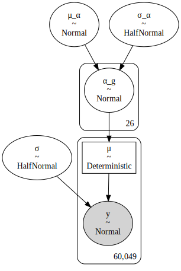
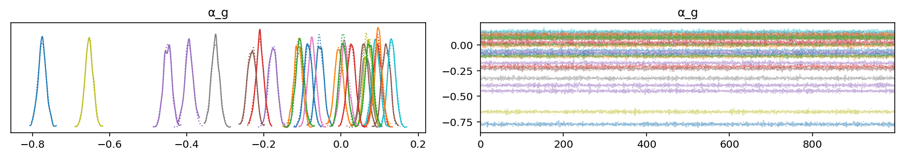

# A hierarchcial linear regression to fit CRISPR-Cas9 screen results

The CERES model was replicated using PyMC3 in []().
This notebook is intended to experiment with various hierarchical model architectures on a sub-sample of the real DepMap data.

## Set-up

```python
import re
import string
import warnings
from pathlib import Path
from time import time

import arviz as az
import matplotlib.colors as mcolors
import matplotlib.pyplot as plt
import numpy as np
import pandas as pd
import plotnine as gg
import pymc3 as pm
import pymc3_helpers as pmhelp
import seaborn as sns
import string_functions as stringr
from common_data_processing import get_indices, make_cat, zscale_cna_by_group
from theano import tensor as tt

notebook_tic = time()

warnings.simplefilter(action="ignore", category=UserWarning)

gg.theme_set(gg.theme_minimal())

%config InlineBackend.figure_format = 'retina'

RANDOM_SEED = 824
np.random.seed(RANDOM_SEED)

pymc3_cache_dir = Path("pymc3_model_cache")
```

    WARNING (theano.configdefaults): install mkl with `conda install mkl-service`: No module named 'mkl'

## Data preparation

```python
data_path = Path("../modeling_data/depmap_modeling_dataframe_subsample.csv")
data = pd.read_csv(data_path)

data = data.sort_values(["hugo_symbol", "sgrna"]).reset_index(drop=True)
for col in ("hugo_symbol", "depmap_id", "sgrna"):
    data = make_cat(data, col, ordered=True, sort_cats=False)


data = zscale_cna_by_group(data, cn_max=10)

data.head(n=7)
```

<div>
<style scoped>
    .dataframe tbody tr th:only-of-type {
        vertical-align: middle;
    }

    .dataframe tbody tr th {
        vertical-align: top;
    }

    .dataframe thead th {
        text-align: right;
    }
</style>
<table border="1" class="dataframe">
  <thead>
    <tr style="text-align: right;">
      <th></th>
      <th>sgrna</th>
      <th>replicate_id</th>
      <th>lfc</th>
      <th>pdna_batch</th>
      <th>passes_qc</th>
      <th>depmap_id</th>
      <th>primary_or_metastasis</th>
      <th>lineage</th>
      <th>lineage_subtype</th>
      <th>kras_mutation</th>
      <th>...</th>
      <th>gene_cn</th>
      <th>n_muts</th>
      <th>any_deleterious</th>
      <th>variant_classification</th>
      <th>is_deleterious</th>
      <th>is_tcga_hotspot</th>
      <th>is_cosmic_hotspot</th>
      <th>mutated_at_guide_location</th>
      <th>rna_expr</th>
      <th>gene_cn_z</th>
    </tr>
  </thead>
  <tbody>
    <tr>
      <th>0</th>
      <td>CCACCCACAGACGCTCAGCA</td>
      <td>42-mg-ba-311cas9_repa_p6_batch3</td>
      <td>-0.005539</td>
      <td>3</td>
      <td>True</td>
      <td>ACH-000323</td>
      <td>Primary</td>
      <td>central_nervous_system</td>
      <td>glioma</td>
      <td>WT</td>
      <td>...</td>
      <td>1.192006</td>
      <td>0</td>
      <td>False</td>
      <td>NaN</td>
      <td>NaN</td>
      <td>NaN</td>
      <td>NaN</td>
      <td>False</td>
      <td>0.310340</td>
      <td>-1.139430</td>
    </tr>
    <tr>
      <th>1</th>
      <td>CCACCCACAGACGCTCAGCA</td>
      <td>42-mg-ba-311cas9_repb_p6_batch3</td>
      <td>0.011213</td>
      <td>3</td>
      <td>True</td>
      <td>ACH-000323</td>
      <td>Primary</td>
      <td>central_nervous_system</td>
      <td>glioma</td>
      <td>WT</td>
      <td>...</td>
      <td>1.192006</td>
      <td>0</td>
      <td>False</td>
      <td>NaN</td>
      <td>NaN</td>
      <td>NaN</td>
      <td>NaN</td>
      <td>False</td>
      <td>0.310340</td>
      <td>-1.139430</td>
    </tr>
    <tr>
      <th>2</th>
      <td>CCACCCACAGACGCTCAGCA</td>
      <td>8-mg-ba-311cas9_repa_p5_batch3</td>
      <td>-0.267030</td>
      <td>3</td>
      <td>True</td>
      <td>ACH-000137</td>
      <td>Primary</td>
      <td>central_nervous_system</td>
      <td>glioma</td>
      <td>WT</td>
      <td>...</td>
      <td>1.653166</td>
      <td>0</td>
      <td>False</td>
      <td>NaN</td>
      <td>NaN</td>
      <td>NaN</td>
      <td>NaN</td>
      <td>False</td>
      <td>1.891419</td>
      <td>-0.252396</td>
    </tr>
    <tr>
      <th>3</th>
      <td>CCACCCACAGACGCTCAGCA</td>
      <td>8-mg-ba-311cas9_repb_p5_batch3</td>
      <td>0.340474</td>
      <td>3</td>
      <td>True</td>
      <td>ACH-000137</td>
      <td>Primary</td>
      <td>central_nervous_system</td>
      <td>glioma</td>
      <td>WT</td>
      <td>...</td>
      <td>1.653166</td>
      <td>0</td>
      <td>False</td>
      <td>NaN</td>
      <td>NaN</td>
      <td>NaN</td>
      <td>NaN</td>
      <td>False</td>
      <td>1.891419</td>
      <td>-0.252396</td>
    </tr>
    <tr>
      <th>4</th>
      <td>CCACCCACAGACGCTCAGCA</td>
      <td>9505bik-311cas9-repa-p6_batch3</td>
      <td>0.584099</td>
      <td>3</td>
      <td>True</td>
      <td>ACH-001999</td>
      <td>NaN</td>
      <td>pancreas</td>
      <td>exocrine</td>
      <td>G12V</td>
      <td>...</td>
      <td>1.128780</td>
      <td>0</td>
      <td>False</td>
      <td>NaN</td>
      <td>NaN</td>
      <td>NaN</td>
      <td>NaN</td>
      <td>False</td>
      <td>0.985500</td>
      <td>-1.261044</td>
    </tr>
    <tr>
      <th>5</th>
      <td>CCACCCACAGACGCTCAGCA</td>
      <td>a427-311cas9 rep a p4_batch3</td>
      <td>0.042829</td>
      <td>3</td>
      <td>True</td>
      <td>ACH-000757</td>
      <td>NaN</td>
      <td>lung</td>
      <td>NSCLC</td>
      <td>G12D</td>
      <td>...</td>
      <td>1.145699</td>
      <td>1</td>
      <td>False</td>
      <td>silent</td>
      <td>FALSE</td>
      <td>FALSE</td>
      <td>FALSE</td>
      <td>False</td>
      <td>1.555816</td>
      <td>-1.228501</td>
    </tr>
    <tr>
      <th>6</th>
      <td>CCACCCACAGACGCTCAGCA</td>
      <td>a427-311cas9 rep b p4_batch3</td>
      <td>0.114719</td>
      <td>3</td>
      <td>True</td>
      <td>ACH-000757</td>
      <td>NaN</td>
      <td>lung</td>
      <td>NSCLC</td>
      <td>G12D</td>
      <td>...</td>
      <td>1.145699</td>
      <td>1</td>
      <td>False</td>
      <td>silent</td>
      <td>FALSE</td>
      <td>FALSE</td>
      <td>FALSE</td>
      <td>False</td>
      <td>1.555816</td>
      <td>-1.228501</td>
    </tr>
  </tbody>
</table>
<p>7 rows × 28 columns</p>
</div>

```python
data.describe()
```

<div>
<style scoped>
    .dataframe tbody tr th:only-of-type {
        vertical-align: middle;
    }

    .dataframe tbody tr th {
        vertical-align: top;
    }

    .dataframe thead th {
        text-align: right;
    }
</style>
<table border="1" class="dataframe">
  <thead>
    <tr style="text-align: right;">
      <th></th>
      <th>lfc</th>
      <th>pdna_batch</th>
      <th>n_alignments</th>
      <th>chromosome</th>
      <th>chrom_pos</th>
      <th>segment_mean</th>
      <th>segment_cn</th>
      <th>log2_gene_cn_p1</th>
      <th>gene_cn</th>
      <th>n_muts</th>
      <th>rna_expr</th>
      <th>gene_cn_z</th>
    </tr>
  </thead>
  <tbody>
    <tr>
      <th>count</th>
      <td>60049.000000</td>
      <td>60049.000000</td>
      <td>60049.000000</td>
      <td>60049.000000</td>
      <td>6.004900e+04</td>
      <td>5.984300e+04</td>
      <td>5.984300e+04</td>
      <td>6.004900e+04</td>
      <td>6.004900e+04</td>
      <td>60049.000000</td>
      <td>60049.000000</td>
      <td>6.004900e+04</td>
    </tr>
    <tr>
      <th>mean</th>
      <td>-0.110098</td>
      <td>2.861063</td>
      <td>1.029126</td>
      <td>8.796117</td>
      <td>8.199159e+07</td>
      <td>1.052517e+00</td>
      <td>3.673521e+12</td>
      <td>1.012354e+00</td>
      <td>1.894709e+00</td>
      <td>0.097654</td>
      <td>2.957374</td>
      <td>1.272609e-16</td>
    </tr>
    <tr>
      <th>std</th>
      <td>0.562585</td>
      <td>0.355663</td>
      <td>0.168162</td>
      <td>6.526117</td>
      <td>6.014320e+07</td>
      <td>8.296245e-01</td>
      <td>3.177012e+14</td>
      <td>2.294065e-01</td>
      <td>4.336833e+00</td>
      <td>0.354338</td>
      <td>2.292989</td>
      <td>1.000008e+00</td>
    </tr>
    <tr>
      <th>min</th>
      <td>-4.972325</td>
      <td>2.000000</td>
      <td>1.000000</td>
      <td>1.000000</td>
      <td>7.675103e+06</td>
      <td>9.598765e-08</td>
      <td>1.000000e+00</td>
      <td>5.506197e-09</td>
      <td>5.506197e-09</td>
      <td>0.000000</td>
      <td>0.000000</td>
      <td>-3.065984e+00</td>
    </tr>
    <tr>
      <th>25%</th>
      <td>-0.344279</td>
      <td>3.000000</td>
      <td>1.000000</td>
      <td>3.000000</td>
      <td>3.201892e+07</td>
      <td>8.530658e-01</td>
      <td>1.806335e+00</td>
      <td>8.900191e-01</td>
      <td>1.435176e+00</td>
      <td>0.000000</td>
      <td>0.790772</td>
      <td>-5.710118e-01</td>
    </tr>
    <tr>
      <th>50%</th>
      <td>-0.033168</td>
      <td>3.000000</td>
      <td>1.000000</td>
      <td>8.000000</td>
      <td>5.977335e+07</td>
      <td>1.005954e+00</td>
      <td>2.008272e+00</td>
      <td>1.004289e+00</td>
      <td>1.729965e+00</td>
      <td>0.000000</td>
      <td>2.895303</td>
      <td>-1.340551e-01</td>
    </tr>
    <tr>
      <th>75%</th>
      <td>0.218036</td>
      <td>3.000000</td>
      <td>1.000000</td>
      <td>16.000000</td>
      <td>1.375787e+08</td>
      <td>1.154679e+00</td>
      <td>2.226348e+00</td>
      <td>1.107473e+00</td>
      <td>2.026700e+00</td>
      <td>0.000000</td>
      <td>4.698218</td>
      <td>4.430254e-01</td>
    </tr>
    <tr>
      <th>max</th>
      <td>5.598174</td>
      <td>4.000000</td>
      <td>2.000000</td>
      <td>20.000000</td>
      <td>2.230033e+08</td>
      <td>5.460920e+01</td>
      <td>2.747932e+16</td>
      <td>5.797252e+00</td>
      <td>3.283930e+02</td>
      <td>8.000000</td>
      <td>11.496005</td>
      <td>1.055240e+01</td>
    </tr>
  </tbody>
</table>
</div>

```python
data.shape
```

    (60049, 28)

## EDA

```python
data.columns
```

    Index(['sgrna', 'replicate_id', 'lfc', 'pdna_batch', 'passes_qc', 'depmap_id',
           'primary_or_metastasis', 'lineage', 'lineage_subtype', 'kras_mutation',
           'genome_alignment', 'n_alignments', 'hugo_symbol', 'chromosome',
           'chrom_pos', 'segment_mean', 'segment_cn', 'log2_gene_cn_p1', 'gene_cn',
           'n_muts', 'any_deleterious', 'variant_classification', 'is_deleterious',
           'is_tcga_hotspot', 'is_cosmic_hotspot', 'mutated_at_guide_location',
           'rna_expr', 'gene_cn_z'],
          dtype='object')

```python
(
    gg.ggplot(data, gg.aes(x="hugo_symbol", y="lfc"))
    + gg.geom_boxplot(outlier_alpha=0.3, outlier_size=0.5)
    + gg.theme(axis_text_x=gg.element_text(angle=90, hjust=0.5, vjust=1))
    + gg.labs(x=None, y="log fold change")
)
```


    <ggplot: (8727579323573)>

```python
p = (
    gg.ggplot(data, gg.aes(x="gene_cn_z", y="lfc"))
    + gg.geom_point(gg.aes(color="hugo_symbol"), alpha=0.1, size=0.5)
    + gg.geom_smooth()
    + gg.scale_color_discrete(
        guide=gg.guide_legend(override_aes={"size": 1, "alpha": 1})
    )
    + gg.labs(
        x="gene cn (z-scaled)",
        y="log fold change",
        title="Correlation between CN and LFC",
        color="gene",
    )
)
p
```


    <ggplot: (8727487816701)>

```python
(
    p
    + gg.geom_smooth(
        gg.aes(color="hugo_symbol"),
        linetype="--",
        alpha=0.5,
        se=False,
        show_legend=False,
    )
)
```


    <ggplot: (8727496995482)>

```python
d = data.groupby(["lineage", "hugo_symbol"]).mean().reset_index(drop=False)
d["lineage"] = stringr.str_replace(d["lineage"], "_", " ")
d["lineage"] = stringr.str_wrap(d["lineage"], width=10)

(
    gg.ggplot(d, gg.aes(x="lineage", y="hugo_symbol", fill="lfc"))
    + gg.geom_tile()
    + gg.scale_x_discrete(expand=(0, 0.5, 0, 0.5))
    + gg.scale_y_discrete(expand=(0, 0.5, 0, 0.5))
)
```


    <ggplot: (8727486981852)>

```python
data.head()
```

<div>
<style scoped>
    .dataframe tbody tr th:only-of-type {
        vertical-align: middle;
    }

    .dataframe tbody tr th {
        vertical-align: top;
    }

    .dataframe thead th {
        text-align: right;
    }
</style>
<table border="1" class="dataframe">
  <thead>
    <tr style="text-align: right;">
      <th></th>
      <th>sgrna</th>
      <th>replicate_id</th>
      <th>lfc</th>
      <th>pdna_batch</th>
      <th>passes_qc</th>
      <th>depmap_id</th>
      <th>primary_or_metastasis</th>
      <th>lineage</th>
      <th>lineage_subtype</th>
      <th>kras_mutation</th>
      <th>...</th>
      <th>gene_cn</th>
      <th>n_muts</th>
      <th>any_deleterious</th>
      <th>variant_classification</th>
      <th>is_deleterious</th>
      <th>is_tcga_hotspot</th>
      <th>is_cosmic_hotspot</th>
      <th>mutated_at_guide_location</th>
      <th>rna_expr</th>
      <th>gene_cn_z</th>
    </tr>
  </thead>
  <tbody>
    <tr>
      <th>0</th>
      <td>CCACCCACAGACGCTCAGCA</td>
      <td>42-mg-ba-311cas9_repa_p6_batch3</td>
      <td>-0.005539</td>
      <td>3</td>
      <td>True</td>
      <td>ACH-000323</td>
      <td>Primary</td>
      <td>central_nervous_system</td>
      <td>glioma</td>
      <td>WT</td>
      <td>...</td>
      <td>1.192006</td>
      <td>0</td>
      <td>False</td>
      <td>NaN</td>
      <td>NaN</td>
      <td>NaN</td>
      <td>NaN</td>
      <td>False</td>
      <td>0.310340</td>
      <td>-1.139430</td>
    </tr>
    <tr>
      <th>1</th>
      <td>CCACCCACAGACGCTCAGCA</td>
      <td>42-mg-ba-311cas9_repb_p6_batch3</td>
      <td>0.011213</td>
      <td>3</td>
      <td>True</td>
      <td>ACH-000323</td>
      <td>Primary</td>
      <td>central_nervous_system</td>
      <td>glioma</td>
      <td>WT</td>
      <td>...</td>
      <td>1.192006</td>
      <td>0</td>
      <td>False</td>
      <td>NaN</td>
      <td>NaN</td>
      <td>NaN</td>
      <td>NaN</td>
      <td>False</td>
      <td>0.310340</td>
      <td>-1.139430</td>
    </tr>
    <tr>
      <th>2</th>
      <td>CCACCCACAGACGCTCAGCA</td>
      <td>8-mg-ba-311cas9_repa_p5_batch3</td>
      <td>-0.267030</td>
      <td>3</td>
      <td>True</td>
      <td>ACH-000137</td>
      <td>Primary</td>
      <td>central_nervous_system</td>
      <td>glioma</td>
      <td>WT</td>
      <td>...</td>
      <td>1.653166</td>
      <td>0</td>
      <td>False</td>
      <td>NaN</td>
      <td>NaN</td>
      <td>NaN</td>
      <td>NaN</td>
      <td>False</td>
      <td>1.891419</td>
      <td>-0.252396</td>
    </tr>
    <tr>
      <th>3</th>
      <td>CCACCCACAGACGCTCAGCA</td>
      <td>8-mg-ba-311cas9_repb_p5_batch3</td>
      <td>0.340474</td>
      <td>3</td>
      <td>True</td>
      <td>ACH-000137</td>
      <td>Primary</td>
      <td>central_nervous_system</td>
      <td>glioma</td>
      <td>WT</td>
      <td>...</td>
      <td>1.653166</td>
      <td>0</td>
      <td>False</td>
      <td>NaN</td>
      <td>NaN</td>
      <td>NaN</td>
      <td>NaN</td>
      <td>False</td>
      <td>1.891419</td>
      <td>-0.252396</td>
    </tr>
    <tr>
      <th>4</th>
      <td>CCACCCACAGACGCTCAGCA</td>
      <td>9505bik-311cas9-repa-p6_batch3</td>
      <td>0.584099</td>
      <td>3</td>
      <td>True</td>
      <td>ACH-001999</td>
      <td>NaN</td>
      <td>pancreas</td>
      <td>exocrine</td>
      <td>G12V</td>
      <td>...</td>
      <td>1.128780</td>
      <td>0</td>
      <td>False</td>
      <td>NaN</td>
      <td>NaN</td>
      <td>NaN</td>
      <td>NaN</td>
      <td>False</td>
      <td>0.985500</td>
      <td>-1.261044</td>
    </tr>
  </tbody>
</table>
<p>5 rows × 28 columns</p>
</div>

## Modeling

### Model 1. Hierarchical model by gene with no other variables

$
y \sim \mathcal{N}(\mu, \sigma) \\
\mu = \alpha_{g} \\
\alpha_g \sim \mathcal{N}(\mu_\alpha, \sigma_\alpha) \\
\mu_\alpha \sim \mathcal{N}(0, 5) \\
\sigma_\alpha \sim \text{HalfNormal}(0, 5) \\
\sigma \sim \text{HalfNormal}(0, 5)
$

```python
gene_idx = get_indices(data, "hugo_symbol")
num_genes = data["hugo_symbol"].nunique()
with pm.Model() as m1:
    σ_α = pm.HalfNormal("σ_α", 5.0)
    μ_α = pm.Normal("μ_α", 0, 5)

    α_g = pm.Normal("α_g", μ_α, σ_α, shape=num_genes)
    μ = pm.Deterministic("μ", α_g[gene_idx])
    σ = pm.HalfNormal("σ", 5.0)

    y = pm.Normal("y", mu=μ, sigma=σ, observed=data.lfc)
```

```python
pm.model_to_graphviz(m1)
```



```python
m1_cache_dir = pymc3_cache_dir / "subset_speclet_m1"

m1_sampling_results = pmhelp.pymc3_sampling_procedure(
    model=m1,
    num_mcmc=1000,
    tune=1000,
    chains=2,
    cores=2,
    random_seed=RANDOM_SEED,
    cache_dir=pymc3_cache_dir / m1_cache_dir,
    sample_kwargs={"init": "advi+adapt_diag", "n_init": 40000},
)
```

    Loading cached trace and posterior sample...

```python
m1_az = pmhelp.samples_to_arviz(model=m1, res=m1_sampling_results)
```

    arviz.data.io_pymc3 - WARNING - posterior predictive variable y's shape not compatible with number of chains and draws. This can mean that some draws or even whole chains are not represented.

```python
az.plot_trace(m1_az, var_names="α_g", compact=True)
plt.show()
```



### Model 2. Add a layer for gene above sgRNA

$
y \sim \mathcal{N}(\mu, \sigma) \\
\mu = \alpha_s \\
\quad \alpha_s \sim \mathcal{N}(\mu_\alpha, \sigma_\alpha) \\
\qquad \mu_\alpha = g_\alpha \\
\qquad \quad g_\alpha \sim \mathcal{N}(\mu_{g_\alpha}, \sigma_{g_\alpha}) \\
\qquad \qquad \mu_{g_\alpha} \sim \mathcal{N}(0, 5) \\
\qquad \qquad \sigma_{g_\alpha} \sim \text{Exp}(1) \\
\qquad \sigma_\alpha \sim \text{Exp}(\sigma_{\sigma_\alpha}) \\
\qquad \quad \sigma_{\sigma_\alpha} \sim \text{Exp}(1) \\
\sigma \sim \text{HalfNormal}(3)
$

```python
num_sgrnas = data["sgrna"].nunique()
num_genes = data["hugo_symbol"].nunique()
print(f"{num_sgrnas} sgRNAs from {num_genes} genes")

sgrna_idx = get_indices(data, "sgrna")

sgrna_to_gene_map = data[["sgrna", "hugo_symbol"]].drop_duplicates()
gene_idx = get_indices(sgrna_to_gene_map, "hugo_symbol")
```

    103 sgRNAs from 26 genes

```python
with pm.Model() as m2:
    μ_g = pm.Normal("μ_g", 0, 5)
    σ_g = pm.Exponential("σ_g", 1)

    g_s = pm.Normal("g_s", μ_g, σ_g, shape=num_genes)

    μ_α_s = pm.Deterministic("μ_α_s", g_s[gene_idx])
    σ_α_s = pm.Exponential("σ_α_s", 1)

    α_s = pm.Normal("α_s", μ_α_s, σ_α_s, shape=num_sgrnas)

    μ = pm.Deterministic("μ", α_s[sgrna_idx])
    σ = pm.HalfNormal("σ", 5)

    y = pm.Normal("y", μ, σ, observed=data.lfc)
```

```python
pm.model_to_graphviz(m2)
```


```python
m2_cache_dir = pymc3_cache_dir / "subset_speclet_m2"

m2_sampling_results = pmhelp.pymc3_sampling_procedure(
    model=m2,
    num_mcmc=2000,
    tune=4000,
    chains=2,
    cores=2,
    random_seed=RANDOM_SEED,
    cache_dir=pymc3_cache_dir / m2_cache_dir,
    force=False,
    sample_kwargs={"init": "advi+adapt_diag", "n_init": 40000, "target_accept": 0.9},
)
```

    Loading cached trace and posterior sample...

```python
m2_az = pmhelp.samples_to_arviz(model=m2, res=m2_sampling_results)
```

    arviz.data.io_pymc3 - WARNING - posterior predictive variable y's shape not compatible with number of chains and draws. This can mean that some draws or even whole chains are not represented.

```python
az.plot_trace(m2_az, var_names=["μ_g", "σ_g", "g_s", "α_s"], compact=True)
plt.show()
```


```python
az.summary(m2_az, var_names=["μ_g", "σ_g", "σ_α_s"])
```

<div>
<style scoped>
    .dataframe tbody tr th:only-of-type {
        vertical-align: middle;
    }

    .dataframe tbody tr th {
        vertical-align: top;
    }

    .dataframe thead th {
        text-align: right;
    }
</style>
<table border="1" class="dataframe">
  <thead>
    <tr style="text-align: right;">
      <th></th>
      <th>mean</th>
      <th>sd</th>
      <th>hdi_3%</th>
      <th>hdi_97%</th>
      <th>mcse_mean</th>
      <th>mcse_sd</th>
      <th>ess_mean</th>
      <th>ess_sd</th>
      <th>ess_bulk</th>
      <th>ess_tail</th>
      <th>r_hat</th>
    </tr>
  </thead>
  <tbody>
    <tr>
      <th>μ_g</th>
      <td>-0.109</td>
      <td>0.049</td>
      <td>-0.203</td>
      <td>-0.020</td>
      <td>0.001</td>
      <td>0.0</td>
      <td>6430.0</td>
      <td>5641.0</td>
      <td>6415.0</td>
      <td>3021.0</td>
      <td>1.0</td>
    </tr>
    <tr>
      <th>σ_g</th>
      <td>0.221</td>
      <td>0.043</td>
      <td>0.145</td>
      <td>0.302</td>
      <td>0.001</td>
      <td>0.0</td>
      <td>4227.0</td>
      <td>4212.0</td>
      <td>4158.0</td>
      <td>3118.0</td>
      <td>1.0</td>
    </tr>
    <tr>
      <th>σ_α_s</th>
      <td>0.228</td>
      <td>0.019</td>
      <td>0.194</td>
      <td>0.264</td>
      <td>0.000</td>
      <td>0.0</td>
      <td>5461.0</td>
      <td>5341.0</td>
      <td>5560.0</td>
      <td>3564.0</td>
      <td>1.0</td>
    </tr>
  </tbody>
</table>
</div>

```python
g_alpha_post = pd.DataFrame(np.asarray(m2_az.posterior["g_s"]).reshape(-1, num_genes))
ordered_genes = (
    sgrna_to_gene_map.sort_values("hugo_symbol").hugo_symbol.drop_duplicates().to_list()
)
g_alpha_post.columns = ordered_genes
g_alpha_post = g_alpha_post.melt(var_name="hugo_symbol", value_name="value")

g_alpha_summary = az.summary(m2_az, var_names="g_s", kind="stats", hdi_prob=0.89)
g_alpha_summary["hugo_symbol"] = ordered_genes

point_color = "#FA6A48"
(
    gg.ggplot(g_alpha_post.sample(frac=0.25), gg.aes(x="hugo_symbol", y="value"))
    + gg.geom_violin(color=None, fill="grey", alpha=0.5)
    + gg.geom_linerange(
        gg.aes(x="hugo_symbol", y="mean", ymin="hdi_5.5%", ymax="hdi_94.5%"),
        data=g_alpha_summary,
        color=point_color,
    )
    + gg.geom_point(
        gg.aes(x="hugo_symbol", y="mean"), data=g_alpha_summary, color="black"
    )
    + gg.scale_y_continuous(expand=(0.02, 0, 0.02, 0))
    + gg.theme(axis_text_x=gg.element_text(angle=90))
    + gg.labs(x=None, y=r"$g_\alpha$", title="Posterior estimates for gene value")
)
```


    <ggplot: (8727265671349)>

```python
alpha_s_summary = az.summary(m2_az, var_names="α_s", kind="stats", hdi_prob=0.89)
alpha_s_summary["sgrna"] = sgrna_to_gene_map.sgrna.to_list()
alpha_s_summary["hugo_symbol"] = sgrna_to_gene_map.hugo_symbol.to_list()

(
    gg.ggplot(alpha_s_summary, gg.aes(x="hugo_symbol"))
    + gg.geom_hline(yintercept=0, color="black", alpha=0.3)
    + gg.geom_linerange(gg.aes(ymin="hdi_5.5%", ymax="hdi_94.5%", color="sgrna"))
    + gg.geom_point(gg.aes(y="mean", color="sgrna"), size=2.5, alpha=0.8)
    + gg.geom_point(
        gg.aes(x="hugo_symbol", y="mean"),
        data=g_alpha_summary,
        color="black",
        shape="+",
        size=3,
    )
    + gg.scale_color_discrete(guide=None)
    + gg.theme(figure_size=(10, 5), axis_text_x=gg.element_text(angle=90))
    + gg.labs(x=None, y=r"$\alpha_s$", title="Posterior estimates for sgRNA values")
)
```


    <ggplot: (8727264812704)>

```python
ppc_m2_arry = np.asarray(m2_az.posterior_predictive["y"]).reshape(-1, data.shape[0])
ppc_m2_summary = pd.DataFrame(
    az.hdi(ppc_m2_arry, hdi_prob=0.89), columns=("hdi_5.5%", "hdi_94.5%")
)
ppc_m2_summary["mean"] = np.mean(ppc_m2_arry, axis=0)
ppc_m2_summary = ppc_m2_summary.reset_index(drop=True).merge(
    data[["sgrna", "hugo_symbol", "lfc"]], left_index=True, right_index=True
)
```

    /home/jc604/.conda/envs/speclet/lib/python3.8/site-packages/arviz/stats/stats.py:484: FutureWarning: hdi currently interprets 2d data as (draw, shape) but this will change in a future release to (chain, draw) for coherence with other functions

```python
(
    gg.ggplot(ppc_m2_summary, gg.aes(x="sgrna"))
    + gg.facet_wrap("hugo_symbol", scales="free", ncol=4)
    + gg.geom_boxplot(gg.aes(y="mean"), outlier_alpha=0)
    + gg.theme(
        axis_text_x=gg.element_blank(),
        figure_size=(8, 10),
        subplots_adjust={"hspace": 0.4, "wspace": 0.6},
        strip_text=gg.element_text(weight="bold"),
    )
    + gg.labs(x="sgRNA", y="mean posterior prediction", title="Posteior predictions")
)
```


    <ggplot: (8727486895336)>

```python
ppc_m2_summary = ppc_m2_summary.assign(error=lambda d: d["lfc"] - d["mean"])
(
    gg.ggplot(ppc_m2_summary, gg.aes(x="hugo_symbol", y="error"))
    + gg.geom_hline(yintercept=0)
    + gg.geom_jitter(
        gg.aes(color="abs(error)"), width=0.35, height=0, size=0.5, alpha=0.3
    )
    + gg.scale_color_distiller(type="seq", palette="RdPu", direction=1)
    + gg.theme(axis_text_x=gg.element_text(rotation=90))
    + gg.labs(
        x=None,
        y="true - predicted LFC",
        title="Posterior prediction error",
        color="error",
    )
)
```


    <ggplot: (8727262118843)>

```python
genes_with_large_error = ["KRAS", "MDM2", "PTK2", "TP53"]

for col in ["n_muts", "any_deleterious", "kras_mutation"]:
    ppc_m2_summary[col] = data[col].values

ppc2_m2_summary_mutations = ppc_m2_summary[
    ppc_m2_summary.hugo_symbol.isin(genes_with_large_error)
].reset_index()
ppc2_m2_summary_mutations["is_mutated"] = ppc2_m2_summary_mutations["n_muts"].values > 0
ppc2_m2_summary_mutations["sgrna_idx"] = get_indices(ppc2_m2_summary_mutations, "sgrna")
ppc2_m2_summary_mutations.head(5)
```

<div>
<style scoped>
    .dataframe tbody tr th:only-of-type {
        vertical-align: middle;
    }

    .dataframe tbody tr th {
        vertical-align: top;
    }

    .dataframe thead th {
        text-align: right;
    }
</style>
<table border="1" class="dataframe">
  <thead>
    <tr style="text-align: right;">
      <th></th>
      <th>index</th>
      <th>hdi_5.5%</th>
      <th>hdi_94.5%</th>
      <th>mean</th>
      <th>sgrna</th>
      <th>hugo_symbol</th>
      <th>lfc</th>
      <th>error</th>
      <th>n_muts</th>
      <th>any_deleterious</th>
      <th>kras_mutation</th>
      <th>is_mutated</th>
      <th>sgrna_idx</th>
    </tr>
  </thead>
  <tbody>
    <tr>
      <th>0</th>
      <td>22737</td>
      <td>-1.706223</td>
      <td>-0.146976</td>
      <td>-0.945101</td>
      <td>AATTACTACTTGCTTCCTGT</td>
      <td>KRAS</td>
      <td>-0.491495</td>
      <td>0.453606</td>
      <td>0</td>
      <td>False</td>
      <td>WT</td>
      <td>False</td>
      <td>39</td>
    </tr>
    <tr>
      <th>1</th>
      <td>22738</td>
      <td>-1.661466</td>
      <td>-0.151136</td>
      <td>-0.947104</td>
      <td>AATTACTACTTGCTTCCTGT</td>
      <td>KRAS</td>
      <td>-0.183915</td>
      <td>0.763189</td>
      <td>0</td>
      <td>False</td>
      <td>WT</td>
      <td>False</td>
      <td>39</td>
    </tr>
    <tr>
      <th>2</th>
      <td>22739</td>
      <td>-1.660307</td>
      <td>-0.164863</td>
      <td>-0.936319</td>
      <td>AATTACTACTTGCTTCCTGT</td>
      <td>KRAS</td>
      <td>-0.044223</td>
      <td>0.892096</td>
      <td>0</td>
      <td>False</td>
      <td>WT</td>
      <td>False</td>
      <td>39</td>
    </tr>
    <tr>
      <th>3</th>
      <td>22740</td>
      <td>-1.634877</td>
      <td>-0.131291</td>
      <td>-0.927895</td>
      <td>AATTACTACTTGCTTCCTGT</td>
      <td>KRAS</td>
      <td>-0.371057</td>
      <td>0.556838</td>
      <td>0</td>
      <td>False</td>
      <td>WT</td>
      <td>False</td>
      <td>39</td>
    </tr>
    <tr>
      <th>4</th>
      <td>22741</td>
      <td>-1.722477</td>
      <td>-0.186996</td>
      <td>-0.927978</td>
      <td>AATTACTACTTGCTTCCTGT</td>
      <td>KRAS</td>
      <td>-2.635973</td>
      <td>-1.707994</td>
      <td>1</td>
      <td>False</td>
      <td>G12V</td>
      <td>True</td>
      <td>39</td>
    </tr>
  </tbody>
</table>
</div>

```python
(
    gg.ggplot(ppc2_m2_summary_mutations, gg.aes(x="sgrna_idx", y="error"))
    + gg.facet_wrap("hugo_symbol", scales="free")
    + gg.geom_jitter(gg.aes(color="is_mutated", alpha="is_mutated"), size=0.5)
    + gg.scale_color_manual(values=["#429DD6", "#B93174"])
    + gg.scale_alpha_manual(
        values=[0.5, 0.8], guide=gg.guide_legend(override_aes={"size": 2, "alpha": 1})
    )
    + gg.theme(
        subplots_adjust={"hspace": 0.4, "wspace": 0.6},
        strip_text=gg.element_text(weight="bold"),
    )
    + gg.labs(
        x="sgRNA ID",
        y="prediction error",
        title="Errors associated with mutations",
        color="gene is\nmutated",
        alpha="gene is\nmutated",
    )
)
```


    <ggplot: (8727263750666)>

---

```python
notebook_toc = time()
print(f"execution time: {(notebook_toc - notebook_tic) / 60:.2f} minutes")
```

    execution time: 1.55 minutes

```python
%load_ext watermark
%watermark -d -u -v -iv -b -h -m
```

    Last updated: 2021-01-15

    Python implementation: CPython
    Python version       : 3.8.6
    IPython version      : 7.19.0

    Compiler    : GCC 9.3.0
    OS          : Linux
    Release     : 3.10.0-1062.el7.x86_64
    Machine     : x86_64
    Processor   : x86_64
    CPU cores   : 32
    Architecture: 64bit

    Hostname: compute-a-16-162.o2.rc.hms.harvard.edu

    Git branch: data-subset-model

    re        : 2.2.1
    pymc3     : 3.9.3
    seaborn   : 0.11.1
    pandas    : 1.2.0
    theano    : 1.0.5
    arviz     : 0.10.0
    matplotlib: 3.3.3
    plotnine  : 0.7.1
    numpy     : 1.19.5
