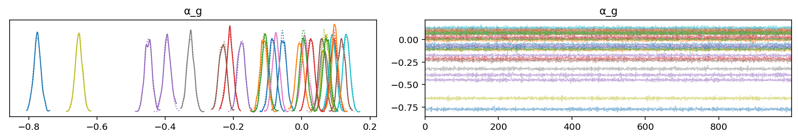
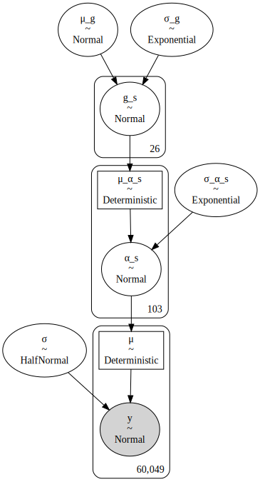
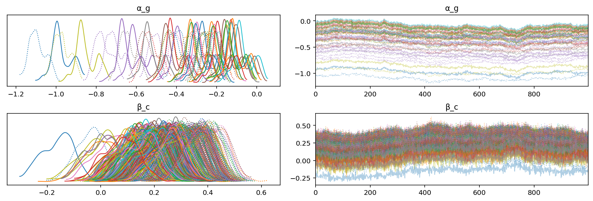

# A hierarchcial linear regression to fit CRISPR-Cas9 screen results

The CERES model was replicated using PyMC3 in []().
This notebook is intended to experiment with various hierarchical model architectures on a sub-sample of the real DepMap data.

## Set-up

```python
import re
import string
import warnings
from pathlib import Path
from time import time

import arviz as az
import matplotlib.colors as mcolors
import matplotlib.pyplot as plt
import numpy as np
import pandas as pd
import plotnine as gg
import pymc3 as pm
import pymc3_helpers as pmhelp
import seaborn as sns
import string_functions as stringr
from common_data_processing import get_indices, make_cat, zscale_cna_by_group
from pymc3_helpers import pymc3_sampling_procedure, samples_to_arviz
from theano import tensor as tt

notebook_tic = time()

warnings.simplefilter(action="ignore", category=UserWarning)

gg.theme_set(gg.theme_minimal())

%config InlineBackend.figure_format = 'retina'

RANDOM_SEED = 824
np.random.seed(RANDOM_SEED)

pymc3_cache_dir = Path("pymc3_model_cache")
```

## Data preparation

```python
data_path = Path("../modeling_data/depmap_modeling_dataframe_subsample.csv")
data = pd.read_csv(data_path)
data.head(n=7)
```

<div>
<style scoped>
    .dataframe tbody tr th:only-of-type {
        vertical-align: middle;
    }

    .dataframe tbody tr th {
        vertical-align: top;
    }

    .dataframe thead th {
        text-align: right;
    }
</style>
<table border="1" class="dataframe">
  <thead>
    <tr style="text-align: right;">
      <th></th>
      <th>sgrna</th>
      <th>replicate_id</th>
      <th>lfc</th>
      <th>pdna_batch</th>
      <th>passes_qc</th>
      <th>depmap_id</th>
      <th>primary_or_metastasis</th>
      <th>lineage</th>
      <th>lineage_subtype</th>
      <th>kras_mutation</th>
      <th>...</th>
      <th>log2_gene_cn_p1</th>
      <th>gene_cn</th>
      <th>n_muts</th>
      <th>any_deleterious</th>
      <th>variant_classification</th>
      <th>is_deleterious</th>
      <th>is_tcga_hotspot</th>
      <th>is_cosmic_hotspot</th>
      <th>mutated_at_guide_location</th>
      <th>rna_expr</th>
    </tr>
  </thead>
  <tbody>
    <tr>
      <th>0</th>
      <td>AAGAGGCCGGTCAAATTCAG</td>
      <td>42-mg-ba-311cas9_repa_p6_batch3</td>
      <td>-0.405499</td>
      <td>3</td>
      <td>True</td>
      <td>ACH-000323</td>
      <td>Primary</td>
      <td>central_nervous_system</td>
      <td>glioma</td>
      <td>WT</td>
      <td>...</td>
      <td>0.845287</td>
      <td>1.328646</td>
      <td>0</td>
      <td>False</td>
      <td>NaN</td>
      <td>NaN</td>
      <td>NaN</td>
      <td>NaN</td>
      <td>False</td>
      <td>1.263034</td>
    </tr>
    <tr>
      <th>1</th>
      <td>AATCAACCCACAGCTGCACA</td>
      <td>42-mg-ba-311cas9_repa_p6_batch3</td>
      <td>-0.133541</td>
      <td>3</td>
      <td>True</td>
      <td>ACH-000323</td>
      <td>Primary</td>
      <td>central_nervous_system</td>
      <td>glioma</td>
      <td>WT</td>
      <td>...</td>
      <td>0.827398</td>
      <td>1.287359</td>
      <td>2</td>
      <td>False</td>
      <td>missense_mutation;missense_mutation</td>
      <td>FALSE;FALSE</td>
      <td>TRUE;TRUE</td>
      <td>TRUE;TRUE</td>
      <td>False</td>
      <td>5.220330</td>
    </tr>
    <tr>
      <th>2</th>
      <td>AATTACTACTTGCTTCCTGT</td>
      <td>42-mg-ba-311cas9_repa_p6_batch3</td>
      <td>-0.491495</td>
      <td>3</td>
      <td>True</td>
      <td>ACH-000323</td>
      <td>Primary</td>
      <td>central_nervous_system</td>
      <td>glioma</td>
      <td>WT</td>
      <td>...</td>
      <td>0.879280</td>
      <td>1.409165</td>
      <td>0</td>
      <td>False</td>
      <td>NaN</td>
      <td>NaN</td>
      <td>NaN</td>
      <td>NaN</td>
      <td>False</td>
      <td>3.008989</td>
    </tr>
    <tr>
      <th>3</th>
      <td>ACCTGTATGACGAAACCGTG</td>
      <td>42-mg-ba-311cas9_repa_p6_batch3</td>
      <td>-0.015850</td>
      <td>3</td>
      <td>True</td>
      <td>ACH-000323</td>
      <td>Primary</td>
      <td>central_nervous_system</td>
      <td>glioma</td>
      <td>WT</td>
      <td>...</td>
      <td>0.818549</td>
      <td>1.267208</td>
      <td>0</td>
      <td>False</td>
      <td>NaN</td>
      <td>NaN</td>
      <td>NaN</td>
      <td>NaN</td>
      <td>False</td>
      <td>4.083213</td>
    </tr>
    <tr>
      <th>4</th>
      <td>ACTCTGTTCCTTCATCTCCG</td>
      <td>42-mg-ba-311cas9_repa_p6_batch3</td>
      <td>-0.530277</td>
      <td>3</td>
      <td>True</td>
      <td>ACH-000323</td>
      <td>Primary</td>
      <td>central_nervous_system</td>
      <td>glioma</td>
      <td>WT</td>
      <td>...</td>
      <td>0.990378</td>
      <td>1.692253</td>
      <td>0</td>
      <td>False</td>
      <td>NaN</td>
      <td>NaN</td>
      <td>NaN</td>
      <td>NaN</td>
      <td>False</td>
      <td>5.822730</td>
    </tr>
    <tr>
      <th>5</th>
      <td>ACTGCTGCGGGAATTCCAAG</td>
      <td>42-mg-ba-311cas9_repa_p6_batch3</td>
      <td>0.778827</td>
      <td>3</td>
      <td>True</td>
      <td>ACH-000323</td>
      <td>Primary</td>
      <td>central_nervous_system</td>
      <td>glioma</td>
      <td>WT</td>
      <td>...</td>
      <td>0.818549</td>
      <td>1.267208</td>
      <td>0</td>
      <td>False</td>
      <td>NaN</td>
      <td>NaN</td>
      <td>NaN</td>
      <td>NaN</td>
      <td>False</td>
      <td>4.083213</td>
    </tr>
    <tr>
      <th>6</th>
      <td>AGACACTTATACTATGAAAG</td>
      <td>42-mg-ba-311cas9_repa_p6_batch3</td>
      <td>0.035950</td>
      <td>3</td>
      <td>True</td>
      <td>ACH-000323</td>
      <td>Primary</td>
      <td>central_nervous_system</td>
      <td>glioma</td>
      <td>WT</td>
      <td>...</td>
      <td>0.872323</td>
      <td>1.392463</td>
      <td>0</td>
      <td>False</td>
      <td>NaN</td>
      <td>NaN</td>
      <td>NaN</td>
      <td>NaN</td>
      <td>False</td>
      <td>3.701549</td>
    </tr>
  </tbody>
</table>
<p>7 rows × 27 columns</p>
</div>

```python
data.describe()
```

<div>
<style scoped>
    .dataframe tbody tr th:only-of-type {
        vertical-align: middle;
    }

    .dataframe tbody tr th {
        vertical-align: top;
    }

    .dataframe thead th {
        text-align: right;
    }
</style>
<table border="1" class="dataframe">
  <thead>
    <tr style="text-align: right;">
      <th></th>
      <th>lfc</th>
      <th>pdna_batch</th>
      <th>n_alignments</th>
      <th>chromosome</th>
      <th>chrom_pos</th>
      <th>segment_mean</th>
      <th>segment_cn</th>
      <th>log2_gene_cn_p1</th>
      <th>gene_cn</th>
      <th>n_muts</th>
      <th>rna_expr</th>
    </tr>
  </thead>
  <tbody>
    <tr>
      <th>count</th>
      <td>60049.000000</td>
      <td>60049.000000</td>
      <td>60049.000000</td>
      <td>60049.000000</td>
      <td>6.004900e+04</td>
      <td>5.984300e+04</td>
      <td>5.984300e+04</td>
      <td>6.004900e+04</td>
      <td>6.004900e+04</td>
      <td>60049.000000</td>
      <td>60049.000000</td>
    </tr>
    <tr>
      <th>mean</th>
      <td>-0.110098</td>
      <td>2.861063</td>
      <td>1.029126</td>
      <td>8.796117</td>
      <td>8.199159e+07</td>
      <td>1.052517e+00</td>
      <td>3.673521e+12</td>
      <td>1.012354e+00</td>
      <td>1.894709e+00</td>
      <td>0.097654</td>
      <td>2.957374</td>
    </tr>
    <tr>
      <th>std</th>
      <td>0.562585</td>
      <td>0.355663</td>
      <td>0.168162</td>
      <td>6.526117</td>
      <td>6.014320e+07</td>
      <td>8.296245e-01</td>
      <td>3.177012e+14</td>
      <td>2.294065e-01</td>
      <td>4.336833e+00</td>
      <td>0.354338</td>
      <td>2.292989</td>
    </tr>
    <tr>
      <th>min</th>
      <td>-4.972325</td>
      <td>2.000000</td>
      <td>1.000000</td>
      <td>1.000000</td>
      <td>7.675103e+06</td>
      <td>9.598765e-08</td>
      <td>1.000000e+00</td>
      <td>5.506197e-09</td>
      <td>5.506197e-09</td>
      <td>0.000000</td>
      <td>0.000000</td>
    </tr>
    <tr>
      <th>25%</th>
      <td>-0.344279</td>
      <td>3.000000</td>
      <td>1.000000</td>
      <td>3.000000</td>
      <td>3.201892e+07</td>
      <td>8.530658e-01</td>
      <td>1.806335e+00</td>
      <td>8.900191e-01</td>
      <td>1.435176e+00</td>
      <td>0.000000</td>
      <td>0.790772</td>
    </tr>
    <tr>
      <th>50%</th>
      <td>-0.033168</td>
      <td>3.000000</td>
      <td>1.000000</td>
      <td>8.000000</td>
      <td>5.977335e+07</td>
      <td>1.005954e+00</td>
      <td>2.008272e+00</td>
      <td>1.004289e+00</td>
      <td>1.729965e+00</td>
      <td>0.000000</td>
      <td>2.895303</td>
    </tr>
    <tr>
      <th>75%</th>
      <td>0.218036</td>
      <td>3.000000</td>
      <td>1.000000</td>
      <td>16.000000</td>
      <td>1.375787e+08</td>
      <td>1.154679e+00</td>
      <td>2.226348e+00</td>
      <td>1.107473e+00</td>
      <td>2.026700e+00</td>
      <td>0.000000</td>
      <td>4.698218</td>
    </tr>
    <tr>
      <th>max</th>
      <td>5.598174</td>
      <td>4.000000</td>
      <td>2.000000</td>
      <td>20.000000</td>
      <td>2.230033e+08</td>
      <td>5.460920e+01</td>
      <td>2.747932e+16</td>
      <td>5.797252e+00</td>
      <td>3.283930e+02</td>
      <td>8.000000</td>
      <td>11.496005</td>
    </tr>
  </tbody>
</table>
</div>

```python
for col in ("hugo_symbol", "depmap_id"):
    data = make_cat(data, col, ordered=True, sort_cats=True)
```

```python
data.shape
```

    (60049, 27)

```python
data = zscale_cna_by_group(data, cn_max=10)
```

## EDA

```python
data.columns
```

    Index(['sgrna', 'replicate_id', 'lfc', 'pdna_batch', 'passes_qc', 'depmap_id',
           'primary_or_metastasis', 'lineage', 'lineage_subtype', 'kras_mutation',
           'genome_alignment', 'n_alignments', 'hugo_symbol', 'chromosome',
           'chrom_pos', 'segment_mean', 'segment_cn', 'log2_gene_cn_p1', 'gene_cn',
           'n_muts', 'any_deleterious', 'variant_classification', 'is_deleterious',
           'is_tcga_hotspot', 'is_cosmic_hotspot', 'mutated_at_guide_location',
           'rna_expr', 'gene_cn_z'],
          dtype='object')

```python
(
    gg.ggplot(data, gg.aes(x="hugo_symbol", y="lfc"))
    + gg.geom_boxplot(outlier_alpha=0.3)
    + gg.theme(axis_text_x=gg.element_text(angle=90, hjust=0.5, vjust=1))
    + gg.labs(x=None, y="log fold change")
)
```


    <ggplot: (8730623702851)>

```python
p = (
    gg.ggplot(data, gg.aes(x="gene_cn_z", y="lfc"))
    + gg.geom_point(gg.aes(color="hugo_symbol"), alpha=0.1, size=0.5)
    + gg.geom_smooth()
    + gg.scale_color_discrete(
        guide=gg.guide_legend(override_aes={"size": 1, "alpha": 1})
    )
    + gg.labs(
        x="gene cn (z-scaled)",
        y="log fold change",
        title="Correlation between CN and LFC",
        color="gene",
    )
)
p
```


    <ggplot: (8730613971318)>

```python
(
    p
    + gg.geom_smooth(
        gg.aes(color="hugo_symbol"),
        linetype="--",
        alpha=0.5,
        se=False,
        show_legend=False,
    )
)
```


    <ggplot: (8730613967008)>

```python
d = data.groupby(["lineage", "hugo_symbol"]).mean().reset_index(drop=False)
d["lineage"] = stringr.str_replace(d["lineage"], "_", " ")
d["lineage"] = stringr.str_wrap(d["lineage"], width=10)

(
    gg.ggplot(d, gg.aes(x="lineage", y="hugo_symbol", fill="lfc"))
    + gg.geom_tile()
    + gg.scale_x_discrete(expand=(0, 0.5, 0, 0.5))
    + gg.scale_y_discrete(expand=(0, 0.5, 0, 0.5))
)
```


    <ggplot: (8730612358867)>

## Modeling

### Model 1. Hierarchical model by gene with no other variables

$
y \sim \mathcal{N}(\mu, \sigma) \\
\mu = \alpha_{g} \\
\alpha_g \sim \mathcal{N}(\mu_\alpha, \sigma_\alpha) \\
\mu_\alpha \sim \mathcal{N}(0, 5) \\
\sigma_\alpha \sim \text{HalfNormal}(0, 5) \\
\sigma \sim \text{HalfNormal}(0, 5)
$

```python
gene_idx = get_indices(data, "hugo_symbol")
num_genes = data["hugo_symbol"].nunique()
with pm.Model() as m1:
    σ_α = pm.HalfNormal("σ_α", 5.0)
    μ_α = pm.Normal("μ_α", 0, 5)

    α_g = pm.Normal("α_g", μ_α, σ_α, shape=num_genes)
    μ = pm.Deterministic("μ", α_g[gene_idx])
    σ = pm.HalfNormal("σ", 5.0)

    y = pm.Normal("y", mu=μ, sigma=σ, observed=data.lfc)
```

```python
pm.model_to_graphviz(m1)
```


```python
m1_cache_dir = pymc3_cache_dir / "subset_speclet_m1"

m1_sampling_results = pymc3_sampling_procedure(
    model=m1,
    num_mcmc=1000,
    tune=1000,
    chains=2,
    cores=2,
    random_seed=RANDOM_SEED,
    cache_dir=pymc3_cache_dir / m1_cache_dir,
    sample_kwargs={"init": "advi+adapt_diag", "n_init": 40000},
)
```

    Loading cached trace and posterior sample...

```python
m1_az = samples_to_arviz(model=m1, res=m1_sampling_results)
```

    arviz.data.io_pymc3 - WARNING - posterior predictive variable y's shape not compatible with number of chains and draws. This can mean that some draws or even whole chains are not represented.

```python
az.plot_trace(m1_az, var_names="α_g", compact=True)
plt.show()
```



### Model 2. Hierarchical model with a varying intercept per gene and a varying intercept per cell line

$
y \sim \mathcal{N}(\mu, \sigma) \\
\mu = \alpha_{g} + \beta_{l}\\
\alpha_g \sim \mathcal{N}(\mu_\alpha, \sigma_\alpha) \\
\mu_\alpha \sim \mathcal{N}(0, 2) \quad \sigma_\alpha \sim \text{HalfNormal}(0, 5) \\
\beta_c \sim \mathcal{N}(\mu_\beta, \sigma_\beta) \\
\mu_\beta \sim \mathcal{N}(0, 2) \quad \sigma_\beta \sim \text{HalfNormal}(0, 5) \\
\sigma \sim \text{HalfNormal}(0, 5)
$

```python
gene_idx = get_indices(data, "hugo_symbol")
cellline_idx = get_indices(data, "depmap_id")
num_genes = data["hugo_symbol"].nunique()
num_celllines = data["depmap_id"].nunique()

with pm.Model() as m2:
    μ_α = pm.Normal("μ_α", -0.5, 1.0)
    σ_α = pm.HalfNormal("σ_α", 2.0)
    μ_β = pm.Normal("μ_β", 0, 1.0)
    σ_β = pm.HalfNormal("σ_β", 2.0)

    α_g = pm.Normal("α_g", μ_α, σ_α, shape=num_genes)
    β_c = pm.Normal("β_c", μ_β, σ_β, shape=num_celllines)
    μ = pm.Deterministic("μ", α_g[gene_idx] + β_c[cellline_idx])
    σ = pm.HalfNormal("σ", 2.0)

    y = pm.Normal("y", mu=μ, sigma=σ, observed=data.lfc)
```

```python
pm.model_to_graphviz(m2)
```



```python
m2_cache_dir = pymc3_cache_dir / "subset_speclet_m2"

m2_sampling_results = pymc3_sampling_procedure(
    model=m2,
    num_mcmc=1000,
    tune=1000,
    chains=2,
    cores=2,
    random_seed=RANDOM_SEED,
    cache_dir=pymc3_cache_dir / m2_cache_dir,
    force=True,
    sample_kwargs={"init": "advi+adapt_diag", "n_init": 40000},
)
```

    Auto-assigning NUTS sampler...
    Initializing NUTS using advi+adapt_diag...

<div>
    <style>
        /*Turns off some styling*/
        progress {
            /*gets rid of default border in Firefox and Opera.*/
            border: none;
            /*Needs to be in here for Safari polyfill so background images work as expected.*/
            background-size: auto;
        }
        .progress-bar-interrupted, .progress-bar-interrupted::-webkit-progress-bar {
            background: #F44336;
        }
    </style>
  <progress value='28462' class='' max='40000' style='width:300px; height:20px; vertical-align: middle;'></progress>
  71.16% [28462/40000 01:09<00:28 Average Loss = 44,654]
</div>

    Convergence achieved at 28500
    Interrupted at 28,499 [71%]: Average Loss = 56,428
    Multiprocess sampling (2 chains in 2 jobs)
    NUTS: [σ, β_c, α_g, σ_β, μ_β, σ_α, μ_α]

<div>
    <style>
        /*Turns off some styling*/
        progress {
            /*gets rid of default border in Firefox and Opera.*/
            border: none;
            /*Needs to be in here for Safari polyfill so background images work as expected.*/
            background-size: auto;
        }
        .progress-bar-interrupted, .progress-bar-interrupted::-webkit-progress-bar {
            background: #F44336;
        }
    </style>
  <progress value='4000' class='' max='4000' style='width:300px; height:20px; vertical-align: middle;'></progress>
  100.00% [4000/4000 01:11<00:00 Sampling 2 chains, 0 divergences]
</div>

    Sampling 2 chains for 1_000 tune and 1_000 draw iterations (2_000 + 2_000 draws total) took 72 seconds.
    The rhat statistic is larger than 1.4 for some parameters. The sampler did not converge.
    The estimated number of effective samples is smaller than 200 for some parameters.

<div>
    <style>
        /*Turns off some styling*/
        progress {
            /*gets rid of default border in Firefox and Opera.*/
            border: none;
            /*Needs to be in here for Safari polyfill so background images work as expected.*/
            background-size: auto;
        }
        .progress-bar-interrupted, .progress-bar-interrupted::-webkit-progress-bar {
            background: #F44336;
        }
    </style>
  <progress value='1000' class='' max='1000' style='width:300px; height:20px; vertical-align: middle;'></progress>
  100.00% [1000/1000 00:05<00:00]
</div>

    Caching trace and posterior sample...

```python
m2_az = samples_to_arviz(model=m2, res=m2_sampling_results)
```

    arviz.data.io_pymc3 - WARNING - posterior predictive variable y's shape not compatible with number of chains and draws. This can mean that some draws or even whole chains are not represented.

```python
az.plot_trace(m2_az, var_names=["α_g", "β_c"], compact=True)
plt.show()
```



```python

```

```python

```

```python

```

```python

```

```python

```

```python

```

```python

```

```python

```

```python

```

---

```python
notebook_toc = time()
print(f"execution time: {(notebook_toc - notebook_tic) / 60:.2f} minutes")
```

    execution time: 4.11 minutes

```python
%load_ext watermark
%watermark -d -u -v -iv -b -h -m
```

    Last updated: 2021-01-13
    
    Python implementation: CPython
    Python version       : 3.8.6
    IPython version      : 7.19.0
    
    Compiler    : GCC 9.3.0
    OS          : Linux
    Release     : 3.10.0-1062.el7.x86_64
    Machine     : x86_64
    Processor   : x86_64
    CPU cores   : 32
    Architecture: 64bit
    
    Hostname: compute-a-16-171.o2.rc.hms.harvard.edu
    
    Git branch: subset-data
    
    re        : 2.2.1
    matplotlib: 3.3.3
    pymc3     : 3.9.3
    plotnine  : 0.7.1
    pandas    : 1.2.0
    seaborn   : 0.11.1
    theano    : 1.0.5
    arviz     : 0.10.0
    numpy     : 1.19.5

```python

```
