# A hierarchcial linear regression to fit CRISPR-Cas9 screen results

This notebook is intended to experiment with various hierarchical model architectures on a sub-sample of the real DepMap data.

## Set-up

```python
import re
import string
import warnings
from pathlib import Path
from time import time
from typing import Optional, Tuple

import arviz as az
import matplotlib.colors as mcolors
import matplotlib.pyplot as plt
import numpy as np
import pandas as pd
import plotnine as gg
import pymc3 as pm
import pymc3_helpers as pmhelp
import seaborn as sns
import string_functions as stringr
from common_data_processing import get_indices, make_cat, zscale_cna_by_group
from theano import tensor as tt

notebook_tic = time()

warnings.simplefilter(action="ignore", category=UserWarning)

gg.theme_set(gg.theme_minimal())

%config InlineBackend.figure_format = 'retina'

RANDOM_SEED = 824
np.random.seed(RANDOM_SEED)

pymc3_cache_dir = Path("pymc3_model_cache")
```

    WARNING (theano.configdefaults): install mkl with `conda install mkl-service`: No module named 'mkl'

## Data preparation

```python
data_path = Path("../modeling_data/depmap_modeling_dataframe_subsample.csv")
data = pd.read_csv(data_path)

data = data.sort_values(["hugo_symbol", "sgrna", "depmap_id"]).reset_index(drop=True)
for col in ("hugo_symbol", "depmap_id", "sgrna", "lineage", "chromosome"):
    data = make_cat(data, col, ordered=True, sort_cats=False)

data = zscale_cna_by_group(data, cn_max=10)

data.head(n=7)
```

<div>
<style scoped>
    .dataframe tbody tr th:only-of-type {
        vertical-align: middle;
    }

    .dataframe tbody tr th {
        vertical-align: top;
    }

    .dataframe thead th {
        text-align: right;
    }
</style>
<table border="1" class="dataframe">
  <thead>
    <tr style="text-align: right;">
      <th></th>
      <th>sgrna</th>
      <th>replicate_id</th>
      <th>lfc</th>
      <th>pdna_batch</th>
      <th>passes_qc</th>
      <th>depmap_id</th>
      <th>primary_or_metastasis</th>
      <th>lineage</th>
      <th>lineage_subtype</th>
      <th>kras_mutation</th>
      <th>...</th>
      <th>gene_cn</th>
      <th>n_muts</th>
      <th>any_deleterious</th>
      <th>variant_classification</th>
      <th>is_deleterious</th>
      <th>is_tcga_hotspot</th>
      <th>is_cosmic_hotspot</th>
      <th>mutated_at_guide_location</th>
      <th>rna_expr</th>
      <th>gene_cn_z</th>
    </tr>
  </thead>
  <tbody>
    <tr>
      <th>0</th>
      <td>CCACCCACAGACGCTCAGCA</td>
      <td>ls513-311cas9_repa_p6_batch2</td>
      <td>0.029491</td>
      <td>2</td>
      <td>True</td>
      <td>ACH-000007</td>
      <td>Primary</td>
      <td>colorectal</td>
      <td>colorectal_adenocarcinoma</td>
      <td>G12D</td>
      <td>...</td>
      <td>2.632957</td>
      <td>0</td>
      <td>False</td>
      <td>NaN</td>
      <td>NaN</td>
      <td>NaN</td>
      <td>NaN</td>
      <td>False</td>
      <td>1.480265</td>
      <td>1.632215</td>
    </tr>
    <tr>
      <th>1</th>
      <td>CCACCCACAGACGCTCAGCA</td>
      <td>ls513-311cas9_repb_p6_batch2</td>
      <td>0.426017</td>
      <td>2</td>
      <td>True</td>
      <td>ACH-000007</td>
      <td>Primary</td>
      <td>colorectal</td>
      <td>colorectal_adenocarcinoma</td>
      <td>G12D</td>
      <td>...</td>
      <td>2.632957</td>
      <td>0</td>
      <td>False</td>
      <td>NaN</td>
      <td>NaN</td>
      <td>NaN</td>
      <td>NaN</td>
      <td>False</td>
      <td>1.480265</td>
      <td>1.632215</td>
    </tr>
    <tr>
      <th>2</th>
      <td>CCACCCACAGACGCTCAGCA</td>
      <td>c2bbe1-311cas9 rep a p5_batch3</td>
      <td>0.008626</td>
      <td>3</td>
      <td>True</td>
      <td>ACH-000009</td>
      <td>Primary</td>
      <td>colorectal</td>
      <td>colorectal_adenocarcinoma</td>
      <td>WT</td>
      <td>...</td>
      <td>1.594524</td>
      <td>0</td>
      <td>False</td>
      <td>NaN</td>
      <td>NaN</td>
      <td>NaN</td>
      <td>NaN</td>
      <td>False</td>
      <td>0.695994</td>
      <td>-0.365193</td>
    </tr>
    <tr>
      <th>3</th>
      <td>CCACCCACAGACGCTCAGCA</td>
      <td>c2bbe1-311cas9 rep b p5_batch3</td>
      <td>0.280821</td>
      <td>3</td>
      <td>True</td>
      <td>ACH-000009</td>
      <td>Primary</td>
      <td>colorectal</td>
      <td>colorectal_adenocarcinoma</td>
      <td>WT</td>
      <td>...</td>
      <td>1.594524</td>
      <td>0</td>
      <td>False</td>
      <td>NaN</td>
      <td>NaN</td>
      <td>NaN</td>
      <td>NaN</td>
      <td>False</td>
      <td>0.695994</td>
      <td>-0.365193</td>
    </tr>
    <tr>
      <th>4</th>
      <td>CCACCCACAGACGCTCAGCA</td>
      <td>c2bbe1-311cas9 rep c p5_batch3</td>
      <td>0.239815</td>
      <td>3</td>
      <td>True</td>
      <td>ACH-000009</td>
      <td>Primary</td>
      <td>colorectal</td>
      <td>colorectal_adenocarcinoma</td>
      <td>WT</td>
      <td>...</td>
      <td>1.594524</td>
      <td>0</td>
      <td>False</td>
      <td>NaN</td>
      <td>NaN</td>
      <td>NaN</td>
      <td>NaN</td>
      <td>False</td>
      <td>0.695994</td>
      <td>-0.365193</td>
    </tr>
    <tr>
      <th>5</th>
      <td>CCACCCACAGACGCTCAGCA</td>
      <td>hcc827-311cas9 rep a p6_batch3</td>
      <td>-0.170583</td>
      <td>3</td>
      <td>True</td>
      <td>ACH-000012</td>
      <td>Primary</td>
      <td>lung</td>
      <td>NSCLC</td>
      <td>WT</td>
      <td>...</td>
      <td>1.741667</td>
      <td>0</td>
      <td>False</td>
      <td>NaN</td>
      <td>NaN</td>
      <td>NaN</td>
      <td>NaN</td>
      <td>False</td>
      <td>1.042644</td>
      <td>-0.082165</td>
    </tr>
    <tr>
      <th>6</th>
      <td>CCACCCACAGACGCTCAGCA</td>
      <td>hcc827-311cas9 rep b p6_batch3</td>
      <td>-0.320019</td>
      <td>3</td>
      <td>True</td>
      <td>ACH-000012</td>
      <td>Primary</td>
      <td>lung</td>
      <td>NSCLC</td>
      <td>WT</td>
      <td>...</td>
      <td>1.741667</td>
      <td>0</td>
      <td>False</td>
      <td>NaN</td>
      <td>NaN</td>
      <td>NaN</td>
      <td>NaN</td>
      <td>False</td>
      <td>1.042644</td>
      <td>-0.082165</td>
    </tr>
  </tbody>
</table>
<p>7 rows × 28 columns</p>
</div>

```python
data.describe()
```

<div>
<style scoped>
    .dataframe tbody tr th:only-of-type {
        vertical-align: middle;
    }

    .dataframe tbody tr th {
        vertical-align: top;
    }

    .dataframe thead th {
        text-align: right;
    }
</style>
<table border="1" class="dataframe">
  <thead>
    <tr style="text-align: right;">
      <th></th>
      <th>lfc</th>
      <th>pdna_batch</th>
      <th>n_alignments</th>
      <th>chrom_pos</th>
      <th>segment_mean</th>
      <th>segment_cn</th>
      <th>log2_gene_cn_p1</th>
      <th>gene_cn</th>
      <th>n_muts</th>
      <th>rna_expr</th>
      <th>gene_cn_z</th>
    </tr>
  </thead>
  <tbody>
    <tr>
      <th>count</th>
      <td>60049.000000</td>
      <td>60049.000000</td>
      <td>60049.000000</td>
      <td>6.004900e+04</td>
      <td>5.984300e+04</td>
      <td>5.984300e+04</td>
      <td>6.004900e+04</td>
      <td>6.004900e+04</td>
      <td>60049.000000</td>
      <td>60049.000000</td>
      <td>6.004900e+04</td>
    </tr>
    <tr>
      <th>mean</th>
      <td>-0.110098</td>
      <td>2.861063</td>
      <td>1.029126</td>
      <td>8.199159e+07</td>
      <td>1.052517e+00</td>
      <td>3.673521e+12</td>
      <td>1.012354e+00</td>
      <td>1.894709e+00</td>
      <td>0.097654</td>
      <td>2.957374</td>
      <td>-3.975792e-17</td>
    </tr>
    <tr>
      <th>std</th>
      <td>0.562585</td>
      <td>0.355663</td>
      <td>0.168162</td>
      <td>6.014320e+07</td>
      <td>8.296245e-01</td>
      <td>3.177012e+14</td>
      <td>2.294065e-01</td>
      <td>4.336833e+00</td>
      <td>0.354338</td>
      <td>2.292989</td>
      <td>1.000008e+00</td>
    </tr>
    <tr>
      <th>min</th>
      <td>-4.972325</td>
      <td>2.000000</td>
      <td>1.000000</td>
      <td>7.675103e+06</td>
      <td>9.598765e-08</td>
      <td>1.000000e+00</td>
      <td>5.506197e-09</td>
      <td>5.506197e-09</td>
      <td>0.000000</td>
      <td>0.000000</td>
      <td>-3.065984e+00</td>
    </tr>
    <tr>
      <th>25%</th>
      <td>-0.344279</td>
      <td>3.000000</td>
      <td>1.000000</td>
      <td>3.201892e+07</td>
      <td>8.530658e-01</td>
      <td>1.806335e+00</td>
      <td>8.900191e-01</td>
      <td>1.435176e+00</td>
      <td>0.000000</td>
      <td>0.790772</td>
      <td>-5.710118e-01</td>
    </tr>
    <tr>
      <th>50%</th>
      <td>-0.033168</td>
      <td>3.000000</td>
      <td>1.000000</td>
      <td>5.977335e+07</td>
      <td>1.005954e+00</td>
      <td>2.008272e+00</td>
      <td>1.004289e+00</td>
      <td>1.729965e+00</td>
      <td>0.000000</td>
      <td>2.895303</td>
      <td>-1.340551e-01</td>
    </tr>
    <tr>
      <th>75%</th>
      <td>0.218036</td>
      <td>3.000000</td>
      <td>1.000000</td>
      <td>1.375787e+08</td>
      <td>1.154679e+00</td>
      <td>2.226348e+00</td>
      <td>1.107473e+00</td>
      <td>2.026700e+00</td>
      <td>0.000000</td>
      <td>4.698218</td>
      <td>4.430254e-01</td>
    </tr>
    <tr>
      <th>max</th>
      <td>5.598174</td>
      <td>4.000000</td>
      <td>2.000000</td>
      <td>2.230033e+08</td>
      <td>5.460920e+01</td>
      <td>2.747932e+16</td>
      <td>5.797252e+00</td>
      <td>3.283930e+02</td>
      <td>8.000000</td>
      <td>11.496005</td>
      <td>1.055240e+01</td>
    </tr>
  </tbody>
</table>
</div>

```python
data.shape
```

    (60049, 28)

## EDA

```python
data.columns
```

    Index(['sgrna', 'replicate_id', 'lfc', 'pdna_batch', 'passes_qc', 'depmap_id',
           'primary_or_metastasis', 'lineage', 'lineage_subtype', 'kras_mutation',
           'genome_alignment', 'n_alignments', 'hugo_symbol', 'chromosome',
           'chrom_pos', 'segment_mean', 'segment_cn', 'log2_gene_cn_p1', 'gene_cn',
           'n_muts', 'any_deleterious', 'variant_classification', 'is_deleterious',
           'is_tcga_hotspot', 'is_cosmic_hotspot', 'mutated_at_guide_location',
           'rna_expr', 'gene_cn_z'],
          dtype='object')

```python
(
    gg.ggplot(data, gg.aes(x="hugo_symbol", y="lfc"))
    + gg.geom_boxplot(outlier_alpha=0.3, outlier_size=0.5)
    + gg.theme(axis_text_x=gg.element_text(angle=90, hjust=0.5, vjust=1))
    + gg.labs(x=None, y="log fold change")
)
```

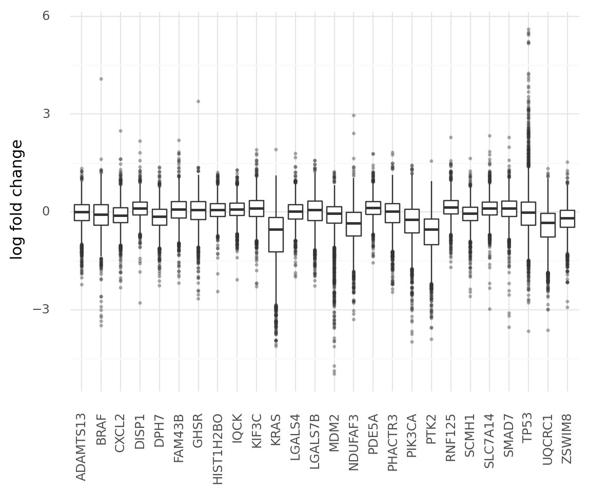

    <ggplot: (8779517303712)>

```python
p = (
    gg.ggplot(data, gg.aes(x="gene_cn_z", y="lfc"))
    + gg.geom_point(gg.aes(color="hugo_symbol"), alpha=0.1, size=0.5)
    + gg.geom_smooth()
    + gg.scale_color_discrete(
        guide=gg.guide_legend(override_aes={"size": 1, "alpha": 1})
    )
    + gg.labs(
        x="gene cn (z-scaled)",
        y="log fold change",
        title="Correlation between CN and LFC",
        color="gene",
    )
)
p
```


    <ggplot: (8779434195824)>

The general trend is that gene CN is negatively correlated with logFC, but there is substantial variability per gene.

```python
(
    p
    + gg.geom_smooth(
        gg.aes(color="hugo_symbol"),
        linetype="--",
        alpha=0.5,
        se=False,
        show_legend=False,
    )
)
```


    <ggplot: (8779434208449)>

The varying effects per gene are more striking than the varying efferects per lineage.
The effect of lineage/cell line may need to be regulated with relatively strict priors.

```python
d = data.groupby(["lineage", "hugo_symbol"]).mean().reset_index(drop=False)
d["lineage"] = stringr.str_replace(d["lineage"], "_", " ")
d["lineage"] = stringr.str_wrap(d["lineage"], width=10)

(
    gg.ggplot(d, gg.aes(x="lineage", y="hugo_symbol", fill="lfc"))
    + gg.geom_tile()
    + gg.scale_x_discrete(expand=(0, 0.5, 0, 0.5))
    + gg.scale_y_discrete(expand=(0, 0.5, 0, 0.5))
)
```


    <ggplot: (8779423167287)>

```python
data.head()
```

<div>
<style scoped>
    .dataframe tbody tr th:only-of-type {
        vertical-align: middle;
    }

    .dataframe tbody tr th {
        vertical-align: top;
    }

    .dataframe thead th {
        text-align: right;
    }
</style>
<table border="1" class="dataframe">
  <thead>
    <tr style="text-align: right;">
      <th></th>
      <th>sgrna</th>
      <th>replicate_id</th>
      <th>lfc</th>
      <th>pdna_batch</th>
      <th>passes_qc</th>
      <th>depmap_id</th>
      <th>primary_or_metastasis</th>
      <th>lineage</th>
      <th>lineage_subtype</th>
      <th>kras_mutation</th>
      <th>...</th>
      <th>gene_cn</th>
      <th>n_muts</th>
      <th>any_deleterious</th>
      <th>variant_classification</th>
      <th>is_deleterious</th>
      <th>is_tcga_hotspot</th>
      <th>is_cosmic_hotspot</th>
      <th>mutated_at_guide_location</th>
      <th>rna_expr</th>
      <th>gene_cn_z</th>
    </tr>
  </thead>
  <tbody>
    <tr>
      <th>0</th>
      <td>CCACCCACAGACGCTCAGCA</td>
      <td>ls513-311cas9_repa_p6_batch2</td>
      <td>0.029491</td>
      <td>2</td>
      <td>True</td>
      <td>ACH-000007</td>
      <td>Primary</td>
      <td>colorectal</td>
      <td>colorectal_adenocarcinoma</td>
      <td>G12D</td>
      <td>...</td>
      <td>2.632957</td>
      <td>0</td>
      <td>False</td>
      <td>NaN</td>
      <td>NaN</td>
      <td>NaN</td>
      <td>NaN</td>
      <td>False</td>
      <td>1.480265</td>
      <td>1.632215</td>
    </tr>
    <tr>
      <th>1</th>
      <td>CCACCCACAGACGCTCAGCA</td>
      <td>ls513-311cas9_repb_p6_batch2</td>
      <td>0.426017</td>
      <td>2</td>
      <td>True</td>
      <td>ACH-000007</td>
      <td>Primary</td>
      <td>colorectal</td>
      <td>colorectal_adenocarcinoma</td>
      <td>G12D</td>
      <td>...</td>
      <td>2.632957</td>
      <td>0</td>
      <td>False</td>
      <td>NaN</td>
      <td>NaN</td>
      <td>NaN</td>
      <td>NaN</td>
      <td>False</td>
      <td>1.480265</td>
      <td>1.632215</td>
    </tr>
    <tr>
      <th>2</th>
      <td>CCACCCACAGACGCTCAGCA</td>
      <td>c2bbe1-311cas9 rep a p5_batch3</td>
      <td>0.008626</td>
      <td>3</td>
      <td>True</td>
      <td>ACH-000009</td>
      <td>Primary</td>
      <td>colorectal</td>
      <td>colorectal_adenocarcinoma</td>
      <td>WT</td>
      <td>...</td>
      <td>1.594524</td>
      <td>0</td>
      <td>False</td>
      <td>NaN</td>
      <td>NaN</td>
      <td>NaN</td>
      <td>NaN</td>
      <td>False</td>
      <td>0.695994</td>
      <td>-0.365193</td>
    </tr>
    <tr>
      <th>3</th>
      <td>CCACCCACAGACGCTCAGCA</td>
      <td>c2bbe1-311cas9 rep b p5_batch3</td>
      <td>0.280821</td>
      <td>3</td>
      <td>True</td>
      <td>ACH-000009</td>
      <td>Primary</td>
      <td>colorectal</td>
      <td>colorectal_adenocarcinoma</td>
      <td>WT</td>
      <td>...</td>
      <td>1.594524</td>
      <td>0</td>
      <td>False</td>
      <td>NaN</td>
      <td>NaN</td>
      <td>NaN</td>
      <td>NaN</td>
      <td>False</td>
      <td>0.695994</td>
      <td>-0.365193</td>
    </tr>
    <tr>
      <th>4</th>
      <td>CCACCCACAGACGCTCAGCA</td>
      <td>c2bbe1-311cas9 rep c p5_batch3</td>
      <td>0.239815</td>
      <td>3</td>
      <td>True</td>
      <td>ACH-000009</td>
      <td>Primary</td>
      <td>colorectal</td>
      <td>colorectal_adenocarcinoma</td>
      <td>WT</td>
      <td>...</td>
      <td>1.594524</td>
      <td>0</td>
      <td>False</td>
      <td>NaN</td>
      <td>NaN</td>
      <td>NaN</td>
      <td>NaN</td>
      <td>False</td>
      <td>0.695994</td>
      <td>-0.365193</td>
    </tr>
  </tbody>
</table>
<p>5 rows × 28 columns</p>
</div>

---

## Modeling

### Model 1. Hierarchical model by gene with no other variables

$
y \sim \mathcal{N}(\mu, \sigma) \\
\mu = \alpha_{g} \\
\alpha_g \sim \mathcal{N}(\mu_\alpha, \sigma_\alpha) \\
\mu_\alpha \sim \mathcal{N}(0, 5) \\
\sigma_\alpha \sim \text{HalfNormal}(0, 5) \\
\sigma \sim \text{HalfNormal}(0, 5)
$

```python
gene_idx = get_indices(data, "hugo_symbol")
num_genes = data["hugo_symbol"].nunique()
with pm.Model() as m1:
    σ_α = pm.HalfNormal("σ_α", 5.0)
    μ_α = pm.Normal("μ_α", 0, 5)

    α_g = pm.Normal("α_g", μ_α, σ_α, shape=num_genes)
    μ = pm.Deterministic("μ", α_g[gene_idx])
    σ = pm.HalfNormal("σ", 5.0)

    y = pm.Normal("y", mu=μ, sigma=σ, observed=data.lfc)
```

```python
pm.model_to_graphviz(m1)
```

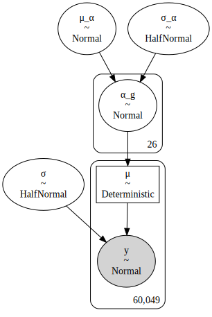

```python
m1_cache_dir = pymc3_cache_dir / "subset_speclet_m1"

m1_sampling_results = pmhelp.pymc3_sampling_procedure(
    model=m1,
    num_mcmc=1000,
    tune=1000,
    chains=2,
    cores=2,
    random_seed=RANDOM_SEED,
    cache_dir=pymc3_cache_dir / m1_cache_dir,
    force=False,
    sample_kwargs={"init": "advi+adapt_diag", "n_init": 40000},
)
```

    Loading cached trace and posterior sample...

```python
m1_az = pmhelp.samples_to_arviz(model=m1, res=m1_sampling_results)
```

    arviz.data.io_pymc3 - WARNING - posterior predictive variable y's shape not compatible with number of chains and draws. This can mean that some draws or even whole chains are not represented.

It looks like the effects of the genes are confidently estimated with most of the posterior distributions lying far from 0.

```python
az.plot_trace(m1_az, var_names="α_g", compact=True)
plt.show()
```


```python
az.summary(m1_az, var_names=["α_g"])
```

<div>
<style scoped>
    .dataframe tbody tr th:only-of-type {
        vertical-align: middle;
    }

    .dataframe tbody tr th {
        vertical-align: top;
    }

    .dataframe thead th {
        text-align: right;
    }
</style>
<table border="1" class="dataframe">
  <thead>
    <tr style="text-align: right;">
      <th></th>
      <th>mean</th>
      <th>sd</th>
      <th>hdi_3%</th>
      <th>hdi_97%</th>
      <th>mcse_mean</th>
      <th>mcse_sd</th>
      <th>ess_mean</th>
      <th>ess_sd</th>
      <th>ess_bulk</th>
      <th>ess_tail</th>
      <th>r_hat</th>
    </tr>
  </thead>
  <tbody>
    <tr>
      <th>α_g[0]</th>
      <td>-0.055</td>
      <td>0.010</td>
      <td>-0.073</td>
      <td>-0.036</td>
      <td>0.0</td>
      <td>0.0</td>
      <td>4313.0</td>
      <td>4313.0</td>
      <td>4292.0</td>
      <td>1314.0</td>
      <td>1.00</td>
    </tr>
    <tr>
      <th>α_g[1]</th>
      <td>-0.111</td>
      <td>0.010</td>
      <td>-0.132</td>
      <td>-0.094</td>
      <td>0.0</td>
      <td>0.0</td>
      <td>4567.0</td>
      <td>4401.0</td>
      <td>4552.0</td>
      <td>1031.0</td>
      <td>1.00</td>
    </tr>
    <tr>
      <th>α_g[2]</th>
      <td>-0.107</td>
      <td>0.010</td>
      <td>-0.126</td>
      <td>-0.088</td>
      <td>0.0</td>
      <td>0.0</td>
      <td>3800.0</td>
      <td>3756.0</td>
      <td>3805.0</td>
      <td>1332.0</td>
      <td>1.00</td>
    </tr>
    <tr>
      <th>α_g[3]</th>
      <td>0.094</td>
      <td>0.010</td>
      <td>0.075</td>
      <td>0.113</td>
      <td>0.0</td>
      <td>0.0</td>
      <td>3779.0</td>
      <td>3676.0</td>
      <td>3804.0</td>
      <td>1266.0</td>
      <td>1.00</td>
    </tr>
    <tr>
      <th>α_g[4]</th>
      <td>-0.177</td>
      <td>0.011</td>
      <td>-0.197</td>
      <td>-0.157</td>
      <td>0.0</td>
      <td>0.0</td>
      <td>3689.0</td>
      <td>3689.0</td>
      <td>3726.0</td>
      <td>1335.0</td>
      <td>1.00</td>
    </tr>
    <tr>
      <th>α_g[5]</th>
      <td>0.060</td>
      <td>0.011</td>
      <td>0.039</td>
      <td>0.079</td>
      <td>0.0</td>
      <td>0.0</td>
      <td>4802.0</td>
      <td>4237.0</td>
      <td>4833.0</td>
      <td>1550.0</td>
      <td>1.00</td>
    </tr>
    <tr>
      <th>α_g[6]</th>
      <td>0.009</td>
      <td>0.010</td>
      <td>-0.011</td>
      <td>0.028</td>
      <td>0.0</td>
      <td>0.0</td>
      <td>3388.0</td>
      <td>1518.0</td>
      <td>3394.0</td>
      <td>1288.0</td>
      <td>1.00</td>
    </tr>
    <tr>
      <th>α_g[7]</th>
      <td>0.065</td>
      <td>0.012</td>
      <td>0.043</td>
      <td>0.088</td>
      <td>0.0</td>
      <td>0.0</td>
      <td>4077.0</td>
      <td>3509.0</td>
      <td>4168.0</td>
      <td>1133.0</td>
      <td>1.00</td>
    </tr>
    <tr>
      <th>α_g[8]</th>
      <td>0.069</td>
      <td>0.010</td>
      <td>0.051</td>
      <td>0.089</td>
      <td>0.0</td>
      <td>0.0</td>
      <td>3038.0</td>
      <td>3036.0</td>
      <td>3028.0</td>
      <td>1474.0</td>
      <td>1.00</td>
    </tr>
    <tr>
      <th>α_g[9]</th>
      <td>0.090</td>
      <td>0.010</td>
      <td>0.070</td>
      <td>0.109</td>
      <td>0.0</td>
      <td>0.0</td>
      <td>3592.0</td>
      <td>3431.0</td>
      <td>3576.0</td>
      <td>1309.0</td>
      <td>1.00</td>
    </tr>
    <tr>
      <th>α_g[10]</th>
      <td>-0.775</td>
      <td>0.011</td>
      <td>-0.795</td>
      <td>-0.756</td>
      <td>0.0</td>
      <td>0.0</td>
      <td>4350.0</td>
      <td>4350.0</td>
      <td>4288.0</td>
      <td>1441.0</td>
      <td>1.00</td>
    </tr>
    <tr>
      <th>α_g[11]</th>
      <td>-0.005</td>
      <td>0.011</td>
      <td>-0.024</td>
      <td>0.016</td>
      <td>0.0</td>
      <td>0.0</td>
      <td>3689.0</td>
      <td>873.0</td>
      <td>3665.0</td>
      <td>1358.0</td>
      <td>1.00</td>
    </tr>
    <tr>
      <th>α_g[12]</th>
      <td>0.006</td>
      <td>0.011</td>
      <td>-0.012</td>
      <td>0.027</td>
      <td>0.0</td>
      <td>0.0</td>
      <td>4356.0</td>
      <td>1200.0</td>
      <td>4380.0</td>
      <td>1508.0</td>
      <td>1.00</td>
    </tr>
    <tr>
      <th>α_g[13]</th>
      <td>-0.211</td>
      <td>0.011</td>
      <td>-0.232</td>
      <td>-0.190</td>
      <td>0.0</td>
      <td>0.0</td>
      <td>4614.0</td>
      <td>4613.0</td>
      <td>4575.0</td>
      <td>1326.0</td>
      <td>1.00</td>
    </tr>
    <tr>
      <th>α_g[14]</th>
      <td>-0.394</td>
      <td>0.011</td>
      <td>-0.415</td>
      <td>-0.375</td>
      <td>0.0</td>
      <td>0.0</td>
      <td>4111.0</td>
      <td>4078.0</td>
      <td>4062.0</td>
      <td>1334.0</td>
      <td>1.00</td>
    </tr>
    <tr>
      <th>α_g[15]</th>
      <td>0.117</td>
      <td>0.010</td>
      <td>0.098</td>
      <td>0.136</td>
      <td>0.0</td>
      <td>0.0</td>
      <td>3779.0</td>
      <td>3779.0</td>
      <td>3763.0</td>
      <td>1303.0</td>
      <td>1.00</td>
    </tr>
    <tr>
      <th>α_g[16]</th>
      <td>-0.076</td>
      <td>0.011</td>
      <td>-0.097</td>
      <td>-0.056</td>
      <td>0.0</td>
      <td>0.0</td>
      <td>6602.0</td>
      <td>6278.0</td>
      <td>6602.0</td>
      <td>1352.0</td>
      <td>1.01</td>
    </tr>
    <tr>
      <th>α_g[17]</th>
      <td>-0.326</td>
      <td>0.010</td>
      <td>-0.346</td>
      <td>-0.307</td>
      <td>0.0</td>
      <td>0.0</td>
      <td>3796.0</td>
      <td>3748.0</td>
      <td>3829.0</td>
      <td>1355.0</td>
      <td>1.00</td>
    </tr>
    <tr>
      <th>α_g[18]</th>
      <td>-0.654</td>
      <td>0.011</td>
      <td>-0.672</td>
      <td>-0.632</td>
      <td>0.0</td>
      <td>0.0</td>
      <td>4896.0</td>
      <td>4852.0</td>
      <td>4427.0</td>
      <td>1307.0</td>
      <td>1.00</td>
    </tr>
    <tr>
      <th>α_g[19]</th>
      <td>0.132</td>
      <td>0.010</td>
      <td>0.113</td>
      <td>0.153</td>
      <td>0.0</td>
      <td>0.0</td>
      <td>4328.0</td>
      <td>4192.0</td>
      <td>4332.0</td>
      <td>1105.0</td>
      <td>1.00</td>
    </tr>
    <tr>
      <th>α_g[20]</th>
      <td>-0.085</td>
      <td>0.011</td>
      <td>-0.104</td>
      <td>-0.064</td>
      <td>0.0</td>
      <td>0.0</td>
      <td>4110.0</td>
      <td>3942.0</td>
      <td>4153.0</td>
      <td>1423.0</td>
      <td>1.00</td>
    </tr>
    <tr>
      <th>α_g[21]</th>
      <td>0.096</td>
      <td>0.010</td>
      <td>0.076</td>
      <td>0.114</td>
      <td>0.0</td>
      <td>0.0</td>
      <td>3997.0</td>
      <td>3900.0</td>
      <td>4039.0</td>
      <td>1488.0</td>
      <td>1.00</td>
    </tr>
    <tr>
      <th>α_g[22]</th>
      <td>0.073</td>
      <td>0.010</td>
      <td>0.055</td>
      <td>0.092</td>
      <td>0.0</td>
      <td>0.0</td>
      <td>5721.0</td>
      <td>5355.0</td>
      <td>5741.0</td>
      <td>1494.0</td>
      <td>1.00</td>
    </tr>
    <tr>
      <th>α_g[23]</th>
      <td>0.026</td>
      <td>0.010</td>
      <td>0.007</td>
      <td>0.046</td>
      <td>0.0</td>
      <td>0.0</td>
      <td>4642.0</td>
      <td>2591.0</td>
      <td>4658.0</td>
      <td>1199.0</td>
      <td>1.01</td>
    </tr>
    <tr>
      <th>α_g[24]</th>
      <td>-0.450</td>
      <td>0.010</td>
      <td>-0.468</td>
      <td>-0.430</td>
      <td>0.0</td>
      <td>0.0</td>
      <td>4651.0</td>
      <td>4651.0</td>
      <td>4646.0</td>
      <td>1417.0</td>
      <td>1.00</td>
    </tr>
    <tr>
      <th>α_g[25]</th>
      <td>-0.231</td>
      <td>0.011</td>
      <td>-0.251</td>
      <td>-0.211</td>
      <td>0.0</td>
      <td>0.0</td>
      <td>3723.0</td>
      <td>3723.0</td>
      <td>3750.0</td>
      <td>1609.0</td>
      <td>1.00</td>
    </tr>
  </tbody>
</table>
</div>

```python
def calculate_hdi_labels(hdi_prob: float, prefix: str = "hdi_") -> Tuple[str, str]:
    low = 100 * (1 - hdi_prob) / 2
    high = 100 - low
    return f"{prefix}{low:.1f}%", f"{prefix}{high:.1f}%"


def logfc_model_ppc_dataframe(
    az_obj: az.InferenceData,
    real_values: pd.Series,
    to_merge_with: Optional[pd.DataFrame] = None,
    hdi_prob: float = 0.89,
    var_name: str = "y",
) -> pd.DataFrame:
    ppc_arry = np.asarray(az_obj.posterior_predictive[var_name]).squeeze()
    ppc_summary = pd.DataFrame(
        az.hdi(ppc_arry, hdi_prob=hdi_prob), columns=calculate_hdi_labels(hdi_prob)
    )
    ppc_summary["mean"] = np.mean(ppc_arry, axis=0)
    ppc_summary = ppc_summary.reset_index(drop=True)
    ppc_summary["real_value"] = real_values
    ppc_summary["error"] = ppc_summary["mean"] - ppc_summary["real_value"]

    if not to_merge_with is None:
        ppc_summary = ppc_summary.merge(
            to_merge_with.reset_index(drop=True), left_index=True, right_index=True
        )

    return ppc_summary
```

```python
ppc_m1_summary = logfc_model_ppc_dataframe(
    m1_az, data.lfc, data[["hugo_symbol", "sgrna", "depmap_id"]]
)
ppc_m1_summary.head()
```

    /home/jc604/.conda/envs/speclet/lib/python3.8/site-packages/arviz/stats/stats.py:484: FutureWarning: hdi currently interprets 2d data as (draw, shape) but this will change in a future release to (chain, draw) for coherence with other functions

<div>
<style scoped>
    .dataframe tbody tr th:only-of-type {
        vertical-align: middle;
    }

    .dataframe tbody tr th {
        vertical-align: top;
    }

    .dataframe thead th {
        text-align: right;
    }
</style>
<table border="1" class="dataframe">
  <thead>
    <tr style="text-align: right;">
      <th></th>
      <th>hdi_5.5%</th>
      <th>hdi_94.5%</th>
      <th>mean</th>
      <th>real_value</th>
      <th>error</th>
      <th>hugo_symbol</th>
      <th>sgrna</th>
      <th>depmap_id</th>
    </tr>
  </thead>
  <tbody>
    <tr>
      <th>0</th>
      <td>-0.857051</td>
      <td>0.772856</td>
      <td>-0.041082</td>
      <td>0.029491</td>
      <td>-0.070573</td>
      <td>ADAMTS13</td>
      <td>CCACCCACAGACGCTCAGCA</td>
      <td>ACH-000007</td>
    </tr>
    <tr>
      <th>1</th>
      <td>-0.887173</td>
      <td>0.771502</td>
      <td>-0.062950</td>
      <td>0.426017</td>
      <td>-0.488967</td>
      <td>ADAMTS13</td>
      <td>CCACCCACAGACGCTCAGCA</td>
      <td>ACH-000007</td>
    </tr>
    <tr>
      <th>2</th>
      <td>-0.901727</td>
      <td>0.750155</td>
      <td>-0.073091</td>
      <td>0.008626</td>
      <td>-0.081717</td>
      <td>ADAMTS13</td>
      <td>CCACCCACAGACGCTCAGCA</td>
      <td>ACH-000009</td>
    </tr>
    <tr>
      <th>3</th>
      <td>-0.847794</td>
      <td>0.798100</td>
      <td>-0.032507</td>
      <td>0.280821</td>
      <td>-0.313328</td>
      <td>ADAMTS13</td>
      <td>CCACCCACAGACGCTCAGCA</td>
      <td>ACH-000009</td>
    </tr>
    <tr>
      <th>4</th>
      <td>-0.903893</td>
      <td>0.742157</td>
      <td>-0.034015</td>
      <td>0.239815</td>
      <td>-0.273830</td>
      <td>ADAMTS13</td>
      <td>CCACCCACAGACGCTCAGCA</td>
      <td>ACH-000009</td>
    </tr>
  </tbody>
</table>
</div>

The predictions are also tightly bunched, further indicating the model's confidence.

```python
p = (
    gg.ggplot(ppc_m1_summary, gg.aes(y="hugo_symbol"))
    + gg.geom_jitter(
        gg.aes(x="mean", color="sgrna"), width=0, height=0.35, alpha=0.3, size=0.3
    )
    + gg.scale_color_discrete(guide=None)
    + gg.theme(figure_size=(5, 6))
    + gg.labs(x="mean", y=None, title="Posterior predictions of gene effects")
)

p
```

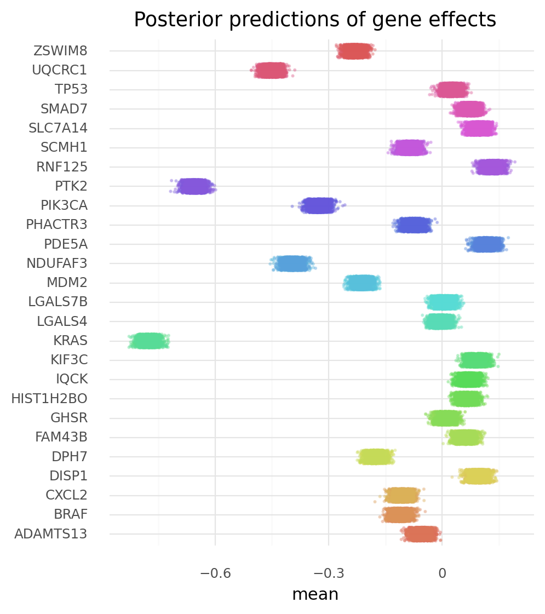

    <ggplot: (8779201247428)>

But we can see there is actually a lot of error, and some genes have far greater prediction error than others.
This is not unexpected as there are still many factors to add to the model.

```python
(p + gg.geom_jitter(gg.aes(x="real_value"), alpha=0.2, size=0.1, height=0.1, width=0))
```


    <ggplot: (8779201776788)>

Importantly, we can see that there are differing levels of error per sgRNA for many genes.

```python
(
    gg.ggplot(ppc_m1_summary, gg.aes(y="error", x="hugo_symbol"))
    + gg.geom_point(
        gg.aes(color="sgrna"),
        position=gg.position_jitterdodge(
            jitter_width=0.2, jitter_height=0, dodge_width=0.8, random_state=RANDOM_SEED
        ),
        alpha=0.5,
        size=0.3,
    )
    + gg.geom_boxplot(
        gg.aes(color="sgrna"),
        position=gg.position_dodge(width=0.8),
        outlier_alpha=0,
        alpha=0.5,
        fill="white",
    )
    + gg.scale_color_discrete(guide=None)
    + gg.theme(figure_size=(10, 7), axis_text_x=gg.element_text(angle=90))
    + gg.labs(x=None, y="density", title="Distribution of prediction error")
)
```

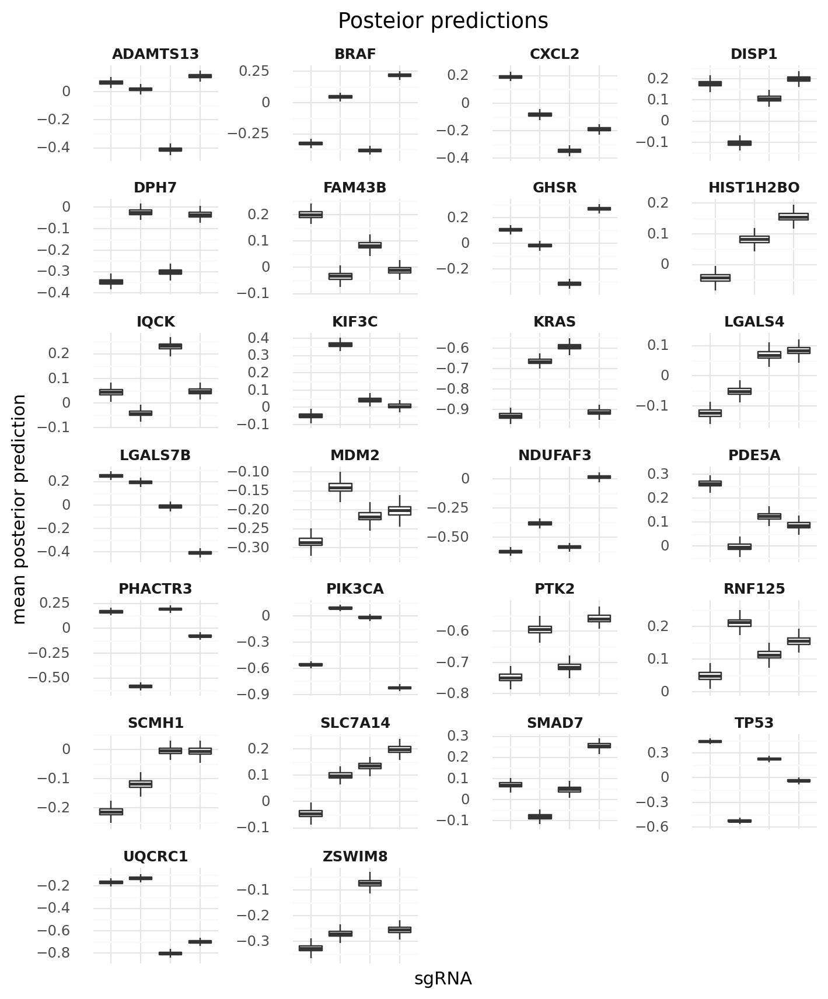

    <ggplot: (8779201086118)>

```python
(
    gg.ggplot(ppc_m1_summary, gg.aes(x="error"))
    + gg.facet_wrap("hugo_symbol", scales="free", ncol=3)
    + gg.geom_density(fill="black", color=None, alpha=0.4)
    + gg.geom_density(gg.aes(color="sgrna"), fill=None)
    + gg.scale_color_discrete(guide=None)
    + gg.theme(figure_size=(8, 20), subplots_adjust={"hspace": 0.5, "wspace": 0.4})
    + gg.labs(x=None, y="density", title="Distribution of prediction error")
)
```

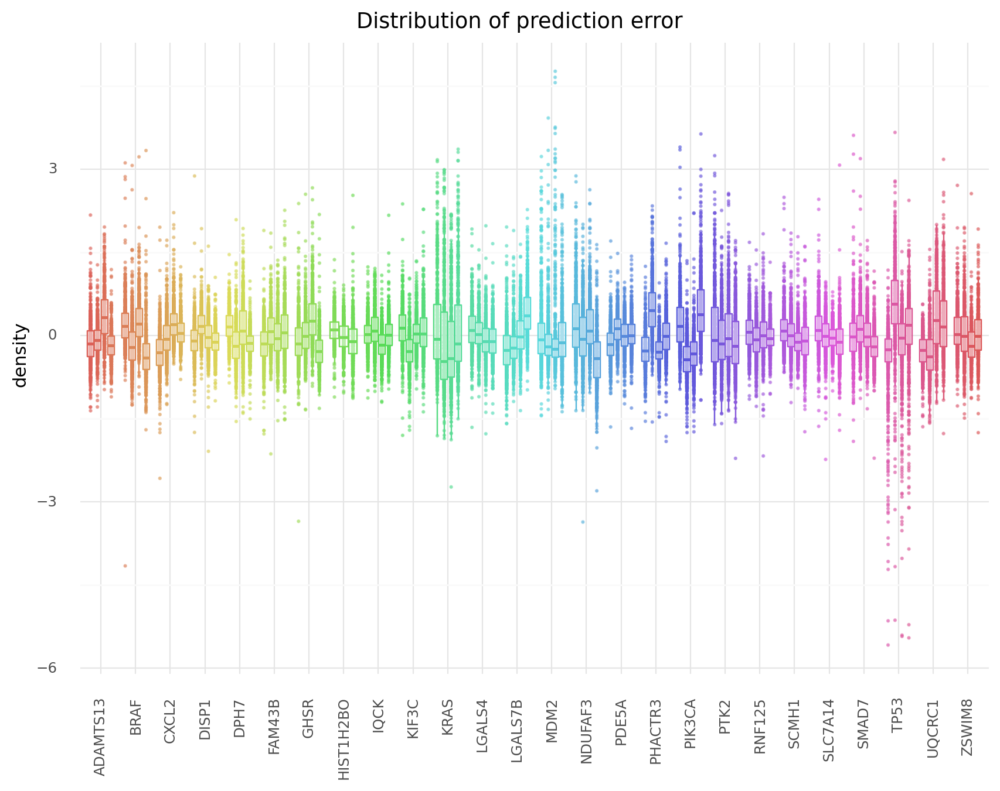

    <ggplot: (8779489965526)>

---

### Model 2. Add a layer for gene above sgRNA

Model 1 has a single varying intercept for genes.
This model will shift the gene-level predictor to a heriarchical level over sgRNA.
Therefore, sgRNA will be in the first level of the model and each sgRNA's distribution will come from a heirarchical distribution for the gene.

$
y \sim \mathcal{N}(\mu, \sigma) \\
\mu = \alpha_s \\
\quad \alpha_s \sim \mathcal{N}(\mu_{\alpha_s}, \sigma_{\alpha_s}) \\
\qquad \mu_{\alpha_s} = g_s \\
\qquad \quad g_s \sim \mathcal{N}(\mu_g, \sigma_g) \\
\qquad \qquad \mu_g \sim \mathcal{N}(0, 5) \quad \sigma_g \sim \text{Exp}(1) \\
\qquad \sigma_\alpha \sim \text{Exp}(1) \\
\sigma \sim \text{HalfNormal}(5)
$

```python
num_sgrnas = data["sgrna"].nunique()
num_genes = data["hugo_symbol"].nunique()
print(f"{num_sgrnas} sgRNAs from {num_genes} genes")

sgrna_idx = get_indices(data, "sgrna")

sgrna_to_gene_map = data[["sgrna", "hugo_symbol"]].drop_duplicates()
gene_idx = get_indices(sgrna_to_gene_map, "hugo_symbol")
```

    103 sgRNAs from 26 genes

```python
with pm.Model() as m2:
    μ_g = pm.Normal("μ_g", 0, 5)
    σ_g = pm.Exponential("σ_g", 1)

    g_s = pm.Normal("g_s", μ_g, σ_g, shape=num_genes)

    μ_α_s = pm.Deterministic("μ_α_s", g_s[gene_idx])
    σ_α_s = pm.Exponential("σ_α_s", 1)

    α_s = pm.Normal("α_s", μ_α_s, σ_α_s, shape=num_sgrnas)

    μ = pm.Deterministic("μ", α_s[sgrna_idx])
    σ = pm.HalfNormal("σ", 5)

    y = pm.Normal("y", μ, σ, observed=data.lfc)
```

```python
pm.model_to_graphviz(m2)
```

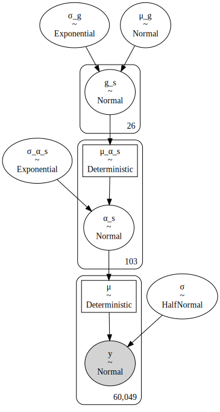

```python
m2_cache_dir = pymc3_cache_dir / "subset_speclet_m2"

m2_sampling_results = pmhelp.pymc3_sampling_procedure(
    model=m2,
    num_mcmc=2000,
    tune=4000,
    chains=2,
    cores=2,
    random_seed=RANDOM_SEED,
    cache_dir=pymc3_cache_dir / m2_cache_dir,
    force=False,
    sample_kwargs={"init": "advi+adapt_diag", "n_init": 40000, "target_accept": 0.9},
)
```

    Loading cached trace and posterior sample...

```python
m2_az = pmhelp.samples_to_arviz(model=m2, res=m2_sampling_results)
```

    arviz.data.io_pymc3 - WARNING - posterior predictive variable y's shape not compatible with number of chains and draws. This can mean that some draws or even whole chains are not represented.

The distributions for the genes are much wider, now, but this is probably a more accurate representation of the truth by taking into account per-sgRNA variability.

```python
az.plot_trace(m2_az, var_names=["μ_g", "σ_g", "g_s", "α_s"], compact=True)
plt.show()
```

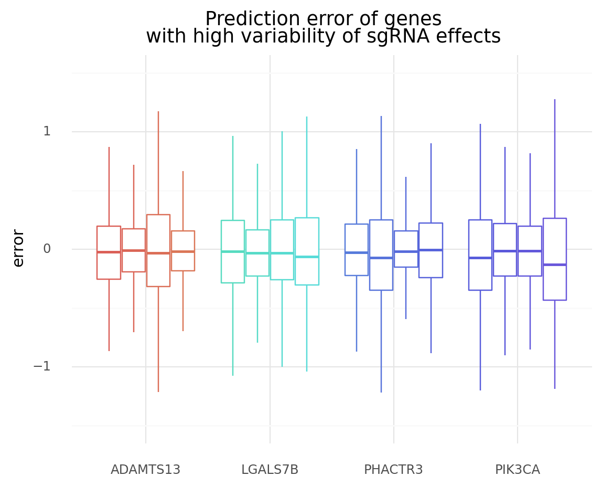

```python
az.summary(m2_az, var_names=["μ_g", "σ_g", "σ_α_s"])
```

<div>
<style scoped>
    .dataframe tbody tr th:only-of-type {
        vertical-align: middle;
    }

    .dataframe tbody tr th {
        vertical-align: top;
    }

    .dataframe thead th {
        text-align: right;
    }
</style>
<table border="1" class="dataframe">
  <thead>
    <tr style="text-align: right;">
      <th></th>
      <th>mean</th>
      <th>sd</th>
      <th>hdi_3%</th>
      <th>hdi_97%</th>
      <th>mcse_mean</th>
      <th>mcse_sd</th>
      <th>ess_mean</th>
      <th>ess_sd</th>
      <th>ess_bulk</th>
      <th>ess_tail</th>
      <th>r_hat</th>
    </tr>
  </thead>
  <tbody>
    <tr>
      <th>μ_g</th>
      <td>-0.109</td>
      <td>0.049</td>
      <td>-0.198</td>
      <td>-0.013</td>
      <td>0.001</td>
      <td>0.0</td>
      <td>7060.0</td>
      <td>5293.0</td>
      <td>7127.0</td>
      <td>3154.0</td>
      <td>1.0</td>
    </tr>
    <tr>
      <th>σ_g</th>
      <td>0.221</td>
      <td>0.043</td>
      <td>0.145</td>
      <td>0.302</td>
      <td>0.001</td>
      <td>0.0</td>
      <td>4759.0</td>
      <td>4728.0</td>
      <td>4693.0</td>
      <td>3332.0</td>
      <td>1.0</td>
    </tr>
    <tr>
      <th>σ_α_s</th>
      <td>0.228</td>
      <td>0.019</td>
      <td>0.194</td>
      <td>0.264</td>
      <td>0.000</td>
      <td>0.0</td>
      <td>4422.0</td>
      <td>4389.0</td>
      <td>4436.0</td>
      <td>3350.0</td>
      <td>1.0</td>
    </tr>
  </tbody>
</table>
</div>

```python
g_alpha_post = pd.DataFrame(np.asarray(m2_az.posterior["g_s"]).reshape(-1, num_genes))
ordered_genes = (
    sgrna_to_gene_map.sort_values("hugo_symbol").hugo_symbol.drop_duplicates().to_list()
)
g_alpha_post.columns = ordered_genes
g_alpha_post = g_alpha_post.melt(var_name="hugo_symbol", value_name="value")

g_alpha_summary = az.summary(m2_az, var_names="g_s", kind="stats", hdi_prob=0.89)
g_alpha_summary["hugo_symbol"] = ordered_genes

point_color = "#FA6A48"
(
    gg.ggplot(g_alpha_post.sample(frac=0.25), gg.aes(x="hugo_symbol", y="value"))
    + gg.geom_violin(color=None, fill="grey", alpha=0.5)
    + gg.geom_linerange(
        gg.aes(x="hugo_symbol", y="mean", ymin="hdi_5.5%", ymax="hdi_94.5%"),
        data=g_alpha_summary,
        color=point_color,
    )
    + gg.geom_point(
        gg.aes(x="hugo_symbol", y="mean"), data=g_alpha_summary, color="black"
    )
    + gg.scale_y_continuous(expand=(0.02, 0, 0.02, 0))
    + gg.theme(axis_text_x=gg.element_text(angle=90))
    + gg.labs(x=None, y=r"$g_\alpha$", title="Posterior estimates for gene value")
)
```

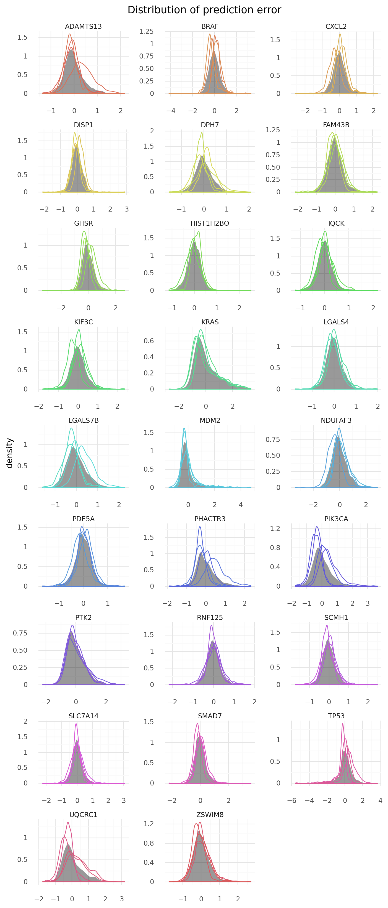

    <ggplot: (8779433427556)>

We see that the gene averages ("x") lie close to the middle of the estimated averages for their sgRNAs (dots), though there is regularization towards the mean of the genes $\mu_g$ (blue line with 89% HDI in the dashed line).

```python
alpha_s_summary = az.summary(m2_az, var_names="α_s", kind="stats", hdi_prob=0.89)
alpha_s_summary["sgrna"] = sgrna_to_gene_map.sgrna.to_list()
alpha_s_summary["hugo_symbol"] = sgrna_to_gene_map.hugo_symbol.to_list()

mu_g_avg = az.summary(m2_az, var_names=["μ_g"], hdi_prob=0.89)

(
    gg.ggplot(alpha_s_summary, gg.aes(x="hugo_symbol"))
    + gg.geom_hline(yintercept=0, color="black", alpha=0.3)
    + gg.geom_rect(
        xmin=-np.inf,
        xmax=np.inf,
        ymin=mu_g_avg["hdi_5.5%"].values[0],
        ymax=mu_g_avg["hdi_94.5%"].values[0],
        color="#0D72B4",
        fill=None,
        linetype="--",
        size=0.3,
    )
    + gg.geom_hline(
        yintercept=mu_g_avg["mean"].values[0], color="#0D72B4", linetype="-", size=0.8
    )
    + gg.geom_linerange(gg.aes(ymin="hdi_5.5%", ymax="hdi_94.5%", color="sgrna"))
    + gg.geom_point(gg.aes(y="mean", color="sgrna"), size=2.5, alpha=0.8)
    + gg.geom_point(
        gg.aes(x="hugo_symbol", y="mean"),
        data=g_alpha_summary,
        color="black",
        shape="x",
        size=3,
    )
    + gg.scale_color_discrete(guide=None)
    + gg.theme(figure_size=(10, 5), axis_text_x=gg.element_text(angle=90))
    + gg.labs(x=None, y="mean", title="Posterior estimates for sgRNA and gene values")
)
```

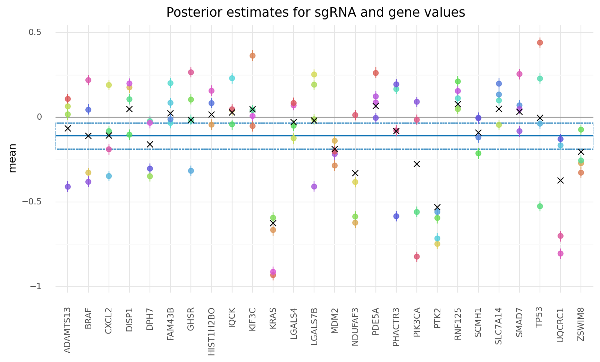

    <ggplot: (8779201475458)>

```python
ppc_m2_summary = logfc_model_ppc_dataframe(
    m2_az, data.lfc, data[["hugo_symbol", "sgrna", "depmap_id"]]
)
ppc_m2_summary.head()
```

    /home/jc604/.conda/envs/speclet/lib/python3.8/site-packages/arviz/stats/stats.py:484: FutureWarning: hdi currently interprets 2d data as (draw, shape) but this will change in a future release to (chain, draw) for coherence with other functions

<div>
<style scoped>
    .dataframe tbody tr th:only-of-type {
        vertical-align: middle;
    }

    .dataframe tbody tr th {
        vertical-align: top;
    }

    .dataframe thead th {
        text-align: right;
    }
</style>
<table border="1" class="dataframe">
  <thead>
    <tr style="text-align: right;">
      <th></th>
      <th>hdi_5.5%</th>
      <th>hdi_94.5%</th>
      <th>mean</th>
      <th>real_value</th>
      <th>error</th>
      <th>hugo_symbol</th>
      <th>sgrna</th>
      <th>depmap_id</th>
    </tr>
  </thead>
  <tbody>
    <tr>
      <th>0</th>
      <td>-0.720048</td>
      <td>0.802219</td>
      <td>0.076820</td>
      <td>0.029491</td>
      <td>0.047328</td>
      <td>ADAMTS13</td>
      <td>CCACCCACAGACGCTCAGCA</td>
      <td>ACH-000007</td>
    </tr>
    <tr>
      <th>1</th>
      <td>-0.697091</td>
      <td>0.835492</td>
      <td>0.056530</td>
      <td>0.426017</td>
      <td>-0.369487</td>
      <td>ADAMTS13</td>
      <td>CCACCCACAGACGCTCAGCA</td>
      <td>ACH-000007</td>
    </tr>
    <tr>
      <th>2</th>
      <td>-0.707099</td>
      <td>0.810758</td>
      <td>0.047157</td>
      <td>0.008626</td>
      <td>0.038531</td>
      <td>ADAMTS13</td>
      <td>CCACCCACAGACGCTCAGCA</td>
      <td>ACH-000009</td>
    </tr>
    <tr>
      <th>3</th>
      <td>-0.677088</td>
      <td>0.847100</td>
      <td>0.084787</td>
      <td>0.280821</td>
      <td>-0.196034</td>
      <td>ADAMTS13</td>
      <td>CCACCCACAGACGCTCAGCA</td>
      <td>ACH-000009</td>
    </tr>
    <tr>
      <th>4</th>
      <td>-0.732314</td>
      <td>0.790155</td>
      <td>0.083411</td>
      <td>0.239815</td>
      <td>-0.156404</td>
      <td>ADAMTS13</td>
      <td>CCACCCACAGACGCTCAGCA</td>
      <td>ACH-000009</td>
    </tr>
  </tbody>
</table>
</div>

```python
(
    gg.ggplot(ppc_m2_summary, gg.aes(x="sgrna"))
    + gg.facet_wrap("hugo_symbol", scales="free", ncol=4)
    + gg.geom_hline(
        gg.aes(yintercept="mean"),
        data=g_alpha_summary,
        color="black",
        linetype="--",
        size=0.5,
    )
    + gg.geom_boxplot(
        gg.aes(y="mean"), outlier_alpha=0, color="#0D72B4", fill="#0D72B4", alpha=0.1
    )
    + gg.theme(
        axis_text_x=gg.element_blank(),
        figure_size=(8, 10),
        subplots_adjust={"hspace": 0.4, "wspace": 0.6},
        strip_text=gg.element_text(weight="bold"),
    )
    + gg.labs(x="sgRNA", y="mean", title="Posterior predictions")
)
```

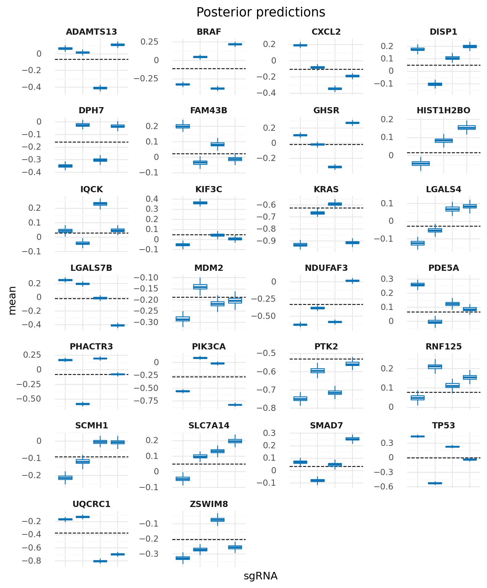

    <ggplot: (8779197922320)>

The prediction error is still quite substantial, particularly around genes that are frequently mutated suchs as *KRAS* and *TP53*.

```python
(
    gg.ggplot(ppc_m2_summary, gg.aes(x="hugo_symbol", y="error"))
    + gg.geom_hline(yintercept=0)
    + gg.geom_jitter(
        gg.aes(color="abs(error)"), width=0.35, height=0, size=0.5, alpha=0.3
    )
    + gg.scale_color_distiller(type="seq", palette="RdPu", direction=1)
    + gg.theme(axis_text_x=gg.element_text(rotation=90))
    + gg.labs(
        x=None,
        y="error (predicted - true)",
        title="Posterior prediction error",
        color="error",
    )
)
```


    <ggplot: (8779433614439)>

Since we modeled the sgRNA variability, the errors for each sgRNA are now normally distributed.
The plot below specifically focuses on 4 genes that had a high degree of difference in error distributions among its sgRNAs.

```python
genes_with_sgrna_error = ["ADAMTS13", "LGALS7B", "PHACTR3", "PIK3CA"]
plot_data = ppc_m2_summary[ppc_m2_summary.hugo_symbol.isin(genes_with_sgrna_error)]
(
    gg.ggplot(plot_data, gg.aes(x="hugo_symbol", y="error"))
    + gg.geom_boxplot(
        gg.aes(color="sgrna"), position=gg.position_dodge(width=0.8), outlier_alpha=0
    )
    + gg.scale_color_discrete(guide=None)
    + gg.scale_y_continuous(limits=(-1.5, 1.5))
    + gg.labs(
        x=None,
        y="error",
        title="Prediction error of genes\nwith high variability of sgRNA effects",
    )
)
```


    <ggplot: (8779198054873)>

And, as noted above, some genes that are frequently mutated seem to show a correlation between the error and which data points had a mutation in those genes.

```python
genes_with_large_error = ["KRAS", "MDM2", "PTK2", "TP53"]

for col in ["n_muts", "any_deleterious", "kras_mutation"]:
    ppc_m2_summary[col] = data[col].values

ppc2_m2_summary_mutations = ppc_m2_summary[
    ppc_m2_summary.hugo_symbol.isin(genes_with_large_error)
].reset_index()
ppc2_m2_summary_mutations["is_mutated"] = ppc2_m2_summary_mutations["n_muts"].values > 0
ppc2_m2_summary_mutations["sgrna_idx"] = get_indices(ppc2_m2_summary_mutations, "sgrna")

(
    gg.ggplot(ppc2_m2_summary_mutations, gg.aes(x="sgrna_idx", y="error"))
    + gg.facet_wrap("hugo_symbol", scales="free")
    + gg.geom_jitter(gg.aes(color="is_mutated", alpha="is_mutated"), size=0.5)
    + gg.scale_color_manual(values=["#429DD6", "#B93174"])
    + gg.scale_alpha_manual(
        values=[0.5, 0.8], guide=gg.guide_legend(override_aes={"size": 2, "alpha": 1})
    )
    + gg.theme(
        subplots_adjust={"hspace": 0.4, "wspace": 0.6},
        strip_text=gg.element_text(weight="bold"),
    )
    + gg.labs(
        x="sgRNA ID",
        y="prediction error",
        title="Error associated with mutation status",
        color="gene is\nmutated",
        alpha="gene is\nmutated",
    )
)
```

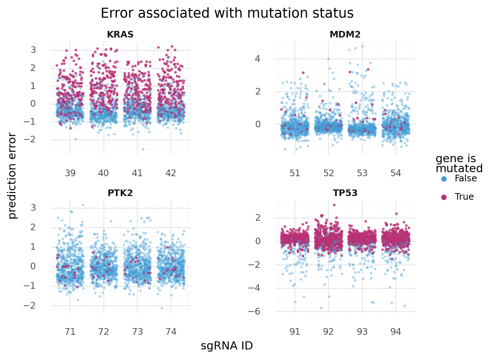

    <ggplot: (8779198259194)>

---

### Model 3. Add cell line varying intercept to Model 2

There is sure to be some variability per cell line, so this should be added to the model.
This model builds on model two by introducing another varying intercept for cell line with a tight prior distribution.
To help with sampling, I also tightened the priors for the sgRNA/gene varying intercepts.

$
y \sim \mathcal{N}(\mu, \sigma) \\
\mu = \alpha_s + \beta_c\\
\quad \alpha_s \sim \mathcal{N}(\mu_{\alpha_s}, \sigma_{\alpha_s}) \\
\qquad \mu_{\alpha_s} = g_s \\
\qquad \quad g_s \sim \mathcal{N}(\mu_g, \sigma_g) \\
\qquad \qquad \mu_g \sim \mathcal{N}(0, 2) \quad \sigma_g \sim \text{Exp}(1) \\
\qquad \sigma_{\alpha_s} \sim \text{Exp}(1) \\
\quad \beta_c \sim \mathcal{N}(\mu_{\beta_c}, \sigma_{\beta_c}) \\
\qquad \mu_{\beta_c} \sim \mathcal{N}(0, 0.2) \quad \sigma_{\beta_c} \sim \text{Exp}(0.4) \\
\sigma \sim \text{HalfNormal}(5)
$

```python
cell_line_idx = get_indices(data, "depmap_id")
num_cell_lines = data.depmap_id.nunique()
print(f"{num_cell_lines} cell lines")
```

    258 cell lines

```python
with pm.Model() as m3:
    μ_g = pm.Normal("μ_g", 0, 2)
    σ_g = pm.Exponential("σ_g", 1)

    g_s = pm.Normal("g_s", μ_g, σ_g, shape=num_genes)

    μ_β_c = pm.Normal("μ_β_c", 0, 0.2)
    σ_β_c = pm.Exponential("σ_β_c", 0.4)
    μ_α_s = pm.Deterministic("μ_α_s", g_s[gene_idx])
    σ_α_s = pm.Exponential("σ_α_s", 1)

    β_c = pm.Normal("β_c", μ_β_c, σ_β_c, shape=num_cell_lines)
    α_s = pm.Normal("α_s", μ_α_s, σ_α_s, shape=num_sgrnas)

    μ = pm.Deterministic("μ", α_s[sgrna_idx] + β_c[cell_line_idx])
    σ = pm.HalfNormal("σ", 5)

    y = pm.Normal("y", μ, σ, observed=data.lfc)
```

```python
pm.model_to_graphviz(m3)
```

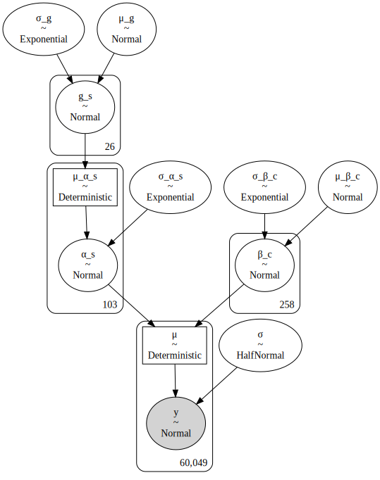

```python
m3_cache_dir = pymc3_cache_dir / "subset_speclet_m3"

m3_sampling_results = pmhelp.pymc3_sampling_procedure(
    model=m3,
    num_mcmc=2000,
    tune=4000,
    chains=2,
    cores=2,
    random_seed=RANDOM_SEED,
    cache_dir=pymc3_cache_dir / m3_cache_dir,
    force=False,
    sample_kwargs={"init": "advi+adapt_diag", "n_init": 40000, "target_accept": 0.9},
)
```

    Auto-assigning NUTS sampler...
    Initializing NUTS using advi+adapt_diag...

<div>
    <style>
        /*Turns off some styling*/
        progress {
            /*gets rid of default border in Firefox and Opera.*/
            border: none;
            /*Needs to be in here for Safari polyfill so background images work as expected.*/
            background-size: auto;
        }
        .progress-bar-interrupted, .progress-bar-interrupted::-webkit-progress-bar {
            background: #F44336;
        }
    </style>
  <progress value='30979' class='' max='40000' style='width:300px; height:20px; vertical-align: middle;'></progress>
  77.45% [30979/40000 00:58<00:16 Average Loss = 40,088]
</div>

    Convergence achieved at 31000
    Interrupted at 30,999 [77%]: Average Loss = 55,102
    Multiprocess sampling (2 chains in 2 jobs)
    NUTS: [σ, α_s, β_c, σ_α_s, σ_β_c, μ_β_c, g_s, σ_g, μ_g]

<div>
    <style>
        /*Turns off some styling*/
        progress {
            /*gets rid of default border in Firefox and Opera.*/
            border: none;
            /*Needs to be in here for Safari polyfill so background images work as expected.*/
            background-size: auto;
        }
        .progress-bar-interrupted, .progress-bar-interrupted::-webkit-progress-bar {
            background: #F44336;
        }
    </style>
  <progress value='12000' class='' max='12000' style='width:300px; height:20px; vertical-align: middle;'></progress>
  100.00% [12000/12000 03:02<00:00 Sampling 2 chains, 0 divergences]
</div>

    Sampling 2 chains for 4_000 tune and 2_000 draw iterations (8_000 + 4_000 draws total) took 183 seconds.
    The rhat statistic is larger than 1.4 for some parameters. The sampler did not converge.
    The estimated number of effective samples is smaller than 200 for some parameters.

<div>
    <style>
        /*Turns off some styling*/
        progress {
            /*gets rid of default border in Firefox and Opera.*/
            border: none;
            /*Needs to be in here for Safari polyfill so background images work as expected.*/
            background-size: auto;
        }
        .progress-bar-interrupted, .progress-bar-interrupted::-webkit-progress-bar {
            background: #F44336;
        }
    </style>
  <progress value='1000' class='' max='1000' style='width:300px; height:20px; vertical-align: middle;'></progress>
  100.00% [1000/1000 00:04<00:00]
</div>

    Caching trace and posterior sample...

```python
m3_az = pmhelp.samples_to_arviz(model=m3, res=m3_sampling_results)
```

    arviz.data.io_pymc3 - WARNING - posterior predictive variable y's shape not compatible with number of chains and draws. This can mean that some draws or even whole chains are not represented.

```python
az.plot_trace(m3_az, var_names=["g_s", "α_s", "β_c"], compact=True)
plt.show()
```

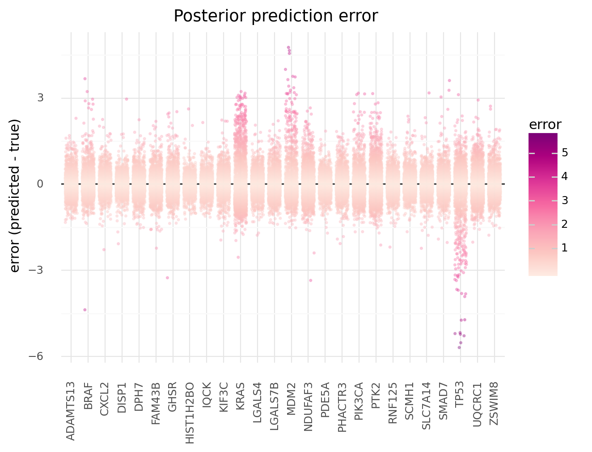

> This model is currently not sampling properly.
> This is most likely due to non-identifiability with the two varying intercepts.
> I will revist trying to add in cell line in later models.

---

### Model 4. Add mutation covariate to Model 2

```python

```

```python

```

```python

```

```python

```

---

```python
notebook_toc = time()
print(f"execution time: {(notebook_toc - notebook_tic) / 60:.2f} minutes")
```

    execution time: 2.61 minutes

```python
%load_ext watermark
%watermark -d -u -v -iv -b -h -m
```

    Last updated: 2021-01-18

    Python implementation: CPython
    Python version       : 3.8.6
    IPython version      : 7.19.0

    Compiler    : GCC 9.3.0
    OS          : Linux
    Release     : 3.10.0-1062.el7.x86_64
    Machine     : x86_64
    Processor   : x86_64
    CPU cores   : 28
    Architecture: 64bit

    Hostname: compute-e-16-236.o2.rc.hms.harvard.edu

    Git branch: data-subset-model

    arviz     : 0.10.0
    pymc3     : 3.9.3
    plotnine  : 0.7.1
    pandas    : 1.2.0
    seaborn   : 0.11.1
    numpy     : 1.19.5
    re        : 2.2.1
    theano    : 1.0.5
    matplotlib: 3.3.3
