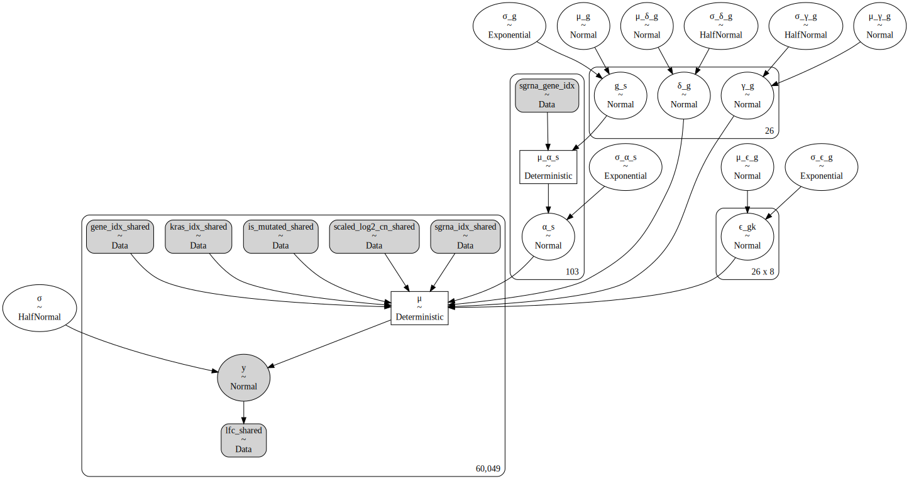

```python
import re
import string
import warnings
from pathlib import Path
from time import time
from typing import List, Optional, Tuple

import arviz as az
import common_data_processing as dphelp
import matplotlib.colors as mcolors
import matplotlib.pyplot as plt
import numpy as np
import pandas as pd
import plotnine as gg
import pymc3 as pm
import pymc3_helpers as pmhelp
import string_functions as stringr
from theano import tensor as tt

notebook_tic = time()

warnings.simplefilter(action="ignore", category=UserWarning)

gg.theme_set(gg.theme_minimal())
%config InlineBackend.figure_format = "retina"

RANDOM_SEED = 332
np.random.seed(RANDOM_SEED)

pymc3_cache_dir = Path("pymc3_model_cache")
```

## Data preparation (coppied)

```python
data_path = Path("../modeling_data/depmap_modeling_dataframe_subsample.csv")
data = pd.read_csv(data_path)

data = data.sort_values(["hugo_symbol", "sgrna", "depmap_id"]).reset_index(drop=True)
for col in ("hugo_symbol", "depmap_id", "sgrna", "lineage", "chromosome"):
    data = dphelp.make_cat(data, col, ordered=True, sort_cats=False)

data["log2_cn"] = np.log2(data.gene_cn + 1)
data = dphelp.zscale_cna_by_group(
    data, gene_cn_col="log2_cn", new_col="z_log2_cn", cn_max=np.log2(10)
)
data["is_mutated"] = dphelp.nmutations_to_binary_array(data.n_muts)
```

---

### Model 7. Introduce a covariate for the KRAS allele to model 6

Finally, we can add a categorical variable for the *KRAS* allele of a tumor sample.

$
y \sim \mathcal{N}(\mu, \sigma) \\
\mu = \alpha_s + \gamma_g M + \delta_g \log_2 C + \epsilon_g K\\
\quad \alpha_s \sim \mathcal{N}(\mu_{\alpha_s}, \sigma_{\alpha_s}) \\
\qquad \mu_{\alpha_s} = g_s \\
\qquad \quad g_s \sim \mathcal{N}(\mu_g, \sigma_g) \\
\qquad \qquad \mu_g \sim \mathcal{N}(0, 5) \quad \sigma_g \sim \text{Exp}(1) \\
\qquad \sigma_\alpha \sim \text{Exp}(1) \\
\quad \gamma_g \sim \mathcal{N}(\mu_{\gamma_g}, \sigma_{\gamma_g}) \\
\qquad \mu_{\gamma_g} \sim \mathcal{N}(0, 2) \\
\qquad \sigma_{\gamma_g} \sim \text{HalfNormal}(2) \\
\quad \delta_g \sim \mathcal{N}(\mu_{\delta_g}, \sigma_{\delta_g}) \\
\qquad \mu_{\delta_g} \sim \mathcal{N}(-0.2, 2) \\
\qquad \sigma_{\delta_g} \sim \text{HalfNormal}(2) \\
\quad \epsilon_g \sim \mathcal{N}(\mu_{\epsilon_g}, \sigma_{\epsilon_g}) \\
\qquad \mu_{\epsilon_g} \sim \mathcal{N}(0, 0.5) \\
\qquad \sigma_{\epsilon_g} \sim \text{Exponential}(1) \\
\sigma \sim \text{HalfNormal}(5)
$

```python
# List of KRAS alleles to keep separate. The rest will be "other".
MIN_KRAS_ALLELE_COUNT = 5
kras_counts = pd.get_dummies(
    data[["depmap_id", "kras_mutation"]].drop_duplicates()[["kras_mutation"]]
)
alleles_to_keep = (
    kras_counts.sum().index.values[kras_counts.sum() >= MIN_KRAS_ALLELE_COUNT].tolist()
)
alleles_to_keep = [a.replace("kras_mutation_", "") for a in alleles_to_keep]

# Dummy matrix for the alleles.
data = data.assign(
    kras_mutation_idx=lambda d: [
        a if a in alleles_to_keep else "other" for a in d.kras_mutation
    ]
)
data = dphelp.make_cat(data, "kras_mutation_idx")
kras_dummy_matrix = np.array(pd.get_dummies(data[["kras_mutation_idx"]]))
```

```python
gene_idx, num_genes = dphelp.get_indices_and_count(data, "hugo_symbol")
sgrna_idx, num_sgrnas = dphelp.get_indices_and_count(data, "sgrna")
kras_idx, num_kras = dphelp.get_indices_and_count(data, "kras_mutation_idx")

sgrna_to_gene_map = data[["sgrna", "hugo_symbol"]].drop_duplicates()
sgrna_gene_idx = dphelp.get_indices(sgrna_to_gene_map, "hugo_symbol")
```

```python
with pm.Model() as m7:
    # Indices
    sgrna_gene_idx_shared = pm.Data("sgrna_gene_idx", sgrna_gene_idx)
    sgrna_idx_shared = pm.Data("sgrna_idx_shared", sgrna_idx)
    gene_idx_shared = pm.Data("gene_idx_shared", gene_idx)
    kras_idx_shared = pm.Data("kras_idx_shared", kras_idx)

    # Data
    is_mutated_shared = pm.Data(
        "is_mutated_shared", dphelp.extract_flat_ary(data.is_mutated)
    )
    scaled_log2_cn_shared = pm.Data(
        "scaled_log2_cn_shared", dphelp.extract_flat_ary(data.z_log2_cn)
    )
    lfc_shared = pm.Data("lfc_shared", dphelp.extract_flat_ary(data.lfc))

    μ_g = pm.Normal("μ_g", 0, 5)
    σ_g = pm.Exponential("σ_g", 1)

    g_s = pm.Normal("g_s", μ_g, σ_g, shape=num_genes)

    μ_α_s = pm.Deterministic("μ_α_s", g_s[sgrna_gene_idx_shared])
    σ_α_s = pm.Exponential("σ_α_s", 1)
    μ_γ_g = pm.Normal("μ_γ_g", 0, 2)
    σ_γ_g = pm.HalfNormal("σ_γ_g", 2)
    μ_δ_g = pm.Normal("μ_δ_g", -0.2, 2)
    σ_δ_g = pm.HalfNormal("σ_δ_g", 2)
    μ_ϵ_g = pm.Normal("μ_ϵ_g", 0, 0.2)
    σ_ϵ_g = pm.Exponential("σ_ϵ_g", 0.3)

    α_s = pm.Normal("α_s", μ_α_s, σ_α_s, shape=num_sgrnas)
    γ_g = pm.Normal("γ_g", μ_γ_g, σ_γ_g, shape=num_genes)
    δ_g = pm.Normal("δ_g", μ_δ_g, σ_δ_g, shape=num_genes)
    ϵ_gk = pm.Normal("ϵ_gk", μ_ϵ_g, σ_ϵ_g, shape=(num_genes, num_kras))

    μ = pm.Deterministic(
        "μ",
        α_s[sgrna_idx_shared]
        + γ_g[gene_idx_shared] * is_mutated_shared
        + δ_g[gene_idx_shared] * scaled_log2_cn_shared
        + ϵ_gk[gene_idx_shared, kras_idx_shared],
    )
    σ = pm.HalfNormal("σ", 5)

    y = pm.Normal("y", μ, σ, observed=lfc_shared)
```

```python
pm.model_to_graphviz(m7)
```



```python
m7_cache_dir = pymc3_cache_dir / "subset_speclet_m7"

m7_sampling_results = pmhelp.pymc3_sampling_procedure(
    model=m7,
    num_mcmc=2000,
    tune=4000,
    chains=2,
    cores=2,
    random_seed=RANDOM_SEED,
    cache_dir=pymc3_cache_dir / m7_cache_dir,
    force=False,
    sample_kwargs={"init": "advi+adapt_diag", "n_init": 40000},
)

m7_az = pmhelp.samples_to_arviz(model=m7, res=m7_sampling_results)
```

    Auto-assigning NUTS sampler...
    Initializing NUTS using advi+adapt_diag...

<div>
    <style>
        /*Turns off some styling*/
        progress {
            /*gets rid of default border in Firefox and Opera.*/
            border: none;
            /*Needs to be in here for Safari polyfill so background images work as expected.*/
            background-size: auto;
        }
        .progress-bar-interrupted, .progress-bar-interrupted::-webkit-progress-bar {
            background: #F44336;
        }
    </style>
  <progress value='30375' class='' max='40000' style='width:300px; height:20px; vertical-align: middle;'></progress>
  75.94% [30375/40000 03:54<01:14 Average Loss = 36,997]
</div>

    Convergence achieved at 30400
    Interrupted at 30,399 [75%]: Average Loss = 55,294
    Multiprocess sampling (2 chains in 2 jobs)
    NUTS: [σ, ϵ_gk, δ_g, γ_g, α_s, σ_ϵ_g, μ_ϵ_g, σ_δ_g, μ_δ_g, σ_γ_g, μ_γ_g, σ_α_s, g_s, σ_g, μ_g]

<div>
    <style>
        /*Turns off some styling*/
        progress {
            /*gets rid of default border in Firefox and Opera.*/
            border: none;
            /*Needs to be in here for Safari polyfill so background images work as expected.*/
            background-size: auto;
        }
        .progress-bar-interrupted, .progress-bar-interrupted::-webkit-progress-bar {
            background: #F44336;
        }
    </style>
  <progress value='2220' class='' max='12000' style='width:300px; height:20px; vertical-align: middle;'></progress>
  18.50% [2220/12000 10:31<46:23 Sampling 2 chains, 0 divergences]
</div>

    ---------------------------------------------------------------------------

    KeyboardInterrupt                         Traceback (most recent call last)

    ~/.conda/envs/speclet/lib/python3.9/site-packages/pymc3/sampling.py in _mp_sample(draws, tune, step, chains, cores, chain, random_seed, start, progressbar, trace, model, callback, discard_tuned_samples, mp_ctx, pickle_backend, **kwargs)
       1485             with sampler:
    -> 1486                 for draw in sampler:
       1487                     trace = traces[draw.chain - chain]


    ~/.conda/envs/speclet/lib/python3.9/site-packages/pymc3/parallel_sampling.py in __iter__(self)
        491         while self._active:
    --> 492             draw = ProcessAdapter.recv_draw(self._active)
        493             proc, is_last, draw, tuning, stats, warns = draw


    ~/.conda/envs/speclet/lib/python3.9/site-packages/pymc3/parallel_sampling.py in recv_draw(processes, timeout)
        351         pipes = [proc._msg_pipe for proc in processes]
    --> 352         ready = multiprocessing.connection.wait(pipes)
        353         if not ready:


    ~/.conda/envs/speclet/lib/python3.9/multiprocessing/connection.py in wait(object_list, timeout)
        935             while True:
    --> 936                 ready = selector.select(timeout)
        937                 if ready:


    ~/.conda/envs/speclet/lib/python3.9/selectors.py in select(self, timeout)
        415         try:
    --> 416             fd_event_list = self._selector.poll(timeout)
        417         except InterruptedError:


    KeyboardInterrupt:


    During handling of the above exception, another exception occurred:


    ValueError                                Traceback (most recent call last)

    <ipython-input-19-b753dabd936d> in <module>
          1 m7_cache_dir = pymc3_cache_dir / "subset_speclet_m7"
          2
    ----> 3 m6_sampling_results = pmhelp.pymc3_sampling_procedure(
          4     model=m7,
          5     num_mcmc=2000,


    /n/data2/dfci/cancerbio/haigis/Cook/speclet/analysis/pymc3_helpers.py in pymc3_sampling_procedure(model, num_mcmc, tune, chains, cores, prior_check_samples, ppc_samples, random_seed, cache_dir, force, sample_kwargs)
         99                 prior_check_samples, random_seed=random_seed
        100             )
    --> 101             trace = pm.sample(
        102                 draws=num_mcmc,
        103                 tune=tune,


    ~/.conda/envs/speclet/lib/python3.9/site-packages/pymc3/sampling.py in sample(draws, step, init, n_init, start, trace, chain_idx, chains, cores, tune, progressbar, model, random_seed, discard_tuned_samples, compute_convergence_checks, callback, return_inferencedata, idata_kwargs, mp_ctx, pickle_backend, **kwargs)
        543         _print_step_hierarchy(step)
        544         try:
    --> 545             trace = _mp_sample(**sample_args, **parallel_args)
        546         except pickle.PickleError:
        547             _log.warning("Could not pickle model, sampling singlethreaded.")


    ~/.conda/envs/speclet/lib/python3.9/site-packages/pymc3/sampling.py in _mp_sample(draws, tune, step, chains, cores, chain, random_seed, start, progressbar, trace, model, callback, discard_tuned_samples, mp_ctx, pickle_backend, **kwargs)
       1510     except KeyboardInterrupt:
       1511         if discard_tuned_samples:
    -> 1512             traces, length = _choose_chains(traces, tune)
       1513         else:
       1514             traces, length = _choose_chains(traces, 0)


    ~/.conda/envs/speclet/lib/python3.9/site-packages/pymc3/sampling.py in _choose_chains(traces, tune)
       1528     lengths = [max(0, len(trace) - tune) for trace in traces]
       1529     if not sum(lengths):
    -> 1530         raise ValueError("Not enough samples to build a trace.")
       1531
       1532     idxs = np.argsort(lengths)[::-1]


    ValueError: Not enough samples to build a trace.

```python

```

```python

```

```python

```

```python

```

```python

```

```python

```

```python

```

```python

```

```python

```

---

```python
notebook_toc = time()
print(f"execution time: {(notebook_toc - notebook_tic) / 60:.2f} minutes")
```

    execution time: 0.13 minutes

```python
%load_ext watermark
%watermark -d -u -v -iv -b -h -m
```

    Last updated: 2021-01-25

    Python implementation: CPython
    Python version       : 3.9.1
    IPython version      : 7.19.0

    Compiler    : GCC 9.3.0
    OS          : Linux
    Release     : 3.10.0-1062.el7.x86_64
    Machine     : x86_64
    Processor   : x86_64
    CPU cores   : 28
    Architecture: 64bit

    Hostname: compute-e-16-231.o2.rc.hms.harvard.edu

    Git branch: data-subset-model

    plotnine  : 0.7.1
    re        : 2.2.1
    pandas    : 1.2.0
    matplotlib: 3.3.3
    numpy     : 1.19.5
    pymc3     : 3.9.3
    theano    : 1.0.5
    arviz     : 0.11.0

```python

```
