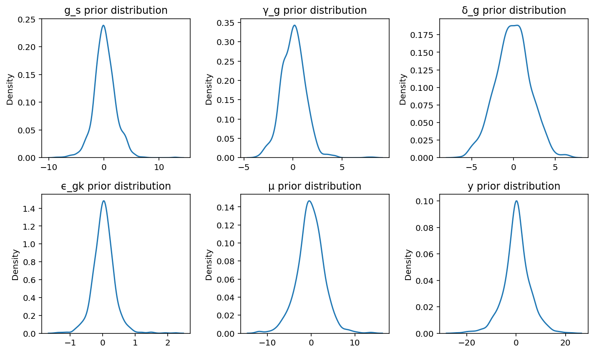
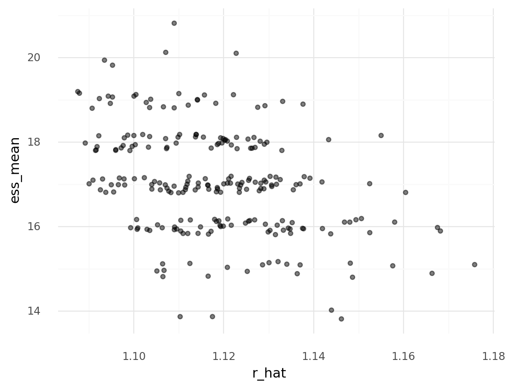
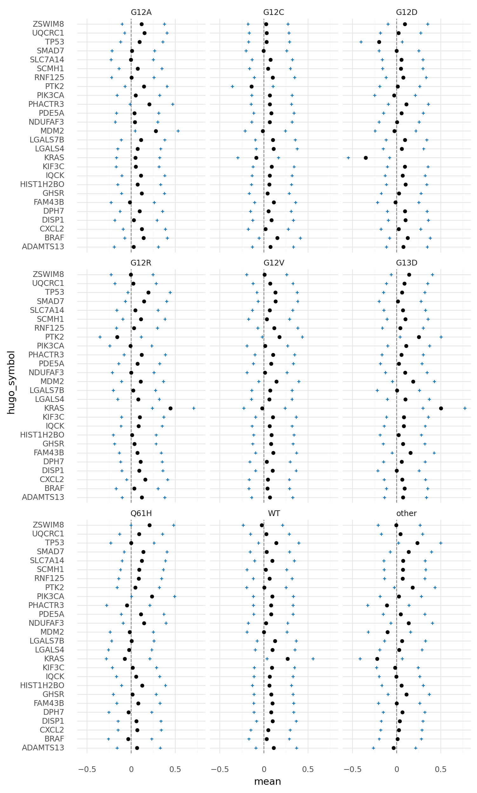
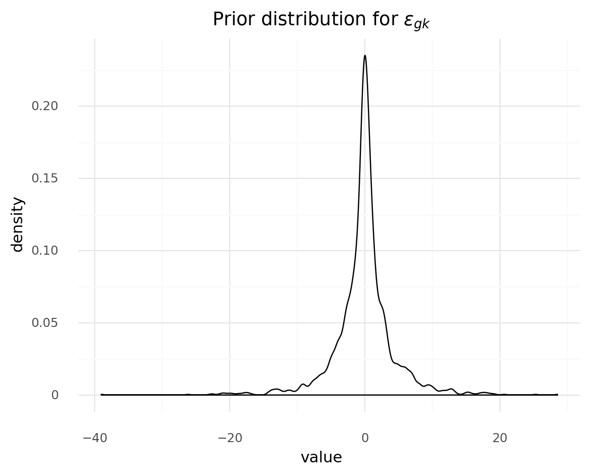
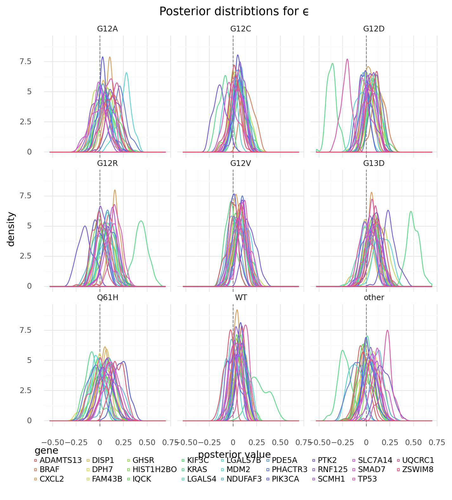

```python
import re
import string
import warnings
from pathlib import Path
from time import time
from typing import List, Optional, Tuple

import arviz as az
import common_data_processing as dphelp
import matplotlib.colors as mcolors
import matplotlib.pyplot as plt
import numpy as np
import pandas as pd
import plotnine as gg
import pymc3 as pm
import pymc3_helpers as pmhelp
import seaborn as sns
import string_functions as stringr
from plotnine_helpers import margin
from theano import tensor as tt

notebook_tic = time()

warnings.simplefilter(action="ignore", category=UserWarning)

gg.theme_set(gg.theme_minimal())
%config InlineBackend.figure_format = "retina"

RANDOM_SEED = 332
np.random.seed(RANDOM_SEED)

pymc3_cache_dir = Path("pymc3_model_cache")
```

## Data preparation (coppied)

```python
data_path = Path("../modeling_data/depmap_modeling_dataframe_subsample.csv")
data = pd.read_csv(data_path)

data = data.sort_values(["hugo_symbol", "sgrna", "depmap_id"]).reset_index(drop=True)
for col in ("hugo_symbol", "depmap_id", "sgrna", "lineage", "chromosome"):
    data = dphelp.make_cat(data, col, ordered=True, sort_cats=False)

data["log2_cn"] = np.log2(data.gene_cn + 1)
data = dphelp.zscale_cna_by_group(
    data, gene_cn_col="log2_cn", new_col="z_log2_cn", cn_max=np.log2(10)
)
data["is_mutated"] = dphelp.nmutations_to_binary_array(data.n_muts)
```

---

### Model 7. Introduce a covariate for the KRAS allele to model 6

Finally, we can add a categorical variable for the *KRAS* allele of a tumor sample.

$
y \sim \mathcal{N}(\mu, \sigma) \\
\mu = \alpha_s + \gamma_g M + \delta_g \log_2 C + \epsilon_g K\\
\quad \alpha_s \sim \mathcal{N}(\mu_{\alpha_s}, \sigma_{\alpha_s}) \\
\qquad \mu_{\alpha_s} = g_s \\
\qquad \quad g_s \sim \mathcal{N}(\mu_g, \sigma_g) \\
\qquad \qquad \mu_g \sim \mathcal{N}(0, 5) \quad \sigma_g \sim \text{Exp}(1) \\
\qquad \sigma_\alpha \sim \text{Exp}(1) \\
\quad \gamma_g \sim \mathcal{N}(\mu_{\gamma_g}, \sigma_{\gamma_g}) \\
\qquad \mu_{\gamma_g} \sim \mathcal{N}(0, 2) \\
\qquad \sigma_{\gamma_g} \sim \text{HalfNormal}(2) \\
\quad \delta_g \sim \mathcal{N}(\mu_{\delta_g}, \sigma_{\delta_g}) \\
\qquad \mu_{\delta_g} \sim \mathcal{N}(-0.2, 2) \\
\qquad \sigma_{\delta_g} \sim \text{HalfNormal}(2) \\
\quad \epsilon_g \sim \mathcal{N}(\mu_{\epsilon_g}, \sigma_{\epsilon_g}) \\
\qquad \mu_{\epsilon_g} \sim \mathcal{N}(0, 0.5) \\
\qquad \sigma_{\epsilon_g} \sim \text{Exponential}(1) \\
\sigma \sim \text{HalfNormal}(5)
$

```python
# List of KRAS alleles to keep separate. The rest will be "other".
MIN_KRAS_ALLELE_COUNT = 10

kras_counts = pd.get_dummies(
    data[["depmap_id", "kras_mutation"]].drop_duplicates()[["kras_mutation"]]
)
alleles_to_keep = (
    kras_counts.sum().index.values[kras_counts.sum() >= MIN_KRAS_ALLELE_COUNT].tolist()
)
alleles_to_keep = [a.replace("kras_mutation_", "") for a in alleles_to_keep]
print(f"Using the following alleles ({len(alleles_to_keep)})")
print(alleles_to_keep)

# Dummy matrix for the alleles.
data = data.assign(
    kras_mutation_idx=lambda d: [
        a if a in alleles_to_keep else "other" for a in d.kras_mutation
    ]
)
data = dphelp.make_cat(data, "kras_mutation_idx")
kras_dummy_matrix = np.array(pd.get_dummies(data[["kras_mutation_idx"]]))
```

    Using the following alleles (4)
    ['G12C', 'G12D', 'G12V', 'WT']

```python
gene_idx, num_genes = dphelp.get_indices_and_count(data, "hugo_symbol")
sgrna_idx, num_sgrnas = dphelp.get_indices_and_count(data, "sgrna")
kras_idx, num_kras = dphelp.get_indices_and_count(data, "kras_mutation_idx")

sgrna_to_gene_map = data[["sgrna", "hugo_symbol"]].drop_duplicates()
sgrna_gene_idx = dphelp.get_indices(sgrna_to_gene_map, "hugo_symbol")
```

```python
with pm.Model() as m7:
    # Indices
    sgrna_gene_idx_shared = pm.Data("sgrna_gene_idx_shared", sgrna_gene_idx)
    sgrna_idx_shared = pm.Data("sgrna_idx_shared", sgrna_idx)
    gene_idx_shared = pm.Data("gene_idx_shared", gene_idx)
    kras_idx_shared = pm.Data("kras_idx_shared", kras_idx)

    # Data
    is_mutated_shared = pm.Data(
        "is_mutated_shared", dphelp.extract_flat_ary(data.is_mutated)
    )
    scaled_log2_cn_shared = pm.Data(
        "scaled_log2_cn_shared", dphelp.extract_flat_ary(data.z_log2_cn)
    )
    lfc_shared = pm.Data("lfc_shared", dphelp.extract_flat_ary(data.lfc))

    μ_g = pm.Normal("μ_g", 0, 1)
    σ_g = pm.HalfNormal("σ_g", 2)

    g_s = pm.Normal("g_s", μ_g, σ_g, shape=num_genes)

    μ_α_s = pm.Deterministic("μ_α_s", g_s[sgrna_gene_idx_shared])
    σ_α_s = pm.Exponential("σ_α_s", 2)
    μ_γ_g = pm.Normal("μ_γ_g", 0, 1)
    σ_γ_g = pm.Exponential("σ_γ_g", 2)
    μ_δ_g = pm.Normal("μ_δ_g", -0.2, 2)
    σ_δ_g = pm.Exponential("σ_δ_g", 2)
    μ_ϵ_g = pm.Normal("μ_ϵ_g", 0, 0.2)
    σ_ϵ_g = pm.Exponential("σ_ϵ_g", 5)

    α_s = pm.Normal("α_s", μ_α_s, σ_α_s, shape=num_sgrnas)
    γ_g = pm.Normal("γ_g", μ_γ_g, σ_γ_g, shape=num_genes)
    δ_g = pm.Normal("δ_g", μ_δ_g, σ_δ_g, shape=num_genes)
    ϵ_gk = pm.Normal("ϵ_gk", μ_ϵ_g, σ_ϵ_g, shape=(num_genes, num_kras))

    μ = pm.Deterministic(
        "μ",
        α_s[sgrna_idx_shared]
        + γ_g[gene_idx_shared] * is_mutated_shared
        + δ_g[gene_idx_shared] * scaled_log2_cn_shared
        + ϵ_gk[gene_idx_shared, kras_idx_shared],
    )
    σ = pm.HalfNormal("σ", 5)

    y = pm.Normal("y", μ, σ, observed=lfc_shared)
```

```python
pm.model_to_graphviz(m7)
```


```python
with m7:
    m7_prior_predictive = pm.sample_prior_predictive(
        samples=500, random_seed=RANDOM_SEED
    )
```

```python
plot_vars = ["g_s", "γ_g", "δ_g", "ϵ_gk", "μ", "y"]
fig, axes = plt.subplots(2, 3, figsize=(10, 6))
for var, ax in zip(plot_vars, axes.flatten()):
    sns.kdeplot(x=np.random.choice(m7_prior_predictive[var].flatten(), 1000), ax=ax)
    ax.set_title(f"{var} prior distribution")

fig.tight_layout()
plt.show()
```



```python
m7_cache_dir = pymc3_cache_dir / "subset_speclet_m7"

m7_sampling_results = pmhelp.pymc3_sampling_procedure(
    model=m7,
    num_mcmc=2000,
    tune=4000,
    chains=3,
    cores=3,
    random_seed=RANDOM_SEED,
    cache_dir=pymc3_cache_dir / m7_cache_dir,
    force=True,
    sample_kwargs={"init": "advi+adapt_diag", "n_init": 40000},
)

m7_az = pmhelp.samples_to_arviz(model=m7, res=m7_sampling_results)
```

    Auto-assigning NUTS sampler...
    Initializing NUTS using advi+adapt_diag...

<div>
    <style>
        /*Turns off some styling*/
        progress {
            /*gets rid of default border in Firefox and Opera.*/
            border: none;
            /*Needs to be in here for Safari polyfill so background images work as expected.*/
            background-size: auto;
        }
        .progress-bar-interrupted, .progress-bar-interrupted::-webkit-progress-bar {
            background: #F44336;
        }
    </style>
  <progress value='29290' class='' max='40000' style='width:300px; height:20px; vertical-align: middle;'></progress>
  73.22% [29290/40000 03:29<01:16 Average Loss = 37,083]
</div>

    Convergence achieved at 29300
    Interrupted at 29,299 [73%]: Average Loss = 56,152
    Multiprocess sampling (3 chains in 3 jobs)
    NUTS: [σ, ϵ_gk, δ_g, γ_g, α_s, σ_ϵ_g, μ_ϵ_g, σ_δ_g, μ_δ_g, σ_γ_g, μ_γ_g, σ_α_s, g_s, σ_g, μ_g]

<div>
    <style>
        /*Turns off some styling*/
        progress {
            /*gets rid of default border in Firefox and Opera.*/
            border: none;
            /*Needs to be in here for Safari polyfill so background images work as expected.*/
            background-size: auto;
        }
        .progress-bar-interrupted, .progress-bar-interrupted::-webkit-progress-bar {
            background: #F44336;
        }
    </style>
  <progress value='18000' class='' max='18000' style='width:300px; height:20px; vertical-align: middle;'></progress>
  100.00% [18000/18000 45:15<00:00 Sampling 3 chains, 3,999 divergences]
</div>

    Sampling 3 chains for 4_000 tune and 2_000 draw iterations (12_000 + 6_000 draws total) took 2717 seconds.
    The chain contains only diverging samples. The model is probably misspecified.
    The acceptance probability does not match the target. It is 0.0596229373504105, but should be close to 0.8. Try to increase the number of tuning steps.
    There were 1999 divergences after tuning. Increase `target_accept` or reparameterize.
    The acceptance probability does not match the target. It is 0.20772974594025437, but should be close to 0.8. Try to increase the number of tuning steps.
    The rhat statistic is larger than 1.4 for some parameters. The sampler did not converge.
    The estimated number of effective samples is smaller than 200 for some parameters.

<div>
    <style>
        /*Turns off some styling*/
        progress {
            /*gets rid of default border in Firefox and Opera.*/
            border: none;
            /*Needs to be in here for Safari polyfill so background images work as expected.*/
            background-size: auto;
        }
        .progress-bar-interrupted, .progress-bar-interrupted::-webkit-progress-bar {
            background: #F44336;
        }
    </style>
  <progress value='1000' class='' max='1000' style='width:300px; height:20px; vertical-align: middle;'></progress>
  100.00% [1000/1000 00:12<00:00]
</div>

    Caching trace and posterior sample...


    posterior predictive variable y's shape not compatible with number of chains and draws. This can mean that some draws or even whole chains are not represented.

The only two high-level parameters with Rhat > 1.00 and very small ESS were `μ_g` and `μ_ϵ_g`.
This is likely because there is too much non-identifiability between the two covariates $\alpha_s$ and $\epsilon_{gk}$.

```python
az.summary(
    m7_az,
    var_names=["σ", "μ_g", "σ_g", "μ_γ_g", "σ_γ_g", "μ_δ_g", "σ_δ_g", "μ_ϵ_g", "σ_ϵ_g"],
    hdi_prob=0.89,
)
```

<div>
<style scoped>
    .dataframe tbody tr th:only-of-type {
        vertical-align: middle;
    }

    .dataframe tbody tr th {
        vertical-align: top;
    }

    .dataframe thead th {
        text-align: right;
    }
</style>
<table border="1" class="dataframe">
  <thead>
    <tr style="text-align: right;">
      <th></th>
      <th>mean</th>
      <th>sd</th>
      <th>hdi_5.5%</th>
      <th>hdi_94.5%</th>
      <th>mcse_mean</th>
      <th>mcse_sd</th>
      <th>ess_mean</th>
      <th>ess_sd</th>
      <th>ess_bulk</th>
      <th>ess_tail</th>
      <th>r_hat</th>
    </tr>
  </thead>
  <tbody>
    <tr>
      <th>σ</th>
      <td>0.443</td>
      <td>0.001</td>
      <td>0.441</td>
      <td>0.445</td>
      <td>0.000</td>
      <td>0.000</td>
      <td>4264.0</td>
      <td>4264.0</td>
      <td>4261.0</td>
      <td>2909.0</td>
      <td>1.00</td>
    </tr>
    <tr>
      <th>μ_g</th>
      <td>-0.131</td>
      <td>0.160</td>
      <td>-0.380</td>
      <td>0.099</td>
      <td>0.040</td>
      <td>0.032</td>
      <td>16.0</td>
      <td>13.0</td>
      <td>15.0</td>
      <td>62.0</td>
      <td>1.12</td>
    </tr>
    <tr>
      <th>σ_g</th>
      <td>0.275</td>
      <td>0.049</td>
      <td>0.198</td>
      <td>0.346</td>
      <td>0.001</td>
      <td>0.001</td>
      <td>2764.0</td>
      <td>2764.0</td>
      <td>2672.0</td>
      <td>3022.0</td>
      <td>1.00</td>
    </tr>
    <tr>
      <th>μ_γ_g</th>
      <td>-0.087</td>
      <td>0.057</td>
      <td>-0.181</td>
      <td>0.002</td>
      <td>0.001</td>
      <td>0.001</td>
      <td>4046.0</td>
      <td>3018.0</td>
      <td>4063.0</td>
      <td>2349.0</td>
      <td>1.00</td>
    </tr>
    <tr>
      <th>σ_γ_g</th>
      <td>0.288</td>
      <td>0.046</td>
      <td>0.223</td>
      <td>0.359</td>
      <td>0.001</td>
      <td>0.001</td>
      <td>3805.0</td>
      <td>3527.0</td>
      <td>4177.0</td>
      <td>2838.0</td>
      <td>1.00</td>
    </tr>
    <tr>
      <th>μ_δ_g</th>
      <td>-0.051</td>
      <td>0.012</td>
      <td>-0.070</td>
      <td>-0.032</td>
      <td>0.000</td>
      <td>0.000</td>
      <td>3912.0</td>
      <td>3523.0</td>
      <td>3933.0</td>
      <td>2799.0</td>
      <td>1.00</td>
    </tr>
    <tr>
      <th>σ_δ_g</th>
      <td>0.061</td>
      <td>0.009</td>
      <td>0.047</td>
      <td>0.076</td>
      <td>0.000</td>
      <td>0.000</td>
      <td>3553.0</td>
      <td>3302.0</td>
      <td>3856.0</td>
      <td>2666.0</td>
      <td>1.00</td>
    </tr>
    <tr>
      <th>μ_ϵ_g</th>
      <td>0.065</td>
      <td>0.148</td>
      <td>-0.104</td>
      <td>0.321</td>
      <td>0.038</td>
      <td>0.028</td>
      <td>15.0</td>
      <td>15.0</td>
      <td>15.0</td>
      <td>47.0</td>
      <td>1.22</td>
    </tr>
    <tr>
      <th>σ_ϵ_g</th>
      <td>0.098</td>
      <td>0.006</td>
      <td>0.089</td>
      <td>0.108</td>
      <td>0.000</td>
      <td>0.000</td>
      <td>1977.0</td>
      <td>1973.0</td>
      <td>1982.0</td>
      <td>2828.0</td>
      <td>1.00</td>
    </tr>
  </tbody>
</table>
</div>

```python
def extract_gene_kras_indices(d: pd.DataFrame) -> pd.DataFrame:
    indices_list = [
        [int(x) for x in re.findall("[0-9]+", s)] for s in d.variable.values
    ]
    indices_array = np.asarray(indices_list)
    d["hugo_symbol_idx"] = indices_array[:, 0]
    d["kras_mutation_idx"] = indices_array[:, 1]
    return d


m7_epsilon_summary = (
    az.summary(m7_az, var_names="ϵ_gk", hdi_prob=0.89)
    .reset_index()
    .rename(columns={"index": "variable"})
    .pipe(extract_gene_kras_indices)
    .assign(
        hugo_symbol=lambda d: [
            data.hugo_symbol.values.categories[i] for i in d.hugo_symbol_idx
        ],
        kras_mutation=lambda d: [
            data.kras_mutation_idx.values.categories[i] for i in d.kras_mutation_idx
        ],
    )
)
```

```python
m7_epsilon_summary.head()
```

<div>
<style scoped>
    .dataframe tbody tr th:only-of-type {
        vertical-align: middle;
    }

    .dataframe tbody tr th {
        vertical-align: top;
    }

    .dataframe thead th {
        text-align: right;
    }
</style>
<table border="1" class="dataframe">
  <thead>
    <tr style="text-align: right;">
      <th></th>
      <th>variable</th>
      <th>mean</th>
      <th>sd</th>
      <th>hdi_5.5%</th>
      <th>hdi_94.5%</th>
      <th>mcse_mean</th>
      <th>mcse_sd</th>
      <th>ess_mean</th>
      <th>ess_sd</th>
      <th>ess_bulk</th>
      <th>ess_tail</th>
      <th>r_hat</th>
      <th>hugo_symbol_idx</th>
      <th>kras_mutation_idx</th>
      <th>hugo_symbol</th>
      <th>kras_mutation</th>
    </tr>
  </thead>
  <tbody>
    <tr>
      <th>0</th>
      <td>ϵ_gk[0,0]</td>
      <td>0.077</td>
      <td>0.155</td>
      <td>-0.116</td>
      <td>0.348</td>
      <td>0.039</td>
      <td>0.028</td>
      <td>16.0</td>
      <td>16.0</td>
      <td>14.0</td>
      <td>52.0</td>
      <td>1.12</td>
      <td>0</td>
      <td>0</td>
      <td>ADAMTS13</td>
      <td>G12D</td>
    </tr>
    <tr>
      <th>1</th>
      <td>ϵ_gk[0,1]</td>
      <td>0.112</td>
      <td>0.154</td>
      <td>-0.091</td>
      <td>0.370</td>
      <td>0.039</td>
      <td>0.031</td>
      <td>16.0</td>
      <td>13.0</td>
      <td>14.0</td>
      <td>56.0</td>
      <td>1.13</td>
      <td>0</td>
      <td>1</td>
      <td>ADAMTS13</td>
      <td>WT</td>
    </tr>
    <tr>
      <th>2</th>
      <td>ϵ_gk[0,2]</td>
      <td>0.069</td>
      <td>0.156</td>
      <td>-0.139</td>
      <td>0.327</td>
      <td>0.039</td>
      <td>0.028</td>
      <td>16.0</td>
      <td>16.0</td>
      <td>14.0</td>
      <td>53.0</td>
      <td>1.12</td>
      <td>0</td>
      <td>2</td>
      <td>ADAMTS13</td>
      <td>G12V</td>
    </tr>
    <tr>
      <th>3</th>
      <td>ϵ_gk[0,3]</td>
      <td>0.067</td>
      <td>0.162</td>
      <td>-0.160</td>
      <td>0.333</td>
      <td>0.037</td>
      <td>0.027</td>
      <td>19.0</td>
      <td>19.0</td>
      <td>18.0</td>
      <td>62.0</td>
      <td>1.10</td>
      <td>0</td>
      <td>3</td>
      <td>ADAMTS13</td>
      <td>Q61H</td>
    </tr>
    <tr>
      <th>4</th>
      <td>ϵ_gk[0,4]</td>
      <td>0.122</td>
      <td>0.159</td>
      <td>-0.102</td>
      <td>0.383</td>
      <td>0.038</td>
      <td>0.031</td>
      <td>17.0</td>
      <td>14.0</td>
      <td>16.0</td>
      <td>59.0</td>
      <td>1.11</td>
      <td>0</td>
      <td>4</td>
      <td>ADAMTS13</td>
      <td>G12R</td>
    </tr>
  </tbody>
</table>
</div>

```python
(
    gg.ggplot(m7_epsilon_summary, gg.aes(x="r_hat", y="ess_mean"))
    + gg.geom_jitter(width=0.02, height=0.2, alpha=0.5)
)
```



    <ggplot: (8769626831041)>

```python
(
    gg.ggplot(m7_epsilon_summary, gg.aes(x="mean", y="hugo_symbol"))
    + gg.facet_wrap("kras_mutation", ncol=3)
    + gg.geom_vline(xintercept=0, linetype="--", color="grey")
    + gg.geom_point(gg.aes(x="hdi_5.5%"), shape="+", color="#0D72B4")
    + gg.geom_point(gg.aes(x="hdi_94.5%"), shape="+", color="#0D72B4")
    + gg.geom_point()
    + gg.theme(figure_size=(8, 15))
)
```



    <ggplot: (8769616517464)>

```python
def make_tidy_epsilon_gk(
    eps_trace: np.ndarray, original_data: pd.DataFrame
) -> pd.DataFrame:
    tidy_df = pd.DataFrame()
    for kras_allele_i in range(eps_trace.shape[2]):
        for gene_i in range(eps_trace.shape[1]):
            d = pd.DataFrame(
                {
                    "hugo_symbol": original_data.hugo_symbol.values.categories[gene_i],
                    "kras_mutation": original_data.kras_mutation_idx.values.categories[
                        kras_allele_i
                    ],
                    "value": eps_trace[:, gene_i, kras_allele_i],
                }
            )
            tidy_df = pd.concat([tidy_df, d])
    return tidy_df
```



    <ggplot: (8770084454897)>

```python
m7_epsilon_post = m7_sampling_results["trace"]["ϵ_gk"][:100, :, :]
m7_epslion_tidy = make_tidy_epsilon_gk(m7_epsilon_post, data)
```

```python
(
    gg.ggplot(m7_epslion_tidy, gg.aes(x="value"))
    + gg.facet_wrap("kras_mutation", ncol=3)
    + gg.geom_vline(xintercept=0, color="grey", linetype="--")
    + gg.geom_density(gg.aes(color="hugo_symbol"))
    + gg.scale_color_discrete(guide=gg.guide_legend(nrow=3))
    + gg.theme(
        figure_size=(8, 8),
        subplots_adjust={"hspace": 0.1, "wspace": 0.05},
        legend_position="bottom",
        legend_key_size=3,
    )
    + gg.labs(
        x="posterior value",
        y="density",
        color="gene",
        title="Posterior distribtions for ϵ",
    )
)
```



    <ggplot: (8770114265995)>

```python
kras_idx = np.where(data.hugo_symbol.values.categories == "KRAS")[0][0]
kras_g_s = m7_sampling_results["trace"]["g_s"][:100, kras_idx]

kras_epslion = m7_epslion_tidy.copy()[m7_epslion_tidy.hugo_symbol == "KRAS"]
kras_epslion["kras_g_s"] = np.tile(kras_g_s, kras_epslion.kras_mutation.nunique())
```

```python
(
    gg.ggplot(kras_epslion, gg.aes(x="value", y="kras_g_s"))
    + gg.geom_density_2d(gg.aes(color="kras_mutation"), alpha=0.2, size=1)
    + gg.geom_point(gg.aes(color="kras_mutation"), alpha=0.8, size=1)
    + gg.scale_color_brewer(type="qual", palette="Dark2")
    + gg.coord_equal()
    + gg.labs(x="ϵ for KRAS", y="g for KRAS", color="KRAS\nmutation")
)
```


    <ggplot: (8769638892710)>

```python

```

```python

```

```python

```

```python

```

```python

```

```python

```

```python

```

```python

```

```python

```

```python

```

```python

```

---

```python
notebook_toc = time()
print(f"execution time: {(notebook_toc - notebook_tic) / 60:.2f} minutes")
```

    execution time: 0.13 minutes

```python
%load_ext watermark
%watermark -d -u -v -iv -b -h -m
```

    Last updated: 2021-01-25

    Python implementation: CPython
    Python version       : 3.9.1
    IPython version      : 7.19.0

    Compiler    : GCC 9.3.0
    OS          : Linux
    Release     : 3.10.0-1062.el7.x86_64
    Machine     : x86_64
    Processor   : x86_64
    CPU cores   : 28
    Architecture: 64bit

    Hostname: compute-e-16-231.o2.rc.hms.harvard.edu

    Git branch: data-subset-model

    plotnine  : 0.7.1
    re        : 2.2.1
    pandas    : 1.2.0
    matplotlib: 3.3.3
    numpy     : 1.19.5
    pymc3     : 3.9.3
    theano    : 1.0.5
    arviz     : 0.11.0

```python

```
