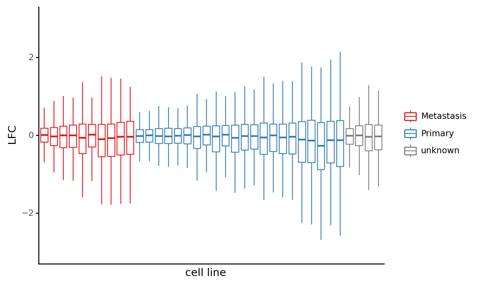
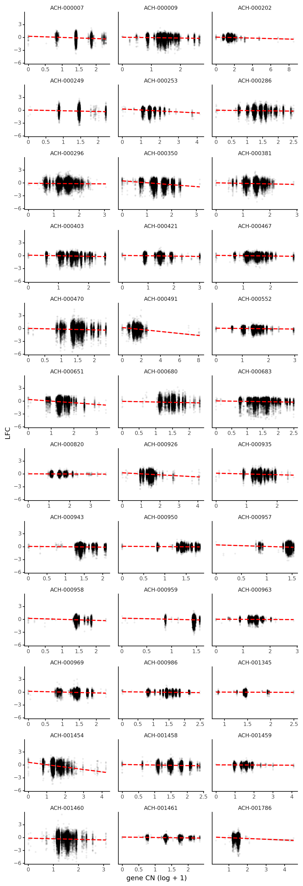

```python
import re
import string
import warnings
from pathlib import Path
from time import time

import common_data_processing as dphelp
import matplotlib.colors as mcolors
import matplotlib.pyplot as plt
import numpy as np
import pandas as pd
import plotnine as gg
import seaborn as sns
from plotnine import aes, ggplot

notebook_tic = time()

warnings.simplefilter(action="ignore", category=UserWarning)

_ = gg.theme_set(gg.theme_classic() + gg.theme(strip_background=gg.element_blank()))
%config InlineBackend.figure_format = "retina"

RANDOM_SEED = 847
np.random.seed(RANDOM_SEED)
```

## Data

```python
data_path = Path("..", "modeling_data", "depmap_CRC_data.csv")
data = (
    pd.read_csv(data_path, low_memory=False)
    .sort_values(["lineage", "depmap_id", "hugo_symbol", "sgrna"])
    .reset_index(drop=True)
)


cat_columns = ["lineage", "depmap_id", "hugo_symbol"]
for col in cat_columns:
    data = dphelp.make_cat(data, col, ordered=True, sort_cats=False)

data = data.fillna({"primary_or_metastasis": "unknown"})
data.head()
```

<div>
<style scoped>
    .dataframe tbody tr th:only-of-type {
        vertical-align: middle;
    }

    .dataframe tbody tr th {
        vertical-align: top;
    }

    .dataframe thead th {
        text-align: right;
    }
</style>
<table border="1" class="dataframe">
  <thead>
    <tr style="text-align: right;">
      <th></th>
      <th>sgrna</th>
      <th>replicate_id</th>
      <th>lfc</th>
      <th>pdna_batch</th>
      <th>passes_qc</th>
      <th>depmap_id</th>
      <th>primary_or_metastasis</th>
      <th>lineage</th>
      <th>lineage_subtype</th>
      <th>kras_mutation</th>
      <th>...</th>
      <th>log2_gene_cn_p1</th>
      <th>gene_cn</th>
      <th>n_muts</th>
      <th>any_deleterious</th>
      <th>variant_classification</th>
      <th>is_deleterious</th>
      <th>is_tcga_hotspot</th>
      <th>is_cosmic_hotspot</th>
      <th>mutated_at_guide_location</th>
      <th>rna_expr</th>
    </tr>
  </thead>
  <tbody>
    <tr>
      <th>0</th>
      <td>GGAAGTCTGGAGTCTCCAGG</td>
      <td>ls513-311cas9_repa_p6_batch2</td>
      <td>-0.317161</td>
      <td>2</td>
      <td>True</td>
      <td>ACH-000007</td>
      <td>Primary</td>
      <td>colorectal</td>
      <td>colorectal_adenocarcinoma</td>
      <td>G12D</td>
      <td>...</td>
      <td>0.980042</td>
      <td>1.664568</td>
      <td>0</td>
      <td>False</td>
      <td>NaN</td>
      <td>NaN</td>
      <td>NaN</td>
      <td>NaN</td>
      <td>False</td>
      <td>0.137504</td>
    </tr>
    <tr>
      <th>1</th>
      <td>GGAAGTCTGGAGTCTCCAGG</td>
      <td>ls513-311cas9_repb_p6_batch2</td>
      <td>-0.260342</td>
      <td>2</td>
      <td>True</td>
      <td>ACH-000007</td>
      <td>Primary</td>
      <td>colorectal</td>
      <td>colorectal_adenocarcinoma</td>
      <td>G12D</td>
      <td>...</td>
      <td>0.980042</td>
      <td>1.664568</td>
      <td>0</td>
      <td>False</td>
      <td>NaN</td>
      <td>NaN</td>
      <td>NaN</td>
      <td>NaN</td>
      <td>False</td>
      <td>0.137504</td>
    </tr>
    <tr>
      <th>2</th>
      <td>GTGGACTTCCAGCTACGGCG</td>
      <td>ls513-311cas9_repa_p6_batch2</td>
      <td>0.500611</td>
      <td>2</td>
      <td>True</td>
      <td>ACH-000007</td>
      <td>Primary</td>
      <td>colorectal</td>
      <td>colorectal_adenocarcinoma</td>
      <td>G12D</td>
      <td>...</td>
      <td>0.980042</td>
      <td>1.664568</td>
      <td>0</td>
      <td>False</td>
      <td>NaN</td>
      <td>NaN</td>
      <td>NaN</td>
      <td>NaN</td>
      <td>False</td>
      <td>0.137504</td>
    </tr>
    <tr>
      <th>3</th>
      <td>GTGGACTTCCAGCTACGGCG</td>
      <td>ls513-311cas9_repb_p6_batch2</td>
      <td>-0.460379</td>
      <td>2</td>
      <td>True</td>
      <td>ACH-000007</td>
      <td>Primary</td>
      <td>colorectal</td>
      <td>colorectal_adenocarcinoma</td>
      <td>G12D</td>
      <td>...</td>
      <td>0.980042</td>
      <td>1.664568</td>
      <td>0</td>
      <td>False</td>
      <td>NaN</td>
      <td>NaN</td>
      <td>NaN</td>
      <td>NaN</td>
      <td>False</td>
      <td>0.137504</td>
    </tr>
    <tr>
      <th>4</th>
      <td>GTGTGCCGAGGTGTGCTGCG</td>
      <td>ls513-311cas9_repa_p6_batch2</td>
      <td>0.777208</td>
      <td>2</td>
      <td>True</td>
      <td>ACH-000007</td>
      <td>Primary</td>
      <td>colorectal</td>
      <td>colorectal_adenocarcinoma</td>
      <td>G12D</td>
      <td>...</td>
      <td>0.980042</td>
      <td>1.664568</td>
      <td>0</td>
      <td>False</td>
      <td>NaN</td>
      <td>NaN</td>
      <td>NaN</td>
      <td>NaN</td>
      <td>False</td>
      <td>0.137504</td>
    </tr>
  </tbody>
</table>
<p>5 rows × 27 columns</p>
</div>

## Visualization

```python
prim_met_pal = ("#e41a1c", "#377eb8", "grey")

cell_line_order = (
    data.groupby("depmap_id")["lfc"]
    .agg(np.std)
    .reset_index()
    .merge(
        data[["depmap_id", "primary_or_metastasis"]]
        .drop_duplicates()
        .reset_index(drop=True)
    )
    .sort_values(["primary_or_metastasis", "lfc"])[["depmap_id"]]
    .to_numpy()
    .flatten()
)

plot_data = data.copy().sample(frac=0.01).reset_index(drop=True)
plot_data["depmap_id"] = pd.Categorical(
    plot_data.depmap_id.values.tolist(), categories=cell_line_order, ordered=True
)

(
    ggplot(plot_data, aes(x="depmap_id", y="lfc"))
    + gg.geom_boxplot(aes(color="primary_or_metastasis"), outlier_alpha=0)
    + gg.scale_y_continuous(limits=(-3, 3))
    + gg.scale_color_manual(values=prim_met_pal)
    + gg.theme(
        axis_text_x=gg.element_blank(),
        axis_ticks_major_x=gg.element_blank(),
        legend_title=gg.element_blank(),
    )
    + gg.labs(x="cell line", y="LFC")
)
```



    <ggplot: (8751935261687)>

```python
gene_summary = data.groupby("hugo_symbol")["lfc"].agg([np.var, np.mean]).reset_index()
gene_summary = gene_summary.assign(
    label=lambda d: [
        n if np.abs(m) > 1.75 or v > 1.5 else np.nan
        for n, v, m in zip(d["hugo_symbol"], d["var"], d["mean"])
    ]
)

(
    ggplot(gene_summary, aes(x="mean", y="var"))
    + gg.geom_point(alpha=0.5, size=0.9)
    + gg.geom_smooth(color="red", method="lm", se=True, linetype="--")
    + gg.labs(x="gene LFC average", y="gene LFC variance")
)
```


    <ggplot: (8751936156531)>

```python
(
    ggplot(data.sample(frac=0.1), aes(x="np.log2(gene_cn + 1)", y="lfc"))
    + gg.facet_wrap("depmap_id", ncol=3, scales="free_x")
    + gg.geom_point(size=0.7, alpha=0.05)
    + gg.geom_smooth(method="lm", se=True, color="red", linetype="--")
    + gg.theme(figure_size=(8, 25), subplots_adjust={"hspace": 0.4, "wspace": 0.1})
    + gg.labs(x="gene CN (log + 1)", y="LFC")
)
```



    <ggplot: (8751934914789)>

```python

```

```python

```

```python

```

```python

```

```python

```

```python

```

```python

```

```python

```

```python

```

---

```python
notebook_toc = time()
print(f"execution time: {(notebook_toc - notebook_tic) / 60:.2f} minutes")
```

```python
%load_ext watermark
%watermark -d -u -v -iv -b -h -m
```
