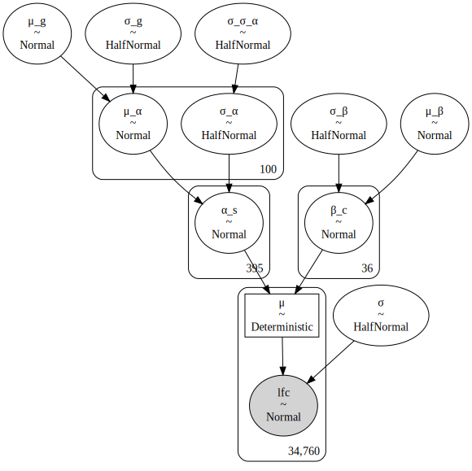
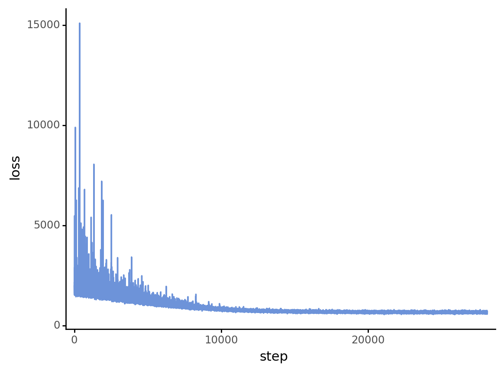
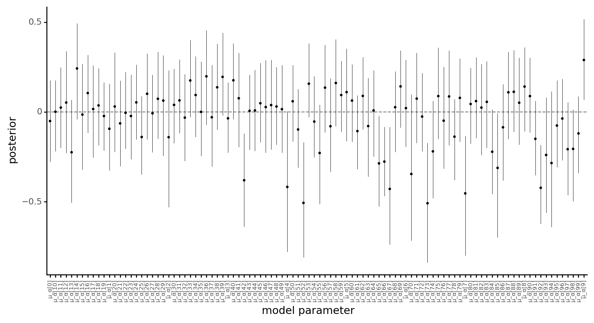
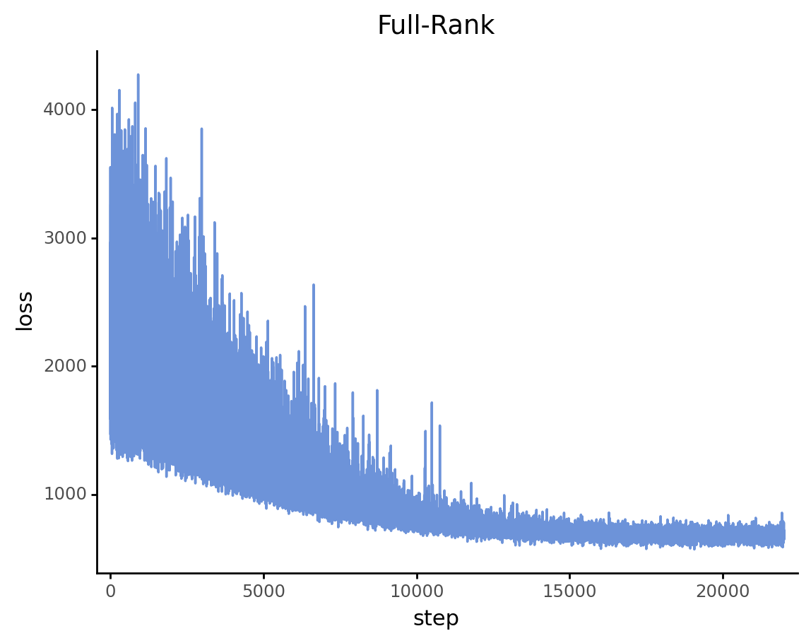
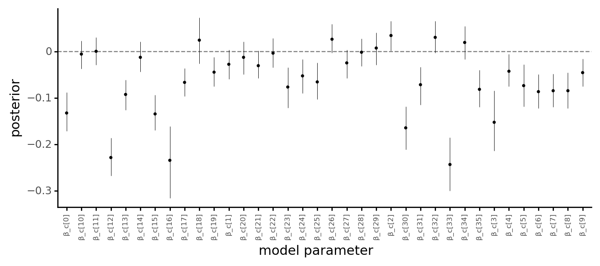

# Designing models for CRC cell lines

```python
import re
import string
import warnings
from pathlib import Path
from time import time

import arviz as az
import color_pal as pal
import common_data_processing as dphelp
import matplotlib.colors as mcolors
import matplotlib.pyplot as plt
import numpy as np
import pandas as pd
import plotnine as gg
import pymc3 as pm
import pymc3_sampling_api
import seaborn as sns
import theano
from pymc3_models import crc_models

notebook_tic = time()

warnings.simplefilter(action="ignore", category=UserWarning)

gg.theme_set(gg.theme_classic() + gg.theme(strip_background=gg.element_blank()))
%config InlineBackend.figure_format = "retina"

RANDOM_SEED = 914
np.random.seed(RANDOM_SEED)

pymc3_cache_dir = Path("pymc3_model_cache")
```

## Data

```python
data = dphelp.read_achilles_data(
    Path("..", "modeling_data", "depmap_CRC_data_subsample.csv"), low_memory=False
)
data.head()
```

<div>
<style scoped>
    .dataframe tbody tr th:only-of-type {
        vertical-align: middle;
    }

    .dataframe tbody tr th {
        vertical-align: top;
    }

    .dataframe thead th {
        text-align: right;
    }
</style>
<table border="1" class="dataframe">
  <thead>
    <tr style="text-align: right;">
      <th></th>
      <th>sgrna</th>
      <th>replicate_id</th>
      <th>lfc</th>
      <th>pdna_batch</th>
      <th>passes_qc</th>
      <th>depmap_id</th>
      <th>primary_or_metastasis</th>
      <th>lineage</th>
      <th>lineage_subtype</th>
      <th>kras_mutation</th>
      <th>...</th>
      <th>any_deleterious</th>
      <th>variant_classification</th>
      <th>is_deleterious</th>
      <th>is_tcga_hotspot</th>
      <th>is_cosmic_hotspot</th>
      <th>mutated_at_guide_location</th>
      <th>rna_expr</th>
      <th>log2_cn</th>
      <th>z_log2_cn</th>
      <th>is_mutated</th>
    </tr>
  </thead>
  <tbody>
    <tr>
      <th>0</th>
      <td>CCACCCACAGACGCTCAGCA</td>
      <td>ls513-311cas9_repa_p6_batch2</td>
      <td>0.029491</td>
      <td>2</td>
      <td>True</td>
      <td>ACH-000007</td>
      <td>Primary</td>
      <td>colorectal</td>
      <td>colorectal_adenocarcinoma</td>
      <td>G12D</td>
      <td>...</td>
      <td>False</td>
      <td>NaN</td>
      <td>NaN</td>
      <td>NaN</td>
      <td>NaN</td>
      <td>False</td>
      <td>1.480265</td>
      <td>1.861144</td>
      <td>1.386218</td>
      <td>0</td>
    </tr>
    <tr>
      <th>1</th>
      <td>CCACCCACAGACGCTCAGCA</td>
      <td>ls513-311cas9_repb_p6_batch2</td>
      <td>0.426017</td>
      <td>2</td>
      <td>True</td>
      <td>ACH-000007</td>
      <td>Primary</td>
      <td>colorectal</td>
      <td>colorectal_adenocarcinoma</td>
      <td>G12D</td>
      <td>...</td>
      <td>False</td>
      <td>NaN</td>
      <td>NaN</td>
      <td>NaN</td>
      <td>NaN</td>
      <td>False</td>
      <td>1.480265</td>
      <td>1.861144</td>
      <td>1.386218</td>
      <td>0</td>
    </tr>
    <tr>
      <th>2</th>
      <td>CCACCCACAGACGCTCAGCA</td>
      <td>c2bbe1-311cas9 rep a p5_batch3</td>
      <td>0.008626</td>
      <td>3</td>
      <td>True</td>
      <td>ACH-000009</td>
      <td>Primary</td>
      <td>colorectal</td>
      <td>colorectal_adenocarcinoma</td>
      <td>WT</td>
      <td>...</td>
      <td>False</td>
      <td>NaN</td>
      <td>NaN</td>
      <td>NaN</td>
      <td>NaN</td>
      <td>False</td>
      <td>0.695994</td>
      <td>1.375470</td>
      <td>-0.234394</td>
      <td>0</td>
    </tr>
    <tr>
      <th>3</th>
      <td>CCACCCACAGACGCTCAGCA</td>
      <td>c2bbe1-311cas9 rep b p5_batch3</td>
      <td>0.280821</td>
      <td>3</td>
      <td>True</td>
      <td>ACH-000009</td>
      <td>Primary</td>
      <td>colorectal</td>
      <td>colorectal_adenocarcinoma</td>
      <td>WT</td>
      <td>...</td>
      <td>False</td>
      <td>NaN</td>
      <td>NaN</td>
      <td>NaN</td>
      <td>NaN</td>
      <td>False</td>
      <td>0.695994</td>
      <td>1.375470</td>
      <td>-0.234394</td>
      <td>0</td>
    </tr>
    <tr>
      <th>4</th>
      <td>CCACCCACAGACGCTCAGCA</td>
      <td>c2bbe1-311cas9 rep c p5_batch3</td>
      <td>0.239815</td>
      <td>3</td>
      <td>True</td>
      <td>ACH-000009</td>
      <td>Primary</td>
      <td>colorectal</td>
      <td>colorectal_adenocarcinoma</td>
      <td>WT</td>
      <td>...</td>
      <td>False</td>
      <td>NaN</td>
      <td>NaN</td>
      <td>NaN</td>
      <td>NaN</td>
      <td>False</td>
      <td>0.695994</td>
      <td>1.375470</td>
      <td>-0.234394</td>
      <td>0</td>
    </tr>
  </tbody>
</table>
<p>5 rows × 30 columns</p>
</div>

## Model Experimentation

```python
total_size = len(data.lfc.values)
sgrna_idx, n_sgrnas = dphelp.get_indices_and_count(data, "sgrna")
sgrna_to_gene_map = (
    data[["sgrna", "hugo_symbol"]]
    .drop_duplicates()
    .reset_index(drop=True)
    .sort_values("sgrna")
    .reset_index(drop=True)
)
sgrna_to_gene_idx, n_genes = dphelp.get_indices_and_count(
    sgrna_to_gene_map, "hugo_symbol"
)
cellline_idx, n_celllines = dphelp.get_indices_and_count(data, "depmap_id")
```

```python
sgrna_idx_shared = theano.shared(sgrna_idx)
sgrna_to_gene_idx_shared = theano.shared(sgrna_to_gene_idx)
cellline_idx_shared = theano.shared(cellline_idx)
lfc_shared = theano.shared(data.lfc.values)
```

```python
with pm.Model() as model:

    μ_g = pm.Normal("μ_g", -0.1, 3)
    σ_g = pm.HalfNormal("σ_g", 2)
    σ_σ_α = pm.HalfNormal("σ_σ_α", 2)

    μ_α = pm.Normal("μ_α", μ_g, σ_g, shape=n_genes)
    σ_α = pm.HalfNormal("σ_α", σ_σ_α, shape=n_genes)
    μ_β = pm.Normal("μ_β", 0, 0.5)
    σ_β = pm.HalfNormal("σ_β", 1)

    β_c = pm.Normal("β_c", μ_β, σ_β, shape=n_celllines)
    α_s = pm.Normal(
        "α_s",
        μ_α[sgrna_to_gene_idx_shared],
        σ_α[sgrna_to_gene_idx_shared],
        shape=n_sgrnas,
    )

    μ = pm.Deterministic("μ", α_s[sgrna_idx_shared] + β_c[cellline_idx_shared])
    σ = pm.HalfNormal("σ", 2)

    lfc = pm.Normal("lfc", μ, σ, observed=lfc_shared, total_size=total_size)
```

```python
pm.model_to_graphviz(model)
```



```python
batch_size = 1000

sgnra_idx_batch = pm.Minibatch(sgrna_idx, batch_size=batch_size)
cellline_idx_batch = pm.Minibatch(cellline_idx, batch_size=batch_size)
lfc_data_batch = pm.Minibatch(data.lfc.values, batch_size=batch_size)
```

    /home/jc604/.conda/envs/speclet/lib/python3.9/site-packages/pymc3/data.py:316: FutureWarning: Using a non-tuple sequence for multidimensional indexing is deprecated; use `arr[tuple(seq)]` instead of `arr[seq]`. In the future this will be interpreted as an array index, `arr[np.array(seq)]`, which will result either in an error or a different result.
    /home/jc604/.conda/envs/speclet/lib/python3.9/site-packages/pymc3/data.py:316: FutureWarning: Using a non-tuple sequence for multidimensional indexing is deprecated; use `arr[tuple(seq)]` instead of `arr[seq]`. In the future this will be interpreted as an array index, `arr[np.array(seq)]`, which will result either in an error or a different result.

```python
meanfield = pymc3_sampling_api.pymc3_advi_approximation_procedure(
    model=model,
    method="advi",
    callbacks=[
        pm.callbacks.CheckParametersConvergence(tolerance=0.01, diff="absolute")
    ],
    fit_kwargs={
        "more_replacements": {
            sgrna_idx_shared: sgnra_idx_batch,
            cellline_idx_shared: cellline_idx_batch,
            lfc_shared: lfc_data_batch,
        }
    },
)
```

    Sampling from prior distributions.
    Running ADVI approximation.

<div>
    <style>
        /*Turns off some styling*/
        progress {
            /*gets rid of default border in Firefox and Opera.*/
            border: none;
            /*Needs to be in here for Safari polyfill so background images work as expected.*/
            background-size: auto;
        }
        .progress-bar-interrupted, .progress-bar-interrupted::-webkit-progress-bar {
            background: #F44336;
        }
    </style>
  <progress value='28056' class='' max='100000' style='width:300px; height:20px; vertical-align: middle;'></progress>
  28.06% [28056/100000 00:18<00:48 Average Loss = 660.42]
</div>

    Convergence achieved at 28100
    Interrupted at 28,099 [28%]: Average Loss = 900.78


    Sampling from posterior.
    Posterior predicitons.

<div>
    <style>
        /*Turns off some styling*/
        progress {
            /*gets rid of default border in Firefox and Opera.*/
            border: none;
            /*Needs to be in here for Safari polyfill so background images work as expected.*/
            background-size: auto;
        }
        .progress-bar-interrupted, .progress-bar-interrupted::-webkit-progress-bar {
            background: #F44336;
        }
    </style>
  <progress value='1000' class='' max='1000' style='width:300px; height:20px; vertical-align: middle;'></progress>
  100.00% [1000/1000 00:13<00:00]
</div>

```python
def plot_approximation_history(hist: np.ndarray) -> gg.ggplot:
    d = pd.DataFrame({"loss": hist}).reset_index(drop=False)
    return (
        gg.ggplot(d, gg.aes(x="index", y="loss"))
        + gg.geom_line(size=0.7, alpha=0.8, color=pal.sns_blue)
        + gg.scale_x_continuous(expand=(0.02, 0, 0.02, 0))
        + gg.labs(x="step", y="loss")
    )
```

```python
plot_approximation_history(meanfield["approximation"].hist)
```



    <ggplot: (8752244370008)>

```python
def plot_az_summary(df: pd.DataFrame, x="index") -> gg.ggplot:
    return (
        gg.ggplot(df, gg.aes(x=x))
        + gg.geom_hline(yintercept=0, linetype="--", alpha=0.5)
        + gg.geom_linerange(gg.aes(ymin="hdi_5.5%", ymax="hdi_94.5%"), size=0.2)
        + gg.geom_point(gg.aes(y="mean"), size=0.5)
        + gg.theme(axis_text_x=gg.element_text(angle=90, size=6))
        + gg.labs(x="model parameter", y="posterior")
    )
```

```python
gene_posteriors = az.summary(
    pymc3_sampling_api.samples_to_arviz(model, meanfield),
    var_names="μ_α",
    hdi_prob=0.89,
)

plot_az_summary(gene_posteriors.reset_index(drop=False)) + gg.theme(figure_size=(10, 5))
```

    arviz - WARNING - Shape validation failed: input_shape: (1, 1000), minimum_shape: (chains=2, draws=4)



    <ggplot: (8752270135004)>

```python
sgrna_post = (
    az.summary(
        pymc3_sampling_api.samples_to_arviz(model, meanfield),
        var_names="α_s",
        hdi_prob=0.89,
        kind="stats",
    )
    .reset_index(drop=False)
    .rename(columns={"index": "param"})
)
sgrna_post["sgrna"] = sgrna_to_gene_map.sgrna
sgrna_post["hugo_symbol"] = sgrna_to_gene_map.hugo_symbol

(
    gg.ggplot(sgrna_post, gg.aes(x="param"))
    + gg.facet_wrap("hugo_symbol", scales="free", ncol=5)
    + gg.geom_hline(yintercept=0, alpha=0.5, linetype="--")
    + gg.geom_linerange(gg.aes(ymin="hdi_5.5%", ymax="hdi_94.5%"), size=0.2)
    + gg.geom_point(gg.aes(y="mean"), size=0.6)
    + gg.theme(
        axis_text_x=gg.element_blank(),
        figure_size=(8, 20),
        subplots_adjust={"wspace": 0.5},
        axis_text_y=gg.element_text(size=6),
        axis_ticks_major_x=gg.element_blank(),
        strip_text=gg.element_text(size=7),
    )
)
```



    <ggplot: (8752244471896)>

```python
cells_posteriors = az.summary(
    pymc3_sampling_api.samples_to_arviz(model, meanfield),
    var_names="β_c",
    hdi_prob=0.89,
)

plot_az_summary(cells_posteriors.reset_index(drop=False)) + gg.theme(figure_size=(8, 3))
```

    arviz - WARNING - Shape validation failed: input_shape: (1, 1000), minimum_shape: (chains=2, draws=4)



    <ggplot: (8752226973925)>

---

```python
notebook_toc = time()
print(f"execution time: {(notebook_toc - notebook_tic) / 60:.2f} minutes")
```

    execution time: 2.52 minutes

```python
%load_ext watermark
%watermark -d -u -v -iv -b -h -m
```

    Last updated: 2021-02-19

    Python implementation: CPython
    Python version       : 3.9.1
    IPython version      : 7.20.0

    Compiler    : GCC 9.3.0
    OS          : Linux
    Release     : 3.10.0-1062.el7.x86_64
    Machine     : x86_64
    Processor   : x86_64
    CPU cores   : 32
    Architecture: 64bit

    Hostname: compute-a-16-86.o2.rc.hms.harvard.edu

    Git branch: crc

    theano    : 1.0.5
    seaborn   : 0.11.1
    arviz     : 0.11.1
    matplotlib: 3.3.4
    pandas    : 1.2.2
    pymc3     : 3.11.1
    re        : 2.2.1
    numpy     : 1.20.1
    plotnine  : 0.7.1
