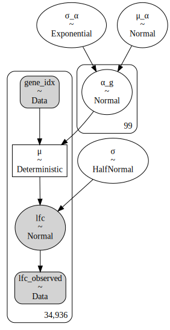
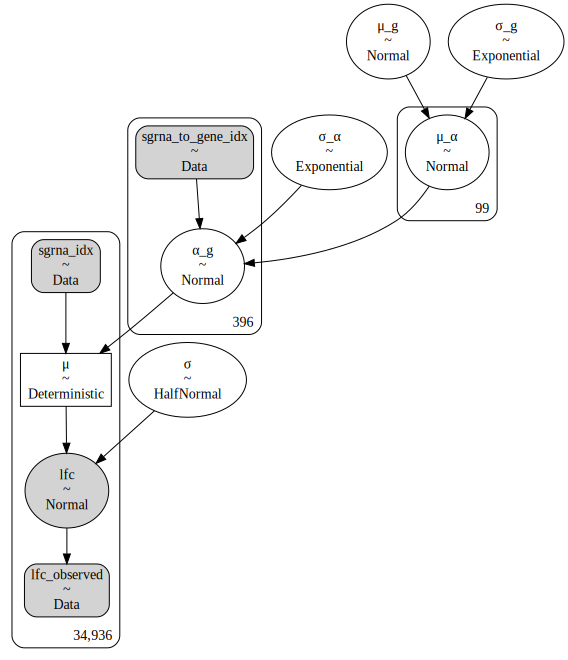

# Designing models for CRC cell lines

```python
import re
import string
import warnings
from pathlib import Path
from time import time

import arviz as az
import common_data_processing as dphelp
import matplotlib.colors as mcolors
import matplotlib.pyplot as plt
import numpy as np
import pandas as pd
import plotnine as gg
import pymc3 as pm
import pymc3_helpers as pmhelp
import seaborn as sns
from pymc3_models import crc_models
from theano import tensor as tt

notebook_tic = time()

warnings.simplefilter(action="ignore", category=UserWarning)

gg.theme_set(gg.theme_classic() + gg.theme(strip_background=gg.element_blank()))
%config InlineBackend.figure_format = "retina"

RANDOM_SEED = 914
np.random.seed(RANDOM_SEED)

pymc3_cache_dir = Path("pymc3_model_cache")
```

## Data

```python
data = pd.read_csv(Path("..", "modeling_data", "depmap_CRC_data.csv"), low_memory=False)

N_GENES = 100
random_genes = np.random.choice(data.hugo_symbol.unique(), N_GENES)

data = (
    data[data.hugo_symbol.isin(random_genes)]
    .sort_values(["depmap_id", "hugo_symbol", "sgrna"])
    .reset_index(drop=True)
)

cat_cols = ["sgrna", "depmap_id", "hugo_symbol"]
for col in cat_cols:
    data = dphelp.make_cat(data, col, ordered=True, sort_cats=False)

data.head()
```

<div>
<style scoped>
    .dataframe tbody tr th:only-of-type {
        vertical-align: middle;
    }

    .dataframe tbody tr th {
        vertical-align: top;
    }

    .dataframe thead th {
        text-align: right;
    }
</style>
<table border="1" class="dataframe">
  <thead>
    <tr style="text-align: right;">
      <th></th>
      <th>sgrna</th>
      <th>replicate_id</th>
      <th>lfc</th>
      <th>pdna_batch</th>
      <th>passes_qc</th>
      <th>depmap_id</th>
      <th>primary_or_metastasis</th>
      <th>lineage</th>
      <th>lineage_subtype</th>
      <th>kras_mutation</th>
      <th>...</th>
      <th>log2_gene_cn_p1</th>
      <th>gene_cn</th>
      <th>n_muts</th>
      <th>any_deleterious</th>
      <th>variant_classification</th>
      <th>is_deleterious</th>
      <th>is_tcga_hotspot</th>
      <th>is_cosmic_hotspot</th>
      <th>mutated_at_guide_location</th>
      <th>rna_expr</th>
    </tr>
  </thead>
  <tbody>
    <tr>
      <th>0</th>
      <td>ATTGGTAGAACTTAGTCCAG</td>
      <td>ls513-311cas9_repa_p6_batch2</td>
      <td>-0.328006</td>
      <td>2</td>
      <td>True</td>
      <td>ACH-000007</td>
      <td>Primary</td>
      <td>colorectal</td>
      <td>colorectal_adenocarcinoma</td>
      <td>G12D</td>
      <td>...</td>
      <td>0.976114</td>
      <td>1.654121</td>
      <td>0</td>
      <td>False</td>
      <td>NaN</td>
      <td>NaN</td>
      <td>NaN</td>
      <td>NaN</td>
      <td>False</td>
      <td>5.14527</td>
    </tr>
    <tr>
      <th>1</th>
      <td>ATTGGTAGAACTTAGTCCAG</td>
      <td>ls513-311cas9_repb_p6_batch2</td>
      <td>-0.233740</td>
      <td>2</td>
      <td>True</td>
      <td>ACH-000007</td>
      <td>Primary</td>
      <td>colorectal</td>
      <td>colorectal_adenocarcinoma</td>
      <td>G12D</td>
      <td>...</td>
      <td>0.976114</td>
      <td>1.654121</td>
      <td>0</td>
      <td>False</td>
      <td>NaN</td>
      <td>NaN</td>
      <td>NaN</td>
      <td>NaN</td>
      <td>False</td>
      <td>5.14527</td>
    </tr>
    <tr>
      <th>2</th>
      <td>GATCTGCTGACCCAATGCTA</td>
      <td>ls513-311cas9_repa_p6_batch2</td>
      <td>-0.125088</td>
      <td>2</td>
      <td>True</td>
      <td>ACH-000007</td>
      <td>Primary</td>
      <td>colorectal</td>
      <td>colorectal_adenocarcinoma</td>
      <td>G12D</td>
      <td>...</td>
      <td>0.976114</td>
      <td>1.654121</td>
      <td>0</td>
      <td>False</td>
      <td>NaN</td>
      <td>NaN</td>
      <td>NaN</td>
      <td>NaN</td>
      <td>False</td>
      <td>5.14527</td>
    </tr>
    <tr>
      <th>3</th>
      <td>GATCTGCTGACCCAATGCTA</td>
      <td>ls513-311cas9_repb_p6_batch2</td>
      <td>-0.084501</td>
      <td>2</td>
      <td>True</td>
      <td>ACH-000007</td>
      <td>Primary</td>
      <td>colorectal</td>
      <td>colorectal_adenocarcinoma</td>
      <td>G12D</td>
      <td>...</td>
      <td>0.976114</td>
      <td>1.654121</td>
      <td>0</td>
      <td>False</td>
      <td>NaN</td>
      <td>NaN</td>
      <td>NaN</td>
      <td>NaN</td>
      <td>False</td>
      <td>5.14527</td>
    </tr>
    <tr>
      <th>4</th>
      <td>GATGACTTCCCAGAATCTAC</td>
      <td>ls513-311cas9_repa_p6_batch2</td>
      <td>0.306206</td>
      <td>2</td>
      <td>True</td>
      <td>ACH-000007</td>
      <td>Primary</td>
      <td>colorectal</td>
      <td>colorectal_adenocarcinoma</td>
      <td>G12D</td>
      <td>...</td>
      <td>0.976114</td>
      <td>1.654121</td>
      <td>0</td>
      <td>False</td>
      <td>NaN</td>
      <td>NaN</td>
      <td>NaN</td>
      <td>NaN</td>
      <td>False</td>
      <td>5.14527</td>
    </tr>
  </tbody>
</table>
<p>5 rows × 27 columns</p>
</div>

## Models

### Model 1

$
lfc \sim N(\mu, \sigma) \\
\mu = \alpha_g \\
\quad \alpha_g \sim N(\mu_\alpha, \sigma_\alpha) \\
\qquad \mu_\alpha \sim N(0, 5) \quad \sigma_\alpha \sim \text{Exp}(2) \\
\sigma \sim HN(5)
$

```python
gene_idx = dphelp.get_indices(data, "hugo_symbol")
m1 = crc_models.model_1(gene_idx=gene_idx, lfc_data=data.lfc.values)

pm.model_to_graphviz(m1)
```



```python
with m1:
    trace = pm.sample(
        draws=1000,
        init="advi",
        n_init=200000,
        tune=1000,
        random_seed=RANDOM_SEED,
        return_inferencedata=True,
    )
```

    Auto-assigning NUTS sampler...
    Initializing NUTS using advi...

<div>
    <style>
        /*Turns off some styling*/
        progress {
            /*gets rid of default border in Firefox and Opera.*/
            border: none;
            /*Needs to be in here for Safari polyfill so background images work as expected.*/
            background-size: auto;
        }
        .progress-bar-interrupted, .progress-bar-interrupted::-webkit-progress-bar {
            background: #F44336;
        }
    </style>
  <progress value='29035' class='' max='200000' style='width:300px; height:20px; vertical-align: middle;'></progress>
  14.52% [29035/200000 00:22<02:13 Average Loss = 28,204]
</div>

    Convergence achieved at 29100
    Interrupted at 29,099 [14%]: Average Loss = 35,555
    Multiprocess sampling (4 chains in 4 jobs)
    NUTS: [σ, α_g, σ_α, μ_α]

<div>
    <style>
        /*Turns off some styling*/
        progress {
            /*gets rid of default border in Firefox and Opera.*/
            border: none;
            /*Needs to be in here for Safari polyfill so background images work as expected.*/
            background-size: auto;
        }
        .progress-bar-interrupted, .progress-bar-interrupted::-webkit-progress-bar {
            background: #F44336;
        }
    </style>
  <progress value='8000' class='' max='8000' style='width:300px; height:20px; vertical-align: middle;'></progress>
  100.00% [8000/8000 00:14<00:00 Sampling 4 chains, 0 divergences]
</div>

    Sampling 4 chains for 1_000 tune and 1_000 draw iterations (4_000 + 4_000 draws total) took 14 seconds.

### Model 2

$
lfc \sim N(\mu, \sigma) \\
\mu = \alpha_s \\
\quad \alpha_s \sim N(\mu_\alpha, \sigma_\alpha) \\
\qquad \mu_\alpha \sim N(\mu_g, \sigma_g) \quad \sigma_\alpha \sim \text{Exp}(2) \\
\qquad \quad \mu_g \sim N(0, 5) \quad \sigma_g \sim \text{Exp}(2) \\
\sigma \sim HN(5)
$

```python
sgrna_to_gene_map = (
    data[["sgrna", "hugo_symbol"]]
    .drop_duplicates()
    .reset_index(drop=True)
    .sort_values("sgrna")
    .reset_index(drop=True)
)

sgrna_to_gene_idx = dphelp.get_indices(sgrna_to_gene_map, "hugo_symbol")
sgrna_idx = dphelp.get_indices(data, "sgrna")

m2 = crc_models.model_2(
    sgrna_idx=sgrna_idx, sgrna_to_gene_idx=sgrna_to_gene_idx, lfc_data=data.lfc.values
)

pm.model_to_graphviz(m2)
```



```python
with m2:
    trace = pm.sample(
        draws=1000,
        init="advi",
        n_init=200000,
        tune=1000,
        random_seed=RANDOM_SEED,
        return_inferencedata=True,
    )
```

    Auto-assigning NUTS sampler...
    Initializing NUTS using advi...

<div>
    <style>
        /*Turns off some styling*/
        progress {
            /*gets rid of default border in Firefox and Opera.*/
            border: none;
            /*Needs to be in here for Safari polyfill so background images work as expected.*/
            background-size: auto;
        }
        .progress-bar-interrupted, .progress-bar-interrupted::-webkit-progress-bar {
            background: #F44336;
        }
    </style>
  <progress value='30080' class='' max='200000' style='width:300px; height:20px; vertical-align: middle;'></progress>
  15.04% [30080/200000 00:27<02:34 Average Loss = 24,329]
</div>

    Convergence achieved at 30200
    Interrupted at 30,199 [15%]: Average Loss = 32,432
    Multiprocess sampling (4 chains in 4 jobs)
    NUTS: [σ, α_g, σ_α, μ_α, σ_g, μ_g]

<div>
    <style>
        /*Turns off some styling*/
        progress {
            /*gets rid of default border in Firefox and Opera.*/
            border: none;
            /*Needs to be in here for Safari polyfill so background images work as expected.*/
            background-size: auto;
        }
        .progress-bar-interrupted, .progress-bar-interrupted::-webkit-progress-bar {
            background: #F44336;
        }
    </style>
  <progress value='8000' class='' max='8000' style='width:300px; height:20px; vertical-align: middle;'></progress>
  100.00% [8000/8000 00:25<00:00 Sampling 4 chains, 0 divergences]
</div>

    Sampling 4 chains for 1_000 tune and 1_000 draw iterations (4_000 + 4_000 draws total) took 26 seconds.

---

```python
notebook_toc = time()
print(f"execution time: {(notebook_toc - notebook_tic) / 60:.2f} minutes")
```

    execution time: 3.52 minutes

```python
%load_ext watermark
%watermark -d -u -v -iv -b -h -m
```

    Last updated: 2021-02-16

    Python implementation: CPython
    Python version       : 3.9.1
    IPython version      : 7.20.0

    Compiler    : GCC 9.3.0
    OS          : Linux
    Release     : 3.10.0-1062.el7.x86_64
    Machine     : x86_64
    Processor   : x86_64
    CPU cores   : 28
    Architecture: 64bit

    Hostname: compute-e-16-230.o2.rc.hms.harvard.edu

    Git branch: crc

    arviz     : 0.11.1
    pandas    : 1.2.2
    pymc3     : 3.11.1
    plotnine  : 0.7.1
    re        : 2.2.1
    seaborn   : 0.11.1
    theano    : 1.0.5
    matplotlib: 3.3.4
    numpy     : 1.20.1
