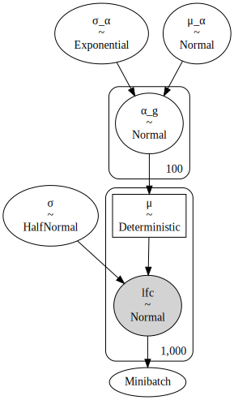
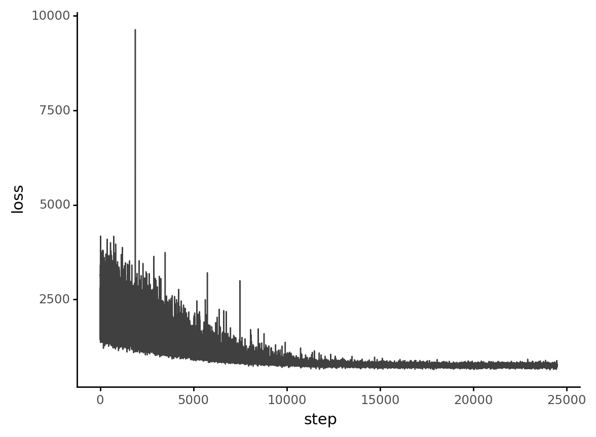
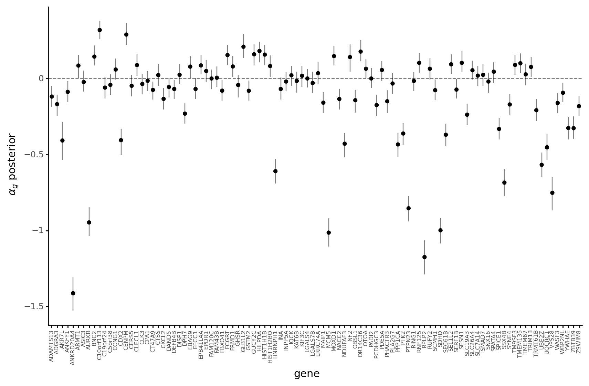
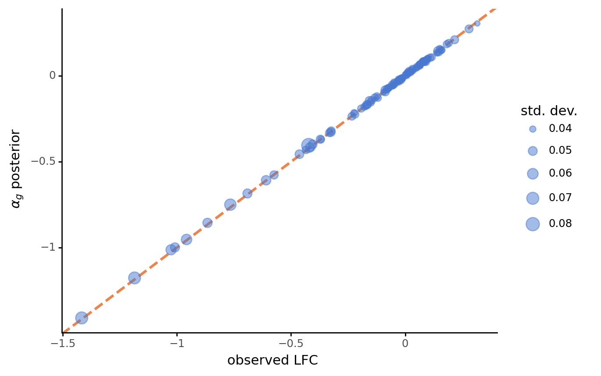

# Analyzing CRC models

```python
import re
import string
import warnings
from pathlib import Path
from time import time

import arviz as az
import color_pal as pal
import common_data_processing as dphelp
import matplotlib.colors as mcolors
import matplotlib.pyplot as plt
import numpy as np
import pandas as pd
import plotnine as gg
import pymc3 as pm
import pymc3_sampling_api
import seaborn as sns
from pymc3_models import crc_models
from theano import tensor as tt

notebook_tic = time()

warnings.simplefilter(action="ignore", category=UserWarning)

gg.theme_set(gg.theme_classic() + gg.theme(strip_background=gg.element_blank()))
%config InlineBackend.figure_format = "retina"

RANDOM_SEED = 847
np.random.seed(RANDOM_SEED)

pymc3_cache_dir = Path("pymc3_model_cache")
```

## Data

```python
data_dir = Path("..", "modeling_data", "depmap_CRC_data_subsample.csv")
data = dphelp.read_achilles_data(data_dir, low_memory=False)
data.shape
```

    (34760, 30)

## Model 1

```python
m1_cache_dir = pymc3_cache_dir / "CRCtestmodel1"

gene_idx = dphelp.get_indices(data, "hugo_symbol")

crc_model1 = crc_models.model_1(
    gene_idx=gene_idx, lfc_data=data.lfc.values, batch_size=1000
)
pm.model_to_graphviz(crc_model1)
```

    /home/jc604/.conda/envs/speclet/lib/python3.9/site-packages/pymc3/data.py:316: FutureWarning: Using a non-tuple sequence for multidimensional indexing is deprecated; use `arr[tuple(seq)]` instead of `arr[seq]`. In the future this will be interpreted as an array index, `arr[np.array(seq)]`, which will result either in an error or a different result.



```python
crc_model1_res = pymc3_sampling_api.read_cached_vi(m1_cache_dir)
```

    Loading cached trace and posterior sample...

```python
d = pd.DataFrame({"loss": crc_model1_res["approximation"].hist}).assign(
    step=lambda d: np.arange(d.shape[0])
)

(
    gg.ggplot(d, gg.aes(x="step", y="loss"))
    + gg.geom_line(size=0.5, alpha=0.75, color="black")
)
```



    <ggplot: (8781401427083)>

```python
crc_m1_az = az.from_pymc3(trace=crc_model1_res["trace"], model=crc_model1)
az.summary(crc_m1_az, var_names=["μ_α", "σ_α", "σ"], hdi_prob=0.89)
```

    Exception ignored in: <function Minibatch.__del__ at 0x7fc94e214310>
    Traceback (most recent call last):
      File "/home/jc604/.conda/envs/speclet/lib/python3.9/site-packages/pymc3/data.py", line 339, in __del__
        del Minibatch.RNG[id(self)]
    KeyError: 140502425574656
    Exception ignored in: <function Minibatch.__del__ at 0x7fc94e214310>
    Traceback (most recent call last):
      File "/home/jc604/.conda/envs/speclet/lib/python3.9/site-packages/pymc3/data.py", line 339, in __del__
        del Minibatch.RNG[id(self)]
    KeyError: 140502426185344
    arviz - WARNING - Shape validation failed: input_shape: (1, 1000), minimum_shape: (chains=2, draws=4)

<div>
<style scoped>
    .dataframe tbody tr th:only-of-type {
        vertical-align: middle;
    }

    .dataframe tbody tr th {
        vertical-align: top;
    }

    .dataframe thead th {
        text-align: right;
    }
</style>
<table border="1" class="dataframe">
  <thead>
    <tr style="text-align: right;">
      <th></th>
      <th>mean</th>
      <th>sd</th>
      <th>hdi_5.5%</th>
      <th>hdi_94.5%</th>
      <th>mcse_mean</th>
      <th>mcse_sd</th>
      <th>ess_mean</th>
      <th>ess_sd</th>
      <th>ess_bulk</th>
      <th>ess_tail</th>
      <th>r_hat</th>
    </tr>
  </thead>
  <tbody>
    <tr>
      <th>μ_α</th>
      <td>-0.129</td>
      <td>0.038</td>
      <td>-0.187</td>
      <td>-0.067</td>
      <td>0.001</td>
      <td>0.001</td>
      <td>1088.0</td>
      <td>1049.0</td>
      <td>1100.0</td>
      <td>921.0</td>
      <td>NaN</td>
    </tr>
    <tr>
      <th>σ_α</th>
      <td>0.319</td>
      <td>0.025</td>
      <td>0.277</td>
      <td>0.356</td>
      <td>0.001</td>
      <td>0.001</td>
      <td>869.0</td>
      <td>866.0</td>
      <td>871.0</td>
      <td>918.0</td>
      <td>NaN</td>
    </tr>
    <tr>
      <th>σ</th>
      <td>0.509</td>
      <td>0.008</td>
      <td>0.496</td>
      <td>0.522</td>
      <td>0.000</td>
      <td>0.000</td>
      <td>941.0</td>
      <td>941.0</td>
      <td>942.0</td>
      <td>947.0</td>
      <td>NaN</td>
    </tr>
  </tbody>
</table>
</div>

```python
gene_post = az.summary(crc_m1_az, var_names=["α_g"], hdi_prob=0.89, kind="stats")
gene_post["hugo_symbol"] = data.hugo_symbol.cat.categories.values
gene_post = gene_post.merge(
    data.groupby("hugo_symbol")["lfc"].agg(np.mean).reset_index(drop=False),
    on="hugo_symbol",
)

(
    gg.ggplot(gene_post, gg.aes(x="hugo_symbol"))
    + gg.geom_hline(yintercept=0, alpha=0.5, linetype="--")
    + gg.geom_linerange(gg.aes(ymin="hdi_5.5%", ymax="hdi_94.5%"), alpha=0.5)
    + gg.geom_point(gg.aes(y="mean"))
    + gg.theme(axis_text_x=gg.element_text(angle=90, size=6), figure_size=(10, 6))
    + gg.labs(x="gene", y=r"$\alpha_g$ posterior")
)
```



    <ggplot: (8781400371297)>

```python
(
    gg.ggplot(gene_post, gg.aes(x="lfc", y="mean"))
    + gg.geom_abline(
        slope=1, intercept=0, linetype="--", color=pal.sns_orange, size=1.2
    )
    + gg.geom_point(gg.aes(size="sd"), alpha=0.5, color=pal.sns_blue)
    + gg.labs(x="observed LFC", y=r"$\alpha_g$ posterior", size="std. dev.")
)
```



    <ggplot: (8781392909433)>

The posterior predictive check has the wrong dimensions; it is using the last minibatch for predicitions.
I need to follow the guidance of this [post](https://discourse.pymc.io/t/minibatch-advi-ppc-dimensions/5583) on the Discourse which followed the explanation in this GitHub [issue](https://github.com/pymc-devs/pymc3/issues/2190#issuecomment-311609342).
Should be a simple fix.

```python
crc_model1_res["posterior_predictive"]["lfc"].shape
```

    (1000, 1000)

```python
data.shape
```

    (34760, 30)

### To-Do:

1. Address the change above to fix an issue with PPC sampling.
2. Make sure I can replace the shared data with new data for predictions on unseen data.
3. Run and analyze more simple models.
4. Create a Snakemake workflow to run all in parallel and then run the analysis.

```python

```

```python

```

```python

```

```python

```

```python

```

```python

```

---

```python
notebook_toc = time()
print(f"execution time: {(notebook_toc - notebook_tic) / 60:.2f} minutes")
```

    execution time: 0.22 minutes

```python
%load_ext watermark
%watermark -d -u -v -iv -b -h -m
```

    The watermark extension is already loaded. To reload it, use:
      %reload_ext watermark
    Last updated: 2021-02-18

    Python implementation: CPython
    Python version       : 3.9.1
    IPython version      : 7.20.0

    Compiler    : GCC 9.3.0
    OS          : Linux
    Release     : 3.10.0-1062.el7.x86_64
    Machine     : x86_64
    Processor   : x86_64
    CPU cores   : 32
    Architecture: 64bit

    Hostname: compute-a-17-96.o2.rc.hms.harvard.edu

    Git branch: crc

    re        : 2.2.1
    plotnine  : 0.7.1
    pandas    : 1.2.2
    theano    : 1.0.5
    seaborn   : 0.11.1
    pymc3     : 3.11.1
    matplotlib: 3.3.4
    numpy     : 1.20.1
    arviz     : 0.11.1
