# Analyzing CRC models

```python
import re
import string
import warnings
from itertools import combinations
from pathlib import Path
from time import time
from typing import Optional, Tuple, Union

import arviz as az
import color_pal as pal
import common_data_processing as dphelp
import matplotlib.colors as mcolors
import matplotlib.pyplot as plt
import numpy as np
import pandas as pd
import plotnine as gg
import pymc3 as pm
import pymc3_analysis as pmanal
import pymc3_sampling_api
import sampling_pymc3_models
import seaborn as sns
from pymc3_models import crc_models
from theano import tensor as tt

notebook_tic = time()

warnings.simplefilter(action="ignore", category=UserWarning)

gg.theme_set(gg.theme_classic() + gg.theme(strip_background=gg.element_blank()))
%config InlineBackend.figure_format = "retina"

RANDOM_SEED = 847
np.random.seed(RANDOM_SEED)

pymc3_cache_dir = Path("pymc3_model_cache")
```

## Data

```python
data_dir = Path("..", "modeling_data", "depmap_CRC_data_subsample.csv")
data = dphelp.read_achilles_data(data_dir, low_memory=False)
data.shape
```

    (34760, 30)

## Model 1

```python
m1_cache_dir = pymc3_cache_dir / "CRC_test_model1"

gene_idx = dphelp.get_indices(data, "hugo_symbol")

crc_model1, gene_idx_shared, lfc_data_shared = crc_models.model_1(
    gene_idx=gene_idx, lfc_data=data.lfc.values
)
pm.model_to_graphviz(crc_model1)
```


```python
crc_model1_res = pymc3_sampling_api.read_cached_vi(m1_cache_dir)
```

    Loading cached trace and posterior sample...

```python
pmanal.plot_vi_hist(crc_model1_res["approximation"])
```


    <ggplot: (8727360374733)>

```python
m1_az = az.from_pymc3(trace=crc_model1_res["trace"], model=crc_model1)
az.summary(m1_az, var_names=["μ_α", "σ_α", "σ"], hdi_prob=0.89)
```

    arviz - WARNING - Shape validation failed: input_shape: (1, 1000), minimum_shape: (chains=2, draws=4)

<div>
<style scoped>
    .dataframe tbody tr th:only-of-type {
        vertical-align: middle;
    }

    .dataframe tbody tr th {
        vertical-align: top;
    }

    .dataframe thead th {
        text-align: right;
    }
</style>
<table border="1" class="dataframe">
  <thead>
    <tr style="text-align: right;">
      <th></th>
      <th>mean</th>
      <th>sd</th>
      <th>hdi_5.5%</th>
      <th>hdi_94.5%</th>
      <th>mcse_mean</th>
      <th>mcse_sd</th>
      <th>ess_mean</th>
      <th>ess_sd</th>
      <th>ess_bulk</th>
      <th>ess_tail</th>
      <th>r_hat</th>
    </tr>
  </thead>
  <tbody>
    <tr>
      <th>μ_α</th>
      <td>-0.128</td>
      <td>0.036</td>
      <td>-0.186</td>
      <td>-0.072</td>
      <td>0.001</td>
      <td>0.001</td>
      <td>996.0</td>
      <td>996.0</td>
      <td>995.0</td>
      <td>1024.0</td>
      <td>NaN</td>
    </tr>
    <tr>
      <th>σ_α</th>
      <td>0.319</td>
      <td>0.025</td>
      <td>0.282</td>
      <td>0.360</td>
      <td>0.001</td>
      <td>0.001</td>
      <td>1031.0</td>
      <td>1031.0</td>
      <td>1023.0</td>
      <td>905.0</td>
      <td>NaN</td>
    </tr>
    <tr>
      <th>σ</th>
      <td>0.510</td>
      <td>0.008</td>
      <td>0.495</td>
      <td>0.522</td>
      <td>0.000</td>
      <td>0.000</td>
      <td>1038.0</td>
      <td>1038.0</td>
      <td>1035.0</td>
      <td>862.0</td>
      <td>NaN</td>
    </tr>
  </tbody>
</table>
</div>

```python
gene_ggplot_theme = {
    "axis_text_x": gg.element_text(angle=90, size=6),
    "figure_size": (10, 6),
}


def get_varying_parameter_posterior(
    crc_az: az.InferenceData,
    var_name: str,
    data: pd.DataFrame,
    col_name: str,
    hdi_prob: float = 0.89,
) -> Tuple[pd.DataFrame, gg.ggplot]:

    gene_post = az.summary(crc_az, var_names=var_name, hdi_prob=hdi_prob, kind="stats")
    gene_post[col_name] = data[col_name].cat.categories.values
    gene_post = gene_post.merge(
        data.groupby(col_name)["lfc"].agg(np.mean).reset_index(drop=False),
        on=col_name,
    )

    p = (
        gg.ggplot(gene_post, gg.aes(x=col_name))
        + gg.geom_hline(yintercept=0, alpha=0.5, linetype="--")
        + gg.geom_linerange(gg.aes(ymin="hdi_5.5%", ymax="hdi_94.5%"), alpha=0.5)
        + gg.geom_point(gg.aes(y="mean"))
        + gg.theme(**gene_ggplot_theme)
    )

    return gene_post, p
```

```python
gene_post, p = get_varying_parameter_posterior(
    m1_az, "α_g", data=data, col_name="hugo_symbol"
)
p + gg.labs(x="gene", y=r"$\alpha_g$ posterior")
```


    <ggplot: (8727357738876)>

```python
(
    gg.ggplot(gene_post, gg.aes(x="lfc", y="mean"))
    + gg.geom_abline(
        slope=1, intercept=0, linetype="--", color=pal.sns_orange, size=1.2
    )
    + gg.geom_point(gg.aes(size="sd"), alpha=0.5, color=pal.sns_blue)
    + gg.labs(x="observed LFC", y=r"$\alpha_g$ posterior", size="std. dev.")
)
```

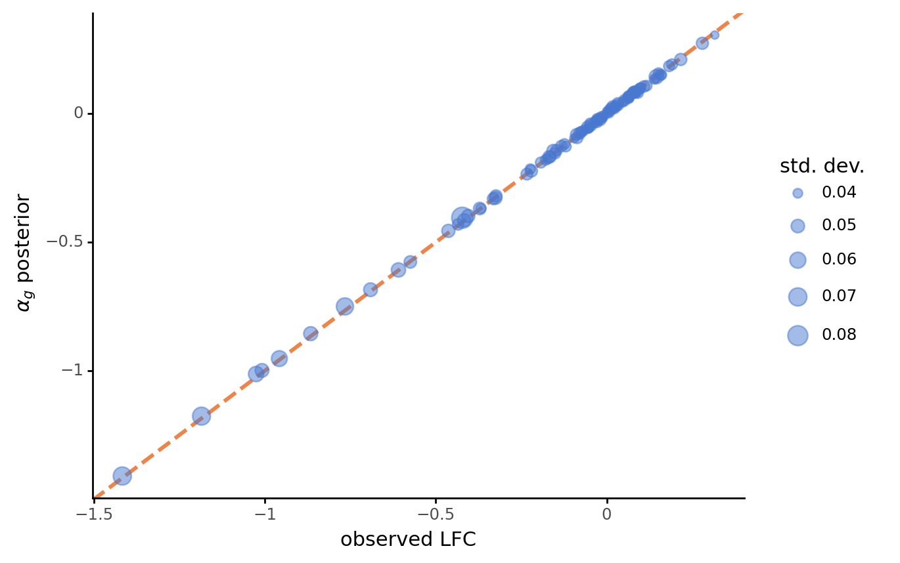

    <ggplot: (8727261189708)>

The posterior predictive check has the wrong dimensions; it is using the last minibatch for predicitions.
I need to follow the guidance of this [post](https://discourse.pymc.io/t/minibatch-advi-ppc-dimensions/5583) on the Discourse which followed the explanation in this GitHub [issue](https://github.com/pymc-devs/pymc3/issues/2190#issuecomment-311609342).
Should be a simple fix.

```python
crc_model1_res["posterior_predictive"]["lfc"].shape[1] == data.shape[0]
```

    True

```python
m1_post_pred = pmanal.summarize_posterior_predictions(
    crc_model1_res["posterior_predictive"]["lfc"],
    merge_with=data[["sgrna", "hugo_symbol", "lfc"]],
)
m1_post_pred.head()
```

    /n/data2/dfci/cancerbio/haigis/Cook/speclet/.snakemake/conda/de1e38d7/lib/python3.9/site-packages/arviz/stats/stats.py:493: FutureWarning: hdi currently interprets 2d data as (draw, shape) but this will change in a future release to (chain, draw) for coherence with other functions

<div>
<style scoped>
    .dataframe tbody tr th:only-of-type {
        vertical-align: middle;
    }

    .dataframe tbody tr th {
        vertical-align: top;
    }

    .dataframe thead th {
        text-align: right;
    }
</style>
<table border="1" class="dataframe">
  <thead>
    <tr style="text-align: right;">
      <th></th>
      <th>pred_mean</th>
      <th>pred_hdi_low</th>
      <th>pred_hdi_high</th>
      <th>sgrna</th>
      <th>hugo_symbol</th>
      <th>lfc</th>
    </tr>
  </thead>
  <tbody>
    <tr>
      <th>0</th>
      <td>-0.140320</td>
      <td>-1.001702</td>
      <td>0.618150</td>
      <td>CCACCCACAGACGCTCAGCA</td>
      <td>ADAMTS13</td>
      <td>0.029491</td>
    </tr>
    <tr>
      <th>1</th>
      <td>-0.128909</td>
      <td>-0.896227</td>
      <td>0.687206</td>
      <td>CCACCCACAGACGCTCAGCA</td>
      <td>ADAMTS13</td>
      <td>0.426017</td>
    </tr>
    <tr>
      <th>2</th>
      <td>-0.144695</td>
      <td>-0.948575</td>
      <td>0.670772</td>
      <td>CCACCCACAGACGCTCAGCA</td>
      <td>ADAMTS13</td>
      <td>0.008626</td>
    </tr>
    <tr>
      <th>3</th>
      <td>-0.109424</td>
      <td>-0.900942</td>
      <td>0.655753</td>
      <td>CCACCCACAGACGCTCAGCA</td>
      <td>ADAMTS13</td>
      <td>0.280821</td>
    </tr>
    <tr>
      <th>4</th>
      <td>-0.141217</td>
      <td>-1.015847</td>
      <td>0.581773</td>
      <td>CCACCCACAGACGCTCAGCA</td>
      <td>ADAMTS13</td>
      <td>0.239815</td>
    </tr>
  </tbody>
</table>
</div>

```python
def crc_post_prediction_vs_real(ppc: pd.DataFrame, color: str) -> gg.ggplot:

    return (
        gg.ggplot(ppc, gg.aes(x="lfc", y="pred_mean"))
        + gg.geom_point(gg.aes(color=color), size=0.2, alpha=0.5)
        + gg.geom_abline(
            slope=1, intercept=0, color="black", linetype="--", size=0.8, alpha=0.7
        )
        + gg.scale_color_discrete()
        + gg.theme(legend_position="none")
        + gg.labs(x="observed LFC", y="predicted LFC")
    )
```

```python
crc_post_prediction_vs_real(m1_post_pred, "hugo_symbol")
```

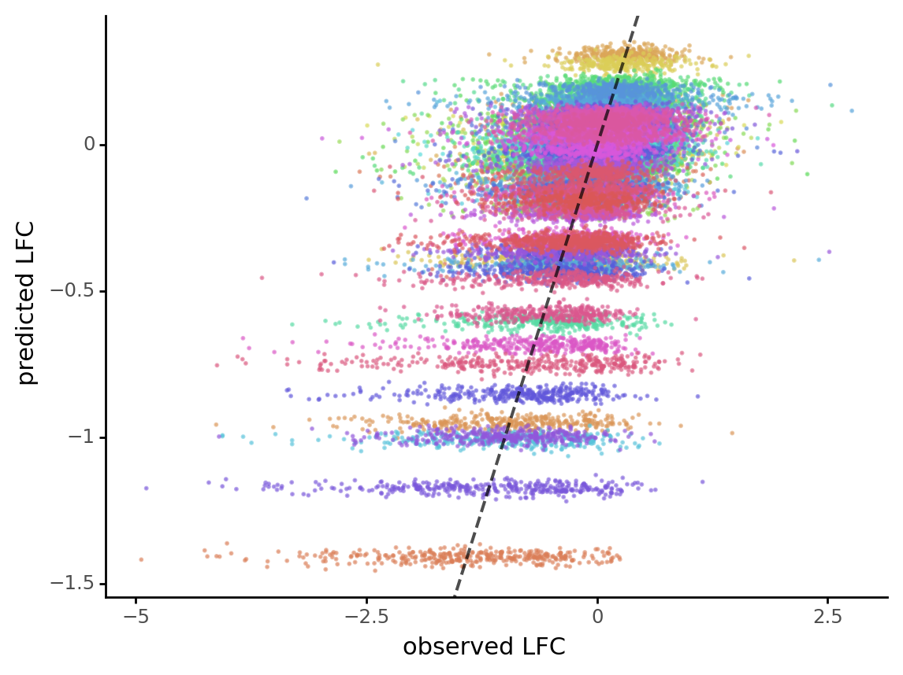

    <ggplot: (8727358145431)>

## Predict on new data

```python
pred_data = data[["hugo_symbol"]].drop_duplicates().reset_index(drop=True)

pred_gene_idx = dphelp.get_indices(pred_data, "hugo_symbol")
gene_idx_shared.set_value(pred_gene_idx)
```

```python
with crc_model1:
    pred_ppc = pm.sample_posterior_predictive(
        trace=crc_model1_res["trace"], samples=100
    )
```

<div>
    <style>
        /*Turns off some styling*/
        progress {
            /*gets rid of default border in Firefox and Opera.*/
            border: none;
            /*Needs to be in here for Safari polyfill so background images work as expected.*/
            background-size: auto;
        }
        .progress-bar-interrupted, .progress-bar-interrupted::-webkit-progress-bar {
            background: #F44336;
        }
    </style>
  <progress value='100' class='' max='100' style='width:300px; height:20px; vertical-align: middle;'></progress>
  100.00% [100/100 00:01<00:00]
</div>

```python
new_ppc = pmanal.summarize_posterior_predictions(pred_ppc["lfc"])
new_ppc["hugo_symbol"] = pred_data.hugo_symbol.values
(
    gg.ggplot(new_ppc, gg.aes(x="hugo_symbol"))
    + gg.geom_hline(yintercept=0, alpha=0.5, linetype="--")
    + gg.geom_linerange(
        gg.aes(ymin="pred_hdi_low", ymax="pred_hdi_high"), size=0.5, alpha=0.5
    )
    + gg.geom_point(gg.aes(y="pred_mean"), size=1)
    + gg.theme(**gene_ggplot_theme)
    + gg.labs(x="gene", y="posterior prediction")
)
```

    /n/data2/dfci/cancerbio/haigis/Cook/speclet/.snakemake/conda/de1e38d7/lib/python3.9/site-packages/arviz/stats/stats.py:493: FutureWarning: hdi currently interprets 2d data as (draw, shape) but this will change in a future release to (chain, draw) for coherence with other functions

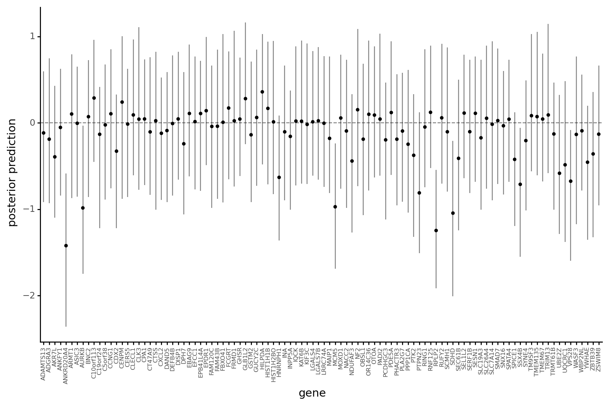

    <ggplot: (8727300108183)>

## Model 2

```python
m2_cache_dir = pymc3_cache_dir / "CRC_test_model2"

sgrna_idx = dphelp.get_indices(data, "sgrna")
sgrna_to_gene_map = sampling_pymc3_models.make_sgrna_to_gene_mapping_df(data)
sgrna_to_gene_idx = dphelp.get_indices(sgrna_to_gene_map, "hugo_symbol")

crc_model2, crc2_shared_vars = crc_models.model_2(
    sgrna_idx=sgrna_idx, sgrna_to_gene_idx=sgrna_to_gene_idx, lfc_data=data.lfc.values
)
pm.model_to_graphviz(crc_model2)
```

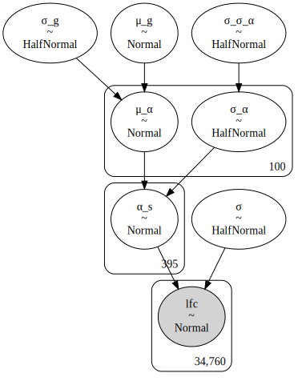

```python
crc_model2_res = pymc3_sampling_api.read_cached_vi(m2_cache_dir)
```

    Loading cached trace and posterior sample...

```python
pmanal.plot_vi_hist(crc_model2_res["approximation"])
```

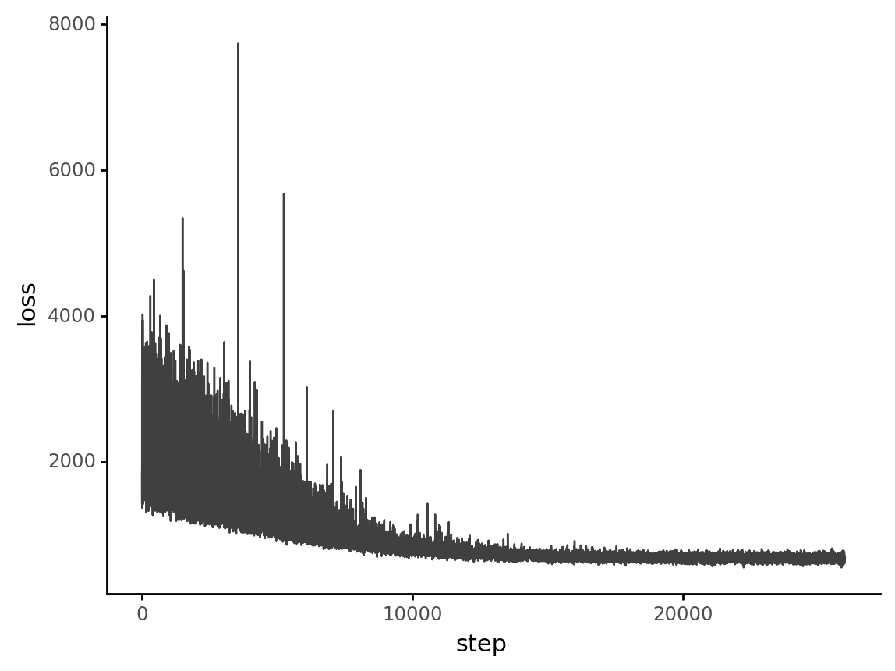

    <ggplot: (8727252107581)>

```python
m2_az = az.from_pymc3(crc_model2_res["trace"], model=crc_model2)
az.summary(m2_az, var_names=["σ_σ_α", "σ_g", "μ_g"], hdi_prob=0.89)
```

    arviz - WARNING - Shape validation failed: input_shape: (1, 1000), minimum_shape: (chains=2, draws=4)

<div>
<style scoped>
    .dataframe tbody tr th:only-of-type {
        vertical-align: middle;
    }

    .dataframe tbody tr th {
        vertical-align: top;
    }

    .dataframe thead th {
        text-align: right;
    }
</style>
<table border="1" class="dataframe">
  <thead>
    <tr style="text-align: right;">
      <th></th>
      <th>mean</th>
      <th>sd</th>
      <th>hdi_5.5%</th>
      <th>hdi_94.5%</th>
      <th>mcse_mean</th>
      <th>mcse_sd</th>
      <th>ess_mean</th>
      <th>ess_sd</th>
      <th>ess_bulk</th>
      <th>ess_tail</th>
      <th>r_hat</th>
    </tr>
  </thead>
  <tbody>
    <tr>
      <th>σ_σ_α</th>
      <td>0.414</td>
      <td>0.031</td>
      <td>0.361</td>
      <td>0.462</td>
      <td>0.001</td>
      <td>0.001</td>
      <td>985.0</td>
      <td>981.0</td>
      <td>990.0</td>
      <td>852.0</td>
      <td>NaN</td>
    </tr>
    <tr>
      <th>σ_g</th>
      <td>0.250</td>
      <td>0.020</td>
      <td>0.217</td>
      <td>0.279</td>
      <td>0.001</td>
      <td>0.000</td>
      <td>965.0</td>
      <td>965.0</td>
      <td>963.0</td>
      <td>982.0</td>
      <td>NaN</td>
    </tr>
    <tr>
      <th>μ_g</th>
      <td>-0.088</td>
      <td>0.032</td>
      <td>-0.137</td>
      <td>-0.038</td>
      <td>0.001</td>
      <td>0.001</td>
      <td>937.0</td>
      <td>937.0</td>
      <td>935.0</td>
      <td>1026.0</td>
      <td>NaN</td>
    </tr>
  </tbody>
</table>
</div>

```python
az.plot_posterior(m2_az, var_names=["σ_σ_α", "σ_g", "μ_g"], hdi_prob=0.89);
```

    array([<AxesSubplot:title={'center':'σ_σ_α'}>,
           <AxesSubplot:title={'center':'σ_g'}>,
           <AxesSubplot:title={'center':'μ_g'}>], dtype=object)

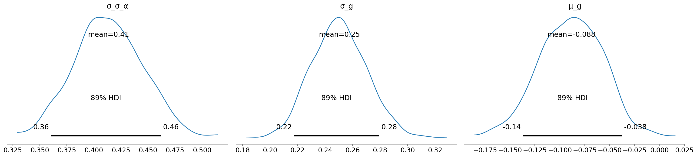

```python
sgrna_post = (
    az.summary(m2_az, var_names="α_s", hdi_prob=0.89, kind="stats")
    .reset_index(drop=False)
    .rename(columns={"index": "param"})
)
sgrna_post["sgrna"] = sgrna_to_gene_map.sgrna
sgrna_post["hugo_symbol"] = sgrna_to_gene_map.hugo_symbol

sgrna_post.head()
```

<div>
<style scoped>
    .dataframe tbody tr th:only-of-type {
        vertical-align: middle;
    }

    .dataframe tbody tr th {
        vertical-align: top;
    }

    .dataframe thead th {
        text-align: right;
    }
</style>
<table border="1" class="dataframe">
  <thead>
    <tr style="text-align: right;">
      <th></th>
      <th>param</th>
      <th>mean</th>
      <th>sd</th>
      <th>hdi_5.5%</th>
      <th>hdi_94.5%</th>
      <th>sgrna</th>
      <th>hugo_symbol</th>
    </tr>
  </thead>
  <tbody>
    <tr>
      <th>0</th>
      <td>α_s[0]</td>
      <td>-0.069</td>
      <td>0.078</td>
      <td>-0.179</td>
      <td>0.067</td>
      <td>CCACCCACAGACGCTCAGCA</td>
      <td>ADAMTS13</td>
    </tr>
    <tr>
      <th>1</th>
      <td>α_s[1]</td>
      <td>-0.045</td>
      <td>0.067</td>
      <td>-0.153</td>
      <td>0.063</td>
      <td>CCTACTTCCAGCCTAAGCCA</td>
      <td>ADAMTS13</td>
    </tr>
    <tr>
      <th>2</th>
      <td>α_s[2]</td>
      <td>-0.338</td>
      <td>0.079</td>
      <td>-0.455</td>
      <td>-0.209</td>
      <td>GTACAGAGTGGCCCTCACCG</td>
      <td>ADAMTS13</td>
    </tr>
    <tr>
      <th>3</th>
      <td>α_s[3]</td>
      <td>-0.006</td>
      <td>0.070</td>
      <td>-0.114</td>
      <td>0.111</td>
      <td>TTTGACCTGGAGTTGCCTGA</td>
      <td>ADAMTS13</td>
    </tr>
    <tr>
      <th>4</th>
      <td>α_s[4]</td>
      <td>-0.103</td>
      <td>0.071</td>
      <td>-0.209</td>
      <td>0.013</td>
      <td>AGATACTCTGCCCAACCGCA</td>
      <td>ADGRA3</td>
    </tr>
  </tbody>
</table>
</div>

```python
m2_gene_post, p = get_varying_parameter_posterior(
    m2_az, var_name="μ_α", data=data, col_name="hugo_symbol"
)
p + gg.labs(x="gene", y=r"$\mu_\alpha$ posterior")
```

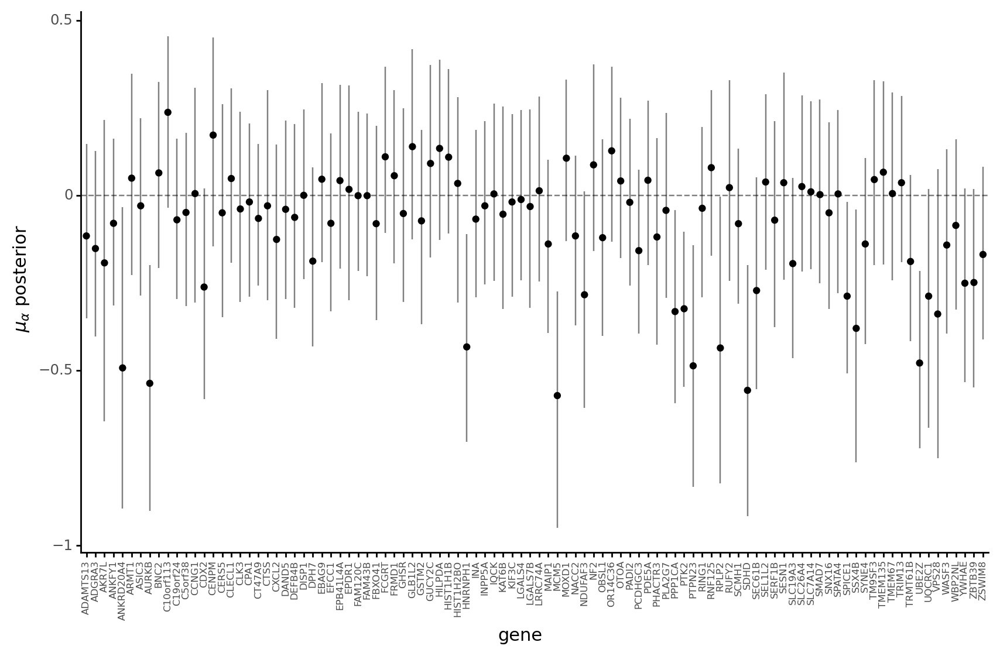

    <ggplot: (8727262509999)>

```python
pos = gg.position_dodge(width=0.7)
jpos = gg.position_jitterdodge(jitter_width=0.2, jitter_height=0, dodge_width=0.7)

(
    gg.ggplot(sgrna_post, gg.aes(x="hugo_symbol", y="mean"))
    + gg.facet_wrap("hugo_symbol", scales="free", ncol=5)
    + gg.geom_hline(yintercept=0, linetype="--", alpha=0.5)
    + gg.geom_violin(gg.aes(y="lfc"), data=data, alpha=0.5, fill="gray", size=0)
    + gg.geom_boxplot(
        gg.aes(y="lfc", group="sgrna"),
        data=data,
        position=pos,
        alpha=0.5,
        outlier_alpha=0,
        width=0.5,
    )
    + gg.geom_linerange(
        gg.aes(ymin="hdi_5.5%", ymax="hdi_94.5%", group="sgrna"),
        position=pos,
        color=pal.sns_red,
        size=1,
    )
    + gg.geom_point(
        gg.aes(group="sgrna"), position=pos, color=pal.sns_red, size=2.2, shape="^"
    )
    + gg.theme(
        axis_text_x=gg.element_blank(),
        axis_ticks_major_x=gg.element_blank(),
        axis_title_x=gg.element_blank(),
        axis_text_y=gg.element_text(size=5),
        strip_text=gg.element_text(size=6),
        figure_size=(8, 23),
        subplots_adjust={"wspace": 0.2, "hspace": 0.25},
    )
)
```

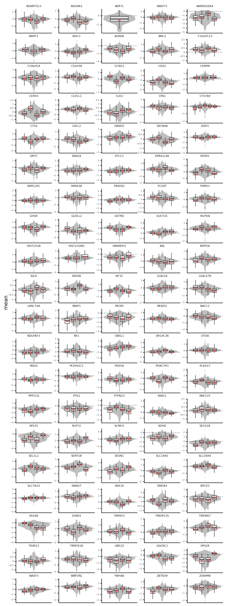

    <ggplot: (8727251762173)>

```python
m2_post_pred = pmanal.summarize_posterior_predictions(
    crc_model2_res["posterior_predictive"]["lfc"],
    merge_with=data[["sgrna", "hugo_symbol", "lfc"]],
)
```

    /n/data2/dfci/cancerbio/haigis/Cook/speclet/.snakemake/conda/de1e38d7/lib/python3.9/site-packages/arviz/stats/stats.py:493: FutureWarning: hdi currently interprets 2d data as (draw, shape) but this will change in a future release to (chain, draw) for coherence with other functions

```python
m2_post_pred.head()
```

<div>
<style scoped>
    .dataframe tbody tr th:only-of-type {
        vertical-align: middle;
    }

    .dataframe tbody tr th {
        vertical-align: top;
    }

    .dataframe thead th {
        text-align: right;
    }
</style>
<table border="1" class="dataframe">
  <thead>
    <tr style="text-align: right;">
      <th></th>
      <th>pred_mean</th>
      <th>pred_hdi_low</th>
      <th>pred_hdi_high</th>
      <th>sgrna</th>
      <th>hugo_symbol</th>
      <th>lfc</th>
    </tr>
  </thead>
  <tbody>
    <tr>
      <th>0</th>
      <td>-0.042020</td>
      <td>-0.773232</td>
      <td>0.683600</td>
      <td>CCACCCACAGACGCTCAGCA</td>
      <td>ADAMTS13</td>
      <td>0.029491</td>
    </tr>
    <tr>
      <th>1</th>
      <td>-0.056373</td>
      <td>-0.872297</td>
      <td>0.649414</td>
      <td>CCACCCACAGACGCTCAGCA</td>
      <td>ADAMTS13</td>
      <td>0.426017</td>
    </tr>
    <tr>
      <th>2</th>
      <td>-0.094385</td>
      <td>-0.900004</td>
      <td>0.565439</td>
      <td>CCACCCACAGACGCTCAGCA</td>
      <td>ADAMTS13</td>
      <td>0.008626</td>
    </tr>
    <tr>
      <th>3</th>
      <td>-0.069575</td>
      <td>-0.797742</td>
      <td>0.699425</td>
      <td>CCACCCACAGACGCTCAGCA</td>
      <td>ADAMTS13</td>
      <td>0.280821</td>
    </tr>
    <tr>
      <th>4</th>
      <td>-0.061283</td>
      <td>-0.871556</td>
      <td>0.650743</td>
      <td>CCACCCACAGACGCTCAGCA</td>
      <td>ADAMTS13</td>
      <td>0.239815</td>
    </tr>
  </tbody>
</table>
</div>

```python
crc_post_prediction_vs_real(m2_post_pred, "hugo_symbol")
```

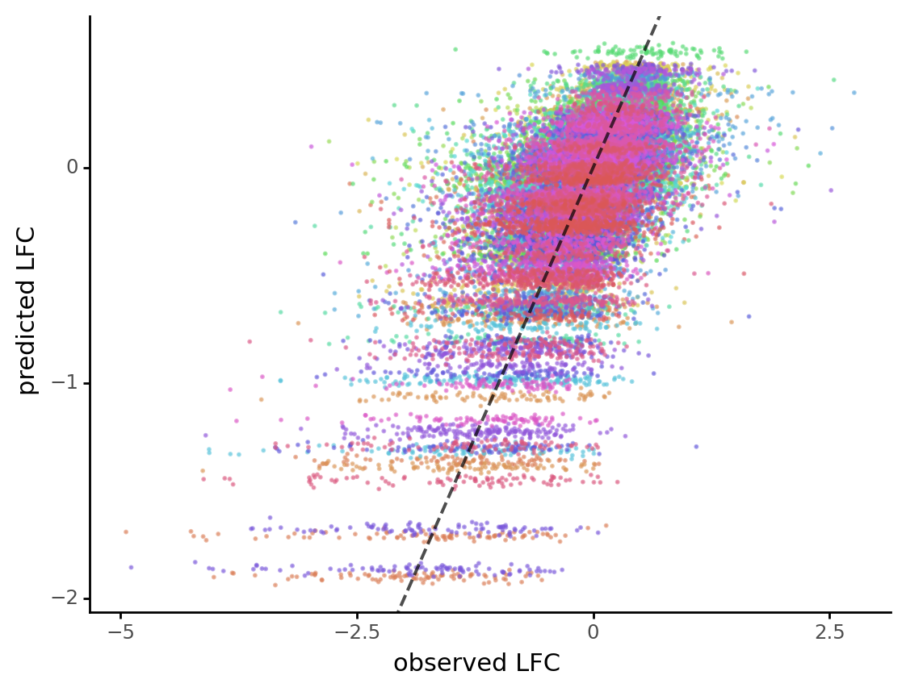

    <ggplot: (8727251759668)>

## Model 3

```python
m3_cache_dir = pymc3_cache_dir / "CRC_test_model3"

sgrna_idx = dphelp.get_indices(data, "sgrna")
sgrna_to_gene_map = sampling_pymc3_models.make_sgrna_to_gene_mapping_df(data)
sgrna_to_gene_idx = dphelp.get_indices(sgrna_to_gene_map, "hugo_symbol")
cell_idx = dphelp.get_indices(data, "depmap_id")

crc_model3, crc3_shared_vars = crc_models.model_3(
    sgrna_idx=sgrna_idx,
    sgrna_to_gene_idx=sgrna_to_gene_idx,
    cell_idx=cell_idx,
    lfc_data=data.lfc.values,
)
pm.model_to_graphviz(crc_model3)
```

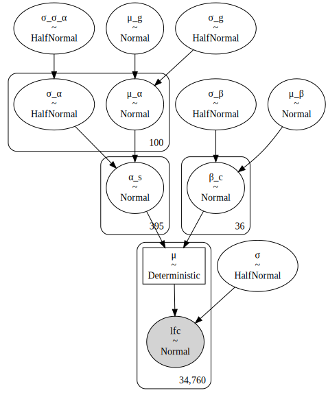

```python
crc_model3_res = pymc3_sampling_api.read_cached_vi(m3_cache_dir)
```

    Loading cached trace and posterior sample...

```python
pmanal.plot_vi_hist(crc_model3_res["approximation"])
```

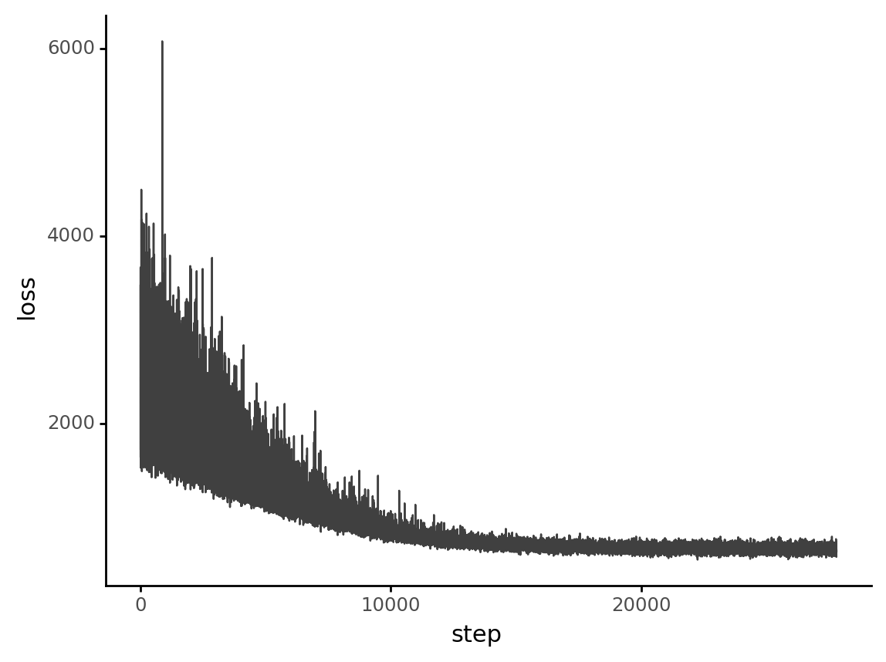

    <ggplot: (8727249220747)>

```python
m3_az = az.from_pymc3(trace=crc_model3_res["trace"], model=crc_model3)
az.summary(m3_az, var_names=["μ_g", "σ_g", "μ_β", "σ_β", "σ_σ_α"], hdi_prob=0.89)
```

    arviz - WARNING - Shape validation failed: input_shape: (1, 1000), minimum_shape: (chains=2, draws=4)

<div>
<style scoped>
    .dataframe tbody tr th:only-of-type {
        vertical-align: middle;
    }

    .dataframe tbody tr th {
        vertical-align: top;
    }

    .dataframe thead th {
        text-align: right;
    }
</style>
<table border="1" class="dataframe">
  <thead>
    <tr style="text-align: right;">
      <th></th>
      <th>mean</th>
      <th>sd</th>
      <th>hdi_5.5%</th>
      <th>hdi_94.5%</th>
      <th>mcse_mean</th>
      <th>mcse_sd</th>
      <th>ess_mean</th>
      <th>ess_sd</th>
      <th>ess_bulk</th>
      <th>ess_tail</th>
      <th>r_hat</th>
    </tr>
  </thead>
  <tbody>
    <tr>
      <th>μ_g</th>
      <td>0.028</td>
      <td>0.031</td>
      <td>-0.025</td>
      <td>0.076</td>
      <td>0.001</td>
      <td>0.001</td>
      <td>850.0</td>
      <td>850.0</td>
      <td>848.0</td>
      <td>942.0</td>
      <td>NaN</td>
    </tr>
    <tr>
      <th>σ_g</th>
      <td>0.240</td>
      <td>0.019</td>
      <td>0.209</td>
      <td>0.269</td>
      <td>0.001</td>
      <td>0.000</td>
      <td>972.0</td>
      <td>972.0</td>
      <td>964.0</td>
      <td>1011.0</td>
      <td>NaN</td>
    </tr>
    <tr>
      <th>μ_β</th>
      <td>-0.124</td>
      <td>0.018</td>
      <td>-0.153</td>
      <td>-0.097</td>
      <td>0.001</td>
      <td>0.000</td>
      <td>971.0</td>
      <td>971.0</td>
      <td>987.0</td>
      <td>969.0</td>
      <td>NaN</td>
    </tr>
    <tr>
      <th>σ_β</th>
      <td>0.083</td>
      <td>0.011</td>
      <td>0.065</td>
      <td>0.100</td>
      <td>0.000</td>
      <td>0.000</td>
      <td>886.0</td>
      <td>876.0</td>
      <td>905.0</td>
      <td>978.0</td>
      <td>NaN</td>
    </tr>
    <tr>
      <th>σ_σ_α</th>
      <td>0.390</td>
      <td>0.031</td>
      <td>0.347</td>
      <td>0.444</td>
      <td>0.001</td>
      <td>0.001</td>
      <td>1033.0</td>
      <td>1033.0</td>
      <td>1032.0</td>
      <td>1024.0</td>
      <td>NaN</td>
    </tr>
  </tbody>
</table>
</div>

```python

```

```python
m3_gene_post, p = get_varying_parameter_posterior(
    m3_az, var_name="μ_α", data=data, col_name="hugo_symbol"
)
p + gg.labs(x="gene", y=r"$\mu_\alpha$ posterior")
```

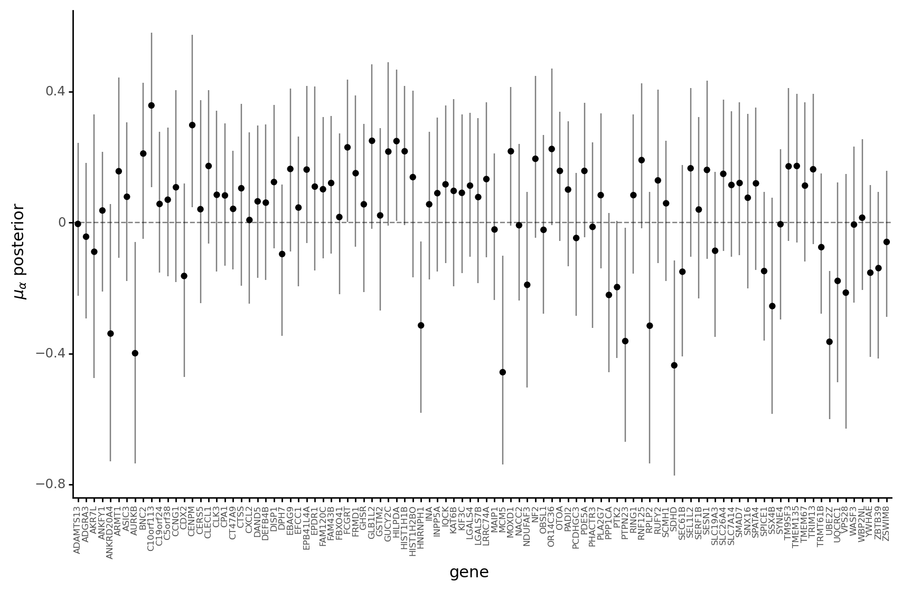

    <ggplot: (8727251952668)>

```python
m3_cell_post, p = get_varying_parameter_posterior(
    m3_az, var_name="β_c", data=data, col_name="depmap_id"
)
p
```

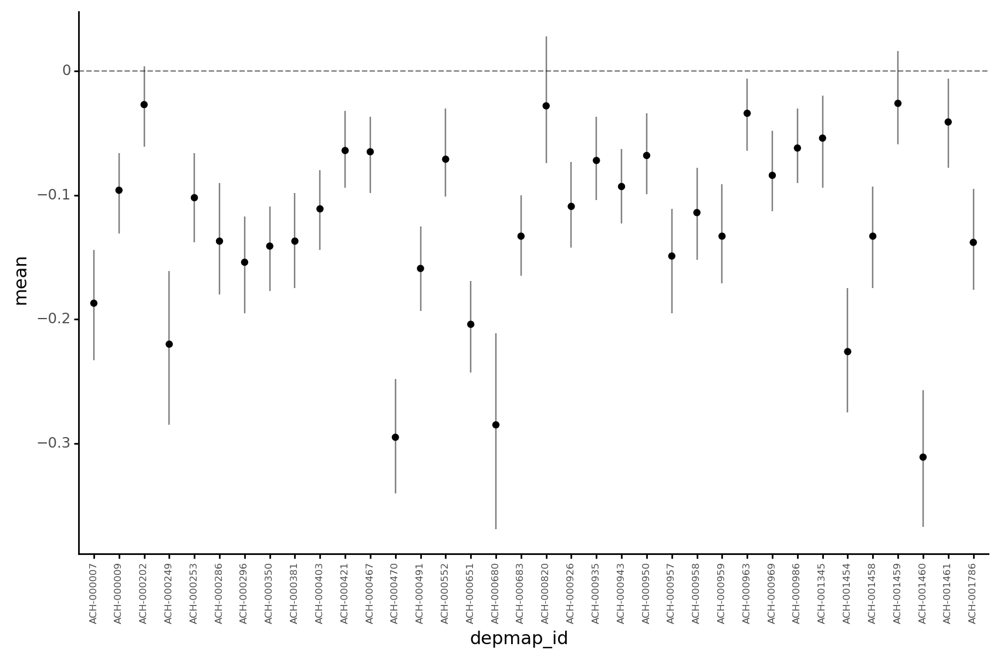

    <ggplot: (8727248786372)>

```python
m3_post_pred = pmanal.summarize_posterior_predictions(
    crc_model3_res["posterior_predictive"]["lfc"],
    merge_with=data[["sgrna", "hugo_symbol", "lfc", "depmap_id"]],
)
m3_post_pred.head()
```

    /n/data2/dfci/cancerbio/haigis/Cook/speclet/.snakemake/conda/de1e38d7/lib/python3.9/site-packages/arviz/stats/stats.py:493: FutureWarning: hdi currently interprets 2d data as (draw, shape) but this will change in a future release to (chain, draw) for coherence with other functions

<div>
<style scoped>
    .dataframe tbody tr th:only-of-type {
        vertical-align: middle;
    }

    .dataframe tbody tr th {
        vertical-align: top;
    }

    .dataframe thead th {
        text-align: right;
    }
</style>
<table border="1" class="dataframe">
  <thead>
    <tr style="text-align: right;">
      <th></th>
      <th>pred_mean</th>
      <th>pred_hdi_low</th>
      <th>pred_hdi_high</th>
      <th>sgrna</th>
      <th>hugo_symbol</th>
      <th>lfc</th>
      <th>depmap_id</th>
    </tr>
  </thead>
  <tbody>
    <tr>
      <th>0</th>
      <td>-0.158881</td>
      <td>-0.999346</td>
      <td>0.468458</td>
      <td>CCACCCACAGACGCTCAGCA</td>
      <td>ADAMTS13</td>
      <td>0.029491</td>
      <td>ACH-000007</td>
    </tr>
    <tr>
      <th>1</th>
      <td>-0.124904</td>
      <td>-0.840956</td>
      <td>0.577671</td>
      <td>CCACCCACAGACGCTCAGCA</td>
      <td>ADAMTS13</td>
      <td>0.426017</td>
      <td>ACH-000007</td>
    </tr>
    <tr>
      <th>2</th>
      <td>-0.063295</td>
      <td>-0.810069</td>
      <td>0.601717</td>
      <td>CCACCCACAGACGCTCAGCA</td>
      <td>ADAMTS13</td>
      <td>0.008626</td>
      <td>ACH-000009</td>
    </tr>
    <tr>
      <th>3</th>
      <td>-0.038658</td>
      <td>-0.655215</td>
      <td>0.808753</td>
      <td>CCACCCACAGACGCTCAGCA</td>
      <td>ADAMTS13</td>
      <td>0.280821</td>
      <td>ACH-000009</td>
    </tr>
    <tr>
      <th>4</th>
      <td>-0.049714</td>
      <td>-0.866691</td>
      <td>0.622499</td>
      <td>CCACCCACAGACGCTCAGCA</td>
      <td>ADAMTS13</td>
      <td>0.239815</td>
      <td>ACH-000009</td>
    </tr>
  </tbody>
</table>
</div>

```python
crc_post_prediction_vs_real(m3_post_pred, "hugo_symbol")
```

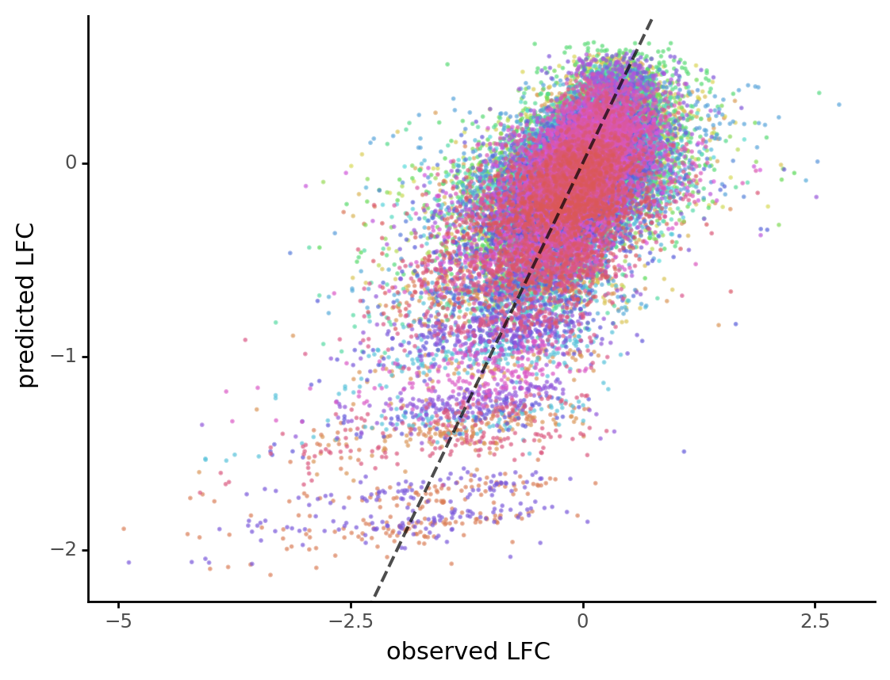

    <ggplot: (8727248774702)>

```python
crc_post_prediction_vs_real(m3_post_pred, "depmap_id")
```

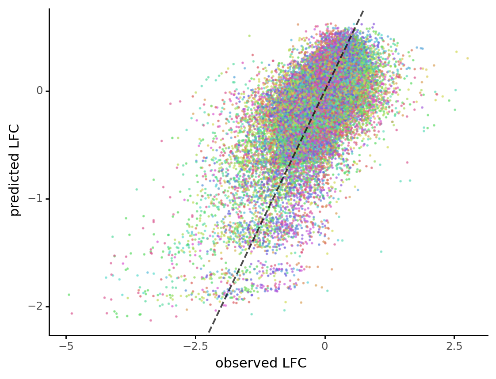

    <ggplot: (8727248788324)>

```python
crc_post_prediction_vs_real(m3_post_pred, "depmap_id") + gg.facet_wrap(
    "depmap_id"
) + gg.geom_smooth(method="lm", color="black", linetype="-") + gg.theme(
    figure_size=(8, 10),
    axis_text=gg.element_text(size=7),
    strip_text=gg.element_text(size=8),
)
```

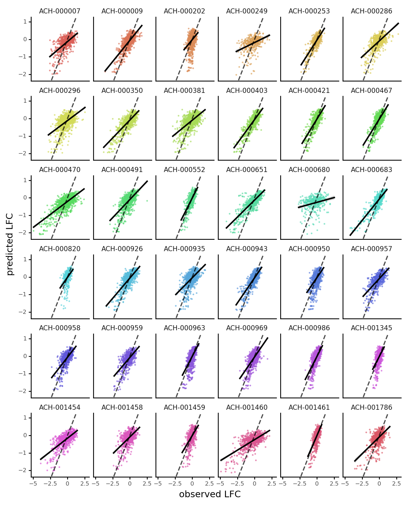

    <ggplot: (8727248579527)>

---

## Comparing models

```python
def preprocess_post(d: pd.DataFrame, name: str) -> pd.DataFrame:
    return d.assign(error=lambda d: d.pred_mean - d.lfc, model=name).reset_index(
        drop=False
    )


post_dfs = [m1_post_pred, m2_post_pred, m3_post_pred]
model_names = ["model " + str(i + 1) for i in range(len(post_dfs))]

model_errors = pd.concat([preprocess_post(d, n) for d, n in zip(post_dfs, model_names)])
```

```python
model_errors_wide = pd.pivot(
    model_errors,
    index=["index", "hugo_symbol", "sgrna", "lfc"],
    columns="model",
    values="error",
).reset_index(drop=False)
```

```python
def plot_model_errors(df: pd.DataFrame, x: str, y: str) -> gg.ggplot:
    return (
        gg.ggplot(df, gg.aes(x=x, y=y))
        + gg.geom_point(size=0.2, alpha=0.5, color=pal.sns_blue)
        + gg.geom_hline(yintercept=0)
        + gg.geom_vline(xintercept=0)
        + gg.geom_abline(slope=1, intercept=0, color="black", linetype="--")
        + gg.geom_smooth(method="lm", color=pal.sns_orange)
    )
```

```python
for m1, m2 in combinations(model_names, 2):
    print(plot_model_errors(model_errors_wide, m1, m2))
```


    <ggplot: (8727248570838)>

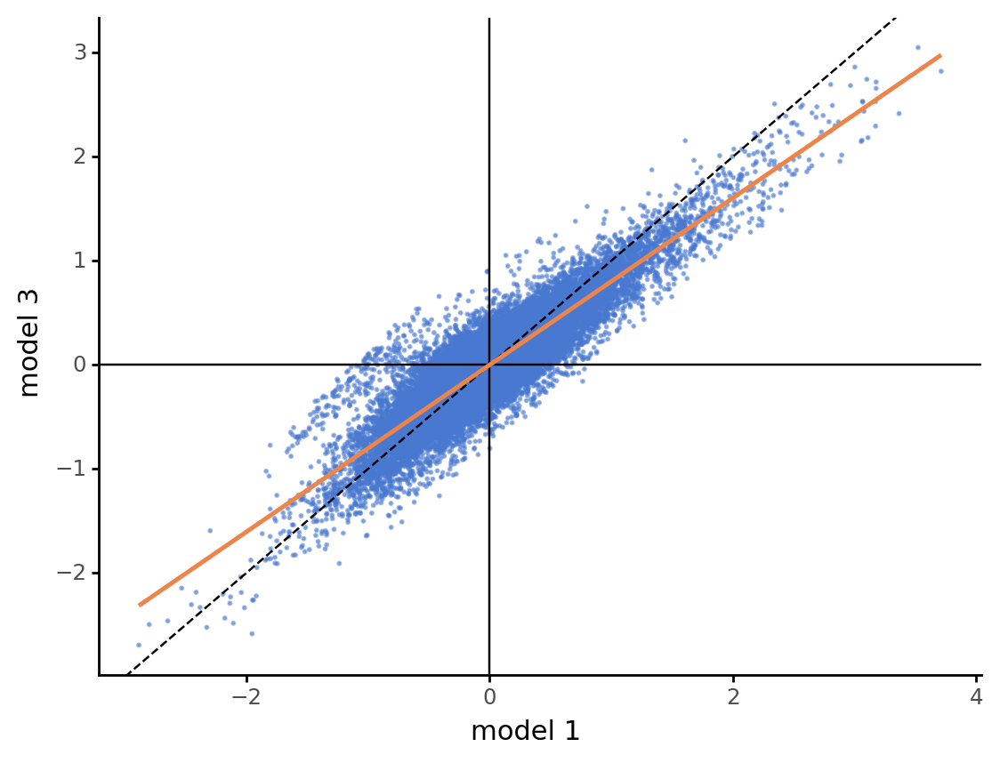

    <ggplot: (8727250341042)>

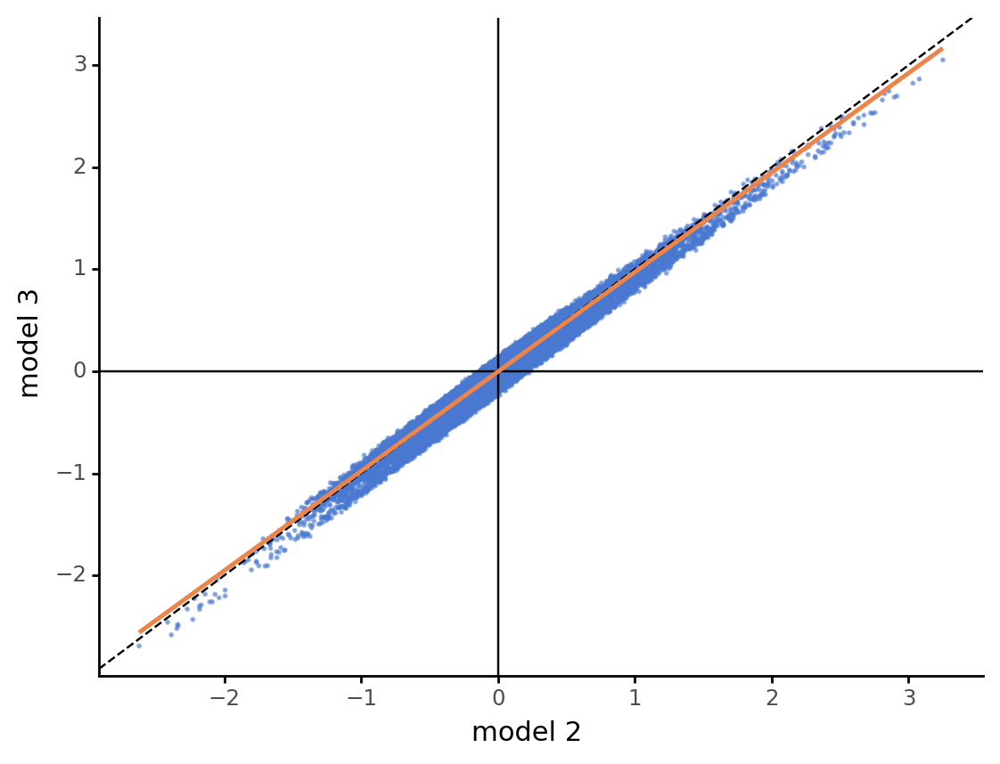

    <ggplot: (8727248492114)>

```python
az.compare(
    {
        "model 1": m1_az,
        "model 2": m2_az,
        "model 3": m3_az,
    }
)
```

<div>
<style scoped>
    .dataframe tbody tr th:only-of-type {
        vertical-align: middle;
    }

    .dataframe tbody tr th {
        vertical-align: top;
    }

    .dataframe thead th {
        text-align: right;
    }
</style>
<table border="1" class="dataframe">
  <thead>
    <tr style="text-align: right;">
      <th></th>
      <th>rank</th>
      <th>loo</th>
      <th>p_loo</th>
      <th>d_loo</th>
      <th>weight</th>
      <th>se</th>
      <th>dse</th>
      <th>warning</th>
      <th>loo_scale</th>
    </tr>
  </thead>
  <tbody>
    <tr>
      <th>model 3</th>
      <td>0</td>
      <td>-22846.189424</td>
      <td>1122.384028</td>
      <td>0.000000</td>
      <td>0.832867</td>
      <td>207.482992</td>
      <td>0.000000</td>
      <td>False</td>
      <td>log</td>
    </tr>
    <tr>
      <th>model 2</th>
      <td>1</td>
      <td>-23266.448833</td>
      <td>1117.363259</td>
      <td>420.259409</td>
      <td>0.077806</td>
      <td>215.781882</td>
      <td>38.868047</td>
      <td>True</td>
      <td>log</td>
    </tr>
    <tr>
      <th>model 1</th>
      <td>2</td>
      <td>-26010.197079</td>
      <td>364.108481</td>
      <td>3164.007655</td>
      <td>0.089327</td>
      <td>212.227674</td>
      <td>97.974332</td>
      <td>False</td>
      <td>log</td>
    </tr>
  </tbody>
</table>
</div>

---

### To-Do:

1. Address the change above to fix an issue with PPC sampling. <span style="color:green">✔︎</span>
2. Make sure I can replace the shared data with new data for predictions on unseen data. <span style="color:green">✔︎</span>
3. Run and analyze more simple models. <span style="color:green">✔︎</span>
4. Create a Snakemake workflow to run all in parallel and then run the analysis. <span style="color:green">✔︎</span>

---

```python
notebook_toc = time()
print(f"execution time: {(notebook_toc - notebook_tic) / 60:.2f} minutes")
```

    execution time: 4.77 minutes

```python
%load_ext watermark
%watermark -d -u -v -iv -b -h -m
```

    Last updated: 2021-02-22

    Python implementation: CPython
    Python version       : 3.9.1
    IPython version      : 7.20.0

    Compiler    : GCC 9.3.0
    OS          : Linux
    Release     : 3.10.0-1062.el7.x86_64
    Machine     : x86_64
    Processor   : x86_64
    CPU cores   : 28
    Architecture: 64bit

    Hostname: compute-e-16-237.o2.rc.hms.harvard.edu

    Git branch: crc

    numpy     : 1.20.1
    matplotlib: 3.3.4
    pymc3     : 3.11.1
    pandas    : 1.2.2
    re        : 2.2.1
    arviz     : 0.11.1
    seaborn   : 0.11.1
    plotnine  : 0.7.1
    theano    : 1.0.5
