# Splines in PyMC3

- [Question](https://discourse.pymc.io/t/spline-regression-in-pymc3/6235) on PyMC Discourse
- *Statistical Rethinking* example in [PyMC3](https://github.com/pymc-devs/resources/blob/master/Rethinking_2/Chp_04.ipynb) and [Stan](https://vincentarelbundock.github.io/rethinking2/04.html)
- My [post](https://joshuacook.netlify.app/post/pymc3-spline/) with additional visualization and explination

```python
import string
import warnings
from pathlib import Path

import arviz as az
import matplotlib.colors as mcolors
import matplotlib.pyplot as plt
import numpy as np
import pandas as pd
import plotnine as gg
import pymc3 as pm
import pymc3_helpers as pmhelp
import seaborn as sns
from patsy import dmatrix
from theano import tensor as tt

warnings.simplefilter(action="ignore", category=UserWarning)

gg.theme_set(gg.theme_minimal())

RANDOM_SEED = 847
np.random.seed(RANDOM_SEED)

pymc3_cache_dir = Path("pymc3_model_cache")
rethinking_data_path = Path("../data/rethinking_data")
modeling_data_path = Path("../modeling_data/depmap_modeling_dataframe_subsample.csv")
modeling_data2_path = Path("../modeling_data/depmap_modeling_dataframe_subsample2.csv")
```

## Replicate the example from *Statistical Rethinking*

```python
d = pd.read_csv(rethinking_data_path / "cherry_blossoms.csv")
# nans are not treated as in the book
az.summary(d.dropna().to_dict(orient="list"), kind="stats")
```

<div>
<style scoped>
    .dataframe tbody tr th:only-of-type {
        vertical-align: middle;
    }

    .dataframe tbody tr th {
        vertical-align: top;
    }

    .dataframe thead th {
        text-align: right;
    }
</style>
<table border="1" class="dataframe">
  <thead>
    <tr style="text-align: right;">
      <th></th>
      <th>mean</th>
      <th>sd</th>
      <th>hdi_3%</th>
      <th>hdi_97%</th>
    </tr>
  </thead>
  <tbody>
    <tr>
      <th>year</th>
      <td>1533.395</td>
      <td>291.123</td>
      <td>1016.00</td>
      <td>1978.00</td>
    </tr>
    <tr>
      <th>doy</th>
      <td>104.921</td>
      <td>6.258</td>
      <td>92.00</td>
      <td>115.00</td>
    </tr>
    <tr>
      <th>temp</th>
      <td>6.100</td>
      <td>0.683</td>
      <td>4.80</td>
      <td>7.32</td>
    </tr>
    <tr>
      <th>temp_upper</th>
      <td>6.938</td>
      <td>0.812</td>
      <td>5.56</td>
      <td>8.40</td>
    </tr>
    <tr>
      <th>temp_lower</th>
      <td>5.264</td>
      <td>0.762</td>
      <td>3.75</td>
      <td>6.83</td>
    </tr>
  </tbody>
</table>
</div>

```python
d2 = d.dropna(subset=["doy"]).reset_index(drop=True)
d2.head(n=10)
```

<div>
<style scoped>
    .dataframe tbody tr th:only-of-type {
        vertical-align: middle;
    }

    .dataframe tbody tr th {
        vertical-align: top;
    }

    .dataframe thead th {
        text-align: right;
    }
</style>
<table border="1" class="dataframe">
  <thead>
    <tr style="text-align: right;">
      <th></th>
      <th>year</th>
      <th>doy</th>
      <th>temp</th>
      <th>temp_upper</th>
      <th>temp_lower</th>
    </tr>
  </thead>
  <tbody>
    <tr>
      <th>0</th>
      <td>812</td>
      <td>92.0</td>
      <td>NaN</td>
      <td>NaN</td>
      <td>NaN</td>
    </tr>
    <tr>
      <th>1</th>
      <td>815</td>
      <td>105.0</td>
      <td>NaN</td>
      <td>NaN</td>
      <td>NaN</td>
    </tr>
    <tr>
      <th>2</th>
      <td>831</td>
      <td>96.0</td>
      <td>NaN</td>
      <td>NaN</td>
      <td>NaN</td>
    </tr>
    <tr>
      <th>3</th>
      <td>851</td>
      <td>108.0</td>
      <td>7.38</td>
      <td>12.10</td>
      <td>2.66</td>
    </tr>
    <tr>
      <th>4</th>
      <td>853</td>
      <td>104.0</td>
      <td>NaN</td>
      <td>NaN</td>
      <td>NaN</td>
    </tr>
    <tr>
      <th>5</th>
      <td>864</td>
      <td>100.0</td>
      <td>6.42</td>
      <td>8.69</td>
      <td>4.14</td>
    </tr>
    <tr>
      <th>6</th>
      <td>866</td>
      <td>106.0</td>
      <td>6.44</td>
      <td>8.11</td>
      <td>4.77</td>
    </tr>
    <tr>
      <th>7</th>
      <td>869</td>
      <td>95.0</td>
      <td>NaN</td>
      <td>NaN</td>
      <td>NaN</td>
    </tr>
    <tr>
      <th>8</th>
      <td>889</td>
      <td>104.0</td>
      <td>6.83</td>
      <td>8.48</td>
      <td>5.19</td>
    </tr>
    <tr>
      <th>9</th>
      <td>891</td>
      <td>109.0</td>
      <td>6.98</td>
      <td>8.96</td>
      <td>5.00</td>
    </tr>
  </tbody>
</table>
</div>

```python
d2.shape
```

    (827, 5)

```python
num_knots = 15
knot_list = np.quantile(d2.year, np.linspace(0, 1, num_knots))
knot_list
```

    array([ 812., 1036., 1174., 1269., 1377., 1454., 1518., 1583., 1650.,
           1714., 1774., 1833., 1893., 1956., 2015.])

```python
(
    gg.ggplot(d2, gg.aes(x="year", y="doy"))
    + gg.geom_point(color="black", alpha=0.4, size=1.3)
    + gg.theme(figure_size=(10, 5))
    + gg.labs(x="year", y="days of year", title="Cherry blossom data")
)
```

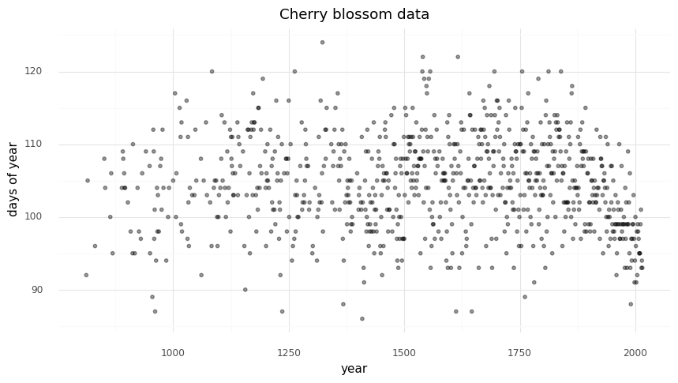

    <ggplot: (8749127536595)>

```python
(
    gg.ggplot(d2, gg.aes(x="year", y="doy"))
    + gg.geom_point(color="black", alpha=0.4, size=1.3)
    + gg.geom_vline(xintercept=knot_list, color="gray", alpha=0.8)
    + gg.theme(figure_size=(10, 5))
    + gg.labs(x="year", y="days of year", title="Cherry blossom data with spline knots")
)
```

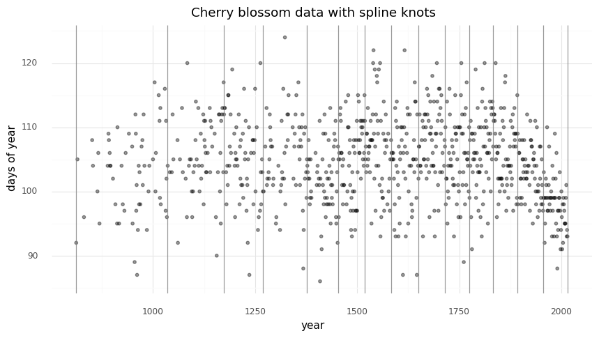

    <ggplot: (8749166099776)>

```python
(
    gg.ggplot(d2, gg.aes(x="year", y="doy"))
    + gg.geom_point(color="black", alpha=0.4, size=1.3)
    + gg.geom_smooth(method="loess", span=0.3, size=1.5, color="blue", linetype="-")
    + gg.geom_vline(xintercept=knot_list, color="gray", alpha=0.8)
    + gg.theme(figure_size=(10, 5))
    + gg.labs(x="year", y="days of year", title="Cherry blossom data with spline knots")
)
```

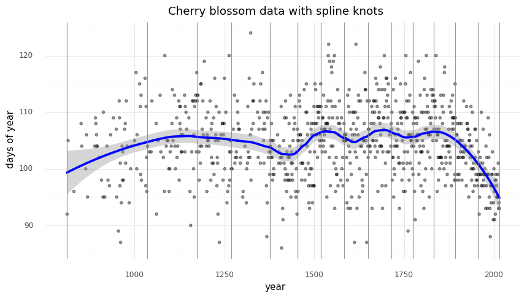

    <ggplot: (8749126939763)>

```python
d2["knot_group"] = [np.where(a <= knot_list)[0][0] for a in d2.year]
d2["knot_group"] = pd.Categorical(d2["knot_group"], ordered=True)
```

```python
(
    gg.ggplot(d2, gg.aes(x="year", y="doy"))
    + gg.geom_point(color="black", alpha=0.4, size=1.3)
    + gg.geom_smooth(
        gg.aes(group="knot_group"), method="lm", size=1.5, color="red", linetype="-"
    )
    + gg.geom_vline(xintercept=knot_list, color="gray", alpha=0.8)
    + gg.theme(figure_size=(10, 5))
    + gg.labs(x="year", y="days of year", title="Cherry blossom data with spline knots")
)
```

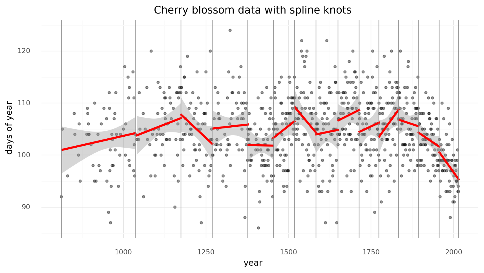

    <ggplot: (8749127536553)>

```python
B = dmatrix(
    "bs(year, knots=knots, degree=3, include_intercept=True) - 1",
    {"year": d2.year.values, "knots": knot_list[1:-1]},
)
B
```

    DesignMatrix with shape (827, 17)
      Columns:
        ['bs(year, knots=knots, degree=3, include_intercept=True)[0]',
         'bs(year, knots=knots, degree=3, include_intercept=True)[1]',
         'bs(year, knots=knots, degree=3, include_intercept=True)[2]',
         'bs(year, knots=knots, degree=3, include_intercept=True)[3]',
         'bs(year, knots=knots, degree=3, include_intercept=True)[4]',
         'bs(year, knots=knots, degree=3, include_intercept=True)[5]',
         'bs(year, knots=knots, degree=3, include_intercept=True)[6]',
         'bs(year, knots=knots, degree=3, include_intercept=True)[7]',
         'bs(year, knots=knots, degree=3, include_intercept=True)[8]',
         'bs(year, knots=knots, degree=3, include_intercept=True)[9]',
         'bs(year, knots=knots, degree=3, include_intercept=True)[10]',
         'bs(year, knots=knots, degree=3, include_intercept=True)[11]',
         'bs(year, knots=knots, degree=3, include_intercept=True)[12]',
         'bs(year, knots=knots, degree=3, include_intercept=True)[13]',
         'bs(year, knots=knots, degree=3, include_intercept=True)[14]',
         'bs(year, knots=knots, degree=3, include_intercept=True)[15]',
         'bs(year, knots=knots, degree=3, include_intercept=True)[16]']
      Terms:
        'bs(year, knots=knots, degree=3, include_intercept=True)' (columns 0:17)
      (to view full data, use np.asarray(this_obj))

```python
spline_df = (
    pd.DataFrame(B)
    .assign(year=d2.year.values)
    .melt("year", var_name="spline_i", value_name="value")
)

(
    gg.ggplot(spline_df, gg.aes(x="year", y="value"))
    + gg.geom_line(gg.aes(group="spline_i", color="spline_i"))
    + gg.scale_color_discrete(guide=gg.guide_legend(ncol=2), color_space="husl")
    + gg.theme(figure_size=(10, 5))
    + gg.labs(x="year", y="basis", color="spline idx")
)
```

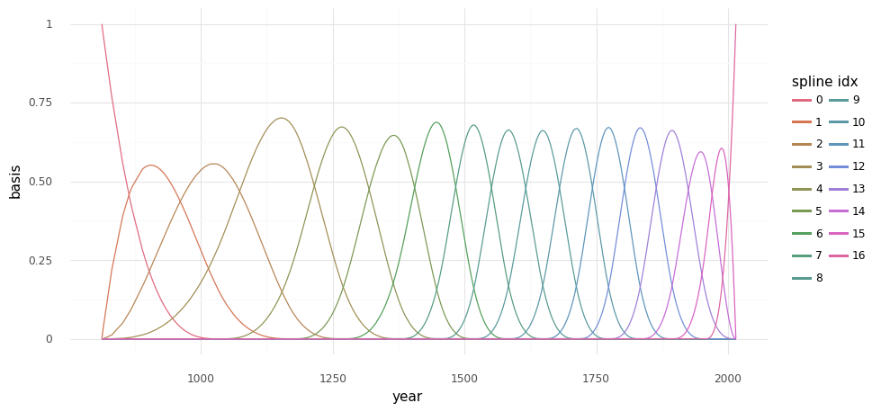

    <ggplot: (8749126940468)>

```python
with pm.Model() as m4_7:
    a = pm.Normal("a", 100, 5)
    w = pm.Normal("w", mu=0, sd=3, shape=B.shape[1])
    mu = pm.Deterministic("mu", a + pm.math.dot(np.asarray(B, order="F"), w.T))
    sigma = pm.Exponential("sigma", 1)
    D = pm.Normal("D", mu, sigma, observed=d2.doy)
```

```python
pm.model_to_graphviz(m4_7)
```

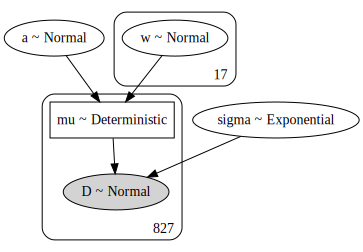

```python
with m4_7:
    prior_pc = pm.sample_prior_predictive(random_seed=RANDOM_SEED)
    trace_m4_7 = pm.sample(2000, tune=2000, random_seed=RANDOM_SEED, chains=2)
    post_pc = pm.sample_posterior_predictive(trace_m4_7, random_seed=RANDOM_SEED)
```

    Auto-assigning NUTS sampler...
    Initializing NUTS using jitter+adapt_diag...
    Multiprocess sampling (2 chains in 4 jobs)
    NUTS: [sigma, w, a]

<div>
    <style>
        /*Turns off some styling*/
        progress {
            /*gets rid of default border in Firefox and Opera.*/
            border: none;
            /*Needs to be in here for Safari polyfill so background images work as expected.*/
            background-size: auto;
        }
        .progress-bar-interrupted, .progress-bar-interrupted::-webkit-progress-bar {
            background: #F44336;
        }
    </style>
  <progress value='8000' class='' max='8000' style='width:300px; height:20px; vertical-align: middle;'></progress>
  100.00% [8000/8000 00:13<00:00 Sampling 2 chains, 0 divergences]
</div>

    Sampling 2 chains for 2_000 tune and 2_000 draw iterations (4_000 + 4_000 draws total) took 13 seconds.
    The acceptance probability does not match the target. It is 0.70487961130992, but should be close to 0.8. Try to increase the number of tuning steps.

<div>
    <style>
        /*Turns off some styling*/
        progress {
            /*gets rid of default border in Firefox and Opera.*/
            border: none;
            /*Needs to be in here for Safari polyfill so background images work as expected.*/
            background-size: auto;
        }
        .progress-bar-interrupted, .progress-bar-interrupted::-webkit-progress-bar {
            background: #F44336;
        }
    </style>
  <progress value='4000' class='' max='4000' style='width:300px; height:20px; vertical-align: middle;'></progress>
  100.00% [4000/4000 00:05<00:00]
</div>

```python
az_m4_7 = az.from_pymc3(
    model=m4_7, trace=trace_m4_7, posterior_predictive=post_pc, prior=prior_pc
)
```

```python
az.summary(az_m4_7, var_names=["a", "w", "sigma"])
```

<div>
<style scoped>
    .dataframe tbody tr th:only-of-type {
        vertical-align: middle;
    }

    .dataframe tbody tr th {
        vertical-align: top;
    }

    .dataframe thead th {
        text-align: right;
    }
</style>
<table border="1" class="dataframe">
  <thead>
    <tr style="text-align: right;">
      <th></th>
      <th>mean</th>
      <th>sd</th>
      <th>hdi_3%</th>
      <th>hdi_97%</th>
      <th>mcse_mean</th>
      <th>mcse_sd</th>
      <th>ess_mean</th>
      <th>ess_sd</th>
      <th>ess_bulk</th>
      <th>ess_tail</th>
      <th>r_hat</th>
    </tr>
  </thead>
  <tbody>
    <tr>
      <th>a</th>
      <td>103.620</td>
      <td>0.764</td>
      <td>102.131</td>
      <td>105.028</td>
      <td>0.019</td>
      <td>0.014</td>
      <td>1552.0</td>
      <td>1552.0</td>
      <td>1557.0</td>
      <td>1786.0</td>
      <td>1.0</td>
    </tr>
    <tr>
      <th>w[0]</th>
      <td>-1.783</td>
      <td>2.233</td>
      <td>-5.919</td>
      <td>2.496</td>
      <td>0.041</td>
      <td>0.035</td>
      <td>2905.0</td>
      <td>2071.0</td>
      <td>2925.0</td>
      <td>2491.0</td>
      <td>1.0</td>
    </tr>
    <tr>
      <th>w[1]</th>
      <td>-1.563</td>
      <td>2.099</td>
      <td>-5.652</td>
      <td>2.242</td>
      <td>0.040</td>
      <td>0.029</td>
      <td>2704.0</td>
      <td>2588.0</td>
      <td>2699.0</td>
      <td>2649.0</td>
      <td>1.0</td>
    </tr>
    <tr>
      <th>w[2]</th>
      <td>-0.269</td>
      <td>1.898</td>
      <td>-3.956</td>
      <td>3.179</td>
      <td>0.040</td>
      <td>0.032</td>
      <td>2252.0</td>
      <td>1747.0</td>
      <td>2254.0</td>
      <td>2232.0</td>
      <td>1.0</td>
    </tr>
    <tr>
      <th>w[3]</th>
      <td>3.412</td>
      <td>1.483</td>
      <td>0.622</td>
      <td>6.140</td>
      <td>0.033</td>
      <td>0.024</td>
      <td>2017.0</td>
      <td>1903.0</td>
      <td>2017.0</td>
      <td>2268.0</td>
      <td>1.0</td>
    </tr>
    <tr>
      <th>w[4]</th>
      <td>0.182</td>
      <td>1.498</td>
      <td>-2.734</td>
      <td>2.939</td>
      <td>0.032</td>
      <td>0.022</td>
      <td>2246.0</td>
      <td>2246.0</td>
      <td>2256.0</td>
      <td>2508.0</td>
      <td>1.0</td>
    </tr>
    <tr>
      <th>w[5]</th>
      <td>2.147</td>
      <td>1.598</td>
      <td>-0.934</td>
      <td>5.068</td>
      <td>0.031</td>
      <td>0.023</td>
      <td>2723.0</td>
      <td>2364.0</td>
      <td>2721.0</td>
      <td>2360.0</td>
      <td>1.0</td>
    </tr>
    <tr>
      <th>w[6]</th>
      <td>-3.533</td>
      <td>1.484</td>
      <td>-6.309</td>
      <td>-0.774</td>
      <td>0.030</td>
      <td>0.021</td>
      <td>2517.0</td>
      <td>2393.0</td>
      <td>2513.0</td>
      <td>2494.0</td>
      <td>1.0</td>
    </tr>
    <tr>
      <th>w[7]</th>
      <td>5.566</td>
      <td>1.504</td>
      <td>2.722</td>
      <td>8.346</td>
      <td>0.031</td>
      <td>0.022</td>
      <td>2416.0</td>
      <td>2382.0</td>
      <td>2415.0</td>
      <td>2594.0</td>
      <td>1.0</td>
    </tr>
    <tr>
      <th>w[8]</th>
      <td>-0.014</td>
      <td>1.575</td>
      <td>-2.908</td>
      <td>3.064</td>
      <td>0.030</td>
      <td>0.023</td>
      <td>2681.0</td>
      <td>2333.0</td>
      <td>2678.0</td>
      <td>2782.0</td>
      <td>1.0</td>
    </tr>
    <tr>
      <th>w[9]</th>
      <td>2.246</td>
      <td>1.609</td>
      <td>-0.682</td>
      <td>5.345</td>
      <td>0.032</td>
      <td>0.023</td>
      <td>2512.0</td>
      <td>2487.0</td>
      <td>2513.0</td>
      <td>2540.0</td>
      <td>1.0</td>
    </tr>
    <tr>
      <th>w[10]</th>
      <td>3.811</td>
      <td>1.527</td>
      <td>1.143</td>
      <td>6.786</td>
      <td>0.031</td>
      <td>0.022</td>
      <td>2414.0</td>
      <td>2307.0</td>
      <td>2408.0</td>
      <td>2615.0</td>
      <td>1.0</td>
    </tr>
    <tr>
      <th>w[11]</th>
      <td>0.394</td>
      <td>1.568</td>
      <td>-2.575</td>
      <td>3.282</td>
      <td>0.032</td>
      <td>0.025</td>
      <td>2342.0</td>
      <td>1984.0</td>
      <td>2343.0</td>
      <td>2373.0</td>
      <td>1.0</td>
    </tr>
    <tr>
      <th>w[12]</th>
      <td>4.146</td>
      <td>1.505</td>
      <td>1.349</td>
      <td>7.029</td>
      <td>0.030</td>
      <td>0.021</td>
      <td>2591.0</td>
      <td>2591.0</td>
      <td>2587.0</td>
      <td>2394.0</td>
      <td>1.0</td>
    </tr>
    <tr>
      <th>w[13]</th>
      <td>1.100</td>
      <td>1.637</td>
      <td>-1.962</td>
      <td>4.157</td>
      <td>0.033</td>
      <td>0.025</td>
      <td>2430.0</td>
      <td>2192.0</td>
      <td>2439.0</td>
      <td>2261.0</td>
      <td>1.0</td>
    </tr>
    <tr>
      <th>w[14]</th>
      <td>-1.781</td>
      <td>1.860</td>
      <td>-5.288</td>
      <td>1.657</td>
      <td>0.037</td>
      <td>0.028</td>
      <td>2498.0</td>
      <td>2247.0</td>
      <td>2508.0</td>
      <td>2446.0</td>
      <td>1.0</td>
    </tr>
    <tr>
      <th>w[15]</th>
      <td>-5.955</td>
      <td>1.922</td>
      <td>-9.663</td>
      <td>-2.402</td>
      <td>0.037</td>
      <td>0.026</td>
      <td>2664.0</td>
      <td>2639.0</td>
      <td>2671.0</td>
      <td>2651.0</td>
      <td>1.0</td>
    </tr>
    <tr>
      <th>w[16]</th>
      <td>-6.198</td>
      <td>1.842</td>
      <td>-9.718</td>
      <td>-2.806</td>
      <td>0.033</td>
      <td>0.024</td>
      <td>3043.0</td>
      <td>2889.0</td>
      <td>3053.0</td>
      <td>2499.0</td>
      <td>1.0</td>
    </tr>
    <tr>
      <th>sigma</th>
      <td>5.951</td>
      <td>0.148</td>
      <td>5.668</td>
      <td>6.233</td>
      <td>0.003</td>
      <td>0.002</td>
      <td>2617.0</td>
      <td>2617.0</td>
      <td>2577.0</td>
      <td>1628.0</td>
      <td>1.0</td>
    </tr>
  </tbody>
</table>
</div>

```python
az.plot_trace(az_m4_7, var_names=["a", "sigma"])
plt.show()
```

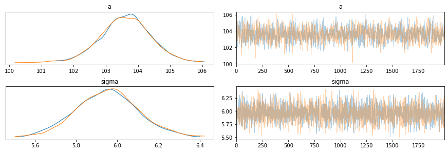

```python
az.plot_forest(az_m4_7, var_names=["w"], combined=True)
plt.show()
```

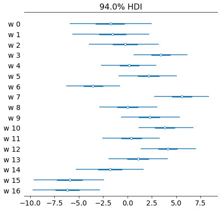

```python
wp = trace_m4_7["w"].mean(0)

spline_df = (
    pd.DataFrame(B * wp.T)
    .assign(year=d2.year.values)
    .melt("year", var_name="spline_i", value_name="value")
)

spline_df_merged = (
    pd.DataFrame(np.dot(B, wp.T))
    .assign(year=d2.year.values)
    .melt("year", var_name="spline_i", value_name="value")
)

(
    gg.ggplot(spline_df, gg.aes(x="year", y="value"))
    + gg.geom_vline(xintercept=knot_list, color="gray", alpha=0.5)
    + gg.geom_line(data=spline_df_merged, linetype="-", color="blue", size=2, alpha=0.7)
    + gg.geom_line(gg.aes(group="spline_i", color="spline_i"), alpha=0.7, size=1)
    + gg.scale_color_discrete(guide=gg.guide_legend(ncol=2), color_space="husl")
    + gg.theme(figure_size=(10, 5))
    + gg.labs(x="year", y="basis", title="Fit spline", color="spline idx")
)
```

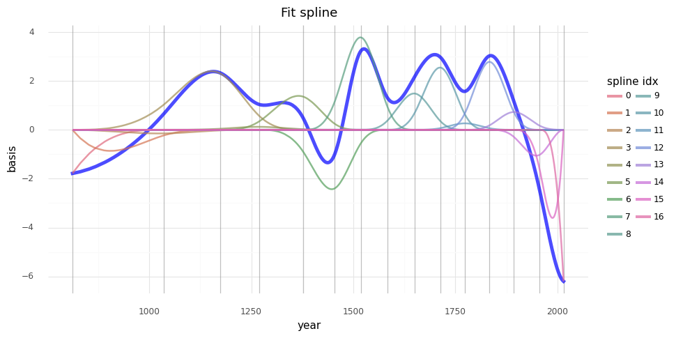

    <ggplot: (8749125268255)>

```python
post_pred = az.summary(az_m4_7, var_names=["mu"]).reset_index(drop=True)
d2_post = d2.copy().reset_index(drop=True)
d2_post["pred_mean"] = post_pred["mean"]
d2_post["pred_hdi_lower"] = post_pred["hdi_3%"]
d2_post["pred_hdi_upper"] = post_pred["hdi_97%"]
```

```python
(
    gg.ggplot(d2_post, gg.aes(x="year"))
    + gg.geom_ribbon(
        gg.aes(ymin="pred_hdi_lower", ymax="pred_hdi_upper"), alpha=0.3, fill="tomato"
    )
    + gg.geom_line(gg.aes(y="pred_mean"), color="firebrick", alpha=1, size=2)
    + gg.geom_point(gg.aes(y="doy"), color="black", alpha=0.4, size=1.3)
    + gg.geom_vline(xintercept=knot_list, color="gray", alpha=0.8)
    + gg.theme(figure_size=(10, 5))
    + gg.labs(
        x="year",
        y="days of year",
        title="Cherry blossom data with posterior predictions",
    )
)
```

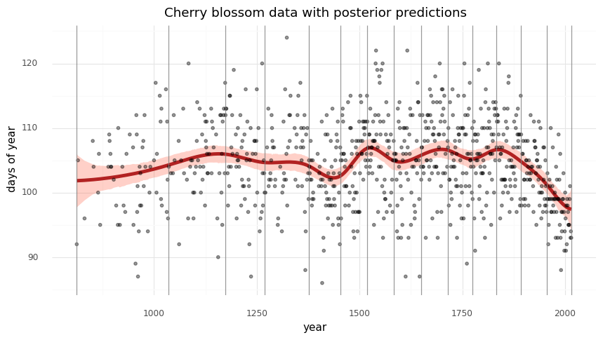

    <ggplot: (8749091940660)>

## Example with gene CN data of a single gene

```python
modeling_data = pd.read_csv(modeling_data_path)
modeling_data.head(n=7)
```

<div>
<style scoped>
    .dataframe tbody tr th:only-of-type {
        vertical-align: middle;
    }

    .dataframe tbody tr th {
        vertical-align: top;
    }

    .dataframe thead th {
        text-align: right;
    }
</style>
<table border="1" class="dataframe">
  <thead>
    <tr style="text-align: right;">
      <th></th>
      <th>sgrna</th>
      <th>replicate_id</th>
      <th>lfc</th>
      <th>pdna_batch</th>
      <th>passes_qc</th>
      <th>depmap_id</th>
      <th>primary_or_metastasis</th>
      <th>lineage</th>
      <th>lineage_subtype</th>
      <th>kras_mutation</th>
      <th>...</th>
      <th>log2_gene_cn_p1</th>
      <th>gene_cn</th>
      <th>n_muts</th>
      <th>any_deleterious</th>
      <th>variant_classification</th>
      <th>is_deleterious</th>
      <th>is_tcga_hotspot</th>
      <th>is_cosmic_hotspot</th>
      <th>mutated_at_guide_location</th>
      <th>rna_expr</th>
    </tr>
  </thead>
  <tbody>
    <tr>
      <th>0</th>
      <td>AAGAGGCCGGTCAAATTCAG</td>
      <td>42-mg-ba-311cas9_repa_p6_batch3</td>
      <td>-0.405499</td>
      <td>3</td>
      <td>True</td>
      <td>ACH-000323</td>
      <td>Primary</td>
      <td>central_nervous_system</td>
      <td>glioma</td>
      <td>WT</td>
      <td>...</td>
      <td>0.845287</td>
      <td>1.328646</td>
      <td>0</td>
      <td>False</td>
      <td>NaN</td>
      <td>NaN</td>
      <td>NaN</td>
      <td>NaN</td>
      <td>False</td>
      <td>1.263034</td>
    </tr>
    <tr>
      <th>1</th>
      <td>AATCAACCCACAGCTGCACA</td>
      <td>42-mg-ba-311cas9_repa_p6_batch3</td>
      <td>-0.133541</td>
      <td>3</td>
      <td>True</td>
      <td>ACH-000323</td>
      <td>Primary</td>
      <td>central_nervous_system</td>
      <td>glioma</td>
      <td>WT</td>
      <td>...</td>
      <td>0.827398</td>
      <td>1.287359</td>
      <td>2</td>
      <td>False</td>
      <td>missense_mutation;missense_mutation</td>
      <td>FALSE;FALSE</td>
      <td>TRUE;TRUE</td>
      <td>TRUE;TRUE</td>
      <td>False</td>
      <td>5.220330</td>
    </tr>
    <tr>
      <th>2</th>
      <td>AATTACTACTTGCTTCCTGT</td>
      <td>42-mg-ba-311cas9_repa_p6_batch3</td>
      <td>-0.491495</td>
      <td>3</td>
      <td>True</td>
      <td>ACH-000323</td>
      <td>Primary</td>
      <td>central_nervous_system</td>
      <td>glioma</td>
      <td>WT</td>
      <td>...</td>
      <td>0.879280</td>
      <td>1.409165</td>
      <td>0</td>
      <td>False</td>
      <td>NaN</td>
      <td>NaN</td>
      <td>NaN</td>
      <td>NaN</td>
      <td>False</td>
      <td>3.008989</td>
    </tr>
    <tr>
      <th>3</th>
      <td>ACCTGTATGACGAAACCGTG</td>
      <td>42-mg-ba-311cas9_repa_p6_batch3</td>
      <td>-0.015850</td>
      <td>3</td>
      <td>True</td>
      <td>ACH-000323</td>
      <td>Primary</td>
      <td>central_nervous_system</td>
      <td>glioma</td>
      <td>WT</td>
      <td>...</td>
      <td>0.818549</td>
      <td>1.267208</td>
      <td>0</td>
      <td>False</td>
      <td>NaN</td>
      <td>NaN</td>
      <td>NaN</td>
      <td>NaN</td>
      <td>False</td>
      <td>4.083213</td>
    </tr>
    <tr>
      <th>4</th>
      <td>ACTCTGTTCCTTCATCTCCG</td>
      <td>42-mg-ba-311cas9_repa_p6_batch3</td>
      <td>-0.530277</td>
      <td>3</td>
      <td>True</td>
      <td>ACH-000323</td>
      <td>Primary</td>
      <td>central_nervous_system</td>
      <td>glioma</td>
      <td>WT</td>
      <td>...</td>
      <td>0.990378</td>
      <td>1.692253</td>
      <td>0</td>
      <td>False</td>
      <td>NaN</td>
      <td>NaN</td>
      <td>NaN</td>
      <td>NaN</td>
      <td>False</td>
      <td>5.822730</td>
    </tr>
    <tr>
      <th>5</th>
      <td>ACTGCTGCGGGAATTCCAAG</td>
      <td>42-mg-ba-311cas9_repa_p6_batch3</td>
      <td>0.778827</td>
      <td>3</td>
      <td>True</td>
      <td>ACH-000323</td>
      <td>Primary</td>
      <td>central_nervous_system</td>
      <td>glioma</td>
      <td>WT</td>
      <td>...</td>
      <td>0.818549</td>
      <td>1.267208</td>
      <td>0</td>
      <td>False</td>
      <td>NaN</td>
      <td>NaN</td>
      <td>NaN</td>
      <td>NaN</td>
      <td>False</td>
      <td>4.083213</td>
    </tr>
    <tr>
      <th>6</th>
      <td>AGACACTTATACTATGAAAG</td>
      <td>42-mg-ba-311cas9_repa_p6_batch3</td>
      <td>0.035950</td>
      <td>3</td>
      <td>True</td>
      <td>ACH-000323</td>
      <td>Primary</td>
      <td>central_nervous_system</td>
      <td>glioma</td>
      <td>WT</td>
      <td>...</td>
      <td>0.872323</td>
      <td>1.392463</td>
      <td>0</td>
      <td>False</td>
      <td>NaN</td>
      <td>NaN</td>
      <td>NaN</td>
      <td>NaN</td>
      <td>False</td>
      <td>3.701549</td>
    </tr>
  </tbody>
</table>
<p>7 rows × 27 columns</p>
</div>

### A "well-behaved" gene: *PTK2*

```python
np.random.seed(RANDOM_SEED)
ptk2_data = modeling_data[modeling_data.hugo_symbol == "PTK2"]

(
    gg.ggplot(ptk2_data, gg.aes(x="gene_cn", y="lfc"))
    + gg.geom_density_2d(color="black", alpha=0.8, size=1, linetype="--")
    + gg.geom_point(size=0.4, alpha=0.2, color="navy")
    + gg.geom_smooth(method="lm")
    + gg.labs(x="gene copy number", y="logFC", title="PTK2")
)
```

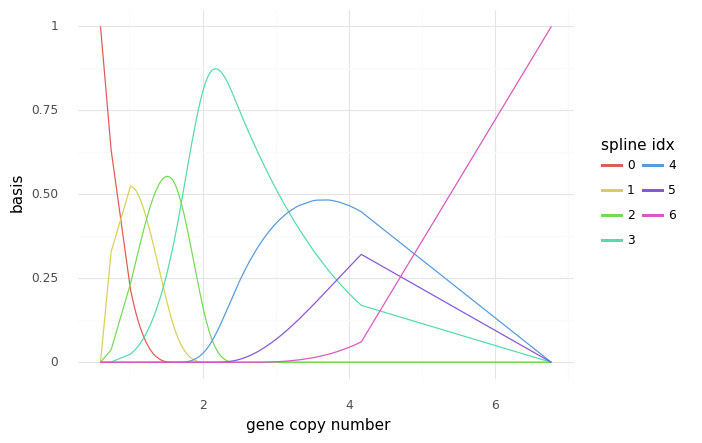

    <ggplot: (8749092018815)>

```python
ptk2_data.shape[0]
```

    2332

```python
cn_num_knots = 5
cn_knot_list = np.quantile(ptk2_data.gene_cn, np.linspace(0, 1, cn_num_knots))

ptk2_B = dmatrix(
    "bs(x, knots=knots, degree=3, include_intercept=True) - 1",
    {"x": ptk2_data.gene_cn, "knots": cn_knot_list[1:-1]},
)

print(cn_knot_list)
```

    [0.60396783 1.67270427 2.08756486 2.53427991 6.7709577 ]

```python
ptk2_spline_df = (
    pd.DataFrame(ptk2_B)
    .assign(gene_cn=ptk2_data.gene_cn.values)
    .melt("gene_cn", var_name="spline_i", value_name="value")
)

(
    gg.ggplot(ptk2_spline_df, gg.aes(x="gene_cn", y="value"))
    + gg.geom_line(gg.aes(group="spline_i", color="spline_i"))
    + gg.scale_color_discrete(guide=gg.guide_legend(ncol=2))
    + gg.labs(x="gene copy number", y="basis", color="spline idx")
)
```


    <ggplot: (8749091940765)>

```python
with pm.Model() as m_ptk2:
    a = pm.Normal("a", mu=0, sd=2)
    w = pm.Normal("w", mu=-0.5, sd=1, shape=ptk2_B.shape[1])
    mu = pm.Deterministic("mu", a + pm.math.dot(np.asarray(ptk2_B, order="F"), w.T))
    sigma = pm.Exponential("sigma", 1)
    D = pm.Normal("D", mu, sigma, observed=ptk2_data.lfc)
```

```python
pm.model_to_graphviz(m_ptk2)
```

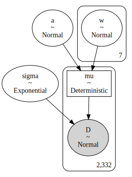

```python
with m_ptk2:
    prior_pc = pm.sample_prior_predictive(random_seed=RANDOM_SEED)
    trace_m_ptk2 = pm.sample(3000, tune=2000, chains=2, random_seed=RANDOM_SEED)
    post_pc = pm.sample_posterior_predictive(trace_m_ptk2, random_seed=RANDOM_SEED)
```

    Auto-assigning NUTS sampler...
    Initializing NUTS using jitter+adapt_diag...
    Multiprocess sampling (2 chains in 4 jobs)
    NUTS: [sigma, w, a]

<div>
    <style>
        /*Turns off some styling*/
        progress {
            /*gets rid of default border in Firefox and Opera.*/
            border: none;
            /*Needs to be in here for Safari polyfill so background images work as expected.*/
            background-size: auto;
        }
        .progress-bar-interrupted, .progress-bar-interrupted::-webkit-progress-bar {
            background: #F44336;
        }
    </style>
  <progress value='10000' class='' max='10000' style='width:300px; height:20px; vertical-align: middle;'></progress>
  100.00% [10000/10000 00:58<00:00 Sampling 2 chains, 163 divergences]
</div>

    Sampling 2 chains for 2_000 tune and 3_000 draw iterations (4_000 + 6_000 draws total) took 58 seconds.
    There were 163 divergences after tuning. Increase `target_accept` or reparameterize.
    The number of effective samples is smaller than 25% for some parameters.

<div>
    <style>
        /*Turns off some styling*/
        progress {
            /*gets rid of default border in Firefox and Opera.*/
            border: none;
            /*Needs to be in here for Safari polyfill so background images work as expected.*/
            background-size: auto;
        }
        .progress-bar-interrupted, .progress-bar-interrupted::-webkit-progress-bar {
            background: #F44336;
        }
    </style>
  <progress value='6000' class='' max='6000' style='width:300px; height:20px; vertical-align: middle;'></progress>
  100.00% [6000/6000 00:08<00:00]
</div>

```python
az_ptk2 = az.from_pymc3(
    model=m_ptk2, trace=trace_m_ptk2, posterior_predictive=post_pc, prior=prior_pc
)
```

```python
post_pred = az.summary(az_ptk2, var_names=["mu"]).reset_index(drop=True)
ptk2_post = ptk2_data.copy().reset_index(drop=True)
ptk2_post["pred_mean"] = post_pred["mean"]
ptk2_post["pred_hdi_lower"] = post_pred["hdi_3%"]
ptk2_post["pred_hdi_upper"] = post_pred["hdi_97%"]
ptk2_post.head()
```

<div>
<style scoped>
    .dataframe tbody tr th:only-of-type {
        vertical-align: middle;
    }

    .dataframe tbody tr th {
        vertical-align: top;
    }

    .dataframe thead th {
        text-align: right;
    }
</style>
<table border="1" class="dataframe">
  <thead>
    <tr style="text-align: right;">
      <th></th>
      <th>sgrna</th>
      <th>replicate_id</th>
      <th>lfc</th>
      <th>pdna_batch</th>
      <th>passes_qc</th>
      <th>depmap_id</th>
      <th>primary_or_metastasis</th>
      <th>lineage</th>
      <th>lineage_subtype</th>
      <th>kras_mutation</th>
      <th>...</th>
      <th>any_deleterious</th>
      <th>variant_classification</th>
      <th>is_deleterious</th>
      <th>is_tcga_hotspot</th>
      <th>is_cosmic_hotspot</th>
      <th>mutated_at_guide_location</th>
      <th>rna_expr</th>
      <th>pred_mean</th>
      <th>pred_hdi_lower</th>
      <th>pred_hdi_upper</th>
    </tr>
  </thead>
  <tbody>
    <tr>
      <th>0</th>
      <td>ATATGGCTGACCTAATAGAT</td>
      <td>42-mg-ba-311cas9_repa_p6_batch3</td>
      <td>-0.723507</td>
      <td>3</td>
      <td>True</td>
      <td>ACH-000323</td>
      <td>Primary</td>
      <td>central_nervous_system</td>
      <td>glioma</td>
      <td>WT</td>
      <td>...</td>
      <td>False</td>
      <td>NaN</td>
      <td>NaN</td>
      <td>NaN</td>
      <td>NaN</td>
      <td>False</td>
      <td>5.878235</td>
      <td>-0.645</td>
      <td>-0.685</td>
      <td>-0.605</td>
    </tr>
    <tr>
      <th>1</th>
      <td>CGATCATACTGGGAGATGCG</td>
      <td>42-mg-ba-311cas9_repa_p6_batch3</td>
      <td>-0.445568</td>
      <td>3</td>
      <td>True</td>
      <td>ACH-000323</td>
      <td>Primary</td>
      <td>central_nervous_system</td>
      <td>glioma</td>
      <td>WT</td>
      <td>...</td>
      <td>False</td>
      <td>NaN</td>
      <td>NaN</td>
      <td>NaN</td>
      <td>NaN</td>
      <td>False</td>
      <td>5.878235</td>
      <td>-0.645</td>
      <td>-0.685</td>
      <td>-0.605</td>
    </tr>
    <tr>
      <th>2</th>
      <td>GCGAGGTTCCATTCACCAGC</td>
      <td>42-mg-ba-311cas9_repa_p6_batch3</td>
      <td>-0.429098</td>
      <td>3</td>
      <td>True</td>
      <td>ACH-000323</td>
      <td>Primary</td>
      <td>central_nervous_system</td>
      <td>glioma</td>
      <td>WT</td>
      <td>...</td>
      <td>False</td>
      <td>NaN</td>
      <td>NaN</td>
      <td>NaN</td>
      <td>NaN</td>
      <td>False</td>
      <td>5.878235</td>
      <td>-0.645</td>
      <td>-0.685</td>
      <td>-0.605</td>
    </tr>
    <tr>
      <th>3</th>
      <td>GGAGGTTCACTGGCTTCACG</td>
      <td>42-mg-ba-311cas9_repa_p6_batch3</td>
      <td>-0.485250</td>
      <td>3</td>
      <td>True</td>
      <td>ACH-000323</td>
      <td>Primary</td>
      <td>central_nervous_system</td>
      <td>glioma</td>
      <td>WT</td>
      <td>...</td>
      <td>False</td>
      <td>NaN</td>
      <td>NaN</td>
      <td>NaN</td>
      <td>NaN</td>
      <td>False</td>
      <td>5.878235</td>
      <td>-0.645</td>
      <td>-0.685</td>
      <td>-0.605</td>
    </tr>
    <tr>
      <th>4</th>
      <td>ATATGGCTGACCTAATAGAT</td>
      <td>42-mg-ba-311cas9_repb_p6_batch3</td>
      <td>-0.889930</td>
      <td>3</td>
      <td>True</td>
      <td>ACH-000323</td>
      <td>Primary</td>
      <td>central_nervous_system</td>
      <td>glioma</td>
      <td>WT</td>
      <td>...</td>
      <td>False</td>
      <td>NaN</td>
      <td>NaN</td>
      <td>NaN</td>
      <td>NaN</td>
      <td>False</td>
      <td>5.878235</td>
      <td>-0.645</td>
      <td>-0.685</td>
      <td>-0.605</td>
    </tr>
  </tbody>
</table>
<p>5 rows × 30 columns</p>
</div>

```python
(
    gg.ggplot(ptk2_post, gg.aes(x="gene_cn"))
    + gg.geom_point(gg.aes(y="lfc"), color="black", alpha=0.4, size=1.3)
    + gg.geom_vline(xintercept=cn_knot_list, color="gray", alpha=0.8)
    + gg.geom_ribbon(
        gg.aes(ymin="pred_hdi_lower", ymax="pred_hdi_upper"), alpha=0.3, fill="tomato"
    )
    + gg.geom_line(gg.aes(y="pred_mean"), color="firebrick", alpha=1, size=2)
    + gg.theme(figure_size=(10, 5))
    + gg.labs(
        x="gene copy number",
        y="logFC",
        title="Posterior predictions with PTK2 gene copy number data",
    )
)
```

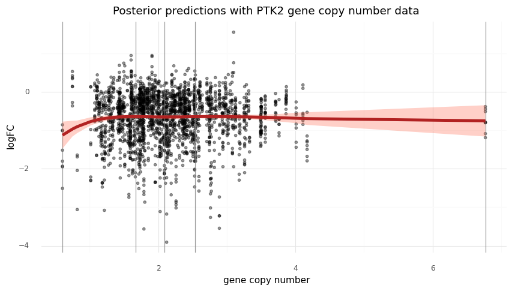

    <ggplot: (8749092142403)>

### A "misbehaved" gene: *MDM2*

In the original Meyers *et al.* (2017) paper, the spline function for each cell line was created with 25 slope coefficients.
The first was automatically pinned to copy number = 0 and the rest were determed using average linkage clustering (a form a hierarhcical clustering) of copy number data for each cell line.
I want to mimic this effect here, but will use the copy number data of all of the genes in the modeling data sub-sample to determine the knots and then fit the model with the data from *MDM2*, a gene was some strong extemes for copy number.

```python
np.random.seed(RANDOM_SEED)
mdm2_data = modeling_data.copy()[modeling_data.hugo_symbol == "MDM2"]
mdm2_data["log_gene_cn"] = np.log10(mdm2_data.gene_cn.values)
(
    gg.ggplot(mdm2_data, gg.aes(x="log_gene_cn", y="lfc"))
    + gg.geom_density_2d(color="black", alpha=0.8, size=1, linetype="--")
    + gg.geom_point(size=0.4, alpha=0.2, color="navy")
    + gg.geom_smooth(method="lm")
    + gg.labs(x="gene copy number (log10)", y="logFC", title="MDM2")
)
```

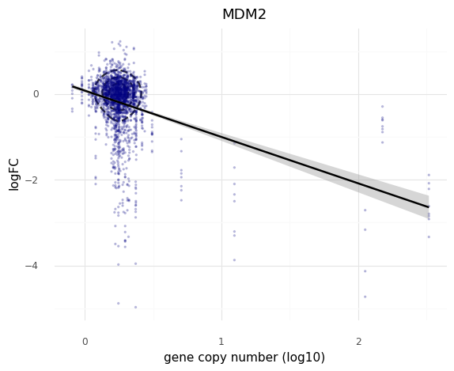

    <ggplot: (8749092142400)>

```python
mdm2_data.shape[0]
```

    2332

```python
cn_num_knots = 5
gene_cn_data = (
    modeling_data[["depmap_id", "hugo_symbol", "gene_cn"]]
    .drop_duplicates()
    .reset_index(drop=True)
)
cn_knot_list = np.quantile(gene_cn_data.gene_cn, np.linspace(0, 1, cn_num_knots))

mdm2_B = dmatrix(
    "bs(x, knots=knots, degree=3, include_intercept=True) - 1",
    {"x": mdm2_data.gene_cn, "knots": cn_knot_list[1:-1]},
)

print([np.round(a, 2) for a in cn_knot_list])
```

    [0.0, 1.44, 1.73, 2.03, 328.39]

```python
mdm2_spline_df = (
    pd.DataFrame(mdm2_B)
    .assign(gene_cn=mdm2_data.gene_cn.values)
    .melt("gene_cn", var_name="spline_i", value_name="value")
)

(
    gg.ggplot(mdm2_spline_df, gg.aes(x="gene_cn", y="value"))
    + gg.geom_line(gg.aes(group="spline_i", color="spline_i"))
    + gg.scale_color_discrete(guide=gg.guide_legend(ncol=2))
    + gg.scale_x_continuous(trans="log")
    + gg.labs(x="gene copy number (log)", y="basis", color="spline idx")
)
```

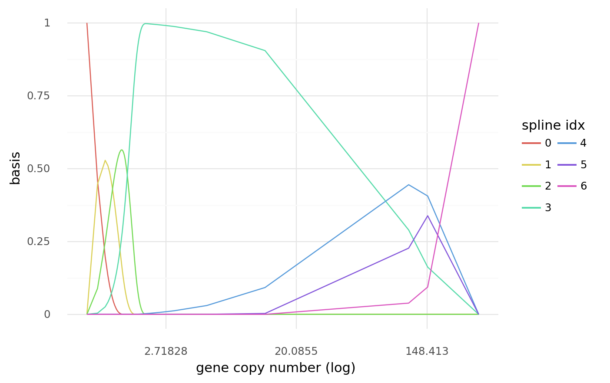

    <ggplot: (8749118253445)>

```python
with pm.Model() as m_mdm2:
    a = pm.Normal("a", mu=0, sd=2)
    w = pm.Normal("w", mu=-0.5, sd=1, shape=mdm2_B.shape[1])
    mu = pm.Deterministic("mu", a + pm.math.dot(np.asarray(mdm2_B, order="F"), w.T))
    sigma = pm.Exponential("sigma", 1)
    D = pm.Normal("D", mu, sigma, observed=mdm2_data.lfc)
```

```python
pm.model_to_graphviz(m_mdm2)
```


```python
with m_mdm2:
    prior_pc = pm.sample_prior_predictive(random_seed=RANDOM_SEED)
    trace_m_mdm2 = pm.sample(3000, tune=3000, chains=2, random_seed=RANDOM_SEED)
    post_pc = pm.sample_posterior_predictive(trace_m_mdm2, random_seed=RANDOM_SEED)
```

    Auto-assigning NUTS sampler...
    Initializing NUTS using jitter+adapt_diag...
    Multiprocess sampling (2 chains in 4 jobs)
    NUTS: [sigma, w, a]

<div>
    <style>
        /*Turns off some styling*/
        progress {
            /*gets rid of default border in Firefox and Opera.*/
            border: none;
            /*Needs to be in here for Safari polyfill so background images work as expected.*/
            background-size: auto;
        }
        .progress-bar-interrupted, .progress-bar-interrupted::-webkit-progress-bar {
            background: #F44336;
        }
    </style>
  <progress value='12000' class='' max='12000' style='width:300px; height:20px; vertical-align: middle;'></progress>
  100.00% [12000/12000 01:20<00:00 Sampling 2 chains, 15 divergences]
</div>

    Sampling 2 chains for 3_000 tune and 3_000 draw iterations (6_000 + 6_000 draws total) took 81 seconds.
    There were 15 divergences after tuning. Increase `target_accept` or reparameterize.
    The number of effective samples is smaller than 25% for some parameters.

<div>
    <style>
        /*Turns off some styling*/
        progress {
            /*gets rid of default border in Firefox and Opera.*/
            border: none;
            /*Needs to be in here for Safari polyfill so background images work as expected.*/
            background-size: auto;
        }
        .progress-bar-interrupted, .progress-bar-interrupted::-webkit-progress-bar {
            background: #F44336;
        }
    </style>
  <progress value='6000' class='' max='6000' style='width:300px; height:20px; vertical-align: middle;'></progress>
  100.00% [6000/6000 00:08<00:00]
</div>

```python
az_mdm2 = az.from_pymc3(
    model=m_mdm2, trace=trace_m_mdm2, posterior_predictive=post_pc, prior=prior_pc
)
```

```python
az.plot_trace(az_mdm2, var_names=["a", "sigma"])
plt.show()
```

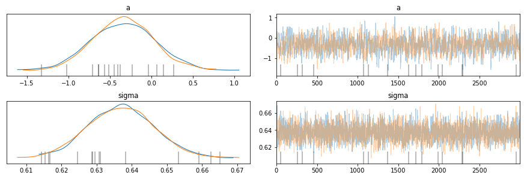

```python
post_pred = az.summary(az_mdm2, var_names=["mu"]).reset_index(drop=True)
mdm2_post = mdm2_data.copy().reset_index(drop=True)
mdm2_post["pred_mean"] = post_pred["mean"]
mdm2_post["pred_hdi_lower"] = post_pred["hdi_3%"]
mdm2_post["pred_hdi_upper"] = post_pred["hdi_97%"]
mdm2_post.head()
```

<div>
<style scoped>
    .dataframe tbody tr th:only-of-type {
        vertical-align: middle;
    }

    .dataframe tbody tr th {
        vertical-align: top;
    }

    .dataframe thead th {
        text-align: right;
    }
</style>
<table border="1" class="dataframe">
  <thead>
    <tr style="text-align: right;">
      <th></th>
      <th>sgrna</th>
      <th>replicate_id</th>
      <th>lfc</th>
      <th>pdna_batch</th>
      <th>passes_qc</th>
      <th>depmap_id</th>
      <th>primary_or_metastasis</th>
      <th>lineage</th>
      <th>lineage_subtype</th>
      <th>kras_mutation</th>
      <th>...</th>
      <th>variant_classification</th>
      <th>is_deleterious</th>
      <th>is_tcga_hotspot</th>
      <th>is_cosmic_hotspot</th>
      <th>mutated_at_guide_location</th>
      <th>rna_expr</th>
      <th>log_gene_cn</th>
      <th>pred_mean</th>
      <th>pred_hdi_lower</th>
      <th>pred_hdi_upper</th>
    </tr>
  </thead>
  <tbody>
    <tr>
      <th>0</th>
      <td>AGACACTTATACTATGAAAG</td>
      <td>42-mg-ba-311cas9_repa_p6_batch3</td>
      <td>0.035950</td>
      <td>3</td>
      <td>True</td>
      <td>ACH-000323</td>
      <td>Primary</td>
      <td>central_nervous_system</td>
      <td>glioma</td>
      <td>WT</td>
      <td>...</td>
      <td>NaN</td>
      <td>NaN</td>
      <td>NaN</td>
      <td>NaN</td>
      <td>False</td>
      <td>3.701549</td>
      <td>0.143784</td>
      <td>0.003</td>
      <td>-0.053</td>
      <td>0.058</td>
    </tr>
    <tr>
      <th>1</th>
      <td>AGTTACTGTGTATCAGGCAG</td>
      <td>42-mg-ba-311cas9_repa_p6_batch3</td>
      <td>0.059690</td>
      <td>3</td>
      <td>True</td>
      <td>ACH-000323</td>
      <td>Primary</td>
      <td>central_nervous_system</td>
      <td>glioma</td>
      <td>WT</td>
      <td>...</td>
      <td>NaN</td>
      <td>NaN</td>
      <td>NaN</td>
      <td>NaN</td>
      <td>False</td>
      <td>3.701549</td>
      <td>0.143784</td>
      <td>0.003</td>
      <td>-0.053</td>
      <td>0.058</td>
    </tr>
    <tr>
      <th>2</th>
      <td>GTTCTTGTCCTTCTTCACTA</td>
      <td>42-mg-ba-311cas9_repa_p6_batch3</td>
      <td>0.148150</td>
      <td>3</td>
      <td>True</td>
      <td>ACH-000323</td>
      <td>Primary</td>
      <td>central_nervous_system</td>
      <td>glioma</td>
      <td>WT</td>
      <td>...</td>
      <td>NaN</td>
      <td>NaN</td>
      <td>NaN</td>
      <td>NaN</td>
      <td>False</td>
      <td>3.701549</td>
      <td>0.143784</td>
      <td>0.003</td>
      <td>-0.053</td>
      <td>0.058</td>
    </tr>
    <tr>
      <th>3</th>
      <td>TTGCAATGTGATGGAAGGGG</td>
      <td>42-mg-ba-311cas9_repa_p6_batch3</td>
      <td>-0.102953</td>
      <td>3</td>
      <td>True</td>
      <td>ACH-000323</td>
      <td>Primary</td>
      <td>central_nervous_system</td>
      <td>glioma</td>
      <td>WT</td>
      <td>...</td>
      <td>NaN</td>
      <td>NaN</td>
      <td>NaN</td>
      <td>NaN</td>
      <td>False</td>
      <td>3.701549</td>
      <td>0.143784</td>
      <td>0.003</td>
      <td>-0.053</td>
      <td>0.058</td>
    </tr>
    <tr>
      <th>4</th>
      <td>AGACACTTATACTATGAAAG</td>
      <td>42-mg-ba-311cas9_repb_p6_batch3</td>
      <td>-0.469799</td>
      <td>3</td>
      <td>True</td>
      <td>ACH-000323</td>
      <td>Primary</td>
      <td>central_nervous_system</td>
      <td>glioma</td>
      <td>WT</td>
      <td>...</td>
      <td>NaN</td>
      <td>NaN</td>
      <td>NaN</td>
      <td>NaN</td>
      <td>False</td>
      <td>3.701549</td>
      <td>0.143784</td>
      <td>0.003</td>
      <td>-0.053</td>
      <td>0.058</td>
    </tr>
  </tbody>
</table>
<p>5 rows × 31 columns</p>
</div>

```python
(
    gg.ggplot(mdm2_post, gg.aes(x="gene_cn"))
    + gg.geom_point(gg.aes(y="lfc"), color="black", alpha=0.4, size=1.3)
    + gg.geom_vline(xintercept=cn_knot_list, color="gray", alpha=0.8)
    + gg.geom_ribbon(
        gg.aes(ymin="pred_hdi_lower", ymax="pred_hdi_upper"), alpha=0.3, fill="tomato"
    )
    + gg.geom_line(gg.aes(y="pred_mean"), color="firebrick", alpha=1, size=2)
    + gg.theme(figure_size=(10, 5))
    + gg.scale_x_continuous()
    + gg.labs(
        x="gene copy number",
        y="logFC",
        title="Posterior predictions with MDM2 gene copy number data",
    )
)
```

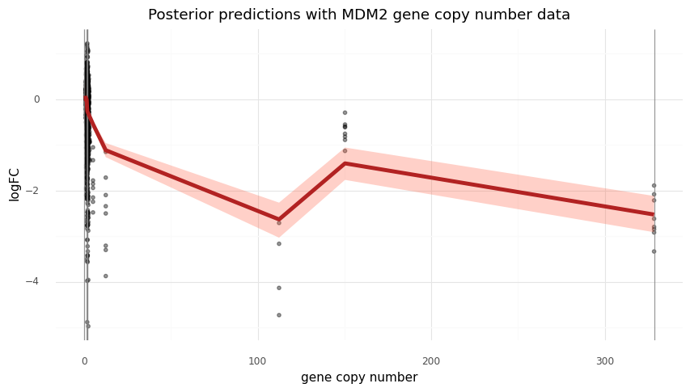

    <ggplot: (8749118234242)>

```python
(
    gg.ggplot(mdm2_post, gg.aes(x="gene_cn"))
    + gg.geom_point(gg.aes(y="lfc"), color="black", alpha=0.4, size=1.3)
    + gg.geom_vline(xintercept=cn_knot_list, color="gray", alpha=0.8)
    + gg.geom_ribbon(
        gg.aes(ymin="pred_hdi_lower", ymax="pred_hdi_upper"), alpha=0.3, fill="tomato"
    )
    + gg.geom_line(gg.aes(y="pred_mean"), color="firebrick", alpha=1, size=2)
    + gg.theme(figure_size=(10, 5))
    + gg.scale_x_continuous(limits=(0.5, 3.4))
    + gg.labs(
        x="gene copy number",
        y="logFC",
        title="Posterior predictions with MDM2 gene copy number data (zoomed)",
    )
)
```


    <ggplot: (8749103721328)>

### Multi-level

How to do this with multiple levels?
The original 2017 paper created a spline function for each cell line.
I think the only change would be to have an additional index on `w` and keep all of the `B` matrices in a list that gets indexed, too.

```python
modeling_data2 = pd.read_csv(modeling_data2_path)

for col in ["depmap_id", "hugo_symbol", "sgrna"]:
    modeling_data2[col] = pd.Categorical(modeling_data2[col], ordered=True)

modeling_data2.head(n=7)
```

<div>
<style scoped>
    .dataframe tbody tr th:only-of-type {
        vertical-align: middle;
    }

    .dataframe tbody tr th {
        vertical-align: top;
    }

    .dataframe thead th {
        text-align: right;
    }
</style>
<table border="1" class="dataframe">
  <thead>
    <tr style="text-align: right;">
      <th></th>
      <th>sgrna</th>
      <th>replicate_id</th>
      <th>lfc</th>
      <th>pdna_batch</th>
      <th>passes_qc</th>
      <th>depmap_id</th>
      <th>primary_or_metastasis</th>
      <th>lineage</th>
      <th>lineage_subtype</th>
      <th>kras_mutation</th>
      <th>...</th>
      <th>log2_gene_cn_p1</th>
      <th>gene_cn</th>
      <th>n_muts</th>
      <th>any_deleterious</th>
      <th>variant_classification</th>
      <th>is_deleterious</th>
      <th>is_tcga_hotspot</th>
      <th>is_cosmic_hotspot</th>
      <th>mutated_at_guide_location</th>
      <th>rna_expr</th>
    </tr>
  </thead>
  <tbody>
    <tr>
      <th>0</th>
      <td>AAAACCCAGGAAATTAGCAA</td>
      <td>dkmg-311cas9_repa_p5_batch3</td>
      <td>0.205242</td>
      <td>3</td>
      <td>True</td>
      <td>ACH-000244</td>
      <td>Primary</td>
      <td>central_nervous_system</td>
      <td>glioma</td>
      <td>WT</td>
      <td>...</td>
      <td>1.010773</td>
      <td>1.747725</td>
      <td>0</td>
      <td>False</td>
      <td>NaN</td>
      <td>NaN</td>
      <td>NaN</td>
      <td>NaN</td>
      <td>False</td>
      <td>6.130931</td>
    </tr>
    <tr>
      <th>1</th>
      <td>AAAAGTCCACCAGAGCCATG</td>
      <td>dkmg-311cas9_repa_p5_batch3</td>
      <td>-0.079548</td>
      <td>3</td>
      <td>True</td>
      <td>ACH-000244</td>
      <td>Primary</td>
      <td>central_nervous_system</td>
      <td>glioma</td>
      <td>WT</td>
      <td>...</td>
      <td>0.988893</td>
      <td>1.688256</td>
      <td>0</td>
      <td>False</td>
      <td>NaN</td>
      <td>NaN</td>
      <td>NaN</td>
      <td>NaN</td>
      <td>False</td>
      <td>0.000000</td>
    </tr>
    <tr>
      <th>2</th>
      <td>AAACAACTATCATGAGCGCG</td>
      <td>dkmg-311cas9_repa_p5_batch3</td>
      <td>0.123618</td>
      <td>3</td>
      <td>True</td>
      <td>ACH-000244</td>
      <td>Primary</td>
      <td>central_nervous_system</td>
      <td>glioma</td>
      <td>WT</td>
      <td>...</td>
      <td>0.664765</td>
      <td>0.944034</td>
      <td>0</td>
      <td>False</td>
      <td>NaN</td>
      <td>NaN</td>
      <td>NaN</td>
      <td>NaN</td>
      <td>False</td>
      <td>6.034084</td>
    </tr>
    <tr>
      <th>3</th>
      <td>AAACCCTAAAGAAAACCCAG</td>
      <td>dkmg-311cas9_repa_p5_batch3</td>
      <td>-0.147315</td>
      <td>3</td>
      <td>True</td>
      <td>ACH-000244</td>
      <td>Primary</td>
      <td>central_nervous_system</td>
      <td>glioma</td>
      <td>WT</td>
      <td>...</td>
      <td>0.996234</td>
      <td>1.708064</td>
      <td>0</td>
      <td>False</td>
      <td>NaN</td>
      <td>NaN</td>
      <td>NaN</td>
      <td>NaN</td>
      <td>False</td>
      <td>3.790772</td>
    </tr>
    <tr>
      <th>4</th>
      <td>AAACCTGCTGATATTCCTGG</td>
      <td>dkmg-311cas9_repa_p5_batch3</td>
      <td>0.076666</td>
      <td>3</td>
      <td>True</td>
      <td>ACH-000244</td>
      <td>Primary</td>
      <td>central_nervous_system</td>
      <td>glioma</td>
      <td>WT</td>
      <td>...</td>
      <td>1.006521</td>
      <td>1.736065</td>
      <td>0</td>
      <td>False</td>
      <td>NaN</td>
      <td>NaN</td>
      <td>NaN</td>
      <td>NaN</td>
      <td>False</td>
      <td>0.000000</td>
    </tr>
    <tr>
      <th>5</th>
      <td>AAACGGTGCCTGTAAGTACG</td>
      <td>dkmg-311cas9_repa_p5_batch3</td>
      <td>0.141762</td>
      <td>3</td>
      <td>True</td>
      <td>ACH-000244</td>
      <td>Primary</td>
      <td>central_nervous_system</td>
      <td>glioma</td>
      <td>WT</td>
      <td>...</td>
      <td>1.094310</td>
      <td>1.987120</td>
      <td>0</td>
      <td>False</td>
      <td>NaN</td>
      <td>NaN</td>
      <td>NaN</td>
      <td>NaN</td>
      <td>False</td>
      <td>6.603775</td>
    </tr>
    <tr>
      <th>6</th>
      <td>AAACGTGCACGGTCCGGCCG</td>
      <td>dkmg-311cas9_repa_p5_batch3</td>
      <td>0.043855</td>
      <td>3</td>
      <td>True</td>
      <td>ACH-000244</td>
      <td>Primary</td>
      <td>central_nervous_system</td>
      <td>glioma</td>
      <td>WT</td>
      <td>...</td>
      <td>0.611721</td>
      <td>0.843602</td>
      <td>0</td>
      <td>False</td>
      <td>NaN</td>
      <td>NaN</td>
      <td>NaN</td>
      <td>NaN</td>
      <td>False</td>
      <td>0.344828</td>
    </tr>
  </tbody>
</table>
<p>7 rows × 27 columns</p>
</div>

```python
modeling_data2.shape
```

    (25922, 27)

```python
d = modeling_data2.copy()
d["gene_cn_max"] = [np.min((10.0, x)) for x in d.gene_cn]
(
    gg.ggplot(d, gg.aes(x="gene_cn_max"))
    + gg.facet_wrap("depmap_id", scales="free_y")
    + gg.geom_histogram(
        gg.aes(color="depmap_id", fill="depmap_id"), alpha=0.7, binwidth=1.0
    )
    + gg.scale_color_brewer(type="qual", palette="Dark2")
    + gg.scale_fill_brewer(type="qual", palette="Dark2")
    + gg.scale_x_continuous(breaks=list(range(12)), expand=(0, 0, 0, 0))
    + gg.theme(figure_size=(10, 8), subplots_adjust={"hspace": 0.4, "wspace": 0.3})
)
```

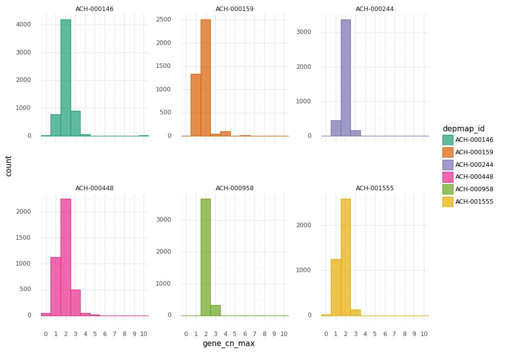

    <ggplot: (8749095826089)>

```python
(
    gg.ggplot(d, gg.aes(x="lfc"))
    + gg.facet_wrap("depmap_id", scales="free_y")
    + gg.geom_density(gg.aes(color="depmap_id", fill="depmap_id"), alpha=0.7)
    + gg.scale_color_brewer(type="qual", palette="Dark2")
    + gg.scale_fill_brewer(type="qual", palette="Dark2")
    + gg.theme(figure_size=(10, 8), subplots_adjust={"hspace": 0.4, "wspace": 0.3})
)
```

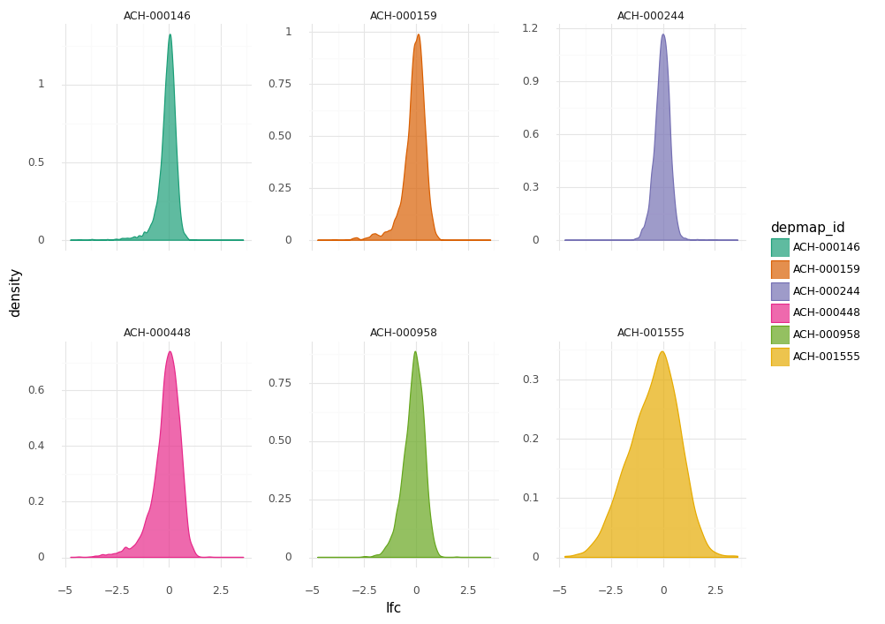

    <ggplot: (8749048536869)>

```python
d = modeling_data2.copy()
d["gene_cn_log"] = np.log2(d.gene_cn.values + 1)
(
    gg.ggplot(d, gg.aes(x="gene_cn_log", y="lfc"))
    + gg.facet_wrap("depmap_id", scales="free_y")
    + gg.geom_point(gg.aes(color="depmap_id"), alpha=0.4, size=0.2)
    + gg.scale_color_brewer(type="qual", palette="Dark2")
    + gg.scale_fill_brewer(type="qual", palette="Dark2")
    + gg.theme(figure_size=(10, 8), subplots_adjust={"hspace": 0.4, "wspace": 0.3})
)
```

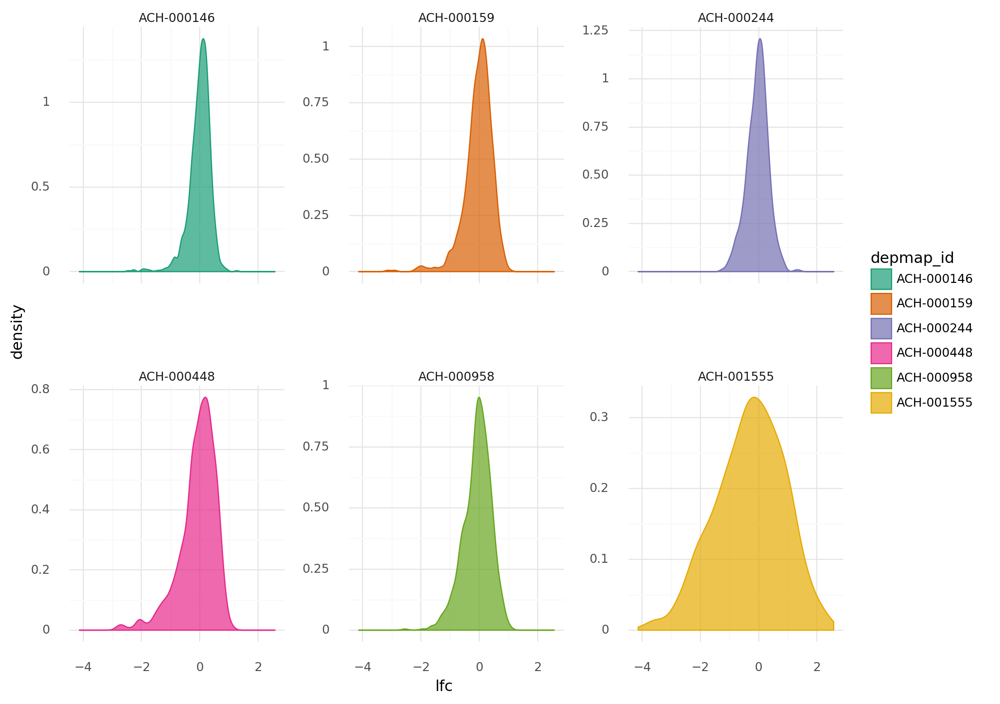

    <ggplot: (8749092323615)>

```python
(
    gg.ggplot(d, gg.aes(x="gene_cn", y="lfc"))
    + gg.facet_wrap("depmap_id", scales="free")
    + gg.geom_point(gg.aes(color="depmap_id"), alpha=0.4, size=0.2)
    + gg.geom_smooth(method="loess")
    + gg.scale_color_brewer(type="qual", palette="Dark2")
    + gg.scale_fill_brewer(type="qual", palette="Dark2")
    + gg.theme(figure_size=(10, 8), subplots_adjust={"hspace": 0.4, "wspace": 0.3})
)
```

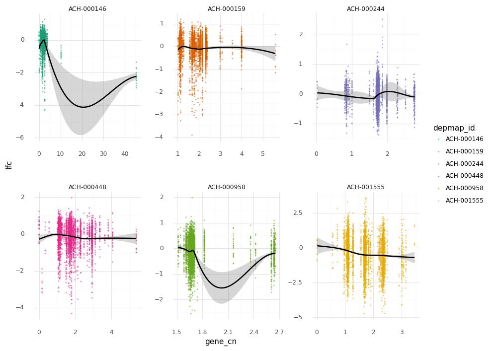

    <ggplot: (8749074684760)>

$
D_j \sim \mathcal{N}(\mu, \sigma) \\
\quad \mu_j = a + B[\text{cell line}] \bullet w[:, \text{cell line}] \\
\qquad a \sim \mathcal{N}(0, 2) \\
\qquad w \sim \mathcal{N}(-0.5, 1) \quad ||w|| = [\text{# knots}, \text{# cell lines}] \\
\quad \sigma \sim \text{Exp}(1)
$

```python
NUM_KNOTS = 10

B_cn_multi = []
for cell_line_i in modeling_data2.depmap_id.cat.categories:

    cell_line_df = modeling_data2.copy()[modeling_data2.depmap_id == cell_line_i]
    cell_line_df = cell_line_df.reset_index(drop=True)

    cell_cn_data = (
        cell_line_df[["depmap_id", "hugo_symbol", "gene_cn"]]
        .drop_duplicates()
        .reset_index(drop=True)
    )

    knot_list = np.quantile(cell_cn_data.gene_cn, np.linspace(0, 1, NUM_KNOTS))

    B = dmatrix(
        "bs(x, knots=knots, degree=3, include_intercept=True) - 1",
        {"x": cell_line_df.gene_cn, "knots": knot_list[1:-1]},
    )

    B_cn_multi.append(np.asarray(B, order="F"))
# B_cn_multi = np.asarray(B_cn_multi)
```

```python
for i, B in enumerate(B_cn_multi):
    print(f"B[{i}]: {B.shape[0]}, {B.shape[1]}")
```

    B[0]: 5982, 12
    B[1]: 3988, 12
    B[2]: 3988, 12
    B[3]: 3988, 12
    B[4]: 3988, 12
    B[5]: 3988, 12

```python
B_cn_multi_idx = []

for i, B in enumerate(B_cn_multi):
    start = int(np.sum([len(x) for x in B_cn_multi[0:i]]))
    length = len(B)
    B_cn_multi_idx.append(np.asarray(range(start, start + length), dtype=int))

B_cn_multi_idx = np.asarray(B_cn_multi_idx)[:, None]
B_cn_multi_idx.dtype
```

    dtype('O')

```python
B_cn_multi_cat = np.concatenate(B_cn_multi)
B_cn_multi_cat.shape
```

    (25922, 12)

*(Original model)*

```python
cell_line_idx = modeling_data2.depmap_id.cat.codes.to_numpy()
w_shape = (NUM_KNOTS + 2, len(np.unique(modeling_data2.depmap_id)))

with pm.Model() as m_cn_multi:
    # Priors
    a = pm.Normal("a", 0, 2)
    w = pm.Normal("w", -0.5, 1, shape=w_shape)

    # Linear model
    mu = pm.Deterministic(
        "mu", a + pm.math.dot(B_cn_multi[cell_line_idx], w[:, cell_line_idx])
    )
    sigma = pm.Exponential("sigma", 1)

    # Likelihood
    D = pm.Normal("D", mu, sigma, observed=modeling_data2.lfc)
```

```python
cell_line_idx = modeling_data2.depmap_id.cat.codes.to_numpy()
w_shape = (NUM_KNOTS + 2, len(np.unique(modeling_data2.depmap_id)))

with pm.Model() as m_cn_multi:
    # Priors
    a = pm.Normal("a", 0, 2)
    w = pm.Normal("w", -0.5, 1, shape=w_shape)

    # Linear model
    _mu = a

# Build `mu` for each group.
for cell_line_i in cell_line_idx:
    with m_cn_multi:
        _mu += pm.math.dot(B_cn_multi[cell_line_i], w[:, cell_line_i])

with m_cn_multi:
    mu = pm.Deterministic("mu", _mu)
    sigma = pm.Exponential("sigma", 1)

    # Likelihood
    D = pm.Normal("D", mu, sigma, observed=modeling_data2.lfc)
```

    ---------------------------------------------------------------------------

    ValueError                                Traceback (most recent call last)

    <ipython-input-62-e7ea456a23d2> in <module>
         13 for cell_line_i in cell_line_idx:
         14     with m_cn_multi:
    ---> 15         _mu += pm.math.dot(B_cn_multi[cell_line_i], w[:, cell_line_i])
         16 
         17 with m_cn_multi:


    ~/.conda/envs/speclet/lib/python3.8/site-packages/theano/tensor/var.py in __add__(self, other)
        126     def __add__(self, other):
        127         try:
    --> 128             return theano.tensor.basic.add(self, other)
        129         # We should catch the minimum number of exception here.
        130         # Otherwise this will convert error when Theano flags


    ~/.conda/envs/speclet/lib/python3.8/site-packages/theano/gof/op.py in __call__(self, *inputs, **kwargs)
        672                 thunk.outputs = [storage_map[v] for v in node.outputs]
        673 
    --> 674                 required = thunk()
        675                 assert not required  # We provided all inputs
        676 


    ~/.conda/envs/speclet/lib/python3.8/site-packages/theano/gof/op.py in rval()
        860 
        861         def rval():
    --> 862             thunk()
        863             for o in node.outputs:
        864                 compute_map[o][0] = True


    ~/.conda/envs/speclet/lib/python3.8/site-packages/theano/gof/cc.py in __call__(self)
       1737                 print(self.error_storage, file=sys.stderr)
       1738                 raise
    -> 1739             reraise(exc_type, exc_value, exc_trace)
       1740 
       1741 


    ~/.conda/envs/speclet/lib/python3.8/site-packages/six.py in reraise(tp, value, tb)
        701             if value.__traceback__ is not tb:
        702                 raise value.with_traceback(tb)
    --> 703             raise value
        704         finally:
        705             value = None


    ValueError: Input dimension mis-match. (input[0].shape[0] = 3988, input[1].shape[0] = 5982)

```python
pm.model_to_graphviz(m_cn_multi)
```

```python

```

```python

```

```python

```

```python

```

*(Used in PyMC3 Discourse question)*

```python
group_idx = d["group"].cat.codes.to_list()
w_shape = (NUM_KNOTS + 2, len(np.unique(d["group"])))

with pm.Model() as m:
    # Priors
    a = pm.Normal("a", 0, 2)
    w = pm.Normal("w", 0, 1, shape=w_shape)

    # Linear model
    mu = pm.Deterministic("mu", a + pm.math.dot(B_list[group_idx], w[:, group_idx]))
    sgima = pm.Exponential("sigma", 1)

    # Likelihood
    D =  pm.Normal("D", mu, sigma, observed=d["observed_D"])
```

```python
%load_ext watermark
%watermark -d -u -v -iv -b -h -m
```

    plotnine 0.7.1
    pandas   1.1.3
    arviz    0.10.0
    pymc3    3.9.3
    numpy    1.19.2
    seaborn  0.11.0
    last updated: 2020-11-13 
    
    CPython 3.8.5
    IPython 7.18.1
    
    compiler   : GCC 7.3.0
    system     : Linux
    release    : 3.10.0-1062.el7.x86_64
    machine    : x86_64
    processor  : x86_64
    CPU cores  : 28
    interpreter: 64bit
    host name  : compute-e-16-229.o2.rc.hms.harvard.edu
    Git branch : subset-data
