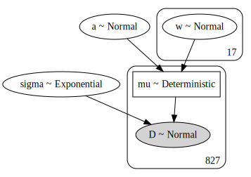
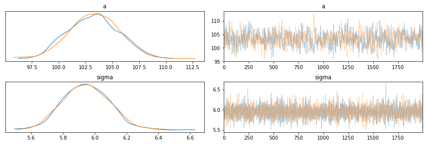
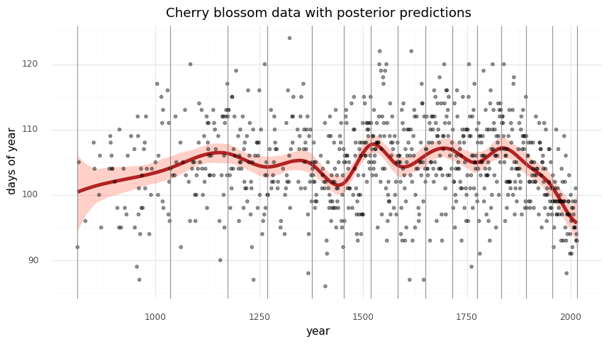
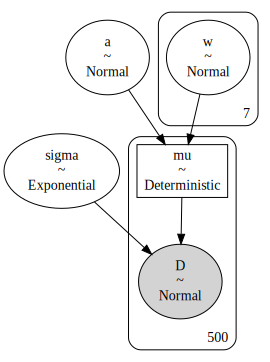
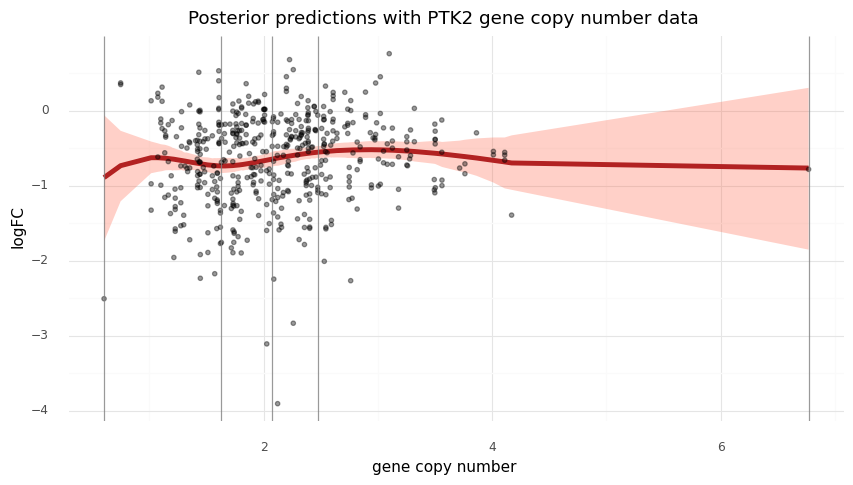

# Splines in PyMC3

- [Question on PyMC Discourse](https://discourse.pymc.io/t/spline-regression-in-pymc3/6235)
- [*Statistical Rethinking* example in PyMC3](https://github.com/pymc-devs/resources/blob/master/Rethinking_2/Chp_04.ipynb)
- [*Statistical Rethinking* example in Stan](https://vincentarelbundock.github.io/rethinking2/04.html)

```python
import string
import warnings
from pathlib import Path

import arviz as az
import matplotlib.colors as mcolors
import matplotlib.pyplot as plt
import numpy as np
import pandas as pd
import plotnine as gg
import pymc3 as pm
import pymc3_helpers as pmhelp
import seaborn as sns
from patsy import dmatrix
from theano import tensor as tt

warnings.simplefilter(action="ignore", category=UserWarning)

gg.theme_set(gg.theme_minimal())

RANDOM_SEED = 847
np.random.seed(RANDOM_SEED)

pymc3_cache_dir = Path("pymc3_model_cache")
rethinking_data_path = Path("../data/rethinking_data")
modeling_data_path = Path("../modeling_data/depmap_modeling_dataframe_subsample.csv")
```

## Replicate the example from *Statistical Rethinking*

```python
d = pd.read_csv(rethinking_data_path / "cherry_blossoms.csv")
# nans are not treated as in the book
az.summary(d.dropna().to_dict(orient="list"), kind="stats")
```

<div>
<style scoped>
    .dataframe tbody tr th:only-of-type {
        vertical-align: middle;
    }

    .dataframe tbody tr th {
        vertical-align: top;
    }

    .dataframe thead th {
        text-align: right;
    }
</style>
<table border="1" class="dataframe">
  <thead>
    <tr style="text-align: right;">
      <th></th>
      <th>mean</th>
      <th>sd</th>
      <th>hdi_3%</th>
      <th>hdi_97%</th>
    </tr>
  </thead>
  <tbody>
    <tr>
      <th>year</th>
      <td>1533.395</td>
      <td>291.123</td>
      <td>1016.00</td>
      <td>1978.00</td>
    </tr>
    <tr>
      <th>doy</th>
      <td>104.921</td>
      <td>6.258</td>
      <td>92.00</td>
      <td>115.00</td>
    </tr>
    <tr>
      <th>temp</th>
      <td>6.100</td>
      <td>0.683</td>
      <td>4.80</td>
      <td>7.32</td>
    </tr>
    <tr>
      <th>temp_upper</th>
      <td>6.938</td>
      <td>0.812</td>
      <td>5.56</td>
      <td>8.40</td>
    </tr>
    <tr>
      <th>temp_lower</th>
      <td>5.264</td>
      <td>0.762</td>
      <td>3.75</td>
      <td>6.83</td>
    </tr>
  </tbody>
</table>
</div>

```python
d2 = d.dropna(subset=["doy"]).reset_index(drop=True)
d2.head(n=10)
```

<div>
<style scoped>
    .dataframe tbody tr th:only-of-type {
        vertical-align: middle;
    }

    .dataframe tbody tr th {
        vertical-align: top;
    }

    .dataframe thead th {
        text-align: right;
    }
</style>
<table border="1" class="dataframe">
  <thead>
    <tr style="text-align: right;">
      <th></th>
      <th>year</th>
      <th>doy</th>
      <th>temp</th>
      <th>temp_upper</th>
      <th>temp_lower</th>
    </tr>
  </thead>
  <tbody>
    <tr>
      <th>0</th>
      <td>812</td>
      <td>92.0</td>
      <td>NaN</td>
      <td>NaN</td>
      <td>NaN</td>
    </tr>
    <tr>
      <th>1</th>
      <td>815</td>
      <td>105.0</td>
      <td>NaN</td>
      <td>NaN</td>
      <td>NaN</td>
    </tr>
    <tr>
      <th>2</th>
      <td>831</td>
      <td>96.0</td>
      <td>NaN</td>
      <td>NaN</td>
      <td>NaN</td>
    </tr>
    <tr>
      <th>3</th>
      <td>851</td>
      <td>108.0</td>
      <td>7.38</td>
      <td>12.10</td>
      <td>2.66</td>
    </tr>
    <tr>
      <th>4</th>
      <td>853</td>
      <td>104.0</td>
      <td>NaN</td>
      <td>NaN</td>
      <td>NaN</td>
    </tr>
    <tr>
      <th>5</th>
      <td>864</td>
      <td>100.0</td>
      <td>6.42</td>
      <td>8.69</td>
      <td>4.14</td>
    </tr>
    <tr>
      <th>6</th>
      <td>866</td>
      <td>106.0</td>
      <td>6.44</td>
      <td>8.11</td>
      <td>4.77</td>
    </tr>
    <tr>
      <th>7</th>
      <td>869</td>
      <td>95.0</td>
      <td>NaN</td>
      <td>NaN</td>
      <td>NaN</td>
    </tr>
    <tr>
      <th>8</th>
      <td>889</td>
      <td>104.0</td>
      <td>6.83</td>
      <td>8.48</td>
      <td>5.19</td>
    </tr>
    <tr>
      <th>9</th>
      <td>891</td>
      <td>109.0</td>
      <td>6.98</td>
      <td>8.96</td>
      <td>5.00</td>
    </tr>
  </tbody>
</table>
</div>

```python
d2.shape
```

    (827, 5)

```python
num_knots = 15
knot_list = np.quantile(d2.year, np.linspace(0, 1, num_knots))
knot_list
```

    array([ 812., 1036., 1174., 1269., 1377., 1454., 1518., 1583., 1650.,
           1714., 1774., 1833., 1893., 1956., 2015.])

```python
(
    gg.ggplot(d2, gg.aes(x="year", y="doy"))
    + gg.geom_point(color="black", alpha=0.4, size=1.3)
    + gg.geom_smooth(method="loess", span=0.3, size=1.5, color="blue", linetype="-")
    + gg.geom_vline(xintercept=knot_list, color="gray", alpha=0.8)
    + gg.theme(figure_size=(10, 5))
    + gg.labs(x="year", y="days of year", title="Cherry blossom data with spline knots")
)
```


    <ggplot: (8786206584585)>

```python
d2["knot_group"] = [np.where(a <= knot_list)[0][0] for a in d2.year]
d2["knot_group"] = pd.Categorical(d2["knot_group"], ordered=True)
```

```python
(
    gg.ggplot(d2, gg.aes(x="year", y="doy"))
    + gg.geom_point(color="black", alpha=0.4, size=1.3)
    + gg.geom_smooth(
        gg.aes(group="knot_group"), method="lm", size=1.5, color="red", linetype="-"
    )
    + gg.geom_vline(xintercept=knot_list, color="gray", alpha=0.8)
    + gg.theme(figure_size=(10, 5))
    + gg.labs(x="year", y="days of year", title="Cherry blossom data with spline knots")
)
```


    <ggplot: (8786207523417)>

```python
B = dmatrix(
    "bs(year, knots=knots, degree=3, include_intercept=True) - 1",
    {"year": d2.year.values, "knots": knot_list[1:-1]},
)
B
```

    DesignMatrix with shape (827, 17)
      Columns:
        ['bs(year, knots=knots, degree=3, include_intercept=True)[0]',
         'bs(year, knots=knots, degree=3, include_intercept=True)[1]',
         'bs(year, knots=knots, degree=3, include_intercept=True)[2]',
         'bs(year, knots=knots, degree=3, include_intercept=True)[3]',
         'bs(year, knots=knots, degree=3, include_intercept=True)[4]',
         'bs(year, knots=knots, degree=3, include_intercept=True)[5]',
         'bs(year, knots=knots, degree=3, include_intercept=True)[6]',
         'bs(year, knots=knots, degree=3, include_intercept=True)[7]',
         'bs(year, knots=knots, degree=3, include_intercept=True)[8]',
         'bs(year, knots=knots, degree=3, include_intercept=True)[9]',
         'bs(year, knots=knots, degree=3, include_intercept=True)[10]',
         'bs(year, knots=knots, degree=3, include_intercept=True)[11]',
         'bs(year, knots=knots, degree=3, include_intercept=True)[12]',
         'bs(year, knots=knots, degree=3, include_intercept=True)[13]',
         'bs(year, knots=knots, degree=3, include_intercept=True)[14]',
         'bs(year, knots=knots, degree=3, include_intercept=True)[15]',
         'bs(year, knots=knots, degree=3, include_intercept=True)[16]']
      Terms:
        'bs(year, knots=knots, degree=3, include_intercept=True)' (columns 0:17)
      (to view full data, use np.asarray(this_obj))

```python
spline_df = (
    pd.DataFrame(B)
    .assign(year=d2.year.values)
    .melt("year", var_name="spline_i", value_name="value")
)

(
    gg.ggplot(spline_df, gg.aes(x="year", y="value"))
    + gg.geom_line(gg.aes(group="spline_i", color="spline_i"))
    + gg.scale_color_discrete(guide=gg.guide_legend(ncol=2))
    + gg.labs(x="year", y="basis", color="spline idx")
)
```


    <ggplot: (8786198444337)>

```python
with pm.Model() as m4_7:
    a = pm.Normal("a", 100, 10)
    w = pm.Normal("w", mu=0, sd=10, shape=B.shape[1])
    mu = pm.Deterministic("mu", a + pm.math.dot(np.asarray(B, order="F"), w.T))
    # mu = pm.Deterministic("mu", a + pm.math.dot(B.base, w.T))
    sigma = pm.Exponential("sigma", 1)
    D = pm.Normal("D", mu, sigma, observed=d2.doy)
```

```python
pm.model_to_graphviz(m4_7)
```



```python
with m4_7:
    prior_pc = pm.sample_prior_predictive(random_seed=RANDOM_SEED)
    trace_m4_7 = pm.sample(2000, tune=2000, random_seed=RANDOM_SEED)
    post_pc = pm.sample_posterior_predictive(trace_m4_7, random_seed=RANDOM_SEED)
```

    Auto-assigning NUTS sampler...
    Initializing NUTS using jitter+adapt_diag...
    Multiprocess sampling (2 chains in 2 jobs)
    NUTS: [sigma, w, a]
    Sampling 2 chains, 0 divergences: 100%|██████████| 8000/8000 [00:30<00:00, 259.07draws/s]
    The number of effective samples is smaller than 25% for some parameters.
    100%|██████████| 4000/4000 [00:06<00:00, 591.29it/s]

```python
az_m4_7 = az.from_pymc3(
    model=m4_7, trace=trace_m4_7, posterior_predictive=post_pc, prior=prior_pc
)
```

```python
az.summary(az_m4_7, var_names=["a", "w", "sigma"])
```

<div>
<style scoped>
    .dataframe tbody tr th:only-of-type {
        vertical-align: middle;
    }

    .dataframe tbody tr th {
        vertical-align: top;
    }

    .dataframe thead th {
        text-align: right;
    }
</style>
<table border="1" class="dataframe">
  <thead>
    <tr style="text-align: right;">
      <th></th>
      <th>mean</th>
      <th>sd</th>
      <th>hdi_3%</th>
      <th>hdi_97%</th>
      <th>mcse_mean</th>
      <th>mcse_sd</th>
      <th>ess_mean</th>
      <th>ess_sd</th>
      <th>ess_bulk</th>
      <th>ess_tail</th>
      <th>r_hat</th>
    </tr>
  </thead>
  <tbody>
    <tr>
      <th>a</th>
      <td>103.303</td>
      <td>2.424</td>
      <td>98.879</td>
      <td>107.724</td>
      <td>0.098</td>
      <td>0.069</td>
      <td>615.0</td>
      <td>614.0</td>
      <td>618.0</td>
      <td>1027.0</td>
      <td>1.0</td>
    </tr>
    <tr>
      <th>w[0]</th>
      <td>-2.876</td>
      <td>3.862</td>
      <td>-10.391</td>
      <td>4.208</td>
      <td>0.110</td>
      <td>0.078</td>
      <td>1225.0</td>
      <td>1225.0</td>
      <td>1223.0</td>
      <td>2105.0</td>
      <td>1.0</td>
    </tr>
    <tr>
      <th>w[1]</th>
      <td>-0.920</td>
      <td>3.944</td>
      <td>-7.944</td>
      <td>6.870</td>
      <td>0.109</td>
      <td>0.077</td>
      <td>1303.0</td>
      <td>1303.0</td>
      <td>1306.0</td>
      <td>1794.0</td>
      <td>1.0</td>
    </tr>
    <tr>
      <th>w[2]</th>
      <td>-0.950</td>
      <td>3.640</td>
      <td>-7.690</td>
      <td>5.972</td>
      <td>0.115</td>
      <td>0.082</td>
      <td>994.0</td>
      <td>994.0</td>
      <td>995.0</td>
      <td>1799.0</td>
      <td>1.0</td>
    </tr>
    <tr>
      <th>w[3]</th>
      <td>4.896</td>
      <td>2.917</td>
      <td>-1.005</td>
      <td>10.029</td>
      <td>0.099</td>
      <td>0.070</td>
      <td>871.0</td>
      <td>871.0</td>
      <td>872.0</td>
      <td>1236.0</td>
      <td>1.0</td>
    </tr>
    <tr>
      <th>w[4]</th>
      <td>-0.827</td>
      <td>2.937</td>
      <td>-6.642</td>
      <td>4.437</td>
      <td>0.105</td>
      <td>0.075</td>
      <td>776.0</td>
      <td>776.0</td>
      <td>781.0</td>
      <td>1199.0</td>
      <td>1.0</td>
    </tr>
    <tr>
      <th>w[5]</th>
      <td>4.384</td>
      <td>2.969</td>
      <td>-0.994</td>
      <td>10.089</td>
      <td>0.098</td>
      <td>0.069</td>
      <td>921.0</td>
      <td>921.0</td>
      <td>922.0</td>
      <td>1600.0</td>
      <td>1.0</td>
    </tr>
    <tr>
      <th>w[6]</th>
      <td>-5.305</td>
      <td>2.848</td>
      <td>-10.728</td>
      <td>-0.249</td>
      <td>0.103</td>
      <td>0.073</td>
      <td>771.0</td>
      <td>771.0</td>
      <td>774.0</td>
      <td>1226.0</td>
      <td>1.0</td>
    </tr>
    <tr>
      <th>w[7]</th>
      <td>7.899</td>
      <td>2.845</td>
      <td>2.319</td>
      <td>12.968</td>
      <td>0.098</td>
      <td>0.070</td>
      <td>848.0</td>
      <td>818.0</td>
      <td>849.0</td>
      <td>1546.0</td>
      <td>1.0</td>
    </tr>
    <tr>
      <th>w[8]</th>
      <td>-0.974</td>
      <td>2.921</td>
      <td>-6.470</td>
      <td>4.431</td>
      <td>0.100</td>
      <td>0.070</td>
      <td>861.0</td>
      <td>861.0</td>
      <td>863.0</td>
      <td>1402.0</td>
      <td>1.0</td>
    </tr>
    <tr>
      <th>w[9]</th>
      <td>3.132</td>
      <td>3.007</td>
      <td>-2.191</td>
      <td>9.091</td>
      <td>0.100</td>
      <td>0.071</td>
      <td>910.0</td>
      <td>906.0</td>
      <td>913.0</td>
      <td>1399.0</td>
      <td>1.0</td>
    </tr>
    <tr>
      <th>w[10]</th>
      <td>4.676</td>
      <td>2.909</td>
      <td>-0.455</td>
      <td>10.563</td>
      <td>0.104</td>
      <td>0.074</td>
      <td>780.0</td>
      <td>780.0</td>
      <td>781.0</td>
      <td>1377.0</td>
      <td>1.0</td>
    </tr>
    <tr>
      <th>w[11]</th>
      <td>-0.085</td>
      <td>2.952</td>
      <td>-5.434</td>
      <td>5.604</td>
      <td>0.098</td>
      <td>0.069</td>
      <td>909.0</td>
      <td>909.0</td>
      <td>911.0</td>
      <td>1468.0</td>
      <td>1.0</td>
    </tr>
    <tr>
      <th>w[12]</th>
      <td>5.600</td>
      <td>2.947</td>
      <td>0.167</td>
      <td>11.290</td>
      <td>0.104</td>
      <td>0.073</td>
      <td>809.0</td>
      <td>809.0</td>
      <td>813.0</td>
      <td>1279.0</td>
      <td>1.0</td>
    </tr>
    <tr>
      <th>w[13]</th>
      <td>0.784</td>
      <td>3.116</td>
      <td>-5.015</td>
      <td>6.579</td>
      <td>0.103</td>
      <td>0.073</td>
      <td>924.0</td>
      <td>924.0</td>
      <td>927.0</td>
      <td>1382.0</td>
      <td>1.0</td>
    </tr>
    <tr>
      <th>w[14]</th>
      <td>-0.782</td>
      <td>3.333</td>
      <td>-7.152</td>
      <td>5.164</td>
      <td>0.104</td>
      <td>0.073</td>
      <td>1030.0</td>
      <td>1030.0</td>
      <td>1030.0</td>
      <td>1404.0</td>
      <td>1.0</td>
    </tr>
    <tr>
      <th>w[15]</th>
      <td>-6.933</td>
      <td>3.501</td>
      <td>-13.454</td>
      <td>-0.133</td>
      <td>0.106</td>
      <td>0.075</td>
      <td>1091.0</td>
      <td>1091.0</td>
      <td>1084.0</td>
      <td>1684.0</td>
      <td>1.0</td>
    </tr>
    <tr>
      <th>w[16]</th>
      <td>-7.610</td>
      <td>3.292</td>
      <td>-14.056</td>
      <td>-1.642</td>
      <td>0.104</td>
      <td>0.075</td>
      <td>1003.0</td>
      <td>965.0</td>
      <td>1005.0</td>
      <td>1368.0</td>
      <td>1.0</td>
    </tr>
    <tr>
      <th>sigma</th>
      <td>5.946</td>
      <td>0.147</td>
      <td>5.660</td>
      <td>6.199</td>
      <td>0.002</td>
      <td>0.002</td>
      <td>3684.0</td>
      <td>3671.0</td>
      <td>3709.0</td>
      <td>2558.0</td>
      <td>1.0</td>
    </tr>
  </tbody>
</table>
</div>

```python
print(az.summary(az_m4_7, var_names=["a", "w", "sigma"]).to_markdown())
```

    |       |    mean |    sd |   hdi_3% |   hdi_97% |   mcse_mean |   mcse_sd |   ess_mean |   ess_sd |   ess_bulk |   ess_tail |   r_hat |
    |:------|--------:|------:|---------:|----------:|------------:|----------:|-----------:|---------:|-----------:|-----------:|--------:|
    | a     | 103.303 | 2.424 |   98.879 |   107.724 |       0.098 |     0.069 |        615 |      614 |        618 |       1027 |       1 |
    | w[0]  |  -2.876 | 3.862 |  -10.391 |     4.208 |       0.11  |     0.078 |       1225 |     1225 |       1223 |       2105 |       1 |
    | w[1]  |  -0.92  | 3.944 |   -7.944 |     6.87  |       0.109 |     0.077 |       1303 |     1303 |       1306 |       1794 |       1 |
    | w[2]  |  -0.95  | 3.64  |   -7.69  |     5.972 |       0.115 |     0.082 |        994 |      994 |        995 |       1799 |       1 |
    | w[3]  |   4.896 | 2.917 |   -1.005 |    10.029 |       0.099 |     0.07  |        871 |      871 |        872 |       1236 |       1 |
    | w[4]  |  -0.827 | 2.937 |   -6.642 |     4.437 |       0.105 |     0.075 |        776 |      776 |        781 |       1199 |       1 |
    | w[5]  |   4.384 | 2.969 |   -0.994 |    10.089 |       0.098 |     0.069 |        921 |      921 |        922 |       1600 |       1 |
    | w[6]  |  -5.305 | 2.848 |  -10.728 |    -0.249 |       0.103 |     0.073 |        771 |      771 |        774 |       1226 |       1 |
    | w[7]  |   7.899 | 2.845 |    2.319 |    12.968 |       0.098 |     0.07  |        848 |      818 |        849 |       1546 |       1 |
    | w[8]  |  -0.974 | 2.921 |   -6.47  |     4.431 |       0.1   |     0.07  |        861 |      861 |        863 |       1402 |       1 |
    | w[9]  |   3.132 | 3.007 |   -2.191 |     9.091 |       0.1   |     0.071 |        910 |      906 |        913 |       1399 |       1 |
    | w[10] |   4.676 | 2.909 |   -0.455 |    10.563 |       0.104 |     0.074 |        780 |      780 |        781 |       1377 |       1 |
    | w[11] |  -0.085 | 2.952 |   -5.434 |     5.604 |       0.098 |     0.069 |        909 |      909 |        911 |       1468 |       1 |
    | w[12] |   5.6   | 2.947 |    0.167 |    11.29  |       0.104 |     0.073 |        809 |      809 |        813 |       1279 |       1 |
    | w[13] |   0.784 | 3.116 |   -5.015 |     6.579 |       0.103 |     0.073 |        924 |      924 |        927 |       1382 |       1 |
    | w[14] |  -0.782 | 3.333 |   -7.152 |     5.164 |       0.104 |     0.073 |       1030 |     1030 |       1030 |       1404 |       1 |
    | w[15] |  -6.933 | 3.501 |  -13.454 |    -0.133 |       0.106 |     0.075 |       1091 |     1091 |       1084 |       1684 |       1 |
    | w[16] |  -7.61  | 3.292 |  -14.056 |    -1.642 |       0.104 |     0.075 |       1003 |      965 |       1005 |       1368 |       1 |
    | sigma |   5.946 | 0.147 |    5.66  |     6.199 |       0.002 |     0.002 |       3684 |     3671 |       3709 |       2558 |       1 |

```python
az.plot_trace(az_m4_7, var_names=["a", "sigma"])
plt.show()
```

    array([[<AxesSubplot:title={'center':'a'}>,
            <AxesSubplot:title={'center':'a'}>],
           [<AxesSubplot:title={'center':'sigma'}>,
            <AxesSubplot:title={'center':'sigma'}>]], dtype=object)



```python
az.plot_forest(az_m4_7, var_names=["w"], combined=True)
plt.show()
```


```python
post_pred = az.summary(az_m4_7, var_names=["mu"]).reset_index(drop=True)
d2_post = d2.copy().reset_index(drop=True)
d2_post["pred_mean"] = post_pred["mean"]
d2_post["pred_hdi_lower"] = post_pred["hdi_3%"]
d2_post["pred_hdi_upper"] = post_pred["hdi_97%"]
```

```python
(
    gg.ggplot(d2_post, gg.aes(x="year"))
    + gg.geom_ribbon(
        gg.aes(ymin="pred_hdi_lower", ymax="pred_hdi_upper"), alpha=0.3, fill="tomato"
    )
    + gg.geom_line(gg.aes(y="pred_mean"), color="firebrick", alpha=1, size=2)
    + gg.geom_point(gg.aes(y="doy"), color="black", alpha=0.4, size=1.3)
    + gg.geom_vline(xintercept=knot_list, color="gray", alpha=0.8)
    + gg.theme(figure_size=(10, 5))
    + gg.labs(
        x="year",
        y="days of year",
        title="Cherry blossom data with posterior predictions",
    )
)
```


    <ggplot: (8786210500689)>

## Example with CNA data

```python
modeling_data = pd.read_csv(modeling_data_path)
modeling_data
```

<div>
<style scoped>
    .dataframe tbody tr th:only-of-type {
        vertical-align: middle;
    }

    .dataframe tbody tr th {
        vertical-align: top;
    }

    .dataframe thead th {
        text-align: right;
    }
</style>
<table border="1" class="dataframe">
  <thead>
    <tr style="text-align: right;">
      <th></th>
      <th>sgrna</th>
      <th>replicate_id</th>
      <th>lfc</th>
      <th>pdna_batch</th>
      <th>passes_qc</th>
      <th>depmap_id</th>
      <th>primary_or_metastasis</th>
      <th>lineage</th>
      <th>lineage_subtype</th>
      <th>kras_mutation</th>
      <th>...</th>
      <th>log2_gene_cn_p1</th>
      <th>gene_cn</th>
      <th>n_muts</th>
      <th>any_deleterious</th>
      <th>variant_classification</th>
      <th>is_deleterious</th>
      <th>is_tcga_hotspot</th>
      <th>is_cosmic_hotspot</th>
      <th>mutated_at_guide_location</th>
      <th>rna_expr</th>
    </tr>
  </thead>
  <tbody>
    <tr>
      <th>0</th>
      <td>AAGAGGCCGGTCAAATTCAG</td>
      <td>42-mg-ba-311cas9_repa_p6_batch3</td>
      <td>-0.405499</td>
      <td>3</td>
      <td>True</td>
      <td>ACH-000323</td>
      <td>Primary</td>
      <td>central_nervous_system</td>
      <td>glioma</td>
      <td>WT</td>
      <td>...</td>
      <td>0.845287</td>
      <td>1.328646</td>
      <td>0</td>
      <td>False</td>
      <td>NaN</td>
      <td>NaN</td>
      <td>NaN</td>
      <td>NaN</td>
      <td>False</td>
      <td>1.263034</td>
    </tr>
    <tr>
      <th>1</th>
      <td>AATCAACCCACAGCTGCACA</td>
      <td>42-mg-ba-311cas9_repa_p6_batch3</td>
      <td>-0.133541</td>
      <td>3</td>
      <td>True</td>
      <td>ACH-000323</td>
      <td>Primary</td>
      <td>central_nervous_system</td>
      <td>glioma</td>
      <td>WT</td>
      <td>...</td>
      <td>0.827398</td>
      <td>1.287359</td>
      <td>2</td>
      <td>False</td>
      <td>missense_mutation;missense_mutation</td>
      <td>FALSE;FALSE</td>
      <td>TRUE;TRUE</td>
      <td>TRUE;TRUE</td>
      <td>False</td>
      <td>5.220330</td>
    </tr>
    <tr>
      <th>2</th>
      <td>AATTACTACTTGCTTCCTGT</td>
      <td>42-mg-ba-311cas9_repa_p6_batch3</td>
      <td>-0.491495</td>
      <td>3</td>
      <td>True</td>
      <td>ACH-000323</td>
      <td>Primary</td>
      <td>central_nervous_system</td>
      <td>glioma</td>
      <td>WT</td>
      <td>...</td>
      <td>0.879280</td>
      <td>1.409165</td>
      <td>0</td>
      <td>False</td>
      <td>NaN</td>
      <td>NaN</td>
      <td>NaN</td>
      <td>NaN</td>
      <td>False</td>
      <td>3.008989</td>
    </tr>
    <tr>
      <th>3</th>
      <td>ACCTGTATGACGAAACCGTG</td>
      <td>42-mg-ba-311cas9_repa_p6_batch3</td>
      <td>-0.015850</td>
      <td>3</td>
      <td>True</td>
      <td>ACH-000323</td>
      <td>Primary</td>
      <td>central_nervous_system</td>
      <td>glioma</td>
      <td>WT</td>
      <td>...</td>
      <td>0.818549</td>
      <td>1.267208</td>
      <td>0</td>
      <td>False</td>
      <td>NaN</td>
      <td>NaN</td>
      <td>NaN</td>
      <td>NaN</td>
      <td>False</td>
      <td>4.083213</td>
    </tr>
    <tr>
      <th>4</th>
      <td>ACTCTGTTCCTTCATCTCCG</td>
      <td>42-mg-ba-311cas9_repa_p6_batch3</td>
      <td>-0.530277</td>
      <td>3</td>
      <td>True</td>
      <td>ACH-000323</td>
      <td>Primary</td>
      <td>central_nervous_system</td>
      <td>glioma</td>
      <td>WT</td>
      <td>...</td>
      <td>0.990378</td>
      <td>1.692253</td>
      <td>0</td>
      <td>False</td>
      <td>NaN</td>
      <td>NaN</td>
      <td>NaN</td>
      <td>NaN</td>
      <td>False</td>
      <td>5.822730</td>
    </tr>
    <tr>
      <th>...</th>
      <td>...</td>
      <td>...</td>
      <td>...</td>
      <td>...</td>
      <td>...</td>
      <td>...</td>
      <td>...</td>
      <td>...</td>
      <td>...</td>
      <td>...</td>
      <td>...</td>
      <td>...</td>
      <td>...</td>
      <td>...</td>
      <td>...</td>
      <td>...</td>
      <td>...</td>
      <td>...</td>
      <td>...</td>
      <td>...</td>
      <td>...</td>
    </tr>
    <tr>
      <th>60044</th>
      <td>TTATTAATGTAGCCTCACGG</td>
      <td>ykg1-311cas9_repb_p6_batch3</td>
      <td>-0.096160</td>
      <td>3</td>
      <td>True</td>
      <td>ACH-000570</td>
      <td>Primary</td>
      <td>central_nervous_system</td>
      <td>glioma</td>
      <td>WT</td>
      <td>...</td>
      <td>1.129110</td>
      <td>2.092901</td>
      <td>1</td>
      <td>False</td>
      <td>missense_mutation</td>
      <td>FALSE</td>
      <td>TRUE</td>
      <td>TRUE</td>
      <td>False</td>
      <td>3.792855</td>
    </tr>
    <tr>
      <th>60045</th>
      <td>TTCCGTTTATCATGAAGCCG</td>
      <td>ykg1-311cas9_repb_p6_batch3</td>
      <td>-0.975325</td>
      <td>3</td>
      <td>True</td>
      <td>ACH-000570</td>
      <td>Primary</td>
      <td>central_nervous_system</td>
      <td>glioma</td>
      <td>WT</td>
      <td>...</td>
      <td>1.129110</td>
      <td>2.092901</td>
      <td>0</td>
      <td>False</td>
      <td>NaN</td>
      <td>NaN</td>
      <td>NaN</td>
      <td>NaN</td>
      <td>False</td>
      <td>6.134426</td>
    </tr>
    <tr>
      <th>60046</th>
      <td>TTGCAATGTGATGGAAGGGG</td>
      <td>ykg1-311cas9_repb_p6_batch3</td>
      <td>0.408497</td>
      <td>3</td>
      <td>True</td>
      <td>ACH-000570</td>
      <td>Primary</td>
      <td>central_nervous_system</td>
      <td>glioma</td>
      <td>WT</td>
      <td>...</td>
      <td>0.950623</td>
      <td>1.587322</td>
      <td>0</td>
      <td>False</td>
      <td>NaN</td>
      <td>NaN</td>
      <td>NaN</td>
      <td>NaN</td>
      <td>False</td>
      <td>3.645010</td>
    </tr>
    <tr>
      <th>60047</th>
      <td>TTGTCCCAGCCGTCAAACCG</td>
      <td>ykg1-311cas9_repb_p6_batch3</td>
      <td>-0.050832</td>
      <td>3</td>
      <td>True</td>
      <td>ACH-000570</td>
      <td>Primary</td>
      <td>central_nervous_system</td>
      <td>glioma</td>
      <td>WT</td>
      <td>...</td>
      <td>1.071891</td>
      <td>1.920898</td>
      <td>0</td>
      <td>False</td>
      <td>NaN</td>
      <td>NaN</td>
      <td>NaN</td>
      <td>NaN</td>
      <td>False</td>
      <td>0.992768</td>
    </tr>
    <tr>
      <th>60048</th>
      <td>TTTGACCTGGAGTTGCCTGA</td>
      <td>ykg1-311cas9_repb_p6_batch3</td>
      <td>0.083380</td>
      <td>3</td>
      <td>True</td>
      <td>ACH-000570</td>
      <td>Primary</td>
      <td>central_nervous_system</td>
      <td>glioma</td>
      <td>WT</td>
      <td>...</td>
      <td>0.962893</td>
      <td>1.619263</td>
      <td>0</td>
      <td>False</td>
      <td>NaN</td>
      <td>NaN</td>
      <td>NaN</td>
      <td>NaN</td>
      <td>False</td>
      <td>2.134221</td>
    </tr>
  </tbody>
</table>
<p>60049 rows × 27 columns</p>
</div>

```python
np.random.seed(RANDOM_SEED)
ptk2_data = modeling_data[modeling_data.hugo_symbol == "PTK2"]
ptk2_data = ptk2_data.sample(n=500)


(
    gg.ggplot(ptk2_data, gg.aes(x="gene_cn", y="lfc"))
    + gg.geom_density_2d(color="black", alpha=1, size=1, linetype="--")
    + gg.geom_point(size=0.4, alpha=0.2, color="navy")
    + gg.geom_smooth(method="lm")
    + gg.labs(x="gene copy number", y="logFC", title="PTK2")
)
```



    <ggplot: (8789285110896)>

```python
ptk2_data.shape[0]
```

    500

```python
cn_num_knots = 5
cn_knot_list = np.quantile(ptk2_data.gene_cn, np.linspace(0, 1, cn_num_knots))


ptk2_B = dmatrix(
    "bs(x, knots=knots, degree=3, include_intercept=True) - 1",
    {"x": ptk2_data.gene_cn, "knots": cn_knot_list[1:-1]},
)
```

```python
ptk2_spline_df = (
    pd.DataFrame(ptk2_B)
    .assign(gene_cn=ptk2_data.gene_cn.values)
    .melt("gene_cn", var_name="spline_i", value_name="value")
)

(
    gg.ggplot(ptk2_spline_df, gg.aes(x="gene_cn", y="value"))
    + gg.geom_line(gg.aes(group="spline_i", color="spline_i"))
    + gg.scale_color_discrete(guide=gg.guide_legend(ncol=2))
    + gg.labs(x="gene copy number", y="basis", color="spline idx")
)
```


    <ggplot: (8789285083263)>

```python
with pm.Model() as m_ptk2:
    a = pm.Normal("a", 100, 10)
    w = pm.Normal("w", mu=0, sd=10, shape=ptk2_B.shape[1])
    mu = pm.Deterministic("mu", a + pm.math.dot(np.asarray(ptk2_B, order="F"), w.T))
    # mu = pm.Deterministic("mu", a + pm.math.dot(B.base, w.T))
    sigma = pm.Exponential("sigma", 1)
    D = pm.Normal("D", mu, sigma, observed=ptk2_data.lfc)
```

```python
pm.model_to_graphviz(m_ptk2)
```



```python
with m_ptk2:
    prior_pc = pm.sample_prior_predictive()
    trace_m_ptk2 = pm.sample(1000)
    post_pc = pm.sample_posterior_predictive(trace_m_ptk2)
```

    Auto-assigning NUTS sampler...
    Initializing NUTS using jitter+adapt_diag...
    Multiprocess sampling (4 chains in 4 jobs)
    NUTS: [sigma, w, a]

<div>
    <style>
        /*Turns off some styling*/
        progress {
            /*gets rid of default border in Firefox and Opera.*/
            border: none;
            /*Needs to be in here for Safari polyfill so background images work as expected.*/
            background-size: auto;
        }
        .progress-bar-interrupted, .progress-bar-interrupted::-webkit-progress-bar {
            background: #F44336;
        }
    </style>
  <progress value='8000' class='' max='8000' style='width:300px; height:20px; vertical-align: middle;'></progress>
  100.00% [8000/8000 01:08<00:00 Sampling 4 chains, 0 divergences]
</div>

    Sampling 4 chains for 1_000 tune and 1_000 draw iterations (4_000 + 4_000 draws total) took 69 seconds.
    The acceptance probability does not match the target. It is 0.9010949039327413, but should be close to 0.8. Try to increase the number of tuning steps.
    The number of effective samples is smaller than 10% for some parameters.

<div>
    <style>
        /*Turns off some styling*/
        progress {
            /*gets rid of default border in Firefox and Opera.*/
            border: none;
            /*Needs to be in here for Safari polyfill so background images work as expected.*/
            background-size: auto;
        }
        .progress-bar-interrupted, .progress-bar-interrupted::-webkit-progress-bar {
            background: #F44336;
        }
    </style>
  <progress value='4000' class='' max='4000' style='width:300px; height:20px; vertical-align: middle;'></progress>
  100.00% [4000/4000 00:04<00:00]
</div>

```python
az_ptk2 = az.from_pymc3(
    model=m_ptk2, trace=trace_m_ptk2, posterior_predictive=post_pc, prior=prior_pc
)
```

```python
post_pred = az.summary(az_ptk2, var_names=["mu"]).reset_index(drop=True)
ptk2_post = ptk2_data.copy().reset_index(drop=True)
ptk2_post["pred_mean"] = post_pred["mean"]
ptk2_post["pred_hdi_lower"] = post_pred["hdi_3%"]
ptk2_post["pred_hdi_upper"] = post_pred["hdi_97%"]
ptk2_post.head()
```

<div>
<style scoped>
    .dataframe tbody tr th:only-of-type {
        vertical-align: middle;
    }

    .dataframe tbody tr th {
        vertical-align: top;
    }

    .dataframe thead th {
        text-align: right;
    }
</style>
<table border="1" class="dataframe">
  <thead>
    <tr style="text-align: right;">
      <th></th>
      <th>sgrna</th>
      <th>replicate_id</th>
      <th>lfc</th>
      <th>pdna_batch</th>
      <th>passes_qc</th>
      <th>depmap_id</th>
      <th>primary_or_metastasis</th>
      <th>lineage</th>
      <th>lineage_subtype</th>
      <th>kras_mutation</th>
      <th>...</th>
      <th>any_deleterious</th>
      <th>variant_classification</th>
      <th>is_deleterious</th>
      <th>is_tcga_hotspot</th>
      <th>is_cosmic_hotspot</th>
      <th>mutated_at_guide_location</th>
      <th>rna_expr</th>
      <th>pred_mean</th>
      <th>pred_hdi_lower</th>
      <th>pred_hdi_upper</th>
    </tr>
  </thead>
  <tbody>
    <tr>
      <th>0</th>
      <td>GGAGGTTCACTGGCTTCACG</td>
      <td>nci-h2023-311cas9 rep b p6_batch3</td>
      <td>-0.886039</td>
      <td>3</td>
      <td>True</td>
      <td>ACH-000781</td>
      <td>Metastasis</td>
      <td>lung</td>
      <td>NSCLC</td>
      <td>WT</td>
      <td>...</td>
      <td>False</td>
      <td>NaN</td>
      <td>NaN</td>
      <td>NaN</td>
      <td>NaN</td>
      <td>False</td>
      <td>6.183089</td>
      <td>-0.557</td>
      <td>-0.634</td>
      <td>-0.477</td>
    </tr>
    <tr>
      <th>1</th>
      <td>GGAGGTTCACTGGCTTCACG</td>
      <td>8-mg-ba-311cas9_repa_p5_batch3</td>
      <td>0.030300</td>
      <td>3</td>
      <td>True</td>
      <td>ACH-000137</td>
      <td>Primary</td>
      <td>central_nervous_system</td>
      <td>glioma</td>
      <td>WT</td>
      <td>...</td>
      <td>False</td>
      <td>NaN</td>
      <td>NaN</td>
      <td>NaN</td>
      <td>NaN</td>
      <td>False</td>
      <td>6.864558</td>
      <td>-0.545</td>
      <td>-0.678</td>
      <td>-0.422</td>
    </tr>
    <tr>
      <th>2</th>
      <td>ATATGGCTGACCTAATAGAT</td>
      <td>r262-311cas9_repa_p6_batch2</td>
      <td>-1.892173</td>
      <td>2</td>
      <td>True</td>
      <td>ACH-001173</td>
      <td>NaN</td>
      <td>central_nervous_system</td>
      <td>medulloblastoma</td>
      <td>WT</td>
      <td>...</td>
      <td>False</td>
      <td>NaN</td>
      <td>NaN</td>
      <td>NaN</td>
      <td>NaN</td>
      <td>False</td>
      <td>4.636335</td>
      <td>-0.724</td>
      <td>-0.820</td>
      <td>-0.624</td>
    </tr>
    <tr>
      <th>3</th>
      <td>GCGAGGTTCCATTCACCAGC</td>
      <td>dkmg-311cas9_repb_p5_batch3</td>
      <td>-0.306644</td>
      <td>3</td>
      <td>True</td>
      <td>ACH-000244</td>
      <td>Primary</td>
      <td>central_nervous_system</td>
      <td>glioma</td>
      <td>WT</td>
      <td>...</td>
      <td>False</td>
      <td>NaN</td>
      <td>NaN</td>
      <td>NaN</td>
      <td>NaN</td>
      <td>False</td>
      <td>6.314334</td>
      <td>-0.728</td>
      <td>-0.809</td>
      <td>-0.632</td>
    </tr>
    <tr>
      <th>4</th>
      <td>GCGAGGTTCCATTCACCAGC</td>
      <td>nci-h838-311cas9_repb_p4_batch3</td>
      <td>-0.851729</td>
      <td>3</td>
      <td>True</td>
      <td>ACH-000416</td>
      <td>Metastasis</td>
      <td>lung</td>
      <td>NSCLC</td>
      <td>WT</td>
      <td>...</td>
      <td>False</td>
      <td>NaN</td>
      <td>NaN</td>
      <td>NaN</td>
      <td>NaN</td>
      <td>False</td>
      <td>5.794936</td>
      <td>-0.549</td>
      <td>-0.632</td>
      <td>-0.469</td>
    </tr>
  </tbody>
</table>
<p>5 rows × 30 columns</p>
</div>

```python
(
    gg.ggplot(ptk2_post, gg.aes(x="gene_cn"))
    + gg.geom_ribbon(
        gg.aes(ymin="pred_hdi_lower", ymax="pred_hdi_upper"), alpha=0.3, fill="tomato"
    )
    + gg.geom_line(gg.aes(y="pred_mean"), color="firebrick", alpha=1, size=2)
    + gg.geom_point(gg.aes(y="lfc"), color="black", alpha=0.4, size=1.3)
    + gg.geom_vline(xintercept=cn_knot_list, color="gray", alpha=0.8)
    + gg.theme(figure_size=(10, 5))
    + gg.labs(
        x="gene copy number",
        y="logFC",
        title="Posterior predictions with PTK2 gene copy number data",
    )
)
```



    <ggplot: (8789284853068)>

```python

```

```python

```

```python

```

```python

```

```python

```

```python
%load_ext watermark
%watermark -d -u -v -iv -b -h -m
```

    plotnine 0.7.1
    pandas   1.1.3
    arviz    0.10.0
    pymc3    3.9.3
    numpy    1.19.2
    seaborn  0.11.0
    last updated: 2020-11-13 
    
    CPython 3.8.5
    IPython 7.18.1
    
    compiler   : GCC 7.3.0
    system     : Linux
    release    : 3.10.0-1062.el7.x86_64
    machine    : x86_64
    processor  : x86_64
    CPU cores  : 28
    interpreter: 64bit
    host name  : compute-e-16-229.o2.rc.hms.harvard.edu
    Git branch : subset-data
