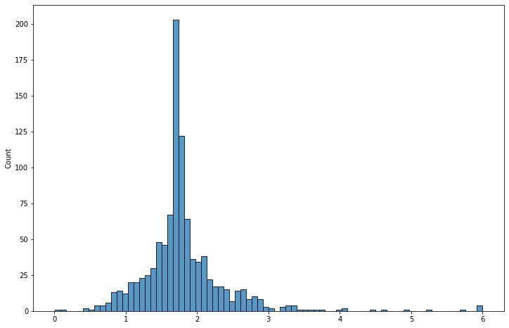

# Prepare DepMap data


```python
import re
from pathlib import Path

import janitor
import numpy as np
import pandas as pd
import seaborn as sns
from matplotlib import pyplot as plt
```


```python
data_dir = Path("../data/depmap_20q3")
save_dir = Path("../modeling_data")

if not data_dir.exists():
    raise Exception(
        "Data directory does not exist. Make sure to download the DepMap data."
    )
```

## 'sample_info.csv'


```python
sample_info_columns = [
    "depmap_id",
    "stripped_cell_line_name",
    "ccle_name",
    "sex",
    "cas9_activity",
    "primary_or_metastasis",
    "primary_disease",
    "subtype",
    "lineage",
    "lineage_subtype",
]

sample_info = pd.read_csv(data_dir / "sample_info.csv").clean_names()[
    sample_info_columns
]
sample_info.head()
```


<div>
<style scoped>
    .dataframe tbody tr th:only-of-type {
        vertical-align: middle;
    }

    .dataframe tbody tr th {
        vertical-align: top;
    }

    .dataframe thead th {
        text-align: right;
    }
</style>
<table border="1" class="dataframe">
  <thead>
    <tr style="text-align: right;">
      <th></th>
      <th>depmap_id</th>
      <th>stripped_cell_line_name</th>
      <th>ccle_name</th>
      <th>sex</th>
      <th>cas9_activity</th>
      <th>primary_or_metastasis</th>
      <th>primary_disease</th>
      <th>subtype</th>
      <th>lineage</th>
      <th>lineage_subtype</th>
    </tr>
  </thead>
  <tbody>
    <tr>
      <th>0</th>
      <td>ACH-000001</td>
      <td>NIHOVCAR3</td>
      <td>NIHOVCAR3_OVARY</td>
      <td>Female</td>
      <td>NaN</td>
      <td>Metastasis</td>
      <td>Ovarian Cancer</td>
      <td>Adenocarcinoma, high grade serous</td>
      <td>ovary</td>
      <td>ovary_adenocarcinoma</td>
    </tr>
    <tr>
      <th>1</th>
      <td>ACH-000002</td>
      <td>HL60</td>
      <td>HL60_HAEMATOPOIETIC_AND_LYMPHOID_TISSUE</td>
      <td>Female</td>
      <td>NaN</td>
      <td>Primary</td>
      <td>Leukemia</td>
      <td>Acute Myelogenous Leukemia (AML), M3 (Promyelo...</td>
      <td>blood</td>
      <td>AML</td>
    </tr>
    <tr>
      <th>2</th>
      <td>ACH-000003</td>
      <td>CACO2</td>
      <td>CACO2_LARGE_INTESTINE</td>
      <td>Male</td>
      <td>NaN</td>
      <td>NaN</td>
      <td>Colon/Colorectal Cancer</td>
      <td>Adenocarcinoma</td>
      <td>colorectal</td>
      <td>colorectal_adenocarcinoma</td>
    </tr>
    <tr>
      <th>3</th>
      <td>ACH-000004</td>
      <td>HEL</td>
      <td>HEL_HAEMATOPOIETIC_AND_LYMPHOID_TISSUE</td>
      <td>Male</td>
      <td>52.4</td>
      <td>NaN</td>
      <td>Leukemia</td>
      <td>Acute Myelogenous Leukemia (AML), M6 (Erythrol...</td>
      <td>blood</td>
      <td>AML</td>
    </tr>
    <tr>
      <th>4</th>
      <td>ACH-000005</td>
      <td>HEL9217</td>
      <td>HEL9217_HAEMATOPOIETIC_AND_LYMPHOID_TISSUE</td>
      <td>Male</td>
      <td>86.6</td>
      <td>NaN</td>
      <td>Leukemia</td>
      <td>Acute Myelogenous Leukemia (AML), M6 (Erythrol...</td>
      <td>blood</td>
      <td>AML</td>
    </tr>
  </tbody>
</table>
</div>


```python
sample_info.to_csv(save_dir / "sample_info.csv", index=False)
```

## 'Achilles_guide_map.csv'


```python
achilles_guide_map = (
    pd.read_csv(data_dir / "Achilles_guide_map.csv")
    .clean_names()
    .assign(hugo_symbol=lambda x: [a.split(" ")[0] for a in x.gene])
    .drop(["gene"], axis=1)
)

achilles_guide_map.head()
```


<div>
<style scoped>
    .dataframe tbody tr th:only-of-type {
        vertical-align: middle;
    }

    .dataframe tbody tr th {
        vertical-align: top;
    }

    .dataframe thead th {
        text-align: right;
    }
</style>
<table border="1" class="dataframe">
  <thead>
    <tr style="text-align: right;">
      <th></th>
      <th>sgrna</th>
      <th>genome_alignment</th>
      <th>n_alignments</th>
      <th>hugo_symbol</th>
    </tr>
  </thead>
  <tbody>
    <tr>
      <th>0</th>
      <td>AAAAAAATCCAGCAATGCAG</td>
      <td>chr10_110964620_+</td>
      <td>1</td>
      <td>SHOC2</td>
    </tr>
    <tr>
      <th>1</th>
      <td>AAAAAACCCGTAGATAGCCT</td>
      <td>chr12_95003615_+</td>
      <td>1</td>
      <td>NDUFA12</td>
    </tr>
    <tr>
      <th>2</th>
      <td>AAAAAAGAAGAAAAAACCAG</td>
      <td>chr4_75970356_-</td>
      <td>1</td>
      <td>SDAD1</td>
    </tr>
    <tr>
      <th>3</th>
      <td>AAAAAAGCTCAAGAAGGAGG</td>
      <td>chr2_33588446_-</td>
      <td>1</td>
      <td>FAM98A</td>
    </tr>
    <tr>
      <th>4</th>
      <td>AAAAAAGGCTGTAAAAGCGT</td>
      <td>chr19_19891600_+</td>
      <td>1</td>
      <td>ZNF253</td>
    </tr>
  </tbody>
</table>
</div>


## 'Achilles_dropped_guides.csv'


```python
achilles_dropped_guides = (
    pd.read_csv(data_dir / "Achilles_dropped_guides.csv")
    .clean_names()
    .rename({"unnamed_0": "sgrna"}, axis=1)
)

achilles_dropped_guides.head()
```


<div>
<style scoped>
    .dataframe tbody tr th:only-of-type {
        vertical-align: middle;
    }

    .dataframe tbody tr th {
        vertical-align: top;
    }

    .dataframe thead th {
        text-align: right;
    }
</style>
<table border="1" class="dataframe">
  <thead>
    <tr style="text-align: right;">
      <th></th>
      <th>sgrna</th>
      <th>genomic_coordinates</th>
      <th>gene</th>
      <th>n_alignments</th>
      <th>fail_reason</th>
    </tr>
  </thead>
  <tbody>
    <tr>
      <th>0</th>
      <td>AAAAAGCTTCCGCCTGATGG</td>
      <td>NaN</td>
      <td>NaN</td>
      <td>0.0</td>
      <td>not_aligned</td>
    </tr>
    <tr>
      <th>1</th>
      <td>AAAAATCCTAAAATAAAATA</td>
      <td>chrX_145827835.0_-</td>
      <td>NaN</td>
      <td>1.0</td>
      <td>in_dropped_guides</td>
    </tr>
    <tr>
      <th>2</th>
      <td>AAAACAGAATATAGTCAGTG</td>
      <td>chrX_145827787.0_-</td>
      <td>NaN</td>
      <td>1.0</td>
      <td>guide_dropped_by_ceres</td>
    </tr>
    <tr>
      <th>3</th>
      <td>AAAACAGGACGATGTGCGGC</td>
      <td>NaN</td>
      <td>NaN</td>
      <td>0.0</td>
      <td>not_aligned</td>
    </tr>
    <tr>
      <th>4</th>
      <td>AAAACATCGACCGAAAGCGT</td>
      <td>NaN</td>
      <td>NaN</td>
      <td>0.0</td>
      <td>not_aligned</td>
    </tr>
  </tbody>
</table>
</div>


```python
len(np.unique(achilles_dropped_guides.sgrna))
```


    2554


```python
achilles_guide_map = achilles_guide_map[
    ~achilles_guide_map.sgrna.isin(achilles_dropped_guides.sgrna)
]
achilles_guide_map = achilles_guide_map.reset_index(drop=True)
```


```python
achilles_guide_map.to_csv(save_dir / "achilles_guide_map.csv", index=False)
```

## 'Achilles_replicate_map.csv'


```python
achilles_replicate_map = (
    pd.read_csv(data_dir / "Achilles_replicate_map.csv")
    .clean_names()
    .assign(replicate_id=lambda x: x.replicate_id.str.lower())
)
achilles_replicate_map.head()
```


<div>
<style scoped>
    .dataframe tbody tr th:only-of-type {
        vertical-align: middle;
    }

    .dataframe tbody tr th {
        vertical-align: top;
    }

    .dataframe thead th {
        text-align: right;
    }
</style>
<table border="1" class="dataframe">
  <thead>
    <tr style="text-align: right;">
      <th></th>
      <th>replicate_id</th>
      <th>depmap_id</th>
      <th>pdna_batch</th>
      <th>passes_qc</th>
    </tr>
  </thead>
  <tbody>
    <tr>
      <th>0</th>
      <td>pe_ca-pj-34clone c12-311cas9_repb_p5_batch2</td>
      <td>ACH-000606</td>
      <td>2</td>
      <td>True</td>
    </tr>
    <tr>
      <th>1</th>
      <td>nci-h1944-311cas9 rep c p5_batch3</td>
      <td>ACH-000414</td>
      <td>3</td>
      <td>True</td>
    </tr>
    <tr>
      <th>2</th>
      <td>mdamb231-311cas9_repb_p5_batch2</td>
      <td>ACH-000768</td>
      <td>2</td>
      <td>True</td>
    </tr>
    <tr>
      <th>3</th>
      <td>skrc20-311cas9_repa_p6_batch3</td>
      <td>ACH-000385</td>
      <td>3</td>
      <td>True</td>
    </tr>
    <tr>
      <th>4</th>
      <td>skpndw-311cas9_repb_p6_batch3</td>
      <td>ACH-001193</td>
      <td>3</td>
      <td>True</td>
    </tr>
  </tbody>
</table>
</div>


```python
np.max(achilles_replicate_map.pdna_batch)
```


    4


```python
len(np.unique(achilles_replicate_map.replicate_id))
```


    1759


```python
np.round(np.mean(achilles_replicate_map.passes_qc), 3)
```


    0.948


```python
achilles_replicate_map.to_csv(save_dir / "achilles_replicate_map.csv", index=False)
```

## 'Achilles_logfold_change.csv'


```python
achilles_logfold_change = (
    pd.read_csv(data_dir / "Achilles_logfold_change.csv")
    .rename({"Construct Barcode": "sgrna"}, axis=1)
    .set_index("sgrna")
    .melt(var_name="replicate_id", value_name="lfc", ignore_index=False)
    .reset_index()
    .assign(replicate_id=lambda x: x.replicate_id.str.lower())
    .merge(achilles_replicate_map, on="replicate_id", how="left")
    .pipe(lambda x: x[x.passes_qc])
)

achilles_logfold_change.head()
```


<div>
<style scoped>
    .dataframe tbody tr th:only-of-type {
        vertical-align: middle;
    }

    .dataframe tbody tr th {
        vertical-align: top;
    }

    .dataframe thead th {
        text-align: right;
    }
</style>
<table border="1" class="dataframe">
  <thead>
    <tr style="text-align: right;">
      <th></th>
      <th>sgrna</th>
      <th>replicate_id</th>
      <th>lfc</th>
      <th>depmap_id</th>
      <th>pdna_batch</th>
      <th>passes_qc</th>
    </tr>
  </thead>
  <tbody>
    <tr>
      <th>0</th>
      <td>AAAAAAATCCAGCAATGCAG</td>
      <td>143b-311cas9_repa_p6_batch3</td>
      <td>0.289694</td>
      <td>ACH-001001</td>
      <td>3</td>
      <td>True</td>
    </tr>
    <tr>
      <th>1</th>
      <td>AAAAAACCCGTAGATAGCCT</td>
      <td>143b-311cas9_repa_p6_batch3</td>
      <td>0.170172</td>
      <td>ACH-001001</td>
      <td>3</td>
      <td>True</td>
    </tr>
    <tr>
      <th>2</th>
      <td>AAAAAAGAAGAAAAAACCAG</td>
      <td>143b-311cas9_repa_p6_batch3</td>
      <td>-0.695947</td>
      <td>ACH-001001</td>
      <td>3</td>
      <td>True</td>
    </tr>
    <tr>
      <th>3</th>
      <td>AAAAAAGCTCAAGAAGGAGG</td>
      <td>143b-311cas9_repa_p6_batch3</td>
      <td>-0.324935</td>
      <td>ACH-001001</td>
      <td>3</td>
      <td>True</td>
    </tr>
    <tr>
      <th>4</th>
      <td>AAAAAAGGCTGTAAAAGCGT</td>
      <td>143b-311cas9_repa_p6_batch3</td>
      <td>0.142874</td>
      <td>ACH-001001</td>
      <td>3</td>
      <td>True</td>
    </tr>
  </tbody>
</table>
</div>


```python
if achilles_logfold_change.depmap_id.isnull().values.any():
    raise Exception("Some data points are missing cell line assignments.")
```


```python
if not np.all(achilles_logfold_change.passes_qc):
    raise Exception("Some data does not pass QC.")
```


```python
achilles_logfold_change.shape
```


    (123756359, 6)


```python
achilles_logfold_change.to_csv(save_dir / "achilles_logfold_change.csv", index=False)
```

## 'CCLE_mutations.csv'


```python
ccle_mutations_columns = [
    "depmap_id",
    "hugo_symbol",
    "chromosome",
    "start_position",
    "end_position",
    "variant_classification",
    "variant_type",
    "reference_allele",
    "tumor_seq_allele1",
    "cdna_change",
    "codon_change",
    "protein_change",
    "isdeleterious",
    "istcgahotspot",
    "iscosmichotspot",
]

ccle_mutations = pd.read_csv(
    data_dir / "CCLE_mutations.csv", delimiter="\t", low_memory=False
).clean_names()[ccle_mutations_columns]

ccle_mutations.head()
```


<div>
<style scoped>
    .dataframe tbody tr th:only-of-type {
        vertical-align: middle;
    }

    .dataframe tbody tr th {
        vertical-align: top;
    }

    .dataframe thead th {
        text-align: right;
    }
</style>
<table border="1" class="dataframe">
  <thead>
    <tr style="text-align: right;">
      <th></th>
      <th>depmap_id</th>
      <th>hugo_symbol</th>
      <th>chromosome</th>
      <th>start_position</th>
      <th>end_position</th>
      <th>variant_classification</th>
      <th>variant_type</th>
      <th>reference_allele</th>
      <th>tumor_seq_allele1</th>
      <th>cdna_change</th>
      <th>codon_change</th>
      <th>protein_change</th>
      <th>isdeleterious</th>
      <th>istcgahotspot</th>
      <th>iscosmichotspot</th>
    </tr>
  </thead>
  <tbody>
    <tr>
      <th>0</th>
      <td>ACH-000986</td>
      <td>A1BG</td>
      <td>19</td>
      <td>58858743</td>
      <td>58858743</td>
      <td>Missense_Mutation</td>
      <td>SNP</td>
      <td>C</td>
      <td>T</td>
      <td>c.1456G&gt;A</td>
      <td>c.(1456-1458)Gac&gt;Aac</td>
      <td>p.D486N</td>
      <td>False</td>
      <td>False</td>
      <td>False</td>
    </tr>
    <tr>
      <th>1</th>
      <td>ACH-000988</td>
      <td>A1BG</td>
      <td>19</td>
      <td>58858810</td>
      <td>58858810</td>
      <td>Silent</td>
      <td>SNP</td>
      <td>C</td>
      <td>T</td>
      <td>c.1389G&gt;A</td>
      <td>c.(1387-1389)caG&gt;caA</td>
      <td>p.Q463Q</td>
      <td>False</td>
      <td>False</td>
      <td>False</td>
    </tr>
    <tr>
      <th>2</th>
      <td>ACH-002182</td>
      <td>A1BG</td>
      <td>19</td>
      <td>58858867</td>
      <td>58858867</td>
      <td>Missense_Mutation</td>
      <td>SNP</td>
      <td>C</td>
      <td>G</td>
      <td>c.1332G&gt;C</td>
      <td>c.(1330-1332)aaG&gt;aaC</td>
      <td>p.K444N</td>
      <td>False</td>
      <td>False</td>
      <td>False</td>
    </tr>
    <tr>
      <th>3</th>
      <td>ACH-000985</td>
      <td>A1BG</td>
      <td>19</td>
      <td>58858872</td>
      <td>58858872</td>
      <td>Missense_Mutation</td>
      <td>SNP</td>
      <td>C</td>
      <td>T</td>
      <td>c.1327G&gt;A</td>
      <td>c.(1327-1329)Gtg&gt;Atg</td>
      <td>p.V443M</td>
      <td>False</td>
      <td>False</td>
      <td>False</td>
    </tr>
    <tr>
      <th>4</th>
      <td>ACH-001793</td>
      <td>A1BG</td>
      <td>19</td>
      <td>58858914</td>
      <td>58858914</td>
      <td>Missense_Mutation</td>
      <td>SNP</td>
      <td>C</td>
      <td>T</td>
      <td>c.1285G&gt;A</td>
      <td>c.(1285-1287)Gac&gt;Aac</td>
      <td>p.D429N</td>
      <td>False</td>
      <td>False</td>
      <td>False</td>
    </tr>
  </tbody>
</table>
</div>


```python
ccle_mutations.to_csv(save_dir / "ccle_mutations.csv", index=False)
```

### *KRAS* mutations


```python
kras_mutations_columns = [
    "depmap_id",
    "start_position",
    "end_position",
    "variant_classification",
    "variant_type",
    "protein_change",
    "isdeleterious",
    "istcgahotspot",
    "iscosmichotspot",
]

kras_hotspot_codons = ["12", "13", "61", "146"]


kras_mutations = (
    ccle_mutations[ccle_mutations.hugo_symbol == "KRAS"][kras_mutations_columns]
    .assign(
        variant_classification=lambda x: x.variant_classification.str.lower(),
        variant_type=lambda x: x.variant_type.str.lower(),
        codon=lambda x: [re.sub(r"\D", "", a) for a in x.protein_change],
        is_kras_hotspot=lambda x: x.codon.isin(kras_hotspot_codons),
    )
    .pipe(lambda x: x[x.variant_classification != "silent"])
    .pipe(
        lambda x: x[
            x.is_kras_hotspot | x.iscosmichotspot | x.istcgahotspot | x.isdeleterious
        ]
    )
    .assign(
        kras_mutation=lambda x: [
            pc if vt == "missense_mutation" else vt
            for vt, pc in zip(x.variant_classification, x.protein_change)
        ]
    )
    .assign(kras_mutation=lambda x: [re.sub("p\\.", "", a) for a in x.kras_mutation])
    .drop_duplicates()
    .reset_index(drop=True)
)


kras_mutations.head()
```


<div>
<style scoped>
    .dataframe tbody tr th:only-of-type {
        vertical-align: middle;
    }

    .dataframe tbody tr th {
        vertical-align: top;
    }

    .dataframe thead th {
        text-align: right;
    }
</style>
<table border="1" class="dataframe">
  <thead>
    <tr style="text-align: right;">
      <th></th>
      <th>depmap_id</th>
      <th>start_position</th>
      <th>end_position</th>
      <th>variant_classification</th>
      <th>variant_type</th>
      <th>protein_change</th>
      <th>isdeleterious</th>
      <th>istcgahotspot</th>
      <th>iscosmichotspot</th>
      <th>codon</th>
      <th>is_kras_hotspot</th>
      <th>kras_mutation</th>
    </tr>
  </thead>
  <tbody>
    <tr>
      <th>0</th>
      <td>ACH-000981</td>
      <td>25368390</td>
      <td>25368390</td>
      <td>frame_shift_del</td>
      <td>del</td>
      <td>p.K185fs</td>
      <td>True</td>
      <td>False</td>
      <td>False</td>
      <td>185</td>
      <td>False</td>
      <td>frame_shift_del</td>
    </tr>
    <tr>
      <th>1</th>
      <td>ACH-001650</td>
      <td>25368390</td>
      <td>25368390</td>
      <td>frame_shift_del</td>
      <td>del</td>
      <td>p.K185fs</td>
      <td>True</td>
      <td>False</td>
      <td>False</td>
      <td>185</td>
      <td>False</td>
      <td>frame_shift_del</td>
    </tr>
    <tr>
      <th>2</th>
      <td>ACH-002238</td>
      <td>25368390</td>
      <td>25368390</td>
      <td>frame_shift_del</td>
      <td>del</td>
      <td>p.K185fs</td>
      <td>True</td>
      <td>False</td>
      <td>False</td>
      <td>185</td>
      <td>False</td>
      <td>frame_shift_del</td>
    </tr>
    <tr>
      <th>3</th>
      <td>ACH-000996</td>
      <td>25368455</td>
      <td>25368455</td>
      <td>nonsense_mutation</td>
      <td>snp</td>
      <td>p.R164*</td>
      <td>True</td>
      <td>False</td>
      <td>False</td>
      <td>164</td>
      <td>False</td>
      <td>nonsense_mutation</td>
    </tr>
    <tr>
      <th>4</th>
      <td>ACH-000218</td>
      <td>25378561</td>
      <td>25378561</td>
      <td>missense_mutation</td>
      <td>snp</td>
      <td>p.A146V</td>
      <td>False</td>
      <td>True</td>
      <td>True</td>
      <td>146</td>
      <td>True</td>
      <td>A146V</td>
    </tr>
  </tbody>
</table>
</div>


```python
kras_mutation_counts = (
    kras_mutations[["kras_mutation", "depmap_id"]]
    .groupby("kras_mutation")
    .count()
    .sort_values("depmap_id", ascending=False)
)

# List of KRAS mutations to group as "other".
kras_others = (
    kras_mutation_counts.reset_index().pipe(lambda x: x[x.depmap_id < 2]).kras_mutation
)

kras_mutation_counts
```


<div>
<style scoped>
    .dataframe tbody tr th:only-of-type {
        vertical-align: middle;
    }

    .dataframe tbody tr th {
        vertical-align: top;
    }

    .dataframe thead th {
        text-align: right;
    }
</style>
<table border="1" class="dataframe">
  <thead>
    <tr style="text-align: right;">
      <th></th>
      <th>depmap_id</th>
    </tr>
    <tr>
      <th>kras_mutation</th>
      <th></th>
    </tr>
  </thead>
  <tbody>
    <tr>
      <th>G12D</th>
      <td>68</td>
    </tr>
    <tr>
      <th>G12V</th>
      <td>47</td>
    </tr>
    <tr>
      <th>G12C</th>
      <td>27</td>
    </tr>
    <tr>
      <th>G12A</th>
      <td>16</td>
    </tr>
    <tr>
      <th>G13D</th>
      <td>14</td>
    </tr>
    <tr>
      <th>Q61H</th>
      <td>9</td>
    </tr>
    <tr>
      <th>G12R</th>
      <td>8</td>
    </tr>
    <tr>
      <th>G12S</th>
      <td>8</td>
    </tr>
    <tr>
      <th>A146T</th>
      <td>7</td>
    </tr>
    <tr>
      <th>G13C</th>
      <td>6</td>
    </tr>
    <tr>
      <th>Q61K</th>
      <td>4</td>
    </tr>
    <tr>
      <th>frame_shift_del</th>
      <td>3</td>
    </tr>
    <tr>
      <th>A59T</th>
      <td>3</td>
    </tr>
    <tr>
      <th>K117N</th>
      <td>3</td>
    </tr>
    <tr>
      <th>A146V</th>
      <td>3</td>
    </tr>
    <tr>
      <th>V14I</th>
      <td>2</td>
    </tr>
    <tr>
      <th>Q61L</th>
      <td>2</td>
    </tr>
    <tr>
      <th>Q61R</th>
      <td>2</td>
    </tr>
    <tr>
      <th>in_frame_ins</th>
      <td>1</td>
    </tr>
    <tr>
      <th>nonsense_mutation</th>
      <td>1</td>
    </tr>
    <tr>
      <th>V14L</th>
      <td>1</td>
    </tr>
    <tr>
      <th>A146P</th>
      <td>1</td>
    </tr>
    <tr>
      <th>L19F</th>
      <td>1</td>
    </tr>
    <tr>
      <th>G12F</th>
      <td>1</td>
    </tr>
    <tr>
      <th>D33E</th>
      <td>1</td>
    </tr>
    <tr>
      <th>A59G</th>
      <td>1</td>
    </tr>
    <tr>
      <th>splice_site</th>
      <td>1</td>
    </tr>
  </tbody>
</table>
</div>


```python
# Assign rare KRAS mutations to "other" group.
kras_mutations = kras_mutations.assign(
    kras_mutation=lambda x: [
        "other" if kras_others.isin([a]).any() else a for a in x.kras_mutation
    ]
)
```


```python
mult_kras_mutations = (
    kras_mutations[["depmap_id", "kras_mutation"]]
    .groupby("depmap_id")
    .count()
    .pipe(lambda x: x[x.kras_mutation > 1])
    .sort_values("kras_mutation", ascending=False)
    .reset_index(drop=False)
)

mult_kras_mutations
```


<div>
<style scoped>
    .dataframe tbody tr th:only-of-type {
        vertical-align: middle;
    }

    .dataframe tbody tr th {
        vertical-align: top;
    }

    .dataframe thead th {
        text-align: right;
    }
</style>
<table border="1" class="dataframe">
  <thead>
    <tr style="text-align: right;">
      <th></th>
      <th>depmap_id</th>
      <th>kras_mutation</th>
    </tr>
  </thead>
  <tbody>
    <tr>
      <th>0</th>
      <td>ACH-000718</td>
      <td>3</td>
    </tr>
    <tr>
      <th>1</th>
      <td>ACH-000249</td>
      <td>2</td>
    </tr>
    <tr>
      <th>2</th>
      <td>ACH-000264</td>
      <td>2</td>
    </tr>
    <tr>
      <th>3</th>
      <td>ACH-000314</td>
      <td>2</td>
    </tr>
    <tr>
      <th>4</th>
      <td>ACH-000344</td>
      <td>2</td>
    </tr>
    <tr>
      <th>5</th>
      <td>ACH-001001</td>
      <td>2</td>
    </tr>
    <tr>
      <th>6</th>
      <td>ACH-001094</td>
      <td>2</td>
    </tr>
    <tr>
      <th>7</th>
      <td>ACH-001378</td>
      <td>2</td>
    </tr>
    <tr>
      <th>8</th>
      <td>ACH-001650</td>
      <td>2</td>
    </tr>
    <tr>
      <th>9</th>
      <td>ACH-001857</td>
      <td>2</td>
    </tr>
  </tbody>
</table>
</div>


```python
kras_mult_mutations_fix = (
    kras_mutations[kras_mutations.depmap_id.isin(mult_kras_mutations.depmap_id)]
    .reset_index(drop=True)
    .pipe(lambda x: x[x.is_kras_hotspot])
    .sort_values("depmap_id")
    .reset_index(drop=True)
)

kras_mult_mutations_fix
```


<div>
<style scoped>
    .dataframe tbody tr th:only-of-type {
        vertical-align: middle;
    }

    .dataframe tbody tr th {
        vertical-align: top;
    }

    .dataframe thead th {
        text-align: right;
    }
</style>
<table border="1" class="dataframe">
  <thead>
    <tr style="text-align: right;">
      <th></th>
      <th>depmap_id</th>
      <th>start_position</th>
      <th>end_position</th>
      <th>variant_classification</th>
      <th>variant_type</th>
      <th>protein_change</th>
      <th>isdeleterious</th>
      <th>istcgahotspot</th>
      <th>iscosmichotspot</th>
      <th>codon</th>
      <th>is_kras_hotspot</th>
      <th>kras_mutation</th>
    </tr>
  </thead>
  <tbody>
    <tr>
      <th>0</th>
      <td>ACH-000249</td>
      <td>25380275</td>
      <td>25380275</td>
      <td>missense_mutation</td>
      <td>snp</td>
      <td>p.Q61H</td>
      <td>False</td>
      <td>True</td>
      <td>True</td>
      <td>61</td>
      <td>True</td>
      <td>Q61H</td>
    </tr>
    <tr>
      <th>1</th>
      <td>ACH-000264</td>
      <td>25380277</td>
      <td>25380277</td>
      <td>missense_mutation</td>
      <td>snp</td>
      <td>p.Q61K</td>
      <td>False</td>
      <td>True</td>
      <td>True</td>
      <td>61</td>
      <td>True</td>
      <td>Q61K</td>
    </tr>
    <tr>
      <th>2</th>
      <td>ACH-000264</td>
      <td>25380277</td>
      <td>25380278</td>
      <td>missense_mutation</td>
      <td>dnp</td>
      <td>p.Q61K</td>
      <td>False</td>
      <td>True</td>
      <td>True</td>
      <td>61</td>
      <td>True</td>
      <td>Q61K</td>
    </tr>
    <tr>
      <th>3</th>
      <td>ACH-000314</td>
      <td>25380275</td>
      <td>25380275</td>
      <td>missense_mutation</td>
      <td>snp</td>
      <td>p.Q61H</td>
      <td>False</td>
      <td>True</td>
      <td>True</td>
      <td>61</td>
      <td>True</td>
      <td>Q61H</td>
    </tr>
    <tr>
      <th>4</th>
      <td>ACH-000314</td>
      <td>25398282</td>
      <td>25398282</td>
      <td>missense_mutation</td>
      <td>snp</td>
      <td>p.G13C</td>
      <td>False</td>
      <td>True</td>
      <td>True</td>
      <td>13</td>
      <td>True</td>
      <td>G13C</td>
    </tr>
    <tr>
      <th>5</th>
      <td>ACH-000344</td>
      <td>25380277</td>
      <td>25380277</td>
      <td>missense_mutation</td>
      <td>snp</td>
      <td>p.Q61K</td>
      <td>False</td>
      <td>True</td>
      <td>True</td>
      <td>61</td>
      <td>True</td>
      <td>Q61K</td>
    </tr>
    <tr>
      <th>6</th>
      <td>ACH-000344</td>
      <td>25380277</td>
      <td>25380278</td>
      <td>missense_mutation</td>
      <td>dnp</td>
      <td>p.Q61K</td>
      <td>False</td>
      <td>True</td>
      <td>True</td>
      <td>61</td>
      <td>True</td>
      <td>Q61K</td>
    </tr>
    <tr>
      <th>7</th>
      <td>ACH-000718</td>
      <td>25398284</td>
      <td>25398284</td>
      <td>missense_mutation</td>
      <td>snp</td>
      <td>p.G12V</td>
      <td>False</td>
      <td>True</td>
      <td>True</td>
      <td>12</td>
      <td>True</td>
      <td>G12V</td>
    </tr>
    <tr>
      <th>8</th>
      <td>ACH-000718</td>
      <td>25398285</td>
      <td>25398285</td>
      <td>missense_mutation</td>
      <td>snp</td>
      <td>p.G12C</td>
      <td>False</td>
      <td>True</td>
      <td>True</td>
      <td>12</td>
      <td>True</td>
      <td>G12C</td>
    </tr>
    <tr>
      <th>9</th>
      <td>ACH-000718</td>
      <td>25398284</td>
      <td>25398285</td>
      <td>missense_mutation</td>
      <td>dnp</td>
      <td>p.G12F</td>
      <td>False</td>
      <td>True</td>
      <td>True</td>
      <td>12</td>
      <td>True</td>
      <td>other</td>
    </tr>
    <tr>
      <th>10</th>
      <td>ACH-001001</td>
      <td>25398285</td>
      <td>25398285</td>
      <td>missense_mutation</td>
      <td>snp</td>
      <td>p.G12S</td>
      <td>False</td>
      <td>True</td>
      <td>True</td>
      <td>12</td>
      <td>True</td>
      <td>G12S</td>
    </tr>
    <tr>
      <th>11</th>
      <td>ACH-001094</td>
      <td>25398285</td>
      <td>25398285</td>
      <td>missense_mutation</td>
      <td>snp</td>
      <td>p.G12S</td>
      <td>False</td>
      <td>True</td>
      <td>True</td>
      <td>12</td>
      <td>True</td>
      <td>G12S</td>
    </tr>
    <tr>
      <th>12</th>
      <td>ACH-001378</td>
      <td>25398284</td>
      <td>25398284</td>
      <td>missense_mutation</td>
      <td>snp</td>
      <td>p.G12V</td>
      <td>False</td>
      <td>True</td>
      <td>True</td>
      <td>12</td>
      <td>True</td>
      <td>G12V</td>
    </tr>
    <tr>
      <th>13</th>
      <td>ACH-001378</td>
      <td>25398285</td>
      <td>25398285</td>
      <td>missense_mutation</td>
      <td>snp</td>
      <td>p.G12S</td>
      <td>False</td>
      <td>True</td>
      <td>True</td>
      <td>12</td>
      <td>True</td>
      <td>G12S</td>
    </tr>
    <tr>
      <th>14</th>
      <td>ACH-001650</td>
      <td>25398284</td>
      <td>25398284</td>
      <td>missense_mutation</td>
      <td>snp</td>
      <td>p.G12D</td>
      <td>False</td>
      <td>True</td>
      <td>True</td>
      <td>12</td>
      <td>True</td>
      <td>G12D</td>
    </tr>
    <tr>
      <th>15</th>
      <td>ACH-001857</td>
      <td>25398285</td>
      <td>25398285</td>
      <td>missense_mutation</td>
      <td>snp</td>
      <td>p.G12C</td>
      <td>False</td>
      <td>True</td>
      <td>True</td>
      <td>12</td>
      <td>True</td>
      <td>G12C</td>
    </tr>
    <tr>
      <th>16</th>
      <td>ACH-001857</td>
      <td>25398284</td>
      <td>25398284</td>
      <td>missense_mutation</td>
      <td>snp</td>
      <td>p.G12V</td>
      <td>False</td>
      <td>True</td>
      <td>True</td>
      <td>12</td>
      <td>True</td>
      <td>G12V</td>
    </tr>
  </tbody>
</table>
</div>


```python
# Cell lines to ignore because they have multiple KRAS mutations that are
# not easily resolved.
true_kras_double_muts = ["ACH-000718", "ACH-000314", "ACH-001378", "ACH-001857"]

(
    kras_mult_mutations_fix[["depmap_id", "kras_mutation"]]
    .groupby("depmap_id")
    .count()
    .sort_values("kras_mutation", ascending=False)
    .reset_index(drop=False)
)
```


<div>
<style scoped>
    .dataframe tbody tr th:only-of-type {
        vertical-align: middle;
    }

    .dataframe tbody tr th {
        vertical-align: top;
    }

    .dataframe thead th {
        text-align: right;
    }
</style>
<table border="1" class="dataframe">
  <thead>
    <tr style="text-align: right;">
      <th></th>
      <th>depmap_id</th>
      <th>kras_mutation</th>
    </tr>
  </thead>
  <tbody>
    <tr>
      <th>0</th>
      <td>ACH-000718</td>
      <td>3</td>
    </tr>
    <tr>
      <th>1</th>
      <td>ACH-000264</td>
      <td>2</td>
    </tr>
    <tr>
      <th>2</th>
      <td>ACH-000314</td>
      <td>2</td>
    </tr>
    <tr>
      <th>3</th>
      <td>ACH-000344</td>
      <td>2</td>
    </tr>
    <tr>
      <th>4</th>
      <td>ACH-001378</td>
      <td>2</td>
    </tr>
    <tr>
      <th>5</th>
      <td>ACH-001857</td>
      <td>2</td>
    </tr>
    <tr>
      <th>6</th>
      <td>ACH-000249</td>
      <td>1</td>
    </tr>
    <tr>
      <th>7</th>
      <td>ACH-001001</td>
      <td>1</td>
    </tr>
    <tr>
      <th>8</th>
      <td>ACH-001094</td>
      <td>1</td>
    </tr>
    <tr>
      <th>9</th>
      <td>ACH-001650</td>
      <td>1</td>
    </tr>
  </tbody>
</table>
</div>


```python
kras_mult_mutations_fix = (
    kras_mult_mutations_fix.assign(
        kras_mutation=lambda x: [
            "double_mut" if a in true_kras_double_muts else b
            for a, b in zip(x.depmap_id, x.kras_mutation)
        ]
    )
    .groupby("depmap_id")
    .first()
    .reset_index(drop=False)
)
kras_mult_mutations_fix
```


<div>
<style scoped>
    .dataframe tbody tr th:only-of-type {
        vertical-align: middle;
    }

    .dataframe tbody tr th {
        vertical-align: top;
    }

    .dataframe thead th {
        text-align: right;
    }
</style>
<table border="1" class="dataframe">
  <thead>
    <tr style="text-align: right;">
      <th></th>
      <th>depmap_id</th>
      <th>start_position</th>
      <th>end_position</th>
      <th>variant_classification</th>
      <th>variant_type</th>
      <th>protein_change</th>
      <th>isdeleterious</th>
      <th>istcgahotspot</th>
      <th>iscosmichotspot</th>
      <th>codon</th>
      <th>is_kras_hotspot</th>
      <th>kras_mutation</th>
    </tr>
  </thead>
  <tbody>
    <tr>
      <th>0</th>
      <td>ACH-000249</td>
      <td>25380275</td>
      <td>25380275</td>
      <td>missense_mutation</td>
      <td>snp</td>
      <td>p.Q61H</td>
      <td>False</td>
      <td>True</td>
      <td>True</td>
      <td>61</td>
      <td>True</td>
      <td>Q61H</td>
    </tr>
    <tr>
      <th>1</th>
      <td>ACH-000264</td>
      <td>25380277</td>
      <td>25380277</td>
      <td>missense_mutation</td>
      <td>snp</td>
      <td>p.Q61K</td>
      <td>False</td>
      <td>True</td>
      <td>True</td>
      <td>61</td>
      <td>True</td>
      <td>Q61K</td>
    </tr>
    <tr>
      <th>2</th>
      <td>ACH-000314</td>
      <td>25380275</td>
      <td>25380275</td>
      <td>missense_mutation</td>
      <td>snp</td>
      <td>p.Q61H</td>
      <td>False</td>
      <td>True</td>
      <td>True</td>
      <td>61</td>
      <td>True</td>
      <td>double_mut</td>
    </tr>
    <tr>
      <th>3</th>
      <td>ACH-000344</td>
      <td>25380277</td>
      <td>25380277</td>
      <td>missense_mutation</td>
      <td>snp</td>
      <td>p.Q61K</td>
      <td>False</td>
      <td>True</td>
      <td>True</td>
      <td>61</td>
      <td>True</td>
      <td>Q61K</td>
    </tr>
    <tr>
      <th>4</th>
      <td>ACH-000718</td>
      <td>25398284</td>
      <td>25398284</td>
      <td>missense_mutation</td>
      <td>snp</td>
      <td>p.G12V</td>
      <td>False</td>
      <td>True</td>
      <td>True</td>
      <td>12</td>
      <td>True</td>
      <td>double_mut</td>
    </tr>
    <tr>
      <th>5</th>
      <td>ACH-001001</td>
      <td>25398285</td>
      <td>25398285</td>
      <td>missense_mutation</td>
      <td>snp</td>
      <td>p.G12S</td>
      <td>False</td>
      <td>True</td>
      <td>True</td>
      <td>12</td>
      <td>True</td>
      <td>G12S</td>
    </tr>
    <tr>
      <th>6</th>
      <td>ACH-001094</td>
      <td>25398285</td>
      <td>25398285</td>
      <td>missense_mutation</td>
      <td>snp</td>
      <td>p.G12S</td>
      <td>False</td>
      <td>True</td>
      <td>True</td>
      <td>12</td>
      <td>True</td>
      <td>G12S</td>
    </tr>
    <tr>
      <th>7</th>
      <td>ACH-001378</td>
      <td>25398284</td>
      <td>25398284</td>
      <td>missense_mutation</td>
      <td>snp</td>
      <td>p.G12V</td>
      <td>False</td>
      <td>True</td>
      <td>True</td>
      <td>12</td>
      <td>True</td>
      <td>double_mut</td>
    </tr>
    <tr>
      <th>8</th>
      <td>ACH-001650</td>
      <td>25398284</td>
      <td>25398284</td>
      <td>missense_mutation</td>
      <td>snp</td>
      <td>p.G12D</td>
      <td>False</td>
      <td>True</td>
      <td>True</td>
      <td>12</td>
      <td>True</td>
      <td>G12D</td>
    </tr>
    <tr>
      <th>9</th>
      <td>ACH-001857</td>
      <td>25398285</td>
      <td>25398285</td>
      <td>missense_mutation</td>
      <td>snp</td>
      <td>p.G12C</td>
      <td>False</td>
      <td>True</td>
      <td>True</td>
      <td>12</td>
      <td>True</td>
      <td>double_mut</td>
    </tr>
  </tbody>
</table>
</div>


```python
kras_mutations = kras_mutations.pipe(
    lambda x: x[~x.depmap_id.isin(kras_mult_mutations_fix.depmap_id)]
)

kras_mutations = pd.concat([kras_mutations, kras_mult_mutations_fix])
```


```python
mult_kras_mutations = (
    kras_mutations[["depmap_id", "kras_mutation"]]
    .groupby("depmap_id")
    .count()
    .pipe(lambda x: x[x.kras_mutation > 1])
    .sort_values("kras_mutation", ascending=False)
    .reset_index(drop=False)
)

print(f"Number of cell lines with multiple KRAS mutations: {len(mult_kras_mutations)}")
```

    Number of cell lines with multiple KRAS mutations: 0


```python
kras_mutations.to_csv(save_dir / "kras_mutations.csv", index=False)
```

## 'CCLE_segment_cn.csv'


```python
ccle_segment_cn = (
    pd.read_csv(data_dir / "CCLE_segment_cn.csv")
    .clean_names()
    .assign(copy_number=lambda x: [2 ** a for a in x.segment_mean])
)
ccle_segment_cn.head()
```


<div>
<style scoped>
    .dataframe tbody tr th:only-of-type {
        vertical-align: middle;
    }

    .dataframe tbody tr th {
        vertical-align: top;
    }

    .dataframe thead th {
        text-align: right;
    }
</style>
<table border="1" class="dataframe">
  <thead>
    <tr style="text-align: right;">
      <th></th>
      <th>depmap_id</th>
      <th>chromosome</th>
      <th>start</th>
      <th>end</th>
      <th>num_probes</th>
      <th>segment_mean</th>
      <th>source</th>
      <th>copy_number</th>
    </tr>
  </thead>
  <tbody>
    <tr>
      <th>0</th>
      <td>ACH-000001</td>
      <td>1</td>
      <td>1</td>
      <td>1969745</td>
      <td>286</td>
      <td>2.546065</td>
      <td>Sanger WES</td>
      <td>5.840389</td>
    </tr>
    <tr>
      <th>1</th>
      <td>ACH-000001</td>
      <td>1</td>
      <td>1969746</td>
      <td>6354345</td>
      <td>365</td>
      <td>2.175759</td>
      <td>Sanger WES</td>
      <td>4.518235</td>
    </tr>
    <tr>
      <th>2</th>
      <td>ACH-000001</td>
      <td>1</td>
      <td>6354346</td>
      <td>6958256</td>
      <td>100</td>
      <td>3.109430</td>
      <td>Sanger WES</td>
      <td>8.630414</td>
    </tr>
    <tr>
      <th>3</th>
      <td>ACH-000001</td>
      <td>1</td>
      <td>6958257</td>
      <td>15977206</td>
      <td>884</td>
      <td>2.134831</td>
      <td>Sanger WES</td>
      <td>4.391857</td>
    </tr>
    <tr>
      <th>4</th>
      <td>ACH-000001</td>
      <td>1</td>
      <td>15977207</td>
      <td>16174774</td>
      <td>57</td>
      <td>2.952592</td>
      <td>Sanger WES</td>
      <td>7.741386</td>
    </tr>
  </tbody>
</table>
</div>


```python
ccle_segment_cn.to_csv(save_dir / "ccle_semgent_cn.csv", index=False)
```

## 'CCLE_gene_cn.csv'


```python
ccle_gene_cn = (
    pd.read_csv(data_dir / "CCLE_gene_cn.csv")
    .rename({"Unnamed: 0": "depmap_id"}, axis=1)
    .melt(id_vars="depmap_id", var_name="hugo_symbol", value_name="log2_cn_p1")
    .assign(
        hugo_symbol=lambda x: [a.split(" ")[0] for a in x.hugo_symbol],
        copy_number=lambda x: np.exp(x.log2_cn_p1) - 1,
    )
)

ccle_gene_cn.head()
```


<div>
<style scoped>
    .dataframe tbody tr th:only-of-type {
        vertical-align: middle;
    }

    .dataframe tbody tr th {
        vertical-align: top;
    }

    .dataframe thead th {
        text-align: right;
    }
</style>
<table border="1" class="dataframe">
  <thead>
    <tr style="text-align: right;">
      <th></th>
      <th>depmap_id</th>
      <th>hugo_symbol</th>
      <th>log2_cn_p1</th>
      <th>copy_number</th>
    </tr>
  </thead>
  <tbody>
    <tr>
      <th>0</th>
      <td>ACH-000001</td>
      <td>A1BG</td>
      <td>1.179621</td>
      <td>2.253141</td>
    </tr>
    <tr>
      <th>1</th>
      <td>ACH-000002</td>
      <td>A1BG</td>
      <td>1.009801</td>
      <td>1.745055</td>
    </tr>
    <tr>
      <th>2</th>
      <td>ACH-000003</td>
      <td>A1BG</td>
      <td>1.022828</td>
      <td>1.781048</td>
    </tr>
    <tr>
      <th>3</th>
      <td>ACH-000004</td>
      <td>A1BG</td>
      <td>1.232225</td>
      <td>2.428849</td>
    </tr>
    <tr>
      <th>4</th>
      <td>ACH-000005</td>
      <td>A1BG</td>
      <td>1.151880</td>
      <td>2.164136</td>
    </tr>
  </tbody>
</table>
</div>


```python
fig = plt.figure(figsize=(12, 8))
x = [np.min([a, 6]) for a in ccle_gene_cn.copy_number.sample(n=1000)]
sns.histplot(x, kde=False)
plt.show()
```





```python
ccle_gene_cn.to_csv(save_dir / "ccle_gene_cn.csv", index=False)
```

## 'CCLE_fusions.csv'


```python
ccle_fusions = (
    pd.read_csv(data_dir / "CCLE_fusions.csv", delimiter="\t")
    .clean_names()
    .rename(
        {
            "#fusionname": "fusion_name",
            "junctionreadcount": "junction_read_count",
            "spanningfragcount": "spanning_frag_count",
            "splicetype": "splice_type",
            "leftgene": "left_gene",
            "leftbreakpoint": "left_break_point",
            "rightgene": "right_gene",
            "rightbreakpoint": "right_break_point",
            "largeanchorsupport": "large_anchor_support",
            "leftbreakdinuc": "left_break_dinuc",
            "leftbreakentropy": "left_break_entropy",
            "rightbreakdinuc": "right_break_dinuc",
            "rightbreakentropy": "right_break_entropy",
        },
        axis=1,
    )
)
ccle_fusions.head()
```


<div>
<style scoped>
    .dataframe tbody tr th:only-of-type {
        vertical-align: middle;
    }

    .dataframe tbody tr th {
        vertical-align: top;
    }

    .dataframe thead th {
        text-align: right;
    }
</style>
<table border="1" class="dataframe">
  <thead>
    <tr style="text-align: right;">
      <th></th>
      <th>depmap_id</th>
      <th>fusion_name</th>
      <th>junction_read_count</th>
      <th>spanning_frag_count</th>
      <th>splice_type</th>
      <th>left_gene</th>
      <th>left_break_point</th>
      <th>right_gene</th>
      <th>right_break_point</th>
      <th>large_anchor_support</th>
      <th>ffpm</th>
      <th>left_break_dinuc</th>
      <th>left_break_entropy</th>
      <th>right_break_dinuc</th>
      <th>right_break_entropy</th>
      <th>annots</th>
      <th>ccle_count</th>
    </tr>
  </thead>
  <tbody>
    <tr>
      <th>0</th>
      <td>ACH-001113</td>
      <td>CACNA2D1--SEMA3E</td>
      <td>48</td>
      <td>53</td>
      <td>ONLY_REF_SPLICE</td>
      <td>CACNA2D1 (ENSG00000153956)</td>
      <td>chr7:82335135:-</td>
      <td>SEMA3E (ENSG00000170381)</td>
      <td>chr7:83469302:-</td>
      <td>YES_LDAS</td>
      <td>1.5703</td>
      <td>GT</td>
      <td>1.9899</td>
      <td>AG</td>
      <td>1.9899</td>
      <td>["CCLE_StarF2019","INTRACHROMOSOMAL[chr7:0.92M...</td>
      <td>2</td>
    </tr>
    <tr>
      <th>1</th>
      <td>ACH-001113</td>
      <td>ADNP2--PLIN3</td>
      <td>50</td>
      <td>40</td>
      <td>INCL_NON_REF_SPLICE</td>
      <td>ADNP2 (ENSG00000101544)</td>
      <td>chr18:80117650:+</td>
      <td>PLIN3 (ENSG00000105355)</td>
      <td>chr19:4867657:-</td>
      <td>YES_LDAS</td>
      <td>1.3993</td>
      <td>GT</td>
      <td>1.7819</td>
      <td>AG</td>
      <td>1.8323</td>
      <td>["CCLE_StarF2019","INTERCHROMOSOMAL[chr18--chr...</td>
      <td>2</td>
    </tr>
    <tr>
      <th>2</th>
      <td>ACH-001113</td>
      <td>XRCC4--SUGCT</td>
      <td>23</td>
      <td>104</td>
      <td>ONLY_REF_SPLICE</td>
      <td>XRCC4 (ENSG00000152422)</td>
      <td>chr5:83111203:+</td>
      <td>SUGCT (ENSG00000175600)</td>
      <td>chr7:40749434:+</td>
      <td>YES_LDAS</td>
      <td>1.9745</td>
      <td>GT</td>
      <td>1.9656</td>
      <td>AG</td>
      <td>1.9656</td>
      <td>["CCLE_StarF2019","INTERCHROMOSOMAL[chr5--chr7]"]</td>
      <td>2</td>
    </tr>
    <tr>
      <th>3</th>
      <td>ACH-001113</td>
      <td>PCYT1A--RBFOX1</td>
      <td>26</td>
      <td>48</td>
      <td>ONLY_REF_SPLICE</td>
      <td>PCYT1A (ENSG00000161217)</td>
      <td>chr3:196247367:-</td>
      <td>RBFOX1 (ENSG00000078328)</td>
      <td>chr16:6654603:+</td>
      <td>YES_LDAS</td>
      <td>1.1505</td>
      <td>GT</td>
      <td>1.7819</td>
      <td>AG</td>
      <td>1.8295</td>
      <td>["CCLE_StarF2019","INTERCHROMOSOMAL[chr3--chr1...</td>
      <td>4</td>
    </tr>
    <tr>
      <th>4</th>
      <td>ACH-001113</td>
      <td>AF117829.1--PIP4P2</td>
      <td>25</td>
      <td>31</td>
      <td>ONLY_REF_SPLICE</td>
      <td>AF117829.1 (ENSG00000251136)</td>
      <td>chr8:89757045:-</td>
      <td>PIP4P2 (ENSG00000155099)</td>
      <td>chr8:90996744:-</td>
      <td>YES_LDAS</td>
      <td>0.8707</td>
      <td>GT</td>
      <td>1.8062</td>
      <td>AG</td>
      <td>1.9329</td>
      <td>["INTRACHROMOSOMAL[chr8:1.24Mb]"]</td>
      <td>2</td>
    </tr>
  </tbody>
</table>
</div>


```python
ccle_fusions.to_csv(save_dir / "ccle_fusions.csv", index=False)
```

## 'CCLE_expression_full_v2.csv'


```python
ccle_expression = (
    pd.read_csv(data_dir / "CCLE_expression_full.csv")
    .rename({"Unnamed: 0": "depmap_id"}, axis=1)
    .melt(id_vars="depmap_id", var_name="hugo_symbol", value_name="rna_expr")
    .assign(hugo_symbol=lambda x: [a.split(" ")[0] for a in x.hugo_symbol])
)

ccle_expression.head()
```


<div>
<style scoped>
    .dataframe tbody tr th:only-of-type {
        vertical-align: middle;
    }

    .dataframe tbody tr th {
        vertical-align: top;
    }

    .dataframe thead th {
        text-align: right;
    }
</style>
<table border="1" class="dataframe">
  <thead>
    <tr style="text-align: right;">
      <th></th>
      <th>depmap_id</th>
      <th>hugo_symbol</th>
      <th>rna_expr</th>
    </tr>
  </thead>
  <tbody>
    <tr>
      <th>0</th>
      <td>ACH-001097</td>
      <td>TSPAN6</td>
      <td>0.000000</td>
    </tr>
    <tr>
      <th>1</th>
      <td>ACH-001636</td>
      <td>TSPAN6</td>
      <td>0.000000</td>
    </tr>
    <tr>
      <th>2</th>
      <td>ACH-001804</td>
      <td>TSPAN6</td>
      <td>4.934988</td>
    </tr>
    <tr>
      <th>3</th>
      <td>ACH-000534</td>
      <td>TSPAN6</td>
      <td>0.839960</td>
    </tr>
    <tr>
      <th>4</th>
      <td>ACH-001498</td>
      <td>TSPAN6</td>
      <td>1.744161</td>
    </tr>
  </tbody>
</table>
</div>


```python
ccle_expression.to_csv(save_dir / "ccle_expression.csv", index=False)
```

## 'Achilles_gene_effect.csv' & 'Achilles_gene_effect_unscaled.csv'


```python
def prep_gene_effect_data(fpath, col_name):
    d = (
        pd.read_csv(fpath)
        .rename({"DepMap_ID": "depmap_id"}, axis=1)
        .melt(id_vars="depmap_id", var_name="hugo_symbol", value_name=col_name)
        .assign(hugo_symbol=lambda x: [a.split(" ")[0] for a in x.hugo_symbol])
    )
    return d


gene_effect_scaled = prep_gene_effect_data(
    data_dir / "Achilles_gene_effect.csv", "gene_effect"
)
gene_effect_unscaled = prep_gene_effect_data(
    data_dir / "Achilles_gene_effect_unscaled.csv", "gene_effect_unscaled"
)

# Check that the two data frames are the same shape.
if not gene_effect_scaled.shape == gene_effect_unscaled.shape:
    raise Exception("Gene effect data frames are not the same shape as expected.")

gene_effect = pd.merge(
    gene_effect_scaled, gene_effect_unscaled, on=["depmap_id", "hugo_symbol"]
)

gene_effect.head()
```


<div>
<style scoped>
    .dataframe tbody tr th:only-of-type {
        vertical-align: middle;
    }

    .dataframe tbody tr th {
        vertical-align: top;
    }

    .dataframe thead th {
        text-align: right;
    }
</style>
<table border="1" class="dataframe">
  <thead>
    <tr style="text-align: right;">
      <th></th>
      <th>depmap_id</th>
      <th>hugo_symbol</th>
      <th>gene_effect</th>
      <th>gene_effect_unscaled</th>
    </tr>
  </thead>
  <tbody>
    <tr>
      <th>0</th>
      <td>ACH-000004</td>
      <td>A1BG</td>
      <td>0.181037</td>
      <td>0.542787</td>
    </tr>
    <tr>
      <th>1</th>
      <td>ACH-000005</td>
      <td>A1BG</td>
      <td>-0.090250</td>
      <td>0.440018</td>
    </tr>
    <tr>
      <th>2</th>
      <td>ACH-000007</td>
      <td>A1BG</td>
      <td>0.071568</td>
      <td>0.104889</td>
    </tr>
    <tr>
      <th>3</th>
      <td>ACH-000009</td>
      <td>A1BG</td>
      <td>0.110311</td>
      <td>0.478258</td>
    </tr>
    <tr>
      <th>4</th>
      <td>ACH-000011</td>
      <td>A1BG</td>
      <td>0.275160</td>
      <td>0.589944</td>
    </tr>
  </tbody>
</table>
</div>


```python
gene_effect.to_csv(save_dir / "achilles_gene_effect.csv", index=False)
```


```python

```
