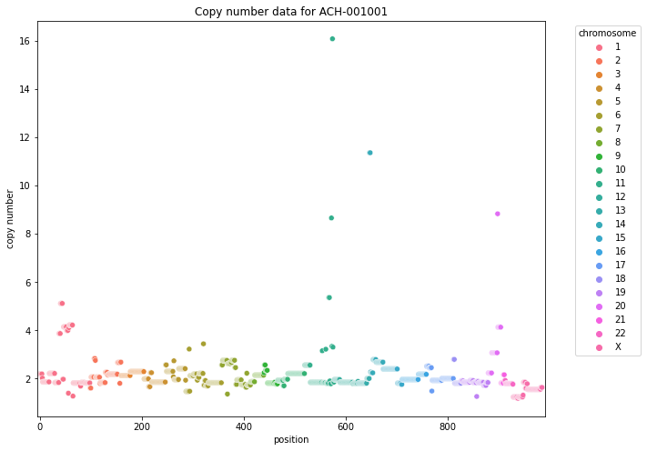

# Prepare data for modeling


```python
import numpy as np
import pandas as pd
from matplotlib import pyplot as plt
import seaborn as sns
import janitor
from pathlib import Path
import re
```


```python
data_dir = Path("../data")
save_dir = Path("../modeling_data")
```

## Cell line information


```python
def show_counts(df, col):
    if type(col) != list:
        col = [col]

    return (
        df[col + ["depmap_id"]]
        .drop_duplicates()
        .groupby(col)
        .count()
        .sort_values("depmap_id", ascending=False)
    )
```


```python
sample_info = pd.read_csv(save_dir / "sample_info.csv")
show_counts(sample_info, "lineage")
```


<div>
<style scoped>
    .dataframe tbody tr th:only-of-type {
        vertical-align: middle;
    }

    .dataframe tbody tr th {
        vertical-align: top;
    }

    .dataframe thead th {
        text-align: right;
    }
</style>
<table border="1" class="dataframe">
  <thead>
    <tr style="text-align: right;">
      <th></th>
      <th>depmap_id</th>
    </tr>
    <tr>
      <th>lineage</th>
      <th></th>
    </tr>
  </thead>
  <tbody>
    <tr>
      <th>lung</th>
      <td>273</td>
    </tr>
    <tr>
      <th>blood</th>
      <td>132</td>
    </tr>
    <tr>
      <th>skin</th>
      <td>113</td>
    </tr>
    <tr>
      <th>lymphocyte</th>
      <td>109</td>
    </tr>
    <tr>
      <th>central_nervous_system</th>
      <td>107</td>
    </tr>
    <tr>
      <th>colorectal</th>
      <td>83</td>
    </tr>
    <tr>
      <th>breast</th>
      <td>82</td>
    </tr>
    <tr>
      <th>upper_aerodigestive</th>
      <td>76</td>
    </tr>
    <tr>
      <th>bone</th>
      <td>75</td>
    </tr>
    <tr>
      <th>ovary</th>
      <td>74</td>
    </tr>
    <tr>
      <th>soft_tissue</th>
      <td>71</td>
    </tr>
    <tr>
      <th>pancreas</th>
      <td>59</td>
    </tr>
    <tr>
      <th>kidney</th>
      <td>57</td>
    </tr>
    <tr>
      <th>gastric</th>
      <td>49</td>
    </tr>
    <tr>
      <th>peripheral_nervous_system</th>
      <td>47</td>
    </tr>
    <tr>
      <th>unknown</th>
      <td>45</td>
    </tr>
    <tr>
      <th>bile_duct</th>
      <td>43</td>
    </tr>
    <tr>
      <th>fibroblast</th>
      <td>43</td>
    </tr>
    <tr>
      <th>uterus</th>
      <td>39</td>
    </tr>
    <tr>
      <th>urinary_tract</th>
      <td>39</td>
    </tr>
    <tr>
      <th>esophagus</th>
      <td>38</td>
    </tr>
    <tr>
      <th>plasma_cell</th>
      <td>34</td>
    </tr>
    <tr>
      <th>liver</th>
      <td>27</td>
    </tr>
    <tr>
      <th>cervix</th>
      <td>22</td>
    </tr>
    <tr>
      <th>thyroid</th>
      <td>21</td>
    </tr>
    <tr>
      <th>prostate</th>
      <td>13</td>
    </tr>
    <tr>
      <th>eye</th>
      <td>9</td>
    </tr>
    <tr>
      <th>engineered</th>
      <td>5</td>
    </tr>
    <tr>
      <th>engineered_bone</th>
      <td>4</td>
    </tr>
    <tr>
      <th>embryo</th>
      <td>4</td>
    </tr>
    <tr>
      <th>engineered_kidney</th>
      <td>3</td>
    </tr>
    <tr>
      <th>engineered_breast</th>
      <td>2</td>
    </tr>
    <tr>
      <th>engineered_prostate</th>
      <td>1</td>
    </tr>
    <tr>
      <th>engineered_ovary</th>
      <td>1</td>
    </tr>
    <tr>
      <th>engineered_lung</th>
      <td>1</td>
    </tr>
    <tr>
      <th>engineered_central_nervous_system</th>
      <td>1</td>
    </tr>
    <tr>
      <th>engineered_blood</th>
      <td>1</td>
    </tr>
    <tr>
      <th>adrenal_cortex</th>
      <td>1</td>
    </tr>
  </tbody>
</table>
</div>


```python
noncancerous_lineages = ["unknown", "embryo"]
engineered_lineages = sample_info[
    sample_info.lineage.str.contains("engineer")
].lineage.to_list()

ignore_lineages = engineered_lineages + noncancerous_lineages
sample_info = sample_info[~sample_info.lineage.isin(ignore_lineages)]

sample_info_columns = [
    "depmap_id",
    "primary_or_metastasis",
    "lineage",
    "lineage_subtype",
]
sample_info = sample_info[sample_info_columns].drop_duplicates()
```

## *KRAS* mutations


```python
# Remove all cell lines with no mutation data.
all_samples_with_mutation_data = pd.read_csv(
    save_dir / "ccle_mutations.csv"
).depmap_id.unique()

sample_info = sample_info.pipe(
    lambda x: x[x.depmap_id.isin(all_samples_with_mutation_data)]
)
```

    /home/jc604/.conda/envs/speclet/lib/python3.7/site-packages/IPython/core/interactiveshell.py:3146: DtypeWarning: Columns (12) have mixed types.Specify dtype option on import or set low_memory=False.
      interactivity=interactivity, compiler=compiler, result=result)


```python
kras_mutations = pd.read_csv(save_dir / "kras_mutations.csv")
kras_mutations = kras_mutations[["depmap_id", "kras_mutation"]]

sample_info = sample_info.merge(kras_mutations, on="depmap_id", how="left").assign(
    kras_mutation=lambda x: x.kras_mutation.fillna("WT")
)
```


```python
sample_info.head()
```


<div>
<style scoped>
    .dataframe tbody tr th:only-of-type {
        vertical-align: middle;
    }

    .dataframe tbody tr th {
        vertical-align: top;
    }

    .dataframe thead th {
        text-align: right;
    }
</style>
<table border="1" class="dataframe">
  <thead>
    <tr style="text-align: right;">
      <th></th>
      <th>depmap_id</th>
      <th>primary_or_metastasis</th>
      <th>lineage</th>
      <th>lineage_subtype</th>
      <th>kras_mutation</th>
    </tr>
  </thead>
  <tbody>
    <tr>
      <th>0</th>
      <td>ACH-000001</td>
      <td>Metastasis</td>
      <td>ovary</td>
      <td>ovary_adenocarcinoma</td>
      <td>WT</td>
    </tr>
    <tr>
      <th>1</th>
      <td>ACH-000002</td>
      <td>Primary</td>
      <td>blood</td>
      <td>AML</td>
      <td>WT</td>
    </tr>
    <tr>
      <th>2</th>
      <td>ACH-000003</td>
      <td>NaN</td>
      <td>colorectal</td>
      <td>colorectal_adenocarcinoma</td>
      <td>WT</td>
    </tr>
    <tr>
      <th>3</th>
      <td>ACH-000004</td>
      <td>NaN</td>
      <td>blood</td>
      <td>AML</td>
      <td>WT</td>
    </tr>
    <tr>
      <th>4</th>
      <td>ACH-000005</td>
      <td>NaN</td>
      <td>blood</td>
      <td>AML</td>
      <td>WT</td>
    </tr>
  </tbody>
</table>
</div>


## Screen data

**TESTING WITH ONLY 1,000 ROWS OF DATA.**


```python
achilles_lfc = pd.read_csv(save_dir / "achilles_logfold_change.csv", nrows=1000)
achilles_lfc.head()
```


<div>
<style scoped>
    .dataframe tbody tr th:only-of-type {
        vertical-align: middle;
    }

    .dataframe tbody tr th {
        vertical-align: top;
    }

    .dataframe thead th {
        text-align: right;
    }
</style>
<table border="1" class="dataframe">
  <thead>
    <tr style="text-align: right;">
      <th></th>
      <th>sgrna</th>
      <th>replicate_id</th>
      <th>lfc</th>
      <th>depmap_id</th>
      <th>pdna_batch</th>
      <th>passes_qc</th>
    </tr>
  </thead>
  <tbody>
    <tr>
      <th>0</th>
      <td>AAAAAAATCCAGCAATGCAG</td>
      <td>143b-311cas9_repa_p6_batch3</td>
      <td>0.289694</td>
      <td>ACH-001001</td>
      <td>3</td>
      <td>True</td>
    </tr>
    <tr>
      <th>1</th>
      <td>AAAAAACCCGTAGATAGCCT</td>
      <td>143b-311cas9_repa_p6_batch3</td>
      <td>0.170172</td>
      <td>ACH-001001</td>
      <td>3</td>
      <td>True</td>
    </tr>
    <tr>
      <th>2</th>
      <td>AAAAAAGAAGAAAAAACCAG</td>
      <td>143b-311cas9_repa_p6_batch3</td>
      <td>-0.695947</td>
      <td>ACH-001001</td>
      <td>3</td>
      <td>True</td>
    </tr>
    <tr>
      <th>3</th>
      <td>AAAAAAGCTCAAGAAGGAGG</td>
      <td>143b-311cas9_repa_p6_batch3</td>
      <td>-0.324935</td>
      <td>ACH-001001</td>
      <td>3</td>
      <td>True</td>
    </tr>
    <tr>
      <th>4</th>
      <td>AAAAAAGGCTGTAAAAGCGT</td>
      <td>143b-311cas9_repa_p6_batch3</td>
      <td>0.142874</td>
      <td>ACH-001001</td>
      <td>3</td>
      <td>True</td>
    </tr>
  </tbody>
</table>
</div>


```python
achilles_guide_map = pd.read_csv(save_dir / "achilles_guide_map.csv")
achilles_guide_map.head()
```


<div>
<style scoped>
    .dataframe tbody tr th:only-of-type {
        vertical-align: middle;
    }

    .dataframe tbody tr th {
        vertical-align: top;
    }

    .dataframe thead th {
        text-align: right;
    }
</style>
<table border="1" class="dataframe">
  <thead>
    <tr style="text-align: right;">
      <th></th>
      <th>sgrna</th>
      <th>genome_alignment</th>
      <th>n_alignments</th>
      <th>hugo_symbol</th>
    </tr>
  </thead>
  <tbody>
    <tr>
      <th>0</th>
      <td>AAAAAAATCCAGCAATGCAG</td>
      <td>chr10_110964620_+</td>
      <td>1</td>
      <td>SHOC2</td>
    </tr>
    <tr>
      <th>1</th>
      <td>AAAAAACCCGTAGATAGCCT</td>
      <td>chr12_95003615_+</td>
      <td>1</td>
      <td>NDUFA12</td>
    </tr>
    <tr>
      <th>2</th>
      <td>AAAAAAGAAGAAAAAACCAG</td>
      <td>chr4_75970356_-</td>
      <td>1</td>
      <td>SDAD1</td>
    </tr>
    <tr>
      <th>3</th>
      <td>AAAAAAGCTCAAGAAGGAGG</td>
      <td>chr2_33588446_-</td>
      <td>1</td>
      <td>FAM98A</td>
    </tr>
    <tr>
      <th>4</th>
      <td>AAAAAAGGCTGTAAAAGCGT</td>
      <td>chr19_19891600_+</td>
      <td>1</td>
      <td>ZNF253</td>
    </tr>
  </tbody>
</table>
</div>


```python
def print_update_on_dataframe(df, i):
    print("--------")
    print(f"update {i}")
    print(f"data frame shape: {df.shape}")
    print(f"data frame columns:")
    print(df.columns.to_list())
    print("--------")
    print("")


modeling_data = pd.merge(
    left=achilles_lfc, right=sample_info, how="inner", on=["depmap_id"]
)

print_update_on_dataframe(modeling_data, 1)

modeling_data = pd.merge(
    left=modeling_data, right=achilles_guide_map, how="inner", on=["sgrna"]
)

print_update_on_dataframe(modeling_data, 2)

modeling_data.head()
```

    --------
    update 1
    data frame shape: (1000, 10)
    data frame columns:
    ['sgrna', 'replicate_id', 'lfc', 'depmap_id', 'pdna_batch', 'passes_qc', 'primary_or_metastasis', 'lineage', 'lineage_subtype', 'kras_mutation']
    --------
    
    --------
    update 2
    data frame shape: (986, 13)
    data frame columns:
    ['sgrna', 'replicate_id', 'lfc', 'depmap_id', 'pdna_batch', 'passes_qc', 'primary_or_metastasis', 'lineage', 'lineage_subtype', 'kras_mutation', 'genome_alignment', 'n_alignments', 'hugo_symbol']
    --------
    


<div>
<style scoped>
    .dataframe tbody tr th:only-of-type {
        vertical-align: middle;
    }

    .dataframe tbody tr th {
        vertical-align: top;
    }

    .dataframe thead th {
        text-align: right;
    }
</style>
<table border="1" class="dataframe">
  <thead>
    <tr style="text-align: right;">
      <th></th>
      <th>sgrna</th>
      <th>replicate_id</th>
      <th>lfc</th>
      <th>depmap_id</th>
      <th>pdna_batch</th>
      <th>passes_qc</th>
      <th>primary_or_metastasis</th>
      <th>lineage</th>
      <th>lineage_subtype</th>
      <th>kras_mutation</th>
      <th>genome_alignment</th>
      <th>n_alignments</th>
      <th>hugo_symbol</th>
    </tr>
  </thead>
  <tbody>
    <tr>
      <th>0</th>
      <td>AAAAAAATCCAGCAATGCAG</td>
      <td>143b-311cas9_repa_p6_batch3</td>
      <td>0.289694</td>
      <td>ACH-001001</td>
      <td>3</td>
      <td>True</td>
      <td>Primary</td>
      <td>bone</td>
      <td>osteosarcoma</td>
      <td>G12S</td>
      <td>chr10_110964620_+</td>
      <td>1</td>
      <td>SHOC2</td>
    </tr>
    <tr>
      <th>1</th>
      <td>AAAAAACCCGTAGATAGCCT</td>
      <td>143b-311cas9_repa_p6_batch3</td>
      <td>0.170172</td>
      <td>ACH-001001</td>
      <td>3</td>
      <td>True</td>
      <td>Primary</td>
      <td>bone</td>
      <td>osteosarcoma</td>
      <td>G12S</td>
      <td>chr12_95003615_+</td>
      <td>1</td>
      <td>NDUFA12</td>
    </tr>
    <tr>
      <th>2</th>
      <td>AAAAAAGAAGAAAAAACCAG</td>
      <td>143b-311cas9_repa_p6_batch3</td>
      <td>-0.695947</td>
      <td>ACH-001001</td>
      <td>3</td>
      <td>True</td>
      <td>Primary</td>
      <td>bone</td>
      <td>osteosarcoma</td>
      <td>G12S</td>
      <td>chr4_75970356_-</td>
      <td>1</td>
      <td>SDAD1</td>
    </tr>
    <tr>
      <th>3</th>
      <td>AAAAAAGCTCAAGAAGGAGG</td>
      <td>143b-311cas9_repa_p6_batch3</td>
      <td>-0.324935</td>
      <td>ACH-001001</td>
      <td>3</td>
      <td>True</td>
      <td>Primary</td>
      <td>bone</td>
      <td>osteosarcoma</td>
      <td>G12S</td>
      <td>chr2_33588446_-</td>
      <td>1</td>
      <td>FAM98A</td>
    </tr>
    <tr>
      <th>4</th>
      <td>AAAAAAGGCTGTAAAAGCGT</td>
      <td>143b-311cas9_repa_p6_batch3</td>
      <td>0.142874</td>
      <td>ACH-001001</td>
      <td>3</td>
      <td>True</td>
      <td>Primary</td>
      <td>bone</td>
      <td>osteosarcoma</td>
      <td>G12S</td>
      <td>chr19_19891600_+</td>
      <td>1</td>
      <td>ZNF253</td>
    </tr>
  </tbody>
</table>
</div>


## Copy number at each guide target


```python
def get_segment_mean(cn_data, depmap_id, chromosome, pos):
    d = cn_data[(cn_data.depmap_id == depmap_id) & (cn_data.chromosome == chromosome)]
    d = d[(d.start <= pos) & (pos <= d.end)]
    if len(d) == 0:
        return None
    elif len(d) > 1:
        raise Exception(f"Data contains more than 1 row of data: {len(d)}")
    else:
        return d.segment_mean.to_list()[0]


def segmentmean_to_copynumber(seg_mean):
    if seg_mean == None:
        return None
    return 2.0 ** seg_mean


def parse_genome_location(gloc):
    d = gloc.split("_")
    d[0] = d[0].replace("chr", "")
    return (d[0], int(d[1]))


cn_segments = pd.read_csv(save_dir / "ccle_semgent_cn.csv")

for i in range(0, len(modeling_data)):
    genome_loc = modeling_data.loc[i, "genome_alignment"]
    depmap_id = modeling_data.loc[i, "depmap_id"]
    g_chr, g_pos = parse_genome_location(genome_loc)

    seg_mean = get_segment_mean(
        cn_data=cn_segments, depmap_id=depmap_id, chromosome=g_chr, pos=g_pos
    )

    modeling_data.at[i, "chromosome"] = g_chr
    modeling_data.at[i, "chr_position"] = g_pos
    modeling_data.at[i, "copy_number"] = segmentmean_to_copynumber(seg_mean)

modeling_data.head(10)
```


<div>
<style scoped>
    .dataframe tbody tr th:only-of-type {
        vertical-align: middle;
    }

    .dataframe tbody tr th {
        vertical-align: top;
    }

    .dataframe thead th {
        text-align: right;
    }
</style>
<table border="1" class="dataframe">
  <thead>
    <tr style="text-align: right;">
      <th></th>
      <th>sgrna</th>
      <th>replicate_id</th>
      <th>lfc</th>
      <th>depmap_id</th>
      <th>pdna_batch</th>
      <th>passes_qc</th>
      <th>primary_or_metastasis</th>
      <th>lineage</th>
      <th>lineage_subtype</th>
      <th>kras_mutation</th>
      <th>genome_alignment</th>
      <th>n_alignments</th>
      <th>hugo_symbol</th>
      <th>chromosome</th>
      <th>chr_position</th>
      <th>copy_number</th>
    </tr>
  </thead>
  <tbody>
    <tr>
      <th>0</th>
      <td>AAAAAAATCCAGCAATGCAG</td>
      <td>143b-311cas9_repa_p6_batch3</td>
      <td>0.289694</td>
      <td>ACH-001001</td>
      <td>3</td>
      <td>True</td>
      <td>Primary</td>
      <td>bone</td>
      <td>osteosarcoma</td>
      <td>G12S</td>
      <td>chr10_110964620_+</td>
      <td>1</td>
      <td>SHOC2</td>
      <td>10</td>
      <td>110964620.0</td>
      <td>2.209053</td>
    </tr>
    <tr>
      <th>1</th>
      <td>AAAAAACCCGTAGATAGCCT</td>
      <td>143b-311cas9_repa_p6_batch3</td>
      <td>0.170172</td>
      <td>ACH-001001</td>
      <td>3</td>
      <td>True</td>
      <td>Primary</td>
      <td>bone</td>
      <td>osteosarcoma</td>
      <td>G12S</td>
      <td>chr12_95003615_+</td>
      <td>1</td>
      <td>NDUFA12</td>
      <td>12</td>
      <td>95003615.0</td>
      <td>1.846840</td>
    </tr>
    <tr>
      <th>2</th>
      <td>AAAAAAGAAGAAAAAACCAG</td>
      <td>143b-311cas9_repa_p6_batch3</td>
      <td>-0.695947</td>
      <td>ACH-001001</td>
      <td>3</td>
      <td>True</td>
      <td>Primary</td>
      <td>bone</td>
      <td>osteosarcoma</td>
      <td>G12S</td>
      <td>chr4_75970356_-</td>
      <td>1</td>
      <td>SDAD1</td>
      <td>4</td>
      <td>75970356.0</td>
      <td>1.859125</td>
    </tr>
    <tr>
      <th>3</th>
      <td>AAAAAAGCTCAAGAAGGAGG</td>
      <td>143b-311cas9_repa_p6_batch3</td>
      <td>-0.324935</td>
      <td>ACH-001001</td>
      <td>3</td>
      <td>True</td>
      <td>Primary</td>
      <td>bone</td>
      <td>osteosarcoma</td>
      <td>G12S</td>
      <td>chr2_33588446_-</td>
      <td>1</td>
      <td>FAM98A</td>
      <td>2</td>
      <td>33588446.0</td>
      <td>2.065029</td>
    </tr>
    <tr>
      <th>4</th>
      <td>AAAAAAGGCTGTAAAAGCGT</td>
      <td>143b-311cas9_repa_p6_batch3</td>
      <td>0.142874</td>
      <td>ACH-001001</td>
      <td>3</td>
      <td>True</td>
      <td>Primary</td>
      <td>bone</td>
      <td>osteosarcoma</td>
      <td>G12S</td>
      <td>chr19_19891600_+</td>
      <td>1</td>
      <td>ZNF253</td>
      <td>19</td>
      <td>19891600.0</td>
      <td>1.833318</td>
    </tr>
    <tr>
      <th>5</th>
      <td>AAAAAAGGGCTCCAAAAAGG</td>
      <td>143b-311cas9_repa_p6_batch3</td>
      <td>-0.299879</td>
      <td>ACH-001001</td>
      <td>3</td>
      <td>True</td>
      <td>Primary</td>
      <td>bone</td>
      <td>osteosarcoma</td>
      <td>G12S</td>
      <td>chr6_26199607_+</td>
      <td>1</td>
      <td>HIST1H2BF</td>
      <td>6</td>
      <td>26199607.0</td>
      <td>2.122252</td>
    </tr>
    <tr>
      <th>6</th>
      <td>AAAAACAACACATCAGAGCG</td>
      <td>143b-311cas9_repa_p6_batch3</td>
      <td>0.083665</td>
      <td>ACH-001001</td>
      <td>3</td>
      <td>True</td>
      <td>Primary</td>
      <td>bone</td>
      <td>osteosarcoma</td>
      <td>G12S</td>
      <td>chr14_64221554_-</td>
      <td>1</td>
      <td>SYNE2</td>
      <td>14</td>
      <td>64221554.0</td>
      <td>2.683534</td>
    </tr>
    <tr>
      <th>7</th>
      <td>AAAAACTCTGGGAAATGACT</td>
      <td>143b-311cas9_repa_p6_batch3</td>
      <td>0.100364</td>
      <td>ACH-001001</td>
      <td>3</td>
      <td>True</td>
      <td>Primary</td>
      <td>bone</td>
      <td>osteosarcoma</td>
      <td>G12S</td>
      <td>chr1_229305137_+</td>
      <td>1</td>
      <td>SPHAR</td>
      <td>1</td>
      <td>229305137.0</td>
      <td>1.823107</td>
    </tr>
    <tr>
      <th>8</th>
      <td>AAAAAGACAACCTCGCCCTG</td>
      <td>143b-311cas9_repa_p6_batch3</td>
      <td>0.337476</td>
      <td>ACH-001001</td>
      <td>3</td>
      <td>True</td>
      <td>Primary</td>
      <td>bone</td>
      <td>osteosarcoma</td>
      <td>G12S</td>
      <td>chr11_64989779_-</td>
      <td>1</td>
      <td>BATF2</td>
      <td>11</td>
      <td>64989779.0</td>
      <td>1.845355</td>
    </tr>
    <tr>
      <th>9</th>
      <td>AAAAAGAGCTGTTTGAACAA</td>
      <td>143b-311cas9_repa_p6_batch3</td>
      <td>0.154017</td>
      <td>ACH-001001</td>
      <td>3</td>
      <td>True</td>
      <td>Primary</td>
      <td>bone</td>
      <td>osteosarcoma</td>
      <td>G12S</td>
      <td>chr1_58689046_-</td>
      <td>1</td>
      <td>MYSM1</td>
      <td>1</td>
      <td>58689046.0</td>
      <td>2.215645</td>
    </tr>
  </tbody>
</table>
</div>


```python
eg_cellline = "ACH-001001"

chromosome_order = [str(a) for a in range(1, 23)] + ["X"]

d = modeling_data[modeling_data.depmap_id == eg_cellline]
d["chromosome"] = pd.Categorical(d.chromosome, categories=chromosome_order)
d = d.sort_values(by=["chromosome", "chr_position"])
d["row_idx"] = list(range(0, len(d)))

fig = plt.figure(figsize=(10, 8))
sns.scatterplot(x="row_idx", y="copy_number", hue="chromosome", data=d)
plt.legend(title="chromosome", bbox_to_anchor=(1.05, 1), loc="upper left")
plt.xlim((0 - 5, len(d) + 5))
plt.xlabel("position")
plt.ylabel("copy number")
plt.title(f"Copy number data for {eg_cellline}")
plt.show()
```


    

    


## Data to still add

- mutations
- RNA expression


```python

```
