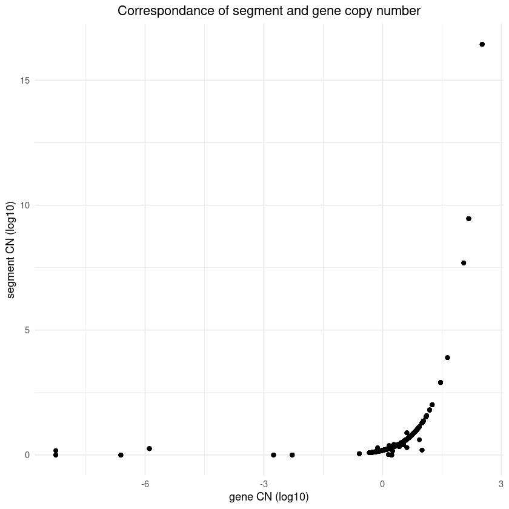
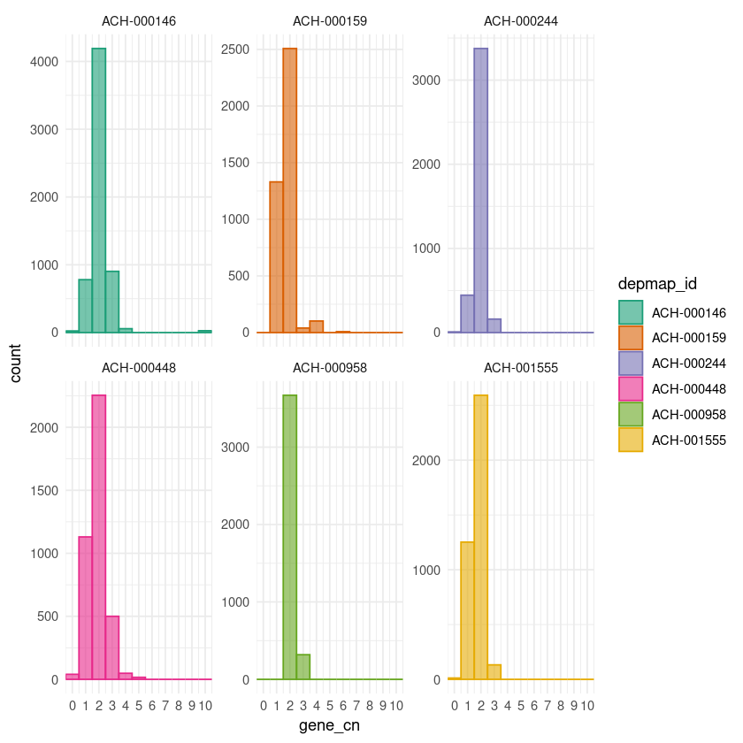
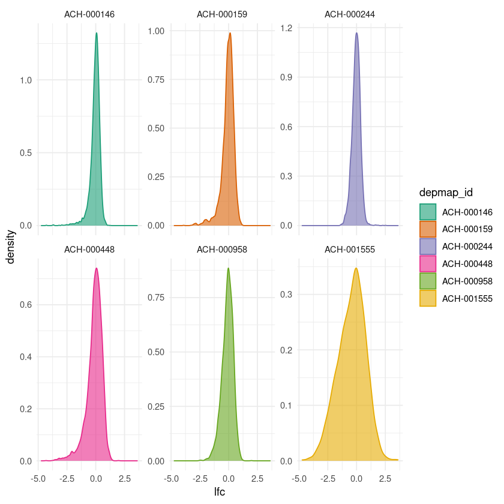
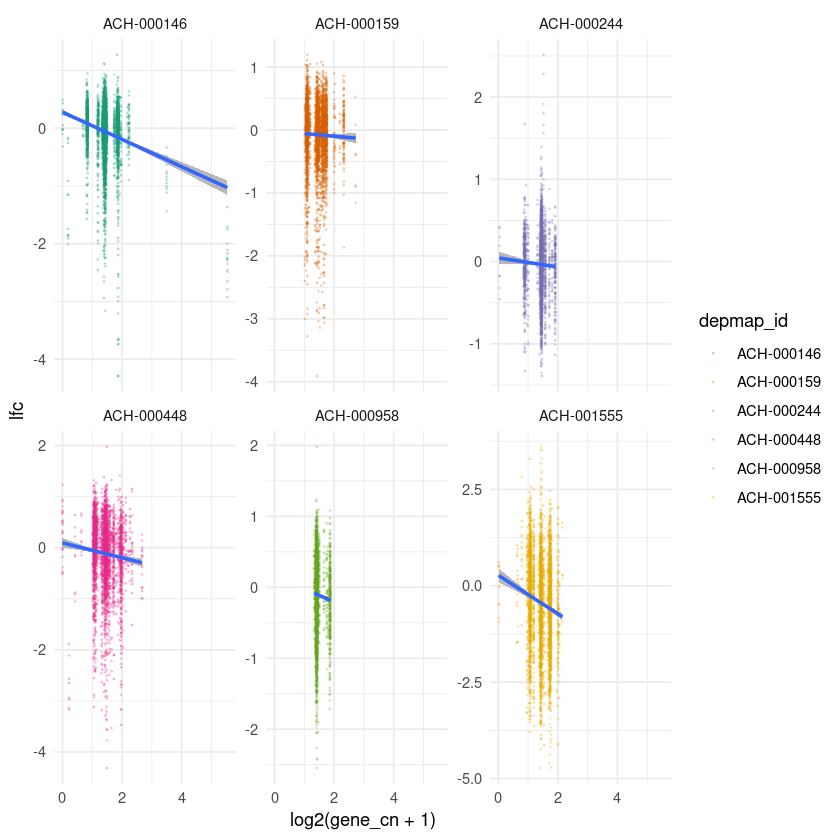
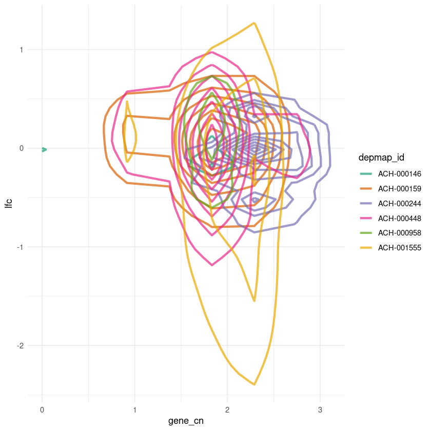

# Make a smaller data set for testing models

```R
library(nakedpipe)
library(tidyverse)

theme_set(theme_minimal(base_size=11))
```

    ── Attaching packages ─────────────────────────────────────── tidyverse 1.3.0 ──
    
    ✔ ggplot2 3.3.2     ✔ purrr   0.3.4
    ✔ tibble  3.0.3     ✔ dplyr   1.0.1
    ✔ tidyr   1.1.1     ✔ stringr 1.4.0
    ✔ readr   1.3.1     ✔ forcats 0.5.0
    
    ── Conflicts ────────────────────────────────────────── tidyverse_conflicts() ──
    ✖ dplyr::filter() masks stats::filter()
    ✖ dplyr::lag()    masks stats::lag()

```R
data_dir <- file.path("..", "modeling_data")
modeling_data_path <- file.path(data_dir, "depmap_modeling_dataframe.csv")
out_path <- file.path(data_dir, "depmap_modeling_dataframe_subsample.csv")
cellline_subsample_out_path <- file.path(data_dir, "depmap_modeling_dataframe_subsample2.csv")
```

```R
modeling_data <- read_csv(modeling_data_path, guess_max = 1e5)
head(modeling_data)
```

    Parsed with column specification:
    cols(
      .default = col_character(),
      lfc = col_double(),
      pdna_batch = col_double(),
      passes_qc = col_logical(),
      n_alignments = col_double(),
      chrom_pos = col_double(),
      segment_mean = col_double(),
      segment_cn = col_double(),
      log2_gene_cn_p1 = col_double(),
      gene_cn = col_double(),
      n_muts = col_double(),
      any_deleterious = col_logical(),
      mutated_at_guide_location = col_logical(),
      rna_expr = col_double()
    )
    
    See spec(...) for full column specifications.

<table>
<caption>A tibble: 6 × 27</caption>
<thead>
	<tr><th scope=col>sgrna</th><th scope=col>replicate_id</th><th scope=col>lfc</th><th scope=col>pdna_batch</th><th scope=col>passes_qc</th><th scope=col>depmap_id</th><th scope=col>primary_or_metastasis</th><th scope=col>lineage</th><th scope=col>lineage_subtype</th><th scope=col>kras_mutation</th><th scope=col>⋯</th><th scope=col>log2_gene_cn_p1</th><th scope=col>gene_cn</th><th scope=col>n_muts</th><th scope=col>any_deleterious</th><th scope=col>variant_classification</th><th scope=col>is_deleterious</th><th scope=col>is_tcga_hotspot</th><th scope=col>is_cosmic_hotspot</th><th scope=col>mutated_at_guide_location</th><th scope=col>rna_expr</th></tr>
	<tr><th scope=col>&lt;chr&gt;</th><th scope=col>&lt;chr&gt;</th><th scope=col>&lt;dbl&gt;</th><th scope=col>&lt;dbl&gt;</th><th scope=col>&lt;lgl&gt;</th><th scope=col>&lt;chr&gt;</th><th scope=col>&lt;chr&gt;</th><th scope=col>&lt;chr&gt;</th><th scope=col>&lt;chr&gt;</th><th scope=col>&lt;chr&gt;</th><th scope=col>⋯</th><th scope=col>&lt;dbl&gt;</th><th scope=col>&lt;dbl&gt;</th><th scope=col>&lt;dbl&gt;</th><th scope=col>&lt;lgl&gt;</th><th scope=col>&lt;chr&gt;</th><th scope=col>&lt;chr&gt;</th><th scope=col>&lt;chr&gt;</th><th scope=col>&lt;chr&gt;</th><th scope=col>&lt;lgl&gt;</th><th scope=col>&lt;dbl&gt;</th></tr>
</thead>
<tbody>
	<tr><td>AAAAAAATCCAGCAATGCAG</td><td>143b-311cas9_repa_p6_batch3</td><td> 0.2896938</td><td>3</td><td>TRUE</td><td>ACH-001001</td><td>Primary</td><td>bone</td><td>osteosarcoma</td><td>G12S</td><td>⋯</td><td>1.0999200</td><td>2.003926</td><td>0</td><td>FALSE</td><td>NA</td><td>NA</td><td>NA</td><td>NA</td><td>FALSE</td><td>4.1009776</td></tr>
	<tr><td>AAAAAACCCGTAGATAGCCT</td><td>143b-311cas9_repa_p6_batch3</td><td> 0.1701723</td><td>3</td><td>TRUE</td><td>ACH-001001</td><td>Primary</td><td>bone</td><td>osteosarcoma</td><td>G12S</td><td>⋯</td><td>0.9146094</td><td>1.495800</td><td>0</td><td>FALSE</td><td>NA</td><td>NA</td><td>NA</td><td>NA</td><td>FALSE</td><td>7.4709435</td></tr>
	<tr><td>AAAAAAGAAGAAAAAACCAG</td><td>143b-311cas9_repa_p6_batch3</td><td>-0.6959467</td><td>3</td><td>TRUE</td><td>ACH-001001</td><td>Primary</td><td>bone</td><td>osteosarcoma</td><td>G12S</td><td>⋯</td><td>0.9219114</td><td>1.514091</td><td>0</td><td>FALSE</td><td>NA</td><td>NA</td><td>NA</td><td>NA</td><td>FALSE</td><td>4.6270231</td></tr>
	<tr><td>AAAAAAGCTCAAGAAGGAGG</td><td>143b-311cas9_repa_p6_batch3</td><td>-0.3249354</td><td>3</td><td>TRUE</td><td>ACH-001001</td><td>Primary</td><td>bone</td><td>osteosarcoma</td><td>G12S</td><td>⋯</td><td>1.0329204</td><td>1.809258</td><td>0</td><td>FALSE</td><td>NA</td><td>NA</td><td>NA</td><td>NA</td><td>FALSE</td><td>4.7750505</td></tr>
	<tr><td>AAAAAAGGCTGTAAAAGCGT</td><td>143b-311cas9_repa_p6_batch3</td><td> 0.1428739</td><td>3</td><td>TRUE</td><td>ACH-001001</td><td>Primary</td><td>bone</td><td>osteosarcoma</td><td>G12S</td><td>⋯</td><td>0.9064726</td><td>1.475575</td><td>0</td><td>FALSE</td><td>NA</td><td>NA</td><td>NA</td><td>NA</td><td>FALSE</td><td>0.2265085</td></tr>
	<tr><td>AAAAAAGGGCTCCAAAAAGG</td><td>143b-311cas9_repa_p6_batch3</td><td>-0.2998787</td><td>3</td><td>TRUE</td><td>ACH-001001</td><td>Primary</td><td>bone</td><td>osteosarcoma</td><td>G12S</td><td>⋯</td><td>1.0604597</td><td>1.887698</td><td>0</td><td>FALSE</td><td>NA</td><td>NA</td><td>NA</td><td>NA</td><td>FALSE</td><td>0.3785116</td></tr>
</tbody>
</table>

```R
glimpse(modeling_data)
```

    Rows: 120,235,860
    Columns: 27
    $ sgrna                     <chr> "AAAAAAATCCAGCAATGCAG", "AAAAAACCCGTAGATAGC…
    $ replicate_id              <chr> "143b-311cas9_repa_p6_batch3", "143b-311cas…
    $ lfc                       <dbl> 0.28969381, 0.17017231, -0.69594665, -0.324…
    $ pdna_batch                <dbl> 3, 3, 3, 3, 3, 3, 3, 3, 3, 3, 3, 3, 3, 3, 3…
    $ passes_qc                 <lgl> TRUE, TRUE, TRUE, TRUE, TRUE, TRUE, TRUE, T…
    $ depmap_id                 <chr> "ACH-001001", "ACH-001001", "ACH-001001", "…
    $ primary_or_metastasis     <chr> "Primary", "Primary", "Primary", "Primary",…
    $ lineage                   <chr> "bone", "bone", "bone", "bone", "bone", "bo…
    $ lineage_subtype           <chr> "osteosarcoma", "osteosarcoma", "osteosarco…
    $ kras_mutation             <chr> "G12S", "G12S", "G12S", "G12S", "G12S", "G1…
    $ genome_alignment          <chr> "chr10_110964620_+", "chr12_95003615_+", "c…
    $ n_alignments              <dbl> 1, 1, 1, 1, 1, 1, 1, 1, 1, 1, 1, 1, 1, 1, 1…
    $ hugo_symbol               <chr> "SHOC2", "NDUFA12", "SDAD1", "FAM98A", "ZNF…
    $ chromosome                <chr> "10", "12", "4", "2", "19", "6", "14", "1",…
    $ chrom_pos                 <dbl> 110964620, 95003615, 75970356, 33588446, 19…
    $ segment_mean              <dbl> 1.1434280, 0.8850587, 0.8946238, 1.0461620,…
    $ segment_cn                <dbl> 2.209053, 1.846840, 1.859125, 2.065029, 1.8…
    $ log2_gene_cn_p1           <dbl> 1.0999200, 0.9146094, 0.9219114, 1.0329204,…
    $ gene_cn                   <dbl> 2.0039256, 1.4958003, 1.5140913, 1.8092579,…
    $ n_muts                    <dbl> 0, 0, 0, 0, 0, 0, 0, 0, 0, 0, 0, 0, 0, 1, 0…
    $ any_deleterious           <lgl> FALSE, FALSE, FALSE, FALSE, FALSE, FALSE, F…
    $ variant_classification    <chr> NA, NA, NA, NA, NA, NA, NA, NA, NA, NA, NA,…
    $ is_deleterious            <chr> NA, NA, NA, NA, NA, NA, NA, NA, NA, NA, NA,…
    $ is_tcga_hotspot           <chr> NA, NA, NA, NA, NA, NA, NA, NA, NA, NA, NA,…
    $ is_cosmic_hotspot         <chr> NA, NA, NA, NA, NA, NA, NA, NA, NA, NA, NA,…
    $ mutated_at_guide_location <lgl> FALSE, FALSE, FALSE, FALSE, FALSE, FALSE, F…
    $ rna_expr                  <dbl> 4.1009776, 7.4709435, 4.6270231, 4.7750505,…

```R
# Number of unique guides.
n_distinct(modeling_data$sgrna)
```

72133

```R
# Number of unique cell lines.
n_distinct(modeling_data$depmap_id)
```

767

```R
# Number of genes.
n_distinct(modeling_data$hugo_symbol)
```

18524

```R
# Some specific genes to subset.
specific_genes <- c("KRAS", "BRAF", "PIK3CA", "PTK2", "MDM2", "TP53")
ceres_correction_genes <- c("TRPS1", "ESR1", "NAMPT", "CDK4")

set.seed(0)
num_random_genes <- 20
subsample_genes <- c(
    sample(unique(modeling_data$hugo_symbol), num_random_genes),
    specific_genes
)

# Check that all genes are actually in the modeling data.
all(subsample_genes %in% modeling_data$hugo_symbol)
```

TRUE

```R
subsample_genes
```

<style>
.list-inline {list-style: none; margin:0; padding: 0}
.list-inline>li {display: inline-block}
.list-inline>li:not(:last-child)::after {content: "\00b7"; padding: 0 .5ex}
</style>
<ol class=list-inline><li>'PHACTR3'</li><li>'ZSWIM8'</li><li>'DPH7'</li><li>'LGALS7B'</li><li>'DISP1'</li><li>'KIF3C'</li><li>'RNF125'</li><li>'LGALS4'</li><li>'SLC7A14'</li><li>'UQCRC1'</li><li>'SCMH1'</li><li>'SMAD7'</li><li>'GHSR'</li><li>'IQCK'</li><li>'NDUFAF3'</li><li>'FAM43B'</li><li>'PDE5A'</li><li>'HIST1H2BO'</li><li>'ADAMTS13'</li><li>'CXCL2'</li><li>'KRAS'</li><li>'BRAF'</li><li>'PIK3CA'</li><li>'PTK2'</li><li>'MDM2'</li><li>'TP53'</li></ol>

```R
sort(unique(modeling_data$lineage))
```

<style>
.list-inline {list-style: none; margin:0; padding: 0}
.list-inline>li {display: inline-block}
.list-inline>li:not(:last-child)::after {content: "\00b7"; padding: 0 .5ex}
</style>
<ol class=list-inline><li>'bile_duct'</li><li>'blood'</li><li>'bone'</li><li>'breast'</li><li>'central_nervous_system'</li><li>'cervix'</li><li>'colorectal'</li><li>'esophagus'</li><li>'eye'</li><li>'fibroblast'</li><li>'gastric'</li><li>'kidney'</li><li>'liver'</li><li>'lung'</li><li>'lymphocyte'</li><li>'ovary'</li><li>'pancreas'</li><li>'peripheral_nervous_system'</li><li>'plasma_cell'</li><li>'prostate'</li><li>'skin'</li><li>'soft_tissue'</li><li>'thyroid'</li><li>'upper_aerodigestive'</li><li>'urinary_tract'</li><li>'uterus'</li></ol>

```R
lineages <- c("colorectal", "pancreas", "lung", "liver", "central_nervous_system")
modeling_data %>%
    filter(lineage %in% lineages) %>%
    distinct(lineage, depmap_id) %>%
    count(lineage)
```

<table>
<caption>A tibble: 5 × 2</caption>
<thead>
	<tr><th scope=col>lineage</th><th scope=col>n</th></tr>
	<tr><th scope=col>&lt;chr&gt;</th><th scope=col>&lt;int&gt;</th></tr>
</thead>
<tbody>
	<tr><td>central_nervous_system</td><td> 60</td></tr>
	<tr><td>colorectal            </td><td> 36</td></tr>
	<tr><td>liver                 </td><td> 22</td></tr>
	<tr><td>lung                  </td><td>106</td></tr>
	<tr><td>pancreas              </td><td> 34</td></tr>
</tbody>
</table>

```R
subsample_modeling_data <- modeling_data %>%
    filter(hugo_symbol %in% !!subsample_genes) %>%
    filter(lineage %in% !!lineages)

pryr::object_size(subsample_modeling_data)
```

    12.4 MB

```R
nrow(subsample_modeling_data)
```

60049

```R
subsample_modeling_data %>%
    filter(is.na(lfc)) %>%
    nrow()
```

0

```R
subsample_modeling_data %>%
    filter(is.na(segment_cn)) %>%
    nrow()
```

206

```R
subsample_modeling_data %>%
    filter(is.na(gene_cn)) %>%
    nrow()
```

0

```R
subsample_modeling_data %>%
    filter(!is.na(segment_cn) & !is.na(gene_cn)) %>%
    ggplot(aes(x = log10(gene_cn), y = log10(segment_cn))) +
    geom_point() +
    theme(plot.title = element_text(hjust = 0.5)) +
    labs(x = "gene CN (log10)",
         y = "segment CN (log10)",
         title = "Correspondance of segment and gene copy number")
```



```R
subsample_modeling_data %>%
    mutate(gene_cn = scales::squish(gene_cn, range = c(0, 10))) %>%
    ggplot(aes(x = gene_cn)) +
    geom_histogram(binwidth = 1) +
    scale_x_continuous(limits = c(0, 10), breaks = c(0:12)) +
    scale_y_continuous(expand = expansion(mult = c(0, 0.02))) +
    theme(plot.title = element_text(hjust = 0.5)) +
    labs(x = "gene CN",
         y = "count",
         title = "Distribution of gene copy number")
```

    Warning message:
    “Removed 2 rows containing missing values (geom_bar).”


```R
write_csv(subsample_modeling_data, out_path)
```

## All genes from a few cell lines

```R
set.seed(0)
num_random_cell_lines <- 5
cell_lines <- c(
    "ACH-000146",  # THP-1
    sample(unique(modeling_data$depmap_id),
           num_random_cell_lines,
           replace = FALSE)
)

cellline_subsample_modeling_data <- modeling_data %>%
    filter(depmap_id %in% !!cell_lines) %>%
    filter(!is.na(gene_cn))

n_genes <- 500
subsample_genes <- sample(unique(cellline_subsample_modeling_data$hugo_symbol),
                          n_genes,
                          replace = FALSE)

cellline_subsample_modeling_data <- cellline_subsample_modeling_data %>%
    filter(hugo_symbol %in% !!subsample_genes)

# Number of data points.
nrow(cellline_subsample_modeling_data)
```

25922

```R
cellline_subsample_modeling_data %>%
    mutate(gene_cn = ifelse(gene_cn < 10, gene_cn, 10)) %>%
    ggplot(aes(x = gene_cn)) +
    facet_wrap(~ depmap_id, nrow = 2, scales = "free_y") +
    geom_histogram(aes(color = depmap_id, fill = depmap_id), binwidth = 1, alpha = 0.6) +
    scale_x_continuous(expand = expansion(mult = c(0, 0)), breaks = 0:12)+
    scale_color_brewer(type = "qual", palette = "Dark2") +
    scale_fill_brewer(type = "qual", palette = "Dark2")
```



```R
cellline_subsample_modeling_data %>%
    ggplot(aes(x = lfc)) +
    facet_wrap(~ depmap_id, nrow = 2, scales = "free_y") +
    geom_density(aes(color = depmap_id, fill = depmap_id), alpha = 0.6) +
    scale_color_brewer(type = "qual", palette = "Dark2") +
    scale_fill_brewer(type = "qual", palette = "Dark2")
```



```R
cellline_subsample_modeling_data %>%
    ggplot(aes(x = log2(gene_cn + 1), y = lfc)) +
    facet_wrap(~ depmap_id, nrow = 2, scales = "free_y") +
    geom_point(aes(color = depmap_id), size = 0.2, alpha = 0.2) +
    geom_smooth(method = "lm", formula = "y ~ x", alpha = 0.7) +
    scale_color_brewer(type = "qual", palette = "Dark2")
```



```R
cellline_subsample_modeling_data %>%
    ggplot(aes(x = gene_cn, y = lfc)) +
    geom_density_2d(aes(color = depmap_id), size = 1.2, alpha = 0.7) +
    scale_color_brewer(type = "qual", palette = "Dark2")
```



```R
write_csv(cellline_subsample_modeling_data, cellline_subsample_out_path)
```
