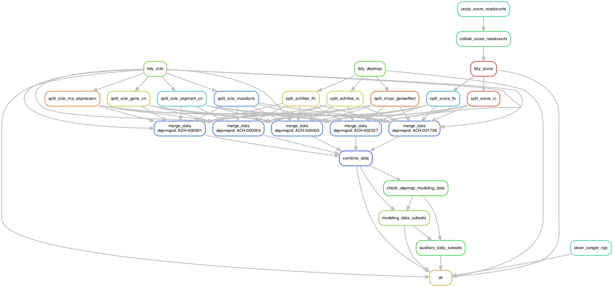

# Data preparation

Raw data is stored in ["data/"](../data) and the prepared data is saved to ["modeling_data/"](../modeling_data).
(The "cache/" directory is for saving intermediate data of analyses.)
See the README in the ["data/"](../data/) for instructions to download the raw data for this project.

A single Snakemake workflow prepares all of the data.
It can be run using the following command in the root directory of the project.

```bash
conda activate ./.speclet_smk_venv
make munge
```

If running on O2, the jobs can be parallelized over the HPC cluster using the following command, instead.

```bash
make munge_o2
```

Below is the DAG of the pipeline (scaled down to just 5 cell lines).


