```python
%load_ext autoreload
%autoreload 2
```

```python
import re
import string
import warnings
from pathlib import Path
from time import time

import arviz as az
import dask
import dask.dataframe as dd
import janitor
import matplotlib.colors as mcolors
import matplotlib.pyplot as plt
import numpy as np
import pandas as pd
import plotnine as gg
import pymc3 as pm
import seaborn as sns
from dask.distributed import Client, progress
from sklearn.decomposition import PCA
from theano import tensor as tt
```

```python
from src.data_processing import achilles as achelp
from src.data_processing import common as dphelp
from src.data_processing import vectors as vhelp
from src.globals import PYMC3
from src.io import cache_io, data_io
from src.loggers import logger
from src.modeling import pymc3_analysis as pmanal
from src.modeling import pymc3_sampling_api as pmapi
from src.plot.color_pal import FitMethodColors, ModelColors, SeabornColor
```

```python
notebook_tic = time()

warnings.simplefilter(action="ignore", category=UserWarning)

sns.set_theme(style="whitegrid")
gg.theme_set(
    gg.theme_bw()
    + gg.theme(
        figure_size=(4, 4),
        axis_ticks_major=gg.element_blank(),
        strip_background=gg.element_blank(),
    )
)
%config InlineBackend.figure_format = "retina"

RANDOM_SEED = 809
np.random.seed(RANDOM_SEED)
```

## Setup

```python
client = Client(n_workers=2, threads_per_worker=2, memory_limit="1GB")
client
```

    <div>
        <div style="
            width: 24px;
            height: 24px;
            background-color: #e1e1e1;
            border: 3px solid #9D9D9D;
            border-radius: 5px;
            position: absolute;"> </div>
        <div style="margin-left: 48px;">
            <h3 style="margin-bottom: 0px;">Client</h3>
            <p style="color: #9D9D9D; margin-bottom: 0px;">Client-4d412b5a-e95b-11eb-a86a-784f4375388f</p>
            <table style="width: 100%; text-align: left;">

        <tr>
            <td style="text-align: left;"><strong>Connection method:</strong> Cluster object</td>
            <td style="text-align: left;"><strong>Cluster type:</strong> LocalCluster</td>
        </tr>

        <tr>
            <td style="text-align: left;">
                <strong>Dashboard: </strong>
                <a href="http://127.0.0.1:8787/status">http://127.0.0.1:8787/status</a>
            </td>
            <td style="text-align: left;"></td>
        </tr>

            </table>

        <details>
        <summary style="margin-bottom: 20px;"><h3 style="display: inline;">Cluster Info</h3></summary>

    <div class="jp-RenderedHTMLCommon jp-RenderedHTML jp-mod-trusted jp-OutputArea-output">
        <div style="
            width: 24px;
            height: 24px;
            background-color: #e1e1e1;
            border: 3px solid #9D9D9D;
            border-radius: 5px;
            position: absolute;"> </div>
        <div style="margin-left: 48px;">
            <h3 style="margin-bottom: 0px; margin-top: 0px;">LocalCluster</h3>
            <p style="color: #9D9D9D; margin-bottom: 0px;">d317f63a</p>
            <table style="width: 100%; text-align: left;">

    <tr>
        <td style="text-align: left;"><strong>Status:</strong> running</td>
        <td style="text-align: left;"><strong>Using processes:</strong> True</td>
    </tr>

    <tr>
        <td style="text-align: left;">
            <strong>Dashboard:</strong> <a href="http://127.0.0.1:8787/status">http://127.0.0.1:8787/status</a>
        </td>
        <td style="text-align: left;"><strong>Workers:</strong> 2</td>
    </tr>
    <tr>
        <td style="text-align: left;">
            <strong>Total threads:</strong>
            4
        </td>
        <td style="text-align: left;">
            <strong>Total memory:</strong>
            1.86 GiB
        </td>
    </tr>

            </table>
            <details>
            <summary style="margin-bottom: 20px;"><h3 style="display: inline;">Scheduler Info</h3></summary>

<div style="">

    <div>
        <div style="
            width: 24px;
            height: 24px;
            background-color: #FFF7E5;
            border: 3px solid #FF6132;
            border-radius: 5px;
            position: absolute;"> </div>
        <div style="margin-left: 48px;">
            <h3 style="margin-bottom: 0px;">Scheduler</h3>
            <p style="color: #9D9D9D; margin-bottom: 0px;">Scheduler-98278fe3-dc2a-4c37-b5e9-f208171eec5a</p>
            <table style="width: 100%; text-align: left;">
                <tr>
                    <td style="text-align: left;"><strong>Comm:</strong> tcp://127.0.0.1:62431</td>
                    <td style="text-align: left;"><strong>Workers:</strong> 2</td>
                </tr>
                <tr>
                    <td style="text-align: left;">
                        <strong>Dashboard:</strong> <a href="http://127.0.0.1:8787/status">http://127.0.0.1:8787/status</a>
                    </td>
                    <td style="text-align: left;">
                        <strong>Total threads:</strong>
                        4
                    </td>
                </tr>
                <tr>
                    <td style="text-align: left;">
                        <strong>Started:</strong>
                        Just now
                    </td>
                    <td style="text-align: left;">
                        <strong>Total memory:</strong>
                        1.86 GiB
                    </td>
                </tr>
            </table>
        </div>
    </div>

    <details style="margin-left: 48px;">
    <summary style="margin-bottom: 20px;"><h3 style="display: inline;">Workers</h3></summary>

    <div style="margin-bottom: 20px;">
        <div style="width: 24px;
                    height: 24px;
                    background-color: #DBF5FF;
                    border: 3px solid #4CC9FF;
                    border-radius: 5px;
                    position: absolute;"> </div>
        <div style="margin-left: 48px;">
        <details>
            <summary>
                <h4 style="margin-bottom: 0px; display: inline;">Worker: 0</h4>
            </summary>
            <table style="width: 100%; text-align: left;">
                <tr>
                    <td style="text-align: left;"><strong>Comm: </strong> tcp://127.0.0.1:62436</td>
                    <td style="text-align: left;"><strong>Total threads: </strong> 2</td>
                </tr>
                <tr>
                    <td style="text-align: left;">
                        <strong>Dashboard: </strong>
                        <a href="http://127.0.0.1:62438/status">http://127.0.0.1:62438/status</a>
                    </td>
                    <td style="text-align: left;">
                        <strong>Memory: </strong>
                        0.93 GiB
                    </td>
                </tr>
                <tr>
                    <td style="text-align: left;"><strong>Nanny: </strong> tcp://127.0.0.1:62434</td>
                    <td style="text-align: left;"></td>
                </tr>
                <tr>
                    <td colspan="2" style="text-align: left;">
                        <strong>Local directory: </strong>
                        /Users/admin/Lab_Projects/speclet/notebooks/crc_model_analysis/dask-worker-space/worker-8ip33be1
                    </td>
                </tr>


            </table>
        </details>
        </div>
    </div>

    <div style="margin-bottom: 20px;">
        <div style="width: 24px;
                    height: 24px;
                    background-color: #DBF5FF;
                    border: 3px solid #4CC9FF;
                    border-radius: 5px;
                    position: absolute;"> </div>
        <div style="margin-left: 48px;">
        <details>
            <summary>
                <h4 style="margin-bottom: 0px; display: inline;">Worker: 1</h4>
            </summary>
            <table style="width: 100%; text-align: left;">
                <tr>
                    <td style="text-align: left;"><strong>Comm: </strong> tcp://127.0.0.1:62435</td>
                    <td style="text-align: left;"><strong>Total threads: </strong> 2</td>
                </tr>
                <tr>
                    <td style="text-align: left;">
                        <strong>Dashboard: </strong>
                        <a href="http://127.0.0.1:62437/status">http://127.0.0.1:62437/status</a>
                    </td>
                    <td style="text-align: left;">
                        <strong>Memory: </strong>
                        0.93 GiB
                    </td>
                </tr>
                <tr>
                    <td style="text-align: left;"><strong>Nanny: </strong> tcp://127.0.0.1:62433</td>
                    <td style="text-align: left;"></td>
                </tr>
                <tr>
                    <td colspan="2" style="text-align: left;">
                        <strong>Local directory: </strong>
                        /Users/admin/Lab_Projects/speclet/notebooks/crc_model_analysis/dask-worker-space/worker-m53aumen
                    </td>
                </tr>


            </table>
        </details>
        </div>
    </div>

    </details>
</div>

            </details>
        </div>
    </div>

        </details>

        </div>
    </div>

```python
data_path = data_io.data_path(data_io.DataFile.crc_data)
if data_path.exists():
    print(f"data file: '{data_path.as_posix()}'")
else:
    raise FileNotFoundError(data_path)
```

    data file: '/Users/admin/Lab_Projects/speclet/modeling_data/depmap_modeling_dataframe_crc.csv'

```python
data_types: dict[str, str] = {"age": "float64"}
for a in [
    "p_dna_batch",
    "replicate_id",
    "depmap_id",
    "hugo_symbol",
    "screen",
    "lineage",
]:
    data_types[a] = "category"

crc_data = dd.read_csv(data_path, dtype=data_types)
crc_data.head(5)
```

<div>
<style scoped>
    .dataframe tbody tr th:only-of-type {
        vertical-align: middle;
    }

    .dataframe tbody tr th {
        vertical-align: top;
    }

    .dataframe thead th {
        text-align: right;
    }
</style>
<table border="1" class="dataframe">
  <thead>
    <tr style="text-align: right;">
      <th></th>
      <th>sgrna</th>
      <th>replicate_id</th>
      <th>lfc</th>
      <th>p_dna_batch</th>
      <th>genome_alignment</th>
      <th>hugo_symbol</th>
      <th>screen</th>
      <th>multiple_hits_on_gene</th>
      <th>sgrna_target_chr</th>
      <th>sgrna_target_pos</th>
      <th>...</th>
      <th>num_mutations</th>
      <th>any_deleterious</th>
      <th>any_tcga_hotspot</th>
      <th>any_cosmic_hotspot</th>
      <th>is_mutated</th>
      <th>copy_number</th>
      <th>lineage</th>
      <th>primary_or_metastasis</th>
      <th>is_male</th>
      <th>age</th>
    </tr>
  </thead>
  <tbody>
    <tr>
      <th>0</th>
      <td>AAACCTGCGGCGGTCGCCA</td>
      <td>LS513_c903R1</td>
      <td>0.563383</td>
      <td>ERS717283.plasmid</td>
      <td>chr8_66505451_-</td>
      <td>VXN</td>
      <td>sanger</td>
      <td>True</td>
      <td>8</td>
      <td>66505451</td>
      <td>...</td>
      <td>0</td>
      <td>NaN</td>
      <td>NaN</td>
      <td>NaN</td>
      <td>False</td>
      <td>0.956651</td>
      <td>colorectal</td>
      <td>primary</td>
      <td>True</td>
      <td>63.0</td>
    </tr>
    <tr>
      <th>1</th>
      <td>AAAGCCCAGGAGTATGGGAG</td>
      <td>LS513-311Cas9_RepA_p6_batch2</td>
      <td>0.594321</td>
      <td>2</td>
      <td>chr2_130522105_-</td>
      <td>CFC1B</td>
      <td>broad</td>
      <td>True</td>
      <td>2</td>
      <td>130522105</td>
      <td>...</td>
      <td>0</td>
      <td>NaN</td>
      <td>NaN</td>
      <td>NaN</td>
      <td>False</td>
      <td>0.953860</td>
      <td>colorectal</td>
      <td>primary</td>
      <td>True</td>
      <td>63.0</td>
    </tr>
    <tr>
      <th>2</th>
      <td>AAATCAGAGAAACCTGAACG</td>
      <td>LS513-311Cas9_RepA_p6_batch2</td>
      <td>-0.363633</td>
      <td>2</td>
      <td>chr11_89916950_-</td>
      <td>TRIM49D1</td>
      <td>broad</td>
      <td>True</td>
      <td>11</td>
      <td>89916950</td>
      <td>...</td>
      <td>0</td>
      <td>NaN</td>
      <td>NaN</td>
      <td>NaN</td>
      <td>False</td>
      <td>0.960466</td>
      <td>colorectal</td>
      <td>primary</td>
      <td>True</td>
      <td>63.0</td>
    </tr>
    <tr>
      <th>3</th>
      <td>AACAGCACACCGGCCCCGT</td>
      <td>LS513_c903R1</td>
      <td>-0.512694</td>
      <td>ERS717283.plasmid</td>
      <td>chrX_156009834_-</td>
      <td>IL9R</td>
      <td>sanger</td>
      <td>True</td>
      <td>X</td>
      <td>156009834</td>
      <td>...</td>
      <td>0</td>
      <td>NaN</td>
      <td>NaN</td>
      <td>NaN</td>
      <td>False</td>
      <td>0.478776</td>
      <td>colorectal</td>
      <td>primary</td>
      <td>True</td>
      <td>63.0</td>
    </tr>
    <tr>
      <th>4</th>
      <td>AACCTCCGGACTCCTCAGC</td>
      <td>LS513_c903R1</td>
      <td>-0.075108</td>
      <td>ERS717283.plasmid</td>
      <td>chr7_39609658_-</td>
      <td>YAE1</td>
      <td>sanger</td>
      <td>True</td>
      <td>7</td>
      <td>39609658</td>
      <td>...</td>
      <td>0</td>
      <td>NaN</td>
      <td>NaN</td>
      <td>NaN</td>
      <td>False</td>
      <td>1.437966</td>
      <td>colorectal</td>
      <td>primary</td>
      <td>True</td>
      <td>63.0</td>
    </tr>
  </tbody>
</table>
<p>5 rows × 22 columns</p>
</div>

```python
crc_data.columns
```

    Index(['sgrna', 'replicate_id', 'lfc', 'p_dna_batch', 'genome_alignment',
           'hugo_symbol', 'screen', 'multiple_hits_on_gene', 'sgrna_target_chr',
           'sgrna_target_pos', 'depmap_id', 'rna_expr', 'num_mutations',
           'any_deleterious', 'any_tcga_hotspot', 'any_cosmic_hotspot',
           'is_mutated', 'copy_number', 'lineage', 'primary_or_metastasis',
           'is_male', 'age'],
          dtype='object')

## Analysis

### Overview

```python
for col, lbl in {
    "sgrna": "sgRNA",
    "hugo_symbol": "genes",
    "depmap_id": "cell lines",
    "lineage": "lineages",
    "screen": "data sources",
}.items():
    count = len(crc_data[col].unique())
    print(f"num {lbl}: {count:,}")
```

    num sgRNA: 157,808
    num genes: 18,182
    num cell lines: 54
    num lineages: 1
    num data sources: 2

```python
crc_data[["screen", "depmap_id"]].drop_duplicates().groupby("screen").count().compute()
```

<div>
<style scoped>
    .dataframe tbody tr th:only-of-type {
        vertical-align: middle;
    }

    .dataframe tbody tr th {
        vertical-align: top;
    }

    .dataframe thead th {
        text-align: right;
    }
</style>
<table border="1" class="dataframe">
  <thead>
    <tr style="text-align: right;">
      <th></th>
      <th>depmap_id</th>
    </tr>
    <tr>
      <th>screen</th>
      <th></th>
    </tr>
  </thead>
  <tbody>
    <tr>
      <th>broad</th>
      <td>39</td>
    </tr>
    <tr>
      <th>sanger</th>
      <td>31</td>
    </tr>
  </tbody>
</table>
</div>

### Comparing cell lines included in both screens

```python
celllines_in_both_screens = (
    crc_data[["screen", "depmap_id"]]
    .drop_duplicates()
    .groupby("depmap_id")
    .count()
    .compute()
    .query("screen > 1")
    .reset_index(drop=False)["depmap_id"]
    .tolist()
)

celllines_in_both_screens
```

    ['ACH-000007',
     'ACH-000009',
     'ACH-000249',
     'ACH-000350',
     'ACH-000381',
     'ACH-000421',
     'ACH-000552',
     'ACH-000651',
     'ACH-000926',
     'ACH-000935',
     'ACH-000943',
     'ACH-000950',
     'ACH-000957',
     'ACH-000958',
     'ACH-000969',
     'ACH-001345']

```python
double_screen_data = crc_data[
    crc_data.depmap_id.isin(celllines_in_both_screens)
].compute()
double_screen_data.shape
```

    (2524928, 22)

```python
plt.figure(figsize=(12, 5))
ax = sns.boxenplot(
    data=double_screen_data,
    x="depmap_id",
    y="lfc",
    hue="screen",
    showfliers=False,
)
plt.xticks(rotation=90)
ax.set_xlabel("cell line")
ax.set_ylabel("log fold change")
plt.show()
```

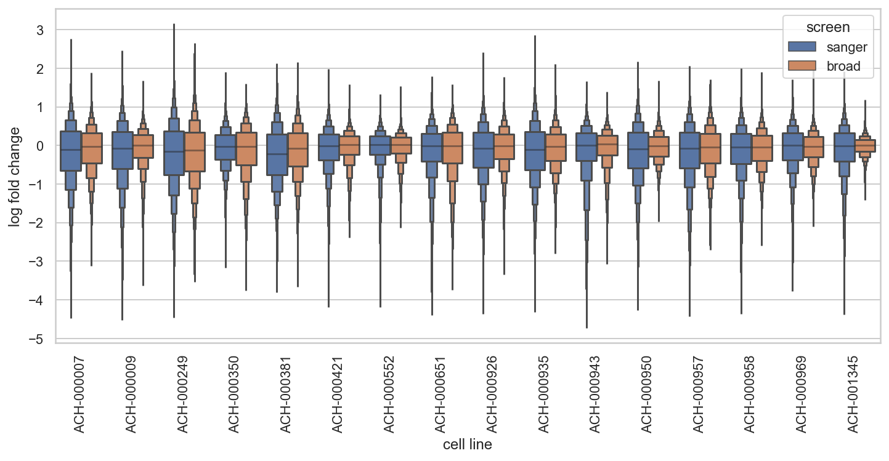

```python
double_screen_avg_lfc = (
    double_screen_data.groupby(["hugo_symbol", "depmap_id", "screen"])["lfc"]
    .mean()
    .reset_index(drop=False)
)

double_screen_gene_corr = double_screen_avg_lfc.pivot_wider(
    index=["hugo_symbol", "depmap_id"], names_from="screen", values_from="lfc"
)
double_screen_gene_corr = (
    double_screen_gene_corr.groupby("hugo_symbol")["broad"]
    .corr(double_screen_gene_corr["sanger"])
    .reset_index(drop=False)
    .rename(columns={"broad": "correlation"})
)

double_screen_gene_corr.head()
```

<div>
<style scoped>
    .dataframe tbody tr th:only-of-type {
        vertical-align: middle;
    }

    .dataframe tbody tr th {
        vertical-align: top;
    }

    .dataframe thead th {
        text-align: right;
    }
</style>
<table border="1" class="dataframe">
  <thead>
    <tr style="text-align: right;">
      <th></th>
      <th>hugo_symbol</th>
      <th>correlation</th>
    </tr>
  </thead>
  <tbody>
    <tr>
      <th>0</th>
      <td>A1BG</td>
      <td>0.114426</td>
    </tr>
    <tr>
      <th>1</th>
      <td>A1CF</td>
      <td>-0.084924</td>
    </tr>
    <tr>
      <th>2</th>
      <td>A2M</td>
      <td>0.076944</td>
    </tr>
    <tr>
      <th>3</th>
      <td>A2ML1</td>
      <td>-0.252467</td>
    </tr>
    <tr>
      <th>4</th>
      <td>A3GALT2</td>
      <td>-0.138956</td>
    </tr>
  </tbody>
</table>
</div>

```python
screen_averages = (
    double_screen_avg_lfc.groupby(["hugo_symbol", "screen"])["lfc"]
    .mean()
    .reset_index(drop=False)
    .pivot_wider(index=["hugo_symbol"], names_from="screen", values_from="lfc")
)

screen_gene_corr_avgs = double_screen_gene_corr.merge(screen_averages, on="hugo_symbol")

for screen in ("broad", "sanger"):
    jg = sns.jointplot(data=screen_gene_corr_avgs, x=screen, y="correlation", alpha=0.1)
    jg.ax_joint.set_xlabel(f"avg. lfc in {screen.upper()} screen")
    jg.ax_joint.set_ylabel(f"correlation between screens")
    plt.show()
```

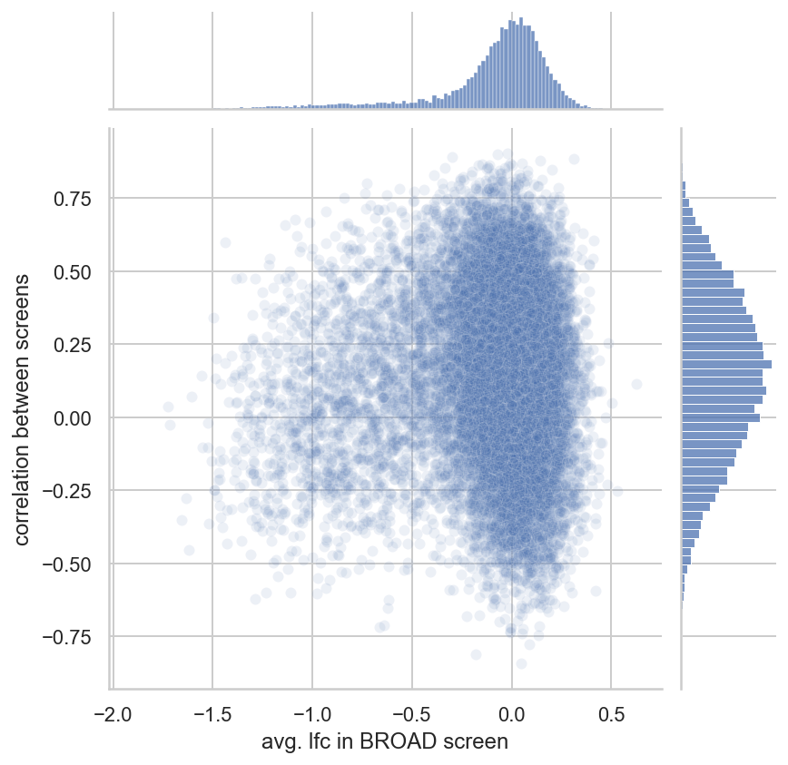

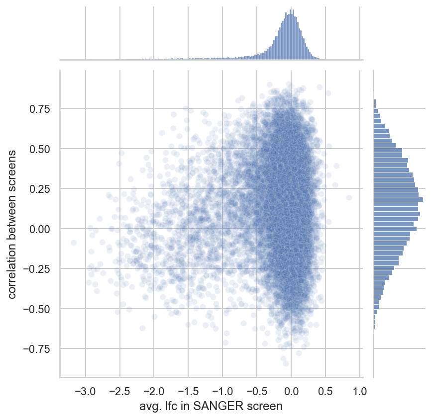

### Correlations of LFC and other factors

```python
crc_data_avgs = (
    crc_data[crc_data.screen == "broad"][
        ["depmap_id", "hugo_symbol", "lfc", "rna_expr", "copy_number"]
    ]
    .groupby(["depmap_id", "hugo_symbol"])
    .mean()
    .compute()
    .reset_index(drop=False)
)
```

#### RNA expression

```python
df = crc_data_avgs.assign(
    rna_expr_bin=lambda d: np.round(d.rna_expr).astype(int)
).assign(rna_expr_lbl=lambda d: d.rna_expr_bin.astype(str))

palette = sns.color_palette("flare", n_colors=len(df.rna_expr_bin.unique()))

fg = sns.catplot(
    data=df,
    x="rna_expr_bin",
    y="lfc",
    kind="box",
    palette=palette,
    col="depmap_id",
    col_wrap=5,
    sharey=False,
    flierprops={"alpha": 0.3},
)
fg.set_axis_labels(r"RNA expression ($\log$ TPM+1)", "log fold change")
plt.show()
```


#### Gene copy number

```python
df = crc_data_avgs.assign(
    copy_number=lambda d: vhelp.squish_array(d.copy_number, lower=0, upper=10),
    copy_number_bin=lambda d: np.round(d.copy_number * 2).astype(int) / 2,
)

palette = sns.color_palette("flare", n_colors=len(df.copy_number_bin.unique()))

fg = sns.catplot(
    data=df,
    x="copy_number_bin",
    y="lfc",
    kind="box",
    palette=palette,
    col="depmap_id",
    col_wrap=5,
    sharex=False,
    sharey=False,
    flierprops={"alpha": 0.3},
)
fg.set_axis_labels("copy number (max. 10)")
plt.show()
```

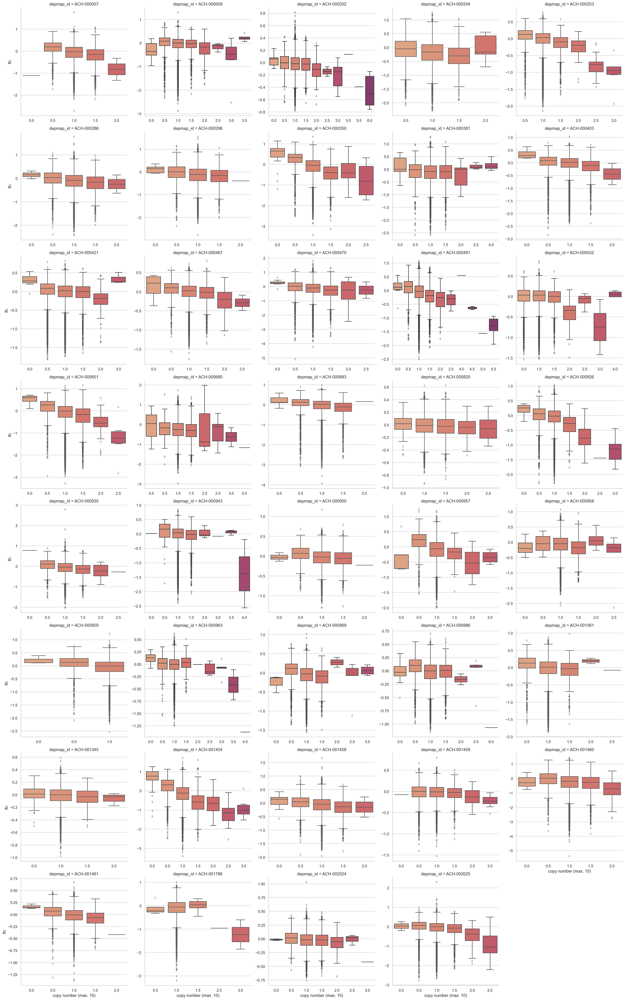

#### Mutations

```python
mutation_counts = (
    crc_data[crc_data.screen == "broad"][
        [
            "hugo_symbol",
            "depmap_id",
            "is_mutated",
            "any_tcga_hotspot",
            "any_deleterious",
        ]
    ]
    .drop_duplicates()
    .fillna({"is_mutated": False, "any_tcga_hotspot": False, "any_deleterious": False})
    .groupby("hugo_symbol")[["is_mutated", "any_tcga_hotspot", "any_deleterious"]]
    .agg("mean")
    .compute()
    .reset_index(drop=False)
)

mutation_counts.head()
```

<div>
<style scoped>
    .dataframe tbody tr th:only-of-type {
        vertical-align: middle;
    }

    .dataframe tbody tr th {
        vertical-align: top;
    }

    .dataframe thead th {
        text-align: right;
    }
</style>
<table border="1" class="dataframe">
  <thead>
    <tr style="text-align: right;">
      <th></th>
      <th>hugo_symbol</th>
      <th>is_mutated</th>
      <th>any_tcga_hotspot</th>
      <th>any_deleterious</th>
    </tr>
  </thead>
  <tbody>
    <tr>
      <th>0</th>
      <td>A1BG</td>
      <td>0.128205</td>
      <td>0.0</td>
      <td>0.051282</td>
    </tr>
    <tr>
      <th>1</th>
      <td>A1CF</td>
      <td>0.025641</td>
      <td>0.0</td>
      <td>0.000000</td>
    </tr>
    <tr>
      <th>2</th>
      <td>A2M</td>
      <td>0.153846</td>
      <td>0.0</td>
      <td>0.051282</td>
    </tr>
    <tr>
      <th>3</th>
      <td>A2ML1</td>
      <td>0.153846</td>
      <td>0.0</td>
      <td>0.051282</td>
    </tr>
    <tr>
      <th>4</th>
      <td>A3GALT2</td>
      <td>0.128205</td>
      <td>0.0</td>
      <td>0.051282</td>
    </tr>
  </tbody>
</table>
</div>

```python
mutation_counts.sort_values("is_mutated", ascending=False).head(10)
```

<div>
<style scoped>
    .dataframe tbody tr th:only-of-type {
        vertical-align: middle;
    }

    .dataframe tbody tr th {
        vertical-align: top;
    }

    .dataframe thead th {
        text-align: right;
    }
</style>
<table border="1" class="dataframe">
  <thead>
    <tr style="text-align: right;">
      <th></th>
      <th>hugo_symbol</th>
      <th>is_mutated</th>
      <th>any_tcga_hotspot</th>
      <th>any_deleterious</th>
    </tr>
  </thead>
  <tbody>
    <tr>
      <th>16571</th>
      <td>TTN</td>
      <td>0.871795</td>
      <td>0.076923</td>
      <td>0.358974</td>
    </tr>
    <tr>
      <th>804</th>
      <td>APC</td>
      <td>0.846154</td>
      <td>0.435897</td>
      <td>0.743590</td>
    </tr>
    <tr>
      <th>16203</th>
      <td>TP53</td>
      <td>0.666667</td>
      <td>0.641026</td>
      <td>0.256410</td>
    </tr>
    <tr>
      <th>9550</th>
      <td>MUC16</td>
      <td>0.641026</td>
      <td>0.025641</td>
      <td>0.153846</td>
    </tr>
    <tr>
      <th>15188</th>
      <td>SYNE1</td>
      <td>0.589744</td>
      <td>0.025641</td>
      <td>0.256410</td>
    </tr>
    <tr>
      <th>17495</th>
      <td>ZFHX3</td>
      <td>0.538462</td>
      <td>0.025641</td>
      <td>0.179487</td>
    </tr>
    <tr>
      <th>10429</th>
      <td>OBSCN</td>
      <td>0.538462</td>
      <td>0.000000</td>
      <td>0.153846</td>
    </tr>
    <tr>
      <th>7954</th>
      <td>KRAS</td>
      <td>0.538462</td>
      <td>0.512821</td>
      <td>0.025641</td>
    </tr>
    <tr>
      <th>34</th>
      <td>ABCA13</td>
      <td>0.512821</td>
      <td>0.025641</td>
      <td>0.205128</td>
    </tr>
    <tr>
      <th>7931</th>
      <td>KMT2C</td>
      <td>0.512821</td>
      <td>0.000000</td>
      <td>0.102564</td>
    </tr>
  </tbody>
</table>
</div>

```python
top_mut_genes = (
    mutation_counts.sort_values("is_mutated", ascending=False)
    .head(20)
    .hugo_symbol.tolist()
)
top_mut_genes_data = crc_data[crc_data.hugo_symbol.isin(top_mut_genes)].compute()
```

```python
is_mutated_palette = {False: SeabornColor.BLUE, True: SeabornColor.RED}

fig = plt.figure(figsize=(15, 5))
sns.boxenplot(
    data=top_mut_genes_data,
    x="hugo_symbol",
    y="lfc",
    hue="is_mutated",
    palette=is_mutated_palette,
)
plt.title("Most frequently mutated")
plt.show()
```

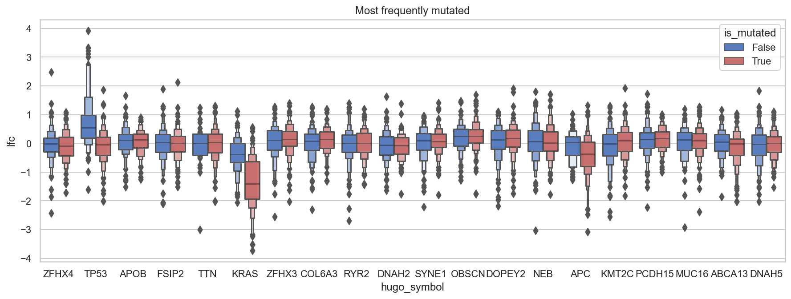

```python
cgc_genes = (
    pd.read_csv(data_io.data_path(data_io.DataFile.cgc))
    .dropna(subset=["tumor_types_somatic"])
    .filter_string("tumor_types_somatic", "color")
    .query("is_oncogene")
    .hugo_symbol.tolist()
)
cgc_genes_data = crc_data[crc_data.hugo_symbol.isin(cgc_genes)].compute()
```

```python
fig = plt.figure(figsize=(8, 5))
ax = sns.boxenplot(
    data=cgc_genes_data,
    x="hugo_symbol",
    y="lfc",
    hue="is_mutated",
    palette=is_mutated_palette,
)
plt.legend(loc="upper right")
ax.set_xlabel("")
ax.set_ylabel("log fold change")
plt.title("CGC oncogenes")
plt.show()
```

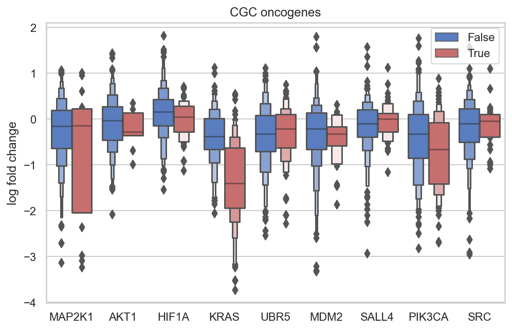

#### Batches

```python
crc_depmap_batches = (
    crc_data[crc_data.screen == "broad"][["depmap_id", "replicate_id", "p_dna_batch"]]
    .drop_duplicates()
    .compute()
    .reset_index(drop=True)
    .sort_values(["replicate_id", "p_dna_batch"])
)
```

```python
lfc_matrix = (
    crc_data[crc_data.screen == "broad"][["depmap_id", "hugo_symbol", "lfc"]]
    .dropna()
    .assign(
        depmap_id=lambda d: d.depmap_id.astype(str).astype("category"),
        hugo_symbol=lambda d: d.hugo_symbol.astype(str).astype("category"),
    )
    .groupby(["depmap_id", "hugo_symbol"])["lfc"]
    .mean()
    .reset_index(drop=False)
    .compute()
    .pivot_wider(index="hugo_symbol", names_from="depmap_id", values_from="lfc")
    .set_index("hugo_symbol")
)
```

<div>
<style scoped>
    .dataframe tbody tr th:only-of-type {
        vertical-align: middle;
    }

    .dataframe tbody tr th {
        vertical-align: top;
    }

    .dataframe thead th {
        text-align: right;
    }
</style>
<table border="1" class="dataframe">
  <thead>
    <tr style="text-align: right;">
      <th></th>
      <th>ACH-000007</th>
      <th>ACH-000009</th>
      <th>ACH-000202</th>
      <th>ACH-000249</th>
      <th>ACH-000253</th>
      <th>ACH-000286</th>
      <th>ACH-000296</th>
      <th>ACH-000350</th>
      <th>ACH-000381</th>
      <th>ACH-000403</th>
      <th>...</th>
      <th>ACH-001061</th>
      <th>ACH-001345</th>
      <th>ACH-001454</th>
      <th>ACH-001458</th>
      <th>ACH-001459</th>
      <th>ACH-001460</th>
      <th>ACH-001461</th>
      <th>ACH-001786</th>
      <th>ACH-002024</th>
      <th>ACH-002025</th>
    </tr>
    <tr>
      <th>hugo_symbol</th>
      <th></th>
      <th></th>
      <th></th>
      <th></th>
      <th></th>
      <th></th>
      <th></th>
      <th></th>
      <th></th>
      <th></th>
      <th></th>
      <th></th>
      <th></th>
      <th></th>
      <th></th>
      <th></th>
      <th></th>
      <th></th>
      <th></th>
      <th></th>
      <th></th>
    </tr>
  </thead>
  <tbody>
    <tr>
      <th>A1BG</th>
      <td>0.263330</td>
      <td>0.117063</td>
      <td>0.043549</td>
      <td>0.197158</td>
      <td>0.085684</td>
      <td>-0.005583</td>
      <td>0.264494</td>
      <td>-0.124022</td>
      <td>0.191794</td>
      <td>-0.057930</td>
      <td>...</td>
      <td>-0.058944</td>
      <td>0.179750</td>
      <td>0.336333</td>
      <td>0.127735</td>
      <td>0.164985</td>
      <td>0.185749</td>
      <td>0.093007</td>
      <td>0.246758</td>
      <td>0.049979</td>
      <td>0.186511</td>
    </tr>
    <tr>
      <th>A1CF</th>
      <td>0.067489</td>
      <td>-0.191944</td>
      <td>0.019997</td>
      <td>0.472816</td>
      <td>0.276590</td>
      <td>-0.069105</td>
      <td>-0.108203</td>
      <td>-0.088249</td>
      <td>0.287866</td>
      <td>0.130719</td>
      <td>...</td>
      <td>0.226356</td>
      <td>0.027765</td>
      <td>0.029871</td>
      <td>-0.064838</td>
      <td>0.085629</td>
      <td>0.181699</td>
      <td>0.111500</td>
      <td>-0.070128</td>
      <td>0.094714</td>
      <td>0.104698</td>
    </tr>
    <tr>
      <th>A2M</th>
      <td>-0.328769</td>
      <td>-0.228030</td>
      <td>-0.056109</td>
      <td>-0.338420</td>
      <td>0.203810</td>
      <td>-0.253921</td>
      <td>-0.251849</td>
      <td>-0.059703</td>
      <td>0.155701</td>
      <td>0.074438</td>
      <td>...</td>
      <td>0.142748</td>
      <td>-0.121233</td>
      <td>-1.058760</td>
      <td>-0.236498</td>
      <td>-0.160679</td>
      <td>-0.082952</td>
      <td>-0.038935</td>
      <td>0.177989</td>
      <td>0.013819</td>
      <td>-0.361081</td>
    </tr>
    <tr>
      <th>A2ML1</th>
      <td>0.060252</td>
      <td>-0.033755</td>
      <td>0.026995</td>
      <td>0.189971</td>
      <td>0.424612</td>
      <td>0.379364</td>
      <td>-0.076107</td>
      <td>0.074040</td>
      <td>0.301678</td>
      <td>-0.110775</td>
      <td>...</td>
      <td>0.091930</td>
      <td>0.167014</td>
      <td>-0.285079</td>
      <td>0.283701</td>
      <td>-0.075642</td>
      <td>0.276590</td>
      <td>0.145096</td>
      <td>0.102807</td>
      <td>0.144290</td>
      <td>-0.010408</td>
    </tr>
    <tr>
      <th>A3GALT2</th>
      <td>-0.152007</td>
      <td>0.230585</td>
      <td>0.147042</td>
      <td>-0.304506</td>
      <td>0.117917</td>
      <td>-0.545455</td>
      <td>-0.208200</td>
      <td>0.015848</td>
      <td>-0.216646</td>
      <td>0.296448</td>
      <td>...</td>
      <td>0.108060</td>
      <td>0.010429</td>
      <td>-0.318113</td>
      <td>0.298646</td>
      <td>-0.108762</td>
      <td>-0.538204</td>
      <td>0.083982</td>
      <td>0.290878</td>
      <td>-0.139611</td>
      <td>0.224688</td>
    </tr>
  </tbody>
</table>
<p>5 rows × 39 columns</p>
</div>

```python
def head_frac(df: pd.DataFrame, frac: float = 0.1) -> pd.DataFrame:
    if frac < 0.0 or frac > 1.0:
        raise ValueError(f"Value ({frac}) must be between 0 and 1.")
    return df.head(int(df.shape[0] * frac))


top_var_genes = (
    lfc_matrix.T.var()
    .reset_index(drop=False)
    .sort_values(0, ascending=False)
    .pipe(head_frac)
    .hugo_symbol.tolist()
)

len(top_var_genes)
```

    1811

```python
pca = PCA(n_components=10)
pca_lfc_matrix = pca.fit_transform(lfc_matrix.loc[top_var_genes].values.T)
```

```python
ax = sns.barplot(
    x=list(range(1, 11)), y=pca.explained_variance_ratio_, color=SeabornColor.BLUE
)
ax.set_xlabel("principal component")
ax.set_ylabel("explained variance ratio")
plt.show()
```

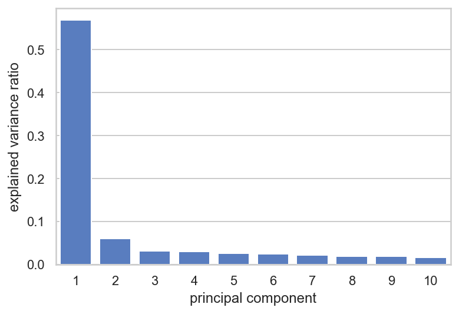

```python
cellline_info = (
    crc_data[crc_data.screen == "broad"][
        [
            "depmap_id",
            "replicate_id",
            "p_dna_batch",
            "primary_or_metastasis",
            "is_male",
            "age",
        ]
    ]
    .drop_duplicates()
    .compute()
)
```

```python
pca_transform_df = (
    pd.DataFrame(pca_lfc_matrix, columns=[f"PC{i+1}" for i in range(10)])
    .assign(depmap_id=lfc_matrix.columns)
    .merge(cellline_info, on="depmap_id")
    .assign(p_dna_batch=lambda d: d.p_dna_batch.astype(str).astype("category"))
)
```

```python
sns.scatterplot(data=pca_transform_df, x="PC1", y="PC2", hue="p_dna_batch");
```

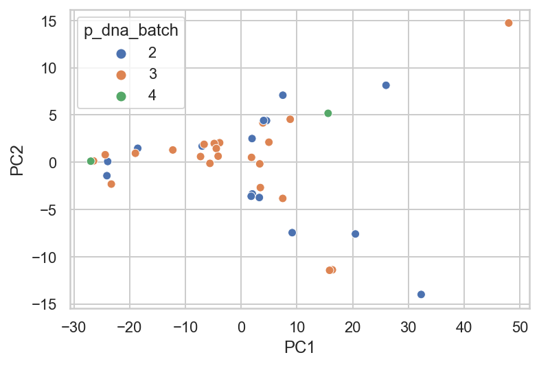

```python
sns.scatterplot(data=pca_transform_df, x="PC1", y="PC2", hue="is_male");
```


```python
sns.scatterplot(data=pca_transform_df, x="PC1", y="PC2", hue="primary_or_metastasis");
```

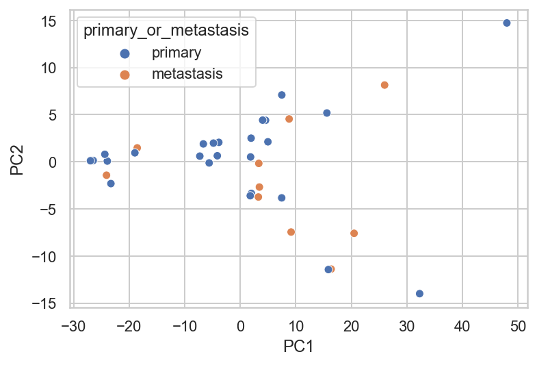

```python
sns.scatterplot(data=pca_transform_df, x="PC1", y="PC2", hue="age");
```

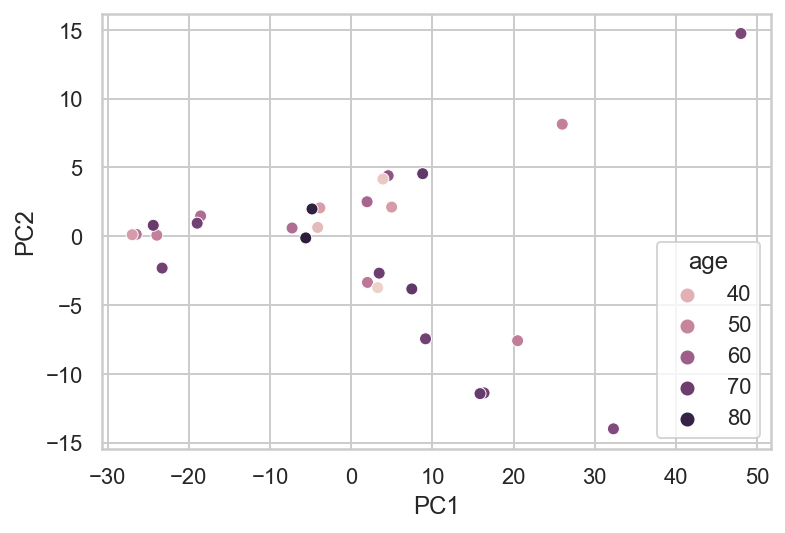

```python
sns.scatterplot(data=pca_transform_df, x="PC1", y="age", hue="primary_or_metastasis");
```

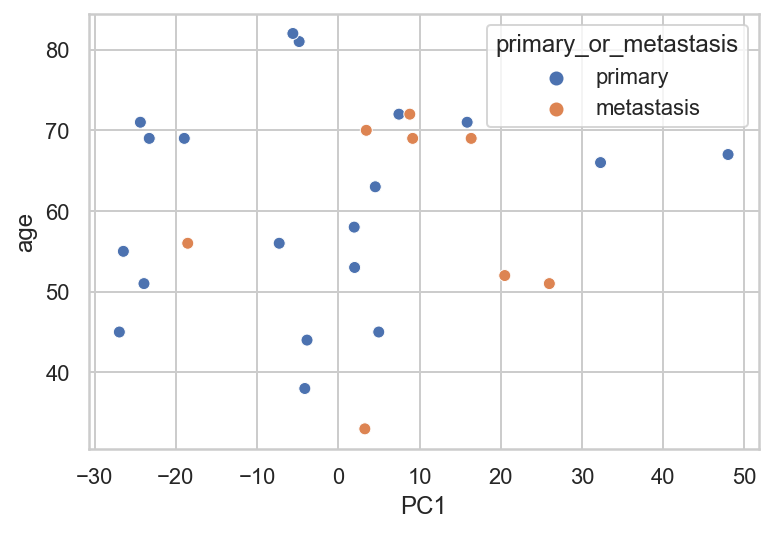

```python

```

```python

```

```python

```

```python

```

```python

```

```python

```

```python

```

to look into:

- effectss of "multiple_hits_on_gene"
- effects of chromosome holding the gene and location on chromosome

---

```python
notebook_toc = time()
print(f"execution time: {(notebook_toc - notebook_tic) / 60:.2f} minutes")
```

    execution time: 2.68 minutes

```python
%load_ext watermark
%watermark -d -u -v -iv -b -h -m
```

    Last updated: 2021-07-20

    Python implementation: CPython
    Python version       : 3.9.2
    IPython version      : 7.21.0

    Compiler    : Clang 11.0.1
    OS          : Darwin
    Release     : 20.4.0
    Machine     : x86_64
    Processor   : i386
    CPU cores   : 4
    Architecture: 64bit

    Hostname: JHCookMac.local

    Git branch: sp7-parameterizations

    pymc3     : 3.11.1
    janitor   : 0.20.14
    matplotlib: 3.3.4
    seaborn   : 0.11.1
    theano    : 1.0.5
    dask      : 2021.7.0
    numpy     : 1.20.1
    arviz     : 0.11.2
    plotnine  : 0.8.0
    pandas    : 1.2.3
    re        : 2.2.1
