# Exploration and visualization of the CRC data

The purpose of this notebook is to increase my understanding of the data used for modeling.
This includes the data collected by the DepMap consortium and cell line information from the CCLE.

```python
%load_ext autoreload
%autoreload 2
```

```python
import re
import string
import warnings
from pathlib import Path
from time import time

import arviz as az
import dask
import dask.dataframe as dd
import janitor
import matplotlib.colors as mcolors
import matplotlib.pyplot as plt
import numpy as np
import pandas as pd
import plotnine as gg
import pymc3 as pm
import seaborn as sns
from dask.distributed import Client, progress
from scipy import stats
from sklearn.decomposition import PCA
from theano import tensor as tt
```

```python
from src.data_processing import achilles as achelp
from src.data_processing import biology as biohelp
from src.data_processing import common as dphelp
from src.data_processing import vectors as vhelp
from src.globals import PYMC3
from src.io import cache_io, data_io
from src.loggers import logger
from src.modeling import pymc3_analysis as pmanal
from src.modeling import pymc3_sampling_api as pmapi
from src.plot.color_pal import FitMethodColors, ModelColors, SeabornColor
```

```python
notebook_tic = time()

warnings.simplefilter(action="ignore", category=UserWarning)

sns.set_theme(style="whitegrid")
gg.theme_set(
    gg.theme_bw()
    + gg.theme(
        figure_size=(4, 4),
        axis_ticks_major=gg.element_blank(),
        strip_background=gg.element_blank(),
    )
)
%config InlineBackend.figure_format = "retina"

RANDOM_SEED = 809
np.random.seed(RANDOM_SEED)
```

## Setup

Because of the size of the data, I relied heavily on Dask for running data frame computation and manipulations.

```python
client = Client(n_workers=2, threads_per_worker=2, memory_limit="1GB")
client
```

    <div>
        <div style="
            width: 24px;
            height: 24px;
            background-color: #e1e1e1;
            border: 3px solid #9D9D9D;
            border-radius: 5px;
            position: absolute;"> </div>
        <div style="margin-left: 48px;">
            <h3 style="margin-bottom: 0px;">Client</h3>
            <p style="color: #9D9D9D; margin-bottom: 0px;">Client-2cfdc462-ea1d-11eb-a96c-784f4375388f</p>
            <table style="width: 100%; text-align: left;">

        <tr>
            <td style="text-align: left;"><strong>Connection method:</strong> Cluster object</td>
            <td style="text-align: left;"><strong>Cluster type:</strong> LocalCluster</td>
        </tr>

        <tr>
            <td style="text-align: left;">
                <strong>Dashboard: </strong>
                <a href="http://127.0.0.1:8787/status">http://127.0.0.1:8787/status</a>
            </td>
            <td style="text-align: left;"></td>
        </tr>

            </table>

        <details>
        <summary style="margin-bottom: 20px;"><h3 style="display: inline;">Cluster Info</h3></summary>

    <div class="jp-RenderedHTMLCommon jp-RenderedHTML jp-mod-trusted jp-OutputArea-output">
        <div style="
            width: 24px;
            height: 24px;
            background-color: #e1e1e1;
            border: 3px solid #9D9D9D;
            border-radius: 5px;
            position: absolute;"> </div>
        <div style="margin-left: 48px;">
            <h3 style="margin-bottom: 0px; margin-top: 0px;">LocalCluster</h3>
            <p style="color: #9D9D9D; margin-bottom: 0px;">0f435873</p>
            <table style="width: 100%; text-align: left;">

    <tr>
        <td style="text-align: left;"><strong>Status:</strong> running</td>
        <td style="text-align: left;"><strong>Using processes:</strong> True</td>
    </tr>

    <tr>
        <td style="text-align: left;">
            <strong>Dashboard:</strong> <a href="http://127.0.0.1:8787/status">http://127.0.0.1:8787/status</a>
        </td>
        <td style="text-align: left;"><strong>Workers:</strong> 2</td>
    </tr>
    <tr>
        <td style="text-align: left;">
            <strong>Total threads:</strong>
            4
        </td>
        <td style="text-align: left;">
            <strong>Total memory:</strong>
            1.86 GiB
        </td>
    </tr>

            </table>
            <details>
            <summary style="margin-bottom: 20px;"><h3 style="display: inline;">Scheduler Info</h3></summary>

<div style="">

    <div>
        <div style="
            width: 24px;
            height: 24px;
            background-color: #FFF7E5;
            border: 3px solid #FF6132;
            border-radius: 5px;
            position: absolute;"> </div>
        <div style="margin-left: 48px;">
            <h3 style="margin-bottom: 0px;">Scheduler</h3>
            <p style="color: #9D9D9D; margin-bottom: 0px;">Scheduler-e56cbaf3-25f4-4f18-a2b5-0e19869a01b9</p>
            <table style="width: 100%; text-align: left;">
                <tr>
                    <td style="text-align: left;"><strong>Comm:</strong> tcp://127.0.0.1:51265</td>
                    <td style="text-align: left;"><strong>Workers:</strong> 2</td>
                </tr>
                <tr>
                    <td style="text-align: left;">
                        <strong>Dashboard:</strong> <a href="http://127.0.0.1:8787/status">http://127.0.0.1:8787/status</a>
                    </td>
                    <td style="text-align: left;">
                        <strong>Total threads:</strong>
                        4
                    </td>
                </tr>
                <tr>
                    <td style="text-align: left;">
                        <strong>Started:</strong>
                        Just now
                    </td>
                    <td style="text-align: left;">
                        <strong>Total memory:</strong>
                        1.86 GiB
                    </td>
                </tr>
            </table>
        </div>
    </div>

    <details style="margin-left: 48px;">
    <summary style="margin-bottom: 20px;"><h3 style="display: inline;">Workers</h3></summary>

    <div style="margin-bottom: 20px;">
        <div style="width: 24px;
                    height: 24px;
                    background-color: #DBF5FF;
                    border: 3px solid #4CC9FF;
                    border-radius: 5px;
                    position: absolute;"> </div>
        <div style="margin-left: 48px;">
        <details>
            <summary>
                <h4 style="margin-bottom: 0px; display: inline;">Worker: 0</h4>
            </summary>
            <table style="width: 100%; text-align: left;">
                <tr>
                    <td style="text-align: left;"><strong>Comm: </strong> tcp://127.0.0.1:51272</td>
                    <td style="text-align: left;"><strong>Total threads: </strong> 2</td>
                </tr>
                <tr>
                    <td style="text-align: left;">
                        <strong>Dashboard: </strong>
                        <a href="http://127.0.0.1:51273/status">http://127.0.0.1:51273/status</a>
                    </td>
                    <td style="text-align: left;">
                        <strong>Memory: </strong>
                        0.93 GiB
                    </td>
                </tr>
                <tr>
                    <td style="text-align: left;"><strong>Nanny: </strong> tcp://127.0.0.1:51268</td>
                    <td style="text-align: left;"></td>
                </tr>
                <tr>
                    <td colspan="2" style="text-align: left;">
                        <strong>Local directory: </strong>
                        /Users/admin/Lab_Projects/speclet/notebooks/crc_model_analysis/dask-worker-space/worker-9_p2rkps
                    </td>
                </tr>


            </table>
        </details>
        </div>
    </div>

    <div style="margin-bottom: 20px;">
        <div style="width: 24px;
                    height: 24px;
                    background-color: #DBF5FF;
                    border: 3px solid #4CC9FF;
                    border-radius: 5px;
                    position: absolute;"> </div>
        <div style="margin-left: 48px;">
        <details>
            <summary>
                <h4 style="margin-bottom: 0px; display: inline;">Worker: 1</h4>
            </summary>
            <table style="width: 100%; text-align: left;">
                <tr>
                    <td style="text-align: left;"><strong>Comm: </strong> tcp://127.0.0.1:51269</td>
                    <td style="text-align: left;"><strong>Total threads: </strong> 2</td>
                </tr>
                <tr>
                    <td style="text-align: left;">
                        <strong>Dashboard: </strong>
                        <a href="http://127.0.0.1:51270/status">http://127.0.0.1:51270/status</a>
                    </td>
                    <td style="text-align: left;">
                        <strong>Memory: </strong>
                        0.93 GiB
                    </td>
                </tr>
                <tr>
                    <td style="text-align: left;"><strong>Nanny: </strong> tcp://127.0.0.1:51267</td>
                    <td style="text-align: left;"></td>
                </tr>
                <tr>
                    <td colspan="2" style="text-align: left;">
                        <strong>Local directory: </strong>
                        /Users/admin/Lab_Projects/speclet/notebooks/crc_model_analysis/dask-worker-space/worker-jn7ju6uj
                    </td>
                </tr>


            </table>
        </details>
        </div>
    </div>

    </details>
</div>

            </details>
        </div>
    </div>

        </details>

        </div>
    </div>

```python
data_path = data_io.data_path(data_io.DataFile.crc_data)
if data_path.exists():
    print(f"data file: '{data_path.as_posix()}'")
else:
    raise FileNotFoundError(data_path)
```

    data file: '/Users/admin/Lab_Projects/speclet/modeling_data/depmap_modeling_dataframe_crc.csv'

```python
data_types: dict[str, str] = {"age": "float64"}
for a in [
    "p_dna_batch",
    "replicate_id",
]:
    data_types[a] = "category"

crc_data = dd.read_csv(data_path, dtype=data_types)
crc_data.head(5)
```

<div>
<style scoped>
    .dataframe tbody tr th:only-of-type {
        vertical-align: middle;
    }

    .dataframe tbody tr th {
        vertical-align: top;
    }

    .dataframe thead th {
        text-align: right;
    }
</style>
<table border="1" class="dataframe">
  <thead>
    <tr style="text-align: right;">
      <th></th>
      <th>sgrna</th>
      <th>replicate_id</th>
      <th>lfc</th>
      <th>p_dna_batch</th>
      <th>genome_alignment</th>
      <th>hugo_symbol</th>
      <th>screen</th>
      <th>multiple_hits_on_gene</th>
      <th>sgrna_target_chr</th>
      <th>sgrna_target_pos</th>
      <th>...</th>
      <th>num_mutations</th>
      <th>any_deleterious</th>
      <th>any_tcga_hotspot</th>
      <th>any_cosmic_hotspot</th>
      <th>is_mutated</th>
      <th>copy_number</th>
      <th>lineage</th>
      <th>primary_or_metastasis</th>
      <th>is_male</th>
      <th>age</th>
    </tr>
  </thead>
  <tbody>
    <tr>
      <th>0</th>
      <td>AAACCTGCGGCGGTCGCCA</td>
      <td>LS513_c903R1</td>
      <td>0.563383</td>
      <td>ERS717283.plasmid</td>
      <td>chr8_66505451_-</td>
      <td>VXN</td>
      <td>sanger</td>
      <td>True</td>
      <td>8</td>
      <td>66505451</td>
      <td>...</td>
      <td>0</td>
      <td>NaN</td>
      <td>NaN</td>
      <td>NaN</td>
      <td>False</td>
      <td>0.956651</td>
      <td>colorectal</td>
      <td>primary</td>
      <td>True</td>
      <td>63.0</td>
    </tr>
    <tr>
      <th>1</th>
      <td>AAAGCCCAGGAGTATGGGAG</td>
      <td>LS513-311Cas9_RepA_p6_batch2</td>
      <td>0.594321</td>
      <td>2</td>
      <td>chr2_130522105_-</td>
      <td>CFC1B</td>
      <td>broad</td>
      <td>True</td>
      <td>2</td>
      <td>130522105</td>
      <td>...</td>
      <td>0</td>
      <td>NaN</td>
      <td>NaN</td>
      <td>NaN</td>
      <td>False</td>
      <td>0.953860</td>
      <td>colorectal</td>
      <td>primary</td>
      <td>True</td>
      <td>63.0</td>
    </tr>
    <tr>
      <th>2</th>
      <td>AAATCAGAGAAACCTGAACG</td>
      <td>LS513-311Cas9_RepA_p6_batch2</td>
      <td>-0.363633</td>
      <td>2</td>
      <td>chr11_89916950_-</td>
      <td>TRIM49D1</td>
      <td>broad</td>
      <td>True</td>
      <td>11</td>
      <td>89916950</td>
      <td>...</td>
      <td>0</td>
      <td>NaN</td>
      <td>NaN</td>
      <td>NaN</td>
      <td>False</td>
      <td>0.960466</td>
      <td>colorectal</td>
      <td>primary</td>
      <td>True</td>
      <td>63.0</td>
    </tr>
    <tr>
      <th>3</th>
      <td>AACAGCACACCGGCCCCGT</td>
      <td>LS513_c903R1</td>
      <td>-0.512694</td>
      <td>ERS717283.plasmid</td>
      <td>chrX_156009834_-</td>
      <td>IL9R</td>
      <td>sanger</td>
      <td>True</td>
      <td>X</td>
      <td>156009834</td>
      <td>...</td>
      <td>0</td>
      <td>NaN</td>
      <td>NaN</td>
      <td>NaN</td>
      <td>False</td>
      <td>0.478776</td>
      <td>colorectal</td>
      <td>primary</td>
      <td>True</td>
      <td>63.0</td>
    </tr>
    <tr>
      <th>4</th>
      <td>AACCTCCGGACTCCTCAGC</td>
      <td>LS513_c903R1</td>
      <td>-0.075108</td>
      <td>ERS717283.plasmid</td>
      <td>chr7_39609658_-</td>
      <td>YAE1</td>
      <td>sanger</td>
      <td>True</td>
      <td>7</td>
      <td>39609658</td>
      <td>...</td>
      <td>0</td>
      <td>NaN</td>
      <td>NaN</td>
      <td>NaN</td>
      <td>False</td>
      <td>1.437966</td>
      <td>colorectal</td>
      <td>primary</td>
      <td>True</td>
      <td>63.0</td>
    </tr>
  </tbody>
</table>
<p>5 rows × 22 columns</p>
</div>

```python
crc_data.columns
```

    Index(['sgrna', 'replicate_id', 'lfc', 'p_dna_batch', 'genome_alignment',
           'hugo_symbol', 'screen', 'multiple_hits_on_gene', 'sgrna_target_chr',
           'sgrna_target_pos', 'depmap_id', 'rna_expr', 'num_mutations',
           'any_deleterious', 'any_tcga_hotspot', 'any_cosmic_hotspot',
           'is_mutated', 'copy_number', 'lineage', 'primary_or_metastasis',
           'is_male', 'age'],
          dtype='object')

## Analysis

### Overview

Below is a print-out of the number of unique values in some of the more important columns.

```python
for col, lbl in {
    "sgrna": "sgRNA",
    "hugo_symbol": "genes",
    "depmap_id": "cell lines",
    "lineage": "lineages",
    "screen": "data sources",
}.items():
    count = len(crc_data[col].unique())
    print(f"num {lbl}: {count:,}")
```

    num sgRNA: 157,808
    num genes: 18,182
    num cell lines: 54
    num lineages: 1
    num data sources: 2

The two data sources are the DepMap data from the Broad and the Project SCORE data from the Sanger.
The first analysis I did was to compare the data from the two institutes that were collected on the same cell lines.

```python
crc_data[["screen", "depmap_id"]].drop_duplicates().groupby("screen").count().compute()
```

<div>
<style scoped>
    .dataframe tbody tr th:only-of-type {
        vertical-align: middle;
    }

    .dataframe tbody tr th {
        vertical-align: top;
    }

    .dataframe thead th {
        text-align: right;
    }
</style>
<table border="1" class="dataframe">
  <thead>
    <tr style="text-align: right;">
      <th></th>
      <th>depmap_id</th>
    </tr>
    <tr>
      <th>screen</th>
      <th></th>
    </tr>
  </thead>
  <tbody>
    <tr>
      <th>broad</th>
      <td>39</td>
    </tr>
    <tr>
      <th>sanger</th>
      <td>31</td>
    </tr>
  </tbody>
</table>
</div>

### Comparing cell lines included in both screens

There were 16 cell lines that were included in both screens.

```python
celllines_in_both_screens = (
    crc_data[["screen", "depmap_id"]]
    .drop_duplicates()
    .groupby("depmap_id")
    .count()
    .compute()
    .query("screen > 1")
    .reset_index(drop=False)["depmap_id"]
    .tolist()
)

print(f"number of cell lines in both screens: {len(celllines_in_both_screens)}")
```

    number of cell lines in both screens: 16

```python
double_screen_data = crc_data[
    crc_data.depmap_id.isin(celllines_in_both_screens)
].compute()
double_screen_data.shape
```

    (2524928, 22)

The plot below shows the distribution of log-fold change (LFC) values for each cell line included in both screens.
Already we can see that there may be some large discrepencies.

```python
plt.figure(figsize=(12, 5))
ax = sns.boxenplot(
    data=double_screen_data,
    x="depmap_id",
    y="lfc",
    hue="screen",
    showfliers=False,
)
plt.xticks(rotation=90)
ax.set_xlabel("cell line")
ax.set_ylabel("log fold change")
plt.show()
```


I was curious about the correlation between the LFC of the genes in each cell line.
I calculated the correlation between the mean LFC for each gene of each cell line between the two screens.

```python
double_screen_avg_lfc = (
    double_screen_data.groupby(["hugo_symbol", "depmap_id", "screen"])["lfc"]
    .mean()
    .reset_index(drop=False)
)

double_screen_gene_corr = double_screen_avg_lfc.pivot_wider(
    index=["hugo_symbol", "depmap_id"], names_from="screen", values_from="lfc"
)
double_screen_gene_corr = (
    double_screen_gene_corr.groupby("hugo_symbol")["broad"]
    .corr(double_screen_gene_corr["sanger"])
    .reset_index(drop=False)
    .rename(columns={"broad": "correlation"})
)

double_screen_gene_corr.head()
```

<div>
<style scoped>
    .dataframe tbody tr th:only-of-type {
        vertical-align: middle;
    }

    .dataframe tbody tr th {
        vertical-align: top;
    }

    .dataframe thead th {
        text-align: right;
    }
</style>
<table border="1" class="dataframe">
  <thead>
    <tr style="text-align: right;">
      <th></th>
      <th>hugo_symbol</th>
      <th>correlation</th>
    </tr>
  </thead>
  <tbody>
    <tr>
      <th>0</th>
      <td>A1BG</td>
      <td>0.114426</td>
    </tr>
    <tr>
      <th>1</th>
      <td>A1CF</td>
      <td>-0.084924</td>
    </tr>
    <tr>
      <th>2</th>
      <td>A2M</td>
      <td>0.076944</td>
    </tr>
    <tr>
      <th>3</th>
      <td>A2ML1</td>
      <td>-0.252467</td>
    </tr>
    <tr>
      <th>4</th>
      <td>A3GALT2</td>
      <td>-0.138956</td>
    </tr>
  </tbody>
</table>
</div>

These correlations are plotted against the mean LFC of the gene in the Broad (top) and Sanger (bottom).
There are a *very* large distribution of correlation values, including strong negative correlations.
Interestingly, there seems to be an association between the correlation values and the LFC values: for more negative LFC genes, the correlations tend to be smaller.

```python
screen_averages = (
    double_screen_avg_lfc.groupby(["hugo_symbol", "screen"])["lfc"]
    .mean()
    .reset_index(drop=False)
    .pivot_wider(index=["hugo_symbol"], names_from="screen", values_from="lfc")
)

screen_gene_corr_avgs = double_screen_gene_corr.merge(screen_averages, on="hugo_symbol")

for screen in ("broad", "sanger"):
    jg = sns.jointplot(data=screen_gene_corr_avgs, x=screen, y="correlation", alpha=0.1)
    jg.ax_joint.set_xlabel(f"avg. lfc in {screen.upper()} screen")
    jg.ax_joint.set_ylabel(f"correlation between screens")
    plt.show()
```

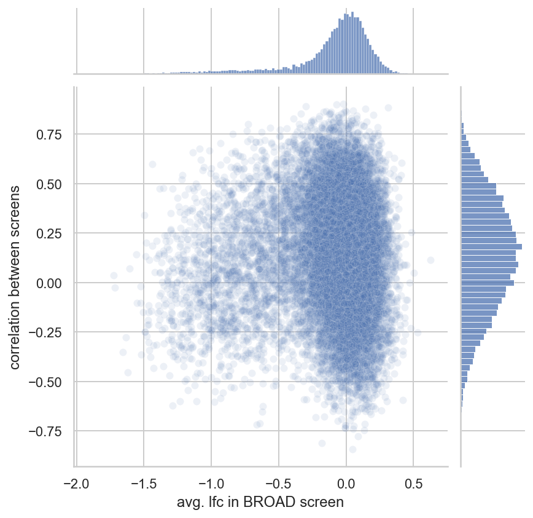

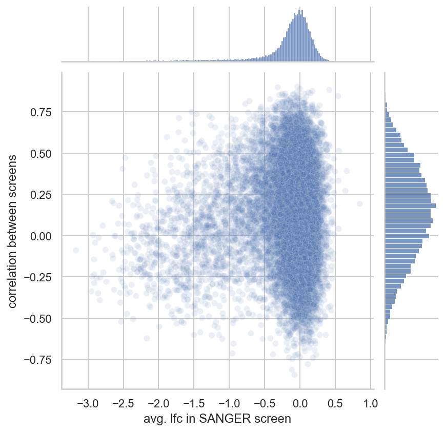

**Moving forward, I only used the Broad data to avoid these very strong datasource biases.**

### Correlations of LFC and other factors

The next section of this analysis focused on looking at associations between LFC values and other data.

```python
crc_data_avgs = (
    crc_data[crc_data.screen == "broad"][
        ["depmap_id", "hugo_symbol", "lfc", "rna_expr", "copy_number"]
    ]
    .groupby(["depmap_id", "hugo_symbol"])
    .mean()
    .compute()
    .reset_index(drop=False)
)
```

#### RNA expression

First, I plotted the LFC values for genes binned by their RNA expression.
It is very clear that more negative LFC values tend to be found for more highly-expressed genes.
This is not suprising and indicates that RNA expression can be an important covariate in the model.

```python
df = crc_data_avgs.assign(
    rna_expr_bin=lambda d: np.round(d.rna_expr).astype(int)
).assign(rna_expr_lbl=lambda d: d.rna_expr_bin.astype(str))

palette = sns.color_palette("flare", n_colors=len(df.rna_expr_bin.unique()))

fg = sns.catplot(
    data=df,
    x="rna_expr_bin",
    y="lfc",
    kind="box",
    palette=palette,
    col="depmap_id",
    col_wrap=5,
    sharey=False,
    flierprops={"alpha": 0.3},
)
fg.set_axis_labels(r"RNA expression ($\log$ TPM+1)", "log fold change")
plt.show()
```

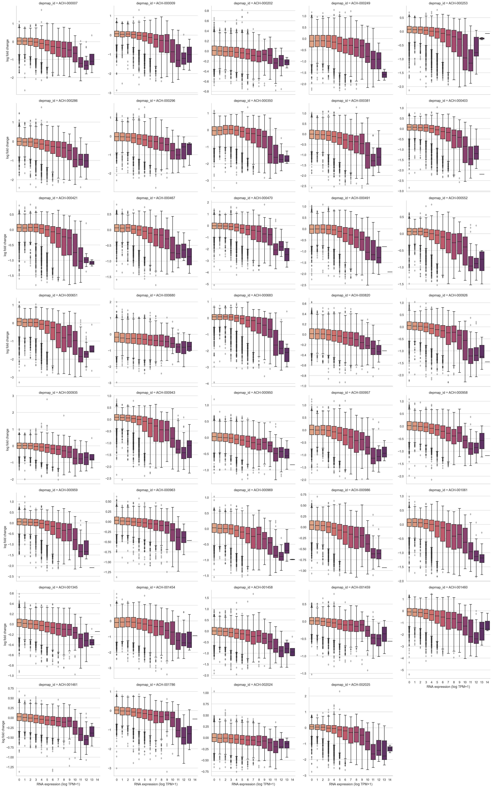

#### Gene copy number

We can do the same with copy number.
Again, we see that there is frequently a negative correlation between this factor and LFC, but it is not as consistent as the trend with RNA expression.
Importantly, the trend has drastically different strengths in each cell line.

```python
df = crc_data_avgs.assign(
    copy_number=lambda d: vhelp.squish_array(d.copy_number, lower=0, upper=10),
    copy_number_bin=lambda d: np.round(d.copy_number * 2).astype(int) / 2,
)

palette = sns.color_palette("flare", n_colors=len(df.copy_number_bin.unique()))

fg = sns.catplot(
    data=df,
    x="copy_number_bin",
    y="lfc",
    kind="box",
    palette=palette,
    col="depmap_id",
    col_wrap=5,
    sharex=False,
    sharey=False,
    flierprops={"alpha": 0.3},
)
fg.set_axis_labels("copy number (max. 10)")
plt.show()
```

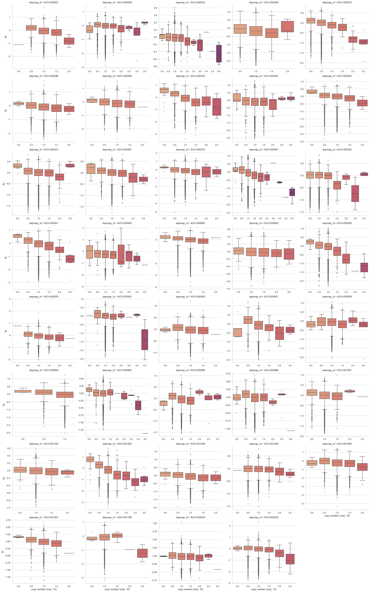

#### Correlation with copy number for essential genes

In their publication introducing Chronos, the DepMap consortium demonstrated that the correlation between copy number and LFC was different for essential and nono-essential genes.
For essential genes, there was a positive correlation between CN and LFC, whereas it would be expected to be a negative correlation as shown above.
Their proposed explination is that because these genes are essential, true KO should lead to death.
Thus, what we are actually seeing are incomplete loss-of-function hits.

```python
crc_data_avgs.head()
```

<div>
<style scoped>
    .dataframe tbody tr th:only-of-type {
        vertical-align: middle;
    }

    .dataframe tbody tr th {
        vertical-align: top;
    }

    .dataframe thead th {
        text-align: right;
    }
</style>
<table border="1" class="dataframe">
  <thead>
    <tr style="text-align: right;">
      <th></th>
      <th>depmap_id</th>
      <th>hugo_symbol</th>
      <th>lfc</th>
      <th>rna_expr</th>
      <th>copy_number</th>
    </tr>
  </thead>
  <tbody>
    <tr>
      <th>0</th>
      <td>ACH-000007</td>
      <td>A1BG</td>
      <td>0.263330</td>
      <td>0.137504</td>
      <td>0.954248</td>
    </tr>
    <tr>
      <th>1</th>
      <td>ACH-000007</td>
      <td>A1CF</td>
      <td>0.067489</td>
      <td>1.510962</td>
      <td>0.964005</td>
    </tr>
    <tr>
      <th>2</th>
      <td>ACH-000007</td>
      <td>A2M</td>
      <td>-0.328769</td>
      <td>0.214125</td>
      <td>0.963609</td>
    </tr>
    <tr>
      <th>3</th>
      <td>ACH-000007</td>
      <td>A2ML1</td>
      <td>0.060252</td>
      <td>0.000000</td>
      <td>0.963609</td>
    </tr>
    <tr>
      <th>4</th>
      <td>ACH-000007</td>
      <td>A3GALT2</td>
      <td>-0.152007</td>
      <td>0.000000</td>
      <td>0.971692</td>
    </tr>
  </tbody>
</table>
</div>

```python
cn_lfc_corr = (
    crc_data_avgs.groupby("hugo_symbol")
    .corr()
    .reset_index()[["hugo_symbol", "level_1", "lfc"]]
    .query("level_1 != 'lfc'")
    .rename(columns={"level_1": "variable"})
)
```

```python
gene_essentiality_df = pd.read_csv(
    data_io.data_path(data_io.DataFile.achilles_essentials)
)
essential_genes = gene_essentiality_df[gene_essentiality_df.is_essential].gene.tolist()
nonessential_genes = gene_essentiality_df[
    ~gene_essentiality_df.is_essential
].gene.tolist()
print(
    f"num. essential/non-essential genes: {len(essential_genes):,} / {len(nonessential_genes):,}"
)
```

    num. essential/non-essential genes: 1,246 / 758

```python
essential_comp_df = cn_lfc_corr[
    cn_lfc_corr.hugo_symbol.isin(essential_genes + nonessential_genes)
].assign(
    essential=lambda d: [
        "essential" if g in essential_genes else "non-essential" for g in d.hugo_symbol
    ]
)

fg = sns.displot(
    data=essential_comp_df, x="lfc", hue="essential", kde=True, col="variable"
)

for ax in fg.axes.flatten():
    ax.axvline(x=0, color="k", linestyle="--")

plt.show()
```

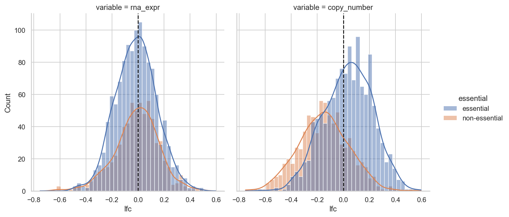

#### Mutations

I next looked at associations between mutation status and LFC.
We expect mutant oncogenes to have more negative LFC values than non-mutated oncogenes.
For example, cell lines with activating *KRAS* mutations should be more dependent upon *KRAS* that cell lines with WT *KRAS*.

```python
mutation_counts = (
    crc_data[crc_data.screen == "broad"][
        [
            "hugo_symbol",
            "depmap_id",
            "is_mutated",
            "any_tcga_hotspot",
            "any_deleterious",
        ]
    ]
    .drop_duplicates()
    .fillna({"is_mutated": False, "any_tcga_hotspot": False, "any_deleterious": False})
    .groupby("hugo_symbol")[["is_mutated", "any_tcga_hotspot", "any_deleterious"]]
    .agg("mean")
    .compute()
    .reset_index(drop=False)
)

mutation_counts.head()
```

<div>
<style scoped>
    .dataframe tbody tr th:only-of-type {
        vertical-align: middle;
    }

    .dataframe tbody tr th {
        vertical-align: top;
    }

    .dataframe thead th {
        text-align: right;
    }
</style>
<table border="1" class="dataframe">
  <thead>
    <tr style="text-align: right;">
      <th></th>
      <th>hugo_symbol</th>
      <th>is_mutated</th>
      <th>any_tcga_hotspot</th>
      <th>any_deleterious</th>
    </tr>
  </thead>
  <tbody>
    <tr>
      <th>0</th>
      <td>A1BG</td>
      <td>0.128205</td>
      <td>0.0</td>
      <td>0.051282</td>
    </tr>
    <tr>
      <th>1</th>
      <td>A1CF</td>
      <td>0.025641</td>
      <td>0.0</td>
      <td>0.000000</td>
    </tr>
    <tr>
      <th>2</th>
      <td>A2M</td>
      <td>0.153846</td>
      <td>0.0</td>
      <td>0.051282</td>
    </tr>
    <tr>
      <th>3</th>
      <td>A2ML1</td>
      <td>0.153846</td>
      <td>0.0</td>
      <td>0.051282</td>
    </tr>
    <tr>
      <th>4</th>
      <td>A3GALT2</td>
      <td>0.128205</td>
      <td>0.0</td>
      <td>0.051282</td>
    </tr>
  </tbody>
</table>
</div>

```python
mutation_counts.sort_values("is_mutated", ascending=False).head(10)
```

<div>
<style scoped>
    .dataframe tbody tr th:only-of-type {
        vertical-align: middle;
    }

    .dataframe tbody tr th {
        vertical-align: top;
    }

    .dataframe thead th {
        text-align: right;
    }
</style>
<table border="1" class="dataframe">
  <thead>
    <tr style="text-align: right;">
      <th></th>
      <th>hugo_symbol</th>
      <th>is_mutated</th>
      <th>any_tcga_hotspot</th>
      <th>any_deleterious</th>
    </tr>
  </thead>
  <tbody>
    <tr>
      <th>16571</th>
      <td>TTN</td>
      <td>0.871795</td>
      <td>0.076923</td>
      <td>0.358974</td>
    </tr>
    <tr>
      <th>804</th>
      <td>APC</td>
      <td>0.846154</td>
      <td>0.435897</td>
      <td>0.743590</td>
    </tr>
    <tr>
      <th>16203</th>
      <td>TP53</td>
      <td>0.666667</td>
      <td>0.641026</td>
      <td>0.256410</td>
    </tr>
    <tr>
      <th>9550</th>
      <td>MUC16</td>
      <td>0.641026</td>
      <td>0.025641</td>
      <td>0.153846</td>
    </tr>
    <tr>
      <th>15188</th>
      <td>SYNE1</td>
      <td>0.589744</td>
      <td>0.025641</td>
      <td>0.256410</td>
    </tr>
    <tr>
      <th>17495</th>
      <td>ZFHX3</td>
      <td>0.538462</td>
      <td>0.025641</td>
      <td>0.179487</td>
    </tr>
    <tr>
      <th>10429</th>
      <td>OBSCN</td>
      <td>0.538462</td>
      <td>0.000000</td>
      <td>0.153846</td>
    </tr>
    <tr>
      <th>7954</th>
      <td>KRAS</td>
      <td>0.538462</td>
      <td>0.512821</td>
      <td>0.025641</td>
    </tr>
    <tr>
      <th>34</th>
      <td>ABCA13</td>
      <td>0.512821</td>
      <td>0.025641</td>
      <td>0.205128</td>
    </tr>
    <tr>
      <th>7931</th>
      <td>KMT2C</td>
      <td>0.512821</td>
      <td>0.000000</td>
      <td>0.102564</td>
    </tr>
  </tbody>
</table>
</div>

I first compared the LFC for the 20 most frequently mutated genes in the data set.
This includes many uninteresting genes including *TTN*, *NEB*, and some mucins.

```python
top_mut_genes = (
    mutation_counts.sort_values("is_mutated", ascending=False)
    .head(20)
    .hugo_symbol.tolist()
)
top_mut_genes_data = crc_data[crc_data.hugo_symbol.isin(top_mut_genes)].compute()
```

```python
is_mutated_palette = {False: SeabornColor.BLUE, True: SeabornColor.RED}

fig = plt.figure(figsize=(15, 5))
sns.boxenplot(
    data=top_mut_genes_data,
    x="hugo_symbol",
    y="lfc",
    hue="is_mutated",
    palette=is_mutated_palette,
)
plt.title("Most frequently mutated")
plt.show()
```

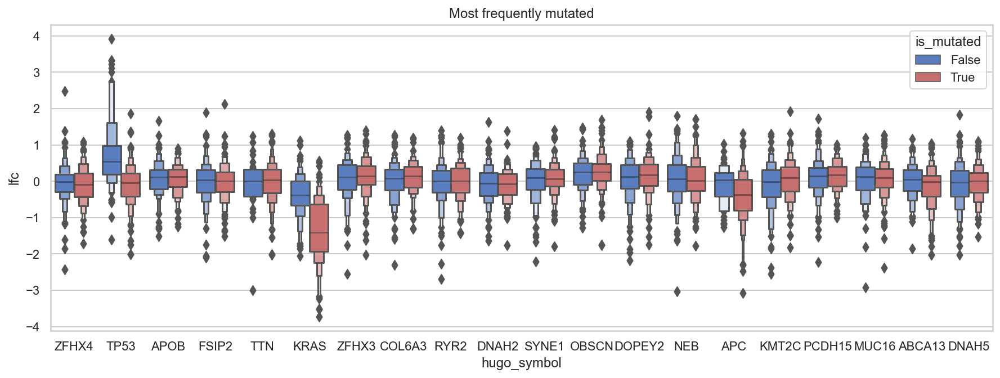

I also plotted the results for genes listed as oncogenes in colorectal cancer by COSMIC's Cancer Gene Census (CGC).
Other than for *KRAS*, the different in LFC values is not as striking as I would expect.

```python
cgc_genes = (
    pd.read_csv(data_io.data_path(data_io.DataFile.cgc))
    .dropna(subset=["tumor_types_somatic"])
    .filter_string("tumor_types_somatic", "color")
    .query("is_oncogene")
    .hugo_symbol.tolist()
)
cgc_genes_data = crc_data[crc_data.hugo_symbol.isin(cgc_genes)].compute()
```

```python
fig = plt.figure(figsize=(8, 5))
ax = sns.boxenplot(
    data=cgc_genes_data,
    x="hugo_symbol",
    y="lfc",
    hue="is_mutated",
    palette=is_mutated_palette,
)
plt.legend(loc="upper right")
ax.set_xlabel("")
ax.set_ylabel("log fold change")
plt.title("CGC oncogenes")
plt.show()
```

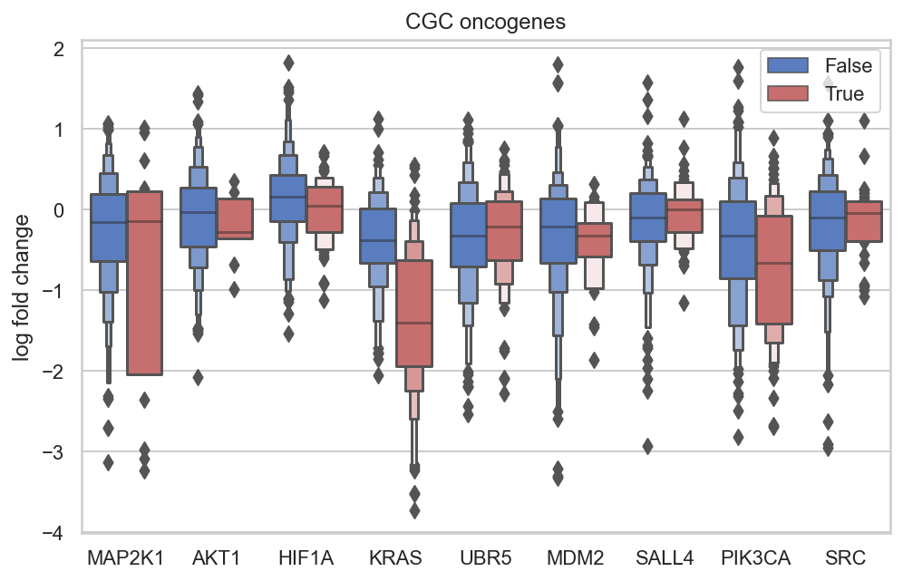

#### Batches

I next wanted to analyse the effects of different batches on the data.
There were mutliple sources of batch effects including the `replicate_id` and `p_dna_batch` identifiers.
However, each cell line was in a different `replicate_id`, so that source of variation can be ignored because it is inseparable from cell-line-to-cell-line variation.

```python
crc_depmap_batches = (
    crc_data[crc_data.screen == "broad"][["depmap_id", "replicate_id", "p_dna_batch"]]
    .drop_duplicates()
    .compute()
    .reset_index(drop=True)
    .sort_values(["replicate_id", "p_dna_batch"])
)
```

I decided to look for clusters of cell lines by their batch, so I conducted PCA on the top 10% most variable genes.

```python
lfc_matrix = (
    crc_data[crc_data.screen == "broad"][["depmap_id", "hugo_symbol", "lfc"]]
    .dropna()
    .groupby(["depmap_id", "hugo_symbol"])["lfc"]
    .mean()
    .reset_index(drop=False)
    .compute()
    .pivot_wider(index="hugo_symbol", names_from="depmap_id", values_from="lfc")
    .set_index("hugo_symbol")
)
```

```python
def head_frac(df: pd.DataFrame, frac: float = 0.1) -> pd.DataFrame:
    if frac < 0.0 or frac > 1.0:
        raise ValueError(f"Value ({frac}) must be between 0 and 1.")
    return df.head(int(df.shape[0] * frac))


top_var_genes = (
    lfc_matrix.T.var()
    .reset_index(drop=False)
    .sort_values(0, ascending=False)
    .pipe(head_frac)
    .hugo_symbol.tolist()
)

len(top_var_genes)
```

    1811

```python
pca = PCA(n_components=10)
pca_lfc_matrix = pca.fit_transform(lfc_matrix.loc[top_var_genes].values.T)
```

Principal component 1 accounts for most of the variation.

```python
ax = sns.barplot(
    x=list(range(1, 11)), y=pca.explained_variance_ratio_, color=SeabornColor.BLUE
)
ax.set_xlabel("principal component")
ax.set_ylabel("explained variance ratio")
plt.show()
```

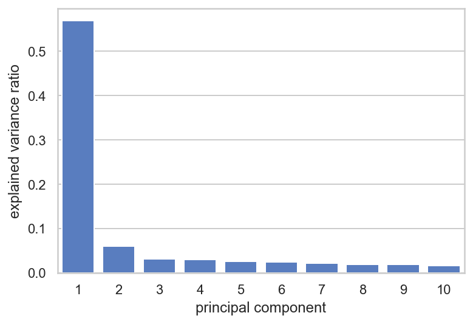

```python
cellline_info = (
    crc_data[crc_data.screen == "broad"][
        [
            "depmap_id",
            "replicate_id",
            "p_dna_batch",
            "primary_or_metastasis",
            "is_male",
            "age",
        ]
    ]
    .drop_duplicates()
    .assign(p_dna_batch=lambda d: d.p_dna_batch.astype(str).astype("category"))
    .compute()
)
```

```python
pca_transform_df = (
    pd.DataFrame(pca_lfc_matrix, columns=[f"PC{i+1}" for i in range(10)])
    .assign(depmap_id=lfc_matrix.columns)
    .merge(cellline_info, on="depmap_id")
)
```

The following plots look for assoications between known factors of the cell lines (batch, sex, age, and primary vs. metastasis) and the first two PCs, but no strong associations were found.

```python
sns.scatterplot(data=pca_transform_df, x="PC1", y="PC2", hue="p_dna_batch");
```


```python
sns.scatterplot(data=pca_transform_df, x="PC1", y="PC2", hue="is_male");
```

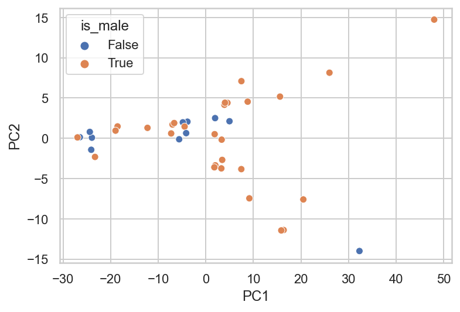

```python
sns.scatterplot(data=pca_transform_df, x="PC1", y="PC2", hue="primary_or_metastasis");
```


```python
sns.scatterplot(data=pca_transform_df, x="PC1", y="PC2", hue="age");
```


```python
sns.scatterplot(data=pca_transform_df, x="PC1", y="age", hue="primary_or_metastasis");
```

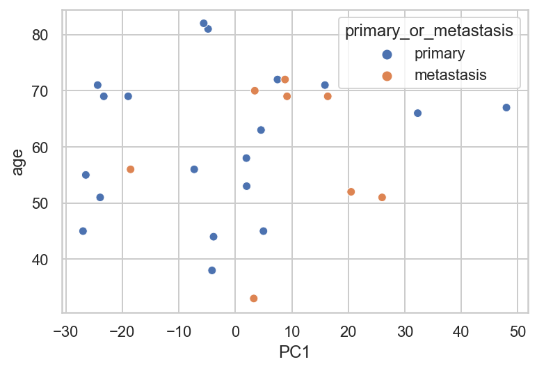

#### Multiple hits on the target gene

Guides that target multiple genes have already been removed from the data set.
However, one interesting note is that some sgRNA target the same gene in muiltiple locations.
I was curious if there was a systematic difference between guides that hit a gene once versus those that hit mutliple locations.

Overall, over 90% of the guides appear to hit their target gene in mutliple locations.

```python
(crc_data[crc_data.screen == "broad"][["multiple_hits_on_gene"]].mean().compute())
```

    multiple_hits_on_gene    0.923131
    dtype: float64

I extracted only the data where there exist guides that have a single target locus and guides that have multiple target locii for a given gene in a given cell line.

```python
mulitple_hit_groups = (
    crc_data[crc_data.screen == "broad"][
        ["multiple_hits_on_gene", "hugo_symbol", "depmap_id"]
    ]
    .groupby(["hugo_symbol", "depmap_id"])["multiple_hits_on_gene"]
    .mean()
    .reset_index(drop=False)
    .query("multiple_hits_on_gene < 1.0")
    .query("multiple_hits_on_gene > 0.0")
    .compute()
    .reset_index(drop=True)
)

mulitple_hit_groups.head()
```

<div>
<style scoped>
    .dataframe tbody tr th:only-of-type {
        vertical-align: middle;
    }

    .dataframe tbody tr th {
        vertical-align: top;
    }

    .dataframe thead th {
        text-align: right;
    }
</style>
<table border="1" class="dataframe">
  <thead>
    <tr style="text-align: right;">
      <th></th>
      <th>hugo_symbol</th>
      <th>depmap_id</th>
      <th>multiple_hits_on_gene</th>
    </tr>
  </thead>
  <tbody>
    <tr>
      <th>0</th>
      <td>AHNAK2</td>
      <td>ACH-000249</td>
      <td>0.25</td>
    </tr>
    <tr>
      <th>1</th>
      <td>AMBN</td>
      <td>ACH-000249</td>
      <td>0.25</td>
    </tr>
    <tr>
      <th>2</th>
      <td>ANKRD30A</td>
      <td>ACH-000249</td>
      <td>0.50</td>
    </tr>
    <tr>
      <th>3</th>
      <td>ANKRD36B</td>
      <td>ACH-000249</td>
      <td>0.50</td>
    </tr>
    <tr>
      <th>4</th>
      <td>C9orf57</td>
      <td>ACH-000249</td>
      <td>0.25</td>
    </tr>
  </tbody>
</table>
</div>

```python
def zscore(df: pd.DataFrame) -> pd.DataFrame:
    df["lfc_z"] = stats.zscore(df.lfc.values)
    return df


multiple_hits_data = (
    crc_data[crc_data.screen == "broad"][
        ["multiple_hits_on_gene", "hugo_symbol", "depmap_id", "lfc", "sgrna"]
    ]
    .merge(mulitple_hit_groups[["depmap_id", "hugo_symbol"]])
    .compute()
    .groupby(["hugo_symbol", "depmap_id"])
    .apply(zscore)
    .reset_index()
)

multiple_hits_data.head()
```

<div>
<style scoped>
    .dataframe tbody tr th:only-of-type {
        vertical-align: middle;
    }

    .dataframe tbody tr th {
        vertical-align: top;
    }

    .dataframe thead th {
        text-align: right;
    }
</style>
<table border="1" class="dataframe">
  <thead>
    <tr style="text-align: right;">
      <th></th>
      <th>index</th>
      <th>multiple_hits_on_gene</th>
      <th>hugo_symbol</th>
      <th>depmap_id</th>
      <th>lfc</th>
      <th>sgrna</th>
      <th>lfc_z</th>
    </tr>
  </thead>
  <tbody>
    <tr>
      <th>0</th>
      <td>0</td>
      <td>True</td>
      <td>ANKRD30A</td>
      <td>ACH-000249</td>
      <td>-0.303036</td>
      <td>AACATCTGAGAAATTTACGT</td>
      <td>-0.926411</td>
    </tr>
    <tr>
      <th>1</th>
      <td>0</td>
      <td>True</td>
      <td>ANKRD30A</td>
      <td>ACH-000680</td>
      <td>-1.304264</td>
      <td>AACATCTGAGAAATTTACGT</td>
      <td>-1.277391</td>
    </tr>
    <tr>
      <th>2</th>
      <td>0</td>
      <td>False</td>
      <td>ZNF880</td>
      <td>ACH-000820</td>
      <td>0.136020</td>
      <td>GACATTTCCACTCCTCCTGA</td>
      <td>-1.159560</td>
    </tr>
    <tr>
      <th>3</th>
      <td>1</td>
      <td>True</td>
      <td>ANKRD30A</td>
      <td>ACH-000249</td>
      <td>-0.351390</td>
      <td>AAGACCTAGGAAGATCGCAT</td>
      <td>-1.006461</td>
    </tr>
    <tr>
      <th>4</th>
      <td>1</td>
      <td>True</td>
      <td>ANKRD30A</td>
      <td>ACH-000680</td>
      <td>-0.234602</td>
      <td>AAGACCTAGGAAGATCGCAT</td>
      <td>0.397502</td>
    </tr>
  </tbody>
</table>
</div>

The following plots shows the LFC values in each cell line separating between guides with multiple hits and those with only one.
By eye, there does seem to be a slight decrease on average in LFC for guides that hit the gene multiple times.

```python
fig = plt.figure(figsize=(9, 5))
ax = sns.boxplot(
    data=multiple_hits_data,
    x="depmap_id",
    y="lfc",
    hue="multiple_hits_on_gene",
    boxprops={"alpha": 0.5},
)
sns.stripplot(
    data=multiple_hits_data,
    x="depmap_id",
    y="lfc",
    hue="multiple_hits_on_gene",
    dodge=True,
    ax=ax,
)

ax.set_xlabel("cell line")
ax.set_ylabel("log fold change")
ax.legend(bbox_to_anchor=(1.01, 1), loc=2, borderaxespad=0.0, title="multiple hits")
plt.show()
```

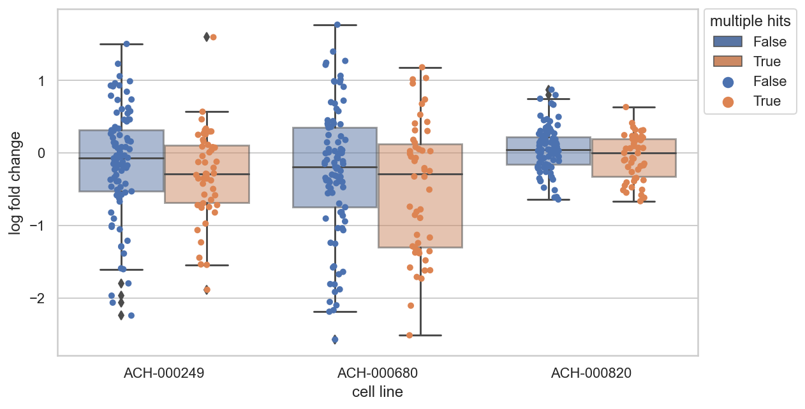

However, if the data is standardized by gene and cell line, the effect is not as visible.

```python
fig, axes = plt.subplots(nrows=2, ncols=1, figsize=(9, 9))

sns.boxenplot(
    data=multiple_hits_data,
    x="depmap_id",
    hue="multiple_hits_on_gene",
    y="lfc_z",
    width=0.5,
    ax=axes[0],
)
sns.violinplot(
    data=multiple_hits_data,
    x="depmap_id",
    hue="multiple_hits_on_gene",
    y="lfc_z",
    ax=axes[1],
)

for ax in axes:
    ax.legend(bbox_to_anchor=(1.01, 1), loc=2, borderaxespad=0.0, title="multiple hits")
    ax.set_xlabel("cell line")
    ax.set_ylabel("log fold change (z-scaled)")

fig.tight_layout()
plt.show()
```

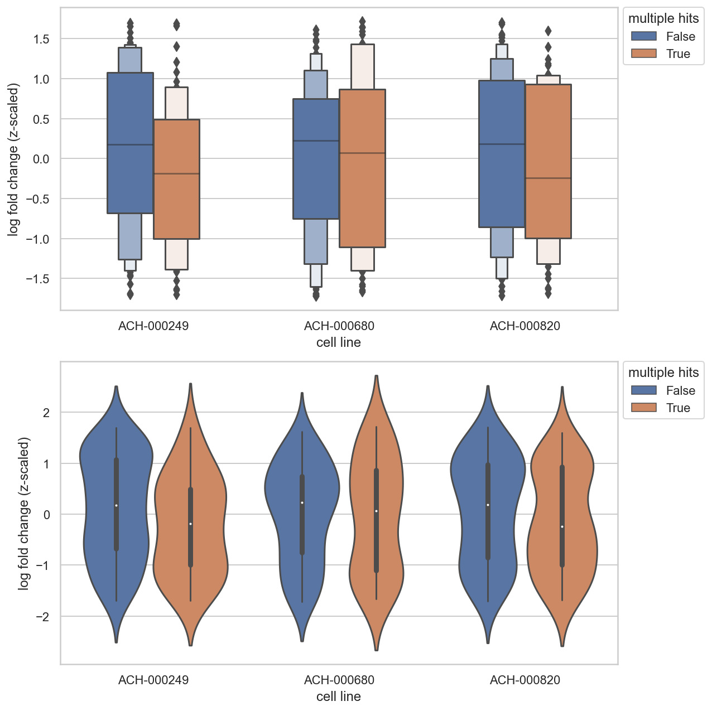

#### Visualizing copy number along chromosomes

The last analysis I conducted was just to visualize the copy number data along the chromosomes.
This diesn't provide any interesting insight, I just want to see what it looks like.

```python
CELL_LINE = "ACH-000680"
cell_chromosome_df = crc_data[crc_data.screen == "broad"].query(
    f"depmap_id == '{CELL_LINE}'"
)[
    [
        "hugo_symbol",
        "sgrna",
        "depmap_id",
        "lfc",
        "copy_number",
        "rna_expr",
        "sgrna_target_chr",
        "genome_alignment",
    ]
]
```

```python
cell_cn_df = (
    cell_chromosome_df[["copy_number", "sgrna_target_chr", "genome_alignment", "lfc"]]
    .drop_duplicates()
    .reset_index(drop=True)
    .compute()
    .pipe(biohelp.extract_chromosome_location_to_df, col_name="genome_alignment")
    .pipe(biohelp.make_chromosome_categorical, chr_col="chr")
)

cell_cn_df.head()
```

    /usr/local/Caskroom/miniconda/base/envs/speclet/lib/python3.9/site-packages/numpy/core/numeric.py:2453: FutureWarning: elementwise comparison failed; returning scalar instead, but in the future will perform elementwise comparison

<div>
<style scoped>
    .dataframe tbody tr th:only-of-type {
        vertical-align: middle;
    }

    .dataframe tbody tr th {
        vertical-align: top;
    }

    .dataframe thead th {
        text-align: right;
    }
</style>
<table border="1" class="dataframe">
  <thead>
    <tr style="text-align: right;">
      <th></th>
      <th>copy_number</th>
      <th>sgrna_target_chr</th>
      <th>genome_alignment</th>
      <th>lfc</th>
      <th>chr</th>
      <th>pos</th>
      <th>strand</th>
    </tr>
  </thead>
  <tbody>
    <tr>
      <th>0</th>
      <td>1.456644</td>
      <td>2</td>
      <td>chr2_130522105_-</td>
      <td>-0.067602</td>
      <td>2</td>
      <td>130522105</td>
      <td>-1</td>
    </tr>
    <tr>
      <th>1</th>
      <td>1.132130</td>
      <td>11</td>
      <td>chr11_89916950_-</td>
      <td>0.531739</td>
      <td>11</td>
      <td>89916950</td>
      <td>-1</td>
    </tr>
    <tr>
      <th>2</th>
      <td>0.763323</td>
      <td>5</td>
      <td>chr5_71055421_-</td>
      <td>-0.903544</td>
      <td>5</td>
      <td>71055421</td>
      <td>-1</td>
    </tr>
    <tr>
      <th>3</th>
      <td>0.763323</td>
      <td>5</td>
      <td>chr5_69572480_+</td>
      <td>-0.758697</td>
      <td>5</td>
      <td>69572480</td>
      <td>1</td>
    </tr>
    <tr>
      <th>4</th>
      <td>0.987681</td>
      <td>X</td>
      <td>chrX_155898173_+</td>
      <td>0.327171</td>
      <td>X</td>
      <td>155898173</td>
      <td>1</td>
    </tr>
  </tbody>
</table>
</div>

```python
fg = sns.relplot(
    data=cell_cn_df,
    x="pos",
    y="copy_number",
    color="k",
    col="chr",
    col_wrap=4,
    kind="scatter",
    facet_kws={"sharex": False, "sharey": False},
)
fg.set_axis_labels("position", "copy number")
plt.show()
```

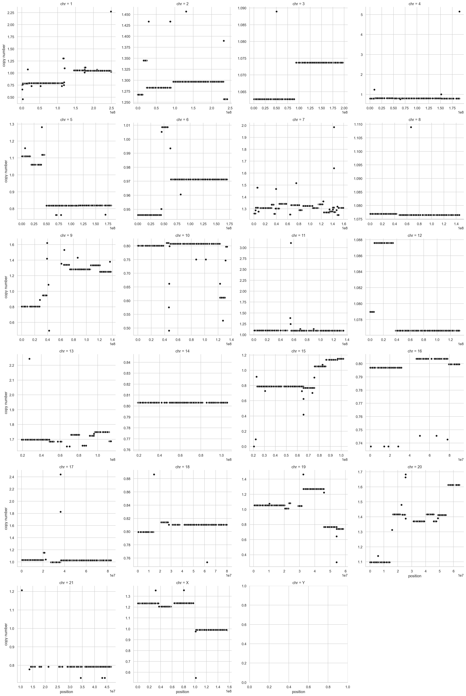

```python
fig = plt.figure(figsize=(9, 5))
sns.violinplot(data=cell_cn_df, x="chr", y="lfc", color="0.6");
```


---

```python
notebook_toc = time()
print(f"execution time: {(notebook_toc - notebook_tic) / 60:.2f} minutes")
```

    execution time: 7.26 minutes

```python
%load_ext watermark
%watermark -d -u -v -iv -b -h -m
```

    Last updated: 2021-07-21

    Python implementation: CPython
    Python version       : 3.9.2
    IPython version      : 7.21.0

    Compiler    : Clang 11.0.1
    OS          : Darwin
    Release     : 20.4.0
    Machine     : x86_64
    Processor   : i386
    CPU cores   : 4
    Architecture: 64bit

    Hostname: JHCookMac.local

    Git branch: sp7-parameterizations

    arviz     : 0.11.2
    re        : 2.2.1
    numpy     : 1.20.1
    matplotlib: 3.3.4
    pymc3     : 3.11.1
    dask      : 2021.7.0
    theano    : 1.0.5
    plotnine  : 0.8.0
    pandas    : 1.2.3
    seaborn   : 0.11.1
    janitor   : 0.20.14
    scipy     : 1.6.0
