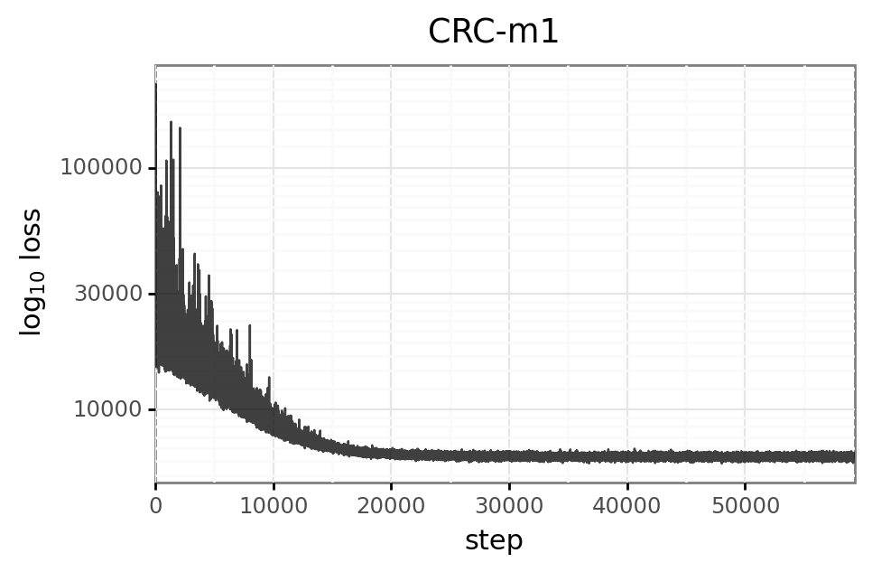
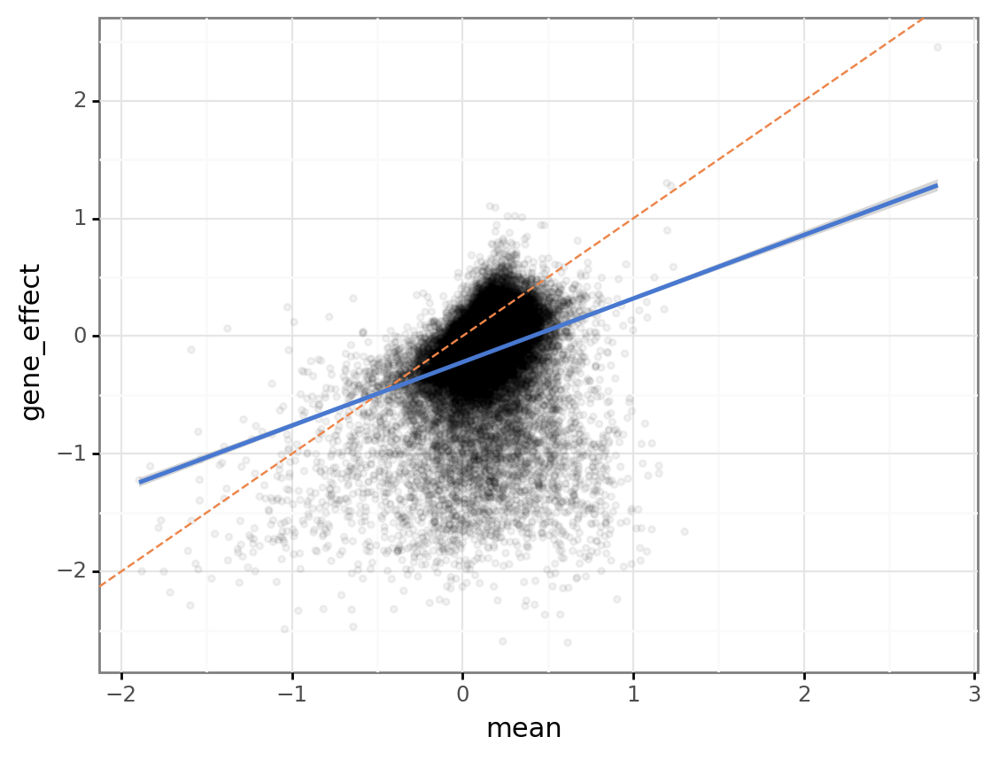
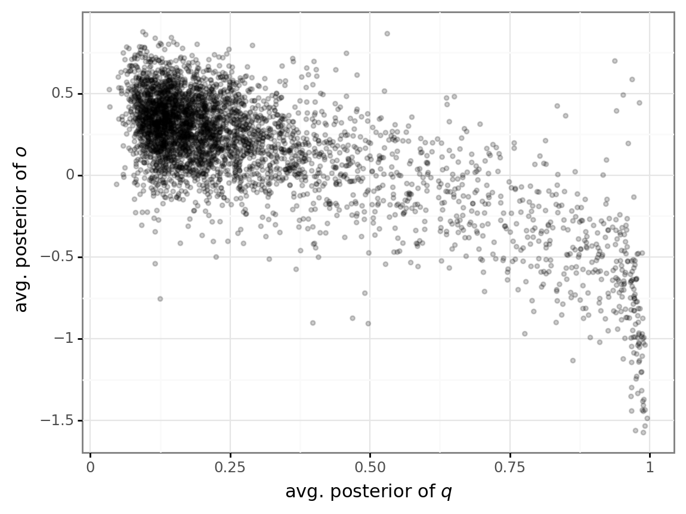
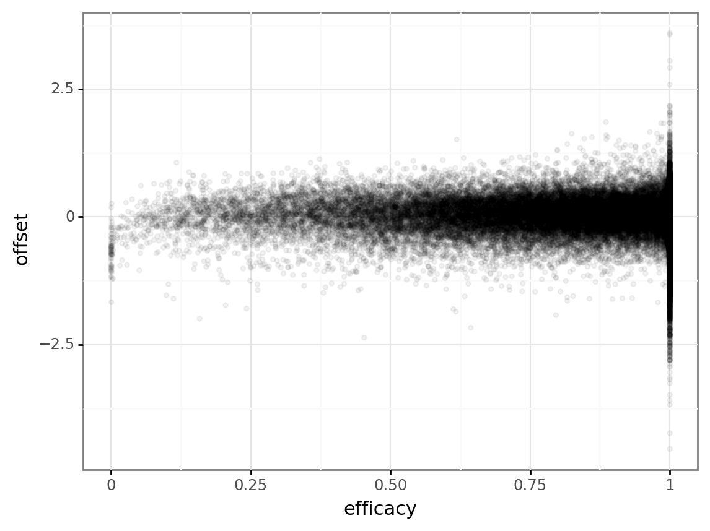
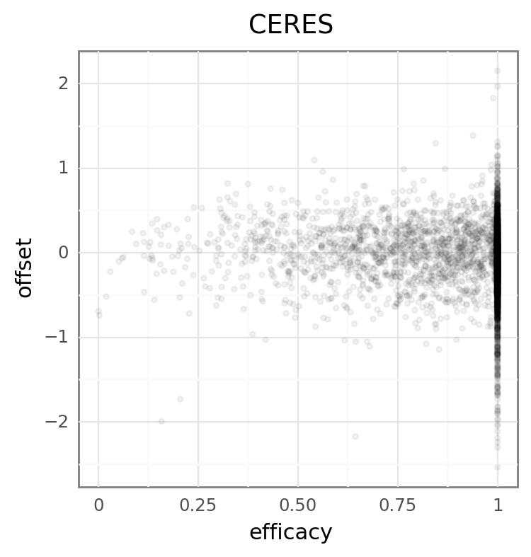
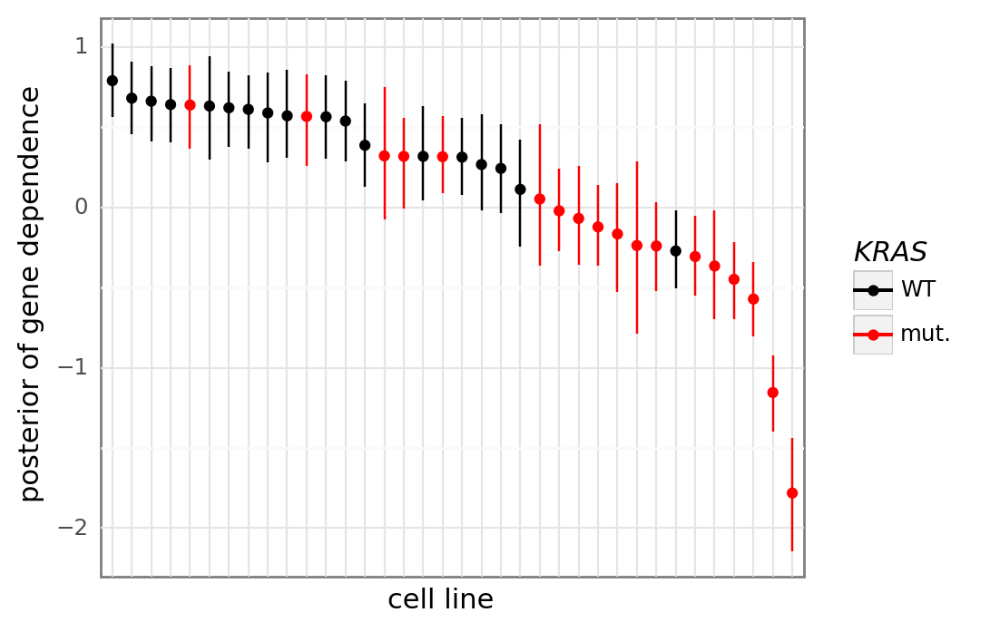
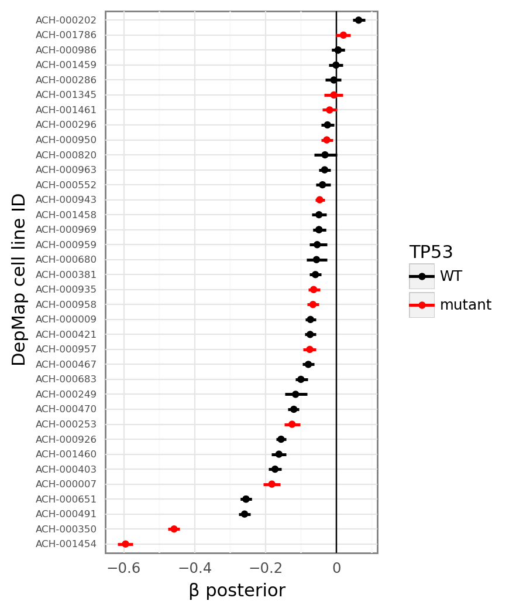

# Initial analysis of fit models

```python
%load_ext autoreload
%autoreload 2
```

```python
import re
import string
import warnings
from pathlib import Path
from time import time
from typing import Dict, List, Optional, Tuple, Union

import arviz as az
import janitor
import matplotlib.colors as mcolors
import matplotlib.pyplot as plt
import numpy as np
import pandas as pd
import plotnine as gg
import pymc3 as pm
import seaborn as sns
from theano import tensor as tt
```

```python
import src.modeling.pymc3_analysis as pmanal
from src.command_line_interfaces import sampling_pymc3_models_cli as sampling
from src.command_line_interfaces.cli_helpers import ModelOption
from src.data_processing import achilles as achelp
from src.data_processing import common as dphelp
from src.io import data_io
from src.io.cache_io import default_cache_dir
from src.modeling import pymc3_sampling_api as pmapi
from src.models.crc_model import CrcModel
from src.plot.color_pal import ModelColors, SeabornColor
```

```python
notebook_tic = time()

warnings.simplefilter(action="ignore", category=UserWarning)

gg.theme_set(gg.theme_bw())
%config InlineBackend.figure_format = "retina"

RANDOM_SEED = 1111
np.random.seed(RANDOM_SEED)

HDI_PROB = 0.89
```

## Data

```python
dm_guide_efficacy = pd.read_csv(
    data_io.data_path(data_io.DataFile.achilles_guide_efficacy)
)
dm_guide_efficacy.head()
```

<div>
<style scoped>
    .dataframe tbody tr th:only-of-type {
        vertical-align: middle;
    }

    .dataframe tbody tr th {
        vertical-align: top;
    }

    .dataframe thead th {
        text-align: right;
    }
</style>
<table border="1" class="dataframe">
  <thead>
    <tr style="text-align: right;">
      <th></th>
      <th>sgRNA</th>
      <th>offset</th>
      <th>efficacy</th>
    </tr>
  </thead>
  <tbody>
    <tr>
      <th>0</th>
      <td>AAAAAAATCCAGCAATGCAG</td>
      <td>-0.021827</td>
      <td>0.999956</td>
    </tr>
    <tr>
      <th>1</th>
      <td>AAAAAACCCGTAGATAGCCT</td>
      <td>-0.943473</td>
      <td>0.028545</td>
    </tr>
    <tr>
      <th>2</th>
      <td>AAAAAAGAAGAAAAAACCAG</td>
      <td>0.411906</td>
      <td>0.999845</td>
    </tr>
    <tr>
      <th>3</th>
      <td>AAAAAAGCTCAAGAAGGAGG</td>
      <td>-0.245704</td>
      <td>0.999886</td>
    </tr>
    <tr>
      <th>4</th>
      <td>AAAAAAGGCTGTAAAAGCGT</td>
      <td>-0.081956</td>
      <td>0.661372</td>
    </tr>
  </tbody>
</table>
</div>

```python
dm_essentials = pd.read_csv(data_io.data_path(data_io.DataFile.achilles_essentials))

essential_genes = dm_essentials.gene[dm_essentials.essential]
nonessential_genes = dm_essentials.gene[~dm_essentials.essential]

print(f"    num. essential genes: {len(essential_genes)}")
print(f"num. non-essential genes: {len(nonessential_genes)}")

dm_essentials.head()
```

        num. essential genes: 1246
    num. non-essential genes: 758

<div>
<style scoped>
    .dataframe tbody tr th:only-of-type {
        vertical-align: middle;
    }

    .dataframe tbody tr th {
        vertical-align: top;
    }

    .dataframe thead th {
        text-align: right;
    }
</style>
<table border="1" class="dataframe">
  <thead>
    <tr style="text-align: right;">
      <th></th>
      <th>gene</th>
      <th>essential</th>
    </tr>
  </thead>
  <tbody>
    <tr>
      <th>0</th>
      <td>AAMP</td>
      <td>True</td>
    </tr>
    <tr>
      <th>1</th>
      <td>AARS</td>
      <td>True</td>
    </tr>
    <tr>
      <th>2</th>
      <td>AASDHPPT</td>
      <td>True</td>
    </tr>
    <tr>
      <th>3</th>
      <td>ABCB7</td>
      <td>True</td>
    </tr>
    <tr>
      <th>4</th>
      <td>ABCE1</td>
      <td>True</td>
    </tr>
  </tbody>
</table>
</div>

```python

```

## Load models

```python
fit_models: Dict[str, CrcModel] = {}

model_info = (
    (ModelOption.crc_model_one, "CRC-m1"),
    (ModelOption.crc_ceres_mimic, "CERES-copynumber-sgrnaint"),
)

for m, n in model_info:
    fit_models[n] = sampling.sample_speclet_model(m, n, debug=False)
```

    (INFO) Cache directory: /n/data2/dfci/cancerbio/haigis/Cook/speclet/models/model_cache/pymc3_model_cache/CRC-m1
    (INFO) Sampling 'crc_model_one' with custom name 'CRC-m1'
    (INFO) Running model build method.
    (INFO) Running ADVI fitting method.
    /home/jc604/.conda/envs/speclet/lib/python3.9/site-packages/pymc3/data.py:316: FutureWarning: Using a non-tuple sequence for multidimensional indexing is deprecated; use `arr[tuple(seq)]` instead of `arr[seq]`. In the future this will be interpreted as an array index, `arr[np.array(seq)]`, which will result either in an error or a different result.
    /home/jc604/.conda/envs/speclet/lib/python3.9/site-packages/pymc3/data.py:316: FutureWarning: Using a non-tuple sequence for multidimensional indexing is deprecated; use `arr[tuple(seq)]` instead of `arr[seq]`. In the future this will be interpreted as an array index, `arr[np.array(seq)]`, which will result either in an error or a different result.
    (INFO) finished; execution time: 1.37 minutes
    (INFO) Cache directory: /n/data2/dfci/cancerbio/haigis/Cook/speclet/models/model_cache/pymc3_model_cache/CERES-copynumber-sgrnaint
    (INFO) Sampling 'crc_ceres_mimic' with custom name 'CERES-copynumber-sgrnaint'
    (INFO) Including gene copy number covariate in CERES model.
    (INFO) Including sgRNA|gene varying intercept in CERES model.
    (INFO) Running model build method.
    (INFO) Running ADVI fitting method.
    /home/jc604/.conda/envs/speclet/lib/python3.9/site-packages/pymc3/data.py:316: FutureWarning: Using a non-tuple sequence for multidimensional indexing is deprecated; use `arr[tuple(seq)]` instead of `arr[seq]`. In the future this will be interpreted as an array index, `arr[np.array(seq)]`, which will result either in an error or a different result.
    (INFO) finished; execution time: 0.42 minutes

```python
for name, model in fit_models.items():
    p = pmanal.plot_vi_hist(model.advi_results.approximation)
    p = (
        p
        + gg.scale_x_continuous(expand=(0, 0))
        + gg.scale_y_log10()
        + gg.theme(figure_size=(5, 3))
        + gg.labs(y=r"$\log_{10}$ loss", title=name)
    )
    print(p)
```




```python
ceres_mimic = fit_models["CERES-copynumber-sgrnaint"]
ceres_mimic.data["depmap_id"].cat.categories

az_ceres_mimic = pmapi.convert_samples_to_arviz(
    ceres_mimic.model, ceres_mimic.advi_results
)
```

```python
mimic_gene_effect = (
    az.summary(az_ceres_mimic, var_names="d", kind="stats", hdi_prob=HDI_PROB)
    .reset_index(drop=False)
    .rename(columns={"index": "param_idx"})
    .pipe(
        pmanal.extract_matrix_variable_indices,
        col="param_idx",
        idx1=ceres_mimic.data["hugo_symbol"].cat.categories,
        idx2=ceres_mimic.data["depmap_id"].cat.categories,
        idx1name="hugo_symbol",
        idx2name="depmap_id",
    )
)

mimic_gene_effect.head()
```

<div>
<style scoped>
    .dataframe tbody tr th:only-of-type {
        vertical-align: middle;
    }

    .dataframe tbody tr th {
        vertical-align: top;
    }

    .dataframe thead th {
        text-align: right;
    }
</style>
<table border="1" class="dataframe">
  <thead>
    <tr style="text-align: right;">
      <th></th>
      <th>param_idx</th>
      <th>mean</th>
      <th>sd</th>
      <th>hdi_5.5%</th>
      <th>hdi_94.5%</th>
      <th>hugo_symbol</th>
      <th>depmap_id</th>
    </tr>
  </thead>
  <tbody>
    <tr>
      <th>0</th>
      <td>d[0,0]</td>
      <td>0.122</td>
      <td>0.362</td>
      <td>-0.446</td>
      <td>0.717</td>
      <td>A2ML1</td>
      <td>ACH-000007</td>
    </tr>
    <tr>
      <th>1</th>
      <td>d[0,1]</td>
      <td>0.096</td>
      <td>0.357</td>
      <td>-0.430</td>
      <td>0.696</td>
      <td>A2ML1</td>
      <td>ACH-000009</td>
    </tr>
    <tr>
      <th>2</th>
      <td>d[0,2]</td>
      <td>0.020</td>
      <td>0.370</td>
      <td>-0.551</td>
      <td>0.611</td>
      <td>A2ML1</td>
      <td>ACH-000202</td>
    </tr>
    <tr>
      <th>3</th>
      <td>d[0,3]</td>
      <td>0.141</td>
      <td>0.383</td>
      <td>-0.478</td>
      <td>0.723</td>
      <td>A2ML1</td>
      <td>ACH-000249</td>
    </tr>
    <tr>
      <th>4</th>
      <td>d[0,4]</td>
      <td>0.251</td>
      <td>0.386</td>
      <td>-0.353</td>
      <td>0.867</td>
      <td>A2ML1</td>
      <td>ACH-000253</td>
    </tr>
  </tbody>
</table>
</div>

```python
dm_gene_effect_path = data_io.modeling_data_dir() / "achilles_gene_effect.csv"
dm_gene_effect = pd.read_csv(dm_gene_effect_path)

for col in ["hugo_symbol", "depmap_id"]:
    idx = dm_gene_effect[col].isin(ceres_mimic.data[col].cat.categories)
    dm_gene_effect = dm_gene_effect[idx]

dm_gene_effect = dm_gene_effect.reset_index(drop=True)
dm_gene_effect.head()
```

<div>
<style scoped>
    .dataframe tbody tr th:only-of-type {
        vertical-align: middle;
    }

    .dataframe tbody tr th {
        vertical-align: top;
    }

    .dataframe thead th {
        text-align: right;
    }
</style>
<table border="1" class="dataframe">
  <thead>
    <tr style="text-align: right;">
      <th></th>
      <th>depmap_id</th>
      <th>hugo_symbol</th>
      <th>gene_effect</th>
      <th>gene_effect_unscaled</th>
    </tr>
  </thead>
  <tbody>
    <tr>
      <th>0</th>
      <td>ACH-000007</td>
      <td>A2ML1</td>
      <td>0.157945</td>
      <td>0.405450</td>
    </tr>
    <tr>
      <th>1</th>
      <td>ACH-000009</td>
      <td>A2ML1</td>
      <td>0.054225</td>
      <td>0.373386</td>
    </tr>
    <tr>
      <th>2</th>
      <td>ACH-000202</td>
      <td>A2ML1</td>
      <td>0.028024</td>
      <td>0.291517</td>
    </tr>
    <tr>
      <th>3</th>
      <td>ACH-000249</td>
      <td>A2ML1</td>
      <td>0.309057</td>
      <td>0.536752</td>
    </tr>
    <tr>
      <th>4</th>
      <td>ACH-000253</td>
      <td>A2ML1</td>
      <td>0.236280</td>
      <td>0.794892</td>
    </tr>
  </tbody>
</table>
</div>

```python
merged_gene_effect = pd.merge(
    dm_gene_effect,
    mimic_gene_effect[["hugo_symbol", "depmap_id", "mean", "hdi_5.5%", "hdi_94.5%"]],
    how="inner",
    on=["depmap_id", "hugo_symbol"],
)
```

```python
merged_gene_effect.head()
```

<div>
<style scoped>
    .dataframe tbody tr th:only-of-type {
        vertical-align: middle;
    }

    .dataframe tbody tr th {
        vertical-align: top;
    }

    .dataframe thead th {
        text-align: right;
    }
</style>
<table border="1" class="dataframe">
  <thead>
    <tr style="text-align: right;">
      <th></th>
      <th>depmap_id</th>
      <th>hugo_symbol</th>
      <th>gene_effect</th>
      <th>gene_effect_unscaled</th>
      <th>mean</th>
      <th>hdi_5.5%</th>
      <th>hdi_94.5%</th>
    </tr>
  </thead>
  <tbody>
    <tr>
      <th>0</th>
      <td>ACH-000007</td>
      <td>A2ML1</td>
      <td>0.157945</td>
      <td>0.405450</td>
      <td>0.122</td>
      <td>-0.446</td>
      <td>0.717</td>
    </tr>
    <tr>
      <th>1</th>
      <td>ACH-000009</td>
      <td>A2ML1</td>
      <td>0.054225</td>
      <td>0.373386</td>
      <td>0.096</td>
      <td>-0.430</td>
      <td>0.696</td>
    </tr>
    <tr>
      <th>2</th>
      <td>ACH-000202</td>
      <td>A2ML1</td>
      <td>0.028024</td>
      <td>0.291517</td>
      <td>0.020</td>
      <td>-0.551</td>
      <td>0.611</td>
    </tr>
    <tr>
      <th>3</th>
      <td>ACH-000249</td>
      <td>A2ML1</td>
      <td>0.309057</td>
      <td>0.536752</td>
      <td>0.141</td>
      <td>-0.478</td>
      <td>0.723</td>
    </tr>
    <tr>
      <th>4</th>
      <td>ACH-000253</td>
      <td>A2ML1</td>
      <td>0.236280</td>
      <td>0.794892</td>
      <td>0.251</td>
      <td>-0.353</td>
      <td>0.867</td>
    </tr>
  </tbody>
</table>
</div>

```python
(
    gg.ggplot(merged_gene_effect, gg.aes(x="mean", y="gene_effect"))
    + gg.geom_point(size=1, alpha=0.05)
    + gg.geom_abline(intercept=0, slope=1, color=SeabornColor.orange, linetype="--")
    + gg.geom_smooth(method="lm", color=SeabornColor.blue)
)
```



    <ggplot: (8727116748831)>

```python
import scipy.stats

gene_effect_corr = scipy.stats.pearsonr(
    merged_gene_effect["gene_effect"], merged_gene_effect["mean"]
)
print(f"correlation: {gene_effect_corr[0]:.3f}")
print(f"    p-value: {gene_effect_corr[1]:.2e}")
```

    correlation: 0.285
        p-value: 0.00e+00

```python
from typing import List, Union


def extract_param_name(params: Union[np.ndarray, pd.Series, List]) -> List[str]:
    return [re.split(r"\[", p)[0] for p in params]


def extract_param_idx(params: Union[np.ndarray, pd.Series, List]) -> List[int]:
    return [int(re.findall(r"\d+", p)[0]) for p in params]
```

```python
guide_efficacy_params = (
    az.summary(az_ceres_mimic, var_names=["q", "o"], kind="stats", hdi_prob=HDI_PROB)
    .drop(columns=["sd"])
    .reset_index(drop=False)
    .rename(columns={"index": "model_param"})
    .assign(
        param_name=lambda d: extract_param_name(d.model_param),
        sgrna_idx=lambda d: extract_param_idx(d.model_param),
    )
    .pivot_wider(
        index="sgrna_idx",
        names_from="param_name",
        values_from=["mean", "hdi_5.5%", "hdi_94.5%"],
    )
)

guide_efficacy_params.head()
```

<div>
<style scoped>
    .dataframe tbody tr th:only-of-type {
        vertical-align: middle;
    }

    .dataframe tbody tr th {
        vertical-align: top;
    }

    .dataframe thead th {
        text-align: right;
    }
</style>
<table border="1" class="dataframe">
  <thead>
    <tr style="text-align: right;">
      <th></th>
      <th>sgrna_idx</th>
      <th>q_mean</th>
      <th>o_mean</th>
      <th>q_hdi_5.5%</th>
      <th>o_hdi_5.5%</th>
      <th>q_hdi_94.5%</th>
      <th>o_hdi_94.5%</th>
    </tr>
  </thead>
  <tbody>
    <tr>
      <th>0</th>
      <td>0</td>
      <td>0.144</td>
      <td>0.546</td>
      <td>0.039</td>
      <td>0.476</td>
      <td>0.240</td>
      <td>0.626</td>
    </tr>
    <tr>
      <th>1</th>
      <td>1</td>
      <td>0.156</td>
      <td>0.429</td>
      <td>0.040</td>
      <td>0.359</td>
      <td>0.256</td>
      <td>0.509</td>
    </tr>
    <tr>
      <th>2</th>
      <td>2</td>
      <td>0.128</td>
      <td>0.243</td>
      <td>0.030</td>
      <td>0.168</td>
      <td>0.224</td>
      <td>0.317</td>
    </tr>
    <tr>
      <th>3</th>
      <td>3</td>
      <td>0.126</td>
      <td>0.386</td>
      <td>0.028</td>
      <td>0.316</td>
      <td>0.223</td>
      <td>0.463</td>
    </tr>
    <tr>
      <th>4</th>
      <td>4</td>
      <td>0.082</td>
      <td>0.529</td>
      <td>0.007</td>
      <td>0.451</td>
      <td>0.156</td>
      <td>0.606</td>
    </tr>
  </tbody>
</table>
</div>

```python
(
    gg.ggplot(guide_efficacy_params, gg.aes(x="q_mean", y="o_mean"))
    + gg.geom_point(size=1, alpha=0.2)
    + gg.labs(x="avg. posterior of $q$", y="avg. posterior of $o$")
)
```



    <ggplot: (8727116723800)>

```python
(
    gg.ggplot(dm_guide_efficacy, gg.aes(x="efficacy", y="offset"))
    + gg.geom_point(size=1, alpha=0.05)
)
```



    <ggplot: (8727112498713)>

```python
merged_gene_effect_long = (
    merged_gene_effect[["depmap_id", "hugo_symbol", "gene_effect_unscaled", "mean"]]
    .rename(columns={"gene_effect_unscaled": "CERES", "mean": "CERES-mimic"})
    .pivot_longer(
        column_names=["CERES", "CERES-mimic"], names_to="model", values_to="gene_effect"
    )
)
```

```python
pal = {"CERES": ModelColors.CERES, "CERES-mimic": ModelColors.CERES_mimic}

essential_labeller = lambda x: "Essential" if x else "Non-essential"


(
    gg.ggplot(
        merged_gene_effect_long.merge(
            dm_essentials, how="inner", left_on="hugo_symbol", right_on="gene"
        ),
        gg.aes(x="gene_effect", color="model", fill="model"),
    )
    + gg.facet_wrap("essential", nrow=1, labeller=essential_labeller)
    + gg.geom_density(alpha=0.2, size=1.2)
    + gg.scale_y_continuous(expand=(0, 0, 0.02, 0))
    + gg.scale_color_manual(values=pal)
    + gg.scale_fill_manual(values=pal)
    + gg.theme(
        strip_background=gg.element_blank(),
        axis_ticks_major=gg.element_blank(),
        figure_size=(7, 3),
    )
    + gg.labs(
        x="gene dependency",
        y="density",
        color="model",
        fill="model",
    )
)
```



    <ggplot: (8727112920643)>

```python
def merge_with_kras_mut(df: pd.DataFrame, full_data: pd.DataFrame) -> pd.DataFrame:
    return (
        df.copy()
        .merge(
            full_data.copy()[["depmap_id", "kras_mutation"]].drop_duplicates(),
            on="depmap_id",
        )
        .reset_index(drop=True)
        .assign(KRAS=lambda d: d.kras_mutation != "WT")
    )


kras_dep_long = merge_with_kras_mut(
    merged_gene_effect_long.query("hugo_symbol == 'KRAS'"), ceres_mimic.data
)

(
    gg.ggplot(
        kras_dep_long,
        gg.aes(x="model", y="gene_effect", color="KRAS"),
    )
    + gg.geom_point(position=gg.position_jitterdodge(jitter_height=0, jitter_width=0.3))
    + gg.geom_boxplot(outlier_alpha=0, alpha=0.4, fill="white", show_legend=False)
    + gg.scale_color_manual(values=("black", "red"), labels=("WT", "mut."))
    + gg.theme(figure_size=(3, 4))
    + gg.labs(
        x="model", y="gene dependency", title="$KRAS$ gene dependency", color="$KRAS$"
    )
)
```



    <ggplot: (8727116753972)>

```python
kras_dep = (
    merge_with_kras_mut(
        merged_gene_effect.query("hugo_symbol == 'KRAS'"), ceres_mimic.data
    )
    .sort_values("mean", ascending=False)
    .pipe(dphelp.make_cat, col="depmap_id")
)

(
    gg.ggplot(kras_dep, gg.aes(x="depmap_id", y="mean", color="KRAS"))
    + gg.geom_point()
    + gg.geom_linerange(gg.aes(ymin="hdi_5.5%", ymax="hdi_94.5%"))
    + gg.scale_color_manual(values=("black", "red"), labels=("WT", "mut."))
    + gg.theme(
        axis_text_x=gg.element_blank(),
        axis_ticks_major=gg.element_blank(),
        figure_size=(5, 4),
    )
    + gg.labs(x="cell line", y="posterior of gene dependence", color="$KRAS$")
)
```


    <ggplot: (8727872050195)>

```python
kras_idx = np.where(ceres_mimic.data.hugo_symbol.cat.categories.values == "KRAS")[0][0]
az.summary(az_ceres_mimic, var_names=["h"], kind="stats", hdi_prob=HDI_PROB).iloc[
    kras_idx, :
]
```

    mean        -0.240
    sd           0.022
    hdi_5.5%    -0.274
    hdi_94.5%   -0.205
    Name: h[452], dtype: float64

```python
depmap_id_map = (
    ceres_mimic.data.copy()[["depmap_id"]].drop_duplicates().reset_index(drop=True)
)
depmap_id_map["idx"] = dphelp.get_indices(depmap_id_map, col="depmap_id")
```

```python
def filter_for_tp53(df: pd.DataFrame) -> pd.DataFrame:
    return (
        df.copy()
        .filter_column_isin("depmap_id", iterable=depmap_id_map.depmap_id.values)
        .query("hugo_symbol == 'TP53'")
        .reset_index(drop=True)
    )


ccle_mutation_df = pd.read_csv(
    data_io.data_path(data_io.DataFile.ccle_mutations), nrows=None, low_memory=False
).pipe(filter_for_tp53)

ccle_mutation_df.head()
```

<div>
<style scoped>
    .dataframe tbody tr th:only-of-type {
        vertical-align: middle;
    }

    .dataframe tbody tr th {
        vertical-align: top;
    }

    .dataframe thead th {
        text-align: right;
    }
</style>
<table border="1" class="dataframe">
  <thead>
    <tr style="text-align: right;">
      <th></th>
      <th>depmap_id</th>
      <th>hugo_symbol</th>
      <th>chromosome</th>
      <th>start_position</th>
      <th>end_position</th>
      <th>variant_classification</th>
      <th>variant_type</th>
      <th>reference_allele</th>
      <th>tumor_seq_allele1</th>
      <th>cdna_change</th>
      <th>codon_change</th>
      <th>protein_change</th>
      <th>isdeleterious</th>
      <th>istcgahotspot</th>
      <th>iscosmichotspot</th>
    </tr>
  </thead>
  <tbody>
    <tr>
      <th>0</th>
      <td>ACH-001460</td>
      <td>TP53</td>
      <td>17</td>
      <td>7574003</td>
      <td>7574003</td>
      <td>Nonsense_Mutation</td>
      <td>SNP</td>
      <td>G</td>
      <td>A</td>
      <td>c.1024C&gt;T</td>
      <td>c.(1024-1026)Cga&gt;Tga</td>
      <td>p.R342*</td>
      <td>True</td>
      <td>True</td>
      <td>True</td>
    </tr>
    <tr>
      <th>1</th>
      <td>ACH-000651</td>
      <td>TP53</td>
      <td>17</td>
      <td>7576921</td>
      <td>7576921</td>
      <td>Missense_Mutation</td>
      <td>SNP</td>
      <td>G</td>
      <td>A</td>
      <td>c.925C&gt;T</td>
      <td>c.(925-927)Ccc&gt;Tcc</td>
      <td>p.P309S</td>
      <td>False</td>
      <td>False</td>
      <td>True</td>
    </tr>
    <tr>
      <th>2</th>
      <td>ACH-000963</td>
      <td>TP53</td>
      <td>17</td>
      <td>7577105</td>
      <td>7577105</td>
      <td>Missense_Mutation</td>
      <td>SNP</td>
      <td>G</td>
      <td>T</td>
      <td>c.833C&gt;A</td>
      <td>c.(832-834)cCt&gt;cAt</td>
      <td>p.P278H</td>
      <td>False</td>
      <td>True</td>
      <td>True</td>
    </tr>
    <tr>
      <th>3</th>
      <td>ACH-000683</td>
      <td>TP53</td>
      <td>17</td>
      <td>7577120</td>
      <td>7577120</td>
      <td>Missense_Mutation</td>
      <td>SNP</td>
      <td>C</td>
      <td>A</td>
      <td>c.818G&gt;T</td>
      <td>c.(817-819)cGt&gt;cTt</td>
      <td>p.R273L</td>
      <td>False</td>
      <td>True</td>
      <td>True</td>
    </tr>
    <tr>
      <th>4</th>
      <td>ACH-000552</td>
      <td>TP53</td>
      <td>17</td>
      <td>7577120</td>
      <td>7577120</td>
      <td>Missense_Mutation</td>
      <td>SNP</td>
      <td>C</td>
      <td>T</td>
      <td>c.818G&gt;A</td>
      <td>c.(817-819)cGt&gt;cAt</td>
      <td>p.R273H</td>
      <td>False</td>
      <td>True</td>
      <td>True</td>
    </tr>
  </tbody>
</table>
</div>

```python
ccle_copynumber_df = (
    pd.read_csv(
        data_io.data_path(data_io.DataFile.ccle_copynumber),
        nrows=None,
        low_memory=False,
    )
    .pipe(filter_for_tp53)
    .assign(
        TP53_lost=lambda d: d.copy_number < 0.5,
        TP53_cn=lambda d: np.round(d.copy_number),
    )
)

ccle_copynumber_df.head()
```

<div>
<style scoped>
    .dataframe tbody tr th:only-of-type {
        vertical-align: middle;
    }

    .dataframe tbody tr th {
        vertical-align: top;
    }

    .dataframe thead th {
        text-align: right;
    }
</style>
<table border="1" class="dataframe">
  <thead>
    <tr style="text-align: right;">
      <th></th>
      <th>depmap_id</th>
      <th>hugo_symbol</th>
      <th>log2_cn_p1</th>
      <th>copy_number</th>
      <th>TP53_lost</th>
      <th>TP53_cn</th>
    </tr>
  </thead>
  <tbody>
    <tr>
      <th>0</th>
      <td>ACH-000007</td>
      <td>TP53</td>
      <td>0.975354</td>
      <td>1.652105</td>
      <td>False</td>
      <td>2.0</td>
    </tr>
    <tr>
      <th>1</th>
      <td>ACH-000009</td>
      <td>TP53</td>
      <td>0.624936</td>
      <td>0.868127</td>
      <td>False</td>
      <td>1.0</td>
    </tr>
    <tr>
      <th>2</th>
      <td>ACH-000202</td>
      <td>TP53</td>
      <td>0.895190</td>
      <td>1.447801</td>
      <td>False</td>
      <td>1.0</td>
    </tr>
    <tr>
      <th>3</th>
      <td>ACH-000249</td>
      <td>TP53</td>
      <td>0.604368</td>
      <td>0.830096</td>
      <td>False</td>
      <td>1.0</td>
    </tr>
    <tr>
      <th>4</th>
      <td>ACH-000253</td>
      <td>TP53</td>
      <td>0.996197</td>
      <td>1.707964</td>
      <td>False</td>
      <td>2.0</td>
    </tr>
  </tbody>
</table>
</div>

```python
copynumber_effect = (
    az.summary(az_ceres_mimic, var_names=["β"], kind="stats", hdi_prob=HDI_PROB)
    .reset_index(drop=False)
    .rename(columns={"index": "model_param"})
    .assign(
        param_name=lambda d: extract_param_name(d.model_param),
        depmap_idx=lambda d: extract_param_idx(d.model_param),
    )
    .merge(depmap_id_map, left_on="depmap_idx", right_on="idx")
    .assign(depmap_id=lambda d: d.depmap_id.values)
    .merge(
        ccle_mutation_df[["depmap_id", "variant_classification"]],
        how="left",
        on="depmap_id",
    )
    .merge(ccle_copynumber_df[["depmap_id", "TP53_cn"]], how="left", on="depmap_id")
    .rename(columns={"variant_classification": "TP53"})
    .fillna({"TP53": "WT", "TP53_cn": 2})
)
copynumber_effect.head()
```

<div>
<style scoped>
    .dataframe tbody tr th:only-of-type {
        vertical-align: middle;
    }

    .dataframe tbody tr th {
        vertical-align: top;
    }

    .dataframe thead th {
        text-align: right;
    }
</style>
<table border="1" class="dataframe">
  <thead>
    <tr style="text-align: right;">
      <th></th>
      <th>model_param</th>
      <th>mean</th>
      <th>sd</th>
      <th>hdi_5.5%</th>
      <th>hdi_94.5%</th>
      <th>param_name</th>
      <th>depmap_idx</th>
      <th>depmap_id</th>
      <th>idx</th>
      <th>TP53</th>
      <th>TP53_cn</th>
    </tr>
  </thead>
  <tbody>
    <tr>
      <th>0</th>
      <td>β[0]</td>
      <td>-0.182</td>
      <td>0.015</td>
      <td>-0.206</td>
      <td>-0.159</td>
      <td>β</td>
      <td>0</td>
      <td>ACH-000007</td>
      <td>0</td>
      <td>WT</td>
      <td>2.0</td>
    </tr>
    <tr>
      <th>1</th>
      <td>β[1]</td>
      <td>-0.073</td>
      <td>0.009</td>
      <td>-0.088</td>
      <td>-0.057</td>
      <td>β</td>
      <td>1</td>
      <td>ACH-000009</td>
      <td>1</td>
      <td>Nonsense_Mutation</td>
      <td>1.0</td>
    </tr>
    <tr>
      <th>2</th>
      <td>β[2]</td>
      <td>0.063</td>
      <td>0.010</td>
      <td>0.047</td>
      <td>0.081</td>
      <td>β</td>
      <td>2</td>
      <td>ACH-000202</td>
      <td>2</td>
      <td>Missense_Mutation</td>
      <td>1.0</td>
    </tr>
    <tr>
      <th>3</th>
      <td>β[3]</td>
      <td>-0.115</td>
      <td>0.020</td>
      <td>-0.145</td>
      <td>-0.082</td>
      <td>β</td>
      <td>3</td>
      <td>ACH-000249</td>
      <td>3</td>
      <td>Missense_Mutation</td>
      <td>1.0</td>
    </tr>
    <tr>
      <th>4</th>
      <td>β[4]</td>
      <td>-0.125</td>
      <td>0.014</td>
      <td>-0.146</td>
      <td>-0.103</td>
      <td>β</td>
      <td>4</td>
      <td>ACH-000253</td>
      <td>4</td>
      <td>WT</td>
      <td>2.0</td>
    </tr>
  </tbody>
</table>
</div>

```python
copynumber_effect_plot = copynumber_effect.copy().sort_values("mean")
copynumber_effect_plot = dphelp.make_cat(
    copynumber_effect_plot, col="depmap_id"
).assign(TP53=lambda d: d.TP53 == "WT")

(
    gg.ggplot(copynumber_effect_plot, gg.aes(x="depmap_id", y="mean", color="TP53"))
    + gg.geom_hline(yintercept=0)
    + gg.geom_point()
    + gg.geom_linerange(gg.aes(ymin="hdi_5.5%", ymax="hdi_94.5%"), size=1)
    + gg.scale_color_manual(values=("black", "red"), labels=("WT", "mutant"))
    + gg.coord_flip()
    + gg.theme(
        axis_ticks_major=gg.element_blank(),
        axis_text_y=gg.element_text(size=6),
        figure_size=(3, 6),
    )
    + gg.labs(x="DepMap cell line ID", y="β posterior")
)
```



    <ggplot: (8727113194984)>

```python
ceres_mimic_predictions = pmanal.summarize_posterior_predictions(
    ceres_mimic.advi_results.posterior_predictive.get("lfc"),
    hdi_prob=0.89,
    merge_with=ceres_mimic.data[
        ["depmap_id", "hugo_symbol", "lfc", "sgrna", "gene_cn", "rna_expr"]
    ],
    calc_error=True,
    observed_y="lfc",
)

ceres_mimic_predictions.head()
```

    /home/jc604/.conda/envs/speclet/lib/python3.9/site-packages/arviz/stats/stats.py:456: FutureWarning: hdi currently interprets 2d data as (draw, shape) but this will change in a future release to (chain, draw) for coherence with other functions

<div>
<style scoped>
    .dataframe tbody tr th:only-of-type {
        vertical-align: middle;
    }

    .dataframe tbody tr th {
        vertical-align: top;
    }

    .dataframe thead th {
        text-align: right;
    }
</style>
<table border="1" class="dataframe">
  <thead>
    <tr style="text-align: right;">
      <th></th>
      <th>pred_mean</th>
      <th>pred_hdi_low</th>
      <th>pred_hdi_high</th>
      <th>depmap_id</th>
      <th>hugo_symbol</th>
      <th>lfc</th>
      <th>sgrna</th>
      <th>gene_cn</th>
      <th>rna_expr</th>
      <th>error</th>
    </tr>
  </thead>
  <tbody>
    <tr>
      <th>0</th>
      <td>0.297318</td>
      <td>-0.364924</td>
      <td>0.892873</td>
      <td>ACH-000007</td>
      <td>A2ML1</td>
      <td>0.096711</td>
      <td>ACAAACCTCTCTACACCCCA</td>
      <td>1.652984</td>
      <td>0.0</td>
      <td>-0.200607</td>
    </tr>
    <tr>
      <th>1</th>
      <td>0.282719</td>
      <td>-0.378074</td>
      <td>0.941211</td>
      <td>ACH-000007</td>
      <td>A2ML1</td>
      <td>0.804148</td>
      <td>ACAAACCTCTCTACACCCCA</td>
      <td>1.652984</td>
      <td>0.0</td>
      <td>0.521430</td>
    </tr>
    <tr>
      <th>2</th>
      <td>0.239842</td>
      <td>-0.474657</td>
      <td>0.867423</td>
      <td>ACH-000009</td>
      <td>A2ML1</td>
      <td>-0.091043</td>
      <td>ACAAACCTCTCTACACCCCA</td>
      <td>2.601301</td>
      <td>0.0</td>
      <td>-0.330885</td>
    </tr>
    <tr>
      <th>3</th>
      <td>0.243564</td>
      <td>-0.441624</td>
      <td>0.947052</td>
      <td>ACH-000009</td>
      <td>A2ML1</td>
      <td>0.339692</td>
      <td>ACAAACCTCTCTACACCCCA</td>
      <td>2.601301</td>
      <td>0.0</td>
      <td>0.096128</td>
    </tr>
    <tr>
      <th>4</th>
      <td>0.235671</td>
      <td>-0.492772</td>
      <td>0.777768</td>
      <td>ACH-000009</td>
      <td>A2ML1</td>
      <td>0.211244</td>
      <td>ACAAACCTCTCTACACCCCA</td>
      <td>2.601301</td>
      <td>0.0</td>
      <td>-0.024427</td>
    </tr>
  </tbody>
</table>
</div>

```python
(
    gg.ggplot(ceres_mimic_predictions, gg.aes(x="pred_mean", y="lfc"))
    + gg.geom_point(gg.aes(color="np.round(gene_cn)"), size=1, alpha=0.1)
    + gg.geom_abline(intercept=0, slope=1, color=SeabornColor.orange, linetype="--")
    + gg.geom_smooth(method="lm", color=SeabornColor.blue)
    + gg.scale_color_gradient2(
        limits=(0, 4),
        expand=(0, 0),
        midpoint=2,
        low="#2c7bb6",
        mid="#ffffbf",
        high="#d7191c",
        guide=gg.guide_colorbar(barwidth=8, ticks=False),
    )
    + gg.theme(figure_size=(8, 5))
    + gg.labs(
        x="average of posterior prediction",
        y="measured log fold change",
        color="gene CN (max. 4)",
    )
)
```


    <ggplot: (8727116783077)>

```python
pred_corr = scipy.stats.pearsonr(
    ceres_mimic_predictions.pred_mean, ceres_mimic_predictions.lfc
)
print(f"correlation: {pred_corr[0]:.3f}")
```

    correlation: 0.729

---

```python
notebook_toc = time()
print(f"execution time: {(notebook_toc - notebook_tic) / 60:.2f} minutes")
```

    execution time: 4.53 minutes

```python
%load_ext watermark
%watermark -d -u -v -iv -b -h -m
```

    Last updated: 2021-04-19

    Python implementation: CPython
    Python version       : 3.9.2
    IPython version      : 7.22.0

    Compiler    : GCC 9.3.0
    OS          : Linux
    Release     : 3.10.0-1062.el7.x86_64
    Machine     : x86_64
    Processor   : x86_64
    CPU cores   : 28
    Architecture: 64bit

    Hostname: compute-e-16-235.o2.rc.hms.harvard.edu

    Git branch: pipelines

    theano    : 1.0.5
    numpy     : 1.20.2
    pymc3     : 3.11.2
    matplotlib: 3.4.1
    scipy     : 1.6.2
    plotnine  : 0.8.0
    arviz     : 0.11.2
    pandas    : 1.2.3
    seaborn   : 0.11.1
    re        : 2.2.1
    janitor   : 0.20.14
