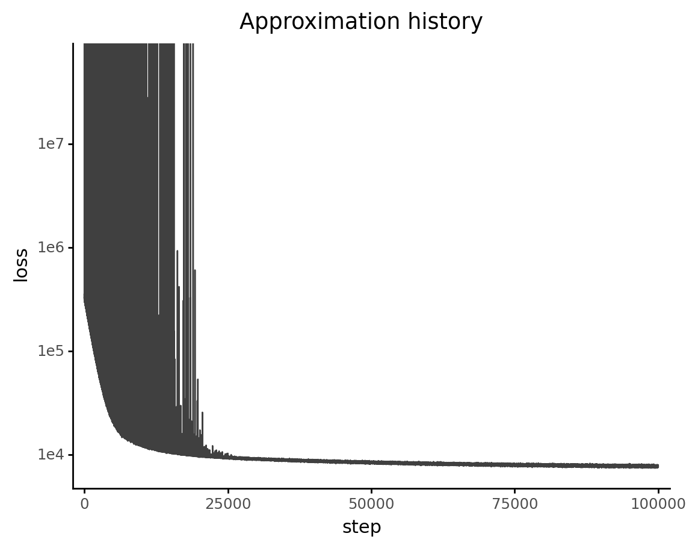
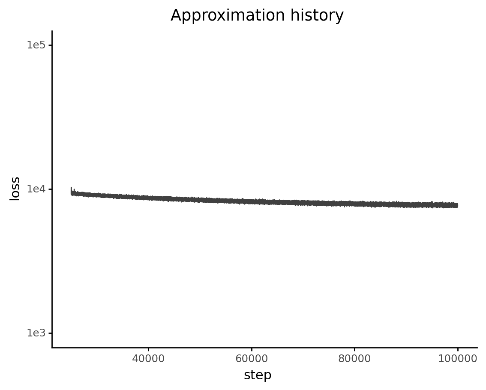
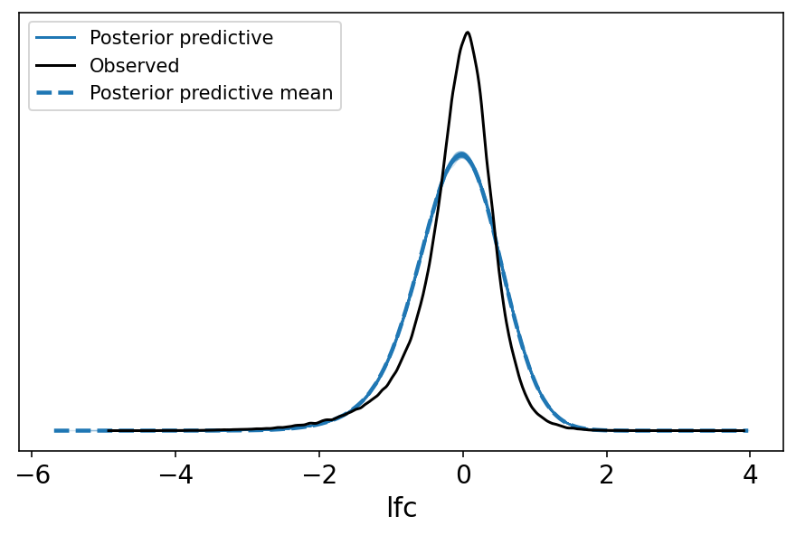
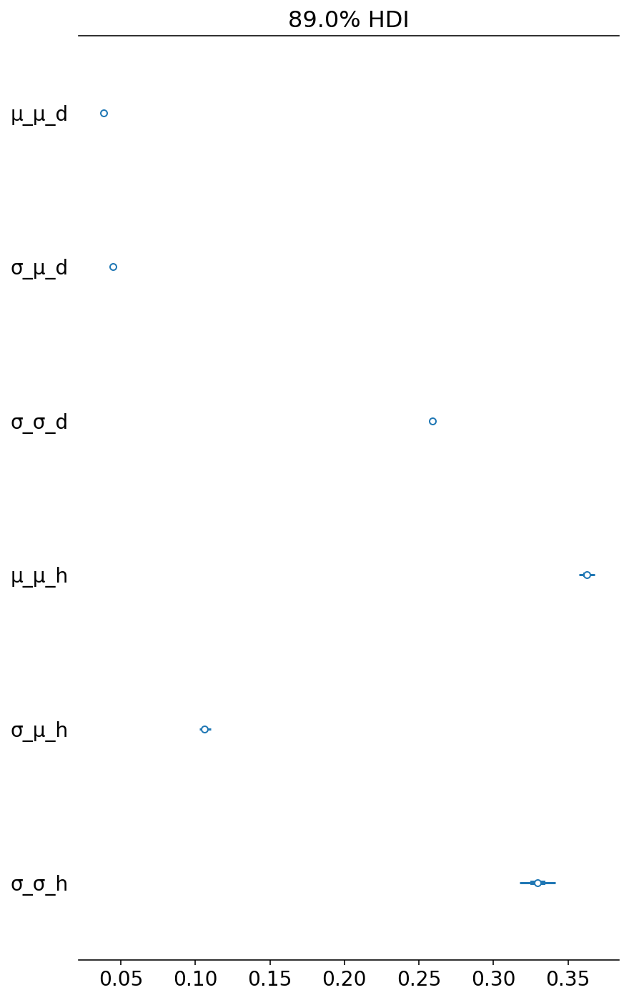
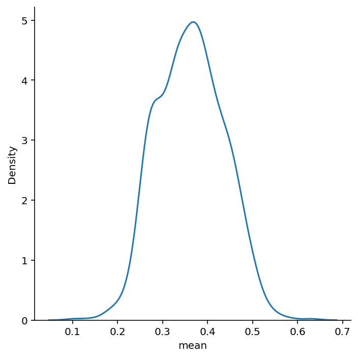
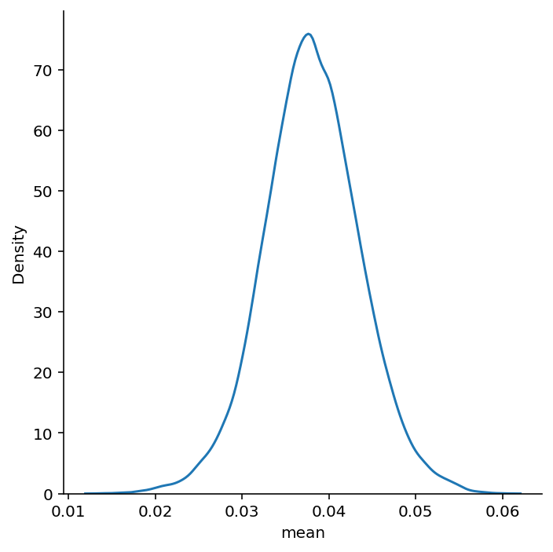

```python
%load_ext autoreload
%autoreload 2
```

```python
import re
import string
import warnings
from pathlib import Path
from time import time

import arviz as az
import matplotlib.colors as mcolors
import matplotlib.pyplot as plt
import numpy as np
import pandas as pd
import plotnine as gg
import pymc3 as pm
import seaborn as sns
from theano import tensor as tt
```

```python
from src.command_line_interfaces import sampling_pymc3_models_cli as sampling
from src.command_line_interfaces.cli_helpers import ModelOption
from src.data_processing import achilles as achelp
from src.data_processing import common as dphelp
from src.io import data_io
from src.modeling import pymc3_analysis as pmanal
from src.modeling import pymc3_sampling_api as pmapi
from src.plot.color_pal import ModelColors, SeabornColor
```

```python
notebook_tic = time()

warnings.simplefilter(action="ignore", category=UserWarning)

gg.theme_set(gg.theme_classic())
%config InlineBackend.figure_format = "retina"

RANDOM_SEED = 341
np.random.seed(RANDOM_SEED)

HDI_PROB = 0.89
```

## Data

```python
dm_guide_efficacy = pd.read_csv(
    data_io.data_path(data_io.DataFile.achilles_guide_efficacy)
)

dm_essentials = pd.read_csv(data_io.data_path(data_io.DataFile.achilles_essentials))

essential_genes = dm_essentials.gene[dm_essentials.essential]
nonessential_genes = dm_essentials.gene[~dm_essentials.essential]

print(f"    num. essential genes: {len(essential_genes)}")
print(f"num. non-essential genes: {len(nonessential_genes)}")
```

        num. essential genes: 1246
    num. non-essential genes: 758

```python
speclet_one_fit = sampling.sample_speclet_model(ModelOption.speclet_one, "SpecletOne")
```

    (INFO) Cache directory: /n/data2/dfci/cancerbio/haigis/Cook/speclet/models/model_cache/pymc3_model_cache/SpecletOne
    (INFO) Sampling 'speclet_one' with custom name 'SpecletOne'
    (INFO) Running model build method.
    (INFO) Running ADVI fitting method.
    /home/jc604/.conda/envs/speclet/lib/python3.9/site-packages/pymc3/data.py:316: FutureWarning: Using a non-tuple sequence for multidimensional indexing is deprecated; use `arr[tuple(seq)]` instead of `arr[seq]`. In the future this will be interpreted as an array index, `arr[np.array(seq)]`, which will result either in an error or a different result.
    /home/jc604/.conda/envs/speclet/lib/python3.9/site-packages/pymc3/data.py:316: FutureWarning: Using a non-tuple sequence for multidimensional indexing is deprecated; use `arr[tuple(seq)]` instead of `arr[seq]`. In the future this will be interpreted as an array index, `arr[np.array(seq)]`, which will result either in an error or a different result.
    (INFO) finished; execution time: 2.70 minutes

```python
(pmanal.plot_vi_hist(speclet_one_fit.advi_results.approximation) + gg.scale_y_log10())
```



    <ggplot: (8750742499386)>

```python
(
    pmanal.plot_vi_hist(speclet_one_fit.advi_results.approximation)
    + gg.scale_x_continuous(limits=(25000, None))
    + gg.scale_y_log10(limits=(1e3, 1e5))
)
```



    <ggplot: (8750739578537)>

```python
az_speclet_one = pmapi.convert_samples_to_arviz(
    speclet_one_fit.model, speclet_one_fit.advi_results
)
```

```python
az.plot_ppc(az_speclet_one, num_pp_samples=100, random_seed=0);
```



```python
az.plot_forest(
    az_speclet_one,
    var_names=["μ_μ_d", "σ_μ_d", "σ_σ_d", "μ_μ_h", "σ_μ_h", "σ_σ_h"],
    hdi_prob=HDI_PROB,
);
```



```python
s1_gene_consistent = (
    az.summary(az_speclet_one, var_names="μ_h", kind="stats", hdi_prob=HDI_PROB)
    .reset_index(drop=False)
    .rename(columns={"index": "param_idx"})
    .assign(hugo_symbol=speclet_one_fit.data.hugo_symbol.cat.categories)
)

sns.displot(s1_gene_consistent, x="mean", kind="kde");
```



```python
s1_gene_effect = (
    az.summary(az_speclet_one, var_names="μ_d", kind="stats", hdi_prob=HDI_PROB)
    .reset_index(drop=False)
    .rename(columns={"index": "param_idx"})
    .pipe(
        pmanal.extract_matrix_variable_indices,
        col="param_idx",
        idx1=speclet_one_fit.data["hugo_symbol"].cat.categories,
        idx2=speclet_one_fit.data["depmap_id"].cat.categories,
        idx1name="hugo_symbol",
        idx2name="depmap_id",
    )
)

s1_gene_effect.head()
```

<div>
<style scoped>
    .dataframe tbody tr th:only-of-type {
        vertical-align: middle;
    }

    .dataframe tbody tr th {
        vertical-align: top;
    }

    .dataframe thead th {
        text-align: right;
    }
</style>
<table border="1" class="dataframe">
  <thead>
    <tr style="text-align: right;">
      <th></th>
      <th>param_idx</th>
      <th>mean</th>
      <th>sd</th>
      <th>hdi_5.5%</th>
      <th>hdi_94.5%</th>
      <th>hugo_symbol</th>
      <th>depmap_id</th>
    </tr>
  </thead>
  <tbody>
    <tr>
      <th>0</th>
      <td>μ_d[0,0]</td>
      <td>0.043</td>
      <td>0.044</td>
      <td>-0.026</td>
      <td>0.112</td>
      <td>A2ML1</td>
      <td>ACH-000007</td>
    </tr>
    <tr>
      <th>1</th>
      <td>μ_d[0,1]</td>
      <td>0.036</td>
      <td>0.041</td>
      <td>-0.026</td>
      <td>0.100</td>
      <td>A2ML1</td>
      <td>ACH-000009</td>
    </tr>
    <tr>
      <th>2</th>
      <td>μ_d[0,2]</td>
      <td>0.031</td>
      <td>0.044</td>
      <td>-0.033</td>
      <td>0.104</td>
      <td>A2ML1</td>
      <td>ACH-000202</td>
    </tr>
    <tr>
      <th>3</th>
      <td>μ_d[0,3]</td>
      <td>0.044</td>
      <td>0.043</td>
      <td>-0.019</td>
      <td>0.115</td>
      <td>A2ML1</td>
      <td>ACH-000249</td>
    </tr>
    <tr>
      <th>4</th>
      <td>μ_d[0,4]</td>
      <td>0.039</td>
      <td>0.044</td>
      <td>-0.031</td>
      <td>0.109</td>
      <td>A2ML1</td>
      <td>ACH-000253</td>
    </tr>
  </tbody>
</table>
</div>

```python
sns.displot(s1_gene_effect, x="mean", kind="kde");
```



```python
s1_gene_effect.query("hugo_symbol == 'KRAS'").head(10)
```

<div>
<style scoped>
    .dataframe tbody tr th:only-of-type {
        vertical-align: middle;
    }

    .dataframe tbody tr th {
        vertical-align: top;
    }

    .dataframe thead th {
        text-align: right;
    }
</style>
<table border="1" class="dataframe">
  <thead>
    <tr style="text-align: right;">
      <th></th>
      <th>param_idx</th>
      <th>mean</th>
      <th>sd</th>
      <th>hdi_5.5%</th>
      <th>hdi_94.5%</th>
      <th>hugo_symbol</th>
      <th>depmap_id</th>
    </tr>
  </thead>
  <tbody>
    <tr>
      <th>16272</th>
      <td>μ_d[452,0]</td>
      <td>0.028</td>
      <td>0.044</td>
      <td>-0.041</td>
      <td>0.100</td>
      <td>KRAS</td>
      <td>ACH-000007</td>
    </tr>
    <tr>
      <th>16273</th>
      <td>μ_d[452,1]</td>
      <td>0.026</td>
      <td>0.046</td>
      <td>-0.043</td>
      <td>0.100</td>
      <td>KRAS</td>
      <td>ACH-000009</td>
    </tr>
    <tr>
      <th>16274</th>
      <td>μ_d[452,2]</td>
      <td>0.048</td>
      <td>0.045</td>
      <td>-0.020</td>
      <td>0.123</td>
      <td>KRAS</td>
      <td>ACH-000202</td>
    </tr>
    <tr>
      <th>16275</th>
      <td>μ_d[452,3]</td>
      <td>0.035</td>
      <td>0.044</td>
      <td>-0.041</td>
      <td>0.097</td>
      <td>KRAS</td>
      <td>ACH-000249</td>
    </tr>
    <tr>
      <th>16276</th>
      <td>μ_d[452,4]</td>
      <td>0.048</td>
      <td>0.044</td>
      <td>-0.019</td>
      <td>0.126</td>
      <td>KRAS</td>
      <td>ACH-000253</td>
    </tr>
    <tr>
      <th>16277</th>
      <td>μ_d[452,5]</td>
      <td>0.033</td>
      <td>0.044</td>
      <td>-0.037</td>
      <td>0.103</td>
      <td>KRAS</td>
      <td>ACH-000286</td>
    </tr>
    <tr>
      <th>16278</th>
      <td>μ_d[452,6]</td>
      <td>0.047</td>
      <td>0.043</td>
      <td>-0.025</td>
      <td>0.111</td>
      <td>KRAS</td>
      <td>ACH-000296</td>
    </tr>
    <tr>
      <th>16279</th>
      <td>μ_d[452,7]</td>
      <td>0.027</td>
      <td>0.047</td>
      <td>-0.051</td>
      <td>0.098</td>
      <td>KRAS</td>
      <td>ACH-000350</td>
    </tr>
    <tr>
      <th>16280</th>
      <td>μ_d[452,8]</td>
      <td>0.027</td>
      <td>0.044</td>
      <td>-0.040</td>
      <td>0.097</td>
      <td>KRAS</td>
      <td>ACH-000381</td>
    </tr>
    <tr>
      <th>16281</th>
      <td>μ_d[452,9]</td>
      <td>0.025</td>
      <td>0.046</td>
      <td>-0.056</td>
      <td>0.089</td>
      <td>KRAS</td>
      <td>ACH-000403</td>
    </tr>
  </tbody>
</table>
</div>

```python

```

```python

```

```python

```

```python

```

```python

```

```python

```

```python

```

```python

```

```python

```

---

```python
notebook_toc = time()
print(f"execution time: {(notebook_toc - notebook_tic) / 60:.2f} minutes")
```

    execution time: 0.00 minutes

```python
%load_ext watermark
%watermark -d -u -v -iv -b -h -m
```

    Last updated: 2021-03-17

    Python implementation: CPython
    Python version       : 3.9.2
    IPython version      : 7.21.0

    Compiler    : Clang 11.0.1
    OS          : Darwin
    Release     : 20.3.0
    Machine     : x86_64
    Processor   : i386
    CPU cores   : 4
    Architecture: 64bit

    Hostname: JHCookMac

    Git branch: crc-m2

    matplotlib: 3.3.4
    plotnine  : 0.7.1
    re        : 2.2.1
    arviz     : 0.11.2
    sys       : 3.9.2 | packaged by conda-forge | (default, Feb 21 2021, 05:02:20)
    [Clang 11.0.1 ]
    numpy     : 1.20.1
    theano    : 1.0.5
    pymc3     : 3.11.1
    seaborn   : 0.11.1
    pandas    : 1.2.3
