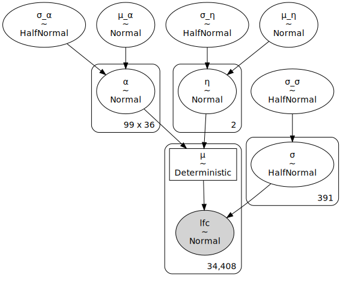
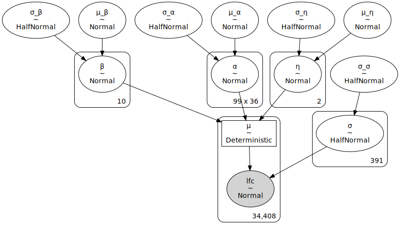
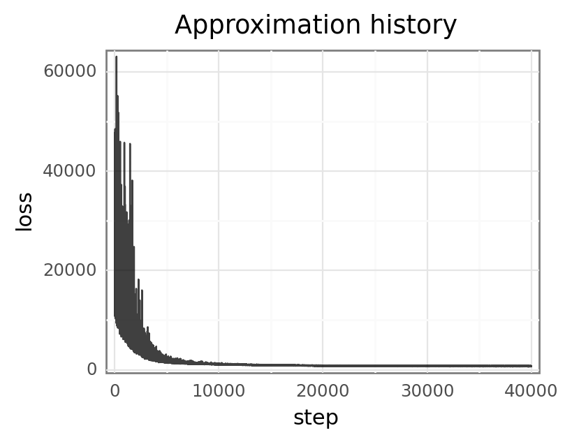
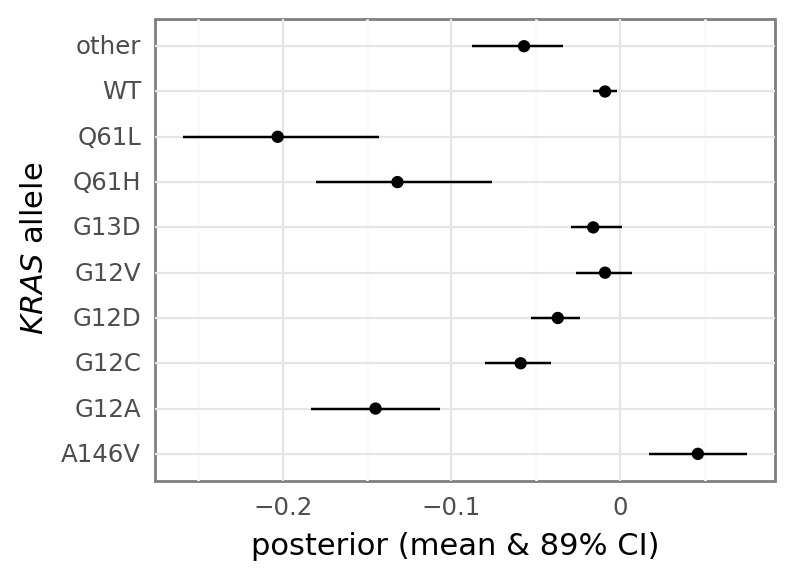

# Compare SpecletTwo models with and without a *KRAS* allele covariate

```python
%load_ext autoreload
%autoreload 2
```

```python
import re
import string
import warnings
from pathlib import Path
from time import time

import arviz as az
import matplotlib.colors as mcolors
import matplotlib.pyplot as plt
import numpy as np
import pandas as pd
import plotnine as gg
import pymc3 as pm
import seaborn as sns
from theano import tensor as tt
```

```python
from src.data_processing import achilles as achelp
from src.data_processing import common as dphelp
from src.globals import PYMC3
from src.io.cache_io import default_cache_dir
from src.modeling import pymc3_analysis as pmanal
from src.modeling import pymc3_sampling_api as pmapi
from src.models.speclet_two import SpecletTwo
from src.plot.color_pal import ModelColors, SeabornColor
```

```python
notebook_tic = time()

warnings.simplefilter(action="ignore", category=UserWarning)

gg.theme_set(
    gg.theme_bw()
    + gg.theme(
        figure_size=(4, 4),
        axis_ticks_major=gg.element_blank(),
        strip_background=gg.element_blank(),
    )
)
%config InlineBackend.figure_format = "retina"

RANDOM_SEED = 248
np.random.seed(RANDOM_SEED)
```

## Load models

**Note:** I have changed the structure for caching in the pipeline, so if the following does not work, check that underlying structure and compare to that used here.

```python
sp2 = SpecletTwo(
    "SpecletTwo-debug",
    root_cache_dir=default_cache_dir() / "SpecletTwo-debug",
    debug=True,
    kras_cov=False,
)
sp2_kras = SpecletTwo(
    "SpecletTwo-kras-debug",
    root_cache_dir=default_cache_dir() / "SpecletTwo-kras-debug",
    debug=True,
    kras_cov=True,
)
```

```python
for s in [sp2, sp2_kras]:
    if s.cache_manager.advi_cache_exists():
        s.build_model()
        s.advi_sample_model()
```

    [04/29/21 14:56:16] INFO     Calling                        speclet_model.py:155
                                 `model_specification()`
                                 method.
                        INFO     Beginning PyMC3 model             speclet_two.py:75
                                 specification.
    [04/29/21 14:56:17] WARNING  Dropping data points of  model_data_managers.py:125
                                 sgRNA that map to
                                 multiple genes.
                        WARNING  Dropping data points     model_data_managers.py:131
                                 with missing copy
                                 number.
                        INFO     Getting Theano shared variables.  speclet_two.py:82
                        INFO     Creating PyMC3 model.             speclet_two.py:90


    /home/jc604/.conda/envs/speclet/lib/python3.9/site-packages/pymc3/data.py:316: FutureWarning: Using a non-tuple sequence for multidimensional indexing is deprecated; use `arr[tuple(seq)]` instead of `arr[seq]`. In the future this will be interpreted as an array index, `arr[np.array(seq)]`, which will result either in an error or a different result.


    [04/29/21 14:56:58] INFO     Returning results from cache.  speclet_model.py:377


    /home/jc604/.conda/envs/speclet/lib/python3.9/site-packages/pymc3/data.py:316: FutureWarning: Using a non-tuple sequence for multidimensional indexing is deprecated; use `arr[tuple(seq)]` instead of `arr[seq]`. In the future this will be interpreted as an array index, `arr[np.array(seq)]`, which will result either in an error or a different result.


    [04/29/21 14:57:05] INFO     Calling                        speclet_model.py:155
                                 `model_specification()`
                                 method.
                        INFO     Beginning PyMC3 model             speclet_two.py:75
                                 specification.
                        INFO     Getting Theano shared variables.  speclet_two.py:82
                        INFO     Creating PyMC3 model.             speclet_two.py:90
    [04/29/21 14:57:06] INFO     Returning results from cache.  speclet_model.py:377


    /home/jc604/.conda/envs/speclet/lib/python3.9/site-packages/pymc3/data.py:316: FutureWarning: Using a non-tuple sequence for multidimensional indexing is deprecated; use `arr[tuple(seq)]` instead of `arr[seq]`. In the future this will be interpreted as an array index, `arr[np.array(seq)]`, which will result either in an error or a different result.

```python
pm.model_to_graphviz(sp2.model)
```



```python
pm.model_to_graphviz(sp2_kras.model)
```



```python
az_sp2 = pmapi.convert_samples_to_arviz(sp2.model, sp2.advi_results)
az_sp2_kras = pmapi.convert_samples_to_arviz(sp2_kras.model, sp2_kras.advi_results)
```

## ADVI diagnositics

Can probably re-run with the max number of iterations at 30,000.

```python
for sp in [sp2, sp2_kras]:
    p = pmanal.plot_vi_hist(sp.advi_results.approximation) + gg.theme(
        figure_size=(4, 3)
    )
    print(p)
```




## Compare models

### Parameter estimates

```python
(
    sp2_kras.data_manager.get_data()[["kras_mutation", "depmap_id"]]
    .drop_duplicates()
    .groupby("kras_mutation")
    .count()
    .sort_values("depmap_id")
)
```

<div>
<style scoped>
    .dataframe tbody tr th:only-of-type {
        vertical-align: middle;
    }

    .dataframe tbody tr th {
        vertical-align: top;
    }

    .dataframe thead th {
        text-align: right;
    }
</style>
<table border="1" class="dataframe">
  <thead>
    <tr style="text-align: right;">
      <th></th>
      <th>depmap_id</th>
    </tr>
    <tr>
      <th>kras_mutation</th>
      <th></th>
    </tr>
  </thead>
  <tbody>
    <tr>
      <th>Q61H</th>
      <td>1</td>
    </tr>
    <tr>
      <th>other</th>
      <td>1</td>
    </tr>
    <tr>
      <th>Q61L</th>
      <td>1</td>
    </tr>
    <tr>
      <th>A146V</th>
      <td>1</td>
    </tr>
    <tr>
      <th>G12A</th>
      <td>1</td>
    </tr>
    <tr>
      <th>G12C</th>
      <td>2</td>
    </tr>
    <tr>
      <th>G13D</th>
      <td>3</td>
    </tr>
    <tr>
      <th>G12V</th>
      <td>3</td>
    </tr>
    <tr>
      <th>G12D</th>
      <td>5</td>
    </tr>
    <tr>
      <th>WT</th>
      <td>18</td>
    </tr>
  </tbody>
</table>
</div>

```python
kras_posterior = az.summary(
    az_sp2_kras, var_names="β", hdi_prob=PYMC3.HDI_PROB, kind="stats"
)
kras_posterior[
    "kras_mutation"
] = sp2_kras.data_manager.get_data().kras_mutation.cat.categories
kras_posterior
```

<div>
<style scoped>
    .dataframe tbody tr th:only-of-type {
        vertical-align: middle;
    }

    .dataframe tbody tr th {
        vertical-align: top;
    }

    .dataframe thead th {
        text-align: right;
    }
</style>
<table border="1" class="dataframe">
  <thead>
    <tr style="text-align: right;">
      <th></th>
      <th>mean</th>
      <th>sd</th>
      <th>hdi_5.5%</th>
      <th>hdi_94.5%</th>
      <th>kras_mutation</th>
    </tr>
  </thead>
  <tbody>
    <tr>
      <th>β[0]</th>
      <td>-0.037</td>
      <td>0.009</td>
      <td>-0.053</td>
      <td>-0.024</td>
      <td>G12D</td>
    </tr>
    <tr>
      <th>β[1]</th>
      <td>-0.009</td>
      <td>0.004</td>
      <td>-0.016</td>
      <td>-0.002</td>
      <td>WT</td>
    </tr>
    <tr>
      <th>β[2]</th>
      <td>-0.132</td>
      <td>0.033</td>
      <td>-0.180</td>
      <td>-0.076</td>
      <td>Q61H</td>
    </tr>
    <tr>
      <th>β[3]</th>
      <td>-0.016</td>
      <td>0.010</td>
      <td>-0.029</td>
      <td>0.001</td>
      <td>G13D</td>
    </tr>
    <tr>
      <th>β[4]</th>
      <td>-0.059</td>
      <td>0.012</td>
      <td>-0.080</td>
      <td>-0.041</td>
      <td>G12C</td>
    </tr>
    <tr>
      <th>β[5]</th>
      <td>-0.009</td>
      <td>0.011</td>
      <td>-0.026</td>
      <td>0.007</td>
      <td>G12V</td>
    </tr>
    <tr>
      <th>β[6]</th>
      <td>-0.057</td>
      <td>0.017</td>
      <td>-0.088</td>
      <td>-0.034</td>
      <td>other</td>
    </tr>
    <tr>
      <th>β[7]</th>
      <td>-0.203</td>
      <td>0.037</td>
      <td>-0.259</td>
      <td>-0.143</td>
      <td>Q61L</td>
    </tr>
    <tr>
      <th>β[8]</th>
      <td>0.046</td>
      <td>0.018</td>
      <td>0.017</td>
      <td>0.075</td>
      <td>A146V</td>
    </tr>
    <tr>
      <th>β[9]</th>
      <td>-0.145</td>
      <td>0.024</td>
      <td>-0.183</td>
      <td>-0.107</td>
      <td>G12A</td>
    </tr>
  </tbody>
</table>
</div>

```python
(
    gg.ggplot(kras_posterior, gg.aes(x="kras_mutation", y="mean"))
    + gg.geom_linerange(gg.aes(ymin="hdi_5.5%", ymax="hdi_94.5%"))
    + gg.geom_point()
    + gg.coord_flip()
    + gg.theme(figure_size=(4, 3))
    + gg.labs(x="$KRAS$ allele", y="posterior (mean & 89% CI)")
)
```



    <ggplot: (8729825443069)>

```python

```

```python

```

```python

```

```python

```

### Prediction accuracy

```python

```

```python

```

```python

```

```python

```

### Model fit

```python

```

```python

```

```python

```

```python

```

```python

```

---

```python
notebook_toc = time()
print(f"execution time: {(notebook_toc - notebook_tic) / 60:.2f} minutes")
```

    execution time: 0.00 minutes

```python
%load_ext watermark
%watermark -d -u -v -iv -b -h -m
```

    Last updated: 2021-04-29

    Python implementation: CPython
    Python version       : 3.9.2
    IPython version      : 7.22.0

    Compiler    : GCC 9.3.0
    OS          : Linux
    Release     : 3.10.0-1062.el7.x86_64
    Machine     : x86_64
    Processor   : x86_64
    CPU cores   : 28
    Architecture: 64bit

    Hostname: compute-e-16-231.o2.rc.hms.harvard.edu

    Git branch: optional-kras-cov

    plotnine  : 0.8.0
    numpy     : 1.20.2
    theano    : 1.0.5
    pandas    : 1.2.3
    pymc3     : 3.11.2
    re        : 2.2.1
    matplotlib: 3.4.1
    seaborn   : 0.11.1
    arviz     : 0.11.2
