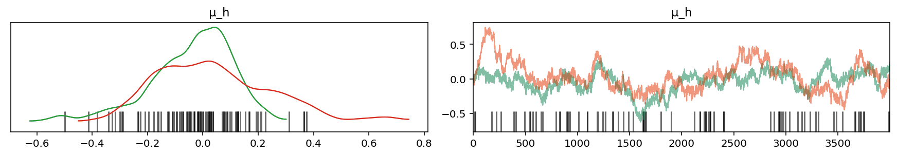
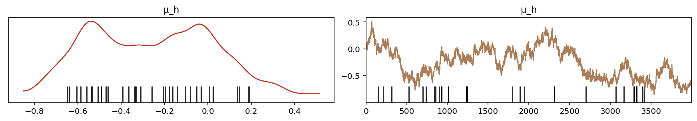
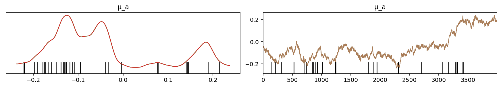
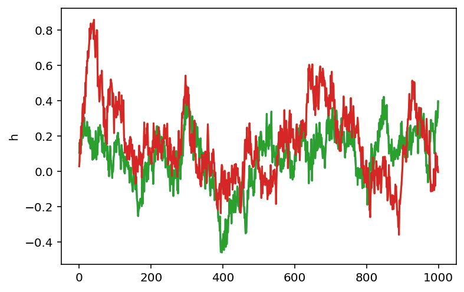
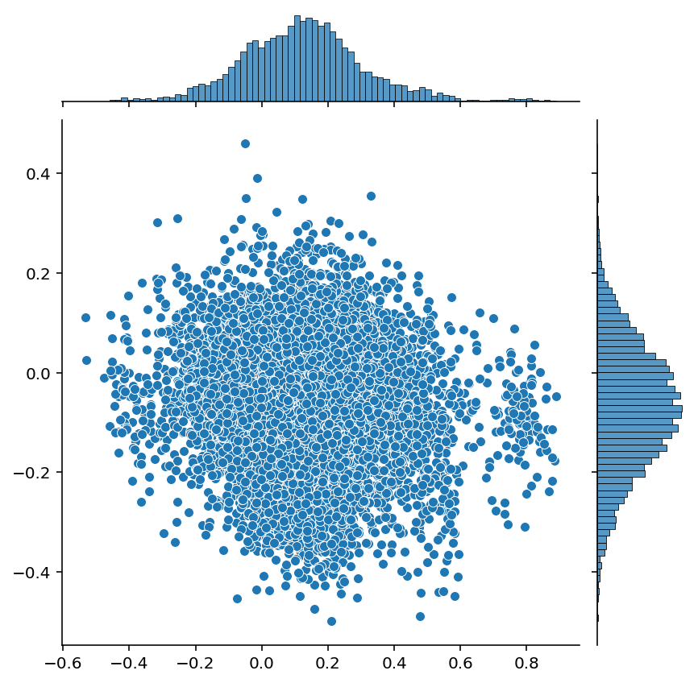

# Analysis of SpecletThree

This notebook analyzes the MCMC and ADVI fit of the SpecletThree model.
Below are some questions to address and aspects of the model to dig into:

1. Compare the parameter values between ADVI and MCMC.
2. Are there correlations between the parameter values?
3. Analyze the posterior predictions LOO values.
4. How do the model fits compare between the models with and without a covariate for *KRAS*?
5. Which genes change the most by the addition of the *KRAS* covariate?
6. How do the parameter values in this model compare to those from DepMap?

```python
%load_ext autoreload
%autoreload 2
```

```python
import re
import string
import warnings
from pathlib import Path
from time import time

import arviz as az
import matplotlib.colors as mcolors
import matplotlib.pyplot as plt
import numpy as np
import pandas as pd
import plotnine as gg
import pymc3 as pm
import seaborn as sns
from theano import tensor as tt
```

```python
from src.data_processing import achilles as achelp
from src.data_processing import common as dphelp
from src.io import cache_io
from src.loggers import logger
from src.modeling import pymc3_analysis as pmanal
from src.modeling import pymc3_sampling_api as pmapi
from src.models.speclet_three import SpecletThree
from src.plot.color_pal import FitMethodColors, ModelColors, SeabornColor
```

```python
notebook_tic = time()

warnings.simplefilter(action="ignore", category=UserWarning)

gg.theme_set(
    gg.theme_bw()
    + gg.theme(
        figure_size=(4, 4),
        axis_ticks_major=gg.element_blank(),
        strip_background=gg.element_blank(),
    )
)
%config InlineBackend.figure_format = "retina"

RANDOM_SEED = 127
np.random.seed(RANDOM_SEED)

HDI_PROB = 0.89

eb = gg.element_blank()
```

```python
model_name = "SpecletThree-debug"
sp3 = SpecletThree(
    model_name,
    root_cache_dir=cache_io.default_cache_dir(),
    debug=True,
    kras_cov=False,
)

sp3.build_model()
if sp3.cache_manager.mcmc_cache_exists():
    _ = sp3.mcmc_sample_model()
else:
    logger.error("Could not find model.")
```

<pre style="white-space:pre;overflow-x:auto;line-height:normal;font-family:Menlo,'DejaVu Sans Mono',consolas,'Courier New',monospace"><span style="color: #7fbfbf; text-decoration-color: #7fbfbf">[05/25/21 14:30:22] </span><span style="color: #000080; text-decoration-color: #000080">INFO    </span> Calling `model_specification<span style="font-weight: bold">()</span>` method.     <a href="file:///n/data2/dfci/cancerbio/haigis/Cook/speclet/src/models/speclet_model.py"><span style="color: #7f7f7f; text-decoration-color: #7f7f7f">speclet_model.py</span></a><span style="color: #7f7f7f; text-decoration-color: #7f7f7f">:167</span>
</pre>

<pre style="white-space:pre;overflow-x:auto;line-height:normal;font-family:Menlo,'DejaVu Sans Mono',consolas,'Courier New',monospace"><span style="color: #7fbfbf; text-decoration-color: #7fbfbf">                    </span><span style="color: #000080; text-decoration-color: #000080">INFO    </span> Beginning PyMC3 model specification.        <a href="file:///n/data2/dfci/cancerbio/haigis/Cook/speclet/src/models/speclet_three.py"><span style="color: #7f7f7f; text-decoration-color: #7f7f7f">speclet_three.py</span></a><span style="color: #7f7f7f; text-decoration-color: #7f7f7f">:112</span>
</pre>

<pre style="white-space:pre;overflow-x:auto;line-height:normal;font-family:Menlo,'DejaVu Sans Mono',consolas,'Courier New',monospace"><span style="color: #7fbfbf; text-decoration-color: #7fbfbf">[05/25/21 14:30:23] </span><span style="color: #800000; text-decoration-color: #800000">WARNING </span> Dropping data points of sgRNA that    <a href="file:///n/data2/dfci/cancerbio/haigis/Cook/speclet/src/managers/model_data_managers.py"><span style="color: #7f7f7f; text-decoration-color: #7f7f7f">model_data_managers.py</span></a><span style="color: #7f7f7f; text-decoration-color: #7f7f7f">:125</span>
                             map to multiple genes.
</pre>

<pre style="white-space:pre;overflow-x:auto;line-height:normal;font-family:Menlo,'DejaVu Sans Mono',consolas,'Courier New',monospace"><span style="color: #7fbfbf; text-decoration-color: #7fbfbf">                    </span><span style="color: #800000; text-decoration-color: #800000">WARNING </span> Dropping data points with missing     <a href="file:///n/data2/dfci/cancerbio/haigis/Cook/speclet/src/managers/model_data_managers.py"><span style="color: #7f7f7f; text-decoration-color: #7f7f7f">model_data_managers.py</span></a><span style="color: #7f7f7f; text-decoration-color: #7f7f7f">:131</span>
                             copy number.
</pre>

<pre style="white-space:pre;overflow-x:auto;line-height:normal;font-family:Menlo,'DejaVu Sans Mono',consolas,'Courier New',monospace"><span style="color: #7fbfbf; text-decoration-color: #7fbfbf">                    </span><span style="color: #000080; text-decoration-color: #000080">INFO    </span> Getting Theano shared variables.            <a href="file:///n/data2/dfci/cancerbio/haigis/Cook/speclet/src/models/speclet_three.py"><span style="color: #7f7f7f; text-decoration-color: #7f7f7f">speclet_three.py</span></a><span style="color: #7f7f7f; text-decoration-color: #7f7f7f">:119</span>
</pre>

<pre style="white-space:pre;overflow-x:auto;line-height:normal;font-family:Menlo,'DejaVu Sans Mono',consolas,'Courier New',monospace"><span style="color: #7fbfbf; text-decoration-color: #7fbfbf">                    </span><span style="color: #000080; text-decoration-color: #000080">INFO    </span> Creating PyMC3 model.                       <a href="file:///n/data2/dfci/cancerbio/haigis/Cook/speclet/src/models/speclet_three.py"><span style="color: #7f7f7f; text-decoration-color: #7f7f7f">speclet_three.py</span></a><span style="color: #7f7f7f; text-decoration-color: #7f7f7f">:127</span>
</pre>

<pre style="white-space:pre;overflow-x:auto;line-height:normal;font-family:Menlo,'DejaVu Sans Mono',consolas,'Courier New',monospace"><span style="color: #7fbfbf; text-decoration-color: #7fbfbf">[05/25/21 14:30:42] </span><span style="color: #000080; text-decoration-color: #000080">INFO    </span> ArvizCacheManager: MCMC cache exists.      <a href="file:///n/data2/dfci/cancerbio/haigis/Cook/speclet/src/managers/cache_managers.py"><span style="color: #7f7f7f; text-decoration-color: #7f7f7f">cache_managers.py</span></a><span style="color: #7f7f7f; text-decoration-color: #7f7f7f">:273</span>
</pre>

<pre style="white-space:pre;overflow-x:auto;line-height:normal;font-family:Menlo,'DejaVu Sans Mono',consolas,'Courier New',monospace"><span style="color: #7fbfbf; text-decoration-color: #7fbfbf">                    </span><span style="color: #000080; text-decoration-color: #000080">INFO    </span> ArvizCacheManager: MCMC cache exists.      <a href="file:///n/data2/dfci/cancerbio/haigis/Cook/speclet/src/managers/cache_managers.py"><span style="color: #7f7f7f; text-decoration-color: #7f7f7f">cache_managers.py</span></a><span style="color: #7f7f7f; text-decoration-color: #7f7f7f">:273</span>
</pre>

<pre style="white-space:pre;overflow-x:auto;line-height:normal;font-family:Menlo,'DejaVu Sans Mono',consolas,'Courier New',monospace"><span style="color: #7fbfbf; text-decoration-color: #7fbfbf">                    </span><span style="color: #000080; text-decoration-color: #000080">INFO    </span> Returning results from cache.               <a href="file:///n/data2/dfci/cancerbio/haigis/Cook/speclet/src/models/speclet_model.py"><span style="color: #7f7f7f; text-decoration-color: #7f7f7f">speclet_model.py</span></a><span style="color: #7f7f7f; text-decoration-color: #7f7f7f">:264</span>
</pre>

<pre style="white-space:pre;overflow-x:auto;line-height:normal;font-family:Menlo,'DejaVu Sans Mono',consolas,'Courier New',monospace"><span style="color: #7fbfbf; text-decoration-color: #7fbfbf">                    </span><span style="color: #000080; text-decoration-color: #000080">INFO    </span> ArvizCacheManager: MCMC cache exists.      <a href="file:///n/data2/dfci/cancerbio/haigis/Cook/speclet/src/managers/cache_managers.py"><span style="color: #7f7f7f; text-decoration-color: #7f7f7f">cache_managers.py</span></a><span style="color: #7f7f7f; text-decoration-color: #7f7f7f">:273</span>
</pre>

```python
model_name_kras = "SpecletThree-kras-debug"
sp3_kras = SpecletThree(
    model_name_kras,
    root_cache_dir=cache_io.default_cache_dir(),
    debug=True,
    kras_cov=True,
)

sp3_kras.build_model()
if sp3_kras.cache_manager.mcmc_cache_exists():
    _ = sp3_kras.mcmc_sample_model()
else:
    logger.error("Could not find model.")
```

<pre style="white-space:pre;overflow-x:auto;line-height:normal;font-family:Menlo,'DejaVu Sans Mono',consolas,'Courier New',monospace"><span style="color: #7fbfbf; text-decoration-color: #7fbfbf">[05/25/21 14:30:54] </span><span style="color: #000080; text-decoration-color: #000080">INFO    </span> Calling `model_specification<span style="font-weight: bold">()</span>` method.     <a href="file:///n/data2/dfci/cancerbio/haigis/Cook/speclet/src/models/speclet_model.py"><span style="color: #7f7f7f; text-decoration-color: #7f7f7f">speclet_model.py</span></a><span style="color: #7f7f7f; text-decoration-color: #7f7f7f">:167</span>
</pre>

<pre style="white-space:pre;overflow-x:auto;line-height:normal;font-family:Menlo,'DejaVu Sans Mono',consolas,'Courier New',monospace"><span style="color: #7fbfbf; text-decoration-color: #7fbfbf">                    </span><span style="color: #000080; text-decoration-color: #000080">INFO    </span> Beginning PyMC3 model specification.        <a href="file:///n/data2/dfci/cancerbio/haigis/Cook/speclet/src/models/speclet_three.py"><span style="color: #7f7f7f; text-decoration-color: #7f7f7f">speclet_three.py</span></a><span style="color: #7f7f7f; text-decoration-color: #7f7f7f">:112</span>
</pre>

<pre style="white-space:pre;overflow-x:auto;line-height:normal;font-family:Menlo,'DejaVu Sans Mono',consolas,'Courier New',monospace"><span style="color: #7fbfbf; text-decoration-color: #7fbfbf">                    </span><span style="color: #000080; text-decoration-color: #000080">INFO    </span> Getting Theano shared variables.            <a href="file:///n/data2/dfci/cancerbio/haigis/Cook/speclet/src/models/speclet_three.py"><span style="color: #7f7f7f; text-decoration-color: #7f7f7f">speclet_three.py</span></a><span style="color: #7f7f7f; text-decoration-color: #7f7f7f">:119</span>
</pre>

<pre style="white-space:pre;overflow-x:auto;line-height:normal;font-family:Menlo,'DejaVu Sans Mono',consolas,'Courier New',monospace"><span style="color: #7fbfbf; text-decoration-color: #7fbfbf">                    </span><span style="color: #000080; text-decoration-color: #000080">INFO    </span> Creating PyMC3 model.                       <a href="file:///n/data2/dfci/cancerbio/haigis/Cook/speclet/src/models/speclet_three.py"><span style="color: #7f7f7f; text-decoration-color: #7f7f7f">speclet_three.py</span></a><span style="color: #7f7f7f; text-decoration-color: #7f7f7f">:127</span>
</pre>

<pre style="white-space:pre;overflow-x:auto;line-height:normal;font-family:Menlo,'DejaVu Sans Mono',consolas,'Courier New',monospace"><span style="color: #7fbfbf; text-decoration-color: #7fbfbf">[05/25/21 14:30:56] </span><span style="color: #000080; text-decoration-color: #000080">INFO    </span> ArvizCacheManager: MCMC cache exists.      <a href="file:///n/data2/dfci/cancerbio/haigis/Cook/speclet/src/managers/cache_managers.py"><span style="color: #7f7f7f; text-decoration-color: #7f7f7f">cache_managers.py</span></a><span style="color: #7f7f7f; text-decoration-color: #7f7f7f">:273</span>
</pre>

<pre style="white-space:pre;overflow-x:auto;line-height:normal;font-family:Menlo,'DejaVu Sans Mono',consolas,'Courier New',monospace"><span style="color: #7fbfbf; text-decoration-color: #7fbfbf">                    </span><span style="color: #000080; text-decoration-color: #000080">INFO    </span> ArvizCacheManager: MCMC cache exists.      <a href="file:///n/data2/dfci/cancerbio/haigis/Cook/speclet/src/managers/cache_managers.py"><span style="color: #7f7f7f; text-decoration-color: #7f7f7f">cache_managers.py</span></a><span style="color: #7f7f7f; text-decoration-color: #7f7f7f">:273</span>
</pre>

<pre style="white-space:pre;overflow-x:auto;line-height:normal;font-family:Menlo,'DejaVu Sans Mono',consolas,'Courier New',monospace"><span style="color: #7fbfbf; text-decoration-color: #7fbfbf">                    </span><span style="color: #000080; text-decoration-color: #000080">INFO    </span> Returning results from cache.               <a href="file:///n/data2/dfci/cancerbio/haigis/Cook/speclet/src/models/speclet_model.py"><span style="color: #7f7f7f; text-decoration-color: #7f7f7f">speclet_model.py</span></a><span style="color: #7f7f7f; text-decoration-color: #7f7f7f">:264</span>
</pre>

<pre style="white-space:pre;overflow-x:auto;line-height:normal;font-family:Menlo,'DejaVu Sans Mono',consolas,'Courier New',monospace"><span style="color: #7fbfbf; text-decoration-color: #7fbfbf">                    </span><span style="color: #000080; text-decoration-color: #000080">INFO    </span> ArvizCacheManager: MCMC cache exists.      <a href="file:///n/data2/dfci/cancerbio/haigis/Cook/speclet/src/managers/cache_managers.py"><span style="color: #7f7f7f; text-decoration-color: #7f7f7f">cache_managers.py</span></a><span style="color: #7f7f7f; text-decoration-color: #7f7f7f">:273</span>
</pre>

```python
sp3.model
```

$$
                \begin{array}{rcl}
                \text{μ_h} &\sim & \text{Normal}\\\text{σ_h_log__} &\sim & \text{TransformedDistribution}\\\text{h} &\sim & \text{Normal}\\\text{μ_g} &\sim & \text{Normal}\\\text{σ_g_log__} &\sim & \text{TransformedDistribution}\\\text{g} &\sim & \text{Normal}\\\text{μ_b} &\sim & \text{Normal}\\\text{σ_b_log__} &\sim & \text{TransformedDistribution}\\\text{b} &\sim & \text{Normal}\\\text{σ_σ_log__} &\sim & \text{TransformedDistribution}\\\text{σ_log__} &\sim & \text{TransformedDistribution}\\\text{σ_h} &\sim & \text{HalfNormal}\\\text{σ_g} &\sim & \text{HalfNormal}\\\text{σ_b} &\sim & \text{HalfNormal}\\\text{μ} &\sim & \text{Deterministic}\\\text{σ_σ} &\sim & \text{HalfNormal}\\\text{σ} &\sim & \text{HalfNormal}\\\text{lfc} &\sim & \text{Normal}
                \end{array}
                $$

```python
sp3_kras.model
```

$$
                \begin{array}{rcl}
                \text{μ_h} &\sim & \text{Normal}\\\text{σ_h_log__} &\sim & \text{TransformedDistribution}\\\text{h} &\sim & \text{Normal}\\\text{μ_g} &\sim & \text{Normal}\\\text{σ_g_log__} &\sim & \text{TransformedDistribution}\\\text{g} &\sim & \text{Normal}\\\text{μ_b} &\sim & \text{Normal}\\\text{σ_b_log__} &\sim & \text{TransformedDistribution}\\\text{b} &\sim & \text{Normal}\\\text{μ_a} &\sim & \text{Normal}\\\text{σ_a_log__} &\sim & \text{TransformedDistribution}\\\text{a} &\sim & \text{Normal}\\\text{σ_σ_log__} &\sim & \text{TransformedDistribution}\\\text{σ_log__} &\sim & \text{TransformedDistribution}\\\text{σ_h} &\sim & \text{HalfNormal}\\\text{σ_g} &\sim & \text{HalfNormal}\\\text{σ_b} &\sim & \text{HalfNormal}\\\text{σ_a} &\sim & \text{HalfNormal}\\\text{μ} &\sim & \text{Deterministic}\\\text{σ_σ} &\sim & \text{HalfNormal}\\\text{σ} &\sim & \text{HalfNormal}\\\text{lfc} &\sim & \text{Normal}
                \end{array}
                $$

## Fitting diagnositcs

```python
for sp3_model in [sp3, sp3_kras]:
    az.plot_trace(sp3_model.mcmc_results, var_names="μ_h", compact=False);
```





```python
az.plot_trace(sp3_kras.mcmc_results, var_names="μ_a", compact=False);
```



```python
y = sp3.mcmc_results.posterior["h"][:, np.arange(0, 4000, 4), 20]
x = np.arange(y.shape[1])
ax = sns.lineplot(x=x, y=y[0, :])
sns.lineplot(x=x, y=y[1, :], ax=ax)
sns.lineplot(x=x, y=y[2, :], ax=ax)
sns.lineplot(x=x, y=y[3, :], ax=ax)
plt.show()
```



```python
x = sp3.mcmc_results.posterior["h"][:, :, 20].values.flatten()
# y = sp3_kras.mcmc_results.posterior["σ_h"].values.flatten()
y = sp3.mcmc_results.posterior["g"][:, :, 20, 10].values.flatten()
sns.jointplot(x=x, y=y);
```



```python
sp3_kras.mcmc_results.posterior["h"].shape
```

    (4, 4000, 99)

```python

```

```python

```

---

```python
notebook_toc = time()
print(f"execution time: {(notebook_toc - notebook_tic) / 60:.2f} minutes")
```

```python
%load_ext watermark
%watermark -d -u -v -iv -b -h -m
```
