# Analysis of SpecletThree

This notebook analyzes the MCMC and ADVI fit of the SpecletThree model.
Below are some questions to address and aspects of the model to dig into:

1. Compare the parameter values between ADVI and MCMC.
2. Are there correlations between the parameter values?
3. Analyze the posterior predictions LOO values.
4. How do the model fits compare between the models with and without a covariate for *KRAS*?
5. Which genes change the most by the addition of the *KRAS* covariate?
6. How do the parameter values in this model compare to those from DepMap?

Currently, I am waiting for the model with the *KRAS* covariate to fit, so that is not included at the moment.

## Setup

```python
%load_ext autoreload
%autoreload 2
```

```python
import re
import string
import warnings
from pathlib import Path
from time import time

import arviz as az
import matplotlib.colors as mcolors
import matplotlib.pyplot as plt
import numpy as np
import pandas as pd
import plotnine as gg
import pymc3 as pm
import seaborn as sns
from theano import tensor as tt
```

```python
from src.data_processing import achilles as achelp
from src.data_processing import common as dphelp
from src.io import cache_io, data_io
from src.loggers import logger
from src.modeling import pymc3_analysis as pmanal
from src.modeling import pymc3_sampling_api as pmapi
from src.models.speclet_three import SpecletThree
from src.plot.color_pal import FitMethodColors, ModelColors, SeabornColor, make_pal
```

```python
notebook_tic = time()

warnings.simplefilter(action="ignore", category=UserWarning)

gg.theme_set(
    gg.theme_bw()
    + gg.theme(
        figure_size=(4, 4),
        axis_ticks_major=gg.element_blank(),
        strip_background=gg.element_blank(),
    )
)
%config InlineBackend.figure_format = "retina"

RANDOM_SEED = 127
np.random.seed(RANDOM_SEED)

HDI_PROB = 0.89

eb = gg.element_blank()
```

## Build models and load MCMC results

```python
model_name = "SpecletThree-debug"
sp3 = SpecletThree(
    model_name,
    root_cache_dir=cache_io.default_cache_dir(),
    debug=True,
    kras_cov=False,
)

sp3.build_model()
if sp3.cache_manager.mcmc_cache_exists():
    _ = sp3.mcmc_sample_model()
else:
    logger.error("Could not find model.")
```

<pre style="white-space:pre;overflow-x:auto;line-height:normal;font-family:Menlo,'DejaVu Sans Mono',consolas,'Courier New',monospace"><span style="color: #7fbfbf; text-decoration-color: #7fbfbf">[05/27/21 11:59:43] </span><span style="color: #000080; text-decoration-color: #000080">INFO    </span> Calling `model_specification<span style="font-weight: bold">()</span>` method.     <a href="file:///n/data1/hms/dbmi/park/Cook/speclet/src/models/speclet_model.py"><span style="color: #7f7f7f; text-decoration-color: #7f7f7f">speclet_model.py</span></a><span style="color: #7f7f7f; text-decoration-color: #7f7f7f">:171</span>
</pre>

<pre style="white-space:pre;overflow-x:auto;line-height:normal;font-family:Menlo,'DejaVu Sans Mono',consolas,'Courier New',monospace"><span style="color: #7fbfbf; text-decoration-color: #7fbfbf">                    </span><span style="color: #000080; text-decoration-color: #000080">INFO    </span> Beginning PyMC3 model specification.        <a href="file:///n/data1/hms/dbmi/park/Cook/speclet/src/models/speclet_three.py"><span style="color: #7f7f7f; text-decoration-color: #7f7f7f">speclet_three.py</span></a><span style="color: #7f7f7f; text-decoration-color: #7f7f7f">:261</span>
</pre>

<pre style="white-space:pre;overflow-x:auto;line-height:normal;font-family:Menlo,'DejaVu Sans Mono',consolas,'Courier New',monospace"><span style="color: #7fbfbf; text-decoration-color: #7fbfbf">                    </span><span style="color: #800000; text-decoration-color: #800000">WARNING </span> Dropping data points of sgRNA that    <a href="file:///n/data1/hms/dbmi/park/Cook/speclet/src/managers/model_data_managers.py"><span style="color: #7f7f7f; text-decoration-color: #7f7f7f">model_data_managers.py</span></a><span style="color: #7f7f7f; text-decoration-color: #7f7f7f">:125</span>
                             map to multiple genes.
</pre>

<pre style="white-space:pre;overflow-x:auto;line-height:normal;font-family:Menlo,'DejaVu Sans Mono',consolas,'Courier New',monospace"><span style="color: #7fbfbf; text-decoration-color: #7fbfbf">                    </span><span style="color: #800000; text-decoration-color: #800000">WARNING </span> Dropping data points with missing     <a href="file:///n/data1/hms/dbmi/park/Cook/speclet/src/managers/model_data_managers.py"><span style="color: #7f7f7f; text-decoration-color: #7f7f7f">model_data_managers.py</span></a><span style="color: #7f7f7f; text-decoration-color: #7f7f7f">:131</span>
                             copy number.
</pre>

<pre style="white-space:pre;overflow-x:auto;line-height:normal;font-family:Menlo,'DejaVu Sans Mono',consolas,'Courier New',monospace"><span style="color: #7fbfbf; text-decoration-color: #7fbfbf">                    </span><span style="color: #000080; text-decoration-color: #000080">INFO    </span> Getting Theano shared variables.            <a href="file:///n/data1/hms/dbmi/park/Cook/speclet/src/models/speclet_three.py"><span style="color: #7f7f7f; text-decoration-color: #7f7f7f">speclet_three.py</span></a><span style="color: #7f7f7f; text-decoration-color: #7f7f7f">:268</span>
</pre>

<pre style="white-space:pre;overflow-x:auto;line-height:normal;font-family:Menlo,'DejaVu Sans Mono',consolas,'Courier New',monospace"><span style="color: #7fbfbf; text-decoration-color: #7fbfbf">                    </span><span style="color: #000080; text-decoration-color: #000080">INFO    </span> Creating PyMC3 model <span style="font-weight: bold">(</span>non-centered          <a href="file:///n/data1/hms/dbmi/park/Cook/speclet/src/models/speclet_three.py"><span style="color: #7f7f7f; text-decoration-color: #7f7f7f">speclet_three.py</span></a><span style="color: #7f7f7f; text-decoration-color: #7f7f7f">:277</span>
                             parameterization<span style="font-weight: bold">)</span>.
</pre>

<pre style="white-space:pre;overflow-x:auto;line-height:normal;font-family:Menlo,'DejaVu Sans Mono',consolas,'Courier New',monospace"><span style="color: #7fbfbf; text-decoration-color: #7fbfbf">[05/27/21 11:59:58] </span><span style="color: #000080; text-decoration-color: #000080">INFO    </span> ArvizCacheManager: MCMC cache exists.      <a href="file:///n/data1/hms/dbmi/park/Cook/speclet/src/managers/cache_managers.py"><span style="color: #7f7f7f; text-decoration-color: #7f7f7f">cache_managers.py</span></a><span style="color: #7f7f7f; text-decoration-color: #7f7f7f">:273</span>
</pre>

<pre style="white-space:pre;overflow-x:auto;line-height:normal;font-family:Menlo,'DejaVu Sans Mono',consolas,'Courier New',monospace"><span style="color: #7fbfbf; text-decoration-color: #7fbfbf">                    </span><span style="color: #000080; text-decoration-color: #000080">INFO    </span> ArvizCacheManager: MCMC cache exists.      <a href="file:///n/data1/hms/dbmi/park/Cook/speclet/src/managers/cache_managers.py"><span style="color: #7f7f7f; text-decoration-color: #7f7f7f">cache_managers.py</span></a><span style="color: #7f7f7f; text-decoration-color: #7f7f7f">:273</span>
</pre>

<pre style="white-space:pre;overflow-x:auto;line-height:normal;font-family:Menlo,'DejaVu Sans Mono',consolas,'Courier New',monospace"><span style="color: #7fbfbf; text-decoration-color: #7fbfbf">                    </span><span style="color: #000080; text-decoration-color: #000080">INFO    </span> Returning results from cache.               <a href="file:///n/data1/hms/dbmi/park/Cook/speclet/src/models/speclet_model.py"><span style="color: #7f7f7f; text-decoration-color: #7f7f7f">speclet_model.py</span></a><span style="color: #7f7f7f; text-decoration-color: #7f7f7f">:268</span>
</pre>

<pre style="white-space:pre;overflow-x:auto;line-height:normal;font-family:Menlo,'DejaVu Sans Mono',consolas,'Courier New',monospace"><span style="color: #7fbfbf; text-decoration-color: #7fbfbf">                    </span><span style="color: #000080; text-decoration-color: #000080">INFO    </span> ArvizCacheManager: MCMC cache exists.      <a href="file:///n/data1/hms/dbmi/park/Cook/speclet/src/managers/cache_managers.py"><span style="color: #7f7f7f; text-decoration-color: #7f7f7f">cache_managers.py</span></a><span style="color: #7f7f7f; text-decoration-color: #7f7f7f">:273</span>
</pre>

```python
# model_name_kras = "SpecletThree-kras-debug"
# sp3_kras = SpecletThree(
#     model_name_kras,
#     root_cache_dir=cache_io.default_cache_dir(),
#     debug=True,
#     kras_cov=True,
# )

# sp3_kras.build_model()
# if sp3_kras.cache_manager.mcmc_cache_exists():
#     _ = sp3_kras.mcmc_sample_model()
# else:
#     logger.error("Could not find model.")
```

```python
sp3.model
```

$$
                \begin{array}{rcl}
                \text{μ_h} &\sim & \text{Normal}\\\text{σ_h_log__} &\sim & \text{TransformedDistribution}\\\text{μ_g} &\sim & \text{Normal}\\\text{σ_g_log__} &\sim & \text{TransformedDistribution}\\\text{μ_b} &\sim & \text{Normal}\\\text{σ_b_log__} &\sim & \text{TransformedDistribution}\\\text{σ_σ_log__} &\sim & \text{TransformedDistribution}\\\text{σ_log__} &\sim & \text{TransformedDistribution}\\\text{h_offset} &\sim & \text{Normal}\\\text{g_offset} &\sim & \text{Normal}\\\text{b_offset} &\sim & \text{Normal}\\\text{σ_h} &\sim & \text{HalfNormal}\\\text{σ_g} &\sim & \text{HalfNormal}\\\text{σ_b} &\sim & \text{HalfNormal}\\\text{σ_σ} &\sim & \text{HalfNormal}\\\text{σ} &\sim & \text{HalfNormal}\\\text{h} &\sim & \text{Deterministic}\\\text{g} &\sim & \text{Deterministic}\\\text{b} &\sim & \text{Deterministic}\\\text{μ} &\sim & \text{Deterministic}\\\text{lfc} &\sim & \text{Normal}
                \end{array}
                $$

```python
pm.model_to_graphviz(sp3.model)
```

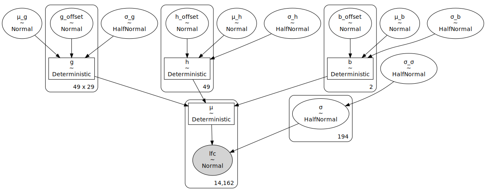

```python
# sp3_kras.model
```

```python
# pm.model_to_graphviz(sp3_kras.model)
```

## Analyzing fit parameters

There are a few divergences, but the posteriors for the global hyperparameters of the consistent gene effect and cell line effect look great.
The only weird thing is there three of the chains look identical.
I think this is caused by something weird with the random seeds, so I will need to investigate further and possibly re-fit the models.

```python
for sp3_model in [sp3]:  # , sp3_kras]:
    az.plot_trace(
        sp3_model.mcmc_results, var_names=["μ_h", "σ_h", "μ_g", "σ_g"], compact=False
    );
```


```python
# az.plot_trace(sp3_kras.mcmc_results, var_names="μ_a", compact=False);
```

There is some good variance in the gene effects.
Most genes are centered at 0, but a few have stronger effects (e.g. *UQCRC1* and *EBAG9*).

```python
genes = sp3.data_manager.get_data().hugo_symbol.cat.categories
ax = az.plot_forest(
    sp3.mcmc_results, var_names="h", combined=False, hdi_prob=0.89, rope=(-0.1, 0.1)
)
ax[0].set_yticklabels(genes)
plt.show()
```

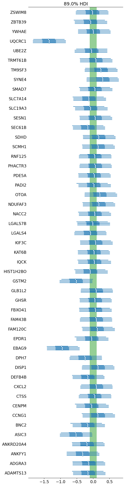

Inspecting the cell line effects per gene, there is some variance where some genes are more variable and some cell lines are more variable.

```python
cell_lines = sp3.data_manager.get_data().depmap_id.cat.categories
genes = sp3.data_manager.get_data().hugo_symbol.cat.categories

cell_line_effects = (
    az.summary(sp3.mcmc_results, var_names="g", kind="stats", hdi_prob=HDI_PROB)
    .reset_index(drop=False)
    .pipe(
        pmanal.extract_matrix_variable_indices,
        col="index",
        idx1=genes,
        idx2=cell_lines,
        idx1name="hugo_symbol",
        idx2name="depmap_id",
    )
)

cell_line_effects.head()
```

<div>
<style scoped>
    .dataframe tbody tr th:only-of-type {
        vertical-align: middle;
    }

    .dataframe tbody tr th {
        vertical-align: top;
    }

    .dataframe thead th {
        text-align: right;
    }
</style>
<table border="1" class="dataframe">
  <thead>
    <tr style="text-align: right;">
      <th></th>
      <th>index</th>
      <th>mean</th>
      <th>sd</th>
      <th>hdi_5.5%</th>
      <th>hdi_94.5%</th>
      <th>hugo_symbol</th>
      <th>depmap_id</th>
    </tr>
  </thead>
  <tbody>
    <tr>
      <th>0</th>
      <td>g[0,0]</td>
      <td>0.178</td>
      <td>0.227</td>
      <td>-0.189</td>
      <td>0.541</td>
      <td>ADAMTS13</td>
      <td>ACH-000007</td>
    </tr>
    <tr>
      <th>1</th>
      <td>g[0,1]</td>
      <td>-0.036</td>
      <td>0.219</td>
      <td>-0.372</td>
      <td>0.320</td>
      <td>ADAMTS13</td>
      <td>ACH-000009</td>
    </tr>
    <tr>
      <th>2</th>
      <td>g[0,2]</td>
      <td>0.069</td>
      <td>0.220</td>
      <td>-0.287</td>
      <td>0.405</td>
      <td>ADAMTS13</td>
      <td>ACH-000202</td>
    </tr>
    <tr>
      <th>3</th>
      <td>g[0,3]</td>
      <td>-0.042</td>
      <td>0.226</td>
      <td>-0.401</td>
      <td>0.321</td>
      <td>ADAMTS13</td>
      <td>ACH-000253</td>
    </tr>
    <tr>
      <th>4</th>
      <td>g[0,4]</td>
      <td>0.014</td>
      <td>0.226</td>
      <td>-0.343</td>
      <td>0.377</td>
      <td>ADAMTS13</td>
      <td>ACH-000286</td>
    </tr>
  </tbody>
</table>
</div>

It would be interesting to hierarchically cluster the genes an cell lines for this heatmap.

```python
(
    gg.ggplot(cell_line_effects, gg.aes(x="hugo_symbol", y="depmap_id"))
    + gg.geom_tile(gg.aes(fill="mean"), color=None)
    + gg.theme(
        axis_text_y=gg.element_text(size=7),
        axis_text_x=gg.element_text(angle=90, size=7),
        axis_ticks=eb,
        panel_grid=eb,
        panel_border=eb,
        figure_size=(6, 4),
    )
)
```

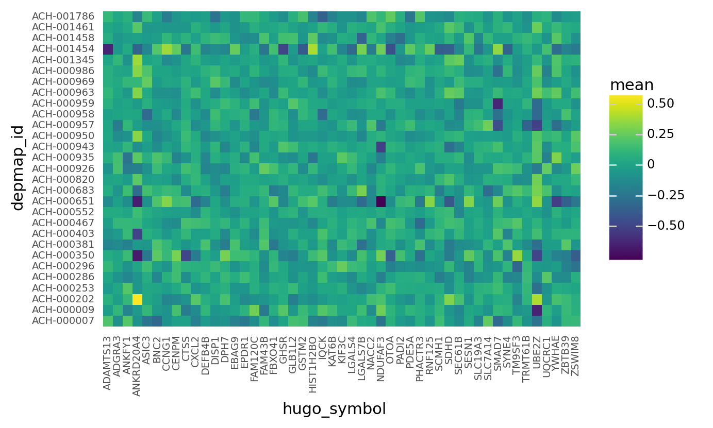

    <ggplot: (8753779639293)>

```python
consistent_gene_effect = az.summary(
    sp3.mcmc_results, var_names="h", kind="stats", hdi_prob=HDI_PROB
)
consistent_gene_effect["hugo_symbol"] = genes
consistent_gene_effect.head()
```

<div>
<style scoped>
    .dataframe tbody tr th:only-of-type {
        vertical-align: middle;
    }

    .dataframe tbody tr th {
        vertical-align: top;
    }

    .dataframe thead th {
        text-align: right;
    }
</style>
<table border="1" class="dataframe">
  <thead>
    <tr style="text-align: right;">
      <th></th>
      <th>mean</th>
      <th>sd</th>
      <th>hdi_5.5%</th>
      <th>hdi_94.5%</th>
      <th>hugo_symbol</th>
    </tr>
  </thead>
  <tbody>
    <tr>
      <th>h[0]</th>
      <td>-0.024</td>
      <td>0.319</td>
      <td>-0.520</td>
      <td>0.466</td>
      <td>ADAMTS13</td>
    </tr>
    <tr>
      <th>h[1]</th>
      <td>-0.085</td>
      <td>0.319</td>
      <td>-0.552</td>
      <td>0.429</td>
      <td>ADGRA3</td>
    </tr>
    <tr>
      <th>h[2]</th>
      <td>0.003</td>
      <td>0.319</td>
      <td>-0.485</td>
      <td>0.499</td>
      <td>ANKFY1</td>
    </tr>
    <tr>
      <th>h[3]</th>
      <td>-1.348</td>
      <td>0.323</td>
      <td>-1.833</td>
      <td>-0.840</td>
      <td>ANKRD20A4</td>
    </tr>
    <tr>
      <th>h[4]</th>
      <td>-0.051</td>
      <td>0.319</td>
      <td>-0.557</td>
      <td>0.428</td>
      <td>ASIC3</td>
    </tr>
  </tbody>
</table>
</div>

Below, I dig further into the gene *ANKRD20A4* because it showed a high degree of variance across cell lines in the above heatmap.
I plot the real LFC values as box-plots, the consistent gene effect in red (with a 89% CI), and the cell line effects in blue (with 89% CI).
The consistent gene effect was added to the cell line effect.
The shrinkage toward the mean effect for the gene is very strong.

```python
goi = "ANKRD20A4"
achilles_data_df = sp3.data_manager.get_data()
achilles_data_df = achilles_data_df.copy()[achilles_data_df.hugo_symbol == goi]

# Set order of DepMapID in increasing avg. LFC.
depmap_id_order = (
    achilles_data_df.groupby(["depmap_id"])["lfc"]
    .mean()
    .reset_index(drop=False)
    .sort_values("lfc")
    .depmap_id.to_list()
)
achilles_data_df["depmap_id"] = pd.Categorical(
    achilles_data_df["depmap_id"].values, ordered=True, categories=depmap_id_order
)


# Get consistent gene effect to plot as horizontal line.
goi_gene_effect = consistent_gene_effect[consistent_gene_effect.hugo_symbol == goi]
goi_avg = goi_gene_effect[["mean"]].values[0]
goi_hdi = goi_gene_effect[["hdi_5.5%", "hdi_94.5%"]].values[0]


# Cell line effect.
goi_cell_line_effect = cell_line_effects[cell_line_effects.hugo_symbol == goi][
    ["mean", "hdi_5.5%", "hdi_94.5%", "depmap_id"]
].reset_index(drop=True)
goi_cell_line_effect["depmap_id"] = pd.Categorical(
    goi_cell_line_effect["depmap_id"].values, ordered=True, categories=depmap_id_order
)
for c in ["mean", "hdi_5.5%", "hdi_94.5%"]:
    goi_cell_line_effect[c] = goi_cell_line_effect[c] + goi_avg


(
    gg.ggplot(achilles_data_df, gg.aes(x="depmap_id", y="lfc"))
    + gg.geom_boxplot(color="gray", outlier_size=0.5, outlier_alpha=0.5)
    + gg.geom_hline(yintercept=goi_avg[0], color=SeabornColor.red)
    + gg.geom_hline(
        yintercept=goi_hdi, color=SeabornColor.red, linetype="--", alpha=0.7
    )
    # + gg.geom_rect(
    #     gg.aes(xmin=0, xmax=np.inf, ymin=goi_hdi[0], ymax=goi_hdi[1], alpha=0.2),
    #     fill=SeabornColor.red,
    # )
    + gg.geom_point(
        gg.aes(x="depmap_id", y="mean"),
        data=goi_cell_line_effect,
        color=SeabornColor.blue,
    )
    + gg.geom_linerange(
        gg.aes(x="depmap_id", ymin="hdi_5.5%", ymax="hdi_94.5%", y="mean"),
        data=goi_cell_line_effect,
        color=SeabornColor.blue,
        size=1,
        alpha=0.7,
    )
    + gg.scale_alpha_identity()
    + gg.theme(
        axis_text_y=gg.element_text(size=7),
        axis_text_x=gg.element_text(angle=90, size=7),
        axis_ticks=eb,
        figure_size=(6, 4),
    )
    + gg.labs(x="cell line", y="LFC", title=f"${goi}$ cell line effects")
)
```

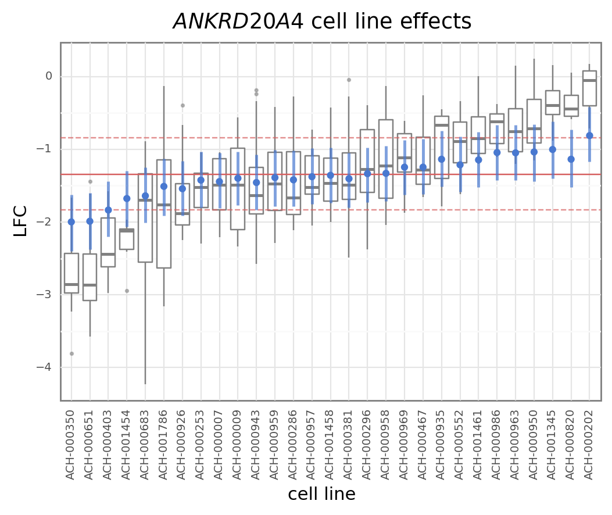

    <ggplot: (8753779553780)>

### Comparing against CERES

Below, I import the CERES gene effect data and compare it to the results from SpecletThree.

```python
depmap_gene_effect = pd.read_csv(
    data_io.data_path(data_io.DataFile.achilles_gene_effect)
)
depmap_gene_effect = depmap_gene_effect[depmap_gene_effect.hugo_symbol.isin(genes)]
depmap_gene_effect = depmap_gene_effect[depmap_gene_effect.depmap_id.isin(cell_lines)]
depmap_gene_effect = depmap_gene_effect.reset_index(drop=True)
depmap_gene_effect.head()
```

<div>
<style scoped>
    .dataframe tbody tr th:only-of-type {
        vertical-align: middle;
    }

    .dataframe tbody tr th {
        vertical-align: top;
    }

    .dataframe thead th {
        text-align: right;
    }
</style>
<table border="1" class="dataframe">
  <thead>
    <tr style="text-align: right;">
      <th></th>
      <th>depmap_id</th>
      <th>hugo_symbol</th>
      <th>gene_effect</th>
      <th>gene_effect_unscaled</th>
    </tr>
  </thead>
  <tbody>
    <tr>
      <th>0</th>
      <td>ACH-000007</td>
      <td>ADAMTS13</td>
      <td>0.207021</td>
      <td>0.440897</td>
    </tr>
    <tr>
      <th>1</th>
      <td>ACH-000009</td>
      <td>ADAMTS13</td>
      <td>-0.257312</td>
      <td>-0.189547</td>
    </tr>
    <tr>
      <th>2</th>
      <td>ACH-000202</td>
      <td>ADAMTS13</td>
      <td>0.119178</td>
      <td>0.207203</td>
    </tr>
    <tr>
      <th>3</th>
      <td>ACH-000253</td>
      <td>ADAMTS13</td>
      <td>-0.122489</td>
      <td>-0.036306</td>
    </tr>
    <tr>
      <th>4</th>
      <td>ACH-000286</td>
      <td>ADAMTS13</td>
      <td>-0.005170</td>
      <td>0.166132</td>
    </tr>
  </tbody>
</table>
</div>

```python
cell_line_effects.head()
```

<div>
<style scoped>
    .dataframe tbody tr th:only-of-type {
        vertical-align: middle;
    }

    .dataframe tbody tr th {
        vertical-align: top;
    }

    .dataframe thead th {
        text-align: right;
    }
</style>
<table border="1" class="dataframe">
  <thead>
    <tr style="text-align: right;">
      <th></th>
      <th>index</th>
      <th>mean</th>
      <th>sd</th>
      <th>hdi_5.5%</th>
      <th>hdi_94.5%</th>
      <th>hugo_symbol</th>
      <th>depmap_id</th>
    </tr>
  </thead>
  <tbody>
    <tr>
      <th>0</th>
      <td>g[0,0]</td>
      <td>0.178</td>
      <td>0.227</td>
      <td>-0.189</td>
      <td>0.541</td>
      <td>ADAMTS13</td>
      <td>ACH-000007</td>
    </tr>
    <tr>
      <th>1</th>
      <td>g[0,1]</td>
      <td>-0.036</td>
      <td>0.219</td>
      <td>-0.372</td>
      <td>0.320</td>
      <td>ADAMTS13</td>
      <td>ACH-000009</td>
    </tr>
    <tr>
      <th>2</th>
      <td>g[0,2]</td>
      <td>0.069</td>
      <td>0.220</td>
      <td>-0.287</td>
      <td>0.405</td>
      <td>ADAMTS13</td>
      <td>ACH-000202</td>
    </tr>
    <tr>
      <th>3</th>
      <td>g[0,3]</td>
      <td>-0.042</td>
      <td>0.226</td>
      <td>-0.401</td>
      <td>0.321</td>
      <td>ADAMTS13</td>
      <td>ACH-000253</td>
    </tr>
    <tr>
      <th>4</th>
      <td>g[0,4]</td>
      <td>0.014</td>
      <td>0.226</td>
      <td>-0.343</td>
      <td>0.377</td>
      <td>ADAMTS13</td>
      <td>ACH-000286</td>
    </tr>
  </tbody>
</table>
</div>

```python
combined_cell_line_effect = (
    cell_line_effects[["mean", "hdi_5.5%", "hdi_94.5%", "hugo_symbol", "depmap_id"]]
    .rename(
        columns={
            "mean": "sp_cell_mean",
            "hdi_5.5%": "sp_hdi_5.5%",
            "hdi_94.5%": "sp_hdi_94.5%",
        }
    )
    .merge(
        consistent_gene_effect[["hugo_symbol", "mean"]].rename(
            columns={"mean": "sp_gene_mean"}
        ),
        on=["hugo_symbol"],
    )
    .assign(sp_total_effect=lambda d: d.sp_cell_mean + d.sp_gene_mean)
    .merge(depmap_gene_effect, how="inner", on=["hugo_symbol", "depmap_id"])
)

combined_cell_line_effect.head()
```

<div>
<style scoped>
    .dataframe tbody tr th:only-of-type {
        vertical-align: middle;
    }

    .dataframe tbody tr th {
        vertical-align: top;
    }

    .dataframe thead th {
        text-align: right;
    }
</style>
<table border="1" class="dataframe">
  <thead>
    <tr style="text-align: right;">
      <th></th>
      <th>sp_cell_mean</th>
      <th>sp_hdi_5.5%</th>
      <th>sp_hdi_94.5%</th>
      <th>hugo_symbol</th>
      <th>depmap_id</th>
      <th>sp_gene_mean</th>
      <th>sp_total_effect</th>
      <th>gene_effect</th>
      <th>gene_effect_unscaled</th>
    </tr>
  </thead>
  <tbody>
    <tr>
      <th>0</th>
      <td>0.178</td>
      <td>-0.189</td>
      <td>0.541</td>
      <td>ADAMTS13</td>
      <td>ACH-000007</td>
      <td>-0.024</td>
      <td>0.154</td>
      <td>0.207021</td>
      <td>0.440897</td>
    </tr>
    <tr>
      <th>1</th>
      <td>-0.036</td>
      <td>-0.372</td>
      <td>0.320</td>
      <td>ADAMTS13</td>
      <td>ACH-000009</td>
      <td>-0.024</td>
      <td>-0.060</td>
      <td>-0.257312</td>
      <td>-0.189547</td>
    </tr>
    <tr>
      <th>2</th>
      <td>0.069</td>
      <td>-0.287</td>
      <td>0.405</td>
      <td>ADAMTS13</td>
      <td>ACH-000202</td>
      <td>-0.024</td>
      <td>0.045</td>
      <td>0.119178</td>
      <td>0.207203</td>
    </tr>
    <tr>
      <th>3</th>
      <td>-0.042</td>
      <td>-0.401</td>
      <td>0.321</td>
      <td>ADAMTS13</td>
      <td>ACH-000253</td>
      <td>-0.024</td>
      <td>-0.066</td>
      <td>-0.122489</td>
      <td>-0.036306</td>
    </tr>
    <tr>
      <th>4</th>
      <td>0.014</td>
      <td>-0.343</td>
      <td>0.377</td>
      <td>ADAMTS13</td>
      <td>ACH-000286</td>
      <td>-0.024</td>
      <td>-0.010</td>
      <td>-0.005170</td>
      <td>0.166132</td>
    </tr>
  </tbody>
</table>
</div>

The first comparison is to just the cell line-specific effect, but there is a high degree of disagreement.
I looked into it further, and the genes with the largest disagreement were those with strong consistent gene effects.

```python
(
    gg.ggplot(
        combined_cell_line_effect, gg.aes(x="sp_cell_mean", y="gene_effect_unscaled")
    )
    + gg.geom_point(size=0.2, alpha=0.4)
    + gg.geom_abline(slope=1, intercept=0, color=SeabornColor.red)
    + gg.geom_smooth(method="lm", formula="y~x", se=False, color=SeabornColor.blue)
    + gg.labs(x="Sp3 cell line effect", y="CERES (unscaled)")
)
```

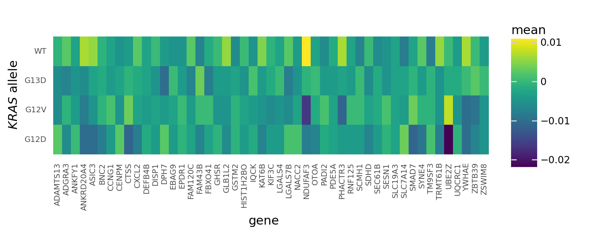

    <ggplot: (8753779406309)>

The following plot compares the CERES gene effect to the consistent gene effect plus the cell line-specific effect estimates by SpecletThree.
There is a high degree of concordance, but the points do lie along the 1:1 diagonal.
This is probably because the values from SpecletThree are pulled towards the mean of 0, shrinking the estimates.

```python
(
    gg.ggplot(
        combined_cell_line_effect, gg.aes(x="sp_total_effect", y="gene_effect_unscaled")
    )
    + gg.geom_point(size=0.2, alpha=0.4)
    + gg.geom_abline(slope=1, intercept=0, color=SeabornColor.red)
    + gg.geom_smooth(method="lm", formula="y~x", se=False, color=SeabornColor.blue)
    + gg.labs(x="gene consistent and cell line effects", y="CERES (unscaled)")
)
```

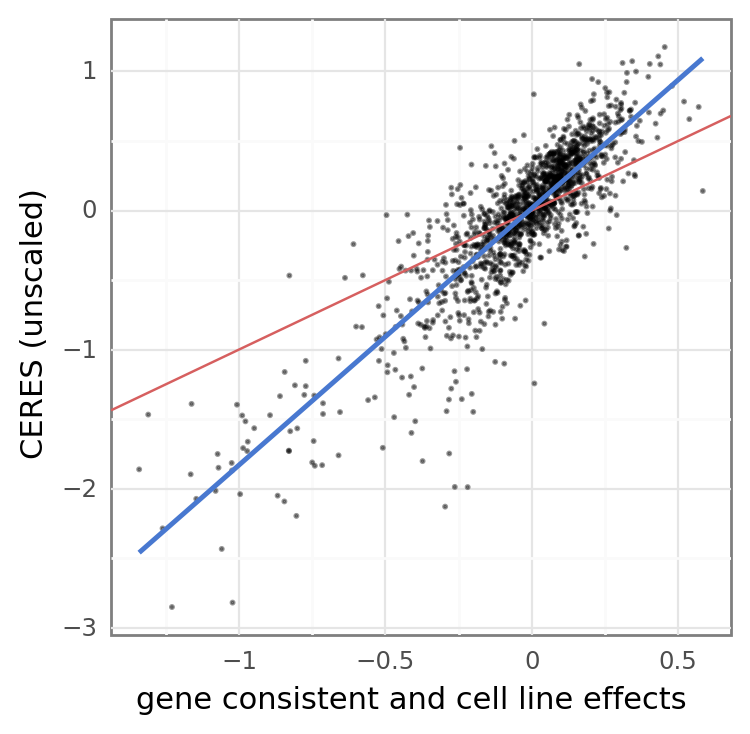

    <ggplot: (8753779075160)>

### Batch effects

In this subsample, there does not appear to be a strong batch effect.

```python
az.plot_trace(sp3.mcmc_results, var_names=["μ_b", "σ_b", "b"], compact=False);
```

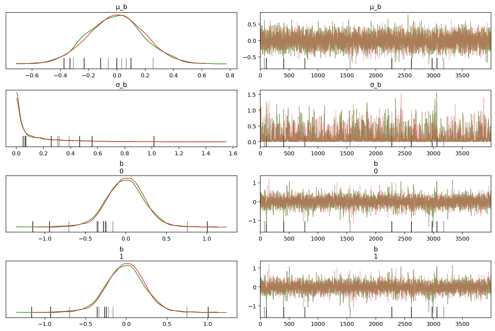

```python
az.plot_forest(
    sp3.mcmc_results,
    var_names=["μ_b", "σ_b", "b"],
    hdi_prob=HDI_PROB,
    rope=(-0.03, 0.03),
);
```

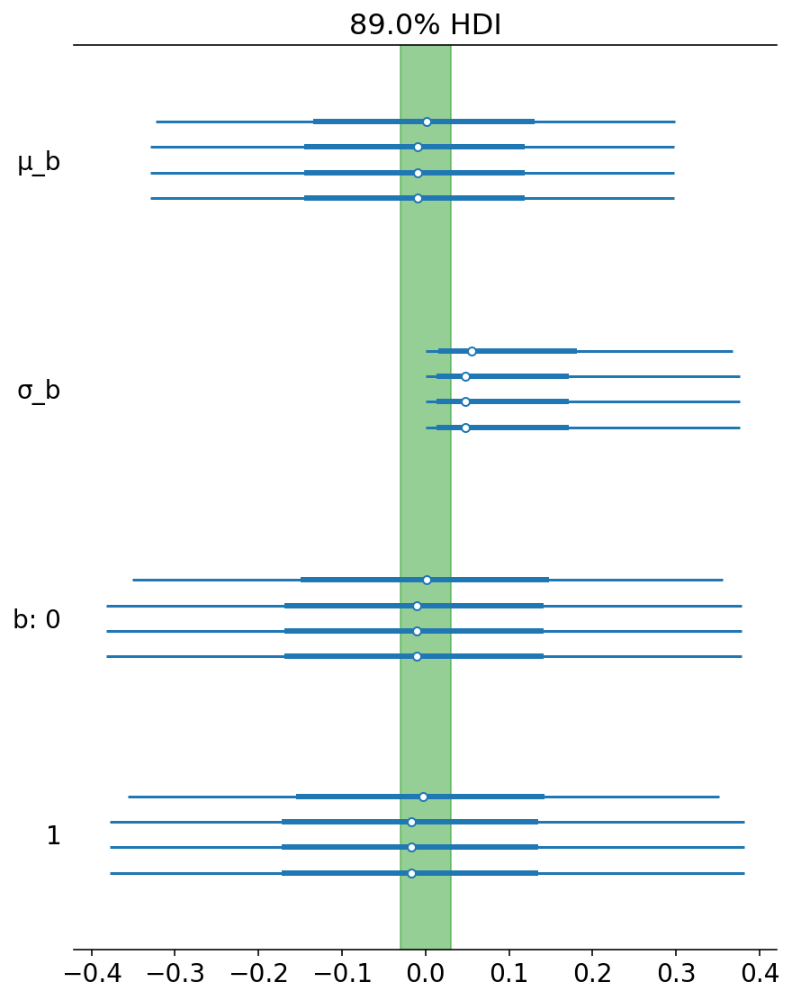

## Analysis of ADVI fit

```python
if sp3.cache_manager.advi_cache_exists():
    _, advi_approx = sp3.advi_sample_model()
else:
    logger.error("Could not find model.")
```

<pre style="white-space:pre;overflow-x:auto;line-height:normal;font-family:Menlo,'DejaVu Sans Mono',consolas,'Courier New',monospace"><span style="color: #7fbfbf; text-decoration-color: #7fbfbf">[05/27/21 12:00:27] </span><span style="color: #000080; text-decoration-color: #000080">INFO    </span> ArvizCacheManager: ADVI cache exists.      <a href="file:///n/data1/hms/dbmi/park/Cook/speclet/src/managers/cache_managers.py"><span style="color: #7f7f7f; text-decoration-color: #7f7f7f">cache_managers.py</span></a><span style="color: #7f7f7f; text-decoration-color: #7f7f7f">:277</span>
</pre>

    /home/jc604/.conda/envs/speclet/lib/python3.9/site-packages/pymc3/data.py:316: FutureWarning: Using a non-tuple sequence for multidimensional indexing is deprecated; use `arr[tuple(seq)]` instead of `arr[seq]`. In the future this will be interpreted as an array index, `arr[np.array(seq)]`, which will result either in an error or a different result.
    /home/jc604/.conda/envs/speclet/lib/python3.9/site-packages/pymc3/data.py:316: FutureWarning: Using a non-tuple sequence for multidimensional indexing is deprecated; use `arr[tuple(seq)]` instead of `arr[seq]`. In the future this will be interpreted as an array index, `arr[np.array(seq)]`, which will result either in an error or a different result.

<pre style="white-space:pre;overflow-x:auto;line-height:normal;font-family:Menlo,'DejaVu Sans Mono',consolas,'Courier New',monospace"><span style="color: #7fbfbf; text-decoration-color: #7fbfbf">[05/27/21 12:00:30] </span><span style="color: #000080; text-decoration-color: #000080">INFO    </span> ArvizCacheManager: ADVI cache exists.      <a href="file:///n/data1/hms/dbmi/park/Cook/speclet/src/managers/cache_managers.py"><span style="color: #7f7f7f; text-decoration-color: #7f7f7f">cache_managers.py</span></a><span style="color: #7f7f7f; text-decoration-color: #7f7f7f">:277</span>
</pre>

<pre style="white-space:pre;overflow-x:auto;line-height:normal;font-family:Menlo,'DejaVu Sans Mono',consolas,'Courier New',monospace"><span style="color: #7fbfbf; text-decoration-color: #7fbfbf">                    </span><span style="color: #000080; text-decoration-color: #000080">INFO    </span> Returning results from cache.               <a href="file:///n/data1/hms/dbmi/park/Cook/speclet/src/models/speclet_model.py"><span style="color: #7f7f7f; text-decoration-color: #7f7f7f">speclet_model.py</span></a><span style="color: #7f7f7f; text-decoration-color: #7f7f7f">:394</span>
</pre>

<pre style="white-space:pre;overflow-x:auto;line-height:normal;font-family:Menlo,'DejaVu Sans Mono',consolas,'Courier New',monospace"><span style="color: #7fbfbf; text-decoration-color: #7fbfbf">                    </span><span style="color: #000080; text-decoration-color: #000080">INFO    </span> ArvizCacheManager: ADVI cache exists.      <a href="file:///n/data1/hms/dbmi/park/Cook/speclet/src/managers/cache_managers.py"><span style="color: #7f7f7f; text-decoration-color: #7f7f7f">cache_managers.py</span></a><span style="color: #7f7f7f; text-decoration-color: #7f7f7f">:277</span>
</pre>

```python
pmanal.plot_vi_hist(advi_approx) + gg.theme(figure_size=(6, 4))
```

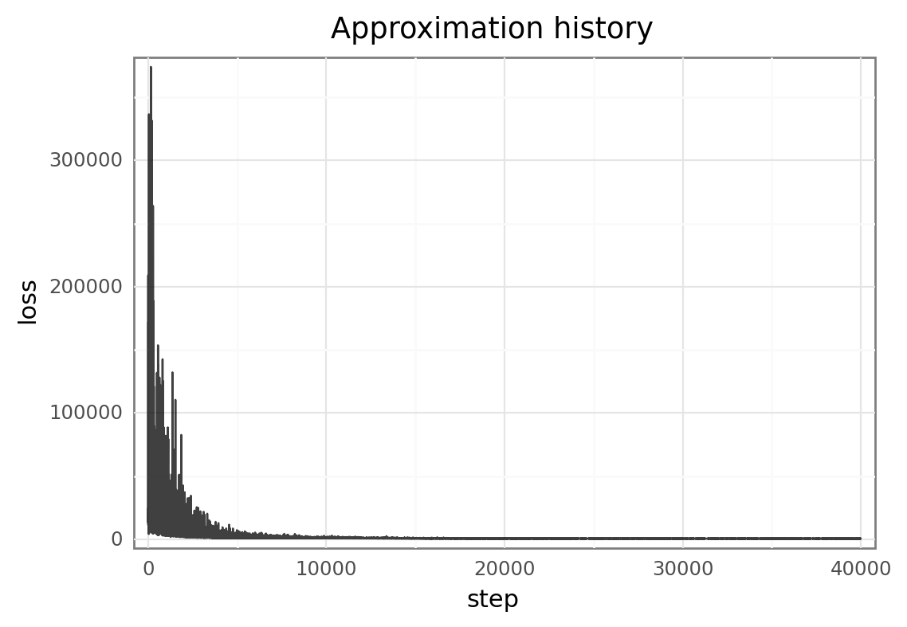

    <ggplot: (8753769503952)>

```python
pmanal.plot_vi_hist(advi_approx) + gg.scale_y_log10() + gg.theme(figure_size=(6, 4))
```

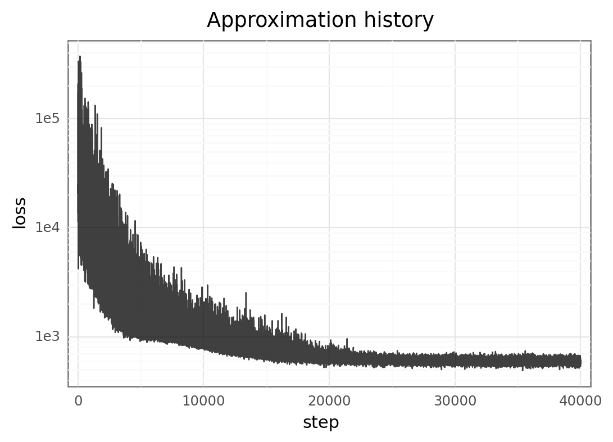

    <ggplot: (8753778871131)>

```python
limits = (20000, 40000)
window = 500
hist_sliding_avg = [
    np.mean(advi_approx.hist[(i - window) : (i + window)]) for i in range(*limits)
]
df = pd.DataFrame({"x": range(*limits), "y": hist_sliding_avg})

(
    pmanal.plot_vi_hist(advi_approx)
    + gg.geom_line(gg.aes(x="x", y="y"), data=df, color=SeabornColor.red, size=1)
    + gg.geom_hline(
        yintercept=(hist_sliding_avg[0], hist_sliding_avg[-1]),
        color=SeabornColor.blue,
        linetype="--",
        size=0.8,
    )
    + gg.scale_x_continuous(limits=limits, expand=(0, 0))
    + gg.scale_y_continuous(limits=(300, 1000))
    + gg.theme(figure_size=(8, 4))
)
```

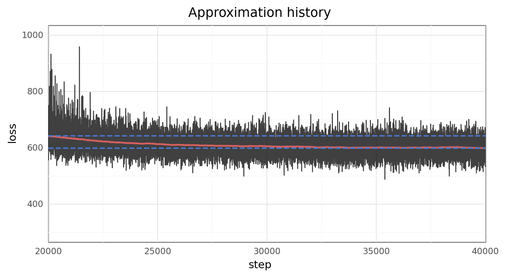

    <ggplot: (8753769203706)>

```python
advi_consistent_gene_effect = az.summary(
    sp3.advi_results[0], var_names="h", kind="stats", hdi_prob=HDI_PROB
).assign(hugo_symbol=genes)
```

Compared to the results from fitting with MCMC, the ADVI parameter estimates do not capture the variance well. This may be cause by two factors:

1. the ADVI fitting it continuing for too long
2. I am currently using `MeanField` ADVI, but `FullRank` may be able to better capture the variance (at higher computational costs).

```python
combined_consistent_gene_effect = pd.concat(
    [
        advi_consistent_gene_effect.assign(method="ADVI"),
        consistent_gene_effect.assign(method="MCMC"),
    ]
)

pos = gg.position_dodge(width=1)
pal = make_pal(FitMethodColors)
pal = {k.replace("pymc3_", "").upper(): v for k, v in pal.items()}

(
    gg.ggplot(
        combined_consistent_gene_effect,
        gg.aes(x="hugo_symbol", y="mean", color="method"),
    )
    + gg.geom_linerange(
        gg.aes(ymin="hdi_5.5%", ymax="hdi_94.5%"), position=pos, size=0.7, alpha=0.7
    )
    + gg.geom_point(position=pos)
    + gg.scale_color_manual(values=pal)
    + gg.theme(axis_text_x=gg.element_text(angle=90, size=7), figure_size=(8, 4))
    + gg.labs(x=None, y="consistent gene effect", color=None)
)
```

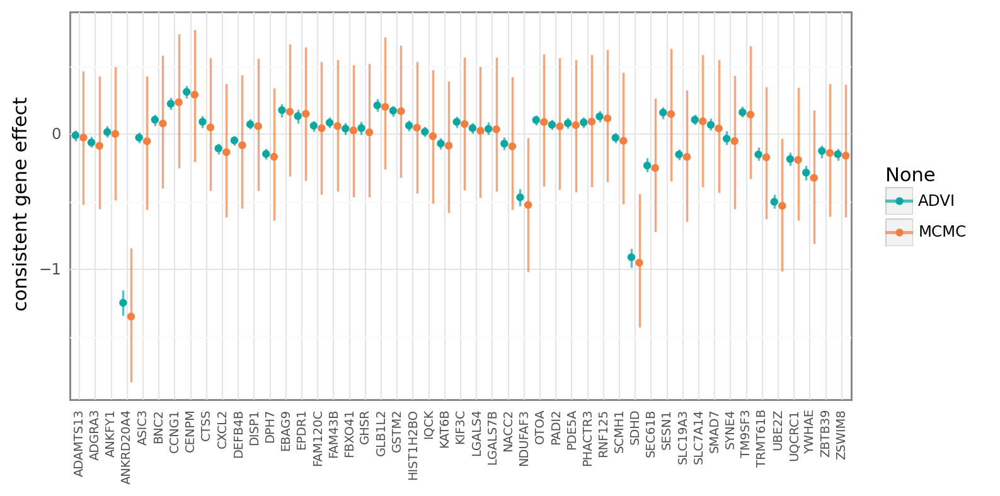

    <ggplot: (8753769617908)>

```python
az.plot_forest(
    [sp3.mcmc_results, sp3.advi_results[0]],
    var_names=["μ_h", "σ_h", "μ_g", "σ_g"],
    hdi_prob=HDI_PROB,
);
```


```python

```

```python

```

```python

```

```python

```

---

```python
notebook_toc = time()
print(f"execution time: {(notebook_toc - notebook_tic) / 60:.2f} minutes")
```

    execution time: 0.91 minutes

```python
%load_ext watermark
%watermark -d -u -v -iv -b -h -m
```

    Last updated: 2021-05-27

    Python implementation: CPython
    Python version       : 3.9.2
    IPython version      : 7.22.0

    Compiler    : GCC 9.3.0
    OS          : Linux
    Release     : 3.10.0-1062.el7.x86_64
    Machine     : x86_64
    Processor   : x86_64
    CPU cores   : 28
    Architecture: 64bit

    Hostname: compute-e-16-230.o2.rc.hms.harvard.edu

    Git branch: noncentered-reparam

    re        : 2.2.1
    pymc3     : 3.11.2
    matplotlib: 3.4.1
    numpy     : 1.20.2
    pandas    : 1.2.3
    plotnine  : 0.8.0
    theano    : 1.0.5
    arviz     : 0.11.2
    seaborn   : 0.11.1
