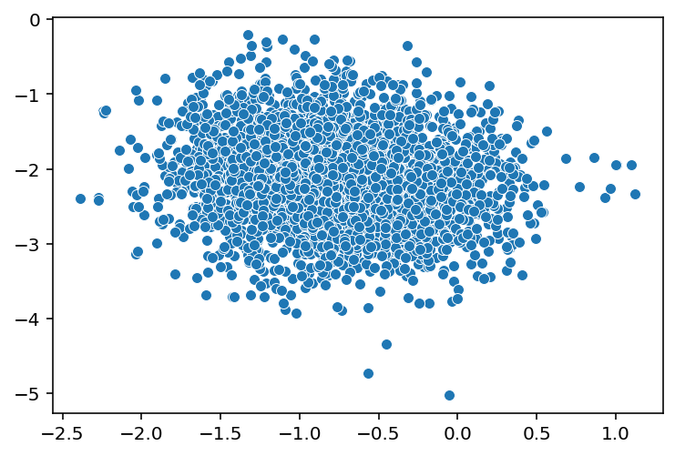
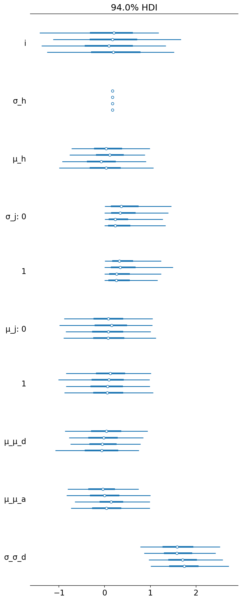
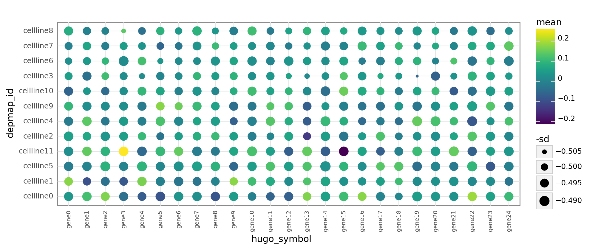
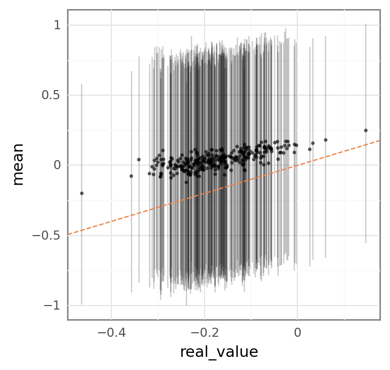
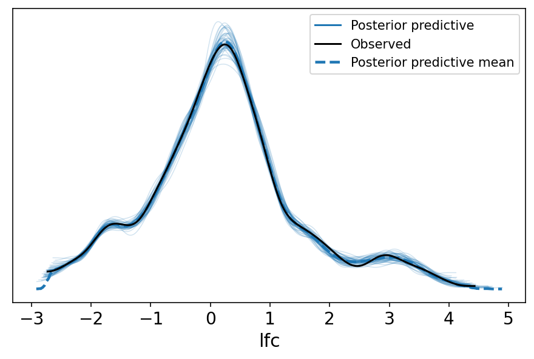
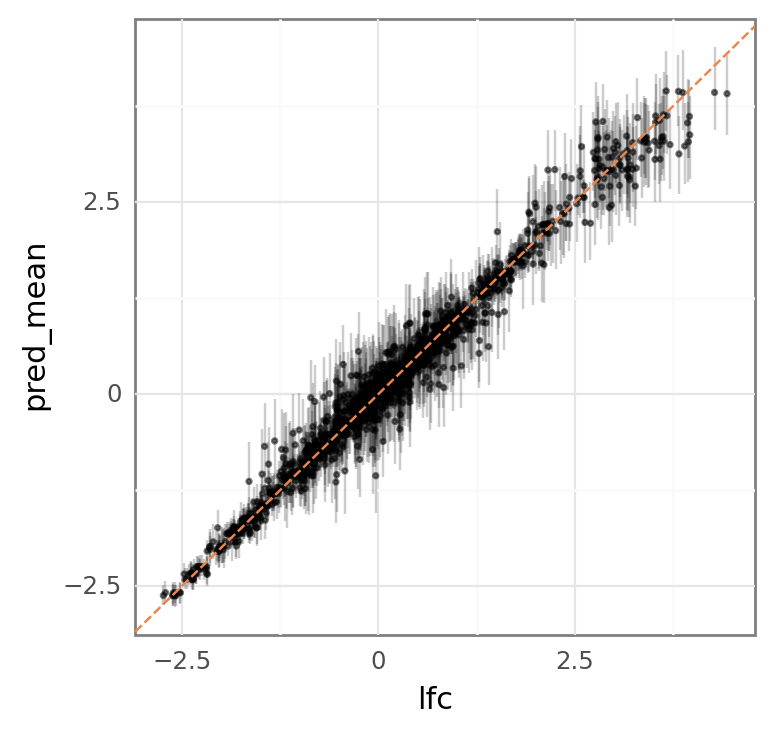
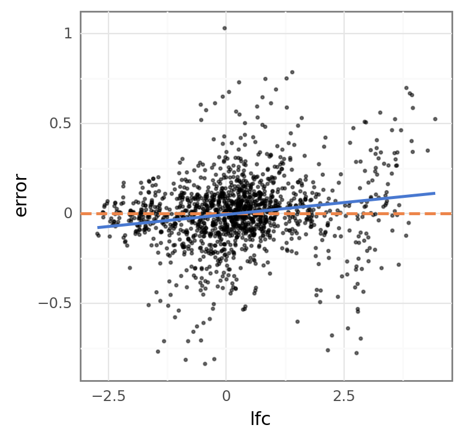

```python
%load_ext autoreload
%autoreload 2
```

```python
import re
import string
import warnings
from pathlib import Path
from time import time

import arviz as az
import janitor
import matplotlib.colors as mcolors
import matplotlib.pyplot as plt
import numpy as np
import pandas as pd
import plotnine as gg
import pymc3 as pm
import seaborn as sns
from theano import tensor as tt
```

```python
import src.modeling.simulation_based_calibration_helpers as sbc
from src.data_processing import achilles as achelp
from src.data_processing import common as dphelp
from src.io import cache_io
from src.loggers import logger
from src.modeling import pymc3_analysis as pmanal
from src.modeling import pymc3_sampling_api as pmapi
from src.models.speclet_six import SpecletSix
from src.plot.color_pal import FitMethodColors, ModelColors, SeabornColor
from src.project_enums import ModelFitMethod
```

```python
notebook_tic = time()

warnings.simplefilter(action="ignore", category=UserWarning)

gg.theme_set(
    gg.theme_bw()
    + gg.theme(
        figure_size=(4, 4),
        axis_ticks_major=gg.element_blank(),
        strip_background=gg.element_blank(),
    )
)
%config InlineBackend.figure_format = "retina"

RANDOM_SEED = 300
np.random.seed(RANDOM_SEED)

HDI_PROB = 0.89
```

```python
sp6 = SpecletSix("expt-sbc", cache_io.default_cache_dir(), debug=True)
```

```python
if False:
    sp6.cache_manager.clear_all_caches()
    sp6._reset_model_and_results()

sp6.cache_manager.mcmc_cache_exists()
```

<pre style="white-space:pre;overflow-x:auto;line-height:normal;font-family:Menlo,'DejaVu Sans Mono',consolas,'Courier New',monospace"><span style="color: #7fbfbf; text-decoration-color: #7fbfbf">[06/15/21 15:19:46] </span><span style="color: #800000; text-decoration-color: #800000">WARNING </span> Reseting all model and results.             <a href="file:///n/data1/hms/dbmi/park/Cook/speclet/src/models/speclet_model.py"><span style="color: #7f7f7f; text-decoration-color: #7f7f7f">speclet_model.py</span></a><span style="color: #7f7f7f; text-decoration-color: #7f7f7f">:144</span>
</pre>

    False

```python
sbc_dir = results_path = sp6.cache_manager.cache_dir / "sbc"
```

```python
sp6.run_simulation_based_calibration(
    sbc_dir,
    fit_method=ModelFitMethod.mcmc,
    random_seed=RANDOM_SEED,
    size="medium",
    fit_kwargs={
        "mcmc_draws": 1000,
        "tune": 1500,
        "chains": 4,
        "cores": 4,
        "target_accept": 0.99,
        "prior_pred_samples": 1000,
        "post_pred_samples": 1000,
    },
)
```

<pre style="white-space:pre;overflow-x:auto;line-height:normal;font-family:Menlo,'DejaVu Sans Mono',consolas,'Courier New',monospace"><span style="color: #7fbfbf; text-decoration-color: #7fbfbf">[06/15/21 15:20:08] </span><span style="color: #000080; text-decoration-color: #000080">INFO    </span> Generating mock data of size          <a href="file:///n/data1/hms/dbmi/park/Cook/speclet/src/managers/model_data_managers.py"><span style="color: #7f7f7f; text-decoration-color: #7f7f7f">model_data_managers.py</span></a><span style="color: #7f7f7f; text-decoration-color: #7f7f7f">:305</span>
                             <span style="color: #008000; text-decoration-color: #008000">'medium'</span>.
</pre>

<pre style="white-space:pre;overflow-x:auto;line-height:normal;font-family:Menlo,'DejaVu Sans Mono',consolas,'Courier New',monospace"><span style="color: #7fbfbf; text-decoration-color: #7fbfbf">                    </span><span style="color: #000080; text-decoration-color: #000080">INFO    </span> Applying <span style="color: #008080; text-decoration-color: #008080; font-weight: bold">6</span> data transformations.      <a href="file:///n/data1/hms/dbmi/park/Cook/speclet/src/managers/model_data_managers.py"><span style="color: #7f7f7f; text-decoration-color: #7f7f7f">model_data_managers.py</span></a><span style="color: #7f7f7f; text-decoration-color: #7f7f7f">:129</span>
</pre>

<pre style="white-space:pre;overflow-x:auto;line-height:normal;font-family:Menlo,'DejaVu Sans Mono',consolas,'Courier New',monospace"><span style="color: #7fbfbf; text-decoration-color: #7fbfbf">                    </span><span style="color: #000080; text-decoration-color: #000080">INFO    </span> Applying transformation: <span style="color: #008000; text-decoration-color: #008000">'_drop_sgrna</span> <a href="file:///n/data1/hms/dbmi/park/Cook/speclet/src/managers/model_data_managers.py"><span style="color: #7f7f7f; text-decoration-color: #7f7f7f">model_data_managers.py</span></a><span style="color: #7f7f7f; text-decoration-color: #7f7f7f">:116</span>
                             <span style="color: #008000; text-decoration-color: #008000">s_that_map_to_multiple_genes'</span>
</pre>

<pre style="white-space:pre;overflow-x:auto;line-height:normal;font-family:Menlo,'DejaVu Sans Mono',consolas,'Courier New',monospace"><span style="color: #7fbfbf; text-decoration-color: #7fbfbf">                    </span><span style="color: #800000; text-decoration-color: #800000">WARNING </span> Dropping <span style="color: #008080; text-decoration-color: #008080; font-weight: bold">0</span> sgRNA that map to multiple <a href="file:///n/data1/hms/dbmi/park/Cook/speclet/src/managers/model_data_managers.py"><span style="color: #7f7f7f; text-decoration-color: #7f7f7f">model_data_managers.py</span></a><span style="color: #7f7f7f; text-decoration-color: #7f7f7f">:249</span>
                             genes.
</pre>

<pre style="white-space:pre;overflow-x:auto;line-height:normal;font-family:Menlo,'DejaVu Sans Mono',consolas,'Courier New',monospace"><span style="color: #7fbfbf; text-decoration-color: #7fbfbf">                    </span><span style="color: #000080; text-decoration-color: #000080">INFO    </span> Applying transformation:              <a href="file:///n/data1/hms/dbmi/park/Cook/speclet/src/managers/model_data_managers.py"><span style="color: #7f7f7f; text-decoration-color: #7f7f7f">model_data_managers.py</span></a><span style="color: #7f7f7f; text-decoration-color: #7f7f7f">:116</span>
                             <span style="color: #008000; text-decoration-color: #008000">'_drop_missing_copynumber'</span>
</pre>

<pre style="white-space:pre;overflow-x:auto;line-height:normal;font-family:Menlo,'DejaVu Sans Mono',consolas,'Courier New',monospace"><span style="color: #7fbfbf; text-decoration-color: #7fbfbf">                    </span><span style="color: #800000; text-decoration-color: #800000">WARNING </span> Dropping <span style="color: #008080; text-decoration-color: #008080; font-weight: bold">0</span> data points with missing   <a href="file:///n/data1/hms/dbmi/park/Cook/speclet/src/managers/model_data_managers.py"><span style="color: #7f7f7f; text-decoration-color: #7f7f7f">model_data_managers.py</span></a><span style="color: #7f7f7f; text-decoration-color: #7f7f7f">:259</span>
                             copy number.
</pre>

<pre style="white-space:pre;overflow-x:auto;line-height:normal;font-family:Menlo,'DejaVu Sans Mono',consolas,'Courier New',monospace"><span style="color: #7fbfbf; text-decoration-color: #7fbfbf">                    </span><span style="color: #000080; text-decoration-color: #000080">INFO    </span> Applying transformation:              <a href="file:///n/data1/hms/dbmi/park/Cook/speclet/src/managers/model_data_managers.py"><span style="color: #7f7f7f; text-decoration-color: #7f7f7f">model_data_managers.py</span></a><span style="color: #7f7f7f; text-decoration-color: #7f7f7f">:116</span>
                             <span style="color: #008000; text-decoration-color: #008000">'centered_copynumber_by_cellline'</span>
</pre>

<pre style="white-space:pre;overflow-x:auto;line-height:normal;font-family:Menlo,'DejaVu Sans Mono',consolas,'Courier New',monospace"><span style="color: #7fbfbf; text-decoration-color: #7fbfbf">                    </span><span style="color: #000080; text-decoration-color: #000080">INFO    </span> Adding <span style="color: #008000; text-decoration-color: #008000">'copy_number_cellline'</span> column.          <a href="file:///n/data1/hms/dbmi/park/Cook/speclet/src/models/speclet_six.py"><span style="color: #7f7f7f; text-decoration-color: #7f7f7f">speclet_six.py</span></a><span style="color: #7f7f7f; text-decoration-color: #7f7f7f">:26</span>
</pre>

<pre style="white-space:pre;overflow-x:auto;line-height:normal;font-family:Menlo,'DejaVu Sans Mono',consolas,'Courier New',monospace"><span style="color: #7fbfbf; text-decoration-color: #7fbfbf">                    </span><span style="color: #000080; text-decoration-color: #000080">INFO    </span> Applying transformation:              <a href="file:///n/data1/hms/dbmi/park/Cook/speclet/src/managers/model_data_managers.py"><span style="color: #7f7f7f; text-decoration-color: #7f7f7f">model_data_managers.py</span></a><span style="color: #7f7f7f; text-decoration-color: #7f7f7f">:116</span>
                             <span style="color: #008000; text-decoration-color: #008000">'centered_copynumber_by_gene'</span>
</pre>

<pre style="white-space:pre;overflow-x:auto;line-height:normal;font-family:Menlo,'DejaVu Sans Mono',consolas,'Courier New',monospace"><span style="color: #7fbfbf; text-decoration-color: #7fbfbf">                    </span><span style="color: #000080; text-decoration-color: #000080">INFO    </span> Adding <span style="color: #008000; text-decoration-color: #008000">'copy_number_gene'</span> column.              <a href="file:///n/data1/hms/dbmi/park/Cook/speclet/src/models/speclet_six.py"><span style="color: #7f7f7f; text-decoration-color: #7f7f7f">speclet_six.py</span></a><span style="color: #7f7f7f; text-decoration-color: #7f7f7f">:44</span>
</pre>

<pre style="white-space:pre;overflow-x:auto;line-height:normal;font-family:Menlo,'DejaVu Sans Mono',consolas,'Courier New',monospace"><span style="color: #7fbfbf; text-decoration-color: #7fbfbf">                    </span><span style="color: #000080; text-decoration-color: #000080">INFO    </span> Applying transformation: <span style="color: #008000; text-decoration-color: #008000">'zscale_rna_</span> <a href="file:///n/data1/hms/dbmi/park/Cook/speclet/src/managers/model_data_managers.py"><span style="color: #7f7f7f; text-decoration-color: #7f7f7f">model_data_managers.py</span></a><span style="color: #7f7f7f; text-decoration-color: #7f7f7f">:116</span>
                             <span style="color: #008000; text-decoration-color: #008000">expression_by_gene_and_lineage'</span>
</pre>

<pre style="white-space:pre;overflow-x:auto;line-height:normal;font-family:Menlo,'DejaVu Sans Mono',consolas,'Courier New',monospace"><span style="color: #7fbfbf; text-decoration-color: #7fbfbf">                    </span><span style="color: #000080; text-decoration-color: #000080">INFO    </span> Adding <span style="color: #008000; text-decoration-color: #008000">'rna_expr_gene_lineage'</span> column.         <a href="file:///n/data1/hms/dbmi/park/Cook/speclet/src/models/speclet_six.py"><span style="color: #7f7f7f; text-decoration-color: #7f7f7f">speclet_six.py</span></a><span style="color: #7f7f7f; text-decoration-color: #7f7f7f">:62</span>
</pre>

<pre style="white-space:pre;overflow-x:auto;line-height:normal;font-family:Menlo,'DejaVu Sans Mono',consolas,'Courier New',monospace"><span style="color: #7fbfbf; text-decoration-color: #7fbfbf">                    </span><span style="color: #000080; text-decoration-color: #000080">INFO    </span> Applying transformation:              <a href="file:///n/data1/hms/dbmi/park/Cook/speclet/src/managers/model_data_managers.py"><span style="color: #7f7f7f; text-decoration-color: #7f7f7f">model_data_managers.py</span></a><span style="color: #7f7f7f; text-decoration-color: #7f7f7f">:116</span>
                             <span style="color: #008000; text-decoration-color: #008000">'convert_is_mutated_to_numeric'</span>
</pre>

<pre style="white-space:pre;overflow-x:auto;line-height:normal;font-family:Menlo,'DejaVu Sans Mono',consolas,'Courier New',monospace"><span style="color: #7fbfbf; text-decoration-color: #7fbfbf">                    </span><span style="color: #000080; text-decoration-color: #000080">INFO    </span> Converting <span style="color: #008000; text-decoration-color: #008000">'is_mutated'</span> column to <span style="color: #008000; text-decoration-color: #008000">'int'</span>.       <a href="file:///n/data1/hms/dbmi/park/Cook/speclet/src/models/speclet_six.py"><span style="color: #7f7f7f; text-decoration-color: #7f7f7f">speclet_six.py</span></a><span style="color: #7f7f7f; text-decoration-color: #7f7f7f">:81</span>
</pre>

<pre style="white-space:pre;overflow-x:auto;line-height:normal;font-family:Menlo,'DejaVu Sans Mono',consolas,'Courier New',monospace"><span style="color: #7fbfbf; text-decoration-color: #7fbfbf">                    </span><span style="color: #000080; text-decoration-color: #000080">INFO    </span> Calling `model_specification<span style="font-weight: bold">()</span>` method.     <a href="file:///n/data1/hms/dbmi/park/Cook/speclet/src/models/speclet_model.py"><span style="color: #7f7f7f; text-decoration-color: #7f7f7f">speclet_model.py</span></a><span style="color: #7f7f7f; text-decoration-color: #7f7f7f">:184</span>
</pre>

<pre style="white-space:pre;overflow-x:auto;line-height:normal;font-family:Menlo,'DejaVu Sans Mono',consolas,'Courier New',monospace"><span style="color: #7fbfbf; text-decoration-color: #7fbfbf">                    </span><span style="color: #000080; text-decoration-color: #000080">INFO    </span> Beginning PyMC3 model specification.          <a href="file:///n/data1/hms/dbmi/park/Cook/speclet/src/models/speclet_six.py"><span style="color: #7f7f7f; text-decoration-color: #7f7f7f">speclet_six.py</span></a><span style="color: #7f7f7f; text-decoration-color: #7f7f7f">:271</span>
</pre>

<pre style="white-space:pre;overflow-x:auto;line-height:normal;font-family:Menlo,'DejaVu Sans Mono',consolas,'Courier New',monospace"><span style="color: #7fbfbf; text-decoration-color: #7fbfbf">                    </span><span style="color: #000080; text-decoration-color: #000080">INFO    </span> Getting Theano shared variables.              <a href="file:///n/data1/hms/dbmi/park/Cook/speclet/src/models/speclet_six.py"><span style="color: #7f7f7f; text-decoration-color: #7f7f7f">speclet_six.py</span></a><span style="color: #7f7f7f; text-decoration-color: #7f7f7f">:279</span>
</pre>

<pre style="white-space:pre;overflow-x:auto;line-height:normal;font-family:Menlo,'DejaVu Sans Mono',consolas,'Courier New',monospace"><span style="color: #7fbfbf; text-decoration-color: #7fbfbf">                    </span><span style="color: #000080; text-decoration-color: #000080">INFO    </span> Creating PyMC3 SpecletSix model.              <a href="file:///n/data1/hms/dbmi/park/Cook/speclet/src/models/speclet_six.py"><span style="color: #7f7f7f; text-decoration-color: #7f7f7f">speclet_six.py</span></a><span style="color: #7f7f7f; text-decoration-color: #7f7f7f">:318</span>
</pre>

<pre style="white-space:pre;overflow-x:auto;line-height:normal;font-family:Menlo,'DejaVu Sans Mono',consolas,'Courier New',monospace"><span style="color: #7fbfbf; text-decoration-color: #7fbfbf">[06/15/21 15:20:23] </span><span style="color: #000080; text-decoration-color: #000080">INFO    </span> Found <span style="color: #008080; text-decoration-color: #008080; font-weight: bold">2</span> cell line lineages.                   <a href="file:///n/data1/hms/dbmi/park/Cook/speclet/src/models/speclet_six.py"><span style="color: #7f7f7f; text-decoration-color: #7f7f7f">speclet_six.py</span></a><span style="color: #7f7f7f; text-decoration-color: #7f7f7f">:357</span>
</pre>

<pre style="white-space:pre;overflow-x:auto;line-height:normal;font-family:Menlo,'DejaVu Sans Mono',consolas,'Courier New',monospace"><span style="color: #7fbfbf; text-decoration-color: #7fbfbf">[06/15/21 15:20:28] </span><span style="color: #000080; text-decoration-color: #000080">INFO    </span> Applying <span style="color: #008080; text-decoration-color: #008080; font-weight: bold">6</span> data transformations.      <a href="file:///n/data1/hms/dbmi/park/Cook/speclet/src/managers/model_data_managers.py"><span style="color: #7f7f7f; text-decoration-color: #7f7f7f">model_data_managers.py</span></a><span style="color: #7f7f7f; text-decoration-color: #7f7f7f">:129</span>
</pre>

<pre style="white-space:pre;overflow-x:auto;line-height:normal;font-family:Menlo,'DejaVu Sans Mono',consolas,'Courier New',monospace"><span style="color: #7fbfbf; text-decoration-color: #7fbfbf">                    </span><span style="color: #000080; text-decoration-color: #000080">INFO    </span> Applying transformation: <span style="color: #008000; text-decoration-color: #008000">'_drop_sgrna</span> <a href="file:///n/data1/hms/dbmi/park/Cook/speclet/src/managers/model_data_managers.py"><span style="color: #7f7f7f; text-decoration-color: #7f7f7f">model_data_managers.py</span></a><span style="color: #7f7f7f; text-decoration-color: #7f7f7f">:116</span>
                             <span style="color: #008000; text-decoration-color: #008000">s_that_map_to_multiple_genes'</span>
</pre>

<pre style="white-space:pre;overflow-x:auto;line-height:normal;font-family:Menlo,'DejaVu Sans Mono',consolas,'Courier New',monospace"><span style="color: #7fbfbf; text-decoration-color: #7fbfbf">                    </span><span style="color: #800000; text-decoration-color: #800000">WARNING </span> Dropping <span style="color: #008080; text-decoration-color: #008080; font-weight: bold">0</span> sgRNA that map to multiple <a href="file:///n/data1/hms/dbmi/park/Cook/speclet/src/managers/model_data_managers.py"><span style="color: #7f7f7f; text-decoration-color: #7f7f7f">model_data_managers.py</span></a><span style="color: #7f7f7f; text-decoration-color: #7f7f7f">:249</span>
                             genes.
</pre>

<pre style="white-space:pre;overflow-x:auto;line-height:normal;font-family:Menlo,'DejaVu Sans Mono',consolas,'Courier New',monospace"><span style="color: #7fbfbf; text-decoration-color: #7fbfbf">                    </span><span style="color: #000080; text-decoration-color: #000080">INFO    </span> Applying transformation:              <a href="file:///n/data1/hms/dbmi/park/Cook/speclet/src/managers/model_data_managers.py"><span style="color: #7f7f7f; text-decoration-color: #7f7f7f">model_data_managers.py</span></a><span style="color: #7f7f7f; text-decoration-color: #7f7f7f">:116</span>
                             <span style="color: #008000; text-decoration-color: #008000">'_drop_missing_copynumber'</span>
</pre>

<pre style="white-space:pre;overflow-x:auto;line-height:normal;font-family:Menlo,'DejaVu Sans Mono',consolas,'Courier New',monospace"><span style="color: #7fbfbf; text-decoration-color: #7fbfbf">                    </span><span style="color: #800000; text-decoration-color: #800000">WARNING </span> Dropping <span style="color: #008080; text-decoration-color: #008080; font-weight: bold">0</span> data points with missing   <a href="file:///n/data1/hms/dbmi/park/Cook/speclet/src/managers/model_data_managers.py"><span style="color: #7f7f7f; text-decoration-color: #7f7f7f">model_data_managers.py</span></a><span style="color: #7f7f7f; text-decoration-color: #7f7f7f">:259</span>
                             copy number.
</pre>

<pre style="white-space:pre;overflow-x:auto;line-height:normal;font-family:Menlo,'DejaVu Sans Mono',consolas,'Courier New',monospace"><span style="color: #7fbfbf; text-decoration-color: #7fbfbf">                    </span><span style="color: #000080; text-decoration-color: #000080">INFO    </span> Applying transformation:              <a href="file:///n/data1/hms/dbmi/park/Cook/speclet/src/managers/model_data_managers.py"><span style="color: #7f7f7f; text-decoration-color: #7f7f7f">model_data_managers.py</span></a><span style="color: #7f7f7f; text-decoration-color: #7f7f7f">:116</span>
                             <span style="color: #008000; text-decoration-color: #008000">'centered_copynumber_by_cellline'</span>
</pre>

<pre style="white-space:pre;overflow-x:auto;line-height:normal;font-family:Menlo,'DejaVu Sans Mono',consolas,'Courier New',monospace"><span style="color: #7fbfbf; text-decoration-color: #7fbfbf">                    </span><span style="color: #000080; text-decoration-color: #000080">INFO    </span> Adding <span style="color: #008000; text-decoration-color: #008000">'copy_number_cellline'</span> column.          <a href="file:///n/data1/hms/dbmi/park/Cook/speclet/src/models/speclet_six.py"><span style="color: #7f7f7f; text-decoration-color: #7f7f7f">speclet_six.py</span></a><span style="color: #7f7f7f; text-decoration-color: #7f7f7f">:26</span>
</pre>

<pre style="white-space:pre;overflow-x:auto;line-height:normal;font-family:Menlo,'DejaVu Sans Mono',consolas,'Courier New',monospace"><span style="color: #7fbfbf; text-decoration-color: #7fbfbf">                    </span><span style="color: #000080; text-decoration-color: #000080">INFO    </span> Applying transformation:              <a href="file:///n/data1/hms/dbmi/park/Cook/speclet/src/managers/model_data_managers.py"><span style="color: #7f7f7f; text-decoration-color: #7f7f7f">model_data_managers.py</span></a><span style="color: #7f7f7f; text-decoration-color: #7f7f7f">:116</span>
                             <span style="color: #008000; text-decoration-color: #008000">'centered_copynumber_by_gene'</span>
</pre>

<pre style="white-space:pre;overflow-x:auto;line-height:normal;font-family:Menlo,'DejaVu Sans Mono',consolas,'Courier New',monospace"><span style="color: #7fbfbf; text-decoration-color: #7fbfbf">                    </span><span style="color: #000080; text-decoration-color: #000080">INFO    </span> Adding <span style="color: #008000; text-decoration-color: #008000">'copy_number_gene'</span> column.              <a href="file:///n/data1/hms/dbmi/park/Cook/speclet/src/models/speclet_six.py"><span style="color: #7f7f7f; text-decoration-color: #7f7f7f">speclet_six.py</span></a><span style="color: #7f7f7f; text-decoration-color: #7f7f7f">:44</span>
</pre>

<pre style="white-space:pre;overflow-x:auto;line-height:normal;font-family:Menlo,'DejaVu Sans Mono',consolas,'Courier New',monospace"><span style="color: #7fbfbf; text-decoration-color: #7fbfbf">                    </span><span style="color: #000080; text-decoration-color: #000080">INFO    </span> Applying transformation: <span style="color: #008000; text-decoration-color: #008000">'zscale_rna_</span> <a href="file:///n/data1/hms/dbmi/park/Cook/speclet/src/managers/model_data_managers.py"><span style="color: #7f7f7f; text-decoration-color: #7f7f7f">model_data_managers.py</span></a><span style="color: #7f7f7f; text-decoration-color: #7f7f7f">:116</span>
                             <span style="color: #008000; text-decoration-color: #008000">expression_by_gene_and_lineage'</span>
</pre>

<pre style="white-space:pre;overflow-x:auto;line-height:normal;font-family:Menlo,'DejaVu Sans Mono',consolas,'Courier New',monospace"><span style="color: #7fbfbf; text-decoration-color: #7fbfbf">                    </span><span style="color: #000080; text-decoration-color: #000080">INFO    </span> Adding <span style="color: #008000; text-decoration-color: #008000">'rna_expr_gene_lineage'</span> column.         <a href="file:///n/data1/hms/dbmi/park/Cook/speclet/src/models/speclet_six.py"><span style="color: #7f7f7f; text-decoration-color: #7f7f7f">speclet_six.py</span></a><span style="color: #7f7f7f; text-decoration-color: #7f7f7f">:62</span>
</pre>

<pre style="white-space:pre;overflow-x:auto;line-height:normal;font-family:Menlo,'DejaVu Sans Mono',consolas,'Courier New',monospace"><span style="color: #7fbfbf; text-decoration-color: #7fbfbf">                    </span><span style="color: #000080; text-decoration-color: #000080">INFO    </span> Applying transformation:              <a href="file:///n/data1/hms/dbmi/park/Cook/speclet/src/managers/model_data_managers.py"><span style="color: #7f7f7f; text-decoration-color: #7f7f7f">model_data_managers.py</span></a><span style="color: #7f7f7f; text-decoration-color: #7f7f7f">:116</span>
                             <span style="color: #008000; text-decoration-color: #008000">'convert_is_mutated_to_numeric'</span>
</pre>

<pre style="white-space:pre;overflow-x:auto;line-height:normal;font-family:Menlo,'DejaVu Sans Mono',consolas,'Courier New',monospace"><span style="color: #7fbfbf; text-decoration-color: #7fbfbf">                    </span><span style="color: #000080; text-decoration-color: #000080">INFO    </span> Converting <span style="color: #008000; text-decoration-color: #008000">'is_mutated'</span> column to <span style="color: #008000; text-decoration-color: #008000">'int'</span>.       <a href="file:///n/data1/hms/dbmi/park/Cook/speclet/src/models/speclet_six.py"><span style="color: #7f7f7f; text-decoration-color: #7f7f7f">speclet_six.py</span></a><span style="color: #7f7f7f; text-decoration-color: #7f7f7f">:81</span>
</pre>

<pre style="white-space:pre;overflow-x:auto;line-height:normal;font-family:Menlo,'DejaVu Sans Mono',consolas,'Courier New',monospace"><span style="color: #7fbfbf; text-decoration-color: #7fbfbf">                    </span><span style="color: #000080; text-decoration-color: #000080">INFO    </span> Setting new data for observed variable:     <a href="file:///n/data1/hms/dbmi/park/Cook/speclet/src/models/speclet_model.py"><span style="color: #7f7f7f; text-decoration-color: #7f7f7f">speclet_model.py</span></a><span style="color: #7f7f7f; text-decoration-color: #7f7f7f">:517</span>
                             <span style="color: #008000; text-decoration-color: #008000">'lfc_shared'</span>.
</pre>

<pre style="white-space:pre;overflow-x:auto;line-height:normal;font-family:Menlo,'DejaVu Sans Mono',consolas,'Courier New',monospace"><span style="color: #7fbfbf; text-decoration-color: #7fbfbf">                    </span><span style="color: #000080; text-decoration-color: #000080">INFO    </span> Updating the MCMC sampling parameters.        <a href="file:///n/data1/hms/dbmi/park/Cook/speclet/src/models/speclet_six.py"><span style="color: #7f7f7f; text-decoration-color: #7f7f7f">speclet_six.py</span></a><span style="color: #7f7f7f; text-decoration-color: #7f7f7f">:489</span>
</pre>

<pre style="white-space:pre;overflow-x:auto;line-height:normal;font-family:Menlo,'DejaVu Sans Mono',consolas,'Courier New',monospace"><span style="color: #7fbfbf; text-decoration-color: #7fbfbf">                    </span><span style="color: #000080; text-decoration-color: #000080">INFO    </span> Beginning MCMC sampling.                    <a href="file:///n/data1/hms/dbmi/park/Cook/speclet/src/models/speclet_model.py"><span style="color: #7f7f7f; text-decoration-color: #7f7f7f">speclet_model.py</span></a><span style="color: #7f7f7f; text-decoration-color: #7f7f7f">:289</span>
</pre>

    /n/data1/hms/dbmi/park/Cook/speclet/src/modeling/pymc3_sampling_api.py:122: FutureWarning: In v4.0, pm.sample will return an `arviz.InferenceData` object instead of a `MultiTrace` by default. You can pass return_inferencedata=True or return_inferencedata=False to be safe and silence this warning.
    Auto-assigning NUTS sampler...
    Initializing NUTS using jitter+adapt_diag...
    Multiprocess sampling (4 chains in 4 jobs)
    NUTS: [σ, σ_σ, i, a_offset, σ_a, σ_σ_a, μ_a_offset, σ_μ_a, μ_μ_a, d_offset, σ_d, σ_σ_d, μ_d_offset, σ_μ_d, μ_μ_d, h_offset, σ_h, μ_h, j_offset, σ_j, μ_j_offset, σ_σ_j, σ_μ_j, μ_μ_j]

<div>
    <style>
        /*Turns off some styling*/
        progress {
            /*gets rid of default border in Firefox and Opera.*/
            border: none;
            /*Needs to be in here for Safari polyfill so background images work as expected.*/
            background-size: auto;
        }
        .progress-bar-interrupted, .progress-bar-interrupted::-webkit-progress-bar {
            background: #F44336;
        }
    </style>
  <progress value='10000' class='' max='10000' style='width:300px; height:20px; vertical-align: middle;'></progress>
  100.00% [10000/10000 33:44<00:00 Sampling 4 chains, 0 divergences]
</div>

    Sampling 4 chains for 1_500 tune and 1_000 draw iterations (6_000 + 4_000 draws total) took 2025 seconds.
    The chain reached the maximum tree depth. Increase max_treedepth, increase target_accept or reparameterize.
    The chain reached the maximum tree depth. Increase max_treedepth, increase target_accept or reparameterize.
    The chain reached the maximum tree depth. Increase max_treedepth, increase target_accept or reparameterize.
    The chain reached the maximum tree depth. Increase max_treedepth, increase target_accept or reparameterize.
    The rhat statistic is larger than 1.2 for some parameters.
    The estimated number of effective samples is smaller than 200 for some parameters.

<div>
    <style>
        /*Turns off some styling*/
        progress {
            /*gets rid of default border in Firefox and Opera.*/
            border: none;
            /*Needs to be in here for Safari polyfill so background images work as expected.*/
            background-size: auto;
        }
        .progress-bar-interrupted, .progress-bar-interrupted::-webkit-progress-bar {
            background: #F44336;
        }
    </style>
  <progress value='1000' class='' max='1000' style='width:300px; height:20px; vertical-align: middle;'></progress>
  100.00% [1000/1000 00:14<00:00]
</div>

    posterior predictive variable lfc's shape not compatible with number of chains and draws. This can mean that some draws or even whole chains are not represented.

<pre style="white-space:pre;overflow-x:auto;line-height:normal;font-family:Menlo,'DejaVu Sans Mono',consolas,'Courier New',monospace"><span style="color: #7fbfbf; text-decoration-color: #7fbfbf">[06/15/21 15:55:19] </span><span style="color: #000080; text-decoration-color: #000080">INFO    </span> Finished MCMC sampling - caching results.   <a href="file:///n/data1/hms/dbmi/park/Cook/speclet/src/models/speclet_model.py"><span style="color: #7f7f7f; text-decoration-color: #7f7f7f">speclet_model.py</span></a><span style="color: #7f7f7f; text-decoration-color: #7f7f7f">:302</span>
</pre>

<pre style="white-space:pre;overflow-x:auto;line-height:normal;font-family:Menlo,'DejaVu Sans Mono',consolas,'Courier New',monospace"><span style="color: #7fbfbf; text-decoration-color: #7fbfbf">                    </span><span style="color: #000080; text-decoration-color: #000080">INFO    </span> Caching InferenceData to <span style="color: #008000; text-decoration-color: #008000">'/n/data1/hms/dbm</span> <a href="file:///n/data1/hms/dbmi/park/Cook/speclet/src/managers/cache_managers.py"><span style="color: #7f7f7f; text-decoration-color: #7f7f7f">cache_managers.py</span></a><span style="color: #7f7f7f; text-decoration-color: #7f7f7f">:245</span>
                             <span style="color: #008000; text-decoration-color: #008000">i/park/Cook/speclet/models/speclet-six_exp</span>
                             <span style="color: #008000; text-decoration-color: #008000">t-sbc/mcmc/inference-data.nc'</span>.
</pre>

```python
pm.model_to_graphviz(sp6.model)
```


## Visualization of mock data

```python
mock_data = sp6.data_manager.get_data()
print(mock_data.shape)
mock_data.head()
```

    (1500, 15)

<div>
<style scoped>
    .dataframe tbody tr th:only-of-type {
        vertical-align: middle;
    }

    .dataframe tbody tr th {
        vertical-align: top;
    }

    .dataframe thead th {
        text-align: right;
    }
</style>
<table border="1" class="dataframe">
  <thead>
    <tr style="text-align: right;">
      <th></th>
      <th>depmap_id</th>
      <th>hugo_symbol</th>
      <th>lineage</th>
      <th>p_dna_batch</th>
      <th>screen</th>
      <th>sgrna</th>
      <th>copy_number</th>
      <th>rna_expr</th>
      <th>is_mutated</th>
      <th>lfc</th>
      <th>copy_number_cellline</th>
      <th>copy_number_gene</th>
      <th>rna_expr_gene_lineage</th>
      <th>copy_number_cellline</th>
      <th>copy_number_gene</th>
    </tr>
  </thead>
  <tbody>
    <tr>
      <th>0</th>
      <td>cellline0</td>
      <td>gene0</td>
      <td>lineage0</td>
      <td>batch1</td>
      <td>screen1</td>
      <td>gene0_sgrna0</td>
      <td>0.867120</td>
      <td>2.991676</td>
      <td>0</td>
      <td>-2.518735</td>
      <td>-0.135827</td>
      <td>-0.171755</td>
      <td>-0.220377</td>
      <td>-0.135827</td>
      <td>-0.171755</td>
    </tr>
    <tr>
      <th>1</th>
      <td>cellline0</td>
      <td>gene0</td>
      <td>lineage0</td>
      <td>batch1</td>
      <td>screen1</td>
      <td>gene0_sgrna1</td>
      <td>1.031808</td>
      <td>2.634558</td>
      <td>0</td>
      <td>-2.530463</td>
      <td>0.028861</td>
      <td>-0.007067</td>
      <td>-0.515322</td>
      <td>0.028861</td>
      <td>-0.007067</td>
    </tr>
    <tr>
      <th>2</th>
      <td>cellline0</td>
      <td>gene0</td>
      <td>lineage0</td>
      <td>batch1</td>
      <td>screen1</td>
      <td>gene0_sgrna2</td>
      <td>1.027714</td>
      <td>3.132313</td>
      <td>0</td>
      <td>-2.708820</td>
      <td>0.024767</td>
      <td>-0.011160</td>
      <td>-0.111409</td>
      <td>0.024767</td>
      <td>-0.011160</td>
    </tr>
    <tr>
      <th>3</th>
      <td>cellline0</td>
      <td>gene0</td>
      <td>lineage0</td>
      <td>batch1</td>
      <td>screen1</td>
      <td>gene0_sgrna3</td>
      <td>0.762553</td>
      <td>3.190555</td>
      <td>0</td>
      <td>-2.588274</td>
      <td>-0.240393</td>
      <td>-0.276321</td>
      <td>-0.067365</td>
      <td>-0.240393</td>
      <td>-0.276321</td>
    </tr>
    <tr>
      <th>4</th>
      <td>cellline0</td>
      <td>gene0</td>
      <td>lineage0</td>
      <td>batch1</td>
      <td>screen1</td>
      <td>gene0_sgrna4</td>
      <td>0.955970</td>
      <td>2.286955</td>
      <td>0</td>
      <td>-2.609368</td>
      <td>-0.046977</td>
      <td>-0.082905</td>
      <td>-0.831675</td>
      <td>-0.046977</td>
      <td>-0.082905</td>
    </tr>
  </tbody>
</table>
</div>

```python
(
    gg.ggplot(mock_data, gg.aes(x="lfc"))
    + gg.geom_density(fill="black", alpha=0.1)
    + gg.scale_x_continuous(expand=(0, 0))
    + gg.scale_y_continuous(expand=(0, 0, 0.02, 0))
    + gg.theme(figure_size=(4, 2))
)
```


    <ggplot: (8738680274752)>

```python
plot_cols = ["depmap_id", "hugo_symbol", "screen", "lineage"]
plot_sizes = [(8, 4), (8, 4), (3, 4), (3, 4)]
text_angles = [90] * 2 + [0] * 2
for col, figure_size, ta in zip(plot_cols, plot_sizes, text_angles):
    (
        gg.ggplot(mock_data, gg.aes(x=col, y="lfc"))
        + gg.geom_boxplot(outlier_alpha=0.0)
        + gg.geom_jitter(alpha=0.4)
        + gg.theme(axis_text_x=gg.element_text(angle=ta), figure_size=figure_size)
    ).draw()
```


```python
(
    gg.ggplot(mock_data, gg.aes(x="hugo_symbol", y="rna_expr"))
    + gg.geom_boxplot(outlier_alpha=0.0)
    + gg.geom_jitter(gg.aes(color="lineage"), alpha=0.4, size=0.7, width=0.3)
    + gg.scale_color_brewer(type="qual", palette="Set1")
    + gg.theme(axis_text_x=gg.element_text(angle=90, size=7), figure_size=(8, 3))
)
```


    <ggplot: (8738680388386)>

```python
(
    gg.ggplot(mock_data, gg.aes(x="copy_number"))
    + gg.geom_density(fill="black", alpha=0.1)
    + gg.scale_x_continuous(expand=(0, 0))
    + gg.scale_y_continuous(expand=(0, 0, 0.02, 0))
)
```


    <ggplot: (8738684793619)>

## Model parameters

```python
sbc_manager = sbc.SBCFileManager(sbc_dir)

if sbc_manager.all_data_exists():
    sbc_res = sbc_manager.get_sbc_results()
else:
    FileNotFoundError("Could not locate SBC results data.")
```

```python
sbc_res.priors["μ_a"]
```

    array([[-0.19179767, -0.30535879, -0.25074894, -0.16053762, -0.38797575,
            -0.17995121, -0.28435169, -0.2208943 , -0.09097861, -0.32018563,
            -0.34413258,  0.02612957, -0.12667364, -0.23501735, -0.31967583,
            -0.12384697, -0.17069612, -0.2285658 , -0.19717503, -0.27001456,
            -0.21471246, -0.03488678, -0.17438616, -0.22938009, -0.22753789]])

```python
(
    sbc_res.posterior_summary.reset_index(drop=False)
    .filter_string("parameter", "^μ_a\\[")
    .filter_string("parameter", "offset", complement=True)
    .reset_index(drop=True)
    .assign(real_value=sbc_res.priors["μ_a"].flatten())
)
```

<div>
<style scoped>
    .dataframe tbody tr th:only-of-type {
        vertical-align: middle;
    }

    .dataframe tbody tr th {
        vertical-align: top;
    }

    .dataframe thead th {
        text-align: right;
    }
</style>
<table border="1" class="dataframe">
  <thead>
    <tr style="text-align: right;">
      <th></th>
      <th>parameter</th>
      <th>mean</th>
      <th>sd</th>
      <th>hdi_5.5%</th>
      <th>hdi_94.5%</th>
      <th>mcse_mean</th>
      <th>mcse_sd</th>
      <th>ess_bulk</th>
      <th>ess_tail</th>
      <th>r_hat</th>
      <th>real_value</th>
    </tr>
  </thead>
  <tbody>
    <tr>
      <th>0</th>
      <td>μ_a[0]</td>
      <td>-0.033</td>
      <td>0.479</td>
      <td>-0.771</td>
      <td>0.763</td>
      <td>0.048</td>
      <td>0.034</td>
      <td>102.0</td>
      <td>672.0</td>
      <td>1.05</td>
      <td>-0.191798</td>
    </tr>
    <tr>
      <th>1</th>
      <td>μ_a[1]</td>
      <td>0.059</td>
      <td>0.478</td>
      <td>-0.718</td>
      <td>0.801</td>
      <td>0.032</td>
      <td>0.023</td>
      <td>225.0</td>
      <td>665.0</td>
      <td>1.04</td>
      <td>-0.305359</td>
    </tr>
    <tr>
      <th>2</th>
      <td>μ_a[2]</td>
      <td>0.171</td>
      <td>0.478</td>
      <td>-0.602</td>
      <td>0.935</td>
      <td>0.028</td>
      <td>0.020</td>
      <td>291.0</td>
      <td>650.0</td>
      <td>1.03</td>
      <td>-0.250749</td>
    </tr>
    <tr>
      <th>3</th>
      <td>μ_a[3]</td>
      <td>0.116</td>
      <td>0.504</td>
      <td>-0.680</td>
      <td>0.932</td>
      <td>0.054</td>
      <td>0.038</td>
      <td>91.0</td>
      <td>295.0</td>
      <td>1.05</td>
      <td>-0.160538</td>
    </tr>
    <tr>
      <th>4</th>
      <td>μ_a[4]</td>
      <td>-0.061</td>
      <td>0.483</td>
      <td>-0.835</td>
      <td>0.709</td>
      <td>0.029</td>
      <td>0.021</td>
      <td>277.0</td>
      <td>659.0</td>
      <td>1.02</td>
      <td>-0.387976</td>
    </tr>
    <tr>
      <th>5</th>
      <td>μ_a[5]</td>
      <td>0.044</td>
      <td>0.525</td>
      <td>-0.806</td>
      <td>0.858</td>
      <td>0.030</td>
      <td>0.021</td>
      <td>322.0</td>
      <td>545.0</td>
      <td>1.03</td>
      <td>-0.179951</td>
    </tr>
    <tr>
      <th>6</th>
      <td>μ_a[6]</td>
      <td>0.054</td>
      <td>0.505</td>
      <td>-0.697</td>
      <td>0.864</td>
      <td>0.028</td>
      <td>0.020</td>
      <td>333.0</td>
      <td>774.0</td>
      <td>1.02</td>
      <td>-0.284352</td>
    </tr>
    <tr>
      <th>7</th>
      <td>μ_a[7]</td>
      <td>0.063</td>
      <td>0.521</td>
      <td>-0.823</td>
      <td>0.820</td>
      <td>0.027</td>
      <td>0.019</td>
      <td>370.0</td>
      <td>727.0</td>
      <td>1.02</td>
      <td>-0.220894</td>
    </tr>
    <tr>
      <th>8</th>
      <td>μ_a[8]</td>
      <td>0.035</td>
      <td>0.520</td>
      <td>-0.757</td>
      <td>0.882</td>
      <td>0.026</td>
      <td>0.019</td>
      <td>397.0</td>
      <td>835.0</td>
      <td>1.02</td>
      <td>-0.090979</td>
    </tr>
    <tr>
      <th>9</th>
      <td>μ_a[9]</td>
      <td>0.033</td>
      <td>0.522</td>
      <td>-0.888</td>
      <td>0.783</td>
      <td>0.029</td>
      <td>0.020</td>
      <td>332.0</td>
      <td>585.0</td>
      <td>1.02</td>
      <td>-0.320186</td>
    </tr>
    <tr>
      <th>10</th>
      <td>μ_a[10]</td>
      <td>0.036</td>
      <td>0.520</td>
      <td>-0.737</td>
      <td>0.935</td>
      <td>0.027</td>
      <td>0.019</td>
      <td>361.0</td>
      <td>804.0</td>
      <td>1.02</td>
      <td>-0.344133</td>
    </tr>
    <tr>
      <th>11</th>
      <td>μ_a[11]</td>
      <td>0.027</td>
      <td>0.509</td>
      <td>-0.802</td>
      <td>0.808</td>
      <td>0.026</td>
      <td>0.019</td>
      <td>379.0</td>
      <td>644.0</td>
      <td>1.01</td>
      <td>0.026130</td>
    </tr>
    <tr>
      <th>12</th>
      <td>μ_a[12]</td>
      <td>0.050</td>
      <td>0.524</td>
      <td>-0.752</td>
      <td>0.858</td>
      <td>0.028</td>
      <td>0.019</td>
      <td>357.0</td>
      <td>683.0</td>
      <td>1.02</td>
      <td>-0.126674</td>
    </tr>
    <tr>
      <th>13</th>
      <td>μ_a[13]</td>
      <td>0.047</td>
      <td>0.517</td>
      <td>-0.730</td>
      <td>0.911</td>
      <td>0.028</td>
      <td>0.020</td>
      <td>345.0</td>
      <td>636.0</td>
      <td>1.02</td>
      <td>-0.235017</td>
    </tr>
    <tr>
      <th>14</th>
      <td>μ_a[14]</td>
      <td>0.029</td>
      <td>0.519</td>
      <td>-0.788</td>
      <td>0.859</td>
      <td>0.029</td>
      <td>0.021</td>
      <td>316.0</td>
      <td>778.0</td>
      <td>1.02</td>
      <td>-0.319676</td>
    </tr>
    <tr>
      <th>15</th>
      <td>μ_a[15]</td>
      <td>0.038</td>
      <td>0.527</td>
      <td>-0.848</td>
      <td>0.802</td>
      <td>0.027</td>
      <td>0.019</td>
      <td>380.0</td>
      <td>780.0</td>
      <td>1.02</td>
      <td>-0.123847</td>
    </tr>
    <tr>
      <th>16</th>
      <td>μ_a[16]</td>
      <td>0.056</td>
      <td>0.517</td>
      <td>-0.777</td>
      <td>0.817</td>
      <td>0.028</td>
      <td>0.020</td>
      <td>357.0</td>
      <td>658.0</td>
      <td>1.02</td>
      <td>-0.170696</td>
    </tr>
    <tr>
      <th>17</th>
      <td>μ_a[17]</td>
      <td>0.030</td>
      <td>0.526</td>
      <td>-0.774</td>
      <td>0.863</td>
      <td>0.028</td>
      <td>0.020</td>
      <td>345.0</td>
      <td>629.0</td>
      <td>1.02</td>
      <td>-0.228566</td>
    </tr>
    <tr>
      <th>18</th>
      <td>μ_a[18]</td>
      <td>0.046</td>
      <td>0.520</td>
      <td>-0.792</td>
      <td>0.837</td>
      <td>0.028</td>
      <td>0.020</td>
      <td>344.0</td>
      <td>824.0</td>
      <td>1.02</td>
      <td>-0.197175</td>
    </tr>
    <tr>
      <th>19</th>
      <td>μ_a[19]</td>
      <td>0.047</td>
      <td>0.513</td>
      <td>-0.713</td>
      <td>0.912</td>
      <td>0.028</td>
      <td>0.020</td>
      <td>336.0</td>
      <td>620.0</td>
      <td>1.02</td>
      <td>-0.270015</td>
    </tr>
    <tr>
      <th>20</th>
      <td>μ_a[20]</td>
      <td>0.043</td>
      <td>0.516</td>
      <td>-0.722</td>
      <td>0.909</td>
      <td>0.028</td>
      <td>0.020</td>
      <td>326.0</td>
      <td>728.0</td>
      <td>1.02</td>
      <td>-0.214712</td>
    </tr>
    <tr>
      <th>21</th>
      <td>μ_a[21]</td>
      <td>0.033</td>
      <td>0.527</td>
      <td>-0.761</td>
      <td>0.900</td>
      <td>0.027</td>
      <td>0.019</td>
      <td>372.0</td>
      <td>792.0</td>
      <td>1.01</td>
      <td>-0.034887</td>
    </tr>
    <tr>
      <th>22</th>
      <td>μ_a[22]</td>
      <td>0.051</td>
      <td>0.511</td>
      <td>-0.705</td>
      <td>0.939</td>
      <td>0.026</td>
      <td>0.018</td>
      <td>383.0</td>
      <td>819.0</td>
      <td>1.01</td>
      <td>-0.174386</td>
    </tr>
    <tr>
      <th>23</th>
      <td>μ_a[23]</td>
      <td>0.063</td>
      <td>0.522</td>
      <td>-0.690</td>
      <td>0.946</td>
      <td>0.028</td>
      <td>0.020</td>
      <td>341.0</td>
      <td>718.0</td>
      <td>1.02</td>
      <td>-0.229380</td>
    </tr>
    <tr>
      <th>24</th>
      <td>μ_a[24]</td>
      <td>0.053</td>
      <td>0.512</td>
      <td>-0.766</td>
      <td>0.852</td>
      <td>0.027</td>
      <td>0.019</td>
      <td>361.0</td>
      <td>768.0</td>
      <td>1.01</td>
      <td>-0.227538</td>
    </tr>
  </tbody>
</table>
</div>

```python
x = sbc_res.inference_obj.posterior["a"][:, :, 0].values.flatten()
y = sbc_res.inference_obj.posterior["d"][:, :, 0].values.flatten()
sns.scatterplot(x, y)
```

    /home/jc604/.conda/envs/speclet/lib/python3.9/site-packages/seaborn/_decorators.py:36: FutureWarning: Pass the following variables as keyword args: x, y. From version 0.12, the only valid positional argument will be `data`, and passing other arguments without an explicit keyword will result in an error or misinterpretation.


    <AxesSubplot:>



```python
az.plot_trace(sbc_res.inference_obj, var_names=["i", "μ_μ_a", "μ_μ_d"], compact=False);
```


```python
az.plot_forest(
    sbc_res.inference_obj,
    var_names=["i", "σ_h", "μ_h", "σ_j", "μ_j", "μ_μ_d", "μ_μ_a", "σ_σ_d"],
);
```



```python
az.summary(sbc_res.inference_obj, var_names=["σ_d"], hdi_prob=HDI_PROB).assign(
    real_value=sbc_res.priors["σ_d"].flatten()
)
```

<div>
<style scoped>
    .dataframe tbody tr th:only-of-type {
        vertical-align: middle;
    }

    .dataframe tbody tr th {
        vertical-align: top;
    }

    .dataframe thead th {
        text-align: right;
    }
</style>
<table border="1" class="dataframe">
  <thead>
    <tr style="text-align: right;">
      <th></th>
      <th>mean</th>
      <th>sd</th>
      <th>hdi_5.5%</th>
      <th>hdi_94.5%</th>
      <th>mcse_mean</th>
      <th>mcse_sd</th>
      <th>ess_bulk</th>
      <th>ess_tail</th>
      <th>r_hat</th>
      <th>real_value</th>
    </tr>
  </thead>
  <tbody>
    <tr>
      <th>σ_d[0]</th>
      <td>3.090</td>
      <td>0.734</td>
      <td>1.884</td>
      <td>4.093</td>
      <td>0.171</td>
      <td>0.123</td>
      <td>17.0</td>
      <td>137.0</td>
      <td>1.17</td>
      <td>3.612109</td>
    </tr>
    <tr>
      <th>σ_d[1]</th>
      <td>0.732</td>
      <td>0.313</td>
      <td>0.326</td>
      <td>1.096</td>
      <td>0.037</td>
      <td>0.026</td>
      <td>88.0</td>
      <td>133.0</td>
      <td>1.03</td>
      <td>0.416385</td>
    </tr>
  </tbody>
</table>
</div>

```python
genes = mock_data["hugo_symbol"].cat.categories.values
cell_lines = mock_data["depmap_id"].cat.categories.values
```

```python
h_posterior = (
    sbc_res.posterior_summary.reset_index(drop=False)
    .filter_string("parameter", "h\\[")
    .reset_index(drop=True)
    .pipe(
        pmanal.extract_matrix_variable_indices,
        col="parameter",
        idx1=genes,
        idx2=cell_lines,
        idx1name="hugo_symbol",
        idx2name="depmap_id",
    )
    .assign(real_value=sbc_res.priors["h"].flatten())
    .assign(
        hugo_symbol=lambda d: pd.Categorical(
            d["hugo_symbol"].values, categories=genes, ordered=True
        ),
        depmap_id=lambda d: pd.Categorical(
            d["depmap_id"].values, categories=cell_lines, ordered=True
        ),
    )
)

h_posterior.head()
```

<div>
<style scoped>
    .dataframe tbody tr th:only-of-type {
        vertical-align: middle;
    }

    .dataframe tbody tr th {
        vertical-align: top;
    }

    .dataframe thead th {
        text-align: right;
    }
</style>
<table border="1" class="dataframe">
  <thead>
    <tr style="text-align: right;">
      <th></th>
      <th>parameter</th>
      <th>mean</th>
      <th>sd</th>
      <th>hdi_5.5%</th>
      <th>hdi_94.5%</th>
      <th>mcse_mean</th>
      <th>mcse_sd</th>
      <th>ess_bulk</th>
      <th>ess_tail</th>
      <th>r_hat</th>
      <th>hugo_symbol</th>
      <th>depmap_id</th>
      <th>real_value</th>
    </tr>
  </thead>
  <tbody>
    <tr>
      <th>0</th>
      <td>h[0,0]</td>
      <td>0.037</td>
      <td>0.494</td>
      <td>-0.801</td>
      <td>0.776</td>
      <td>0.028</td>
      <td>0.02</td>
      <td>303.0</td>
      <td>548.0</td>
      <td>1.01</td>
      <td>gene0</td>
      <td>cellline0</td>
      <td>-0.217898</td>
    </tr>
    <tr>
      <th>1</th>
      <td>h[0,1]</td>
      <td>0.170</td>
      <td>0.496</td>
      <td>-0.682</td>
      <td>0.902</td>
      <td>0.028</td>
      <td>0.02</td>
      <td>305.0</td>
      <td>553.0</td>
      <td>1.01</td>
      <td>gene0</td>
      <td>cellline1</td>
      <td>-0.020496</td>
    </tr>
    <tr>
      <th>2</th>
      <td>h[0,2]</td>
      <td>-0.011</td>
      <td>0.493</td>
      <td>-0.853</td>
      <td>0.725</td>
      <td>0.028</td>
      <td>0.02</td>
      <td>307.0</td>
      <td>595.0</td>
      <td>1.01</td>
      <td>gene0</td>
      <td>cellline5</td>
      <td>-0.257137</td>
    </tr>
    <tr>
      <th>3</th>
      <td>h[0,3]</td>
      <td>0.022</td>
      <td>0.493</td>
      <td>-0.844</td>
      <td>0.733</td>
      <td>0.028</td>
      <td>0.02</td>
      <td>305.0</td>
      <td>573.0</td>
      <td>1.01</td>
      <td>gene0</td>
      <td>cellline11</td>
      <td>-0.197113</td>
    </tr>
    <tr>
      <th>4</th>
      <td>h[0,4]</td>
      <td>0.054</td>
      <td>0.492</td>
      <td>-0.736</td>
      <td>0.828</td>
      <td>0.028</td>
      <td>0.02</td>
      <td>305.0</td>
      <td>545.0</td>
      <td>1.01</td>
      <td>gene0</td>
      <td>cellline2</td>
      <td>-0.271462</td>
    </tr>
  </tbody>
</table>
</div>

```python
(
    gg.ggplot(h_posterior, gg.aes(x="hugo_symbol", y="depmap_id"))
    + gg.geom_point(gg.aes(color="mean", size="-sd"))
    + gg.theme(axis_text_x=gg.element_text(angle=90, size=7), figure_size=(10, 4))
)
```



    <ggplot: (8738690070797)>

```python
(
    gg.ggplot(h_posterior, gg.aes(x="real_value", y="mean"))
    + gg.geom_linerange(gg.aes(ymin="hdi_5.5%", ymax="hdi_94.5%"), alpha=0.2)
    + gg.geom_point(size=0.5, alpha=0.5)
    + gg.geom_abline(slope=1, intercept=0, color=SeabornColor.orange, linetype="--")
)
```



    <ggplot: (8738691349995)>

```python

```

```python

```

## Posterior predictions

```python
az.plot_ppc(sbc_res.inference_obj, num_pp_samples=50);
```



```python
sp6_post_pred = pmanal.summarize_posterior_predictions(
    sbc_res.inference_obj.posterior_predictive["lfc"].values.squeeze(),
    merge_with=mock_data,
    calc_error=True,
    observed_y="lfc",
)

sp6_post_pred.head()
```

    /home/jc604/.conda/envs/speclet/lib/python3.9/site-packages/arviz/stats/stats.py:456: FutureWarning: hdi currently interprets 2d data as (draw, shape) but this will change in a future release to (chain, draw) for coherence with other functions

<div>
<style scoped>
    .dataframe tbody tr th:only-of-type {
        vertical-align: middle;
    }

    .dataframe tbody tr th {
        vertical-align: top;
    }

    .dataframe thead th {
        text-align: right;
    }
</style>
<table border="1" class="dataframe">
  <thead>
    <tr style="text-align: right;">
      <th></th>
      <th>pred_mean</th>
      <th>pred_hdi_low</th>
      <th>pred_hdi_high</th>
      <th>depmap_id</th>
      <th>hugo_symbol</th>
      <th>lineage</th>
      <th>p_dna_batch</th>
      <th>screen</th>
      <th>sgrna</th>
      <th>copy_number</th>
      <th>rna_expr</th>
      <th>is_mutated</th>
      <th>lfc</th>
      <th>copy_number_cellline</th>
      <th>copy_number_gene</th>
      <th>rna_expr_gene_lineage</th>
      <th>copy_number_cellline</th>
      <th>copy_number_gene</th>
      <th>error</th>
    </tr>
  </thead>
  <tbody>
    <tr>
      <th>0</th>
      <td>-2.586405</td>
      <td>-2.721328</td>
      <td>-2.444794</td>
      <td>cellline0</td>
      <td>gene0</td>
      <td>lineage0</td>
      <td>batch1</td>
      <td>screen1</td>
      <td>gene0_sgrna0</td>
      <td>0.867120</td>
      <td>2.991676</td>
      <td>0</td>
      <td>-2.518735</td>
      <td>-0.135827</td>
      <td>-0.171755</td>
      <td>-0.220377</td>
      <td>-0.135827</td>
      <td>-0.171755</td>
      <td>0.067670</td>
    </tr>
    <tr>
      <th>1</th>
      <td>-2.585555</td>
      <td>-2.729544</td>
      <td>-2.456240</td>
      <td>cellline0</td>
      <td>gene0</td>
      <td>lineage0</td>
      <td>batch1</td>
      <td>screen1</td>
      <td>gene0_sgrna1</td>
      <td>1.031808</td>
      <td>2.634558</td>
      <td>0</td>
      <td>-2.530463</td>
      <td>0.028861</td>
      <td>-0.007067</td>
      <td>-0.515322</td>
      <td>0.028861</td>
      <td>-0.007067</td>
      <td>0.055093</td>
    </tr>
    <tr>
      <th>2</th>
      <td>-2.585257</td>
      <td>-2.719169</td>
      <td>-2.436424</td>
      <td>cellline0</td>
      <td>gene0</td>
      <td>lineage0</td>
      <td>batch1</td>
      <td>screen1</td>
      <td>gene0_sgrna2</td>
      <td>1.027714</td>
      <td>3.132313</td>
      <td>0</td>
      <td>-2.708820</td>
      <td>0.024767</td>
      <td>-0.011160</td>
      <td>-0.111409</td>
      <td>0.024767</td>
      <td>-0.011160</td>
      <td>-0.123563</td>
    </tr>
    <tr>
      <th>3</th>
      <td>-2.586673</td>
      <td>-2.721571</td>
      <td>-2.443257</td>
      <td>cellline0</td>
      <td>gene0</td>
      <td>lineage0</td>
      <td>batch1</td>
      <td>screen1</td>
      <td>gene0_sgrna3</td>
      <td>0.762553</td>
      <td>3.190555</td>
      <td>0</td>
      <td>-2.588274</td>
      <td>-0.240393</td>
      <td>-0.276321</td>
      <td>-0.067365</td>
      <td>-0.240393</td>
      <td>-0.276321</td>
      <td>-0.001602</td>
    </tr>
    <tr>
      <th>4</th>
      <td>-2.587533</td>
      <td>-2.729328</td>
      <td>-2.451326</td>
      <td>cellline0</td>
      <td>gene0</td>
      <td>lineage0</td>
      <td>batch1</td>
      <td>screen1</td>
      <td>gene0_sgrna4</td>
      <td>0.955970</td>
      <td>2.286955</td>
      <td>0</td>
      <td>-2.609368</td>
      <td>-0.046977</td>
      <td>-0.082905</td>
      <td>-0.831675</td>
      <td>-0.046977</td>
      <td>-0.082905</td>
      <td>-0.021836</td>
    </tr>
  </tbody>
</table>
</div>

```python
(
    gg.ggplot(sp6_post_pred, gg.aes(x="lfc", y="pred_mean"))
    + gg.geom_linerange(gg.aes(ymin="pred_hdi_low", ymax="pred_hdi_high"), alpha=0.2)
    + gg.geom_point(size=0.5, alpha=0.5)
    + gg.geom_abline(slope=1, intercept=0, color=SeabornColor.orange, linetype="--")
)
```



    <ggplot: (8738690136727)>

```python
(
    gg.ggplot(sp6_post_pred, gg.aes(x="lfc", y="error"))
    + gg.geom_point(size=0.5, alpha=0.5)
    + gg.geom_hline(yintercept=0, color=SeabornColor.orange, linetype="--", size=1)
    + gg.geom_smooth(
        method="lm", formula="y~x", se=False, color=SeabornColor.blue, size=1
    )
)
```



    <ggplot: (8738695266994)>

---

```python
notebook_toc = time()
print(f"execution time: {(notebook_toc - notebook_tic) / 60:.2f} minutes")
```

```python
%load_ext watermark
%watermark -d -u -v -iv -b -h -m
```
