```python
%load_ext autoreload
%autoreload 2
```

```python
import logging
import re
import string
import warnings
from itertools import chain
from pathlib import Path
from time import time

import arviz as az
import matplotlib.colors as mcolors
import matplotlib.pyplot as plt
import numpy as np
import pandas as pd
import plotnine as gg
import pymc3 as pm
import seaborn as sns
from theano import tensor as tt
```

```python
import src.modeling.simulation_based_calibration_helpers as sbc
from src.data_processing import achilles as achelp
from src.data_processing import common as dphelp
from src.exceptions import CacheDoesNotExistError
from src.globals import PYMC3
from src.io import cache_io
from src.loggers import logger, set_console_handler_level
from src.modeling import pymc3_analysis as pmanal
from src.modeling import pymc3_sampling_api as pmapi
from src.models.speclet_seven import SpecletSeven, SpecletSevenConfiguration
from src.plot.color_pal import FitMethodColors, ModelColors, SeabornColor
from src.project_enums import MockDataSize, ModelFitMethod
```

```python
notebook_tic = time()

set_console_handler_level(logging.WARNING)
warnings.simplefilter(action="ignore", category=UserWarning)

gg.theme_set(
    gg.theme_bw()
    + gg.theme(
        figure_size=(4, 4),
        axis_ticks_major=gg.element_blank(),
        strip_background=gg.element_blank(),
    )
)
%config InlineBackend.figure_format = "retina"

RANDOM_SEED = 838
np.random.seed(RANDOM_SEED)
```

```python
sp7 = SpecletSeven("sp7-expt", debug=True)
```

```python
if True:
    sp7._reset_model_and_results()
    sp7.cache_manager.clear_mcmc_cache()
    sp7.cache_manager.clear_advi_cache()
```

<pre style="white-space:pre;overflow-x:auto;line-height:normal;font-family:Menlo,'DejaVu Sans Mono',consolas,'Courier New',monospace"><span style="color: #7fbfbf; text-decoration-color: #7fbfbf">[07/14/21 14:02:56] </span><span style="color: #800000; text-decoration-color: #800000">WARNING </span> Reseting all model and results.             <a href="file:///n/data1/hms/dbmi/park/Cook/speclet/src/models/speclet_model.py"><span style="color: #7f7f7f; text-decoration-color: #7f7f7f">speclet_model.py</span></a><span style="color: #7f7f7f; text-decoration-color: #7f7f7f">:144</span>
</pre>

```python
sbc_dir = sp7.cache_manager.cache_dir / "sbc"

if not sbc_dir.exists():
    sbc_dir.mkdir()


mock_data: pd.DataFrame
sp7_sbc_res: sbc.SBCResults
sp7_sbc_fm: sbc.SBCFileManager

try:
    print("Trying to retrieve SBC data and results.")
    mock_data, sp7_sbc_res, sp7_sbc_fm = sp7.get_sbc(sbc_dir)
    print("Successfully retrieved SBC results from cache.")
except CacheDoesNotExistError:
    print("Unable to retrieve SBC results from cache --> running SBC")
    sp7.run_simulation_based_calibration(
        results_path=sbc_dir,
        fit_method=ModelFitMethod.MCMC,
        random_seed=RANDOM_SEED,
        size=MockDataSize.MEDIUM,
        fit_kwargs={
            "draws": 1000,
            "tune": 2000,
            "chains": 2,
            "cores": 2,
            "prior_pred_samples": 1000,
            "post_pred_samples": 1000,
            "target_accept": 0.95,
        },
    )
    mock_data = sp7.data_manager.get_data()
    sp7_sbc_fm = sbc.SBCFileManager(sbc_dir)
    sp7_sbc_res = sp7_sbc_fm.get_sbc_results()
except Exception as err:
    print("Unexpected error.")
    print(err)
```

    Trying to retrieve SBC data and results.

<pre style="white-space:pre;overflow-x:auto;line-height:normal;font-family:Menlo,'DejaVu Sans Mono',consolas,'Courier New',monospace"><span style="color: #7fbfbf; text-decoration-color: #7fbfbf">[07/14/21 14:02:57] </span><span style="color: #800000; text-decoration-color: #800000">WARNING </span> Dropping <span style="color: #008080; text-decoration-color: #008080; font-weight: bold">0</span> sgRNA that map to multiple <a href="file:///n/data1/hms/dbmi/park/Cook/speclet/src/managers/model_data_managers.py"><span style="color: #7f7f7f; text-decoration-color: #7f7f7f">model_data_managers.py</span></a><span style="color: #7f7f7f; text-decoration-color: #7f7f7f">:250</span>
                             genes.
</pre>

<pre style="white-space:pre;overflow-x:auto;line-height:normal;font-family:Menlo,'DejaVu Sans Mono',consolas,'Courier New',monospace"><span style="color: #7fbfbf; text-decoration-color: #7fbfbf">                    </span><span style="color: #800000; text-decoration-color: #800000">WARNING </span> Dropping <span style="color: #008080; text-decoration-color: #008080; font-weight: bold">0</span> data points with missing   <a href="file:///n/data1/hms/dbmi/park/Cook/speclet/src/managers/model_data_managers.py"><span style="color: #7f7f7f; text-decoration-color: #7f7f7f">model_data_managers.py</span></a><span style="color: #7f7f7f; text-decoration-color: #7f7f7f">:260</span>
                             copy number.
</pre>

    Successfully retrieved SBC results from cache.

```python
pm.model_to_graphviz(sp7.model)
```

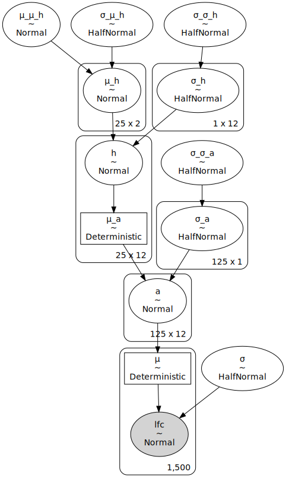

## Visualization of the mock data

```python
mock_data.head()
```

<div>
<style scoped>
    .dataframe tbody tr th:only-of-type {
        vertical-align: middle;
    }

    .dataframe tbody tr th {
        vertical-align: top;
    }

    .dataframe thead th {
        text-align: right;
    }
</style>
<table border="1" class="dataframe">
  <thead>
    <tr style="text-align: right;">
      <th></th>
      <th>depmap_id</th>
      <th>hugo_symbol</th>
      <th>lineage</th>
      <th>p_dna_batch</th>
      <th>screen</th>
      <th>sgrna_target_chr</th>
      <th>sgrna</th>
      <th>copy_number</th>
      <th>rna_expr</th>
      <th>is_mutated</th>
      <th>lfc</th>
      <th>copy_number_cellline</th>
      <th>copy_number_gene</th>
      <th>rna_expr_gene_lineage</th>
      <th>copy_number_cellline</th>
      <th>copy_number_gene</th>
    </tr>
  </thead>
  <tbody>
    <tr>
      <th>0</th>
      <td>cellline0</td>
      <td>gene0</td>
      <td>lineage0</td>
      <td>batch0</td>
      <td>screen0</td>
      <td>Chr1</td>
      <td>gene0_sgrna0</td>
      <td>1.113329</td>
      <td>14.925597</td>
      <td>0</td>
      <td>3.742756</td>
      <td>0.08258</td>
      <td>0.134077</td>
      <td>1.026061</td>
      <td>0.08258</td>
      <td>0.134077</td>
    </tr>
    <tr>
      <th>1</th>
      <td>cellline0</td>
      <td>gene0</td>
      <td>lineage0</td>
      <td>batch0</td>
      <td>screen0</td>
      <td>Chr1</td>
      <td>gene0_sgrna1</td>
      <td>1.113329</td>
      <td>14.925597</td>
      <td>0</td>
      <td>2.449826</td>
      <td>0.08258</td>
      <td>0.134077</td>
      <td>1.026061</td>
      <td>0.08258</td>
      <td>0.134077</td>
    </tr>
    <tr>
      <th>2</th>
      <td>cellline0</td>
      <td>gene0</td>
      <td>lineage0</td>
      <td>batch0</td>
      <td>screen0</td>
      <td>Chr1</td>
      <td>gene0_sgrna2</td>
      <td>1.113329</td>
      <td>14.925597</td>
      <td>0</td>
      <td>1.885977</td>
      <td>0.08258</td>
      <td>0.134077</td>
      <td>1.026061</td>
      <td>0.08258</td>
      <td>0.134077</td>
    </tr>
    <tr>
      <th>3</th>
      <td>cellline0</td>
      <td>gene0</td>
      <td>lineage0</td>
      <td>batch0</td>
      <td>screen0</td>
      <td>Chr1</td>
      <td>gene0_sgrna3</td>
      <td>1.113329</td>
      <td>14.925597</td>
      <td>0</td>
      <td>2.421580</td>
      <td>0.08258</td>
      <td>0.134077</td>
      <td>1.026061</td>
      <td>0.08258</td>
      <td>0.134077</td>
    </tr>
    <tr>
      <th>4</th>
      <td>cellline0</td>
      <td>gene0</td>
      <td>lineage0</td>
      <td>batch0</td>
      <td>screen0</td>
      <td>Chr1</td>
      <td>gene0_sgrna4</td>
      <td>1.113329</td>
      <td>14.925597</td>
      <td>0</td>
      <td>3.818174</td>
      <td>0.08258</td>
      <td>0.134077</td>
      <td>1.026061</td>
      <td>0.08258</td>
      <td>0.134077</td>
    </tr>
  </tbody>
</table>
</div>

```python
for x in ["hugo_symbol", "depmap_id"]:
    pos = gg.position_jitterdodge(jitter_width=0.5, jitter_height=0, random_state=0)
    (
        gg.ggplot(mock_data, gg.aes(x=x, y="lfc"))
        + gg.geom_jitter(gg.aes(color="lineage"), alpha=0.5, size=0.7, position=pos)
        + gg.geom_boxplot(gg.aes(color="lineage"), outlier_alpha=0, alpha=0.1)
        + gg.scale_color_brewer(type="qual", palette="Set1")
        + gg.theme(axis_text_x=gg.element_text(size=7), figure_size=(10, 3))
    ).draw()
```

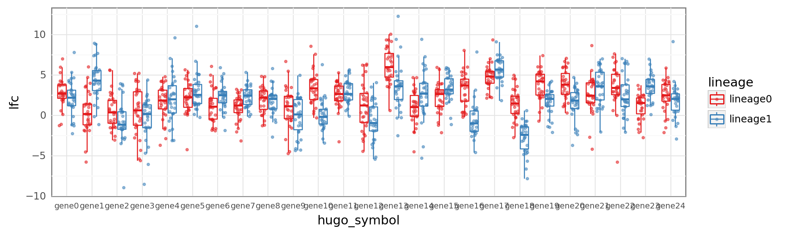

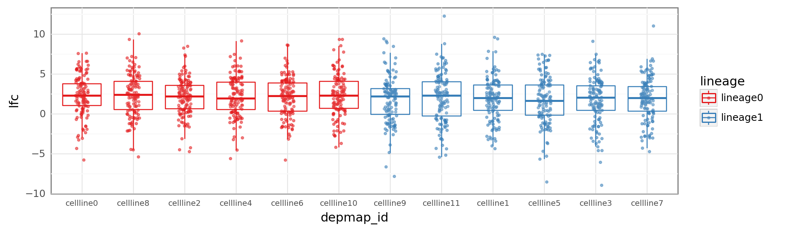

## Model priors

```python
with sp7.model:
    prior_dist = pm.sample_prior_predictive(random_seed=RANDOM_SEED)
```

```python
pmanal.plot_all_priors(prior_dist, (4, 3), (8, 8), rm_var_regex="log__|logodds_|offset");
```

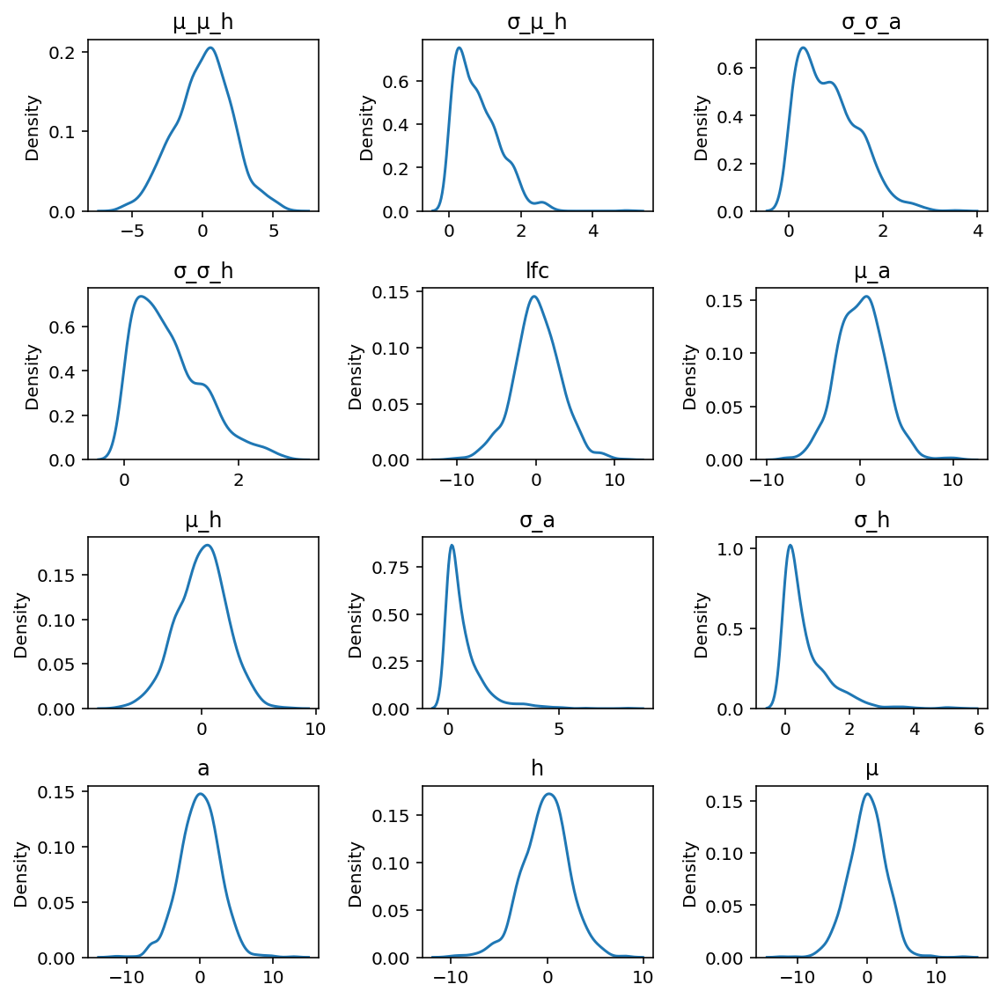

## Model posterior estimates

```python
sp7_mcmc = sp7_sbc_res.inference_obj
```

```python
top_h_var_names = ["μ_μ_h", "σ_μ_h"]
az.plot_trace(sp7_mcmc, var_names=top_h_var_names, compact=False);
```

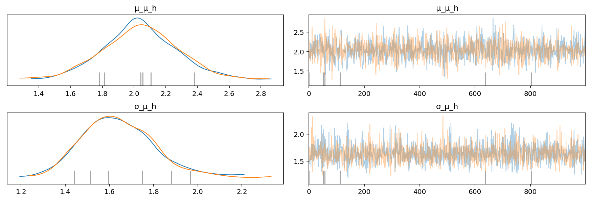

```python
az.summary(sp7_mcmc, var_names=top_h_var_names, hdi_prob=PYMC3.HDI_PROB).assign(
    real_value=np.array([sp7_sbc_res.priors[v] for v in top_h_var_names])
)
```

<div>
<style scoped>
    .dataframe tbody tr th:only-of-type {
        vertical-align: middle;
    }

    .dataframe tbody tr th {
        vertical-align: top;
    }

    .dataframe thead th {
        text-align: right;
    }
</style>
<table border="1" class="dataframe">
  <thead>
    <tr style="text-align: right;">
      <th></th>
      <th>mean</th>
      <th>sd</th>
      <th>hdi_5.5%</th>
      <th>hdi_94.5%</th>
      <th>mcse_mean</th>
      <th>mcse_sd</th>
      <th>ess_bulk</th>
      <th>ess_tail</th>
      <th>r_hat</th>
      <th>real_value</th>
    </tr>
  </thead>
  <tbody>
    <tr>
      <th>μ_μ_h</th>
      <td>2.039</td>
      <td>0.232</td>
      <td>1.675</td>
      <td>2.421</td>
      <td>0.006</td>
      <td>0.004</td>
      <td>1773.0</td>
      <td>1152.0</td>
      <td>1.0</td>
      <td>1.760227</td>
    </tr>
    <tr>
      <th>σ_μ_h</th>
      <td>1.641</td>
      <td>0.164</td>
      <td>1.382</td>
      <td>1.886</td>
      <td>0.004</td>
      <td>0.003</td>
      <td>1882.0</td>
      <td>1104.0</td>
      <td>1.0</td>
      <td>1.867117</td>
    </tr>
  </tbody>
</table>
</div>

```python
cell_lines = mock_data["depmap_id"].cat.categories.values
genes = mock_data["hugo_symbol"].cat.categories.values
```

```python
gene_lineage_priors = pd.DataFrame(
    {
        "prior_effect": sp7_sbc_res.priors["μ_a"].squeeze().flatten(),
        "hugo_symbol": np.repeat(genes, len(cell_lines)),
        "depmap_id": np.tile(cell_lines, len(genes)),
    }
).merge(
    mock_data[["depmap_id", "lineage"]].drop_duplicates().reset_index(drop=True),
    on="depmap_id",
)
```

```python
pos = gg.position_jitterdodge(jitter_height=0, jitter_width=0.5, random_state=0)
(
    gg.ggplot(mock_data, gg.aes(x="hugo_symbol", y="lfc"))
    + gg.geom_boxplot(outlier_alpha=0)
    + gg.geom_jitter(gg.aes(color="lineage"), alpha=0.2, size=0.7, position=pos)
    + gg.geom_jitter(
        gg.aes(x="hugo_symbol", y="prior_effect", color="lineage"),
        data=gene_lineage_priors,
        shape="^",
        position=pos,
    )
    + gg.scale_color_brewer(type="qual", palette="Set1")
    + gg.theme(axis_text_x=gg.element_text(angle=90), figure_size=(10, 3))
)
```

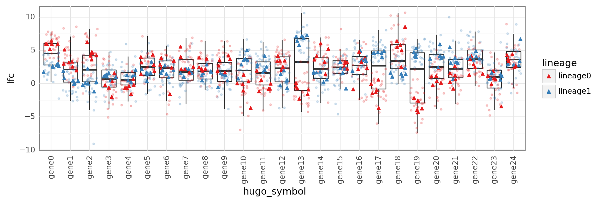

    <ggplot: (8734092754815)>

```python
known_values = sp7_sbc_res.priors["σ_h"].flatten().tolist()

axes = az.plot_trace(sp7_mcmc, "σ_h", compact=False)
for ax, known_val in zip(axes[:, 0], known_values):
    ax.axvline(x=known_val, color="k", linestyle="--")
plt.show()
```

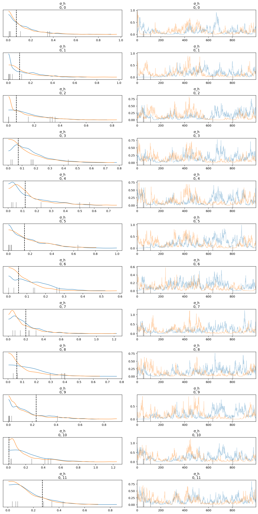

```python
az.summary(sp7_mcmc, var_names=["σ_h"]).assign(
    real_values=sp7_sbc_res.priors["σ_h"].flatten()
)
```

<div>
<style scoped>
    .dataframe tbody tr th:only-of-type {
        vertical-align: middle;
    }

    .dataframe tbody tr th {
        vertical-align: top;
    }

    .dataframe thead th {
        text-align: right;
    }
</style>
<table border="1" class="dataframe">
  <thead>
    <tr style="text-align: right;">
      <th></th>
      <th>mean</th>
      <th>sd</th>
      <th>hdi_3%</th>
      <th>hdi_97%</th>
      <th>mcse_mean</th>
      <th>mcse_sd</th>
      <th>ess_bulk</th>
      <th>ess_tail</th>
      <th>r_hat</th>
      <th>real_values</th>
    </tr>
  </thead>
  <tbody>
    <tr>
      <th>σ_h[0,0]</th>
      <td>0.138</td>
      <td>0.140</td>
      <td>0.002</td>
      <td>0.395</td>
      <td>0.020</td>
      <td>0.014</td>
      <td>35.0</td>
      <td>85.0</td>
      <td>1.02</td>
      <td>0.071619</td>
    </tr>
    <tr>
      <th>σ_h[0,1]</th>
      <td>0.149</td>
      <td>0.147</td>
      <td>0.001</td>
      <td>0.419</td>
      <td>0.034</td>
      <td>0.024</td>
      <td>10.0</td>
      <td>12.0</td>
      <td>1.15</td>
      <td>0.101389</td>
    </tr>
    <tr>
      <th>σ_h[0,2]</th>
      <td>0.146</td>
      <td>0.131</td>
      <td>0.002</td>
      <td>0.395</td>
      <td>0.040</td>
      <td>0.029</td>
      <td>8.0</td>
      <td>39.0</td>
      <td>1.20</td>
      <td>0.060964</td>
    </tr>
    <tr>
      <th>σ_h[0,3]</th>
      <td>0.148</td>
      <td>0.126</td>
      <td>0.002</td>
      <td>0.388</td>
      <td>0.028</td>
      <td>0.020</td>
      <td>12.0</td>
      <td>74.0</td>
      <td>1.15</td>
      <td>0.072233</td>
    </tr>
    <tr>
      <th>σ_h[0,4]</th>
      <td>0.149</td>
      <td>0.136</td>
      <td>0.003</td>
      <td>0.415</td>
      <td>0.021</td>
      <td>0.015</td>
      <td>42.0</td>
      <td>132.0</td>
      <td>1.05</td>
      <td>0.118477</td>
    </tr>
    <tr>
      <th>σ_h[0,5]</th>
      <td>0.196</td>
      <td>0.172</td>
      <td>0.001</td>
      <td>0.519</td>
      <td>0.048</td>
      <td>0.035</td>
      <td>10.0</td>
      <td>42.0</td>
      <td>1.15</td>
      <td>0.148154</td>
    </tr>
    <tr>
      <th>σ_h[0,6]</th>
      <td>0.106</td>
      <td>0.088</td>
      <td>0.001</td>
      <td>0.261</td>
      <td>0.016</td>
      <td>0.011</td>
      <td>28.0</td>
      <td>54.0</td>
      <td>1.08</td>
      <td>0.054469</td>
    </tr>
    <tr>
      <th>σ_h[0,7]</th>
      <td>0.180</td>
      <td>0.165</td>
      <td>0.003</td>
      <td>0.479</td>
      <td>0.027</td>
      <td>0.019</td>
      <td>18.0</td>
      <td>90.0</td>
      <td>1.11</td>
      <td>0.199104</td>
    </tr>
    <tr>
      <th>σ_h[0,8]</th>
      <td>0.135</td>
      <td>0.120</td>
      <td>0.003</td>
      <td>0.363</td>
      <td>0.026</td>
      <td>0.019</td>
      <td>18.0</td>
      <td>96.0</td>
      <td>1.10</td>
      <td>0.061263</td>
    </tr>
    <tr>
      <th>σ_h[0,9]</th>
      <td>0.160</td>
      <td>0.153</td>
      <td>0.002</td>
      <td>0.458</td>
      <td>0.024</td>
      <td>0.017</td>
      <td>20.0</td>
      <td>42.0</td>
      <td>1.11</td>
      <td>0.231970</td>
    </tr>
    <tr>
      <th>σ_h[0,10]</th>
      <td>0.212</td>
      <td>0.188</td>
      <td>0.004</td>
      <td>0.568</td>
      <td>0.034</td>
      <td>0.025</td>
      <td>25.0</td>
      <td>93.0</td>
      <td>1.10</td>
      <td>0.006446</td>
    </tr>
    <tr>
      <th>σ_h[0,11]</th>
      <td>0.159</td>
      <td>0.127</td>
      <td>0.007</td>
      <td>0.396</td>
      <td>0.018</td>
      <td>0.013</td>
      <td>34.0</td>
      <td>142.0</td>
      <td>1.05</td>
      <td>0.269312</td>
    </tr>
  </tbody>
</table>
</div>

```python
mu_a_posterior = (
    az.summary(sp7_mcmc, var_names=["μ_a"], hdi_prob=PYMC3.HDI_PROB)
    .reset_index(drop=False)
    .rename(columns={"index": "parameter"})
    .pipe(
        pmanal.extract_matrix_variable_indices,
        col="parameter",
        idx1=genes,
        idx2=cell_lines,
        idx1name="hugo_symbol",
        idx2name="depmap_id",
    )
    .assign(real_values=sp7_sbc_res.priors["μ_a"].flatten())
)

mu_a_posterior.head()
```

<div>
<style scoped>
    .dataframe tbody tr th:only-of-type {
        vertical-align: middle;
    }

    .dataframe tbody tr th {
        vertical-align: top;
    }

    .dataframe thead th {
        text-align: right;
    }
</style>
<table border="1" class="dataframe">
  <thead>
    <tr style="text-align: right;">
      <th></th>
      <th>parameter</th>
      <th>mean</th>
      <th>sd</th>
      <th>hdi_5.5%</th>
      <th>hdi_94.5%</th>
      <th>mcse_mean</th>
      <th>mcse_sd</th>
      <th>ess_bulk</th>
      <th>ess_tail</th>
      <th>r_hat</th>
      <th>hugo_symbol</th>
      <th>depmap_id</th>
      <th>real_values</th>
    </tr>
  </thead>
  <tbody>
    <tr>
      <th>0</th>
      <td>μ_a[0,0]</td>
      <td>2.885</td>
      <td>0.370</td>
      <td>2.286</td>
      <td>3.435</td>
      <td>0.018</td>
      <td>0.013</td>
      <td>439.0</td>
      <td>730.0</td>
      <td>1.02</td>
      <td>gene0</td>
      <td>cellline0</td>
      <td>2.611423</td>
    </tr>
    <tr>
      <th>1</th>
      <td>μ_a[0,1]</td>
      <td>2.867</td>
      <td>0.371</td>
      <td>2.265</td>
      <td>3.423</td>
      <td>0.018</td>
      <td>0.013</td>
      <td>413.0</td>
      <td>634.0</td>
      <td>1.01</td>
      <td>gene0</td>
      <td>cellline8</td>
      <td>2.512419</td>
    </tr>
    <tr>
      <th>2</th>
      <td>μ_a[0,2]</td>
      <td>2.823</td>
      <td>0.383</td>
      <td>2.248</td>
      <td>3.439</td>
      <td>0.018</td>
      <td>0.013</td>
      <td>450.0</td>
      <td>884.0</td>
      <td>1.01</td>
      <td>gene0</td>
      <td>cellline2</td>
      <td>2.551952</td>
    </tr>
    <tr>
      <th>3</th>
      <td>μ_a[0,3]</td>
      <td>2.905</td>
      <td>0.372</td>
      <td>2.312</td>
      <td>3.481</td>
      <td>0.019</td>
      <td>0.013</td>
      <td>395.0</td>
      <td>664.0</td>
      <td>1.02</td>
      <td>gene0</td>
      <td>cellline4</td>
      <td>2.606226</td>
    </tr>
    <tr>
      <th>4</th>
      <td>μ_a[0,4]</td>
      <td>2.933</td>
      <td>0.381</td>
      <td>2.325</td>
      <td>3.511</td>
      <td>0.025</td>
      <td>0.018</td>
      <td>214.0</td>
      <td>694.0</td>
      <td>1.02</td>
      <td>gene0</td>
      <td>cellline6</td>
      <td>2.657033</td>
    </tr>
  </tbody>
</table>
</div>

```python
(
    gg.ggplot(mu_a_posterior, gg.aes(x="real_values", y="mean"))
    + gg.geom_linerange(gg.aes(ymin="hdi_5.5%", ymax="hdi_94.5%"), alpha=0.3)
    + gg.geom_point(alpha=0.5, size=0.5)
    + gg.geom_abline(slope=1, intercept=0, linetype="--", color=SeabornColor.ORANGE)
    + gg.labs(x="real values", y="posterior estimates", title=r"$\mu_a$")
)
```

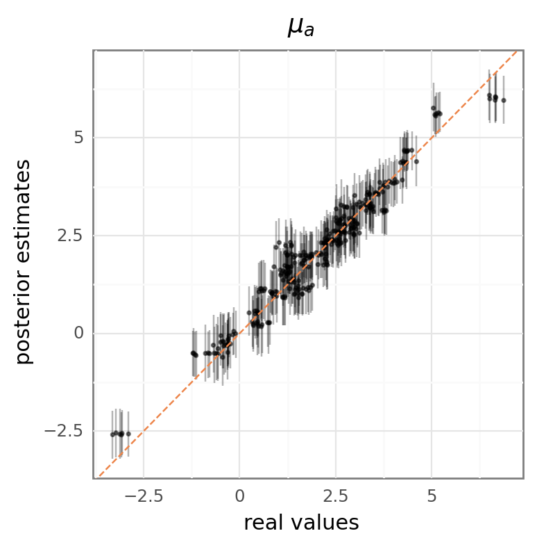

    <ggplot: (8734092558797)>

## Posterior predictions

```python
az.plot_ppc(sp7_mcmc, num_pp_samples=50);
```

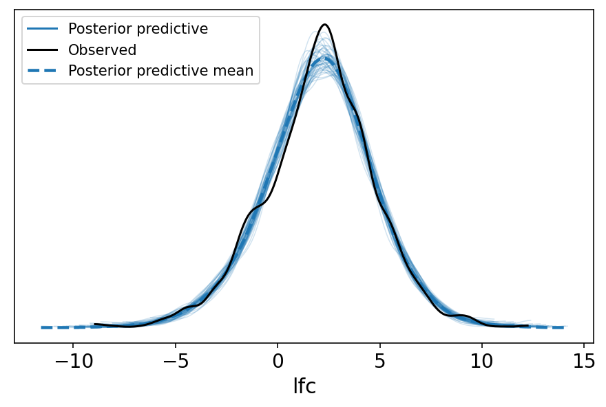

```python
sp7_ppc_values = sp7_mcmc.posterior_predictive["lfc"].values.squeeze()
sp7_ppc_hdi = az.hdi(sp7_ppc_values, hdi_prob=PYMC3.HDI_PROB)
sp7_ppc = pd.DataFrame(
    {
        "ppc_mean": sp7_ppc_values.mean(axis=0),
        "ppc_hdi_low": sp7_ppc_hdi[:, 0],
        "ppc_hdi_high": sp7_ppc_hdi[:, 1],
    }
)

sp7_ppc.head()
```

    /home/jc604/.conda/envs/speclet/lib/python3.9/site-packages/arviz/stats/stats.py:456: FutureWarning: hdi currently interprets 2d data as (draw, shape) but this will change in a future release to (chain, draw) for coherence with other functions

<div>
<style scoped>
    .dataframe tbody tr th:only-of-type {
        vertical-align: middle;
    }

    .dataframe tbody tr th {
        vertical-align: top;
    }

    .dataframe thead th {
        text-align: right;
    }
</style>
<table border="1" class="dataframe">
  <thead>
    <tr style="text-align: right;">
      <th></th>
      <th>ppc_mean</th>
      <th>ppc_hdi_low</th>
      <th>ppc_hdi_high</th>
    </tr>
  </thead>
  <tbody>
    <tr>
      <th>0</th>
      <td>3.560233</td>
      <td>0.435702</td>
      <td>6.157327</td>
    </tr>
    <tr>
      <th>1</th>
      <td>2.774793</td>
      <td>0.823464</td>
      <td>5.737690</td>
    </tr>
    <tr>
      <th>2</th>
      <td>2.583236</td>
      <td>0.123725</td>
      <td>5.369765</td>
    </tr>
    <tr>
      <th>3</th>
      <td>2.643578</td>
      <td>0.209331</td>
      <td>5.372292</td>
    </tr>
    <tr>
      <th>4</th>
      <td>3.171630</td>
      <td>0.344396</td>
      <td>5.596420</td>
    </tr>
  </tbody>
</table>
</div>

```python
mock_data_ppc = mock_data.merge(sp7_ppc, left_index=True, right_index=True)

(
    gg.ggplot(mock_data_ppc, gg.aes(x="lfc", y="ppc_mean"))
    + gg.geom_point(alpha=0.5)
    + gg.geom_abline(slope=1, intercept=0, linetype="--", color=SeabornColor.ORANGE)
)
```

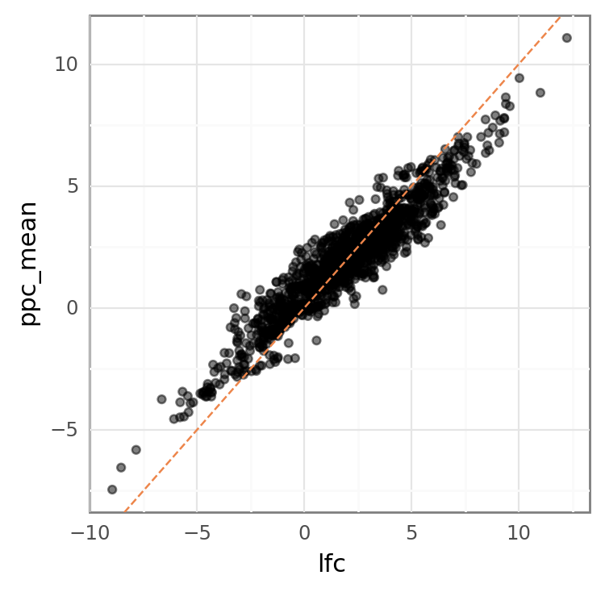

    <ggplot: (8734092711789)>

## Sp7 with all covariates

```python
sp7_config = SpecletSevenConfiguration(
    cell_line_cna_cov=True,
    gene_cna_cov=True,
    rna_cov=True,
    mutation_cov=True,
    batch_cov=True,
)

sp7_covs = SpecletSeven("sp7-expt-covs", debug=True, config=sp7_config)
```

```python
if True:
    sp7_covs._reset_model_and_results()
    sp7_covs.cache_manager.clear_mcmc_cache()
    sp7_covs.cache_manager.clear_advi_cache()
```

<pre style="white-space:pre;overflow-x:auto;line-height:normal;font-family:Menlo,'DejaVu Sans Mono',consolas,'Courier New',monospace"><span style="color: #7fbfbf; text-decoration-color: #7fbfbf">[07/14/21 14:04:27] </span><span style="color: #800000; text-decoration-color: #800000">WARNING </span> Reseting all model and results.             <a href="file:///n/data1/hms/dbmi/park/Cook/speclet/src/models/speclet_model.py"><span style="color: #7f7f7f; text-decoration-color: #7f7f7f">speclet_model.py</span></a><span style="color: #7f7f7f; text-decoration-color: #7f7f7f">:144</span>
</pre>

```python
sp7_covs_sbc_dir = sp7_covs.cache_manager.cache_dir / "sbc"

if not sp7_covs_sbc_dir.exists():
    sp7_covs_sbc_dir.mkdir()


mock_data_covs: pd.DataFrame
sp7_covs_sbc_res: sbc.SBCResults
sp7_covs_sbc_fm: sbc.SBCFileManager

try:
    print("Trying to retrieve SBC data and results.")
    mock_data_covs, sp7_covs_sbc_res, sp7_covs_sbc_fm = sp7_covs.get_sbc(
        sp7_covs_sbc_dir
    )
    print("Successfully retrieved SBC results from cache.")
except CacheDoesNotExistError:
    print("Unable to retrieve SBC results from cache --> running SBC")
    sp7_covs.run_simulation_based_calibration(
        results_path=sp7_covs_sbc_dir,
        fit_method=ModelFitMethod.MCMC,
        random_seed=RANDOM_SEED,
        size=MockDataSize.MEDIUM,
        fit_kwargs={
            "draws": 1000,
            "tune": 4000,
            "chains": 2,
            "cores": 2,
            "prior_pred_samples": 1000,
            "post_pred_samples": 1000,
            "target_accept": 0.95,
        },
    )
    mock_data_covs = sp7_covs.data_manager.get_data()
    sp7_covs_sbc_fm = sbc.SBCFileManager(sp7_covs_sbc_dir)
    sp7_covs_sbc_res = sp7_covs_sbc_fm.get_sbc_results()
except Exception as err:
    print("Unexpected error.")
    print(err)
```

    Trying to retrieve SBC data and results.

<pre style="white-space:pre;overflow-x:auto;line-height:normal;font-family:Menlo,'DejaVu Sans Mono',consolas,'Courier New',monospace"><span style="color: #7fbfbf; text-decoration-color: #7fbfbf">[07/14/21 14:04:28] </span><span style="color: #800000; text-decoration-color: #800000">WARNING </span> Dropping <span style="color: #008080; text-decoration-color: #008080; font-weight: bold">0</span> sgRNA that map to multiple <a href="file:///n/data1/hms/dbmi/park/Cook/speclet/src/managers/model_data_managers.py"><span style="color: #7f7f7f; text-decoration-color: #7f7f7f">model_data_managers.py</span></a><span style="color: #7f7f7f; text-decoration-color: #7f7f7f">:250</span>
                             genes.
</pre>

<pre style="white-space:pre;overflow-x:auto;line-height:normal;font-family:Menlo,'DejaVu Sans Mono',consolas,'Courier New',monospace"><span style="color: #7fbfbf; text-decoration-color: #7fbfbf">                    </span><span style="color: #800000; text-decoration-color: #800000">WARNING </span> Dropping <span style="color: #008080; text-decoration-color: #008080; font-weight: bold">0</span> data points with missing   <a href="file:///n/data1/hms/dbmi/park/Cook/speclet/src/managers/model_data_managers.py"><span style="color: #7f7f7f; text-decoration-color: #7f7f7f">model_data_managers.py</span></a><span style="color: #7f7f7f; text-decoration-color: #7f7f7f">:260</span>
                             copy number.
</pre>

    Successfully retrieved SBC results from cache.

```python
pm.model_to_graphviz(sp7_covs.model)
```

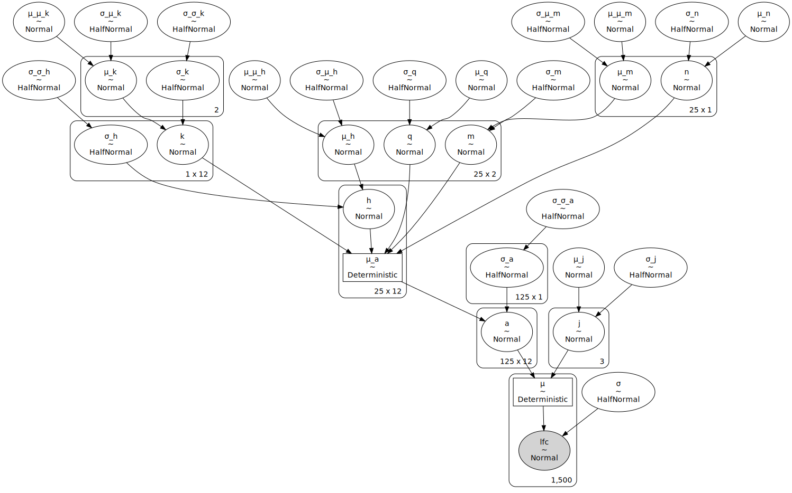

```python
with sp7_covs.model:
    prior_dist = pm.sample_prior_predictive(random_seed=RANDOM_SEED)
```

```python
fig, axes = pmanal.plot_all_priors(
    prior_dist, (7, 5), (12, 8), rm_var_regex="log__|logodds_|offset"
)
for ax in axes.flatten():
    ax.set(yticklabels=[])
    ax.set(ylabel=None)
    ax.tick_params(left=False)
fig.tight_layout()
plt.show()
```

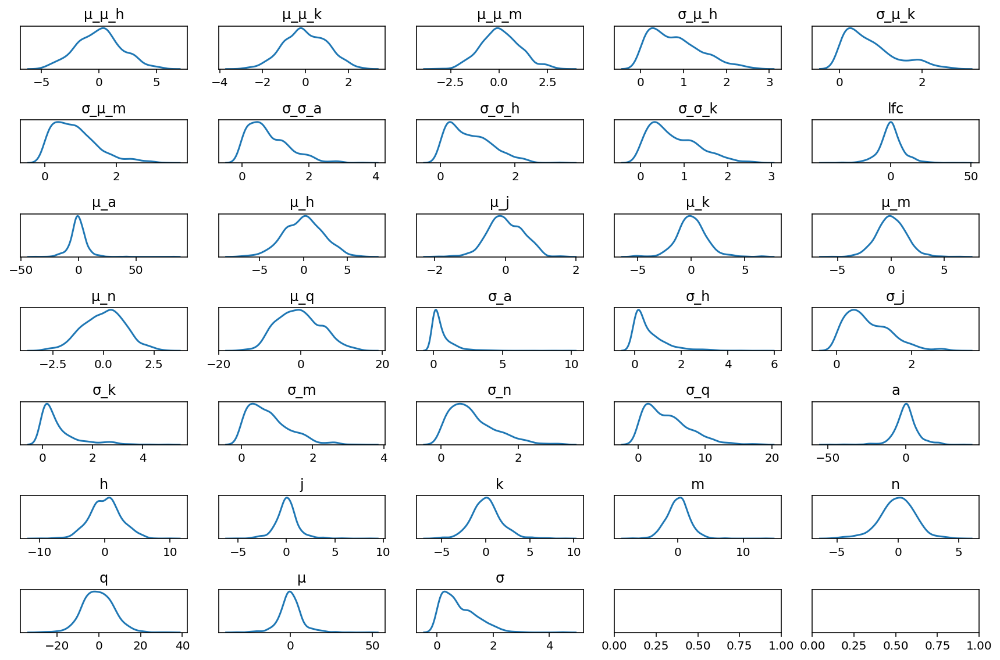

```python
sp7_covs_mock_data_cellline_info = (
    mock_data_covs.drop(columns=["sgrna_target_chr", "sgrna", "lfc"])
    .drop_duplicates()
    .reset_index(drop=True)
)
sp7_covs_mock_data_cellline_info.head()
```

<div>
<style scoped>
    .dataframe tbody tr th:only-of-type {
        vertical-align: middle;
    }

    .dataframe tbody tr th {
        vertical-align: top;
    }

    .dataframe thead th {
        text-align: right;
    }
</style>
<table border="1" class="dataframe">
  <thead>
    <tr style="text-align: right;">
      <th></th>
      <th>depmap_id</th>
      <th>hugo_symbol</th>
      <th>lineage</th>
      <th>p_dna_batch</th>
      <th>screen</th>
      <th>copy_number</th>
      <th>rna_expr</th>
      <th>is_mutated</th>
      <th>copy_number_cellline</th>
      <th>copy_number_gene</th>
      <th>rna_expr_gene_lineage</th>
      <th>copy_number_cellline</th>
      <th>copy_number_gene</th>
    </tr>
  </thead>
  <tbody>
    <tr>
      <th>0</th>
      <td>cellline0</td>
      <td>gene0</td>
      <td>lineage0</td>
      <td>batch0</td>
      <td>screen0</td>
      <td>1.113329</td>
      <td>14.925597</td>
      <td>0</td>
      <td>0.082580</td>
      <td>0.134077</td>
      <td>1.026061</td>
      <td>0.082580</td>
      <td>0.134077</td>
    </tr>
    <tr>
      <th>1</th>
      <td>cellline8</td>
      <td>gene0</td>
      <td>lineage0</td>
      <td>batch0</td>
      <td>screen0</td>
      <td>0.845558</td>
      <td>14.305343</td>
      <td>0</td>
      <td>-0.159825</td>
      <td>-0.133694</td>
      <td>-1.062249</td>
      <td>-0.159825</td>
      <td>-0.133694</td>
    </tr>
    <tr>
      <th>2</th>
      <td>cellline2</td>
      <td>gene0</td>
      <td>lineage0</td>
      <td>batch2</td>
      <td>screen0</td>
      <td>1.075695</td>
      <td>14.883380</td>
      <td>0</td>
      <td>0.127801</td>
      <td>0.096443</td>
      <td>0.886523</td>
      <td>0.127801</td>
      <td>0.096443</td>
    </tr>
    <tr>
      <th>3</th>
      <td>cellline4</td>
      <td>gene0</td>
      <td>lineage0</td>
      <td>batch2</td>
      <td>screen0</td>
      <td>1.056961</td>
      <td>14.903415</td>
      <td>0</td>
      <td>0.002152</td>
      <td>0.077709</td>
      <td>0.952789</td>
      <td>0.002152</td>
      <td>0.077709</td>
    </tr>
    <tr>
      <th>4</th>
      <td>cellline6</td>
      <td>gene0</td>
      <td>lineage0</td>
      <td>batch1</td>
      <td>screen1</td>
      <td>0.664194</td>
      <td>14.206946</td>
      <td>0</td>
      <td>-0.357433</td>
      <td>-0.315057</td>
      <td>-1.401296</td>
      <td>-0.357433</td>
      <td>-0.315057</td>
    </tr>
  </tbody>
</table>
</div>

```python
(
    gg.ggplot(sp7_covs_mock_data_cellline_info, gg.aes(x="hugo_symbol", y="rna_expr"))
    + gg.geom_boxplot(gg.aes(color="lineage", fill="lineage"), alpha=0.2)
    + gg.scale_color_hue()
    + gg.scale_fill_hue()
    + gg.theme(axis_text_x=gg.element_text(size=7, angle=30), figure_size=(9, 3))
    + gg.labs(x="gene", y="RNA expression")
)
```

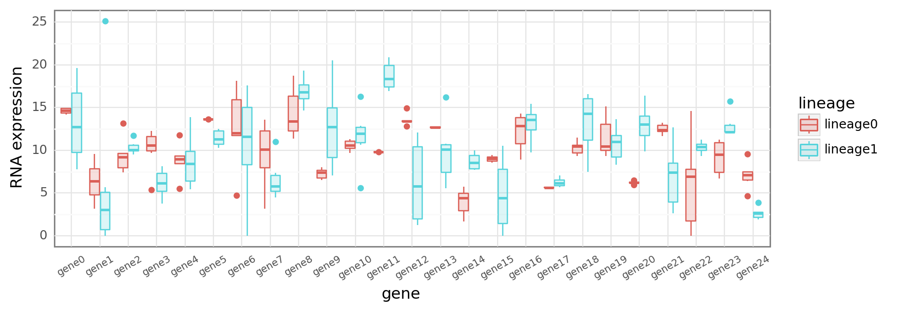

    <ggplot: (8734086019106)>

```python
(
    gg.ggplot(
        sp7_covs_mock_data_cellline_info, gg.aes(x="hugo_symbol", y="copy_number")
    )
    + gg.geom_point(
        gg.aes(color="lineage"),
        alpha=0.8,
        size=1,
        position=gg.position_jitterdodge(
            jitter_width=0.2, jitter_height=0, dodge_width=0.6, random_state=0
        ),
    )
    + gg.scale_color_hue()
    + gg.theme(axis_text_x=gg.element_text(size=7, angle=30), figure_size=(9, 3))
    + gg.labs(x="gene", y="RNA expression")
)
```

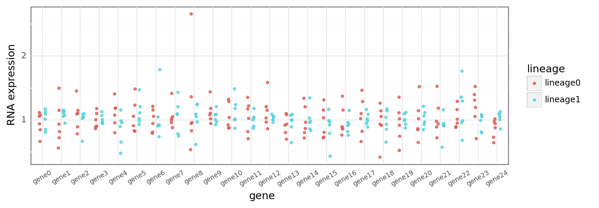

    <ggplot: (8734085380699)>

```python
sp7_covs_mcmc = sp7_covs_sbc_res.inference_obj
```

```python
az.summary(sp7_covs_mcmc, var_names="k", hdi_prob=PYMC3.HDI_PROB).assign(
    real_values=sp7_covs_sbc_res.priors["k"].flatten()
)
```

<div>
<style scoped>
    .dataframe tbody tr th:only-of-type {
        vertical-align: middle;
    }

    .dataframe tbody tr th {
        vertical-align: top;
    }

    .dataframe thead th {
        text-align: right;
    }
</style>
<table border="1" class="dataframe">
  <thead>
    <tr style="text-align: right;">
      <th></th>
      <th>mean</th>
      <th>sd</th>
      <th>hdi_5.5%</th>
      <th>hdi_94.5%</th>
      <th>mcse_mean</th>
      <th>mcse_sd</th>
      <th>ess_bulk</th>
      <th>ess_tail</th>
      <th>r_hat</th>
      <th>real_values</th>
    </tr>
  </thead>
  <tbody>
    <tr>
      <th>k[0,0]</th>
      <td>0.772</td>
      <td>0.779</td>
      <td>-0.499</td>
      <td>1.997</td>
      <td>0.311</td>
      <td>0.231</td>
      <td>6.0</td>
      <td>43.0</td>
      <td>1.29</td>
      <td>2.444940</td>
    </tr>
    <tr>
      <th>k[0,1]</th>
      <td>0.845</td>
      <td>0.713</td>
      <td>-0.282</td>
      <td>1.959</td>
      <td>0.280</td>
      <td>0.208</td>
      <td>7.0</td>
      <td>55.0</td>
      <td>1.27</td>
      <td>2.407721</td>
    </tr>
    <tr>
      <th>k[0,2]</th>
      <td>0.816</td>
      <td>0.725</td>
      <td>-0.263</td>
      <td>2.071</td>
      <td>0.322</td>
      <td>0.242</td>
      <td>5.0</td>
      <td>32.0</td>
      <td>1.33</td>
      <td>2.194218</td>
    </tr>
    <tr>
      <th>k[0,3]</th>
      <td>0.656</td>
      <td>0.807</td>
      <td>-0.764</td>
      <td>1.815</td>
      <td>0.374</td>
      <td>0.283</td>
      <td>5.0</td>
      <td>43.0</td>
      <td>1.35</td>
      <td>2.603053</td>
    </tr>
    <tr>
      <th>k[0,4]</th>
      <td>0.639</td>
      <td>0.941</td>
      <td>-0.842</td>
      <td>2.075</td>
      <td>0.436</td>
      <td>0.330</td>
      <td>5.0</td>
      <td>19.0</td>
      <td>1.38</td>
      <td>2.328180</td>
    </tr>
    <tr>
      <th>k[0,5]</th>
      <td>0.941</td>
      <td>0.701</td>
      <td>-0.134</td>
      <td>2.005</td>
      <td>0.280</td>
      <td>0.208</td>
      <td>6.0</td>
      <td>43.0</td>
      <td>1.26</td>
      <td>2.566870</td>
    </tr>
    <tr>
      <th>k[0,6]</th>
      <td>0.662</td>
      <td>0.816</td>
      <td>-0.589</td>
      <td>2.029</td>
      <td>0.289</td>
      <td>0.212</td>
      <td>8.0</td>
      <td>42.0</td>
      <td>1.20</td>
      <td>2.546067</td>
    </tr>
    <tr>
      <th>k[0,7]</th>
      <td>0.885</td>
      <td>0.835</td>
      <td>-0.645</td>
      <td>2.073</td>
      <td>0.256</td>
      <td>0.186</td>
      <td>10.0</td>
      <td>37.0</td>
      <td>1.15</td>
      <td>2.538456</td>
    </tr>
    <tr>
      <th>k[0,8]</th>
      <td>0.706</td>
      <td>0.861</td>
      <td>-0.734</td>
      <td>2.057</td>
      <td>0.335</td>
      <td>0.248</td>
      <td>7.0</td>
      <td>39.0</td>
      <td>1.24</td>
      <td>2.537547</td>
    </tr>
    <tr>
      <th>k[0,9]</th>
      <td>0.746</td>
      <td>0.840</td>
      <td>-0.539</td>
      <td>2.157</td>
      <td>0.331</td>
      <td>0.245</td>
      <td>6.0</td>
      <td>41.0</td>
      <td>1.24</td>
      <td>2.553933</td>
    </tr>
    <tr>
      <th>k[0,10]</th>
      <td>0.654</td>
      <td>0.883</td>
      <td>-0.708</td>
      <td>2.194</td>
      <td>0.351</td>
      <td>0.260</td>
      <td>6.0</td>
      <td>36.0</td>
      <td>1.25</td>
      <td>2.536929</td>
    </tr>
    <tr>
      <th>k[0,11]</th>
      <td>0.711</td>
      <td>0.834</td>
      <td>-0.611</td>
      <td>2.110</td>
      <td>0.330</td>
      <td>0.245</td>
      <td>6.0</td>
      <td>34.0</td>
      <td>1.26</td>
      <td>2.527300</td>
    </tr>
  </tbody>
</table>
</div>

```python
az.plot_forest(sp7_covs_mcmc, var_names="k", hdi_prob=PYMC3.HDI_PROB);
```

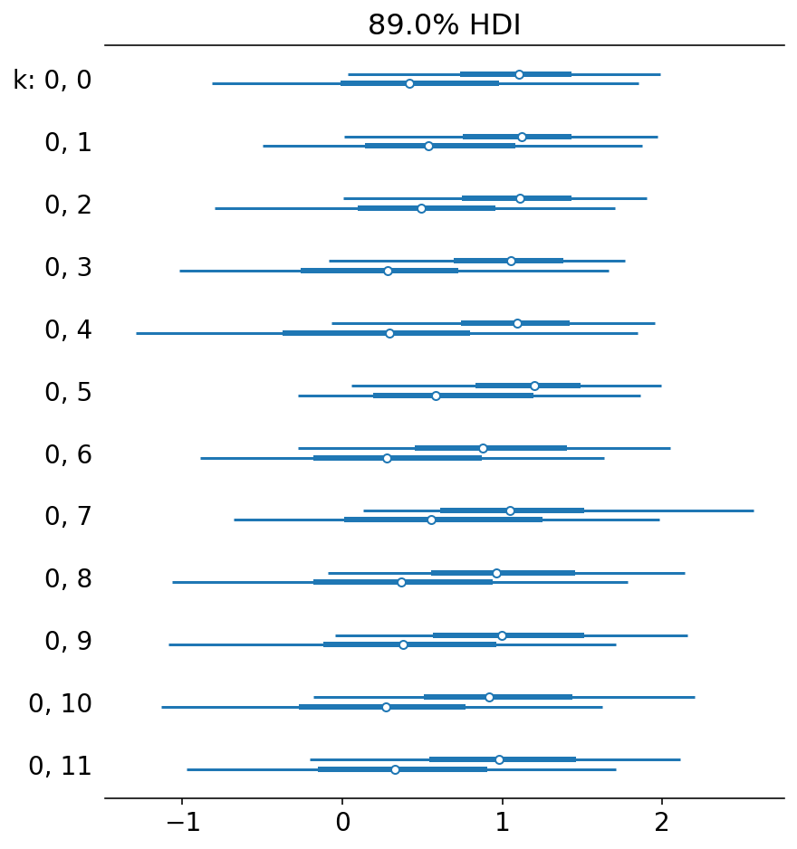

```python
plot_vars = ["μ_μ_k", "μ_k", "σ_k"]
known_values = list(
    chain.from_iterable(
        [sp7_covs_sbc_res.priors[v].flatten().tolist() for v in plot_vars]
    )
)
axes = az.plot_trace(sp7_covs_mcmc, var_names=plot_vars, compact=False)

for ax, v in zip(axes[:, 0], known_values):
    ax.axvline(x=v, color="k", linestyle="--")

plt.show();
```

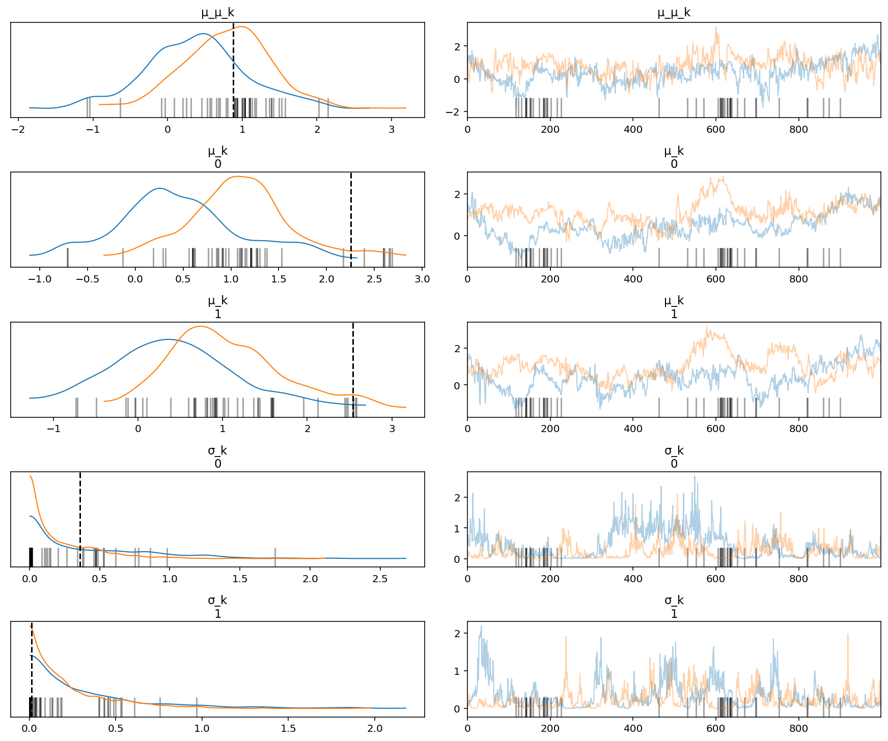

```python
plot_vars = ["μ_q", "σ_q"]
known_values = list(
    chain.from_iterable(
        [sp7_covs_sbc_res.priors[v].flatten().tolist() for v in plot_vars]
    )
)
axes = az.plot_trace(sp7_covs_mcmc, var_names=plot_vars, compact=False)

for ax, v in zip(axes[:, 0], known_values):
    ax.axvline(x=v, color="k", linestyle="--")

plt.show();
```

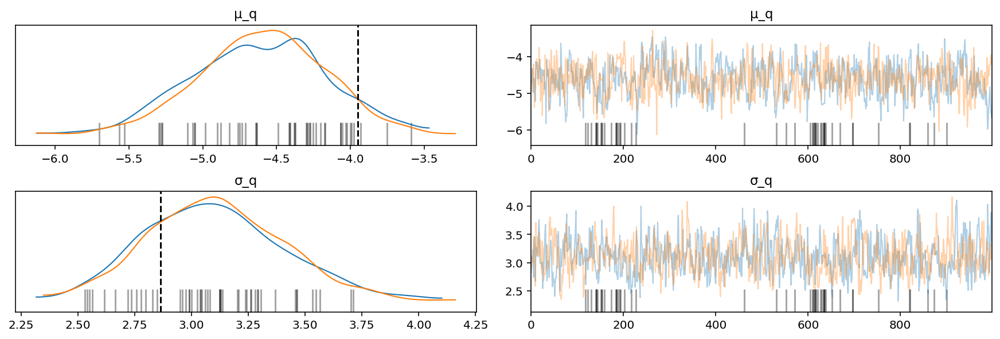

---

```python
notebook_toc = time()
print(f"execution time: {(notebook_toc - notebook_tic) / 60:.2f} minutes")
```

    execution time: 1.84 minutes

```python
%load_ext watermark
%watermark -d -u -v -iv -b -h -m
```

    Last updated: 2021-07-14

    Python implementation: CPython
    Python version       : 3.9.2
    IPython version      : 7.21.0

    Compiler    : GCC 9.3.0
    OS          : Linux
    Release     : 3.10.0-1062.el7.x86_64
    Machine     : x86_64
    Processor   : x86_64
    CPU cores   : 28
    Architecture: 64bit

    Hostname: compute-e-16-229.o2.rc.hms.harvard.edu

    Git branch: fit-models

    pymc3     : 3.11.1
    re        : 2.2.1
    pandas    : 1.2.3
    logging   : 0.5.1.2
    matplotlib: 3.3.4
    numpy     : 1.20.1
    arviz     : 0.11.2
    plotnine  : 0.7.1
    seaborn   : 0.11.1
    theano    : 1.0.5
