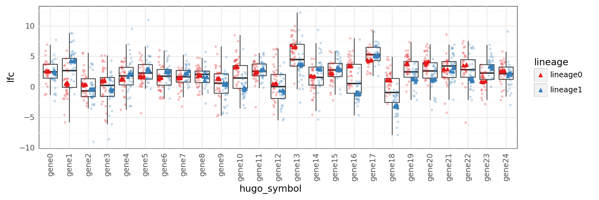

```python
%load_ext autoreload
%autoreload 2
```

```python
import re
import string
import warnings
from pathlib import Path
from time import time

import arviz as az
import matplotlib.colors as mcolors
import matplotlib.pyplot as plt
import numpy as np
import pandas as pd
import plotnine as gg
import pymc3 as pm
import seaborn as sns
from theano import tensor as tt
```

```python
import src.modeling.simulation_based_calibration_helpers as sbc
from src.data_processing import achilles as achelp
from src.data_processing import common as dphelp
from src.io import cache_io
from src.loggers import logger
from src.modeling import pymc3_analysis as pmanal
from src.modeling import pymc3_sampling_api as pmapi
from src.models.speclet_seven import SpecletSeven
from src.plot.color_pal import FitMethodColors, ModelColors, SeabornColor
from src.project_enums import ModelFitMethod
```

```python
notebook_tic = time()

warnings.simplefilter(action="ignore", category=UserWarning)

gg.theme_set(
    gg.theme_bw()
    + gg.theme(
        figure_size=(4, 4),
        axis_ticks_major=gg.element_blank(),
        strip_background=gg.element_blank(),
    )
)
%config InlineBackend.figure_format = "retina"

RANDOM_SEED = 838
np.random.seed(RANDOM_SEED)
HDI_PROB = 0.89
```

```python
sp7 = SpecletSeven("expt", debug=True, noncentered_param=True)
```

```python
sp7.cache_manager.mcmc_cache_exists()
sp7._reset_model_and_results()
sp7.cache_manager.clear_mcmc_cache()
sp7.cache_manager.mcmc_cache_exists()
```

<pre style="white-space:pre;overflow-x:auto;line-height:normal;font-family:Menlo,'DejaVu Sans Mono',consolas,'Courier New',monospace"><span style="color: #7fbfbf; text-decoration-color: #7fbfbf">[06/15/21 09:26:53] </span><span style="color: #000080; text-decoration-color: #000080">INFO    </span> ArvizCacheManager: MCMC cache exists.      <a href="file:///Users/admin/Lab_Projects/speclet/src/managers/cache_managers.py"><span style="color: #7f7f7f; text-decoration-color: #7f7f7f">cache_managers.py</span></a><span style="color: #7f7f7f; text-decoration-color: #7f7f7f">:273</span>
</pre>

<pre style="white-space:pre;overflow-x:auto;line-height:normal;font-family:Menlo,'DejaVu Sans Mono',consolas,'Courier New',monospace"><span style="color: #7fbfbf; text-decoration-color: #7fbfbf">                    </span><span style="color: #800000; text-decoration-color: #800000">WARNING </span> Reseting all model and results.             <a href="file:///Users/admin/Lab_Projects/speclet/src/models/speclet_model.py"><span style="color: #7f7f7f; text-decoration-color: #7f7f7f">speclet_model.py</span></a><span style="color: #7f7f7f; text-decoration-color: #7f7f7f">:132</span>
</pre>

    False

```python
sbc_dir = sp7.cache_manager.cache_dir / "sbc"

sp7.run_simulation_based_calibration(
    results_path=sbc_dir,
    fit_method=ModelFitMethod.mcmc,
    random_seed=RANDOM_SEED,
    size="medium",
    fit_kwargs={
        "mcmc_draws": 1000,
        "tune": 1000,
        "chains": 4,
        "cores": 4,
        "prior_pred_samples": 1000,
        "post_pred_samples": 1000,
    },
)
```

<pre style="white-space:pre;overflow-x:auto;line-height:normal;font-family:Menlo,'DejaVu Sans Mono',consolas,'Courier New',monospace"><span style="color: #7fbfbf; text-decoration-color: #7fbfbf">                    </span><span style="color: #000080; text-decoration-color: #000080">INFO    </span> Generating mock data of size          <a href="file:///Users/admin/Lab_Projects/speclet/src/managers/model_data_managers.py"><span style="color: #7f7f7f; text-decoration-color: #7f7f7f">model_data_managers.py</span></a><span style="color: #7f7f7f; text-decoration-color: #7f7f7f">:305</span>
                             <span style="color: #008000; text-decoration-color: #008000">'medium'</span>.
</pre>

<pre style="white-space:pre;overflow-x:auto;line-height:normal;font-family:Menlo,'DejaVu Sans Mono',consolas,'Courier New',monospace"><span style="color: #7fbfbf; text-decoration-color: #7fbfbf">                    </span><span style="color: #000080; text-decoration-color: #000080">INFO    </span> Applying <span style="color: #008080; text-decoration-color: #008080; font-weight: bold">2</span> data transformations.      <a href="file:///Users/admin/Lab_Projects/speclet/src/managers/model_data_managers.py"><span style="color: #7f7f7f; text-decoration-color: #7f7f7f">model_data_managers.py</span></a><span style="color: #7f7f7f; text-decoration-color: #7f7f7f">:129</span>
</pre>

<pre style="white-space:pre;overflow-x:auto;line-height:normal;font-family:Menlo,'DejaVu Sans Mono',consolas,'Courier New',monospace"><span style="color: #7fbfbf; text-decoration-color: #7fbfbf">                    </span><span style="color: #000080; text-decoration-color: #000080">INFO    </span> Applying transformation: <span style="color: #008000; text-decoration-color: #008000">'_drop_sgrna</span> <a href="file:///Users/admin/Lab_Projects/speclet/src/managers/model_data_managers.py"><span style="color: #7f7f7f; text-decoration-color: #7f7f7f">model_data_managers.py</span></a><span style="color: #7f7f7f; text-decoration-color: #7f7f7f">:116</span>
                             <span style="color: #008000; text-decoration-color: #008000">s_that_map_to_multiple_genes'</span>
</pre>

<pre style="white-space:pre;overflow-x:auto;line-height:normal;font-family:Menlo,'DejaVu Sans Mono',consolas,'Courier New',monospace"><span style="color: #7fbfbf; text-decoration-color: #7fbfbf">[06/15/21 09:26:54] </span><span style="color: #800000; text-decoration-color: #800000">WARNING </span> Dropping <span style="color: #008080; text-decoration-color: #008080; font-weight: bold">0</span> sgRNA that map to multiple <a href="file:///Users/admin/Lab_Projects/speclet/src/managers/model_data_managers.py"><span style="color: #7f7f7f; text-decoration-color: #7f7f7f">model_data_managers.py</span></a><span style="color: #7f7f7f; text-decoration-color: #7f7f7f">:249</span>
                             genes.
</pre>

<pre style="white-space:pre;overflow-x:auto;line-height:normal;font-family:Menlo,'DejaVu Sans Mono',consolas,'Courier New',monospace"><span style="color: #7fbfbf; text-decoration-color: #7fbfbf">                    </span><span style="color: #000080; text-decoration-color: #000080">INFO    </span> Applying transformation:              <a href="file:///Users/admin/Lab_Projects/speclet/src/managers/model_data_managers.py"><span style="color: #7f7f7f; text-decoration-color: #7f7f7f">model_data_managers.py</span></a><span style="color: #7f7f7f; text-decoration-color: #7f7f7f">:116</span>
                             <span style="color: #008000; text-decoration-color: #008000">'_drop_missing_copynumber'</span>
</pre>

<pre style="white-space:pre;overflow-x:auto;line-height:normal;font-family:Menlo,'DejaVu Sans Mono',consolas,'Courier New',monospace"><span style="color: #7fbfbf; text-decoration-color: #7fbfbf">                    </span><span style="color: #800000; text-decoration-color: #800000">WARNING </span> Dropping <span style="color: #008080; text-decoration-color: #008080; font-weight: bold">0</span> data points with missing   <a href="file:///Users/admin/Lab_Projects/speclet/src/managers/model_data_managers.py"><span style="color: #7f7f7f; text-decoration-color: #7f7f7f">model_data_managers.py</span></a><span style="color: #7f7f7f; text-decoration-color: #7f7f7f">:259</span>
                             copy number.
</pre>

<pre style="white-space:pre;overflow-x:auto;line-height:normal;font-family:Menlo,'DejaVu Sans Mono',consolas,'Courier New',monospace"><span style="color: #7fbfbf; text-decoration-color: #7fbfbf">                    </span><span style="color: #000080; text-decoration-color: #000080">INFO    </span> Calling `model_specification<span style="font-weight: bold">()</span>` method.     <a href="file:///Users/admin/Lab_Projects/speclet/src/models/speclet_model.py"><span style="color: #7f7f7f; text-decoration-color: #7f7f7f">speclet_model.py</span></a><span style="color: #7f7f7f; text-decoration-color: #7f7f7f">:172</span>
</pre>

<pre style="white-space:pre;overflow-x:auto;line-height:normal;font-family:Menlo,'DejaVu Sans Mono',consolas,'Courier New',monospace"><span style="color: #7fbfbf; text-decoration-color: #7fbfbf">                    </span><span style="color: #000080; text-decoration-color: #000080">INFO    </span> Beginning PyMC3 model specification.        <a href="file:///Users/admin/Lab_Projects/speclet/src/models/speclet_seven.py"><span style="color: #7f7f7f; text-decoration-color: #7f7f7f">speclet_seven.py</span></a><span style="color: #7f7f7f; text-decoration-color: #7f7f7f">:159</span>
</pre>

<pre style="white-space:pre;overflow-x:auto;line-height:normal;font-family:Menlo,'DejaVu Sans Mono',consolas,'Courier New',monospace"><span style="color: #7fbfbf; text-decoration-color: #7fbfbf">                    </span><span style="color: #000080; text-decoration-color: #000080">INFO    </span> Getting Theano shared variables.            <a href="file:///Users/admin/Lab_Projects/speclet/src/models/speclet_seven.py"><span style="color: #7f7f7f; text-decoration-color: #7f7f7f">speclet_seven.py</span></a><span style="color: #7f7f7f; text-decoration-color: #7f7f7f">:166</span>
</pre>

<pre style="white-space:pre;overflow-x:auto;line-height:normal;font-family:Menlo,'DejaVu Sans Mono',consolas,'Courier New',monospace"><span style="color: #7fbfbf; text-decoration-color: #7fbfbf">                    </span><span style="color: #000080; text-decoration-color: #000080">INFO    </span> Creating PyMC3 model for SpecletSeven.      <a href="file:///Users/admin/Lab_Projects/speclet/src/models/speclet_seven.py"><span style="color: #7f7f7f; text-decoration-color: #7f7f7f">speclet_seven.py</span></a><span style="color: #7f7f7f; text-decoration-color: #7f7f7f">:181</span>
</pre>

<pre style="white-space:pre;overflow-x:auto;line-height:normal;font-family:Menlo,'DejaVu Sans Mono',consolas,'Courier New',monospace"><span style="color: #7fbfbf; text-decoration-color: #7fbfbf">[06/15/21 09:27:13] </span><span style="color: #000080; text-decoration-color: #000080">INFO    </span> Applying <span style="color: #008080; text-decoration-color: #008080; font-weight: bold">2</span> data transformations.      <a href="file:///Users/admin/Lab_Projects/speclet/src/managers/model_data_managers.py"><span style="color: #7f7f7f; text-decoration-color: #7f7f7f">model_data_managers.py</span></a><span style="color: #7f7f7f; text-decoration-color: #7f7f7f">:129</span>
</pre>

<pre style="white-space:pre;overflow-x:auto;line-height:normal;font-family:Menlo,'DejaVu Sans Mono',consolas,'Courier New',monospace"><span style="color: #7fbfbf; text-decoration-color: #7fbfbf">                    </span><span style="color: #000080; text-decoration-color: #000080">INFO    </span> Applying transformation: <span style="color: #008000; text-decoration-color: #008000">'_drop_sgrna</span> <a href="file:///Users/admin/Lab_Projects/speclet/src/managers/model_data_managers.py"><span style="color: #7f7f7f; text-decoration-color: #7f7f7f">model_data_managers.py</span></a><span style="color: #7f7f7f; text-decoration-color: #7f7f7f">:116</span>
                             <span style="color: #008000; text-decoration-color: #008000">s_that_map_to_multiple_genes'</span>
</pre>

<pre style="white-space:pre;overflow-x:auto;line-height:normal;font-family:Menlo,'DejaVu Sans Mono',consolas,'Courier New',monospace"><span style="color: #7fbfbf; text-decoration-color: #7fbfbf">                    </span><span style="color: #800000; text-decoration-color: #800000">WARNING </span> Dropping <span style="color: #008080; text-decoration-color: #008080; font-weight: bold">0</span> sgRNA that map to multiple <a href="file:///Users/admin/Lab_Projects/speclet/src/managers/model_data_managers.py"><span style="color: #7f7f7f; text-decoration-color: #7f7f7f">model_data_managers.py</span></a><span style="color: #7f7f7f; text-decoration-color: #7f7f7f">:249</span>
                             genes.
</pre>

<pre style="white-space:pre;overflow-x:auto;line-height:normal;font-family:Menlo,'DejaVu Sans Mono',consolas,'Courier New',monospace"><span style="color: #7fbfbf; text-decoration-color: #7fbfbf">                    </span><span style="color: #000080; text-decoration-color: #000080">INFO    </span> Applying transformation:              <a href="file:///Users/admin/Lab_Projects/speclet/src/managers/model_data_managers.py"><span style="color: #7f7f7f; text-decoration-color: #7f7f7f">model_data_managers.py</span></a><span style="color: #7f7f7f; text-decoration-color: #7f7f7f">:116</span>
                             <span style="color: #008000; text-decoration-color: #008000">'_drop_missing_copynumber'</span>
</pre>

<pre style="white-space:pre;overflow-x:auto;line-height:normal;font-family:Menlo,'DejaVu Sans Mono',consolas,'Courier New',monospace"><span style="color: #7fbfbf; text-decoration-color: #7fbfbf">                    </span><span style="color: #800000; text-decoration-color: #800000">WARNING </span> Dropping <span style="color: #008080; text-decoration-color: #008080; font-weight: bold">0</span> data points with missing   <a href="file:///Users/admin/Lab_Projects/speclet/src/managers/model_data_managers.py"><span style="color: #7f7f7f; text-decoration-color: #7f7f7f">model_data_managers.py</span></a><span style="color: #7f7f7f; text-decoration-color: #7f7f7f">:259</span>
                             copy number.
</pre>

<pre style="white-space:pre;overflow-x:auto;line-height:normal;font-family:Menlo,'DejaVu Sans Mono',consolas,'Courier New',monospace"><span style="color: #7fbfbf; text-decoration-color: #7fbfbf">                    </span><span style="color: #000080; text-decoration-color: #000080">INFO    </span> Updating the MCMC sampling parameters.      <a href="file:///Users/admin/Lab_Projects/speclet/src/models/speclet_seven.py"><span style="color: #7f7f7f; text-decoration-color: #7f7f7f">speclet_seven.py</span></a><span style="color: #7f7f7f; text-decoration-color: #7f7f7f">:250</span>
</pre>

<pre style="white-space:pre;overflow-x:auto;line-height:normal;font-family:Menlo,'DejaVu Sans Mono',consolas,'Courier New',monospace"><span style="color: #7fbfbf; text-decoration-color: #7fbfbf">                    </span><span style="color: #000080; text-decoration-color: #000080">INFO    </span> Beginning MCMC sampling.                    <a href="file:///Users/admin/Lab_Projects/speclet/src/models/speclet_model.py"><span style="color: #7f7f7f; text-decoration-color: #7f7f7f">speclet_model.py</span></a><span style="color: #7f7f7f; text-decoration-color: #7f7f7f">:277</span>
</pre>

    /usr/local/Caskroom/miniconda/base/envs/speclet/lib/python3.9/site-packages/pymc3/sampling.py:466: FutureWarning: In an upcoming release, pm.sample will return an `arviz.InferenceData` object instead of a `MultiTrace` by default. You can pass return_inferencedata=True or return_inferencedata=False to be safe and silence this warning.
    Auto-assigning NUTS sampler...
    Initializing NUTS using jitter+adapt_diag...
    Multiprocess sampling (4 chains in 4 jobs)
    NUTS: [σ, a_offset, μ_a_offset, μ_μ_a_offset, σ_a, σ_σ_a, σ_μ_a, σ_σ_μ_a, σ_μ_μ_a, μ_μ_μ_a]

<div>
    <style>
        /*Turns off some styling*/
        progress {
            /*gets rid of default border in Firefox and Opera.*/
            border: none;
            /*Needs to be in here for Safari polyfill so background images work as expected.*/
            background-size: auto;
        }
        .progress-bar-interrupted, .progress-bar-interrupted::-webkit-progress-bar {
            background: #F44336;
        }
    </style>
  <progress value='8000' class='' max='8000' style='width:300px; height:20px; vertical-align: middle;'></progress>
  100.00% [8000/8000 08:44<00:00 Sampling 4 chains, 0 divergences]
</div>

    Sampling 4 chains for 1_000 tune and 1_000 draw iterations (4_000 + 4_000 draws total) took 545 seconds.
    The number of effective samples is smaller than 10% for some parameters.

<div>
    <style>
        /*Turns off some styling*/
        progress {
            /*gets rid of default border in Firefox and Opera.*/
            border: none;
            /*Needs to be in here for Safari polyfill so background images work as expected.*/
            background-size: auto;
        }
        .progress-bar-interrupted, .progress-bar-interrupted::-webkit-progress-bar {
            background: #F44336;
        }
    </style>
  <progress value='1000' class='' max='1000' style='width:300px; height:20px; vertical-align: middle;'></progress>
  100.00% [1000/1000 00:18<00:00]
</div>

    posterior predictive variable lfc's shape not compatible with number of chains and draws. This can mean that some draws or even whole chains are not represented.

<pre style="white-space:pre;overflow-x:auto;line-height:normal;font-family:Menlo,'DejaVu Sans Mono',consolas,'Courier New',monospace"><span style="color: #7fbfbf; text-decoration-color: #7fbfbf">[06/15/21 09:37:04] </span><span style="color: #000080; text-decoration-color: #000080">INFO    </span> Finished MCMC sampling - caching results.   <a href="file:///Users/admin/Lab_Projects/speclet/src/models/speclet_model.py"><span style="color: #7f7f7f; text-decoration-color: #7f7f7f">speclet_model.py</span></a><span style="color: #7f7f7f; text-decoration-color: #7f7f7f">:290</span>
</pre>

<pre style="white-space:pre;overflow-x:auto;line-height:normal;font-family:Menlo,'DejaVu Sans Mono',consolas,'Courier New',monospace"><span style="color: #7fbfbf; text-decoration-color: #7fbfbf">                    </span><span style="color: #000080; text-decoration-color: #000080">INFO    </span> Caching InferenceData to <span style="color: #008000; text-decoration-color: #008000">'/Users/admin/Lab</span> <a href="file:///Users/admin/Lab_Projects/speclet/src/managers/cache_managers.py"><span style="color: #7f7f7f; text-decoration-color: #7f7f7f">cache_managers.py</span></a><span style="color: #7f7f7f; text-decoration-color: #7f7f7f">:245</span>
                             <span style="color: #008000; text-decoration-color: #008000">_Projects/speclet/models/speclet-six_expt/</span>
                             <span style="color: #008000; text-decoration-color: #008000">mcmc/inference-data.nc'</span>.
</pre>

```python
pm.model_to_graphviz(sp7.model)
```


## Visualization of the mock data

```python
mock_data = sp7.data_manager.get_data()
mock_data.head()
```

<div>
<style scoped>
    .dataframe tbody tr th:only-of-type {
        vertical-align: middle;
    }

    .dataframe tbody tr th {
        vertical-align: top;
    }

    .dataframe thead th {
        text-align: right;
    }
</style>
<table border="1" class="dataframe">
  <thead>
    <tr style="text-align: right;">
      <th></th>
      <th>depmap_id</th>
      <th>hugo_symbol</th>
      <th>lineage</th>
      <th>p_dna_batch</th>
      <th>screen</th>
      <th>sgrna</th>
      <th>copy_number</th>
      <th>rna_expr</th>
      <th>is_mutated</th>
      <th>lfc</th>
    </tr>
  </thead>
  <tbody>
    <tr>
      <th>0</th>
      <td>cellline0</td>
      <td>gene0</td>
      <td>lineage0</td>
      <td>batch0</td>
      <td>screen0</td>
      <td>gene0_sgrna0</td>
      <td>1.114439</td>
      <td>10.173267</td>
      <td>False</td>
      <td>3.977941</td>
    </tr>
    <tr>
      <th>1</th>
      <td>cellline0</td>
      <td>gene0</td>
      <td>lineage0</td>
      <td>batch0</td>
      <td>screen0</td>
      <td>gene0_sgrna1</td>
      <td>0.923248</td>
      <td>3.863647</td>
      <td>False</td>
      <td>6.107790</td>
    </tr>
    <tr>
      <th>2</th>
      <td>cellline0</td>
      <td>gene0</td>
      <td>lineage0</td>
      <td>batch0</td>
      <td>screen0</td>
      <td>gene0_sgrna2</td>
      <td>1.073789</td>
      <td>6.853839</td>
      <td>False</td>
      <td>3.872656</td>
    </tr>
    <tr>
      <th>3</th>
      <td>cellline0</td>
      <td>gene0</td>
      <td>lineage0</td>
      <td>batch0</td>
      <td>screen0</td>
      <td>gene0_sgrna3</td>
      <td>0.818552</td>
      <td>11.290591</td>
      <td>False</td>
      <td>5.056379</td>
    </tr>
    <tr>
      <th>4</th>
      <td>cellline0</td>
      <td>gene0</td>
      <td>lineage0</td>
      <td>batch0</td>
      <td>screen0</td>
      <td>gene0_sgrna4</td>
      <td>0.953009</td>
      <td>4.898099</td>
      <td>False</td>
      <td>6.765692</td>
    </tr>
  </tbody>
</table>
</div>

```python
for x in ["hugo_symbol", "depmap_id"]:
    (
        gg.ggplot(mock_data, gg.aes(x=x, y="lfc"))
        + gg.geom_boxplot(gg.aes(color="lineage"), outlier_alpha=0)
        + gg.geom_jitter(gg.aes(color="lineage"), alpha=0.5, size=0.7)
        + gg.scale_color_brewer(type="qual", palette="Set1")
        + gg.theme(figure_size=(10, 3))
    ).draw()
```


## Model priors

```python
with sp7.model:
    prior_dist = pm.sample_prior_predictive(random_seed=RANDOM_SEED)
```

```python
pmanal.plot_all_priors(prior_dist, (4, 3), (8, 8), rm_var_regex="log__|logodds_|offset");
```


## Model posterior estimates

```python
sbc_manager = sbc.SBCFileManager(sbc_dir)

if sbc_manager.all_data_exists():
    sbc_res = sbc_manager.get_sbc_results()
else:
    FileNotFoundError("Could not locate SBC results data.")

mcmc_res = sbc_res.inference_obj
```

```python
az.plot_trace(mcmc_res, var_names=["μ_μ_μ_a", "σ_μ_μ_a"], compact=False);
```


```python
var_names = ["μ_μ_μ_a", "σ_μ_μ_a"]
az.summary(mcmc_res, var_names=var_names, hdi_prob=0.89).assign(
    real_value=np.array([sbc_res.priors[v] for v in var_names])
)
```

<div>
<style scoped>
    .dataframe tbody tr th:only-of-type {
        vertical-align: middle;
    }

    .dataframe tbody tr th {
        vertical-align: top;
    }

    .dataframe thead th {
        text-align: right;
    }
</style>
<table border="1" class="dataframe">
  <thead>
    <tr style="text-align: right;">
      <th></th>
      <th>mean</th>
      <th>sd</th>
      <th>hdi_5.5%</th>
      <th>hdi_94.5%</th>
      <th>mcse_mean</th>
      <th>mcse_sd</th>
      <th>ess_bulk</th>
      <th>ess_tail</th>
      <th>r_hat</th>
      <th>real_value</th>
    </tr>
  </thead>
  <tbody>
    <tr>
      <th>μ_μ_μ_a</th>
      <td>2.099</td>
      <td>0.265</td>
      <td>1.687</td>
      <td>2.530</td>
      <td>0.012</td>
      <td>0.008</td>
      <td>501.0</td>
      <td>916.0</td>
      <td>1.01</td>
      <td>1.760227</td>
    </tr>
    <tr>
      <th>σ_μ_μ_a</th>
      <td>1.834</td>
      <td>0.198</td>
      <td>1.519</td>
      <td>2.132</td>
      <td>0.006</td>
      <td>0.004</td>
      <td>1015.0</td>
      <td>1877.0</td>
      <td>1.00</td>
      <td>2.017551</td>
    </tr>
  </tbody>
</table>
</div>

```python
cell_lines = mock_data["depmap_id"].cat.categories.values
genes = mock_data["hugo_symbol"].cat.categories.values
```

```python
gene_lineage_priors = pd.DataFrame(
    {
        "prior_effect": sbc_res.priors["μ_a"].squeeze().flatten(),
        "hugo_symbol": np.repeat(genes, len(cell_lines)),
        "depmap_id": np.tile(cell_lines, len(genes)),
    }
).merge(
    mock_data[["depmap_id", "lineage"]].drop_duplicates().reset_index(drop=True),
    on="depmap_id",
)
```

```python
(
    gg.ggplot(mock_data, gg.aes(x="hugo_symbol", y="lfc"))
    + gg.geom_boxplot(outlier_alpha=0)
    + gg.geom_jitter(gg.aes(color="lineage"), alpha=0.2, size=0.7)
    + gg.geom_jitter(
        gg.aes(x="hugo_symbol", y="prior_effect", color="lineage"),
        data=gene_lineage_priors,
        shape="^",
    )
    + gg.scale_color_brewer(type="qual", palette="Set1")
    + gg.theme(axis_text_x=gg.element_text(angle=90), figure_size=(10, 3))
)
```



    <ggplot: (358079732)>

```python
sbc_res.inference_obj.posterior["μ_a"][0, :, :, :].std(axis=0).values.mean(axis=0)
```

    array([0.66133242, 0.6996509 , 0.42541233, 0.4357352 , 0.46750081,
           0.5491823 , 0.58810779, 0.61676122, 0.47529617, 0.52401815,
           0.64305691, 0.56551336])

```python
az.plot_trace(sbc_res.inference_obj, "σ_μ_a", compact=False);
```


```python
az.summary(sbc_res.inference_obj, var_names=["σ_μ_a"]).assign(
    real_values=sbc_res.priors["σ_μ_a"].flatten()
)
```

<div>
<style scoped>
    .dataframe tbody tr th:only-of-type {
        vertical-align: middle;
    }

    .dataframe tbody tr th {
        vertical-align: top;
    }

    .dataframe thead th {
        text-align: right;
    }
</style>
<table border="1" class="dataframe">
  <thead>
    <tr style="text-align: right;">
      <th></th>
      <th>mean</th>
      <th>sd</th>
      <th>hdi_3%</th>
      <th>hdi_97%</th>
      <th>mcse_mean</th>
      <th>mcse_sd</th>
      <th>ess_bulk</th>
      <th>ess_tail</th>
      <th>r_hat</th>
      <th>real_values</th>
    </tr>
  </thead>
  <tbody>
    <tr>
      <th>σ_μ_a[0,0]</th>
      <td>1.432</td>
      <td>0.271</td>
      <td>0.951</td>
      <td>1.956</td>
      <td>0.007</td>
      <td>0.005</td>
      <td>1628.0</td>
      <td>2321.0</td>
      <td>1.00</td>
      <td>1.458551</td>
    </tr>
    <tr>
      <th>σ_μ_a[0,1]</th>
      <td>2.213</td>
      <td>0.324</td>
      <td>1.653</td>
      <td>2.846</td>
      <td>0.008</td>
      <td>0.006</td>
      <td>1675.0</td>
      <td>2375.0</td>
      <td>1.00</td>
      <td>2.125487</td>
    </tr>
    <tr>
      <th>σ_μ_a[0,2]</th>
      <td>0.264</td>
      <td>0.189</td>
      <td>0.000</td>
      <td>0.600</td>
      <td>0.005</td>
      <td>0.004</td>
      <td>1388.0</td>
      <td>1826.0</td>
      <td>1.00</td>
      <td>0.441929</td>
    </tr>
    <tr>
      <th>σ_μ_a[0,3]</th>
      <td>0.279</td>
      <td>0.198</td>
      <td>0.000</td>
      <td>0.622</td>
      <td>0.005</td>
      <td>0.003</td>
      <td>1605.0</td>
      <td>1978.0</td>
      <td>1.00</td>
      <td>0.073488</td>
    </tr>
    <tr>
      <th>σ_μ_a[0,4]</th>
      <td>0.396</td>
      <td>0.240</td>
      <td>0.000</td>
      <td>0.795</td>
      <td>0.007</td>
      <td>0.005</td>
      <td>1053.0</td>
      <td>1536.0</td>
      <td>1.00</td>
      <td>0.045437</td>
    </tr>
    <tr>
      <th>σ_μ_a[0,5]</th>
      <td>0.598</td>
      <td>0.291</td>
      <td>0.017</td>
      <td>1.052</td>
      <td>0.011</td>
      <td>0.008</td>
      <td>701.0</td>
      <td>662.0</td>
      <td>1.00</td>
      <td>1.077104</td>
    </tr>
    <tr>
      <th>σ_μ_a[0,6]</th>
      <td>0.809</td>
      <td>0.272</td>
      <td>0.281</td>
      <td>1.329</td>
      <td>0.009</td>
      <td>0.006</td>
      <td>938.0</td>
      <td>977.0</td>
      <td>1.01</td>
      <td>0.770774</td>
    </tr>
    <tr>
      <th>σ_μ_a[0,7]</th>
      <td>1.027</td>
      <td>0.242</td>
      <td>0.564</td>
      <td>1.468</td>
      <td>0.006</td>
      <td>0.004</td>
      <td>1753.0</td>
      <td>2172.0</td>
      <td>1.00</td>
      <td>1.330631</td>
    </tr>
    <tr>
      <th>σ_μ_a[0,8]</th>
      <td>0.425</td>
      <td>0.254</td>
      <td>0.001</td>
      <td>0.836</td>
      <td>0.007</td>
      <td>0.005</td>
      <td>1169.0</td>
      <td>2049.0</td>
      <td>1.00</td>
      <td>0.781001</td>
    </tr>
    <tr>
      <th>σ_μ_a[0,9]</th>
      <td>0.473</td>
      <td>0.277</td>
      <td>0.000</td>
      <td>0.923</td>
      <td>0.010</td>
      <td>0.007</td>
      <td>796.0</td>
      <td>1866.0</td>
      <td>1.00</td>
      <td>0.463362</td>
    </tr>
    <tr>
      <th>σ_μ_a[0,10]</th>
      <td>1.271</td>
      <td>0.258</td>
      <td>0.829</td>
      <td>1.773</td>
      <td>0.006</td>
      <td>0.004</td>
      <td>1833.0</td>
      <td>2612.0</td>
      <td>1.00</td>
      <td>1.304906</td>
    </tr>
    <tr>
      <th>σ_μ_a[0,11]</th>
      <td>0.728</td>
      <td>0.271</td>
      <td>0.187</td>
      <td>1.218</td>
      <td>0.009</td>
      <td>0.006</td>
      <td>957.0</td>
      <td>1157.0</td>
      <td>1.00</td>
      <td>0.864411</td>
    </tr>
  </tbody>
</table>
</div>

```python
mu_a_posterior = (
    az.summary(mcmc_res, var_names=["μ_a"], hdi_prob=HDI_PROB)
    .reset_index(drop=False)
    .rename(columns={"index": "parameter"})
    .pipe(
        pmanal.extract_matrix_variable_indices,
        col="parameter",
        idx1=genes,
        idx2=cell_lines,
        idx1name="hugo_symbol",
        idx2name="depmap_id",
    )
    .assign(real_values=sbc_res.priors["μ_a"].flatten())
)

mu_a_posterior.head()
```

<div>
<style scoped>
    .dataframe tbody tr th:only-of-type {
        vertical-align: middle;
    }

    .dataframe tbody tr th {
        vertical-align: top;
    }

    .dataframe thead th {
        text-align: right;
    }
</style>
<table border="1" class="dataframe">
  <thead>
    <tr style="text-align: right;">
      <th></th>
      <th>parameter</th>
      <th>mean</th>
      <th>sd</th>
      <th>hdi_5.5%</th>
      <th>hdi_94.5%</th>
      <th>mcse_mean</th>
      <th>mcse_sd</th>
      <th>ess_bulk</th>
      <th>ess_tail</th>
      <th>r_hat</th>
      <th>hugo_symbol</th>
      <th>depmap_id</th>
      <th>real_values</th>
    </tr>
  </thead>
  <tbody>
    <tr>
      <th>0</th>
      <td>μ_a[0,0]</td>
      <td>5.253</td>
      <td>0.632</td>
      <td>4.238</td>
      <td>6.241</td>
      <td>0.008</td>
      <td>0.006</td>
      <td>6452.0</td>
      <td>3433.0</td>
      <td>1.0</td>
      <td>gene0</td>
      <td>cellline0</td>
      <td>5.929023</td>
    </tr>
    <tr>
      <th>1</th>
      <td>μ_a[0,1]</td>
      <td>6.653</td>
      <td>0.665</td>
      <td>5.580</td>
      <td>7.726</td>
      <td>0.009</td>
      <td>0.006</td>
      <td>5756.0</td>
      <td>3652.0</td>
      <td>1.0</td>
      <td>gene0</td>
      <td>cellline8</td>
      <td>5.991952</td>
    </tr>
    <tr>
      <th>2</th>
      <td>μ_a[0,2]</td>
      <td>2.655</td>
      <td>0.402</td>
      <td>2.044</td>
      <td>3.305</td>
      <td>0.006</td>
      <td>0.004</td>
      <td>5107.0</td>
      <td>3708.0</td>
      <td>1.0</td>
      <td>gene0</td>
      <td>cellline9</td>
      <td>2.471928</td>
    </tr>
    <tr>
      <th>3</th>
      <td>μ_a[0,3]</td>
      <td>2.692</td>
      <td>0.410</td>
      <td>2.075</td>
      <td>3.357</td>
      <td>0.006</td>
      <td>0.004</td>
      <td>4954.0</td>
      <td>3404.0</td>
      <td>1.0</td>
      <td>gene0</td>
      <td>cellline11</td>
      <td>2.650764</td>
    </tr>
    <tr>
      <th>4</th>
      <td>μ_a[0,4]</td>
      <td>2.752</td>
      <td>0.451</td>
      <td>2.063</td>
      <td>3.459</td>
      <td>0.006</td>
      <td>0.004</td>
      <td>5204.0</td>
      <td>3283.0</td>
      <td>1.0</td>
      <td>gene0</td>
      <td>cellline1</td>
      <td>2.629355</td>
    </tr>
  </tbody>
</table>
</div>

```python
(
    gg.ggplot(mu_a_posterior, gg.aes(x="real_values", y="mean"))
    + gg.geom_linerange(gg.aes(ymin="hdi_5.5%", ymax="hdi_94.5%"), alpha=0.5)
    + gg.geom_point(alpha=0.7, size=0.7)
    + gg.geom_abline(slope=1, intercept=0, linetype="--", color=SeabornColor.orange)
    + gg.labs(x="real values", y="posterior estimates", title=r"$\mu_a$")
)
```


    <ggplot: (364690445)>

## Posterior predictions

```python
az.plot_ppc(sbc_res.inference_obj, num_pp_samples=50);
```


```python
sp7_ppc_values = sbc_res.inference_obj.posterior_predictive["lfc"].values.squeeze()
sp7_ppc_hdi = az.hdi(sp7_ppc_values, hdi_prob=HDI_PROB)
sp7_ppc = pd.DataFrame(
    {
        "ppc_mean": sp7_ppc_values.mean(axis=0),
        "ppc_hdi_low": sp7_ppc_hdi[:, 0],
        "ppc_hdi_high": sp7_ppc_hdi[:, 1],
    }
)

sp7_ppc.head()
```

    /usr/local/Caskroom/miniconda/base/envs/speclet/lib/python3.9/site-packages/arviz/stats/stats.py:456: FutureWarning: hdi currently interprets 2d data as (draw, shape) but this will change in a future release to (chain, draw) for coherence with other functions

<div>
<style scoped>
    .dataframe tbody tr th:only-of-type {
        vertical-align: middle;
    }

    .dataframe tbody tr th {
        vertical-align: top;
    }

    .dataframe thead th {
        text-align: right;
    }
</style>
<table border="1" class="dataframe">
  <thead>
    <tr style="text-align: right;">
      <th></th>
      <th>ppc_mean</th>
      <th>ppc_hdi_low</th>
      <th>ppc_hdi_high</th>
    </tr>
  </thead>
  <tbody>
    <tr>
      <th>0</th>
      <td>5.025570</td>
      <td>2.343083</td>
      <td>7.658624</td>
    </tr>
    <tr>
      <th>1</th>
      <td>5.227051</td>
      <td>2.806516</td>
      <td>7.897670</td>
    </tr>
    <tr>
      <th>2</th>
      <td>5.144765</td>
      <td>2.537676</td>
      <td>7.700468</td>
    </tr>
    <tr>
      <th>3</th>
      <td>5.195156</td>
      <td>2.640117</td>
      <td>7.681062</td>
    </tr>
    <tr>
      <th>4</th>
      <td>5.422477</td>
      <td>2.894025</td>
      <td>8.132373</td>
    </tr>
  </tbody>
</table>
</div>

```python
mock_data_ppc = mock_data.merge(sp7_ppc, left_index=True, right_index=True)

(
    gg.ggplot(mock_data_ppc, gg.aes(x="lfc", y="ppc_mean"))
    + gg.geom_point(alpha=0.5)
    + gg.geom_abline(slope=1, intercept=0, linetype="--", color=SeabornColor.orange)
)
```


    <ggplot: (364545518)>

---

```python
notebook_toc = time()
print(f"execution time: {(notebook_toc - notebook_tic) / 60:.2f} minutes")
```

    execution time: 11.75 minutes

```python
%load_ext watermark
%watermark -d -u -v -iv -b -h -m
```

    Last updated: 2021-06-15

    Python implementation: CPython
    Python version       : 3.9.2
    IPython version      : 7.21.0

    Compiler    : Clang 11.0.1
    OS          : Darwin
    Release     : 20.4.0
    Machine     : x86_64
    Processor   : i386
    CPU cores   : 4
    Architecture: 64bit

    Hostname: JHCookMac.local

    Git branch: sp7

    re        : 2.2.1
    seaborn   : 0.11.1
    arviz     : 0.11.2
    matplotlib: 3.3.4
    pymc3     : 3.11.1
    pandas    : 1.2.3
    theano    : 1.0.5
    plotnine  : 0.7.1
    numpy     : 1.20.1
