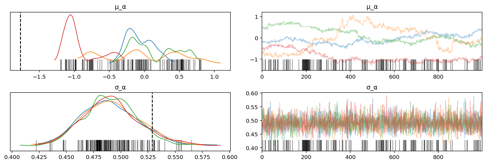
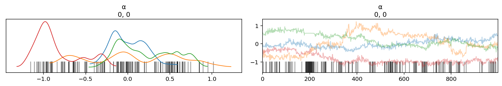
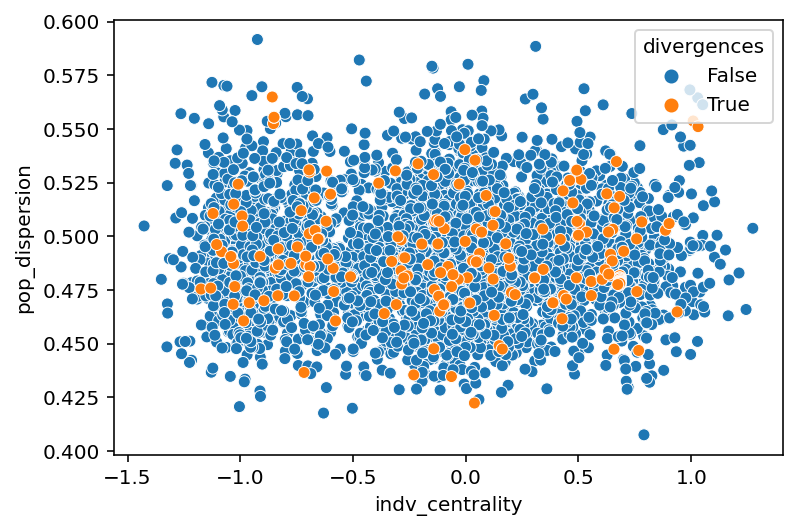
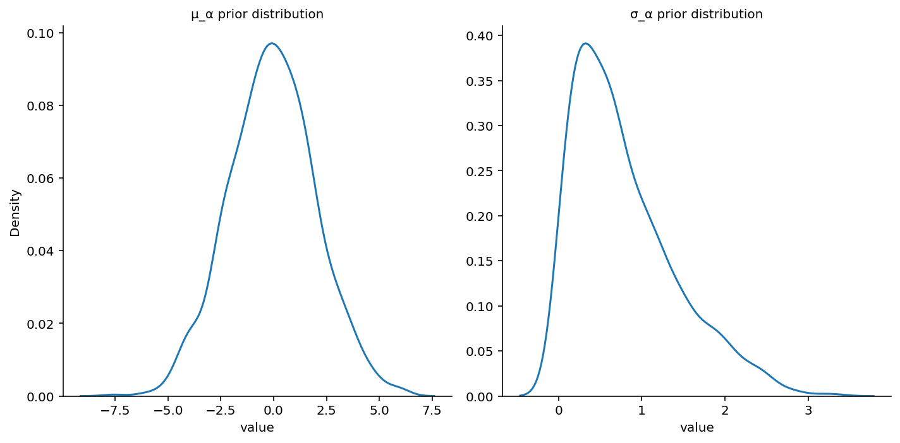
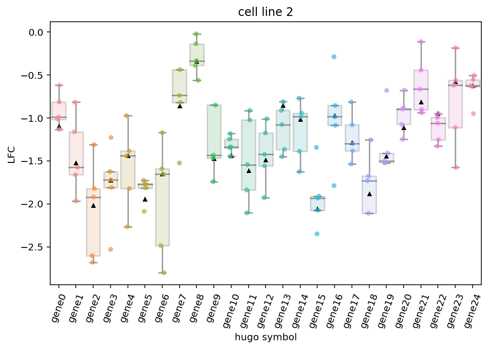
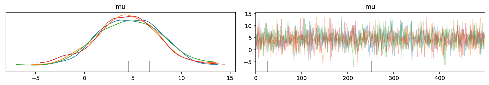

# Notebook for making graphs and getting data for a meeting with PJP

2021-07-27

```python
%load_ext autoreload
%autoreload 2
```

    The autoreload extension is already loaded. To reload it, use:
      %reload_ext autoreload

```python
import logging
import re
import string
import warnings
from pathlib import Path
from time import time

import arviz as az
import janitor
import matplotlib.colors as mcolors
import matplotlib.pyplot as plt
import numpy as np
import pandas as pd
import plotnine as gg
import pymc3 as pm
import seaborn as sns
from theano import tensor as tt
```

```python
from src.data_processing import achilles as achelp
from src.data_processing import common as dphelp
from src.globals import PYMC3
from src.io import cache_io
from src.loggers import logger, set_console_handler_level
from src.modeling import pymc3_analysis as pmanal
from src.modeling import pymc3_sampling_api as pmapi
from src.modeling import simulation_based_calibration_helpers as sbc
from src.models.speclet_two import SpecletTwo
from src.plot.color_pal import FitMethodColors, ModelColors, SeabornColor
```

```python
notebook_tic = time()

warnings.simplefilter(action="ignore", category=UserWarning)
set_console_handler_level(logging.WARNING)

gg.theme_set(
    gg.theme_bw()
    + gg.theme(
        figure_size=(4, 4),
        axis_ticks_major=gg.element_blank(),
        strip_background=gg.element_blank(),
    )
)
%config InlineBackend.figure_format = "retina"

RANDOM_SEED = 847
np.random.seed(RANDOM_SEED)
```

```python
scratch_dir_path = Path("/n/scratch3/users/j/jc604/")
sbc_perm_root_dir = scratch_dir_path / "speclet-sbc" / "sp2-default_MCMC"
list(sbc_perm_root_dir.iterdir())[:5]
```

    [PosixPath('/n/scratch3/users/j/jc604/speclet-sbc/sp2-default_MCMC/sbc-perm0'),
     PosixPath('/n/scratch3/users/j/jc604/speclet-sbc/sp2-default_MCMC/sbc-perm1'),
     PosixPath('/n/scratch3/users/j/jc604/speclet-sbc/sp2-default_MCMC/sbc-perm10'),
     PosixPath('/n/scratch3/users/j/jc604/speclet-sbc/sp2-default_MCMC/sbc-perm100'),
     PosixPath('/n/scratch3/users/j/jc604/speclet-sbc/sp2-default_MCMC/sbc-perm101')]

```python
sbc_fm = sbc.SBCFileManager(sbc_perm_root_dir / "sbc-perm435")
sbc_data = sbc_fm.get_sbc_data()
sbc_res = sbc_fm.get_sbc_results()
```

```python
sbc_data.head()
```

<div>
<style scoped>
    .dataframe tbody tr th:only-of-type {
        vertical-align: middle;
    }

    .dataframe tbody tr th {
        vertical-align: top;
    }

    .dataframe thead th {
        text-align: right;
    }
</style>
<table border="1" class="dataframe">
  <thead>
    <tr style="text-align: right;">
      <th></th>
      <th>Unnamed: 0</th>
      <th>depmap_id</th>
      <th>hugo_symbol</th>
      <th>lineage</th>
      <th>p_dna_batch</th>
      <th>screen</th>
      <th>sgrna_target_chr</th>
      <th>sgrna</th>
      <th>copy_number</th>
      <th>rna_expr</th>
      <th>is_mutated</th>
      <th>lfc</th>
    </tr>
  </thead>
  <tbody>
    <tr>
      <th>0</th>
      <td>0</td>
      <td>cellline2</td>
      <td>gene0</td>
      <td>lineage0</td>
      <td>batch2</td>
      <td>broad</td>
      <td>Chr2</td>
      <td>gene0_sgrna0</td>
      <td>1.037115</td>
      <td>11.477938</td>
      <td>False</td>
      <td>-0.814870</td>
    </tr>
    <tr>
      <th>1</th>
      <td>1</td>
      <td>cellline2</td>
      <td>gene0</td>
      <td>lineage0</td>
      <td>batch2</td>
      <td>broad</td>
      <td>Chr2</td>
      <td>gene0_sgrna1</td>
      <td>1.037115</td>
      <td>11.477938</td>
      <td>False</td>
      <td>-0.991025</td>
    </tr>
    <tr>
      <th>2</th>
      <td>2</td>
      <td>cellline2</td>
      <td>gene0</td>
      <td>lineage0</td>
      <td>batch2</td>
      <td>broad</td>
      <td>Chr2</td>
      <td>gene0_sgrna2</td>
      <td>1.037115</td>
      <td>11.477938</td>
      <td>False</td>
      <td>-1.015043</td>
    </tr>
    <tr>
      <th>3</th>
      <td>3</td>
      <td>cellline2</td>
      <td>gene0</td>
      <td>lineage0</td>
      <td>batch2</td>
      <td>broad</td>
      <td>Chr2</td>
      <td>gene0_sgrna3</td>
      <td>1.037115</td>
      <td>11.477938</td>
      <td>False</td>
      <td>-0.619699</td>
    </tr>
    <tr>
      <th>4</th>
      <td>4</td>
      <td>cellline2</td>
      <td>gene0</td>
      <td>lineage0</td>
      <td>batch2</td>
      <td>broad</td>
      <td>Chr2</td>
      <td>gene0_sgrna4</td>
      <td>1.037115</td>
      <td>11.477938</td>
      <td>False</td>
      <td>-1.134367</td>
    </tr>
  </tbody>
</table>
</div>

```python
var_names = ["μ_α", "σ_α"]
known_values = [sbc_res.priors[v][0] for v in var_names]
axes = az.plot_trace(sbc_res.inference_obj, var_names=var_names, compact=False)

for val, ax in zip(known_values, axes[:, 0]):
    ax.axvline(val, color="k", linestyle="--")

plt.show()
```



```python
az.plot_trace(
    sbc_res.inference_obj,
    var_names="α",
    coords={"α_dim_0": [0], "α_dim_1": [0]},
    compact=False,
);
```



```python
pop_dispersion = sbc_res.inference_obj["posterior"]["σ_α"].values
indv_centrality = sbc_res.inference_obj["posterior"]["α"][:, :, 1, 1].values.squeeze()
divergences = pmanal.get_divergences(sbc_res.inference_obj)

df = pd.DataFrame(
    {
        "pop_dispersion": pop_dispersion.flatten(),
        "log_pop_dispersion": np.log(pop_dispersion.flatten()),
        "indv_centrality": indv_centrality.flatten(),
        "divergences": divergences.flatten(),
    }
).sort_values("divergences")

sns.scatterplot(data=df, x="indv_centrality", y="pop_dispersion", hue="divergences");
```



```python
sp2 = SpecletTwo("exmaple-model", Path("temp"), debug=True)
sp2.data_manager.set_data(sbc_data)
sp2.build_model()
```

<pre style="white-space:pre;overflow-x:auto;line-height:normal;font-family:Menlo,'DejaVu Sans Mono',consolas,'Courier New',monospace"><span style="color: #7fbfbf; text-decoration-color: #7fbfbf">[07/27/21 12:22:58] </span><span style="color: #800000; text-decoration-color: #800000">WARNING </span> Dropping <span style="color: #008080; text-decoration-color: #008080; font-weight: bold">0</span> sgRNA that map to multiple <a href="file:///n/data1/hms/dbmi/park/Cook/speclet/src/managers/model_data_managers.py"><span style="color: #7f7f7f; text-decoration-color: #7f7f7f">model_data_managers.py</span></a><span style="color: #7f7f7f; text-decoration-color: #7f7f7f">:265</span>
                             genes.
</pre>

<pre style="white-space:pre;overflow-x:auto;line-height:normal;font-family:Menlo,'DejaVu Sans Mono',consolas,'Courier New',monospace"><span style="color: #7fbfbf; text-decoration-color: #7fbfbf">                    </span><span style="color: #800000; text-decoration-color: #800000">WARNING </span> Dropping <span style="color: #008080; text-decoration-color: #008080; font-weight: bold">0</span> data points with missing   <a href="file:///n/data1/hms/dbmi/park/Cook/speclet/src/managers/model_data_managers.py"><span style="color: #7f7f7f; text-decoration-color: #7f7f7f">model_data_managers.py</span></a><span style="color: #7f7f7f; text-decoration-color: #7f7f7f">:275</span>
                             copy number.
</pre>

```python
with sp2.model:
    prior_pred = pm.sample_prior_predictive(samples=1000, random_seed=RANDOM_SEED)
```

```python
priors_df = pd.DataFrame(
    {"μ_α": prior_pred["μ_α"], "σ_α": prior_pred["σ_α"]}
).pivot_longer()
priors_df.head()
g = sns.displot(
    priors_df,
    x="value",
    col="variable",
    kind="kde",
    facet_kws={"sharex": False, "sharey": False},
)
g.set_titles("{col_name} prior distribution")
plt.show()
```



```python
df = sbc_data.copy().query("depmap_id == 'cellline2'")
df["μ"] = sbc_res.priors["μ"].squeeze()[df.index.values]


plt.figure(figsize=(8, 5))
ax = sns.boxplot(
    data=df,
    x="hugo_symbol",
    y="lfc",
    showfliers=False,
    boxprops={"alpha": 0.2},
    medianprops={"alpha": 0.5},
    whiskerprops={"alpha": 0.5},
    capprops={"alpha": 0.5},
)
sns.stripplot(data=df, x="hugo_symbol", y="lfc", alpha=0.7, ax=ax)
sns.scatterplot(
    data=df[["hugo_symbol", "μ"]].drop_duplicates(),
    x="hugo_symbol",
    y="μ",
    color="k",
    marker="^",
    ax=ax,
)

plt.xticks(rotation=70)
ax.set_title("cell line 2")
ax.set_xlabel("hugo symbol")
ax.set_ylabel("LFC")

plt.show()
```



---

### Misc.

```python
data = az.load_arviz_data("non_centered_eight")
az.plot_trace(data, var_names=("mu"), compact=False)
plt.show()
```



```python

```

```python

```

---

```python
notebook_toc = time()
print(f"execution time: {(notebook_toc - notebook_tic) / 60:.2f} minutes")
```

    execution time: 0.74 minutes

```python
%load_ext watermark
%watermark -d -u -v -iv -b -h -m
```

    Last updated: 2021-07-27

    Python implementation: CPython
    Python version       : 3.9.2
    IPython version      : 7.21.0

    Compiler    : GCC 9.3.0
    OS          : Linux
    Release     : 3.10.0-1062.el7.x86_64
    Machine     : x86_64
    Processor   : x86_64
    CPU cores   : 32
    Architecture: 64bit

    Hostname: compute-a-16-55.o2.rc.hms.harvard.edu

    Git branch: sbc-uniform-check

    arviz     : 0.11.2
    theano    : 1.0.5
    pymc3     : 3.11.1
    plotnine  : 0.7.1
    re        : 2.2.1
    matplotlib: 3.3.4
    seaborn   : 0.11.1
    logging   : 0.5.1.2
    janitor   : 0.20.14
    pandas    : 1.2.3
    numpy     : 1.20.1
