# Designing models for CRC cell lines

```python
%load_ext autoreload
%autoreload 2
```

```python
import re
import string
import warnings
from pathlib import Path
from time import time

import arviz as az
import matplotlib.colors as mcolors
import matplotlib.pyplot as plt
import numpy as np
import pandas as pd
import plotnine as gg
import pymc3 as pm
import seaborn as sns
import theano
```

```python
from src.data_processing import achilles as achelp
from src.data_processing import common as dphelp
from src.modeling import pymc3_analysis as pmanal
from src.modeling import pymc3_sampling_api as sampling
from src.models import crc_models
from src.plot.color_pal import SeabornColor
```

```python
notebook_tic = time()

warnings.simplefilter(action="ignore", category=UserWarning)

gg.theme_set(gg.theme_classic() + gg.theme(strip_background=gg.element_blank()))
%config InlineBackend.figure_format = "retina"

RANDOM_SEED = 914
np.random.seed(RANDOM_SEED)

pymc3_cache_dir = Path("pymc3_model_cache")
```

## Data

```python
data = achelp.read_achilles_data(
    Path("..", "..", "modeling_data", "depmap_CRC_data_subsample.csv")
)
data.head()
```

<div>
<style scoped>
    .dataframe tbody tr th:only-of-type {
        vertical-align: middle;
    }

    .dataframe tbody tr th {
        vertical-align: top;
    }

    .dataframe thead th {
        text-align: right;
    }
</style>
<table border="1" class="dataframe">
  <thead>
    <tr style="text-align: right;">
      <th></th>
      <th>sgrna</th>
      <th>replicate_id</th>
      <th>lfc</th>
      <th>pdna_batch</th>
      <th>passes_qc</th>
      <th>depmap_id</th>
      <th>primary_or_metastasis</th>
      <th>lineage</th>
      <th>lineage_subtype</th>
      <th>kras_mutation</th>
      <th>...</th>
      <th>any_deleterious</th>
      <th>variant_classification</th>
      <th>is_deleterious</th>
      <th>is_tcga_hotspot</th>
      <th>is_cosmic_hotspot</th>
      <th>mutated_at_guide_location</th>
      <th>rna_expr</th>
      <th>log2_cn</th>
      <th>z_log2_cn</th>
      <th>is_mutated</th>
    </tr>
  </thead>
  <tbody>
    <tr>
      <th>0</th>
      <td>CCACCCACAGACGCTCAGCA</td>
      <td>ls513-311cas9_repa_p6_batch2</td>
      <td>0.029491</td>
      <td>2</td>
      <td>True</td>
      <td>ACH-000007</td>
      <td>Primary</td>
      <td>colorectal</td>
      <td>colorectal_adenocarcinoma</td>
      <td>G12D</td>
      <td>...</td>
      <td>False</td>
      <td>NaN</td>
      <td>NaN</td>
      <td>NaN</td>
      <td>NaN</td>
      <td>False</td>
      <td>1.480265</td>
      <td>1.861144</td>
      <td>1.386218</td>
      <td>0</td>
    </tr>
    <tr>
      <th>1</th>
      <td>CCACCCACAGACGCTCAGCA</td>
      <td>ls513-311cas9_repb_p6_batch2</td>
      <td>0.426017</td>
      <td>2</td>
      <td>True</td>
      <td>ACH-000007</td>
      <td>Primary</td>
      <td>colorectal</td>
      <td>colorectal_adenocarcinoma</td>
      <td>G12D</td>
      <td>...</td>
      <td>False</td>
      <td>NaN</td>
      <td>NaN</td>
      <td>NaN</td>
      <td>NaN</td>
      <td>False</td>
      <td>1.480265</td>
      <td>1.861144</td>
      <td>1.386218</td>
      <td>0</td>
    </tr>
    <tr>
      <th>2</th>
      <td>CCACCCACAGACGCTCAGCA</td>
      <td>c2bbe1-311cas9 rep a p5_batch3</td>
      <td>0.008626</td>
      <td>3</td>
      <td>True</td>
      <td>ACH-000009</td>
      <td>Primary</td>
      <td>colorectal</td>
      <td>colorectal_adenocarcinoma</td>
      <td>WT</td>
      <td>...</td>
      <td>False</td>
      <td>NaN</td>
      <td>NaN</td>
      <td>NaN</td>
      <td>NaN</td>
      <td>False</td>
      <td>0.695994</td>
      <td>1.375470</td>
      <td>-0.234394</td>
      <td>0</td>
    </tr>
    <tr>
      <th>3</th>
      <td>CCACCCACAGACGCTCAGCA</td>
      <td>c2bbe1-311cas9 rep b p5_batch3</td>
      <td>0.280821</td>
      <td>3</td>
      <td>True</td>
      <td>ACH-000009</td>
      <td>Primary</td>
      <td>colorectal</td>
      <td>colorectal_adenocarcinoma</td>
      <td>WT</td>
      <td>...</td>
      <td>False</td>
      <td>NaN</td>
      <td>NaN</td>
      <td>NaN</td>
      <td>NaN</td>
      <td>False</td>
      <td>0.695994</td>
      <td>1.375470</td>
      <td>-0.234394</td>
      <td>0</td>
    </tr>
    <tr>
      <th>4</th>
      <td>CCACCCACAGACGCTCAGCA</td>
      <td>c2bbe1-311cas9 rep c p5_batch3</td>
      <td>0.239815</td>
      <td>3</td>
      <td>True</td>
      <td>ACH-000009</td>
      <td>Primary</td>
      <td>colorectal</td>
      <td>colorectal_adenocarcinoma</td>
      <td>WT</td>
      <td>...</td>
      <td>False</td>
      <td>NaN</td>
      <td>NaN</td>
      <td>NaN</td>
      <td>NaN</td>
      <td>False</td>
      <td>0.695994</td>
      <td>1.375470</td>
      <td>-0.234394</td>
      <td>0</td>
    </tr>
  </tbody>
</table>
<p>5 rows × 30 columns</p>
</div>

## Model Experimentation

### sgRNA Activity prior distributions

```python
import theano.tensor as tt

with pm.Model() as exprt_model:
    ϕ = pm.Uniform("ϕ", lower=0.0, upper=1.0)

    κ_log = pm.Exponential("κ_log", 0.5)
    κ = pm.Deterministic("κ", tt.exp(κ_log))

    beta = pm.Beta("beta", alpha=ϕ * κ, beta=(1.0 - ϕ) * κ)

    prior = pm.sample_prior_predictive(1000, random_seed=RANDOM_SEED)

vars = ["ϕ", "κ_log", "κ", "beta"]
for v in vars:
    sns.displot(prior[v], kde=True, height=3, aspect=2, bins=50)
    plt.title(v)
```

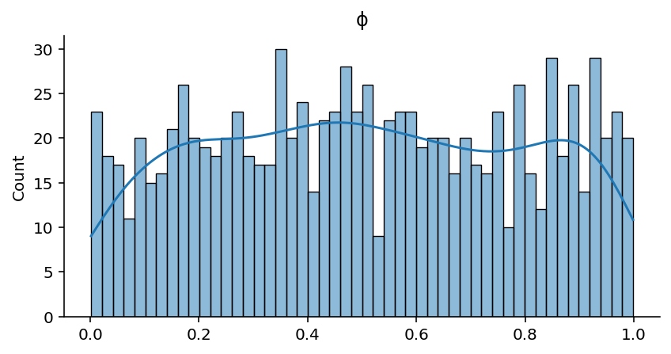

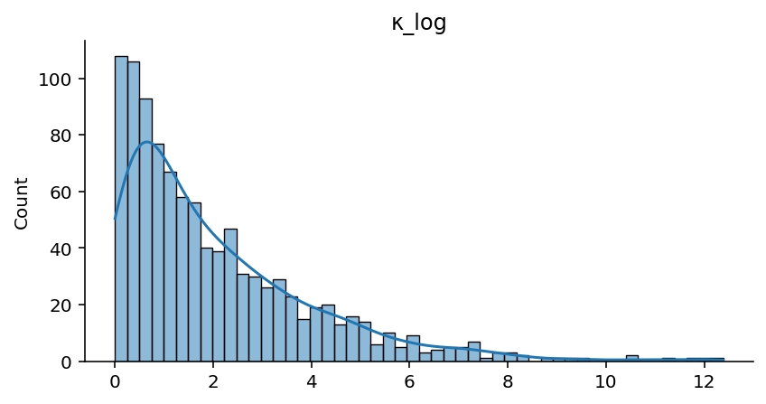

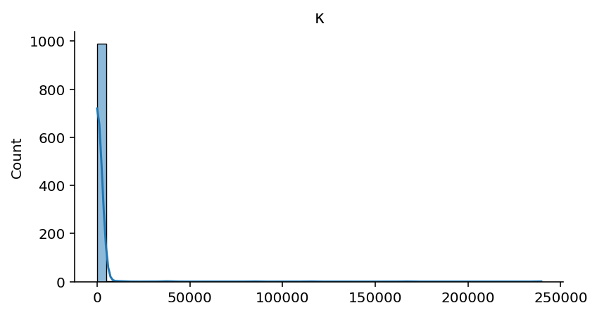

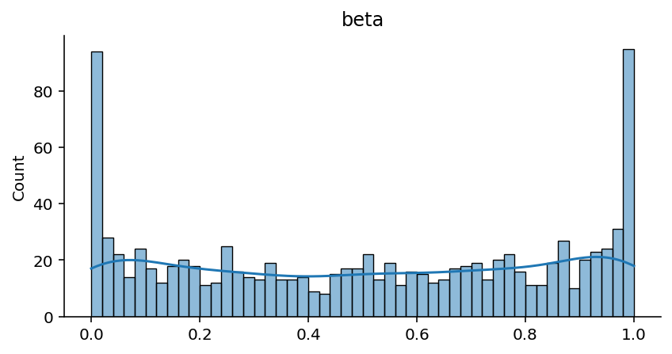

```python
with pm.Model() as exprt_model:
    a_prior = pm.HalfNormal("a_prior", np.array([0.1, 0.5]), shape=2)
    a = pm.Exponential("a", a_prior, shape=2)
    beta = pm.Beta("beta", alpha=a[0], beta=a[1])

    prior = pm.sample_prior_predictive(1000, random_seed=RANDOM_SEED)

vars = ["a_prior", "a", "beta"]
for v in vars:
    sns.displot(prior[v], kde=True, height=3, aspect=2, bins=50)
    plt.title(v)
```

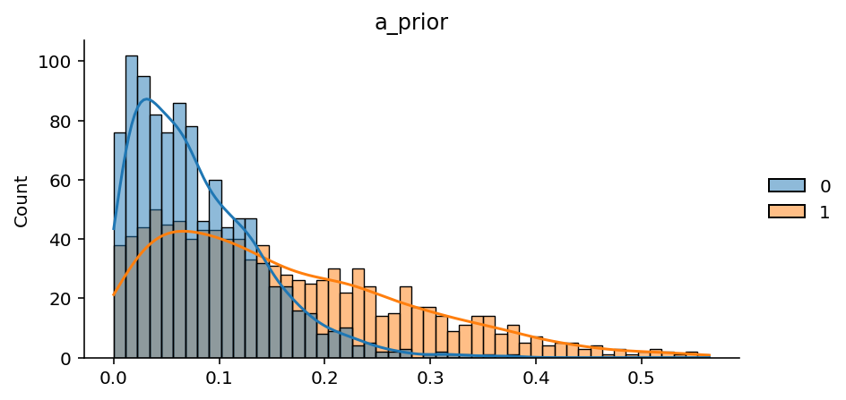

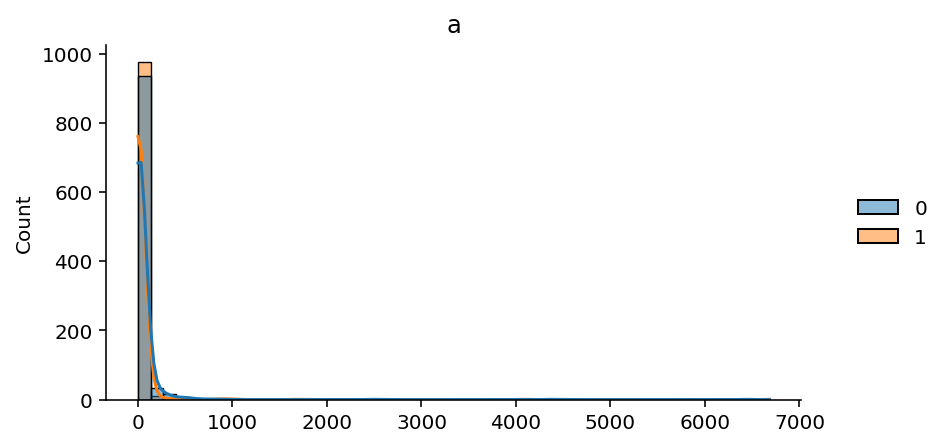

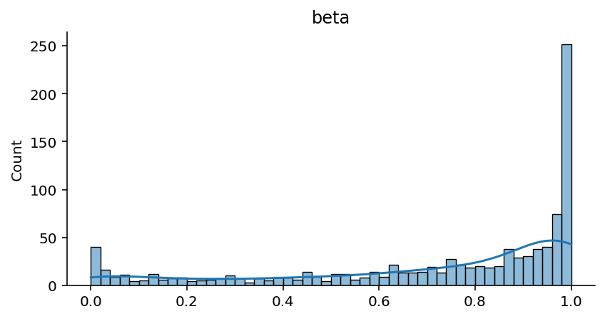

### Model design

```python
lfc_data = data.lfc.values
total_size = len(data.lfc.values)

indices = achelp.common_indices(data)

sgrna_idx = indices.sgrna_idx
sgrna_to_gene_idx = indices.sgrna_to_gene_idx
gene_idx = indices.gene_idx
cellline_idx = indices.cellline_idx
batch_idx = indices.batch_idx

n_sgrnas = dphelp.nunique(sgrna_idx)
n_genes = dphelp.nunique(gene_idx)
n_celllines = dphelp.nunique(cellline_idx)
n_batches = dphelp.nunique(batch_idx)

sgrna_idx_shared = theano.shared(sgrna_idx)
sgrna_to_gene_idx_shared = theano.shared(sgrna_to_gene_idx)
gene_idx_shared = theano.shared(gene_idx)
cellline_idx_shared = theano.shared(cellline_idx)
batch_idx_shared = theano.shared(batch_idx)
lfc_shared = theano.shared(lfc_data)

with pm.Model() as model:

    # Hyper-priors
    σ_a = pm.HalfNormal("σ_a", np.array([0.1, 0.5]), shape=2)
    a = pm.Exponential("a", σ_a, shape=(n_genes, 2))

    μ_h = pm.Normal("μ_h", np.mean(lfc_data), 1)
    σ_h = pm.HalfNormal("σ_h", 1)

    μ_d = pm.Normal("μ_d", 0, 0.2)
    σ_d = pm.HalfNormal("σ_d", 0.5)

    μ_η = pm.Normal("μ_η", 0, 0.2)
    σ_η = pm.HalfNormal("σ_η", 0.5)

    # Main parameter priors
    q = pm.Beta(
        "q",
        alpha=a[sgrna_to_gene_idx_shared, 0],
        beta=a[sgrna_to_gene_idx_shared, 1],
        shape=n_sgrnas,
    )
    h = pm.Normal("h", μ_h, σ_h, shape=n_genes)
    d = pm.Normal("d", μ_d, σ_d, shape=(n_genes, n_celllines))
    η = pm.Normal("η", μ_η, σ_η, shape=n_batches)

    μ = pm.Deterministic(
        "μ",
        q[sgrna_idx_shared]
        * (h[gene_idx_shared] + d[gene_idx_shared, cellline_idx_shared])
        + η[batch_idx_shared],
    )
    σ = pm.HalfNormal("σ", 2)

    # Likelihood
    lfc = pm.Normal("lfc", μ, σ, observed=lfc_shared, total_size=total_size)
```

```python
pm.model_to_graphviz(model)
```

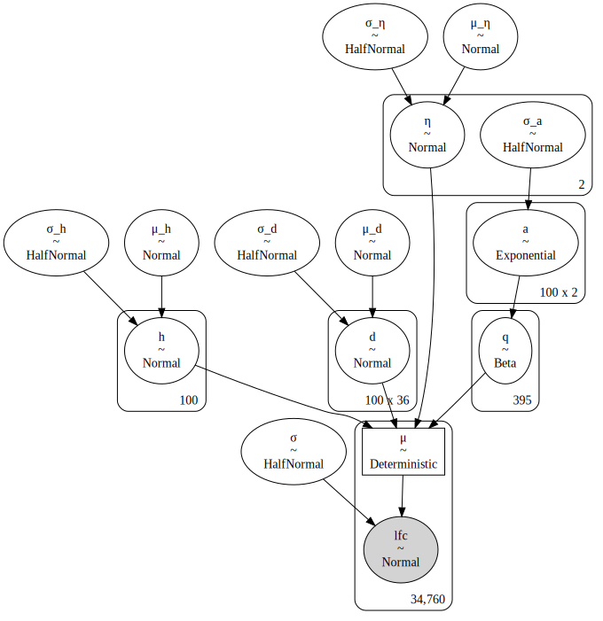

```python
with model:
    prior_pred = pm.sample_prior_predictive(samples=1000, random_seed=RANDOM_SEED)
```

```python
pmanal.plot_all_priors(prior_pred, subplots=(5, 3), figsize=(10, 9), samples=500);
```

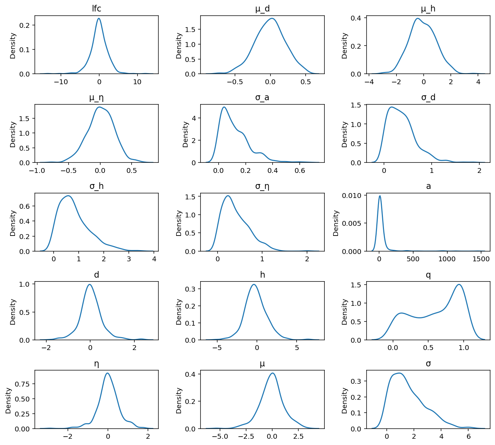

## ADVI

```python
batch_size = 1000

sgnra_idx_batch = pm.Minibatch(sgrna_idx, batch_size=batch_size)
gene_idx_batch = pm.Minibatch(gene_idx, batch_size=batch_size)
cellline_idx_batch = pm.Minibatch(cellline_idx, batch_size=batch_size)
batch_idx_batch = pm.Minibatch(batch_idx, batch_size=batch_size)
lfc_data_batch = pm.Minibatch(data.lfc.values, batch_size=batch_size)
```

    /home/jc604/.conda/envs/speclet/lib/python3.9/site-packages/pymc3/data.py:316: FutureWarning: Using a non-tuple sequence for multidimensional indexing is deprecated; use `arr[tuple(seq)]` instead of `arr[seq]`. In the future this will be interpreted as an array index, `arr[np.array(seq)]`, which will result either in an error or a different result.
    /home/jc604/.conda/envs/speclet/lib/python3.9/site-packages/pymc3/data.py:316: FutureWarning: Using a non-tuple sequence for multidimensional indexing is deprecated; use `arr[tuple(seq)]` instead of `arr[seq]`. In the future this will be interpreted as an array index, `arr[np.array(seq)]`, which will result either in an error or a different result.

```python
meanfield = sampling.pymc3_advi_approximation_procedure(
    model=model,
    method="advi",
    callbacks=[
        pm.callbacks.CheckParametersConvergence(tolerance=0.01, diff="absolute")
    ],
    fit_kwargs={
        "more_replacements": {
            sgrna_idx_shared: sgnra_idx_batch,
            gene_idx_shared: gene_idx_batch,
            cellline_idx_shared: cellline_idx_batch,
            batch_idx_shared: batch_idx_batch,
            lfc_shared: lfc_data_batch,
        }
    },
)
```

<div>
    <style>
        /*Turns off some styling*/
        progress {
            /*gets rid of default border in Firefox and Opera.*/
            border: none;
            /*Needs to be in here for Safari polyfill so background images work as expected.*/
            background-size: auto;
        }
        .progress-bar-interrupted, .progress-bar-interrupted::-webkit-progress-bar {
            background: #F44336;
        }
    </style>
  <progress value='48469' class='' max='100000' style='width:300px; height:20px; vertical-align: middle;'></progress>
  48.47% [48469/100000 01:47<01:54 Average Loss = 620.82]
</div>

    Convergence achieved at 48500
    Interrupted at 48,499 [48%]: Average Loss = 831.25

<div>
    <style>
        /*Turns off some styling*/
        progress {
            /*gets rid of default border in Firefox and Opera.*/
            border: none;
            /*Needs to be in here for Safari polyfill so background images work as expected.*/
            background-size: auto;
        }
        .progress-bar-interrupted, .progress-bar-interrupted::-webkit-progress-bar {
            background: #F44336;
        }
    </style>
  <progress value='1000' class='' max='1000' style='width:300px; height:20px; vertical-align: middle;'></progress>
  100.00% [1000/1000 00:11<00:00]
</div>

```python
az_model = sampling.convert_samples_to_arviz(model, meanfield)
```

```python
pmanal.plot_vi_hist(meanfield.approximation)
```

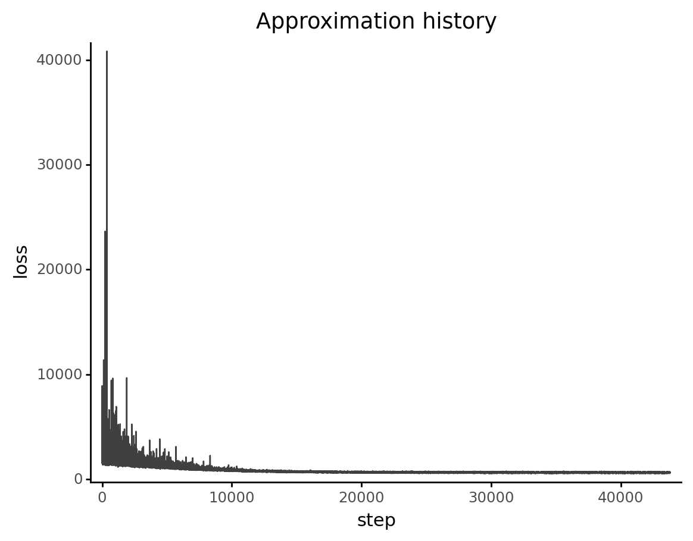

    <ggplot: (8776482623410)>

```python
def plot_az_summary(df: pd.DataFrame, x="index", aes_kwargs={}) -> gg.ggplot:
    return (
        gg.ggplot(df, gg.aes(x=x))
        + gg.geom_hline(yintercept=0, linetype="--", alpha=0.5)
        + gg.geom_linerange(
            gg.aes(ymin="hdi_5.5%", ymax="hdi_94.5%", **aes_kwargs), size=0.2
        )
        + gg.geom_point(gg.aes(y="mean", **aes_kwargs), size=0.5)
        + gg.theme(axis_text_x=gg.element_text(angle=90, size=6))
        + gg.labs(x="model parameter", y="posterior")
    )
```

```python
az.plot_forest(az_model, var_names="η", hdi_prob=0.89);
```

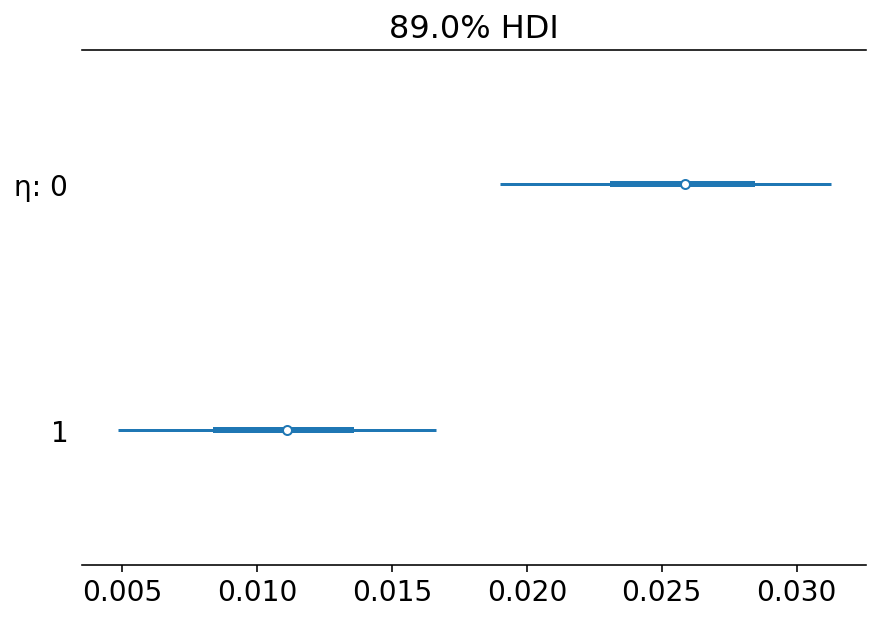

```python
gene_posteriors = az.summary(
    az_model,
    var_names="h",
    hdi_prob=0.89,
)

plot_az_summary(gene_posteriors.reset_index(drop=False)) + gg.theme(
    figure_size=(10, 5)
) + gg.labs(x="gene-varying parameter")
```

    arviz - WARNING - Shape validation failed: input_shape: (1, 1000), minimum_shape: (chains=2, draws=4)

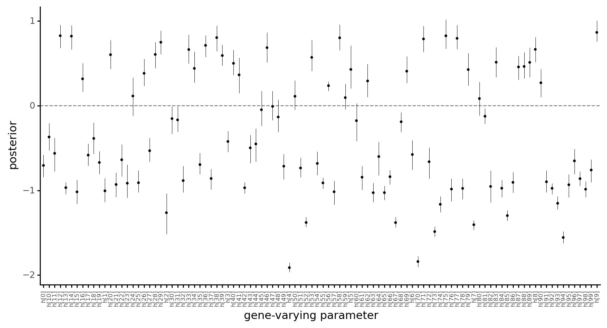

    <ggplot: (8776483704019)>

```python
genes = data.hugo_symbol.cat.categories.values

sgrna_activity_params = pmanal.extract_matrix_variable_indices(
    az.summary(
        az_model,
        var_names="a",
        hdi_prob=0.89,
    ).reset_index(drop=False),
    col="index",
    idx1=genes,
    idx2=np.array(["alpha", "beta"]),
    idx1name="hugo_symbol",
    idx2name="beta_param",
)

sgrna_activity_params.head()
```

    arviz - WARNING - Shape validation failed: input_shape: (1, 1000), minimum_shape: (chains=2, draws=4)

<div>
<style scoped>
    .dataframe tbody tr th:only-of-type {
        vertical-align: middle;
    }

    .dataframe tbody tr th {
        vertical-align: top;
    }

    .dataframe thead th {
        text-align: right;
    }
</style>
<table border="1" class="dataframe">
  <thead>
    <tr style="text-align: right;">
      <th></th>
      <th>index</th>
      <th>mean</th>
      <th>sd</th>
      <th>hdi_5.5%</th>
      <th>hdi_94.5%</th>
      <th>mcse_mean</th>
      <th>mcse_sd</th>
      <th>ess_bulk</th>
      <th>ess_tail</th>
      <th>r_hat</th>
      <th>hugo_symbol</th>
      <th>beta_param</th>
    </tr>
  </thead>
  <tbody>
    <tr>
      <th>0</th>
      <td>a[0,0]</td>
      <td>1.754</td>
      <td>0.596</td>
      <td>0.913</td>
      <td>2.598</td>
      <td>0.019</td>
      <td>0.013</td>
      <td>1039.0</td>
      <td>853.0</td>
      <td>NaN</td>
      <td>ADAMTS13</td>
      <td>alpha</td>
    </tr>
    <tr>
      <th>1</th>
      <td>a[0,1]</td>
      <td>5.500</td>
      <td>2.171</td>
      <td>2.567</td>
      <td>8.740</td>
      <td>0.069</td>
      <td>0.049</td>
      <td>1001.0</td>
      <td>876.0</td>
      <td>NaN</td>
      <td>ADAMTS13</td>
      <td>beta</td>
    </tr>
    <tr>
      <th>2</th>
      <td>a[1,0]</td>
      <td>1.196</td>
      <td>0.449</td>
      <td>0.579</td>
      <td>1.856</td>
      <td>0.017</td>
      <td>0.012</td>
      <td>949.0</td>
      <td>1023.0</td>
      <td>NaN</td>
      <td>ADGRA3</td>
      <td>alpha</td>
    </tr>
    <tr>
      <th>3</th>
      <td>a[1,1]</td>
      <td>4.669</td>
      <td>2.037</td>
      <td>1.837</td>
      <td>7.413</td>
      <td>0.069</td>
      <td>0.048</td>
      <td>823.0</td>
      <td>871.0</td>
      <td>NaN</td>
      <td>ADGRA3</td>
      <td>beta</td>
    </tr>
    <tr>
      <th>4</th>
      <td>a[2,0]</td>
      <td>2.585</td>
      <td>1.613</td>
      <td>0.642</td>
      <td>4.526</td>
      <td>0.050</td>
      <td>0.036</td>
      <td>1070.0</td>
      <td>907.0</td>
      <td>NaN</td>
      <td>AKR7L</td>
      <td>alpha</td>
    </tr>
  </tbody>
</table>
</div>

```python
az.plot_forest(az_model, var_names="σ_a", hdi_prob=0.89);
```

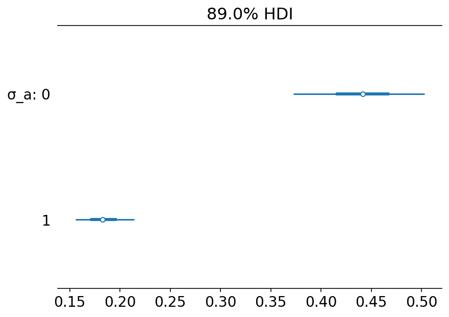

```python
plot_az_summary(
    sgrna_activity_params, x="hugo_symbol", aes_kwargs={"color": "beta_param"}
) + gg.scale_color_brewer(type="qual", palette="Set1") + gg.theme(
    figure_size=(10, 5)
) + gg.scale_y_continuous(
    expand=(0, 0, 0.02, 0)
) + gg.labs(
    color="Beta dist. params", x="gene"
)
```

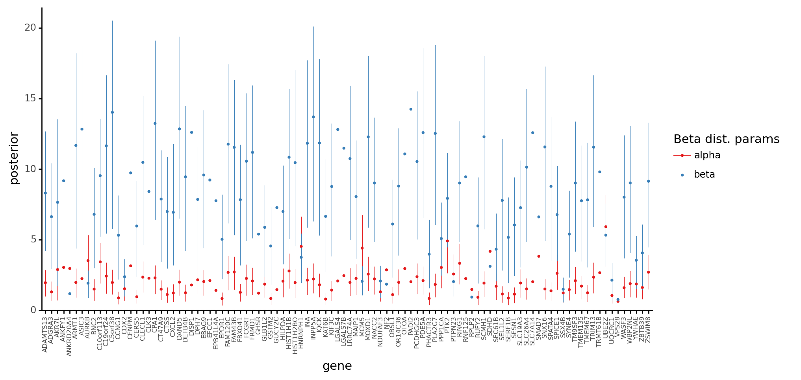

    <ggplot: (8776521380292)>

```python
sgrna_activity_post = (
    az.summary(
        az_model,
        var_names="q",
        hdi_prob=0.89,
        kind="stats",
    )
    .reset_index(drop=False)
    .assign(sgrna=data.sgrna.cat.categories.values)
    .merge(indices.sgrna_to_gene_map)
)

(
    gg.ggplot(sgrna_activity_post, gg.aes(x="index"))
    + gg.facet_wrap("hugo_symbol", scales="free", ncol=5)
    + gg.geom_linerange(gg.aes(ymin="hdi_5.5%", ymax="hdi_94.5%"), size=0.2)
    + gg.geom_point(gg.aes(y="mean"), size=0.6)
    + gg.scale_y_continuous(limits=(0, 1), expand=(0, 0))
    + gg.theme(
        axis_text_x=gg.element_blank(),
        figure_size=(8, 20),
        subplots_adjust={"wspace": 0.5},
        axis_text_y=gg.element_text(size=6),
        axis_ticks_major_x=gg.element_blank(),
        strip_text=gg.element_text(size=7),
    )
    + gg.labs(x="sgRNA", y="posterior", title="sgRNA 'activity scores' per gene")
)
```

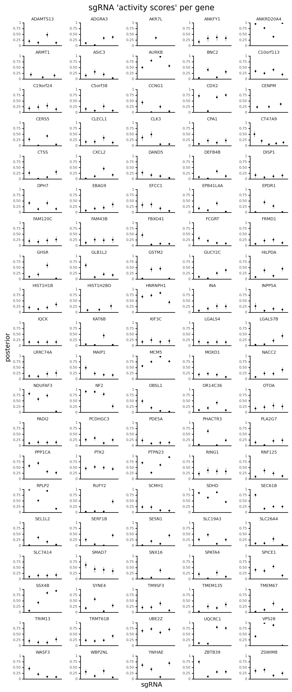

    <ggplot: (8776515577510)>

```python
gene_cells_post = az.summary(
    az_model, var_names="d", hdi_prob=0.89, kind="stats"
).reset_index(drop=False)
gene_cells_post = pmanal.extract_matrix_variable_indices(
    gene_cells_post,
    col="index",
    idx1=data.hugo_symbol.cat.categories.values,
    idx2=data.depmap_id.cat.categories.values,
    idx1name="hugo_symbol",
    idx2name="depmap_id",
)
gene_cells_post.head()
```

<div>
<style scoped>
    .dataframe tbody tr th:only-of-type {
        vertical-align: middle;
    }

    .dataframe tbody tr th {
        vertical-align: top;
    }

    .dataframe thead th {
        text-align: right;
    }
</style>
<table border="1" class="dataframe">
  <thead>
    <tr style="text-align: right;">
      <th></th>
      <th>index</th>
      <th>mean</th>
      <th>sd</th>
      <th>hdi_5.5%</th>
      <th>hdi_94.5%</th>
      <th>hugo_symbol</th>
      <th>depmap_id</th>
    </tr>
  </thead>
  <tbody>
    <tr>
      <th>0</th>
      <td>d[0,0]</td>
      <td>0.317</td>
      <td>0.413</td>
      <td>-0.349</td>
      <td>0.964</td>
      <td>ADAMTS13</td>
      <td>ACH-000007</td>
    </tr>
    <tr>
      <th>1</th>
      <td>d[0,1]</td>
      <td>0.026</td>
      <td>0.356</td>
      <td>-0.575</td>
      <td>0.551</td>
      <td>ADAMTS13</td>
      <td>ACH-000009</td>
    </tr>
    <tr>
      <th>2</th>
      <td>d[0,2]</td>
      <td>0.278</td>
      <td>0.373</td>
      <td>-0.315</td>
      <td>0.891</td>
      <td>ADAMTS13</td>
      <td>ACH-000202</td>
    </tr>
    <tr>
      <th>3</th>
      <td>d[0,3]</td>
      <td>-0.184</td>
      <td>0.473</td>
      <td>-0.878</td>
      <td>0.602</td>
      <td>ADAMTS13</td>
      <td>ACH-000249</td>
    </tr>
    <tr>
      <th>4</th>
      <td>d[0,4]</td>
      <td>0.125</td>
      <td>0.385</td>
      <td>-0.466</td>
      <td>0.735</td>
      <td>ADAMTS13</td>
      <td>ACH-000253</td>
    </tr>
  </tbody>
</table>
</div>

```python
(
    gg.ggplot(gene_cells_post, gg.aes(x="depmap_id", y="hugo_symbol"))
    + gg.geom_point(gg.aes(size="sd", color="mean"))
    + gg.scale_color_gradient2()
    + gg.scale_size_continuous(range=(5, 0.5))
    + gg.theme(
        figure_size=(8, 12),
        axis_text_x=gg.element_text(angle=90, size=7),
        axis_text_y=gg.element_text(size=7),
        axis_ticks=gg.element_blank(),
    )
    + gg.labs(
        x="cell lines",
        y="gene",
        color="post. avg.",
        size="post. s.d.",
        title="Posterior of gene x cell lines matrix",
    )
)
```

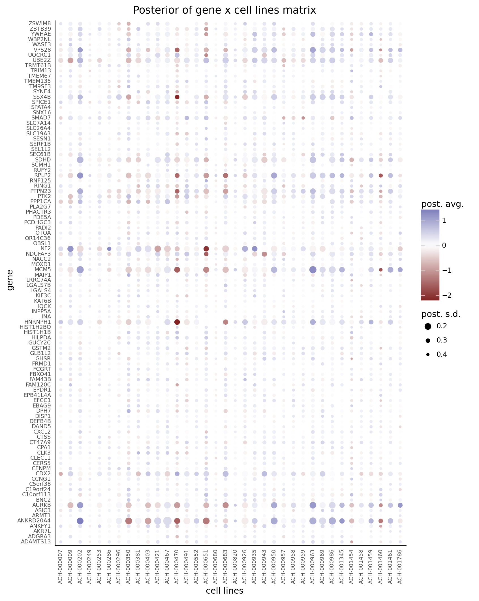

    <ggplot: (8776491308358)>

```python
model_ppc = pmanal.summarize_posterior_predictions(
    meanfield.posterior_predictive["lfc"],
    merge_with=data[
        ["lfc", "hugo_symbol", "depmap_id", "sgrna", "pdna_batch", "gene_cn"]
    ],
)

model_ppc = model_ppc.assign(
    hdi_range=lambda d: np.abs(d.pred_hdi_high - d.pred_hdi_low)
)


model_ppc["error"] = model_ppc.lfc - model_ppc.pred_mean


model_ppc.head()
```

    /home/jc604/.conda/envs/speclet/lib/python3.9/site-packages/arviz/stats/stats.py:456: FutureWarning: hdi currently interprets 2d data as (draw, shape) but this will change in a future release to (chain, draw) for coherence with other functions

<div>
<style scoped>
    .dataframe tbody tr th:only-of-type {
        vertical-align: middle;
    }

    .dataframe tbody tr th {
        vertical-align: top;
    }

    .dataframe thead th {
        text-align: right;
    }
</style>
<table border="1" class="dataframe">
  <thead>
    <tr style="text-align: right;">
      <th></th>
      <th>pred_mean</th>
      <th>pred_hdi_low</th>
      <th>pred_hdi_high</th>
      <th>lfc</th>
      <th>hugo_symbol</th>
      <th>depmap_id</th>
      <th>sgrna</th>
      <th>pdna_batch</th>
      <th>gene_cn</th>
      <th>hdi_range</th>
      <th>error</th>
    </tr>
  </thead>
  <tbody>
    <tr>
      <th>0</th>
      <td>-0.046883</td>
      <td>-0.778368</td>
      <td>0.587474</td>
      <td>0.029491</td>
      <td>ADAMTS13</td>
      <td>ACH-000007</td>
      <td>CCACCCACAGACGCTCAGCA</td>
      <td>2</td>
      <td>2.632957</td>
      <td>1.365842</td>
      <td>0.076374</td>
    </tr>
    <tr>
      <th>1</th>
      <td>-0.062689</td>
      <td>-0.756680</td>
      <td>0.593348</td>
      <td>0.426017</td>
      <td>ADAMTS13</td>
      <td>ACH-000007</td>
      <td>CCACCCACAGACGCTCAGCA</td>
      <td>2</td>
      <td>2.632957</td>
      <td>1.350027</td>
      <td>0.488706</td>
    </tr>
    <tr>
      <th>2</th>
      <td>-0.141715</td>
      <td>-0.807843</td>
      <td>0.493891</td>
      <td>0.008626</td>
      <td>ADAMTS13</td>
      <td>ACH-000009</td>
      <td>CCACCCACAGACGCTCAGCA</td>
      <td>3</td>
      <td>1.594524</td>
      <td>1.301734</td>
      <td>0.150341</td>
    </tr>
    <tr>
      <th>3</th>
      <td>-0.113522</td>
      <td>-0.869345</td>
      <td>0.496125</td>
      <td>0.280821</td>
      <td>ADAMTS13</td>
      <td>ACH-000009</td>
      <td>CCACCCACAGACGCTCAGCA</td>
      <td>3</td>
      <td>1.594524</td>
      <td>1.365470</td>
      <td>0.394344</td>
    </tr>
    <tr>
      <th>4</th>
      <td>-0.118507</td>
      <td>-0.773210</td>
      <td>0.556633</td>
      <td>0.239815</td>
      <td>ADAMTS13</td>
      <td>ACH-000009</td>
      <td>CCACCCACAGACGCTCAGCA</td>
      <td>3</td>
      <td>1.594524</td>
      <td>1.329843</td>
      <td>0.358323</td>
    </tr>
  </tbody>
</table>
</div>

```python
(
    gg.ggplot(model_ppc, gg.aes(x="lfc", y="pred_mean"))
    + gg.geom_point(gg.aes(color="pdna_batch"), alpha=0.3)
    + gg.geom_abline(slope=1, intercept=0, alpha=0.9, linetype="--")
    + gg.scale_color_brewer(
        type="qual", palette="Dark2", guide=gg.guide_legend(override_aes={"alpha": 1})
    )
)
```

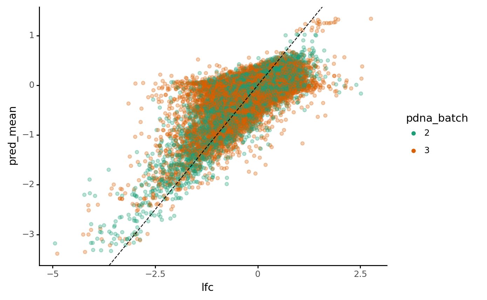

    <ggplot: (8776521285265)>

```python
(
    gg.ggplot(model_ppc, gg.aes(x="error", y="hdi_range"))
    + gg.geom_point(alpha=0.2, color=SeabornColor.blue)
    + gg.labs(x="prediction error", y="HDI size")
)
```

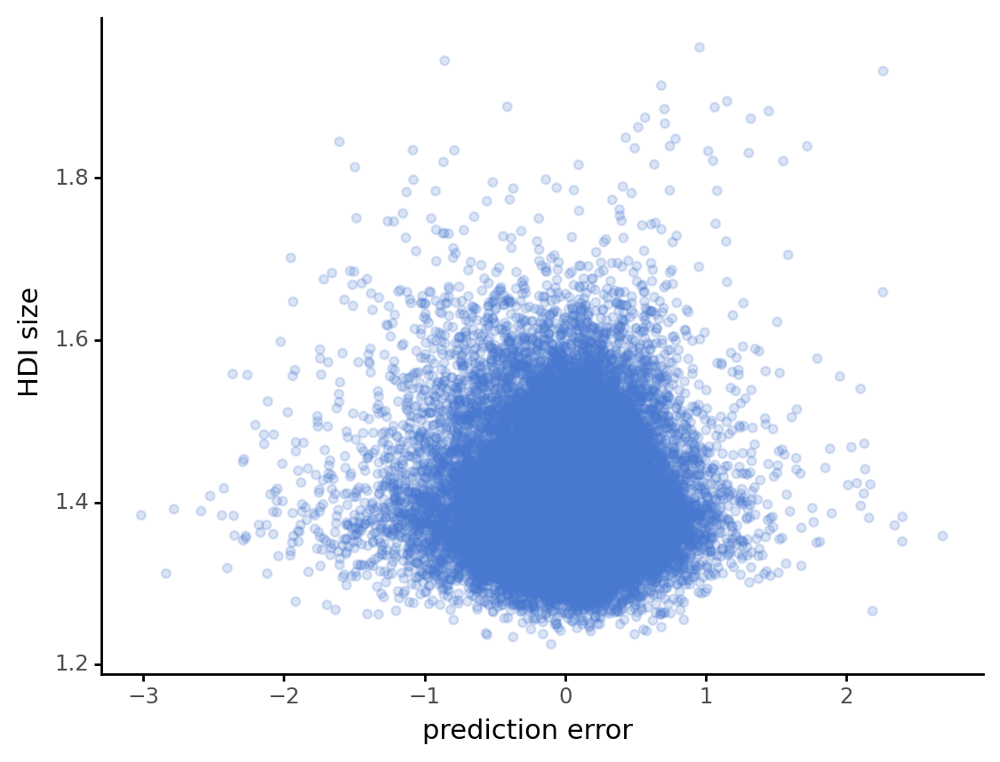

    <ggplot: (8776514649724)>

```python
(
    gg.ggplot(model_ppc, gg.aes(x="pred_mean", y="hdi_range"))
    + gg.geom_point(alpha=0.2, color=SeabornColor.blue)
    + gg.labs(x="prediction mean", y="HDI size")
)
```

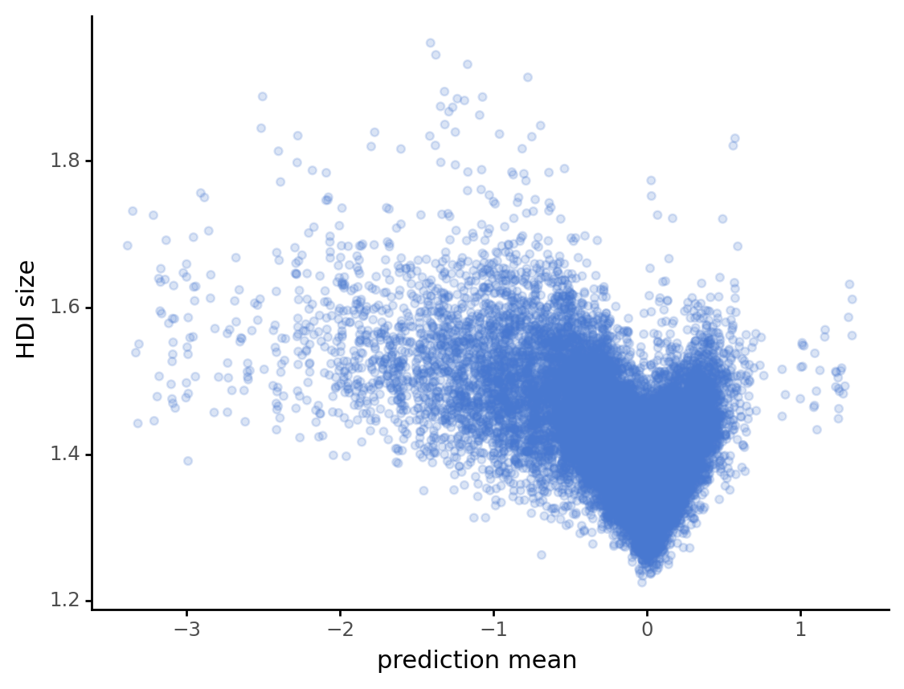

    <ggplot: (8776482624118)>

```python
(
    gg.ggplot(model_ppc, gg.aes(x="np.log2(gene_cn)", y="error"))
    + gg.geom_point(alpha=0.2, color=SeabornColor.blue)
    + gg.labs(x="gene CN", y="prediction error")
)
```

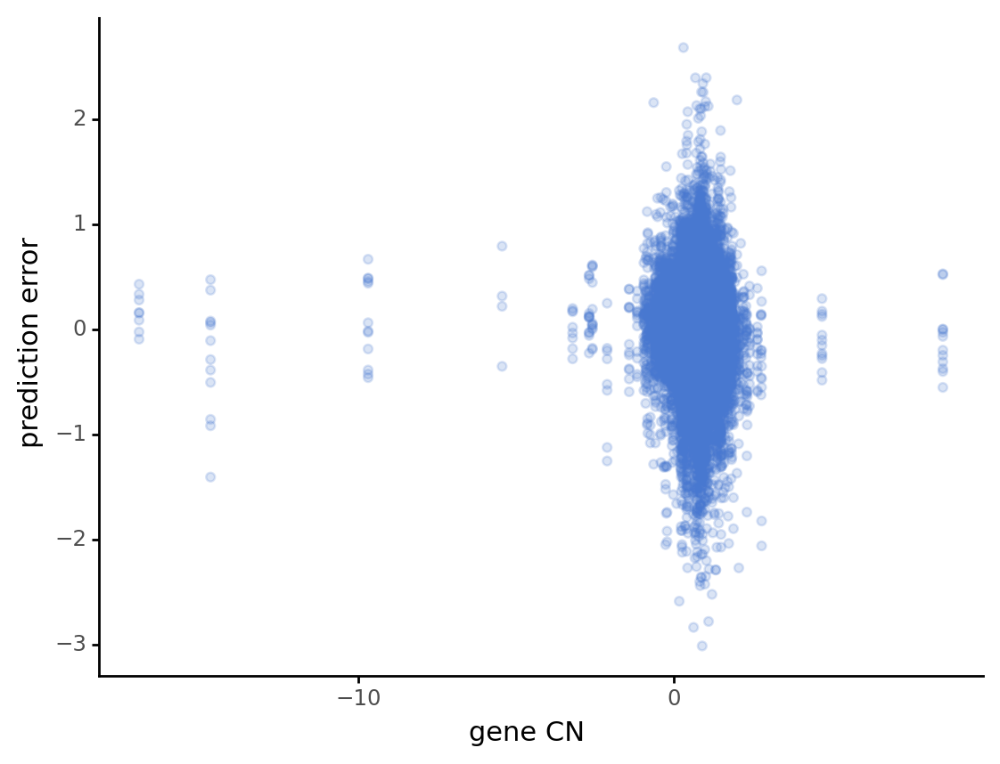

    <ggplot: (8776482624160)>

```python
model_ppc_with_qpost = model_ppc.merge(
    sgrna_activity_post[["mean", "sgrna", "hugo_symbol"]].rename(
        columns={"mean": "q_post_mean"}
    )
)
```

```python
(
    gg.ggplot(model_ppc_with_qpost, gg.aes(x="lfc", y="pred_mean"))
    + gg.geom_point(gg.aes(color="q_post_mean"), alpha=0.5)
    + gg.geom_abline(slope=1, intercept=0, linetype="--")
    + gg.labs(x="observed LFC", y="prediction mean", color="post. avg of $q_s$")
)
```

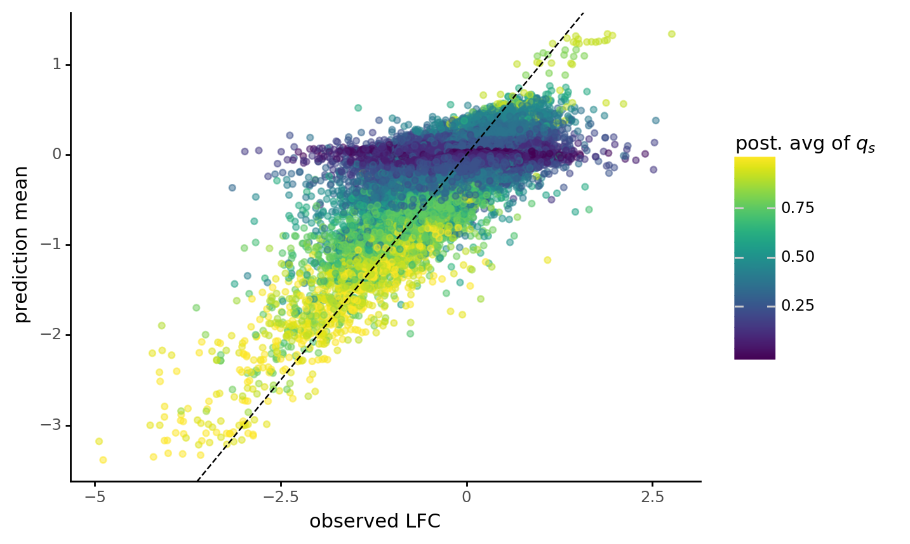

    <ggplot: (8776434245253)>

```python
(
    gg.ggplot(model_ppc_with_qpost, gg.aes(x="q_post_mean", y="error"))
    + gg.geom_point(alpha=0.1, color=SeabornColor.blue)
    + gg.geom_hline(yintercept=0, linetype="--")
    + gg.labs(x="post. avg of $q_s$", y="prediction error")
)
```

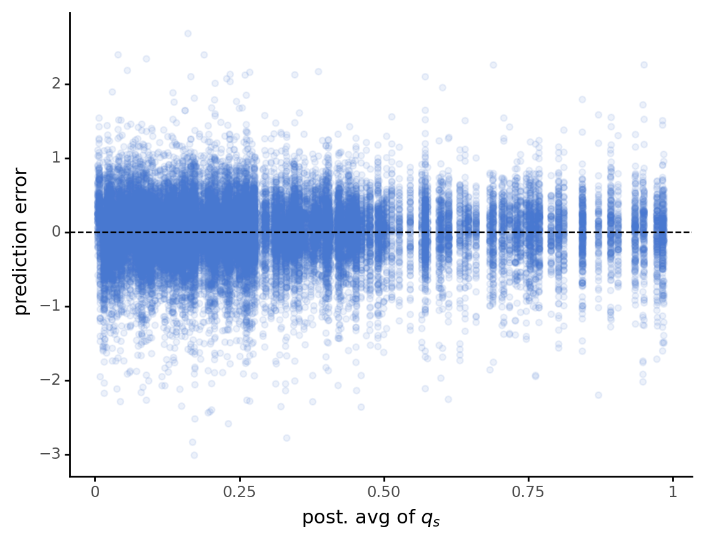

    <ggplot: (8776433978432)>

---

```python
notebook_toc = time()
print(f"execution time: {(notebook_toc - notebook_tic) / 60:.2f} minutes")
```

    execution time: 3.79 minutes

```python
%load_ext watermark
%watermark -d -u -v -iv -b -h -m
```

    Last updated: 2021-03-29

    Python implementation: CPython
    Python version       : 3.9.2
    IPython version      : 7.21.0

    Compiler    : GCC 9.3.0
    OS          : Linux
    Release     : 3.10.0-1062.el7.x86_64
    Machine     : x86_64
    Processor   : x86_64
    CPU cores   : 28
    Architecture: 64bit

    Hostname: compute-e-16-235.o2.rc.hms.harvard.edu

    Git branch: ceres-mimic

    theano    : 1.0.5
    plotnine  : 0.7.1
    pymc3     : 3.11.1
    pandas    : 1.2.3
    arviz     : 0.11.2
    seaborn   : 0.11.1
    numpy     : 1.20.1
    re        : 2.2.1
    matplotlib: 3.3.4

```python

```
