# Designing models for CRC cell lines

```python
%load_ext autoreload
%autoreload 2
```

```python
import re
import string
import warnings
from pathlib import Path
from time import time

import arviz as az
import matplotlib.colors as mcolors
import matplotlib.pyplot as plt
import numpy as np
import pandas as pd
import plotnine as gg
import pymc3 as pm
import seaborn as sns
import theano
```

```python
from src.data_processing import achilles as achelp
from src.data_processing import common as dphelp
from src.modeling import pymc3_analysis as pmanal
from src.modeling import pymc3_sampling_api as sampling
from src.models import crc_models
from src.plot.color_pal import SeabornColor
```

```python
notebook_tic = time()

warnings.simplefilter(action="ignore", category=UserWarning)

gg.theme_set(gg.theme_classic() + gg.theme(strip_background=gg.element_blank()))
%config InlineBackend.figure_format = "retina"

RANDOM_SEED = 914
np.random.seed(RANDOM_SEED)

pymc3_cache_dir = Path("pymc3_model_cache")
```

## Data

```python
data = achelp.read_achilles_data(
    Path("..", "..", "modeling_data", "depmap_CRC_data_subsample.csv"),
    set_categorical_cols=False,
)
# data = achelp.subsample_achilles_data(data, n_genes=20, n_cell_lines=10)
data = achelp.set_achilles_categorical_columns(data)
data.head()
```

<div>
<style scoped>
    .dataframe tbody tr th:only-of-type {
        vertical-align: middle;
    }

    .dataframe tbody tr th {
        vertical-align: top;
    }

    .dataframe thead th {
        text-align: right;
    }
</style>
<table border="1" class="dataframe">
  <thead>
    <tr style="text-align: right;">
      <th></th>
      <th>sgrna</th>
      <th>replicate_id</th>
      <th>lfc</th>
      <th>pdna_batch</th>
      <th>passes_qc</th>
      <th>depmap_id</th>
      <th>primary_or_metastasis</th>
      <th>lineage</th>
      <th>lineage_subtype</th>
      <th>kras_mutation</th>
      <th>...</th>
      <th>any_deleterious</th>
      <th>variant_classification</th>
      <th>is_deleterious</th>
      <th>is_tcga_hotspot</th>
      <th>is_cosmic_hotspot</th>
      <th>mutated_at_guide_location</th>
      <th>rna_expr</th>
      <th>log2_cn</th>
      <th>z_log2_cn</th>
      <th>is_mutated</th>
    </tr>
  </thead>
  <tbody>
    <tr>
      <th>0</th>
      <td>CCACCCACAGACGCTCAGCA</td>
      <td>ls513-311cas9_repa_p6_batch2</td>
      <td>0.029491</td>
      <td>2</td>
      <td>True</td>
      <td>ACH-000007</td>
      <td>Primary</td>
      <td>colorectal</td>
      <td>colorectal_adenocarcinoma</td>
      <td>G12D</td>
      <td>...</td>
      <td>False</td>
      <td>NaN</td>
      <td>NaN</td>
      <td>NaN</td>
      <td>NaN</td>
      <td>False</td>
      <td>1.480265</td>
      <td>1.861144</td>
      <td>1.386218</td>
      <td>0</td>
    </tr>
    <tr>
      <th>1</th>
      <td>CCACCCACAGACGCTCAGCA</td>
      <td>ls513-311cas9_repb_p6_batch2</td>
      <td>0.426017</td>
      <td>2</td>
      <td>True</td>
      <td>ACH-000007</td>
      <td>Primary</td>
      <td>colorectal</td>
      <td>colorectal_adenocarcinoma</td>
      <td>G12D</td>
      <td>...</td>
      <td>False</td>
      <td>NaN</td>
      <td>NaN</td>
      <td>NaN</td>
      <td>NaN</td>
      <td>False</td>
      <td>1.480265</td>
      <td>1.861144</td>
      <td>1.386218</td>
      <td>0</td>
    </tr>
    <tr>
      <th>2</th>
      <td>CCACCCACAGACGCTCAGCA</td>
      <td>c2bbe1-311cas9 rep a p5_batch3</td>
      <td>0.008626</td>
      <td>3</td>
      <td>True</td>
      <td>ACH-000009</td>
      <td>Primary</td>
      <td>colorectal</td>
      <td>colorectal_adenocarcinoma</td>
      <td>WT</td>
      <td>...</td>
      <td>False</td>
      <td>NaN</td>
      <td>NaN</td>
      <td>NaN</td>
      <td>NaN</td>
      <td>False</td>
      <td>0.695994</td>
      <td>1.375470</td>
      <td>-0.234394</td>
      <td>0</td>
    </tr>
    <tr>
      <th>3</th>
      <td>CCACCCACAGACGCTCAGCA</td>
      <td>c2bbe1-311cas9 rep b p5_batch3</td>
      <td>0.280821</td>
      <td>3</td>
      <td>True</td>
      <td>ACH-000009</td>
      <td>Primary</td>
      <td>colorectal</td>
      <td>colorectal_adenocarcinoma</td>
      <td>WT</td>
      <td>...</td>
      <td>False</td>
      <td>NaN</td>
      <td>NaN</td>
      <td>NaN</td>
      <td>NaN</td>
      <td>False</td>
      <td>0.695994</td>
      <td>1.375470</td>
      <td>-0.234394</td>
      <td>0</td>
    </tr>
    <tr>
      <th>4</th>
      <td>CCACCCACAGACGCTCAGCA</td>
      <td>c2bbe1-311cas9 rep c p5_batch3</td>
      <td>0.239815</td>
      <td>3</td>
      <td>True</td>
      <td>ACH-000009</td>
      <td>Primary</td>
      <td>colorectal</td>
      <td>colorectal_adenocarcinoma</td>
      <td>WT</td>
      <td>...</td>
      <td>False</td>
      <td>NaN</td>
      <td>NaN</td>
      <td>NaN</td>
      <td>NaN</td>
      <td>False</td>
      <td>0.695994</td>
      <td>1.375470</td>
      <td>-0.234394</td>
      <td>0</td>
    </tr>
  </tbody>
</table>
<p>5 rows × 30 columns</p>
</div>

```python
data.shape
```

    (34760, 30)

## Model Experimentation

### Model design

```python
lfc_data = data.lfc.values
total_size = len(data.lfc.values)

indices = achelp.common_indices(data)

sgrna_idx = indices["sgrna_idx"]
sgrna_to_gene_idx = indices["sgrna_to_gene_idx"]
gene_idx = indices["gene_idx"]
cellline_idx = indices["cellline_idx"]
batch_idx = indices["batch_idx"]

n_sgrnas = dphelp.nunique(sgrna_idx)
n_genes = dphelp.nunique(gene_idx)
n_celllines = dphelp.nunique(cellline_idx)
n_batches = dphelp.nunique(batch_idx)

sgrna_idx_shared = theano.shared(sgrna_idx)
sgrna_to_gene_idx_shared = theano.shared(sgrna_to_gene_idx)
gene_idx_shared = theano.shared(gene_idx)
cellline_idx_shared = theano.shared(cellline_idx)
batch_idx_shared = theano.shared(batch_idx)
lfc_shared = theano.shared(lfc_data)

with pm.Model() as model:

    # Hyper-priors
    σ_a = pm.HalfNormal("σ_a", np.array([0.1, 0.2]), shape=2)
    a = pm.Exponential("a", σ_a, shape=(n_genes, 2))

    μ_h = pm.Normal("μ_h", np.mean(lfc_data), 1)
    σ_h = pm.HalfNormal("σ_h", 1)

    μ_d = pm.Normal("μ_d", 0, 0.2)
    σ_d = pm.HalfNormal("σ_d", 0.5)

    μ_η = pm.Normal("μ_η", 0, 0.2)
    σ_η = pm.HalfNormal("σ_η", 0.5)

    # Main parameter priors
    q = pm.Beta(
        "q",
        alpha=a[sgrna_to_gene_idx_shared, 0],
        beta=a[sgrna_to_gene_idx_shared, 1],
        shape=n_sgrnas,
    )
    h = pm.Normal("h", μ_h, σ_h, shape=n_genes)
    d = pm.Normal("d", μ_d, σ_d, shape=(n_genes, n_celllines))
    η = pm.Normal("η", μ_η, σ_η, shape=n_batches)

    μ = pm.Deterministic(
        "μ",
        q[sgrna_idx_shared]
        * (h[gene_idx_shared] + d[gene_idx_shared, cellline_idx_shared])
        + η[batch_idx_shared],
    )
    σ = pm.HalfNormal("σ", 2)

    # Likelihood
    lfc = pm.Normal("lfc", μ, σ, observed=lfc_shared, total_size=total_size)
```

```python
pm.model_to_graphviz(model)
```

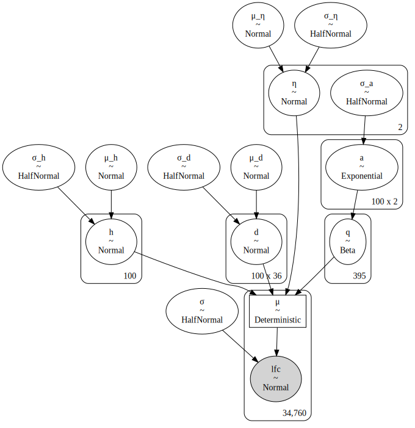

```python
with model:
    prior_pred = pm.sample_prior_predictive(samples=1000, random_seed=RANDOM_SEED)
```

```python
pmanal.plot_all_priors(prior_pred, subplots=(5, 3), figsize=(10, 9), samples=500);
```

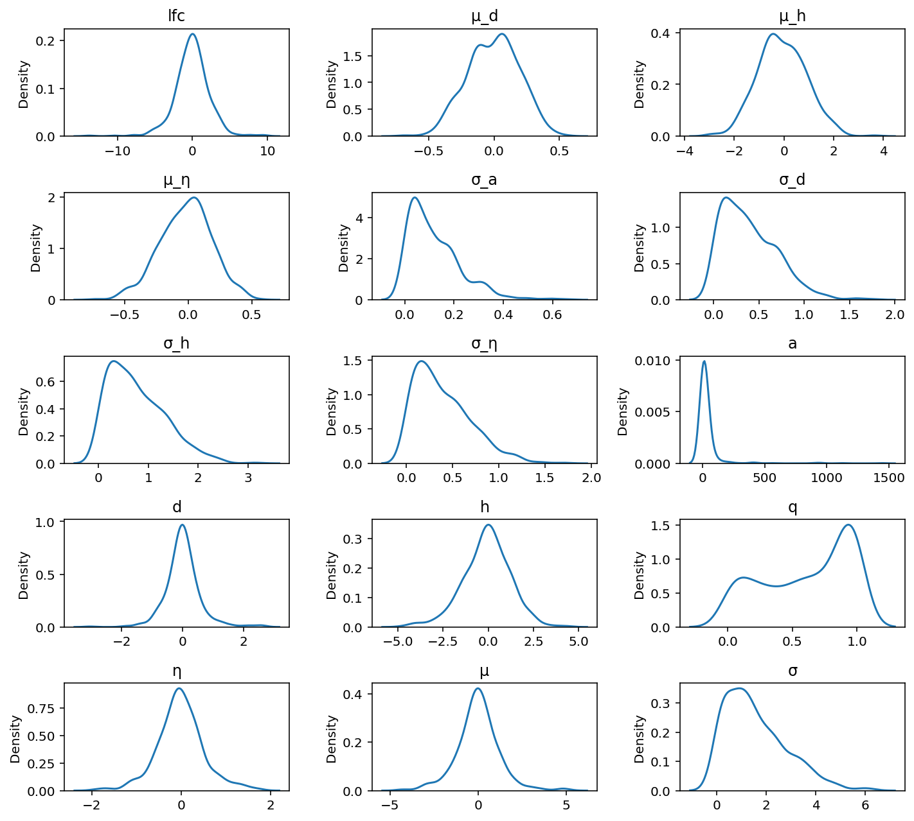

## ADVI

```python
batch_size = 500

sgnra_idx_batch = pm.Minibatch(sgrna_idx, batch_size=batch_size)
gene_idx_batch = pm.Minibatch(gene_idx, batch_size=batch_size)
cellline_idx_batch = pm.Minibatch(cellline_idx, batch_size=batch_size)
batch_idx_batch = pm.Minibatch(batch_idx, batch_size=batch_size)
lfc_data_batch = pm.Minibatch(data.lfc.values, batch_size=batch_size)
```

    /usr/local/Caskroom/miniconda/base/envs/speclet/lib/python3.9/site-packages/pymc3/data.py:316: FutureWarning: Using a non-tuple sequence for multidimensional indexing is deprecated; use `arr[tuple(seq)]` instead of `arr[seq]`. In the future this will be interpreted as an array index, `arr[np.array(seq)]`, which will result either in an error or a different result.

```python
meanfield = sampling.pymc3_advi_approximation_procedure(
    model=model,
    method="advi",
    callbacks=[
        pm.callbacks.CheckParametersConvergence(tolerance=0.01, diff="absolute")
    ],
    fit_kwargs={
        "more_replacements": {
            sgrna_idx_shared: sgnra_idx_batch,
            gene_idx_shared: gene_idx_batch,
            cellline_idx_shared: cellline_idx_batch,
            batch_idx_shared: batch_idx_batch,
            lfc_shared: lfc_data_batch,
        }
    },
)
```

    Sampling from prior distributions.
    Running ADVI approximation.

<div>
    <style>
        /*Turns off some styling*/
        progress {
            /*gets rid of default border in Firefox and Opera.*/
            border: none;
            /*Needs to be in here for Safari polyfill so background images work as expected.*/
            background-size: auto;
        }
        .progress-bar-interrupted, .progress-bar-interrupted::-webkit-progress-bar {
            background: #F44336;
        }
    </style>
  <progress value='38869' class='' max='100000' style='width:300px; height:20px; vertical-align: middle;'></progress>
  38.87% [38869/100000 01:24<02:12 Average Loss = 324.22]
</div>

    Convergence achieved at 38900
    Interrupted at 38,899 [38%]: Average Loss = 442.85


    Sampling from posterior.
    Posterior predicitons.

<div>
    <style>
        /*Turns off some styling*/
        progress {
            /*gets rid of default border in Firefox and Opera.*/
            border: none;
            /*Needs to be in here for Safari polyfill so background images work as expected.*/
            background-size: auto;
        }
        .progress-bar-interrupted, .progress-bar-interrupted::-webkit-progress-bar {
            background: #F44336;
        }
    </style>
  <progress value='1000' class='' max='1000' style='width:300px; height:20px; vertical-align: middle;'></progress>
  100.00% [1000/1000 00:18<00:00]
</div>

```python
az_model = sampling.samples_to_arviz(model, meanfield)
```

```python
pmanal.plot_vi_hist(meanfield["approximation"])
```

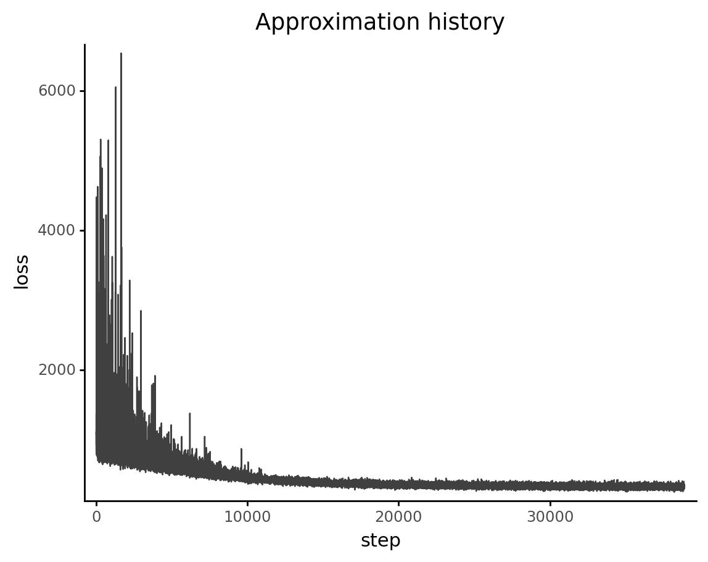

    <ggplot: (363979581)>

## PPC

```python
az.plot_ppc(az_model, kind="kde", num_pp_samples=20, random_seed=RANDOM_SEED)
```

    <AxesSubplot:xlabel='lfc'>

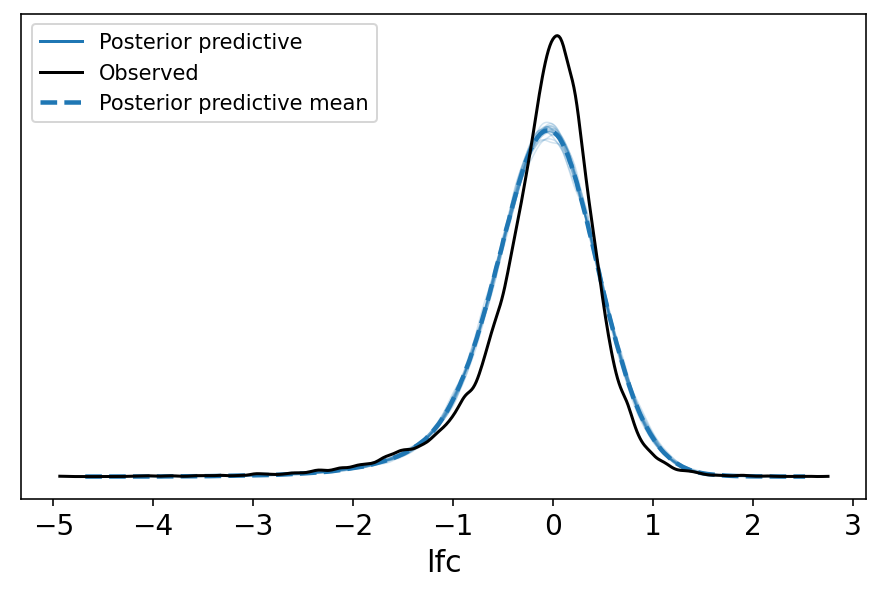

```python
az.plot_loo_pit(az_model, y="lfc");
```

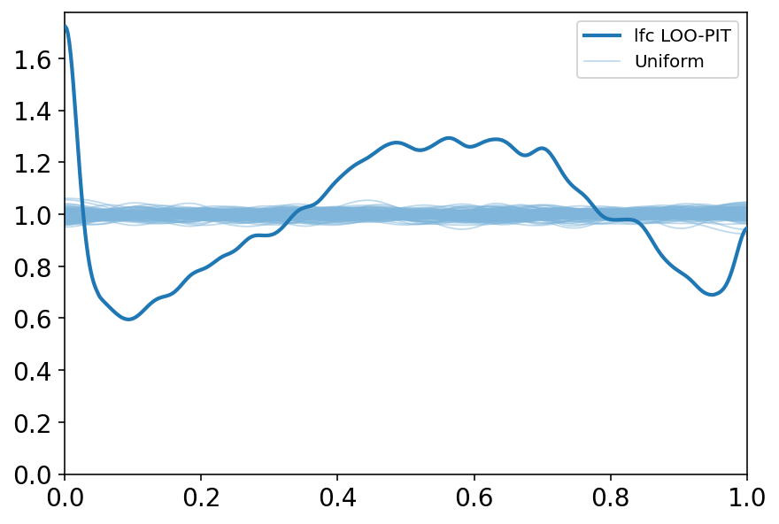

```python
ppc_df = pmanal.summarize_posterior_predictions(
    meanfield["posterior_predictive"]["lfc"],
    merge_with=data[["hugo_symbol", "sgrna", "depmap_id", "lfc", "gene_cn"]],
    calc_error=True,
)
```

    /usr/local/Caskroom/miniconda/base/envs/speclet/lib/python3.9/site-packages/arviz/stats/stats.py:456: FutureWarning: hdi currently interprets 2d data as (draw, shape) but this will change in a future release to (chain, draw) for coherence with other functions

```python
model_loo = az.loo(az_model, pointwise=True)
print(model_loo)
```

    Computed from 1000 by 34760 log-likelihood matrix

             Estimate       SE
    elpd_loo -24190.28   235.84
    p_loo     4756.88        -

    There has been a warning during the calculation. Please check the results.
    ------

    Pareto k diagnostic values:
                             Count   Pct.
    (-Inf, 0.5]   (good)     30312   87.2%
     (0.5, 0.7]   (ok)        3414    9.8%
       (0.7, 1]   (bad)        795    2.3%
       (1, Inf)   (very bad)   239    0.7%

```python
sns.distplot(model_loo.loo_i.values);
```

    /usr/local/Caskroom/miniconda/base/envs/speclet/lib/python3.9/site-packages/seaborn/distributions.py:2557: FutureWarning: `distplot` is a deprecated function and will be removed in a future version. Please adapt your code to use either `displot` (a figure-level function with similar flexibility) or `histplot` (an axes-level function for histograms).

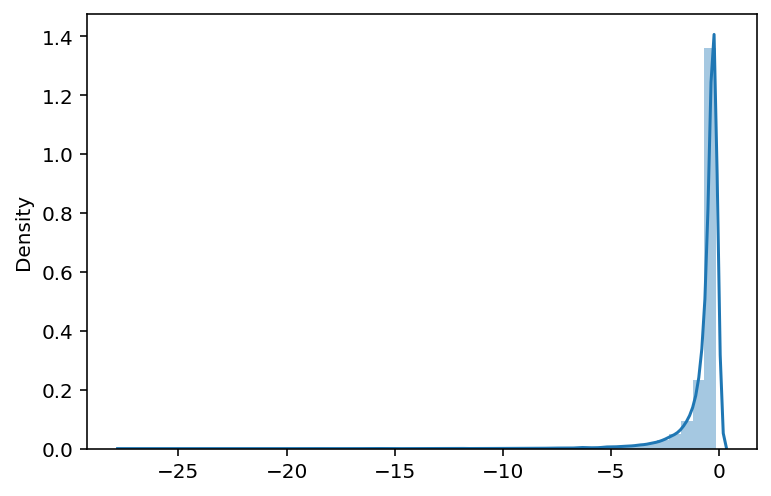

```python
ppc_df["loo"] = model_loo.loo_i.values
```

```python
(
    gg.ggplot(ppc_df, gg.aes(x="lfc", y="loo"))
    + gg.geom_point(gg.aes(color="np.abs(error)"), alpha=0.5)
    + gg.scale_color_gradient(low="grey", high="red")
    + gg.theme()
    + gg.labs(x="observed LFC", y="LOO", color="abs(error)")
)
```

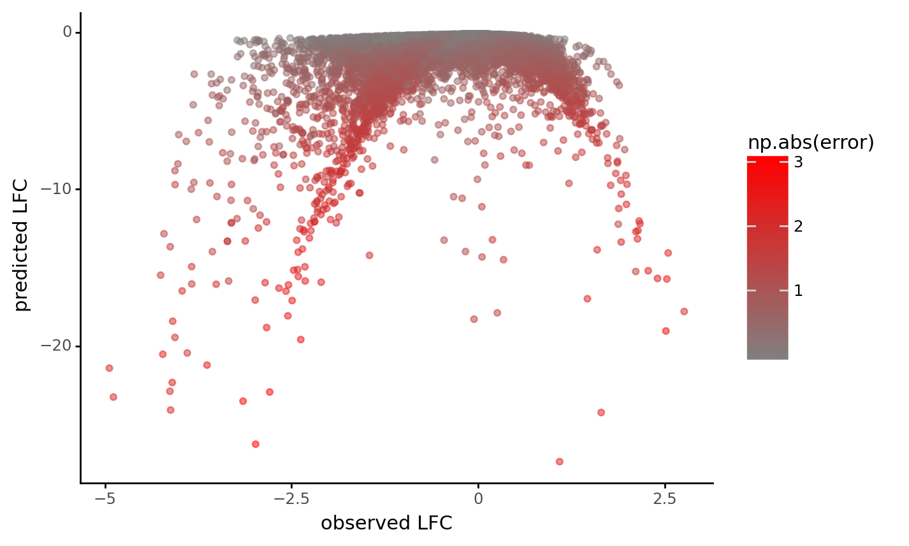

    <ggplot: (358131291)>

```python
(
    gg.ggplot(ppc_df, gg.aes(x="hugo_symbol", y="loo"))
    + gg.geom_jitter(width=0.2, alpha=0.5, size=0.7)
    + gg.geom_boxplot(outlier_alpha=0, alpha=0.4)
    + gg.theme(axis_text_x=gg.element_blank(), axis_ticks_major_x=gg.element_blank())
    + gg.labs(x="gene", y="LOO")
)
```

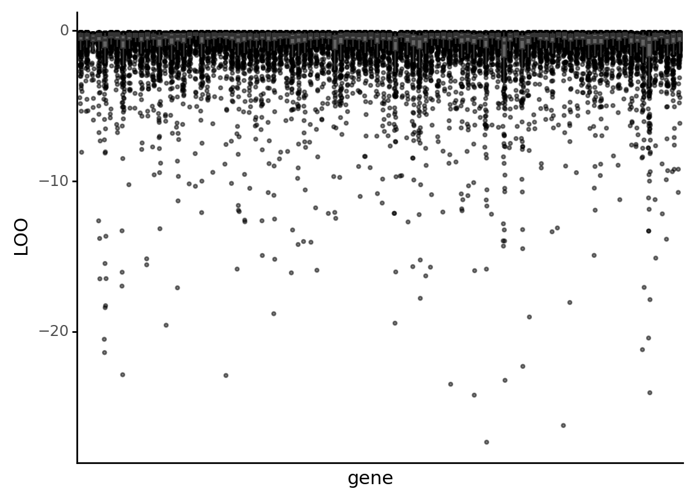

    <ggplot: (369401805)>

```python
(
    gg.ggplot(ppc_df, gg.aes(x="depmap_id", y="loo"))
    + gg.geom_jitter(width=0.2, alpha=0.5, size=0.7)
    + gg.geom_boxplot(outlier_alpha=0, alpha=0.4)
    + gg.theme(
        axis_text_x=gg.element_text(angle=90, size=8),
    )
    + gg.labs(x=None, y="LOO")
)
```


    <ggplot: (358264179)>

```python
# Remove samples without gene CN data.
ppc_df_no_missing = ppc_df.copy()[~ppc_df.gene_cn.isna()]
ppc_df_no_missing["binned_gene_cn"] = [
    np.min([round(x), 10]) for x in ppc_df_no_missing.gene_cn
]

(
    gg.ggplot(ppc_df_no_missing, gg.aes(x="factor(binned_gene_cn)", y="loo"))
    + gg.geom_jitter(size=0.6, alpha=0.5, width=0.3)
    + gg.geom_boxplot(outlier_alpha=0, alpha=0.8)
    + gg.labs(x="gene copy number (max 10)", y="LOO")
)
```

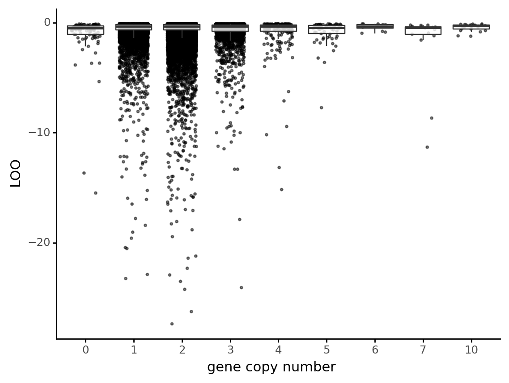

    <ggplot: (368932452)>

```python
(
    gg.ggplot(ppc_df, gg.aes(x="lfc", y="pred_mean"))
    + gg.geom_point(gg.aes(color="loo", size="np.abs(error)"))
    + gg.geom_hline(yintercept=0, linetype="--")
    + gg.geom_vline(xintercept=0, linetype="--")
    + gg.geom_smooth(se=False, alpha=0.75, color=SeabornColor.blue)
    + gg.scale_color_gradient(low="red", high="grey", alpha=0.5)
    + gg.scale_size_continuous(range=(0.3, 2))
)
```

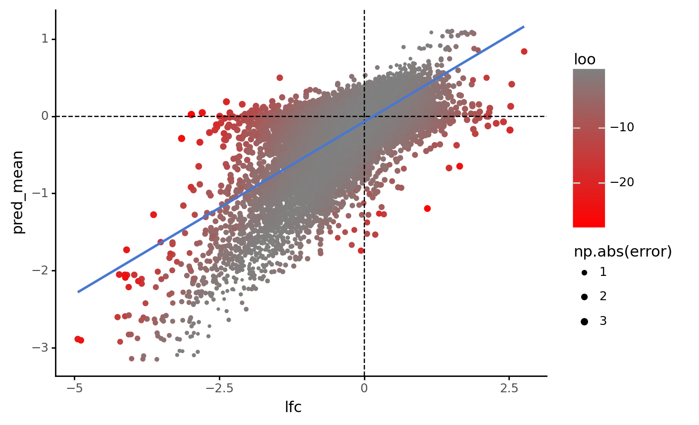

    <ggplot: (361221726)>

```python
(
    gg.ggplot(ppc_df, gg.aes(x="np.abs(error)", y="loo"))
    + gg.geom_point(gg.aes(color="lfc"), alpha=0.5)
)
```

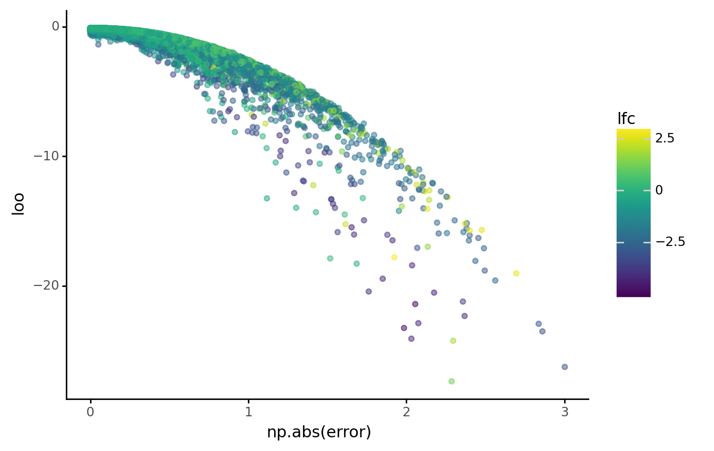

    <ggplot: (363289890)>

```python
q_post = az.summary(az_model, var_names="q", kind="stats", hdi_prob=0.89)
q_post["sgrna"] = data.sgrna.cat.categories.values
q_post.head()

ppc_df_q = ppc_df.merge(q_post, on="sgrna")

sns.jointplot(x="mean", y="loo", data=ppc_df_q);
```

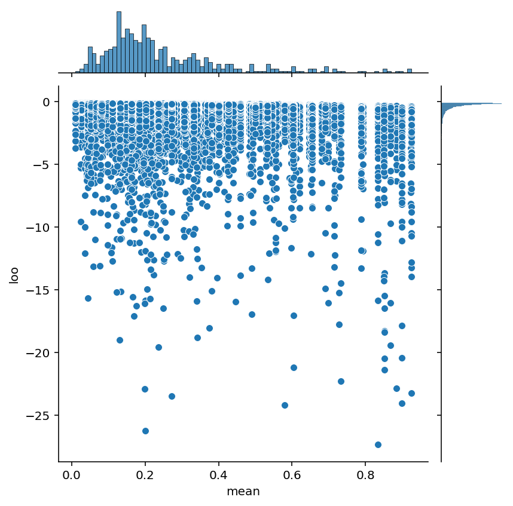

---

```python
notebook_toc = time()
print(f"execution time: {(notebook_toc - notebook_tic) / 60:.2f} minutes")
```

    execution time: 4.86 minutes

```python
%load_ext watermark
%watermark -d -u -v -iv -b -h -m
```

    Last updated: 2021-03-16

    Python implementation: CPython
    Python version       : 3.9.2
    IPython version      : 7.21.0

    Compiler    : Clang 11.0.1
    OS          : Darwin
    Release     : 20.3.0
    Machine     : x86_64
    Processor   : i386
    CPU cores   : 4
    Architecture: 64bit

    Hostname: JHCookMac

    Git branch: crc-m2

    pymc3     : 3.11.1
    pandas    : 1.2.3
    seaborn   : 0.11.1
    matplotlib: 3.3.4
    numpy     : 1.20.1
    theano    : 1.0.5
    re        : 2.2.1
    arviz     : 0.11.2
    plotnine  : 0.7.1
