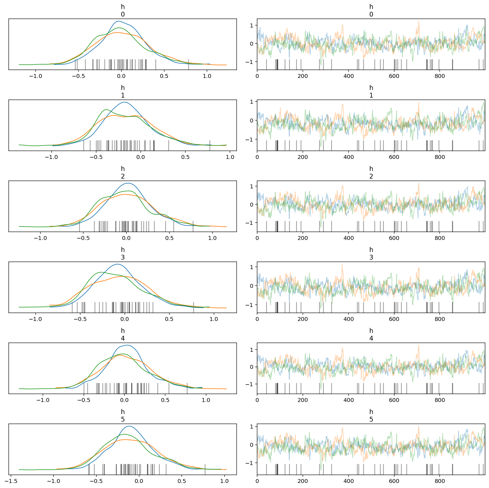
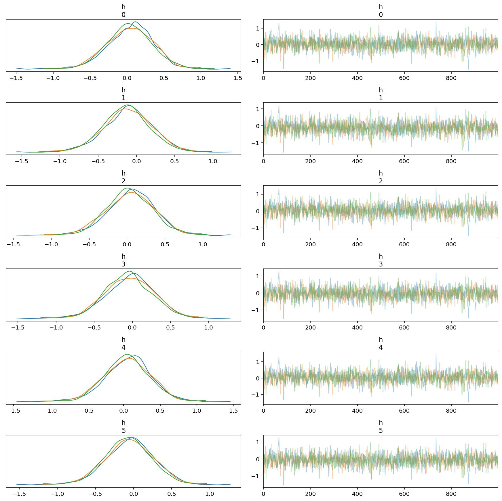
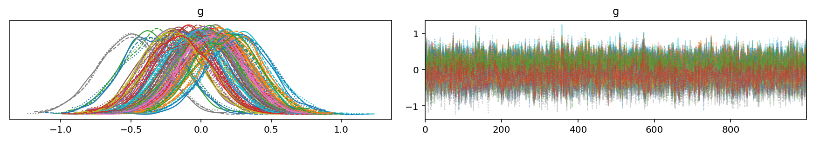
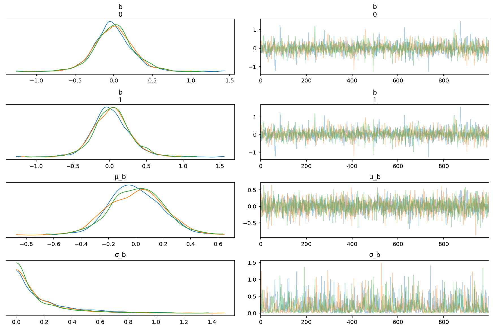
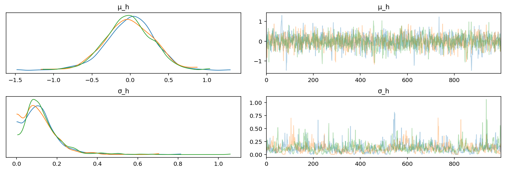
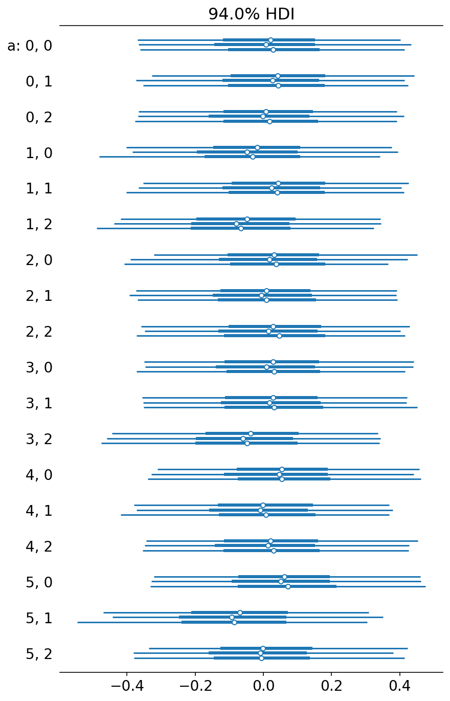
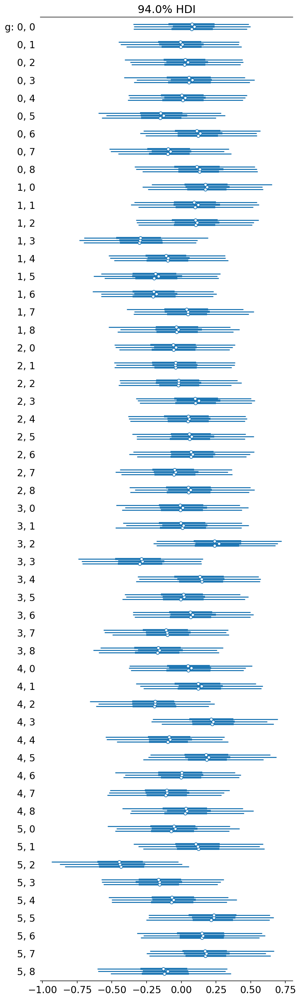

# Comparing centered and non-centered parameterizations

This notebookbook experiments with a centered (standard) and [non-centered](https://twiecki.io/blog/2017/02/08/bayesian-hierchical-non-centered/) parameterizations of the SpecletThree model.
This involves fitting 3 models (so takes around 20 minutes to run completely), the first with a normal parameterization, the second with the non-centered parameterization, and the third with the non-centered parameterization and the optional *KRAS* covariate.
It is immediately apparent that the non-centered version works much better by having 0 divergences during fitting and producing far superior trace plots.
This is true when the *KRAS* covariate is included, too.

```python
%load_ext autoreload
%autoreload 2
```

```python
import re
import string
import warnings
from pathlib import Path
from time import time

import arviz as az
import matplotlib.colors as mcolors
import matplotlib.pyplot as plt
import numpy as np
import pandas as pd
import plotnine as gg
import pymc3 as pm
import seaborn as sns
from theano import tensor as tt
```

```python
from src.io import cache_io
from src.loggers import logger
from src.modeling import pymc3_analysis as pmanal
from src.models.speclet_three import SpecletThree
```

```python
notebook_tic = time()
warnings.simplefilter(action="ignore", category=UserWarning)
%config InlineBackend.figure_format = "retina"

RANDOM_SEED = 847
np.random.seed(RANDOM_SEED)
```

## Centered parameterization

First, a SpecletThree model is fit without any reparameterization.
The core of the model is

$$
\mu = h_k + g_{k, j} + b_i
$$

for gene $k$ in cell line $j$ run in batch $i$.

We can see that there is difficulty sampling from the posterior resulting in divergences and wandering traces.

```python
sp3 = SpecletThree(
    "subsample-centered-reparamterization",
    root_cache_dir=cache_io.default_cache_dir(),
    debug=True,
    kras_cov=False,
    kras_mutation_minimum=2,
    noncentered_param=False,
)
```

```python
sp3.build_model()
sp3_mcmc_res = sp3.mcmc_sample_model(mcmc_draws=1000, tune=1000, chains=3, cores=3)
```

<pre style="white-space:pre;overflow-x:auto;line-height:normal;font-family:Menlo,'DejaVu Sans Mono',consolas,'Courier New',monospace"><span style="color: #7fbfbf; text-decoration-color: #7fbfbf">[05/26/21 07:48:29] </span><span style="color: #000080; text-decoration-color: #000080">INFO    </span> Calling `model_specification<span style="font-weight: bold">()</span>` method.     <a href="file:///Users/admin/Lab_Projects/speclet/src/models/speclet_model.py"><span style="color: #7f7f7f; text-decoration-color: #7f7f7f">speclet_model.py</span></a><span style="color: #7f7f7f; text-decoration-color: #7f7f7f">:166</span>
</pre>

<pre style="white-space:pre;overflow-x:auto;line-height:normal;font-family:Menlo,'DejaVu Sans Mono',consolas,'Courier New',monospace"><span style="color: #7fbfbf; text-decoration-color: #7fbfbf">                    </span><span style="color: #000080; text-decoration-color: #000080">INFO    </span> Beginning PyMC3 model specification.        <a href="file:///Users/admin/Lab_Projects/speclet/src/models/speclet_three.py"><span style="color: #7f7f7f; text-decoration-color: #7f7f7f">speclet_three.py</span></a><span style="color: #7f7f7f; text-decoration-color: #7f7f7f">:248</span>
</pre>

<pre style="white-space:pre;overflow-x:auto;line-height:normal;font-family:Menlo,'DejaVu Sans Mono',consolas,'Courier New',monospace"><span style="color: #7fbfbf; text-decoration-color: #7fbfbf">                    </span><span style="color: #800000; text-decoration-color: #800000">WARNING </span> Dropping data points of sgRNA that    <a href="file:///Users/admin/Lab_Projects/speclet/src/managers/model_data_managers.py"><span style="color: #7f7f7f; text-decoration-color: #7f7f7f">model_data_managers.py</span></a><span style="color: #7f7f7f; text-decoration-color: #7f7f7f">:125</span>
                             map to multiple genes.
</pre>

<pre style="white-space:pre;overflow-x:auto;line-height:normal;font-family:Menlo,'DejaVu Sans Mono',consolas,'Courier New',monospace"><span style="color: #7fbfbf; text-decoration-color: #7fbfbf">                    </span><span style="color: #800000; text-decoration-color: #800000">WARNING </span> Dropping data points with missing     <a href="file:///Users/admin/Lab_Projects/speclet/src/managers/model_data_managers.py"><span style="color: #7f7f7f; text-decoration-color: #7f7f7f">model_data_managers.py</span></a><span style="color: #7f7f7f; text-decoration-color: #7f7f7f">:131</span>
                             copy number.
</pre>

<pre style="white-space:pre;overflow-x:auto;line-height:normal;font-family:Menlo,'DejaVu Sans Mono',consolas,'Courier New',monospace"><span style="color: #7fbfbf; text-decoration-color: #7fbfbf">                    </span><span style="color: #000080; text-decoration-color: #000080">INFO    </span> Getting Theano shared variables.            <a href="file:///Users/admin/Lab_Projects/speclet/src/models/speclet_three.py"><span style="color: #7f7f7f; text-decoration-color: #7f7f7f">speclet_three.py</span></a><span style="color: #7f7f7f; text-decoration-color: #7f7f7f">:255</span>
</pre>

<pre style="white-space:pre;overflow-x:auto;line-height:normal;font-family:Menlo,'DejaVu Sans Mono',consolas,'Courier New',monospace"><span style="color: #7fbfbf; text-decoration-color: #7fbfbf">                    </span><span style="color: #000080; text-decoration-color: #000080">INFO    </span> Creating PyMC3 model <span style="font-weight: bold">(</span>centered              <a href="file:///Users/admin/Lab_Projects/speclet/src/models/speclet_three.py"><span style="color: #7f7f7f; text-decoration-color: #7f7f7f">speclet_three.py</span></a><span style="color: #7f7f7f; text-decoration-color: #7f7f7f">:276</span>
                             parameterization<span style="font-weight: bold">)</span>.
</pre>

<pre style="white-space:pre;overflow-x:auto;line-height:normal;font-family:Menlo,'DejaVu Sans Mono',consolas,'Courier New',monospace"><span style="color: #7fbfbf; text-decoration-color: #7fbfbf">[05/26/21 07:48:38] </span><span style="color: #000080; text-decoration-color: #000080">INFO    </span> Beginning MCMC sampling.                    <a href="file:///Users/admin/Lab_Projects/speclet/src/models/speclet_model.py"><span style="color: #7f7f7f; text-decoration-color: #7f7f7f">speclet_model.py</span></a><span style="color: #7f7f7f; text-decoration-color: #7f7f7f">:271</span>
</pre>

    /usr/local/Caskroom/miniconda/base/envs/speclet/lib/python3.9/site-packages/pymc3/sampling.py:466: FutureWarning: In an upcoming release, pm.sample will return an `arviz.InferenceData` object instead of a `MultiTrace` by default. You can pass return_inferencedata=True or return_inferencedata=False to be safe and silence this warning.
    Auto-assigning NUTS sampler...
    Initializing NUTS using jitter+adapt_diag...
    Multiprocess sampling (3 chains in 3 jobs)
    NUTS: [σ, σ_σ, b, σ_b, μ_b, g, σ_g, μ_g, h, σ_h, μ_h]

<div>
    <style>
        /*Turns off some styling*/
        progress {
            /*gets rid of default border in Firefox and Opera.*/
            border: none;
            /*Needs to be in here for Safari polyfill so background images work as expected.*/
            background-size: auto;
        }
        .progress-bar-interrupted, .progress-bar-interrupted::-webkit-progress-bar {
            background: #F44336;
        }
    </style>
  <progress value='6000' class='' max='6000' style='width:300px; height:20px; vertical-align: middle;'></progress>
  100.00% [6000/6000 06:08<00:00 Sampling 3 chains, 37 divergences]
</div>

    Sampling 3 chains for 1_000 tune and 1_000 draw iterations (3_000 + 3_000 draws total) took 380 seconds.
    There were 17 divergences after tuning. Increase `target_accept` or reparameterize.
    There were 11 divergences after tuning. Increase `target_accept` or reparameterize.
    There were 9 divergences after tuning. Increase `target_accept` or reparameterize.
    The estimated number of effective samples is smaller than 200 for some parameters.

<div>
    <style>
        /*Turns off some styling*/
        progress {
            /*gets rid of default border in Firefox and Opera.*/
            border: none;
            /*Needs to be in here for Safari polyfill so background images work as expected.*/
            background-size: auto;
        }
        .progress-bar-interrupted, .progress-bar-interrupted::-webkit-progress-bar {
            background: #F44336;
        }
    </style>
  <progress value='3000' class='' max='3000' style='width:300px; height:20px; vertical-align: middle;'></progress>
  100.00% [3000/3000 00:41<00:00]
</div>

<pre style="white-space:pre;overflow-x:auto;line-height:normal;font-family:Menlo,'DejaVu Sans Mono',consolas,'Courier New',monospace"><span style="color: #7fbfbf; text-decoration-color: #7fbfbf">[05/26/21 07:55:55] </span><span style="color: #000080; text-decoration-color: #000080">INFO    </span> Finished MCMC sampling - caching results.   <a href="file:///Users/admin/Lab_Projects/speclet/src/models/speclet_model.py"><span style="color: #7f7f7f; text-decoration-color: #7f7f7f">speclet_model.py</span></a><span style="color: #7f7f7f; text-decoration-color: #7f7f7f">:284</span>
</pre>

<pre style="white-space:pre;overflow-x:auto;line-height:normal;font-family:Menlo,'DejaVu Sans Mono',consolas,'Courier New',monospace"><span style="color: #7fbfbf; text-decoration-color: #7fbfbf">                    </span><span style="color: #000080; text-decoration-color: #000080">INFO    </span> Caching InferenceData to <span style="color: #008000; text-decoration-color: #008000">'/Users/admin/Lab</span> <a href="file:///Users/admin/Lab_Projects/speclet/src/managers/cache_managers.py"><span style="color: #7f7f7f; text-decoration-color: #7f7f7f">cache_managers.py</span></a><span style="color: #7f7f7f; text-decoration-color: #7f7f7f">:245</span>
                             <span style="color: #008000; text-decoration-color: #008000">_Projects/speclet/models/speclet-three_sub</span>
                             <span style="color: #008000; text-decoration-color: #008000">sample-centered-reparamterization/mcmc/inf</span>
                             <span style="color: #008000; text-decoration-color: #008000">erence-data.nc'</span>.
</pre>

```python
az.plot_trace(sp3_mcmc_res, var_names=["h"], compact=False);
```



## Non-centered reparamaterization

Now the same model is fit but reparameterization using the non-centered method.
There are no divergences during sampling and the resulting trace plots look perfect.

```python
sp3_noncentered = SpecletThree(
    "subsample-noncentered-reparamterization",
    root_cache_dir=cache_io.default_cache_dir(),
    debug=True,
    kras_cov=False,
    kras_mutation_minimum=2,
    noncentered_param=True,
)
```

```python
sp3_noncentered.build_model()
sp3_mcmc_res_noncentered = sp3_noncentered.mcmc_sample_model(
    mcmc_draws=1000, tune=1000, chains=3, cores=3
)
```

<pre style="white-space:pre;overflow-x:auto;line-height:normal;font-family:Menlo,'DejaVu Sans Mono',consolas,'Courier New',monospace"><span style="color: #7fbfbf; text-decoration-color: #7fbfbf">[05/26/21 07:55:59] </span><span style="color: #000080; text-decoration-color: #000080">INFO    </span> Calling `model_specification<span style="font-weight: bold">()</span>` method.     <a href="file:///Users/admin/Lab_Projects/speclet/src/models/speclet_model.py"><span style="color: #7f7f7f; text-decoration-color: #7f7f7f">speclet_model.py</span></a><span style="color: #7f7f7f; text-decoration-color: #7f7f7f">:166</span>
</pre>

<pre style="white-space:pre;overflow-x:auto;line-height:normal;font-family:Menlo,'DejaVu Sans Mono',consolas,'Courier New',monospace"><span style="color: #7fbfbf; text-decoration-color: #7fbfbf">                    </span><span style="color: #000080; text-decoration-color: #000080">INFO    </span> Beginning PyMC3 model specification.        <a href="file:///Users/admin/Lab_Projects/speclet/src/models/speclet_three.py"><span style="color: #7f7f7f; text-decoration-color: #7f7f7f">speclet_three.py</span></a><span style="color: #7f7f7f; text-decoration-color: #7f7f7f">:248</span>
</pre>

<pre style="white-space:pre;overflow-x:auto;line-height:normal;font-family:Menlo,'DejaVu Sans Mono',consolas,'Courier New',monospace"><span style="color: #7fbfbf; text-decoration-color: #7fbfbf">                    </span><span style="color: #000080; text-decoration-color: #000080">INFO    </span> Getting Theano shared variables.            <a href="file:///Users/admin/Lab_Projects/speclet/src/models/speclet_three.py"><span style="color: #7f7f7f; text-decoration-color: #7f7f7f">speclet_three.py</span></a><span style="color: #7f7f7f; text-decoration-color: #7f7f7f">:255</span>
</pre>

<pre style="white-space:pre;overflow-x:auto;line-height:normal;font-family:Menlo,'DejaVu Sans Mono',consolas,'Courier New',monospace"><span style="color: #7fbfbf; text-decoration-color: #7fbfbf">                    </span><span style="color: #000080; text-decoration-color: #000080">INFO    </span> Creating PyMC3 model <span style="font-weight: bold">(</span>non-centered          <a href="file:///Users/admin/Lab_Projects/speclet/src/models/speclet_three.py"><span style="color: #7f7f7f; text-decoration-color: #7f7f7f">speclet_three.py</span></a><span style="color: #7f7f7f; text-decoration-color: #7f7f7f">:264</span>
                             parameterization<span style="font-weight: bold">)</span>.
</pre>

<pre style="white-space:pre;overflow-x:auto;line-height:normal;font-family:Menlo,'DejaVu Sans Mono',consolas,'Courier New',monospace"><span style="color: #7fbfbf; text-decoration-color: #7fbfbf">[05/26/21 07:56:01] </span><span style="color: #000080; text-decoration-color: #000080">INFO    </span> Beginning MCMC sampling.                    <a href="file:///Users/admin/Lab_Projects/speclet/src/models/speclet_model.py"><span style="color: #7f7f7f; text-decoration-color: #7f7f7f">speclet_model.py</span></a><span style="color: #7f7f7f; text-decoration-color: #7f7f7f">:271</span>
</pre>

    /usr/local/Caskroom/miniconda/base/envs/speclet/lib/python3.9/site-packages/pymc3/sampling.py:466: FutureWarning: In an upcoming release, pm.sample will return an `arviz.InferenceData` object instead of a `MultiTrace` by default. You can pass return_inferencedata=True or return_inferencedata=False to be safe and silence this warning.
    Auto-assigning NUTS sampler...
    Initializing NUTS using jitter+adapt_diag...
    Multiprocess sampling (3 chains in 3 jobs)
    NUTS: [σ, σ_σ, b_offset, σ_b, μ_b, g_offset, σ_g, μ_g, h_offset, σ_h, μ_h]

<div>
    <style>
        /*Turns off some styling*/
        progress {
            /*gets rid of default border in Firefox and Opera.*/
            border: none;
            /*Needs to be in here for Safari polyfill so background images work as expected.*/
            background-size: auto;
        }
        .progress-bar-interrupted, .progress-bar-interrupted::-webkit-progress-bar {
            background: #F44336;
        }
    </style>
  <progress value='6000' class='' max='6000' style='width:300px; height:20px; vertical-align: middle;'></progress>
  100.00% [6000/6000 06:08<00:00 Sampling 3 chains, 0 divergences]
</div>

    Sampling 3 chains for 1_000 tune and 1_000 draw iterations (3_000 + 3_000 draws total) took 384 seconds.
    The number of effective samples is smaller than 25% for some parameters.

<div>
    <style>
        /*Turns off some styling*/
        progress {
            /*gets rid of default border in Firefox and Opera.*/
            border: none;
            /*Needs to be in here for Safari polyfill so background images work as expected.*/
            background-size: auto;
        }
        .progress-bar-interrupted, .progress-bar-interrupted::-webkit-progress-bar {
            background: #F44336;
        }
    </style>
  <progress value='3000' class='' max='3000' style='width:300px; height:20px; vertical-align: middle;'></progress>
  100.00% [3000/3000 00:41<00:00]
</div>

<pre style="white-space:pre;overflow-x:auto;line-height:normal;font-family:Menlo,'DejaVu Sans Mono',consolas,'Courier New',monospace"><span style="color: #7fbfbf; text-decoration-color: #7fbfbf">[05/26/21 08:03:18] </span><span style="color: #000080; text-decoration-color: #000080">INFO    </span> Finished MCMC sampling - caching results.   <a href="file:///Users/admin/Lab_Projects/speclet/src/models/speclet_model.py"><span style="color: #7f7f7f; text-decoration-color: #7f7f7f">speclet_model.py</span></a><span style="color: #7f7f7f; text-decoration-color: #7f7f7f">:284</span>
</pre>

<pre style="white-space:pre;overflow-x:auto;line-height:normal;font-family:Menlo,'DejaVu Sans Mono',consolas,'Courier New',monospace"><span style="color: #7fbfbf; text-decoration-color: #7fbfbf">                    </span><span style="color: #000080; text-decoration-color: #000080">INFO    </span> Caching InferenceData to <span style="color: #008000; text-decoration-color: #008000">'/Users/admin/Lab</span> <a href="file:///Users/admin/Lab_Projects/speclet/src/managers/cache_managers.py"><span style="color: #7f7f7f; text-decoration-color: #7f7f7f">cache_managers.py</span></a><span style="color: #7f7f7f; text-decoration-color: #7f7f7f">:245</span>
                             <span style="color: #008000; text-decoration-color: #008000">_Projects/speclet/models/speclet-three_sub</span>
                             <span style="color: #008000; text-decoration-color: #008000">sample-noncentered-reparamterization/mcmc/</span>
                             <span style="color: #008000; text-decoration-color: #008000">inference-data.nc'</span>.
</pre>

```python
az.plot_trace(sp3_mcmc_res_noncentered, var_names=["h"], compact=False);
```



```python
az.plot_trace(sp3_mcmc_res_noncentered, var_names=["g"], compact=True);
```



```python
az.plot_trace(sp3_mcmc_res_noncentered, var_names=["b", "μ_b", "σ_b"], compact=False);
```



```python
az.plot_trace(sp3_mcmc_res_noncentered, var_names=["μ_h", "σ_h"], compact=False);
```



## Non-centered reparamaterization with the *KRAS* covariate

Finally, the *KRAS* covariate is included and the model still samples great.
The model now has the following core structure

$$
\mu = h_k + g_{k, j} + a_{k, p} + b_i
$$

for *KRAS* allele $p$.

```python
sp3_noncentered_kras = SpecletThree(
    "subsample-noncentered-reparamterization-kras",
    root_cache_dir=cache_io.default_cache_dir(),
    debug=True,
    kras_cov=True,
    kras_mutation_minimum=2,
    noncentered_param=True,
)
```

```python
sp3_noncentered_kras.build_model()
sp3_mcmc_res_noncentered_kras = sp3_noncentered_kras.mcmc_sample_model(
    mcmc_draws=1000, tune=1000, chains=3, cores=3
)
```

<pre style="white-space:pre;overflow-x:auto;line-height:normal;font-family:Menlo,'DejaVu Sans Mono',consolas,'Courier New',monospace"><span style="color: #7fbfbf; text-decoration-color: #7fbfbf">[05/26/21 08:03:28] </span><span style="color: #000080; text-decoration-color: #000080">INFO    </span> Calling `model_specification<span style="font-weight: bold">()</span>` method.     <a href="file:///Users/admin/Lab_Projects/speclet/src/models/speclet_model.py"><span style="color: #7f7f7f; text-decoration-color: #7f7f7f">speclet_model.py</span></a><span style="color: #7f7f7f; text-decoration-color: #7f7f7f">:166</span>
</pre>

<pre style="white-space:pre;overflow-x:auto;line-height:normal;font-family:Menlo,'DejaVu Sans Mono',consolas,'Courier New',monospace"><span style="color: #7fbfbf; text-decoration-color: #7fbfbf">                    </span><span style="color: #000080; text-decoration-color: #000080">INFO    </span> Beginning PyMC3 model specification.        <a href="file:///Users/admin/Lab_Projects/speclet/src/models/speclet_three.py"><span style="color: #7f7f7f; text-decoration-color: #7f7f7f">speclet_three.py</span></a><span style="color: #7f7f7f; text-decoration-color: #7f7f7f">:248</span>
</pre>

<pre style="white-space:pre;overflow-x:auto;line-height:normal;font-family:Menlo,'DejaVu Sans Mono',consolas,'Courier New',monospace"><span style="color: #7fbfbf; text-decoration-color: #7fbfbf">                    </span><span style="color: #000080; text-decoration-color: #000080">INFO    </span> Getting Theano shared variables.            <a href="file:///Users/admin/Lab_Projects/speclet/src/models/speclet_three.py"><span style="color: #7f7f7f; text-decoration-color: #7f7f7f">speclet_three.py</span></a><span style="color: #7f7f7f; text-decoration-color: #7f7f7f">:255</span>
</pre>

<pre style="white-space:pre;overflow-x:auto;line-height:normal;font-family:Menlo,'DejaVu Sans Mono',consolas,'Courier New',monospace"><span style="color: #7fbfbf; text-decoration-color: #7fbfbf">                    </span><span style="color: #000080; text-decoration-color: #000080">INFO    </span> Creating PyMC3 model <span style="font-weight: bold">(</span>non-centered          <a href="file:///Users/admin/Lab_Projects/speclet/src/models/speclet_three.py"><span style="color: #7f7f7f; text-decoration-color: #7f7f7f">speclet_three.py</span></a><span style="color: #7f7f7f; text-decoration-color: #7f7f7f">:264</span>
                             parameterization<span style="font-weight: bold">)</span>.
</pre>

<pre style="white-space:pre;overflow-x:auto;line-height:normal;font-family:Menlo,'DejaVu Sans Mono',consolas,'Courier New',monospace"><span style="color: #7fbfbf; text-decoration-color: #7fbfbf">[05/26/21 08:03:30] </span><span style="color: #000080; text-decoration-color: #000080">INFO    </span> Beginning MCMC sampling.                    <a href="file:///Users/admin/Lab_Projects/speclet/src/models/speclet_model.py"><span style="color: #7f7f7f; text-decoration-color: #7f7f7f">speclet_model.py</span></a><span style="color: #7f7f7f; text-decoration-color: #7f7f7f">:271</span>
</pre>

    /usr/local/Caskroom/miniconda/base/envs/speclet/lib/python3.9/site-packages/pymc3/sampling.py:466: FutureWarning: In an upcoming release, pm.sample will return an `arviz.InferenceData` object instead of a `MultiTrace` by default. You can pass return_inferencedata=True or return_inferencedata=False to be safe and silence this warning.
    Auto-assigning NUTS sampler...
    Initializing NUTS using jitter+adapt_diag...
    Multiprocess sampling (3 chains in 3 jobs)
    NUTS: [σ, σ_σ, a_offset, σ_a, μ_a, b_offset, σ_b, μ_b, g_offset, σ_g, μ_g, h_offset, σ_h, μ_h]

<div>
    <style>
        /*Turns off some styling*/
        progress {
            /*gets rid of default border in Firefox and Opera.*/
            border: none;
            /*Needs to be in here for Safari polyfill so background images work as expected.*/
            background-size: auto;
        }
        .progress-bar-interrupted, .progress-bar-interrupted::-webkit-progress-bar {
            background: #F44336;
        }
    </style>
  <progress value='6000' class='' max='6000' style='width:300px; height:20px; vertical-align: middle;'></progress>
  100.00% [6000/6000 10:21<00:00 Sampling 3 chains, 1 divergences]
</div>

    Sampling 3 chains for 1_000 tune and 1_000 draw iterations (3_000 + 3_000 draws total) took 641 seconds.
    There was 1 divergence after tuning. Increase `target_accept` or reparameterize.
    The number of effective samples is smaller than 25% for some parameters.

<div>
    <style>
        /*Turns off some styling*/
        progress {
            /*gets rid of default border in Firefox and Opera.*/
            border: none;
            /*Needs to be in here for Safari polyfill so background images work as expected.*/
            background-size: auto;
        }
        .progress-bar-interrupted, .progress-bar-interrupted::-webkit-progress-bar {
            background: #F44336;
        }
    </style>
  <progress value='3000' class='' max='3000' style='width:300px; height:20px; vertical-align: middle;'></progress>
  100.00% [3000/3000 00:50<00:00]
</div>

<pre style="white-space:pre;overflow-x:auto;line-height:normal;font-family:Menlo,'DejaVu Sans Mono',consolas,'Courier New',monospace"><span style="color: #7fbfbf; text-decoration-color: #7fbfbf">[05/26/21 08:15:18] </span><span style="color: #000080; text-decoration-color: #000080">INFO    </span> Finished MCMC sampling - caching results.   <a href="file:///Users/admin/Lab_Projects/speclet/src/models/speclet_model.py"><span style="color: #7f7f7f; text-decoration-color: #7f7f7f">speclet_model.py</span></a><span style="color: #7f7f7f; text-decoration-color: #7f7f7f">:284</span>
</pre>

<pre style="white-space:pre;overflow-x:auto;line-height:normal;font-family:Menlo,'DejaVu Sans Mono',consolas,'Courier New',monospace"><span style="color: #7fbfbf; text-decoration-color: #7fbfbf">                    </span><span style="color: #000080; text-decoration-color: #000080">INFO    </span> Caching InferenceData to <span style="color: #008000; text-decoration-color: #008000">'/Users/admin/Lab</span> <a href="file:///Users/admin/Lab_Projects/speclet/src/managers/cache_managers.py"><span style="color: #7f7f7f; text-decoration-color: #7f7f7f">cache_managers.py</span></a><span style="color: #7f7f7f; text-decoration-color: #7f7f7f">:245</span>
                             <span style="color: #008000; text-decoration-color: #008000">_Projects/speclet/models/speclet-three_sub</span>
                             <span style="color: #008000; text-decoration-color: #008000">sample-noncentered-reparamterization-kras/</span>
                             <span style="color: #008000; text-decoration-color: #008000">mcmc/inference-data.nc'</span>.
</pre>

```python
az.plot_trace(sp3_mcmc_res_noncentered_kras, var_names=["h"], compact=False);
```


```python
az.plot_forest(sp3_mcmc_res_noncentered_kras, var_names=["a"]);
```



```python
az.plot_forest(sp3_mcmc_res_noncentered_kras, var_names=["g"]);
```



---

```python
notebook_toc = time()
print(f"execution time: {(notebook_toc - notebook_tic) / 60:.2f} minutes")
```

    execution time: 26.96 minutes

```python
%load_ext watermark
%watermark -d -u -v -iv -b -h -m
```

    Last updated: 2021-05-26

    Python implementation: CPython
    Python version       : 3.9.2
    IPython version      : 7.21.0

    Compiler    : Clang 11.0.1
    OS          : Darwin
    Release     : 20.4.0
    Machine     : x86_64
    Processor   : i386
    CPU cores   : 4
    Architecture: 64bit

    Hostname: JHCookMac.local

    Git branch: noncentered-reparam

    arviz     : 0.11.2
    plotnine  : 0.7.1
    re        : 2.2.1
    matplotlib: 3.3.4
    pymc3     : 3.11.1
    seaborn   : 0.11.1
    pandas    : 1.2.3
    numpy     : 1.20.1
    theano    : 1.0.5
