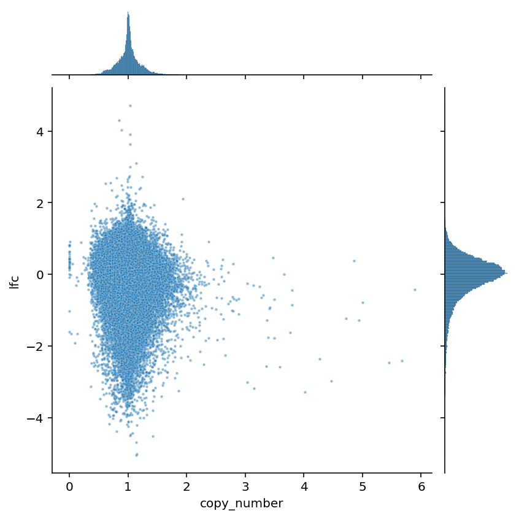

```python
%load_ext autoreload
%autoreload 2
```

```python
import warnings
from pathlib import Path
from time import time

import dask
import dask.dataframe as dd
import matplotlib.colors as mcolors
import matplotlib.pyplot as plt
import numpy as np
import pandas as pd
import plotnine as gg
import seaborn as sns
from dask.distributed import Client, progress
```

```python
from src.data_processing import achilles as achelp
from src.data_processing import common as dphelp
from src.io import cache_io, data_io
from src.loggers import logger
from src.plot.color_pal import SeabornColor
```

```python
notebook_tic = time()

warnings.simplefilter(action="ignore", category=UserWarning)

gg.theme_set(
    gg.theme_bw()
    + gg.theme(
        figure_size=(4, 4),
        axis_ticks_major=gg.element_blank(),
        strip_background=gg.element_blank(),
    )
)
%config InlineBackend.figure_format = "retina"

RANDOM_SEED = 847
np.random.seed(RANDOM_SEED)
```

## Setup

```python
client = Client(n_workers=4, threads_per_worker=4, memory_limit="16GB")
client
```

<div>
    <div style="width: 24px; height: 24px; background-color: #e1e1e1; border: 3px solid #9D9D9D; border-radius: 5px; position: absolute;"> </div>
    <div style="margin-left: 48px;">
        <h3 style="margin-bottom: 0px;">Client</h3>
        <p style="color: #9D9D9D; margin-bottom: 0px;">Client-67eb9db2-22e4-11ec-8fee-0cc47ab2b380</p>
        <table style="width: 100%; text-align: left;">

        <tr>

            <td style="text-align: left;"><strong>Connection method:</strong> Cluster object</td>
            <td style="text-align: left;"><strong>Cluster type:</strong> distributed.LocalCluster</td>

        </tr>


            <tr>
                <td style="text-align: left;">
                    <strong>Dashboard: </strong> <a href="http://127.0.0.1:8787/status" target="_blank">http://127.0.0.1:8787/status</a>
                </td>
                <td style="text-align: left;"></td>
            </tr>


        </table>


            <details>
            <summary style="margin-bottom: 20px;"><h3 style="display: inline;">Cluster Info</h3></summary>
            <div class="jp-RenderedHTMLCommon jp-RenderedHTML jp-mod-trusted jp-OutputArea-output">
    <div style="width: 24px; height: 24px; background-color: #e1e1e1; border: 3px solid #9D9D9D; border-radius: 5px; position: absolute;">
    </div>
    <div style="margin-left: 48px;">
        <h3 style="margin-bottom: 0px; margin-top: 0px;">LocalCluster</h3>
        <p style="color: #9D9D9D; margin-bottom: 0px;">37815af2</p>
        <table style="width: 100%; text-align: left;">
            <tr>
                <td style="text-align: left;">
                    <strong>Dashboard:</strong> <a href="http://127.0.0.1:8787/status" target="_blank">http://127.0.0.1:8787/status</a>
                </td>
                <td style="text-align: left;">
                    <strong>Workers:</strong> 4
                </td>
            </tr>
            <tr>
                <td style="text-align: left;">
                    <strong>Total threads:</strong> 16
                </td>
                <td style="text-align: left;">
                    <strong>Total memory:</strong> 59.60 GiB
                </td>
            </tr>

            <tr>
    <td style="text-align: left;"><strong>Status:</strong> running</td>
    <td style="text-align: left;"><strong>Using processes:</strong> True</td>
</tr>

        </table>

        <details>
            <summary style="margin-bottom: 20px;">
                <h3 style="display: inline;">Scheduler Info</h3>
            </summary>

            <div style="">
    <div>
        <div style="width: 24px; height: 24px; background-color: #FFF7E5; border: 3px solid #FF6132; border-radius: 5px; position: absolute;"> </div>
        <div style="margin-left: 48px;">
            <h3 style="margin-bottom: 0px;">Scheduler</h3>
            <p style="color: #9D9D9D; margin-bottom: 0px;">Scheduler-09ef3ea6-7ad1-4131-b0bd-e5518c2197e6</p>
            <table style="width: 100%; text-align: left;">
                <tr>
                    <td style="text-align: left;">
                        <strong>Comm:</strong> tcp://127.0.0.1:44995
                    </td>
                    <td style="text-align: left;">
                        <strong>Workers:</strong> 4
                    </td>
                </tr>
                <tr>
                    <td style="text-align: left;">
                        <strong>Dashboard:</strong> <a href="http://127.0.0.1:8787/status" target="_blank">http://127.0.0.1:8787/status</a>
                    </td>
                    <td style="text-align: left;">
                        <strong>Total threads:</strong> 16
                    </td>
                </tr>
                <tr>
                    <td style="text-align: left;">
                        <strong>Started:</strong> Just now
                    </td>
                    <td style="text-align: left;">
                        <strong>Total memory:</strong> 59.60 GiB
                    </td>
                </tr>
            </table>
        </div>
    </div>

    <details style="margin-left: 48px;">
        <summary style="margin-bottom: 20px;">
            <h3 style="display: inline;">Workers</h3>
        </summary>


        <div style="margin-bottom: 20px;">
            <div style="width: 24px; height: 24px; background-color: #DBF5FF; border: 3px solid #4CC9FF; border-radius: 5px; position: absolute;"> </div>
            <div style="margin-left: 48px;">
            <details>
                <summary>
                    <h4 style="margin-bottom: 0px; display: inline;">Worker: 0</h4>
                </summary>
                <table style="width: 100%; text-align: left;">
                    <tr>
                        <td style="text-align: left;">
                            <strong>Comm: </strong> tcp://127.0.0.1:43928
                        </td>
                        <td style="text-align: left;">
                            <strong>Total threads: </strong> 4
                        </td>
                    </tr>
                    <tr>
                        <td style="text-align: left;">
                            <strong>Dashboard: </strong> <a href="http://127.0.0.1:35778/status" target="_blank">http://127.0.0.1:35778/status</a>
                        </td>
                        <td style="text-align: left;">
                            <strong>Memory: </strong> 14.90 GiB
                        </td>
                    </tr>
                    <tr>
                        <td style="text-align: left;">
                            <strong>Nanny: </strong> tcp://127.0.0.1:34661
                        </td>
                        <td style="text-align: left;"></td>
                    </tr>
                    <tr>
                        <td colspan="2" style="text-align: left;">
                            <strong>Local directory: </strong> /n/data1/hms/dbmi/park/Cook/speclet/notebooks/data-exploration/dask-worker-space/worker-d_oar12o
                        </td>
                    </tr>


                </table>
            </details>
            </div>
        </div>

        <div style="margin-bottom: 20px;">
            <div style="width: 24px; height: 24px; background-color: #DBF5FF; border: 3px solid #4CC9FF; border-radius: 5px; position: absolute;"> </div>
            <div style="margin-left: 48px;">
            <details>
                <summary>
                    <h4 style="margin-bottom: 0px; display: inline;">Worker: 1</h4>
                </summary>
                <table style="width: 100%; text-align: left;">
                    <tr>
                        <td style="text-align: left;">
                            <strong>Comm: </strong> tcp://127.0.0.1:46427
                        </td>
                        <td style="text-align: left;">
                            <strong>Total threads: </strong> 4
                        </td>
                    </tr>
                    <tr>
                        <td style="text-align: left;">
                            <strong>Dashboard: </strong> <a href="http://127.0.0.1:33616/status" target="_blank">http://127.0.0.1:33616/status</a>
                        </td>
                        <td style="text-align: left;">
                            <strong>Memory: </strong> 14.90 GiB
                        </td>
                    </tr>
                    <tr>
                        <td style="text-align: left;">
                            <strong>Nanny: </strong> tcp://127.0.0.1:36004
                        </td>
                        <td style="text-align: left;"></td>
                    </tr>
                    <tr>
                        <td colspan="2" style="text-align: left;">
                            <strong>Local directory: </strong> /n/data1/hms/dbmi/park/Cook/speclet/notebooks/data-exploration/dask-worker-space/worker-hm1cwqm2
                        </td>
                    </tr>


                </table>
            </details>
            </div>
        </div>

        <div style="margin-bottom: 20px;">
            <div style="width: 24px; height: 24px; background-color: #DBF5FF; border: 3px solid #4CC9FF; border-radius: 5px; position: absolute;"> </div>
            <div style="margin-left: 48px;">
            <details>
                <summary>
                    <h4 style="margin-bottom: 0px; display: inline;">Worker: 2</h4>
                </summary>
                <table style="width: 100%; text-align: left;">
                    <tr>
                        <td style="text-align: left;">
                            <strong>Comm: </strong> tcp://127.0.0.1:38750
                        </td>
                        <td style="text-align: left;">
                            <strong>Total threads: </strong> 4
                        </td>
                    </tr>
                    <tr>
                        <td style="text-align: left;">
                            <strong>Dashboard: </strong> <a href="http://127.0.0.1:43428/status" target="_blank">http://127.0.0.1:43428/status</a>
                        </td>
                        <td style="text-align: left;">
                            <strong>Memory: </strong> 14.90 GiB
                        </td>
                    </tr>
                    <tr>
                        <td style="text-align: left;">
                            <strong>Nanny: </strong> tcp://127.0.0.1:37513
                        </td>
                        <td style="text-align: left;"></td>
                    </tr>
                    <tr>
                        <td colspan="2" style="text-align: left;">
                            <strong>Local directory: </strong> /n/data1/hms/dbmi/park/Cook/speclet/notebooks/data-exploration/dask-worker-space/worker-5rn9v9ur
                        </td>
                    </tr>


                </table>
            </details>
            </div>
        </div>

        <div style="margin-bottom: 20px;">
            <div style="width: 24px; height: 24px; background-color: #DBF5FF; border: 3px solid #4CC9FF; border-radius: 5px; position: absolute;"> </div>
            <div style="margin-left: 48px;">
            <details>
                <summary>
                    <h4 style="margin-bottom: 0px; display: inline;">Worker: 3</h4>
                </summary>
                <table style="width: 100%; text-align: left;">
                    <tr>
                        <td style="text-align: left;">
                            <strong>Comm: </strong> tcp://127.0.0.1:40528
                        </td>
                        <td style="text-align: left;">
                            <strong>Total threads: </strong> 4
                        </td>
                    </tr>
                    <tr>
                        <td style="text-align: left;">
                            <strong>Dashboard: </strong> <a href="http://127.0.0.1:44965/status" target="_blank">http://127.0.0.1:44965/status</a>
                        </td>
                        <td style="text-align: left;">
                            <strong>Memory: </strong> 14.90 GiB
                        </td>
                    </tr>
                    <tr>
                        <td style="text-align: left;">
                            <strong>Nanny: </strong> tcp://127.0.0.1:39195
                        </td>
                        <td style="text-align: left;"></td>
                    </tr>
                    <tr>
                        <td colspan="2" style="text-align: left;">
                            <strong>Local directory: </strong> /n/data1/hms/dbmi/park/Cook/speclet/notebooks/data-exploration/dask-worker-space/worker-qv1s_zty
                        </td>
                    </tr>


                </table>
            </details>
            </div>
        </div>


    </details>
</div>

        </details>
    </div>
</div>
            </details>

    </div>
</div>

```python
data_path = data_io.data_path(data_io.DataFile.DEPMAP_DATA)
if data_path.exists():
    print(f"data file: '{data_path.as_posix()}'")
else:
    raise FileNotFoundError(data_path)
```

    data file: '/n/data1/hms/dbmi/park/Cook/speclet/modeling_data/depmap_modeling_dataframe.csv'

```python
data_types: dict[str, str] = {"age": "float64"}
for a in ["p_dna_batch", "replicate_id", "primary_or_metastasis", "is_male"]:
    data_types[a] = "category"

screen_data = dd.read_csv(data_path, dtype=data_types, low_memory=False)
```

## Basic statistics

```python
screen_data.head()
```

<div>
<style scoped>
    .dataframe tbody tr th:only-of-type {
        vertical-align: middle;
    }

    .dataframe tbody tr th {
        vertical-align: top;
    }

    .dataframe thead th {
        text-align: right;
    }
</style>
<table border="1" class="dataframe">
  <thead>
    <tr style="text-align: right;">
      <th></th>
      <th>sgrna</th>
      <th>replicate_id</th>
      <th>lfc</th>
      <th>p_dna_batch</th>
      <th>genome_alignment</th>
      <th>hugo_symbol</th>
      <th>screen</th>
      <th>multiple_hits_on_gene</th>
      <th>sgrna_target_chr</th>
      <th>sgrna_target_pos</th>
      <th>...</th>
      <th>num_mutations</th>
      <th>any_deleterious</th>
      <th>any_tcga_hotspot</th>
      <th>any_cosmic_hotspot</th>
      <th>is_mutated</th>
      <th>copy_number</th>
      <th>lineage</th>
      <th>primary_or_metastasis</th>
      <th>is_male</th>
      <th>age</th>
    </tr>
  </thead>
  <tbody>
    <tr>
      <th>0</th>
      <td>AAACCTGCGGCGGTCGCCA</td>
      <td>OVR3_c905R1</td>
      <td>-0.299958</td>
      <td>CRISPR_C6596666.sample</td>
      <td>chr8_66505451_-</td>
      <td>VXN</td>
      <td>sanger</td>
      <td>True</td>
      <td>8</td>
      <td>66505451</td>
      <td>...</td>
      <td>0</td>
      <td>NaN</td>
      <td>NaN</td>
      <td>NaN</td>
      <td>False</td>
      <td>1.139595</td>
      <td>ovary</td>
      <td>metastasis</td>
      <td>FALSE</td>
      <td>60.0</td>
    </tr>
    <tr>
      <th>1</th>
      <td>AACAGCACACCGGCCCCGT</td>
      <td>OVR3_c905R1</td>
      <td>0.267092</td>
      <td>CRISPR_C6596666.sample</td>
      <td>chrX_156009834_-</td>
      <td>IL9R</td>
      <td>sanger</td>
      <td>True</td>
      <td>X</td>
      <td>156009834</td>
      <td>...</td>
      <td>0</td>
      <td>NaN</td>
      <td>NaN</td>
      <td>NaN</td>
      <td>False</td>
      <td>0.656377</td>
      <td>ovary</td>
      <td>metastasis</td>
      <td>FALSE</td>
      <td>60.0</td>
    </tr>
    <tr>
      <th>2</th>
      <td>AACCTCCGGACTCCTCAGC</td>
      <td>OVR3_c905R1</td>
      <td>0.550477</td>
      <td>CRISPR_C6596666.sample</td>
      <td>chr7_39609658_-</td>
      <td>YAE1</td>
      <td>sanger</td>
      <td>True</td>
      <td>7</td>
      <td>39609658</td>
      <td>...</td>
      <td>0</td>
      <td>NaN</td>
      <td>NaN</td>
      <td>NaN</td>
      <td>False</td>
      <td>0.923715</td>
      <td>ovary</td>
      <td>metastasis</td>
      <td>FALSE</td>
      <td>60.0</td>
    </tr>
    <tr>
      <th>3</th>
      <td>AACTCAAACTGACGCCGAA</td>
      <td>OVR3_c905R1</td>
      <td>-0.391922</td>
      <td>CRISPR_C6596666.sample</td>
      <td>chr1_117623388_-</td>
      <td>TENT5C</td>
      <td>sanger</td>
      <td>True</td>
      <td>1</td>
      <td>117623388</td>
      <td>...</td>
      <td>0</td>
      <td>NaN</td>
      <td>NaN</td>
      <td>NaN</td>
      <td>False</td>
      <td>1.352975</td>
      <td>ovary</td>
      <td>metastasis</td>
      <td>FALSE</td>
      <td>60.0</td>
    </tr>
    <tr>
      <th>4</th>
      <td>AACTGACCTTGAAACGCTG</td>
      <td>OVR3_c905R1</td>
      <td>-1.562577</td>
      <td>CRISPR_C6596666.sample</td>
      <td>chr16_66933623_+</td>
      <td>CIAO2B</td>
      <td>sanger</td>
      <td>True</td>
      <td>16</td>
      <td>66933623</td>
      <td>...</td>
      <td>0</td>
      <td>NaN</td>
      <td>NaN</td>
      <td>NaN</td>
      <td>False</td>
      <td>1.157211</td>
      <td>ovary</td>
      <td>metastasis</td>
      <td>FALSE</td>
      <td>60.0</td>
    </tr>
  </tbody>
</table>
<p>5 rows × 24 columns</p>
</div>

```python
screen_data.columns
```

    Index(['sgrna', 'replicate_id', 'lfc', 'p_dna_batch', 'genome_alignment',
           'hugo_symbol', 'screen', 'multiple_hits_on_gene', 'sgrna_target_chr',
           'sgrna_target_pos', 'depmap_id', 'counts_final', 'counts_initial',
           'rna_expr', 'num_mutations', 'any_deleterious', 'any_tcga_hotspot',
           'any_cosmic_hotspot', 'is_mutated', 'copy_number', 'lineage',
           'primary_or_metastasis', 'is_male', 'age'],
          dtype='object')

```python
print("stats for all data:")

for col, lbl in {
    "sgrna": "sgRNA",
    "hugo_symbol": "genes",
    "depmap_id": "cell lines",
    "lineage": "lineages",
}.items():
    count = len(screen_data[col].unique().compute())
    print(f"  num {lbl}: {count:,}")
```

    stats for all data:
      num sgRNA: 157,808
      num genes: 18,182
      num cell lines: 1,028
      num lineages: 27

```python
broad_screen_data = screen_data.query("screen == 'broad'")
```

```python
print("stats for broad data:")

for col, lbl in {
    "sgrna": "sgRNA",
    "hugo_symbol": "genes",
    "depmap_id": "cell lines",
    "lineage": "lineages",
}.items():
    count = len(broad_screen_data[col].unique().compute())
    print(f"  num {lbl}: {count:,}")
```

    stats for broad data:
      num sgRNA: 71,062
      num genes: 18,119
      num cell lines: 895
      num lineages: 27

```python
gene_sgrna_map = broad_screen_data[["hugo_symbol", "sgrna"]].drop_duplicates().compute()
```

```python
guides_per_gene = (
    gene_sgrna_map.reset_index(drop=True)
    .groupby("hugo_symbol")
    .count()
    .reset_index(drop=False)
)

fg = sns.displot(data=guides_per_gene, x="sgrna", binwidth=1)
ax = fg.axes[0][0]
ax.set_yscale("log")
ax.set_xticks(np.arange(1, guides_per_gene.sgrna.max()))
ax.set_xlabel("number of guides per gene")
ax.set_ylabel("count")
plt.show()
```


```python
guides_per_gene.sort_values("sgrna", ascending=False).head()
```

<div>
<style scoped>
    .dataframe tbody tr th:only-of-type {
        vertical-align: middle;
    }

    .dataframe tbody tr th {
        vertical-align: top;
    }

    .dataframe thead th {
        text-align: right;
    }
</style>
<table border="1" class="dataframe">
  <thead>
    <tr style="text-align: right;">
      <th></th>
      <th>hugo_symbol</th>
      <th>sgrna</th>
    </tr>
  </thead>
  <tbody>
    <tr>
      <th>2837</th>
      <td>CFAP47</td>
      <td>11</td>
    </tr>
    <tr>
      <th>4718</th>
      <td>EML2</td>
      <td>8</td>
    </tr>
    <tr>
      <th>3364</th>
      <td>CORO7</td>
      <td>8</td>
    </tr>
    <tr>
      <th>2259</th>
      <td>CC2D2B</td>
      <td>8</td>
    </tr>
    <tr>
      <th>15611</th>
      <td>TGIF2</td>
      <td>8</td>
    </tr>
  </tbody>
</table>
</div>

```python
sampled_dataset = screen_data.sample(frac=0.001).compute().reset_index(drop=True)
```

```python
sampled_dataset.shape
```

    (91453, 24)

```python
sampled_dataset.head()
```

<div>
<style scoped>
    .dataframe tbody tr th:only-of-type {
        vertical-align: middle;
    }

    .dataframe tbody tr th {
        vertical-align: top;
    }

    .dataframe thead th {
        text-align: right;
    }
</style>
<table border="1" class="dataframe">
  <thead>
    <tr style="text-align: right;">
      <th></th>
      <th>sgrna</th>
      <th>replicate_id</th>
      <th>lfc</th>
      <th>p_dna_batch</th>
      <th>genome_alignment</th>
      <th>hugo_symbol</th>
      <th>screen</th>
      <th>multiple_hits_on_gene</th>
      <th>sgrna_target_chr</th>
      <th>sgrna_target_pos</th>
      <th>...</th>
      <th>num_mutations</th>
      <th>any_deleterious</th>
      <th>any_tcga_hotspot</th>
      <th>any_cosmic_hotspot</th>
      <th>is_mutated</th>
      <th>copy_number</th>
      <th>lineage</th>
      <th>primary_or_metastasis</th>
      <th>is_male</th>
      <th>age</th>
    </tr>
  </thead>
  <tbody>
    <tr>
      <th>0</th>
      <td>GCTCATGGTATGGAAGACTA</td>
      <td>HEL9217-311Cas9_RepA_p6_batch3</td>
      <td>-0.692311</td>
      <td>3</td>
      <td>chr1_220106026_+</td>
      <td>IARS2</td>
      <td>broad</td>
      <td>True</td>
      <td>1</td>
      <td>220106026</td>
      <td>...</td>
      <td>0</td>
      <td>NaN</td>
      <td>NaN</td>
      <td>NaN</td>
      <td>False</td>
      <td>1.078438</td>
      <td>blood</td>
      <td>NaN</td>
      <td>TRUE</td>
      <td>30.0</td>
    </tr>
    <tr>
      <th>1</th>
      <td>CCCCCGCTTGAAACATCGG</td>
      <td>LS513_c903R1</td>
      <td>-0.239977</td>
      <td>ERS717283.plasmid</td>
      <td>chr17_2335538_-</td>
      <td>TSR1</td>
      <td>sanger</td>
      <td>True</td>
      <td>17</td>
      <td>2335538</td>
      <td>...</td>
      <td>0</td>
      <td>NaN</td>
      <td>NaN</td>
      <td>NaN</td>
      <td>False</td>
      <td>0.970098</td>
      <td>colorectal</td>
      <td>primary</td>
      <td>TRUE</td>
      <td>63.0</td>
    </tr>
    <tr>
      <th>2</th>
      <td>AGTGTCATCGAACTTGTCC</td>
      <td>LS513_c903R1</td>
      <td>-1.708679</td>
      <td>ERS717283.plasmid</td>
      <td>chrX_126551935_+</td>
      <td>DCAF12L1</td>
      <td>sanger</td>
      <td>True</td>
      <td>X</td>
      <td>126551935</td>
      <td>...</td>
      <td>0</td>
      <td>NaN</td>
      <td>NaN</td>
      <td>NaN</td>
      <td>False</td>
      <td>0.552104</td>
      <td>colorectal</td>
      <td>primary</td>
      <td>TRUE</td>
      <td>63.0</td>
    </tr>
    <tr>
      <th>3</th>
      <td>GTATATGCCCAAATACTCAG</td>
      <td>HEL9217-311Cas9_RepA_p6_batch3</td>
      <td>-0.069748</td>
      <td>3</td>
      <td>chrX_19966341_-</td>
      <td>BCLAF3</td>
      <td>broad</td>
      <td>True</td>
      <td>X</td>
      <td>19966341</td>
      <td>...</td>
      <td>0</td>
      <td>NaN</td>
      <td>NaN</td>
      <td>NaN</td>
      <td>False</td>
      <td>0.474087</td>
      <td>blood</td>
      <td>NaN</td>
      <td>TRUE</td>
      <td>30.0</td>
    </tr>
    <tr>
      <th>4</th>
      <td>AGAAACTGTTTCAAATACAG</td>
      <td>HEL9217-311Cas9_RepA_p6_batch3</td>
      <td>0.028973</td>
      <td>3</td>
      <td>chr3_136152033_-</td>
      <td>MSL2</td>
      <td>broad</td>
      <td>True</td>
      <td>3</td>
      <td>136152033</td>
      <td>...</td>
      <td>0</td>
      <td>NaN</td>
      <td>NaN</td>
      <td>NaN</td>
      <td>False</td>
      <td>1.110332</td>
      <td>blood</td>
      <td>NaN</td>
      <td>TRUE</td>
      <td>30.0</td>
    </tr>
  </tbody>
</table>
<p>5 rows × 24 columns</p>
</div>

```python
fg = sns.displot(data=sampled_dataset, x="lfc", kde=True)
ax = fg.axes[0][0]
ax.set_xlabel("log fold-change")
ax.set_ylabel("density")
plt.show()
```


```python
sns.jointplot(
    data=sampled_dataset, x="copy_number", y="lfc", alpha=0.5, joint_kws={"s": 5}
);
```



```python
g = sns.jointplot(
    data=sampled_dataset,
    x="counts_initial",
    y="counts_final",
    alpha=0.5,
    joint_kws={"s": 5},
)
g.ax_joint.set_xscale("log")
g.ax_joint.set_yscale("log");
```


```python
g = sns.relplot(
    data=sampled_dataset,
    x="counts_initial",
    y="counts_final",
    col="screen",
    kind="scatter",
    alpha=0.5,
    s=5,
)

for ax in g.axes:
    ax[0].set_yscale("log")
    ax[0].set_xscale("log")
```


---

```python
notebook_toc = time()
print(f"execution time: {(notebook_toc - notebook_tic) / 60:.2f} minutes")
```

    execution time: 21.66 minutes

```python
%load_ext watermark
%watermark -d -u -v -iv -b -h -m
```

    Last updated: 2021-10-01

    Python implementation: CPython
    Python version       : 3.9.6
    IPython version      : 7.26.0

    Compiler    : GCC 9.3.0
    OS          : Linux
    Release     : 3.10.0-1062.el7.x86_64
    Machine     : x86_64
    Processor   : x86_64
    CPU cores   : 28
    Architecture: 64bit

    Hostname: compute-e-16-235.o2.rc.hms.harvard.edu

    Git branch: update-data

    pandas    : 1.3.2
    seaborn   : 0.11.2
    dask      : 2021.8.1
    numpy     : 1.21.2
    plotnine  : 0.8.0
    matplotlib: 3.4.3
