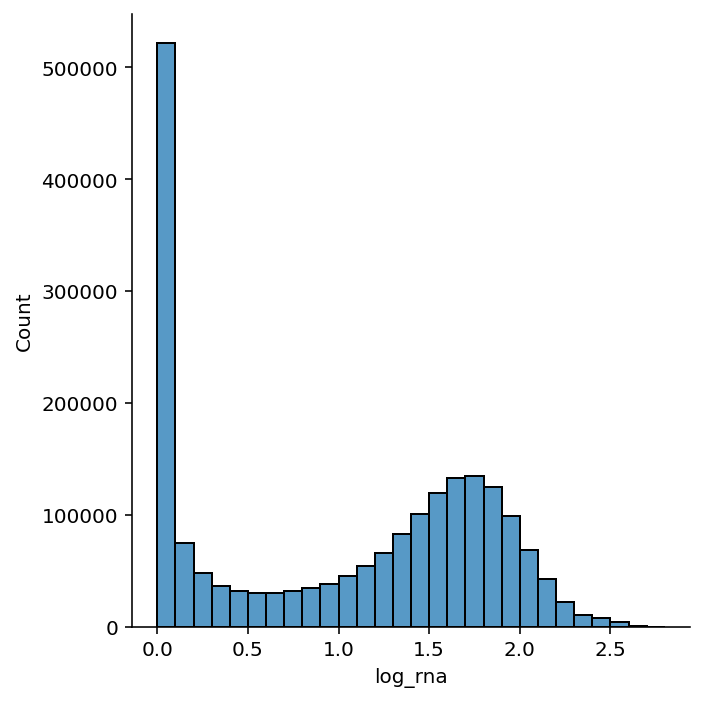
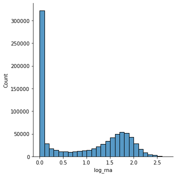
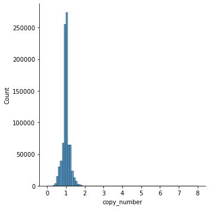
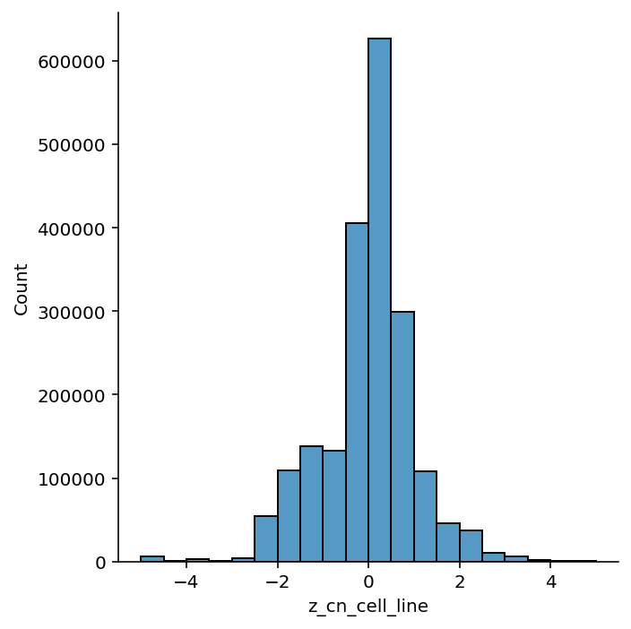
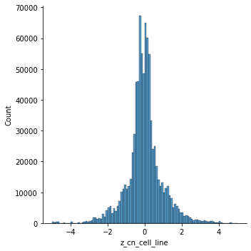

```python
%load_ext autoreload
%autoreload 2
```

```python
import numpy as np
import pandas as pd
import seaborn as sns
```

```python
from speclet.bayesian_models.hierarchical_nb import HierarchcalNegativeBinomialModel
from speclet.data_processing.vectors import zscale
from speclet.io import DataFile
from speclet.managers.data_managers import CrisprScreenDataManager
```

```python
hnb = HierarchcalNegativeBinomialModel()
```

```python
data_manager = CrisprScreenDataManager(DataFile.DEPMAP_CRC_BONE_LARGE_SUBSAMPLE)
ct_data = data_manager.get_data()
ct_data.head()
```

    /Users/admin/Developer/haigis-lab/speclet/speclet/managers/data_managers.py:139: DtypeWarning: Columns (3,22) have mixed types. Specify dtype option on import or set low_memory=False.
      self._data = pd.read_csv(self.data_file, **read_kwargs)

<div>
<style scoped>
    .dataframe tbody tr th:only-of-type {
        vertical-align: middle;
    }

    .dataframe tbody tr th {
        vertical-align: top;
    }

    .dataframe thead th {
        text-align: right;
    }
</style>
<table border="1" class="dataframe">
  <thead>
    <tr style="text-align: right;">
      <th></th>
      <th>sgrna</th>
      <th>replicate_id</th>
      <th>lfc</th>
      <th>p_dna_batch</th>
      <th>genome_alignment</th>
      <th>hugo_symbol</th>
      <th>screen</th>
      <th>multiple_hits_on_gene</th>
      <th>sgrna_target_chr</th>
      <th>sgrna_target_pos</th>
      <th>...</th>
      <th>num_mutations</th>
      <th>any_deleterious</th>
      <th>any_tcga_hotspot</th>
      <th>any_cosmic_hotspot</th>
      <th>is_mutated</th>
      <th>copy_number</th>
      <th>lineage</th>
      <th>primary_or_metastasis</th>
      <th>is_male</th>
      <th>age</th>
    </tr>
  </thead>
  <tbody>
    <tr>
      <th>0</th>
      <td>AAAGCCCAGGAGTATGGGAG</td>
      <td>LS513-311Cas9_RepA_p6_batch2</td>
      <td>0.594321</td>
      <td>2</td>
      <td>chr2_130522105_-</td>
      <td>CFC1B</td>
      <td>broad</td>
      <td>True</td>
      <td>2</td>
      <td>130522105</td>
      <td>...</td>
      <td>0</td>
      <td>NaN</td>
      <td>NaN</td>
      <td>NaN</td>
      <td>False</td>
      <td>0.951337</td>
      <td>colorectal</td>
      <td>primary</td>
      <td>True</td>
      <td>63.0</td>
    </tr>
    <tr>
      <th>1</th>
      <td>AATCGGAATGGTCTCGCTC</td>
      <td>LS513_c903R1</td>
      <td>-0.272724</td>
      <td>ERS717283.plasmid</td>
      <td>chr6_81751906_+</td>
      <td>TENT5A</td>
      <td>sanger</td>
      <td>True</td>
      <td>6</td>
      <td>81751906</td>
      <td>...</td>
      <td>0</td>
      <td>NaN</td>
      <td>NaN</td>
      <td>NaN</td>
      <td>False</td>
      <td>0.949854</td>
      <td>colorectal</td>
      <td>primary</td>
      <td>True</td>
      <td>63.0</td>
    </tr>
    <tr>
      <th>2</th>
      <td>ACGCCACTGACACTCAAGG</td>
      <td>LS513_c903R1</td>
      <td>0.583209</td>
      <td>ERS717283.plasmid</td>
      <td>chr1_27006713_-</td>
      <td>TENT5B</td>
      <td>sanger</td>
      <td>True</td>
      <td>1</td>
      <td>27006713</td>
      <td>...</td>
      <td>0</td>
      <td>NaN</td>
      <td>NaN</td>
      <td>NaN</td>
      <td>False</td>
      <td>0.961139</td>
      <td>colorectal</td>
      <td>primary</td>
      <td>True</td>
      <td>63.0</td>
    </tr>
    <tr>
      <th>3</th>
      <td>ACTTGTCTCATGAACGTGAT</td>
      <td>LS513-311Cas9_RepA_p6_batch2</td>
      <td>0.475678</td>
      <td>2</td>
      <td>chr2_86917638_+</td>
      <td>RGPD1</td>
      <td>broad</td>
      <td>True</td>
      <td>2</td>
      <td>86917638</td>
      <td>...</td>
      <td>0</td>
      <td>NaN</td>
      <td>NaN</td>
      <td>NaN</td>
      <td>False</td>
      <td>0.949234</td>
      <td>colorectal</td>
      <td>primary</td>
      <td>True</td>
      <td>63.0</td>
    </tr>
    <tr>
      <th>4</th>
      <td>AGAAACTTCACCCCTTTCAT</td>
      <td>LS513-311Cas9_RepA_p6_batch2</td>
      <td>0.296108</td>
      <td>2</td>
      <td>chr16_18543661_+</td>
      <td>NOMO2</td>
      <td>broad</td>
      <td>True</td>
      <td>16</td>
      <td>18543661</td>
      <td>...</td>
      <td>0</td>
      <td>NaN</td>
      <td>NaN</td>
      <td>NaN</td>
      <td>False</td>
      <td>0.944648</td>
      <td>colorectal</td>
      <td>primary</td>
      <td>True</td>
      <td>63.0</td>
    </tr>
  </tbody>
</table>
<p>5 rows × 24 columns</p>
</div>

```python
valid_data = hnb.data_processing_pipeline(ct_data)
```

```python
valid_data.shape
```

    (865044, 32)

```python
valid_data.head()
```

<div>
<style scoped>
    .dataframe tbody tr th:only-of-type {
        vertical-align: middle;
    }

    .dataframe tbody tr th {
        vertical-align: top;
    }

    .dataframe thead th {
        text-align: right;
    }
</style>
<table border="1" class="dataframe">
  <thead>
    <tr style="text-align: right;">
      <th></th>
      <th>sgrna</th>
      <th>replicate_id</th>
      <th>lfc</th>
      <th>p_dna_batch</th>
      <th>genome_alignment</th>
      <th>hugo_symbol</th>
      <th>screen</th>
      <th>multiple_hits_on_gene</th>
      <th>sgrna_target_chr</th>
      <th>sgrna_target_pos</th>
      <th>...</th>
      <th>is_male</th>
      <th>age</th>
      <th>z_rna_gene_lineage</th>
      <th>z_cn_gene</th>
      <th>z_cn_cell_line</th>
      <th>log_rna_expr</th>
      <th>counts_final_total</th>
      <th>counts_initial_total</th>
      <th>counts_final_rpm</th>
      <th>counts_initial_adj</th>
    </tr>
  </thead>
  <tbody>
    <tr>
      <th>0</th>
      <td>AAAGCCCAGGAGTATGGGAG</td>
      <td>LS513-311Cas9_RepA_p6_batch2</td>
      <td>0.594321</td>
      <td>2</td>
      <td>chr2_130522105_-</td>
      <td>CFC1B</td>
      <td>broad</td>
      <td>True</td>
      <td>2</td>
      <td>130522105</td>
      <td>...</td>
      <td>True</td>
      <td>63.0</td>
      <td>-0.160128</td>
      <td>-0.445925</td>
      <td>-0.354485</td>
      <td>0.000000</td>
      <td>35176093</td>
      <td>1.072163e+06</td>
      <td>13.309497</td>
      <td>257.442323</td>
    </tr>
    <tr>
      <th>1</th>
      <td>ACTTGTCTCATGAACGTGAT</td>
      <td>LS513-311Cas9_RepA_p6_batch2</td>
      <td>0.475678</td>
      <td>2</td>
      <td>chr2_86917638_+</td>
      <td>RGPD1</td>
      <td>broad</td>
      <td>True</td>
      <td>2</td>
      <td>86917638</td>
      <td>...</td>
      <td>True</td>
      <td>63.0</td>
      <td>-0.702651</td>
      <td>-0.504988</td>
      <td>-0.367375</td>
      <td>0.014253</td>
      <td>35176093</td>
      <td>1.072163e+06</td>
      <td>37.928490</td>
      <td>766.756365</td>
    </tr>
    <tr>
      <th>2</th>
      <td>AGAAACTTCACCCCTTTCAT</td>
      <td>LS513-311Cas9_RepA_p6_batch2</td>
      <td>0.296108</td>
      <td>2</td>
      <td>chr16_18543661_+</td>
      <td>NOMO2</td>
      <td>broad</td>
      <td>True</td>
      <td>16</td>
      <td>18543661</td>
      <td>...</td>
      <td>True</td>
      <td>63.0</td>
      <td>0.238451</td>
      <td>-0.183505</td>
      <td>-0.395475</td>
      <td>2.005789</td>
      <td>35176093</td>
      <td>1.072163e+06</td>
      <td>29.513684</td>
      <td>685.044642</td>
    </tr>
    <tr>
      <th>3</th>
      <td>AGCTGAGCGCAGGGACCGGG</td>
      <td>LS513-311Cas9_RepA_p6_batch2</td>
      <td>-0.020788</td>
      <td>2</td>
      <td>chr1_27012633_-</td>
      <td>TENT5B</td>
      <td>broad</td>
      <td>True</td>
      <td>1</td>
      <td>27012633</td>
      <td>...</td>
      <td>True</td>
      <td>63.0</td>
      <td>-0.782033</td>
      <td>-0.202823</td>
      <td>-0.294429</td>
      <td>0.162393</td>
      <td>35176093</td>
      <td>1.072163e+06</td>
      <td>4.837834</td>
      <td>142.977169</td>
    </tr>
    <tr>
      <th>4</th>
      <td>ATACTCCTGGGCTTTCGGAG</td>
      <td>LS513-311Cas9_RepA_p6_batch2</td>
      <td>-0.771298</td>
      <td>2</td>
      <td>chr2_130522124_+</td>
      <td>CFC1B</td>
      <td>broad</td>
      <td>True</td>
      <td>2</td>
      <td>130522124</td>
      <td>...</td>
      <td>True</td>
      <td>63.0</td>
      <td>-0.160128</td>
      <td>-0.445925</td>
      <td>-0.354485</td>
      <td>0.000000</td>
      <td>35176093</td>
      <td>1.072163e+06</td>
      <td>14.588775</td>
      <td>706.908890</td>
    </tr>
  </tbody>
</table>
<p>5 rows × 32 columns</p>
</div>

```python
valid_data.columns
```

    Index(['sgrna', 'replicate_id', 'lfc', 'p_dna_batch', 'genome_alignment',
           'hugo_symbol', 'screen', 'multiple_hits_on_gene', 'sgrna_target_chr',
           'sgrna_target_pos', 'depmap_id', 'counts_final', 'counts_initial',
           'rna_expr', 'num_mutations', 'any_deleterious', 'any_tcga_hotspot',
           'any_cosmic_hotspot', 'is_mutated', 'copy_number', 'lineage',
           'primary_or_metastasis', 'is_male', 'age', 'z_rna_gene_lineage',
           'z_cn_gene', 'z_cn_cell_line', 'log_rna_expr', 'counts_final_total',
           'counts_initial_total', 'counts_final_rpm', 'counts_initial_adj'],
          dtype='object')

```python
valid_data.groupby(["hugo_symbol", "lineage"])[["z_rna_gene_lineage"]].agg(
    ["mean", "std", "min", "max"]
)
```

<div>
<style scoped>
    .dataframe tbody tr th:only-of-type {
        vertical-align: middle;
    }

    .dataframe tbody tr th {
        vertical-align: top;
    }

    .dataframe thead tr th {
        text-align: left;
    }

    .dataframe thead tr:last-of-type th {
        text-align: right;
    }
</style>
<table border="1" class="dataframe">
  <thead>
    <tr>
      <th></th>
      <th></th>
      <th colspan="4" halign="left">z_rna_gene_lineage</th>
    </tr>
    <tr>
      <th></th>
      <th></th>
      <th>mean</th>
      <th>std</th>
      <th>min</th>
      <th>max</th>
    </tr>
    <tr>
      <th>hugo_symbol</th>
      <th>lineage</th>
      <th></th>
      <th></th>
      <th></th>
      <th></th>
    </tr>
  </thead>
  <tbody>
    <tr>
      <th rowspan="2" valign="top">CFC1B</th>
      <th>colorectal</th>
      <td>-1.601282e-01</td>
      <td>0.000000</td>
      <td>-0.160128</td>
      <td>-0.160128</td>
    </tr>
    <tr>
      <th>bone</th>
      <td>0.000000e+00</td>
      <td>0.000000</td>
      <td>0.000000</td>
      <td>0.000000</td>
    </tr>
    <tr>
      <th rowspan="2" valign="top">RGPD1</th>
      <th>colorectal</th>
      <td>2.106659e-02</td>
      <td>1.047634</td>
      <td>-0.726356</td>
      <td>2.846313</td>
    </tr>
    <tr>
      <th>bone</th>
      <td>2.099294e-02</td>
      <td>1.028463</td>
      <td>-0.608795</td>
      <td>2.922327</td>
    </tr>
    <tr>
      <th>NOMO2</th>
      <th>colorectal</th>
      <td>1.127822e-01</td>
      <td>0.832499</td>
      <td>-3.758523</td>
      <td>1.342848</td>
    </tr>
    <tr>
      <th>...</th>
      <th>...</th>
      <td>...</td>
      <td>...</td>
      <td>...</td>
      <td>...</td>
    </tr>
    <tr>
      <th>KCNE1</th>
      <th>bone</th>
      <td>2.562053e-17</td>
      <td>1.019804</td>
      <td>-0.338222</td>
      <td>3.450995</td>
    </tr>
    <tr>
      <th rowspan="2" valign="top">TBL1Y</th>
      <th>colorectal</th>
      <td>1.531342e-17</td>
      <td>1.004338</td>
      <td>-0.257428</td>
      <td>4.711318</td>
    </tr>
    <tr>
      <th>bone</th>
      <td>1.708035e-17</td>
      <td>1.009756</td>
      <td>-0.288675</td>
      <td>3.464102</td>
    </tr>
    <tr>
      <th rowspan="2" valign="top">LCE1C</th>
      <th>colorectal</th>
      <td>2.105595e-17</td>
      <td>1.017700</td>
      <td>-0.312799</td>
      <td>4.403382</td>
    </tr>
    <tr>
      <th>bone</th>
      <td>0.000000e+00</td>
      <td>0.000000</td>
      <td>0.000000</td>
      <td>0.000000</td>
    </tr>
  </tbody>
</table>
<p>4000 rows × 4 columns</p>
</div>

```python
valid_data.rna_expr.isna().any()
```

    False

```python
sns.displot(data=valid_data, x="rna_expr", binwidth=0.1);
```



```python
sns.displot(
    data=valid_data.assign(log_rna=lambda d: np.log(d.rna_expr + 1)),
    x="log_rna",
    binwidth=0.1,
);
```



```python
sns.displot(data=valid_data, x="z_rna_gene_lineage", binwidth=0.1);
```


```python
sns.displot(data=valid_data, x="copy_number", binwidth=0.1);
```



```python
sns.displot(data=valid_data, x="z_cn_gene", binwidth=0.1);
```



```python
sns.displot(data=valid_data, x="z_cn_cell_line", binwidth=0.1);
```



```python

```

```python

```

```python

```
