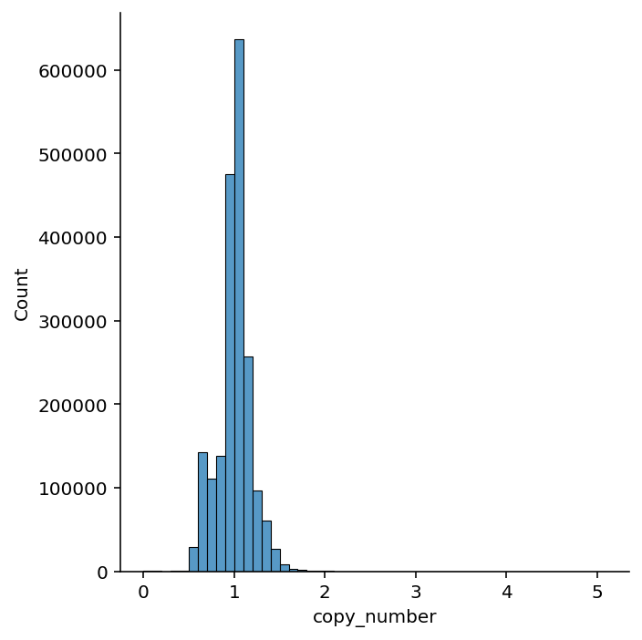
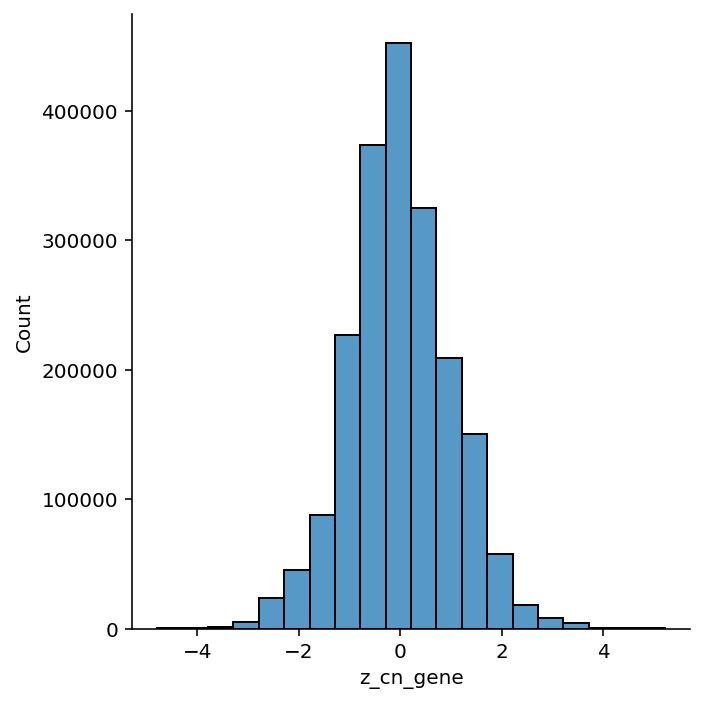

```python
%load_ext autoreload
%autoreload 2
```


```python
import matplotlib.pyplot as plt
import numpy as np
import pandas as pd
import seaborn as sns
```


```python
from speclet.bayesian_models.lineage_hierarchical_nb import LineageHierNegBinomModel
from speclet.data_processing.vectors import zscale
from speclet.io import lineade_modeling_data_path
from speclet.managers.data_managers import CrisprScreenDataManager, broad_only
```


```python
%matplotlib inline
%config InlineBackend.figure_format='retina'
```


```python
model = LineageHierNegBinomModel(lineage="kidney")
```


```python
data_manager = CrisprScreenDataManager(
    lineade_modeling_data_path(model.lineage), transformations=[broad_only]
)
ct_data = data_manager.get_data(read_kwargs={"low_memory": False})
ct_data.head()
```


<div>
<style scoped>
    .dataframe tbody tr th:only-of-type {
        vertical-align: middle;
    }

    .dataframe tbody tr th {
        vertical-align: top;
    }

    .dataframe thead th {
        text-align: right;
    }
</style>
<table border="1" class="dataframe">
  <thead>
    <tr style="text-align: right;">
      <th></th>
      <th>sgrna</th>
      <th>replicate_id</th>
      <th>lfc</th>
      <th>p_dna_batch</th>
      <th>genome_alignment</th>
      <th>hugo_symbol</th>
      <th>screen</th>
      <th>multiple_hits_on_gene</th>
      <th>sgrna_target_chr</th>
      <th>sgrna_target_pos</th>
      <th>...</th>
      <th>any_deleterious</th>
      <th>any_tcga_hotspot</th>
      <th>any_cosmic_hotspot</th>
      <th>is_mutated</th>
      <th>copy_number</th>
      <th>lineage</th>
      <th>lineage_subtype</th>
      <th>primary_or_metastasis</th>
      <th>is_male</th>
      <th>age</th>
    </tr>
  </thead>
  <tbody>
    <tr>
      <th>0</th>
      <td>AAAGCCCAGGAGTATGGGAG</td>
      <td>G-401-311Cas9_RepA_p6_batch2</td>
      <td>0.360147</td>
      <td>2</td>
      <td>chr2_130522105_-</td>
      <td>CFC1B</td>
      <td>broad</td>
      <td>True</td>
      <td>2</td>
      <td>130522105</td>
      <td>...</td>
      <td>NaN</td>
      <td>NaN</td>
      <td>NaN</td>
      <td>False</td>
      <td>0.997626</td>
      <td>kidney</td>
      <td>malignant_rhabdoid_tumor</td>
      <td>primary</td>
      <td>True</td>
      <td>0.25</td>
    </tr>
    <tr>
      <th>1</th>
      <td>AAATCAGAGAAACCTGAACG</td>
      <td>G-401-311Cas9_RepA_p6_batch2</td>
      <td>0.013803</td>
      <td>2</td>
      <td>chr11_89916950_-</td>
      <td>TRIM49D1</td>
      <td>broad</td>
      <td>True</td>
      <td>11</td>
      <td>89916950</td>
      <td>...</td>
      <td>NaN</td>
      <td>NaN</td>
      <td>NaN</td>
      <td>False</td>
      <td>0.996058</td>
      <td>kidney</td>
      <td>malignant_rhabdoid_tumor</td>
      <td>primary</td>
      <td>True</td>
      <td>0.25</td>
    </tr>
    <tr>
      <th>2</th>
      <td>AACGTCTTTGAAGAAAGCTG</td>
      <td>G-401-311Cas9_RepA_p6_batch2</td>
      <td>-2.001101</td>
      <td>2</td>
      <td>chr5_71055421_-</td>
      <td>GTF2H2</td>
      <td>broad</td>
      <td>True</td>
      <td>5</td>
      <td>71055421</td>
      <td>...</td>
      <td>NaN</td>
      <td>NaN</td>
      <td>NaN</td>
      <td>False</td>
      <td>0.996752</td>
      <td>kidney</td>
      <td>malignant_rhabdoid_tumor</td>
      <td>primary</td>
      <td>True</td>
      <td>0.25</td>
    </tr>
    <tr>
      <th>3</th>
      <td>AACGTCTTTGAAGGAAGCTG</td>
      <td>G-401-311Cas9_RepA_p6_batch2</td>
      <td>0.092259</td>
      <td>2</td>
      <td>chr5_69572480_+</td>
      <td>GTF2H2C</td>
      <td>broad</td>
      <td>True</td>
      <td>5</td>
      <td>69572480</td>
      <td>...</td>
      <td>NaN</td>
      <td>NaN</td>
      <td>NaN</td>
      <td>False</td>
      <td>0.996752</td>
      <td>kidney</td>
      <td>malignant_rhabdoid_tumor</td>
      <td>primary</td>
      <td>True</td>
      <td>0.25</td>
    </tr>
    <tr>
      <th>4</th>
      <td>AAGAGGTTCCAGACTACTTA</td>
      <td>G-401-311Cas9_RepA_p6_batch2</td>
      <td>-0.747593</td>
      <td>2</td>
      <td>chrX_155898173_+</td>
      <td>VAMP7</td>
      <td>broad</td>
      <td>True</td>
      <td>X</td>
      <td>155898173</td>
      <td>...</td>
      <td>NaN</td>
      <td>NaN</td>
      <td>NaN</td>
      <td>False</td>
      <td>0.494212</td>
      <td>kidney</td>
      <td>malignant_rhabdoid_tumor</td>
      <td>primary</td>
      <td>True</td>
      <td>0.25</td>
    </tr>
  </tbody>
</table>
<p>5 rows × 25 columns</p>
</div>


```python
valid_data = model.data_processing_pipeline(ct_data)
```

    [INFO] 2022-08-03 09:37:05 [(lineage_hierarchical_nb.py:data_processing_pipeline:274] Processing data for modeling.
    [INFO] 2022-08-03 09:37:05 [(lineage_hierarchical_nb.py:data_processing_pipeline:275] LFC limits: (-5.0, 5.0)
    [WARNING] 2022-08-03 09:38:34 [(lineage_hierarchical_nb.py:data_processing_pipeline:326] number of data points dropped: 16


```python
valid_data.shape
```


    (1989720, 33)


```python
valid_data.head()
```


<div>
<style scoped>
    .dataframe tbody tr th:only-of-type {
        vertical-align: middle;
    }

    .dataframe tbody tr th {
        vertical-align: top;
    }

    .dataframe thead th {
        text-align: right;
    }
</style>
<table border="1" class="dataframe">
  <thead>
    <tr style="text-align: right;">
      <th></th>
      <th>sgrna</th>
      <th>replicate_id</th>
      <th>lfc</th>
      <th>p_dna_batch</th>
      <th>genome_alignment</th>
      <th>hugo_symbol</th>
      <th>screen</th>
      <th>multiple_hits_on_gene</th>
      <th>sgrna_target_chr</th>
      <th>sgrna_target_pos</th>
      <th>...</th>
      <th>is_male</th>
      <th>age</th>
      <th>z_rna_gene</th>
      <th>m_rna_gene</th>
      <th>z_cn_gene</th>
      <th>z_cn_cell_line</th>
      <th>counts_final_total</th>
      <th>counts_initial_total</th>
      <th>counts_final_rpm</th>
      <th>counts_initial_adj</th>
    </tr>
  </thead>
  <tbody>
    <tr>
      <th>0</th>
      <td>AAAGCCCAGGAGTATGGGAG</td>
      <td>G-401-311Cas9_RepA_p6_batch2</td>
      <td>0.360147</td>
      <td>2</td>
      <td>chr2_130522105_-</td>
      <td>CFC1B</td>
      <td>broad</td>
      <td>True</td>
      <td>2</td>
      <td>130522105</td>
      <td>...</td>
      <td>True</td>
      <td>0.25</td>
      <td>0.000000</td>
      <td>0.000000</td>
      <td>-0.454262</td>
      <td>0.193704</td>
      <td>42834052</td>
      <td>1.072163e+06</td>
      <td>11.435623</td>
      <td>313.488421</td>
    </tr>
    <tr>
      <th>1</th>
      <td>AAATCAGAGAAACCTGAACG</td>
      <td>G-401-311Cas9_RepA_p6_batch2</td>
      <td>0.013803</td>
      <td>2</td>
      <td>chr11_89916950_-</td>
      <td>TRIM49D1</td>
      <td>broad</td>
      <td>True</td>
      <td>11</td>
      <td>89916950</td>
      <td>...</td>
      <td>True</td>
      <td>0.25</td>
      <td>5.000000</td>
      <td>5.000000</td>
      <td>0.086631</td>
      <td>0.175290</td>
      <td>42834052</td>
      <td>1.072163e+06</td>
      <td>3.754818</td>
      <td>132.748181</td>
    </tr>
    <tr>
      <th>2</th>
      <td>AACGTCTTTGAAGAAAGCTG</td>
      <td>G-401-311Cas9_RepA_p6_batch2</td>
      <td>-2.001101</td>
      <td>2</td>
      <td>chr5_71055421_-</td>
      <td>GTF2H2</td>
      <td>broad</td>
      <td>True</td>
      <td>5</td>
      <td>71055421</td>
      <td>...</td>
      <td>True</td>
      <td>0.25</td>
      <td>1.427810</td>
      <td>1.427810</td>
      <td>-0.290542</td>
      <td>0.183439</td>
      <td>42834052</td>
      <td>1.072163e+06</td>
      <td>2.260679</td>
      <td>320.808471</td>
    </tr>
    <tr>
      <th>3</th>
      <td>AACGTCTTTGAAGGAAGCTG</td>
      <td>G-401-311Cas9_RepA_p6_batch2</td>
      <td>0.092259</td>
      <td>2</td>
      <td>chr5_69572480_+</td>
      <td>GTF2H2C</td>
      <td>broad</td>
      <td>True</td>
      <td>5</td>
      <td>69572480</td>
      <td>...</td>
      <td>True</td>
      <td>0.25</td>
      <td>1.083952</td>
      <td>1.083952</td>
      <td>-0.290542</td>
      <td>0.183439</td>
      <td>42834052</td>
      <td>1.072163e+06</td>
      <td>9.567950</td>
      <td>310.895925</td>
    </tr>
    <tr>
      <th>4</th>
      <td>AAGAGGTTCCAGACTACTTA</td>
      <td>G-401-311Cas9_RepA_p6_batch2</td>
      <td>-0.747593</td>
      <td>2</td>
      <td>chrX_155898173_+</td>
      <td>VAMP7</td>
      <td>broad</td>
      <td>True</td>
      <td>X</td>
      <td>155898173</td>
      <td>...</td>
      <td>True</td>
      <td>0.25</td>
      <td>0.505909</td>
      <td>0.505909</td>
      <td>-0.888657</td>
      <td>-5.000000</td>
      <td>42834052</td>
      <td>1.072163e+06</td>
      <td>4.758692</td>
      <td>279.534696</td>
    </tr>
  </tbody>
</table>
<p>5 rows × 33 columns</p>
</div>


```python
valid_data.columns
```


    Index(['sgrna', 'replicate_id', 'lfc', 'p_dna_batch', 'genome_alignment',
           'hugo_symbol', 'screen', 'multiple_hits_on_gene', 'sgrna_target_chr',
           'sgrna_target_pos', 'depmap_id', 'counts_final', 'counts_initial',
           'rna_expr', 'num_mutations', 'any_deleterious', 'any_tcga_hotspot',
           'any_cosmic_hotspot', 'is_mutated', 'copy_number', 'lineage',
           'lineage_subtype', 'primary_or_metastasis', 'is_male', 'age',
           'z_rna_gene', 'm_rna_gene', 'z_cn_gene', 'z_cn_cell_line',
           'counts_final_total', 'counts_initial_total', 'counts_final_rpm',
           'counts_initial_adj'],
          dtype='object')


```python
sns.displot(data=valid_data, x="rna_expr", binwidth=0.5);
```


```python
sns.displot(
    data=valid_data.assign(log_rna=lambda d: np.log(d.rna_expr + 1)),
    x="log_rna",
    binwidth=0.1,
);
```


```python
sns.displot(data=valid_data, x="copy_number", binwidth=0.1);
```





```python
valid_data[["copy_number"]].describe().round(3)
```


<div>
<style scoped>
    .dataframe tbody tr th:only-of-type {
        vertical-align: middle;
    }

    .dataframe tbody tr th {
        vertical-align: top;
    }

    .dataframe thead th {
        text-align: right;
    }
</style>
<table border="1" class="dataframe">
  <thead>
    <tr style="text-align: right;">
      <th></th>
      <th>copy_number</th>
    </tr>
  </thead>
  <tbody>
    <tr>
      <th>count</th>
      <td>1989720.000</td>
    </tr>
    <tr>
      <th>mean</th>
      <td>1.000</td>
    </tr>
    <tr>
      <th>std</th>
      <td>0.183</td>
    </tr>
    <tr>
      <th>min</th>
      <td>0.000</td>
    </tr>
    <tr>
      <th>25%</th>
      <td>0.929</td>
    </tr>
    <tr>
      <th>50%</th>
      <td>1.009</td>
    </tr>
    <tr>
      <th>75%</th>
      <td>1.086</td>
    </tr>
    <tr>
      <th>max</th>
      <td>5.030</td>
    </tr>
  </tbody>
</table>
</div>


```python
sns.displot(data=valid_data, x="z_cn_gene", binwidth=0.5);
```





```python
sns.displot(data=valid_data, x="z_cn_cell_line", binwidth=0.5);
```


```python
copy_number_data = valid_data[
    ["hugo_symbol", "depmap_id", "z_cn_gene", "z_cn_cell_line", "copy_number"]
].drop_duplicates()

fg = sns.relplot(
    data=copy_number_data,
    x="z_cn_gene",
    y="z_cn_cell_line",
    col="depmap_id",
    col_wrap=5,
    kind="scatter",
    height=1.5,
    aspect=1,
    s=2,
    alpha=0.5,
    edgecolor=None,
)
fg.set_titles("{col_name}")
plt.show()
```


```python
fig, ax = plt.subplots(figsize=(8, 5))
sns.histplot(
    data=copy_number_data,
    x="copy_number",
    hue="depmap_id",
    binwidth=0.1,
    element="step",
    fill=False,
    ax=ax,
    alpha=0.7,
)
ax.get_legend().remove()
plt.show()
```


```python
fig, ax = plt.subplots(figsize=(8, 5))
sns.histplot(
    data=copy_number_data.assign(log_cn=lambda d: np.log(d["copy_number"] + 1)),
    x="log_cn",
    hue="depmap_id",
    binwidth=0.1,
    element="step",
    fill=False,
    ax=ax,
    alpha=0.7,
)
ax.get_legend().remove()
plt.show()
```


```python

```


```python

```


```python

```


```python

```

---


```python
%load_ext watermark
%watermark -d -u -v -iv -b -h -m
```

    Last updated: 2022-08-03

    Python implementation: CPython
    Python version       : 3.10.5
    IPython version      : 8.4.0

    Compiler    : GCC 10.3.0
    OS          : Linux
    Release     : 3.10.0-1160.45.1.el7.x86_64
    Machine     : x86_64
    Processor   : x86_64
    CPU cores   : 28
    Architecture: 64bit

    Hostname: compute-e-16-233.o2.rc.hms.harvard.edu

    Git branch: simplify

    matplotlib: 3.5.2
    numpy     : 1.23.1
    pandas    : 1.4.3
    seaborn   : 0.11.2


```python

```
