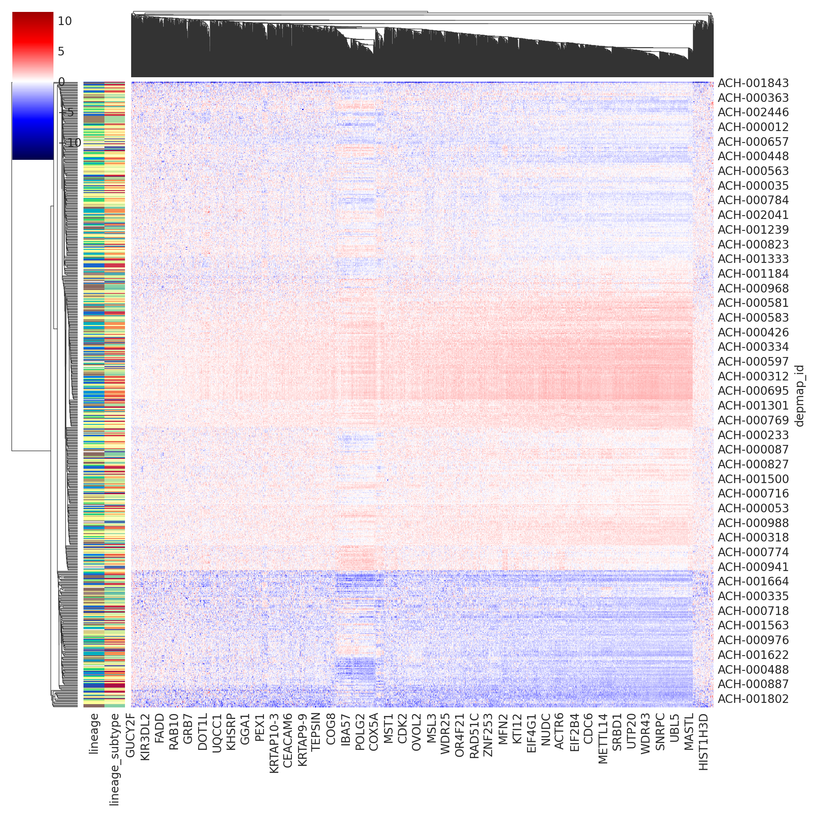
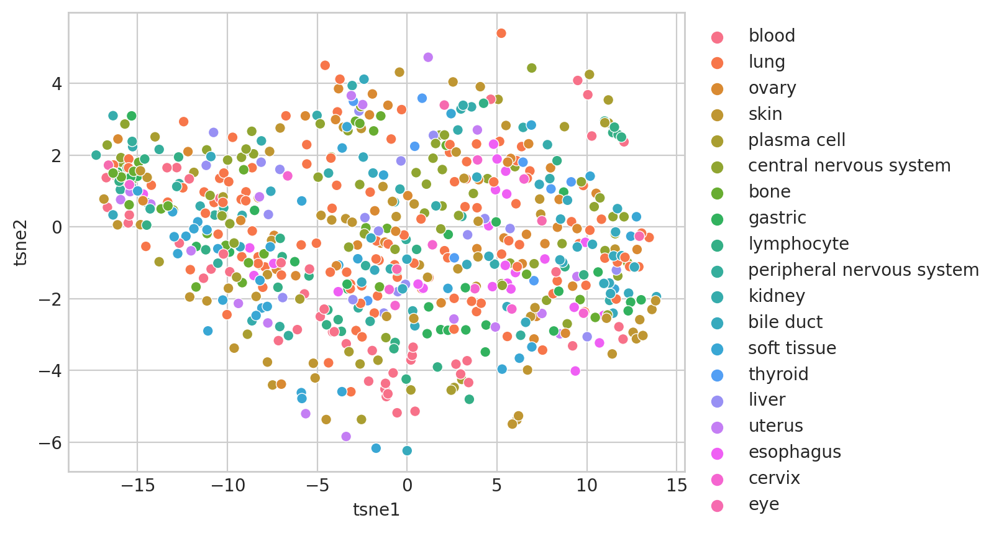

# Analyzing cancer gene comutation dependencies

## Setup

### Imports


```python
%load_ext autoreload
%autoreload 2
```


```python
from time import time

import dask.dataframe as dd
import matplotlib.pyplot as plt
import numpy as np
import pandas as pd
import seaborn as sns
from sklearn.manifold import TSNE
```


```python
from speclet.analysis.sublineage_model_analysis import load_sublineage_model_posteriors
from speclet.io import DataFile, data_path, notebook_output_and_stash_dirs
from speclet.plot import set_speclet_theme
from speclet.plot.color_pal import lineage_color_pal, sublineage_color_pal
from speclet.project_configuration import arviz_config
```


```python
# Notebook execution timer.
notebook_tic = time()

# Plotting setup.
set_speclet_theme()
%config InlineBackend.figure_format = "retina"

# Constants
RANDOM_SEED = 709
np.random.seed(RANDOM_SEED)
arviz_config()
```


```python
OUTPUT_DIR, STASH_DIR = notebook_output_and_stash_dirs(
    "005_100_lineage-data-exploration"
)
```

### Data

#### Model posteriors


```python
postmen = load_sublineage_model_posteriors()
```


```python
sublineage_pal = sublineage_color_pal()
lineage_pal = lineage_color_pal()
```

## Analysis

### Hierarchical clustering by LFC


```python
lineage_subtypes = [pm.config.model_kwargs["lineage"] for pm in postmen.posteriors]
```


```python
depmap_df = dd.read_csv(
    data_path(DataFile.DEPMAP_DATA),
    low_memory=False,
    usecols=[
        "sgrna",
        "hugo_symbol",
        "depmap_id",
        "lfc",
        "screen",
        "lineage",
        "lineage_subtype",
        "primary_or_metastasis",
    ],
).query("screen == 'broad'")
```


```python
gene_variances_stash_fp = STASH_DIR / "gene_variances-stash.csv"
if gene_variances_stash_fp.exists():
    gene_variances = pd.read_csv(gene_variances_stash_fp)
else:
    gene_variances = (
        depmap_df.groupby("hugo_symbol")["lfc"]
        .var()
        .compute()
        .reset_index()
        .rename(columns={"lfc": "lfc_var"})
    )
    gene_variances.to_csv(gene_variances_stash_fp, index=False)

gene_variances.head()
```


<div>
<style scoped>
    .dataframe tbody tr th:only-of-type {
        vertical-align: middle;
    }

    .dataframe tbody tr th {
        vertical-align: top;
    }

    .dataframe thead th {
        text-align: right;
    }
</style>
<table border="1" class="dataframe">
  <thead>
    <tr style="text-align: right;">
      <th></th>
      <th>hugo_symbol</th>
      <th>lfc_var</th>
    </tr>
  </thead>
  <tbody>
    <tr>
      <th>0</th>
      <td>A1BG</td>
      <td>0.139119</td>
    </tr>
    <tr>
      <th>1</th>
      <td>A1CF</td>
      <td>0.164934</td>
    </tr>
    <tr>
      <th>2</th>
      <td>A2M</td>
      <td>0.136484</td>
    </tr>
    <tr>
      <th>3</th>
      <td>A2ML1</td>
      <td>0.134801</td>
    </tr>
    <tr>
      <th>4</th>
      <td>A3GALT2</td>
      <td>0.254192</td>
    </tr>
  </tbody>
</table>
</div>


```python
def _make_new_lineage_col(df: pd.DataFrame) -> pd.DataFrame:
    new_col = [f"{ln}_({st})" for ln, st in zip(df["lineage"], df["lineage_subtype"])]
    df = df.assign(lineage_subtype=new_col)
    return df
```


```python
cutoff = np.quantile(gene_variances["lfc_var"], 0.8)
top_var_genes = gene_variances[gene_variances["lfc_var"] > cutoff][
    "hugo_symbol"
].toset()
top_var_data_stash_fp = STASH_DIR / "top_var_data-stash.csv"
if top_var_data_stash_fp.exists():
    top_var_data = pd.read_csv(top_var_data_stash_fp)
else:
    top_var_data = (
        depmap_df.query(
            "hugo_symbol in @top_var_genes", local_dict={"top_var_genes": top_var_genes}
        )
        .compute()
        .pipe(_make_new_lineage_col)
        .filter_column_isin("lineage_subtype", lineage_subtypes)
    )
    top_var_data.to_csv(top_var_data_stash_fp, index=False)
top_var_data.shape
```

    /tmp/ipykernel_13969/955944050.py:7: DtypeWarning: Columns (7) have mixed types. Specify dtype option on import or set low_memory=False.
      top_var_data = pd.read_csv(top_var_data_stash_fp)


    (9141760, 8)


```python
top_var_data_X = (
    top_var_data.groupby(["lineage", "lineage_subtype", "depmap_id", "hugo_symbol"])[
        "lfc"
    ]
    .mean()
    .reset_index()
    .pivot_wider(
        "depmap_id",
        names_from="hugo_symbol",
        values_from="lfc",
    )
    .set_index("depmap_id")
)
top_var_data_X.shape
```


    (640, 3624)


```python
# Separate steps so can save before replacing with colors.
top_var_cg_row_labels = (
    top_var_data[["lineage", "lineage_subtype", "depmap_id"]]
    .drop_duplicates()
    .set_index("depmap_id")
    .assign(
        lineage=lambda d: [x.replace("_", " ") for x in d["lineage"]],
        lineage_subtype=lambda d: [x.replace("_", " ") for x in d["lineage_subtype"]],
    )
)
top_var_cg_row_colors = top_var_cg_row_labels.assign(
    lineage=lambda d: d["lineage"].map(lineage_pal),
    lineage_subtype=lambda d: d["lineage_subtype"].map(sublineage_pal),
)
```


```python
cg = sns.clustermap(
    top_var_data_X,
    z_score=1,
    cmap="seismic",
    center=0,
    row_colors=top_var_cg_row_colors,
    dendrogram_ratio=(0.1, 0.1),
)
plt.show()
```

    /home/jc604/.conda/envs/speclet/lib/python3.10/site-packages/seaborn/matrix.py:654: UserWarning: Clustering large matrix with scipy. Installing `fastcluster` may give better performance.
      warnings.warn(msg)





```python
top_var_data_X.to_csv(OUTPUT_DIR / "top-variance-genes-data-wide.csv")
top_var_cg_row_labels.to_csv(OUTPUT_DIR / "top-variance-genes-data-row-labels.csv")
```

### $t$-SNE


```python
tsne_model = TSNE(perplexity=50, learning_rate="auto", init="pca", random_state=20)
tsne_out = tsne_model.fit_transform(top_var_data_X.values)
tsne_res_df = (
    pd.DataFrame(tsne_out, columns=("tsne1", "tsne2"))
    .assign(depmap_id=top_var_data_X.index)
    .merge(top_var_cg_row_labels, left_on="depmap_id", right_index=True)
)
tsne_res_df.head()
```

    /home/jc604/.conda/envs/speclet/lib/python3.10/site-packages/sklearn/manifold/_t_sne.py:996: FutureWarning: The PCA initialization in TSNE will change to have the standard deviation of PC1 equal to 1e-4 in 1.2. This will ensure better convergence.
      warnings.warn(


<div>
<style scoped>
    .dataframe tbody tr th:only-of-type {
        vertical-align: middle;
    }

    .dataframe tbody tr th {
        vertical-align: top;
    }

    .dataframe thead th {
        text-align: right;
    }
</style>
<table border="1" class="dataframe">
  <thead>
    <tr style="text-align: right;">
      <th></th>
      <th>tsne1</th>
      <th>tsne2</th>
      <th>depmap_id</th>
      <th>lineage</th>
      <th>lineage_subtype</th>
    </tr>
  </thead>
  <tbody>
    <tr>
      <th>0</th>
      <td>-6.110592</td>
      <td>-2.862226</td>
      <td>ACH-000004</td>
      <td>blood</td>
      <td>blood (AML)</td>
    </tr>
    <tr>
      <th>1</th>
      <td>-15.518285</td>
      <td>0.109040</td>
      <td>ACH-000005</td>
      <td>blood</td>
      <td>blood (AML)</td>
    </tr>
    <tr>
      <th>2</th>
      <td>3.857738</td>
      <td>-2.359804</td>
      <td>ACH-000012</td>
      <td>lung</td>
      <td>lung (NSCLC)</td>
    </tr>
    <tr>
      <th>3</th>
      <td>3.877869</td>
      <td>-0.606903</td>
      <td>ACH-000013</td>
      <td>ovary</td>
      <td>ovary (ovary adenocarcinoma)</td>
    </tr>
    <tr>
      <th>4</th>
      <td>3.937296</td>
      <td>-0.835792</td>
      <td>ACH-000014</td>
      <td>skin</td>
      <td>skin (melanoma)</td>
    </tr>
  </tbody>
</table>
</div>


```python
ax = sns.scatterplot(data=tsne_res_df, x="tsne1", y="tsne2", hue="lineage")
ax.legend(loc="upper left", bbox_to_anchor=(1, 1))
plt.show()
```





```python
tsne_res_df.to_csv(OUTPUT_DIR / "top-variance-genes-tsne.csv", index=False)
```

---


```python
notebook_toc = time()
print(f"execution time: {(notebook_toc - notebook_tic) / 60:.2f} minutes")
```

    execution time: 0.99 minutes


```python
%load_ext watermark
%watermark -d -u -v -iv -b -h -m
```

    The watermark extension is already loaded. To reload it, use:
      %reload_ext watermark
    Last updated: 2022-10-06

    Python implementation: CPython
    Python version       : 3.10.6
    IPython version      : 8.5.0

    Compiler    : GCC 10.4.0
    OS          : Linux
    Release     : 3.10.0-1160.76.1.el7.x86_64
    Machine     : x86_64
    Processor   : x86_64
    CPU cores   : 28
    Architecture: 64bit

    Hostname: compute-e-16-229.o2.rc.hms.harvard.edu

    Git branch: figures

    numpy     : 1.23.3
    json      : 2.0.9
    seaborn   : 0.11.2
    dask      : 2022.9.0
    matplotlib: 3.5.3
    arviz     : 0.12.1
    pandas    : 1.4.4


```python

```
