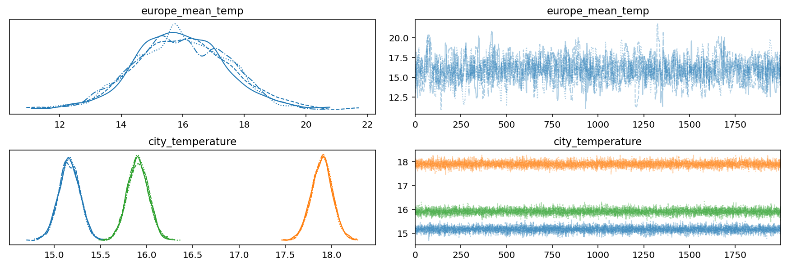
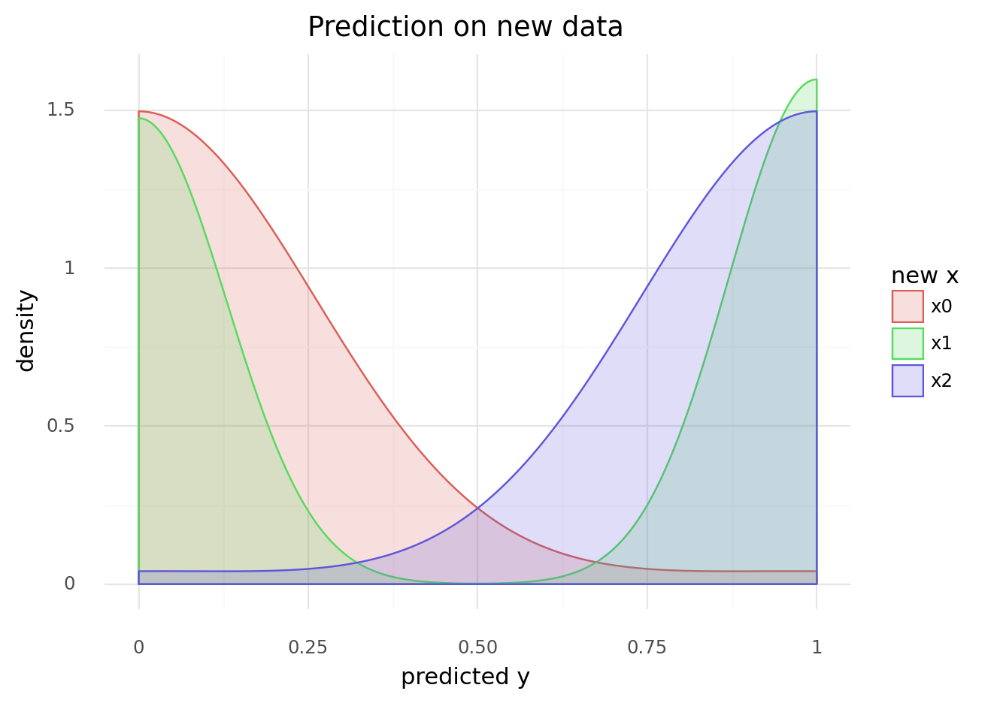
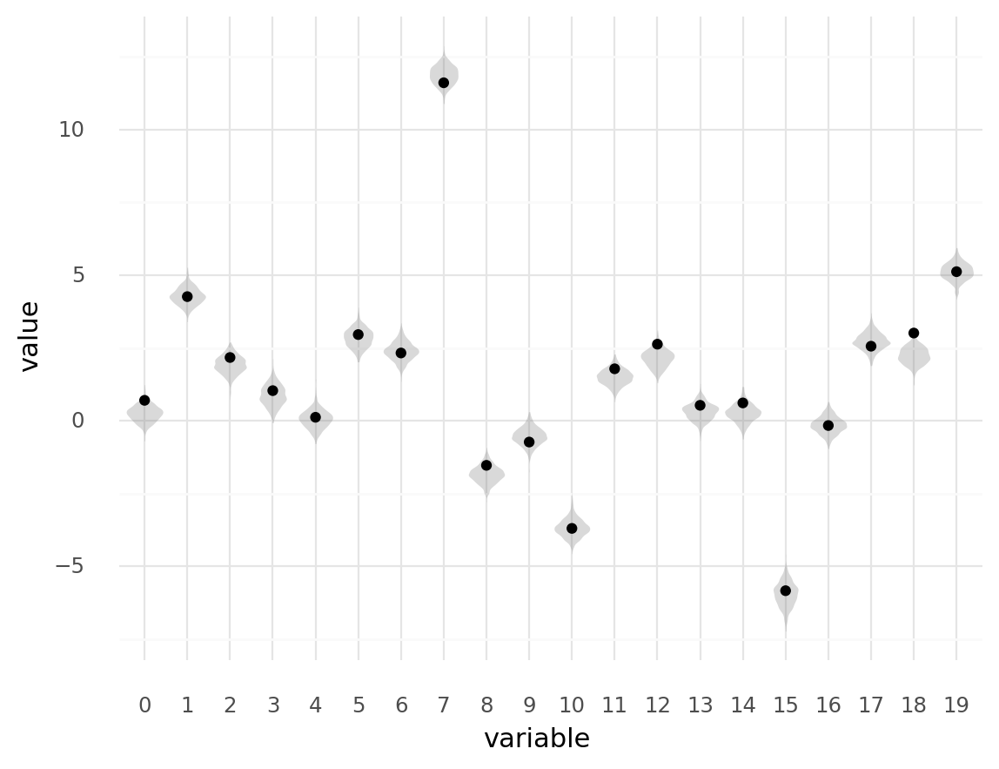

# Experimentation with using the Data containers in PyMC3

```python
import string
from time import time
from typing import Any, Dict

import arviz as az
import common_data_processing as dphelp
import matplotlib.pyplot as plt
import numpy as np
import pandas as pd
import plotnine as gg
import pymc3 as pm
from numpy.random import normal as rnorm

notebook_tic = time()

%matplotlib inline
%config InlineBackend.figure_format = "retina"
gg.theme_set(gg.theme_minimal)

RANDOM_SEED = 8927
np.random.seed(RANDOM_SEED)
```

## Resources

- [Prior and Posterior Predictive Checks](https://docs.pymc.io/notebooks/posterior_predictive.html)
- [Using shared variables (Data container adaptation)](https://docs.pymc.io/notebooks/data_container.html)
- [A Primer on Bayesian Methods for Multilevel Modeling](https://docs.pymc.io/notebooks/multilevel_modeling.html)

## Basic example

The data container wraps around the Theano shared variable class and lets the model be aware of its inputs and outputs.
Below is an example of a hierarchical model on fake weather data.

```python
df_data = pd.DataFrame(columns=["date"]).set_index("date")
dates = pd.date_range(start="2020-05-01", end="2020-05-20")

for city, mu in {"Berlin": 15, "San Marino": 18, "Paris": 16}.items():
    df_data[city] = np.random.normal(loc=mu, size=len(dates))

df_data.index = dates
df_data.index.name = "date"
df_data.head()
```

<div>
<style scoped>
    .dataframe tbody tr th:only-of-type {
        vertical-align: middle;
    }

    .dataframe tbody tr th {
        vertical-align: top;
    }

    .dataframe thead th {
        text-align: right;
    }
</style>
<table border="1" class="dataframe">
  <thead>
    <tr style="text-align: right;">
      <th></th>
      <th>Berlin</th>
      <th>San Marino</th>
      <th>Paris</th>
    </tr>
    <tr>
      <th>date</th>
      <th></th>
      <th></th>
      <th></th>
    </tr>
  </thead>
  <tbody>
    <tr>
      <th>2020-05-01</th>
      <td>14.708568</td>
      <td>18.905539</td>
      <td>15.230894</td>
    </tr>
    <tr>
      <th>2020-05-02</th>
      <td>13.729669</td>
      <td>17.359776</td>
      <td>16.461333</td>
    </tr>
    <tr>
      <th>2020-05-03</th>
      <td>15.919799</td>
      <td>17.766166</td>
      <td>15.369512</td>
    </tr>
    <tr>
      <th>2020-05-04</th>
      <td>17.294473</td>
      <td>17.685680</td>
      <td>14.724499</td>
    </tr>
    <tr>
      <th>2020-05-05</th>
      <td>14.661021</td>
      <td>18.648179</td>
      <td>17.882056</td>
    </tr>
  </tbody>
</table>
</div>

```python
coords = {"date": df_data.index, "city": df_data.columns}

with pm.Model(coords=coords) as model:
    europe_mean = pm.Normal("europe_mean_temp", 15.0, 3.0)
    city_offset = pm.Normal("city_offset", 0.0, 3.0, dims="city")
    city_temperature = pm.Deterministic(
        "city_temperature", europe_mean + city_offset, dims="city"
    )

    data = pm.Data("data", df_data, dims=("date", "city"))
    y = pm.Normal("likelihood", mu=city_temperature, sd=0.5, observed=data)

    idata = pm.sample(
        2000,
        tune=2000,
        target_accept=0.85,
        return_inferencedata=True,
        random_seed=RANDOM_SEED,
    )
```

    Auto-assigning NUTS sampler...
    Initializing NUTS using jitter+adapt_diag...
    Multiprocess sampling (4 chains in 4 jobs)
    NUTS: [city_offset, europe_mean_temp]

<div>
    <style>
        /*Turns off some styling*/
        progress {
            /*gets rid of default border in Firefox and Opera.*/
            border: none;
            /*Needs to be in here for Safari polyfill so background images work as expected.*/
            background-size: auto;
        }
        .progress-bar-interrupted, .progress-bar-interrupted::-webkit-progress-bar {
            background: #F44336;
        }
    </style>
  <progress value='16000' class='' max='16000' style='width:300px; height:20px; vertical-align: middle;'></progress>
  100.00% [16000/16000 00:14<00:00 Sampling 4 chains, 0 divergences]
</div>

    Sampling 4 chains for 2_000 tune and 2_000 draw iterations (8_000 + 8_000 draws total) took 16 seconds.
    The number of effective samples is smaller than 25% for some parameters.

```python
model.coords
```

    {'date': DatetimeIndex(['2020-05-01', '2020-05-02', '2020-05-03', '2020-05-04',
                    '2020-05-05', '2020-05-06', '2020-05-07', '2020-05-08',
                    '2020-05-09', '2020-05-10', '2020-05-11', '2020-05-12',
                    '2020-05-13', '2020-05-14', '2020-05-15', '2020-05-16',
                    '2020-05-17', '2020-05-18', '2020-05-19', '2020-05-20'],
                   dtype='datetime64[ns]', name='date', freq='D'),
     'city': Index(['Berlin', 'San Marino', 'Paris'], dtype='object')}

```python
idata.posterior.coords
```

    Coordinates:
      * chain    (chain) int64 0 1 2 3
      * draw     (draw) int64 0 1 2 3 4 5 6 7 ... 1993 1994 1995 1996 1997 1998 1999
      * city     (city) object 'Berlin' 'San Marino' 'Paris'

```python
az.plot_trace(idata, var_names=["europe_mean_temp", "city_temperature"])
plt.show()
```



## Predicting on new data

```python
x = np.random.randn(100)
y = x > 0

with pm.Model() as model:
    x_shared = pm.Data("x_shared", x)

    coeff = pm.Normal("x", 0, 1)
    logistic = pm.math.sigmoid(coeff * x_shared)
    yi = pm.Bernoulli("obs", p=logistic, observed=y)

    trace = pm.sample(return_inferencedata=False)
```

    Auto-assigning NUTS sampler...
    Initializing NUTS using jitter+adapt_diag...
    Multiprocess sampling (4 chains in 4 jobs)
    NUTS: [x]

<div>
    <style>
        /*Turns off some styling*/
        progress {
            /*gets rid of default border in Firefox and Opera.*/
            border: none;
            /*Needs to be in here for Safari polyfill so background images work as expected.*/
            background-size: auto;
        }
        .progress-bar-interrupted, .progress-bar-interrupted::-webkit-progress-bar {
            background: #F44336;
        }
    </style>
  <progress value='8000' class='' max='8000' style='width:300px; height:20px; vertical-align: middle;'></progress>
  100.00% [8000/8000 00:01<00:00 Sampling 4 chains, 0 divergences]
</div>

    Sampling 4 chains for 1_000 tune and 1_000 draw iterations (4_000 + 4_000 draws total) took 2 seconds.

```python
new_x_values = [-1.0, 0.0, 1.0]

with model:
    pm.set_data({"x_shared": new_x_values})
    post_pred = pm.sample_posterior_predictive(trace, samples=500)
```

    /home/jc604/.conda/envs/speclet/lib/python3.9/site-packages/pymc3/sampling.py:1707: UserWarning: samples parameter is smaller than nchains times ndraws, some draws and/or chains may not be represented in the returned posterior predictive sample

<div>
    <style>
        /*Turns off some styling*/
        progress {
            /*gets rid of default border in Firefox and Opera.*/
            border: none;
            /*Needs to be in here for Safari polyfill so background images work as expected.*/
            background-size: auto;
        }
        .progress-bar-interrupted, .progress-bar-interrupted::-webkit-progress-bar {
            background: #F44336;
        }
    </style>
  <progress value='500' class='' max='500' style='width:300px; height:20px; vertical-align: middle;'></progress>
  100.00% [500/500 00:00<00:00]
</div>

```python
post_df = pd.DataFrame(
    post_pred["obs"], columns=[f"x{i}" for i in range(len(new_x_values))]
).melt()

(
    gg.ggplot(post_df, gg.aes(x="value"))
    + gg.geom_density(gg.aes(color="variable", fill="variable"), alpha=0.2)
    + gg.labs(
        x="predicted y", color="new x", fill="new x", title="Prediction on new data"
    )
)
```



    <ggplot: (8776007919879)>

## Example with hierarhcical model

$$
y \sim \mathcal{N}(\mu, \sigma) \\
\mu = \alpha_i + \beta_i X \\
\alpha_i \sim \mathcal{N}(\mu_\alpha, \sigma_\alpha) \\
\mu_\alpha \sim \mathcal{N}(0, 5) \quad \sigma_\alpha \sim \text{HalfNormal}(5) \\
\beta_i \sim \mathcal{N}(\mu_\beta, \sigma_\beta) \\
\mu_\beta \sim \mathcal{N}(0, 5) \quad \sigma_\beta \sim \text{HalfNormal}(5) \\
\sigma \sim \text{HalfNormal}(5)
$$

```python
np.random.seed(RANDOM_SEED)

real_params: Dict[str, Any] = {"μ_α": 1, "σ_α": 0.5, "μ_β": -2, "σ_β": 1, "σ": 0.3}

n_groups = 5
real_params["α_i"] = rnorm(real_params["μ_α"], real_params["σ_α"], n_groups)
real_params["β_i"] = rnorm(real_params["μ_β"], real_params["σ_β"], n_groups)


data_list = []
for _ in range(120):
    i = np.random.choice(range(n_groups))
    x = rnorm(0, 1)
    mu = real_params["α_i"][i] + real_params["β_i"][i] * x
    y = rnorm(mu, real_params["σ"], 1)

    d = pd.DataFrame(
        {"group": list(string.ascii_uppercase)[i], "group_idx": i, "x": x, "y": y}
    )
    data_list.append(d)

data = pd.concat(data_list[:100]).reset_index(drop=True)
data = dphelp.make_cat(data, "group", sort_cats=True)

new_data = pd.concat(data_list[100:]).reset_index(drop=True)
new_data = dphelp.make_cat(new_data, "group", sort_cats=True)

data.head()
```

<div>
<style scoped>
    .dataframe tbody tr th:only-of-type {
        vertical-align: middle;
    }

    .dataframe tbody tr th {
        vertical-align: top;
    }

    .dataframe thead th {
        text-align: right;
    }
</style>
<table border="1" class="dataframe">
  <thead>
    <tr style="text-align: right;">
      <th></th>
      <th>group</th>
      <th>group_idx</th>
      <th>x</th>
      <th>y</th>
    </tr>
  </thead>
  <tbody>
    <tr>
      <th>0</th>
      <td>B</td>
      <td>1</td>
      <td>-1.253461</td>
      <td>-0.021794</td>
    </tr>
    <tr>
      <th>1</th>
      <td>B</td>
      <td>1</td>
      <td>-0.130462</td>
      <td>0.606251</td>
    </tr>
    <tr>
      <th>2</th>
      <td>E</td>
      <td>4</td>
      <td>-1.026225</td>
      <td>2.458372</td>
    </tr>
    <tr>
      <th>3</th>
      <td>B</td>
      <td>1</td>
      <td>-1.221319</td>
      <td>0.121444</td>
    </tr>
    <tr>
      <th>4</th>
      <td>C</td>
      <td>2</td>
      <td>0.389152</td>
      <td>-0.202663</td>
    </tr>
  </tbody>
</table>
</div>

```python
def extract_data(s: pd.Series) -> np.ndarray:
    return s.to_numpy().flatten()


coords = {"groups": data.sort_values("group").group.unique().to_numpy()}

with pm.Model(coords=coords) as model:
    x_shared = pm.Data("x_shared", extract_data(data.x))
    y_shared = pm.Data("y_shared", extract_data(data.y))
    group_idx = pm.Data("group_idx", extract_data(data.group_idx).astype(int))

    μ_α = pm.Normal("μ_α", 0, 5)
    σ_α = pm.HalfNormal("σ_α", 5)
    μ_β = pm.Normal("μ_β", 0, 5)
    σ_β = pm.HalfNormal("σ_β", 5)

    α_i = pm.Normal("α_i", μ_α, σ_α, dims="groups")
    β_i = pm.Normal("β_i", μ_β, σ_β, dims="groups")

    μ = pm.Deterministic("μ", α_i[group_idx] + β_i[group_idx] * x_shared)
    σ = pm.HalfNormal("σ", 5)

    y_i = pm.Normal("y_i", μ, σ, observed=y_shared)

    trace = pm.sample(random_seed=RANDOM_SEED, target_accept=0.9)
```

    Auto-assigning NUTS sampler...
    Initializing NUTS using jitter+adapt_diag...
    Multiprocess sampling (4 chains in 4 jobs)
    NUTS: [σ, β_i, α_i, σ_β, μ_β, σ_α, μ_α]

<div>
    <style>
        /*Turns off some styling*/
        progress {
            /*gets rid of default border in Firefox and Opera.*/
            border: none;
            /*Needs to be in here for Safari polyfill so background images work as expected.*/
            background-size: auto;
        }
        .progress-bar-interrupted, .progress-bar-interrupted::-webkit-progress-bar {
            background: #F44336;
        }
    </style>
  <progress value='8000' class='' max='8000' style='width:300px; height:20px; vertical-align: middle;'></progress>
  100.00% [8000/8000 00:06<00:00 Sampling 4 chains, 0 divergences]
</div>

    Sampling 4 chains for 1_000 tune and 1_000 draw iterations (4_000 + 4_000 draws total) took 6 seconds.

```python
var_names = ["μ_α", "σ_α", "μ_β", "σ_β", "α_i", "β_i"]
az.summary(trace, var_names=var_names, kind="stats", hdi_prob=0.89)
```

    /home/jc604/.conda/envs/speclet/lib/python3.9/site-packages/arviz/data/io_pymc3.py:88: FutureWarning: Using `from_pymc3` without the model will be deprecated in a future release. Not using the model will return less accurate and less useful results. Make sure you use the model argument or call from_pymc3 within a model context.

<div>
<style scoped>
    .dataframe tbody tr th:only-of-type {
        vertical-align: middle;
    }

    .dataframe tbody tr th {
        vertical-align: top;
    }

    .dataframe thead th {
        text-align: right;
    }
</style>
<table border="1" class="dataframe">
  <thead>
    <tr style="text-align: right;">
      <th></th>
      <th>mean</th>
      <th>sd</th>
      <th>hdi_5.5%</th>
      <th>hdi_94.5%</th>
    </tr>
  </thead>
  <tbody>
    <tr>
      <th>μ_α</th>
      <td>1.050</td>
      <td>0.493</td>
      <td>0.313</td>
      <td>1.803</td>
    </tr>
    <tr>
      <th>σ_α</th>
      <td>0.991</td>
      <td>0.537</td>
      <td>0.353</td>
      <td>1.604</td>
    </tr>
    <tr>
      <th>μ_β</th>
      <td>-2.076</td>
      <td>1.136</td>
      <td>-3.837</td>
      <td>-0.345</td>
    </tr>
    <tr>
      <th>σ_β</th>
      <td>2.387</td>
      <td>1.124</td>
      <td>0.959</td>
      <td>3.674</td>
    </tr>
    <tr>
      <th>α_i[0]</th>
      <td>0.805</td>
      <td>0.070</td>
      <td>0.690</td>
      <td>0.910</td>
    </tr>
    <tr>
      <th>α_i[1]</th>
      <td>0.321</td>
      <td>0.072</td>
      <td>0.198</td>
      <td>0.430</td>
    </tr>
    <tr>
      <th>α_i[2]</th>
      <td>1.469</td>
      <td>0.062</td>
      <td>1.372</td>
      <td>1.568</td>
    </tr>
    <tr>
      <th>α_i[3]</th>
      <td>1.969</td>
      <td>0.069</td>
      <td>1.855</td>
      <td>2.077</td>
    </tr>
    <tr>
      <th>α_i[4]</th>
      <td>0.785</td>
      <td>0.060</td>
      <td>0.689</td>
      <td>0.885</td>
    </tr>
    <tr>
      <th>β_i[0]</th>
      <td>-3.385</td>
      <td>0.041</td>
      <td>-3.453</td>
      <td>-3.321</td>
    </tr>
    <tr>
      <th>β_i[1]</th>
      <td>0.184</td>
      <td>0.071</td>
      <td>0.076</td>
      <td>0.299</td>
    </tr>
    <tr>
      <th>β_i[2]</th>
      <td>-4.170</td>
      <td>0.050</td>
      <td>-4.248</td>
      <td>-4.089</td>
    </tr>
    <tr>
      <th>β_i[3]</th>
      <td>-1.595</td>
      <td>0.056</td>
      <td>-1.681</td>
      <td>-1.503</td>
    </tr>
    <tr>
      <th>β_i[4]</th>
      <td>-1.804</td>
      <td>0.083</td>
      <td>-1.934</td>
      <td>-1.675</td>
    </tr>
  </tbody>
</table>
</div>

```python
with model:
    pm.set_data(
        {
            "x_shared": extract_data(new_data.x),
            "group_idx": extract_data(new_data.group_idx).astype(int),
        }
    )

    predictions = pm.sample_posterior_predictive(trace, samples=500)
```

    /home/jc604/.conda/envs/speclet/lib/python3.9/site-packages/pymc3/sampling.py:1707: UserWarning: samples parameter is smaller than nchains times ndraws, some draws and/or chains may not be represented in the returned posterior predictive sample

<div>
    <style>
        /*Turns off some styling*/
        progress {
            /*gets rid of default border in Firefox and Opera.*/
            border: none;
            /*Needs to be in here for Safari polyfill so background images work as expected.*/
            background-size: auto;
        }
        .progress-bar-interrupted, .progress-bar-interrupted::-webkit-progress-bar {
            background: #F44336;
        }
    </style>
  <progress value='500' class='' max='500' style='width:300px; height:20px; vertical-align: middle;'></progress>
  100.00% [500/500 00:04<00:00]
</div>

```python
new_pred_df = pd.DataFrame(predictions["y_i"]).melt()
new_pred_df = dphelp.make_cat(new_pred_df, "variable", ordered=True)

new_data = new_data.reset_index(drop=False)
new_data = dphelp.make_cat(new_data, "index", ordered=True)

(
    gg.ggplot(new_pred_df, gg.aes(x="variable", y="value"))
    + gg.geom_violin(color=None, alpha=0.3, fill="grey")
    + gg.geom_point(gg.aes(x="index", y="y"), data=new_data)
)
```



    <ggplot: (8775976930205)>

---

```python
notebook_toc = time()
print(f"execution time: {(notebook_toc - notebook_tic) / 60:.2f} minutes")
```

    execution time: 0.80 minutes

```python
%load_ext watermark
%watermark -d -u -v -iv -b -h -m
```

    Last updated: 2021-01-20

    Python implementation: CPython
    Python version       : 3.9.1
    IPython version      : 7.19.0

    Compiler    : GCC 9.3.0
    OS          : Linux
    Release     : 3.10.0-1062.el7.x86_64
    Machine     : x86_64
    Processor   : x86_64
    CPU cores   : 28
    Architecture: 64bit

    Hostname: compute-e-16-235.o2.rc.hms.harvard.edu

    Git branch: data-subset-model

    matplotlib: 3.3.3
    plotnine  : 0.7.1
    pymc3     : 3.9.3
    pandas    : 1.2.0
    numpy     : 1.19.5
    arviz     : 0.11.0
