# Splines in PyMC3

- [Question](https://discourse.pymc.io/t/spline-regression-in-pymc3/6235) on PyMC Discourse
- *Statistical Rethinking* example in [PyMC3](https://github.com/pymc-devs/resources/blob/master/Rethinking_2/Chp_04.ipynb) and [Stan](https://vincentarelbundock.github.io/rethinking2/04.html)
- My [post](https://joshuacook.netlify.app/post/pymc3-spline/) with additional visualization and explination

```python
import string
import warnings
from pathlib import Path
from time import time

import arviz as az
import matplotlib.colors as mcolors
import matplotlib.pyplot as plt
import numpy as np
import pandas as pd
import plotnine as gg
import pymc as pm
import seaborn as sns
from aesara import tensor as at
from patsy import dmatrix

notebook_tic = time()
warnings.simplefilter(action="ignore", category=UserWarning)

gg.theme_set(gg.theme_minimal())
%matplotlib inline
%config InlineBackend.figure_format = 'retina'


RANDOM_SEED = 847
np.random.seed(RANDOM_SEED)
```

```python
from speclet.io import data_dir, modeling_data_dir
```

```python
modeling_data_dir()
```

    PosixPath('/Users/admin/Developer/haigis-lab/speclet/modeling_data')

```python
rethinking_data_path = data_dir() / "rethinking_data"
```

## Replicate the example from *Statistical Rethinking*

```python
d = pd.read_csv(rethinking_data_path / "cherry_blossoms.csv")
# nans are not treated as in the book
az.summary(d.dropna().to_dict(orient="list"), kind="stats")
```

<div>
<style scoped>
    .dataframe tbody tr th:only-of-type {
        vertical-align: middle;
    }

    .dataframe tbody tr th {
        vertical-align: top;
    }

    .dataframe thead th {
        text-align: right;
    }
</style>
<table border="1" class="dataframe">
  <thead>
    <tr style="text-align: right;">
      <th></th>
      <th>mean</th>
      <th>sd</th>
      <th>hdi_3%</th>
      <th>hdi_97%</th>
    </tr>
  </thead>
  <tbody>
    <tr>
      <th>year</th>
      <td>1533.395</td>
      <td>291.123</td>
      <td>1016.00</td>
      <td>1978.00</td>
    </tr>
    <tr>
      <th>doy</th>
      <td>104.921</td>
      <td>6.258</td>
      <td>92.00</td>
      <td>115.00</td>
    </tr>
    <tr>
      <th>temp</th>
      <td>6.100</td>
      <td>0.683</td>
      <td>4.80</td>
      <td>7.32</td>
    </tr>
    <tr>
      <th>temp_upper</th>
      <td>6.938</td>
      <td>0.812</td>
      <td>5.56</td>
      <td>8.40</td>
    </tr>
    <tr>
      <th>temp_lower</th>
      <td>5.264</td>
      <td>0.762</td>
      <td>3.75</td>
      <td>6.83</td>
    </tr>
  </tbody>
</table>
</div>

```python
d2 = d.dropna(subset=["doy"]).reset_index(drop=True)
d2.head(n=10)
```

<div>
<style scoped>
    .dataframe tbody tr th:only-of-type {
        vertical-align: middle;
    }

    .dataframe tbody tr th {
        vertical-align: top;
    }

    .dataframe thead th {
        text-align: right;
    }
</style>
<table border="1" class="dataframe">
  <thead>
    <tr style="text-align: right;">
      <th></th>
      <th>year</th>
      <th>doy</th>
      <th>temp</th>
      <th>temp_upper</th>
      <th>temp_lower</th>
    </tr>
  </thead>
  <tbody>
    <tr>
      <th>0</th>
      <td>812</td>
      <td>92.0</td>
      <td>NaN</td>
      <td>NaN</td>
      <td>NaN</td>
    </tr>
    <tr>
      <th>1</th>
      <td>815</td>
      <td>105.0</td>
      <td>NaN</td>
      <td>NaN</td>
      <td>NaN</td>
    </tr>
    <tr>
      <th>2</th>
      <td>831</td>
      <td>96.0</td>
      <td>NaN</td>
      <td>NaN</td>
      <td>NaN</td>
    </tr>
    <tr>
      <th>3</th>
      <td>851</td>
      <td>108.0</td>
      <td>7.38</td>
      <td>12.10</td>
      <td>2.66</td>
    </tr>
    <tr>
      <th>4</th>
      <td>853</td>
      <td>104.0</td>
      <td>NaN</td>
      <td>NaN</td>
      <td>NaN</td>
    </tr>
    <tr>
      <th>5</th>
      <td>864</td>
      <td>100.0</td>
      <td>6.42</td>
      <td>8.69</td>
      <td>4.14</td>
    </tr>
    <tr>
      <th>6</th>
      <td>866</td>
      <td>106.0</td>
      <td>6.44</td>
      <td>8.11</td>
      <td>4.77</td>
    </tr>
    <tr>
      <th>7</th>
      <td>869</td>
      <td>95.0</td>
      <td>NaN</td>
      <td>NaN</td>
      <td>NaN</td>
    </tr>
    <tr>
      <th>8</th>
      <td>889</td>
      <td>104.0</td>
      <td>6.83</td>
      <td>8.48</td>
      <td>5.19</td>
    </tr>
    <tr>
      <th>9</th>
      <td>891</td>
      <td>109.0</td>
      <td>6.98</td>
      <td>8.96</td>
      <td>5.00</td>
    </tr>
  </tbody>
</table>
</div>

```python
d2.shape
```

    (827, 5)

```python
num_knots = 15
knot_list = np.quantile(d2.year, np.linspace(0, 1, num_knots))
knot_list
```

    array([ 812., 1036., 1174., 1269., 1377., 1454., 1518., 1583., 1650.,
           1714., 1774., 1833., 1893., 1956., 2015.])

```python
(
    gg.ggplot(d2, gg.aes(x="year", y="doy"))
    + gg.geom_point(color="black", alpha=0.4, size=1.3)
    + gg.theme(figure_size=(10, 5))
    + gg.labs(x="year", y="day of year", title="Cherry blossom data")
)
```


    <ggplot: (350206865)>

```python
(
    gg.ggplot(d2, gg.aes(x="year", y="doy"))
    + gg.geom_point(color="black", alpha=0.4, size=1.3)
    + gg.geom_vline(xintercept=knot_list, color="gray", alpha=0.8)
    + gg.theme(figure_size=(10, 5))
    + gg.labs(x="year", y="day of year", title="Cherry blossom data with spline knots")
)
```


    <ggplot: (350313725)>

```python
(
    gg.ggplot(d2, gg.aes(x="year", y="doy"))
    + gg.geom_point(color="black", alpha=0.4, size=1.3)
    + gg.geom_smooth(method="loess", span=0.3, size=1.5, color="blue", linetype="-")
    + gg.geom_vline(xintercept=knot_list, color="gray", alpha=0.8)
    + gg.theme(figure_size=(10, 5))
    + gg.labs(x="year", y="day of year", title="Cherry blossom data with spline knots")
)
```


    <ggplot: (350361588)>

```python
d2["knot_group"] = [np.where(a <= knot_list)[0][0] for a in d2.year]
d2["knot_group"] = pd.Categorical(d2["knot_group"], ordered=True)
```

```python
(
    gg.ggplot(d2, gg.aes(x="year", y="doy"))
    + gg.geom_point(color="black", alpha=0.4, size=1.3)
    + gg.geom_smooth(
        gg.aes(group="knot_group"), method="lm", size=1.5, color="red", linetype="-"
    )
    + gg.geom_vline(xintercept=knot_list, color="gray", alpha=0.8)
    + gg.theme(figure_size=(10, 5))
    + gg.labs(x="year", y="day of year", title="Cherry blossom data with spline knots")
)
```


    <ggplot: (350259026)>

```python
B = dmatrix(
    "bs(year, knots=knots, degree=3, include_intercept=True) - 1",
    {"year": d2.year.values, "knots": knot_list[1:-1]},
)
B
```

    DesignMatrix with shape (827, 17)
      Columns:
        ['bs(year, knots=knots, degree=3, include_intercept=True)[0]',
         'bs(year, knots=knots, degree=3, include_intercept=True)[1]',
         'bs(year, knots=knots, degree=3, include_intercept=True)[2]',
         'bs(year, knots=knots, degree=3, include_intercept=True)[3]',
         'bs(year, knots=knots, degree=3, include_intercept=True)[4]',
         'bs(year, knots=knots, degree=3, include_intercept=True)[5]',
         'bs(year, knots=knots, degree=3, include_intercept=True)[6]',
         'bs(year, knots=knots, degree=3, include_intercept=True)[7]',
         'bs(year, knots=knots, degree=3, include_intercept=True)[8]',
         'bs(year, knots=knots, degree=3, include_intercept=True)[9]',
         'bs(year, knots=knots, degree=3, include_intercept=True)[10]',
         'bs(year, knots=knots, degree=3, include_intercept=True)[11]',
         'bs(year, knots=knots, degree=3, include_intercept=True)[12]',
         'bs(year, knots=knots, degree=3, include_intercept=True)[13]',
         'bs(year, knots=knots, degree=3, include_intercept=True)[14]',
         'bs(year, knots=knots, degree=3, include_intercept=True)[15]',
         'bs(year, knots=knots, degree=3, include_intercept=True)[16]']
      Terms:
        'bs(year, knots=knots, degree=3, include_intercept=True)' (columns 0:17)
      (to view full data, use np.asarray(this_obj))

```python
spline_df = (
    pd.DataFrame(B)
    .assign(year=d2.year.values)
    .melt("year", var_name="spline_i", value_name="value")
)

(
    gg.ggplot(spline_df, gg.aes(x="year", y="value"))
    + gg.geom_line(gg.aes(group="spline_i", color="spline_i"))
    + gg.scale_color_discrete(guide=gg.guide_legend(ncol=2), color_space="husl")
    + gg.theme(figure_size=(10, 5))
    + gg.labs(x="year", y="basis", color="spline idx")
)
```

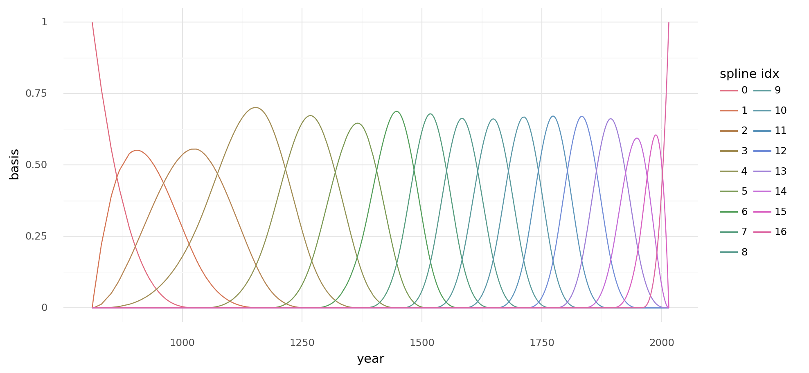

    <ggplot: (350524371)>

```python
with pm.Model(rng_seeder=RANDOM_SEED) as m4_7:
    a = pm.Normal("a", 100, 5)
    w = pm.Normal("w", mu=0, sd=3, shape=B.shape[1])
    mu = pm.Deterministic("mu", a + pm.math.dot(np.asarray(B, order="F"), w.T))
    sigma = pm.Exponential("sigma", 1)
    D = pm.Normal("D", mu, sigma, observed=d2.doy)
```

```python
pm.model_to_graphviz(m4_7)
```


```python
with m4_7:
    trace_m4_7 = pm.sample(2000, tune=2000, chains=2, return_inferencedata=True)
    _ = pm.sample_posterior_predictive(trace_m4_7, extend_inferencedata=True)
```

    Auto-assigning NUTS sampler...
    Initializing NUTS using jitter+adapt_diag...
    Multiprocess sampling (2 chains in 2 jobs)
    NUTS: [a, w, sigma]

<style>
    /*Turns off some styling*/
    progress {
        /*gets rid of default border in Firefox and Opera.*/
        border: none;
        /*Needs to be in here for Safari polyfill so background images work as expected.*/
        background-size: auto;
    }
    .progress-bar-interrupted, .progress-bar-interrupted::-webkit-progress-bar {
        background: #F44336;
    }
</style>

<div>
  <progress value='8000' class='' max='8000' style='width:300px; height:20px; vertical-align: middle;'></progress>
  100.00% [8000/8000 00:41<00:00 Sampling 2 chains, 0 divergences]
</div>

    Sampling 2 chains for 2_000 tune and 2_000 draw iterations (4_000 + 4_000 draws total) took 57 seconds.

<style>
    /*Turns off some styling*/
    progress {
        /*gets rid of default border in Firefox and Opera.*/
        border: none;
        /*Needs to be in here for Safari polyfill so background images work as expected.*/
        background-size: auto;
    }
    .progress-bar-interrupted, .progress-bar-interrupted::-webkit-progress-bar {
        background: #F44336;
    }
</style>

<div>
  <progress value='4000' class='' max='4000' style='width:300px; height:20px; vertical-align: middle;'></progress>
  100.00% [4000/4000 00:00<00:00]
</div>

```python
az.summary(trace_m4_7, var_names=["a", "w", "sigma"])
```

<div>
<style scoped>
    .dataframe tbody tr th:only-of-type {
        vertical-align: middle;
    }

    .dataframe tbody tr th {
        vertical-align: top;
    }

    .dataframe thead th {
        text-align: right;
    }
</style>
<table border="1" class="dataframe">
  <thead>
    <tr style="text-align: right;">
      <th></th>
      <th>mean</th>
      <th>sd</th>
      <th>hdi_3%</th>
      <th>hdi_97%</th>
      <th>mcse_mean</th>
      <th>mcse_sd</th>
      <th>ess_bulk</th>
      <th>ess_tail</th>
      <th>r_hat</th>
    </tr>
  </thead>
  <tbody>
    <tr>
      <th>a</th>
      <td>103.651</td>
      <td>0.755</td>
      <td>102.296</td>
      <td>105.120</td>
      <td>0.018</td>
      <td>0.013</td>
      <td>1691.0</td>
      <td>1572.0</td>
      <td>1.0</td>
    </tr>
    <tr>
      <th>w[0]</th>
      <td>-1.795</td>
      <td>2.202</td>
      <td>-6.027</td>
      <td>2.212</td>
      <td>0.037</td>
      <td>0.031</td>
      <td>3496.0</td>
      <td>2923.0</td>
      <td>1.0</td>
    </tr>
    <tr>
      <th>w[1]</th>
      <td>-1.654</td>
      <td>2.057</td>
      <td>-5.351</td>
      <td>2.409</td>
      <td>0.037</td>
      <td>0.027</td>
      <td>3028.0</td>
      <td>2949.0</td>
      <td>1.0</td>
    </tr>
    <tr>
      <th>w[2]</th>
      <td>-0.252</td>
      <td>1.935</td>
      <td>-4.041</td>
      <td>3.326</td>
      <td>0.035</td>
      <td>0.026</td>
      <td>3042.0</td>
      <td>2976.0</td>
      <td>1.0</td>
    </tr>
    <tr>
      <th>w[3]</th>
      <td>3.326</td>
      <td>1.481</td>
      <td>0.632</td>
      <td>6.144</td>
      <td>0.029</td>
      <td>0.020</td>
      <td>2632.0</td>
      <td>2603.0</td>
      <td>1.0</td>
    </tr>
    <tr>
      <th>w[4]</th>
      <td>0.204</td>
      <td>1.512</td>
      <td>-2.574</td>
      <td>3.114</td>
      <td>0.027</td>
      <td>0.020</td>
      <td>3063.0</td>
      <td>2893.0</td>
      <td>1.0</td>
    </tr>
    <tr>
      <th>w[5]</th>
      <td>2.104</td>
      <td>1.635</td>
      <td>-1.024</td>
      <td>5.124</td>
      <td>0.031</td>
      <td>0.022</td>
      <td>2818.0</td>
      <td>2936.0</td>
      <td>1.0</td>
    </tr>
    <tr>
      <th>w[6]</th>
      <td>-3.561</td>
      <td>1.472</td>
      <td>-6.320</td>
      <td>-0.720</td>
      <td>0.025</td>
      <td>0.018</td>
      <td>3349.0</td>
      <td>3466.0</td>
      <td>1.0</td>
    </tr>
    <tr>
      <th>w[7]</th>
      <td>5.536</td>
      <td>1.422</td>
      <td>2.802</td>
      <td>8.075</td>
      <td>0.027</td>
      <td>0.019</td>
      <td>2787.0</td>
      <td>3028.0</td>
      <td>1.0</td>
    </tr>
    <tr>
      <th>w[8]</th>
      <td>-0.067</td>
      <td>1.512</td>
      <td>-2.861</td>
      <td>2.788</td>
      <td>0.026</td>
      <td>0.019</td>
      <td>3322.0</td>
      <td>3377.0</td>
      <td>1.0</td>
    </tr>
    <tr>
      <th>w[9]</th>
      <td>2.227</td>
      <td>1.561</td>
      <td>-0.665</td>
      <td>5.200</td>
      <td>0.029</td>
      <td>0.021</td>
      <td>2973.0</td>
      <td>3255.0</td>
      <td>1.0</td>
    </tr>
    <tr>
      <th>w[10]</th>
      <td>3.766</td>
      <td>1.485</td>
      <td>0.909</td>
      <td>6.471</td>
      <td>0.029</td>
      <td>0.020</td>
      <td>2681.0</td>
      <td>2929.0</td>
      <td>1.0</td>
    </tr>
    <tr>
      <th>w[11]</th>
      <td>0.311</td>
      <td>1.493</td>
      <td>-2.428</td>
      <td>3.196</td>
      <td>0.028</td>
      <td>0.021</td>
      <td>2917.0</td>
      <td>2911.0</td>
      <td>1.0</td>
    </tr>
    <tr>
      <th>w[12]</th>
      <td>4.143</td>
      <td>1.537</td>
      <td>1.292</td>
      <td>7.047</td>
      <td>0.030</td>
      <td>0.021</td>
      <td>2574.0</td>
      <td>2562.0</td>
      <td>1.0</td>
    </tr>
    <tr>
      <th>w[13]</th>
      <td>1.077</td>
      <td>1.601</td>
      <td>-1.686</td>
      <td>4.270</td>
      <td>0.030</td>
      <td>0.021</td>
      <td>2938.0</td>
      <td>3144.0</td>
      <td>1.0</td>
    </tr>
    <tr>
      <th>w[14]</th>
      <td>-1.818</td>
      <td>1.795</td>
      <td>-4.994</td>
      <td>1.719</td>
      <td>0.035</td>
      <td>0.025</td>
      <td>2665.0</td>
      <td>2802.0</td>
      <td>1.0</td>
    </tr>
    <tr>
      <th>w[15]</th>
      <td>-5.979</td>
      <td>1.834</td>
      <td>-9.503</td>
      <td>-2.679</td>
      <td>0.032</td>
      <td>0.023</td>
      <td>3262.0</td>
      <td>2979.0</td>
      <td>1.0</td>
    </tr>
    <tr>
      <th>w[16]</th>
      <td>-6.190</td>
      <td>1.876</td>
      <td>-9.943</td>
      <td>-2.839</td>
      <td>0.032</td>
      <td>0.023</td>
      <td>3370.0</td>
      <td>2896.0</td>
      <td>1.0</td>
    </tr>
    <tr>
      <th>sigma</th>
      <td>5.954</td>
      <td>0.145</td>
      <td>5.684</td>
      <td>6.230</td>
      <td>0.002</td>
      <td>0.001</td>
      <td>5054.0</td>
      <td>3315.0</td>
      <td>1.0</td>
    </tr>
  </tbody>
</table>
</div>

```python
az.plot_trace(trace_m4_7, var_names=["a", "w", "sigma"])
plt.tight_layout();
```


```python
az.plot_forest(trace_m4_7, var_names=["w"], combined=True);
```


```python
wp = trace_m4_7.posterior["w"].values.mean(axis=(0, 1))

spline_df = (
    pd.DataFrame(B * wp.T)
    .assign(year=d2.year.values)
    .melt("year", var_name="spline_i", value_name="value")
)

spline_df_merged = (
    pd.DataFrame(np.dot(B, wp.T))
    .assign(year=d2.year.values)
    .melt("year", var_name="spline_i", value_name="value")
)

(
    gg.ggplot(spline_df, gg.aes(x="year", y="value"))
    + gg.geom_vline(xintercept=knot_list, color="#0C73B4", alpha=0.5)
    + gg.geom_line(data=spline_df_merged, linetype="-", color="blue", size=2, alpha=0.7)
    + gg.geom_line(gg.aes(group="spline_i", color="spline_i"), alpha=0.7, size=1)
    + gg.scale_color_discrete(guide=gg.guide_legend(ncol=2), color_space="husl")
    + gg.theme(figure_size=(10, 5))
    + gg.labs(x="year", y="basis", title="Fit spline", color="spline idx")
)
```


    <ggplot: (350363775)>

```python
post_pred = az.summary(trace_m4_7, var_names=["mu"]).reset_index(drop=True)
d2_post = d2.copy().reset_index(drop=True)
d2_post["pred_mean"] = post_pred["mean"]
d2_post["pred_hdi_lower"] = post_pred["hdi_3%"]
d2_post["pred_hdi_upper"] = post_pred["hdi_97%"]
```

```python
(
    gg.ggplot(d2_post, gg.aes(x="year"))
    + gg.geom_ribbon(
        gg.aes(ymin="pred_hdi_lower", ymax="pred_hdi_upper"), alpha=0.3, fill="tomato"
    )
    + gg.geom_line(gg.aes(y="pred_mean"), color="firebrick", alpha=1, size=2)
    + gg.geom_point(gg.aes(y="doy"), color="black", alpha=0.4, size=1.3)
    + gg.geom_vline(xintercept=knot_list, color="gray", alpha=0.8)
    + gg.theme(figure_size=(10, 5))
    + gg.labs(
        x="year",
        y="day of year",
        title="Cherry blossom data with posterior predictions",
    )
)
```


    <ggplot: (353279398)>

---

> **NOTE:** I have update the above code for PyMC v4, but not the code below this point.

---

## Example with gene CN data of a single gene

```python
modeling_data = pd.read_csv(modeling_data_path)
modeling_data.head(n=7)
```

<div>
<style scoped>
    .dataframe tbody tr th:only-of-type {
        vertical-align: middle;
    }

    .dataframe tbody tr th {
        vertical-align: top;
    }

    .dataframe thead th {
        text-align: right;
    }
</style>
<table border="1" class="dataframe">
  <thead>
    <tr style="text-align: right;">
      <th></th>
      <th>sgrna</th>
      <th>replicate_id</th>
      <th>lfc</th>
      <th>pdna_batch</th>
      <th>passes_qc</th>
      <th>depmap_id</th>
      <th>primary_or_metastasis</th>
      <th>lineage</th>
      <th>lineage_subtype</th>
      <th>kras_mutation</th>
      <th>...</th>
      <th>log2_gene_cn_p1</th>
      <th>gene_cn</th>
      <th>n_muts</th>
      <th>any_deleterious</th>
      <th>variant_classification</th>
      <th>is_deleterious</th>
      <th>is_tcga_hotspot</th>
      <th>is_cosmic_hotspot</th>
      <th>mutated_at_guide_location</th>
      <th>rna_expr</th>
    </tr>
  </thead>
  <tbody>
    <tr>
      <th>0</th>
      <td>AAGAGGCCGGTCAAATTCAG</td>
      <td>42-mg-ba-311cas9_repa_p6_batch3</td>
      <td>-0.405499</td>
      <td>3</td>
      <td>True</td>
      <td>ACH-000323</td>
      <td>Primary</td>
      <td>central_nervous_system</td>
      <td>glioma</td>
      <td>WT</td>
      <td>...</td>
      <td>0.845287</td>
      <td>1.328646</td>
      <td>0</td>
      <td>False</td>
      <td>NaN</td>
      <td>NaN</td>
      <td>NaN</td>
      <td>NaN</td>
      <td>False</td>
      <td>1.263034</td>
    </tr>
    <tr>
      <th>1</th>
      <td>AATCAACCCACAGCTGCACA</td>
      <td>42-mg-ba-311cas9_repa_p6_batch3</td>
      <td>-0.133541</td>
      <td>3</td>
      <td>True</td>
      <td>ACH-000323</td>
      <td>Primary</td>
      <td>central_nervous_system</td>
      <td>glioma</td>
      <td>WT</td>
      <td>...</td>
      <td>0.827398</td>
      <td>1.287359</td>
      <td>2</td>
      <td>False</td>
      <td>missense_mutation;missense_mutation</td>
      <td>FALSE;FALSE</td>
      <td>TRUE;TRUE</td>
      <td>TRUE;TRUE</td>
      <td>False</td>
      <td>5.220330</td>
    </tr>
    <tr>
      <th>2</th>
      <td>AATTACTACTTGCTTCCTGT</td>
      <td>42-mg-ba-311cas9_repa_p6_batch3</td>
      <td>-0.491495</td>
      <td>3</td>
      <td>True</td>
      <td>ACH-000323</td>
      <td>Primary</td>
      <td>central_nervous_system</td>
      <td>glioma</td>
      <td>WT</td>
      <td>...</td>
      <td>0.879280</td>
      <td>1.409165</td>
      <td>0</td>
      <td>False</td>
      <td>NaN</td>
      <td>NaN</td>
      <td>NaN</td>
      <td>NaN</td>
      <td>False</td>
      <td>3.008989</td>
    </tr>
    <tr>
      <th>3</th>
      <td>ACCTGTATGACGAAACCGTG</td>
      <td>42-mg-ba-311cas9_repa_p6_batch3</td>
      <td>-0.015850</td>
      <td>3</td>
      <td>True</td>
      <td>ACH-000323</td>
      <td>Primary</td>
      <td>central_nervous_system</td>
      <td>glioma</td>
      <td>WT</td>
      <td>...</td>
      <td>0.818549</td>
      <td>1.267208</td>
      <td>0</td>
      <td>False</td>
      <td>NaN</td>
      <td>NaN</td>
      <td>NaN</td>
      <td>NaN</td>
      <td>False</td>
      <td>4.083213</td>
    </tr>
    <tr>
      <th>4</th>
      <td>ACTCTGTTCCTTCATCTCCG</td>
      <td>42-mg-ba-311cas9_repa_p6_batch3</td>
      <td>-0.530277</td>
      <td>3</td>
      <td>True</td>
      <td>ACH-000323</td>
      <td>Primary</td>
      <td>central_nervous_system</td>
      <td>glioma</td>
      <td>WT</td>
      <td>...</td>
      <td>0.990378</td>
      <td>1.692253</td>
      <td>0</td>
      <td>False</td>
      <td>NaN</td>
      <td>NaN</td>
      <td>NaN</td>
      <td>NaN</td>
      <td>False</td>
      <td>5.822730</td>
    </tr>
    <tr>
      <th>5</th>
      <td>ACTGCTGCGGGAATTCCAAG</td>
      <td>42-mg-ba-311cas9_repa_p6_batch3</td>
      <td>0.778827</td>
      <td>3</td>
      <td>True</td>
      <td>ACH-000323</td>
      <td>Primary</td>
      <td>central_nervous_system</td>
      <td>glioma</td>
      <td>WT</td>
      <td>...</td>
      <td>0.818549</td>
      <td>1.267208</td>
      <td>0</td>
      <td>False</td>
      <td>NaN</td>
      <td>NaN</td>
      <td>NaN</td>
      <td>NaN</td>
      <td>False</td>
      <td>4.083213</td>
    </tr>
    <tr>
      <th>6</th>
      <td>AGACACTTATACTATGAAAG</td>
      <td>42-mg-ba-311cas9_repa_p6_batch3</td>
      <td>0.035950</td>
      <td>3</td>
      <td>True</td>
      <td>ACH-000323</td>
      <td>Primary</td>
      <td>central_nervous_system</td>
      <td>glioma</td>
      <td>WT</td>
      <td>...</td>
      <td>0.872323</td>
      <td>1.392463</td>
      <td>0</td>
      <td>False</td>
      <td>NaN</td>
      <td>NaN</td>
      <td>NaN</td>
      <td>NaN</td>
      <td>False</td>
      <td>3.701549</td>
    </tr>
  </tbody>
</table>
<p>7 rows × 27 columns</p>
</div>

### A "well-behaved" gene: *PTK2*

```python
np.random.seed(RANDOM_SEED)
ptk2_data = modeling_data[modeling_data.hugo_symbol == "PTK2"]

(
    gg.ggplot(ptk2_data, gg.aes(x="gene_cn", y="lfc"))
    + gg.geom_density_2d(color="black", alpha=0.8, size=1, linetype="--")
    + gg.geom_point(size=0.4, alpha=0.2, color="navy")
    + gg.geom_smooth(method="lm")
    + gg.labs(x="gene copy number", y="logFC", title="PTK2")
)
```


    <ggplot: (8777789352340)>

```python
ptk2_data.shape[0]
```

    2332

```python
cn_num_knots = 5
cn_knot_list = np.quantile(ptk2_data.gene_cn, np.linspace(0, 1, cn_num_knots))

ptk2_B = dmatrix(
    "bs(x, knots=knots, degree=3, include_intercept=True) - 1",
    {"x": ptk2_data.gene_cn, "knots": cn_knot_list[1:-1]},
)

print(cn_knot_list)
```

    [0.60396783 1.67270427 2.08756486 2.53427991 6.7709577 ]

```python
ptk2_spline_df = (
    pd.DataFrame(ptk2_B)
    .assign(gene_cn=ptk2_data.gene_cn.values)
    .melt("gene_cn", var_name="spline_i", value_name="value")
)

(
    gg.ggplot(ptk2_spline_df, gg.aes(x="gene_cn", y="value"))
    + gg.geom_line(gg.aes(group="spline_i", color="spline_i"))
    + gg.scale_color_discrete(guide=gg.guide_legend(ncol=2))
    + gg.labs(x="gene copy number", y="basis", color="spline idx")
)
```

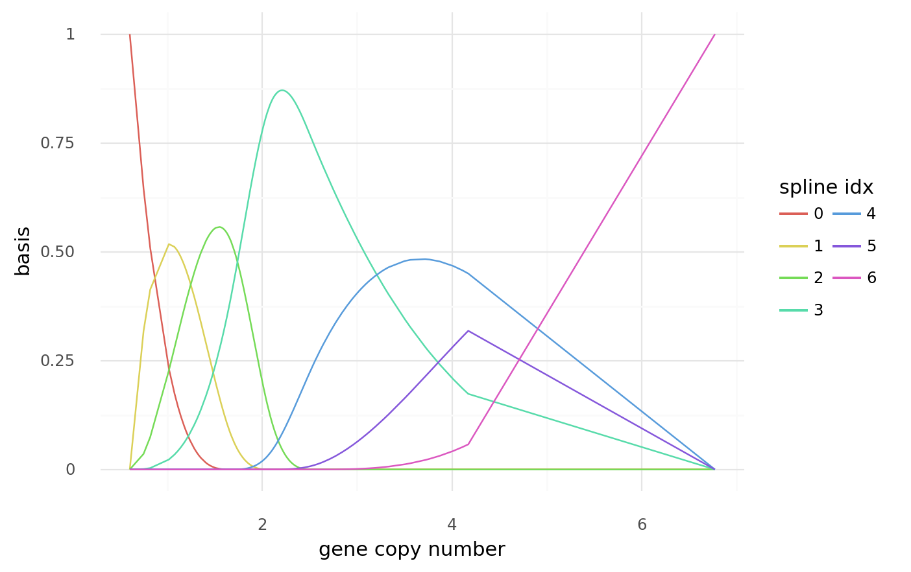

    <ggplot: (8777789347675)>

```python
with pm.Model() as m_ptk2:
    a = pm.Normal("a", mu=0, sd=2)
    w = pm.Normal("w", mu=-0.5, sd=1, shape=ptk2_B.shape[1])
    mu = pm.Deterministic("mu", a + pm.math.dot(np.asarray(ptk2_B, order="F"), w.T))
    sigma = pm.Exponential("sigma", 1)
    D = pm.Normal("D", mu, sigma, observed=ptk2_data.lfc)
```

```python
pm.model_to_graphviz(m_ptk2)
```

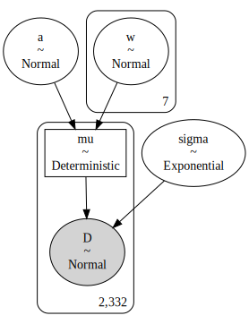

```python
with m_ptk2:
    prior_pc = pm.sample_prior_predictive(random_seed=RANDOM_SEED)
    trace_m_ptk2 = pm.sample(3000, tune=2000, chains=2, random_seed=RANDOM_SEED)
    post_pc = pm.sample_posterior_predictive(trace_m_ptk2, random_seed=RANDOM_SEED)
```

    Auto-assigning NUTS sampler...
    Initializing NUTS using jitter+adapt_diag...
    Multiprocess sampling (2 chains in 4 jobs)
    NUTS: [sigma, w, a]

<div>
    <style>
        /*Turns off some styling*/
        progress {
            /*gets rid of default border in Firefox and Opera.*/
            border: none;
            /*Needs to be in here for Safari polyfill so background images work as expected.*/
            background-size: auto;
        }
        .progress-bar-interrupted, .progress-bar-interrupted::-webkit-progress-bar {
            background: #F44336;
        }
    </style>
  <progress value='10000' class='' max='10000' style='width:300px; height:20px; vertical-align: middle;'></progress>
  100.00% [10000/10000 00:56<00:00 Sampling 2 chains, 0 divergences]
</div>

    Sampling 2 chains for 2_000 tune and 3_000 draw iterations (4_000 + 6_000 draws total) took 56 seconds.
    The number of effective samples is smaller than 25% for some parameters.

<div>
    <style>
        /*Turns off some styling*/
        progress {
            /*gets rid of default border in Firefox and Opera.*/
            border: none;
            /*Needs to be in here for Safari polyfill so background images work as expected.*/
            background-size: auto;
        }
        .progress-bar-interrupted, .progress-bar-interrupted::-webkit-progress-bar {
            background: #F44336;
        }
    </style>
  <progress value='6000' class='' max='6000' style='width:300px; height:20px; vertical-align: middle;'></progress>
  100.00% [6000/6000 00:07<00:00]
</div>

```python
az_ptk2 = az.from_pymc3(
    model=m_ptk2, trace=trace_m_ptk2, posterior_predictive=post_pc, prior=prior_pc
)
```

```python
post_pred = az.summary(az_ptk2, var_names=["mu"]).reset_index(drop=True)
ptk2_post = ptk2_data.copy().reset_index(drop=True)
ptk2_post["pred_mean"] = post_pred["mean"]
ptk2_post["pred_hdi_lower"] = post_pred["hdi_3%"]
ptk2_post["pred_hdi_upper"] = post_pred["hdi_97%"]
ptk2_post.head()
```

<div>
<style scoped>
    .dataframe tbody tr th:only-of-type {
        vertical-align: middle;
    }

    .dataframe tbody tr th {
        vertical-align: top;
    }

    .dataframe thead th {
        text-align: right;
    }
</style>
<table border="1" class="dataframe">
  <thead>
    <tr style="text-align: right;">
      <th></th>
      <th>sgrna</th>
      <th>replicate_id</th>
      <th>lfc</th>
      <th>pdna_batch</th>
      <th>passes_qc</th>
      <th>depmap_id</th>
      <th>primary_or_metastasis</th>
      <th>lineage</th>
      <th>lineage_subtype</th>
      <th>kras_mutation</th>
      <th>...</th>
      <th>any_deleterious</th>
      <th>variant_classification</th>
      <th>is_deleterious</th>
      <th>is_tcga_hotspot</th>
      <th>is_cosmic_hotspot</th>
      <th>mutated_at_guide_location</th>
      <th>rna_expr</th>
      <th>pred_mean</th>
      <th>pred_hdi_lower</th>
      <th>pred_hdi_upper</th>
    </tr>
  </thead>
  <tbody>
    <tr>
      <th>0</th>
      <td>ATATGGCTGACCTAATAGAT</td>
      <td>42-mg-ba-311cas9_repa_p6_batch3</td>
      <td>-0.723507</td>
      <td>3</td>
      <td>True</td>
      <td>ACH-000323</td>
      <td>Primary</td>
      <td>central_nervous_system</td>
      <td>glioma</td>
      <td>WT</td>
      <td>...</td>
      <td>False</td>
      <td>NaN</td>
      <td>NaN</td>
      <td>NaN</td>
      <td>NaN</td>
      <td>False</td>
      <td>5.878235</td>
      <td>-0.646</td>
      <td>-0.685</td>
      <td>-0.605</td>
    </tr>
    <tr>
      <th>1</th>
      <td>CGATCATACTGGGAGATGCG</td>
      <td>42-mg-ba-311cas9_repa_p6_batch3</td>
      <td>-0.445568</td>
      <td>3</td>
      <td>True</td>
      <td>ACH-000323</td>
      <td>Primary</td>
      <td>central_nervous_system</td>
      <td>glioma</td>
      <td>WT</td>
      <td>...</td>
      <td>False</td>
      <td>NaN</td>
      <td>NaN</td>
      <td>NaN</td>
      <td>NaN</td>
      <td>False</td>
      <td>5.878235</td>
      <td>-0.646</td>
      <td>-0.685</td>
      <td>-0.605</td>
    </tr>
    <tr>
      <th>2</th>
      <td>GCGAGGTTCCATTCACCAGC</td>
      <td>42-mg-ba-311cas9_repa_p6_batch3</td>
      <td>-0.429098</td>
      <td>3</td>
      <td>True</td>
      <td>ACH-000323</td>
      <td>Primary</td>
      <td>central_nervous_system</td>
      <td>glioma</td>
      <td>WT</td>
      <td>...</td>
      <td>False</td>
      <td>NaN</td>
      <td>NaN</td>
      <td>NaN</td>
      <td>NaN</td>
      <td>False</td>
      <td>5.878235</td>
      <td>-0.646</td>
      <td>-0.685</td>
      <td>-0.605</td>
    </tr>
    <tr>
      <th>3</th>
      <td>GGAGGTTCACTGGCTTCACG</td>
      <td>42-mg-ba-311cas9_repa_p6_batch3</td>
      <td>-0.485250</td>
      <td>3</td>
      <td>True</td>
      <td>ACH-000323</td>
      <td>Primary</td>
      <td>central_nervous_system</td>
      <td>glioma</td>
      <td>WT</td>
      <td>...</td>
      <td>False</td>
      <td>NaN</td>
      <td>NaN</td>
      <td>NaN</td>
      <td>NaN</td>
      <td>False</td>
      <td>5.878235</td>
      <td>-0.646</td>
      <td>-0.685</td>
      <td>-0.605</td>
    </tr>
    <tr>
      <th>4</th>
      <td>ATATGGCTGACCTAATAGAT</td>
      <td>42-mg-ba-311cas9_repb_p6_batch3</td>
      <td>-0.889930</td>
      <td>3</td>
      <td>True</td>
      <td>ACH-000323</td>
      <td>Primary</td>
      <td>central_nervous_system</td>
      <td>glioma</td>
      <td>WT</td>
      <td>...</td>
      <td>False</td>
      <td>NaN</td>
      <td>NaN</td>
      <td>NaN</td>
      <td>NaN</td>
      <td>False</td>
      <td>5.878235</td>
      <td>-0.646</td>
      <td>-0.685</td>
      <td>-0.605</td>
    </tr>
  </tbody>
</table>
<p>5 rows × 30 columns</p>
</div>

```python
(
    gg.ggplot(ptk2_post, gg.aes(x="gene_cn"))
    + gg.geom_point(gg.aes(y="lfc"), color="black", alpha=0.4, size=1.3)
    + gg.geom_vline(xintercept=cn_knot_list, color="gray", alpha=0.8)
    + gg.geom_ribbon(
        gg.aes(ymin="pred_hdi_lower", ymax="pred_hdi_upper"), alpha=0.3, fill="tomato"
    )
    + gg.geom_line(gg.aes(y="pred_mean"), color="firebrick", alpha=1, size=2)
    + gg.theme(figure_size=(10, 5))
    + gg.labs(
        x="gene copy number",
        y="logFC",
        title="Posterior predictions with PTK2 gene copy number data",
    )
)
```

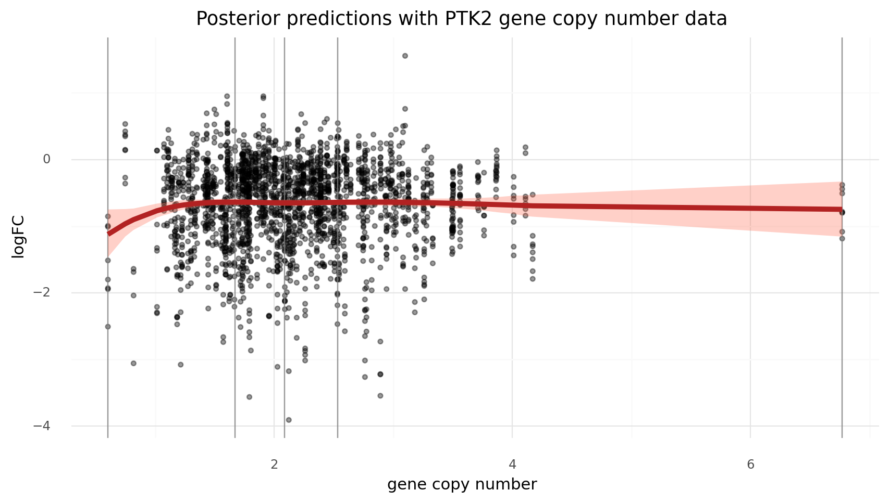

    <ggplot: (8777820522557)>

### A "misbehaved" gene: *MDM2*

In the original Meyers *et al.* (2017) paper, the spline function for each cell line was created with 25 slope coefficients.
The first was automatically pinned to copy number = 0 and the rest were determed using average linkage clustering (a form a hierarhcical clustering) of copy number data for each cell line.
I want to mimic this effect here, but will use the copy number data of all of the genes in the modeling data sub-sample to determine the knots and then fit the model with the data from *MDM2*, a gene was some strong extemes for copy number.

```python
np.random.seed(RANDOM_SEED)
mdm2_data = modeling_data.copy()[modeling_data.hugo_symbol == "MDM2"]
mdm2_data["log_gene_cn"] = np.log10(mdm2_data.gene_cn.values)
(
    gg.ggplot(mdm2_data, gg.aes(x="log_gene_cn", y="lfc"))
    + gg.geom_density_2d(color="black", alpha=0.8, size=1, linetype="--")
    + gg.geom_point(size=0.4, alpha=0.2, color="navy")
    + gg.geom_smooth(method="lm")
    + gg.labs(x="gene copy number (log10)", y="logFC", title="MDM2")
)
```

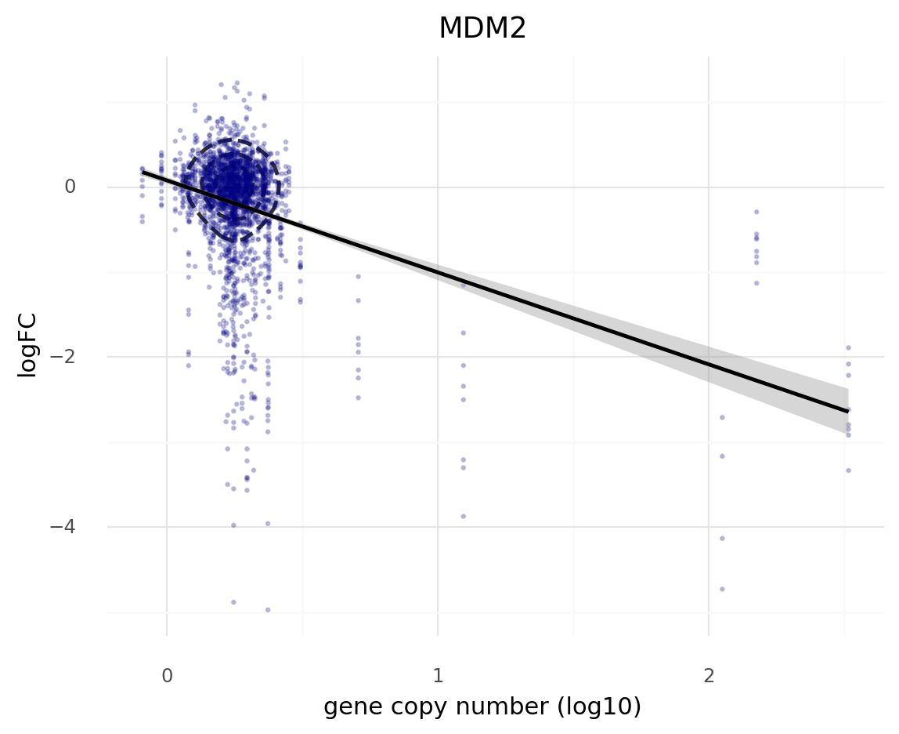

    <ggplot: (8777789211787)>

```python
mdm2_data.shape[0]
```

    2332

```python
cn_num_knots = 5
gene_cn_data = (
    modeling_data[["depmap_id", "hugo_symbol", "gene_cn"]]
    .drop_duplicates()
    .reset_index(drop=True)
)
cn_knot_list = np.quantile(gene_cn_data.gene_cn, np.linspace(0, 1, cn_num_knots))

mdm2_B = dmatrix(
    "bs(x, knots=knots, degree=3, include_intercept=True) - 1",
    {"x": mdm2_data.gene_cn, "knots": cn_knot_list[1:-1]},
)

print([np.round(a, 2) for a in cn_knot_list])
```

    [0.0, 1.44, 1.73, 2.03, 328.39]

```python
mdm2_spline_df = (
    pd.DataFrame(mdm2_B)
    .assign(gene_cn=mdm2_data.gene_cn.values)
    .melt("gene_cn", var_name="spline_i", value_name="value")
)

(
    gg.ggplot(mdm2_spline_df, gg.aes(x="gene_cn", y="value"))
    + gg.geom_line(gg.aes(group="spline_i", color="spline_i"))
    + gg.scale_color_discrete(guide=gg.guide_legend(ncol=2))
    + gg.scale_x_continuous(trans="log")
    + gg.labs(x="gene copy number (log)", y="basis", color="spline idx")
)
```

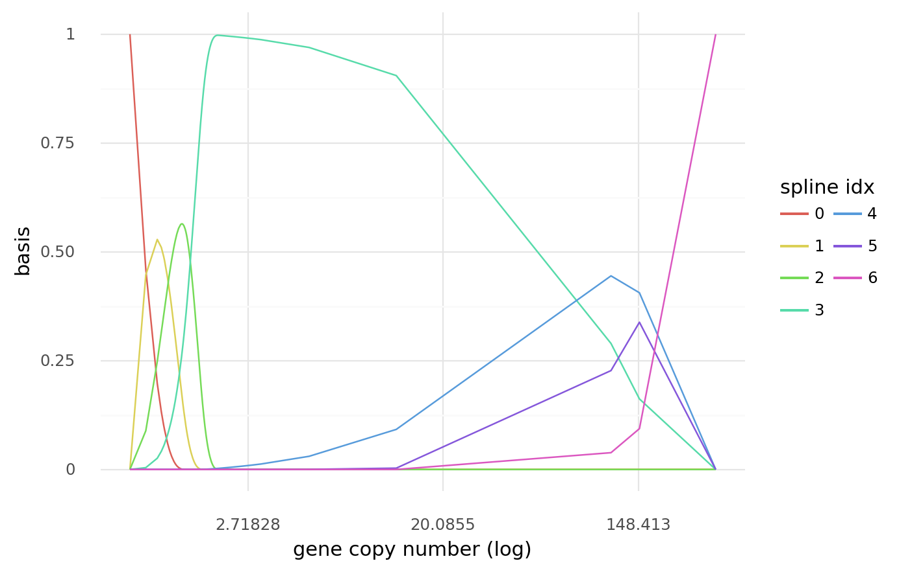

    <ggplot: (8777815498807)>

```python
with pm.Model() as m_mdm2:
    a = pm.Normal("a", mu=0, sd=2)
    w = pm.Normal("w", mu=-0.5, sd=1, shape=mdm2_B.shape[1])
    mu = pm.Deterministic("mu", a + pm.math.dot(np.asarray(mdm2_B, order="F"), w.T))
    sigma = pm.Exponential("sigma", 1)
    D = pm.Normal("D", mu, sigma, observed=mdm2_data.lfc)
```

```python
pm.model_to_graphviz(m_mdm2)
```


```python
with m_mdm2:
    prior_pc = pm.sample_prior_predictive(random_seed=RANDOM_SEED)
    trace_m_mdm2 = pm.sample(
        draws=3000,
        init="advi+adapt_diag",
        n_init=40000,
        tune=3000,
        chains=2,
        random_seed=RANDOM_SEED,
    )
    post_pc = pm.sample_posterior_predictive(trace_m_mdm2, random_seed=RANDOM_SEED)
```

    Auto-assigning NUTS sampler...
    Initializing NUTS using advi+adapt_diag...

<div>
    <style>
        /*Turns off some styling*/
        progress {
            /*gets rid of default border in Firefox and Opera.*/
            border: none;
            /*Needs to be in here for Safari polyfill so background images work as expected.*/
            background-size: auto;
        }
        .progress-bar-interrupted, .progress-bar-interrupted::-webkit-progress-bar {
            background: #F44336;
        }
    </style>
  <progress value='22786' class='' max='40000' style='width:300px; height:20px; vertical-align: middle;'></progress>
  56.97% [22786/40000 00:03<00:02 Average Loss = 2,294.6]
</div>

    Convergence achieved at 24000
    Interrupted at 23,999 [59%]: Average Loss = 2,958.4
    Multiprocess sampling (2 chains in 4 jobs)
    NUTS: [sigma, w, a]

<div>
    <style>
        /*Turns off some styling*/
        progress {
            /*gets rid of default border in Firefox and Opera.*/
            border: none;
            /*Needs to be in here for Safari polyfill so background images work as expected.*/
            background-size: auto;
        }
        .progress-bar-interrupted, .progress-bar-interrupted::-webkit-progress-bar {
            background: #F44336;
        }
    </style>
  <progress value='12000' class='' max='12000' style='width:300px; height:20px; vertical-align: middle;'></progress>
  100.00% [12000/12000 01:16<00:00 Sampling 2 chains, 193 divergences]
</div>

    Sampling 2 chains for 3_000 tune and 3_000 draw iterations (6_000 + 6_000 draws total) took 76 seconds.
    There were 193 divergences after tuning. Increase `target_accept` or reparameterize.
    The acceptance probability does not match the target. It is 0.8835722513348439, but should be close to 0.8. Try to increase the number of tuning steps.
    The number of effective samples is smaller than 25% for some parameters.

<div>
    <style>
        /*Turns off some styling*/
        progress {
            /*gets rid of default border in Firefox and Opera.*/
            border: none;
            /*Needs to be in here for Safari polyfill so background images work as expected.*/
            background-size: auto;
        }
        .progress-bar-interrupted, .progress-bar-interrupted::-webkit-progress-bar {
            background: #F44336;
        }
    </style>
  <progress value='6000' class='' max='6000' style='width:300px; height:20px; vertical-align: middle;'></progress>
  100.00% [6000/6000 00:07<00:00]
</div>

```python
az_mdm2 = az.from_pymc3(
    model=m_mdm2, trace=trace_m_mdm2, posterior_predictive=post_pc, prior=prior_pc
)
```

```python
az.plot_trace(az_mdm2, var_names=["a", "sigma"])
plt.show()
```

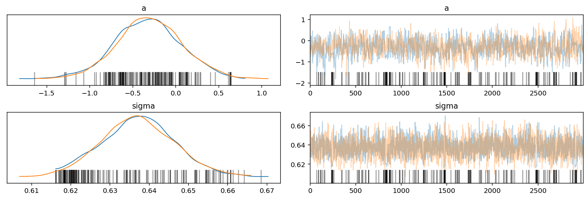

```python
post_pred = az.summary(az_mdm2, var_names=["mu"]).reset_index(drop=True)
mdm2_post = mdm2_data.copy().reset_index(drop=True)
mdm2_post["pred_mean"] = post_pred["mean"]
mdm2_post["pred_hdi_lower"] = post_pred["hdi_3%"]
mdm2_post["pred_hdi_upper"] = post_pred["hdi_97%"]
mdm2_post.head()
```

<div>
<style scoped>
    .dataframe tbody tr th:only-of-type {
        vertical-align: middle;
    }

    .dataframe tbody tr th {
        vertical-align: top;
    }

    .dataframe thead th {
        text-align: right;
    }
</style>
<table border="1" class="dataframe">
  <thead>
    <tr style="text-align: right;">
      <th></th>
      <th>sgrna</th>
      <th>replicate_id</th>
      <th>lfc</th>
      <th>pdna_batch</th>
      <th>passes_qc</th>
      <th>depmap_id</th>
      <th>primary_or_metastasis</th>
      <th>lineage</th>
      <th>lineage_subtype</th>
      <th>kras_mutation</th>
      <th>...</th>
      <th>variant_classification</th>
      <th>is_deleterious</th>
      <th>is_tcga_hotspot</th>
      <th>is_cosmic_hotspot</th>
      <th>mutated_at_guide_location</th>
      <th>rna_expr</th>
      <th>log_gene_cn</th>
      <th>pred_mean</th>
      <th>pred_hdi_lower</th>
      <th>pred_hdi_upper</th>
    </tr>
  </thead>
  <tbody>
    <tr>
      <th>0</th>
      <td>AGACACTTATACTATGAAAG</td>
      <td>42-mg-ba-311cas9_repa_p6_batch3</td>
      <td>0.035950</td>
      <td>3</td>
      <td>True</td>
      <td>ACH-000323</td>
      <td>Primary</td>
      <td>central_nervous_system</td>
      <td>glioma</td>
      <td>WT</td>
      <td>...</td>
      <td>NaN</td>
      <td>NaN</td>
      <td>NaN</td>
      <td>NaN</td>
      <td>False</td>
      <td>3.701549</td>
      <td>0.143784</td>
      <td>0.002</td>
      <td>-0.054</td>
      <td>0.056</td>
    </tr>
    <tr>
      <th>1</th>
      <td>AGTTACTGTGTATCAGGCAG</td>
      <td>42-mg-ba-311cas9_repa_p6_batch3</td>
      <td>0.059690</td>
      <td>3</td>
      <td>True</td>
      <td>ACH-000323</td>
      <td>Primary</td>
      <td>central_nervous_system</td>
      <td>glioma</td>
      <td>WT</td>
      <td>...</td>
      <td>NaN</td>
      <td>NaN</td>
      <td>NaN</td>
      <td>NaN</td>
      <td>False</td>
      <td>3.701549</td>
      <td>0.143784</td>
      <td>0.002</td>
      <td>-0.054</td>
      <td>0.056</td>
    </tr>
    <tr>
      <th>2</th>
      <td>GTTCTTGTCCTTCTTCACTA</td>
      <td>42-mg-ba-311cas9_repa_p6_batch3</td>
      <td>0.148150</td>
      <td>3</td>
      <td>True</td>
      <td>ACH-000323</td>
      <td>Primary</td>
      <td>central_nervous_system</td>
      <td>glioma</td>
      <td>WT</td>
      <td>...</td>
      <td>NaN</td>
      <td>NaN</td>
      <td>NaN</td>
      <td>NaN</td>
      <td>False</td>
      <td>3.701549</td>
      <td>0.143784</td>
      <td>0.002</td>
      <td>-0.054</td>
      <td>0.056</td>
    </tr>
    <tr>
      <th>3</th>
      <td>TTGCAATGTGATGGAAGGGG</td>
      <td>42-mg-ba-311cas9_repa_p6_batch3</td>
      <td>-0.102953</td>
      <td>3</td>
      <td>True</td>
      <td>ACH-000323</td>
      <td>Primary</td>
      <td>central_nervous_system</td>
      <td>glioma</td>
      <td>WT</td>
      <td>...</td>
      <td>NaN</td>
      <td>NaN</td>
      <td>NaN</td>
      <td>NaN</td>
      <td>False</td>
      <td>3.701549</td>
      <td>0.143784</td>
      <td>0.002</td>
      <td>-0.054</td>
      <td>0.056</td>
    </tr>
    <tr>
      <th>4</th>
      <td>AGACACTTATACTATGAAAG</td>
      <td>42-mg-ba-311cas9_repb_p6_batch3</td>
      <td>-0.469799</td>
      <td>3</td>
      <td>True</td>
      <td>ACH-000323</td>
      <td>Primary</td>
      <td>central_nervous_system</td>
      <td>glioma</td>
      <td>WT</td>
      <td>...</td>
      <td>NaN</td>
      <td>NaN</td>
      <td>NaN</td>
      <td>NaN</td>
      <td>False</td>
      <td>3.701549</td>
      <td>0.143784</td>
      <td>0.002</td>
      <td>-0.054</td>
      <td>0.056</td>
    </tr>
  </tbody>
</table>
<p>5 rows × 31 columns</p>
</div>

```python
p = (
    gg.ggplot(mdm2_post, gg.aes(x="gene_cn"))
    + gg.geom_point(gg.aes(y="lfc"), color="black", alpha=0.4, size=1.3)
    + gg.geom_vline(xintercept=cn_knot_list, color="gray", alpha=0.8)
    + gg.geom_ribbon(
        gg.aes(ymin="pred_hdi_lower", ymax="pred_hdi_upper"), alpha=0.3, fill="tomato"
    )
    + gg.geom_line(gg.aes(y="pred_mean"), color="firebrick", alpha=1, size=2)
    + gg.theme(figure_size=(10, 5))
    + gg.scale_x_continuous()
    + gg.labs(
        x="gene copy number",
        y="logFC",
        title="Posterior predictions with MDM2 gene copy number data",
    )
)
p
```


    <ggplot: (8777789206848)>

```python
(
    p
    + gg.scale_x_continuous(limits=(0.5, 3.4))
    + gg.labs(title="Posterior predictions with MDM2 gene copy number data (zoomed)")
)
```

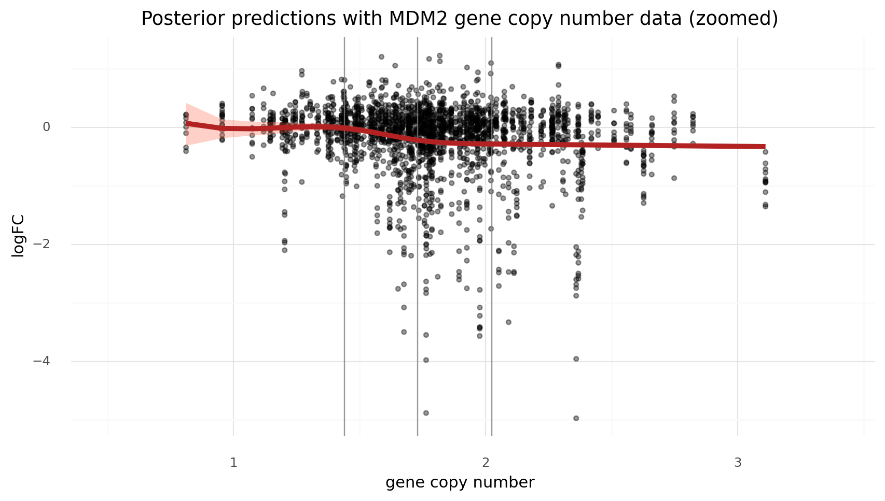

    <ggplot: (8777797987338)>

### Multi-level

How to do this with multiple levels?
The original 2017 paper created a spline function for each cell line.
I think the only change would be to have an additional index on `w` and keep all of the `B` matrices in a list that gets indexed, too.

```python
modeling_data2 = pd.read_csv(modeling_data2_path)

for col in ["depmap_id", "hugo_symbol", "sgrna"]:
    modeling_data2[col] = pd.Categorical(modeling_data2[col], ordered=True)

modeling_data2.head(n=7)
```

<div>
<style scoped>
    .dataframe tbody tr th:only-of-type {
        vertical-align: middle;
    }

    .dataframe tbody tr th {
        vertical-align: top;
    }

    .dataframe thead th {
        text-align: right;
    }
</style>
<table border="1" class="dataframe">
  <thead>
    <tr style="text-align: right;">
      <th></th>
      <th>sgrna</th>
      <th>replicate_id</th>
      <th>lfc</th>
      <th>pdna_batch</th>
      <th>passes_qc</th>
      <th>depmap_id</th>
      <th>primary_or_metastasis</th>
      <th>lineage</th>
      <th>lineage_subtype</th>
      <th>kras_mutation</th>
      <th>...</th>
      <th>log2_gene_cn_p1</th>
      <th>gene_cn</th>
      <th>n_muts</th>
      <th>any_deleterious</th>
      <th>variant_classification</th>
      <th>is_deleterious</th>
      <th>is_tcga_hotspot</th>
      <th>is_cosmic_hotspot</th>
      <th>mutated_at_guide_location</th>
      <th>rna_expr</th>
    </tr>
  </thead>
  <tbody>
    <tr>
      <th>0</th>
      <td>AAAACCCAGGAAATTAGCAA</td>
      <td>dkmg-311cas9_repa_p5_batch3</td>
      <td>0.205242</td>
      <td>3</td>
      <td>True</td>
      <td>ACH-000244</td>
      <td>Primary</td>
      <td>central_nervous_system</td>
      <td>glioma</td>
      <td>WT</td>
      <td>...</td>
      <td>1.010773</td>
      <td>1.747725</td>
      <td>0</td>
      <td>False</td>
      <td>NaN</td>
      <td>NaN</td>
      <td>NaN</td>
      <td>NaN</td>
      <td>False</td>
      <td>6.130931</td>
    </tr>
    <tr>
      <th>1</th>
      <td>AAAAGTCCACCAGAGCCATG</td>
      <td>dkmg-311cas9_repa_p5_batch3</td>
      <td>-0.079548</td>
      <td>3</td>
      <td>True</td>
      <td>ACH-000244</td>
      <td>Primary</td>
      <td>central_nervous_system</td>
      <td>glioma</td>
      <td>WT</td>
      <td>...</td>
      <td>0.988893</td>
      <td>1.688256</td>
      <td>0</td>
      <td>False</td>
      <td>NaN</td>
      <td>NaN</td>
      <td>NaN</td>
      <td>NaN</td>
      <td>False</td>
      <td>0.000000</td>
    </tr>
    <tr>
      <th>2</th>
      <td>AAACAACTATCATGAGCGCG</td>
      <td>dkmg-311cas9_repa_p5_batch3</td>
      <td>0.123618</td>
      <td>3</td>
      <td>True</td>
      <td>ACH-000244</td>
      <td>Primary</td>
      <td>central_nervous_system</td>
      <td>glioma</td>
      <td>WT</td>
      <td>...</td>
      <td>0.664765</td>
      <td>0.944034</td>
      <td>0</td>
      <td>False</td>
      <td>NaN</td>
      <td>NaN</td>
      <td>NaN</td>
      <td>NaN</td>
      <td>False</td>
      <td>6.034084</td>
    </tr>
    <tr>
      <th>3</th>
      <td>AAACCCTAAAGAAAACCCAG</td>
      <td>dkmg-311cas9_repa_p5_batch3</td>
      <td>-0.147315</td>
      <td>3</td>
      <td>True</td>
      <td>ACH-000244</td>
      <td>Primary</td>
      <td>central_nervous_system</td>
      <td>glioma</td>
      <td>WT</td>
      <td>...</td>
      <td>0.996234</td>
      <td>1.708064</td>
      <td>0</td>
      <td>False</td>
      <td>NaN</td>
      <td>NaN</td>
      <td>NaN</td>
      <td>NaN</td>
      <td>False</td>
      <td>3.790772</td>
    </tr>
    <tr>
      <th>4</th>
      <td>AAACCTGCTGATATTCCTGG</td>
      <td>dkmg-311cas9_repa_p5_batch3</td>
      <td>0.076666</td>
      <td>3</td>
      <td>True</td>
      <td>ACH-000244</td>
      <td>Primary</td>
      <td>central_nervous_system</td>
      <td>glioma</td>
      <td>WT</td>
      <td>...</td>
      <td>1.006521</td>
      <td>1.736065</td>
      <td>0</td>
      <td>False</td>
      <td>NaN</td>
      <td>NaN</td>
      <td>NaN</td>
      <td>NaN</td>
      <td>False</td>
      <td>0.000000</td>
    </tr>
    <tr>
      <th>5</th>
      <td>AAACGGTGCCTGTAAGTACG</td>
      <td>dkmg-311cas9_repa_p5_batch3</td>
      <td>0.141762</td>
      <td>3</td>
      <td>True</td>
      <td>ACH-000244</td>
      <td>Primary</td>
      <td>central_nervous_system</td>
      <td>glioma</td>
      <td>WT</td>
      <td>...</td>
      <td>1.094310</td>
      <td>1.987120</td>
      <td>0</td>
      <td>False</td>
      <td>NaN</td>
      <td>NaN</td>
      <td>NaN</td>
      <td>NaN</td>
      <td>False</td>
      <td>6.603775</td>
    </tr>
    <tr>
      <th>6</th>
      <td>AAACGTGCACGGTCCGGCCG</td>
      <td>dkmg-311cas9_repa_p5_batch3</td>
      <td>0.043855</td>
      <td>3</td>
      <td>True</td>
      <td>ACH-000244</td>
      <td>Primary</td>
      <td>central_nervous_system</td>
      <td>glioma</td>
      <td>WT</td>
      <td>...</td>
      <td>0.611721</td>
      <td>0.843602</td>
      <td>0</td>
      <td>False</td>
      <td>NaN</td>
      <td>NaN</td>
      <td>NaN</td>
      <td>NaN</td>
      <td>False</td>
      <td>0.344828</td>
    </tr>
  </tbody>
</table>
<p>7 rows × 27 columns</p>
</div>

```python
np.random.seed(RANDOM_SEED)
SAMPLED_GENES = np.random.choice(
    modeling_data2.hugo_symbol.unique(), 100, replace=False
)
modeling_data2 = modeling_data2[modeling_data2.hugo_symbol.isin(SAMPLED_GENES)]
```

```python
modeling_data2.shape
```

    (5096, 27)

```python
d = modeling_data2.copy()
d["gene_cn_max"] = [np.min((10.0, x)) for x in d.gene_cn]
(
    gg.ggplot(d, gg.aes(x="gene_cn_max"))
    + gg.facet_wrap("depmap_id", scales="free_y")
    + gg.geom_histogram(
        gg.aes(color="depmap_id", fill="depmap_id"), alpha=0.7, binwidth=1.0
    )
    + gg.scale_color_brewer(type="qual", palette="Dark2")
    + gg.scale_fill_brewer(type="qual", palette="Dark2")
    + gg.scale_x_continuous(breaks=list(range(12)), expand=(0, 0, 0, 0))
    + gg.theme(figure_size=(10, 8), subplots_adjust={"hspace": 0.4, "wspace": 0.3})
)
```

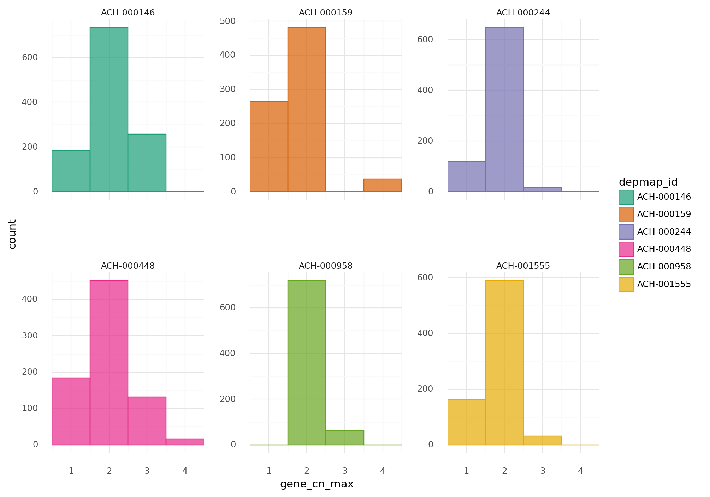

    <ggplot: (8777797987452)>

```python
(
    gg.ggplot(d, gg.aes(x="lfc"))
    + gg.facet_wrap("depmap_id", scales="free_y")
    + gg.geom_density(gg.aes(color="depmap_id", fill="depmap_id"), alpha=0.7)
    + gg.scale_color_brewer(type="qual", palette="Dark2")
    + gg.scale_fill_brewer(type="qual", palette="Dark2")
    + gg.theme(figure_size=(10, 8), subplots_adjust={"hspace": 0.4, "wspace": 0.3})
)
```

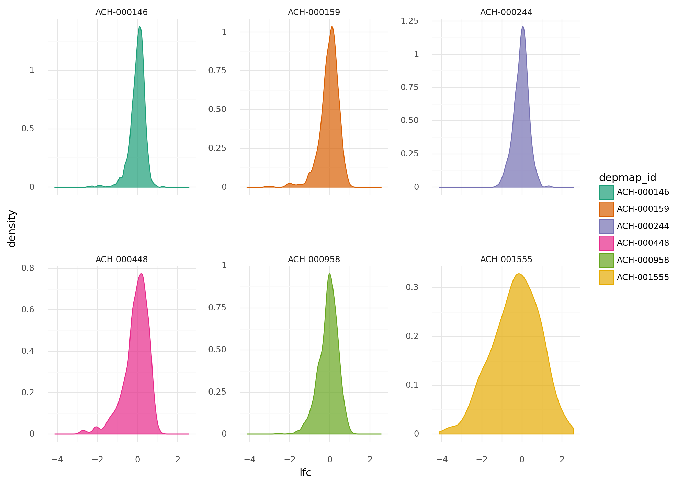

    <ggplot: (8777907651970)>

```python
d = modeling_data2.copy()
d["gene_cn_log"] = np.log2(d.gene_cn.values + 1)
(
    gg.ggplot(d, gg.aes(x="gene_cn_log", y="lfc"))
    + gg.facet_wrap("depmap_id", scales="free_y")
    + gg.geom_point(gg.aes(color="depmap_id"), alpha=0.4, size=0.2)
    + gg.scale_color_brewer(type="qual", palette="Dark2")
    + gg.scale_fill_brewer(type="qual", palette="Dark2")
    + gg.theme(figure_size=(10, 8), subplots_adjust={"hspace": 0.4, "wspace": 0.3})
)
```


    <ggplot: (8777718326004)>

```python
(
    gg.ggplot(d, gg.aes(x="gene_cn", y="lfc"))
    + gg.facet_wrap("depmap_id", scales="free")
    + gg.geom_point(gg.aes(color="depmap_id"), alpha=0.4, size=0.2)
    + gg.geom_smooth(method="loess")
    + gg.scale_color_brewer(type="qual", palette="Dark2")
    + gg.scale_fill_brewer(type="qual", palette="Dark2")
    + gg.theme(figure_size=(10, 8), subplots_adjust={"hspace": 0.4, "wspace": 0.3})
)
```


    <ggplot: (8777836371920)>

$
D_j \sim \mathcal{N}(\mu, \sigma) \\
\quad \mu_j = a + B[\text{cell line}] \bullet w[:, \text{cell line}] \\
\qquad a \sim \mathcal{N}(0, 2) \\
\qquad w \sim \mathcal{N}(-0.5, 1) \quad ||w|| = [\text{# knots}, \text{# cell lines}] \\
\quad \sigma \sim \text{Exp}(1)
$

```python
NUM_KNOTS = 5

B_cn_multi = []
for cell_line_i in modeling_data2.depmap_id.cat.categories:

    cell_line_df = modeling_data2.copy()[modeling_data2.depmap_id == cell_line_i]
    cell_line_df = cell_line_df.reset_index(drop=True)

    cell_cn_data = (
        cell_line_df[["depmap_id", "hugo_symbol", "gene_cn"]]
        .drop_duplicates()
        .reset_index(drop=True)
    )

    knot_list = np.quantile(cell_cn_data.gene_cn, np.linspace(0, 1, NUM_KNOTS))

    B = dmatrix(
        "bs(x, knots=knots, degree=3, include_intercept=True) - 1",
        {"x": cell_line_df.gene_cn, "knots": knot_list[1:-1]},
    )

    B_cn_multi.append(np.asarray(B, order="F"))
```

```python
LARGEST_B_CN = np.max([b.shape[0] for b in B_cn_multi])
B_zeros = np.zeros((LARGEST_B_CN, B_cn_multi[0].shape[1]))

for i, B in enumerate(B_cn_multi):
    B_padded = B_zeros.copy()
    B_padded[: B.shape[0], : B.shape[1]] = B
    B_cn_multi[i] = B_padded
```

```python
for i, B in enumerate(B_cn_multi):
    print(f"B[{i}]: {B.shape[0]}, {B.shape[1]}")
```

    B[0]: 1176, 7
    B[1]: 1176, 7
    B[2]: 1176, 7
    B[3]: 1176, 7
    B[4]: 1176, 7
    B[5]: 1176, 7

```python
# Total number of rows.
np.sum([B.shape[0] for B in B_cn_multi])
```

    7056

```python
B_cn_array = np.stack(B_cn_multi)
B_cn_array.shape
```

    (6, 1176, 7)

```python
cell_line_idx = modeling_data2.depmap_id.cat.codes.to_numpy()
w_shape = (NUM_KNOTS + 2, len(np.unique(modeling_data2.depmap_id)))
```

```python
with pm.Model() as m_cn_multi:
    # Priors
    a = pm.Normal("a", 0, 2)
    w = pm.Normal("w", -0.5, 1, shape=w_shape)

    # Linear model
    # mu = pm.Deterministic(
    #     "mu", a + pm.math.dot(B_cn_array[cell_line_idx, :, :], w[:, cell_line_idx])
    # )
    mu = pm.Deterministic(
        "mu",
        a
        + tt.batched_dot(
            B_cn_array[cell_line_idx, :, :].transpose((2, 1, 0)),
            w[:, cell_line_idx, None],
        ),
    )
    # mu = pm.Deterministic(
    #     "mu",
    #     a
    #     + tt.sum(
    #         B_cn_array[cell_line_idx, :, :].transpose((2, 0, 1))
    #         * w[:, cell_line_idx, None],
    #         axis=-1,
    #     ),
    # )
    sigma = pm.Exponential("sigma", 1)

    # Likelihood
    D = pm.Normal("D", mu, sigma, observed=modeling_data2.lfc)
```

```python
pm.model_to_graphviz(m_cn_multi)
```

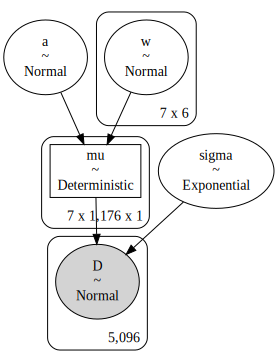

```python
# > Fails after taking more than 100 GB of RAM (that's the most I have tried).

# with m_cn_multi:
#     prior_pc_m_cn_multi = pm.sample_prior_predictive(random_seed=RANDOM_SEED)
#     trace_m_cn_multi = pm.sample(
#         draws=3000,
#         tune=3000,
#         chains=2,
#         cores=1,
#         init="advi",
#         n_init=600000,
#         random_seed=RANDOM_SEED,
#     )
#     post_pc_m_cn_multi = pm.sample_posterior_predictive(
#         trace_m_cn_multi, random_seed=RANDOM_SEED
#     )
#
# az_cn_multi = az.from_pymc3(
#     model=m_cn_multi,
#     trace=trace_m_cn_multi,
#     posterior_predictive=post_pc_m_cn_multi,
#     prior=prior_pc_m_cn_multi,
# )
```

---

```python
notebook_toc = time()
print(f"execution time: {(notebook_toc - notebook_tic) / 60:.2f} minutes")
```

    execution time: 4.61 minutes

```python
%load_ext watermark
%watermark -d -u -v -iv -b -h -m
```

    Last updated: 2021-01-11

    Python implementation: CPython
    Python version       : 3.8.6
    IPython version      : 7.19.0

    Compiler    : GCC 9.3.0
    OS          : Linux
    Release     : 3.10.0-1062.el7.x86_64
    Machine     : x86_64
    Processor   : x86_64
    CPU cores   : 28
    Architecture: 64bit

    Hostname: compute-e-16-233.o2.rc.hms.harvard.edu

    Git branch: subset-data

    seaborn   : 0.11.1
    pandas    : 1.2.0
    plotnine  : 0.7.1
    pymc3     : 3.9.3
    arviz     : 0.10.0
    matplotlib: 3.3.3
    numpy     : 1.19.5
    theano    : 1.0.5
